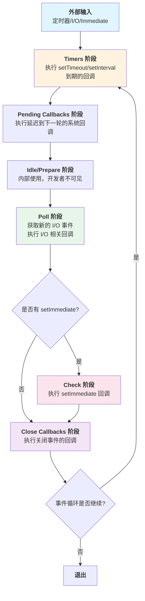

# Node.js 完整基础知识指南

> **版本**：v1.0.0  
> **更新日期**：2026-06-16  
> **适用人群**：前端开发者、全栈工程师、Node.js 初学者及进阶者  
> **目标**：从零基础到生产级应用开发的完整学习路径

---

## 目录

- [第1章：Node.js 概述](#第1章nodejs-概述)
- [第2章：Node.js 架构与运行原理](#第2章nodejs-架构与运行原理)
- [第3章：模块系统](#第3章模块系统)
- [第4章：异步编程模式](#第4章异步编程模式)
- [第5章：文件系统操作（fs 模块）](#第5章文件系统操作fs-模块)
- [第6章：HTTP 服务开发（http 模块）](#第6章http-服务开发http-模块)
- [第7章：Express/Koa 框架实战](#第7章expresskoa-框架实战)
- [第8章：数据库操作](#第8章数据库操作)
- [第9章：Stream 流式处理](#第9章stream-流式处理)
- [第10章：网络通信进阶](#第10章网络通信进阶)
- [第11章：安全与鉴权](#第11章安全与鉴权)
- [第12章：性能优化与监控](#第12章性能优化与监控)
- [第13章：测试与工程化](#第13章测试与工程化)
- [第14章：部署与运维](#第14章部署与运维)
- [附录A：Node.js 常用模块速查表](#附录anodejs-常用模块速查表)
- [附录B：综合实战案例 — BFF 服务搭建](#附录b综合实战案例--bff-服务搭建)

---

# 第1章：Node.js 概述

## 📚 本章学习目标

- 理解 **Node.js 是什么** 以及它的核心设计理念
- 掌握 **事件驱动（Event-Driven）** 和 **非阻塞 I/O（Non-blocking I/O）** 的概念
- 明确 Node.js 与浏览器 JavaScript 的区别
- 了解 Node.js 的典型应用场景
- 理解为什么选择 Node.js 作为后端技术栈
- 掌握 **CommonJS** 与 **ES Modules（ESM）** 两种模块系统的区别

---

## 1.1 什么是 Node.js

### 定义

**Node.js** 是一个基于 Chrome V8 引擎的 **JavaScript 运行时环境（Runtime Environment）**，它让 JavaScript 能够脱离浏览器在服务器端运行。Node.js 由 Ryan Dahl 于 2009 年创建，现由 Node.js 基金会维护。

### 核心特性

```javascript
// 示例：展示 Node.js 的基本特性
// 特性1：JavaScript 在服务器端运行
const http = require('http'); // 使用内置 HTTP 模块

// 创建一个简单的 HTTP 服务器
const server = http.createServer((req, res) => {
    // 回调函数处理请求
    res.writeHead(200, { 'Content-Type': 'text/plain; charset=utf-8' });
    res.end('Hello, Node.js! 你好，Node.js！');
});

// 监听端口 3000
server.listen(3000, () => {
    console.log('服务器运行在 http://localhost:3000');
});
```

### 关键特点总结

| 特性 | 说明 |
|------|------|
| **V8 引擎** | 使用 Google Chrome 的 V8 引擎执行 JavaScript，性能优异 |
| **事件驱动** | 基于 Event Loop（事件循环）机制处理并发请求 |
| **非阻塞 I/O** | 所有 I/O 操作都是异步的，不会阻塞主线程 |
| **单线程** | 主线程是单线程的，但通过 libuv 实现多线程 I/O |
| **跨平台** | 可运行于 Windows、macOS、Linux 等操作系统 |
| **丰富的生态** | npm（Node Package Manager）拥有超过 200 万个包 |

---

## 1.2 设计哲学：事件驱动与非阻塞 I/O

### 1.2.1 事件驱动模型（Event-Driven Model）

**事件驱动编程** 是一种编程范式，程序的流程由外部事件（如用户点击、网络请求、文件读写完成等）决定。

```javascript
// 示例：事件驱动的基本概念
const EventEmitter = require('events');

// 创建事件发射器实例
class MyEmitter extends EventEmitter {}

const myEmitter = new MyEmitter();

// 注册事件监听器（订阅者）
myEmitter.on('event', () => {
    console.log('事件触发了！'); // 当 'event' 事件被触发时执行
});

// 触发事件（发布者）
myEmitter.emit('event'); // 输出：事件触发了！
```

### 1.2.2 非阻塞 I/O（Non-blocking I/O）

**非阻塞 I/O** 指的是程序在发起 I/O 操作（如读取文件、网络请求）时不会等待操作完成，而是立即继续执行后续代码。当 I/O 操作完成后，通过回调函数、Promise 或 async/await 处理结果。

```javascript
const fs = require('fs');

console.log('开始读取文件...');

// 非阻塞方式：异步读取文件（推荐）
fs.readFile('./example.txt', 'utf-8', (err, data) => {
    if (err) {
        console.error('读取文件出错:', err);
        return;
    }
    console.log('文件内容:', data); // 文件读取完成后执行
});

console.log('继续执行其他代码...'); // 这行代码会先执行

/* 
输出顺序：
开始读取文件...
继续执行其他代码...
文件内容: ...（稍后输出）
*/
```

### 1.2.3 阻塞 vs 非阻塞对比

```javascript
const fs = require('fs');

// ❌ 阻塞方式：同步读取文件（不推荐用于高并发场景）
try {
    const data = fs.readFileSync('./example.txt', 'utf-8');
    console.log('同步读取完成:', data);
} catch (err) {
    console.error('同步读取错误:', err);
}

// ✅ 非阻塞方式：异步读取文件（推荐）
fs.readFile('./example.txt', 'utf-8', (err, data) => {
    if (err) {
        console.error('异步读取错误:', err);
        return;
    }
    console.log('异步读取完成:', data);
});
```

**对比表格：**

| 特性 | 阻塞 I/O | 非阻塞 I/O |
|------|----------|------------|
| **执行方式** | 等待操作完成后才继续 | 立即返回，通过回调处理结果 |
| **性能影响** | 阻塞主线程，吞吐量低 | 不阻塞主线程，支持高并发 |
| **适用场景** | 脚本工具、配置加载 | Web 服务器、API 服务 |
| **函数命名** | 通常带 `Sync` 后缀 | 默认为异步版本 |

---

## 1.3 Node.js 与浏览器 JavaScript 的区别

虽然两者都使用 JavaScript 语言，但在运行环境和 API 上存在显著差异：

### 对比表格

| 特性 | 浏览器 JavaScript | Node.js |
|------|-------------------|---------|
| **运行环境** | 浏览器（Chrome、Firefox 等） | 服务器/命令行 |
| **DOM/BOM API** | ✅ 支持（document, window） | ❌ 不支持 |
| **文件系统访问** | ❌ 受限（沙盒限制） | ✅ 完全支持（fs 模块） |
| **网络功能** | 受同源策略限制 | 无限制（http/net 模块） |
| **模块系统** | ES Modules（逐步普及） | CommonJS + ES Modules |
| **全局对象** | `window`, `document` | `global`, `process` |
| **this 指向** | 全局 window | 空对象 `{}` 或 module.exports |

```javascript
// 浏览器环境中的代码
console.log(this); // 输出：Window { ... }

// Node.js 环境中的代码
console.log(this); // 输出：{} （空对象）

// Node.js 中访问全局变量
console.log(global); // 类似浏览器的 window 对象
console.log(process); // 进程信息对象
console.log(__dirname); // 当前文件所在目录
console.log(__filename); // 当前文件的完整路径
```

---

## 1.4 应用场景

### 1.4.1 典型应用场景

#### 1️⃣ Web 服务器 / API 服务

Node.js 最核心的应用场景，特别适合构建 RESTful API 和 GraphQL API。

```javascript
// 简单的 RESTful API 示例
const http = require('http');
const url = require('url');

const server = http.createServer((req, res) => {
    const parsedUrl = url.parse(req.url, true);
    const pathname = parsedUrl.pathname;
    const method = req.method;

    // 设置响应头（允许跨域）
    res.setHeader('Access-Control-Allow-Origin', '*');
    res.setHeader('Content-Type', 'application/json; charset=utf-8');

    // 简单路由实现
    if (pathname === '/api/users' && method === 'GET') {
        // 返回用户列表
        res.end(JSON.stringify({
            code: 200,
            data: [
                { id: 1, name: '张三', email: 'zhangsan@example.com' },
                { id: 2, name: '李四', email: 'lisi@example.com' }
            ],
            message: '获取成功'
        }));
    } else if (pathname === '/api/users' && method === 'POST') {
        // 创建用户（需要解析请求体）
        let body = '';
        req.on('data', chunk => body += chunk);
        req.on('end', () => {
            const userData = JSON.parse(body);
            res.end(JSON.stringify({
                code: 201,
                data: { id: Date.now(), ...userData },
                message: '创建成功'
            }));
        });
    } else {
        // 404 处理
        res.statusCode = 404;
        res.end(JSON.stringify({ code: 404, message: '接口不存在' }));
    }
});

server.listen(3000, () => {
    console.log('API 服务器启动成功: http://localhost:3000');
});
```

#### 2️⃣ 实时通信应用（WebSocket、聊天室）

```javascript
// WebSocket 聊天服务示例（使用 ws 库）
const WebSocket = require('ws');
const wss = new WebSocket.Server({ port: 8080 });

// 存储所有连接的客户端
const clients = new Set();

wss.on('connection', (ws) => {
    console.log('新客户端连接');
    clients.add(ws); // 将客户端添加到集合

    // 接收消息
    ws.on('message', (message) => {
        console.log('收到消息:', message.toString());
        
        // 广播消息给所有客户端
        clients.forEach(client => {
            if (client.readyState === WebSocket.OPEN) {
                client.send(`[广播] ${message}`);
            }
        });
    });

    // 连接关闭
    ws.on('close', () => {
        console.log('客户端断开连接');
        clients.delete(ws); // 从集合中移除
    });
});
```

#### 3️⃣ 构建工具和脚本

```javascript
// 文件批量处理脚本示例
const fs = require('fs');
const path = require('path');

// 批量重命名文件
function batchRename(dirPath, prefix) {
    // Step 1: 读取目录下所有文件
    const files = fs.readdirSync(dirPath);

    files.forEach((file, index) => {
        const oldPath = path.join(dirPath, file);
        const ext = path.extname(file); // 获取文件扩展名
        const newName = `${prefix}_${String(index + 1).padStart(3, '0')}${ext}`;
        const newPath = path.join(dirPath, newName);

        // Step 2: 重命名文件
        fs.renameSync(oldPath, newPath);
        console.log(`${file} -> ${newName}`);
    });

    console.log(`\n共处理 ${files.length} 个文件`);
}

// 使用示例
batchRename('./images', 'photo');
```

#### 4️⃣ BFF 层（Backend for Frontend）

BFF 是一种架构模式，Node.js 作为中间层聚合多个后端服务的数据，为前端提供统一 API。

```javascript
// BFF 层示例：聚合多个微服务数据
const http = require('http');
const https = require('https');

// 模拟调用用户服务
function fetchUserService(userId) {
    return new Promise((resolve, reject) => {
        https.get(`https://api.userservice.com/users/${userId}`, (res) => {
            let data = '';
            res.on('data', chunk => data += chunk);
            res.on('end', () => resolve(JSON.parse(data)));
        }).on('error', reject);
    });
}

// 模拟调用订单服务
function fetchOrderService(userId) {
    return new Promise((resolve, reject) => {
        https.get(`https://api.orderservice.com/orders?userId=${userId}`, (res) => {
            let data = '';
            res.on('data', chunk => data += chunk);
            res.on('end', () => resolve(JSON.parse(data)));
        }).on('error', reject);
    });
}

// BFF 服务器：聚合数据返回给前端
const server = http.createServer(async (req, res) => {
    const userId = '123'; // 实际应从 token 或 session 获取

    try {
        // 并行请求多个服务
        const [userInfo, orders] = await Promise.all([
            fetchUserService(userId),
            fetchOrderService(userId)
        ]);

        // 聚合数据返回
        res.writeHead(200, { 'Content-Type': 'application/json' });
        res.end(JSON.stringify({
            user: userInfo,
            orders: orders,
            recommended: [] // 还可以加入推荐服务等
        }));
    } catch (error) {
        res.writeHead(500, { 'Content-Type': 'application/json' });
        res.end(JSON.stringify({ error: '服务暂时不可用' }));
    }
});

server.listen(4000, () => console.log('BFF 服务启动: http://localhost:4000'));
```

### 1.4.2 为什么选择 Node.js？

#### ✅ 优势

1. **高性能**
   - V8 引擎持续优化，执行速度快
   - 非阻塞 I/O 模型适合 I/O 密集型任务

2. **前后端语言统一**
   - 降低学习成本
   - 代码复用（如类型定义、验证逻辑、工具函数）
   - 团队协作更高效

3. **丰富的生态系统**
   - npm 拥有海量开源包
   - 几乎任何需求都能找到解决方案

4. **开发效率高**
   - JavaScript 动态特性，开发快速
   - JSON 天然数据格式，无需转换
   - 热更新提升开发体验

5. **社区活跃**
   - 大量教程、文档、最佳实践
   - 持续迭代更新

#### ⚠️ 注意事项

1. **不适合 CPU 密集型任务**
   - 单线程模型导致长时间计算会阻塞 Event Loop
   - 解决方案：Worker Threads、子进程、或使用其他语言编写服务

2. **回调地狱风险**
   - 多层嵌套回调难以维护
   - 解决方案：async/await、Promise

3. **相对较新的技术栈**
   - 部分企业对稳定性有顾虑
   - 但已被 Netflix、PayPal、LinkedIn 等大厂验证

---

## 1.5 CommonJS vs ES Modules

Node.js 支持两种模块系统：**CommonJS（CJS）** 和 **ES Modules（ESM）**。

### 1.5.1 CommonJS 规范

CommonJS 是 Node.js 原生的模块系统，使用 `require()` 导入和 `module.exports` 导出。

```javascript
// ===== math.js（导出模块）=====
// 方式一：使用 module.exports 导出单个对象
module.exports = {
    add: (a, b) => a + b,
    subtract: (a, b) => a - b,
    multiply: (a, b) => a * b,
    divide: (a, b) => b !== 0 ? a / b : Error('除数不能为零')
};

// 方式二：使用 exports 导出（exports 是 module.exports 的引用）
// exports.add = (a, b) => a + b;
// exports.subtract = (a, b) => a - b;

// ===== main.js（导入模块）=====
const math = require('./math'); // 导入整个模块

// 使用模块中的方法
console.log(math.add(10, 20));      // 输出：30
console.log(math.subtract(10, 5));  // 输出：5

// 解构导入特定方法
const { add, multiply } = require('./math');
console.log(add(3, 7));       // 输出：10
console.log(multiply(4, 5));  // 输出：20
```

### 1.5.2 ES Modules 规范

ES Modules 是 ECMAScript 标准化的模块系统，使用 `import/export` 语法。

```javascript
// ===== utils.mjs（ES Module 文件扩展名为 .mjs 或设置 "type": "module"）=====

// 命名导出（Named Exports）
export const greet = (name) => `你好，${name}！`;

export const formatDate = (date) => {
    const d = new Date(date);
    return `${d.getFullYear()}-${String(d.getMonth() + 1).padStart(2, '0')}-${String(d.getDate()).padStart(2, '0')}`;
};

// 默认导出（Default Export）
export default class Calculator {
    add(a, b) { return a + b; }
    subtract(a, b) { return a - b; }
}

// ===== app.mjs（导入 ES Module）=====

// 导入默认导出
import Calculator from './utils.mjs';

// 导入命名导出（可按需导入）
import { greet, formatDate } from './utils.mjs';

// 使用导入的功能
const calc = new Calculator();
console.log(calc.add(15, 25));              // 输出：40
console.log(greet('世界'));                  // 输出：你好，世界！
console.log(formatDate(new Date()));         // 输出当前日期

// 命名空间导入（导入所有导出）
import * as utils from './utils.mjs';
console.log(utils.greet('Node.js'));         // 输出：你好，Node.js！
```

### 1.5.3 CommonJS vs ESM 对比

| 特性 | CommonJS (CJS) | ES Modules (ESM) |
|------|----------------|------------------|
| **关键字** | `require` / `module.exports` | `import` / `export` |
| **加载时机** | **运行时**加载 | **编译时**静态分析 |
| **值拷贝** | 导出值的拷贝 | 导出值的**实时绑定**（live binding） |
| **this 指向** | 指向当前模块 | `undefined` |
| **顶层 await** | ❌ 不支持 | ✅ 支持 |
| **Tree Shaking** | ❌ 不支持 | ✅ 支持（打包工具优化） |
| **循环依赖** | 获取未完成的副本 | 获取已导出的绑定引用 |
| **文件扩展名** | `.js` | `.mjs` 或 `.js`（package.json 配置 `"type": "module"`） |

```javascript
// 循环依赖演示（CJS vs ESM 差异）

// ===== CJS 循环依赖 =====
// a.js
console.log('a 开始加载');
const b = require('./b');
console.log('a 加载完成', b.done); // b.done 为 undefined（因为 b 未完全加载）
module.exports = { done: true };

// b.js
console.log('b 开始加载');
const a = require('./a');
console.log('b 加载完成', a.done); // a.done 也为 undefined
module.exports = { done: true };

/*
输出：
a 开始加载
b 开始加载
b 加载完成 undefined
a 加载完成 undefined
*/

// ===== ESM 循环依赖 =====
// a.mjs
console.log('a 开始加载');
import { done as bDone } from './b.mjs';
export const done = true;
console.log('a 加载完成', bDone); // bDone 可能是 undefined 或 true（取决于执行时机）

// b.mjs
console.log('b 开始加载');
import { done as aDone } from './a.mjs';
export const done = true;
console.log('b 加载完成', aDone);
```

### 1.5.4 如何选择模块系统？

```javascript
// 项目根目录的 package.json 配置
{
    "name": "my-nodejs-project",
    "version": "1.0.0",
    
    // 方式一：设置为 ESM 模式（推荐新项目）
    "type": "module", 
    
    // 方式二：保持默认 CJS 模式（传统项目）
    // 不设置 type 字段，或显式设置 "type": "commonjs"
    
    // 混合使用：在 CJS 项目中使用 ESM
    // 可以动态 import() 来加载 ESM 模块
}
```

**选型建议：**

- **新项目** → 推荐 **ES Modules**（现代标准、更好的静态分析、Tree Shaking）
- **旧项目维护** → 保持 **CommonJS**（避免迁移成本）
- **库开发** → 提供 **双格式支持**（同时发布 CJS 和 ESM 版本）

---

## 本章要点速查

### 核心概念

- **Node.js**：基于 V8 引擎的服务器端 JavaScript 运行时
- **事件驱动**：基于事件循环机制处理异步操作
- **非阻塞 I/O**：I/O 操作不阻塞主线程，通过回调/Promise/async-await 处理结果
- **单线程**：主线程单线程，libuv 线程池处理 I/O

### 关键区别

| 场景 | 浏览器 JS | Node.js |
|------|-----------|---------|
| 运行环境 | 浏览器 | 服务器/终端 |
| 全局对象 | `window` | `global`/`process` |
| DOM 访问 | ✅ | ❌ |
| 文件系统 | ❌ | ✅ |

### 模块系统对比

| 特性 | CommonJS | ES Modules |
|------|----------|-------------|
| 语法 | `require/exports` | `import/export` |
| 加载 | 运行时 | 编译时静态分析 |
| 适用 | 传统项目 | 新项目/库开发 |

### 应用场景速查

- ✅ Web API 服务、实时通信、BFF 层、构建工具
- ⚠️ 避免 CPU 密集型计算（使用 Worker Threads 或其他方案）

---

# 第2章：Node.js 架构与运行原理

## 📚 本章学习目标

- 深入理解 **V8 引擎** 如何集成到 Node.js 中
- 掌握 **libuv 事件循环（Event Loop）** 的完整工作流程和各阶段详解
- 理解 **单线程模型** 的优势与局限，以及 **Worker Threads** 的使用场景
- 学会使用 **child_process** 和 **cluster** 进行进程管理
- 了解 Node.js 的 **内存管理** 机制和垃圾回收策略

---

## 2.1 整体架构概览

Node.js 的架构可以分为以下几层：

```
┌─────────────────────────────────────┐
│           Node.js APIs              │  ← JavaScript 核心模块（fs, http, path 等）
├─────────────────────────────────────┤
│           Node.js Bindings          │  ← C++ 绑定层（连接 JS 和 C++）
├─────────────────────────────────────┤
│             V8 Engine               │  ← Google V8 JavaScript 引擎
├─────────────────┬───────────────────┤
│     libuv       │    c-ares         │  ← 异步 I/O 库 / DNS 解析
│  (Event Loop)   │    http parser    │  ← HTTP 解析器
│                 │    OpenSSL etc.   │  ← 加密库等
└─────────────────┴───────────────────┘
```

### 各层职责说明

| 层级 | 技术组件 | 职责描述 |
|------|----------|----------|
| **应用层** | JavaScript 代码 | 开发者编写的业务逻辑 |
| **Node.js API 层** | 核心模块 | 提供文件系统、网络、路径等高级 API |
| **Binding 层** | C++ 绑定 | 将 JavaScript 调用桥接到底层 C/C++ 库 |
| **V8 引擎层** | V8 Engine | 解析和执行 JavaScript 代码 |
| **底层支撑** | libuv/c-ares/OpenSSL | 提供异步 I/O、DNS、加密等底层能力 |

---

## 2.2 V8 引擎集成

### 2.2.1 V8 引擎简介

**V8** 是 Google 开源的高性能 JavaScript 和 WebAssembly 引擎，用于 Chrome 浏览器和 Node.js。

```javascript
// V8 引擎的关键特性演示

// 特性1：即时编译（JIT - Just-In-Time Compilation）
// V8 会将热点的 JavaScript 代码编译成机器码执行
function fibonacci(n) {
    if (n <= 1) return n;
    return fibonacci(n - 1) + fibonacci(n - 2);
}

// 特性2：隐藏类（Hidden Classes）优化对象属性访问
class Point {
    constructor(x, y) {
        this.x = x;
        this.y = y;
    }
}

// 创建大量相同结构的对象（V8 会优化）
const points = Array.from({ length: 10000 }, (_, i) => new Point(i, i * 2));

// 特性3：内联缓存（Inline Caching）加速方法调用
points.forEach(point => point.x * 2); // V8 会缓存属性访问路径
```

### 2.2.2 Node.js 如何使用 V8

```javascript
// 查看 V8 引擎信息
console.log(process.versions.v8);     // 输出版本号，如 "9.4.146.24-node.26"
console.log(process.arch);            // 输出 CPU 架构，如 "x64"
console.log(process.platform);        // 输出平台，如 "linux"

// V8 内存限制相关配置
// 默认堆内存限制：约 1.5GB（64位系统）或 ~700MB（32位系统）
console.log(`堆内存大小限制: ${process.memoryUsage().heapUsed} bytes`);

// 通过命令行参数调整 V8 内存限制
// node --max-old-space-size=4096 app.js  // 设置最大堆内存为 4GB
```

### 2.2.3 V8 垃圾回收机制

V8 采用 **分代垃圾回收（Generational GC）** 策略：

```javascript
// V8 GC 分代示意
/*
┌─────────────────────────────────────┐
│           V8 Heap                   │
├──────────────────┬──────────────────┤
│   New Space      │    Old Space     │
│   (新生代)        │    (老生代)       │
│   ~2-8MB         │    无固定大小     │
│                  │                  │
│ Scavenge 算法   │ Mark-Sweep      │
│ (快速回收)       │ Mark-Compact    │
│ (复制算法)       │ (标记清除/整理)  │
└──────────────────┴──────────────────┘
*/

// 监控内存使用情况
function monitorMemory() {
    const used = process.memoryUsage(); // 获取当前内存使用情况
    
    console.log('内存使用报告:');
    console.log(`  RSS（常驻内存集）: ${(used.rss / 1024 / 1024).toFixed(2)} MB`);
    console.log(`  Heap Total（堆总量）: ${(used.heapTotal / 1024 / 1024).toFixed(2)} MB`);
    console.log(`  Heap Used（堆已用）: ${(used.heapUsed / 1024 / 1024).toFixed(2)} MB`);
    console.log(`  External（外部内存）: ${(used.external / 1024 / 1024).toFixed(2)} MB`);
    
    return used;
}

// 定期监控
setInterval(monitorMemory, 5000); // 每5秒打印一次
```

---

## 2.3 libuv 事件循环架构

### 2.3.1 什么是事件循环（Event Loop）

**事件循环** 是 Node.js 的核心机制，它使得 Node.js 能够在单线程环境下处理大量并发操作。事件循环负责协调 JavaScript 代码的执行、回调函数的处理以及 I/O 操作的调度。

### 2.3.2 事件循环各阶段详解

以下是 Node.js 事件循环的完整流程图：



#### 各阶段详细说明

```javascript
/**
 * 事件循环六阶段详解
 */

// ==================== 阶段1：Timers（定时器阶段）====================
// 本阶段执行 setTimeout() 和 setInterval() 到期的回调
console.log('1. 脚本开始执行');

setTimeout(() => {
    console.log('2. setTimeout (0ms) 回调 - Timers 阶段');
}, 0);

setTimeout(() => {
    console.log('3. setTimeout (100ms) 回调 - Timers 阶段');
}, 100);

// ==================== 阶段2：Pending Callbacks（待定回调阶段）====================
// 执行某些系统操作的延迟回调（如 TCP 错误类型）
// 通常开发者不需要关注此阶段

// ==================== 阶段3：Idle/Prepare（空闲/准备阶段）====================
// 仅内部使用，Node.js 内部调度使用

// ==================== 阶段4：Poll（轮询阶段）【最重要】====================
// 获取新的 I/O 事件；执行 I/O 相关回调（除了 timers、close、setImmediate 之外）
// Node.js 会在适当的时候在此处阻塞等待

const fs = require('fs');

// 文件 I/O 回调会在 Poll 阶段执行
fs.readFile(__filename, () => {
    console.log('5. readFile 回调 - Poll 阶段');
    
    // Poll 阶段的嵌套定时器
    setTimeout(() => {
        console.log('7. readFile 内部的 setTimeout - 下一轮 Timers');
    }, 0);
    
    // Poll 阶段的 setImmediate
    setImmediate(() => {
        console.log('8. readFile 内部的 setImmediate - Check 阶段');
    });
});

// ==================== 阶段5：Check（检查阶段）====================
// 执行 setImmediate() 注册的回调
setImmediate(() => {
    console.log('4. setImmediate 回调 - Check 阶段');
});

// ==================== 阶段6：Close Callbacks（关闭回调阶段）====================
// 执行一些关闭事件的回调，如 socket.on('close', ...)
const net = require('net');

const server = net.createServer(); // 创建 TCP 服务器
server.listen(() => {
    server.close(); // 关闭服务器，触发 close 事件
});

server.on('close', () => {
    console.log('6. 服务器 close 事件 - Close Callbacks 阶段');
});

console.log('1. 脚本同步代码执行完毕，进入事件循环');

/*
实际输出顺序：
1. 脚本开始执行
1. 脚本同步代码执行完毕，进入事件循环
4. setImmediate 回调 - Check 阶段（同一轮循环）
2. setTimeout (0ms) 回调 - Timers 阶段（可能在不同轮次）
6. 服务器 close 事件 - Close Callbacks 阶段
5. readFile 回调 - Poll 阶段
8. readFile 内部的 setImmediate - Check 阶段
7. readFile 内部的 setTimeout - 下一轮 Timers 阶段
3. setTimeout (100ms) 回调 - Timers 阶段
*/
```

### 2.3.3 微任务队列（Microtask Queue）

除了上述六个宏任务阶段外，还有两个**微任务队列**：

```javascript
/**
 * 微任务队列（Microtask Queue）
 * 包括：Promise.then/catch/finally、queueMicrotask、process.nextTick
 * 
 * 重要规则：每个宏任务阶段结束后，都会清空所有微任务队列
 */

console.log('=== 同步代码开始 ===');

// Promise 微任务（属于 Microtask Queue）
Promise.resolve()
    .then(() => console.log('1. Promise.then (微任务)'));

// process.nextTick 微任务（属于 Next Tick Queue，优先级最高）
process.nextTick(() => console.log('2. process.nextTick (Next Tick Queue)'));

// queueMicrotask 微任务
queueMicrotask(() => console.log('3. queueMicrotask (微任务)'));

console.log('=== 同步代码结束 ===');

// 定时器（属于 Timers 阶段的宏任务）
setTimeout(() => {
    console.log('4. setTimeout (宏任务)');
    
    // 宏任务内部的微任务
    Promise.resolve().then(() => console.log('5. 宏任务内的 Promise.then'));
}, 0);

/*
输出顺序：
=== 同步代码开始 ===
=== 同步代码结束 ===
2. process.nextTick (Next Tick Queue)  ← 最高优先级
1. Promise.then (微任务)
3. queueMicrotask (微任务)
4. setTimeout (宏任务)
5. 宏任务内的 Promise.then
*/
```

### 2.3.4 nextTick vs setImmediate vs setTimeout

```javascript
/**
 * 三种延迟执行的对比
 */
console.log('脚本开始');

// 1. process.nextTick - 在同一阶段立即执行（优先级最高）
process.nextTick(() => {
    console.log('nextTick: 在当前操作后立即执行');
});

// 2. setImmediate - 在 Check 阶段执行（当前轮循环的最后一个阶段之前）
setImmediate(() => {
    console.log('setImmediate: 在 I/O 回调后的 Check 阶段执行');
});

// 3. setTimeout(fn, 0) - 在 Timers 阶段执行（至少延迟 1ms）
setTimeout(() => {
    console.log('setTimeout(0): 在 Timers 阶段执行（可能有 1ms 延迟）');
}, 0);

console.log('脚本结束');

/*
输出：
脚本开始
脚本结束
nextTick: 在当前操作后立即执行
setImmediate: 在 I/O 回调后的 Check 阶段执行  ← 通常比 setTimeout(0) 先
setTimeout(0): 在 Timers 阶段执行（可能有 1ms 延迟）

注意：setImmediate 和 setTimeout(0) 的执行顺序取决于事件循环的阶段，
但在 I/O 回调内部，setImmediate 总是先于 setTimeout(0) 执行。
*/
```

---

## 2.4 单线程模型与 Worker Threads

### 2.4.1 单线程模型的本质

Node.js 的"单线程"指的是 **JavaScript 执行的主线程是单线程**，但实际上 Node.js 底层通过 libuv 的线程池实现了多线程 I/O 操作。

```javascript
/**
 * 单线程模型示意图
 * 
 * JavaScript 主线程（单线程）:
 *   ├── 执行同步代码
 *   ├── 处理回调函数
 *   └── 协调事件循环
 * 
 * libuv 线程池（默认4个线程）:
 *   ├── 文件 I/O 操作（fs 模块的异步方法）
 *   ├── DNS 查询
 *   ├── 压缩/解压缩（zlib）
 *   └── 其他 CPU 密集型操作
 */

// 演示：主线程不会被 I/O 阻塞
const crypto = require('crypto');

console.log('开始加密操作...');

// 异步加密（使用 libuv 线程池，不阻塞主线程）
crypto.pbkdf2('password', 'salt', 100000, 512, 'sha256', (err, derivedKey) => {
    if (err) throw err;
    console.log('加密完成:', derivedKey.toString('hex').substring(0, 20) + '...');
});

console.log('主线程继续执行其他任务...');
// 输出：主线程不会被加密操作阻塞
```

### 2.4.2 Worker Threads（工作线程）

当遇到 **CPU 密集型任务**（如图片处理、大数据计算、加密运算）时，可以使用 **Worker Threads** 将任务转移到独立线程执行，避免阻塞主线程的事件循环。

```javascript
/**
 * Worker Threads 使用示例
 * 
 * 场景：斐波那契数列大数计算（CPU 密集型）
 */

// ===== 主线程文件：main.js =====
const { Worker, isMainThread, parentPort, workerData } = require('worker_threads');

if (isMainThread) {
    // 主线程代码
    
    console.log('主线程：开始创建工作线程...');
    
    // 创建工作线程
    const worker = new Worker(__filename, {
        workerData: { n: 45 } // 传递参数给工作线程
    });
    
    // 监听工作线程的消息
    worker.on('message', (result) => {
        console.log(`主线程：收到计算结果 - 斐波那契(${workerData.n}) = ${result}`);
        worker.terminate(); // 终止工作线程
    });
    
    // 监听工作线程的错误
    worker.on('error', (err) => {
        console.error('主线程：工作线程错误:', err.message);
    });
    
    // 监听工作线程退出
    worker.on('exit', (code) => {
        if (code !== 0) {
            console.error(`主线程：工作线程异常退出，退出码 ${code}`);
        } else {
            console.log('主线程：工作线程正常退出');
        }
    });
    
    console.log('主线程：继续执行其他任务（不被阻塞）');
    
} else {
    // 工作线程代码
    
    const { n } = workerData; // 接收主线程传递的参数
    
    console.log(`工作线程：开始计算斐波那契(${n})...`);
    
    // CPU 密集型计算
    function fib(num) {
        if (num <= 1) return num;
        return fib(num - 1) + fib(num - 2);
    }
    
    const result = fib(n);
    
    // 将结果发送回主线程
    parentPort.postMessage(result);
}
```

### 2.4.3 Worker Threads 最佳实践

```javascript
/**
 * Worker Pool（工作线程池）模式
 * 用于管理多个 Worker Thread，提高资源利用率
 */

const { Worker, isMainThread, parentPort, workerData } = require('worker_threads');
const os = require('os');

if (isMainThread) {
    // ===== 主线程：工作线程池管理器 =====
    
    class WorkerPool {
        constructor(workerPath, numberOfWorkers) {
            this.workers = [];
            this.taskQueue = [];
            this.activeWorkers = 0;
            
            // 创建指定数量的工作线程
            for (let i = 0; i < numberOfWorkers; i++) {
                const worker = new Worker(workerPath);
                
                worker.on('message', (result) => {
                    this.activeWorkers--;
                    
                    // 调用任务的回调
                    const task = this.taskQueue.shift();
                    if (task && task.callback) {
                        task.callback(null, result);
                    }
                    
                    // 处理队列中的下一个任务
                    this.processQueue();
                });
                
                this.workers.push(worker);
            }
        }
        
        // 提交任务到线程池
        run(taskData) {
            return new Promise((resolve, reject) => {
                this.taskQueue.push({
                    data: taskData,
                    callback: (err, result) => {
                        if (err) reject(err);
                        else resolve(result);
                    }
                });
                
                this.processQueue();
            });
        }
        
        // 处理任务队列
        processQueue() {
            while (this.activeWorkers < this.workers.length && this.taskQueue.length > 0) {
                const task = this.taskQueue.shift();
                const worker = this.workers[this.activeWorkers];
                
                this.activeWorkers++;
                worker.postMessage(task.data);
            }
        }
        
        // 关闭所有工作线程
        destroy() {
            this.workers.forEach(worker => worker.terminate());
        }
    }
    
    // 使用示例：根据 CPU 核心数创建线程池
    const cpuCount = os.cpus().length;
    const pool = new WorkerPool(__filename, Math.min(cpuCount, 4));
    
    // 提交多个并行任务
    const tasks = [40, 41, 42, 43].map(n => pool.run({ n }));
    
    Promise.all(tasks)
        .then(results => {
            console.log('所有任务完成:', results);
            pool.destroy();
        })
        .catch(console.error);
        
} else {
    // ===== 工作线程：执行具体任务 =====
    
    const { n } = workerData;
    
    function fib(num) {
        if (num <= 1) return num;
        return fib(num - 1) + fib(num - 2);
    }
    
    parentPort.postMessage(fib(n));
}
```

---

## 2.5 进程管理

### 2.5.1 child_process（子进程模块）

`child_process` 模块提供了创建子进程的能力，可以执行系统命令或其他 Node.js 脚本。

```javascript
const { exec, execFile, spawn, fork } = require('child_process');
const path = require('path');

// ==================== 方法1：exec ====================
// 执行 shell 命令，将结果缓冲后传入回调
exec('ls -la', (error, stdout, stderr) => {
    if (error) {
        console.error(`exec 错误: ${error.message}`);
        return;
    }
    if (stderr) {
        console.error(`exec stderr: ${stderr}`);
    }
    console.log(`exec stdout:\n${stdout}`);
});

// 带 options 的 exec
exec(
    'find . -type f -name "*.js"',  // 要执行的命令
    {
        cwd: __dirname,              // 工作目录
        maxBuffer: 1024 * 1024,      // 最大缓冲区大小（1MB）
        timeout: 5000,               // 超时时间（毫秒）
        encoding: 'utf-8'            // 输出编码
    },
    (err, stdout, stderr) => {
        if (!err) console.log('找到的 JS 文件:\n', stdout);
    }
);

// ==================== 方法2：execFile ====================
// 直接执行可执行文件（不经过 shell，更安全）
execFile('node', ['--version'], (error, stdout, stderr) => {
    if (error) throw error;
    console.log('Node 版本:', stdout.trim()); // 输出：v18.x.x
});

// ==================== 方法3：spawn（推荐用于大量数据输出）====================
// 创建子进程，以流的方式处理输出（适用于大量数据）

// 示例：使用 spawn 执行长时间运行的命令
const ls = spawn('ls', ['-lh', '/usr']);

// 以流的方式监听标准输出
ls.stdout.on('data', (data) => {
    console.log(`stdout: ${data}`); // 数据分块到达
});

// 监听标准错误
ls.stderr.on('data', (data) => {
    console.error(`stderr: ${data}`);
});

// 子进程关闭事件
ls.on('close', (code) => {
    console.log(`子进程退出码: ${code}`);
});

// ==================== 方法4：fork（专门用于 Node.js 脚本）====================
// 创建新的 Node.js 进程并建立 IPC 通信通道

if (process.argv[2] !== 'child') {
    // 主进程
    console.log('主进程 PID:', process.pid);
    
    const child = fork(__filename, ['child']); // 启动子进程
    
    // 发送消息给子进程
    child.send({ type: 'greeting', message: '你好，子进程！' });
    
    // 接收子进程的消息
    child.on('message', (msg) => {
        console.log('主进程收到:', msg);
    });
    
    // 子进程退出
    child.on('exit', (code) => {
        console.log(`子进程退出，退出码: ${code}`);
    });
    
} else {
    // 子进程
    console.log('子进程 PID:', process.pid);
    
    // 接收主进程的消息
    process.on('message', (msg) => {
        console.log('子进程收到:', msg);
        
        // 回复主进程
        process.send({
            type: 'response',
            message: '收到！我是子进程',
            pid: process.pid
        });
    });
}
```

### 2.5.2 cluster（集群模块）

`cluster` 模块用于创建共享服务器端口的**子进程集群**，充分利用多核 CPU 性能。

```javascript
/**
 * Cluster 集群示例：创建 HTTP 服务器集群
 * 
 * 架构：
 * ┌─────────────┐
 * │ Master 进程  │ ← 负责管理 Worker 进程
 * ├─────┬───────┤
 * │ W0  │ W1    │ ← Worker 进程（各自独立的事件循环）
 * │     │ W2    │
 * └─────┴───────┘
 */

const cluster = require('cluster');
const http = require('http');
const numCPUs = require('os').cpus().length; // 获取 CPU 核心数

if (cluster.isMaster) {
    // ========== Master 进程（主进程）==========
    
    console.log(`主进程 ${process.pid} 正在运行`);
    console.log(`CPU 核心数: ${numCPUs}`);
    
    // 根据 CPU 核心数创建 Worker 进程
    for (let i = 0; i < numCPUs; i++) {
        cluster.fork(); // 创建 Worker 进程
    }
    
    // 监听 Worker 进程上线事件
    cluster.on('online', (worker) => {
        console.log(`Worker ${worker.process.pid} 已上线`);
    });
    
    // 监听 Worker 进程退出事件
    cluster.on('exit', (worker, code, signal) => {
        console.log(`Worker ${worker.process.pid} 退出（退出码: ${code}, 信号: ${signal}）`);
        
        // 自动重启退出的 Worker（保证服务可用性）
        console.log('正在重启 Worker...');
        cluster.fork();
    });
    
} else {
    // ========== Worker 进程（工作进程）==========
    
    // 每个 Worker 都创建独立的 HTTP 服务器
    // 它们共享相同的端口（由 Master 进程分发请求）
    http.createServer((req, res) => {
        res.writeHead(200);
        res.end(`Hello from Worker ${process.pid}\n`);
    }).listen(3000);
    
    console.log(`Worker ${process.pid} 已启动 HTTP 服务器`);
}
```

### 2.5.3 进程间通信（IPC）

```javascript
/**
 * 进程间通信（Inter-Process Communication）
 * Node.js 支持 JSON 序列化和高级序列化两种方式
 */

const { fork } = require('child_process');

// 主进程
const child = fork('./child-process.js', [], {
    stdio: ['pipe', 'pipe', 'pipe', 'ipc'] // 开启 IPC 通道
});

// 发送 JSON 可序列化的数据
child.send({
    type: 'config',
    database: {
        host: 'localhost',
        port: 3306,
        user: 'root',
        password: 'secret'
    }
});

// 发送句柄（Handle）（高级用法，传递服务器或 socket）
const server = require('http').createServer();
child.send('server', server); // 将 HTTP 服务器句柄发送给子进程

// 接收子进程消息
child.on('message', (msg) => {
    console.log('来自子进程:', msg);
    
    if (msg.type === 'ready') {
        console.log('子进程准备就绪');
    }
});
```

---

## 2.6 内存管理

### 2.6.1 V8 堆内存结构

```javascript
/**
 * V8 堆内存布局
 * 
 * ┌─────────────────────────────────────────┐
 * │              New Space（新生代）          │
 * │  存放短生命周期对象                        │
 * │  大小：2-8MB（可配置）                     │
 * │  回收算法：Scavenge（复制算法）            │
 * │  特点：快速回收，但占用空间翻倍             │
 * ├─────────────────────────────────────────┤
 * │              Old Space（老生代）           │
 * │  存放长生命周期对象或从新生代晋升的对象       │
 * │  回收算法：Mark-Sweep / Mark-Compact      │
 * │  特点：回收速度慢，但空间利用率高            │
 * ├──────────────────┬──────────────────────┤
 * │ Large Object     │ Code/Meta Space      │
 * │ Space（大对象）   │（代码/元数据空间）     │
 * │ > 1MB 的对象     │                      │
 * └──────────────────┴──────────────────────┘
 */

// 查看内存使用详情
function printMemoryUsage(tag = '') {
    const mem = process.memoryUsage();
    
    console.log(`\n${tag ? `[${tag}] ` : ''}内存使用情况:`);
    console.log(`  RSS（常驻内存集）:    ${(mem.rss / 1024 / 1024).toFixed(2)} MB`);
    console.log(`  Heap Total（堆总量）:  ${(mem.heapTotal / 1024 / 1024).toFixed(2)} MB`);
    console.log(`  Heap Used（堆已用）:   ${(mem.heapUsed / 1024 / 1024).toFixed(2)} MB`);
    console.log(`  External（外部内存）:   ${(mem.external / 1024 / 1024).toFixed(2)} MB`);
    console.log(`  ArrayBuffers:         ${(mem.arrayBuffers / 1024 / 1024).toFixed(2)} MB`);
    
    return mem;
}

printMemoryUsage('初始状态');
```

### 2.6.2 垃圾回收策略

```javascript
/**
 * V8 垃圾回收策略详解
 */

// ========== 新生代回收（Scavenge 算法）==========

// 新生代分为两半：From-Space 和 To-Space
// 新对象分配在 From-Space
// 回收时，存活对象复制到 To-Space，然后角色互换

function demonstrateNewSpaceGC() {
    // 创建大量短生命周期对象
    const shortLivedObjects = [];
    
    for (let i = 0; i < 10000; i++) {
        // 这些对象很快就会变成垃圾
        shortLivedObjects.push({ id: i, data: `temp-${i}` });
    }
    
    // 清空引用，这些对象将成为垃圾回收的目标
    shortLivedObjects.length = 0;
    
    // 手动触发 GC（需要在启动时加 --expose-gc 参数）
    if (global.gc) {
        global.gc(); // 强制执行垃圾回收
        console.log('手动触发 GC 完成');
    }
}

// ========== 老生代回收（Mark-Sweep-Compact）==========

// 当对象在新生代存活足够多次（通常经过多次 Scavenge），会被晋升到老生代
// 老生代使用标记-清除-整理算法

function demonstrateOldSpaceGC() {
    // 创建长生命周期的全局对象（模拟老生代对象）
    global.longLivedCache = new Map();
    
    // 持续添加数据（模拟长期使用的缓存）
    setInterval(() => {
        global.longLivedCache.set(Date.now(), {
            timestamp: Date.now(),
            data: new Array(1000).fill('cache-data')
        });
        
        // 限制缓存大小，防止内存泄漏
        if (global.longLivedCache.size > 1000) {
            const firstKey = global.longLivedCache.keys().next().value;
            global.longLivedCache.delete(firstKey);
        }
    }, 1000);
}
```

### 2.6.3 内存泄漏常见场景与排查

```javascript
/**
 * 常见的内存泄漏场景
 */

// ==================== 泄漏场景1：全局变量 ====================
// 未声明的变量会成为全局变量，永远不会被回收
function leakGlobalVariable() {
    // ❌ 错误：忘记使用 var/let/const，leakyVar 变成全局变量
    leakyVar = '这是一个泄漏的全局变量'; // 相当于 global.leakyVar
}

// ✅ 正确做法：始终使用声明语句
function noLeak() {
    const safeVar = '这是局部变量'; // 函数执行完后会被回收
}

// ==================== 泄漏场景2：闭包引用 ====================
function createLeakyClosure() {
    const largeData = new Array(1000000).fill('big-data'); // 大数组
    
    return function() {
        // 闭包引用了 largeData，即使不使用也不会被释放
        console.log('闭包被调用');
        // 如果确实不需要 largeData，应该将其设为 null
        // largeData = null; // ✅ 解决方案
    };
}

// ==================== 泄漏场景3：事件监听器未移除 ====================
const EventEmitter = require('events');

class LeakyServer extends EventEmitter {
    start() {
        // 每次 start 都会新增监听器，但不移除旧的
        this.on('request', this.handleRequest.bind(this));
        // ✅ 应该使用 once() 或在合适时机 removeListener()
    }
    
    handleRequest(req) {
        console.log('处理请求:', req);
    }
}

// ==================== 泄漏场景4：缓存无限制增长 ====================
const cache = new Map();

function getDataWithCache(key) {
    if (cache.has(key)) {
        return cache.get(key); // 命中缓存
    }
    
    const data = fetchDataFromDB(key); // 模拟数据库查询
    cache.set(key, data); // 缓存数据
    
    // ⚠️ 问题：缓存无限增长，没有过期和清理机制
    // ✅ 解决方案：使用 LRU 缓存或设置最大容量
    return data;
}

// ==================== 泄漏场景5：Timer/Interval 未清除 ====================
function leakyTimer() {
    setInterval(() => {
        // 这个 interval 永远不会被清除
        // 即使包含它的对象已经不再使用，回调仍会保留引用
        console.log('定时器执行');
    }, 1000);
    
    // ✅ 解决方案：保存 timer ID，在适当时机 clearInterval(id)
}

// ==================== 内存泄漏检测工具 ====================
function detectMemoryLeak() {
    const usage1 = process.memoryUsage();
    console.log('初始内存:', (usage1.heapUsed / 1024 / 1024).toFixed(2), 'MB');
    
    // 模拟一段时间的操作
    setTimeout(() => {
        const usage2 = process.memoryUsage();
        console.log('操作后内存:', (usage2.heapUsed / 1024 / 1024).toFixed(2), 'MB');
        
        const diff = ((usage2.heapUsed - usage1.heapUsed) / 1024 / 1024).toFixed(2);
        console.log('内存增长:', diff, 'MB');
        
        // 如果内存持续增长且不下降，可能存在泄漏
        if (parseFloat(diff) > 10) {
            console.warn('⚠️ 警告：内存增长过快，请检查是否存在内存泄漏！');
        }
    }, 5000);
}

detectMemoryLeak();
```

---

## 本章要点速查

### 核心架构

| 层级 | 技术 | 作用 |
|------|------|------|
| 应用层 | JavaScript | 业务逻辑 |
| API 层 | Node.js 模块 | 高级抽象 |
| Binding 层 | C++ | JS ↔ C++ 桥接 |
| 引擎层 | V8 | JS 执行引擎 |
| 底层 | libuv | 异步 I/O / 事件循环 |

### 事件循环六阶段

1. **Timers**：`setTimeout/setInterval` 回调
2. **Pending Callbacks**：延迟的系统回调
3. **Idle/Prepare**：内部使用
4. **Poll**：I/O 回调（**核心阶段**）
5. **Check**：`setImmediate` 回调
6. **Close Callbacks**：关闭事件回调

### 进程/线程选择指南

| 场景 | 推荐方案 | 模块 |
|------|----------|------|
| 执行 shell 命令 | 子进程 | `child_process.exec/spawn` |
| 多核利用 | 进程集群 | `cluster` |
| CPU 密集型任务 | 工作线程 | `worker_threads` |
| IPC 通信 | 消息传递 | `process.send/parentPort` |

### 内存管理要点

- **新生代**：Scavenge 算法，存放短期对象
- **老生代**：Mark-Sweep/Compact，存放长期对象
- **常见泄漏**：全局变量、闭包、事件监听器、无限缓存、未清理 Timer
- **诊断工具**：`--inspect`、heap snapshot、clinic.js

---

# 第3章：模块系统

## 📚 本章学习目标

- 深入理解 **CommonJS 规范** 的完整机制（require/module.exports/exports 区别）
- 掌握 **ES Modules** 的特性和使用方式
- 理解模块的**完整加载流程**（解析→加载→编译→链接→执行）
- 掌握**循环依赖问题**及其解决方案
- 熟悉 **Node.js 内置模块** 的分类和使用
- 理解**模块缓存机制**的工作原理

---

## 3.1 CommonJS 规范详解

### 3.1.1 核心概念

CommonJS 是 Node.js 原生的模块规范，采用**运行时加载**方式。

```javascript
/**
 * CommonJS 模块系统核心对象
 *
 * 每个模块内部自动拥有以下变量：
 * - __dirname: 当前模块所在目录的绝对路径
 * - __filename: 当前模块文件的绝对路径
 * - exports: module.exports 的引用（导出快捷方式）
 * - module: 当前模块的信息对象
 * - require(): 模块加载函数
 * - parent: 父模块（require 该模块的模块）
 * - children: 子模块（该模块 require 的模块列表）
 */

// 查看模块信息
console.log('模块目录:', __dirname);
console.log('模块文件:', __filename);
console.log('模块 ID:', module.id);           // 通常等于 __filename
console.log('是否为主模块:', module.loaded);    // 是否已完成加载
console.log('父模块:', module.parent);         // 谁 require 了该模块
console.log('子模块:', module.children);       // 该模块 require 了哪些模块
```

### 3.1.2 module.exports vs exports

这是初学者最容易混淆的概念，必须彻底理解！

```javascript
/**
 * module.exports 与 exports 的关系
 *
 * 关键点：
 * 1. exports 是 module.exports 的初始引用（类似 const exports = module.exports）
 * 2. require() 返回的是 module.exports，不是 exports
 * 3. 如果重新赋值 exports，会断开与 module.exports 的联系
 */

// ===== 方式1：使用 module.exports（推荐）=====

// calculator.js
module.exports = {
    // 导出一个对象字面量
    name: '计算器模块',
    
    // 导出方法
    add(a, b) {
        return a + b;
    },
    
    subtract(a, b) {
        return a - b;
    },
    
    // 导出属性
    version: '1.0.0'
};

// main.js
const calc = require('./calculator');
console.log(calc.name);        // 输出：计算器模块
console.log(calc.add(5, 3));   // 输出：8


// ===== 方式2：使用 exports（便捷语法）=====

// utils.js
// ✅ 正确：向 exports 对象添加属性
exports.greet = function(name) {
    return `你好，${name}！`;
};

exports.getTime = function() {
    return new Date().toLocaleString('zh-CN');
};

// ❌ 错误：不能重新赋值 exports（会导致断开引用）
// exports = { value: 123 }; // 这样做无效！require() 得到的是空对象 {}


// ===== 方式3：混合使用（理解原理）=====

// mixed.js
// 初始状态：exports 和 module.exports 指向同一个对象 {}
console.log(exports === module.exports); // true

// 向 exports 添加属性（实际上是在修改 module.exports 的属性）
exports.prop1 = 'value1';

// 直接修改 module.exports（也有效果）
module.exports.prop2 = 'value2';

console.log(exports);           // { prop1: 'value1', prop2: 'value2' }
console.log(module.exports);    // { prop1: 'value1', prop2: 'value2' }

// ⚠️ 危险：重新赋值 module.exports
module.exports = {
    newProp: 'newValue'
};
// 此时 exports 仍然指向旧对象，而 module.exports 指向新对象
// require() 返回的是 module.exports（新对象），exports 的修改无效


// ===== 方式4：导出类/构造函数 =====

// Person.js
class Person {
    constructor(name, age) {
        this.name = name;
        this.age = age;
    }
    
    introduce() {
        return `我叫${this.name}，今年${this.age}岁`;
    }
}

// 导出类本身（不是实例）
module.exports = Person;

// app.js
const Person = require('./Person');
const p = new Person('张三', 25);
console.log(p.introduce()); // 输出：我叫张三，今年25岁


// ===== 方式5：导出单个值/函数 =====

// getConfig.js
module.exports = {
    dbHost: 'localhost',
    dbPort: 3306,
    dbName: 'myapp',
    redisUrl: 'redis://localhost:6379'
};

// getDate.js
module.exports = function() {
    return new Date().toISOString();
};

// 常量导出
module.exports.PI = 3.141592653589793;
module.exports.E = 2.718281828459045;
```

### 3.1.3 require() 加载机制

```javascript
/**
 * require(X) 的完整解析流程
 *
 * 步骤1：判断 X 是否为核心模块（如 fs, http, path）
 *   → 是：直接返回核心模块
 *
 * 步骤2：判断 X 是否以 ./ ../ / 开头（相对/绝对路径）
 *   → 是：按照路径查找文件
 *     - 尝试 X（精确匹配）
 *     - 尝试 X.js
 *     - 尝试 X.json
 *     - 尝试 X.node（C++ addon）
 *     - 尝试 X/index.js
 *     - 尝试 X/index.json
 *
 * 步骤3：X 是裸模块名（如 'lodash', 'express'）
 *   → 从 node_modules 目录查找
 *   - 当前目录/node_modules/X
 *   - 父目录/node_modules/X
 *   - ...直到根目录
 */

// 示例：各种 require 用法

// 1. 加载核心模块（无需路径）
const fs = require('fs');           // 文件系统模块
const path = require('path');       // 路径处理模块
const http = require('http');       // HTTP 模块
const events = require('events');   // 事件模块

// 2. 加载本地文件模块（相对路径）
const myModule = require('./myModule');         // 加载 ./myModule.js
const config = require('../config/app.config'); // 加载上级目录的配置
const utils = require('./utils/index');         // 显式指定 index 文件

// 3. 加载 JSON 文件
const packageConfig = require('./package.json'); // 自动解析 JSON
const settings = require('./settings.json');

// 4. 加载第三方模块（从 node_modules 查找）
const _ = require('lodash');       // 工具库
const express = require('express'); // Web 框架
const axios = require('axios');     // HTTP 客户端

// 5. 条件加载（动态 require）
let dbModule;
if (process.env.NODE_ENV === 'test') {
    dbModule = require('./db/mock'); // 测试环境使用 mock
} else {
    dbModule = require('./db/real'); // 生产环境使用真实数据库
}
```

---

## 3.2 ES Modules（ESM）

### 3.2.1 启用 ESM

Node.js 从 v12 起稳定支持 ES Modules，有两种启用方式：

```javascript
/**
 * 方式一：使用 .mjs 扩展名（推荐）
 * 文件扩展名为 .mjs 时，自动作为 ESM 处理
 */

// greeting.mjs
export const sayHello = (name) => `Hello, ${name}!`;

// app.mjs
import { sayHello } from './greeting.mjs';
console.log(sayHello('World'));


/**
 * 方式二：在 package.json 中声明 "type": "module"
 * 所有 .js 文件都将作为 ESM 处理
 */

// package.json
{
    "name": "esm-project",
    "version": "1.0.0",
    "type": "module",  // ← 关键配置：启用 ESM
    "main": "./src/index.js"
}

// src/utils.js（现在是 ESM 模块）
export const helper = () => 'helper function';

// src/app.js
import { helper } from './utils.js'; // 注意：ESM 必须写完整扩展名
console.log(helper());


/**
 * 方式三：混合使用（CJS 项目中引入 ESM）
 * 使用动态 import() 语法（返回 Promise）
 */

// main.cjs（CommonJS 模块）
async function loadEsmModule() {
    // 动态 import() 可以在 CJS 中使用
    const module = await('./esm-module.mjs');
    console.log(module.default);
    console.log(module.namedExport);
}

loadEsmModule();
```

### 3.2.2 ESM 导出语法大全

```javascript
// ===== esm-module.mjs（ES Module 完整导出示例）=====

// 1. 命名导出（Named Exports）- 可以有多个
export const PI = 3.14159;

export function add(a, b) {
    return a + b;
}

export class Calculator {
    static multiply(a, b) {
        return a * b;
    }
}

// 2. 导出时重命名
export { add as sum, PI as PI_VALUE };

// 3. 重新导出（Re-export）
export { default as React } from 'react'; // 从其他模块重新导出
export * from './utils'; // 导出另一个模块的所有命名导出

// 4. 默认导出（Default Export）- 每个模块只能有一个
export default class AppConfig {
    constructor() {
        this.env = process.env.NODE_ENV || 'development';
        this.debug = this.env !== 'production';
    }
    
    get isProduction() {
        return this.env === 'production';
    }
}


// ===== app.mjs（ES Module 完整导入示例）=====

// 1. 导入命名导出
import { PI, add, Calculator } from './esm-module.mjs';

// 2. 导入时重命名
import { sum as addition, PI_VALUE as pi } from './esm-module.mjs';

// 3. 导入默认导出
import AppConfig from './esm-module.mjs';

// 4. 同时导入默认和命名导出
import AppConfigDefault, { PI, add } from './esm-module.mjs';

// 5. 命名空间导入（导入所有导出到一个对象）
import * as EsmModule from './esm-module.mjs';
console.log(EsmModule.PI);
console.log(EsmModule.add(1, 2));

// 6. 副作用导入（只执行模块代码，不导入任何绑定）
import './polyfills'; // 用于执行 polyfill 代码或注册全局样式

// 7. 动态导入（返回 Promise，可用于条件加载和懒加载）
if (condition) {
    const heavyModule = await('./heavy-module.mjs');
    heavyModule.doSomething();
}
```

### 3.2.3 ESM 特殊特性

```javascript
/**
 * ESM 独有的重要特性
 */

// ========== 特性1：顶层 await（Top-level Await）==========
// ESM 支持在模块顶层直接使用 await（CJS 不支持）

// config.mjs
const response = await fetch('https://api.example.com/config');
export const config = await response.json(); // 顶层 await

// 使用
import { config } from './config.mjs';
console.log(config.apiKey); // 已解析的配置数据


// ========== 特性2：Live Bindings（实时绑定）==========
// ESM 导出的是值的引用（绑定），而不是值的拷贝

// counter.mjs
export let count = 0; // 使用 let（可以被修改）

export function increment() {
    count++; // 修改原始值
}

// app.mjs
import { count, increment } from './counter.mjs';

console.log(count); // 输出：0
increment();
console.log(count); // 输出：1（获取到最新的值，而不是拷贝）

// 对比 CJS：CJS 导出的是值的快照（拷贝），无法获取后续修改


// ========== 特性3：静态分析（Static Analysis）==========
// ESM 的导入/导出在编译时就确定，支持 Tree Shaking

// 只导入需要的部分，未使用的导出会被打包工具删除
import { justOneFunction } from './huge-library.mjs';
// huge-library.mjs 中的其他导出如果未被使用，最终打包时会移除


// ========== 特性4：this 指向 ==========
// ESM 中顶层 this 是 undefined（CJS 中 this 指向 module.exports）

// esm-test.mjs
console.log(this); // 输出：undefined

// cjs-test.js
console.log(this); // 输出：{} 或 module.exports
```

---

## 3.3 模块加载机制详解

### 3.3.1 完整加载流程

```javascript
/**
 * Node.js 模块加载五步骤
 *
 * ┌──────────┐   ┌──────────┐   ┌──────────┐   ┌──────────┐   ┌──────────┐
 * │  Resolution│ → │ Loading  │ → │ Wrapping │ → │ Evaluation│ → │ Caching  │
 * │   解析    │   │   加载   │   │   包装   │   │   执行   │   │   缓存   │
 * └──────────┘   └──────────┘   └──────────┘   └──────────┘   └──────────┘
 */

/**
 * Step 1: 解析（Resolution）
 * 确定 require/import 的参数对应的绝对文件路径
 * - 核心模块 → 内置模块
 * - 相对路径 → 基于当前文件目录解析
 * - 裸模块名 → 从 node_modules 查找
 */

/**
 * Step 2: 加载（Loading）
 * 根据解析到的路径加载文件内容
 * - .js 文件 → 读取为 JavaScript 文本
 * - .json 文件 → 读取为 JSON，用 JSON.parse() 解析
 * - .node 文件 → 加载为 C++ 插件（addon）
 * - 目录 → 查找 package.json 的 main 字段或 index.js
 */

/**
 * Step 3: 包装（Wrapping）
 * 将模块代码包装在函数作用域中
 * 
 * 实际执行形式：
 * (function(exports, require, module, __filename, __dirname) {
 *     // 你的模块代码在这里
 * });
 */

// 验证包装函数的存在
console.log('arguments:', arguments);
console.log('exports:', typeof exports);      // 'object'
console.log('require:', typeof require);      // 'function'
console.log('module:', typeof module);        // 'object'
console.log('__filename:', typeof __filename);// 'string'
console.log('__dirname:', typeof __dirname);  // 'string'

/**
 * Step 4: 执行（Evaluation）
 * 执行模块代码，最终得到 module.exports 的值
 * - 此时模块内的代码真正运行
 * - 变量初始化、函数定义、副作用执行等
 */

/**
 * Step 5: 缓存（Caching）
 * 将 module.exports 缓存到 Module._cache
 * - 后续 require 同一路径时直接返回缓存的值
 * - 不会重复加载和执行模块代码
 */
```

### 3.3.2 模块缓存机制

```javascript
/**
 * 模块缓存机制详解
 *
 * 缓存位置：require.cache（等同于 Module._cache）
 * 缓存 key：模块的绝对路径（解析后的完整路径）
 */

// 查看当前已缓存的模块
console.log('已缓存的模块数量:', Object.keys(require.cache).length);

// 打印所有缓存模块的路径
Object.keys(require.cache).forEach(filePath => {
    console.log('缓存模块:', filePath);
});


// 清除特定模块的缓存（强制重新加载）
function reloadModule(modulePath) {
    // Step 1: 从缓存中删除该模块
    delete require.cache[require.resolve(modulePath)];
    
    // Step 2: 重新 require（会重新执行模块代码）
    return require(modulePath);
}

// 使用示例
const config1 = require('./config');
// 修改了 config.js 文件...

const config2 = reloadModule('./config'); // 重新加载最新版本


// 清除所有缓存（谨慎使用，可能导致状态不一致）
function clearAllCache() {
    Object.keys(require.cache).forEach(key => {
        delete require.cache[key];
    });
    console.log('所有模块缓存已清除');
}


// 模块只执行一次的证明
// counter.js
let count = 0;
module.exports = {
    increment() {
        return ++count;
    },
    getCount() {
        return count;
    }
};

// test.js
const counter1 = require('./counter');
const counter2 = require('./counter'); // 返回同一个缓存的对象

console.log(counter1.increment()); // 1
console.log(counter2.increment()); // 2（同一个对象！）
console.log(counter1.getCount() === counter2.getCount()); // true
```

---

## 3.4 循环依赖问题

### 3.4.1 什么是循环依赖

当模块 A 依赖模块 B，同时模块 B 又依赖模块 A 时，就形成了**循环依赖（Circular Dependency）**。

```javascript
/**
 * 循环依赖示意图
 *
 *  a.js ──require──→ b.js
 *   ↑                  │
 *   └────require───────┘
 */

// ===== a.js =====
console.log('a.js 开始加载');
const b = require('./b');
console.log('a.js 加载完成, b.value =', b.value);
module.exports = { value: '来自 A' };

// ===== b.js =====
console.log('b.js 开始加载');
const a = require('./a');
console.log('b.js 加载完成, a.value =', a.value);
module.exports = { value: '来自 B' };

// ===== main.js =====
const a = require('./a');

/*
执行顺序：
a.js 开始加载
b.js 开始加载
b.js 加载完成, a.value = undefined  ← a 还没执行完！
a.js 加载完成, b.value = 来自 B

原因：
- a.js 加载到 require('./b') 时，暂停执行 a.js，开始加载 b.js
- b.js 执行 require('./a') 时，发现 a.js 正在加载中
- 此时 a.js 的 module.exports 还是空对象 {}（还没执行到赋值语句）
- 所以 b.js 拿到的是未完成的 a.js 导出对象
*/
```

### 3.4.2 解决方案

```javascript
/**
 * 解决方案1：延迟加载（Lazy Require）
 * 将 require 语句移动到函数内部，在使用时才加载
 */

// ===== a-fixed.js =====
console.log('a.js 开始加载');
module.exports = {
    value: '来自 A',
    
    getB() {
        // 延迟加载：在需要时才 require
        const b = require('./b-fixed');
        return b;
    }
};

// ===== b-fixed.js =====
console.log('b.js 开始加载');
module.exports = {
    value: '来自 B',
    
    getA() {
        const a = require('./a-fixed');
        return a;
    }
};


/**
 * 解决方案2：抽取公共依赖到第三个模块
 * 将共同依赖的逻辑提取到单独的模块中
 */

// ===== shared.js（公共模块）=====
module.exports = {
    sharedData: '共享数据',
    sharedFunction() {
        return '共享函数';
    }
};

// ===== a-refactored.js =====
const shared = require('./shared');
module.exports = {
    value: '来自 A',
    shared
};

// ===== b-refactored.js =====
const shared = require('./shared');
module.exports = {
    value: '来自 B',
    shared
};


/**
 * 解决方案3：使用依赖注入（Dependency Injection）
 * 通过参数传递依赖，而不是直接 require
 */

// ===== service-a.js =====
class ServiceA {
    constructor(serviceB) {
        this.serviceB = serviceB; // 通过构造函数注入
    }
    
    doSomething() {
        return 'A doing something with ' + this.serviceB.getValue();
    }
}

module.exports = ServiceA;

// ===== service-b.js =====
class ServiceB {
    constructor(serviceA) {
        this.serviceA = serviceA;
    }
    
    getValue() {
        return 'B value';
    }
    
    doOtherThing() {
        return this.serviceA.doSomething();
    }
}

module.exports = ServiceB;

// ===== index.js（组合层）=====
const ServiceA = require('./service-a');
const ServiceB = require('./service-b');

// 在这里解决循环依赖
const serviceB = new ServiceB(null); // 先创建 B
const serviceA = new ServiceA(serviceB); // 再创建 A 并注入 B
serviceB.serviceA = serviceA; // 手动设置反向引用
```

---

## 3.5 Node.js 内置模块分类

### 3.5.1 全局对象与模块

```javascript
/**
 * Node.js 内置模块一览
 */

// ==================== 全局对象（无需 require）====================

// process - 进程对象
console.log(process.pid);           // 进程 ID
console.log(process.platform);      // 操作系统平台
console.log(process.env.NODE_ENV);  // 环境变量
process.exit(0);                    // 退出进程

// console - 控制台输出
console.log('普通日志');
console.info('信息日志');
console.warn('警告日志');
console.error('错误日志');
console.table([{ name: '张三', age: 25 }, { name: '李四', age: 30 }]); // 表格输出
console.time('timer'); // 开始计时
console.timeEnd('timer'); // 结束计时

// 定时器（浏览器也有，但 Node.js 实现）
setTimeout(() => {}, 1000);  // 延迟执行
setInterval(() => {}, 1000); // 周期执行
setImmediate(() => {});      // 立即执行（当前轮循环）

// Buffer - 二进制数据处理（Node.js 特有）
const buf = Buffer.from('你好，世界', 'utf-8');
console.log(buf.toString('hex')); // 十六进制表示


// ==================== 需要 require 的核心模块 ====================

// 文件系统
const fs = require('fs');
const fsPromises = require('fs/promises'); // Promise 版本（推荐）

// 路径处理
const path = require('path');

// HTTP/HTTPS
const http = require('http');
const https = require('https');

// URL 处理
const url = require('url');

// 事件系统
const EventEmitter = require('events');

// 流（Stream）
const stream = require('stream');

// 加密
const crypto = require('crypto');

// 操作系统信息
const os = require('os');

// 子进程
const childProcess = require('child_process');

// 集群
const cluster = require('cluster');

// 工作线程
const { Worker, isMainThread, parentPort, workerData } = require('worker_threads');

// 断言（测试用）
const assert = require('assert');

// 查询字符串
const querystring = require('querystring');

// 虚拟机（动态执行代码）
const vm = require('vm');

// 性能钩子
const performance = require('perf_hooks');
```

### 3.5.2 常用内置模块快速参考

```javascript
/**
 * path 模块 - 路径处理（跨平台）
 */
const path = require('path');

// 拼接路径（自动处理分隔符）
const fullPath = path.join('/user', 'local', 'bin', 'node');
// Linux: '/user/local/bin/node'
// Windows: '\\user\\local\\bin\\node'

// 解析为绝对路径
const absPath = path.resolve('src', 'index.js');
// 基于当前工作目录解析

// 获取路径各部分
path.dirname('/a/b/c/file.txt'); // '/a/b/c'（目录）
path.basename('/a/b/c/file.txt'); // 'file.txt'（文件名）
path.extname('/a/b/c/file.txt'); // '.txt'（扩展名）

// 解析路径对象
path.parse('/home/user/dir/file.txt');
// 返回: { root: '/', dir: '/home/user/dir', base: 'file.txt', ext: '.txt', name: 'file' }


/**
 * os 模块 - 操作系统信息
 */
const os = require('os');

console.log('操作系统平台:', os.platform());        // 'linux', 'win32', 'darwin'
console.log('CPU 架构:', os.arch());                // 'x64', 'arm64'
console.log('CPU 核心数:', os.cpus().length);       // 8
console.log('总内存:', (os.totalmem() / 1024**3).toFixed(2), 'GB');
console.log('空闲内存:', (os.freemem() / 1024**3).toFixed(2), 'GB');
console.log('主机名:', os.hostname());
console.log('临时目录:', os.tmpdir());
console.log('用户主目录:', os.homedir());


/**
 * crypto 模块 - 加密与哈希
 */
const crypto = require('crypto');

// 哈希函数（MD5, SHA1, SHA256 等）
const hash = crypto.createHash('sha256')
    .update('我的密码')
    .digest('hex');
console.log('SHA256 哈希:', hash);

// HMAC（带密钥的哈希）
const hmac = crypto.createHmac('sha256', 'secret-key')
    .update('要签名的数据')
    .digest('hex');

// 随机字节
const randomBytes = crypto.randomBytes(16).toString('hex');
console.log('随机 token:', randomBytes);

// UUID 生成
const uuid = crypto.randomUUID();
console.log('UUID:', uuid);


/**
 * events 模块 - 事件发射器
 */
const EventEmitter = require('events');

class MyEmitter extends EventEmitter {
    // 自定义事件发射器
}

const emitter = new MyEmitter();

// 监听事件（可监听多次）
emitter.on('message', (data) => {
    console.log('收到消息:', data);
});

// 一次性监听（只触发一次）
emitter.once('connect', () => {
    console.log('首次连接');
});

// 移除监听器
function onLog(data) {
    console.log('日志:', data);
}
emitter.on('log', onLog);
emitter.off('log', onLog); // 移除特定监听器

// 触发事件
emitter.emit('message', { text: 'Hello' });
emitter.emit('log', '测试日志');

// 获取监听器数量
console.log('message 监听器数量:', emitter.listenerCount('message'));
```

---

## 本章要点速查

### CommonJS 核心

| 语法 | 说明 |
|------|------|
| `module.exports = {...}` | 导出对象（覆盖式） |
| `exports.xxx = value` | 向导出对象添加属性 |
| `require('./module')` | 导入模块 |
| `__dirname/__filename` | 当前模块目录/文件路径 |

### CJS vs ESM 对比

| 特性 | CommonJS | ES Modules |
|------|----------|------------|
| 关键字 | `require/exports` | `import/export` |
| 加载时机 | 运行时 | 编译时静态分析 |
| 值语义 | 值拷贝 | **实时绑定**（live binding）|
| 顶层 await | ❌ | ✅ |
| this 指向 | `module.exports` | `undefined` |
| 循环依赖 | 获取未完成拷贝 | 获取绑定引用 |

### 模块加载五步曲

1. **Resolution**（解析）：确定文件绝对路径
2. **Loading**（加载）：读取文件内容
3. **Wrapping**（包装）：包裹在函数作用域
4. **Evaluation**（执行）：运行模块代码
5. **Caching**（缓存）：缓存 `module.exports`

### 循环依赖解决方案

- **延迟 require**：将 require 移到函数内部
- **提取公共模块**：将共享逻辑抽离到第三模块
- **依赖注入**：通过参数传递而非直接 require

---

# 第4章：异步编程模式

## 📚 本章学习目标

- 理解**回调函数**机制及**回调地狱（Callback Hell）**问题
- 掌握 **Promise** 的链式调用和错误处理
- 精通 **async/await** 语法糖的使用
- 理解 **EventEmitter 发布订阅模式**
- 掌握四种异步模式的**对比与选型策略**
- 学会异步编程的**错误处理最佳实践**

---

## 4.1 回调函数（Callback）

### 4.1.1 回调函数基础

**回调函数** 是作为参数传递给另一个函数，并在适当时候被调用的函数。它是 Node.js 最早期的异步编程模式。

```javascript
/**
 * 回调函数的基本概念
 *
 * Node.js 回调约定：
 * 1. 回调函数通常是最后一个参数
 * 2. 回调的第一个参数是错误对象（Error-first Callback）
 * 3. 成功时第一个参数为 null，失败时为 Error 对象
 */

// ========== 基础回调示例 ==========

// 模拟异步操作（如数据库查询）
function getUserById(userId, callback) {
    // 模拟网络延迟
    setTimeout(() => {
        // 模拟数据
        const users = {
            1: { id: 1, name: '张三', email: 'zhangsan@example.com' },
            2: { id: 2, name: '李四', email: 'lisi@example.com' }
        };
        
        const user = users[userId];
        
        if (user) {
            // 成功：第一个参数传 null，第二个传结果
            callback(null, user);
        } else {
            // 失败：第一个参数传 Error 对象
            callback(new Error(`用户 ${userId} 不存在`), null);
        }
    }, 100);
}

// 使用回调函数
getUserById(1, (error, user) => {
    if (error) {
        console.error('获取用户失败:', error.message);
        return;
    }
    
    console.log('获取用户成功:', user);
    // 输出: { id: 1, name: '张三', email: 'zhangsan@example.com' }
});
```

### 4.1.2 回调地狱（Callback Hell）

当多个异步操作存在依赖关系时，回调层层嵌套，形成**金字塔形代码**，称为"回调地狱"。

```javascript
/**
 * 回调地狱示例：三层嵌套
 * 场景：获取用户 → 获取用户的订单 → 获取订单的商品详情
 */

// ❌ 反面教材：回调地狱
function getUserOrdersCallbackHell(userId, callback) {
    // 第一层：获取用户信息
    getUserById(userId, (err, user) => {
        if (err) return callback(err);
        
        console.log('用户:', user.name);
        
        // 第二层：获取用户的订单
        getOrdersByUserId(user.id, (err, orders) => {
            if (err) return callback(err);
            
            console.log(`找到 ${orders.length} 个订单`);
            
            // 第三层：获取每个订单的商品详情
            getOrderDetails(orders[0].id, (err, details) => {
                if (err) return callback(err);
                
                // 第四层...还可以继续嵌套
                console.log('商品详情:', details);
                
                callback(null, details);
            });
        });
    });
}

// 使用（已经很难阅读和维护了）
getUserOrdersCallbackHell(1, (err, result) => {
    if (err) console.error('最终错误:', err);
    else console.log('最终结果:', result);
});
```

### 4.1.3 回调的最佳实践

```javascript
/**
 * 回调函数使用建议
 */

// 1. 始终遵循 Error-first 约定
function goodCallback(errorFirstStyle, callback) {
    // 第一个参数永远是 error
    try {
        const result = processSomething(errorFirstStyle);
        callback(null, result); // 成功
    } catch (err) {
        callback(err); // 失败
    }
}

// 2. 使用命名函数代替匿名函数（提高可读性）
function handleUserResult(err, user) {
    if (err) {
        console.error('处理用户出错:', err);
        return;
    }
    console.log('用户数据:', user);
}

getUserById(1, handleUserResult); // 命名函数

// 3. 提取复杂逻辑到独立函数
function fetchCompleteUserData(userId, finalCallback) {
    // Step 1: 获取用户
    getUserById(userId, (err, user) => {
        if (err) return finalCallback(err);
        
        // Step 2: 获取订单（扁平化结构）
        getOrdersByUserId(user.id, handleOrders);
    });
    
    // 独立的处理函数
    function handleOrders(err, orders) {
        if (err) return finalCallback(err);
        finalCallback(null, { user, orders });
    }
}
```

---

## 4.2 Promise 链式调用

### 4.2.1 Promise 基础

**Promise** 是异步编程的一种解决方案，代表一个异步操作的最终完成（或失败）及其结果值。

```javascript
/**
 * Promise 三种状态
 *
 * 1. Pending（进行中）：初始状态，既没有被兑现，也没有被拒绝
 * 2. Fulfilled（已兑现）：操作成功完成
 * 3. Rejected（已拒绝）：操作失败
 *
 * 状态转换：Pending → Fulfilled 或 Pending → Rejected（单向不可逆）
 */

// ========== 创建 Promise ==========

// 方式一：new Promise 构造函数
const promise = new Promise((resolve, reject) => {
    // 异步操作
    const success = Math.random() > 0.3; // 70% 概率成功
    
    setTimeout(() => {
        if (success) {
            resolve('操作成功！'); // 兑现 promise，传递结果
        } else {
            reject(new Error('操作失败！')); // 拒绝 promise，传递原因
        }
    }, 1000);
});

// 使用 Promise
promise
    .then(result => {
        console.log('成功:', result);
    })
    .catch(error => {
        console.error('失败:', error.message);
    });


// 方式二：Promise.resolve / Promise.reject 快捷方法
const resolvedPromise = Promise.resolve('立即成功的值');
const rejectedPromise = Promise.reject(new Error('立即失败的错误'));


// 方式三：将回调风格的函数转换为 Promise
function promisifyGetUser(userId) {
    return new Promise((resolve, reject) => {
        getUserById(userId, (err, user) => {
            if (err) reject(err);
            else resolve(user);
        });
    });
}

// 使用
promisifyGetUser(1)
    .then(user => console.log(user))
    .catch(err => console.error(err));


// 方式四：使用 util.promisify（Node.js 内置工具）
const util = require('util');
const promisifiedGetUser = util.promisify(getUserById);

promisifiedGetUser(1)
    .then(user => console.log(user))
    .catch(err => console.error(err));
```

### 4.2.2 链式调用（Chaining）

```javascript
/**
 * Promise 链式调用
 * .then() 返回新的 Promise，可以实现链式调用
 */

// ✅ 正确示例：用 Promise 解决回调地狱
function getUserOrdersWithPromise(userId) {
    return promisifyGetUser(userId)  // Promise 1
        .then(user => {
            console.log('用户:', user.name);
            return promisifyGetOrders(user.id); // 返回 Promise 2
        })
        .then(orders => {
            console.log(`找到 ${orders.length} 个订单`);
            return promisifyGetOrderDetails(orders[0].id); // 返回 Promise 3
        })
        .then(details => {
            console.log('商品详情:', details);
            return details; // 最终结果
        });
}

// 使用（扁平化结构，易于阅读）
getUserOrdersWithPromise(1)
    .then(result => console.log('✅ 最终结果:', result))
    .catch(err => console.error('❌ 任意环节出错:', err)); // 统一错误处理
```

### 4.2.3 Promise 组合 API

```javascript
/**
 * Promise 静态方法（组合多个 Promise）
 */

// ========== Promise.all() ==========
// 所有 Promise 都成功才成功，任一失败则整体失败
Promise.all([
    fetchUser(1),
    fetchOrders(1),
    fetchPreferences(1)
]).then(([user, orders, preferences]) => {
    // 结果按顺序对应，与数组索引一致
    console.log('并行请求全部成功:', { user, orders, preferences });
}).catch(err => {
    console.error('任一请求失败:', err);
});


// ========== Promise.allSettled() ==========
// 等待所有 Promise 完成（无论成功或失败），返回详细状态
Promise.allSettled([
    fetchUser(1),
    fetchInvalidResource(), // 可能失败
    fetchPreferences(1)
]).then(results => {
    results.forEach((result, index) => {
        if (result.status === 'fulfilled') {
            console.log(`请求${index} 成功:`, result.value);
        } else {
            console.log(`请求${index} 失败:`, result.reason);
        }
    });
});


// ========== Promise.race() ==========
// 返回最先完成（无论成功或失败）的 Promise 的结果
Promise.race([
    fetchFromPrimaryServer(),
    timeout(3000) // 3秒超时
]).then(result => {
    console.log('最快的结果:', result);
}).catch(err => {
    console.error('超时或失败:', err);
});


// ========== Promise.any() ==========
// 任一成功即成功（与 all 相反），全部失败才失败
Promise.any([
    fetchFromServer1(),
    fetchFromServer2(), // 备用服务器
    fetchFromServer3()  // 另一个备用
]).then(result => {
    console.log('最快成功的:', result);
}).catch(err => {
    console.error('所有服务器都失败了:', err);
    // err 是 AggregateError，包含所有错误
});
```

### 4.2.4 Promise 错误处理

```javascript
/**
 * Promise 错误处理的几种方式
 */

// 方式1：.catch() 链尾捕获
doSomething()
    .then(step1)
    .then(step2)
    .catch(err => {
        // 捕获前面所有 .then() 中的错误
        console.error('链中某处出错:', err);
    });


// 方式2：每个 .then() 都处理错误
doSomething()
    .then(step1, err1 => {
        // 只处理 step1 的错误
        console.error('Step1 出错:', err1);
        return defaultValue; // 返回默认值继续链式调用
    })
    .then(step2)
    .catch(err => {
        // 捕获 step2 的错误
    });


// 方式3：.then() 中抛出错误
validateInput(input)
    .then(validated => {
        if (!validated.isValid) {
            throw new Error('输入验证失败'); // 抛出到 .catch()
        }
        return process(validated);
    })
    .catch(err => {
        if (err.message === '输入验证失败') {
            // 特定错误处理
            return getFallbackData();
        }
        throw err; // 重新抛出未知错误
    });
```

---

## 4.3 async/await 语法糖

### 4.3.1 基础语法

**async/await** 是基于 Promise 的语法糖，让异步代码看起来像同步代码，极大提高了可读性。

```javascript
/**
 * async/await 基础
 *
 * - async 函数总是返回 Promise
 * - await 只能在 async 函数内部使用
 * - await 会暂停 async 函数的执行，等待 Promise 完成
 */

// ========== 基本 async 函数 ==========

async function fetchUserData(userId) {
    // await 等待 Promise 完成
    const user = await promisifyGetUser(userId);
    
    console.log('获取到用户:', user.name);
    
    return user; // 相当于 return Promise.resolve(user)
}

// 调用 async 函数（返回 Promise）
fetchUserData(1)
    .then(user => console.log('用户:', user))
    .catch(err => console.error('错误:', err));


// ========== async 函数中的错误处理 ==========

async function safeFetchUser(userId) {
    try {
        const user = await promisifyGetUser(userId);
        return { success: true, data: user };
    } catch (error) {
        // 捕获 await 中的错误
        console.error('获取用户失败:', error.message);
        return { success: false, error: error.message };
    }
}
```

### 4.3.2 用 async/await 重构回调地狱

```javascript
/**
 * ✅ 最佳实践：async/await 彻底解决回调地狱
 */

async function getUserOrdersModern(userId) {
    try {
        // Step 1: 获取用户（顺序执行）
        const user = await promisifyGetUser(userId);
        console.log('用户:', user.name);
        
        // Step 2: 获取订单
        const orders = await promisifyGetOrders(user.id);
        console.log(`找到 ${orders.length} 个订单`);
        
        // Step 3: 获取订单详情
        const details = await promisifyGetOrderDetails(orders[0].id);
        console.log('商品详情:', details);
        
        // 返回最终结果
        return { user, orders, details };
        
    } catch (error) {
        // 统一错误处理（任意一步出错都会跳到这里）
        console.error('操作流程出错:', error.message);
        throw error; // 可以选择重新抛出或返回默认值
    }
}

// 使用（代码清晰易读）
async function main() {
    try {
        const result = await getUserOrdersModern(1);
        console.log('✅ 最终结果:', result);
    } catch (err) {
        console.error('❌ 最终错误:', err);
    }
}

main();
```

### 4.3.3 并行执行

```javascript
/**
 * async/await 下的并行执行
 * 注意：不要在循环中滥用 await（串行执行很慢）
 */

// ❌ 错误：串行等待（慢）
async function fetchSequential(ids) {
    const results = [];
    for (const id of ids) {
        const data = await fetchData(id); // 等待每个请求完成
        results.push(data);
    }
    return results; // 总时间 = 所有请求时间之和
}

// ✅ 正确：并行执行（快）
async function fetchParallel(ids) {
    // 同时发起所有请求
    const promises = ids.map(id => fetchData(id));
    
    // 等待所有请求完成
    const results = await Promise.all(promises);
    
    return results; // 总时间 = 最慢请求的时间
}

// ✅ 更好：控制并发数量（避免过多请求压垮服务器）
async function fetchWithLimit(ids, concurrency = 3) {
    const results = [];
    
    // 分批处理
    for (let i = 0; i < ids.length; i += concurrency) {
        const batch = ids.slice(i, i + concurrency);
        const batchResults = await Promise.all(batch.map(fetchData));
        results.push(...batchResults);
    }
    
    return results;
}
```

### 4.3.4 高级技巧

```javascript
/**
 * async/await 高级用法
 */

// ========== 技巧1：for await...of（异步迭代器）==========

// 异步生成器函数
async function* generateNumbers() {
    yield 1;
    yield 2;
    yield 3;
}

// 使用 for await...of 遍历
async function consumeAsyncIterator() {
    for await (const num of generateNumbers()) {
        console.log('数字:', num); // 依次输出 1, 2, 3
    }
}


// ========== 技巧2：Promise 包装器工具函数 ==========

// 超时控制
function withTimeout(promise, ms) {
    const timeoutPromise = new Promise((_, reject) =>
        setTimeout(() => reject(new Error(`操作超时 (${ms}ms)`)), ms)
    );
    
    return Promise.race([promise, timeoutPromise]);
}

// 使用
try {
    const result = await withTimeout(fetchData(), 3000); // 3秒超时
} catch (err) {
    if (err.message.includes('超时')) {
        console.log('请求超时，使用缓存数据');
    }
}


// ========== 技巧3：重试机制 ==========

async function retry(fn, maxRetries = 3, delay = 1000) {
    let lastError;
    
    for (let attempt = 1; attempt <= maxRetries; attempt++) {
        try {
            return await fn(); // 尝试执行
        } catch (error) {
            lastError = error;
            console.warn(`第 ${attempt}/${maxRetries} 次尝试失败:`, error.message);
            
            if (attempt < maxRetries) {
                // 等待后重试（指数退避）
                await new Promise(resolve => setTimeout(resolve, delay * attempt));
            }
        }
    }
    
    throw lastError; // 所有尝试都失败
}

// 使用
const data = await retry(() => fetchFromAPI(), 3, 1000);
```

---

## 4.4 EventEmitter 发布订阅模式

### 4.4.1 基本概念

**EventEmitter** 是 Node.js 事件驱动的核心，几乎所有异步操作都基于此模式。

```javascript
/**
 * EventEmitter 核心概念
 *
 * 发布-订阅模式（Publish-Subscribe Pattern）：
 * - 发布者（Emitter）：发出事件
 * - 订阅者（Listener）：监听并响应事件
 * - 事件（Event）：信号名称
 * 
 * 优势：松耦合、一对多通信
 */

const EventEmitter = require('events');

// 创建自定义事件发射器
class ShoppingCart extends EventEmitter {
    constructor() {
        super();
        this.items = []; // 购物车商品列表
    }
    
    addItem(item) {
        this.items.push(item);
        
        // 发布 'add' 事件，携带商品数据
        this.emit('add', item);
        
        // 检查是否达到优惠门槛
        if (this.getTotal() >= 100) {
            this.emit('threshold-reached', this.getTotal());
        }
    }
    
    removeItem(itemId) {
        const index = this.items.findIndex(i => i.id === itemId);
        if (index > -1) {
            const removed = this.items.splice(index, 1)[0];
            this.emit('remove', removed);
        }
    }
    
    getTotal() {
        return this.items.reduce((sum, item) => sum + item.price * item.quantity, 0);
    }
}

// 使用购物车
const cart = new ShoppingCart();

// 订阅事件（注册监听器）
cart.on('add', (item) => {
    console.log(`🛒 添加商品: ${item.name} (¥${item.price})`);
});

cart.on('remove', (item) => {
    console.log(`🗑️ 移除商品: ${item.name}`);
});

cart.on('threshold-reached', (total) => {
    console.log(`🎉 恭喜！满 ¥${total}，可享受优惠！`);
});

// 触发事件（通过方法调用）
cart.addItem({ id: 1, name: '键盘', price: 299, quantity: 1 });
cart.addItem({ id: 2, name: '鼠标', price: 99, quantity: 1 });
// 输出: 🎉 恭喜！满 ¥398，可享受优惠！

cart.removeItem(1);
```

### 4.4.2 高级用法

```javascript
/**
 * EventEmitter 高级特性
 */

const EventEmitter = require('events');

// ========== 1. 一次性监听器（once）==========
const emitter = new EventEmitter();

emitter.once('first-connect', () => {
    console.log('仅首次连接时执行');
});

emitter.emit('first-connect'); // 执行
emitter.emit('first-connect'); // 不再执行


// ========== 2. 错误事件（特殊处理）==========
// 如果 emit('error') 但没有监听器，会抛出异常并终止进程
emitter.on('error', (err) => {
    console.error('捕获到错误:', err.message);
    // 必须监听 error 事件，否则未处理的 error 会崩溃
});

// 安全地触发错误
emitter.emit('error', new Error('模拟错误'));


// ========== 3. 同步 vs 异步监听器 ==========
// EventEmitter 默认同步调用监听器
emitter.on('sync-event', () => {
    console.log('同步监听器 1');
});

emitter.on('sync-event', () => {
    console.log('同步监听器 2');
});

console.log('Before emit');
emitter.emit('sync-event');
console.log('After emit');
// 输出顺序: Before emit → 同步监听器 1 → 同步监听器 2 → After emit


// ========== 4. 监听器管理 ==========
function listener1() { console.log('Listener 1'); }
function listener2() { console.log('Listener 2'); }

emitter.on('test', listener1);
emitter.on('test', listener2);

console.log('监听器数量:', emitter.listenerCount('test')); // 2
console.log('监听器列表:', emitter.listeners('test')); // [listener1, listener2]

// 移除特定监听器
emitter.off('test', listener1); // 或 emitter.removeListener()

// 移除所有监听器
emitter.removeAllListeners('test');


// ========== 5. 最大监听器数警告 ==========
// 默认单个事件最多 10 个监听器，超出会警告（防止内存泄漏）
emitter.setMaxListeners(20); // 调整限制（谨慎使用）

// 或者禁用特定事件的警告
emitter.setMaxListeners(0); // 0 表示不限


// ========== 6. 实际应用：文件观察器 ==========
const fs = require('fs');

class FileWatcher extends EventEmitter {
    watch(filePath) {
        fs.watch(filePath, (eventType, filename) => {
            this.emit('change', { eventType, filename });
        });
        
        this.emit('start', filePath);
        return this;
    }
}

const watcher = new FileWatcher();
watcher.on('start', (path) => console.log(`开始监视: ${path}`));
watcher.on('change', (info) => console.log('文件变化:', info));
watcher.watch('./config.json');
```

---

## 4.5 四种异步模式对比与选型

### 4.5.1 对比表格

| 特性 | 回调函数 | Promise | async/await | EventEmitter |
|------|----------|---------|-------------|--------------|
| **可读性** | ⭐ 差（嵌套地狱）| ⭐⭐ 好 | ⭐⭐⭐ 优秀 | ⭐⭐ 取决于场景 |
| **错误处理** | 每个 callback 都要处理 | `.catch()` 统一处理 | `try/catch` 同步风格 | `.on('error')` |
| **调试体验** | 困难 | 较好 | **优秀**（同步堆栈） | 一般 |
| **适用场景** | 简单一次性操作 | 链式异步流程 | 复杂业务逻辑 | 事件驱动/多次触发 |
| **兼容性** | 所有 Node.js 版本 | Node.js 0.12+ | Node.js 7.6+ | 所有版本 |
| **性能** | 最快 | 略有开销 | 有开销（转译为 Promise+Generator） | 轻量 |

### 4.5.2 选型决策树

```
需要处理异步操作？
│
├─ 一次性简单操作？
│  └─ 回调函数 或 Promise
│
├─ 多步顺序/并行操作？
│  └─ async/await（首选）或 Promise 链
│
├─ 需要多次触发（事件流）？
│  └─ EventEmitter
│
└─ 需要向后兼容旧版 Node.js？
   └─ 回调函数（或使用 Babel 转译）
```

### 4.5.3 现代项目推荐模式

```javascript
/**
 * 2024+ 推荐的异步编程模式
 * 
 * 首选：async/await
 * 辅助：Promise（并行、竞态、超时等）
 * 特殊场景：EventEmitter（事件流、自定义事件）
 * 避免纯回调（除非封装底层库）
 */

// ========== 推荐的项目结构 ==========

// services/user.service.js
class UserService {
    /**
     * 获取完整的用户资料（含关联数据）
     * 使用 async/await 实现清晰的业务逻辑
     */
    async getUserProfile(userId) {
        try {
            // 并行获取无关数据
            const [user, preferences, stats] = await Promise.all([
                this.userRepository.findById(userId),
                this.preferenceRepo.findByUserId(userId),
                this.statRepo.getUserStats(userId)
            ]);
            
            // 顺序处理依赖数据
            const orders = await this.orderRepository.findByUserId(userId);
            
            // 组装返回数据
            return {
                ...user,
                preferences,
                stats,
                recentOrders: orders.slice(0, 5)
            };
            
        } catch (error) {
            // 统一错误处理
            logger.error('获取用户资料失败', { userId, error: error.message });
            throw new AppError('无法获取用户资料', 500);
        }
    }
}

// 使用
const userProfile = await userService.getUserProfile(123);
```

---

## 4.6 错误处理策略

### 4.6.1 分层错误处理

```javascript
/**
 * 异步错误处理最佳实践
 */

// ========== 1. 自定义错误类 ==========
class AppError extends Error {
    constructor(message, statusCode, code = 'INTERNAL_ERROR') {
        super(message);
        this.statusCode = statusCode; // HTTP 状态码
        this.code = code; // 业务错误码
        this.isOperational = true; // 标记为可预期的操作错误
        Error.captureStackTrace(this, this.constructor);
    }
}

class ValidationError extends AppError {
    constructor(message, fields) {
        super(message, 400, 'VALIDATION_ERROR');
        this.fields = fields; // 校验失败的字段
    }
}

class NotFoundError extends AppError {
    constructor(resource, id) {
        super(`${resource} (ID: ${id}) 未找到`, 404, 'NOT_FOUND');
        this.resource = resource;
        this.id = id;
    }
}


// ========== 2. Service 层错误处理 ==========
class OrderService {
    async createOrder(orderData) {
        // Step 1: 数据校验
        this.validateOrder(orderData);
        
        // Step 2: 业务逻辑
        const order = await this.orderRepository.create(orderData);
        
        // Step 3: 发送事件（不影响主流程）
        this.eventEmitter.emit('order.created', order);
        
        return order;
    }
    
    validateOrder(data) {
        const errors = [];
        
        if (!data.userId) errors.push('userId 不能为空');
        if (!data.items || data.items.length === 0) errors.push('订单不能为空');
        if (data.totalAmount <= 0) errors.push('金额必须大于 0');
        
        if (errors.length > 0) {
            throw new ValidationError('订单数据校验失败', errors);
        }
    }
}


// ========== 3. Controller 层错误处理 ==========
class OrderController {
    async create(req, res, next) {
        try {
            const order = await orderService.createOrder(req.body);
            res.status(201).json({ success: true, data: order });
        } catch (error) {
            // 传递给统一的错误处理中间件
            next(error);
        }
    }
}


// ========== 4. 全局错误处理中间件 ==========
function errorHandler(err, req, res, next) {
    // 已知的操作错误
    if (err.isOperational) {
        return res.status(err.statusCode).json({
            success: false,
            error: {
                code: err.code,
                message: err.message,
                ...(err.fields && { fields: err.fields }) // 附带额外信息
            }
        });
    }
    
    // 未知错误（编程错误或外部服务故障）
    console.error('Unexpected error:', err);
    return res.status(500).json({
        success: false,
        error: {
            code: 'INTERNAL_ERROR',
            message: process.env.NODE_ENV === 'production' 
                ? '服务器内部错误' 
                : err.message
        }
    });
}

// Express 中注册
app.use(errorHandler);
```

### 4.6.2 未捕获异常处理

```javascript
/**
 * 进程级别的错误兜底
 * 防止未处理的异常导致进程意外退出
 */

// 捕获未处理的 Promise rejection
process.on('unhandledRejection', (reason, promise) => {
    console.error('Unhandled Rejection at:', promise, 'reason:', reason);
    
    // 生产环境：记录日志后优雅退出
    // 开发环境：保留进程以便调试
    if (process.env.NODE_ENV === 'production') {
        // 给日志系统一点时间写入
        setTimeout(() => process.exit(1), 1000);
    }
});

// 捕获未捕获的异常
process.on('uncaughtException', (error) => {
    console.error('Uncaught Exception:', error);
    
    // uncaughtException 后程序状态不确定
    // 最佳实践：记录日志后尽快重启
    logger.fatal('Uncaught Exception', { error: error.message, stack: error.stack });
    process.exit(1); // 必须退出！不要尝试恢复
});
```

---

## 本章要点速查

### 四种异步模式

| 模式 | 语法 | 适用场景 |
|------|------|----------|
| **回调函数** | `fn(err, data) => {}` | 简单操作、底层 API |
| **Promise** | `.then().catch()` | 链式调用、组合操作 |
| **async/await** | `await promise` | 复杂业务逻辑（**首选**）|
| **EventEmitter** | `.on('event', handler)` | 事件流、多次触发 |

### Promise 组合 API

| 方法 | 行为 | 使用场景 |
|------|------|----------|
| `Promise.all()` | 全部成功才成功 | 并行请求且都需要 |
| `allSettled()` | 等待全部完成 | 需要知道每个的结果 |
| `race()` | 返回最快的 | 超时控制、竞速 |
| `any()` | 任一成功即可 | 多源冗余请求 |

### 错误处理层级

1. **Service 层**：校验 + 抛出自定义错误
2. **Controller 层**：`try/catch` + `next(error)`
3. **中间件层**：统一响应格式
4. **进程层**：`unhandledRejection` + `uncaughtException` 兜底

---

# 第5章：文件系统操作（fs 模块）

## 📚 本章学习目标

- 掌握 **fs 模块**的同步与异步 API 的正确使用
- 学会**文件读写**的各种方式（readFile/writeFile/createReadStream/createWriteStream）
- 熟练进行**目录操作**（创建、删除、遍历）
- 实现**文件监听**功能（fs.watch）
- 正确使用 **path 模块**处理路径（join/resolve/parse）

---

## 5.1 同步 vs 异步 API

### 5.1.1 API 命名规范

Node.js `fs` 模块为大多数操作提供了同步和异步两个版本：

```javascript
const fs = require('fs');
const fsPromises = require('fs/promises'); // Node.js 14+ 推荐的 Promise API

/**
 * 命名规则：
 * - 异步版本：fs.operation(callback) 或 fsPromises.operation()
 * - 同步版本：fs.operationSync()  （带 Sync 后缀）
 */

// ========== 异步：回调风格（传统）==========
fs.readFile('./data.txt', 'utf-8', (err, data) => {
    if (err) console.error('读取失败:', err);
    else console.log('文件内容:', data);
});

// ========== 异步：Promise 风格（推荐）==========
async function readData() {
    try {
        const data = await fsPromises.readFile('./data.txt', 'utf-8');
        console.log('文件内容:', data);
        return data;
    } catch (err) {
        console.error('读取失败:', err);
        throw err;
    }
}

// ========== 同步版本（注意：会阻塞事件循环！）==========
try {
    const data = fs.readFileSync('./data.txt', 'utf-8');
    console.log('文件内容:', data);
} catch (err) {
    console.error('读取失败:', err);
}
```

### 5.1.2 何时使用同步 API

```javascript
/**
 * 同步 API 使用场景判断
 *
 * ✅ 适合使用同步的场景：
 * - 启动时读取配置文件（应用启动阶段，阻塞影响小）
 * - CLI 命令行工具（脚本执行完即退出）
 * - 初始化阶段的一次性操作
 *
 * ❌ 不适合使用同步的场景：
 * - HTTP 请求处理过程中
 * - 高并发服务器
 * - 可能执行耗时操作的地方
 */

// ✅ 合理使用同步：读取启动配置
function loadConfig() {
    const configPath = path.join(__dirname, 'config.json');
    
    try {
        // 启动时同步读取配置是可以接受的
        const raw = fs.readFileSync(configPath, 'utf-8');
        return JSON.parse(raw);
    } catch (err) {
        console.error('配置文件读取失败，使用默认配置');
        return { debug: false, port: 3000 }; // 降级为默认配置
    }
}

const config = loadConfig();
console.log('应用配置:', config);
```

---

## 5.2 文件读写操作

### 5.2.1 基础读写

```javascript
const fs = require('fs');
const fsPromises = require('fs/promises');
const path = require('path');

// ========== 写入文件 ==========

// 方式1：writeFile（异步，覆盖写入或创建新文件）
async function writeFileExample() {
    const content = 'Hello, Node.js 文件系统！\n这是第二行内容。';
    const filePath = path.join(__dirname, 'output.txt');
    
    await fsPromises.writeFile(filePath, content, 'utf-8');
    console.log('文件写入成功:', filePath);
}

// 方式2：appendFile（追加内容）
async function appendToFile() {
    const filePath = path.join(__dirname, 'output.txt');
    
    await fsPromises.appendFile(filePath, '\n追加的内容');
    console.log('内容追加成功');
}

// 方式3：writeFileSync（同步写入）
fs.writeFileSync(path.join(__dirname, 'sync-output.txt'), '同步写入的内容');


// ========== 读取文件 ==========

// 方式1：readFile（读取整个文件到内存）
async function readFileExample() {
    const filePath = path.join(__dirname, 'output.txt');
    
    // 读取为 UTF-8 字符串
    const textContent = await fsPromises.readFile(filePath, 'utf-8');
    console.log('文本内容:', textContent);
    
    // 读取为 Buffer（二进制数据）
    const bufferContent = await fsPromises.readFile(filePath);
    console.log('Buffer 长度:', bufferContent.length);
    console.log('十六进制:', bufferContent.toString('hex'));
}


// ========== 选项配置 ==========

async function advancedWrite() {
    const filePath = path.join(__dirname, 'advanced.txt');
    
    await fsPromises.writeFile(
        filePath,
        '高级写入选项示例',
        {
            encoding: 'utf-8',    // 编码格式
            mode: 0o666,          // 文件权限（rw-rw-rw-）
            flag: 'w',            // 文件标志
            // flag 选项：
            // 'r'  - 读取（文件必须存在）
            // 'r+' - 读写（文件必须存在）
            // 'w'  - 写入（创建或截断）
            // 'wx' - 排他写入（文件不存在时才成功）
            // 'a'  - 追加（创建或追加）
            // 'ax' - 排他追加
        }
    );
}
```

### 5.2.2 流式读写（Stream）

对于大文件操作，使用 **Stream（流）** 可以避免将整个文件加载到内存中。

```javascript
const fs = require('fs');
const path = require('path');

// ========== createReadStream（可读流）==========

function readLargeFile() {
    const filePath = path.join(__dirname, 'large-file.dat');
    
    // 创建可读流
    const readStream = fs.createReadStream(filePath, {
        encoding: 'utf-8',    // 编码（可选，不设则为 Buffer）
        highWaterMark: 64 * 1024, // 每次读取 64KB（默认 64KB）
        start: 0,             // 开始读取的位置（字节）
        end: Infinity,        // 结束位置（可选）
        autoClose: true       // 读完自动关闭
    });
    
    // 监听数据事件（每次读取一块数据）
    let chunkCount = 0;
    readStream.on('data', (chunk) => {
        chunkCount++;
        console.log(`收到第 ${chunkCount} 块数据，大小: ${chunk.length} 字节`);
        // 处理数据块...
    });
    
    // 监听结束事件
    readStream.on('end', () => {
        console.log(`文件读取完成，共 ${chunkCount} 块`);
    });
    
    // 监听错误事件
    readStream.on('error', (err) => {
        console.error('读取错误:', err.message);
    });
    
    return readStream;
}


// ========== createWriteStream（可写流）==========

function writeLargeFile(outputPath) {
    // 创建可写流
    const writeStream = fs.createWriteStream(outputPath, {
        encoding: 'utf-8',
        flags: 'w',           // 写入模式
        mode: 0o666,
        autoClose: true,
        highWaterMark: 16 * 1024 // 写入缓冲区大小 16KB
    });
    
    // 监听 drain 事件（缓冲区清空时可继续写入）
    writeStream.on('drain', () => {
        console.log('缓冲区已清空，可以继续写入');
    });
    
    // 监听 finish 事件（end() 调用后且数据刷新完成）
    writeStream.on('finish', () => {
        console.log('所有数据写入完成');
    });
    
    // 监听错误事件
    writeStream.on('error', (err) => {
        console.error('写入错误:', err.message);
    });
    
    return writeStream;
}


// ========== pipe 管道（流式复制文件）==========

function copyFileWithPipe(sourcePath, targetPath) {
    const readStream = fs.createReadStream(sourcePath);
    const writeStream = fs.createWriteStream(targetPath);
    
    // 使用 pipe 自动处理背压（Backpressure）
    readStream.pipe(writeStream);
    
    // pipe 返回目标流，可以链式调用事件监听
    writeStream.on('finish', () => {
        console.log(`${sourcePath} → ${targetPath} 复制完成`);
    });
    
    writeStream.on('error', (err) => {
        console.error('复制失败:', err.message);
    });
}

// 使用示例
// copyFileWithPipe('./large-input.dat', './large-output.dat');


// ========== 流式文件处理实战 ==========

async function processLogFile(logFilePath) {
    const outputPath = logFilePath.replace('.log', '-processed.log');
    
    return new Promise((resolve, reject) => {
        const readStream = fs.createReadStream(logFilePath, 'utf-8');
        const writeStream = fs.createWriteStream(outputPath, 'utf-8');
        
        let lineCount = 0;
        let errorCount = 0;
        let remaining = ''; // 存储不完整的行
        
        // 处理每一块数据
        readStream.on('data', (chunk) => {
            // 将剩余数据和当前块拼接
            const data = remaining + chunk;
            const lines = data.split('\n');
            
            // 最后一个元素可能是不完整的行
            remaining = lines.pop() || '';
            
            lines.forEach(line => {
                lineCount++;
                
                // 过滤和处理每行
                if (line.includes('ERROR')) {
                    errorCount++;
                    writeStream.write(`[ERROR] ${line}\n`); // 写入错误行
                } else if (line.includes('WARN')) {
                    writeStream.write(`[WARN] ${line}\n`);
                }
                // 其他级别可以忽略
            });
        });
        
        // 读取结束
        readStream.on('end', () => {
            // 处理最后一行
            if (remaining) {
                writeStream.write(remaining + '\n');
                lineCount++;
            }
            
            // 结束写入流
            writeStream.end();
        });
        
        // 写入完成
        writeStream.on('finish', () => {
            console.log(`处理完成: ${lineCount} 行, ${errorCount} 个错误`);
            resolve({ lineCount, errorCount, outputPath });
        });
        
        // 错误处理
        readStream.on('error', reject);
        writeStream.on('error', reject);
    });
}
```

---

## 5.3 目录操作

### 5.3.1 基本操作

```javascript
const fs = require('fs');
const fsPromises = require('fs/promises');
const path = require('path');

// ========== 创建目录 ==========

// 创建单层目录
async function createSingleDir() {
    const dirPath = path.join(__dirname, 'test-dir');
    
    await fsPromises.mkdir(dirPath);
    console.log('目录创建成功:', dirPath);
}

// 创建多层嵌套目录（recursive: true）
async function createNestedDirs() {
    const nestedPath = path.join(__dirname, 'level1', 'level2', 'level3');
    
    await fsPromises.mkdir(nestedPath, { recursive: true });
    console.log('嵌套目录创建成功:', nestedPath);
}


// ========== 读取目录内容 ==========

async function listDirectory(dirPath) {
    try {
        // 读取目录内容（仅文件名）
        const items = await fsPromises.readdir(dirPath);
        console.log('\n目录内容（文件名）:');
        items.forEach(item => console.log(' -', item));
        
        // 读取目录内容（带详细信息）
        const detailedItems = await fsPromises.readdir(dirPath, {
            withFileTypes: true // 返回 Dirent 对象
        });
        
        console.log('\n详细信息:');
        for (const item of detailedItems) {
            const type = item.isDirectory() ? '[目录]' : '[文件]';
            const fullPath = path.join(dirPath, item.name);
            
            // 获取文件状态
            const stats = await fsPromises.stat(fullPath);
            const size = formatFileSize(stats.size);
            const modified = stats.mtime.toLocaleString('zh-CN');
            
            console.log(`${type} ${item.name.padEnd(20)} ${size.padEnd(10)} ${modified}`);
        }
        
        return detailedItems;
    } catch (err) {
        console.error('读取目录失败:', err.message);
        return [];
    }
}

// 格式化文件大小
function formatFileSize(bytes) {
    if (bytes < 1024) return bytes + ' B';
    if (bytes < 1024 * 1024) return (bytes / 1024).toFixed(2) + ' KB';
    return (bytes / (1024 * 1024)).toFixed(2) + ' MB';
}


// ========== 检查路径存在性 ==========

async function checkPathExists(targetPath) {
    try {
        await fsPromises.access(targetPath, fs.constants.F_OK);
        console.log('路径存在:', targetPath);
        return true;
    } catch {
        console.log('路径不存在:', targetPath);
        return false;
    }
}

// 检查权限
async function checkPermissions(filePath) {
    const permissions = {
        readable: fs.constants.R_OK,  // 读权限
        writable: fs.constants.W_OK,  // 写权限
        executable: fs.constants.X_OK // 执行权限
    };
    
    for (const [name, constant] of Object.entries(permissions)) {
        try {
            await fsPromises.access(filePath, constant);
            console.log(`✅ 有${name === 'readable' ? '读' : name === 'writable' ? '写' : '执行'}权限`);
        } catch {
            console.log(`❌ 无${name === 'readable' ? '读' : name === 'writable' ? '写' : '执行'}权限`);
        }
    }
}
```

### 5.3.2 高级目录操作

```javascript
/**
 * 递归删除目录（Node.js 14.14+ 内置支持）
 */
async function deleteDirectory(dirPath) {
    try {
        await fsPromises.rm(dirPath, {
            recursive: true, // 递归删除
            force: true      // 不存在时不报错
        });
        console.log('目录删除成功:', dirPath);
    } catch (err) {
        console.error('删除失败:', err.message);
    }
}

/**
 * 递归遍历目录（手动实现）
 */
async function walkDirectory(dirPath, options = {}) {
    const {
        filter = null,       // 文件过滤函数
        maxDepth = Infinity, // 最大深度
        currentDepth = 0     // 当前深度（内部使用）
    } = options;
    
    const results = [];
    
    if (currentDepth >= maxDepth) return results;
    
    const items = await fsPromises.readdir(dirPath, { withFileTypes: true });
    
    for (const item of items) {
        const fullPath = path.join(dirPath, item.name);
        
        if (item.isDirectory()) {
            // 递归遍历子目录
            const subResults = await walkDirectory(fullPath, {
                ...options,
                currentDepth: currentDepth + 1
            });
            results.push(...subResults);
        } else if (item.isFile()) {
            // 检查过滤器
            if (!filter || filter(fullPath, item)) {
                results.push({
                    path: fullPath,
                    name: item.name,
                    depth: currentDepth
                });
            }
        }
    }
    
    return results;
}

// 使用示例：查找所有 .js 文件
async function findAllJsFiles(rootDir) {
    const jsFiles = await walkDirectory(rootDir, {
        filter: (filePath) => filePath.endsWith('.js'),
        maxDepth: 5 // 最多深入 5 层
    });
    
    console.log(`找到 ${jsFiles.length} 个 JS 文件:`);
    jsFiles.forEach(f => console.log('  ', f.path));
    
    return jsFiles;
}
```

---

## 5.4 文件监听

### 5.4.1 fs.watch 基础

```javascript
const fs = require('fs');
const path = require('path');

/**
 * 文件监听（File Watching）
 * 用于热更新、自动构建、配置重载等场景
 */

// ========== 基础监听 ==========

function watchFile(filePath) {
    console.log(`开始监视文件: ${filePath}`);
    
    // 返回 FSWatcher 对象
    const watcher = fs.watch(filePath, (eventType, filename) => {
        /*
         * eventType:
         * - 'rename' - 文件被删除或重命名
         * - 'change' - 文件内容被修改
         *
         * filename: 触发变化的文件名（可能因平台不同而为 null）
         */
        
        console.log(`[${new Date().toLocaleTimeString()}] 事件: ${eventType}`);
        if (filename) {
            console.log(`文件名: ${filename}`);
        }
        
        // 根据事件类型处理
        if (eventType === 'change') {
            console.log('→ 文件内容发生变化，执行重载...');
            reloadConfig(filePath);
        }
    });
    
    // 监听错误
    watcher.on('error', (err) => {
        console.error('监听错误:', err.message);
    });
    
    // 手动关闭监听
    // watcher.close();
    
    return watcher;
}

// 配置重载函数
function reloadConfig(configPath) {
    try {
        delete require.cache[require.resolve(configPath)]; // 清除缓存
        const config = require(configPath);
        console.log('配置重载成功:', JSON.stringify(config, null, 2));
    } catch (err) {
        console.error('配置重载失败:', err.message);
    }
}

// 使用
// const watcher = watchFile('./config.json');
```

### 5.4.2 高级监听（chokidar）

对于生产环境，推荐使用 `chokidar` 库（跨平台更可靠）：

```javascript
// 需要先安装: npm install chokidar
const chokidar = require('chokidar');

function setupAdvancedWatch(rootPath) {
    // 初始化监听器
    const watcher = chokidar.watch(rootPath, {
        ignored: [
            /(^|[\/\\])\../,          // 忽略隐藏文件
            /node_modules/,            // 忽略 node_modules
            '**/*.log'                 // 忽略日志文件
        ],
        persistent: true,             // 持续监听
        ignoreInitial: true,          // 忽略初始扫描时的事件
        awaitWriteFinish: {
            stabilityThreshold: 200,  // 文件稳定 200ms 后才触发事件
            pollInterval: 100         // 轮询间隔
        }
    });
    
    // 监听各种事件
    watcher
        .on('add', filePath => {
            console.log(`[新增] ${filePath}`);
        })
        .on('change', filePath => {
            console.log(`[变更] ${filePath}`);
            // 防抖处理：避免频繁触发
            debouncedReload();
        })
        .on('unlink', filePath => {
            console.log(`[删除] ${filePath}`);
        })
        .on('error', error => {
            console.error(`[错误] ${error}`);
        })
        .on('ready', () => {
            console.log('初始扫描完成，开始监听变化...');
        });
    
    return watcher;
}

// 简单防抖函数
let reloadTimer = null;
function debouncedReload() {
    if (reloadTimer) clearTimeout(reloadTimer);
    reloadTimer = setTimeout(() => {
        console.log('执行防抖后的重载操作...');
        reloadTimer = null;
    }, 300); // 300ms 防抖延迟
}
```

---

## 5.5 路径处理（path 模块）

### 5.5.1 path 核心方法

```javascript
const path = require('path');

/**
 * path 模块 - 跨平台路径处理工具
 * 
 * 为什么使用 path 而不是字符串拼接？
 * - Windows 使用 \，Linux/macOS 使用 /
 * - path 自动处理这些差异
 */

// ========== path.join() - 拼接路径片段 ==========
const joinedPath = path.join('/user', 'local', 'bin', 'node.js');
console.log('拼接结果:', joinedPath);
// Linux: '/user/local/bin/node.js'
// Windows: '\\user\\local\\bin\\node.js'

// 自动处理 .. 和 .
const normalizedJoin = path.join('/foo', 'bar', '../baz', './qux');
console.log('标准化拼接:', normalizedJoin);
// 输出: '/foo/baz/qux'


// ========== path.resolve() - 解析为绝对路径 ==========
const absolutePath = path.resolve('src', 'components', 'Button.jsx');
console.log('绝对路径:', absolutePath);
// 基于当前工作目录（process.cwd()）解析

// 多种用法
console.log(path.resolve());                  // 当前工作目录
console.log(path.resolve('index.js'));        // cwd/index.js
console.log(path.resolve('/foo', '/bar'));    // '/bar'（后面的绝对路径覆盖前面的）


// ========== 路径分解 ==========
const filePath = '/home/user/documents/report.pdf';

console.log('目录部分:', path.dirname(filePath));   // '/home/user/documents'
console.log('文件名:', path.basename(filePath));    // 'report.pdf'
console.log('扩展名:', path.extname(filePath));     // '.pdf'

// basename 去掉扩展名
console.log('不含扩展名的文件名:', path.basename(filePath, '.pdf')); // 'report'


// ========== path.parse() - 解析路径对象 ==========
const parsed = path.parse('/home/user/docs/note.txt');
console.log('解析结果:', parsed);
/*
{
    root: '/',
    dir: '/home/user/docs',
    base: 'note.txt',
    ext: '.txt',
    name: 'note'
}
*/


// ========== path.format() - 从对象组装路径 ==========
const pathObj = {
    root: '/usr',
    dir: '/usr/local/bin',
    base: 'node',
    ext: '',
    name: 'node'
};
console.log('组装路径:', path.format(pathObj)); // '/usr/local/bin/node'


// ========== path.normalize() - 标准化路径 ==========
const messyPath = '/foo/bar//baz/.././qux/';
console.log('标准化:', path.normalize(messyPath));
// 输出: '/foo/bar/qux/'


// ========== path.isAbsolute() - 判断是否绝对路径 ==========
console.log(path.isAbsolute('/foo/bar')); // true
console.log(path.isAbsolute('./foo'));    // false
console.log(path.isAbsolute('C:\\foo'));  // Windows 下 true


// ========== path.relative() - 计算相对路径 ==========
const from = '/data/orandea/test/aaa';
const to = '/data/orandeka/impl/bbb';
console.log('相对路径:', path.relative(from, to));
// 输出: '../../orandeka/impl/bbb'
```

### 5.5.2 实战：文件路径工具函数

```javascript
const path = require('path');
const fs = require('fs');

/**
 * 常用的路径处理工具函数
 */

// 确保路径使用正确的分隔符
function ensurePosix(p) {
    return p.replace(/\\/g, '/');
}

// 获取文件类型的图标（用于显示）
function getFileIcon(filename) {
    const ext = path.extname(filename).toLowerCase();
    const icons = {
        '.js': '📜', '.ts': '📘', '.jsx': '⚛️', '.tsx': '⚛️',
        '.html': '🌐', '.css': '🎨', '.scss': '🎨', '.json': '📋',
        '.md': '📝', '.txt': '📄', '.png': '🖼️', '.jpg': '🖼️',
        '.svg': '🎭', '.pdf': '📕', '.zip': '📦', '.env': '🔐'
    };
    return icons[ext] || '📁';
}

// 安全地拼接路径（防止路径穿越攻击）
function safeJoin(baseDir, targetPath) {
    const targetPathResolved = path.resolve(baseDir, targetPath);
    const baseDirResolved = path.resolve(baseDir);
    
    // 确保最终路径在基准目录内
    if (!targetPathResolved.startsWith(baseDirResolved)) {
        throw new Error('路径穿越检测：不允许访问父目录');
    }
    
    return targetPathResolved;
}

// 使用示例
try {
    const safePath = safeJoin('/var/www/uploads', '../../../etc/passwd');
    // 会抛出错误！因为目标路径超出了 uploads 目录
} catch (err) {
    console.error('安全拦截:', err.message);
}
```

---

## 本章要点速查

### fs API 速查

| 操作 | 异步（Promise） | 同步 | 说明 |
|------|-----------------|------|------|
|