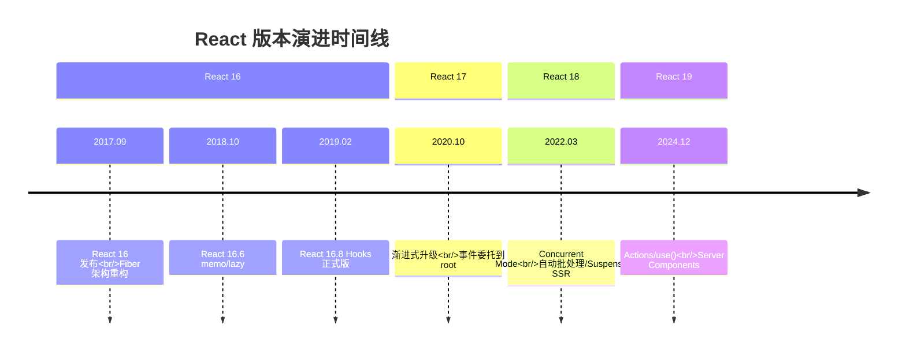

# React 基础知识点全面指南

> **版本**: React 18/19 | **更新日期**: 2026-06-14 | **作者**: AI Assistant  
> 本指南系统化覆盖 React 核心概念、Hooks 体系、性能优化、工程化实践等全栈知识，重点突出 **React 18+ 并发特性**与**现代最佳实践**。

---

## 📑 目录

- [第1章：React 概述](#第1章react-概述)
- [第2章：JSX 与元素渲染](#第2章jsx-与元素渲染)
- [第3章：组件基础](#第3章组件基础)
- [第4章：Hooks 详解](#第4章hooks-详解)
- [第5章：组件通信](#第5章组件通信)
- [第6章：虚拟 DOM 与 Diff 算法](#第6章虚拟-dom-与-diff-算法)
- [第7章：状态管理方案](#第7章状态管理方案)
- [第8章：React Router v6+](#第8章react-router-v6)
- [第9章：表单处理](#第9章表单处理)
- [第10章：性能优化](#第10章性能优化)
- [第11章：服务端渲染 (SSR)](#第11章服务端渲染-ssr)
- [第12章：TypeScript 与 React](#第12章typescript-与-react)
- [第13章：测试](#第13章测试)
- [第14章：工程化实践](#第14章工程化实践)
- [第15章：常见陷阱与最佳实践](#第15章常见陷阱与最佳实践)

---

## 第1章：React 概述

### 1.1 React 是什么

**React** 是由 Meta（Facebook）开源的用于构建用户界面的 JavaScript 库。它于 2013 年首次发布，迅速成为前端开发领域最流行的 UI 框架之一。

```jsx
// 最简单的 React 应用
import React from 'react';

function App() {
  return <h1>Hello, React! 👋</h1>;
}

export default App;
```

#### 核心特点

| 特性 | 说明 |
|------|------|
| **声明式设计** | 声明"UI 应该是什么样子"，React 负责如何更新 DOM |
| **组件化** | 将 UI 拆分为独立、可复用的组件 |
| **虚拟 DOM** | 在内存中维护 DOM 副本，通过 Diff 算法高效更新 |
| **单向数据流** | 数据从父组件流向子组件，清晰可预测 |
| **跨平台** | React DOM (Web) / React Native (移动端) / React VR |

### 1.2 核心思想

#### 1.2.1 声明式编程 (Declarative)

```jsx
// ❌ 命令式 (Imperative) — jQuery 风格
const button = document.getElementById('btn');
button.addEventListener('click', () => {
  const countEl = document.getElementById('count');
  const current = parseInt(countEl.textContent);
  countEl.textContent = current + 1;
});

// ✅ 声明式 (Declarative) — React 风格
function Counter() {
  const [count, setCount] = useState(0);
  return (
    <button onClick={() => setCount(count + 1)}>
      点击次数: {count}
    </button>
  );
}
```

#### 1.2.2 组件化 (Component-Based)

```
┌─────────────────────────────────────────────────────┐
│                      App                            │
│  ┌──────────┐  ┌──────────┐  ┌──────────────────┐  │
│  │  Header   │  │ Sidebar  │  │    MainContent    │  │
│  │          │  │          │  │  ┌────┐┌────┐     │  │
│  │ Logo Nav │  │ Menu     │  │  │Card││Card│...   │  │
│  └──────────┘  └──────────┘  │  └────┘└────┘     │  │
│                               └──────────────────┘  │
└─────────────────────────────────────────────────────┘
```

### 1.3 版本里程碑



| 版本 | 发布时间 | 核心里程碑 |
|------|----------|-----------|
| **React 16** | 2017-09 | **Fiber 架构**重构，Error Boundaries，Portal |
| **React 16.8** | 2019-02 | **Hooks 正式发布** |
| **React 17** | 2020-10 | 渐进式升级策略 |
| **React 18** | 2022-03 | **并发特性**，createRoot，自动批处理 |
| **React 19** | 2024-12 | **Actions**，use() Hook，Server Components |

### 1.4 框架对比

| 特性 | React | Vue 3 | Angular | Svelte |
|------|-------|-------|---------|--------|
| **核心思想** | 虚拟 DOM + 单向数据流 | 响应式 Proxy | TypeScript + DI | 编译时框架 |
| **学习曲线** | 中等 | 低 | 高 | 低 |
| **包大小** | ~42KB (gzip) | ~34KB (gzip) | ~65KB (gzip) | ~1.6KB |
| **适用场景** | 大型 SPA/跨平台 | 快速开发 | 企业级应用 | 高性能场景 |

---

## 第2章：JSX 与元素渲染

### 2.1 JSX 语法本质

JSX 是 JavaScript 的语法扩展，最终会被编译为 `React.createElement()` 调用。

```jsx
// 你写的 JSX
const element = <h1 className="greeting">Hello, world!</h1>;

// Babel 编译后
const element = React.createElement(
  'h1',
  { className: 'greeting' },
  'Hello, world!'
);
```

### 2.2 JSX 表达式与渲染

```jsx
function ExpressionDemo() {
  const name = 'React';
  const isLoggedIn = true;

  return (
    <div>
      {/* 变量插值 */}
      <h1>Hello, {name}!</h1>
      
      {/* 条件渲染 */}
      {isLoggedIn ? <span>欢迎</span> : <span>请登录</span>}
      
      {/* 列表渲染 */}
      {['A', 'B', 'C'].map(item => <li key={item}>{item}</li>)}
    </div>
  );
}
```

### 2.3 Fragments 片段

```jsx
// ✅ 空标签 Fragment（推荐）
function GoodExample() {
  return (
    <>
      <h1>Title</h1>
      <p>Content</p>
    </>
  );
}

// ✅ 显式 Fragment（需要 key 时）
<React.Fragment key={id}>
  <dt>{term}</dt>
  <dd>{description}</dd>
</React.Fragment>
```

### 2.4 ReactDOM.createRoot (React 18)

```jsx
// ❌ React 17 及以下（已废弃）
ReactDOM.render(<App />, document.getElementById('root'));

// ✅ React 18 新 API
import { createRoot } from 'react-dom/client';
const root = createRoot(document.getElementById('root'));
root.render(<App />);
```

### 2.5 StrictMode 严格模式

StrictMode 在开发环境下会**故意双重调用**某些函数以帮助发现副作用问题。

```jsx
import { StrictMode } from 'react';

function App() {
  return (
    <StrictMode>
      <MyComponent />
    </StrictMode>
  );
}
```

---

## 第3章：组件基础

### 3.1 函数组件 vs 类组件

```jsx
// ✅ 现代 React：函数组件 + Hooks（推荐）
function Counter({ initialValue = 0 }) {
  const [count, setCount] = useState(initialValue);
  
  useEffect(() => {
    document.title = `Count: ${count}`;
  }, [count]);

  return <button onClick={() => setCount(c => c + 1)}>{count}</button>;
}
```

### 3.2 Props 属性传递

```jsx
function UserCard({ name, age, isAdmin, ...rest }) {
  return (
    <div className={`card ${isAdmin ? 'admin' : ''}`}>
      <h3>{name}</h3>
      
    </div>
  );
}

// 使用
<UserCard name="Bob" age={25} isAdmin={true} src="/avatar.jpg" />
```

### 3.3 State 状态管理

```jsx
function StateExamples() {
  // 基本用法
  const [count, setCount] = useState(0);

  // 惰性初始化
  const [theme] = useState(() => localStorage.getItem('theme') ?? 'light');

  // 函数式更新（防闭包陷阱）
  const increment3 = () => {
    setCount(c => c + 1);
    setCount(c => c + 1);
    setCount(c => c + 1);  // 最终 +3
  };

  // 对象更新（不可变模式）
  const [user, setUser] = useState({ name: '', age: 0 });
  const updateName = (name) => setUser(prev => ({ ...prev, name }));

  // 数组更新
  const [items, setItems] = useState([]);
  const addItem = (item) => setItems(prev => [...prev, item]);
  const removeItem = (id) => setItems(prev => prev.filter(i => i.id !== id));

  return null;
}
```

### 3.4 列表渲染与 Key

```jsx
// ✅ 使用唯一稳定的 key
{users.map(user => <li key={user.id}>{user.name}</li>)}

// ⚠️ 静态列表可以用 index
{['首页', '关于'].map((page, i) => <NavLink key={i}>{page}</NavLink>)}
```

---

## 第4章：Hooks 详解

### 4.1 Hooks 规则与原理

**两条黄金规则**：
1. 只在最顶层调用 Hooks（不能在条件/循环中）
2. 只在 React 函数中调用（函数组件或自定义 Hook）

**为什么必须在顶层？**
React 内部用链表存储 Hooks，按固定顺序遍历。如果条件调用导致顺序变化，状态会混乱。

```jsx
// 自定义 Hook 示例
function useLocalStorage(key, initialValue) {
  const [value, setValue] = useState(() => {
    try {
      return JSON.parse(localStorage.getItem(key)) ?? initialValue;
    } catch { return initialValue; }
  });

  const setValueAndPersist = (newValue) => {
    setValue(newValue);
    localStorage.setItem(key, JSON.stringify(newValue));
  };

  return [value, setValueAndPersist];
}
```

### 4.2 useState 深入

```jsx
// useState vs useReducer 选择指南
// 简单/独立状态 → useState
// 复杂/关联状态 → useReducer

type Action = { type: 'INCREMENT' } | { type: 'DECREMENT' } | { type: 'RESET' };
function reducer(state: number, action: Action): number {
  switch (action.type) {
    case 'INCREMENT': return state + 1;
    case 'DECREMENT': return state - 1;
    case 'RESET': return 0;
    default: return state;
  }
}

function Counter() {
  const [state, dispatch] = useReducer(reducer, 0);
  return (
    <div>
      <p>{state}</p>
      <button onClick={() => dispatch({ type: 'INCREMENT' })}>+</button>
      <button onClick={() => dispatch({ type: 'RESET' })}>Reset</button>
    </div>
  );
}
```

### 4.3 useEffect 深入

```jsx
// 执行时机：浏览器绘制后异步执行
// cleanup 在下次 effect 前执行

function EffectLifecycle() {
  const [count, setCount] = useState(0);

  // 仅挂载时执行
  useEffect(() => {
    console.log('mounted');
    return () => console.log('unmount');
  }, []);

  // 依赖变化时执行
  useEffect(() => {
    document.title = `Count: ${count}`;
  }, [count]);

  return <button onClick={() => setCount(c => c + 1)}>{count}</button>;
}

// useEffect vs useLayoutEffect
// useEffect: 绘制后异步执行，不阻塞视觉
// useLayoutEffect: 绘制前同步执行，会阻塞（用于 DOM 测量）
```

### 4.4 useContext

```jsx
const ThemeContext = createContext('light');

function App() {
  const [theme, setTheme] = useState('light');
  return (
    <ThemeContext.Provider value={theme}>
      <Header />
      <Main />
    </ThemeContext.Provider>
  );
}

function Header() {
  const theme = useContext(ThemeContext);
  return <header className={theme}>Header</header>;
}
```

**性能优化**：拆分 Context、Memoize Value、配合 React.memo

### 4.5 useRef

```jsx
// 用途 1：访问 DOM
const inputRef = useRef<HTMLInputElement>(null);
useEffect(() => inputRef.current?.focus(), []);

// 用途 2：存储可变值（不触发重渲染）
const timerRef = useRef<NodeJS.Timeout>(null);
timerRef.current = setInterval(fn, 1000);

// forwardRef + useImperativeHandle
const FancyInput = forwardRef<InputHandle>((props, ref) => {
  useImperativeHandle(ref, () => ({
    focus: () => internalRef.current?.focus(),
    clear: () => { if (internalRef.current) internalRef.current.value = ''; },
  }), []);
  return <input ref={internalRef} />;
});
```

### 4.6 useMemo & useCallback

```jsx
// 缓存昂贵计算
const sortedItems = useMemo(() =>
  items.filter(f).sort(compareFn),
  [items, filter]
);

// 缓存函数引用（传给 memo 子组件）
const handleClick = useCallback((id) => {
  doSomething(id);
}, [doSomething]);  // doSomething 应该稳定
```

### 4.7 React 18 新 Hooks

```jsx
// useId - 生成唯一 ID（SSR 安全）
const id = useId();
// => ":r0:", ":r1:"

// useDeferredValue - 延迟非紧急 UI 更新
const deferredQuery = useDeferredValue(query);

// useTransition - 标记非紧急状态更新
const [isPending, startTransition] = useTransition();
startTransition(() => setActiveTab(index));

// useSyncExternalStore - 订阅外部数据源
const isOnline = useSyncExternalStore(subscribe, getSnapshot);

// useDebugValue - DevTools 调试标签
useDebugValue(`Format: ${format}`);
```

---

## 第5章：组件通信

### 通信模式一览

| 模式 | 方向 | 适用场景 |
|------|------|---------|
| Props | 父→子 | 数据传递 |
| 回调函数 | 子→父 | 事件通知 |
| Context | 跨级 | 全局配置/主题 |
| 状态提升 | 兄弟→共同祖先 | 共享状态 |
| Portal | DOM 外部 | 模态框/tooltips |
| forwardRef | ref 转发 | 访问子组件 DOM |

### Portal 示例

```jsx
import { createPortal } from 'react-dom';

function Modal({ isOpen, onClose, children }) {
  if (!isOpen) return null;
  
  return createPortal(
    <div className="modal-overlay" onClick={onClose}>
      <div onClick={e => e.stopPropagation()}>{children}</div>
    </div>,
    document.body
  );
}
```

---

## 第6章：虚拟 DOM 与 Diff 算法

### Fiber 架构核心概念

```
Fiber Reconciler (React 16+):
- 可中断的增量 reconciler
- 双缓存技术（current / workInProgress tree）
- 时间切片（Time Slicing）
- 优先级调度（Scheduler）

Diff 策略（O(n)）:
- 只比较同层节点
- 不同类型直接替换
- key 辅助节点复用
```

### React 18 并发特性

```jsx
// Suspense + React.lazy（代码分割）
const Dashboard = lazy(() => import('./Dashboard'));

<Suspense fallback={<Skeleton />}>
  <Routes>
    <Route path="/dashboard" element={<Dashboard />} />
  </Routes>
</Suspense>

// startTransition
<button onClick={() => {
  startTransition(() => setLargeData(newData));
}}>
  加载数据
</button>
```

---

## 第7章：状态管理方案

### 选型决策图

```
组件内部简单状态 → useState
跨组件低频数据 → Context API
中小项目全局状态 → Zustand
大型应用客户端状态 → Redux Toolkit
服务端状态（缓存/同步） → TanStack Query
细粒度原子化状态 → Jotai
```

### Redux Toolkit 示例

```typescript
import { createSlice, configureStore, createAsyncThunk } from '@reduxjs/toolkit';

const fetchUsers = createAsyncThunk('users/fetch', async () => {
  const res = await fetch('/api/users');
  return res.json();
});

const usersSlice = createSlice({
  name: 'users',
  initialState: { data: [], loading: false },
  reducers: {},
  extraReducers: builder => {
    builder.addCase(fetchUsers.pending, s => { s.loading = true; })
           .addCase(fetchUsers.fulfilled, (s, a) => { s.data = a.payload; s.loading = false; });
  },
});

export const store = configureStore({ reducer: { users: usersSlice.reducer } });
```

---

## 第8章：React Router v6+

```tsx
<Routes>
  <Route path="/" element={<Layout />}>
    <Route index element={<Home />} />
    <Route path="about" element={<About />} />
    
    {/* 动态参数 */}
    <Route path="users/:userId" element={<UserDetail />} />
    
    {/* 嵌套路由 */}
    <Route path="dashboard" element={<Dashboard />}>
      <Route index element={<Overview />} />
      <Route path="settings" element={<Settings />} />
    </Route>
  </Route>
  
  {/* 保护路由 */}
  <Route path="/admin" element={
    <ProtectedRoute><AdminPanel /></ProtectedRoute>
  } />
</Routes>

// 获取参数
function UserDetail() {
  const { userId } = useParams();
  const [searchParams] = useSearchParams();
  const query = searchParams.get('q');
  // ...
}
```

---

## 第9章：表单处理

```jsx
// 受控组件（推荐）
function ControlledForm() {
  const [form, setForm] = useState({ email: '', password: '' });
  
  return (
    <form onSubmit={(e) => { e.preventDefault(); submit(form); }}>
      <input name="email" value={form.email}
        onChange={e => setForm(f => ({...f, [e.target.name]: e.target.value}))} />
      <input name="password" type="password" value={form.password}
        onChange={e => setForm(f => ({...f, [e.target.name]: e.target.value}))} />
      <button type="submit">提交</button>
    </form>
  );
}

// 文件上传（预览 + 进度）
function FileUpload() {
  const [preview, setPreview] = useState<string | null>(null);
  const [progress, setProgress] = useState(0);
  
  const handleFile = (file: File) => {
    if (file.type.startsWith('image/')) {
      const reader = new FileReader();
      reader.onload = (e) => setPreview(e.target?.result as string);
      reader.readAsDataURL(file);
    }
    // 上传逻辑...
  };
  
  return (
    <div onDragOver={e => e.preventDefault()} 
         onDrop={e => { e.preventDefault(); handleFile(e.dataTransfer.files[0]); }}>
      {preview ?  : <p>拖拽文件到这里</p>}
    </div>
  );
}
```

---

## 第10章：性能优化

### 核心策略

```jsx
// 1. React.memo - 防止不必要的重渲染
const MemoizedItem = React.memo(function Item({ data, onClick }) {
  return <li onClick={onClick}>{data.name}</li>;
}, (prev, next) => prev.data.id === next.data.id);  // 自定义比较

// 2. useMemo - 缓存昂贵计算
const filtered = useMemo(() => items.filter(match), [items, match]);

// 3. useCallback - 稳定函数引用
const handleClick = useCallback((id) => select(id), [select]);

// 4. 虚拟列表 - 大数据渲染
import { FixedSizeList as List } from 'react-window';
<List height={400} itemCount={10000} itemSize={50} width="100%">
  {({ index, style }) => <div style={style}>{items[index]}</div>}
</List>

// 5. 代码分割
const HeavyComponent = lazy(() => import('./Heavy'));
<Suspense fallback={<Skeleton />}><HeavyComponent /></Suspense>
```

---

## 第11章：服务端渲染 (SSR)

### 渲染模式对比

| 模式 | 说明 | 适用场景 |
|------|------|---------|
| CSR | 客户端渲染 | 后台管理/SPA |
| SSR | 服务端渲染 | SEO 要求高 |
| SSG | 静态生成 | 博客/文档站 |
| ISR | 增量再生成 | 内容更新频率中等 |

### Next.js App Router (React 19 Server Components)

```tsx
// Server Component（默认，无 "use client"）
async function Page() {
  const data = await fetch('https://api.example.com/data');
  return <ClientComponent data={data} />;
}

// Client Component
'use client';
function ClientComponent({ data }: { data: Data[] }) {
  const [filter, setFilter] = useState('');
  return <div>{/* 交互逻辑 */}</div>;
}
```

---

## 第12章：TypeScript 与 React

```typescript
// 函数组件类型
interface ButtonProps {
  variant?: 'primary' | 'secondary';
  size?: 'sm' | 'md' | 'lg';
  children: React.ReactNode;
  onClick?: () => void;
}

function Button({ variant = 'primary', size = 'md', children, onClick }: ButtonProps) {
  return <button className={`btn btn-${variant} btn-${size}`} onClick={onClick}>{children}</button>;
}

// 泛型组件
function List<T>({ items, renderItem }: {
  items: T[];
  renderItem: (item: T) => React.ReactNode;
}) {
  return <ul>{items.map(renderItem)}</ul>;
}

// 事件类型
const handleChange = (e: React.ChangeEvent<HTMLInputElement>) => e.target.value;
const handleSubmit = (e: React.FormEvent<HTMLFormElement>) => e.preventDefault();

// forwardRef 类型
const Input = forwardRef<HTMLInputElement, InputProps>((props, ref) => (
  <input ref={ref} {...props} />
));
```

---

## 第13章：测试

```typescript
// 组件测试 (React Testing Library)
import { render, screen, fireEvent, waitFor } from '@testing-library/react';
import userEvent from '@testing-library/user-event';

test('counter increments', async () => {
  render(<Counter />);
  
  expect(screen.getByText(/count: 0/i)).toBeInTheDocument();
  
  await userEvent.click(screen.getByRole('button', { name: /increment/i }));
  
  expect(screen.getByText(/count: 1/i)).toBeInTheDocument();
});

// 异步测试
test('loads user data', async () => {
  render(<UserProfile userId="123" />);
  
  expect(screen.getByText(/loading/i)).toBeInTheDocument();
  
  await waitFor(() => {
    expect(screen.getByText('Alice')).toBeInTheDocument();
  });
});

// Mock
vi.mock('./api', () => ({
  getUser: vi.fn().mockResolvedValue({ name: 'Alice' }),
}));
```

---

## 第14章：工程化实践

### 目录结构规范

```
src/
├── components/       # 通用组件
│   ├── ui/          # 基础 UI 组件
│   └── layout/      # 布局组件
├── pages/           # 页面组件
├── hooks/           # 自定义 Hooks
├── stores/          # 状态管理
├── services/        # API 服务
├── utils/           # 工具函数
├── types/           # TypeScript 类型
├── styles/          # 全局样式
└── constants/       # 常量定义
```

### 错误边界 (Error Boundary)

```jsx
class ErrorBoundary extends React.Component<
  { children: React.ReactNode; fallback?: React.ReactNode },
  { hasError: boolean; error: Error | null }
> {
  state = { hasError: false, error: null };

  static getDerivedStateFromError(error: Error) {
    return { hasError: true, error };
  }

  render() {
    if (this.state.hasError) {
      return this.props.fallback ?? (
        <div className="error-boundary">
          <h2>出错了 😢</h2>
          <p>{this.state.error?.message}</p>
          <button onClick={() => this.setState({ hasError: false, error: null })}>
            重试
          </button>
        </div>
      );
    }
    return this.props.children;
  }
}

// 使用
<ErrorBoundary fallback={<CustomErrorPage />}>
  <RiskyComponent />
</ErrorBoundary>
```

---

## 第15章：常见陷阱与最佳实践

### 15 个常见 Bug 及解决方案

#### Bug 1: 闭包陷阱
```jsx
// ❌ 闭包中的 state 是旧值
useEffect(() => {
  const id = setInterval(() => console.log(count), 1000);
  return () => clearInterval(id);
}, []);

// ✅ 方案 A：加入依赖
useEffect(() => {
  const id = setInterval(() => console.log(count), 1000);
  return () => clearInterval(id);
}, [count]);

// ✅ 方案 B：使用函数式更新
useEffect(() => {
  const id = setInterval(() => setCount(c => console.log(c)), 1000);
  return () => clearInterval(id);
}, []);  // 不依赖 count
```

#### Bug 2: useEffect 无限循环
```jsx
// ❌ effect 内更新依赖自身的 state
useEffect(() => {
  setData(process(data));  // data 变化 → 触发 effect → 更新 data → 无限循环
}, [data]);

// ✅ 使用 useMemo 或在事件处理中处理
const processed = useMemo(() => process(data), [data]);
```

#### Bug 3: key 使用 index
```jsx
// ❌ 动态列表用 index 做 key 导致状态错乱
{list.map((item, i) => <Row key={i} item={item} />)}

// ✅ 使用唯一稳定 ID
{list.map(item => <Row key={item.id} item={item} />)}
```

#### Bug 4: 直接修改 state
```jsx
// ❌ 直接修改（mutation）
data.push(newItem);  // 错误！
data[0].name = 'new';  // 错误！

// ✅ 不可变更新
setData(prev => [...prev, newItem]);
setData(prev => prev.map(item =>
  item.id === targetId ? { ...item, name: 'new' } : item
));
```

#### Bug 5: 异步函数未清理
```jsx
// ❌ 可能导致内存泄漏和竞态条件
useEffect(() => {
  fetchData(id).then(setResult);
}, [id]);

// ✅ 清理 + AbortController
useEffect(() => {
  const controller = new AbortController();
  
  fetch(`/api/${id}`, { signal: controller.signal })
    .then(res => res.json())
    .then(data => !controller.signal.aborted && setResult(data))
    .catch(err => err.name !== 'AbortError' && setError(err));

  return () => controller.abort();  // 取消未完成请求
}, [id]);
```

#### Bug 6: Context 导致的全局重渲染
```jsx
// ❌ 一个值变化导致所有消费者重渲染
<AppContext.Provider value={{ user, theme, settings }}>
  <Header />  <!-- theme 变化时也重渲染 -->
  <Settings />  <!-- user 变化时也重渲染 -->
</AppContext.Provider>

// ✅ 拆分 Context
<ThemeProvider value={theme}>
  <UserProvider value={user}>
    <Header />  <!-- 只依赖 ThemeProvider -->
    <Settings />  <!-- 只依赖 UserProvider -->
  </UserProvider>
</ThemeProvider>
```

#### Bug 7: 内联函数导致不必要的重渲染
```jsx
// ❌ 每次渲染创建新函数引用
<Item onClick={() => handleClick(item.id)} />

// ✅ 使用 useCallback 或在子组件内处理
const handleClick = useCallback((id: string) => doSomething(id), [doSomething]);
<Item onClick={handleClick} id={item.id} />
```

#### Bug 8: 大列表无虚拟化
```jsx
// ❌ 直接渲染 10000 条数据
<ul>{items.slice(0, 10000).map(item => <li>{item}</li>)}</ul>

// ✅ 使用 react-window 虚拟滚动
<List height={400} itemCount={10000} itemSize={35}>
  {({ index, style }) => <div style={style}>{items[index].name}</div>}
</List>
```

#### Bug 9: 忘记 cleanup 定时器/监听器
```jsx
// ❌ 内存泄漏
useEffect(() => {
  const timer = setInterval(fn, 1000);
  window.addEventListener('resize', handler);
  // 没有 cleanup！
}, []);

// ✅ 总是返回 cleanup 函数
useEffect(() => {
  const timer = setInterval(fn, 1000);
  window.addEventListener('resize', handler);
  return () => {
    clearInterval(timer);
    window.removeEventListener('resize', handler);
  };
}, []);
```

#### Bug 10: && 短路 falsy 值坑
```jsx
// ❌ 显示意外的 falsy 值
<div>{count && <span>有 {count} 条消息</span>}</div>
// count=0 时显示 "0"

// ✅ 使用三元或显式转换
<div>{count > 0 && <span>有 {count} 条消息</span>}</div>
<div>{!!count && <span>...</span>}</div>
```

#### Bug 11: 默认 Props 引用问题
```jsx
// ❌ 每次渲染都创建新数组
function List({ items = [] }: { items?: Item[] }) {
  // items 默认值每次都是新引用
}

// ✅ 初始值用 useMemo 或外部常量
const DEFAULT_ITEMS: Item[] = [];
function List({ items = DEFAULT_ITEMS }: { items?: Item[] }) {}
```

#### Bug 12: useLayoutEffect SSR 报错
```jsx
// ❌ SSR 时 useLayoutEffect 会报错
useLayoutEffect(() => { /* DOM 操作 */ }, []);

// ✅ 条件渲染或环境检测
const [isClient, setIsClient] = useState(false);
useEffect(() => setIsClient(true), []);
if (!isClient) return null;
useLayoutEffect(() => { /* 安全 */ }, []);
```

#### Bug 13: StrictMode 双重渲染副作用
```jsx
// 开发模式下 StrictMode 会双重调用
// 如果 effect 有副作用（如发送请求），会导致重复请求

// ✅ 使用 cleanup 或去重
useEffect(() => {
  let cancelled = false;
  fetchData().then(data => {
    if (!cancelled) setState(data);  // 只有最新的才生效
  });
  return () => { cancelled = true; };  // 第一次调用时会 cleanup
}, [dependency]);
```

#### Bug 14: forwardRef 与 HOC 冲突
```jsx
// ❌ HOC 包裹后 ref 无法穿透
const Enhanced = withTheme(MyComponent);
<Enhanced ref={myRef} />  // ref 丢失！

// ✅ 使用 forwardRef 包装 HOC
function withTheme<P>(Wrapped: React.ForwardRefExoticComponent<P>) {
  return React.forwardRef((props, ref) => (
    <ThemeProvider>
      <Wrapped {...props} ref={ref} />
    </ThemeProvider>
  ));
}
```

#### Bug 15: React.memo 浅比较局限性
```jsx
// ❌ 嵌套对象变化检测不到
<MemoizedChild data={{ a: 1 }} />  // 每次都是新对象

// ✅ 稳定引用或自定义比较
const stableData = useMemo(() => ({ a: 1 }), [a]);
<MemoizedChild data={stableData} />

// 或自定义比较函数
const Child = React.memo(({ data }) => <div />, (prev, next) => prev.data.a === next.data.a);
```

### 最佳实践清单（10 条编码规则）

1. **始终使用函数组件 + Hooks**（除非维护旧代码）
2. **Hook 只在最顶层调用**，遵循 ESLint rules-of-hooks
3. **Key 必须唯一且稳定**，动态列表禁止用 index
4. **State 更新保持不可变性**，使用展开运算符
5. **useEffect 依赖要完整**，遵循 exhaustive-deps 规则
6. **cleanup 所有副作用**（定时器/订阅/请求）
7. **大列表必须虚拟化**（react-window）
8. **合理使用 memo/useMemo/useCallback**，避免过早优化
9. **拆分 Context**，避免不必要的全局重渲染
10. **TypeScript 优先**，为所有组件添加类型定义

---

## 附录：React 19 新特性速览

```jsx
// Actions - 表单提交简化
<form action={async (formData) => {
  const result = await updateName(formData.get('name'));
}}>

// use() Hook - 替代 useContext/useEffect 用于读取 Promise/Context
const data = use(promise);  // Suspense 直到 resolve
const value = use(SomeContext);  // 替代 useContext

// ref 作为 prop - 无需 forwardRef
function MyInput({ ref }) {  // ref 直接作为 prop
  return <input ref={ref} />;
}

// Server Components (RSC)
// 默认组件在服务器端渲染，无需 "use client" 声明
// 客户端组件需显式标记 'use client'
```

---

> 📚 **延伸阅读**:
> - [React 官方文档](https://react.dev/)
> - [React 18 新特性](https://react.dev/blog/2022/03/29/react-v18)
> - [React 19 发布说明](https://react.dev/blog/2024/12/05/react-19)
> - [Redux Toolkit 教程](https://redux-toolkit.js.org/)
> - [TanStack Query 文档](https://tanstack.com/query/latest)

---

*本文档持续更新中，最后更新于 2026-06-14*
