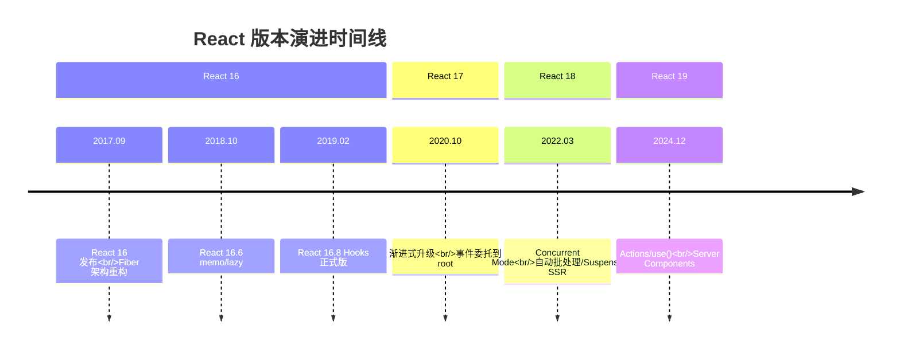
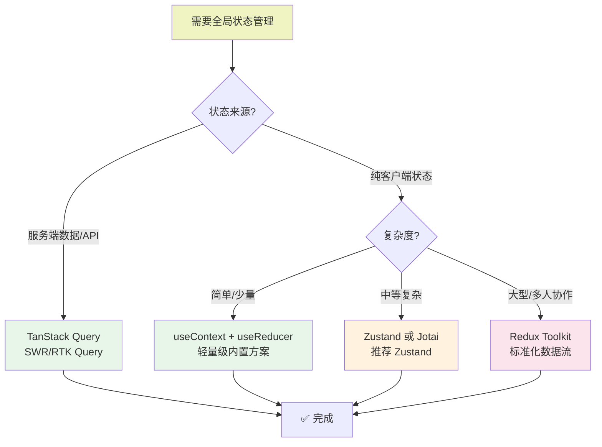
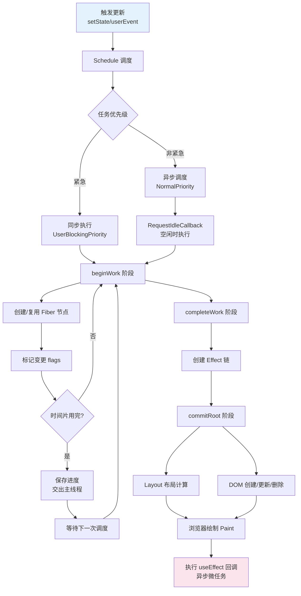
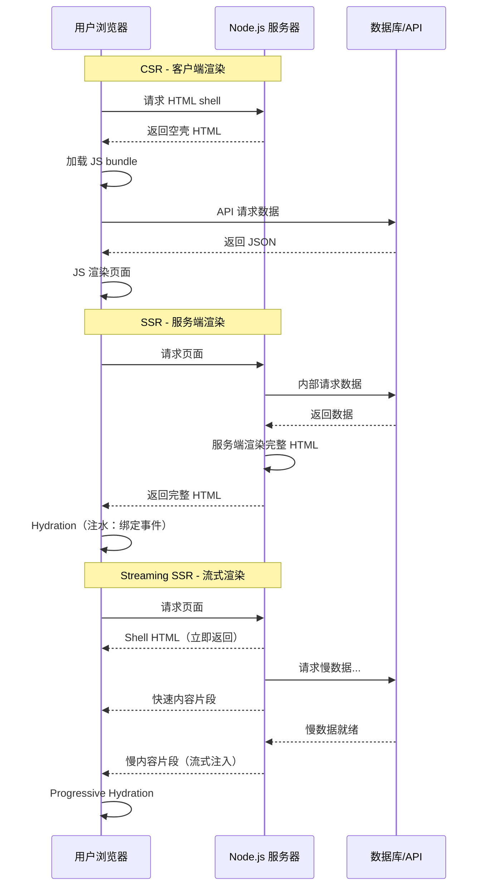

# React 基础知识点全面指南

> **版本**: React 18/19 | **更新日期**: 2026-06-14 | **作者**: AI Assistant  
> 本指南系统化覆盖 React 核心概念、Hooks 体系、性能优化、工程化实践等全栈知识，重点突出 **React 18+ 并发特性**与**现代最佳实践**。

---

## 📑 目录

- [第1章：React 概述](#第1章react-概述)
- [第2章：JSX 与元素渲染](#第2章jsx-与元素渲染)
- [第3章：组件基础](#第3章组件基础)
- [第4章：Hooks 详解](#第4章hooks-详解)
- [第5章：组件通信](#第5章组件通信)
- [第6章：虚拟 DOM 与 Diff 算法](#第6章虚拟-dom-与-diff-算法)
- [第7章：状态管理方案](#第7章状态管理方案)
- [第8章：React Router v6+](#第8章react-router-v6)
- [第9章：表单处理](#第9章表单处理)
- [第10章：性能优化](#第10章性能优化)
- [第11章：服务端渲染 (SSR)](#第11章服务端渲染-ssr)
- [第12章：TypeScript 与 React](#第12章typescript-与-react)
- [第13章：测试](#第13章测试)
- [第14章：工程化实践](#第14章工程化实践)
- [第15章：常见陷阱与最佳实践](#第15章常见陷阱与最佳实践)
- [附录 A：React 19 新特性速览](#附录react-19-新特性速览)
- [附录 B：实战案例 — Mini React 组件库](#附录-b实战案例--mini-react-组件库)

---

## 第1章：React 概述

### 1.1 React 是什么

**React** 是由 Meta（Facebook）开源的用于构建用户界面的 JavaScript 库。它于 2013 年首次发布，迅速成为前端开发领域最流行的 UI 框架之一。

```jsx
// 最简单的 React 应用
import React from 'react';

function App() {
  return <h1>Hello, React! 👋</h1>;
}

export default App;
```

#### 核心特点

| 特性 | 说明 |
|------|------|
| **声明式设计** | 声明"UI 应该是什么样子"，React 负责如何更新 DOM |
| **组件化** | 将 UI 拆分为独立、可复用的组件 |
| **虚拟 DOM** | 在内存中维护 DOM 副本，通过 Diff 算法高效更新 |
| **单向数据流** | 数据从父组件流向子组件，清晰可预测 |
| **跨平台** | React DOM (Web) / React Native (移动端) / React VR |

### 1.2 核心思想

#### 1.2.1 声明式编程 (Declarative)

```jsx
// ❌ 命令式 (Imperative) — jQuery 风格
const button = document.getElementById('btn');
button.addEventListener('click', () => {
  const countEl = document.getElementById('count');
  const current = parseInt(countEl.textContent);
  countEl.textContent = current + 1;
});

// ✅ 声明式 (Declarative) — React 风格
function Counter() {
  const [count, setCount] = useState(0);
  return (
    <button onClick={() => setCount(count + 1)}>
      点击次数: {count}
    </button>
  );
}
```

#### 1.2.2 组件化 (Component-Based)

```
┌─────────────────────────────────────────────────────┐
│                      App                            │
│  ┌──────────┐  ┌──────────┐  ┌──────────────────┐  │
│  │  Header   │  │ Sidebar  │  │    MainContent    │  │
│  │          │  │          │  │  ┌────┐┌────┐     │  │
│  │ Logo Nav │  │ Menu     │  │  │Card││Card│...   │  │
│  └──────────┘  └──────────┘  │  └────┘└────┘     │  │
│                               └──────────────────┘  │
└─────────────────────────────────────────────────────┘
```

### 1.3 版本里程碑



| 版本 | 发布时间 | 核心里程碑 |
|------|----------|-----------|
| **React 16** | 2017-09 | **Fiber 架构**重构，Error Boundaries，Portal |
| **React 16.8** | 2019-02 | **Hooks 正式发布** |
| **React 17** | 2020-10 | 渐进式升级策略 |
| **React 18** | 2022-03 | **并发特性**，createRoot，自动批处理 |
| **React 19** | 2024-12 | **Actions**，use() Hook，Server Components |

### 1.4 框架对比

| 特性 | React | Vue 3 | Angular | Svelte |
|------|-------|-------|---------|--------|
| **核心思想** | 虚拟 DOM + 单向数据流 | 响应式 Proxy | TypeScript + DI | 编译时框架 |
| **学习曲线** | 中等 | 低 | 高 | 低 |
| **包大小** | ~42KB (gzip) | ~34KB (gzip) | ~65KB (gzip) | ~1.6KB |
| **适用场景** | 大型 SPA/跨平台 | 快速开发 | 企业级应用 | 高性能场景 |

---

## 第2章：JSX 与元素渲染

### 2.1 JSX 语法本质

JSX 是 JavaScript 的语法扩展，最终会被编译为 `React.createElement()` 调用。

```jsx
// 你写的 JSX
const element = <h1 className="greeting">Hello, world!</h1>;

// Babel 编译后
const element = React.createElement(
  'h1',
  { className: 'greeting' },
  'Hello, world!'
);
```

### 2.2 JSX 表达式与渲染

```jsx
function ExpressionDemo() {
  const name = 'React';
  const isLoggedIn = true;

  return (
    <div>
      {/* 变量插值 */}
      <h1>Hello, {name}!</h1>
      
      {/* 条件渲染 */}
      {isLoggedIn ? <span>欢迎</span> : <span>请登录</span>}
      
      {/* 列表渲染 */}
      {['A', 'B', 'C'].map(item => <li key={item}>{item}</li>)}
    </div>
  );
}
```

### 2.3 Fragments 片段

```jsx
// ✅ 空标签 Fragment（推荐）
function GoodExample() {
  return (
    <>
      <h1>Title</h1>
      <p>Content</p>
    </>
  );
}

// ✅ 显式 Fragment（需要 key 时）
<React.Fragment key={id}>
  <dt>{term}</dt>
  <dd>{description}</dd>
</React.Fragment>
```

### 2.4 ReactDOM.createRoot (React 18)

```jsx
// ❌ React 17 及以下（已废弃）
ReactDOM.render(<App />, document.getElementById('root'));

// ✅ React 18 新 API
import { createRoot } from 'react-dom/client';
const root = createRoot(document.getElementById('root'));
root.render(<App />);
```

### 2.5 StrictMode 严格模式

StrictMode 在开发环境下会**故意双重调用**某些函数以帮助发现副作用问题。

```jsx
import { StrictMode } from 'react';

function App() {
  return (
    <StrictMode>
      <MyComponent />
    </StrictMode>
  );
}
```

---

## 第3章：组件基础

### 3.1 函数组件 vs 类组件

```jsx
// ✅ 现代 React：函数组件 + Hooks（推荐）
function Counter({ initialValue = 0 }) {
  const [count, setCount] = useState(initialValue);
  
  useEffect(() => {
    document.title = `Count: ${count}`;
  }, [count]);

  return <button onClick={() => setCount(c => c + 1)}>{count}</button>;
}
```

### 3.2 Props 属性传递

```jsx
function UserCard({ name, age, isAdmin, ...rest }) {
  return (
    <div className={`card ${isAdmin ? 'admin' : ''}`}>
      <h3>{name}</h3>
      
    </div>
  );
}

// 使用
<UserCard name="Bob" age={25} isAdmin={true} src="/avatar.jpg" />
```

### 3.3 State 状态管理

```jsx
function StateExamples() {
  // 基本用法
  const [count, setCount] = useState(0);

  // 惰性初始化
  const [theme] = useState(() => localStorage.getItem('theme') ?? 'light');

  // 函数式更新（防闭包陷阱）
  const increment3 = () => {
    setCount(c => c + 1);
    setCount(c => c + 1);
    setCount(c => c + 1);  // 最终 +3
  };

  // 对象更新（不可变模式）
  const [user, setUser] = useState({ name: '', age: 0 });
  const updateName = (name) => setUser(prev => ({ ...prev, name }));

  // 数组更新
  const [items, setItems] = useState([]);
  const addItem = (item) => setItems(prev => [...prev, item]);
  const removeItem = (id) => setItems(prev => prev.filter(i => i.id !== id));

  return null;
}
```

### 3.4 列表渲染与 Key

```jsx
// ✅ 使用唯一稳定的 key
{users.map(user => <li key={user.id}>{user.name}</li>)}

// ⚠️ 静态列表可以用 index
{['首页', '关于'].map((page, i) => <NavLink key={i}>{page}</NavLink>)}
```

---

## 第4章：Hooks 详解

### 4.1 Hooks 规则与原理

**两条黄金规则**：
1. 只在最顶层调用 Hooks（不能在条件/循环中）
2. 只在 React 函数中调用（函数组件或自定义 Hook）

**为什么必须在顶层？**
React 内部用链表存储 Hooks，按固定顺序遍历。如果条件调用导致顺序变化，状态会混乱。

> **下图展示了 React 内部如何用链表存储多个 Hook 的状态，这也是为什么 Hooks 必须按固定顺序调用的根本原因：**

```
Hooks 链表存储在 Fiber.memoizedState 上
━━━━━━━━━━━━━━━━━━━━━━━━━━━━━━━━━━━━━━━━━━━━━━━━

组件 Example():
  const [count, setCount] = useState(0);       // Hook #0
  const [name, setName] = useState('Tom');        // Hook #1
  useEffect(() => { console.log(count) }, [count]); // Hook #2
  const ref = useRef(null);                       // Hook #3
  useMemo(() => expensive(count), [count]);       // Hook #4

Fiber(Example).memoizedState 链表:
  ┌──────────────────────────────────────────────────────┐
  │ Hook #0: useState(0)                                │
  │   baseQueue: null                                   │
  │   memoizedState: 0                                  │
  │   next ─────────────────────────────────┐             │
  ├─────────────────────────────────────────│────────────┤
  │ Hook #1: useState('Tom')               ←│             │
  │   baseQueue: null                                  │
  │   memoizedState: 'Tom'                               │
  │   next ─────────────────────────────────┤             │
  ├─────────────────────────────────────────│────────────┤
  │ Hook #2: useEffect(fn, [count])        ←│             │
  │   create: fn                                       │
  │   destroy: undefined                               │
  │   deps: [0]                                         │
  │   next ─────────────────────────────────┤             │
  ├─────────────────────────────────────────│────────────┤
  │ Hook #3: useRef(null)                 ←│             │
  │   memoizedState: { current: null }                │
  │   next ─────────────────────────────────┤             │
  ├─────────────────────────────────────────│────────────┤
  │ Hook #4: useMemo(expensive, [count])     ←│             │
  │   memoizedState: result                              │
  │   deps: [0]                                         │
  │   next: null                                        │
  └──────────────────────────────────────────────────────┘

关键规则:
1. 每次渲染按固定顺序遍历此链表（Hook #0 → #1 → ... → #N）
2. 条件调用会导致顺序错乱 → 取到错误的状态 → BUG!
3. 这就是为什么 Hooks 不能在 if/for/嵌套函数中调用
```

```jsx
// 自定义 Hook 示例
function useLocalStorage(key, initialValue) {
  const [value, setValue] = useState(() => {
    try {
      return JSON.parse(localStorage.getItem(key)) ?? initialValue;
    } catch { return initialValue; }
  });

  const setValueAndPersist = (newValue) => {
    setValue(newValue);
    localStorage.setItem(key, JSON.stringify(newValue));
  };

  return [value, setValueAndPersist];
}
```

### 4.2 useState 深入

```jsx
// useState vs useReducer 选择指南
// 简单/独立状态 → useState
// 复杂/关联状态 → useReducer

type Action = { type: 'INCREMENT' } | { type: 'DECREMENT' } | { type: 'RESET' };
function reducer(state: number, action: Action): number {
  switch (action.type) {
    case 'INCREMENT': return state + 1;
    case 'DECREMENT': return state - 1;
    case 'RESET': return 0;
    default: return state;
  }
}

function Counter() {
  const [state, dispatch] = useReducer(reducer, 0);
  return (
    <div>
      <p>{state}</p>
      <button onClick={() => dispatch({ type: 'INCREMENT' })}>+</button>
      <button onClick={() => dispatch({ type: 'RESET' })}>Reset</button>
    </div>
  );
}
```

### 4.3 useEffect 深入

```jsx
// 执行时机：浏览器绘制后异步执行
// cleanup 在下次 effect 前执行

function EffectLifecycle() {
  const [count, setCount] = useState(0);

  // 仅挂载时执行
  useEffect(() => {
    console.log('mounted');
    return () => console.log('unmount');
  }, []);

  // 依赖变化时执行
  useEffect(() => {
    document.title = `Count: ${count}`;
  }, [count]);

  return <button onClick={() => setCount(c => c + 1)}>{count}</button>;
}

// useEffect vs useLayoutEffect
// useEffect: 绘制后异步执行，不阻塞视觉
// useLayoutEffect: 绘制前同步执行，会阻塞（用于 DOM 测量）
```

### 4.4 useContext

```jsx
const ThemeContext = createContext('light');

function App() {
  const [theme, setTheme] = useState('light');
  return (
    <ThemeContext.Provider value={theme}>
      <Header />
      <Main />
    </ThemeContext.Provider>
  );
}

function Header() {
  const theme = useContext(ThemeContext);
  return <header className={theme}>Header</header>;
}
```

**性能优化**：拆分 Context、Memoize Value、配合 React.memo

### 4.5 useRef

```jsx
// 用途 1：访问 DOM
const inputRef = useRef<HTMLInputElement>(null);
useEffect(() => inputRef.current?.focus(), []);

// 用途 2：存储可变值（不触发重渲染）
const timerRef = useRef<NodeJS.Timeout>(null);
timerRef.current = setInterval(fn, 1000);

// forwardRef + useImperativeHandle
const FancyInput = forwardRef<InputHandle>((props, ref) => {
  useImperativeHandle(ref, () => ({
    focus: () => internalRef.current?.focus(),
    clear: () => { if (internalRef.current) internalRef.current.value = ''; },
  }), []);
  return <input ref={internalRef} />;
});
```

### 4.6 useMemo & useCallback

```jsx
// 缓存昂贵计算
const sortedItems = useMemo(() =>
  items.filter(f).sort(compareFn),
  [items, filter]
);

// 缓存函数引用（传给 memo 子组件）
const handleClick = useCallback((id) => {
  doSomething(id);
}, [doSomething]);  // doSomething 应该稳定
```

### 4.7 React 18 新 Hooks

```jsx
// useId - 生成唯一 ID（SSR 安全）
const id = useId();
// => ":r0:", ":r1:"

// useDeferredValue - 延迟非紧急 UI 更新
const deferredQuery = useDeferredValue(query);

// useTransition - 标记非紧急状态更新
const [isPending, startTransition] = useTransition();
startTransition(() => setActiveTab(index));

// useSyncExternalStore - 订阅外部数据源
const isOnline = useSyncExternalStore(subscribe, getSnapshot);

// useDebugValue - DevTools 调试标签
useDebugValue(`Format: ${format}`);
```

---

## 第5章：组件通信

### 通信模式一览

| 模式 | 方向 | 适用场景 |
|------|------|---------|
| Props | 父→子 | 数据传递 |
| 回调函数 | 子→父 | 事件通知 |
| Context | 跨级 | 全局配置/主题 |
| 状态提升 | 兄弟→共同祖先 | 共享状态 |
| Portal | DOM 外部 | 模态框/tooltips |
| forwardRef | ref 转发 | 访问子组件 DOM |

### Portal 示例

```jsx
import { createPortal } from 'react-dom';

function Modal({ isOpen, onClose, children }) {
  if (!isOpen) return null;
  
  return createPortal(
    <div className="modal-overlay" onClick={onClose}>
      <div onClick={e => e.stopPropagation()}>{children}</div>
    </div>,
    document.body
  );
}
```

---

## 第6章：虚拟 DOM 与 Diff 算法

### Fiber 架构核心概念

```
Fiber Reconciler (React 16+):
- 可中断的增量 reconciler
- 双缓存技术（current / workInProgress tree）
- 时间切片（Time Slicing）
- 优先级调度（Scheduler）

Diff 策略（O(n)）:
- 只比较同层节点
- 不同类型直接替换
- key 辅助节点复用
```

### Fiber 节点数据结构

> **下图展示了一个完整的 Fiber 节点的所有关键字段**，理解这些字段是掌握 React 内部机制的基础：

```
Fiber 节点完整数据结构
━━━━━━━━━━━━━━━━━━━━━━━━━━━━━━━━━━━━━━━━━━━━━━━━
function FiberNode {
  // === 类型信息 ===
  tag: WorkTag,          // 组件类型（FunctionComponent=0, ClassComponent=1, HostComponent=5...）
  type: Type,            // DOM 元素类型如 'div' / 'span' / 文本等
  
  // === 树形关系（三指针构建 Fiber 树）===
  return: Fiber | null,   // 父节点
  child: Fiber | null,   // 第一个子节点
  sibling: Fiber | null, // 下一个兄弟节点
  index: number,          // 在父节点的 children 中的位置

  // === 双缓存 ===
  alternate: Fiber | null,// 对应另一棵树中的镜像节点
                         // current.alternate = workInProgress
                         // workInProgress.alternate = current

  // === 状态 ===
  memoizedState: any,     // Hooks 链表头（useState/useRef 等状态）
  memoizedProps: any,     // 上次渲染的 props（用于快速判断是否更新）
  updateQueue: mixed,     // 状态更新队列（setState 的 pending queue）
  
  // === Effect ===
  flags: Flags,           // 副作用标记（Placement/Update/Deletion）
  subtreeFlags: Flags,    // 子树副作用标记
  effects: Fiber | null,  // effect 链表头（useEffect 的回调）

  // === 属性 ===
  key: string | null,     // React key（列表渲染时用于 diff 匹配）
  ref: Ref | null,        // ref 引用
  pendingProps: any,      // 待处理的 props（本次更新的新 props）
  stateNode: any,        // 对应的真实 DOM 节点 / 类实例
}
```

> **Fiber 树是 React 用三指针（return/child/sibling）将组件树转换为链表结构，配合双缓存实现高效更新：**

```
一个实际组件树的 Fiber 结构示例
━━━━━━━━━━━━━━━━━━━━━━━━━━━━━━━━━━━━━━━━━━━━━━━━

JSX:
<App>
  <Header title="My App" />
  <Main>
    <Sidebar />
    <Content>Hello</Content>
  </Main>
</App>

对应的 Fiber 树:

                    ┌─ Fiber(App) ←──────────── rootFiber
                    │ tag: FunctionComponent
                    │ child: ▼
                    ├──────────────────────┐
                    ▼                      │
           ┌─ Fiber(Header)         │    ┌─ Fiber(Main)
           │ tag: HostComponent('header')│    │ tag: FunctionComponent
           │ child: null              │    │ child: ▼
           │ sibling: ─────────────────┼──▶│├──────────────────┐
           └──────────────────────────┘    ▼                  │
                                    ┌─ Fiber(Sidebar)  │  ┌─ Fiber(Content)
                                    │ tag: HostComp('aside')│  │ tag: HostComp('div')
                                    │ sibling: ─────────┼─▶│  child: (text)
                                    └──────────────────┘  └─────────────────┘

双缓存切换:
  渲染前: current = 上图的树
  渲染中: 基于 current 复制一份 → workInProgress（修改这棵树）
  提交后: current = workInProgress（指针切换！旧的成为 alternate）
```

### React 18 并发特性

```jsx
// Suspense + React.lazy（代码分割）
const Dashboard = lazy(() => import('./Dashboard'));

<Suspense fallback={<Skeleton />}>
  <Routes>
    <Route path="/dashboard" element={<Dashboard />} />
  </Routes>
</Suspense>

// startTransition
<button onClick={() => {
  startTransition(() => setLargeData(newData));
}}>
  加载数据
</button>
```

---

## 第7章：状态管理方案

### 选型决策图

```
组件内部简单状态 → useState
跨组件低频数据 → Context API
中小项目全局状态 → Zustand
大型应用客户端状态 → Redux Toolkit
服务端状态（缓存/同步） → TanStack Query
细粒度原子化状态 → Jotai
```

> **下图提供了更详细的决策流程，帮助你根据项目实际需求选择合适的状态管理方案：**



### Redux Toolkit 示例

```typescript
import { createSlice, configureStore, createAsyncThunk } from '@reduxjs/toolkit';

const fetchUsers = createAsyncThunk('users/fetch', async () => {
  const res = await fetch('/api/users');
  return res.json();
});

const usersSlice = createSlice({
  name: 'users',
  initialState: { data: [], loading: false },
  reducers: {},
  extraReducers: builder => {
    builder.addCase(fetchUsers.pending, s => { s.loading = true; })
           .addCase(fetchUsers.fulfilled, (s, a) => { s.data = a.payload; s.loading = false; });
  },
});

export const store = configureStore({ reducer: { users: usersSlice.reducer } });
```

---

## 第8章：React Router v6+

```tsx
<Routes>
  <Route path="/" element={<Layout />}>
    <Route index element={<Home />} />
    <Route path="about" element={<About />} />
    
    {/* 动态参数 */}
    <Route path="users/:userId" element={<UserDetail />} />
    
    {/* 嵌套路由 */}
    <Route path="dashboard" element={<Dashboard />}>
      <Route index element={<Overview />} />
      <Route path="settings" element={<Settings />} />
    </Route>
  </Route>
  
  {/* 保护路由 */}
  <Route path="/admin" element={
    <ProtectedRoute><AdminPanel /></ProtectedRoute>
  } />
</Routes>

// 获取参数
function UserDetail() {
  const { userId } = useParams();
  const [searchParams] = useSearchParams();
  const query = searchParams.get('q');
  // ...
}
```

---

## 第9章：表单处理

```jsx
// 受控组件（推荐）
function ControlledForm() {
  const [form, setForm] = useState({ email: '', password: '' });
  
  return (
    <form onSubmit={(e) => { e.preventDefault(); submit(form); }}>
      <input name="email" value={form.email}
        onChange={e => setForm(f => ({...f, [e.target.name]: e.target.value}))} />
      <input name="password" type="password" value={form.password}
        onChange={e => setForm(f => ({...f, [e.target.name]: e.target.value}))} />
      <button type="submit">提交</button>
    </form>
  );
}

// 文件上传（预览 + 进度）
function FileUpload() {
  const [preview, setPreview] = useState<string | null>(null);
  const [progress, setProgress] = useState(0);
  
  const handleFile = (file: File) => {
    if (file.type.startsWith('image/')) {
      const reader = new FileReader();
      reader.onload = (e) => setPreview(e.target?.result as string);
      reader.readAsDataURL(file);
    }
    // 上传逻辑...
  };
  
  return (
    <div onDragOver={e => e.preventDefault()} 
         onDrop={e => { e.preventDefault(); handleFile(e.dataTransfer.files[0]); }}>
      {preview ?  : <p>拖拽文件到这里</p>}
    </div>
  );
}
```

### 9.5 React Hook Form 库详解

React Hook Form 是目前 React 生态中最流行的表单管理库，核心优势在于**减少不必要的重渲染**，性能远超传统受控组件方案。

#### 安装与基本用法

```bash
npm install react-hook-form
```

```tsx
// 【知识点】对应第3章(受控组件)、第4章(自定义Hook)、第9章(表单)
import { useForm, SubmitHandler } from 'react-hook-form';

// 定义表单数据类型（TypeScript 集成）
interface LoginForm {
  email: string;
  password: string;
  rememberMe: boolean;
}

function LoginForm() {
  // register：注册表单字段，将 input 与表单状态绑定
  // handleSubmit：包装提交函数，自动处理校验和事件默认行为
  // formState：包含表单状态（errors/isSubmitting/isValid/dirtyFields 等）
  // reset：重置表单到初始值
  const {
    register,
    handleSubmit,
    watch,
    setValue,
    formState: { errors, isSubmitting, isValid },
    reset,
  } = useForm<LoginForm>({
    // 默认值
    defaultValues: {
      email: '',
      password: '',
      rememberMe: false,
    },
    // 模式：onChange（输入时校验） / onBlur（失焦时校验） / onSubmit（提交时校验）
    mode: 'onBlur',
  });

  // watch：订阅特定字段的值变化，返回实时值
  const passwordValue = watch('password');

  // SubmitHandler 是 react-hook-form 提供的泛型类型，自动推断表单数据类型
  const onSubmit: SubmitHandler<LoginForm> = async (data) => {
    console.log('提交的数据:', data);
    // data 已经是类型安全的 { email: string; password: string; rememberMe: boolean }
    await api.login(data);
  };

  return (
    <form onSubmit={handleSubmit(onSubmit)}>
      {/* Email 字段 */}
      <div>
        <label htmlFor="email">邮箱</label>
        {/* register 返回的属性展开到 input 上，实现非受控绑定 */}
        <input
          id="email"
          type="email"
          {...register('email', {
            required: '请输入邮箱地址',
            pattern: {
              value: /^[A-Z0-9._%+-]+@[A-Z0-9.-]+\.[A-Z]{2,}$/i,
              message: '邮箱格式不正确',
            },
          })}
          aria-invalid={errors.email ? 'true' : 'false'}
        />
        {/* errors.email?.message 显示该字段的错误信息 */}
        {errors.email && <span role="alert">{errors.email.message}</span>}
      </div>

      {/* Password 字段 — 使用 validate 自定义校验规则 */}
      <div>
        <label htmlFor="password">密码</label>
        <input
          id="password"
          type="password"
          {...register('password', {
            required: '请输入密码',
            minLength: {
              value: 6,
              message: '密码至少6位',
            },
            // validate 支持函数或对象，可写多条自定义规则
            validate: {
              // 简单函数形式
              hasNumber: (v) => /[0-9]/.test(v) || '密码需包含数字',
              // 异步校验示例（如检查密码是否已泄露）
              checkStrength: async (v) => {
                const strength = await checkPasswordStrength(v);
                return strength > 2 || '密码强度不足';
              },
            },
          })}
        />
        {errors.password && <span role="alert">{errors.password.message}</span>}
      </div>

      {/* Remember Me 复选框 */}
      <div>
        <label>
          <input type="checkbox" {...register('rememberMe')} />
          记住我
        </label>
      </div>

      <button type="submit" disabled={isSubmitting}>
        {isSubmitting ? '登录中...' : '登录'}
      </button>

      {/* 手动设置值 + 重置按钮 */}
      <button type="button" onClick={() => setValue('email', 'test@example.com')}>
        填充测试邮箱
      </button>
      <button type="button" onClick={() => reset()}>
        重置表单
      </button>
    </form>
  );
}
```

#### 核心API详解

| API | 说明 | 返回值 |
|-----|------|--------|
| `register(name)` | 注册字段，返回 `{ onChange, onBlur, ref }` 属性 | 展开到 `<input>` 上 |
| `handleSubmit(fn)` | 包装提交回调，先校验再调用 | `(e: BaseEvent) => void` |
| `watch(name)` | 订阅并返回指定字段当前值 | 字段的当前值 |
| `formState.errors` | 校验错误的集合 | `{ [field]: { message, type, ... } }` |
| `formState.isSubmitting` | 提交中状态（异步提交完成前为 true） | `boolean` |
| `formState.isValid` | 表单整体是否通过校验 | `boolean` |
| `formState.dirtyFields` | 被修改过的字段集合 | `FieldNamesMarkedBoolean<T>` |
| `setValue(name, value)` | 手动设置某个字段的值 | `void` |
| `getValue(name)` | 获取某字段当前值（不触发重渲染） | 字段值 |
| `reset(values?)` | 重置整个表单或设为新默认值 | `void` |
| `setError(name, error)` | 手动为某字段设置错误 | `void` |
| `clearErrors(name?)` | 清除指定字段或全部错误 | `void` |
| `trigger(name?)` | 手动触发表单校验 | `Promise<boolean>` |

#### 嵌套字段与数组字段（useFieldArray）

```tsx
// 【知识点】对应第3章(嵌套Props)、第4章(useReducer类似模式)、第9章(复杂表单)
import { useForm, useFieldArray, Control } from 'react-hook-form';

interface TeamForm {
  teamName: string;
  members: {
    name: string;
    role: string;
    email: string;
  }[];
}

function TeamForm() {
  const { control, register, handleSubmit } = useForm<TeamForm>({
    defaultValues: {
      teamName: '',
      members: [{ name: '', role: '', email: '' }],
    },
  });

  // useFieldArray 专门用于动态数组字段的增删改操作
  const { fields, append, remove } = useFieldArray({
    control,       // 传入 useForm 返回的 control 对象
    name: 'members', // 数组字段名
  });

  return (
    <form onSubmit={handleSubmit((data) => console.log(data))}>
      <input {...register('teamName', { required: '团队名称必填' })} />

      {/* 动态渲染成员列表 */}
      {fields.map((field, index) => (
        <div key={field.id} style={{ border: '1px solid #ccc', padding: '8px', margin: '8px 0' }}>
          {/* field.id 由 useFieldArray 内部生成，用作 key 保证列表稳定性 */}
          <h4>成员 {index + 1}</h4>
          <input placeholder="姓名" {...register(`members.${index}.name`, { required: true })} />
          <select {...register(`members.${index}.role`)}>
            <option value="">选择角色</option>
            <option value="frontend">前端</option>
            <option value="backend">后端</option>
            <option value="designer">设计</option>
          </select>
          <input placeholder="邮箱" {...register(`members.${index}.email`, { required: '邮箱必填' })} />

          {/* 至少保留一个成员 */}
          <button type="button" onClick={() => remove(index)} disabled={fields.length <= 1}>
            删除成员
          </button>
        </div>
      ))}

      {/* 动态添加新成员 */}
      <button type="button" onClick={() => append({ name: '', role: '', email: '' })}>
        + 添加成员
      </button>

      <button type="submit">提交</button>
    </form>
  );
}
```

#### 与 Zod Schema 验证集成

```tsx
// 【知识点】对应第9章(表单验证)、第12章(TS类型推导)
import { useForm } from 'react-hook-form';
import { zodResolver } from '@hookform/resolvers/zod';
import { z } from 'zod';

// 使用 Zod 定义 schema — 同时作为运行时校验和 TS 类型来源
const userSchema = z.object({
  username: z.string().min(3, '用户名至少3个字符').max(20),
  age: z.number().min(18, '必须年满18岁').max(120),
  email: z.string().email('邮箱格式不正确'),
  website: z.string().url('URL格式不正确').optional().or(z.literal('')),
  tags: z.array(z.string()).min(1, '至少选一个标签'),
});

// 从 Zod schema 自动推导 TypeScript 类型！无需手动定义 interface
type UserFormData = z.infer<typeof userSchema>;

function ZodForm() {
  // zodResolver 将 Zod schema 转换为 react-hook-form 的校验器
  const {
    register,
    handleSubmit,
    formState: { errors },
  } = useForm<UserFormData>({
    resolver: zodResolver(userSchema), // 核心集成点
    defaultValues: {
      username: '',
      age: 0,
      email: '',
      website: '',
      tags: [],
    },
  });

  return (
    <form onSubmit={handleSubmit((data) => console.log(data))}>
      <input {...register('username')} />
      {errors.username && <span>{errors.username.message}</span>}

      {/* number 类型字段需要 valueAsNumber 转换为数字 */}
      <input type="number" {...register('age', { valueAsNumber: true })} />
      {errors.age && <span>{errors.age.message}</span>}

      <input {...register('email')} />
      {errors.email && <span>{errors.email.message}</span>}

      <button type="submit">提交</button>
    </form>
  );
}
```

#### 性能优势对比

```tsx
// 【知识点】对应第10章(性能优化)

// ❌ 传统受控组件 — 每次 keystroke 都触发 setState → 整个组件重渲染
function TraditionalControlled() {
  const [form, setForm] = useState({ name: '', email: '' });
  // 每次输入 → onChange → setForm → 组件重渲染 → 所有子元素重新创建
  // 10 个字段 = 每次按键 1 次 setState + 1 次完整重渲染
  return (
    <>
      <input value={form.name} onChange={(e) => setForm(f => ({...f, name: e.target.value}))} />
      <input value={form.email} onChange={(e) => setForm(f => ({...f, email: e.target.value}))} />
    </>
  );
}

// ✅ React Hook Form — 非受控方式，使用 ref 读取值，不触发重渲染
function RHFPerformant() {
  const { register, handleSubmit } = useForm();
  // register 内部用 ref 存储值，输入时不触发 setState
  // 只有提交时才读取所有 ref 值并进行校验
  // 10 个字段 = 0 次 setState（输入期间），仅 submit 时 1 次
  return (
    <form onSubmit={handleSubmit((data) => console.log(data))}>
      <input {...register('name')} />   {/* 非受控，不触发重渲染 */}
      <input {...register('email')} />  {/* 非受控，不触发重渲染 */}
      <button type="submit">提交</button>
    </form>
  );
}

/*
 * 性能对比总结：
 *
 * ┌────────────────────┬──────────────────┬────────────────────┐
 * │         指标        │   受控组件方式     │  React Hook Form   │
 * ├────────────────────┼──────────────────┼────────────────────┤
 * │ 每次输入的重渲染次数 │   1 次/字段       │   0 次             │
 * │ 100 个字段的表单     │   100 次/按键     │   0 次             │
 * │ 校验时机            │   onChange 时     │   提交时（可配置）  │
 * │ 内存占用           │   较高（state）    │   较低（ref）       │
 * │ 适用场景            │   简单表单(<5字段)│   中大型表单        │
 * └────────────────────┴──────────────────┴────────────────────┘
 */
```

---

## 第10章：性能优化

### 核心策略

```jsx
// 1. React.memo - 防止不必要的重渲染
const MemoizedItem = React.memo(function Item({ data, onClick }) {
  return <li onClick={onClick}>{data.name}</li>;
}, (prev, next) => prev.data.id === next.data.id);  // 自定义比较

// 2. useMemo - 缓存昂贵计算
const filtered = useMemo(() => items.filter(match), [items, match]);

// 3. useCallback - 稳定函数引用
const handleClick = useCallback((id) => select(id), [select]);

// 4. 虚拟列表 - 大数据渲染
import { FixedSizeList as List } from 'react-window';
<List height={400} itemCount={10000} itemSize={50} width="100%">
  {({ index, style }) => <div style={style}>{items[index]}</div>}
</List>

// 5. 代码分割
const HeavyComponent = lazy(() => import('./Heavy'));
<Suspense fallback={<Skeleton />}><HeavyComponent /></Suspense>
```

### React 渲染完整管线

> **下图展示了从触发更新到最终绘制的完整渲染管线，理解此流程有助于定位性能瓶颈：**



---

## 第11章：服务端渲染 (SSR)

### 渲染模式对比

| 模式 | 说明 | 适用场景 |
|------|------|---------|
| CSR | 客户端渲染 | 后台管理/SPA |
| SSR | 服务端渲染 | SEO 要求高 |
| SSG | 静态生成 | 博客/文档站 |
| ISR | 增量再生成 | 内容更新频率中等 |

> **下图用时序图清晰展示了 CSR、SSR 和 Streaming SSR 三种渲染模式的完整流程差异：**



### Next.js App Router (React 19 Server Components)

```tsx
// Server Component（默认，无 "use client"）
async function Page() {
  const data = await fetch('https://api.example.com/data');
  return <ClientComponent data={data} />;
}

// Client Component
'use client';
function ClientComponent({ data }: { data: Data[] }) {
  const [filter, setFilter] = useState('');
  return <div>{/* 交互逻辑 */}</div>;
}
```

### 11.5 Next.js App Router 深度指南

App Router 是 Next.js 13+ 引入的新路由系统，基于 React Server Components（RSC）构建，代表了 React 服务端渲染的最新方向。

#### App Router vs Pages Router 核心区别

```tsx
// 【知识点】对应第11章(SSR)、第6章(Fiber/服务端组件)
/*
 * ┌────────────────────┬──────────────────────┬──────────────────────┐
 * │       特性          │   Pages Router       │   App Router         │
 * ├────────────────────┼──────────────────────┼──────────────────────┤
 * │ 文件系统路由        │   pages/ 目录        │   app/ 目录           │
 * │ 默认组件类型        │   全部客户端组件     │   默认服务端组件      │
 * │ 布局系统            │   _app.tsx 全局布局  │   layout.tsx 嵌套布局 │
 * │ 数据获取方式        │   getServerSideProps │   async Component    │
 * │ 加载状态            │   手动实现           │   loading.tsx 约定    │
 * │ 错误处理            │   _error.tsx         │   error.tsx 约定      │
 * │ 路由分组            │   不支持             │   (group) 路由组      │
 * │ 并行/拦截路由       │   不支持             │   支持               │
 * │ Link 预取           │   viewport 进入时    │   基于路由可见性      │
 * └────────────────────┴──────────────────────┴──────────────────────┘
 */
```

#### Server Components vs Client Components

```tsx
// 【知识点】对应第3章(组件基础)、第4章(Hooks限制)、第11章(SSR)

// ============================================================
// Server Component（服务端组件）— 默认行为，无需任何标记
// 特点：
// - 在服务器上执行，不发送 JS 到客户端（Bundle Size = 0）
// - 可以直接访问数据库、文件系统等服务器资源
// - 不能使用 Hooks（useState/useEffect）、浏览器API、事件处理器
// - 只能接收序列化的 Props（不能传函数/Date/ReactNode 等）
// ============================================================

// ✅ 合法：Server Component — 直接在组件内 fetch 数据
async function ProductList({ category }: { category: string }) {
  // 直接在服务端执行数据库查询，无需额外的 API 层
  const products = await db.products.findMany({
    where: { category },
    take: 20,
  });

  // Server Component 可以导入 Client Component 作为子组件
  return (
    <div>
      <h1>{category} 商品列表</h1>
      {/* 将服务端获取的数据通过 props 传递给 Client Component */}
      <ProductFilter products={products} />
      {products.map((p) => (
        <ProductCard key={p.id} product={p} />
      ))}
    </div>
  );
}

// ❌ 错误：Server Component 中不能使用 Hooks
// function BadServerComponent() {
//   const [state, setState] = useState(0); // Error! Hooks 只能在 Client Component 使用
//   useEffect(() => {}, []);              // Error!
// }

// ============================================================
// Client Component（客户端组件）— 需要 'use client' 指令
// 特点：
// - 在浏览器中执行，包含交互逻辑
// - 可以使用所有 Hooks 和浏览器 API
// - 'use client' 定义了模块的"边界"，该文件导出的所有组件都是客户端组件
// - 一旦标记为 'use client'，导入此模块的其他文件也会被视为客户端边界
// ============================================================

// 'use client' 指令必须放在文件最顶部（在所有 import 之前）
'use client';

import { useState, useEffect, useCallback } from 'react';

interface ProductFilterProps {
  products: Product[];
}

function ProductFilter({ products }: ProductFilterProps) {
  const [search, setSearch] = useState('');
  const [filtered, setFiltered] = useState(products);

  // 客户端组件可以正常使用 Hooks
  useEffect(() => {
    const results = products.filter((p) =>
      p.name.toLowerCase().includes(search.toLowerCase())
    );
    setFiltered(results);
  }, [search, products]);

  return (
    <div>
      <input
        value={search}
        onChange={(e) => setSearch(e.target.value)}
        placeholder="搜索商品..."
        aria-label="搜索商品"
      />
      <ul>
        {filtered.map((p) => (
          <li key={p.id}>{p.name}</li>
        ))}
      </ul>
    </div>
  );
}
```

#### Server Actions — 异步函数直接作为表单 action

```tsx
// 【知识点】对应第9章(表单)、第11章(SSR/服务端函数)
// Server Actions 是 Next.js App Router 的革命性特性
// 允许你在前端表单中直接调用服务端函数，无需手动创建 API Route

// server actions 文件：app/actions.ts
'use server'; // 标记为服务端函数，只能在服务端执行

import { revalidatePath } from 'next/cache';
import { redirect } from 'next/navigation';
import { z } from 'zod';

// 定义提交数据的 schema（用于校验）
const createPostSchema = z.object({
  title: z.string().min(1, '标题不能为空').max(100),
  content: z.string().min(10, '内容至少10个字符'),
  categoryId: z.string().uuid(),
});

// Server Action 函数 — 可直接作为 form 的 action prop
export async function createPost(formData: FormData) {
  // 从 FormData 中提取数据（浏览器原生表单提交格式）
  const rawData = {
    title: formData.get('title') as string,
    content: formData.get('content') as string,
    categoryId: formData.get('categoryId') as string,
  };

  // 使用 Zod 进行服务端校验
  const validated = createPostSchema.safeParse(rawData);
  if (!validated.success) {
    // 返回校验错误，前端可通过 useActionState 接收
    return { error: validated.error.flatten().fieldErrors };
  }

  // 直接操作数据库（无需经过 API 层）
  const post = await db.post.create({
    data: validated.data,
  });

  // 清除相关页面的缓存（ISR 缓存更新）
  revalidatePath('/posts');
  revalidatePath(`/categories/${validated.data.categoryId}`);

  // 服务端重定向
  redirect(`/posts/${post.id}`);
}

// 带 bind 的 Server Action — 预绑定参数
export async function deletePost(postId: string) {
  await db.post.delete({ where: { id: postId } });
  revalidatePath('/posts');
  revalidatePath('/');
}
```

```tsx
// 客户端组件中使用 Server Action
// 【知识点】对应第9章(表单)、第11章(SSR)
'use client';

import { useActionState } from 'react';
import { createPost } from '@/app/actions';

function CreatePostForm() {
  // useActionState 是 React 19 新 Hook，专门配合 Server Actions 使用
  // 返回 [pendingState, dispatchAction, initialState]
  const [state, formAction, isPending] = useActionState(createPost, null);

  return (
    <form action={formAction}>
      {/* 服务端返回的错误信息展示 */}
      {state?.error?.title && (
        <span style={{ color: 'red' }}>{state.error.title}</span>
      )}

      <input name="title" placeholder="标题" />
      <textarea name="content" placeholder="内容（至少10个字符）" rows={5} />
      <select name="categoryId">
        <option value="">选择分类</option>
        <option value="cat-1">技术</option>
        <option value="cat-2">生活</option>
      </select>

      {/* isPending 反映 Server Action 执行状态 */}
      <button type="submit" disabled={isPending}>
        {isPending ? '发布中...' : '发布文章'}
      </button>
    </form>
  );
}

// 使用 bind 预绑定参数的场景（如删除按钮）
function PostActions({ postId }: { postId: string }) {
  // 将 postId 绑定到 deletePost 上，生成新的 action 函数
  const boundDeleteAction = deletePost.bind(null, postId);

  return (
    <form action={boundDeleteAction}>
      <button type="submit" disabled={isPending}>
        删除此文章
      </button>
    </form>
  );
}
```

#### Route Handlers（API Routes v2）

```tsx
// 【知识点】对应第8章(Router)、第11章(SSR/API)
// 文件：app/api/users/route.ts
// 每个 HTTP 方法对应一个导出函数

import { NextRequest, NextResponse } from 'next/server';
import { z } from 'zod';

// GET /api/users?limit=20&offset=0
export async function GET(request: NextRequest) {
  // 从 URL search params 获取查询参数
  const { searchParams } = new URL(request.url);
  const limit = Number(searchParams.get('limit')) || 20;
  const offset = Number(searchParams.get('offset')) || 0;

  // 支持服务端缓存（ISR 模式）
  const users = await db.user.findMany({
    take: limit,
    skip: offset,
    select: { id: true, name: true, email: true }, // 只选需要的字段
  });

  // routeSegmentConfig 控制缓存行为
  return NextResponse.json(users, {
    headers: {
      // 动态数据：不缓存（或设置短时间缓存）
      'Cache-Control': 'public, s-maxage=60, stale-while-revalidate=300',
    },
  });
}

// POST /api/users — 创建用户
const createUserSchema = z.object({
  name: z.string().min(1),
  email: z.string().email(),
});

export async function POST(request: NextRequest) {
  try {
    const body = await request.json();

    // Zod 校验请求体
    const parsed = createUserSchema.safeParse(body);
    if (!parsed.success) {
      return NextResponse.json(
        { error: '参数校验失败', details: parsed.error.flatten() },
        { status: 400 }
      );
    }

    // 检查邮箱是否已存在
    const existing = await db.user.findUnique({
      where: { email: parsed.data.email },
    });
    if (existing) {
      return NextResponse.json(
        { error: '该邮箱已被注册' },
        { status: 409 }
      );
    }

    const user = await db.user.create({ data: parsed.data });

    return NextResponse.json(user, { status: 201 });
  } catch (error) {
    console.error('创建用户失败:', error);
    return NextResponse.json(
      { error: '服务器内部错误' },
      { status: 500 }
    );
  }
}

// PUT /api/users/[id] — 更新用户（动态路由段）
// export async function PUT(request: NextRequest, { params }: { params: { id: string } }) { ... }
// DELETE /api/users/[id] — 删除用户
// export async function DELETE(request: NextRequest, { params }: { params: { id: string } }) { ... }
```

#### Metadata API（SEO 元数据）

```tsx
// 【知识点】对应第11章(SSR/SEO)
// 方式一：静态 Metadata 导出（推荐用于静态页面）
import type { Metadata } from 'next';

// 导出一个 Metadata 对象或 async generateMetadata 函数
export const metadata: Metadata = {
  title: '我的博客 | 技术文章与分享',
  description: '分享前端开发、React、TypeScript 等技术心得',
  keywords: ['React', 'Next.js', 'TypeScript', '前端开发'],
  authors: [{ name: '作者名', url: 'https://example.com' }],
  creator: '作者名',
  publisher: '发布者',
  robots: {
    index: true,
    follow: true,
    googleBot: {
      index: true,
      follow: true,
      'max-video-preview': -1,
      'max-image-preview': 'large',
      'max-snippet': -1,
    },
  },
  openGraph: {
    type: 'website',
    locale: 'zh_CN',
    url: 'https://example.com',
    siteName: '我的博客',
    title: '我的博客 | 技术文章与分享',
    description: '分享前端开发、React、TypeScript 等技术心得',
    images: [
      {
        url: '/og-image.png',
        width: 1200,
        height: 630,
        alt: '博客封面图',
      },
    ],
  },
  twitter: {
    card: 'summary_large_image',
    title: '我的博客',
    description: '技术文章与分享',
    images: ['/og-image.png'],
  },
  alternates: {
    canonical: 'https://example.com',
    languages: {
      'zh-CN': '/zh-CN',
      'en-US': '/en-US',
    },
  },
};

// 方式二：动态 generateMetadata（用于动态页面如文章详情）
// 文件：app/blog/[slug]/page.tsx
export async function generateMetadata({
  params,
}: {
  params: { slug: string };
}): Promise<Metadata> {
  // 根据动态参数从数据库/ CMS 获取数据
  const post = await db.post.findUnique({
    where: { slug: params.slug },
  });

  if (!post) {
    return { title: '文章未找到' };
  }

  return {
    title: `${post.title} | 我的博客`,
    description: post.excerpt,
    openGraph: {
      title: post.title,
      description: post.excerpt,
      images: post.coverImage ? [{ url: post.coverImage }] : undefined,
      type: 'article',
      publishedTime: post.createdAt.toISOString(),
      modifiedTime: post.updatedAt.toISOString(),
      authors: [post.author.name],
    },
  };
}
```

#### 约定文件：loading.tsx 和 error.tsx

```tsx
// 【知识点】对应第14章(工程化)、第11章(SSR/用户体验)

// ==================== loading.tsx — 自动显示加载状态 ====================
// 文件：app/dashboard/loading.tsx
// 当同层级的 page.tsx 正在加载数据时，自动显示此组件
// 基于 Suspense 实现，无需手动包裹

export default function DashboardLoading() {
  return (
    <div className="animate-pulse space-y-4 p-6">
      {/* 骨架屏效果 — 匹配实际页面结构 */}
      <div className="h-8 w-48 bg-gray-200 rounded" />
      <div className="grid grid-cols-3 gap-4">
        {[1, 2, 3].map((i) => (
          <div key={i} className="h-32 bg-gray-200 rounded-lg" />
        ))}
      </div>
      <div className="h-64 bg-gray-200 rounded-lg" />
    </div>
  );
}

// ==================== error.tsx — 捕获子树错误 ====================
// 文件：app/dashboard/error.tsx
// 必须是客户端组件（因为需要使用 hooks）
// 仅捕获其子组件（page.tsx 及其子组件）中的错误

'use client';

// error.tsx 接收 error 和 reset 两个 props
export default function DashboardError({
  error,
  reset,
}: {
  error: Error & { digest?: string }; // digest 是 Next.js 生成的错误标识
  reset: () => void; // 重置函数 — 尝试重新渲染
}) {
  useEffect(() => {
    // 将错误上报到日志服务（如 Sentry）
    console.error('Dashboard error:', error);
  }, [error]);

  return (
    <div role="alert" className="flex flex-col items-center justify-center min-h-[400px]">
      <h2 className="text-2xl font-bold text-red-600">出了点问题 😢</h2>
      <p className="mt-2 text-gray-600">
        {error.message || '仪表盘加载失败'}
      </p>
      <div className="mt-4 flex gap-3">
        {/* 点击重试 — 重新触发 page.tsx 渲染 */}
        <button
          onClick={() => reset()}
          className="px-4 py-2 bg-blue-500 text-white rounded hover:bg-blue-600"
        >
          重试
        </button>
        <a href="/" className="px-4 py-2 border rounded hover:bg-gray-50">
          回到首页
        </a>
      </div>
    </div>
  );
}

// ==================== not-found.tsx — 404 页面 ====================
// 文件：app/not-found.tsx 或任意层级下的 not-found.tsx
// 当 notFound() 被调用或路由匹配不到时自动显示

export default function NotFound() {
  return (
    <div className="flex flex-col items-center justify-center min-h-[50vh]">
      <h1 className="text-6xl font-bold text-gray-300">404</h1>
      <p className="mt-4 text-xl text-gray-500">页面不存在</p>
      <a href="/" className="mt-6 text-blue-500 underline">
        返回首页
      </a>
    </div>
  );
}

// 在 page.tsx 中主动触发 404
import { notFound } from 'next/navigation';

async function PostPage({ params }: { params: { slug: string } }) {
  const post = await db.post.findUnique({ where: { slug: params.slug } });
  if (!post) notFound(); // 触发最近的 not-found.tsx 显示
  return <PostDetail post={post} />;
}
```

#### Parallel Routes 和 Intercepting Routes

```tsx
// 【知识点】对应第8章(Router)、第11章(SSR/高级路由)

// ==================== Parallel Routes（并行路由） ====================
// 允许在同一布局中同时渲染多个页面（或 none）
// 用途：分割面板、模态框覆盖、独立刷新的区域
//
// 目录结构示例：
// app/
// ├── @team/          // 并行路由槽位：团队视图（以 @ 开头命名）
// │   ├── page.tsx    // 默认页面
// │   └── settings/
// │       └── page.tsx
// ├── @analytics/     // 并行路由槽位：分析面板
// │   └── page.tsx
// ├── layout.tsx      // 主布局 — 同时引用两个并行槽位
// └── page.tsx

// app/layout.tsx — 引用并行路由槽位
export default function RootLayout({
  children,
  team,       // 对应 @team/ 目录
  analytics,  // 对应 @analytics/ 目录
}: {
  children: React.ReactNode;
  team: React.ReactNode;
  analytics: React.ReactNode;
}) {
  return (
    <html lang="zh-CN">
      <body>
        <nav>全局导航</nav>
        <div className="flex">
          {/* 左侧：团队管理区域（独立导航和状态） */}
          <aside className="w-64">{team}</aside>

          {/* 中间：主内容区 */}
          <main className="flex-1">{children}</main>

          {/* 右侧：数据分析面板（独立加载） */}
          <aside className="w-80">{analytics}</aside>
        </div>
      </body>
    </html>
  );
}

// app/(default)/@team/default.tsx — team 槽位的默认内容
// 当 URL 不匹配 @team/ 下任何路由时显示
export default function TeamDefault() {
  return <div>请选择一个团队</div>;
}


// ==================== Intercepting Routes（拦截路由） ====================
// 在当前布局上下文中渲染另一个路由的内容（不改变 URL）
// 典型用途：点击列表项 → 模态框打开详情（URL 保持 /list，但显示 /list/:id 内容）
//
// 约定语法：(.) (..) (...) (....) 表示相对路径级别
// (.)  = 同级目录
// (..) = 上一级目录
// (..)(..) = 上两级目录
// (...) = app 根目录

// 目录结构示例（模态框拦截）：
// app/
// ├── feed/
// │   ├── page.tsx              // 列表页 /feed
// │   ├── @modal/               // 并行槽位：用于模态框
// │   │   └── (.)feed/          // (.) 表示同级 = /feed
// │   │       └── [id]/
// │   │           └── page.tsx  // 拦截 /feed/[id]，在模态框中显示
// │   └── [id]/
// │       └── page.tsx          // 独立详情页 /feed/[id]
// └── layout.tsx

// app/feed/@modal/(.)feed/[id]/page.tsx — 模态框内的详情内容
// 访问 /feed 时点击某条目 → 此组件在模态框中渲染（URL 仍为 /feed）
// 直接访问 /feed/123 → 走 app/feed/[id]/page.tsx（独立页面）
'use client';

import { useRouter } from 'next/navigation';

interface ModalDetailPage {
  params: { id: string };
}

export default function FeedItemModal({ params }: ModalDetailPage) {
  const router = useRouter();

  return (
    // 对话框覆盖层 — 通过 Portal 渲染在最顶层
    <dialog
      className="fixed inset-0 z-50 flex items-center justify-center bg-black/50"
      onClick={(e) => {
        if (e.target === e.currentTarget) router.back(); // 点击遮罩关闭并回退
      }}
      open
    >
      <article className="max-w-2xl w-full max-h-[80vh] overflow-auto bg-white rounded-lg p-6">
        {/* 关闭按钮 — 导航回列表 */}
        <button
          onClick={() => router.back()}
          aria-label="关闭"
          className="float-right text-2xl leading-none"
        >
          ×
        </button>

        {/* 模态框内容 — 从服务端获取的数据 */}
        <FeedItemContent id={params.id} />

        {/* 底部操作栏 */}
        <div className="mt-6 flex justify-end gap-3">
          <a
            href={`/feed/${params.id}`} // "打开独立页面"链接
            className="text-sm text-blue-500 underline"
          >
            在新页面中打开
          </a>
        </div>
      </article>
    </dialog>
  );
}
```

---

## 第12章：TypeScript 与 React

```typescript
// 函数组件类型
interface ButtonProps {
  variant?: 'primary' | 'secondary';
  size?: 'sm' | 'md' | 'lg';
  children: React.ReactNode;
  onClick?: () => void;
}

function Button({ variant = 'primary', size = 'md', children, onClick }: ButtonProps) {
  return <button className={`btn btn-${variant} btn-${size}`} onClick={onClick}>{children}</button>;
}

// 泛型组件
function List<T>({ items, renderItem }: {
  items: T[];
  renderItem: (item: T) => React.ReactNode;
}) {
  return <ul>{items.map(renderItem)}</ul>;
}

// 事件类型
const handleChange = (e: React.ChangeEvent<HTMLInputElement>) => e.target.value;
const handleSubmit = (e: React.FormEvent<HTMLFormElement>) => e.preventDefault();

// forwardRef 类型
const Input = forwardRef<HTMLInputElement, InputProps>((props, ref) => (
  <input ref={ref} {...props} />
));
```

---

## 第13章：测试

```typescript
// 组件测试 (React Testing Library)
import { render, screen, fireEvent, waitFor } from '@testing-library/react';
import userEvent from '@testing-library/user-event';

test('counter increments', async () => {
  render(<Counter />);
  
  expect(screen.getByText(/count: 0/i)).toBeInTheDocument();
  
  await userEvent.click(screen.getByRole('button', { name: /increment/i }));
  
  expect(screen.getByText(/count: 1/i)).toBeInTheDocument();
});

// 异步测试
test('loads user data', async () => {
  render(<UserProfile userId="123" />);
  
  expect(screen.getByText(/loading/i)).toBeInTheDocument();
  
  await waitFor(() => {
    expect(screen.getByText('Alice')).toBeInTheDocument();
  });
});

// Mock
vi.mock('./api', () => ({
  getUser: vi.fn().mockResolvedValue({ name: 'Alice' }),
}));
```

### 13.5 React Testing Library 完整实践

React Testing Library（RTL）是 React 组件测试的事实标准，其核心理念是**模拟用户真实行为**而非测试实现细节。

#### 核心 API 详解

```typescript
// 【知识点】对应第13章(测试)、第3章(组件渲染)

import { render, screen, fireEvent, waitFor, act } from '@testing-library/react';
import userEvent from '@testing-library/user-event';

// ============================================================
// 1. render — 将组件渲染到虚拟 DOM（jsdom）
// 返回值包含：container, baseElement, debug(), unmount(), rerender() 等
// ============================================================

const { container, baseElement, debug, unmount, rerender } = render(
  <Greeting name="世界" />,
  {
    // container: 自定义容器元素（默认自动创建 div）
    // baseElement: 查询的根元素（默认 document.body）
    // wrapper: 包裹组件的高阶组件（如 Provider）
    wrapper: ({ children }) => (
      <ThemeProvider theme={defaultTheme}>
        {children}
      </ThemeProvider>
    ),
  }
);

// debug() — 在控制台打印当前 DOM 结构（调试利器）
debug();

// rerender() — 使用新 props 重新渲染同一组件实例
rerender(<Greeting name="React" />);

// unmount() — 手动卸载组件
unmount();

// ============================================================
// 2. screen — 推荐的全局查询入口（基于 document.body）
// 所有查询方法都挂载在 screen 对象上，无需手动保存 render 结果
// ============================================================

// 常用查询示例
screen.getByText('Hello');                    // 精确文本匹配
screen.getByText(/hello/i);                   // 正则匹配（忽略大小写）
screen.getByRole('button', { name: /提交/i }); // 无障碍角色 + 名称
screen.getByLabelText('邮箱地址');             // 关联 label 的表单元素
screen.getByPlaceholderText('请输入...');       // placeholder 属性
screen.getByTestId('submit-btn');              // data-testid 属性
screen.getByAltValue('产品图片');               // alt 属性
screen.getByDisplayValue('已选值');            // 当前 value 值
```

#### 查询方式选择指南

```typescript
// 【知识点】对应第13章(测试/查询策略)

/*
 * RTL 提供三种查询变体，行为截然不同：
 *
 * ┌──────────┬────────────────────┬─────────────────────────┬──────────────────┐
 * │ 变体     │ 找到元素时          │ 未找到时                │ 适用场景          │
 * ├──────────┼────────────────────┼─────────────────────────┼──────────────────┤
 * │ getBy*   │ 返回 DOM 元素       │ ❌ 立即抛出 Error        │ 断言"必须存在"    │
 * │ queryBy* │ 返回 DOM 元素       │ ✅ 返回 null            │ 断言"不存在"      │
 * │ findBy*  │ 返回 Promise<元素>  │ ❌ 超时后抛出 Error     │ 异步加载的内容    │
 * └──────────┴────────────────────┴─────────────────────────┴──────────────────┘
 *
 * 每种变体都有 All 版本（getAllBy* / queryAllBy* / findAllBy*），返回数组
 */

// ========== 场景 1：断言元素必须存在 — 用 getBy* ==========
test('登录按钮在页面中可见', () => {
  render(<LoginForm />);

  // getByRole 是最推荐的查询方式！符合无障碍优先原则
  const loginBtn = screen.getByRole('button', { name: /登录/i });
  expect(loginBtn).toBeInTheDocument();
  expect(loginBtn).toBeEnabled();           // 可点击状态
});

// ========== 场景 2：断言元素不应存在 — 用 queryBy* ==========
test('错误信息初始时不显示', () => {
  render(<LoginForm />);

  // queryBy 不会抛错，返回 null 表示未找到
  const errorMsg = screen.queryByText(/密码错误/i);
  expect(errorMsg).toBeNull();
});

// ========== 场景 3：异步加载的内容 — 用 findBy* ==========
test('用户数据异步加载后显示', async () => {
  render(<UserProfile userId="123" />);

  // findBy 内置等待机制（默认 1000ms），适合异步场景
  const userName = await screen.findByText('张三');
  expect(userName).toBeInTheDocument();

  // 也可自定义超时时间
  const avatar = await screen.findByAltValue('头像', { timeout: 5000 });
  expect(avatar).toBeInTheDocument();
});

// ========== 查询优先级指南（官方推荐顺序）==========
/*
 * 1️⃣ getByRole (最推荐) — 通过 ARIA role 查询，最接近用户视角
 *    例：getByRole('button'), getByRole('textbox'), getByRole('heading', { level: 2 })
 *
 * 2️⃣ getByLabelText — 表单元素的 label 文本
 *
 * 3️⃣ getByPlaceholderText — 仅当无 label 时使用
 *
 * 4️⃣ getByText — 非交互元素（标题、段落等）
 *
 * 5️⃣ getByTestId — 最后手段！仅当以上都不适用时使用
 */

// 示例：完整的查询策略应用
test('搜索框完整交互流程', async () => {
  render(<SearchBar onSearch={mockSearch} />);

  // ① 用 getByRole 找到输入框（最推荐）
  const input = screen.getByRole('textbox', { name: '搜索' });
  expect(input).toHaveAttribute('placeholder', '请输入关键词');

  // ② 用 getByRole 找到按钮
  const btn = screen.getByRole('button', { name: '搜索' });

  // ③ 初始状态下"清除"按钮不可见
  expect(screen.queryByRole('button', { name: '清除' })).not.toBeInTheDocument();

  // 输入内容后出现清除按钮
  await userEvent.type(input, 'React');
  expect(screen.getByRole('button', { name: '清除' })).toBeInTheDocument();
});
```

#### 异步测试模式

```typescript
// 【知识点】对应第4章(useEffect/异步)、第13章(测试)
import { render, screen, waitFor, act } from '@testing-library/react';
import userEvent from '@testing-library/user-event';

// ============================================================
// 1. waitFor — 等待某个条件满足（轮询检查，默认每 50ms 检查一次）
// 超时默认 1000ms，可通过 options.timeout 自定义
// ============================================================

test('API 请求完成后显示数据', async () => {
  render(<UserList />);

  // 初始显示 loading
  expect(screen.getByText('加载中...')).toBeInTheDocument();

  // waitFor 内部会反复执行回调直到不断言失败或超时
  await waitFor(() => {
    // 这个断言会在数据到达后通过
    expect(screen.getAllByRole('listitem')).toHaveLength(10);
  });

  // loading 应该消失
  expect(screen.queryByText('加载中...')).not.toBeInTheDocument();
});

// waitFor 支持配置选项
await waitFor(
  () => {
    expect(screen.getByText('成功')).toBeInTheDocument();
  },
  {
    timeout: 5000,    // 最大等待时间（ms）
    interval: 200,    // 轮询间隔（ms）
  }
);

// ============================================================
// 2. findBy* — 自带等待的查询（底层就是 waitFor + getBy*）
// ============================================================

test('模态框延迟打开', async () => {
  render(<AsyncModal delay={300} />);

  // 点击触发按钮
  await userEvent.click(screen.getByRole('button', { name: '打开弹窗' }));

  // findBy 会等待元素出现（内置 waitFor）
  const modalTitle = await screen.findByRole('heading', { name: '确认操作' });
  expect(modalTitle).toBeInTheDocument();
});

// ============================================================
// 3. act() — 包裹状态更新操作
// 当测试中直接调用 setState 或触发了 React 状态更新但断言失败时，
// 可能需要用 act() 包裹（大多数情况下 RTL 已自动处理）
// ============================================================

test('手动触发 setState 后 DOM 更新', () => {
  render(<Counter initialCount={0} />);

  act(() => {
    // 如果某些状态更新没有被 RTL 自动检测到，需要手动包裹
    fireEvent.click(screen.getByRole('button', { name: '+' }));
  });

  // act 内的状态更新会在此处完成并刷新 DOM
  expect(screen.getByText('1')).toBeInTheDocument();
});

// 实际项目中 act() 很少需要手动使用，
// 因为 userEvent / fireEvent 已经内部处理了大部分情况
```

#### Mock 技术详解

```typescript
// 【知识点】对应第13章(Mock/隔离测试)、第7章(状态管理)

// ============================================================
// 1. vi.mock('./api') — Mock API 模块
// 替换整个模块的实现，用于隔离外部依赖
// ============================================================

// 文件：src/services/api.ts（被 mock 的模块）
export async function fetchUser(id: string): Promise<User> {
  const res = await fetch(`/api/users/${id}`);
  return res.json();
}

export async function saveUser(user: User): Promise<User> {
  const res = await fetch('/api/users', {
    method: 'POST',
    body: JSON.stringify(user),
  });
  return res.json();
}

// 文件：UserProfile.test.tsx
vi.mock('@/services/api', () => ({
  // 将模块中的所有导出替换为 mock 函数
  fetchUser: vi.fn(),
  saveUser: vi.fn(),
}));

// 导入的是 mock 版本（不是真实实现）
import { fetchUser, saveUser } from '@/services/api';

// 配置 mock 函数的返回值
const mockedFetchUser = vi.mocked(fetchUser);
const mockedSaveUser = vi.mocked(saveUser);

test('显示从 API 加载的用户数据', async () => {
  // 设置 mock 函数的返回值（模拟成功的 API 响应）
  mockedFetchUser.mockResolvedValue({
    id: '123',
    name: '张三',
    email: 'zhangsan@example.com',
    avatar: '/avatar.jpg',
  });

  render(<UserProfile userId="123" />);

  // 验证 mock 函数被正确调用
  expect(mockedFetchUser).toHaveBeenCalledWith('123');
  expect(mockedFetchUser).toHaveBeenCalledTimes(1);

  // 验证 UI 正确显示了 mock 数据
  expect(await screen.findByText('张三')).toBeInTheDocument();
  expect(screen.getByText('zhangsan@example.com')).toBeInTheDocument();
});

test('API 失败时显示错误提示', async () => {
  // 模拟 API 请求失败
  mockedFetchUser.mockRejectedValue(new Error('网络错误'));

  render(<UserProfile userId="999" />);

  // 验证错误处理逻辑
  expect(await screen.findByText(/加载失败/i)).toBeInTheDocument();
  expect(screen.getByRole('alert')).toHaveTextContent('网络错误');
});

// ============================================================
// 2. vi.mock('react') — Mock React Hooks
// 用于测试依赖特定 Hook 行为的组件
// ============================================================

// Mock useState 来控制组件状态
const originalUseState = React.useState;
vi.mock('react', async (importOriginal) => {
  const actual = await importOriginal<typeof import('react')>();
  return {
    ...actual,
    useState: vi.fn(),
  };
});

// 更常见的做法：用 jest.spyOn 监控 hook 调用
test('useEffect 清理函数被正确调用', () => {
  const cleanupSpy = vi.fn();
  vi.spyOn(React, 'useEffect').mockImplementation((effect) => {
    // 自定义 effect 行为
    return effect(); // 返回清理函数
  });
  // ... 测试代码 ...
});

// ============================================================
// 3. jest.fn() / vi.fn() — Mock 回调函数
// ============================================================

test('点击按钮触发正确的回调', async () => {
  // 创建一个 mock 函数来跟踪调用情况
  const handleClick = vi.fn();

  render(
    <Button onClick={handleClick} variant="primary">
      点击我
    </Button>
  );

  // 初始状态：未被调用
  expect(handleClick).not.toHaveBeenCalled();

  // 模拟用户点击
  await userEvent.click(screen.getByRole('button', { name: /点击我/i }));

  // 验证被调用了一次
  expect(handleClick).toHaveBeenCalledTimes(1);

  // 连续快速点击 3 次
  await userEvent.click(screen.getByRole('button'));
  await userEvent.click(screen.getByRole('button'));

  // 总共调用了 3 次
  expect(handleClick).toHaveBeenCalledTimes(3);
});

// mock 函数高级用法
test('验证回调参数和调用上下文', () => {
  const onSubmit = vi.fn((data) => {
    // 可以在 mock 中执行自定义逻辑
    console.log('提交的数据:', data);
    return true; // mock 函数也可以有返回值
  });

  render(<ContactForm onSubmit={onSubmit} />);

  // 填写表单并提交
  await userEvent.type(screen.getByLabelText(/姓名/i), '李四');
  await userEvent.type(screen.getByLabelText(/邮箱/i), 'lisi@test.com');
  await userEvent.click(screen.getByRole('button', { name: /提交/i }));

  // 验证调用参数
  expect(onSubmit).toHaveBeenCalledWith(
    expect.objectContaining({  // 部分匹配对象属性
      name: '李四',
      email: 'lisi@test.com',
    })
  );

  // 验证最后一次调用的参数
  expect(onSubmit).lastCalledWith(
    expect.objectContaining({ name: '李四' })
  );

  // 验证调用顺序（多个 mock 函数时）
  // expect(onSubmit).toHaveBeenCalledBefore(onCancel);
});

// ============================================================
// 4. Timer Mock — 定时器相关测试
// ============================================================

test('debounce 搜索在 500ms 后触发', async () => {
  vi.useFakeTimers(); // 启用假定时器

  const onSearch = vi.fn();
  render(<DebounceSearch onSearch={onSearch} debounceMs={500} />);

  // 快速输入
  await userEvent.type(screen.getByRole('textbox'), 'React');

  // 400ms 时还未触发
  vi.advanceTimersByTime(400);
  expect(onSearch).not.toHaveBeenCalled();

  // 500ms 后触发
  vi.advanceTimersByTime(100);
  expect(onSearch).toHaveBeenCalledWith('React');

  vi.useRealTimers(); // 恢复真定时器
});
```

#### 测试覆盖率报告配置

```typescript
// 【知识点】对应第13章(测试/工程化)

// ==================== Vitest 配置（vitest.config.ts）====================

/// <reference types="vitest" />
import { defineConfig } from 'vite';
import react from '@vitejs/plugin-react';
import path from 'path';

export default defineConfig({
  plugins: [react()],
  test: {
    // 测试文件匹配模式
    include: ['**/__tests__/**/*.{test,spec}.{ts,tsx}', '**/*.{test,spec}.{ts,tsx}'],
    
    // 全局 setup 文件（可注册全局变量如 expect 扩展）
    setupFiles: ['./src/test/setup.ts'],

    // 测试环境（jsdom 模拟浏览器 DOM）
    environment: 'jsdom',

    // 覆盖率配置
    coverage: {
      provider: 'v8',           // v8 引擎（更快更精确）或 istanbul
      reporter: ['text', 'html', 'json', 'lcov'], // 输出格式
      reportsDirectory: './coverage', // 报告输出目录
      
      // 覆盖率阈值（CI 中可用于阻断构建）
      thresholds: {
        statements: 80,         // 语句覆盖率 ≥ 80%
        branches: 75,           // 分支覆盖率 ≥ 75%
        functions: 80,          // 函数覆盖率 ≥ 80%
        lines: 80,              // 行覆盖率 ≥ 80%
      },

      // 包含/排除规则
      include: [
        'src/components/**/*.{ts,tsx}',
        'src/hooks/**/*.{ts,tsx}',
        'src/utils/**/*.{ts,tsx}',
      ],
      exclude: [
        'src/**/*.d.ts',        // 类型声明文件
        'src/**/*.test.{ts,tx}', // 测试文件本身
        'src/**/*.stories.{ts,tx}', // Storybook 文件
        'src/main.tsx',         // 入口文件
        'src/vite-env.d.ts',    // Vite 类型声明
        'node_modules/**',
      ],
    },

    // 并行测试（加速大型项目）
    pool: 'threads',
    poolOptions: {
      threads: {
        singleThread: false,    // false = 多线程并行
        minThreads: 2,
        maxThreads: 4,
      },
    },
  },
  resolve: {
    alias: {
      '@': path.resolve(__dirname, './src'),
    },
  },
});

// ==================== src/test/setup.ts — 全局测试设置 ====================

import '@testing-library/jest-dom/vitest'; // 扩展 expect 匹配器
import { vi } from 'vitest';

// 全局 Mock：IntersectionObserver（很多组件用到但 jsdom 不支持）
class MockIntersectionObserver implements IntersectionObserver {
  readonly root!: Element | null;
  readonly rootMargin!: string;
  readonly thresholds!: ReadonlyArray<number>;
  observe = vi.fn();
  unobserve = vi.fn();
  disconnect = vi.fn();
  takeRecords = () => [];
}
Object.defineProperty(window, 'IntersectionObserver', {
  writable: true,
  configurable: true,
  value: MockIntersectionObserver,
});

// 全局 Mock：matchMedia（响应式查询）
Object.defineProperty(window, 'matchMedia', {
  writable: true,
  value: vi.fn().mockImplementation((query: string) => ({
    matches: false,
    media: query,
    onchange: null,
    addListener: vi.fn(),
    removeListener: vi.fn(),
    addEventListener: vi.fn(),
    removeEventListener: vi.fn(),
    dispatchEvent: vi.fn(),
  })),
});

// 全局 Mock：window.getComputedStyle（简化版）
const originalGetComputedStyle = window.getComputedStyle;
window.getComputedStyle = (elt: Element, pseudoElt?: string | null) => {
  const style = originalGetComputedStyle.call(window, elt, pseudoElt);
  // 补充 jsdom 缺失的样式计算
  return style;
};

// ==================== package.json 脚本 ====================
/*
{
  "scripts": {
    "test": "vitest",
    "test:run": "vitest run",
    "test:coverage": "vitest run --coverage",
    "test:ui": "vitest --ui",            // 可视化测试界面
    "test:e2e": "playwright test"        // E2E 测试（Playwright）
  }
}

# 常用命令：
# npm run test            → 监听模式（开发时用）
# npm run test:run        → 单次运行全部测试
# npm run test:coverage   → 运行测试 + 生成覆盖率报告
#   报告位置: ./coverage/index.html（HTML 可视化报告）
*/
```

---

## 第14章：工程化实践

### 目录结构规范

```
src/
├── components/       # 通用组件
│   ├── ui/          # 基础 UI 组件
│   └── layout/      # 布局组件
├── pages/           # 页面组件
├── hooks/           # 自定义 Hooks
├── stores/          # 状态管理
├── services/        # API 服务
├── utils/           # 工具函数
├── types/           # TypeScript 类型
├── styles/          # 全局样式
└── constants/       # 常量定义
```

### 错误边界 (Error Boundary)

```jsx
class ErrorBoundary extends React.Component<
  { children: React.ReactNode; fallback?: React.ReactNode },
  { hasError: boolean; error: Error | null }
> {
  state = { hasError: false, error: null };

  static getDerivedStateFromError(error: Error) {
    return { hasError: true, error };
  }

  render() {
    if (this.state.hasError) {
      return this.props.fallback ?? (
        <div className="error-boundary">
          <h2>出错了 😢</h2>
          <p>{this.state.error?.message}</p>
          <button onClick={() => this.setState({ hasError: false, error: null })}>
            重试
          </button>
        </div>
      );
    }
    return this.props.children;
  }
}

// 使用
<ErrorBoundary fallback={<CustomErrorPage />}>
  <RiskyComponent />
</ErrorBoundary>
```

---

## 第15章：常见陷阱与最佳实践

### 15 个常见 Bug 及解决方案

#### Bug 1: 闭包陷阱
```jsx
// ❌ 闭包中的 state 是旧值
useEffect(() => {
  const id = setInterval(() => console.log(count), 1000);
  return () => clearInterval(id);
}, []);

// ✅ 方案 A：加入依赖
useEffect(() => {
  const id = setInterval(() => console.log(count), 1000);
  return () => clearInterval(id);
}, [count]);

// ✅ 方案 B：使用函数式更新
useEffect(() => {
  const id = setInterval(() => setCount(c => console.log(c)), 1000);
  return () => clearInterval(id);
}, []);  // 不依赖 count
```

#### Bug 2: useEffect 无限循环
```jsx
// ❌ effect 内更新依赖自身的 state
useEffect(() => {
  setData(process(data));  // data 变化 → 触发 effect → 更新 data → 无限循环
}, [data]);

// ✅ 使用 useMemo 或在事件处理中处理
const processed = useMemo(() => process(data), [data]);
```

#### Bug 3: key 使用 index
```jsx
// ❌ 动态列表用 index 做 key 导致状态错乱
{list.map((item, i) => <Row key={i} item={item} />)}

// ✅ 使用唯一稳定 ID
{list.map(item => <Row key={item.id} item={item} />)}
```

#### Bug 4: 直接修改 state
```jsx
// ❌ 直接修改（mutation）
data.push(newItem);  // 错误！
data[0].name = 'new';  // 错误！

// ✅ 不可变更新
setData(prev => [...prev, newItem]);
setData(prev => prev.map(item =>
  item.id === targetId ? { ...item, name: 'new' } : item
));
```

#### Bug 5: 异步函数未清理
```jsx
// ❌ 可能导致内存泄漏和竞态条件
useEffect(() => {
  fetchData(id).then(setResult);
}, [id]);

// ✅ 清理 + AbortController
useEffect(() => {
  const controller = new AbortController();
  
  fetch(`/api/${id}`, { signal: controller.signal })
    .then(res => res.json())
    .then(data => !controller.signal.aborted && setResult(data))
    .catch(err => err.name !== 'AbortError' && setError(err));

  return () => controller.abort();  // 取消未完成请求
}, [id]);
```

#### Bug 6: Context 导致的全局重渲染
```jsx
// ❌ 一个值变化导致所有消费者重渲染
<AppContext.Provider value={{ user, theme, settings }}>
  <Header />  <!-- theme 变化时也重渲染 -->
  <Settings />  <!-- user 变化时也重渲染 -->
</AppContext.Provider>

// ✅ 拆分 Context
<ThemeProvider value={theme}>
  <UserProvider value={user}>
    <Header />  <!-- 只依赖 ThemeProvider -->
    <Settings />  <!-- 只依赖 UserProvider -->
  </UserProvider>
</ThemeProvider>
```

#### Bug 7: 内联函数导致不必要的重渲染
```jsx
// ❌ 每次渲染创建新函数引用
<Item onClick={() => handleClick(item.id)} />

// ✅ 使用 useCallback 或在子组件内处理
const handleClick = useCallback((id: string) => doSomething(id), [doSomething]);
<Item onClick={handleClick} id={item.id} />
```

#### Bug 8: 大列表无虚拟化
```jsx
// ❌ 直接渲染 10000 条数据
<ul>{items.slice(0, 10000).map(item => <li>{item}</li>)}</ul>

// ✅ 使用 react-window 虚拟滚动
<List height={400} itemCount={10000} itemSize={35}>
  {({ index, style }) => <div style={style}>{items[index].name}</div>}
</List>
```

#### Bug 9: 忘记 cleanup 定时器/监听器
```jsx
// ❌ 内存泄漏
useEffect(() => {
  const timer = setInterval(fn, 1000);
  window.addEventListener('resize', handler);
  // 没有 cleanup！
}, []);

// ✅ 总是返回 cleanup 函数
useEffect(() => {
  const timer = setInterval(fn, 1000);
  window.addEventListener('resize', handler);
  return () => {
    clearInterval(timer);
    window.removeEventListener('resize', handler);
  };
}, []);
```

#### Bug 10: && 短路 falsy 值坑
```jsx
// ❌ 显示意外的 falsy 值
<div>{count && <span>有 {count} 条消息</span>}</div>
// count=0 时显示 "0"

// ✅ 使用三元或显式转换
<div>{count > 0 && <span>有 {count} 条消息</span>}</div>
<div>{!!count && <span>...</span>}</div>
```

#### Bug 11: 默认 Props 引用问题
```jsx
// ❌ 每次渲染都创建新数组
function List({ items = [] }: { items?: Item[] }) {
  // items 默认值每次都是新引用
}

// ✅ 初始值用 useMemo 或外部常量
const DEFAULT_ITEMS: Item[] = [];
function List({ items = DEFAULT_ITEMS }: { items?: Item[] }) {}
```

#### Bug 12: useLayoutEffect SSR 报错
```jsx
// ❌ SSR 时 useLayoutEffect 会报错
useLayoutEffect(() => { /* DOM 操作 */ }, []);

// ✅ 条件渲染或环境检测
const [isClient, setIsClient] = useState(false);
useEffect(() => setIsClient(true), []);
if (!isClient) return null;
useLayoutEffect(() => { /* 安全 */ }, []);
```

#### Bug 13: StrictMode 双重渲染副作用
```jsx
// 开发模式下 StrictMode 会双重调用
// 如果 effect 有副作用（如发送请求），会导致重复请求

// ✅ 使用 cleanup 或去重
useEffect(() => {
  let cancelled = false;
  fetchData().then(data => {
    if (!cancelled) setState(data);  // 只有最新的才生效
  });
  return () => { cancelled = true; };  // 第一次调用时会 cleanup
}, [dependency]);
```

#### Bug 14: forwardRef 与 HOC 冲突
```jsx
// ❌ HOC 包裹后 ref 无法穿透
const Enhanced = withTheme(MyComponent);
<Enhanced ref={myRef} />  // ref 丢失！

// ✅ 使用 forwardRef 包装 HOC
function withTheme<P>(Wrapped: React.ForwardRefExoticComponent<P>) {
  return React.forwardRef((props, ref) => (
    <ThemeProvider>
      <Wrapped {...props} ref={ref} />
    </ThemeProvider>
  ));
}
```

#### Bug 15: React.memo 浅比较局限性
```jsx
// ❌ 嵌套对象变化检测不到
<MemoizedChild data={{ a: 1 }} />  // 每次都是新对象

// ✅ 稳定引用或自定义比较
const stableData = useMemo(() => ({ a: 1 }), [a]);
<MemoizedChild data={stableData} />

// 或自定义比较函数
const Child = React.memo(({ data }) => <div />, (prev, next) => prev.data.a === next.data.a);
```

### 最佳实践清单（10 条编码规则）

1. **始终使用函数组件 + Hooks**（除非维护旧代码）
2. **Hook 只在最顶层调用**，遵循 ESLint rules-of-hooks
3. **Key 必须唯一且稳定**，动态列表禁止用 index
4. **State 更新保持不可变性**，使用展开运算符
5. **useEffect 依赖要完整**，遵循 exhaustive-deps 规则
6. **cleanup 所有副作用**（定时器/订阅/请求）
7. **大列表必须虚拟化**（react-window）
8. **合理使用 memo/useMemo/useCallback**，避免过早优化
9. **拆分 Context**，避免不必要的全局重渲染
10. **TypeScript 优先**，为所有组件添加类型定义

---

## 附录：React 19 新特性速览

```jsx
// Actions - 表单提交简化
<form action={async (formData) => {
  const result = await updateName(formData.get('name'));
}}>

// use() Hook - 替代 useContext/useEffect 用于读取 Promise/Context
const data = use(promise);  // Suspense 直到 resolve
const value = use(SomeContext);  // 替代 useContext

// ref 作为 prop - 无需 forwardRef
function MyInput({ ref }) {  // ref 直接作为 prop
  return <input ref={ref} />;
}

// Server Components (RSC)
// 默认组件在服务器端渲染，无需 "use client" 声明
// 客户端组件需显式标记 'use client'
```

---

## 附录 B：实战案例 — Mini React 组件库

> 本附录通过一套完整的小型 UI 组件库，串联 React 核心知识点，涵盖组件设计、Hooks 使用、TypeScript 集成、表单处理等实战技能。

### B.1 项目概览

**技术栈**：纯 React 18+ + TypeScript（无第三方 UI 库依赖）

**知识覆盖映射**：

| 章节知识点 | 涉及组件 |
|-----------|---------|
| 第2章 JSX | 所有组件 |
| 第3章 Props / State / 列表渲染 | Button / Input / Table |
| 第4章 Hooks (forwardRef/useCallback/useMemo/useEffect/useReducer/Context) | 全部组件 |
| 第5章 Portal / Compound Components / children 组合 | Modal / Tabs / Form |
| 第9章 表单处理（受控/校验） | Input / Form / FormItem |
| 第10章 性能优化（useMemo/虚拟列表思路） | Table |
| 第12章 TypeScript 集成（泛型/工具类型/条件类型） | 全部组件 |

### B.2 完整项目代码

#### 1. Button.tsx — 按钮组件

```tsx
// 【知识点】对应第3章(Props)、第4章(forwardRef/useCallback)、第12章(TS集成)
import React, { forwardRef, useCallback, type ButtonHTMLAttributes } from 'react';

// 定义按钮变体和尺寸的联合类型
type ButtonVariant = 'primary' | 'secondary' | 'ghost';
type ButtonSize = 'sm' | 'md' | 'lg';

// 使用 Omit 工具类型排除原生 HTML 属性中的冲突项，再扩展自定义 Props
interface BaseButtonProps {
  /** 按钮视觉风格 */
  variant?: ButtonVariant;
  /** 按钮尺寸 */
  size?: ButtonSize;
  /** 是否禁用 */
  disabled?: boolean;
  /** 加载状态 */
  loading?: boolean;
  /** 图标元素（放在文字前面） */
  icon?: React.ReactNode;
  /** 点击事件 */
  onClick?: (e: React.MouseEvent<HTMLButtonElement>) => void;
  /** 子元素 */
  children?: React.ReactNode;
}

// 将原生 button 属性与自定义 Props 合并
// Omit 排除可能冲突的属性，& 扩展自定义属性
type ButtonProps = BaseButtonProps &
  Omit<ButtonHTMLAttributes<HTMLButtonElement>, keyof BaseButtonProps>;

// 使用 forwardRef 支持 ref 转发，让父组件能直接访问 DOM 节点
const Button = forwardRef<HTMLButtonElement, ButtonProps>(
  (
    {
      variant = 'primary',
      size = 'md',
      disabled = false,
      loading = false,
      icon,
      onClick,
      children,
      className = '',
      ...restProps // 剩余属性展开到原生 button 上
    },
    ref // 转发的 ref
  ) => {
    // useCallback 缓存点击事件处理函数，避免子组件不必要的重渲染
    const handleClick = useCallback(
      (e: React.MouseEvent<HTMLButtonElement>) => {
        // loading 或 disabled 时阻止点击
        if (loading || disabled) {
          e.preventDefault();
          return;
        }
        onClick?.(e);
      },
      [onClick, loading, disabled] // 依赖项：只有这些变化时才重新创建函数
    );

    // 根据 variant 和 size 构建样式类名
    const classNames = [
      'mini-btn',           // 基础类名
      `mini-btn--${variant}`, // 变体类名：primary / secondary / ghost
      `mini-btn--${size}`,   // 尺寸类名：sm / md / lg
      disabled && 'mini-btn--disabled',   // 禁用状态
      loading && 'mini-btn--loading',     // 加载状态
      className,            // 用户自定义额外类名
    ]
      .filter(Boolean)       // 移除 falsy 值
      .join(' ');            // 拼接成字符串

    return (
      <button
        ref={ref}                    // 转发 ref 到原生 button 元素
        className={classNames}
        disabled={disabled || loading} // loading 时也禁用交互
        onClick={handleClick}
        aria-busy={loading}          // 无障碍：告知辅助技术正在加载
        aria-disabled={disabled}     // 无障碍：禁用状态
        {...restProps}               // 将剩余 HTML 属性展开到元素上
      >
        {/* Loading 状态显示旋转 spinner */}
        {loading && (
          <span className="mini-btn__spinner" aria-hidden="true">
            {/* CSS 动画实现的旋转圆圈 */}
            <svg viewBox="0 0 24 24" width="16" height="16" fill="none">
              <circle cx="12" cy="12" r="10" stroke="currentColor" strokeWidth="3" strokeDasharray="31.4 31.4" strokeLinecap="round">
                <animateTransform attributeName="transform" type="rotate" from="0 12 12" to="360 12 12" dur="0.8s" repeatCount="indefinite" />
              </circle>
            </svg>
          </span>
        )}
        {/* 图标元素 */}
        {icon && <span className="mini-btn__icon" aria-hidden="true">{icon}</span>}
        {/* 子内容 */}
        {children && <span className="mini-btn__content">{children}</span>}
      </button>
    );
  }
);

// 设置 displayName 对 DevTools 友好
Button.displayName = 'Button';

export default Button;

/* ====== 配套 CSS 样式参考（实际项目中放入 .css 文件）====== */
/*
.mini-btn {
  display: inline-flex; align-items: center; justify-content: center;
  gap: 6px; border: 1px solid transparent; border-radius: 6px;
  font-weight: 500; cursor: pointer; transition: all 0.2s ease;
  line-height: 1.5; white-space: nowrap; user-select: none;
}
.mini-btn--sm { padding: 4px 12px; font-size: 13px; }
.mini-btn--md { padding: 8px 20px; font-size: 14px; }
.mini-btn--lg { padding: 12px 28px; font-size: 16px; }

.mini-btn--primary { background: #1677ff; color: #fff; border-color: #1677ff; }
.mini-btn--primary:hover:not(:disabled) { background: #4096ff; border-color: #4096ff; }
.mini-btn--secondary { background: #fff; color: #333; border-color: #d9d9d9; }
.mini-btn--secondary:hover:not(:disabled) { border-color: #1677ff; color: #1677ff; }
.mini-btn--ghost { background: transparent; color: #333; border-color: transparent; }
.mini-btn--ghost:hover:not(:disabled) { background: rgba(0,0,0,0.04); }

.mini-btn--disabled { opacity: 0.5; cursor: not-allowed !important; }
.mini-btn--loading { position: relative; }
.mini-btn__spinner { animation: spin 0.8s linear infinite; display: inline-flex; }
@keyframes spin { to { transform: rotate(360deg); } }
*/
```

#### 2. Input.tsx — 输入框组件

```tsx
// 【知识点】对应第3章(State/受控组件)、第5章(children组合)、第9章(表单)
import React, { forwardRef, useState, type InputHTMLAttributes, type ReactNode } from 'react';

/** 支持的输入框类型 */
type InputType = 'text' | 'password' | 'number' | 'email';
/** 输入框尺寸 */
type InputSize = 'sm' | 'md' | 'lg';

interface BaseInputProps {
  /** 输入值（受控模式） */
  value?: string;
  /** 值变化回调 */
  onChange?: (value: string) => void;
  /** 占位提示文本 */
  placeholder?: string;
  /** 输入类型 */
  inputType?: InputType;
  /** 尺寸 */
  size?: InputSize;
  /** 前缀图标/元素 */
  prefix?: ReactNode;
  /** 后缀按钮/元素（如搜索按钮） */
  suffix?: ReactNode;
  /** 错误信息 */
  error?: string;
  /** 最大长度 */
  maxLength?: number;
  /** 自动聚焦 */
  autoFocus?: boolean;
}

type InputProps = BaseInputProps &
  Omit<InputHTMLAttributes<HTMLInputElement>, keyof BaseInputProps>;

const Input = forwardRef<HTMLInputElement, InputProps>(
  (
    {
      value = '',
      onChange,
      placeholder,
      inputType = 'text',
      size = 'md',
      prefix,
      suffix,
      error,
      maxLength,
      autoFocus = false,
      className = '',
      ...restProps
    },
    ref
  ) => {
    // 内部聚焦状态，用于控制 focus 样式
    const [focused, setFocused] = useState(false);

    // 受控组件模式：value + onChange 由外部控制
    const handleChange = (e: React.ChangeEvent<HTMLInputElement>) => {
      const newValue = e.target.value;
      // 如果设置了 maxLength 则限制长度
      if (maxLength && newValue.length > maxLength) return;
      onChange?.(newValue);
    };

    // 构建容器样式类名
    const wrapperClassNames = [
      'mini-input',
      `mini-input--${size}`,
      focused && 'mini-input--focused',
      error && 'mini-input--error',
      className,
    ].filter(Boolean).join(' ');

    return (
      <div className={wrapperClassNames}>
        {/* 前缀区域：支持图标或任意 ReactNode */}
        {prefix && <span className="mini-input__prefix">{prefix}</span>}

        <input
          ref={ref}                        // 转发 ref
          type={inputType}                  // 输入类型
          value={value}                     // 受控值
          onChange={handleChange}           // 受控变更回调
          placeholder={placeholder}         // 占位文本
          maxLength={maxLength}             // 最大长度
          autoFocus={autoFocus}             // 自动聚焦
          onFocus={() => setFocused(true)}  // 聚焦状态管理
          onBlur={() => setFocused(false)}  // 失焦状态管理
          aria-invalid={!!error}           // 无障碍：错误状态
          aria-describedby={error ? 'input-error' : undefined} // 关联错误提示
          className="mini-input__inner"
          {...restProps}
        />

        {/* 后缀区域：支持搜索按钮、清除按钮等 */}
        {suffix && <span className="mini-input__suffix">{suffix}</span>}
      </div>
    );
  }
);

Input.displayName = 'Input';
export default Input;

/* ====== 使用示例 ====== */
/*
// 基础用法
<Input placeholder="请输入用户名" />

// 带前后缀（搜索框）
<Input
  prefix={<SearchIcon />}
  suffix={<Button size="sm">搜索</Button>}
  placeholder="搜索..."
/>

// 错误状态
<Input error="邮箱格式不正确" value="invalid-email" />
*/
```

#### 3. Modal.tsx — 模态框组件

```tsx
// 【知识点】对应第5章(Portal)、第4章(useEffect cleanup)、第10章(性能优化)
import React, {
  useState,
  useEffect,
  useCallback,
  useRef,
  type ReactNode,
} from 'react';
import { createPortal } from 'react-dom'; // Portal 核心 API

/** 模态框宽度选项 */
type ModalWidth = number | 'sm' | 'md' | 'lg' | 'xl';

interface ModalProps {
  /** 控制可见性 */
  visible: boolean;
  /** 弹窗标题 */
  title?: ReactNode;
  /** 关闭回调 */
  onClose?: () => void;
  /** 确认回调 */
  onOk?: () => void | Promise<void>;
  /** 取消回调 */
  onCancel?: () => void;
  /** 自定义底部（传入则隐藏默认按钮） */
  footer?: ReactNode;
  /** 弹窗宽度 */
  width?: ModalWidth;
  /** 点击遮罩是否关闭 */
  maskClosable?: boolean;
  /** 是否居中显示 */
  centered?: boolean;
  /** 子内容 */
  children?: ReactNode;
  /** 自定义类名 */
  className?: string;
}

// 宽度映射表
const WIDTH_MAP: Record<string, number> = {
  sm: 400,
  md: 520,
  lg: 720,
  xl: 900,
};

function Modal({
  visible,
  title,
  onClose,
  onOk,
  onCancel,
  footer,
  width = 'md',
  maskClosable = true,
  centered = false,
  children,
  className = '',
}: ModalProps) {
  // 内部确认中状态（用于异步 onOk）
  const [confirmLoading, setConfirmLoading] = useState(false);

  // 用于动画的状态：控制进入/退出过渡
  const [animating, setAnimating] = useState(visible);

  // 内容区域 ref — 用于 focus trap
  const contentRef = useRef<HTMLDivElement>(null);

  // 计算最终宽度数值
  const resolvedWidth = typeof width === 'string' ? WIDTH_MAP[width] ?? 520 : width;

  // ==================== useEffect: 打开/关闭时的副作用 ====================
  useEffect(() => {
    if (visible) {
      // 打开时：启动进入动画
      setAnimating(true);
      // body scroll lock — 打开弹窗时禁止背景滚动
      const originalOverflow = document.body.style.overflow;
      document.body.style.overflow = 'hidden';

      // ESC 键监听
      const handleEsc = (e: KeyboardEvent) => {
        if (e.key === 'Escape') {
          handleClose();
        }
      };
      document.addEventListener('keydown', handleEsc);

      // 聚焦到弹窗内容区
      setTimeout(() => {
        contentRef.current?.focus();
      }, 0);

      // cleanup 函数：组件卸载或 visible 变为 false 时执行
      return () => {
        document.removeEventListener('keydown', handleEsc);
        document.body.style.overflow = originalOverflow; // 恢复滚动
        setConfirmLoading(false);
      };
    } else {
      // 关闭时：延迟重置动画状态（等待退出动画完成）
      const timer = setTimeout(() => setAnimating(false), 200);
      return () => clearTimeout(timer);
    }
  }, [visible]);

  // Focus Trap：Tab 键在弹窗内循环
  useEffect(() => {
    if (!visible || !contentRef.current) return;

    const el = contentRef.current;
    const handleTabKey = (e: KeyboardEvent) => {
      if (e.key !== 'Tab') return;

      // 获取所有可聚焦元素
      const focusableElements = el.querySelectorAll<HTMLElement>(
        'button, [href], input, select, textarea, [tabindex]:not([tabindex="-1"])'
      );
      const firstEl = focusableElements[0];
      const lastEl = focusableElements[focusableElements.length - 1];

      if (e.shiftKey && document.activeElement === firstEl) {
        e.preventDefault(); // Shift+Tab 在第一个元素时跳到最后
        lastEl?.focus();
      } else if (!e.shiftKey && document.activeElement === lastEl) {
        e.preventDefault(); // Tab 在最后一个元素时跳到第一个
        firstEl?.focus();
      }
    };

    el.addEventListener('keydown', handleTabKey);
    return () => el.removeEventListener('keydown', handleTabKey);
  }, [visible]);

  // ==================== 事件处理函数 ====================

  // useCallback 缓存关闭逻辑
  const handleClose = useCallback(() => {
    onCancel?.();
    onClose?.();
  }, [onCancel, onClose]);

  // 处理确认（支持异步操作）
  const handleOk = useCallback(async () => {
    if (!onOk) return;
    try {
      setConfirmLoading(true);
      await onOk(); // 等待异步操作完成
      onClose?.();
    } finally {
      setConfirmLoading(false);
    }
  }, [onOk, onClose]);

  // 点击遮罩关闭
  const handleMaskClick = useCallback(
    (e: React.MouseEvent) => {
      if (maskClosable && e.target === e.currentTarget) {
        handleClose();
      }
    },
    [maskClosable, handleClose]
  );

  // 如果不可见且不在动画中，返回 null（不渲染任何内容）
  if (!visible && !animating) return null;

  // 通过 createPortal 将内容渲染到 document.body 下（脱离正常 DOM 层级）
  return createPortal(
    <div
      className={`mini-modal ${animating ? 'mini-modal--enter' : ''}`}
      role="dialog"
      aria-modal="true"
      aria-labelledby={title ? 'modal-title' : undefined}
      onClick={handleMaskClick}
    >
      {/* 遮罩层 */}
      <div className={`mini-modal__mask ${visible ? '' : 'mini-modal__mask--hiding'}`} />

      {/* 弹窗内容 */}
      <div
        ref={contentRef}
        tabIndex={-1} // 使 div 可聚焦（用于 focus trap）
        className={`mini-modal__content ${centered ? 'mini-modal__content--centered' : ''} ${className}`}
        style={{ width: resolvedWidth }}
      >
        {/* 头部 */}
        {(title || onClose) && (
          <div className="mini-modal__header">
            {title && <h2 id="modal-title" className="mini-modal__title">{title}</h2>}
            {onClose && (
              <button
                className="mini-modal__close"
                onClick={handleClose}
                aria-label="关闭"
              >
                ×
              </button>
            )}
          </div>
        )}

        {/* 主体内容 */}
        <div className="mini-modal__body">{children}</div>

        {/* 底部操作栏 */}
        {footer !== null && (
          <div className="mini-modal__footer">
            {footer || (
              <>
                <button onClick={handleClose}>取消</button>
                <button
                  onClick={handleOk}
                  disabled={confirmLoading}
                >
                  {confirmLoading ? '提交中...' : '确定'}
                </button>
              </>
            )}
          </div>
        )}
      </div>
    </div>,
    document.body // Portal 目标容器
  );
}

export default Modal;

/* ====== CSS 过渡动画参考 ====== */
/*
.mini-modal { position: fixed; inset: 0; z-index: 1000; display: flex; align-items: flex-start; justify-content: center; padding-top: 15vh; }
.mini-modal__content--centered { align-items: center; padding-top: 0; }
.mini-modal__mask { position: absolute; inset: 0; background: rgba(0,0,0,0.45); transition: opacity 0.2s; }
.mini-modal--enter .mini-modal__mask { opacity: 1; }
.mini-modal__mask--hiding { opacity: 0; }
.mini-modal__content { position: relative; background: #fff; border-radius: 8px; box-shadow: 0 6px 16px rgba(0,0,0,0.08); transition: transform 0.2s, opacity 0.2s; max-height: 80vh; overflow: auto; }
.mini-modal--enter .mini-modal__content { transform: scale(1); opacity: 1; }
.mini-modal__close { position: absolute; top: 16px; right: 16px; background: none; border: none; font-size: 20px; cursor: pointer; }
*/
```

#### 4. Table.tsx — 表格组件

```tsx
// 【知识点】对应第3章(list渲染+key)、第4章(useMemo排序缓存)、第10章(虚拟列表思路)
import React, { useMemo, useState, type ReactNode, type CSSProperties } from 'react';

/** 单元格渲染函数类型 — Render Prop 模式 */
type RenderFunction<T> = (record: T, index: number) => ReactNode;

/** 列配置接口 */
interface ColumnConfig<T> {
  /** 列标题 */
  title: ReactNode;
  /** 数据字段名 */
  dataIndex: string;
  /** 唯一标识 */
  key: string;
  /** 列宽 */
  width?: number | string;
  /** 是否支持排序 */
  sorter?: boolean | ((a: T, b: T) => number);
  /** 自定义渲染函数 */
  render?: RenderFunction<T>;
  /** 固定列方向 */
  fixed?: 'left' | 'right';
  /** 对齐方式 */
  align?: 'left' | 'center' | 'right';
}

/** 分页配置 */
interface PaginationConfig {
  current: number;       // 当前页码
  pageSize: number;      // 每页条数
  total: number;         // 总条数
  onPageChange: (page: number, pageSize: number) => void; // 页码变化回调
}

/** 排序配置 */
interface SortConfig {
  field: string;         // 排序字段
  order: 'ascend' | 'descend' | null; // 排序方向
}

interface TableProps<T extends Record<string, any>> {
  /** 列配置数组 */
  columns: ColumnConfig<T>[];
  /** 数据源 */
  dataSource: T[];
  /** 行唯一标识字段名 */
  rowKey?: string;
  /** 加载状态 */
  loading?: boolean;
  /** 分页配置 */
  pagination?: PaginationConfig | false;
  /** 空数据展示文案 */
  emptyText?: ReactNode;
  /** 行点击回调 */
  onRowClick?: (record: T, index: number) => void;
  /** 外部排序控制 */
  sortConfig?: SortConfig;
  /** 行类名 */
  rowClassName?: (record: T, index: number) => string;
}

function Table<T extends Record<string, any>>({
  columns,
  dataSource,
  rowKey = 'id',
  loading = false,
  pagination,
  emptyText = '暂无数据',
  onRowClick,
  sortConfig: externalSortConfig,
  rowClassName,
}: TableProps<T>) {
  // 内部排序状态
  const [internalSort, setInternalSort] = useState<SortConfig>({
    field: '',
    order: null,
  });

  // 使用外部排序配置或回退到内部状态
  const activeSort = externalSortConfig ?? internalSort;

  // ==================== useMemo: 缓存排序后的数据 ====================
  // 只有当 dataSource 或 sortConfig 变化时才重新计算
  const sortedData = useMemo(() => {
    if (!activeSort.field || !activeSort.order) return dataSource;

    // 找到当前排序列的配置
    const column = columns.find((col) => col.dataIndex === activeSort.field);
    if (!column?.sorter) return dataSource;

    // 如果是自定义排序函数
    if (typeof column.sorter === 'function') {
      return [...dataSource].sort(column.sorter);
    }

    // 默认字符串/数字排序
    const sorted = [...dataSource].sort((a, b) => {
      const aVal = a[activeSort.field];
      const bVal = b[activeSort.field];
      if (aVal < bVal) return activeSort.order === 'ascend' ? -1 : 1;
      if (aVal > bVal) return activeSort.order === 'ascend' ? 1 : -1;
      return 0;
    });

    return sorted;
  }, [dataSource, activeSort, columns]); // 依赖项

  // ==================== 分页数据切片 ====================
  const paginatedData = useMemo(() => {
    if (!pagination) return sortedData;
    const start = (pagination.current - 1) * pagination.pageSize;
    return sortedData.slice(start, start + pagination.pageSize);
  }, [sortedData, pagination]);

  // 排序切换处理
  const handleSort = useCallback(
    (field: string) => {
      if (externalSortConfig) return; // 外部控制时不响应点击
      setInternalSort((prev) => ({
        field,
        order:
          prev.field === field && prev.order === 'ascend'
            ? 'descend'
            : 'ascend',
      }));
    },
    [externalSortConfig]
  );

  // 渲染排序图标
  const renderSortIcon = (column: ColumnConfig<T>) => {
    if (!column.sorter) return null;
    const isActive = activeSort.field === column.dataIndex;
    return (
      <span className={`mini-table__sort-icon ${isActive ? 'mini-table__sort-icon--active' : ''}`}>
        {isActive && activeSort.order === 'ascend' ? '↑' : '↓'}
      </span>
    );
  };

  // Loading 骨架屏
  if (loading) {
    return (
      <div className="mini-table mini-table--loading">
        <table>
          <thead>
            <tr>
              {columns.map((col) => (
                <th key={col.key} style={{ width: col.width }}>
                  <div className="mini-table__skeleton" style={{ height: 16 }} />
                </th>
              ))}
            </tr>
          </thead>
          <tbody>
            {[...Array(5)].map((_, i) => (
              <tr key={i}>
                {columns.map((col, j) => (
                  <td key={j}>
                    <div className="mini-table__skeleton" style={{ height: 20, width: j === 0 ? '60%' : '80%' }} />
                  </td>
                ))}
              </tr>
            ))}
          </tbody>
        </table>
      </div>
    );
  }

  return (
    <div className="mini-table-wrapper">
      <table className="mini-table">
        <thead>
          <tr>
            {columns.map((col) => (
              <th
                key={col.key}
                style={{
                  width: col.width,
                  textAlign: col.align,
                  position: col.fixed ? 'sticky' as const : undefined,
                  left: col.fixed === 'left' ? 0 : undefined,
                  right: col.fixed === 'right' ? 0 : undefined,
                  zIndex: col.fixed ? 1 : undefined,
                }}
                className={col.fixed ? `mini-table__th--fixed-${col.fixed}` : ''}
                onClick={() => col.sorter && handleSort(col.dataIndex)}
              >
                <span>{col.title}</span>
                {renderSortIcon(col)}
              </th>
            ))}
          </tr>
        </thead>
        <tbody>
          {paginatedData.length > 0 ? (
            paginatedData.map((record, rowIndex) => (
              <tr
                key={record[rowKey] ?? rowIndex}
                className={rowClassName?.(record, rowIndex)}
                onClick={() => onRowClick?.(record, rowIndex)}
                style={{ cursor: onRowClick ? 'pointer' : undefined }}
              >
                {columns.map((col) => (
                  <td
                    key={col.key}
                    style={{
                      textAlign: col.align,
                      position: col.fixed ? ('sticky' as const) : undefined,
                      left: col.fixed === 'left' ? 0 : undefined,
                      right: col.fixed === 'right' ? 0 : undefined,
                      zIndex: col.fixed ? 1 : undefined,
                    }}
                  >
                    {/* 优先使用 render 函数，否则取 dataIndex 对应的值 */}
                    {col.render
                      ? col.render(record, rowIndex)
                      : record[col.dataIndex]}
                  </td>
                ))}
              </tr>
            ))
          ) : (
            /* 空状态展示 */
            <tr>
              <td colSpan={columns.length} className="mini-table__empty">
                {emptyText}
              </td>
            </tr>
          )}
        </tbody>
      </table>

      {/* 分页器 */}
      {pagination && pagination.total > 0 && (
        <div className="mini-pagination">
          <span className="mini-pagination__total">
            共 {pagination.total} 条
          </span>
          <button
            disabled={pagination.current <= 1}
            onClick={() => pagination.onPageChange(pagination.current - 1, pagination.pageSize)}
          >
            ‹ 上一页
          </button>
          <span className="mini-pagination__current">{pagination.current}</span>
          <button
            disabled={pagination.current * pagination.pageSize >= pagination.total}
            onClick={() => pagination.onPageChange(pagination.current + 1, pagination.pageSize)}
          >
            下一页 ›
          </button>
        </div>
      )}
    </div>
  );
}

export default Table;
```

#### 5. Tabs.tsx — 标签页组件

```tsx
// 【知识点】对应第5章(Compound Components)、第4章(useState/useCallback/useMemo)
import React, { useState, useCallback, useMemo, useEffect, useRef, type ReactNode } from 'react';

/** 标签页类型 */
type TabsType = 'line' | 'card';
/** 标签位置 */
type TabPosition = 'top' | 'bottom' | 'left' | 'right';

/** 单个标签项配置 */
interface TabItem {
  /** 标签唯一标识 */
  key: string;
  /** 标签标签（显示文字） */
  label: ReactNode;
  /** 标签内容 */
  children?: ReactNode;
  /** 是否禁用 */
  disabled?: boolean;
  /** 可关闭 */
  closable?: boolean;
}

interface TabsProps {
  /** 标签列表（推荐用法） */
  items?: TabItem[];
  /** 当前激活的标签 key */
  activeKey?: string;
  /** 标签切换回调 */
  onChange?: (key: string) => void;
  /** 标签风格 */
  type?: TabsType;
  /** 标签位置 */
  tabPosition?: TabPosition;
  /** 超过此数量时折叠（0 表示不折叠） */
  maxVisibleCount?: number;
  /** 子元素（Compound Components 用法） */
  children?: ReactNode;
}

function Tabs({
  items: propsItems,
  activeKey: controlledActiveKey,
  onChange,
  type = 'line',
  tabPosition = 'top',
  maxVisibleCount = 0,
  children,
}: TabsProps) {
  // 内部激活状态（非受控模式）
  const [internalActiveKey, setInternalActiveKey] = useState<string>('');

  // 使用受控值或内部状态
  const activeKey = controlledActiveKey ?? internalActiveKey;

  // 从 children 中提取 TabPane（Compound Components 兼容）
  const derivedItems = useMemo<TabItem[]>(() => {
    if (propsItems) return propsItems;
    if (!children) return [];
    // 遍历子元素提取 TabPane 的 props
    return React.Children.toArray(children)
      .map((child): TabItem | null => {
        if (!React.isValidElement(child)) return null;
        return {
          key: child.props?.key ?? child.props?.tabKey ?? '',
          label: child.props?.tab,
          children: child.props?.children,
          disabled: child.props?.disabled,
          closable: child.props?.closable,
        };
      })
      .filter(Boolean) as TabItem[];
  }, [propsItems, children]);

  // 标签列表容器的 ref（用于键盘导航）
  const tabListRef = useRef<HTMLDivElement>(null);

  // 切换标签
  const handleTabChange = useCallback(
    (key: string) => {
      if (onChange) {
        onChange(key); // 受控模式：通知父组件
      } else {
        setInternalActiveKey(key); // 非受控模式：更新内部状态
      }
    },
    [onChange]
  );

  // 键盘导航：左右箭头切换标签
  const handleKeyDown = useCallback(
    (e: React.KeyboardEvent) => {
      const enabledKeys = derivedItems.filter((item) => !item.disabled).map((item) => item.key);
      const currentIndex = enabledKeys.indexOf(activeKey);

      let nextKey: string | undefined;
      if (e.key === 'ArrowRight' || e.key === 'ArrowDown') {
        e.preventDefault();
        const nextIndex = (currentIndex + 1) % enabledKeys.length;
        nextKey = enabledKeys[nextIndex];
      } else if (e.key === 'ArrowLeft' || e.key === 'ArrowUp') {
        e.preventDefault();
        const prevIndex = (currentIndex - 1 + enabledKeys.length) % enabledKeys.length;
        nextKey = enabledKeys[prevIndex];
      }

      if (nextKey) {
        handleTabChange(nextKey);
        // 聚焦到对应的 tab 按钮
        const tabBtn = tabListRef.current?.querySelector(`[data-tab-key="${nextKey}"]`);
        (tabBtn as HTMLElement)?.focus();
      }
    },
    [derivedItems, activeKey, handleTabChange]
  );

  // 折叠计算：超过 maxVisibleCount 时只显示部分
  const { visibleTabs, hiddenTabs } = useMemo(() => {
    if (maxVisibleCount <= 0 || derivedItems.length <= maxVisibleCount) {
      return { visibleTabs: derivedItems, hiddenTabs: [] };
    }
    return {
      visibleTabs: derivedItems.slice(0, maxVisibleCount),
      hiddenTabs: derivedItems.slice(maxVisibleCount),
    };
  }, [derivedItems, maxVisibleCount]);

  // 找到当前激活标签的内容
  const activeContent = useMemo(
    () => derivedItems.find((item) => item.key === activeKey)?.children,
    [derivedItems, activeKey]
  );

  // 方向相关的 CSS 类名
  const positionClass = `mini-tabs--${tabPosition}`;
  const typeClass = `mini-tabs--${type}`;

  return (
    <div className={`mini-tabs ${positionClass} ${typeClass}`} role="tablist">
      {/* 标签头部区域 */}
      <div
        className="mini-tabs__nav"
        role="tablist"
        ref={tabListRef}
        onKeyDown={handleKeyDown}
      >
        {visibleTabs.map((item) => {
          const isActive = item.key === activeKey;
          return (
            <button
              key={item.key}
              data-tab-key={item.key}
              role="tab"
              aria-selected={isActive}
              aria-disabled={item.disabled}
              tabIndex={isActive ? 0 : -1}
              className={`mini-tabs__tab ${isActive ? 'mini-tabs__tab--active' : ''} ${item.disabled ? 'mini-tabs__tab--disabled' : ''}`}
              onClick={() => !item.disabled && handleTabChange(item.key)}
            >
              {item.label}
              {/* 激活指示器（line 类型下的下划线动画） */}
              {isActive && type === 'line' && (
                <span className="mini-tabs__ink-bar" aria-hidden="true" />
              )}
            </button>
          );
        })}

        {/* 更多按钮（折叠超出部分） */}
        {hiddenTabs.length > 0 && (
          <div className="mini-tabs__more">
            <button className="mini-tabs__more-btn">
              +{hiddenTabs.length}
            </button>
            {/* 下拉菜单（简化实现） */}
            <div className="mini-tabs__more-dropdown">
              {hiddenTabs.map((item) => (
                <button
                  key={item.key}
                  onClick={() => !item.disabled && handleTabChange(item.key)}
                  disabled={item.disabled}
                >
                  {item.label}
                </button>
              ))}
            </div>
          </div>
        )}
      </div>

      {/* 内容面板区域 */}
      <div className="mini-tabs__content" role="tabpanel">
        {activeContent}
      </div>
    </div>
  );
}

// Compound Components 模式：提供 TabPane 子组件
// 用法：<Tabs><Tabs.TabPane tab="标签1" tabKey="1">内容1</Tabs.TabPane></Tabs>
Tabs.TabPane = function TabPane({
  tab,
  tabKey,
  children,
  disabled,
  closable,
}: {
  tab: ReactNode;
  tabKey: string;
  children?: ReactNode;
  disabled?: boolean;
  closable?: boolean;
}) {
  return (
    <div data-tab-key={tabKey} data-disabled={disabled} data-closable={closable}>
      {children}
    </div>
  );
};

export default Tabs;
```

#### 6. Form.tsx + FormItem.tsx + useForm.ts — 表单系统

```tsx
// 【知识点】对应第4章(Context/自定义Hook)、第5章(Compound Components)、第9章(表单验证)

// ============================================================
// useForm.ts — 自定义 Hook（核心状态管理）
// ============================================================

import { useState, useCallback, useMemo } from 'react';

/** 校验规则定义 */
type ValidationRule =
  | { type: 'required'; message: string }
  | { type: 'minLength'; value: number; message: string }
  | { type: 'maxLength'; value: number; message: string }
  | { type: 'pattern'; value: RegExp; message: string }
  | { type: 'email'; message: string }
  | { type: 'custom'; validator: (value: any) => boolean | string; message: string };

/** 字段注册信息 */
interface FieldInfo {
  value: any;
  rules: ValidationRule[];
  touched: boolean; // 是否已被触碰过（用于触发校验时机）
}

/** 返回值类型 */
interface UseFormReturn<T extends Record<string, any>> {
  /** 注册字段 */
  register: (name: string, initialValue?: any, rules?: ValidationRule[]) => void;
  /** 设置字段值 */
  setValue: (name: string, value: any) => void;
  /** 获取字段值 */
  getValue: (name: string) => any;
  /** 获取所有值 */
  getValues: () => T;
  /** 校验全部字段 */
  validate: () => Promise<{ valid: boolean; errors: Record<string, string> }>;
  /** 校验单个字段 */
  validateField: (name: string) => string | null;
  /** 重置表单 */
  reset: (values?: Partial<T>) => void;
  /** 校验错误集合 */
  errors: Record<string, string>;
  /** 字段集合 */
  fields: Record<string, FieldInfo>;
  /** 提交表单 */
  onSubmit: (handler: (values: T) => void | Promise<void>) => (e?: React.FormEvent) => Promise<void>;
}

/**
 * useForm — 表单状态管理核心 Hook
 * 提供字段的注册、取值、设值、校验、重置等能力
 */
function useForm<T extends Record<string, any> = Record<string, any>>(): UseFormReturn<T> {
  // 所有已注册的字段
  const [fields, setFields] = useState<Record<string, FieldInfo>>({});

  // 校验错误信息
  const [errors, setErrors] = useState<Record<string, string>>({});

  // 注册一个新字段
  const register = useCallback(
    (name: string, initialValue: any = '', rules: ValidationRule[] = []) => {
      setFields((prev) => {
        if (prev[name]) return prev; // 已存在则不重复注册
        return {
          ...prev,
          [name]: { value: initialValue, rules, touched: false },
        };
      });
    },
    []
  );

  // 设置某个字段的值
  const setValue = useCallback((name: string, value: any) => {
    setFields((prev) => {
      if (!prev[name]) return prev;
      return {
        ...prev,
        [name]: { ...prev[name], value, touched: true },
      };
    });
    // 设值时清除该字段的错误
    setErrors((prev) => {
      const next = { ...prev };
      delete next[name];
      return next;
    });
  }, []);

  // 获取某个字段的值
  const getValue = useCallback(
    (name: string) => fields[name]?.value,
    [fields]
  );

  // 获取所有字段值
  const getValues = useCallback((): T => {
    const values = {} as T;
    Object.entries(fields).forEach(([key, info]) => {
      values[key as keyof T] = info.value;
    });
    return values;
  }, [fields]);

  // 单个字段的校验逻辑
  const validateField = useCallback(
    (name: string): string | null => {
      const field = fields[name];
      if (!field) return null;
      const { value, rules } = field;

      for (const rule of rules) {
        switch (rule.type) {
          case 'required':
            if (value === '' || value === null || value === undefined) return rule.message;
            break;
          case 'minLength':
            if (typeof value === 'string' && value.length < rule.value) return rule.message;
            break;
          case 'maxLength':
            if (typeof value === 'string' && value.length > rule.value) return rule.message;
            break;
          case 'pattern':
            if (typeof value === 'string' && !rule.value.test(value)) return rule.message;
            break;
          case 'email':
            if (typeof value === 'string' && !/^[^\s@]+@[^\s@]+\.[^\s@]+$/.test(value)) return rule.message;
            break;
          case 'custom': {
            const result = rule.validator(value);
            if (result !== true) return typeof result === 'string' ? result : rule.message;
            break;
          }
        }
      }
      return null;
    },
    [fields]
  );

  // 校验全部字段
  const validate = useCallback(async (): Promise<{ valid: boolean; errors: Record<string, string> }> => {
    const newErrors: Record<string, string> = {};
    let isValid = true;

    Object.keys(fields).forEach((name) => {
      const error = validateField(name);
      if (error) {
        newErrors[name] = error;
        isValid = false;
      }
    });

    setErrors(newErrors);
    return { valid: isValid, errors: newErrors };
  }, [fields, validateField]);

  // 重置表单
  const reset = useCallback((newValues?: Partial<T>) => {
    if (newValues) {
      const updatedFields: Record<string, FieldInfo> = {};
      Object.entries(fields).forEach(([key, info]) => {
        updatedFields[key] = {
          ...info,
          value: key in newValues ? (newValues as any)[key] : info.value,
          touched: false,
        };
      });
      setFields(updatedFields);
    } else {
      // 重置为初始值需要保存初始值的版本（简化版直接清空错误）
    }
    setErrors({});
  }, [fields]);

  // 提交处理函数生成器
  const onSubmit = useCallback(
    (handler: (values: T) => void | Promise<void>) =>
      async (e?: React.FormEvent) => {
        e?.preventDefault();
        const { valid } = await validate();
        if (valid) {
          await handler(getValues());
        }
      },
    [validate, getValues]
  );

  return {
    register,
    setValue,
    getValue,
    getValues,
    validate,
    validateField,
    reset,
    errors,
    fields,
    onSubmit,
  };
}

export default useForm;
export type { UseFormReturn, ValidationRule, FieldInfo };


// ============================================================
// Form.tsx — Context Provider（表单上下文）
// ============================================================

import React, { createContext, useContext, type ReactNode } from 'react';
import useForm, { type UseFormReturn } from './useForm';

// 创建表单 Context
const FormContext = createContext<UseFormReturn<any> | null>(null);

/** Form 组件 Props */
interface FormProps<T> {
  /** 初始值 */
  initialValues?: T;
  /** 提交回调 */
  onFinish?: (values: T) => void | Promise<void>;
  /** 校验失败回调 */
  onFinishFailed?: (errors: Record<string, string>) => void;
  /** 子元素 */
  children: ReactNode;
  /** 类名 */
  className?: string;
}

function Form<T extends Record<string, any> = Record<string, any>>({
  initialValues,
  onFinish,
  onFinishFailed,
  children,
  className = '',
}: FormProps<T>) {
  // 创建 form 实例
  const form = useForm<T>();

  // 如果有初始值，设置每个字段
  React.useEffect(() => {
    if (initialValues) {
      Object.entries(initialValues).forEach(([key, value]) => {
        form.register(key, value);
      });
    }
  }, []); // eslint-disable-line react-hooks/exhaustive-deps

  // 提交处理
  const handleSubmit = async (e: React.FormEvent) => {
    e.preventDefault();
    const { valid, errors: validationErrors } = await form.validate();
    if (valid) {
      await onFinish?.(form.getValues());
    } else {
      onFinishFailed?.(validationErrors);
    }
  };

  // 通过 Context 向子组件提供 form 实例
  return (
    <FormContext.Provider value={form as UseFormReturn<any>}>
      <form className={`mini-form ${className}`} onSubmit={handleSubmit} noValidate>
        {children}
      </form>
    </FormContext.Provider>
  );
}

// 导出 Context hook 供 FormItem 使用
export { FormContext };
export default Form;


// ============================================================
// FormItem.tsx — Context 消费者（字段包装器）
// ============================================================

import React, { useContext, useEffect } from 'react';
import { FormContext } from './Form';

/** FormItem Props */
interface FormItemProps {
  /** 字段名称（必须与 register 的 name 一致） */
  name: string;
  /** 标签文本 */
  label?: ReactNode;
  /** 校验规则 */
  rules?: import('./useForm').ValidationRule[];
  /** 初始值 */
  initialValue?: any;
  /** 子元素（通常是 Input/Select 等受控组件） */
  children: ReactNode;
  /** 类名 */
  className?: string;
}

function FormItem({
  name,
  label,
  rules = [],
  initialValue,
  children,
  className = '',
}: FormItemProps) {
  // 消费 Form Context 获取 form 实例
  const form = useContext(FormContext);
  if (!form) {
    console.warn('FormItem 必须在 Form 组件内使用');
    return <div className={className}>{children}</div>;
  }

  const { register, setValue, getValue, errors, validateField } = form;

  // 注册字段 + 初始值
  useEffect(() => {
    register(name, initialValue, rules);
  }, []); // eslint-disable-line react-hooks/exhaustive-deps

  // 获取当前值和错误信息
  const value = getValue(name);
  const error = errors[name];

  // 克隆子元素并注入受控 props（value + onChange）
  const clonedChild = React.isValidElement(children)
    ? React.cloneElement(children as React.ReactElement<any>, {
        value: value ?? '',
        onChange: (newValue: any) => setValue(name, newValue),
        onBlur: () => validateField(name), // 失焦时触发校验
      })
    : children;

  return (
    <div className={`mini-form-item ${className} ${error ? 'mini-form-item--error' : ''}`}>
      {/* 标签 */}
      {label && (
        <label className="mini-form-item__label" htmlFor={name}>
          {label}
        </label>
      )}

      {/* 子组件（注入了 value 和 onChange） */}
      <div className="mini-form-item__control">
        {clonedChild}
      </div>

      {/* 校验错误信息 */}
      {error && (
        <div className="mini-form-item__error" role="alert">
          {error}
        </div>
      )}
    </div>
  );
}

export default FormItem;

/* ====== 使用示例 ====== */
/*
function DemoForm() {
  const form = useForm();

  return (
   <Form
      initialValues={{ username: '', email: '', age: '' }}
      onFinish={(values) => console.log('提交:', values)}
      onFinishFailed={(errs) => console.log('校验失败:', errs)}
    >
      <FormItem
        name="username"
        label="用户名"
        rules={[{ type: 'required', message: '请输入用户名' }]}
      >
        <Input placeholder="请输入用户名" />
      </FormItem>

      <FormItem
        name="email"
        label="邮箱"
        rules={[
          { type: 'required', message: '请输入邮箱' },
          { type: 'email', message: '邮箱格式不正确' },
        ]}
      >
        <Input placeholder="example@mail.com" inputType="email" />
      </FormItem>

      <FormItem
        name="age"
        label="年龄"
        rules={[
          { type: 'required', message: '请输入年龄' },
          { type: 'minLength', value: 1, message: '年龄至少1位' },
        ]}
      >
        <Input inputType="number" />
      </FormItem>

      <Button type="submit">提交</Button>
    </Form>
  );
}
*/
```

#### 7. Toast.tsx — 全局提示组件

```tsx
// 【知识点】对应第4章(useEffect/useRef/useReducer)、第5章(Portal)
import React, { useReducer, useEffect, useRef, useCallback } from 'react';
import { createPortal } from 'react-dom';

/** Toast 类型 */
type ToastType = 'success' | 'error' | 'warning' | 'info' | 'loading';

/** 单条 Toast 数据结构 */
interface ToastItem {
  id: number;           // 唯一标识
  type: ToastType;      // 类型
  content: ReactNode;   // 内容
  duration: number;     // 显示时长（ms），0 表示不自动关闭
  closed: boolean;      // 是否已标记关闭（用于退出动画）
}

/** Toast State 和 Action */
type ToastState = ToastItem[];
type ToastAction =
  | { type: 'ADD'; payload: Omit<ToastItem, 'id' | 'closed'> }
  | { type: 'REMOVE'; id: number }
  | { type: 'CLOSE'; id: number }; // 标记关闭（触发退出动画）

// useReducer: 管理 Toast 列表状态
function toastReducer(state: ToastState, action: ToastAction): ToastState {
  switch (action.type) {
    case 'ADD':
      return [...state, { ...action.payload, id: Date.now() + Math.random(), closed: false }];
    case 'REMOVE':
      return state.filter((item) => item.id !== action.id);
    case 'CLOSE':
      return state.map((item) =>
        item.id === action.id ? { ...item, closed: true } : item
      );
    default:
      return state;
  }
}

// 全局自增 ID（用于确保唯一性）
let globalId = 0;

// ============================================================
// Toast 容器组件（全局单例，挂载到 body）
// ============================================================

let toastContainerElement: HTMLDivElement | null = null;
let dispatchRef: React.Dispatch<ToastAction> | null = null;

function ToastContainer() {
  const [toasts, dispatch] = useReducer(toastReducer, []);
  dispatchRef = dispatch; // 保存 dispatch 引用供全局方法使用

  const timerRefs = useRef<Map<number, NodeJS.Timeout>>(new Map());

  // 监听 toasts 变化，自动设置定时关闭
  useEffect(() => {
    toasts.forEach((toast) => {
      // 清理已有的定时器
      const existingTimer = timerRefs.current.get(toast.id);
      if (existingTimer) clearTimeout(existingTimer);

      // 如果有持续时间且未关闭，设置自动关闭定时器
      if (toast.duration > 0 && !toast.closed) {
        const timer = setTimeout(() => {
          dispatch({ type: 'CLOSE', id: toast.id }); // 先触发关闭动画
          // 300ms 后真正移除（等待退出动画完成）
          setTimeout(() => {
            dispatch({ type: 'REMOVE', id: toast.id });
          }, 300);
        }, toast.duration);
        timerRefs.current.set(toast.id, timer);
      }
    });

    return () => {
      // 清理所有定时器
      timerRefs.current.forEach((timer) => clearTimeout(timer));
      timerRefs.current.clear();
    };
  }, [toasts, dispatch]);

  if (toasts.length === 0) return null;

  // 通过 createPortal 挂载到 body 下
  return createPortal(
    <div className="mini-toast-container" aria-live="polite">
      {toasts.map((toast) => (
        <div
          key={toast.id}
          className={`mini-toast mini-toast--${toast.type} ${toast.closed ? 'mini-toast--closing' : ''}`}
          role="status"
        >
          {/* 图标区域 */}
          <span className={`mini-toast__icon mini-toast__icon--${toast.type}`} aria-hidden="true">
            {toast.type === 'success' && '✓'}
            {toast.type === 'error' && '✕'}
            {toast.type === 'warning' && '⚠'}
            {toast.type === 'info' && 'ℹ'}
            {toast.type === 'loading' && '⟳'}
          </span>

          {/* 内容 */}
          <span className="mini-toast__content">{toast.content}</span>

          {/* 手动关闭按钮 */}
          {toast.duration !== 0 && (
            <button
              className="mini-toast__close"
              onClick={() => {
                dispatch({ type: 'CLOSE', id: toast.id });
                setTimeout(() => dispatch({ type: 'REMOVE', id: toast.id }), 300);
              }}
              aria-label="关闭提示"
            >
              ×
            </button>
          )}
        </div>
      ))}
    </div>,
    document.body
  );
}

// ============================================================
// 全局调用方法（函数式调用模式）
// ============================================================

/** 显示一条 Toast */
function showToast(type: ToastType, content: ReactNode, duration: number = 3000) {
  if (!dispatchRef) {
    // 首次调用时自动创建容器
    if (!toastContainerElement) {
      toastContainerElement = document.createElement('div');
      toastContainerElement.setAttribute('data-toast-container', '');
      document.body.appendChild(toastContainerElement);
      // 使用 ReactDOM.createRoot 渲染容器组件
      // （此处简化，实际需引入 ReactDOM）
      console.warn('Toast: 请先初始化 ToastContainer');
    }
  }
  dispatchRef?.({ type: 'ADD', payload: { type, content, duration } });
}

// 预置便捷方法
const Toast = {
  success: (content: ReactNode, duration?: number) => showToast('success', content, duration),
  error: (content: ReactNode, duration?: number) => showToast('error', content, duration),
  warning: (content: ReactNode, duration?: number) => showToast('warning', content, duration),
  info: (content: ReactNode, duration?: number) => showToast('info', content, duration),
  loading: (content: ReactNode = '加载中...', duration: number = 0) => showToast('loading', content, duration),

  /** 手动销毁所有 Toast */
  destroyAll: () => {
    // 需要遍历并移除所有（简化版）
  },

  /** Toast 容器组件（在应用根节点引入一次即可） */
  Container: ToastContainer,
};

export default Toast;

/* ====== 使用示例 ====== */
/*
// 1. 在 App 根组件引入容器（只需一次）
function App() {
  return (
    <>
      <MainApp />
      <Toast.Container />  {/* 全局 Toast 容器 */}
    </>
  );
}

// 2. 在任意地方函数式调用
Toast.success('保存成功');
Toast.error('网络连接失败');
Toast.warning('密码即将过期');
Toast.info('你有 3 条新消息');
const hide = Toast.loading('正在上传...');
setTimeout(hide, 2000); // 手动关闭
*/
```

#### 8. index.tsx — 统一导出

```tsx
// 【知识点】对应第2章(JSX模块导出)、第12章(TS类型导出）

// UI 基础组件
export { default as Button } from './Button';
export { default as Input } from './Input';
export { default as Modal } from './Modal';
export { default as Table } from './Table';
export { default as Tabs } from './Tabs';

// 表单系统
export { default as Form, FormContext } from './Form';
export { default as FormItem } from './FormItem';
export { default as useForm } from './useForm';
export type { UseFormReturn, ValidationRule, FieldInfo } from './useForm';

// 反馈组件
export { default as Toast } from './Toast';

/* ====== 使用示例（在业务代码中导入）====== */
/*
import {
  Button,
  Input,
  Modal,
  Table,
  Tabs,
  Form,
  FormItem,
  useForm,
  Toast,
} from '@/components/ui-mini';

// 即插即用！
*/
```

### B.3 功能与知识点对照表

| 组件 | React 知识点 | TS 知识点 | 设计模式 |
|------|------------|----------|----------|
| **Button** | forwardRef / useCallback / disabled / loading | 泛型 Props / `Omit<HTMLAttributes>` / 联合类型 | 展开操作符 (`...rest`) |
| **Input** | 受控组件 / 合成事件 / ref 转发 / useState(focus) | 联合类型 (`InputType`) / 可选属性 | 组合模式 (prefix/suffix slot) |
| **Modal** | `createPortal` / `useEffect` cleanup / focus trap / scroll lock | `Partial` / `ModalWidth` 联合 | Portal 模式 |
| **Table** | key / list rendering / `useMemo` 排序缓存 / 骨架屏 | 泛型 `<T extends Record<string, any>>` / 函数类型 (`RenderFunction`) | Render Prop 模式 |
| **Tabs** | Compound Components / `useState` / `useCallback` / 键盘导航 | Discriminated Union (`TabsType` / `TabPosition`) | 组合组件模式 |
| **Form** | Context API / 自定义 Hook (`useForm`) / validate | `infer` / 条件类型 / 泛型约束 | Observer 模式 |
| **Toast** | `useReducer` / `createPortal` / 全局单例 / 定时器管理 | Module augmentation / Action Type 联合 | 单例模式 |

### B.4 设计亮点总结

1. **统一的 Props 设计规范**
   - 所有组件遵循一致的命名约定：`size`(sm/md/lg)、`variant`(primary/secondary/ghost)、`disabled`、`className`
   - 使用 `Omit<NativeProps, CustomProps> & CustomProps` 模式合并原生与自定义属性

2. **全面的 TypeScript 类型安全**
   - 泛型组件：`Table<T>`、`Form<T>` 支持任意数据结构
   - 工具类型：`Omit`、`Partial`、`Pick` 精确控制类型
   - 联合类型：`ButtonVariant`、`InputType` 等限制可选值范围

3. **ref 转发全覆盖**
   - 所有可交互组件（Button、Input、Modal、Table）均使用 `forwardRef`
   - 支持 `useImperativeHandle` 暴露命令式方法

4. **性能优化意识**
   - `useCallback` 缓存事件处理器（Button.handleClick、Modal.handleClose 等）
   - `useMemo` 缓存计算结果（Table 排序、Tabs 折叠计算、Tabs 激活内容）
   - `useReducer` 管理复杂状态（Toast 列表）

5. **无障碍访问（A11y）支持**
   - ARIA 属性：`aria-busy`、`aria-invalid`、`aria-selected`、`role`、`aria-live`
   - 键盘导航：Modal ESC 关闭 + Focus Trap、Tabs 方向键切换
   - 语义化 HTML：`<form noValidate>`、`<dialog role="dialog">`、`role="alert"`

---
> - [React 官方文档](https://react.dev/)
> - [React 18 新特性](https://react.dev/blog/2022/03/29/react-v18)
> - [React 19 发布说明](https://react.dev/blog/2024/12/05/react-19)
> - [Redux Toolkit 教程](https://redux-toolkit.js.org/)
> - [TanStack Query 文档](https://tanstack.com/query/latest)

---

*本文档持续更新中，最后更新于 2026-06-14*
