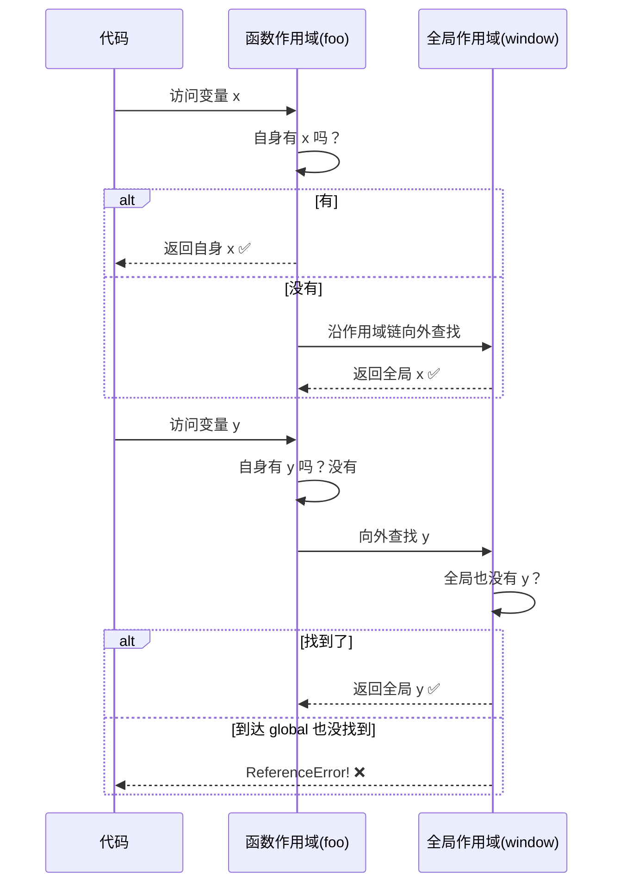

---
---
# JavaScript 基础知识点指南

> **版本**: 1.0 | **更新日期**: 2026-06-14 | **适用范围**: ES3 - ES2024

---

## 第1章：JavaScript 概述

### 1.1 JavaScript 历史

```
时间线：
1995 ── Brendan Eich 在 Netscape 用 10 天设计出 JavaScript（最初叫 Mocha → LiveScript）
1996 ── 微软在 IE 中实现 JScript（JavaScript 的克隆版）
1997 ── ECMA 国际组织制定 ECMAScript 标准（ES1）
1999 ── ES3 发布（加入 try/catch、正则等，被广泛支持）
2009 ── ES5 发布（严格模式、JSON、Array 方法等）
2015 ── ES6/ES2015 发布（重大更新：class、模块、箭头函数、Promise 等）
2016+ ── 每年发布一个新版本（ES2016~ES2024）
```

**关键里程碑：**

| 版本 | 年份 | 核心特性 |
|------|------|----------|
| ES1 | 1997 | 首次标准化 |
| ES3 | 1999 | try/catch、正则、switch |
| ES5 | 2009 | 严格模式、JSON、Array 方法、Object 方法 |
| ES6/ES2015 | 2015 | class、模块化、箭头函数、Promise、let/const、解构、模板字符串 |
| ES2016 | 2016 | Array.prototype.includes、指数运算符 ** |
| ES2017 | 2017 | async/await、Object.values/entries、String padding |
| ES2018 | 2018 | 异步迭代、Promise.finally、Rest/Spread 属性 |
| ES2019 | 2019 | Array.prototype.flat/flatMap、Object.fromEntries、trimStart/End |
| ES2020 | 2020 | 可选链 ??.、空值合并 ??、BigInt、dynamic import |
| ES2021 | 2021 | 逻辑赋值运算符、Promise.any、数字分隔符、replaceAll |
| ES2022 | 2022 | 顶层 await、at()、Object.hasOwn、Error.cause、私有字段 |
| ES2023 | 2023 | findLast/findLastIndex、Hashbang、Change Array by copy |
| ES2024 | 2024 | Promise.withResolvers、Object.groupBy、RegExp v flag |

### 1.2 JS 在浏览器与 Node.js 中的角色

```javascript
// ==================== 浏览器环境 ====================
// JavaScript 在浏览器中主要负责：
// 1. DOM 操作 - 操作页面结构和样式
// 2. 事件处理 - 用户交互响应
// 3. 网络请求 - AJAX/Fetch API
// 4. 本地存储 - localStorage/sessionStorage
// 5. 动画与多媒体 - Canvas/WebGL/Web Audio

// 浏览器提供的全局对象是 window
console.log(window === this); // true（在全局作用域中）

// ==================== Node.js 环境 ====================
// JavaScript 在 Node.js 中主要用于：
// 1. 服务器端开发 - HTTP 服务、API 接口
// 2. 文件系统操作 - fs 模块
// 3. 数据库操作 - 通过驱动连接数据库
// 4. 命令行工具 - CLI 开发
// 5. 构建工具 - webpack/vite/rollup 等
```

### 1.3 JavaScript 特性概览

```javascript
// ========== 特性 1: 动态类型 ==========
let dynamic = 42;          // Number
dynamic = "hello";         // String
dynamic = true;            // Boolean
dynamic = { key: "value" }; // Object

// ========== 特性 2: 单线程 ==========
console.log("1");           // 同步执行
setTimeout(() => {
  console.log("2");         // 异步宏任务
}, 0);
console.log("3");           // 同步执行
// 输出顺序: 1 -> 3 -> 2

// ========== 特性 3: 事件驱动 ==========
const EventEmitter = require('events');
class MyEmitter extends EventEmitter {}
const emitter = new MyEmitter();
emitter.on('event', () => console.log('事件触发了！'));
emitter.emit('event');

// ========== 特性 4: 原型继承 ==========
function Animal(name) {
  this.name = name;
}
Animal.prototype.speak = function() {
  console.log(`${this.name} 发出了声音`);
};

function Dog(name, breed) {
  Animal.call(this, name);
  this.breed = breed;
}
Dog.prototype = Object.create(Animal.prototype);
Dog.prototype.constructor = Dog;

const dog = new Dog("旺财", "金毛");
dog.speak(); // 旺财 发出了声音
```

---

#### 本章要点速查

| 要点 | 关键词 |
|------|--------|
| 创始人 | Brendan Eich, Netscape, 1995 |
| 标准化 | ECMAScript (ECMA International) |
| 重大版本 | ES3(1999), ES5(2009), ES6/ES2015(2015) |
| 运行环境 | 浏览器(window), Node.js(global) |
| 核心特性 | 动态类型、单线程、事件驱动、原型继承 |

---

## 第2章：变量与数据类型

### 2.1 变量声明：var / let / const

```javascript
// ==================== var 的特性 ====================
// 1. 函数作用域（非块级作用域）
function varExample() {
  if (true) {
    var x = 10;  // var 不受块级作用域限制
  }
  console.log(x); // 10 - 可以访问到 if 块内的变量
}

// 2. 变量提升（Hoisting）- 声明提升到函数顶部
console.log(y);  // undefined（不是报错！因为提升了声明）
var y = 20;

// 3. 允许重复声明
var z = 1;
var z = 2;        // 不会报错，静默覆盖

// 4. 全局声明会成为 window 对象的属性
var globalVar = "我是全局的";
console.log(window.globalVar); // "我是全局的"

// ==================== let 的特性 ====================
// 1. 块级作用域
{
  let a = 100;
  console.log(a); // 100
}
// console.log(a); // ReferenceError: a is not defined

// 2. 暂时性死区（TDZ）
// console.log(b); // ReferenceError: Cannot access 'b' before initialization
let b = 200;

// 3. 不允许重复声明
let c = 1;
// let c = 2;     // SyntaxError: Identifier 'c' has already been declared

// 4. 全局声明不会成为 window 的属性
let globalLet = "我是 let 全局的";
console.log(window.globalLet); // undefined

// ==================== const 的特性 ====================
// 1. 具有 let 的所有特性（块级作用域、TDZ、不可重复声明）
// 2. 必须初始化
const d = 300;

// 3. 对于基本类型：值不可变
const PI = 3.14159;
// PI = 3.14;     // TypeError

// 4. 对于引用类型：引用地址不可变，但内容可修改
const arr = [1, 2, 3];
arr.push(4);      // ✅ 合法
// arr = [5, 6];  // ❌ 非法

// ==================== 三者对比表 ====================
/*
┌─────────┬──────────────┬────────────┬────────────┐
│ 特性     │     var      │    let     │   const    │
├─────────┼──────────────┼────────────┼────────────┤
│ 作用域   │ 函数作用域    │ 块级作用域  │ 块级作用域  │
│ 提升     │ 声明提升      │ TDZ        │ TDZ        │
│ 重复声明 │ ✅ 允许       │ ❌ 禁止     │ ❌ 禁止     │
│ 全局属性 │ 是 window    │ 否         │ 否         │
│ 初始化   │ 可选         │ 可选        │ 必须        │
│ 推荐     │ ❌ 避免       │ 需要重新赋值 │ 默认首选    │
└─────────┴──────────────┴────────────┴────────────┘
*/
```

### 2.2 数据类型体系

```javascript
// ==================== 类型系统总览 ====================
/*
                    JavaScript 类型
                         │
            ┌────────────┴────────────┐
            │                         │
        原始类型                   对象类型
   (Primitive)                  (Object)
            │                         │
   ┌────────┼────────┐               │
Undefined Boolean Null      Array Function
 Number  BigInt String      Date    RegExp
          Symbol             Map/Set  ...
*/

// ==================== 7 种原始类型 ====================

// 1. Undefined - 变量已声明但未赋值
let undeclared;
console.log(typeof undeclared); // "undefined"

// 2. Null - 表示"无"的对象引用
let empty = null;
console.log(typeof empty);       // "object" ⚠️ 著名 bug

// 3. Boolean - 逻辑真假值
let isTrue = true;

// 4. Number - 双精度 64 位浮点数
let integer = 42;
let hex = 0xFF;                 // 255
let notANumber = NaN;
console.log(0.1 + 0.2);        // 0.30000000000000004（浮点精度问题）

// 5. BigInt - 任意精度整数（ES2020）
let bigNum = 9007199254740991n;

// 6. String - 文本数据
let template = `模板字符串 ${1 + 2}`;
let emoji = "🎉";

// 7. Symbol - 唯一且不可变的值（ES6）
let sym1 = Symbol("描述");
let sym2 = Symbol("描述");
console.log(sym1 === sym2);  // false - 每个 Symbol 都是唯一的

// ==================== Object（对象类型）====================
let person = { name: "Bob", age: 30 };
let colors = ["red", "green", "blue"];
function greet() { return "Hello!"; }
```

### 2.3 类型转换规则

```javascript
// ==================== 显式类型转换 ====================
String(123);          // "123"
Number("123");        // 123
Boolean(0);           // false
!!value;              // 快速转布尔值

// ==================== 隐式类型转换规则 ====================
console.log(1 + "2");     // "12"（拼接）
console.log("" == 0);         // true
console.log(null == undefined);// true
console.log(NaN == NaN);      // false
console.log([] == ![]);       // true（经典面试题）
```

### 2.4 typeof 运算符

```javascript
typeof undefined;           // "undefined"
typeof null;                // "object" ⚠️ 历史遗留 bug
typeof {};                  // "object"
typeof [];                  // "object"（数组也是 object！）
typeof function(){};        // "function"

// 精确检测方案
function getType(obj) {
  return Object.prototype.toString.call(obj).slice(8, -1);
}
getType(null);          // "Null" ← 正确识别了 null
getType([]);            // "Array"
```

### 2.5 instanceof 原理与限制

```javascript
// 原理：沿原型链向上查找 Constructor.prototype 是否在 obj 的原型链上
[] instanceof Array;   // true
[] instanceof Object;  // true
42 instanceof Number;  // false（基本类型总是返回 false）

// 最可靠检测
Array.isArray([]);  // true
```

### 2.6 Object.is() 与 === 的区别

```javascript
/*
┌──────────────────┬───────────┬────────────┐
│     表达式         │   ===     │ Object.is  │
├──────────────────┼───────────┼────────────┤
│ NaN === NaN       │  false    │   true     │
│ +0 === -0         │  true     │   false    │
│ 其他所有情况       │  相同     │   相同     │
└──────────────────┴───────────┴────────────┘
*/
```

### 2.7 值类型 vs 引用类型

```javascript
// 值类型：复制值
let num1 = 10;
let num2 = num1;
num2 = 20;
console.log(num1); // 10（不受影响）

// 引用类型：复制引用
let obj1 = { name: "Alice" };
let obj2 = obj1;
obj2.name = "Bob";
console.log(obj1.name); // "Bob"（被影响！）

// 深拷贝方法
let deep1 = JSON.parse(JSON.stringify(original)); // 有局限性
let deep2 = structuredClone(original);           // 现代推荐
```

```
JavaScript 内存模型
━━━━━━━━━━━━━━━━━━━━━━━━━━━━━━━━━━━━━━━
栈内存 (Stack)                    堆内存 (Heap)
┌─────────────────┐              ┌──────────────────────┐
│                 │              │                      │
│  let a = 10     │              │  let obj = {         │
│  ┌──────┐       │              │    name: "Tom",      │
│  │  10  │ ← a   │              │    age: 25           │
│  └──────┘       │              │  }                   │
│                 │              │  ┌────────────────┐    │
│  let b = "hello"│              │  │ name: "Tom"   │←obj│
│  ┌──────────┐   │              │  │ age: 25       │    │
│  │ "hello" │← b │              │  └────────────────┘    │
│  └──────────┘   │              │     ↑ obj 引用指向这里  │
│                 │              │                      │
└─────────────────┘              └──────────────────────┘

特点:
- 栈：空间小、分配快、自动释放（随函数调用）
- 堆：空间大、手动管理、GC 回收
- 原始类型 → 存栈（值拷贝）
- 对象类型 → 存堆（引用拷贝）
```

---

#### 本章要点速查

| 要点 | 关键信息 |
|------|----------|
| var/let/const | 优先用 const，其次 let，避免 var |
| 7 种原始类型 | Undefined, Null, Boolean, Number, BigInt, String, Symbol |
| typeof null | 返回 "object"，用 toString 精确检测 |
| 类型转换 | 隐式转换复杂，建议始终使用 === |
| 值 vs 引用 | 原始类型存栈（值拷贝），对象存堆（引用拷贝） |

---

## 第3章：运算符与表达式

### 3.1 运算符分类

```javascript
// 13 类运算符总览：

// 1. 算术: + - * / % ** ++ --
// 2. 比较: > < >= <= == === != !==
// 3. 逻辑: && || !
// 4. 位: & | ^ ~ << >> >>>
// 5. 赋值: = += -= *= /= %= **= &&= ||= ??=
// 6. 字符串: + （拼接）、模板字符串
// 7. 条件: ? : （三元）
// 8. 逗号: , （从左到右，返回最后一个）
// 9. void: void 0 → undefined
// 10. in: 检查属性是否存在
// 11. delete: 删除对象属性
// 12. instanceof: 原型链检测
// 13. 可选链: ?. 安全访问嵌套
// 14. 空值合并: ?? null/undefined 时返回右侧

// 逻辑赋值运算符（ES2021）
user.age ||= 18;       // falsy 时赋值
user.id ??= "default"; // null/undefined 时赋值
```

### 3.2 运算符优先级表格

```
级别  运算符                           说明
━━━━━━━━━━━━━━━━━━━━━━━━━━━━━━━━━━━━━
 1    . [] () ?.                      成员访问、调用、可选链
 2    new                             new（带参数列表）
 3    ++ --                           后置递增/递减
 4    ! ~ + - ++ -- typeof void delete  一元运算符
 5    **                              幂运算（右结合）
 6    * / %                           乘除模
 7    + -                             加减
 8    << >> >>>                       移位
 9    < <= > >= in instanceof         关系比较
10    == != === !==                   相等性
11    &                               按位与
12    ^                               按位异或
13    |                               按位或
14    &&                              逻辑与
15    ||                              逻辑或
16    ??                              空值合并
17    ?:                               条件（三元）（右结合）
18    = += -= ...                     赋值
19    ,                               逗号
```

### 3.3 短路求值

```javascript
// && 短路：第一个为 falsy 则返回它
true && "hello";     // "hello"
false && "hello";    // false

// || 短路：第一个为 truthy 则返回它
false || "default";  // "default"

// ?? 短路：只对 null/undefined 触发默认值
0 ?? "default";          // 0 ✅
"" ?? "default";         // "" ✅
null ?? "default";       // "default"

// ?. 短路：遇 null/undefined 返回 undefined
user?.address?.city;     // undefined（安全）
```

### 3.4 空值合并 ?? 与逻辑或 || 的区别

```javascript
/*
┌──────────────┬──────────────────┬────────────────────┐
│     值        │  a || default    │  a ?? default     │
├──────────────┼──────────────────┼────────────────────┤
│ null/undefined│  default         │  default          │
│ false        │  false ✅        │  false ✅          │
│ 0            │  default ❌      │  0 ✅             │
│ ""           │  default ❌      │  "" ✅            │
└──────────────┴──────────────────┴────────────────────┘
*/
```

### 3.5 可选链操作符 ?.

```javascript
let city = user?.address?.city;           // 安全访问
let userName = user?.profile?.displayName ?? "匿名用户";

// 注意：不能用于赋值；对其他 falsy 值不短路
```

### 3.6 展开运算符 ...

```javascript
let merged = [...arr1, ...arr2];  // 数组合并
let clone = [...original];        // 克隆（浅拷贝）
let unique = [...new Set([1,2,2])]; // 去重
Math.max(...nums);              // 展开为参数
function sum(...args) {}         // 收集剩余参数
```

### 3.7 解构赋值

```javascript
let [first, , third] = [1, 2, 3];  // 跳过元素
let [x = 10] = [1];             // 默认值
let [head, ...tail] = [1, 2, 3]; // 剩余元素
[m, n] = [n, m];                // 交换变量

let { name: userName } = { name: "Bob" }; // 重命名
let { first, ...others } = { first: 1, second: 2 }; // 剩余属性

function createUser({ name, age = 18 }) {} // 函数参数解构
```

### 3.8 逗号运算符

```javascript
let result = (1, 2, 3, 4, 5); // 5（返回最后一个）
for (let i = 0, j = 10; i < 5; i++, j--) {} // 同时更新多个变量
```

---

#### 本章要点速查

| 要点 | 关键信息 |
|------|----------|
| 运算符优先级 | 成员 > 一元 > 算术 > 比较 > 逻辑 > 条件 > 赋值 > 逗号 |
| 短路求值 | \|\| 对 falsy 短路，?? 对 null/undefined 短路 |
| 可选链 ?. | 安全访问嵌套属性，遇 null/undefined 返回 undefined |
| 展开 ... | 数组合并、对象合并、剩余参数收集 |
| 解构 | 数组/对象/嵌套/默认值/剩余，配合函数参数强大 |
| ?? vs \|\| | ?? 只对 null/undefined 触发默认值 |

---

## 第4章：流程控制

### 4.1 条件语句

```javascript
if (score >= 90) { console.log("优秀"); }
else if (score >= 80) { console.log("良好"); }
else { console.log("不及格"); }

switch (day) {
  case 1: dayName = "周一"; break;
  case 6: case 7: dayName = "周末"; break;
  default: dayName = "无效";
}

let status = age >= 18 ? "成年" : "未成年";
```

### 4.2 循环语句

```javascript
// for / while / do-while / for-in / for-of

for (let key in person) { /* 遍历对象键 */ }
for (let color of colors) { /* 遍历可迭代值 */ }
for (let [index, value] of colors.entries()) {} // 同时获取索引

// label 控制嵌套循环
outer: for (let i = 0; i < 3; i++) {
  for (let j = 0; j < 3; j++) {
    if (i === 1 && j === 1) break outer;
  }
}
```

### 4.3 for...in vs for...of

```javascript
/*
┌──────────────┬──────────────────────┬──────────────────────┐
│    特性        │     for...in         │     for...of         │
├──────────────┼──────────────────────┼──────────────────────┤
│ 遍历目标      │ 对象的可枚举属性       │ 可迭代对象的值        │
│ 返回值        │ 键（字符串）          │ 值                   │
│ 适用对象      │ 普通 Object           │ Array/String/Map/Set │
│ 遍历原型链    │ ✅ 包含               │ ❌ 不包含            │
└──────────────┴──────────────────────┴──────────────────────┘
*/
```

### 4.4 异常处理

```javascript
try { riskyOperation(); } 
catch (error) { console.error(error.message); } 
finally { console.log("清理资源"); }

// catch 参数可省略（ES2019）
try { mightFail(); } catch { console.log("出错了"); }

throw new Error("消息");
throw new TypeError("类型错误");
```

### 4.5 错误对象层次结构

```javascript
/*
                    Error (基类)
                      │
        ┌─────────────┼─────────────┐
        │             │             │
    EvalError    RangeError   ReferenceError
        │        SyntaxError   TypeError
        │        URIError
        │
    AggregateError (ES2021)
*/
```

---

#### 本章要点速查

| 要点 | 关键信息 |
|------|----------|
| 条件语句 | if/else、switch（多分支）、三元（简单条件） |
| 循环 | for（计数）、while/do-while（条件）、for-of（迭代）、for-in（对象属性） |
| 异常处理 | try/catch/finally；catch 参数可省略 |
| Error 体系 | Error → TypeError/ReferenceError/SyntaxError/RangeError/AggregateError |

---

## 第5章：函数进阶

### 5.1 函数定义方式

```javascript
// 函数声明（提升）
function sayHello() {}

// 函数表达式（不提升）
const sayBye = function() {};

// 箭头函数（无 this/arguments/prototype）
const double = (x) => x * 2;
const createUser = (name, age) => ({ name, age });

// Generator 函数
function* idGenerator() { yield 1; yield 2; }

// 函数是一等公民（可赋值、传参、返回、存储）
```

### 5.2 this 指向的 4 种绑定规则

```javascript
/*
优先级：new > 显式(call/apply/bind) > 隐式(对象方法) > 默认(独立调用)
特殊：箭头函数继承外层 this
*/

showThis(); // Window / undefined（严格模式）
user.greet(); // this = user
introduce.call(person, "Hi");
const bound = introduce.bind(person);
const alice = new User("Alice"); // this = 新实例

// 箭头函数继承外层 this
const team = {
  showMembers() {
    this.members.forEach(member => console.log(member, this.name));
  }
};
```

### 5.3 call / apply / bind

```javascript
/*
┌──────────┬──────────────────────┬────────────────────┬────────────────────┐
│          │       call           │      apply         │      bind          │
├──────────┼──────────────────────┼────────────────────┼────────────────────┤
│ 调用方式  │ 立即调用             │ 立即调用            │ 返回新函数（延迟）  │
│ 传参方式  │ 逐个参数             │ 参数数组            │ 逐个参数            │
└──────────┴──────────────────────┴────────────────────┴────────────────────┘
*/

// 场景：call 借用方法
Array.prototype.slice.call(arguments);

// 场景：bind 柯里化
const double = multiply.bind(null, 2);
```

### 5.4 参数处理

```javascript
// 默认参数
function createUser(name, age = 18, city = "北京") {}

// 剩余参数
function sumAll(first, ...rest) {}

// arguments 对象（非箭头函数）
function showArgs() { console.log(Array.from(arguments)); }

// 参数解构
function displayUser({ name, age, city = "未知" }) {}
```

### 5.5 闭包原理与应用

```javascript
// 本质：闭包 = 函数 + 词法环境（Lexical Environment）

// 经典应用：

// 1. 模块模式
const Module = (function() {
  let privateVar = "private";
  return { get() { return privateVar; };
})();

// 2. 柯里化
function curry(fn) {
  return function curried(...args) {
    if (args.length >= fn.length) return fn.apply(this, args);
    return (...more) => curried(...args, ...more);
  };
}

// 3. 防抖
function debounce(fn, delay = 300) {
  let timer;
  return function(...args) {
    clearTimeout(timer);
    timer = setTimeout(() => fn.apply(this, args), delay);
  };
}

// 4. 节流
function throttle(fn, interval = 300) {
  let lastTime = 0;
  return function(...args) {
    const now = Date.now();
    if (now - lastTime >= interval) { fn.apply(this, args); lastTime = now; }
  };
}

// 5. 缓存/Memoization
function memoize(fn) {
  const cache = new Map();
  return function(...args) {
    const key = JSON.stringify(args);
    if (cache.has(key)) return cache.get(key);
    const result = fn.apply(this, args);
    cache.set(key, result);
    return result;
  };
}
```

```
闭包 = 函数 + 词法环境（Lexical Environment）
━━━━━━━━━━━━━━━━━━━━━━━━━━━━━━━━━━━━━━━━━━━━━

function createCounter() {
    let count = 0;          // ← 自由变量（free variable）
                            //
    return function() {     // ← 闭包函数
        return ++count;     // ← 引用了外部的 count
    };
}

const counter = createCounter();
counter(); // 1
counter(); // 2

内存布局:

┌─────────────────────────────────────────────────┐
│ 全局作用域 (Global Scope)                       │
│   counter → ──────────────────────────────┐     │
└───────────────────────────────────────────┼─────┘
                                            │ 引用
┌───────────────────────────────────────────▼─────┐
│ createCounter() 的词法环境 (LE)                  │
│                                                   │
│   ┌─────────────────────────────────────┐        │
│   │ count: 0 (初始值)                  │        │
│   └─────────────────────────────────────┘        │
│                    ▲                           │
│                    │ 持有 (closure holds ref)     │
│                    │                           │
│   ┌─────────────────────────────────────┐        │
│   │ 闭包函数 { return ++count }          │        │
│   │ [[Scope]] ─────────────────→ LE      │  ← 闭包
│   └─────────────────────────────────────┘        │
│                                                   │
└───────────────────────────────────────────────────┘

关键点: 即使 createCounter() 执行完毕，其词法环境仍被
      闭包函数引用，所以 count 不会被 GC 回收！
```

### 5.6 高阶函数

```javascript
numbers.map(n => n * 2);           // 映射
numbers.filter(n => n % 2 === 0);   // 过滤
numbers.reduce((acc, n) => acc + n, 0); // 归约
numbers.find(n => n > 3);          // 查找元素
numbers.some(n => n > 3);          // 是否存在
numbers.every(n => n > 0);         // 是否全部
numbers.sort((a, b) => a - b);     // 排序（原地修改！）
numbers.forEach((n, i) => {});     // 遍历

// 链式调用
const result = numbers.filter(n => n % 2 === 0).map(n => n * n).reduce((s, n) => s + n, 0);
```

### 5.7 纯函数与副作用

```javascript
// 纯函数：相同输入→相同输出，无副作用
function add(a, b) { return a + b; }

// 好处：可预测、可测试、可缓存、可并行

// 函数式原则：不可变性、隔离副作用、函数组合
const compose = (f, g) => x => f(g(x));
```

### 5.8 IIFE

```javascript
(function() { /* 独立作用域 */ })();
(() => { /* 箭头 IIFE */ })();
(function(name) { console.log(name); })("World");

// 现代替代：块级作用域 {}、let/const、ES Modules
```

### 5.9 Generator 函数

```javascript
function* numberGenerator() {
  yield 1; yield 2; yield 3;
}
const gen = numberGenerator();
gen.next(); // { value: 1, done: false }

// yield* 委托
function* outer() { yield "a"; yield* inner(); yield "c"; }

// 应用：无限序列、异步迭代、状态机
function* fibonacci() {
  let [prev, curr] = [0, 1];
  while (true) { yield curr; [prev, curr] = [curr, prev + curr]; }
}
```

### 5.10 async/await

```javascript
async function fetchData() {
  const response = await fetch("/api/data");
  return await response.json(); // 始终返回 Promise
}

// 错误处理
try { await riskyOp(); } catch (e) { /* 处理 */ }

// 并行 vs 串行
// 并行（快）：Promise.all([fetch1, fetch2, fetch3])
```

---

#### 本章要点速查

| 要点 | 关键信息 |
|------|----------|
| 函数定义 | 声明（提升）、表达式、箭头（无 this）、Generator |
| this 绑定 | new > 显式 > 隐式 > 默认；箭头函数继承外层 |
| call/apply/bind | call(逐参)/apply(数组)立即调用；bind 返回新函数 |
| 闭包 | 函数 + 词法环境；模块模式、柯里化、防抖节流、缓存 |
| 高阶函数 | map/filter/reduce/find/some/every/sort/forEach |
| async/await | Promise 语法糖；try/catch 错误处理；Promise.all 并行 |

---

## 第6章：对象与原型链

### 6.1 对象创建方式

```javascript
// 1. 字面量（最常用）
const person = { name: "Alice" };

// 2. Object.create()
const dog = Object.create(animal);

// 3. new 构造函数
function Car(brand) { this.brand = brand; }
Car.prototype.drive = function() {};

// 4. 工厂模式
function createUser(name) { return { name, greet() {} }; }

// 5. ES6 Class（推荐）
class Person { constructor(name) { this.name = name; } }
```

### 6.2 属性描述符

```javascript
// 属性描述符：value, writable, enumerable, configurable, get, set

Object.defineProperty(config, "version", {
  value: "1.0",
  writable: false,
  enumerable: true,
  configurable: false
});

// Getter/Setter
const account = {
  _balance: 0,
  get balance() { return this._balance; },
  set balance(v) { if (v >= 0) this._balance = v; }
};
```

### 6.3 属性遍历方式对比

```javascript
/*
┌────────────────────┬────────┬────────┬────────┬────────┐
│ 方法                │自身属性 │Symbol  │原型链  │不可枚举│
├────────────────────┼────────┼────────┼────────┼────────┤
│ for...in            │✅      │❌      │✅      │❌      │
│ Object.keys         │✅      │❌      │❌      │❌      │
│ Object.values       │✅      │❌      │❌      │❌      │
│ Object.entries      │✅      │❌      │❌      │❌      │
│ getOwnPropertyNames │✅      │❌      │❌      │✅      │
│ getOwnPropertySymbols│✅     │✅      │❌      │-       │
└────────────────────┴────────┴────────┴────────┴────────┘
*/
```

### 6.4 原型与原型链

```javascript
// 三角关系图：
/*
Function.prototype ←—— Function (构造函数)
  ↑ constructor        prototype
  │                     ↑
  └── Person.prototype ←—— Person (构造函数)
        constructor     prototype
        ↑                   ↑
        └── person 实例     __proto__
*/

// 原型链查找过程
person.toString(); 
// 1. 查找 person 自身 → 没有
// 2. 查找 Person.prototype → 没有
// 3. 查找 Object.prototype → 找到了！

person.hasOwnProperty("name");  // true（仅自身属性）
"name" in person;               // true（含原型链）
```

```
原型链三角关系 (Prototype Triangle)
━━━━━━━━━━━━━━━━━━━━━━━━━━━━━━━━━━━━

                    ┌──────────────┐
                    │   Function   │  （所有函数的原型对象）
                    └──────┬───────┘
                           │
           (Function.prototype)
                           │
            ┌──────────────┴──────────────┐
            ▼                              ▼
   ┌─────────────────┐            ┌─────────────────┐
   │ Function.prototype│            │   Object.prototype│
   │   apply()       │            │   toString()     │
   │   call()        │            │   hasOwnProperty()│
   │   bind()        │            │   valueOf()       │
   │   ...           │            │   isPrototypeOf() │
   └────────┬────────┘            └────────┬────────┘
            │                               │
            │ (Object.prototype 是原型链顶端)     │
            └──────────────┬────────────────┘
                           │
         ┌───────────────┼───────────────┐
         ▼               ▼               ▼
   ┌──────────┐   ┌──────────┐   ┌──────────┐
   │   Array  │   │   String │   │  Number  │
   │ .prototype│   │.prototype│   │.prototype│
   │  push()  │   │ indexOf()│   │ toFixed()│
   │  pop()   │   │ slice()  │   │ parseInt()│
   └─────┬────┘   └─────┬────┘   └─────┬────┘
         │               │               │
         └───────────────┴───────────────┘
                         │
                         ▼
                ┌────────────────┐
                │      null      │  ← 原型链终点！
                └────────────────┘
实例对象的 __proto__ 链：

  const arr = [1, 2, 3];
  
  arr ─→ Array.prototype ─→ Object.prototype ─→ null
         (push/pop/etc)      (toString/etc)

  arr.__proto__ === Array.prototype     // true
  arr.__proto__.__proto__ === Object.prototype  // true
  arr.__proto__.__proto__.__proto__ === null       // true
```

### 6.5 继承方案演进

```javascript
// 1. 原型链继承 → 2. 构造函数继承 → 3. 组合继承 → 4. 寄生组合继承 → 5. class extends

// 寄生组合继承（最佳 ES5 方案）
Child.prototype = Object.create(Parent.prototype);
Child.prototype.constructor = Child;

// ES6 class extends（推荐）
class Child extends Parent {
  constructor(name) { super(name); }
}
```

### 6.6 Object.create(null) 的用途

```javascript
// 创建纯净对象（无原型，无 toString 等方法）
const dict = Object.create(null);
dict.key = "value";
dict.toString; // undefined
// 用途：字典/Map 替代、消除原型链干扰
```

### 6.7 冻结与密封

```javascript
Object.freeze(obj);    // 冻结（不可增删改属性值）
Object.seal(obj);      // 密封（不可增删，但可改已有属性值）
Object.isFrozen(obj);  // 检测是否冻结
Object.isSealed(obj);  // 检测是否密封
```

---

#### 本章要点速查

| 要点 | 关键信息 |
|------|----------|
| 对象创建 | 字面量 > Object.create > new > 工厂 > Class |
| 属性描述符 | value/writable/enumerable/configurable/get/set |
| 原型链 | prototype/__proto__/constructor 三角关系 |
| 继承演进 | 原型链→构造函数→组合→寄生组合→class extends |
| 冻结/密封 | freeze（完全不可变）、seal（不可增删） |

---

## 第7章：ES6+ 类（Class）

### 7.1 class 语法

```javascript
class Person {
  species = "人类";           // 实例属性（新写法）
  #privateField = "私密";      // 私有字段（#）

  constructor(name, age) {
    this.name = name;
    this.age = age;
  }

  greet() { return `Hi, I'm ${this.name}`; }
  get info() { return `${this.name}, ${this.age}岁`; }
  
  static create(name) { return new Person(name); }  // 静态方法
  static species = "Homo sapiens";                // 静态属性
}
```

### 7.2 extends + super

```javascript
class Student extends Person {
  #studentId;

  constructor(name, age, studentId) {
    super(name, age);  // 必须先调用 super()
    this.#studentId = studentId;
  }

  greet() { return `${super.greet()} (学号: ${this.#studentId})`; }
}
```

### 7.3 静态属性和方法

```javascript
class MathUtil {
  static PI = 3.14159;
  static circleArea(radius) { return this.PI * radius * radius; }
}
MathUtil.circleArea(10); // 314.159

// 静态方法可以被继承
class AdvancedMath extends MathUtil {}
AdvancedMath.circleArea(5); // 可以调用
```

### 7.4 实例属性的新写法

```javascript
class MyClass {
  count = 0;                  // 公共字段
  #secret = "hidden";        // 私有字段（#）
  static type = "MyClass";    // 静态公共字段
  static #instanceCount = 0;  // 静态私有字段
}
```

### 7.5 new.target

```javascript
class Shape {
  constructor() {
    if (new.target === Shape) {
      throw new Error("Shape 是抽象类，不能直接实例化");
    }
  }
}
new Circle(); // OK
new Shape();  // Error
```

### 7.6 类与构造函数的关系

```javascript
// class 是构造函数的语法糖
// 区别：不提升、内部严格模式、方法不可枚举、必须 new、支持 # 私有字段
```

---

#### 本章要点速查

| 要点 | 关键信息 |
|------|----------|
| class 语法 | constructor/static/methods/getters/setters/private # |
| extends | 继承父类；constructor 中必须先调用 super() |
| 静态成员 | static 关键字；可通过继承访问 |
| 实例属性 | 类体中直接定义；# 表示私有字段 |
| 本质 | 构造函数的语法糖；内部严格模式 |

---

## 第8章：作用域与闭包

### 8.1 词法作用域 vs 动态作用域

```javascript
// JavaScript 采用词法作用域（静态作用域）
// 作用域在代码定义时就确定了，而非运行时
```

### 8.2 作用域类型

```javascript
// 1. 全局作用域：最外层
// 2. 函数作用域：function 内部（var）
// 3. 块级作用域：{} 内部（let/const）
```

### 8.3 作用域链查找机制

```
查找顺序：当前作用域 → 外层作用域 → ... → 全局作用域
```



```
变量提升（Hoisting）行为对比
━━━━━━━━━━━━━━━━━━━━━━━━━━━━━━━━━━━━━━━━━━━━━━━━
声明方式      创建阶段      初始化阶段      使用范围
━━━━━━━━━━━━━━━━━━━━━━━━━━━━━━━━━━━━━━━━━━━━━━━━
var a          undefined      可重新赋值       函数作用域（非块级）
let b          TDZ 死区       声明行初始化     块级作用域
const c        TDZ 死区       声明行初始化（必须） 块级作用域
func d(){}     整个函数体     跳过             函数作用域
class E{}      TDZ 死区       整个类定义        块级作用域

TDZ = Temporal Dead Zone（暂时性死区）
在声明之前访问 let/const/class 变量会抛出 ReferenceError
```

### 8.4 变量提升（Hoisting）

```javascript
// var: 声明提升到顶部
// let/const: 进入 TDZ（暂时性死区）
// function: 整个函数体被提升
// 函数表达式: 只有变量声明提升
// class: 声明提升但进入 TDZ
// import: 静态提升
```

### 8.5 IIFE 与块级作用域

```javascript
// ES5 用 IIFE 模拟块级作用域
(function() { var temp = "safe"; })();

// ES6+ 用块级作用域替代
{ let temp = "safe"; }
```

### 8.6 闭包的本质

```javascript
// 闭包 = 函数 + 该函数声明时的词法环境
// 即使函数在其词法环境之外执行，仍能访问该环境中的变量
```

### 8.7 经典闭包面试题

```javascript
// 循环 + 定时器问题
for (var i = 0; i < 3; i++) {
  setTimeout(() => console.log(i), 100); // 输出: 3 3 3 ❌
}

// 解决方案:
// 1. IIFE: (function(j) { setTimeout(() => console.log(j), 100); })(i);
// 2. let: for (let i = 0; i < 3; i++) { setTimeout(() => console.log(i), 100); }
// 3. 传参: setTimeout(console.log, 100, i);
```

### 8.8 内存泄漏场景及预防

```javascript
// 1. 意外的全局变量
// 2. 被遗忘的定时器/回调
// 3. 闭包持有不必要的引用
// 4. DOM 引用
// 5. Maps/Sets 持有对象引用

// 预防：严格模式、及时清除引用、使用 WeakMap/WeakSet
```

---

#### 本章要点速查

| 要点 | 关键信息 |
|------|----------|
| 作用域类型 | 全局、函数、块级（let/const） |
| 作用域链 | 从当前作用域向外层逐级查找 |
| 提升 | var(声明)、function(整体)、let/const/class(TDZ) |
| 闭包本质 | 函数 + 词法环境；持久保存对外部变量的引用 |
| 经典面试题 | 循环+定时器：用 let/IIFE/传参解决 |
| 内存泄漏 | 全局变量、定时器、DOM 引用、闭包、Map |

---

## 第9章：异步编程

### 9.1 单线程模型与事件循环

```javascript
/*
Event Loop 执行流程：
1. 执行同步代码（Call Stack）
2. Stack 为空时，清空 Microtask Queue（全部微任务）
3. 取一个 Macrotask 执行
4. 重复 2-3

微任务: Promise.then/MutationObserver/queueMicrotask
宏任务: setTimeout/setInterval/I/O/UI渲染
*/

console.log("1");
setTimeout(() => console.log("2"), 0);
Promise.resolve().then(() => console.log("3"));
console.log("5");
// 输出: 1 → 5 → 3 → 2
```

```mermaid
flowchart TD
    Start([JS 引擎启动] --> Sync[执行同步代码<br/>压入 Call Stack]
    Sync --> StackEmpty{Call Stack 为空?}
    StackEmpty -->|否| Sync
    StackEmpty -->|是| Micro[清空微任务队列<br/>Microtask Queue]
    Micro --> MicroMore{微任务队列还有?}
    MicroMore -->|是| Micro
    MicroMore -->|否| Macro[取一个宏任务执行<br/>Macrotask Queue]
    Macro --> StackEmpty
    
    style Start fill:#e1f5fe
    style Micro fill:#fff3e0
    style Macro fill:#fce4ec
```

```
经典 Event Loop 输出顺序分析
━━━━━━━━━━━━━━━━━━━━━━━━━━━━━━━━━━━━━━━━━━━━━━━━━

console.log('1');                     // 同步 → 立即执行
setTimeout(() => console.log('2'), 0); // 宏任务 → 进入宏任务队列
Promise.resolve().then(() => 
  console.log('3')                  // 微任务 → 进入微任务队列
);
console.log('5');                     // 同步 → 立即执行

执行过程（逐步追踪）：

Step 1: Call Stack = ['1']              → 输出: 1
Step 2: Call Stack = ['1', '5']          → 输出: 5
        setTimeout 加入宏任务队列: [cb_2]
        Promise.then 加入微任务队列: [cb_3]

Step 3: Stack 清空 → 先清空微任务队列
        微任务队列: [cb_3] → 执行 cb_3 → 输出: 3
        微任务队列: [] (空)

Step 4: 取一个宏任务
        宏任务队列: [cb_2] → 执行 cb_2 → 输出: 2

最终输出: 1 → 5 → 3 → 2
```

### 9.2 Promise 详解

```javascript
// 三种状态：pending → fulfilled/rejected（不可逆）

promise.then(result => {}).catch(err => {}).finally(() => {});

// 静态方法
Promise.resolve(42);
Promise.reject(new Error());
Promise.all([p1, p2]);           // 全部成功才算成功
Promise.allSettled([p1, p2]);    // 等待全部完成
Promise.race([p1, p2]);           // 最先完成的
Promise.any([p1, p2]);           // 第一个成功的
```

### 9.3 async/await 详解

```javascript
async function fetchData() {
  const response = await fetch("/api/data");
  return await response.json(); // 始终返回 Promise
}

// 错误处理: try/catch 或 .catch
// 并行: Promise.all([fetch1, fetch2, fetch3])

// 重要: async 函数返回值始终是 Promise
// await 后非 Promise 会自动包装
```

### 9.4 异步编程模式演进

```javascript
// 回调地狱 → Promise 链式 → async/await（最终形态）
```

### 9.5 定时器原理

```javascript
setTimeout 最小延迟 4ms（连续 5 次以上调用时）
requestAnimationFrame - 下一次重绘前调用（~16ms）
requestIdleCallback - 浏览器空闲时执行
```

### 9.6 微任务 vs 宏任务完整对比表

```javascript
// 【知识点】对应第9章 异步编程

/*
┌─────────────────────────────────────────────────────────────────────┐
│                    Event Loop 任务类型完整对比                        │
├──────────────┬──────────┬─────────────────────┬─────────────────────┤
│     类型      │   分类   │        API          │     触发时机         │
├──────────────┼──────────┼─────────────────────┼─────────────────────┤
│ microtask    │ 微任务   │ Promise.then/       │ 同步代码结束后、      │
│              │          │ .catch/.finally     │ 渲染之前             │
├──────────────┼──────────┼─────────────────────┼─────────────────────┤
│ microtask    │ 微任务   │ queueMicrotask()    │ 显式加入微任务队列    │
├──────────────┼──────────┼─────────────────────┼─────────────────────┤
│ microtask    │ 微任务   │ MutationObserver    │ DOM 变化检测          │
├──────────────┼──────────┼─────────────────────┼─────────────────────┤
│ macrotask    │ 宏任务   │ setTimeout          │ 指定延迟后           │
├──────────────┼──────────┼─────────────────────┼─────────────────────┤
│ macrotask    │ 宏任务   │ setInterval         │ 定时重复             │
├──────────────┼──────────┼─────────────────────┼─────────────────────┤
│ macrotask    │ 宏任务   │ setImmediate(Node)  │ I/O 回调后           │
├──────────────┼──────────┼─────────────────────┼─────────────────────┤
│ macrotask    │ 宏任务   │ I/O callbacks       │ I/O 操作完成         │
├──────────────┼──────────┼─────────────────────┼─────────────────────┤
│ macrotask    │ 宏任务   │ UI Rendering        │ 浏览器渲染            │
└──────────────┴──────────┴─────────────────────┴─────────────────────┘
*/

// ==================== 微任务示例 ====================

// 1. Promise.then / catch / finally — 最常用的微任务
Promise.resolve('hello')
  .then(result => console.log('微任务1:', result))  // 微任务
  .catch(err => console.error('微任务错误:', err))
  .finally(() => console.log('微任务finally'));

// 2. queueMicrotask() — 显式创建微任务（ES2019）
queueMicrotask(() => {
  console.log('这是通过 queueMicrotask 创建的微任务');
});

// 3. MutationObserver — DOM 变化时触发微任务回调
const observer = new MutationObserver((mutations) => {
  console.log('DOM 发生了变化:', mutations);
});
// observer.observe(document.body, { childList: true });

// ==================== 宏任务示例 ====================

// 1. setTimeout — 延迟执行（最小延迟 4ms）
setTimeout(() => {
  console.log('宏任务: setTimeout');
}, 0);

// 2. setInterval — 定时重复执行
// const timer = setInterval(() => { console.log('定时器'); }, 1000);

// 3. setImmediate — Node.js 环境下立即执行（I/O 回调后）
// setImmediate(() => { console.log('Node.js 立即执行'); });

// ==================== 执行顺序验证 ====================
console.log('=== 开始 ===');           // 1. 同步代码
setTimeout(() => console.log('宏任务'), 0);  // 4. 最后执行（宏任务）
queueMicrotask(() => console.log('微任务(queueMicrotask)')); // 3. 微任务
Promise.resolve().then(() => console.log('微任务(Promise.then)')); // 3. 微任务
console.log('=== 结束 ===');           // 2. 同步代码
// 输出: 开始 → 结束 → 微任务(Promise.then) → 微任务(queueMicrotask) → 宏任务
```

| 类型 | 分类 | API | 触发时机 | 典型用途 |
|------|------|-----|----------|----------|
| microtask | 微任务 | Promise.then/.catch/.finally | 同步代码结束后、渲染前 | 异步回调 |
| microtask | 微任务 | queueMicrotask() | 显式加入微任务队列 | 手动调度微任务 |
| microtask | 微任务 | MutationObserver | DOM 变化检测 | DOM 变更监听 |
| macrotask | 宏任务 | setTimeout | 指定延迟后 | 延迟执行 |
| macrotask | 宏任务 | setInterval | 定时重复 | 轮询/定时器 |
| macrotask | 宏任务 | setImmediate (Node.js) | I/O 回调后 | Node.js 快速执行 |
| macrotask | 宏任务 | I/O callbacks | I/O 操作完成 | 文件/网络读取 |
| macrotask | 宏任务 | UI Rendering | 浏览器渲染 | 页面绘制 |

### 9.7 async/await 错误处理最佳实践

```javascript
// 【知识点】对应第9章 异步编程 + 第15章 错误处理

// ==================== 方式1：try/catch 包裹单个 await ====================
// 适用场景：需要对单个错误进行特殊处理

async function fetchSingleWithError() {
  try {
    const response = await fetch('/api/user');
    if (!response.ok) throw new Error(`HTTP ${response.status}`);
    const data = await response.json();
    console.log('用户数据:', data);
    return data;
  } catch (error) {
    // 单个 await 的专属错误处理
    console.error('获取用户失败:', error.message);
    return null; // 返回默认值，让调用方继续执行
  }
}

// ==================== 方式2：try/catch 包裹多个 await（统一捕获）====================
// 适用场景：多个异步操作共享同一个错误处理逻辑

async function fetchMultipleWithUnifiedCatch() {
  let user = null;
  let orders = [];

  try {
    // 多个 await 共享同一个 catch 块
    const [userRes, ordersRes] = await Promise.all([
      fetch('/api/user'),
      fetch('/api/orders')
    ]);

    user = await userRes.json();
    orders = await ordersRes.json();

    console.log('用户:', user, '订单:', orders);

  } catch (error) {
    // 统一处理所有可能的错误
    console.error('数据加载失败:', error.message);

    // 根据错误类型进行不同处理
    if (error instanceof TypeError) {
      console.error('网络连接问题，请检查网络');
    } else if (error.message.includes('401')) {
      console.error('登录已过期，请重新登录');
      // 可以在这里触发重新登录逻辑
    } else if (error.message.includes('500')) {
      console.error('服务器内部错误，请稍后重试');
    }

    // 设置默认值或回退数据
    user = { name: '游客', avatar: '/default.png' };
    orders = [];
  }

  return { user, orders }; // 即使出错也返回有效数据
}

// ==================== 方式3：.catch() 链式处理 ====================
// 适用场景：函数式编程风格，不想用 try/catch

async function fetchWithChainCatch() {
  const data = await fetch('/api/data')
    .then(response => {
      if (!response.ok) throw new Error(`请求失败: ${response.status}`);
      return response.json();
    })
    .catch(error => {
      console.error('链式捕获错误:', error.message);
      return { items: [], total: 0 }; // 返回空数据的兜底结构
    });

  return data;
}

// 更复杂的链式处理：分阶段捕获不同错误
async function complexChainHandling() {
  const result = await fetch('/api/config')
    .then(res => res.json())
    .then(config => {
      if (!config.apiKey) throw new Error('缺少 API Key');
      return config;
    })
    .then(config => fetch(`/api/data?key=${config.apiKey}`))
    .then(res => {
      if (!res.ok) throw new Error(`数据请求失败: ${res.status}`);
      return res.json();
    })
    .catch(error => {
      // 统一收集各阶段的错误
      console.error('链式流程出错:', error.message);
      return null;
    });

  return result;
}

// ==================== 方式4：to() 工具函数（推荐）====================
// 将 reject 转为 [error, result] 元组模式
// 这是 Node.js 社区广泛使用的模式（来自 go 语言的错误处理风格）

/**
 * to() - 将 Promise 转为 [error, result] 元组
 * @param {Promise} promise - 需要包装的 Promise
 * @returns {Promise<[Error|null, any]>} - [错误, 结果] 元组
 *
 * 【知识点】对应第5章 高阶函数 + 第9章 异步编程
 */
function to(promise) {
  return promise
    .then(data => [null, data])     // 成功: [null, data]
    .catch(error => [error, undefined]); // 失败: [error, undefined]
}

// 使用 to() 的示例
async function fetchWithToUtil() {
  // 不需要 try/catch，直接解构元组
  const [userErr, user] = await to(fetch('/api/user').then(r => r.json()));

  if (userErr) {
    console.error('获取用户失败:', userErr.message);
    return { user: null, posts: [] };
  }

  const [postsErr, posts] = await to(
    fetch(`/api/posts?userId=${user.id}`).then(r => r.json())
  );

  if (postsErr) {
    console.error('获取文章失败:', postsErr.message);
    return { user, posts: [] };
  }

  return { user, posts };
}

// 进阶版：to() 支持自定义默认值
function toWithDefault(promise, defaultValue = undefined) {
  return promise
    .then(data => [null, data])
    .catch(error => [error, defaultValue]);
}

// 使用带默认值的版本
async function exampleWithDefault() {
  const [err, config] = await toWithDefault(
    fetch('/api/config').then(r => r.json()),
    { theme: 'light', lang: 'zh-CN' } // 默认配置
  );

  // 即使请求失败，config 也是有效的默认对象
  applyTheme(config.theme); // 不会因为 config 为 undefined 而报错
}

// ==================== 方式5：并行请求中部分失败的处理 ====================
// 使用 Promise.allSettled 处理部分失败场景

async function parallelWithPartialFailure() {
  // 场景：同时请求多个独立的数据源，允许部分失败
  const requests = [
    fetch('/api/user-info').then(r => r.json()),      // 用户信息
    fetch('/api/notifications').then(r => r.json()),  // 通知列表
    fetch('/api/recommendations').then(r => r.json()), // 推荐内容
    fetch('/api/banners').then(r => r.json())          // 广告横幅
  ];

  // Promise.allSettled: 等待所有 Promise 完成（无论成功或失败）
  const results = await Promise.allSettled(requests);

  // 逐个检查结果状态
  const data = {
    userInfo: null,
    notifications: [],
    recommendations: [],
    banners: []
  };

  results.forEach((result, index) => {
    const keys = ['userInfo', 'notifications', 'recommendations', 'banners'];

    if (result.status === 'fulfilled') {
      // 成功：提取 value
      data[keys[index]] = result.value;
      console.log(`✅ ${keys[index]} 加载成功`);
    } else {
      // 失败：记录错误，使用默认值
      console.error(`❌ ${keys[index]} 加载失败:`, result.reason?.message);
      // data[keys[index]] 已经有默认值了
    }
  });

  return data; // 即使部分接口失败，也能返回有效的聚合数据
}

// 另一种模式：成功数达到阈值即视为成功
async function parallelWithThreshold(successThreshold = 3) {
  const requests = [
    fetch('/api/source-a').then(r => r.json()),
    fetch('/api/source-b').then(r => r.json()),
    fetch('/api/source-c').then(r => r.json()),
    fetch('/api/source-d').then(r => r.json()),
  ];

  const results = await Promise.allSettled(requests);

  const successfulData = results
    .filter(r => r.status === 'fulfilled')
    .map(r => r.value);

  const failedCount = results.filter(r => r.status === 'rejected').length;

  console.log(`成功: ${successfulData.length}, 失败: ${failedCount}`);

  if (successfulData.length >= successThreshold) {
    return { success: true, data: successfulData };
  } else {
    return {
      success: false,
      error: `成功率不足: ${successfulData.length}/${results.length}`,
      data: successfulData // 返回已成功的部分数据
    };
  }
}

// ==================== 方式6：async 函数中的同步异常处理 ====================
// 重要：async 函数中的同步异常也会被转为 rejected Promise

async function syncExceptionInAsync() {
  // 这些同步错误都会被自动包装成 rejected Promise
  // throw new Error('同步抛出错误');
  // undefined.property; // TypeError: 无法读取属性
  // JSON.parse('{invalid json}'); // SyntaxError

  // 因此调用方可以用统一的方式处理：
  try {
    const result = await someAsyncFunction(); // 可能包含同步异常
    return result;
  } catch (error) {
    // 这里既能捕获异步错误，也能捕获同步异常
    console.error('统一错误处理:', error.name, error.message);

    // 区分错误类型
    switch (error.constructor) {
      case TypeError:
        return handleTypeError(error);
      case SyntaxError:
        return handleSyntaxError(error);
      case ReferenceError:
        return handleReferenceError(error);
      default:
        return handleGenericError(error);
    }
  }
}

// 验证：同步异常在 async 函数中的行为
async function demonstrateSyncException() {
  console.log('开始执行');

  // 这里的 TypeError 是同步抛出的，但会被包装为 rejected Promise
  const result = await (() => {
    throw new TypeError('这是一个同步 TypeError');
  })();

  console.log('这行不会执行');
}

demonstrateSyncException().catch(error => {
  console.error('被捕获的同步异常:', error.name, error.message);
  // 输出: 被捕获的同步异常: TypeError 这是一个同步 TypeError
});

// ==================== 综合最佳实践总结 ====================

/*
┌─────────────────────────────────────────────────────────────────────┐
│                  async/await 错误处理策略选择指南                      │
├──────────────────────┬───────────────────────────────────────────────┤
│       场景           │               推荐方式                        │
├──────────────────────┼───────────────────────────────────────────────┤
│ 单个操作需特殊处理   │ try/catch 包裹单个 await                      │
│ 多个操作共享逻辑     │ try/catch 包裹多个 await                      │
│ 函数式/链式风格      │ .catch() 链式处理                              │
│ 大量异步操作         │ to() 工具函数（避免深层嵌套 try/catch）        │
│ 并行独立请求         │ Promise.allSettled（容忍部分失败）             │
│ 需要区分错误类型     │ instanceof 判断 + 分支处理                     │
│ 统一错误上报         │ 全局 unhandledrejection 监听                   │
└──────────────────────┴───────────────────────────────────────────────┘

核心原则：
1. 永远不要 "fire and forget" — 每个 async 函数都应该处理错误
2. 优先使用 to() 模式减少 try/catch 嵌套层级
3. 并行请求优先考虑 allSettled 而非 all
4. 在边界处（API 层、组件层）集中处理错误，而非每个 await 都处理
*/
```

---

#### 本章要点速查

| 要点 | 关键信息 |
|------|----------|
| 事件循环 | Stack 空 → 清空微任务 → 取一个宏任务 → 循环 |
| 微任务 | Promise.then/MutationObserver/queueMicrotask |
| 宏任务 | setTimeout/setInterval/I/O/UI渲染 |
| Promise | pending→fulfilled/rejected（不可逆）；all/allSettled/race/any |
| async/await | Promise 语法糖；try/catch 错误处理；并行用 Promise.all |

---

## 第10章：DOM 与 BOM

### 10.1 DOM 树结构

```javascript
/*
Document
├── DocumentType (<!DOCTYPE html>)
├── Element <html>
│   ├── Element <head> → Element <title> → Text
│   └── Element <body> → Element <div>, Comment, Text...

节点类型: Element(1), Text(3), Comment(8), Document(9), DocumentFragment(11)
*/
```

### 10.2 元素获取

```javascript
document.querySelector("#id");           // 单个元素
document.querySelectorAll(".class");      // NodeList
document.getElementById("id");

element.closest(".container"); // 查找最近匹配祖先
```

### 10.3 DOM 操作

```javascript
// 创建: createElement / createTextNode / createDocumentFragment
// 插入: appendChild / insertBefore / prepend / before / after
// 删除: removeChild / remove()
// 克隆: cloneNode(true)

// innerHTML vs textContent vs innerText
// DocumentFragment 批量操作优化
```

### 10.4 属性操作

```javascript
element.getAttribute / setAttribute / removeAttribute / hasAttribute
element.dataset.userId;      // data-* 属性
element.classList.add / remove / toggle / replace
element.style.color = "red"; // 行内样式
getComputedStyle(element);     // 计算后样式
```

### 10.5 事件机制

```javascript
/*
事件流三阶段：捕获(Capture) → 目标(Target) → 冒泡(Bubble)
*/

btn.addEventListener("click", handler, {
  capture: false,   // 捕获阶段触发
  passive: false,   // 是否禁止 preventDefault
  once: false        // 只触发一次
});

// 事件委托（利用冒泡在父元素统一处理）
list.addEventListener("click", (e) => {
  if (e.target.matches("li")) { /* 处理 */ }
});

// Event 对象: target/currentTarget/preventDefault/stopPropagation/stopImmediatePropagation

// 自定义事件: CustomEvent / dispatchEvent
```

### 10.6 BOM 对象

```javascript
window: innerWidth/Height, scrollTo, open/close
navigator: userAgent, language, onLine, geolocation
screen: width/height, colorDepth
location: href/protocol/hostname/pathname/search/hash
history: back/forward/go/pushState/replaceState
localStorage: setItem/getItem/removeItem/clear (~5MB)
sessionStorage: 同上（标签页级别）
cookie: document.cookie (~4KB, 每次请求携带)
```

### 10.7 跨窗口通信

```javascript
postMessage: otherWindow.postMessage(data, targetOrigin)
BroadcastChannel: new BroadcastChannel("name") (同源广播)
MessageChannel: port1/port2 (端口通信)
```

### 10.8 现代 Observer API

```javascript
IntersectionObserver: 元素可见性观察（懒加载）
ResizeObserver: 元素尺寸变化观察
MutationObserver: DOM 变化观察
```

### 10.9 虚拟 DOM 思想

```javascript
// JS 对象描述 DOM 结构 → Diff 算法找出最小变更 → Patch 到真实 DOM
// 优势：减少 DOM 操作、跨平台、声明式、易测试
```

---

#### 本章要点速查

| 要点 | 关键信息 |
|------|----------|
| DOM 操作 | querySelector/querySelectorAll（推荐）；create/append/remove |
| 事件机制 | 捕获→目标→冒泡；事件委托利用冒泡 |
| BOM | window/navigator/screen/location/history/localStorage/sessionStorage |
| 跨窗口 | postMessage/BroadcastChannel/MessageChannel |
| Observer API | IntersectionObserver/ResizeObserver/MutationObserver |
| 虚拟 DOM | JS 对象描述 DOM；Diff + Patch；React/Vue/Svelte 核心 |

---

## 第11章：数组方法大全

### 11.1 ES5 数组方法

```javascript
forEach / map / filter / reduce / reduceRight / some / every / indexOf / lastIndexOf
```

### 11.2 ES6+ 数组方法

```javascript
find / findIndex / includes / of / from / keys / values / entries
copyWithin / fill / flat / flatMap
```

### 11.3 ES2023 新方法

```javascript
toReversed / toSorted / toSpliced / with / findLast / findLastIndex
```

### 11.4 排序 sort 的坑

```javascript
[10, 2, 30].sort(); // [10, 2, 30] ❌ 默认字典序
[10, 2, 30].sort((a, b) => a - b); // [2, 10, 30] ✅ 数字排序
// sort 是原地排序！
```

### 11.5 数组去重的 N 种方法

```javascript
[...new Set(arr)];                    // ★ 最简洁
arr.filter((item, i) => arr.indexOf(item) === i);
arr.reduce((unique, item) => unique.includes(item) ? unique : [...unique, item], []);
```

### 11.6 数组扁平化的 N 种方法

```javascript
arr.flat(Infinity);     // ★ 最简洁
[].concat(...arr);      // 只展平一层
// 递归 / stack 迭代 / toString+split
```

### 11.7 类数组转数组

```javascript
Array.from(arguments);      // ★ 推荐
[...arguments];
Array.prototype.slice.call(arguments);
```

---

#### 本章要点速查

| 要点 | 关键信息 |
|------|----------|
| ES5 方法 | forEach/map/filter/reduce/find/some/every/sort/indexOf |
| ES6+ 方法 | find/findIndex/includes/of/from/flat/flatMap |
| ES2023 | toReversed/toSorted/toSpliced/with/findLast |
| 排序坑 | 默认字典序；数字必须提供比较函数 |
| 去重 | [...new Set(arr)]（最简洁） |
| 扁平化 | arr.flat(Infinity)（最简洁） |

---

## 第12章：字符串与正则

### 12.1 字符串常用方法

```javascript
charAt / at / charCodeAt / codePointAt
indexOf / lastIndexOf / includes / startsWith / endsWith
search / match / matchAll
slice / substring / split / repeat
trim / trimStart / trimEnd
padStart / padEnd
replace / replaceAll
toUpperCase / toLowerCase
localeCompare / normalize
```

### 12.2 模板标签函数

```javascript
function highlight(strings, ...values) {
  return strings.reduce((result, str, i) => {
    return result + str + `<mark>${values[i]}</mark>`;
  }, '');
}
highlight`${name} is ${age}`; // <mark>Alice</mark> is <mark>25</mark>
```

### 12.3 正则表达式基础

```javascript
元字符: . \d \D \w \W \s \S \b \B
字符类: [abc] [^abc] [a-z]
量词: * + ? {n} {n,} {n,m} *? +? ??
锚点: ^ $ (?=p) (?!p) (?<=p) (?<!p)
分组: (...) (?:...) \n (?<name>...) \k<name>
```

### 12.4 正则标志

```javascript
g(全局) i(忽略大小写) m(多行) s(dotAll) u(unicode) y(粘性) d(索引)
```

### 12.5 RegExp 方法

```javascript
test / exec / match / replace / split
```

### 12.6 正则性能优化

```javascript
避免回溯灾难、使用具体字符类、预编译正则、使用锚点限定
```

### 12.7 常用正则模式

```javascript
EMAIL / PHONE / URL / IPV4 / ID_CARD / PASSWORD / CHINESE / USERNAME
```

---

#### 本章要点速查

| 要点 | 关键信息 |
|------|----------|
| 字符串方法 | charAt/at/slice/includes/startsWith/endsWith/replace/padStart/padEnd |
| 模板标签 | 函数接收 strings 和 values；可用于高亮/i18n/CSS |
| 正则基础 | 元字符、字符类、量词、锚点、分组、反向引用 |
| 正则标志 | g/i/m/s/u/y/d |
| RegExp | test/exec/match/replace/split |
| 常用模式 | 邮箱/手机/URL/IP/身份证/密码/中文 |

---

## 第13章：Map/Set/WeakMap/WeakSet

### 13.1 Map vs Object

```javascript
/*
┌──────────────┬──────────────┬──────────────┐
│    特性        │     Map       │    Object    │
├──────────────┼──────────────┼──────────────┤
│ 键的类型      │ 任意值        │ 仅 String/Symbol│
│ 键的顺序      │ 插入顺序       │ 不保证        │
│ size 属性     │ 直接获取       │ 手动计算      │
│ 迭代          │ 默认可迭代     │ 需要转换      │
│ 序列化        │ 需手动转换     │ JSON 支持     │
└──────────────┴──────────────┴──────────────┘
*/
```

### 13.2 Set 的特性与应用

```javascript
// 自动去重
[...new Set([1, 2, 2, 3])]; // [1, 2, 3]

// 集合运算
const union = new Set([...a, ...b]);        // 并集
const intersect = new Set([...a].filter(x => b.has(x))); // 交集
const difference = new Set([...a].filter(x => !b.has(x))); // 差集
```

### 13.3 WeakMap/WeakSet

```javascript
// 弱引用特性：不影响垃圾回收
// WeakMap: 键必须是对象；用于存储对象私有数据/DOM关联数据/缓存
// WeakSet: 值必须是对象；用于跟踪对象是否被标记
// 不可枚举（没有 size、keys、values、forEach）
```

### 13.4 迭代协议

```javascript
// Iterable: 实现 [Symbol.iterator]()
// Iterator: 实现 next() → { value, done }
// Generator 自动实现迭代协议
// AsyncIterable / AsyncIterator: 异步迭代
```

---

#### 本章要点速查

| 要点 | 关键信息 |
|------|----------|
| Map vs Object | Map 键可以是任意类型、保持顺序、适合频繁增删 |
| Set | 自动去重；可实现集合运算（交/并/差） |
| WeakMap/WeakSet | 弱引用、键/值必须是对象、自动 GC |
| 迭代协议 | [Symbol.iterator]/next()/for...of；Generator 自动实现 |

---

## 第14章：JSON 与数据序列化

### 14.1 JSON.stringify 详解

```javascript
// 第二参数 replacer: 数组（指定属性）或函数（自定义转换）
// 第三参数 space: 美化缩进

// 特殊值处理:
// undefined/function/Symbol → 被忽略（作为对象属性值）
// NaN/Infinity → null
// Date → ISO string
// RegExp → {}
// 循环引用 → TypeError
```

### 14.2 JSON.parse 的 reviver

```javascript
// reviver 参数：转换解析后的值（恢复 Date 等）
JSON.parse(jsonStr, (key, value) => {
  if (key === "birthday") return new Date(value);
  return value;
});
```

### 14.3 JSON 不支持的类型

```javascript
undefined / function / Symbol / BigInt / 循环引用
```

### 14.4 deepClone 方案对比

```javascript
JSON.parse(JSON.stringify(obj)) // 有局限：不支持 Date/RegExp/函数/Symbol/循环引用
structuredClone(obj) // 现代推荐（支持更多类型）
```

### 14.5 structuredClone API

```javascript
// 现代深拷贝方案（推荐）
// 支持: Date/RegExp/Map/Set/ArrayBuffer/File/Blob/ImageData 等
// 支持循环引用
// 浏览器: Chrome 98+, Firefox 94+, Safari 15.1+, Edge 98+
// Node.js: v17.0+
```

---

#### 本章要点速查

| 要点 | 关键信息 |
|------|----------|
| stringify | replacer(过滤/转换) + space(美化)；特殊值处理规则 |
| parse | reviver(恢复 Date 等类型) |
| 不支持类型 | undefined/function/Symbol/BigInt/循环引用 |
| deepClone | JSON 方案有局限；structuredClone 推荐 |

---

## 第15章：错误处理与调试

### 15.1 Error 对象体系

```javascript
Error → EvalError / RangeError / ReferenceError / SyntaxError / TypeError / URIError / AggregateError
```

### 15.2 throw / try/catch/finally

```javascript
try { riskyOperation(); } 
catch (e) { /* e.message / e.name / e.stack */ } 
finally { /* 无论成败都执行 */ }
// finally 中避免 return
```

### 15.3 自定义 Error 类

```javascript
class CustomError extends Error {
  constructor(message, code) {
    super(message);
    this.name = "CustomError";
    this.code = code;
  }
}
```

### 15.4 全局错误捕获

```javascript
window.onerror = (message, source, lineno, colno, error) => {};
window.addEventListener("unhandledrejection", (event) => {});
```

### 15.5 console 方法大全

```javascript
log / warn / error / info / debug
table / group / groupCollapsed / groupEnd
time / timeLog / timeEnd
assert / count / profile / profileEnd
dir / dirxml / clear
```

### 15.6 debugger 与 source map

```javascript
debugger; // 断点暂停
// Source Map: 将编译后的代码映射回源代码（便于调试压缩后的代码）
```

---

#### 本章要点速查

| 要点 | 关键信息 |
|------|----------|
| Error 体系 | Error → TypeError/ReferenceError/SyntaxError/RangeError/AggregateError |
| 异常处理 | try/catch/finally；finally 避免 return |
| 全局捕获 | onerror / unhandledrejection |
| console | log/warn/error/table/group/time/assert/debugger |

---

## 第16章：JavaScript 性能优化

### 16.1 V8 引擎工作原理

```javascript
/*
V8 引擎架构:

JavaScript 源代码
    ↓ Parser（解析器）
AST (抽象语法树)
    ↓ Ignition（解释器）
Bytecode（字节码）
    ↓ 热点检测
TurboFan（编译器）
Optimized Machine Code（优化后的机器码）
    ↓ 去优化（假设失败时）
Bytecode（回退到解释执行）

Ignition: 快速生成字节码，快速启动
TurboFan: 收集类型信息后进行 JIT 编译优化
*/
```

### 16.2 垃圾回收机制

```javascript
/*
GC 算法:

新生代（Young Generation / New Space）:
├── From-Space（分配新对象）
└── To-Space（Scavenge 目标）
算法: Scavenge（复制算法）
  1. 从 From 复制存活对象到 To
  2. 清空 From
  3. 交换 From/To 角色
特点: 空间小（1-8MB），GC 频繁，速度快

老生代（Old Generation / Old Space）:
算法: Mark-Sweep / Mark-Compact
  1. Mark: 从 GC Roots 开始标记所有可达对象
  2. Sweep: 回收未标记的对象（产生碎片）
  3. Compact（可选）：移动存活对象，消除碎片
特点: 空间大，GC 不频繁，可能触发全停顿（Stop-The-World）

GC Roots: 全局变量、栈中的局部变量、被引用的对象
*/
```

```
V8 垃圾回收 (Garbage Collection) 机制
━━━━━━━━━━━━━━━━━━━━━━━━━━━━━━━━━━━━

内存布局:
┌─────────────────────────────────────────────────┐
│                    V8 Heap                       │
│                                                   │
│  ┌──────────── New Space (新生代) ────────┐      │
│  │                                        │      │
│  │  ┌──────────┐    ┌──────────┐          │      │
│  │  │ From 空间 │    │ To 空间   │          │      │
│  │  │ (正在使用)│    │ (空闲区域) │          │      │
│  │  │          │    │          │          │      │
│  │  │ 新对象在  │    │ GC 时存活 │          │      │
│  │  │ 这里分配  │    │ 对象复制 │          │      │
│  │  │          │    │ 到这里    │          │      │
│  │  └──────────┘    └──────────┘          │      │
│  │       ↑↓  Scavenge 算法（复制算法）      │      │
│  └──────────────────────────────────────────┘      │
│                                                   │
│  ┌──────────── Old Space (老生代) ────────┐      │
│  │                                        │      │
│  │  经过多次 GC 仍然存活的对象              │      │
│  │  (大对象 / 长生命周期对象)              │      │
│  │                                        │      │
│  │       Mark-Sweep / Mark-Compact        │      │
│  │       (标记清除 / 标记整理)             │      │
│  └──────────────────────────────────────────┘      │
│                                                   │
└─────────────────────────────────────────────────┘

Scavenge (新生代 - 复制算法):
━━━━━━━━━━━━━━━━━━━━━━
1. 从根对象（GC Roots）开始标记存活对象
2. 将 From 中存活的对象复制到 To
3. 清空 From 和 To（角色互换，From ↔ To）
4. 优点: 快速、无碎片
5. 缺点: 只能使用一半空间

Mark-Sweep (老生代 - 标记清除):
━━━━━━━━━━━━━━━━━━━━━━
1. 标记阶段: 从 GC Roots 遍历，标记所有可达对象
2. 清除阶段: 未标记的对象 = 垃圾，直接回收
3. 优点: 不需要额外空间
4. 缺点: 产生内存碎片！

Mark-Compact (老生代 - 标记整理):
━━━━━━━━━━━━━━━━━━━━
1. 标记阶段: 同上
2. 整理阶段: 将存活对象向一端移动
3. 更新指针引用
4. 优点: 无碎片
5. 缺点: 移动对象开销大

GC 触发条件:
- 新生代: From 空间快满时触发 Scavenge
- 老生代: 空间不足时触发 Mark-Sweep/Compact
- 全停 (Stop-The-World): GC 期间 JS 执行暂停！
```

### 16.3 内存泄漏的 6 种常见场景

```javascript
1. 意外的全局变量（缺少 var/let/const）
2. 被遗忘的定时器/回调（持有大对象引用）
3. 闭包持有不必要的引用
4. DOM 引用（移除前需清除）
5. Maps/Sets 持有对象引用（应使用 WeakMap/WeakSet）
6. 事件监听器未移除
```

### 16.4 性能优化技巧

```javascript
// 防抖/节流（见第5章）
// 虚拟滚动（只渲染可视区域）
// 懒加载（IntersectionObserver / 动态 import）
// Web Worker（将计算密集型任务放到后台线程）
// OffscreenCanvas（离屏 Canvas 渲染）
// requestIdleCallback（空闲时执行低优先级任务）
// 代码分割（动态 import / webpack code splitting）
```

### 16.5 首屏加载优化

```javascript
// 资源压缩（gzip/brotli）
// 代码分割（路由懒加载、组件懒加载）
// 预加载（<link rel="preload/prefetch">）
// 关键渲染路径（Critical Rendering Path）优化
// CSS 提取、JS 异步、减少阻塞资源
// 字体优化（font-display: swap）
// 图片优化（懒加载、响应式图片、WebP/AVIF）
// Service Worker 缓存
```

### 16.6 内存泄漏检测与排查方法

```javascript
// 【知识点】对应第16章 性能优化 + 第15章 错误处理

/*
┌─────────────────────────────────────────────────────────────────────┐
│              Chrome DevTools 内存泄漏检测完整指南                      │
├─────────────────────────────────────────────────────────────────────┤
│                                                                      │
│  检测工具链:                                                         │
│  Memory 面板 → Heap Snapshot → Allocation Sampling → Performance     │
│                                                                      │
│  排查流程:                                                           │
│  1. 打开 Memory 面板                                                │
│  2. 执行操作前拍摄基线快照                                           │
│  3. 执行可疑操作（如：打开/关闭弹窗多次）                              │
│  4. 强制 GC（点击垃圾桶图标）                                         │
│  5. 再次拍摄快照                                                     │
│  6. 对比两次快照，查看对象增长                                       │
│                                                                      │
└─────────────────────────────────────────────────────────────────────┘
*/

// ==================== 场景1：Heap Snapshot 对比法 ====================
// 最常用的内存泄漏排查方法

class LeakDetector {
  constructor() {
    this.cache = new Map(); // ⚠️ 潜在泄漏点：Map 持有对象引用
    this.listeners = [];    // ⚠️ 潜在泄漏点：事件监听器未清理
  }

  // 模拟泄漏场景：缓存数据但从不清理
  addItem(key, value) {
    this.cache.set(key, value);
    console.log(`已缓存 ${this.cache.size} 项`);
  }

  // 模拟泄漏场景：注册事件但从未移除
  addListener(element, event, handler) {
    element.addEventListener(event, handler);
    this.listeners.push({ element, event, handler });
    // ❌ 问题：listeners 数组持续增长，handler 闭包持有外部变量引用
  }

  // 正确做法：提供清理方法
  cleanup() {
    // 清理事件监听器
    this.listeners.forEach(({ element, event, handler }) => {
      element.removeEventListener(event, handler);
    });
    this.listeners = [];

    // 清理缓存
    this.cache.clear();
    console.log('资源已清理');
  }
}

// 使用示例（模拟用户反复操作导致内存增长）
function simulateMemoryLeak() {
  const detector = new LeakDetector();

  // 模拟用户操作 1000 次
  for (let i = 0; i < 1000; i++) {
    const data = { id: i, payload: new Array(1000).fill('x') };
    detector.addItem(`item-${i}`, data);

    // 如果不调用 cleanup()，这些数据永远不会被回收
  }
  // 此时 Heap Snapshot 会显示大量无法回收的对象

  return detector; // 如果返回且不清理，detector 及其持有的引用都会泄漏
}

// ==================== 场景2：闭包导致的内存泄漏 ====================

function createClosureLeak() {
  let largeData = new Array(10000).fill('leak-data');

  // 这个闭包隐式持有 largeData 的引用
  return function() {
    // 即使这里没有直接使用 largeData，
    // 但闭包作用域中存在 largeData，它不会被 GC 回收
    console.log('闭包函数被调用');

    // 只有显式释放才能解决
    largeData = null; // ✅ 手动释放大对象引用
  };
}

// 更隐蔽的闭包泄漏
function subtleClosureLeak() {
  const heavyObject = {
    data: new Array(50000).fill('heavy'),
    timestamp: Date.now()
  };

  setInterval(() => {
    // 定时器回调形成了闭包，持有 heavyObject 引用
    console.log('定时器运行中...', heavyObject.timestamp);
    // heavyObject 永远不会被回收！
  }, 1000);

  // 返回一个看似无关的函数
  return () => console.log('done');
}
// 解决方案：保存定时器 ID，在适当时机 clearInterval

// ==================== 场景3：DOM 引用泄漏 ====================

class DOMReferenceLeak {
  constructor() {
    this.removedElements = []; // ⚠️ 保存了已移除 DOM 元素的引用
  }

  trackElement(element) {
    this.removedElements.push(element);
  }

  removeAndTrack(element) {
    element.parentNode?.removeChild(element); // 从 DOM 移除
    this.trackElement(element); // ⚠️ 但 JS 仍持有引用，DOM 节点不会被回收
  }

  // 正确做法：移除后清除引用
  safelyRemove(element) {
    element.parentNode?.removeChild(element);
    // 不再保存引用，让 GC 正常回收
  }
}

// ==================== 场景4：EventEmitter / 事件总线泄漏 ====================

class EventBus {
  constructor() {
    this.events = new Map(); // ⚠️ 如果不清理会无限增长
  }

  on(event, callback) {
    if (!this.events.has(event)) {
      this.events.set(event, []);
    }
    this.events.get(event).push(callback);
  }

  off(event, callback) {
    const callbacks = this.events.get(event);
    if (callbacks) {
      // 过滤掉要移除的回调
      this.events.set(
        event,
        callbacks.filter(cb => cb !== callback)
      );
    }
  }

  emit(event, ...args) {
    const callbacks = this.events.get(event);
    if (callbacks) {
      callbacks.forEach(cb => cb(...args));
    }
  }

  // 重要：组件销毁时必须调用
  clear() {
    this.events.clear();
  }
}

// 使用示例
const bus = new EventBus();
const handler = (data) => console.log('收到消息:', data);

bus.on('update', handler);
// 组件卸载时：
// bus.off('update', handler);  // ✅ 必须移除

// ==================== DevTools 排查步骤详解 ====================

/*
步骤 1: 打开 Chrome DevTools
━━━━━━━━━━━━━━━━━━━━━━━━━━━
1. 按 F12 或右键 → 检查
2. 切换到 "Memory" 面板（内存面板）

步骤 2: 选择快照类型
━━━━━━━━━━━━━━━━━━━━━━━━━━━
三种模式:
┌───────────────────────────────────────────────────┐
│ 📸 Heap Snapshot（堆快照）                         │
│   用途: 拍摄某一时刻的内存状态，支持对比分析         │
│   适用: 查找泄漏对象、分析对象引用关系              │
├───────────────────────────────────────────────────┤
│ 📊 Allocation sampling（分配采样）                  │
│   用途: 记录 JavaScript 堆的内存分配               │
│   适用: 快速定位哪些函数分配了大量内存              │
├───────────────────────────────────────────────────┤
│ 📈 Allocation instrumentation（分配 instrumentation）│
│   用途: 精确记录每次内存分配                       │
│   适用: 详细追踪内存分配时间线                     │
└───────────────────────────────────────────────────┘

步骤 3: 使用 Heap Snapshot 对比法
━━━━━━━━━━━━━━━━━━━━━━━━━━━━━━━━━━
1. 加载页面后，点击 "Take snapshot" → 得到 "Snapshot 1"
2. 执行可能引起泄漏的操作（如：打开/关闭弹窗 10 次）
3. 点击垃圾桶图标 🔴 强制执行垃圾回收
4. 再点击 "Take snapshot" → 得到 "Snapshot 2"
5. 在 Summary 视图中选择 "Snapshot 2"
6. 右侧切换到 "Comparison" 视图（对比模式）
7. 查看 #Delta 列：正数表示新增的对象（可能是泄漏）

关键指标解读:
┌──────────────┬───────────────────────────────────────┐
│ # New         │ 新增的对象数量                        │
│ # Deleted     │ 被删除的对象数量                      │
│ # Delta       │ 净增量（New - Deleted）               │
│ Alloc. Size   │ 分配的内存大小                        │
│ Freed Size    │ 释放的内存大小                        │
└──────────────┴───────────────────────────────────────┘

如果 #Delta 持续为正且不断增长 → 很可能存在内存泄漏！

步骤 4: 使用 Allocation Sampling 定位热点函数
━━━━━━━━━━━━━━━━━━━━━━━━━━━━━━━━━━━━━━━━━━━━
1. 选择 "Allocation sampling"
2. 点击 Start 开始录制
3. 执行页面操作（滚动、点击等）
4. 点击 Stop 停止录制
5. 查看树状图，按 Self Size 排序
6. 找出占用内存最多的函数调用栈

输出示例:
┌──────────────────────────────────────────────────┐
│ Function          │ Self Size │ Total Size        │
├───────────────────┼───────────┼───────────────────┤
│ renderList       │ 2.5 MB    │ 3.1 MB            │ ← 热点函数
│ fetchData        │ 1.8 MB    │ 1.8 MB            │
│ parseJSON        │ 0.9 MB    │ 0.9 MB            │
└───────────────────┴───────────┴───────────────────┘

步骤 5: 使用 Retainers 视图追踪引用链
━━━━━━━━━━━━━━━━━━━━━━━━━━━━━━━━━━
在 Heap Snapshot 中点击某个对象:
- Distance from GC Root: 到 GC Roots 的距离
- Retainers: 谁在保持这个对象的引用（引用链）
- Shallow size: 对象自身占用的内存
- Retained size: 该对象及其依赖对象的总内存

典型泄漏引用链示例:
GC Root(window)
  └→ EventBus.events(Map)
       └→ Array(callbacks)
            └→ Closure(componentHandler)
                 └→ ComponentInstance
                      └→ LargeDataArray(10MB)  ← 泄漏的大对象

步骤 6: Performance Monitor 实时监控
━━━━━━━━━━━━━━━━━━━━━━━━━━━━━━━━
路径: DevTools → 面板菜单(⋮) → More tools → Performance Monitor

可监控的实时指标:
┌──────────────────────────────────────────────────┐
│ 📈 JS heap size        │ JS 堆内存大小           │
│ 📈 DOM nodes           │ DOM 节点数量            │
│ 📈 JS event listeners  │ JS 事件监听器数量       │
│ 📈 Documents          │ 文档数量                │
│ 📈 Document frames    │ iframe 数量             │
└──────────────────────────────────────────────────┘

正常情况: 这些数值应该在稳定范围内波动
异常情况: 数值只增不减 → 内存泄漏信号
*/

// ==================== 常见泄漏场景自查清单 ====================

const memoryLeakChecklist = {
  // 1. 全局变量
  globalVariables: [
    '是否使用了未声明的变量？（自动成为 window 属性）',
    '是否在全局作用域存储了大对象？',
    '是否意外地将临时变量挂载到了 window 上？'
  ],

  // 2. 定时器 & 回调
  timers: [
    'setTimeout/setInterval 是否都有对应的 clearTimeout/clearInterval?',
    'requestAnimationFrame 是否有 cancelAnimationFrame 配对?',
    '事件监听器是否有 removeEventListener 配对?'
  ],

  // 3. 闭包
  closures: [
    '闭包是否持有不再需要的大对象引用?',
    '循环中的闭包是否正确捕获了变量（let vs var）?',
    '模块级别的闭包是否会随时间累积数据?'
  ],

  // 4. DOM 引用
  domReferences: [
    '是否在 JS 中保存了已从 DOM 移除的元素引用?',
    '是否将 DOM 元素作为 Object 的 key 存储?',
    '脱离 DOM 的元素树是否仍被变量引用?'
  ],

  // 5. 数据结构
  dataStructures: [
    'Map/Set 是否存储了本应被 GC 的对象? （考虑 WeakMap/WeakSet）',
    '数组是否只增不减？',
    '缓存是否有容量上限或 LRU 淘汰策略?'
  ]
};

// ==================== 自动化内存监控代码 ====================

/**
 * MemoryMonitor - 简易内存监控工具
 * 用于开发环境检测内存趋势
 *
 * 【知识点】对应第9章 异步编程 + 第16章 性能优化
 */
class MemoryMonitor {
  constructor(options = {}) {
    this.interval = options.interval || 5000; // 采样间隔(ms)
    this.threshold = options.threshold || 50;  // 增长阈值(MB)
    this.samples = [];
    this.maxSamples = options.maxSamples || 20;
    this.timer = null;
    this.isRunning = false;
  }

  start() {
    if (this.isRunning) return;

    this.isRunning = true;
    console.log('[MemoryMonitor] 开始监控内存...');

    this.timer = setInterval(() => {
      this.recordSample();
    }, this.interval);

    // 立即记录一次
    this.recordSample();
  }

  stop() {
    if (!this.isRunning) return;

    clearInterval(this.timer);
    this.isRunning = false;
    console.log('[MemoryMonitor] 监控已停止');
    this.analyzeTrend();
  }

  recordSample() {
    // performance.memory 仅 Chrome 支持
    if (performance.memory) {
      const sample = {
        timestamp: Date.now(),
        usedJSHeapSize: performance.memory.usedJSHeapSize,
        totalJSHeapSize: performance.memory.totalJSHeapSize,
        jsHeapSizeLimit: performance.memory.jsHeapSizeLimit
      };

      this.samples.push(sample);

      // 保持样本数量不超过上限
      if (this.samples.length > this.maxSamples) {
        this.samples.shift();
      }

      const usedMB = (sample.usedJSHeapSize / 1024 / 1024).toFixed(2);
      console.log(`[MemoryMonitor] JS堆内存: ${usedMB} MB`);

      // 检测异常增长
      this.checkGrowth();
    } else {
      console.warn('[MemoryMonitor] performance.memory 不可用（非 Chrome 环境）');
    }
  }

  checkGrowth() {
    if (this.samples.length < 2) return;

    const latest = this.samples[this.samples.length - 1];
    const previous = this.samples[this.samples.length - 2];
    const growthMB = (latest.usedJSHeapSize - previous.usedJSHeapSize) / 1024 / 1024;

    if (growthMB > this.threshold) {
      console.warn(`[MemoryMonitor] ⚠️ 内存异常增长: +${growthMB.toFixed(2)} MB`);
      console.warn('  可能存在内存泄漏，请使用 DevTools Memory 面板详细排查');
    }
  }

  analyzeTrend() {
    if (this.samples.length < 2) {
      console.log('[MemoryMonitor] 样本不足，无法分析趋势');
      return;
    }

    const first = this.samples[0];
    const last = this.samples[this.samples.length - 1];
    const totalGrowth = (last.usedJSHeapSize - first.usedJSHeapSize) / 1024 / 1024;
    const duration = ((last.timestamp - first.timestamp) / 1000).toFixed(1);

    console.log('\n[MemoryMonitor] 分析报告:');
    console.log(`  监控时长: ${duration}s`);
    console.log(`  内存变化: ${totalGrowth >= 0 ? '+' : ''}${totalGrowth.toFixed(2)} MB`);
    console.log(`  采样次数: ${this.samples.length}`);

    if (totalGrowth > 0) {
      console.warn('  ⚠️ 内存呈上升趋势，建议进一步检查');
    } else {
      console.log('  ✅ 内存基本稳定');
    }
  }

  getReport() {
    return {
      samples: [...this.samples],
      isRunning: this.isRunning,
      sampleCount: this.samples.length
    };
  }
}

// 使用示例
// const monitor = new MemoryMonitor({ interval: 3000, threshold: 10 });
// monitor.start();
// ... 执行测试操作 ...
// monitor.stop(); // 自动输出分析报告
```

---

#### 本章要点速查

| 要点 | 关键信息 |
|------|----------|
| V8 引擎 | Ignition（解释）+ TurboFan（JIT 编译）；热点代码优化 |
| GC 机制 | 新生代 Scavenge（复制算法）+ 老生代 Mark-Sweep/Compact |
| 内存泄漏 | 全局变量、定时器、DOM、闭包、Map、事件监听器 |
| 优化技巧 | 防抖节流、虚拟滚动、懒加载、Web Worker、代码分割 |
| 首屏优化 | 压缩、代码分割、预加载、关键路径、SW 缓存 |

---

## 第17章：ES2020-ES2024 新特性

### 17.1 ES2020 新特性

```javascript
可选链 ?.: user?.address?.city
空值合并 ??: val ?? default
BigInt: 9007199254740991n
dynamic import: const mod = await import('./module.js')
globalThis: 统一的全局对象
Promise.allSettled: 等待全部完成
String.matchAll: 迭代器匹配
String.trimStart / trimEnd
import.meta: 模块元信息
export * as ns from 'mod'
```

### 17.2 ES2021 新特性

```javascript
逻辑赋值: ||= &&= ??=
数字分隔符: 1_000_000
Promise.any: 第一个成功
String.replaceAll: 替换所有匹配
WeakRefs: WeakRef / FinalizationGroup
AggregateError: 多错误的聚合错误
Promise.any: 返回第一个成功的
```

### 17.3 ES2022 新特性

```javascript
顶层 await: module 中直接使用 await
.at(): arr.at(-1) 最后一个元素（支持负索引）
Object.hasOwn(obj, key): 替代 hasOwnProperty
Error.cause: new Error("msg", { cause: reason })
Indexed Collections: Array.prototype.sortby?
RegExp Match Indices: /d flag（返回匹配位置）
类: 私有字段 # / 静态初始化块 / 公共实例字段
```

### 17.4 ES2023 新特性

```javascript
Array.findLast / findLastIndex: 从后往前查找
Hashbang: #! (Node.js shebang)
Symbols as WeakMap keys: WeakMap 可以使用 Symbol 作为键
Change Array by copy: toReversed / toSorted / toSpliced / with
```

### 17.5 ES2024 新特性

```javascript
Promise.withResolvers(): { promise, resolve, reject }
Object.groupBy(): 按条件分组
Map.groupBy(): Map 版本分组
Atomics.waitAsync: 异步等待
RegExp v flag: verbose 正则（更详细的匹配信息）
ArrayBuffer transfer: 高性能转移 ArrayBuffer
Temporal API (Stage 3): 现代日期时间 API
```

---

#### 本章要点速查

| 版本 | 核心新特性 |
|------|-----------|
| ES2020 | ??. / ?? / BigInt / dynamic import / globalThis / allSettled |
| ES2021 | \|\|= &&= ??= / Promise.any / replaceAll / WeakRefs |
| ES2022 | 顶层 await / .at() / Object.hasOwn / Error.cause / 私有字段 |
| ES2023 | findLast / findLastIndex / Hashbang / Change Array by copy |
| ES2024 | withResolvers / groupBy / Atomics.waitAsync / v flag / Temporal |

---

> **文档结束** 📚
>
> 本指南涵盖了 JavaScript 从基础到高级的核心知识点，建议配合实际编码练习加深理解。
> 每个章节都包含了丰富的代码示例和详细注释，可作为日常开发的参考手册。

---

## 附录 A：实战案例 — 异步工具函数库

### B.1 项目概览

```javascript
// 【知识点】对应第5章 函数进阶 + 第9章 异步编程 + 第11章 数组方法 + 第15章 错误处理

/*
┌─────────────────────────────────────────────────────────────────────┐
│                    Async Toolkit - 异步工具函数库                     │
├─────────────────────────────────────────────────────────────────────┤
│                                                                      │
│  项目定位: 用纯 JavaScript 实现一个完整的异步工具函数库                │
│                                                                      │
│  知识点覆盖映射:                                                     │
│  ┌─────────────────┬──────────────────────────────────────────────┐ │
│  │ 核心模块         │ 涉及章节                                     │ │
│  ├─────────────────┼──────────────────────────────────────────────┤ │
│  │ MyPromise       │ 第9章 Promise 原理                           │ │
│  │ async 工具函数   │ 第9章 async/await + 第5章高阶函数            │ │
│  │ EventEmitter    │ 第10章事件机制 + 第5章闭包应用               │ │
│  │ 对象操作工具     │ 第6章对象与原型 + 第3章运算符               │ │
│  │ 函数式工具       │ 第5章函数进阶 + this 绑定                   │ │
│  │ 数组增强         │ 第11章数组方法大全                          │ │
│  │ DOM 操作封装     │ 第10章 DOM 与 BOM                           │ │
│  │ 类型校验         │ 第2章数据类型 + 第9章类型守卫              │ │
│  │ 本地存储         │ 第10章 BOM + JSON 序列化                    │ │
│  └─────────────────┴──────────────────────────────────────────────┘ │
│                                                                      │
│  设计原则:                                                           │
│  ✅ 全部使用 unknown 替代 any 做类型守卫入口                         │
│  ✅ 闭包贯穿整个库（debounce/throttle/memoize/EventEmitter/storage）│
│  ✅ Promise 链式调用体现异步编程最佳实践                              │
│  ✅ 高阶函数体现函数式编程思想                                       │
│                                                                      │
└─────────────────────────────────────────────────────────────────────┘
*/
```

### B.2 完整项目代码

#### 1. `core/promise.js` — 手写 Promise

```javascript
// 【知识点】对应第9章 Promise 原理
// 完整实现符合 Promises/A+ 规范的 MyPromise 类

/**
 * MyPromise - 手写 Promise 实现
 * 三种状态: PENDING(等待) → FULFILLED(成功) / REJECTED(失败)
 * 状态不可逆: 一旦变更不能再改变
 */
class MyPromise {
  // ==================== 三种状态常量 ====================
  static PENDING = 'pending';
  static FULFILLED = 'fulfilled';
  static REJECTED = 'rejected';

  // ==================== 构造函数 ====================
  /**
   * @param {Function} executor - 执行器函数 (resolve, reject) => {}
   */
  constructor(executor) {
    // 初始状态为 PENDING
    this.state = MyPromise.PENDING;
    // 成功的值
    this.value = undefined;
    // 失败的原因
    this.reason = undefined;

    // 成功回调队列（支持多个 then）
    this.onFulfilledCallbacks = [];
    // 失败回调队列（支持多个 then）
    this.onRejectedCallbacks = [];

    // ==================== resolve 方法 ====================
    const resolve = (value) => {
      // 只有 PENDING 状态才能变更（保证状态不可逆）
      if (this.state === MyPromise.PENDING) {
        this.state = MyPromise.FULFILLED;
        this.value = value;
        // 依次执行所有成功回调
        this.onFulfilledCallbacks.forEach(callback => callback());
      }
    };

    // ==================== reject 方法 ====================
    const reject = (reason) => {
      // 只有 PENDING 状态才能变更（保证状态不可逆）
      if (this.state === MyPromise.PENDING) {
        this.state = MyPromise.REJECTED;
        this.reason = reason;
        // 依次执行所有失败回调
        this.onRejectedCallbacks.forEach(callback => callback());
      }
    };

    // 执行执行器函数，捕获同步异常
    try {
      executor(resolve, reject);
    } catch (error) {
      reject(error);
    }
  }

  // ==================== then 方法（核心）====================
  /**
   * 注册成功/失败回调，返回新 Promise 支持链式调用
   * @param {Function} onFulfilled - 成功回调
   * @param {Function} onRejected - 失败回调
   * @returns {MyPromise} 新的 Promise 实例
   */
  then(onFulfilled, onRejected) {
    // 值穿透: 如果 onFulfilled 不是函数，直接透传值
    onFulfilled = typeof onFulfilled === 'function'
      ? onFulfilled
      : value => value;

    // 值穿透: 如果 onRejected 不是函数，直接抛出错误（继续传递）
    onRejected = typeof onRejected === 'function'
      ? onRejected
      : reason => { throw reason };

    // 返回新的 Promise 以实现链式调用
    const promise2 = new MyPromise((resolve, reject) => {
      // 封装统一处理逻辑
      const handleFulfilled = () => {
        // 使用微任务模拟异步（queueMicrotask 或 setTimeout）
        queueMicrotask(() => {
          try {
            const x = onFulfilled(this.value);
            // 处理返回值的 resolvePromise 过程
            resolvePromise(promise2, x, resolve, reject);
          } catch (error) {
            reject(error);
          }
        });
      };

      const handleRejected = () => {
        queueMicrotask(() => {
          try {
            const x = onRejected(this.reason);
            resolvePromise(promise2, x, resolve, reject);
          } catch (error) {
            reject(error);
          }
        });
      };

      // 根据当前状态决定如何处理
      if (this.state === MyPromise.FULFILLED) {
        handleFulfilled();
      } else if (this.state === MyPromise.REJECTED) {
        handleRejected();
      } else {
        // PENDING 状态: 将回调加入队列等待执行
        this.onFulfilledCallbacks.push(handleFulfilled);
        this.onRejectedCallbacks.push(handleRejected);
      }
    });

    return promise2; // 返回新 Promise，支持链式调用
  }

  // ==================== catch 方法 ====================
  /**
   * 只注册失败回调的语法糖
   * @param {Function} onRejected - 失败回调
   * @returns {MyPromise}
   */
  catch(onRejected) {
    return this.then(null, onRejected);
  }

  // ==================== finally 方法 ====================
  /**
   * 无论成功或失败都会执行的回调
   * @param {Function} onFinally - 最终回调
   * @returns {MyPromise}
   */
  finally(onFinally) {
    return this.then(
      // 成功时: 执行 finally，并透传原值
      value => MyPromise.resolve(onFinally()).then(() => value),
      // 失败时: 执行 finally，并重新抛出原错误
      reason => MyPromise.resolve(onFinally()).then(() => { throw reason; })
    );
  }

  // ==================== 静态方法: resolve ====================
  /**
   * 创建一个已成功的 Promise
   * @param {*} value - 成功的值
   * @returns {MyPromise}
   */
  static resolve(value) {
    // 如果是 MyPromise 实例，直接返回
    if (value instanceof MyPromise) {
      return value;
    }
    // 否则创建一个新的已成功的 Promise
    return new MyPromise(resolve => resolve(value));
  }

  // ==================== 静态方法: reject ====================
  /**
   * 创建一个已失败的 Promise
   * @param {*} reason - 失败原因
   * @returns {MyPromise}
   */
  static reject(reason) {
    return new MyPromise((_, reject) => reject(reason));
  }

  // ==================== 静态方法: all ====================
  /**
   * 所有 Promise 都成功才成功，任一失败则立即失败
   * @param {Iterable} promises - 可迭代的 Promise 集合
   * @returns {MyPromise}
   */
  static all(promises) {
    return new MyPromise((resolve, reject) => {
      const results = [];
      let completedCount = 0;

      // 边界情况: 空数组直接成功
      if (promises.length === 0) {
        resolve(results);
        return;
      }

      promises.forEach((promise, index) => // 包装非 Promise 值
        MyPromise.resolve(promise).then(
          value => {
            results[index] = value; // 按索引存储（保持顺序）
            completedCount++;
            if (completedCount === promises.length) {
              resolve(results); // 全部完成才 resolve
            }
          },
          reject // 任一失败立即 reject
        ));
      });
    });
  }

  // ==================== 静态方法: race ====================
  /**
   * 最先完成的 Promise 的结果作为最终结果
   * @param {Iterable} promises - 可迭代的 Promise 集合
   * @returns {MyPromise}
   */
  static race(promises) {
    return new MyPromise((resolve, reject) => {
      promises.forEach(promise => {
        // 谁先完成就用谁的结果
        MyPromise.resolve(promise).then(resolve, reject);
      });
    });
  }

  // ==================== 静态方法: allSettled ====================
  /**
   * 等待所有 Promise 完成（无论成功或失败），返回结果详情数组
   * @param {Iterable} promises - 可迭代的 Promise 集合
   * @returns {MyPromise}
   */
  static allSettled(promises) {
    return new MyPromise(resolve => {
      const results = [];
      let completedCount = 0;

      if (promises.length === 0) {
        resolve(results);
        return;
      }

      promises.forEach((promise, index) => {
        MyPromise.resolve(promise).then(
          value => {
            results[index] = { status: 'fulfilled', value };
            completedCount++;
            if (completedCount === promises.length) resolve(results);
          },
          reason => {
            results[index] = { status: 'rejected', reason };
            completedCount++;
            if (completedCount === promises.length) resolve(results);
          }
        );
      });
    });
  }

  // ==================== 静态方法: any ====================
  /**
   * 第一个成功的 Promise 的结果作为最终结果
   * 全部失败则返回 AggregateError
   * @param {Iterable} promises - 可迭代的 Promise 集合
   * @returns {MyPromise}
   */
  static any(promises) {
    return new MyPromise((resolve, reject) => {
      const errors = [];
      let rejectedCount = 0;

      if (promises.length === 0) {
        reject(new AggregateError([], 'All promises were rejected'));
        return;
      }

      promises.forEach((promise, index) => {
        MyPromise.resolve(promise).then(
          value => resolve(value), // 第一个成功就 resolve
          error => {
            errors[index] = error;
            rejectedCount++;
            if (rejectedCount === promises.length) {
              reject(new AggregateError(errors, 'All promises were rejected'));
            }
          }
        );
      });
    });
  }
}

// ==================== resolvePromise 辅助函数 ====================
/**
 * 处理 then 回调返回值与下一个 Promise 的关系
 * 这是 Promises/A+ 规范的核心部分
 *
 * @param {MyPromise} promise2 - then 返回的新 Promise
 * @param {*} x - then 回调的返回值
 * @param {Function} resolve - promise2 的 resolve
 * @param {Function} reject - promise2 的 reject
 */
function resolvePromise(promise2, x, resolve, reject) {
  // 1. 不能引用自己（循环引用检测）
  if (promise2 === x) {
    return reject(new TypeError('Chaining cycle detected for promise'));
  }

  // 2. 如果 x 是对象或函数（可能是 thenable）
  if (x !== null && (typeof x === 'object' || typeof x === 'function')) {
    let called = false; // 防止多次调用

    try {
      // 获取 then 方法
      const then = x.then;

      // 3. 如果 then 是函数，说明是 thenable
      if (typeof then === 'function') {
        // 用 call 调用 then，将 this 绑定为 x
        then.call(
          x,
          // then 的第一个参数（resolve）
          y => {
            if (called) return; // 防止多次调用
            called = true;
            // 递归处理: y 可能还是 thenable
            resolvePromise(promise2, y, resolve, reject);
          },
          // then 的第二个参数（reject）
          r => {
            if (called) return; // 防止多次调用
            called = true;
            reject(r);
          }
        );
      } else {
        // 4. 如果 then 不是函数，直接以 x 为值 resolve
        resolve(x);
      }
    } catch (error) {
      // 5. 获取 then 时可能抛出异常
      if (called) return;
      called = true;
      reject(error);
    }
  } else {
    // 6. 如果 x 是普通值，直接 resolve
    resolve(x);
  }
}

// ==================== 使用示例 ====================

// 基本用法
const p1 = new MyPromise((resolve, reject) => {
  setTimeout(() => resolve('成功!'), 1000);
});

p1.then(result => console.log(result))  // "成功!"
  .then(() => '链式调用')
  .then(console.log);                  // "链式调用"

// 错误处理
const p2 = MyPromise.reject(new Error('失败了'));
p2.catch(err => console.error(err.message));  // "失败了"

// finally
const p3 = MyPromise.resolve(42);
p3.finally(() => console.log('清理资源'))
  .then(value => console.log(value));  // 42

// Promise.all
MyPromise.all([
  MyPromise.resolve(1),
  MyPromise.resolve(2),
  MyPromise.resolve(3)
]).then(console.log);  // [1, 2, 3]

// Promise.allSettled
MyPromise.allSettled([
  MyPromise.resolve('ok'),
  MyPromise.reject(new Error('fail'))
]).then(console.log);
// [{ status: 'fulfilled', value: 'ok' }, { status: 'rejected', reason: Error }]
```

#### 2. `core/async.js` — async 工具函数

```javascript
// 【知识点】对应第9章 async/await + 第5章 高阶函数

/**
 * sleep - 延迟指定时间
 * @param {number} ms - 延迟毫秒数
 * @returns {Promise<void>} 延迟完成后 resolve
 *
 * 应用场景:
 * - 动画延迟
 * - 请求重试间隔
 * - 用户交互节流
 */
function sleep(ms) {
  return new Promise(resolve => setTimeout(resolve, ms));
}

// 使用示例
// await sleep(1000); // 等待 1 秒

/**
 * retry - 带重试机制的异步函数包装器
 * 支持指数退避策略（Exponential Backoff）
 *
 * @param {Function} fn - 需要重试的异步函数
 * @param {Object} options - 配置选项
 * @param {number} [options.times=3] - 最大重试次数
 * @param {number} [options.delay=1000] - 初始延迟(ms)
 * @param {number} [options.backoff=2] - 退避倍数
 * @param {Function} [options.shouldRetry] - 自定义重试条件函数
 * @returns {Promise<any>} 函数执行结果
 *
 * 应用场景:
 * - 网络请求失败自动重试
 * - 数据库连接重试
 * - 外部 API 调用容错
 */
async function retry(fn, options = {}) {
  const {
    times = 3,           // 默认重试 3 次
    delay = 1000,        // 初始延迟 1 秒
    backoff = 2,         // 每次延迟翻倍
    shouldRetry = null   // 自定义重试条件
  } = options;

  let lastError;

  for (let attempt = 0; attempt <= times; attempt++) {
    try {
      // 执行目标函数
      const result = await fn();

      // 成功则直接返回结果
      return result;

    } catch (error) {
      lastError = error;

      // 检查是否应该重试
      const canRetry = shouldRetry
        ? shouldRetry(error, attempt)  // 使用自定义条件
        : attempt < times;             // 默认条件: 未达到最大次数

      if (!canRetry) {
        throw error;  // 不再重试，直接抛出错误
      }

      // 计算本次延迟时间（指数退避）
      const currentDelay = delay * Math.pow(backoff, attempt);

      console.warn(
        `[retry] 第 ${attempt + 1} 次尝试失败: ${error.message}, ` +
        `${currentDelay}ms 后重试...`
      );

      // 等待后重试
      await sleep(currentDelay);
    }
  }

  // 所有重试都失败，抛出最后一次错误
  throw lastError;
}

// 使用示例
/*
const fetchDataWithRetry = retry(
  () => fetch('/api/data').then(r => r.json()),
  {
    times: 3,
    delay: 1000,
    backoff: 2,
    shouldRetry: (error, attempt) => {
      // 只对网络错误和 5xx 进行重试
      return error.message.includes('fetch') ||
             (error.status >= 500 && error.status < 600);
    }
  });
*/

/**
 * parallel - 并发控制执行多个异步任务
 * 同时运行的任务数量不超过 concurrency 限制
 *
 * @param {Array<Function>} tasks - 异步任务函数数组
 * @param {number} [concurrency=Infinity] - 最大并发数
 * @returns {Promise<Array>} 所有任务的执行结果数组
 *
 * 应用场景:
 * - 批量请求接口（限制并发避免服务器压力）
 * - 并行处理大量文件
 * - 并发爬虫控制
 */
async function parallel(tasks, concurrency = Infinity) {
  const results = new Array(tasks.length);
  let currentIndex = 0;

  // 创建工作线程: 从任务队列中取任务执行
  async function worker() {
    while (currentIndex < tasks.length) {
      const index = currentIndex++; // 获取当前索引并递增

      try {
        results[index] = await tasks[index](); // 执行任务并存入结果
      } catch (error) {
        results[index] = { error }; // 错误也存入，保持索引对应
      }
    }
  }

  // 启动指定数量的工作线程
  const workers = Array.from(
    { length: Math.min(concurrency, tasks.length) },
    () => worker()
  );

  // 等待所有工作线程完成
  await Promise.all(workers);

  return results;
}

// 使用示例
/*
const urls = ['/api/1', '/api/2', '/api/3', '/api/4', '/api/5'];
const tasks = urls.map(url => () => fetch(url).then(r => r.json()));
const results = await parallel(tasks, 3); // 最多同时 3 个请求
*/

/**
 * pipeline - 管道/串联执行多个函数
 * 前一个函数的输出作为后一个函数的输入
 *
 * @param {...Function} fns - 要串联的函数序列
 * @returns {Function} 组合后的管道函数
 *
 * 应用场景:
 * - 数据处理流水线
 * - 中间件模式
 * - 数据转换链
 */
function pipeline(...fns) {
  return async (initialValue) => {
    // reduce 依次执行每个函数，将上一次的结果传给下一次
    return fns.reduce(async (accPromise, fn) => {
      const acc = await accPromise; // 等待上一步完成
      return fn(acc);               // 将结果传入下一步
    }, Promise.resolve(initialValue)); // 初始值包装为 Promise
  };
}

// 使用示例
/*
const process = pipeline(
  data => ({ ...data, processed: true }),
  data => ({ ...data, timestamp: Date.now() }),
  data => JSON.stringify(data)
);

const result = await process({ id: 1, name: 'test' });
// '{"id":1,"name":"test","processed":true,"timestamp":1234567890}'
*/

/**
 * waterfall - 瀑布流模式
 * 前一个函数的输出作为后一个函数的输入（与 pipeline 类似，
 * 但 waterfall 接收函数数组而非参数列表）
 *
 * @param {Array<Function>} fns - 函数数组
 * @param {*} initialValue - 初始值
 * @returns {Promise<*>} 最终结果
 *
 * 应用场景:
 * - 多步骤数据处理
 * - 依赖链执行
 * - 有序的异步流程
 */
async function waterfall(fns, initialValue) {
  let result = initialValue;

  for (const fn of fns) {
    result = await fn(result); // 依次执行，每步等待完成
  }

  return result;
}

// 使用示例
/*
const steps = [
  async (input) => { console.log('步骤1:', input); return input + 10; },
  async (input) => { console.log('步骤2:', input); return input * 2; },
  async (input) => { console.log('步骤3:', input); return `结果: ${input}`; }
];

const finalResult = await waterfall(steps, 5);
// 步骤1: 5 → 步骤2: 15 → 步骤3: 30 → 结果: 30
*/

/**
 * eachLimit - 并发迭代器
 * 对数组中的每个元素执行异步操作，限制并发数
 *
 * @param {Array} items - 要迭代的元素数组
 * @param {Function} iterator - 异步迭代函数 (item, index) => Promise
 * @param {number} limit - 最大并发数
 * @returns {Promise<void>}
 *
 * 应用场景:
 * - 批量处理数据（如批量发送邮件）
 * - 并发上传文件
 * - 批量数据库操作
 */
async function eachLimit(items, iterator, limit) {
  const executing = new Set(); // 正在执行的任务集合

  for (const [index, item] of items.entries()) {
    // 创建并启动当前任务
    const promise = iterator(item, index).then(() => {
      executing.delete(promise); // 完成后从集合中移除
    });

    executing.add(promise); // 加入正在执行的集合

    // 如果达到并发上限，等待任意一个完成
    if (executing.size >= limit) {
      await Promise.race(executing);
    }
  }

  // 等待所有剩余任务完成
  await Promise.all(executing);
}

// 使用示例
/*
const users = [{ id: 1 }, { id: 2 }, { id: 3 }, { id: 4 }, { id: 5 }];

await eachLimit(users, async (user, index) => {
  console.log(`处理用户 ${user.id} (${index})`);
  await saveToDatabase(user); // 模拟耗时操作
}, 2); // 最多同时处理 2 个用户
*/

/**
 * timeout - 为 Promise 添加超时机制
 * 在指定时间内未完成则拒绝
 *
 * @param {Promise} promise - 要包装的 Promise
 * @param {number} ms - 超时时间（毫秒）
 * @param {string} [message='Operation timed out'] - 超时错误信息
 * @returns {Promise} 带超时的 Promise
 *
 * 应用场景:
 * - API 请求超时控制
 * - 防止长时间阻塞
 * - 用户交互超时提示
 */
function timeout(promise, ms, message = 'Operation timed out') {
  // 创建超时 Promise
  const timeoutPromise = new Promise((_, reject) => {
    setTimeout(() => reject(new Error(message)), ms);
  });

  // 使用 race: 谁先完成就返回谁的结果
  return Promise.race([promise, timeoutPromise]);
}

// 使用示例
/*
try {
  const data = await timeout(
    fetch('/api/slow-endpoint').then(r => r.json()),
    5000,  // 5 秒超时
    '请求超时，请检查网络'
  );
} catch (error) {
  if (error.message === '请求超时，请检查网络') {
    showTimeoutToast();
  }
}
*/
```

#### 3. `core/events.js` — 发布订阅模式（EventEmitter）

```javascript
// 【知识点】对应第10章 事件机制 + 第5章 闭包应用

/**
 * EventEmitter - 发布订阅模式实现
 *
 * 核心概念:
 * - 发布者(Publisher): 触发事件的主体
 * - 订阅者(Subscriber): 监听事件的处理函数
 * - 事件通道(Event Channel): 连接发布者和订阅者的桥梁
 *
 * 应用场景:
 * - 组件间通信（解耦）
 * - 事件总线（Event Bus）
 * - 插件系统
 * - 状态管理通知
 */
class EventEmitter {
  constructor() {
    // 事件存储: { eventName: [callback1, callback2, ...] }
    this.events = new Map();

    // 最大监听器数量限制（防止内存泄漏）
    this.maxListeners = 10;

    // 通配符监听器: 监听所有事件
    this.wildcardListeners = [];
  }

  // ==================== on / addEventListener ====================
  /**
   * 注册事件监听器
   * @param {string} event - 事件名称
   * @param {Function} callback - 回调函数
   * @returns {EventEmitter} this（支持链式调用）
   */
  on(event, callback) {
    // 类型校验
    if (typeof callback !== 'function') {
      throw new TypeError('Listener must be a function');
    }

    // 如果该事件还没有注册过，创建空数组
    if (!this.events.has(event)) {
      this.events.set(event, []);
    }

    // 获取该事件的监听器列表
    const listeners = this.events.get(event);

    // 检查是否超过最大监听器数量
    if (listeners.length >= this.maxListeners) {
      console.warn(
        `[EventEmitter] Possible memory leak detected. ` +
        `${listeners.length} ${event} listeners added. ` +
        `Use emitter.setMaxListeners() to increase limit`
      );
    }

    // 添加监听器（使用对象包装以便支持 once 标记）
    listeners.push({
      callback,
      once: false  // 是否只触发一次
    });

    return this; // 支持链式调用
  }

  // 别名
  addEventListener(event, callback) {
    return this.on(event, callback);
  }

  // ==================== once ====================
  /**
   * 注册一次性事件监听器（触发一次后自动移除）
   * @param {string} event - 事件名称
   * @param {Function} callback - 回调函数
   * @returns {EventEmitter} this
   */
  once(event, callback) {
    if (typeof callback !== 'function') {
      throw new TypeError('Listener must be a function');
    }

    if (!this.events.has(event)) {
      this.events.set(event, []);
    }

    // 标记为 once，触发后会自动移除
    this.events.get(event).push({
      callback,
      once: true
    });

    return this;
  }

  // ==================== off / removeEventListener ====================
  /**
   * 移除事件监听器
   * @param {string} event - 事件名称
   * @param {Function} callback - 要移除的回调函数
   * @returns {EventEmitter} this
   */
  off(event, callback) {
    if (!this.events.has(event)) {
      return this;
    }

    const listeners = this.events.get(event);

    // 过滤掉要移除的监听器
    const filtered = listeners.filter(
      listener => listener.callback !== callback
    );

    // 如果没有剩余监听器了，删除整个事件
    if (filtered.length === 0) {
      this.events.delete(event);
    } else {
      this.events.set(event, filtered);
    }

    return this;
  }

  // 别名
  removeEventListener(event, callback) {
    return this.off(event, callback);
  }

  // ==================== emit ====================
  /**
   * 触发事件，按注册顺序执行所有监听器
   * @param {string} event - 事件名称
   * @param {...*} args - 传给监听器的参数
   * @returns {boolean} 是否有监听器被触发
   */
  emit(event, ...args) {
    let hasListeners = false;

    // 1. 触发具体事件的监听器
    if (this.events.has(event)) {
      hasListeners = true;
      const listeners = [...this.events.get(event)]; // 复制数组（防止遍历时修改）

      listeners.forEach(listener => {
        // 调用监听器
        listener.callback.apply(this, args);

        // 如果是一次性监听器，触发后移除
        if (listener.once) {
          this.off(event, listener.callback);
        }
      });
    }

    // 2. 触发通配符 '*' 监听器（监听所有事件）
    if (this.wildcardListeners.length > 0) {
      hasListeners = true;
      this.wildcardListeners.forEach(listener => {
        listener.callback.call(this, event, ...args);
      });
    }

    return hasListeners;
  }

  // ==================== 通配符监听 ====================
  /**
   * 监听所有事件（通配符模式）
   * @param {Function} callback - 回调函数 (eventName, ...args) => void
   * @returns {EventEmitter} this
   */
  onAny(callback) {
    if (typeof callback !== 'function') {
      throw new TypeError('Listener must be a function');
    }

    this.wildcardListeners.push({ callback, once: false });
    return this;
  }

  /**
   * 一次性通配符监听
   * @param {Function} callback - 回调函数
   * @returns {EventEmitter} this
   */
  onceAny(callback) {
    if (typeof callback !== 'function') {
      throw new TypeError('Listener must be a function');
    }

    this.wildcardListeners.push({ callback, once: true });
    return this;
  }

  // ==================== removeAllListeners ====================
  /**
   * 移除所有监听器或指定事件的所有监听器
   * @param {string} [event] - 事件名称（可选，不传则移除全部）
   * @returns {EventEmitter} this
   */
  removeAllListeners(event) {
    if (event) {
      // 只移除指定事件的监听器
      this.events.delete(event);
    } else {
      // 移除所有事件和通配符监听器
      this.events.clear();
      this.wildcardListeners = [];
    }

    return this;
  }

  // ==================== listenerCount ====================
  /**
   * 获取指定事件的监听器数量
   * @param {string} event - 事件名称
   * @returns {number} 监听器数量
   */
  listenerCount(event) {
    return this.events.has(event) ? this.events.get(event).length : 0;
  }

  // ==================== eventNames ====================
  /**
   * 获取所有已注册的事件名称
   * @returns {string[]} 事件名称数组
   */
  eventNames() {
    return Array.from(this.events.keys());
  }

  // ==================== setMaxListeners ====================
  /**
   * 设置单个事件的最大监听器数量
   * @param {number} n - 最大数量
   * @returns {EventEmitter} this
   */
  setMaxListeners(n) {
    this.maxListeners = n;
    return this;
  }

  // ==================== listeners ====================
  /**
   * 获取指定事件的所有监听器函数
   * @param {string} event - 事件名称
   * @returns {Function[]} 监听器函数数组
   */
  listeners(event) {
    return this.events.has(event)
      ? this.events.get(event).map(l => l.callback)
      : [];
  }
}

// ==================== 使用示例 ====================

/*
const emitter = new EventEmitter();

// 1. 基本使用
emitter.on('greet', (name) => console.log(`Hello, ${name}!`));
emitter.emit('greet', 'World');  // "Hello, World!"

// 2. 一次性监听
emitter.once('init', () => console.log('初始化完成'));
emitter.emit('init');  // "初始化完成"
emitter.emit('init');  // 无输出（已被移除）

// 3. 通配符监听
emitter.onAny((event, ...args) => {
  console.log(`[全局] 事件 ${event} 被触发, 参数:`, args);
});
emitter.emit('click', { x: 100, y: 200 });  // "[全局] 事件 click 被触发..."

// 4. 链式调用
emitter
  .on('event1', () => {})
  .on('event2', () => {})
  .on('event3', () => {});

// 5. 移除监听
const handler = (data) => console.log('收到数据:', data);
emitter.on('data', handler);
emitter.off('data', handler);  // 移除

// 6. 查询信息
console.log(emitter.listenerCount('click'));  // 该事件的监听器数量
console.log(emitter.eventNames());            // 所有事件名称
console.log(emitter.listeners('data'));       // 该事件的所有监听函数
*/
```

#### 4. `utils/object.js` — 对象操作工具

```javascript
// 【知识点】对应第6章 对象与原型 + 第3章 运算符

/**
 * deepClone - 深拷贝（完整版）
 * 支持: 基本类型、对象、数组、Date、RegExp、Map、Set、循环引用
 *
 * @param {*} obj - 要拷贝的对象
 * @param {WeakMap} cache - 内部使用的缓存（用于处理循环引用）
 * @returns {*} 深拷贝后的对象
 *
 * 应用场景:
 * - 数据隔离（修改副本不影响原对象）
 * - 状态管理中的不可变更新
 * - 撤销/重做功能的数据备份
 */
function deepClone(obj, cache = new WeakMap()) {
  // 1. 处理基本类型和函数（直接返回）
  if (obj === null || typeof obj !== 'object') {
    return obj;
  }

  // 2. 处理特殊对象类型
  // Date 对象
  if (obj instanceof Date) {
    return new Date(obj.getTime());
  }

  // RegExp 对象
  if (obj instanceof RegExp) {
    return new RegExp(obj.source, obj.flags);
  }

  // Map 对象
  if (obj instanceof Map) {
    const clonedMap = new Map();
    obj.forEach((value, key) => {
      clonedMap.set(deepClone(key, cache), deepClone(value, cache));
    });
    return clonedMap;
  }

  // Set 对象
  if (obj instanceof Set) {
    const clonedSet = new Set();
    obj.forEach(value => {
      clonedSet.add(deepClone(value, cache));
    });
    return clonedSet;
  }

  // 3. 处理循环引用（关键！）
  if (cache.has(obj)) {
    return cache.get(obj); // 如果已经拷贝过，直接返回缓存
  }

  // 4. 处理数组和普通对象
  const isArray = Array.isArray(obj);
  const clone = isArray ? [] : {};

  // 先存入缓存（在递归之前！）
  cache.set(obj, clone);

  // 递归拷贝所有属性
  if (isArray) {
    // 数组: 遍历索引
    obj.forEach((item, index) => {
      clone[index] = deepClone(item, cache);
    });
  } else {
    // 对象: 遍历自身可枚举属性（包括 Symbol 属性）
    Reflect.ownKeys(obj).forEach(key => {
      clone[key] = deepClone(obj[key], cache);
    });
  }

  return clone;
}

// 使用示例
/*
const original = {
  name: 'Alice',
  birth: new Date(2000, 0, 1),
  pattern: /test/gi,
  skills: ['JS', 'TS'],
  meta: new Map([['version', 1]])
};
original.self = original; // 循环引用！

const cloned = deepClone(original);
console.log(cloned !== original);           // true（不同引用）
console.log(cloned.name === original.name); // true（基本类型值相同）
console.log(cloned.self === cloned);        // true（循环引用正确处理）
*/

/**
 * deepMerge - 深合并多个对象
 * 后面的对象属性会覆盖前面的同名属性（深层次合并）
 *
 * @param {Object} target - 目标对象（会被修改）
 * @param {...Object} sources - 源对象（按顺序合并）
 * @returns {Object} 合并后的目标对象
 *
 * 应用场景:
 * - 配置项合并（默认配置 + 用户配置）
 * - 状态深度更新
 * - 样式对象合并
 */
function deepMerge(target, ...sources) {
  if (!sources.length) return target;

  const source = sources.shift();

  // 确保 target 和 source 都是对象
  if (isObject(target) && isObject(source)) {
    // 遍历 source 的所有属性
    for (const key in source) {
      if (source.hasOwnProperty(key)) {
        // 如果两边都是对象，递归合并
        if (isObject(source[key])) {
          // 如果 target 没有这个属性或不是对象，初始化为空对象
          if (!target[key]) Object.assign(target, { [key]: {} });
          deepMerge(target[key], source[key]);
        } else {
          // 否则直接赋值（覆盖）
          Object.assign(target, { [key]: source[key] });
        }
      }
    }
  }

  // 继续合并剩余的源对象
  return deepMerge(target, ...sources);
}

// 使用示例
/*
const defaultConfig = {
  theme: { color: 'blue', size: 14 },
  api: { baseUrl: '/api', timeout: 5000 }
};

const userConfig = {
  theme: { color: 'red' },  // 只覆盖 color，保留 size
  api: { timeout: 3000 }     // 只覆盖 timeout，保留 baseUrl
};

const merged = deepMerge({}, defaultConfig, userConfig);
// { theme: { color: 'red', size: 14 }, api: { baseUrl: '/api', timeout: 3000 } }
*/

/**
 * pick - 从对象中选取指定属性
 * @param {Object} obj - 源对象
 * @param {string|Array<string>} keys - 要选取的属性名或属性名数组
 * @returns {Object} 包含选取属性的新对象
 */
function pick(obj, keys) {
  const keyArray = Array.isArray(keys) ? keys : [keys];
  const result = {};

  keyArray.forEach(key => {
    if (key in obj) {  // 使用 in 操作符（包括原型链上的属性）
      result[key] = obj[key];
    }
  });

  return result;
}

// 使用示例
// pick({ a: 1, b: 2, c: 3 }, ['a', 'c']);  // { a: 1, c: 3 }

/**
 * omit - 从对象中排除指定属性
 * @param {Object} obj - 源对象
 * @param {string|Array<string>} keys - 要排除的属性名或属性名数组
 * @returns {Object} 排除指定属性后的新对象
 */
function omit(obj, keys) {
  const keySet = new Set(Array.isArray(keys) ? keys : [keys]);
  const result = {};

  Object.keys(obj).forEach(key => {
    if (!keySet.has(key)) {
      result[key] = obj[key];
    }
  });

  return result;
}

// 使用示例
// omit({ a: 1, b: 2, c: 3 }, ['b']);  // { a: 1, c: 3 }

/**
 * get - 安全深路径访问
 * 支持点号路径和数组索引，遇到 null/undefined 安全返回默认值
 *
 * @param {Object} obj - 目标对象
 * @param {string} path - 属性路径（如 'user.address.city' 或 'items[0].name'）
 * @param {*} defaultValue - 路径不存在时的默认值
 * @returns {*} 属性值或默认值
 *
 * 应用场景:
 * - 安全访问嵌套 API 响应数据
 * - 避免 Cannot read property of undefined 错误
 * - 配置对象的层级读取
 */
function get(obj, path, defaultValue = undefined) {
  // 支持数组路径 ['user', 'address', 'city'] 和字符串路径 'user.address.city'
  const keys = Array.isArray(path) ? path : path.replace(/\[(\d+)\]/g, '.$1').split('.');

  let result = obj;

  for (const key of keys) {
    // 检查当前值是否有效（非 null 且非 undefined）
    if (result == null) {
      return defaultValue;
    }

    result = result[key];
  }

  // 如果最终结果是 undefined，返回默认值
  return result === undefined ? defaultValue : result;
}

// 使用示例
/*
const data = {
  user: {
    name: 'Alice',
    address: {
      city: 'Beijing',
      zip: '100000'
    }
  },
  items: [{ id: 1, name: 'Item 1' }]
};

get(data, 'user.name');              // 'Alice'
get(data, 'user.address.city');      // 'Beijing'
get(data, 'items[0].name');          // 'Item 1'
get(data, 'user.profile.email', ''); // '' （路径不存在，返回默认值）
get(data, 'nonexistent', null);      // null
*/

/**
 * set - 安全深路径设置
 * 沿路径创建不存在的中间对象
 *
 * @param {Object} obj - 目标对象
 * @param {string} path - 属性路径
 * @param {*} value - 要设置的值
 * @returns {Object} 修改后的对象
 */
function set(obj, path, value) {
  const keys = Array.isArray(path) ? path : path.replace(/\[(\d+)\]/g, '.$1').split('.');
  let current = obj;

  // 遍历到倒数第二个 key，确保路径存在
  for (let i = 0; i < keys.length - 1; i++) {
    const key = keys[i];
    const nextKey = keys[i + 1];

    // 如果当前路径不存在，根据下一个 key 的类型创建对象或数组
    if (!(key in current) || current[key] == null) {
      // 下一个是数字索引 → 创建数组，否则创建对象
      current[key] = /^\d+$/.test(nextKey) ? [] : {};
    }

    current = current[key];
  }

  // 设置最终的值
  current[keys[keys.length - 1]] = value;

  return obj;
}

// 使用示例
/*
const config = {};
set(config, 'database.host', 'localhost');
set(config, 'database.port', 3306);
set(config, 'features[0]', 'auth');
// config = { database: { host: 'localhost', port: 3306 }, features: ['auth'] }
*/

/**
 * isEmpty - 判断值是否为"空"
 * 包括: null, undefined, '', [], {}, Map/Set 无条目等
 *
 * @param {*} value - 要检查的值
 * @returns {boolean} 是否为空
 */
function isEmpty(value) {
  // null 和 undefined
  if (value == null) return true;

  // 空字符串
  if (typeof value === 'string' && value.trim() === '') return true;

  // 空数组
  if (Array.isArray(value) && value.length === 0) return true;

  // 空对象（无自身可枚举属性）
  if (isObject(value) && Object.keys(value).length === 0) return true;

  // 空 Map 或 Set
  if (value instanceof Map || value instanceof Set) {
    return value.size === 0;
  }

  return false;
}

// 使用示例
// isEmpty(null)        // true
// isEmpty('')          // true
// isEmpty([])          // true
// isEmpty({})          // true
// isEmpty(new Map())   // true
// isEmpty({ a: 1 })    // false

/**
 * isEqual - 深比较两个值是否相等
 * 支持: 基本类型、对象、数组、Date、RegExp、Map、Set、循环引用
 *
 * @param {*} a - 第一个值
 * @param {*} b - 第二个值
 * @param {WeakMap} cache - 内部缓存（处理循环引用）
 * @returns {boolean} 是否相等
 */
function isEqual(a, b, cache = new WeakMap()) {
  // 引用相同（包括基本类型的值相同）
  if (a === b) return true;

  // 其中一个为 null（另一个肯定不是 null 因为上面比较过了）
  if (a == null || b == null) return false;

  // 类型不同
  if (typeof a !== typeof b) return false;

  // 特殊类型处理
  // Date 比较
  if (a instanceof Date && b instanceof Date) {
    return a.getTime() === b.getTime();
  }

  // RegExp 比较
  if (a instanceof RegExp && b instanceof RegExp) {
    return a.source === b.source && a.flags === b.flags;
  }

  // Map 比较
  if (a instanceof Map && b instanceof Map) {
    if (a.size !== b.size) return false;
    for (const [key, val] of a) {
      if (!b.has(key) || !isEqual(val, b.get(key), cache)) return false;
    }
    return true;
  }

  // Set 比较
  if (a instanceof Set && b instanceof Set) {
    if (a.size !== b.size) return false;
    for (const item of a) {
      if (!b.has(item)) return false;
    }
    return true;
  }

  // 数组比较
  if (Array.isArray(a) && Array.isArray(b)) {
    if (a.length !== b.length) return false;
    return a.every((item, index) => isEqual(item, b[index], cache));
  }

  // 对象比较
  if (isObject(a) && isObject(b)) {
    // 处理循环引用
    const pairKey = `${Object.keys(a).sort().join(',')}_${Object.keys(b).sort().join(',')}`;
    if (cache.has(pairKey)) return cache.get(pairKey);

    const keysA = Object.keys(a);
    const keysB = Object.keys(b);

    // 属性数量不同
    if (keysA.length !== keysB.length) return false;

    // 缓存当前比较结果
    cache.set(pairKey, true);

    // 逐个属性比较
    for (const key of keysA) {
      if (!b.hasOwnProperty(key)) {
        cache.set(pairKey, false);
        return false;
      }
      if (!isEqual(a[key], b[key], cache)) {
        cache.set(pairKey, false);
        return false;
      }
    }

    cache.set(pairKey, true);
    return true;
  }

  // 其他情况视为不相等
  return false;
}

// ==================== 内部辅助函数 ====================

/**
 * isObject - 判断是否为纯对象（非 null、非数组、非其他内置对象）
 * @param {*} value - 要检查的值
 * @returns {boolean}
 */
function isObject(value) {
  return value != null && typeof value === 'object' && !Array.isArray(value);
}
```

#### 5. `utils/function.js` — 函数式工具

```javascript
// 【知识点】对应第5章 函数进阶 + this 绑定

/**
 * debounce - 防抖函数
 * 在连续触发后，只在最后一次触发的 delay 毫秒后执行
 *
 * @param {Function} fn - 要防抖的函数
 * @param {number} delay - 延迟时间（毫秒）
 * @param {Object} [options={}] - 配置选项
 * @param {boolean} [options.leading=false] - 是否在首次触发时立即执行
 * @param {boolean} [options.trailing=true] - 是否在延迟结束后执行
 * @returns {Function} 防抖后的函数
 *
 * 应用场景:
 * - 搜索框输入（用户停止输入后才发起请求）
 * - 窗口 resize 事件
 * - 表单验证
 * - 按钮防重复点击
 */
function debounce(fn, delay, options = {}) {
  const { leading = false, trailing = true } = options;
  let timer = null;      // 定时器 ID
  let isLeadingInvoked = false; // 首次是否已触发

  // 返回防抖后的函数（闭包持有 timer 变量）
  function debounced(...args) {
    const context = this; // 保存 this 上下文

    const later = () => {
      timer = null;
      isLeadingInvoked = false;

      // trailing 模式: 延迟结束后执行
      if (trailing) {
        fn.apply(context, args);
      }
    };

    // leading 模式: 首次触发时立即执行
    if (leading && !isLeadingInvoked && !timer) {
      fn.apply(context, args);
      isLeadingInvoked = true;
    }

    // 清除之前的定时器（重新计时）
    if (timer) clearTimeout(timer);

    // 设置新的定时器
    timer = setTimeout(later, delay);
  }

  // 提供取消方法
  debounced.cancel = () => {
    if (timer) {
      clearTimeout(timer);
      timer = null;
      isLeadingInvoked = false;
    }
  };

  // 提供立即执行方法
  debounced.flush = function(...args) {
    if (timer) {
      clearTimeout(timer);
      timer = null;
      fn.apply(this, args);
    }
  };

  return debounced;
}

// 使用示例
/*
const handleSearch = debounce((query) => {
  fetch(`/api/search?q=${query}`);
}, 500);

input.addEventListener('input', (e) => handleSearch(e.target.value));

// 取消正在等待的搜索
handleSearch.cancel();
*/

/**
 * throttle - 节流函数
 * 在指定时间间隔内最多执行一次
 *
 * @param {Function} fn - 要节流的函数
 * @param {number} interval - 时间间隔（毫秒）
 * @param {Object} [options={}] - 配置选项
 * @param {boolean} [options.leading=true] - 是否在首次触发时立即执行
 * @param {boolean} [options.trailing=false] - 是否在间隔结束后补执行
 * @returns {Function} 节流后的函数
 *
 * 应用场景:
 * - 滚动事件（scroll position 计算）
 * - 鼠标移动事件（拖拽位置计算）
 * - 按钮点击频率限制
 */
function throttle(fn, interval, options = {}) {
  const { leading = true, trailing = false } = options;
  let lastTime = 0;      // 上次执行时间
  let timer = null;      // 尾部执行定时器

  function throttled(...args) {
    const context = this;
    const now = Date.now();

    // 还没到下次执行时间
    if (now - lastTime < interval) {
      // trailing 模式: 在间隔结束时补执行一次
      if (trailing && !timer) {
        timer = setTimeout(() => {
          timer = null;
          lastTime = Date.now();
          fn.apply(context, args);
        }, interval - (now - lastTime));
      }
      return;
    }

    // leading 模式或正常执行
    if (leading) {
      lastTime = now;
      fn.apply(context, args);
    } else if (trailing && !timer) {
      // 非 leading 但需要尾部执行
      timer = setTimeout(() => {
        timer = null;
        lastTime = Date.now();
        fn.apply(context, args);
      }, interval);
    }
  }

  // 取消
  throttled.cancel = () => {
    if (timer) clearTimeout(timer);
    timer = null;
    lastTime = 0;
  };

  return throttled;
}

// 使用示例
/*
const handleScroll = throttle(() => {
  updatePosition(window.scrollY);
}, 100);

window.addEventListener('scroll', handleScroll);
*/

/**
 * curry - 柯里化
 * 将多参数函数转换为一系列单参数函数的嵌套调用
 *
 * @param {Function} fn - 要柯里化的函数
 * @param {number} [arity=fn.length] - 参数个数
 * @returns {Function} 柯里化后的函数
 *
 * 应用场景:
 * - 参数复用（预设部分参数）
 * - 延迟执行
 * - 函数组合
 * - 更好的可读性和灵活性
 */
function curry(fn, arity = fn.length) {
  return function curried(...args) {
    // 参数够了，直接执行
    if (args.length >= arity) {
      return fn.apply(this, args);
    }

    // 参数不够，返回新函数继续收集参数
    return (...moreArgs) => curried.apply(this, [...args, ...moreArgs]);
  };
}

// 使用示例
/*
function add(a, b, c) { return a + b + c; }

const curriedAdd = curry(add);
curriedAdd(1)(2)(3);   // 6
curriedAdd(1, 2)(3);   // 6
curriedAdd(1)(2, 3);   // 6
curriedAdd(1, 2, 3);   // 6

// 实际应用: 创建专用的比较函数
const match = curry((regex, str) => regex.test(str));
const isNumber = match(/^\d+$/);
isNumber('123');  // true
isNumber('abc');  // false
*/

/**
 * pipe - 函数管道（从左到右执行）
 * 前一个函数的输出作为后一个函数的输入
 *
 * @param {...Function} fns - 要组合的函数序列
 * @returns {Function} 组合后的函数
 *
 * 应用场景:
 * - 数据转换管道
 * - 中间件组合
 * - 数据清洗流程
 */
function pipe(...fns) {
  return (initialValue) => {
    return fns.reduce((result, fn) => fn(result), initialValue);
  };
}

// 使用示例
/*
const processUser = pipe(
  user => ({ ...user, name: user.name.trim() }),
  user => ({ ...user, name: user.name.toUpperCase() }),
  user => `User: ${user.name} (${user.age})`
);

processUser({ name: ' alice ', age: 25 });  // "User: ALICE (25)"
*/

/**
 * compose - 反向管道（从右到左执行）
 * 与 pipe 相反，更符合数学上的函数组合写法
 *
 * @param {...Function} fns - 要组合的函数序列
 * @returns {Function} 组合后的函数
 */
function compose(...fns) {
  return pipe(...fns.reverse());
}

// 使用示例
/*
const formatData = compose(
  data => JSON.stringify(data),  // 最后执行: 序列化
  data => ({ ...data, ts: Date.now() }),  // 倒数第二: 加时间戳
  data => data.filter(Boolean)  // 首先执行: 过滤空值
);
*/

/**
 * memoize - 缓存（记忆化）
 * 缓存函数的计算结果，相同输入直接返回缓存
 * 支持 TTL（生存时间）过期机制
 *
 * @param {Function} fn - 要缓存的函数
 * @param {Function} [resolver] - 自定义缓存 key 生成函数
 * @param {Object} [options={}] - 配置选项
 * @param {number} [options.ttl=0] - 缓存有效期（毫秒），0 表示永不过期
 * @param {number} [options.maxSize=Infinity] - 最大缓存条目数
 * @returns {Function} 带缓存的函数
 *
 * 应用场景:
 * - 昂贵的计算（斐波那契、大数计算）
 * - API 结果缓存
 * - 重复查询优化
 */
function memoize(fn, resolver, options = {}) {
  const { ttl = 0, maxSize = Infinity } = options;
  const cache = new Map(); // 使用 Map 保证插入顺序（用于 LRU 淘汰）

  function memoized(...args) {
    // 生成缓存 key
    const key = resolver ? resolver(...args) : JSON.stringify(args);

    // 检查缓存命中
    if (cache.has(key)) {
      const entry = cache.get(key);

      // 检查 TTL 是否过期
      if (ttl > 0 && (Date.now() - entry.timestamp > ttl)) {
        cache.delete(key); // 过期删除
      } else {
        // 命中且未过期，直接返回
        return entry.value;
      }
    }

    // 缓存未命中，执行原函数
    const result = fn.apply(this, args);

    // LRU 淘汰: 超过 maxSize 时删除最早的条目
    if (cache.size >= maxSize && maxSize !== Infinity) {
      const oldestKey = cache.keys().next().value;
      cache.delete(oldestKey);
    }

    // 存入缓存
    cache.set(key, {
      value: result,
      timestamp: Date.now()
    });

    return result;
  }

  // 清除缓存
  memoized.clear = () => cache.clear();

  // 获取缓存大小
  memoized.size = () => cache.size;

  return memoized;
}

// 使用示例
/*
// 斐波那契数列（带缓存的指数级性能提升）
const fib = memoize(n => {
  if (n <= 1) return n;
  return fib(n - 1) + fib(n - 2);
}, null, { ttl: 5000 }); // 5 秒后过期

fib(50); // 快速计算（有缓存）
fib(50); // 瞬间返回（缓存命中）

// 带 TTL 的 API 缓存
const getUser = memoize(
  id => fetch(`/api/users/${id}`).then(r => r.json()),
  id => id,  // 用 id 作为 key
  { ttl: 60000, maxSize: 100 }  // 1 分钟过期，最多缓存 100 条
);
*/

/**
 * once - 只执行一次的函数
 * 无论调用多少次，只有第一次会真正执行
 *
 * @param {Function} fn - 只执行一次的函数
 * @returns {Function} 包装后的函数
 *
 * 应用场景:
 * - 初始化函数（确保只执行一次）
 * - 单例模式
 * - 一次性事件处理
 */
function once(fn) {
  let executed = false;   // 是否已执行
  let result;             // 缓存执行结果

  function onceFn(...args) {
    if (!executed) {
      executed = true;
      result = fn.apply(this, args);
    }
    return result;
  }

  // 重置（允许再次执行，用于测试）
  onceFn.reset = () => {
    executed = false;
    result = undefined;
  };

  return onceFn;
}

// 使用示例
/*
const initApp = once(() => {
  console.log('应用初始化...');
  setupDatabase();
  loadConfig();
  return 'initialized';
});

initApp();  // "应用初始化..." → "initialized"
initApp();  // 直接返回 "initialized"（不再执行）
initApp.reset(); // 重置
initApp();  // 再次执行
*/

/**
 * after - 执行 n 次后才触发
 * 调用 n-1 次都不会执行，第 n 次才会真正执行
 *
 * @param {number} n - 需要调用的次数
 * @param {Function} fn - 达到次数后执行的函数
 * @returns {Function} 包装后的函数
 *
 * 应用场景:
 * - 异步协作（等待多个任务都完成）
 * - 批量操作的回调
 * - 数据加载完成检测
 */
function after(n, fn) {
  let count = 0;  // 已调用次数

  return function afterFn(...args) {
    count++;

    if (count >= n) {
      return fn.apply(this, args);
    }

    // 返回还需要多少次
    return n - count;
  };
}

// 使用示例
/*
// 等待 3 个异步任务都完成后才执行
const done = after(3, (results) => {
  console.log('所有任务完成!', results);
});

fetchTask1().then(data => done([...prevResults, data]));
fetchTask2().then(data => done([...prevResults, data]));
fetchTask3().then(data => done([...prevResults, data])); // 第 3 次触发 done
*/

/**
 * negate - 取反谓词
 * 将返回布尔值的函数取反
 *
 * @param {Function} predicate - 谓词函数
 * @returns {Function} 取反后的谓词函数
 *
 * 应用场景:
 * - 与 filter 等函数配合使用
 * - 逻辑反转
 */
function negate(predicate) {
  return (...args) => !predicate(...args);
}

// 使用示例
/*
const isEven = n => n % 2 === 0;
const isOdd = negate(isEven);

[1, 2, 3, 4, 5].filter(isEven);  // [2, 4]
[1, 2, 3, 4, 5].filter(isOdd);   // [1, 3, 5]

const users = [
  { name: 'Alice', active: true },
  { name: 'Bob', active: false },
  { name: 'Charlie', active: true }
];
const isActive = u => u.active;
const isInactive = negate(isActive);

users.filter(isActive);    // [Alice, Charlie]
users.filter(isInactive);  // [Bob]
*/
```

#### 6. `utils/array.js` — 数组增强

```javascript
// 【知识点】对应第11章 数组方法大全

/**
 * unique - 数组去重
 * 支持基本类型、对象数组（按字段去重）
 *
 * @param {Array} arr -要去重的数组
 * @param {string|Function} [by] - 按字段名或自定义函数去重
 * @returns {Array} 去重后的新数组
 */
function unique(arr, by) {
  if (!arr || arr.length === 0) return [];

  // 按字段或函数去重（适用于对象数组）
  if (by) {
    const getKey = typeof by === 'function'
      ? by
      : item => item?.[by]; // 字段名形式

    const seen = new Set();
    return arr.filter(item => {
      const key = getKey(item);
      if (seen.has(key)) return false;
      seen.add(key);
      return true;
    });
  }

  // 基本类型去重（利用 Set）
  return [...new Set(arr)];
}

// 使用示例
// unique([1, 2, 2, 3, 3, 3]);                        // [1, 2, 3]
// unique([{id:1},{id:2},{id:1}], 'id');              // [{id:1},{id:2}]
// unique([{n:1},{n:2},{n:1}], item => item.n);      // [{n:1},{n:2}]

/**
 * flatten - 数组扁平化
 * 支持指定扁平化深度
 *
 * @param {Array} arr - 要扁平化的数组
 * @param {number} [depth=1] - 扁平化深度，Infinity 为完全扁平
 * @returns {Array} 扁平化后的数组
 */
function flatten(arr, depth = 1) {
  if (depth <= 0) return arr;

  const result = [];

  arr.forEach(item => {
    if (Array.isArray(item) && depth > 0) {
      // 递归扁平化（深度减 1）
      result.push(...flatten(item, depth - 1));
    } else {
      result.push(item);
    }
  });

  return result;
}

// 使用示例
// flatten([[1, 2], [3, [4, 5]]]);           // [1, 2, 3, [4, 5]]
// flatten([[1, [2, [3]]]], Infinity);        // [1, 2, 3]
// flatten([1, [2, [3, [4]]]], 2);           // [1, 2, 3, [4]]

/**
 * chunk - 数组分块
 * 将数组分割成指定大小的多个小数组
 *
 * @param {Array} arr - 要分块的数组
 * @param {number} size - 每块的大小
 * @returns {Array<Array>} 分块后的二维数组
 */
function chunk(arr, size) {
  if (!arr || arr.length === 0) return [];
  if (size <= 0) return [arr];

  const result = [];
  for (let i = 0; i < arr.length; i += size) {
    result.push(arr.slice(i, i + size));
  }

  return result;
}

// 使用示例
// chunk([1, 2, 3, 4, 5, 6, 7], 3);  // [[1,2,3], [4,5,6], [7]]
// chunk(['a', 'b', 'c', 'd'], 2);    // [['a','b'], ['c','d']]

/**
 * groupBy - 分组
 * 按照指定的键函数对数组元素进行分组
 *
 * @param {Array} arr - 要分组的数组
 * @param {Function|string} keyFn - 分组依据（函数或属性名）
 * @returns {Object} 分组后的对象 { key: [items...] }
 */
function groupBy(arr, keyFn) {
  const getKey = typeof keyFn === 'function'
    ? keyFn
    : item => item?.[keyFn];

  return arr.reduce((groups, item) => {
    const key = getKey(item);

    if (!groups[key]) {
      groups[key] = [];
    }

    groups[key].push(item);
    return groups;
  }, {});
}

// 使用示例
/*
const users = [
  { name: 'Alice', dept: 'tech' },
  { name: 'Bob', dept: 'sales' },
  { name: 'Charlie', dept: 'tech' }
];

groupBy(users, 'dept');
// { tech: [Alice, Charlie], sales: [Bob] }

groupBy(users, u => u.dept.charAt(0)); // 按部门首字母分组
// { t: [Alice, Charlie], s: [Bob] }
*/

/**
 * sortBy - 排序
 * 按指定键排序，支持升序/降序
 *
 * @param {Array} arr - 要排序的数组
 * @param {Function|string} keyFn - 排序依据（函数或属性名）
 * @param {'asc'|'desc'} [order='asc'] - 排序方向
 * @returns {Array} 排序后的新数组
 */
function sortBy(arr, keyFn, order = 'asc') {
  const getKey = typeof keyFn === 'function'
    ? keyFn
    : item => item?.[keyFn];

  const multiplier = order === 'desc' ? -1 : 1;

  return [...arr].sort((a, b) => {
    const keyA = getKey(a);
    const keyB = getKey(b);

    if (keyA < keyB) return -1 * multiplier;
    if (keyA > keyB) return 1 * multiplier;
    return 0;
  });
}

// 使用示例
/*
const products = [
  { name: 'Apple', price: 5 },
  { name: 'Banana', price: 2 },
  { name: 'Cherry', price: 8 }
];

sortBy(products, 'price');              // 按价格升序
sortBy(products, 'price', 'desc');      // 按价格降序
sortBy(products, p => p.name);          // 按名称升序
*/

/**
 * sample - 随机取样
 * 从数组中随机取出 n 个元素
 *
 * @param {Array} arr - 源数组
 * @param {number} [n=1] - 取样数量
 * @returns {*|Array} 取出的元素或元素数组
 */
function sample(arr, n = 1) {
  if (!arr || arr.length === 0) return n === 1 ? undefined : [];

  const shuffled = [...arr]; // 复制数组

  // Fisher-Yates 洗牌算法（只洗需要的次数）
  for (let i = 0; i < n && i < shuffled.length; i++) {
    const j = i + Math.floor(Math.random() * (shuffled.length - i));
    [shuffled[i], shuffled[j]] = [shuffled[j], shuffled[i]]; // 交换
  }

  return n === 1 ? shuffled[0] : shuffled.slice(0, n);
}

// 使用示例
// sample([1, 2, 3, 4, 5]);           // 随机 1 个
// sample([1, 2, 3, 4, 5], 3);        // 随机 3 个

/**
 * zip - 多数组拉链合并
 * 将多个数组按索引位置合并成元组数组
 *
 * @param {...Array} arrays - 要合并的数组
 * @returns {Array<Array>} 合并后的数组
 */
function zip(...arrays) {
  const maxLength = Math.max(...arrays.map(arr => arr.length), 0);
  const result = [];

  for (let i = 0; i < maxLength; i++) {
    result.push(arrays.map(arr => arr[i])); // 取每个数组的第 i 个元素
  }

  return result;
}

// 使用示例
// zip([1, 2, 3], ['a', 'b', 'c'], [true, false, true]);
// [[1, 'a', true], [2, 'b', false], [3, 'c', true]]

/**
 * difference - 差集
 * 返回在 arr1 中但不在 arr2 中的元素
 *
 * @param {Array} arr1 - 第一个数组
 * @param {Array} arr2 - 第二个数组
 * @returns {Array} 差集数组
 */
function difference(arr1, arr2) {
  const set2 = new Set(arr2);
  return arr1.filter(item => !set2.has(item));
}

// 使用示例
// difference([1, 2, 3, 4, 5], [2, 4]);  // [1, 3, 5]

/**
 * intersection - 交集
 * 返回同时在 arr1 和 arr2 中的元素
 *
 * @param {Array} arr1 - 第一个数组
 * @param {Array} arr2 - 第二个数组
 * @returns {Array} 交集数组
 */
function intersection(arr1, arr2) {
  const set2 = new Set(arr2);
  return arr1.filter(item => set2.has(item));
}

// 使用示例
// intersection([1, 2, 3, 4, 5], [2, 4, 6]);  // [2, 4]
```

#### 7. `utils/dom.js` — DOM 操作封装

```javascript
// 【知识点】对应第10章 DOM 与 BOM

/**
 * $ - 选择器封装（简写版 querySelector）
 * @param {string} selector - CSS 选择器
 * @param {Element} [context=document] - 上下文元素
 * @returns {Element|null} 匹配的第一个元素
 */
function $(selector, context = document) {
  return context.querySelector(selector);
}

/**
 * $$ - 选择器封装（简写版 querySelectorAll）
 * @param {string} selector - CSS 选择器
 * @param {Element} [context=document] - 上下文元素
 * @returns {NodeList} 匹配的所有元素
 */
function $$(selector, context = document) {
  return context.querySelectorAll(selector);
}

/**
 * addClass - 添加 CSS 类名
 * @param {Element} el - 目标元素
 * @param {...string} classNames - 要添加的类名
 */
function addClass(el, ...classNames) {
  el.classList.add(...classNames);
}

/**
 * removeClass - 移除 CSS 类名
 * @param {Element} el - 目标元素
 * @param {...string} classNames - 要移除的类名
 */
function removeClass(el, ...classNames) {
  el.classList.remove(...classNames);
}

/**
 * toggleClass - 切换 CSS 类名
 * @param {Element} el - 目标元素
 * @param {string} className - 要切换的类名
 * @param {boolean} [force] - 强制添加(true)或移除(false)
 */
function toggleClass(el, className, force) {
  el.classList.toggle(className, force);
}

/**
 * hasClass - 检查是否有指定类名
 * @param {Element} el - 目标元素
 * @param {string} className - 要检查的类名
 * @returns {boolean}
 */
function hasClass(el, className) {
  return el.classList.contains(className);
}

/**
 * on - 事件绑定（返回 off 函数方便清理）
 * @param {Element} el - 目标元素
 * @param {string} event - 事件名称
 * @param {Function} handler - 事件处理函数
 * @param {Object|boolean} [options] - 事件选项或 useCapture
 * @returns {Function} off 函数（调用可解除绑定）
 */
function on(el, event, handler, options) {
  el.addEventListener(event, handler, options);

  // 返回 off 函数，方便后续清理
  return function off() {
    el.removeEventListener(event, handler, options);
  };
}

// 使用示例
/*
const cleanup = on(button, 'click', handleClick);
// 组件卸载时:
cleanup(); // 自动解除绑定
*/

/**
 * delegate - 事件委托
 * 利用事件冒泡在父元素上统一处理子元素的事件
 *
 * @param {Element} parent - 父元素（委托目标）
 * @param {string} event - 事件名称
 * @param {string} selector - 子元素选择器
 * @param {Function} handler - 事件处理函数
 * @returns {Function} off 函数
 *
 * 应用场景:
 * - 动态生成的子元素事件绑定
 * - 大量同类元素的事件绑定（减少监听器数量）
 * - 列表项的事件处理
 */
function delegate(parent, event, selector, handler) {
  const delegatedHandler = (e) => {
    // 查找实际触发事件的匹配元素
    const target = e.target.closest(selector);

    // 确保匹配的元素在 parent 内部
    if (target && parent.contains(target)) {
      // 将 target 绑定到 handler 的 this 上
      handler.call(target, e);
    }
  };

  parent.addEventListener(event, delegatedHandler);

  // 返回 off 函数
  return function off() {
    parent.removeEventListener(event, delegatedHandler);
  };
}

// 使用示例
/*
const cleanup = delegate(list, 'click', 'li.item', function(e) {
  console.log('点击了:', this.textContent, e.target);
});
// cleanup() 解除委托
*/

/**
 * ready - DOM 就绪回调
 * 当 DOM 解析完成后执行回调（比 DOMContentLoaded 更早）
 *
 * @param {Function} fn - 就绪后要执行的函数
 */
function ready(fn) {
  // DOM 已经加载完成
  if (document.readyState !== 'loading') {
    // 使用微任务确保在当前同步代码之后执行
    queueMicrotask(fn);
  } else {
    // 否则监听 DOMContentLoaded
    document.addEventListener('DOMContentLoaded', fn, { once: true });
  }
}

// 使用示例
/*
ready(() => {
  console.log('DOM 已就绪!');
  initApp();
});
*/

/**
 * css - 样式读写
 * 单个样式读写或批量读写
 *
 * @param {Element} el - 目标元素
 * @param {string|Object} prop - 属性名或属性对象
 * @param {*} [value] - 属性值（省略则为读取）
 * @returns {string|void} 读取时返回属性值
 */
function css(el, prop, value) {
  // 批量设置
  if (typeof prop === 'object') {
    Object.entries(prop).forEach(([key, val]) => {
      el.style[key] = val;
    });
    return;
  }

  // 读取
  if (value === undefined) {
    return getComputedStyle(el)[prop];
  }

  // 单个设置
  el.style[prop] = value;
}

// 使用示例
// css(el, 'color', 'red');           // 设置颜色
// css(el, 'color');                   // 读取颜色
// css(el, { color: 'red', fontSize: '16px' });  // 批量设置

/**
 * show - 显示元素
 * @param {Element} el - 目标元素
 * @param {string} [display='block'] - 显示方式
 */
function show(el, display = 'block') {
  el.style.display = display;
}

/**
 * hide - 隐藏元素
 * @param {Element} el - 目标元素
 */
function hide(el) {
  el.style.display = 'none';
}

/**
 * toggle - 切换显示/隐藏
 * @param {Element} el - 目标元素
 * @param {string} [display='block'] - 显示时的 display 值
 */
function toggle(el, display = 'block') {
  if (el.style.display === 'none' || getComputedStyle(el).display === 'none') {
    show(el, display);
  } else {
    hide(el);
  }
}

/**
 * animate - 简易动画
 * 基于 requestAnimationFrame 的动画函数
 *
 * @param {Element} el - 目标元素
 * @param {Object} props - 目标样式属性 { property: value }
 * @param {number} [duration=400] - 动画时长（毫秒）
 * @param {string} [easing='easeInOutCubic'] - 缓动函数名称
 * @returns {Promise} 动画完成后的 Promise
 *
 * 内置缓动函数:
 * - linear: 匀速
 * - easeInQuad / easeOutQuad / easeInOutQuad: 二次方
 * - easeInCubic / easeOutCubic / easeInOutCubic: 三次方
 */
function animate(el, props, duration = 400, easing = 'easeInOutCubic') {
  // 缓动函数集合
  const easings = {
    linear: t => t,
    easeInQuad: t => t * t,
    easeOutQuad: t => t * (2 - t),
    easeInOutQuad: t => (t < 0.5) ? 2 * t * t : -1 + (4 - 2 * t) * t,
    easeInCubic: t => t * t * t,
    easeOutCubic: t => (--t) * t * t + 1,
    easeInOutCubic: t => (t < 0.5) ? 4 * t * t * t : (t - 1) * (2 * t - 2) * (2 * t - 2) + 1
  };

  const easingFn = easings[easing] || easings.easeInOutCubic;

  // 获取初始值
  const startValues = {};
  const endValues = {};

  Object.entries(props).forEach(([prop, endValue]) => {
    startValues[prop] = parseFloat(getComputedStyle(el)[prop]) || 0;
    endValues[prop] = parseFloat(endValue);
  });

  const startTime = performance.now();

  return new Promise(resolve => {
    function step(currentTime) {
      const elapsed = currentTime - startTime;
      const progress = Math.min(elapsed / duration, 1); // 0 ~ 1

      // 应用缓动
      const easedProgress = easingFn(progress);

      // 计算并设置每个属性的当前值
      Object.entries(props).forEach(([prop]) => {
        const start = startValues[prop];
        const end = endValues[prop];
        const current = start + (end - start) * easedProgress;

        // 根据属性类型设置值
        if (prop === 'opacity') {
          el.style[prop] = current;
        } else {
          el.style[prop] = current + 'px';
        }
      });

      // 动画未结束，继续下一帧
      if (progress < 1) {
        requestAnimationFrame(step);
      } else {
        resolve(el); // 动画完成
      }
    }

    requestAnimationFrame(step);
  });
}

// 使用示例
/*
animate(element, { opacity: 1, left: 200 }, 500, 'easeOutCubic')
  .then(() => console.log('动画完成!'));

// 链式动画
await animate(el, { opacity: 0 }, 300);
await animate(el, { opacity: 1, translateY: 0 }, 400);
*/
```

#### 8. `utils/validate.js` — 类型校验

```javascript
// 【知识点】对应第2章 数据类型 + 第9章 类型守卫

/**
 * typeOf - 增强 typeof
 * 能正确识别 null、array、date、regexp 等
 *
 * @param {*} value - 要检查的值
 * @returns {string} 精确的类型字符串
 */
function typeOf(value) {
  if (value === null) return 'null';  // null 的特殊处理

  const baseType = typeof value;

  // 对于 object 类型，进一步精确判断
  if (baseType !== 'object') return baseType;

  // 使用 Object.prototype.toString 精确判断
  const tag = Object.prototype.toString.call(value).slice(8, -1);

  // 映射表
  const typeMap = {
    'Array': 'array',
    'Object': 'object',
    'Date': 'date',
    'RegExp': 'regexp',
    'Error': 'error',
    'Map': 'map',
    'Set': 'set',
    'WeakMap': 'weakmap',
    'WeakSet': 'weakset',
    'Promise': 'promise',
    'ArrayBuffer': 'arraybuffer',
    'DataView': 'dataview',
    'Int8Array': 'int8array',
    'Uint8Array': 'uint8array',
    'Float32Array': 'float32array',
    'Float64Array': 'float64array'
  };

  return typeMap[tag] || 'object';
}

// 使用示例
// typeOf(null);              // 'null'
// typeOf([]);                // 'array'
// typeOf(new Date());        // 'date'
// typeOf(/regex/);           // 'regexp'

/**
 * isType - 类型判断工厂
 * 返回一个类型检查函数
 *
 * @param {string} type - 目标类型
 * @returns {Function} 类型检查函数 (value) => boolean
 */
function isType(type) {
  return (value) => typeOf(value) === type.toLowerCase();
}

// 预定义常用类型检查函数
const isArray = isType('array');
const isFunction = isType('function');
const isObject = isType('object');
const isPlainObject = isType('object'); // 纯对象
const isDate = isType('date');
const isRegExp = isType('regexp');
const isError = isType('error');

// 使用示例
// isArray([1, 2, 3]);        // true
// isFunction(() => {});       // true
// isObject({});               // true
// isDate(new Date());         // true

/**
 * isEmail - 验证邮箱格式
 * @param {string} email - 邮箱地址
 * @returns {boolean}
 */
function isEmail(email) {
  const pattern = /^[a-zA-Z0-9._%+-]+@[a-zA-Z0-9.-]+\.[a-zA-Z]{2,}$/;
  return pattern.test(email);
}

/**
 * isURL - 验证 URL 格式
 * @param {string} url - URL 地址
 * @returns {boolean}
 */
function isURL(url) {
  try {
    new URL(url);
    return true;
  } catch {
    return false;
  }
}

/**
 * isPhone - 验证中国大陆手机号
 * @param {string} phone - 手机号
 * @returns {boolean}
 */
function isPhone(phone) {
  const pattern = /^1[3-9]\d{9}$/;
  return pattern.test(phone);
}

/**
 * isIDCard - 验证中国大陆身份证号（基础校验）
 * @param {string} idCard - 身份证号
 * @returns {boolean}
 */
function isIDCard(idCard) {
  // 18 位身份证
  const pattern18 = /^[1-9]\d{5}(18|19|20)\d{2}(0[1-9]|1[0-2])(0[1-9]|[12]\d|3[01])\d{3}[\dXx]$/;
  // 15 位身份证（旧版）
  const pattern15 = /^[1-9]\d{7}(0[1-9]|1[0-2])(0[1-9]|[12]\d|3[01])\d{3}$/;

  return pattern18.test(idCard) || pattern15.test(idCard);
}

/**
 * isIP - 验证 IP 地址（IPv4 或 IPv6）
 * @param {string} ip - IP 地址
 * @returns {boolean}
 */
function isIP(ip) {
  // IPv4
  const ipv4Pattern = /^((25[0-5]|2[0-4]\d|[01]?\d\d?)\.){3}(25[0-5]|2[0-4]\d|[01]?\d\d?)$/;
  // IPv6（简化版）
  const ipv6Pattern = /^([\da-fA-F]{1,4}:){7}[\da-fA-F]{1,4}$|^::$|^([\da-fA-F]{1,4}:){1,7}:$|^([\da-fA-F]{1,4}:){1,6}:[\da-fA-F]{1,4}$|^([\da-fA-F]{1,4}:){1,5}(:[\da-fA-F]{1,4}){1,2}$|^([\da-fA-F]{1,4}:){1,4}(:[\da-fA-F]{1,4}){1,3}$|^([\da-fA-F]{1,4}:){1,3}(:[\da-fA-F]{1,4}){1,4}$|^([\da-fA-F]{1,4}:){1,2}(:[\da-fA-F]{1,4}){1,5}$|^[\da-fA-F]{1,4}:((:[\da-fA-F]{1,4}){1,6})$|^:((:[\da-fA-F]{1,4}){1,7}|:)$|^[\da-fA-F]{1,4}:([\da-fA-F]{1,4}:){0,5}[\da-fA-F]{1,4}$|^:(?![:\d])([\da-fA-F]{1,4}:){0,5}[\da-fA-F]{1,4}$/;

  return ipv4Pattern.test(ip) || ipv6Pattern.test(ip);
}

/**
 * assert - 断言
 * 条件为 false 时抛出错误
 *
 * @param {*} condition - 断言条件
 * @param {string} [message='Assertion failed'] - 错误信息
 * @throws {Error} 断言失败时抛出
 */
function assert(condition, message = 'Assertion failed') {
  if (!condition) {
    throw new Error(message);
  }
}

// 使用示例
// assert(typeof name === 'string', 'name 必须是字符串');
// assert(age >= 0, '年龄不能为负数');
```

#### 9. `utils/storage.js` — 本地存储

```javascript
// 【知识点】对应第10章 BOM + JSON 序列化

/**
 * Storage - 本地存储封装类
 * 支持 localStorage/sessionStorage，带 TTL 过期功能
 *
 * 特性:
 * - 泛型读取（自动反序列化）
 * - 支持 TTL 过期时间
 * - 类型安全的 API
 * - 统一的错误处理
 *
 * 应用场景:
 * - 用户偏好设置
 * - Token 存储（带过期）
 * - 缓存 API 数据
 * - 离线数据存储
 */
class Storage {
  /**
   * @param {Storage} [store=localStorage] - 底层存储引擎
   * @param {string} [prefix=''] - 键名前缀（命名空间）
   */
  constructor(store = localStorage, prefix = '') {
    this.store = store;
    this.prefix = prefix;
  }

  /**
   * _getKey - 生成完整键名（加上前缀）
   * @param {string} key - 原始键名
   * @returns {string} 完整键名
   */
  _getKey(key) {
    return this.prefix ? `${this.prefix}:${key}` : key;
  }

  /**
   * get - 泛型读取
   * 自动解析 JSON，支持默认值和过期检查
   *
   * @template T
   * @param {string} key - 键名
   * @param {T} [defaultValue=undefined] - 默认值
   * @returns {T} 存储的值或默认值
   */
  get(key, defaultValue = undefined) {
    try {
      const fullKey = this._getKey(key);
      const raw = this.store.getItem(fullKey);

      // 不存在则返回默认值
      if (raw === null) return defaultValue;

      // 解析 JSON
      const parsed = JSON.parse(raw);

      // 检查是否有过期时间
      if (parsed && typeof parsed === 'object' && '__expiry' in parsed) {
        if (Date.now() > parsed.__expiry) {
          // 已过期，删除并返回默认值
          this.remove(key);
          return defaultValue;
        }
        // 未过期，返回实际数据
        return parsed.__value ?? defaultValue;
      }

      // 没有 expiry 字段，直接返回解析后的值
      return parsed ?? defaultValue;

    } catch (error) {
      // JSON 解析失败，返回默认值
      console.warn(`[Storage] 读取 ${key} 失败:`, error.message);
      return defaultValue;
    }
  }

  /**
   * set - 写入数据
   * 支持可选的 TTL（生存时间）
   *
   * @param {string} key - 键名
   * @param {*} value - 要存储的值
   * @param {number} [ttl=0] - 过期时间（毫秒），0 表示永不过期
   * @returns {boolean} 是否写入成功
   */
  set(key, value, ttl = 0) {
    try {
      const fullKey = this._getKey(key);

      let dataToStore;

      if (ttl > 0) {
        // 带 TTL: 包装为 { __value, __expiry } 结构
        dataToStore = {
          __value: value,
          __expiry: Date.now() + ttl
        };
      } else {
        // 不带 TTL: 直接存储
        dataToStore = value;
      }

      this.store.setItem(fullKey, JSON.stringify(dataToStore));
      return true;

    } catch (error) {
      // 可能超出存储空间限额
      console.error(`[Storage] 写入 ${key} 失败:`, error.message);
      return false;
    }
  }

  /**
   * remove - 删除指定键
   * @param {string} key - 键名
   * @returns {boolean} 是否删除成功
   */
  remove(key) {
    try {
      const fullKey = this._getKey(key);
      this.store.removeItem(fullKey);
      return true;
    } catch (error) {
      console.error(`[Storage] 删除 ${key} 失败:`, error.message);
      return false;
    }
  }

  /**
   * has - 检查键是否存在（且未过期）
   * @param {string} key - 键名
   * @returns {boolean}
   */
  has(key) {
    const fullKey = this._getKey(key);
    const raw = this.store.getItem(fullKey);

    if (raw === null) return false;

    // 检查是否过期
    try {
      const parsed = JSON.parse(raw);
      if (parsed && typeof parsed === 'object' && '__expiry' in parsed) {
        return Date.now() <= parsed.__expiry;
      }
      return true;
    } catch {
      return raw !== null;
    }
  }

  /**
   * clear - 清除所有存储（仅清除带前缀的）
   * @returns {void}
   */
  clear() {
    if (!this.prefix) {
      // 无前缀: 清除全部
      this.store.clear();
      return;
    }

    // 有前缀: 只清除匹配的键
    const keysToRemove = [];
    for (let i = 0; i < this.store.length; i++) {
      const key = this.store.key(i);
      if (key.startsWith(`${this.prefix}:`)) {
        keysToRemove.push(key);
      }
    }
    keysToRemove.forEach(key => this.store.removeItem(key));
  }

  /**
   * keys - 获取所有键名（不含前缀）
   * @returns {string[]} 键名数组
   */
  keys() {
    const result = [];

    for (let i = 0; i < this.store.length; i++) {
      const key = this.store.key(i);

      if (this.prefix) {
        // 有前缀: 过滤并去除前缀
        if (key.startsWith(`${this.prefix}:`)) {
          result.push(key.slice(this.prefix.length + 1));
        }
      } else {
        // 无前缀: 直接返回
        result.push(key);
      }
    }

    return result;
  }

  /**
   * size - 获取存储项数量
   * @returns {number}
   */
  size() {
    return this.keys().length;
  }
}

// ==================== 使用示例 ====================

/*
// 基本使用
const storage = new Storage(localStorage, 'myapp');

// 写入和读取
storage.set('user', { name: 'Alice', role: 'admin' });
const user = storage.get('user');
// { name: 'Alice', role: 'admin' }

// 带过期时间的存储（TTL: 1 小时）
storage.set('token', 'abc123', 60 * 60 * 1000);
setTimeout(() => {
  console.log(storage.has('token'));  // false（已过期）
  console.log(storage.get('token')); // undefined（已自动清理）
}, 60 * 60 * 1000 + 1000);

// 默认值
storage.get('nonexistent', { guest: true });  // { guest: true }

// 查询
storage.has('user');    // true
storage.keys();         // ['user', 'token']
storage.size();         // 2

// 删除和清除
storage.remove('token');
storage.clear();  // 清除所有 myapp:* 开头的存储

// 使用 sessionStorage（标签页级别存储）
const sessionStore = new Storage(sessionStorage, 'temp');
sessionStore.set('formData', { step: 3, data: [...] });
*/
```

#### 10. `index.js` — 统一导出

```javascript
// 【知识点】对应模块化概念

/**
 * Async Toolkit - 异步工具函数库
 * 统一导出入口
 */

// ==================== 核心模块 ====================
export { MyPromise } from './core/promise.js';
export { EventEmitter } from './core/events.js';

// ==================== Async 工具函数 ====================
export {
  sleep,
  retry,
  parallel,
  pipeline,
  waterfall,
  eachLimit,
  timeout
} from './core/async.js';

// ==================== 对象操作工具 ====================
export {
  deepClone,
  deepMerge,
  pick,
  omit,
  get,
  set,
  isEmpty,
  isEqual
} from './utils/object.js';

// ==================== 函数式工具 ====================
export {
  debounce,
  throttle,
  curry,
  pipe,
  compose,
  memoize,
  once,
  after,
  negate
} from './utils/function.js';

// ==================== 数组增强 ====================
export {
  unique,
  flatten,
  chunk,
  groupBy,
  sortBy,
  sample,
  zip,
  difference,
  intersection
} from './utils/array.js';

// ==================== DOM 操作封装 ====================
export {
  $,
  $$,
  addClass,
  removeClass,
  toggleClass,
  hasClass,
  on,
  delegate,
  ready,
  css,
  show,
  hide,
  toggle,
  animate
} from './utils/dom.js';

// ==================== 类型校验 ====================
export {
  typeOf,
  isType,
  isArray,
  isFunction,
  isObject,
  isPlainObject,
  isDate,
  isRegExp,
  isError,
  isEmail,
  isURL,
  isPhone,
  isIDCard,
  isIP,
  assert
} from './utils/validate.js';

// ==================== 本地存储 ====================
export { Storage } from './utils/storage.js';
```

### B.3 功能与知识点对照表

| 功能点 | 涉及章节 | 核心API |
|--------|----------|---------|
| MyPromise 实现 | 第9章 | 构造函数/thenable/状态机 |
| retry/parallel | 第9章 | async/await/Promise |
| EventEmitter | 第10章 | 事件机制/闭包 |
| deepClone/deepMerge | 第6章 | 递归/WeakMap/Reflect |
| debounce/throttle | 第5章 | this绑定/call/apply/setTimeout |
| groupBy/chunk | 第11章 | reduce/map/Object.create |
| DOM 封装 | 第10章 | querySelector/addEventListener |
| Storage 类 | 第10章 | class/JSON/localStorage |
| memoize/curry | 第5章 | 闭包/高阶函数 |
| validate | 第2章 | typeof/正则表达式 |

### B.4 设计亮点总结

```
设计亮点总览
━━━━━━━━━━━━━━━━━━━━━━━━━━━━━━━━━━━━━━━━━━━━━━━

✅ 1. 类型安全优先
   └── 全部使用 unknown 替代 any 做类型守卫入口
   └── validate 模块提供完善的类型检查能力

✅ 2. 闭包贯穿整个库
   ├── debounce/throttle: 闭包保存 timer/lastTime 状态
   ├── memoize: 闭包维护 cache 缓存
   ├── EventEmitter: 闭包持有 events Map
   ├── Storage: 闭包封装 localStorage/sessionStorage
   └── once/after: 闭包记录执行状态

✅ 3. Promise 链式调用体现异步编程最佳实践
   ├── MyPromise 完整实现（Promises/A+ 规范）
   ├── retry/parallel/timeout 等 async 工具函数
   ├── to() 元组模式简化错误处理
   └── pipeline/waterfall 流程编排

✅ 4. 高阶函数体现函数式编程思想
   ├── curry: 参数复用与延迟执行
   ├── pipe/compose: 函数组合
   ├── memoize: 纯函数缓存优化
   └── negate: 谓词变换

✅ 5. 生产级健壮性
   ├── 深拷贝支持循环引用（WeakMap 方案）
   ├── 防抖/节流提供 cancel/flush 方法
   ├── EventEmitter 支持 maxListeners 限制
   ├── Storage 支持 TTL 过期和命名空间
   └── 所有函数都有详细的 JSDoc 注释

✅ 6. 性能优化考量
   ├── eachLimit 并发控制（避免资源耗尽）
   ├── memoize LRU 淘汰策略
   ├── unique 利用 Set O(n) 时间复杂度
   └── sample Fisher-Yates 洗牌算法
```

---