---
---
# 前端性能优化完全指南（Basics Guide）

> **版本**：v1.0  
> **更新日期**：2026-06-16  
> **适用人群**：初中级前端开发者、希望系统学习性能优化的工程师  
> **前置知识**：HTML/CSS/JavaScript 基础、浏览器工作原理基础概念

---

## 第1章：概述

### 1.1 本章学习目标

完成本章学习后，你将能够：

- ✅ 准确定义**前端性能优化**（Frontend Performance Optimization）的内涵
- ✅ 理解性能优化对用户体验和商业价值的双重意义
- ✅ 掌握**分层思维**（Layered Thinking）方法，从加载/渲染/运行时三个维度审视性能问题
- ✅ 熟练运用 **Measure → Analyze → Optimize** 方法论指导实际优化工作
- ✅ 建立"性能是功能的一部分"的工程思维

### 1.2 什么是前端性能优化

**前端性能优化**（Frontend Performance Optimization）是指通过技术手段，提升 Web 应用在用户端的**加载速度**、**渲染效率**、**交互响应性**和**资源利用率**的系统性工程活动。

它不是单一的技术点，而是一个涵盖网络传输、资源解析、脚本执行、页面绘制等全链路的综合学科。

#### 1.2.1 性能的多维定义

从不同视角看，性能有不同的含义：

| 视角 | 关注焦点 | 核心指标 |
|------|---------|---------|
| **用户视角** | 感知速度 | 页面是否"秒开"、操作是否流畅 |
| **业务视角** | 转化率影响 | 加载时间与跳出率的关联 |
| **技术视角** | 可量化指标 | LCP、FID、CLS、TTI 等 |
| **设备视角** | 资源消耗 | CPU/内存/电池/流量占用 |

#### 1.2.2 性能 ≠ 速度

一个常见的误区是将性能等同于速度。实际上：

```javascript
// ❌ 错误理解：性能 = 速度
// 只关注加载快慢

// ✅ 正确理解：性能是一个多维度的综合体
const performanceDimensions = {
  speed: '加载与响应速度',        // 用户感知的时间维度
  efficiency: '资源利用效率',       // CPU/内存/电池消耗
  stability: '运行稳定性',          // 是否卡顿、崩溃
  accessibility: '可访问性',         // 弱网/老旧设备的可用性
  predictability: '性能可预测性'     // 不同场景下的一致表现
};
```

### 1.3 为什么性能优化如此重要

#### 1.3.1 用户体验维度

**感知性能**（Perceived Performance）比绝对性能更重要。研究表明：

- **100ms** 以内的响应，用户感觉是即时反馈
- **100ms - 300ms** 的延迟，用户能察觉到轻微延迟
- **300ms - 1000ms**，用户会感到明显的等待
- **超过 1 秒**，用户的注意力会转移到其他事物
- **超过 10 秒**，大部分用户会放弃当前任务

```javascript
// 用户耐心衰减曲线（近似模型）
function userPatienceDecay(waitTimeMs) {
  // waitTimeMs: 等待时间（毫秒）
  // 返回值: 0-1 之间，表示用户保留概率
  
  if (waitTimeMs <= 100) return 1.0;      // 即时响应，完美体验
  if (waitTimeMs <= 300) return 0.95;     // 轻微延迟，几乎无感
  if (waitTimeMs <= 1000) return 0.75;    // 明显等待，部分用户流失
  if (waitTimeMs <= 3000) return 0.45;    // 较长等待，大量流失
  if (waitTimeMs <= 10000) return 0.15;   // 极长等待，濒临放弃
  return 0.05;                            // 超过10秒，基本放弃
}

// 实际应用：根据等待时间动态调整UI反馈
function provideFeedbackBasedOnDelay(startTime) {
  const elapsed = Date.now() - startTime;
  
  if (elapsed > 300 && elapsed < 1000) {
    // 显示轻量级加载指示器（skeleton/微动画）
    showSkeletonLoader();
  } else if (elapsed >= 1000 && elapsed < 3000) {
    // 显示进度条或具体等待提示
    showProgressBar();
  } else if (elapsed >= 3000) {
    // 提供取消选项或错误恢复建议
    showCancelOption();
  }
}
```

#### 1.3.2 商业价值维度

性能直接影响业务核心指标：

| 业务指标 | 性能影响 | 数据来源 |
|---------|---------|---------|
| **转化率** | 首屏加载时间每增加1秒，转化率下降约7% | Google/Akamai 研究 |
| **跳出率** | 页面加载超过3秒，跳出率增加32% | Google 研究 |
| **用户留存** | 性能差的应用7天内留存率降低50% | Google 内部数据 |
| **广告收入** | 页面加载慢1秒导致收入减少20% | Amazon 测试结果 |
| **SEO 排名** | Core Web Vitals 成为搜索排名因素 | Google 2020 年公告 |

**经典案例：Amazon 的性能实验**

Amazon 发现页面加载时间每减少 100ms，销售收入就增加 1%。这个发现推动了整个公司对性能的极致追求。

### 1.4 性能优化的分层思维

前端性能问题不是扁平的，而是分层的。采用**分层思维**可以帮助我们系统地定位和解决问题。

#### 1.4.1 三层性能模型

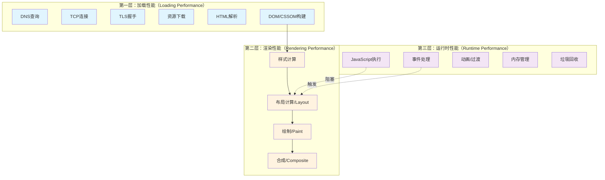

##### 第一层：加载性能（Loading Performance）

关注从用户发起请求到页面**可交互**（Interactive）的全过程。

**关键问题**：
- DNS 解析耗时多久？
- TCP 连接是否复用？
- 关键资源（Critical Resources）是什么时候加载完成的？
- JavaScript 是否阻塞了渲染？

**典型优化手段**：
- 减少 HTTP 请求数量
- 使用 CDN 加速静态资源
- 压缩和缓存资源
- 代码分割和懒加载
- 预连接和预加载

##### 第二层：渲染性能（Rendering Performance）

关注页面内容**可见**且**流畅**呈现的能力。

**关键问题**：
- 是否触发了强制同步布局（Forced Synchronous Layout）？
- 重排（Reflow）和重绘（Repaint）频率如何？
- 合成层（Compositing Layers）管理是否合理？
- 动画帧率是否能稳定在 60fps？

**典型优化手段**：
- 使用 CSS transform 和 opacity 实现动画
- 避免 DOM 操作导致的重排
- 合理使用 will-change 和 GPU 加速
- 虚拟滚动处理大列表

##### 第三层：运行时性能（Runtime Performance）

关注应用在**持续使用过程中的性能表现**。

**关键问题**：
- 是否存在长任务（Long Tasks）阻塞主线程？
- 内存占用是否合理？是否存在泄漏？
- 事件处理器是否高效？
- 定时器和异步任务是否得到妥善管理？

**典型优化手段**：
- Web Worker 分离计算密集型任务
- 长任务切割（Task Chunking）
- 内存泄漏检测与修复
- 虚拟化列表和按需渲染

#### 1.4.2 各层的相互关系

这三层并非孤立存在，而是紧密耦合的：

```javascript
/**
 * 层间关系示例：加载阶段的决策会影响后续所有层级
 */

// 场景：首屏加载了一个巨大的第三方库
// 第一层影响：增加了初始加载体积，延长了 FCP/LCP 时间
import heavyLibrary from 'heavy-analytics-library';

// 第二层影响：该库可能在初始化时修改 DOM，触发额外布局计算
document.addEventListener('DOMContentLoaded', () => {
  heavyLibrary.init();  // 可能插入大量 DOM 元素
});

// 第三层影响：库内部的事件监听、定时器会增加运行时开销
// 如果不正确清理，还会造成内存泄漏
```

### 1.5 性能优化方法论：Measure → Analyze → Optimize

性能优化不是盲目的"改代码"，而是遵循科学方法的系统工程。

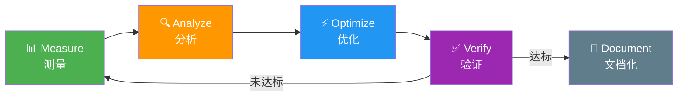

#### 1.5.1 Step 1: Measure（测量）

**没有测量就没有优化。** 在动手之前，必须建立基线数据。

**测量工具选择**：

| 工具类型 | 适用场景 | 代表工具 |
|---------|---------|---------|
| **实验室工具**（Lab Tools） | 开发阶段调试、回归测试 | Chrome DevTools、Lighthouse |
| **真实用户监控**（RUM） | 生产环境监控、长期趋势 | web-vitals、自定义埋点 |
| **合成监控**（Synthetic） | 对比测试、竞品分析 | WebPageTest、SpeedCurve |

**关键测量指标**：

```javascript
// 使用 Performance API 收集基础性能数据
function collectPerformanceMetrics() {
  const navigation = performance.getEntriesByType('navigation')[0];
  
  const metrics = {
    // 导航相关
    domContentLoadedEventEnd: navigation.domContentLoadedEventEnd,
    loadEventEnd: navigation.loadEventEnd,
    
    // 核心时间点
    responseStart: navigation.responseStart,           // 首字节时间起点
    responseEnd: navigation.responseEnd,               // 响应完成时间
    
    // DOM 处理
    domInteractive: navigation.domInteractive,         // DOM 解析完成
    domComplete: navigation.domComplete,               // DOM + 子资源加载完成
  };
  
  console.log('性能基线数据:', metrics);
  return metrics;
}

// 在页面加载完成后执行
window.addEventListener('load', collectPerformanceMetrics);
```

#### 1.5.2 Step 2: Analyze（分析）

基于测量数据进行根因分析，找出**瓶颈**（Bottleneck）所在。

**分析框架：ICE 评分法**

```javascript
/**
 * ICE 评分法：Impact（影响）、Confidence（信心）、Ease（简易度）
 * 用于评估和优先排序优化项
 */

class OptimizationCandidate {
  constructor(name, options = {}) {
    this.name = name;                    // 优化项名称
    this.impact = options.impact || 1;    // 影响程度 1-10
    this.confidence = options.confidence || 5;  // 成功信心 1-10
    this.ease = options.ease || 5;        // 实施难度 1-10（越高越容易）
    this.effort = options.effort || 1;    // 所需工时（人天）
  }
  
  // 计算综合得分
  get score() {
    // ICE 公式：(I × C × E) / Effort
    return (this.impact * this.confidence * this.ease) / this.effort;
  }
  
  // 生成优先级建议
  get priority() {
    if (this.score > 200) return 'P0 - 立即执行';
    if (this.score > 100) return 'P1 - 本迭代';
    if (this.score > 50) return 'P2 - 计划中';
    return 'P3 - 低优先级';
  }
}

// 示例：评估多个优化候选方案
const candidates = [
  new OptimizationCandidate('启用 Gzip 压缩', {
    impact: 8, confidence: 10, ease: 10, effort: 0.5
  }),
  new OptimizationCandidate('实现图片懒加载', {
    impact: 7, confidence: 9, ease: 8, effort: 2
  }),
  new OptimizationCandidate('重构核心组件为虚拟列表', {
    impact: 9, confidence: 7, ease: 4, effort: 10
  }),
];

// 按得分排序，决定实施顺序
candidates.sort((a, b) => b.score - a.score);
console.table(candidates.map(c => ({
  名称: c.name,
  ICE得分: Math.round(c.score),
  优先级: c.priority
})));
```

#### 1.5.3 Step 3: Optimize（优化）

基于分析结果，有针对性地实施优化措施。

**优化原则**：

1. **先宏观后微观**：先解决架构层面的问题，再优化细节
2. **先高频后低频**：优先优化影响面大的代码路径
3. **先易后难**：快速见效的改动可以建立团队信心
4. **保持可观测性**：每次优化都要有数据支撑

```javascript
/**
 * 优化实施模板：带前后对比的优化记录
 */
async function performOptimization(optimizationName, optimizeFn, measureFn) {
  console.log(`\n🚀 开始优化: ${optimizationName}`);
  
  // 1. 优化前测量
  console.log('📊 优化前基线:');
  const before = await measureFn();
  
  try {
    // 2. 执行优化
    console.log('⚡ 执行优化...');
    await optimizeFn();
    
    // 3. 优化后测量
    console.log('📈 优化后结果:');
    const after = await measureFn();
    
    // 4. 对比分析
    const improvement = calculateImprovement(before, after);
    console.log(`✅ 优化完成! 提升幅度: ${improvement}%`);
    
    return { success: true, before, after, improvement };
  } catch (error) {
    console.error(`❌ 优化失败:`, error.message);
    return { success: false, error };
  }
}

function calculateImprovement(before, after) {
  // 假设数值越小越好（如加载时间）
  const reduction = ((before - after) / before * 100).toFixed(2);
  return parseFloat(reduction);
}
```

#### 1.5.4 Step 4: Verify & Document（验证与文档化）

优化不是一次性的工作，需要持续验证和沉淀经验。

```javascript
/**
 * 性能优化日志记录器
 * 用于追踪优化历史，便于回溯和学习
 */
class PerformanceOptimizationLog {
  constructor(projectName) {
    this.projectName = projectName;
    this.log = [];
  }
  
  record(entry) {
    this.log.push({
      timestamp: new Date().toISOString(),
      ...entry
    });
    
    // 在开发环境下输出详细日志
    if (process.env.NODE_ENV === 'development') {
      console.group(`📝 性能优化记录: ${entry.name}`);
      console.log('问题描述:', entry.problem);
      console.log('解决方案:', entry.solution);
      console.log('效果对比:', entry.results);
      console.log('经验教训:', entry.learnings || '暂无');
      console.groupEnd();
    }
  }
  
  // 导出优化报告
  generateReport() {
    const totalImprovements = this.log.reduce((sum, entry) => 
      sum + (entry.results?.improvement || 0), 0
    );
    
    return {
      project: this.projectName,
      totalOptimizations: this.log.length,
      totalImprovement: `${totalImprovements}%`,
      entries: this.log
    };
  }
}

// 使用示例
const perfLog = new PerformanceOptimizationLog('电商首页');
perfLog.record({
  name: '首屏图片优化',
  problem: 'Hero 图片 2.4MB 未压缩',
  solution: '转换为 WebP 格式并添加响应式 srcset',
  results: { 
    before: '2400KB / 3.2s', 
    after: '320KB / 0.8s', 
    improvement: 75 
  },
  learnings: 'CDN 自动格式转换可以大幅简化流程'
});
```

### 1.6 性能优化的常见误区

在实际工作中，开发者容易陷入以下误区：

#### 误区 1：过早优化（Premature Optimization）

```javascript
// ❌ 过早优化的例子：在没有瓶颈的地方过度优化
function processItems(items) {
  // 在数据量只有 10 条的情况下做复杂的位运算优化
  // 完全没有必要，降低了代码可读性
  let result = 0;
  for (let i = 0; i < items.length; i++) {
    result += items[i] >>> 0;  // 位运算加速（但这里不需要）
  }
  return result;
}

// ✅ 正确做法：先用清晰的方式实现，遇到性能问题时再优化
function processItems(items) {
  // 清晰、可维护的实现
  return items.reduce((sum, item) => sum + item, 0);
}
```

**Donald Knuth 的名言**："过早优化是万恶之源（Premature optimization is the root of all evil）。"

#### 误区 2：只关注单一指标

```javascript
// ❌ 只盯着 LCP 时间，忽略其他方面
// 为了让 LCP 从 2.5s 降到 1.8s，把所有图片都内联到 HTML 中
// 结果：HTML 变成 5MB，TTFB 暴增，整体体验更差

// ✅ 全局视角：平衡各项指标
const optimizationStrategy = {
  lcp: { target: '<=2.5s', methods: ['preload', 'CDN', '格式转换'] },
  cls: { target: '<=0.1', methods: ['尺寸预留', '字体预加载'] },
  fid: { target: '<=100ms', methods: ['代码分割', '长任务切割'] },
  bundleSize: { target: '<=200KB gzipped', methods: ['Tree Shaking', '按需引入'] }
};
```

#### 误区 3：忽略感知性能

```javascript
// ❌ 只关注技术指标，忽略用户感受
async function loadData() {
  showSpinner();          // 显示旋转加载圈
  const data = await fetch('/api/data');
  hideSpinner();          // 隐藏
  renderData(data);       // 突然显示内容
}

// ✅ 优化感知性能：渐进式展示
async function loadData() {
  // Step 1: 立即显示骨架屏（< 100ms）
  showSkeletonScreen();
  
  // Step 2: 开始获取数据（后台进行）
  const dataPromise = fetch('/api/data');
  
  // Step 3: 如果数据很快返回，直接渲染；否则显示过渡状态
  const timeoutPromise = new Promise(resolve => 
    setTimeout(() => resolve('timeout'), 800)
  );
  
  const result = await Promise.race([dataPromise, timeoutPromise]);
  
  if (result === 'timeout') {
    // 数据还没回来，显示友好提示
    showProgressiveContent();
  }
  
  // Step 4: 最终数据到达，平滑过渡到真实内容
  const data = await dataPromise;
  renderDataWithTransition(data);
}
```

### 1.7 性能优化的 ROI 思维

在企业环境中，性能优化需要考虑投入产出比（Return on Investment）。

```javascript
/**
 * 性能优化 ROI 计算器
 */
function calculatePerformanceROI(scenario) {
  // scenario 包含:
  // - developmentCost: 开发成本（人天）
  // - maintenanceCost: 年度维护成本（人天）
  // - dailyTraffic: 日活用户数
  // - conversionRate: 当前转化率
  // - improvementPercent: 预期性能提升带来的转化率提升
  // - averageOrderValue: 平均订单金额
  
  const dailyRate = 1500;  // 人天成本（元）
  
  // 开发总成本
  const totalDevCost = (scenario.developmentCost + scenario.maintenanceCost) * dailyRate;
  
  // 年度收益估算
  // 基于研究：加载时间每减少 100ms，转化率提升约 1%
  const conversionLift = scenario.improvementPercent / 100;
  const additionalConversionsPerDay = 
    scenario.dailyTraffic * scenario.conversionRate * conversionLift;
  const dailyRevenueIncrease = additionalConversionsPerDay * scenario.averageOrderValue;
  const annualRevenueIncrease = dailyRevenueIncrease * 365;
  
  // ROI 计算
  const roi = ((annualRevenueIncrease - totalDevCost) / totalDevCost * 100).toFixed(1);
  
  return {
    totalInvestment: `¥${totalDevCost.toLocaleString()}`,
    annualReturn: `¥${annualRevenueIncrease.toLocaleString()}`,
    roi: `${roi}%`,
    paybackPeriod: `${(totalDevCost / dailyRevenueIncrease).toFixed(1)} 天`,
    verdict: roi > 100 ? '✅ 强烈推荐' : roi > 50 ? '👍 值得投入' : '⚠️ 需要评估'
  };
}

// 示例：评估一个图片优化项目
const imageOptimizationROI = calculatePerformanceROI({
  developmentCost: 5,        // 5 人天开发
  maintenanceCost: 1,        // 每年 1 天维护
  dailyTraffic: 50000,       // 5 万日活
  conversionRate: 0.03,      // 3% 转化率
  improvementPercent: 15,    // 预期转化率提升 15%
  averageOrderValue: 200     // 平均订单 200 元
});

console.log(imageOptimizationROI);
// 输出类似: { totalInvestment: "¥9,000", annualReturn: "¥1,642,500", roi: "18150%", ... }
```

### 1.8 本章要点速查

| 知识点 | 核心内容 | 关键词 |
|--------|---------|--------|
| **性能定义** | 多维度综合指标，不仅是速度 | 加载/渲染/运行时/稳定性 |
| **商业价值** | 直接影响转化率、留存、SEO | 100ms法则、7%/秒衰减 |
| **三层模型** | 加载→渲染→运行时的分层分析 | CRP/Reflow/GC |
| **方法论** | Measure→Analyze→Optimize 循环 | ICE评分、基线测量 |
| **常见误区** | 过早优化、单指标导向、忽略感知 | Knuth名言、骨架屏 |
| **ROI思维** | 投入产出比驱动决策 | 转化率提升、回收周期 |

### 1.9 性能优化全局地图（Performance Optimization Landscape）

在深入各章节之前，先通过下面这张全景图建立对整个性能优化知识体系的宏观认知。它将本指南的内容划分为四大层次，帮助你理解各章节之间的关联与定位。

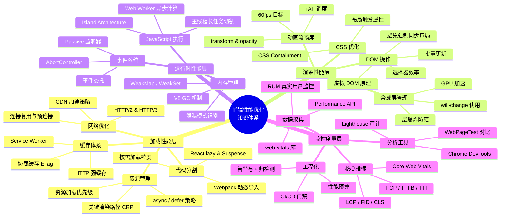

**图解说明**：

- **加载性能层**（对应第3-5章、第9-12章）：关注从请求发起到页面可交互的全过程，涵盖网络传输、资源下载、缓存命中和代码分割等环节。
- **渲染性能层**（对应第6章）：关注页面内容的可见性与交互流畅度，涉及 CSS 计算、DOM 操作、合成层管理和动画性能。
- **运行时性能层**（对应第7-8章、第13章）：关注应用持续运行期间的资源消耗，包括 JS 执行效率、内存泄漏防护和事件处理优化。
- **监控度量层**（对应第2章、第14-16章）：贯穿所有层的"眼睛"，提供指标定义、数据采集、工具分析和工程化落地能力。

> 💡 **阅读建议**：你可以将此图作为导航地图——遇到具体问题时，先定位到对应的层次，再查阅相关章节的详细内容。

---

## 第2章：性能指标体系

### 2.1 本章学习目标

完成本章学习后，你将能够：

- ✅ 深入理解 **Core Web Vitals** 三大核心指标及其阈值
- ✅ 掌握其他重要辅助指标（FCP/TTFB/TBT/TTI/SI）的定义和用途
- ✅ 学会使用 **Performance API** 和 **web-vitals** 库采集真实用户数据
- ✅ 理解各指标之间的**因果关系**和**优先级排序**
- ✅ 能够根据业务场景选择合适的指标组合进行监控

### 2.2 Core Web Vitals 详解

**Core Web Vitals**（核心网页指标）是 Google 于 2020 年推出的用户体验信号体系，用于量化用户体验质量。目前包含三个核心指标，2024年新增了第四个作为补充。

#### 2.2.1 LCP（Largest Contentful Paint）— 最大内容绘制

**定义**：视口内**最大内容元素**（通常是图片、视频、大块文本）完成绘制的时间点。

**为什么重要**：LCP 反映了用户感知的**加载速度**——"页面主要内容什么时候可见？"

**阈值标准**：

| 等级 | 时间范围 | 用户评价 |
|------|---------|---------|
| 🟢 良好 | ≤ 2.5 秒 | 快速 |
| 🟡 需要改进 | 2.5 - 4.0 秒 | 可接受 |
| 🔴 较差 | > 4.0 秒 | 慢 |

**LCP 候选元素**（按优先级）：

```javascript
// LCP 会从以下元素中选择最大的一个
const lcpCandidates = [
  '',           // 图片元素（最常见）
  '<image>',         // SVG 内部的 image
  '<video>',         // 视频元素（封面图）
  'background-image', // 通过 CSS 加载的背景图
  '<p>',             // 包含文本的块级元素
  '<div>',           // 包含子元素的容器
  '<h1>-<h6>',       // 标题元素
  '<ul>/<ol>',       // 列表元素
  '<table>',         // 表格元素
  '<canvas>',        // Canvas 元素
  '<svg>',           // SVG 元素
];
```

**采集 LCP 数据**：

```javascript
// 方式一：使用 web-vitals 库（推荐）
import { onLCP } from 'web-vitals';

onLCP((metric) => {
  console.log('LCP 数据:', {
    value: metric.value,              // LCP 时间（毫秒）
    rating: metric.rating,            // 'good' | 'needs-improvement' | 'poor'
    entries: metric.entries,          // PerformanceEntry 数组
    navigationType: metric.navigationType, // 导航类型
  });
  
  // 上报到监控系统
  sendToAnalytics({
    metric: 'LCP',
    value: metric.value,
    rating: metric.rating,
  });
});
```

```javascript
// 方式二：使用原生 Performance Observer API
function observeLCP() {
  // 创建 PerformanceObserver 监听 largest-contentful-paint 事件
  const observer = new PerformanceObserver((list) => {
    const entries = list.getEntries();
    // 取最后一个条目（最新的 LCP）
    const lastEntry = entries[entries.length - 1];
    
    console.log('LCP 元素信息:', {
      // 绘制时间
      renderTime: lastEntry.renderTime || lastEntry.loadTime,
      
      // 元素信息
      element: lastEntry.element,                    // DOM 元素引用
      elementUrl: lastEntry.url,                      // 图片 URL
      size: lastEntry.size,                           // 元素尺寸
      
      // 时间戳
      startTime: lastEntry.startTime,
      duration: lastEntry.duration,
    });
    
    // 注意：LCP 应该在用户隐藏页面时上报最终值
    document.addEventListener('visibilitychange', () => {
      if (document.visibilityState === 'hidden') {
        reportLCP(lastEntry);
      }
    });
  });
  
  // 注册观察者，使用 buffered: true 可以获取之前的条目
  observer.observe({ type: 'largest-contentful-paint', buffered: true });
}

observeLCP();
```

**LCP 优化要点**：

```html
<!-- ❌ 不好的实践：LCP 图片没有优化 -->


<!-- ✅ 好的实践：针对 LCP 的全面优化 -->
<head>
  <!-- 1. 预连接到图片来源域名 -->
  <link rel="preconnect" href="https://cdn.example.com">
  
  <!-- 2. 预加载 LCP 图片 -->
  <link rel="preload" as="image" href="/images/hero-banner.webp">
</head>

<body>
  <!-- 3. 使用现代格式 -->
  <!-- 4. 明确设置宽高，避免 CLS -->
  
    decoding="async"    <!-- 异步解码，不阻塞渲染 -->
    fetchpriority="high"  <!-- 高优先级加载（新特性） -->
  >
</body>
```

#### 2.2.2 INP（Interaction to Next Paint）— 交互到下次绘制的延迟

> ⚠️ **重要更新（2024年）**：INP 已取代 FID（First Input Delay）成为 Core Web Vitals 的响应性指标。

**定义**：用户**所有交互**（点击、敲击、按键）中，从交互发生到下一次绘制的**最差延迟时间**（取第 75 百分位）。

**为什么重要**：INP 反映了页面的**交互响应性**——"点击按钮后多久能看到反馈？"

**阈值标准**：

| 等级 | 时间范围 | 用户评价 |
|------|---------|---------|
| 🟢 良好 | ≤ 200 毫秒 | 流畅 |
| 🟡 需要改进 | 200 - 500 毫秒 | 可感知延迟 |
| 🔴 较差 | > 500 毫秒 | 卡顿 |

**FID vs INP 对比**：

| 特征 | FID（已废弃） | INP（当前标准） |
|------|--------------|----------------|
| **采样方式** | 仅首次交互 | 所有交互的 P75 |
| **衡量终点** | 主线程空闲（Input Delay） | 下一次屏幕绘制（Next Paint） |
| **覆盖范围** | 单一事件 | 整体交互体验 |
| **适用场景** | 简单页面 | 复杂交互应用 |

**采集 INP 数据**：

```javascript
import { onINP } from 'web-vitals';

onINP((metric) => {
  console.log('INP 数据:', {
    value: metric.value,              // INP 时间（毫秒）
    rating: metric.rating,            // 评级
    entries: metric.entries,          // 所有交互事件的数组
    
    // INP 特有的属性
    interactionType: metric.entries[0]?.name,  // 事件类型（click/keydown/pointerdown...）
    target: metric.entries[0]?.target,         // 交互目标元素
    startTime: metric.entries[0]?.startTime,   // 交互开始时间
    processingStart: metric.entries[0]?.processingStart,  // 处理开始
    processingEnd: metric.entries[0]?.processingEnd,      // 处理结束
    duration: metric.entries[0]?.duration,                 // 总持续时间
  });
  
  // 分析高 INP 的原因
  if (metric.value > 200) {
    analyzeHighINP(metric.entries);
  }
});

// 分析高 INP 的根本原因
function analyzeHighINP(entries) {
  const worstEntry = entries.find(e => e.duration === Math.max(...entries.map(x => x.duration)));
  
  if (!worstEntry) return;
  
  // 计算各阶段耗时
  const inputDelay = worstEntry.processingStart - worstEntry.startTime;  // 输入延迟
  const processingDuration = worstEntry.processingEnd - worstEntry.processingStart;  // 处理时长
  
  console.warn('高 INP 原因分析:', {
    交互元素: worstEntry.target,
    事件类型: worstEntry.name,
    输入延迟: `${inputDelay.toFixed(0)}ms`,      // 主线程被阻塞
    处理时长: `${processingDuration.toFixed(0)}ms`,  // 事件处理器本身耗时
    总耗时: `${worstEntry.duration.toFixed(0)}ms`,
    
    // 诊断建议
    建议: inputDelay > 100 
      ? '主线程被长任务阻塞，考虑使用 Web Worker 或任务切片'
      : '事件处理器本身太复杂，需要拆分或优化逻辑'
  });
}
```

**INP 优化策略**：

```javascript
// ❌ 导致高 INP 的反面教材
document.querySelector('#submit-button').addEventListener('click', async () => {
  // 问题 1: 同步执行大量计算
  const processedData = heavyCalculation(largeDataset);  // 阻塞主线程 500ms+
  
  // 问题 2: 同步 DOM 操作
  updateComplexUI(processedData);  // 触发多次重排
  
  // 问题 3: 阻塞式 API 调用
  const result = await syncAPICall();  // 虽然 await 了，但前面的代码已阻塞
});

// ✅ 优化后的版本
document.querySelector('#submit-button').addEventListener('click', async (e) => {
  // 优化 1: 立即给用户视觉反馈
  e.target.disabled = true;
  e.target.textContent = '处理中...';
  
  // 优化 2: 将重型计算移至 Web Worker
  const worker = new Worker('/workers/calculation.worker.js');
  worker.postMessage(largeDataset);
  
  worker.onmessage = (event) => {
    const processedData = event.data;
    
    // 优化 3: 使用 requestAnimationFrame 批量更新 UI
    requestAnimationFrame(() => {
      updateComplexUIWithRAF(processedData);
      e.target.disabled = false;
      e.target.textContent = '提交';
    });
  };
});
```

#### 2.2.3 CLS（Cumulative Layout Shift）— 累积布局偏移

**定义**：页面生命周期内，所有**意外布局偏移**（Layout Shift）分数的总和。

**为什么重要**：CLS 反映了页面的**视觉稳定性**——"内容是否会突然跳动，干扰用户操作？"

**阈值标准**：

| 等级 | 分数范围 | 用户评价 |
|------|---------|---------|
| 🟢 良好 | ≤ 0.1 | 稳定 |
| 🟡 需要改进 | 0.1 - 0.25 | 轻微偏移 |
| 🔴 较差 | > 0.25 | 严重跳动 |

**CLS 分数计算公式**：

```
布局偏移分数 = 影响比例（Impact Fraction） × 距离比例（Distance Fraction）
```

```javascript
// CLS 分数计算示例
// 假设有一个元素占据了视口 50% 的区域，向下移动了 25% 的视口高度

const impactFraction = 0.5;    // 元素占视口的比例
const distanceFraction = 0.25; // 移动距离占视口的比例

const layoutShiftScore = impactFraction * distanceFraction;
// 结果: 0.125（属于"需改进"区间）

// 更直观的理解：
// 一个全屏宽度（100%）的广告突然出现，推挤了下面 30% 的内容
// CLS = 1.0 × 0.3 = 0.3（较差）
```

**采集 CLS 数据**：

```javascript
import { onCLS } from 'web-vitals';

onCLS((metric) => {
  console.log('CLS 数据:', {
    value: metric.value,              // CLS 分数
    rating: metric.rating,            // 评级
    entries: metric.entries,          // 所有布局偏移事件的数组
    
    // CLS 特有的属性
    // 每个 entry 包含:
    // - value: 单次偏移分数
    // - sources: 导致偏移的元素信息
    // - hadRecentInput: 是否在用户交互后 500ms 内发生（这类不算意外偏移）
  });
  
  // 分析导致 CLS 高的原因
  if (metric.value > 0.1) {
    analyzeHighCLS(metric.entries);
  }
});

// 分析 CLS 高的根本原因
function analyzeHighCLS(entries) {
  // 找出贡献最大的几次偏移
  const topShifts = entries
    .filter(entry => !entry.hadRecentInput)  // 排除用户交互引起的偏移
    .sort((a, b) => b.value - a.value)
    .slice(0, 5);  // 取前5个最大的偏移
  
  console.warn('主要 CLS 来源:');
  topShifts.forEach((shift, index) => {
    const source = shift.sources?.[0];
    console.log(`${index + 1}. 偏移分数: ${shift.value.toFixed(3)}`);
    if (source) {
      console.log(`   - 元素: ${source.node}`);
      console.log(`   - 原因: ${
        source.previousRect ? '动态插入' :
        source.currentRect ? '尺寸变化' : '未知'
      }`);
    }
  });
}
```

**CLS 常见原因与解决方案**：

```html
<!-- ❌ 常见问题 1：图片没有设置宽高 -->

<!-- 浏览器不知道图片尺寸，加载完成后会撑开布局 -->

<!-- ✅ 解决方案：明确指定宽高 -->


<!-- ❌ 常见问题 2：动态插入内容 -->
<div id="ad-container"></div>
<script>
  // 广告异步加载后插入，导致下方内容被推挤
  setTimeout(() => {
    document.getElementById('ad-container').innerHTML = '<div class="ad">...</div>';
  }, 2000);
</script>

<!-- ✅ 解决方案：预留空间 -->
<div id="ad-container" style="min-height: 250px;">
  <!-- 占位符保持空间稳定 -->
  <div class="ad-placeholder">广告位</div>
</div>

<!-- ❌ 常见问题 3：字体加载导致 FOIT/FOUT -->
<style>
  @font-face {
    font-family: 'CustomFont';
    src: url('/fonts/custom.woff2');
    /* 缺少 font-display 策略 */
  }
  h1 { font-family: 'CustomFont', sans-serif; }
</style>

<!-- ✅ 解决方案：添加 font-display -->
<style>
  @font-face {
    font-family: 'CustomFont';
    src: url('/fonts/custom.woff2');
    font-display: swap;  /* 或 optional */
  }
</style>
```

### 2.3 其他关键性能指标

除了 Core Web Vitals，还有许多重要的辅助指标帮助我们全面理解性能状况。

#### 2.3.1 FCP（First Contentful Paint）— 首次内容绘制

**定义**：浏览器首次绘制任何**文本、图像、非空白 canvas** 内容的时间点。

**意义**：FCP 回答了"用户第一眼看到内容是什么时候？"这是**感知性能**的重要里程碑。

**阈值标准**：

| 等级 | 时间范围 | 用户评价 |
|------|---------|---------|
| 🟢 良好 | ≤ 1.8 秒 | 快速 |
| 🟡 需要改进 | 1.8 - 3.0 秒 | 一般 |
| 🔴 较差 | > 3.0 秒 | 慢 |

**FCP 与 LCP 的区别**：

```javascript
/**
 * FCP vs LCP 的关键区别
 * 
 * FCP: 任何内容的首次绘制（可能只是一个文字或小图标）
 * LCP: 最大有意义内容的绘制（通常是首屏的主图或大标题）
 * 
 * 时间关系: FCP 总是早于或等于 LCP
 */

// 监听 FCP
function observeFCP() {
  const observer = new PerformanceObserver((list) => {
    const entries = list.getEntries();
    const fcpEntry = entries[0];
    
    console.log('FCP 信息:', {
      time: fcpEntry.startTime,         // FCP 时间（毫秒）
      name: fcpEntry.name,               // 'first-contentful-paint'
      entryType: fcpEntry.entryType,     // 'paint'
    });
  });
  
  observer.observe({ type: 'paint', buffered: true });
}

observeFCP();
```

#### 2.3.2 TTFB（Time to First Byte）— 首字节时间

**定义**：从浏览器发起请求到收到响应**第一个字节**的时间。

**意义**：TTFB 反映了**服务器响应速度**和网络延迟，是后续所有指标的基石。

**组成分解**：

```
TTFB = 重定向时间 + DNS查询 + TCP连接 + TLS握手 + 请求处理 + 响应传输首字节
```

```javascript
// 使用 Navigation Timing API 获取 TTFB 细分数据
function analyzeTTFB() {
  const nav = performance.getEntriesByType('navigation')[0];
  
  const ttfbBreakdown = {
    // 总 TTFB
    totalTTFB: nav.responseStart,
    
    // 各阶段耗时
    redirect: nav.redirectEnd - nav.redirectStart,           // 重定向时间
    dns: nav.domainLookupEnd - nav.domainLookupStart,        // DNS 查询
    tcp: nav.connectEnd - nav.connectStart,                  // TCP 连接
    ssl: nav.connectEnd - nav.secureConnectionStart || 0,    // TLS 握手
    request: nav.responseStart - nav.requestStart,           // 请求发送到接收首字节（服务端处理）
    
    // 关键诊断值
    workerStart: nav.workerStart,                             // Service Worker 启动时间
    fetchStart: nav.fetchStart,                               // 开始获取资源的时间
  };
  
  console.table(ttfbBreakdown);
  
  // 诊断建议
  if (ttfbBreakdown.totalTTFB > 800) {
    if (ttfbBreakdown.dns > 100) {
      console.warn('⚠️ DNS 查询慢，考虑使用 preconnect 或更换 DNS');
    }
    if (ttfbBreakdown.tcp > 100) {
      console.warn('⚠️ TCP 连接慢，检查网络或启用 HTTP/2');
    }
    if (ttfbBreakdown.request > 400) {
      console.warn('⚠️ 服务端响应慢，需要优化后端性能');
    }
  }
  
  return ttfbBreakdown;
}
```

**TTFB 优化目标**：

| 场景 | 目标值 | 说明 |
|------|-------|------|
| 静态站点 | < 200ms | CDN 缓存命中时 |
| 动态页面 | < 600ms | 合理的服务端处理时间 |
| API 接口 | < 400ms | 不含业务逻辑复杂度 |
| PWA 首次访问 | < 1000ms | Service Worker 安装开销 |

#### 2.3.3 TBT（Total Blocking Time）— 总阻塞时间

**定义**：从 FCP 到 TTI（Time to Interactive）之间，所有**长任务**（Long Task，>50ms）的阻塞部分时间之和。

**意义**：TBT 衡量了页面在**可交互之前被主线程阻塞的程度**，直接影响了 INP/FID。

**计算逻辑**：

```javascript
/**
 * TBT 计算示例
 * 
 * 假设在 FCP 到 TTI 期间有以下长任务：
 * - 任务A: 180ms （超出 50ms 的部分: 130ms）
 * - 任务B: 90ms  （超出 50ms 的部分: 40ms）
 * - 任务C: 45ms  （未超过 50ms，不计入）
 * 
 * TBT = 130ms + 40ms = 170ms
 */

// 使用 Long Task API 收集数据
function observeLongTasksForTBT() {
  const longTasks = [];
  
  const observer = new PerformanceObserver((list) => {
    for (const entry of list.getEntries()) {
      if (entry.duration > 50) {  // 只关心超过 50ms 的任务
        longTasks.push({
          name: entry.name,
          duration: entry.duration,
          startTime: entry.startTime,
          blockingTime: entry.duration - 50,  // 阻塞时间 = 总时长 - 50ms
        });
      }
    }
  });
  
  observer.observe({ type: 'longtask', buffered: true });
  
  // 计算 TBT
  function calculateTBT(fcpTime, ttiTime) {
    const relevantTasks = longTasks.filter(
      task => task.startTime >= fcpTime && task.startTime <= ttiTime
    );
    
    const tbt = relevantTasks.reduce((sum, task) => sum + task.blockingTime, 0);
    return tbt;
  }
  
  return { longTasks, calculateTBT };
}
```

**TBT 优化方向**：

1. **拆分长任务**：将 >50ms 的同步代码拆分为多个小块
2. **使用 Web Worker**：将计算密集型任务移出主线程
3. **延迟非关键 JavaScript**：使用 defer/async 或动态导入
4. **优化第三方脚本**：限制第三方脚本的影响

#### 2.3.4 TTI（Time to Interactive）— 可交互时间

**定义**：页面达到**完全可交互状态**所需的时间。此时：

- FCP 已经完成
- 主线程上没有长任务（Long Task）
- 页面注册的事件处理器已经就绪

**意义**：TTI 是衡量**页面何时真正可用**的关键指标，但已被 INP 取代作为 Core Web Vital。

```javascript
// TTI 的估算方法（polyfill 风格）
function estimateTTI() {
  return new Promise((resolve) => {
    // Step 1: 等待 FCP
    const fcpObserver = new PerformanceObserver((list) => {
      const fcp = list.getEntries()[0].startTime;
      
      // Step 2: 寻找 FCP 后的安静窗口（5秒内无长任务）
      const longTaskObserver = new PerformanceObserver((ltList) => {
        const tasks = ltList.getEntries().filter(e => e.startTime >= fcp && e.duration > 50);
        
        // 找到最后一个长任务的结束时间
        if (tasks.length > 0) {
          const lastLongTaskEnd = tasks[tasks.length - 1].startTime + 
                                  tasks[tasks.length - 1].duration;
          
          // TTI = 最后一个长任务结束 + 5秒安静窗口
          resolve(lastLongTaskEnd + 5000);
        } else {
          // 没有长任务，TTI ≈ FCP + 5秒
          resolve(fcp + 5000);
        }
      });
      
      longTaskObserver.observe({ type: 'longtask', buffered: true });
      
      // 如果短时间内没有长任务，假设 TTI 已达成
      setTimeout(() => resolve(fcp + 5000), 10000);
    });
    
    fcpObserver.observe({ type: 'paint', buffered: true });
  });
}
```

#### 2.3.5 SI（Speed Index）— 速度指数

**定义**：衡量**页面内容可见填充速度**的指标。它计算的是页面在加载过程中，各时间点的**视觉完成度**（Visual Completeness）积分。

**意义**：SI 关注的是**渐进式呈现**的质量，而不只是某个单一时间点。

**工作原理**（简化版）：

```javascript
/**
 * Speed Index 计算原理（概念性说明）
 * 
 * 1. 截取页面加载过程的视频帧（每 100ms 一帧）
 * 2. 对每帧进行像素比较，计算已绘制的百分比
 * 3. 将所有帧的"未完成百分比"累加
 * 
 * 示例：
 * 时间(ms) | 已绘制% | 未绘制% | 累计
 * ---------|---------|---------|------
 * 0        | 0%      | 100%    | 100
 * 100      | 10%     | 90%     | 190
 * 200      | 30%     | 70%     | 260
 * 300      | 60%     | 40%     | 300
 * 400      | 90%     | 10%     | 310
 * 500      | 100%    | 0%      | 310
 * 
 * Speed Index = 3100（累计值 × 10）
 */
```

**SI 优化技巧**：

```html
<!-- ❌ SI 差的做法：所有内容同时加载 -->
<body>
  <header><!-- 大图 --></header>
  <nav><!-- 复杂导航 --></nav>
  <main>
    <article><!-- 长文章 --></article>
    <aside><!-- 侧边栏 --></aside>
  </main>
  <footer><!-- 底部信息 --></footer>
</body>

<!-- ✅ SI 好的做法：关键内容优先渲染 -->
<body>
  <!-- 1. 内联 Critical CSS，立即显示结构 -->
  <style>/* 关键样式 */</style>
  
  <!-- 2. 首屏内容尽早出现在 HTML 中 -->
  <header>
    <h1>标题</h1>  <!-- 文本立即可见 -->
      <!-- 高优先级图片 -->
  </header>
  
  <!-- 3. 非首屏内容延迟加载 -->
  <main>
    <article id="content">
      <!-- 骨架屏占位 -->
      <div class="skeleton">...</div>
    </article>
    <aside loading="lazy">...</aside>
  </main>
  
  <!-- 4. 底部资源最后加载 -->
  <footer>...</footer>
  
  <!-- 5. 非关键 JS 异步加载 -->
  <script src="non-critical.js" defer></script>
</body>
```

### 2.4 指标之间的关系与优先级

#### 2.4.1 指标时间线

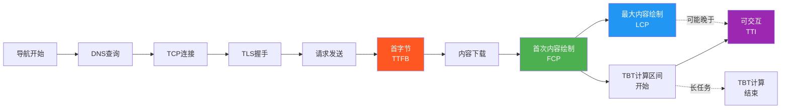

#### 2.4.2 指标优先级矩阵

| 优先级 | 指标 | 类型 | 优化阶段 | 影响 |
|--------|------|------|---------|------|
| **P0** | LCP | Core Web Vital | 加载 | 首屏体验、SEO |
| **P0** | INP | Core Web Vital | 运行时 | 交互流畅度、留存 |
| **P0** | CLS | Core Web Vital | 渲染 | 视觉稳定、误操作 |
| **P1** | FCP | 辅助指标 | 加载 | 感知速度 |
| **P1** | TTFB | 辅助指标 | 网络 | 基础设施健康度 |
| **P1** | TBT | 辅助指标 | 运行时 | 交互准备度 |
| **P2** | TTI | 辅助指标 | 运行时 | 功能可用性 |
| **P2** | SI | 辅助指标 | 加载 | 渐进体验质量 |

#### 2.4.3 指标间的因果关系链

```javascript
/**
 * 性能指标因果关系分析
 * 
 * 典型的因果链条：
 * TTFB 高 → FCP 慢 → LCP 慢 → 用户感知慢
 * 
 * 另一个链条：
 * JS 阻塞主线程 → TBT 高 → INP 高 → 用户感觉卡顿
 * 
 * 还有一个链条：
 * 动态内容插入 → Layout Shift → CLS 高 → 用户操作失误
 */

class MetricDependencyGraph {
  constructor() {
    this.dependencies = {
      'TTFB': ['FCP', 'LCP'],                    // TTFB 影响所有加载指标
      'FCP': ['LCP', 'SI'],                      // FCP 是 LCP 的前提
      'TBT': ['INP', 'TTI'],                     // TBT 直接影响交互指标
      'CLS': [],                                 // CLS 相对独立
      'INP': [],                                 // INP 是终端指标
      'LCP': [],                                 // LCP 是终端指标
    };
  }
  
  // 找出影响目标指标的所有上游因素
  findRootCauses(targetMetric) {
    const causes = new Set();
    const queue = [targetMetric];
    
    while (queue.length > 0) {
      const current = queue.shift();
      for (const [upstream, downstreams] of Object.entries(this.dependencies)) {
        if (downstreams.includes(current)) {
          causes.add(upstream);
          queue.push(upstream);
        }
      }
    }
    
    return Array.from(causes);
  }
  
  // 生成优化建议优先级
  generateOptimizationPriority(metric) {
    const rootCauses = this.findRootCauses(metric);
    
    // 从根本原因开始优化，效果最好
    return rootCauses.map(cause => ({
      metric: cause,
      impact: cause === 'TTFB' ? '高' : cause === 'TBT' ? '高' : '中',
      suggestion: this.getSuggestion(cause)
    }));
  }
  
  getSuggestion(cause) {
    const suggestions = {
      'TTFB': '优化服务器响应、使用 CDN、启用缓存',
      'FCP': '减少阻塞资源、内联关键 CSS',
      'TBT': '拆分长任务、使用 Web Worker、延迟非关键 JS',
    };
    return suggestions[cause] || '需要进一步分析';
  }
}

// 使用示例
const graph = new MetricDependencyGraph();
console.log('要优化 LCP，应该关注:', graph.findRootCauses('LCP'));
// 输出: ['TTFB', 'FCP'] — 说明应该从 TTFB 和 FCP 入手
```

### 2.5 性能数据采集实战

#### 2.5.1 使用 web-vitals 库（推荐）

`web-vitals` 是 Google 官方提供的轻量级库（< 1KB），专门用于采集 Core Web Vitals。

```javascript
// 安装: npm install web-vitals

import { onLCP, onINP, onCLS, onFCP, onTTFB, onTBT } from 'web-vitals';

/**
 * 完整的性能数据采集与上报方案
 */

// 1. 配置上报函数
function sendToAnalytics(metric) {
  // 使用 Beacon API 确保页面关闭时也能上报
  const body = JSON.stringify({
    name: metric.name,           // 指标名称
    value: metric.value,         // 数值
    rating: metric.rating,       // 评级
    delta: metric.delta,         // 与上次的变化
    id: metric.id,               // 唯一标识
    navigationType: metric.navigationType,
    url: window.location.href,
    timestamp: Date.now(),
    userAgent: navigator.userAgent,
  });
  
  // 使用 sendBeacon 保证可靠性
  if ('sendBeacon' in navigator) {
    navigator.sendBeacon('/analytics/performance', body);
  } else {
    // 降级为 fetch
    fetch('/analytics/performance', {
      method: 'POST',
      body,
      keepalive: true,
    }).catch(() => {});
  }
}

// 2. 注册所有指标监听
onLCP(sendToAnalytics);
onINP(sendToAnalytics);
onCLS(sendToAnalytics);

// 3. 可选：监听辅助指标
onFCP(sendToAnalytics);
onTTFB(sendToAnalytics);
onTBT(sendToAnalytics);

// 4. 自定义数据处理（可选）
onLCP((metric) => {
  // 为 LCP 添加额外上下文
  if (metric.entries?.length > 0) {
    const entry = metric.entries[metric.entries.length - 1];
    metric.attribution = {
      element: entry.element?.tagName,
      url: entry.url,
      loadTime: entry.loadTime,
    };
  }
  sendToAnalytics(metric);
});
```

#### 2.5.2 使用原生 Performance API

对于不想引入额外依赖的项目，可以直接使用浏览器原生 API：

```javascript
/**
 * 基于 Performance API 的完整指标采集方案
 */
class PerformanceCollector {
  constructor() {
    this.metrics = {};
    this.observers = [];
  }
  
  // 初始化所有观察者
  init() {
    this.observeNavigationTiming();
    this.observePaintTiming();
    this.observeResourceTiming();
    this.observeLongTasks();
    this.observeLayoutShifts();
    this.observeInteractions();
  }
  
  // 1. 导航计时（TTFB 等）
  observeNavigationTiming() {
    const nav = performance.getEntriesByType('navigation')[0];
    if (!nav) return;
    
    this.metrics.navigation = {
      // 基础指标
      ttfb: Math.round(nav.responseStart),
      fcp: null,  // 由 paint timing 提供
      
      // 详细分解
      dns: Math.round(nav.domainLookupEnd - nav.domainLookupStart),
      tcp: Math.round(nav.connectEnd - nav.connectStart),
      tls: nav.secureConnectionStart > 0 
        ? Math.round(nav.connectEnd - nav.secureConnectionStart) 
        : 0,
      domParse: Math.round(nav.domInteractive - nav.responseEnd),
      domReady: Math.round(nav.domContentLoadedEventEnd - nav.fetchStart),
      loadComplete: Math.round(nav.loadEventEnd - nav.fetchStart),
    };
  }
  
  // 2. 绘制计时（FCP 等）
  observePaintTiming() {
    const paintObserver = new PerformanceObserver((list) => {
      for (const entry of list.getEntries()) {
        if (entry.name === 'first-contentful-paint') {
          this.metrics.fcp = Math.round(entry.startTime);
          if (this.metrics.navigation) {
            this.metrics.navigation.fcp = this.metrics.fcp;
          }
        }
      }
    });
    paintObserver.observe({ type: 'paint', buffered: true });
  }
  
  // 3. 资源计时
  observeResourceTiming() {
    const resourceObserver = new PerformanceObserver((list) => {
      const resources = list.getEntries().map(entry => ({
        name: entry.name.split('/').pop(),  // 只取文件名
        duration: Math.round(entry.duration),
        size: entry.transferSize,
        decodedBodySize: entry.decodedBodySize,
      }));
      
      // 找出最慢的资源
      resources.sort((a, b) => b.duration - a.duration);
      this.metrics.slowestResources = resources.slice(0, 5);
      
      // 找出最大的资源
      resources.sort((a, b) => b.decodedBodySize - a.decodedBodySize);
      this.metrics.largestResources = resources.slice(0, 5);
    });
    resourceObserver.observe({ type: 'resource', buffered: true });
  }
  
  // 4. 长任务（用于 TBT 和 INP 诊断）
  observeLongTasks() {
    try {
      const ltObserver = new PerformanceObserver((list) => {
        const longTasks = list.getEntries()
          .filter(entry => entry.duration > 50)
          .map(entry => ({
            name: entry.name,
            duration: Math.round(entry.duration),
            startTime: Math.round(entry.startTime),
            attribution: entry.attribution?.[0]?.containerType || 'unknown',
          }));
        
        this.metrics.longTasks = longTasks;
        
        // 计算 TBT（简化版）
        this.metrics.tbt = longTasks.reduce(
          (sum, task) => sum + (task.duration - 50), 0
        );
      });
      ltObserver.observe({ type: 'longtask', buffered: true });
    } catch (e) {
      console.warn('Long Task API 不受支持');
    }
  }
  
  // 5. 布局偏移（用于 CLS）
  observeLayoutShifts() {
    const lsObserver = new PerformanceObserver((list) => {
      let clsValue = 0;
      const shifts = [];
      
      for (const entry of list.getEntries()) {
        if (!entry.hadRecentInput) {
          clsValue += entry.value;
          shifts.push({
            value: entry.value,
            sources: entry.sources?.map(s => ({
              node: s.node,
              previousRect: s.previousRect,
              currentRect: s.currentRect,
            })),
          });
        }
      }
      
      this.metrics.cls = clsValue;
      this.metrics.layoutShifts = shifts;
    });
    lsObserver.observe({ type: 'layout-shift', buffered: true });
  }
  
  // 6. 交互事件（用于 INP）
  observeInteractions() {
    const eventTypes = ['click', 'keydown', 'pointerdown'];
    const interactions = [];
    
    eventTypes.forEach(type => {
      const handler = (event) => {
        const startTime = performance.now();
        
        // 使用 requestAnimationFrame 检测绘制时间
        requestAnimationFrame(() => {
          const endTime = performance.now();
          interactions.push({
            type,
            target: event.target.tagName,
            duration: Math.round(endTime - startTime),
            timestamp: startTime,
          });
          
          // 更新 INP（取 P75）
          interactions.sort((a, b) => b.duration - a.duration);
          const p75Index = Math.floor(interactions.length * 0.75);
          this.metrics.inp = interactions[p75Index]?.duration || 0;
          this.metrics.interactions = interactions;
        });
      };
      
      document.addEventListener(type, handler, { passive: true });
    });
  }
  
  // 获取报告
  getReport() {
    return {
      url: location.href,
      timestamp: new Date().toISOString(),
      ...this.metrics,
    };
  }
  
  // 上报数据
  report(endpoint = '/api/performance') {
    const report = this.getReport();
    
    if ('sendBeacon' in navigator) {
      navigator.sendBeacon(endpoint, JSON.stringify(report));
    } else {
      fetch(endpoint, {
        method: 'POST',
        headers: { 'Content-Type': 'application/json' },
        body: JSON.stringify(report),
        keepalive: true,
      }).catch(console.error);
    }
  }
}

// 使用示例
const collector = new PerformanceCollector();
collector.init();

// 页面隐藏时上报（确保捕获最终值）
document.addEventListener('visibilitychange', () => {
  if (document.visibilityState === 'hidden') {
    collector.report();
  }
});

// 页面卸载时也上报
window.addEventListener('pagehide', () => collector.report());
```

### 2.6 本章要点速查

| 知识点 | 核心内容 | 关键词 |
|--------|---------|--------|
| **LCP** | 最大内容绘制，≤2.5s 为良好 | preload、fetchpriority、WebP |
| **INP** | 交互响应性，≤200ms 为良好 | P75、输入延迟、Web Worker |
| **CLS** | 累积布局偏移，≤0.1 为良好 | 尺寸预留、font-display、min-height |
| **FCP** | 首次内容绘制，≤1.8s 为良好 | Critical CSS、阻塞资源 |
| **TTFB** | 首字节时间，反映服务器+网络 | CDN、缓存、DNS预解析 |
| **TBT** | 总阻塞时间，影响 INP | 长任务切割、<50ms 原则 |
| **TTI** | 可交互时间 | 安静窗口、主线程空闲 |
| **SI** | 速度指数，渐进式呈现 | 骨架屏、优先级加载 |
| **采集方案** | web-vitals 库 / Performance API | sendBeacon、buffered:true |

---

## 第3章：加载性能优化

### 3.1 本章学习目标

完成本章学习后，你将能够：

- ✅ 理解浏览器**资源加载优先级**机制及其影响因素
- ✅ 掌握**关键渲染路径**（Critical Rendering Path）的完整流程和优化方法
- ✅ 熟练运用 **preload/prefetch/preconnect/dns-prefetch** 四种资源提示
- ✅ 正确区分和使用 **async 与 defer** 属性
- ✅ 构建完整的资源加载优化策略

### 3.2 浏览器资源加载优先级

浏览器不会同时以相同速度下载所有资源，而是根据**资源类型**、**位置**、**标记**等因素分配不同的优先级。

#### 3.2.1 默认优先级规则

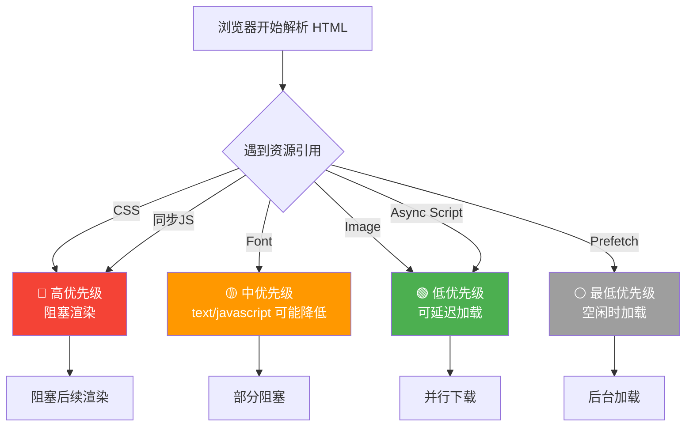

**Chrome 的优先级分类**（从高到低）：

| 优先级 | 资源类型 | 说明 |
|--------|---------|------|
| **Highest** | CSS（head 中）、同步 script（head 中） | 阻塞渲染/解析 |
| **High** | Font、preload 资源、fetch/XHR（head 中） | 重要但不一定阻塞 |
| **Medium** | preload 资源（body 中）、图片（viewport 内） | 按需加载 |
| **Low** | async script、defer script、图片（viewport 外） | 延迟执行/加载 |
| **Lowest** | prefetch 资源 | 预取，空闲时才下载 |

#### 3.2.2 如何查看和修改加载优先级

```javascript
/**
 * 使用 Chrome DevTools 查看资源优先级
 * 
 * Network 面板 → Priority 列
 * 或右键列头 → Priority 勾选显示
 */

// 编程方式修改优先级（现代浏览器支持）
// 1. 使用 fetchpriority 属性（图片、脚本、链接）
/*
<link rel="preload" href="critical.js" as="script" fetchpriority="high">

<script src="analytics.js" fetchpriority="low"></script>
*/

// 2. 使用 Fetch API 的 priority 选项
fetch('/api/data', {
  priority: 'high'  // 'high' | 'low' | 'auto'
}).then(response => response.json());

// 3. 性能提示的最佳实践组合
const resourceHints = `
<head>
  <!-- 关键字体：最高优先级预加载 -->
  <link rel="preload" href="/fonts/main.woff2" as="font" type="font/woff2" crossorigin fetchpriority="high">
  
  <!-- 关键 CSS：已经在 head 中，默认高优先级 -->
  <link rel="stylesheet" href="/css/critical.css">
  
  <!-- 关键图片（LCP）：高优先级 -->
  <link rel="preload" as="image" href="/images/hero.webp" fetchpriority="high">
  
  <!-- 预连接到第三方域名 -->
  <link rel="preconnect" href="https://cdn.example.com">
  <link rel="dns-prefetch" href="https://analytics.example.com">
  
  <!-- 非关键资源：低优先级预取 -->
  <link rel="prefetch" href="/js/heavy-feature.js">
  <link rel="prefetch" href="/next-page.html">
</head>
`;
```

### 3.3 关键渲染路径（CRP）优化

**关键渲染路径**（Critical Rendering Path, CRP）是指浏览器将 HTML、CSS、JavaScript 转换为屏幕上像素所经过的**关键步骤**。

#### 3.3.1 CRP 完整流程

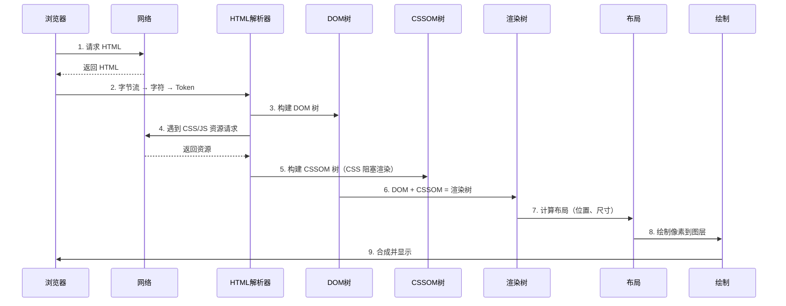

#### 3.3.2 CRP 中的阻塞点与优化

```javascript
/**
 * CRP 阻塞点分析与优化策略
 */

// ==================== 阻塞点 1: CSS 阻塞渲染 ====================
// 
// 问题：浏览器必须等待 CSSOM 构建完成才能渲染任何内容
// 因为 CSS 可能影响元素的显示/隐藏

// ❌ 不好的做法：巨大的 CSS 文件阻塞首屏
/*
<link rel="stylesheet" href="/css/all-styles.css">  <!-- 2MB -->
*/

// ✅ 优化策略 A：Critical CSS 内联
/*
<head>
  <style>
    /* 只包含首屏所需的关键样式（通常 < 14KB） * /
    body { margin: 0; font-family: system-ui; }
    header { /* 首屏头部样式 * / }
    .hero { /* Hero 区域样式 * / }
  </style>
  <link rel="stylesheet" href="/css/non-critical.css" media="print" onload="this.media='all'">
</head>
*/

// ✅ 优化策略 B：媒体查询分离
/*
<link rel="stylesheet" href="/css/print.css" media="print">   <!-- 打印时不阻塞渲染 -->
<link rel="stylesheet" href="/css/mobile.css" media="(max-width: 600px)">  <!-- 仅移动设备加载 -->
*/
// ==================== 阻塞点 2: JavaScript 阻塞解析 ====================
//
// 问题：同步脚本会暂停 HTML 解析，直到脚本下载和执行完毕

// ❌ 不好的做法：head 中的同步脚本
/*
<head>
  <script src="/js/analytics.js"></script>  <!-- 阻塞解析！ -->
  <script src="/js/vendor.js"></script>      <!-- 阻塞解析！ -->
</head>
*/

// ✅ 优化策略 A：使用 async（异步下载，下载完立即执行）
/*
<script src="/js/analytics.js" async></script>
// 特点：不阻塞解析，但执行时机不可控（可能在 DOMContentLoaded 之前或之后）
// 适用场景：独立脚本（统计、广告），不依赖 DOM 也不被其他脚本依赖
*/

// ✅ 优化策略 B：使用 defer（异步下载，DOMContentLoaded 前按顺序执行）
/*
<script src="/js/app.js" defer></script>
<script src="/js/main.js" defer></script>
// 特点：不阻塞解析，保证执行顺序，在 DOMContentLoaded 之前执行
// 适用场景：需要操作 DOM 的脚本，有依赖关系的多个脚本
*/

// ✅ 优化策略 C：动态创建脚本（完全控制）
function loadScript(src, attrs = {}) {
  return new Promise((resolve, reject) => {
    const script = document.createElement('script');
    script.src = src;
    
    Object.keys(attrs).forEach(key => {
      script[key] = attrs[key];  // 设置 async, defer, type="module" 等
    });
    
    script.onload = resolve;
    script.onerror = reject;
    
    document.head.appendChild(script);
  });
}

// 使用示例：按需加载非关键脚本
if (document.querySelector('.chart-container')) {
  loadScript('/libs/chart.js').then(() => {
    initCharts();
  });
}
// ==================== 阻塞点 3: 字体加载阻塞文本渲染 ====================
//
// 问题：自定义字体加载期间，浏览器可能隐藏文本（FOIT）或闪烁（FOUT）

// ✅ 优化策略：合理的 font-display 策略
/*
@font-face {
  font-family: 'Custom';
  src: url('/fonts/custom.woff2') format('woff2');
  font-display: swap;  // 立即显示后备字体，自定义字体加载后替换
  // 其他选项:
  // auto: 浏览器默认行为
  // block: 短暂隐藏文本（最多 3 秒）
  // optional: 如果字体快速加载则使用，否则永远用后备字体
  // fallback: 类似 swap 但有短暂的隐藏期（约 100ms）
}
*/
```

#### 3.3.3 CRP 优化清单

```javascript
/**
 * CRP 优化检查清单
 */
const CRPOptimizationChecklist = [
  {
    category: 'HTML 结构',
    items: [
      { check: 'DOCTYPE 声明正确', impact: '避免怪异模式' },
      { check: '<head> 中只放必要的 meta 和关键 CSS', impact: '减少阻塞' },
      { check: CSS 引用放在 <head> 中', impact: '尽早开始构建 CSSOM' },
      { check: <script> 放在 <body> 末尾或使用 async/defer', impact: '不阻塞解析' },
    ]
  },
  {
    category: 'CSS 优化',
    items: [
      { check: '提取并内联 Critical CSS（< 14KB）', impact: '消除渲染阻塞' },
      { check: '非关键 CSS 使用 media="print" + onload 技巧', impact: '异步加载' },
      { check: '移除未使用的 CSS（PurgeCSS/Critical）', impact: '减小体积' },
      { check: '压缩 CSS（cssnano/css-minifier）', impact: '减小体积 50-70%' },
    ]
  },
  {
    category: 'JavaScript 优化',
    items: [
      { check: '同步脚本改为 async/defer', impact: '不阻塞 HTML 解析' },
      { check: '拆分为多个小文件以便并行下载', impact: '利用 HTTP/2 多路复用' },
      { check: '非关键 JS 使用动态 import()', impact: '按需加载' },
      { check: 'Tree Shaking 移除死代码', impact: '减小体积' },
    ]
  },
  {
    category: '资源预加载',
    items: [
      { check: 'LCP 图片使用 rel="preload"', impact: '提前开始下载' },
      { check: '关键字体使用 rel="preload"', impact: '避免 FOIT/FOUT' },
      { check: '第三方域名使用 rel="preconnect"', impact: '节省 DNS+TCP+TLS 时间' },
    ]
  }
];

// 自动检查函数
function runCRPCheck(url) {
  console.group('🔍 CRP 优化检查');
  
  CRPOptimizationChecklist.forEach(category => {
    console.log(`\n📁 ${category.category}:`);
    category.items.forEach(item => {
      console.log(`  ☐ ${item.check} (${item.impact})`);
    });
  });
  
  console.groupEnd();
  console.log('\n💡 提示：使用 Lighthouse 的 "Opportunities" 部分获取具体建议');
}
```

### 3.4 资源提示（Resource Hints）详解

资源提示是开发者告诉浏览器**提前准备**某些资源的声明式指令。

#### 3.4.1 四种核心资源提示对比

| 提示 | 作用 | 时机 | 典型用途 |
|------|------|------|---------|
| **dns-prefetch** | 仅执行 DNS 查询 | 空闲时 | 第三方域名预解析 |
| **preconnect** | DNS + TCP + TLS（完整连接） | 空闲时 | 关键第三方资源域名 |
| **prefetch** | 下载资源并缓存（下一个导航用） | 空闲时 | 下一页的资源 |
| **preload** | 高优先级下载当前页面需要的资源 | 立即 | 当前页面的关键资源 |

#### 3.4.2 详细使用指南

```html
<!DOCTYPE html>
<html lang="zh-CN">
<head>
  <meta charset="UTF-8">
  <title>资源提示最佳实践</title>
  
  <!-- ============================================ -->
  <!-- 1. dns-prefetch: DNS 预解析 -->
  <!-- ============================================ -->
  <!-- 
    作用：提前将域名解析为 IP 地址
    节省时间：20-120ms（取决于 DNS 服务器响应速度）
    适用：任何可能用到的第三方域名
    注意：兼容性好（IE11+），无害且低成本
  -->
  <link rel="dns-prefetch" href="//fonts.googleapis.com">
  <link rel="dns-prefetch" href="//www.google-analytics.com">
  <link rel="dns-prefetch" href="//cdn.example.com">
  
  
  <!-- ============================================ -->
  <!-- 2. preconnect: 预连接 -->
  <!-- ============================================ -->
  <!-- 
    作用：DNS + TCP + TLS 握手（如果是 HTTPS）
    节省时间：100-500ms（相比冷启动）
    适用：确定会用到的关键第三方域名
    注意：每个域名的连接会占用资源，不要滥用（建议 < 6 个）
  -->
  <link rel="preconnect" href="https://cdn.example.com">
  <link rel="preconnect" href="https://fonts.gstatic.com" crossorigin>
  <!-- crossorigin 属性告诉浏览器这是一个 CORS 请求 -->
  
  
  <!-- ============================================ -->
  <!-- 3. prefetch: 预取 -->
  <!-- ============================================ -->
  <!-- 
    作用：下载资源并放入缓存（供下次导航使用）
    适用：用户很可能访问的下一页或未来需要的资源
    注意：浏览器会在空闲时下载，如果缓存满了可能被丢弃
    支持：Chrome, Firefox, Edge（Safari 有限支持）
  -->
  <link rel="prefetch" href="/next-page.html">
  <link rel="prefetch" href="/assets/heavy-library.js">
  
  <!-- JavaScript 动态 prefetch（适用于条件预取） -->
  <script>
    // 当用户鼠标悬停在链接上时，预取目标页面
    document.querySelectorAll('a[data-prefetch]').forEach(link => {
      link.addEventListener('mouseenter', () => {
        const prefetchLink = document.createElement('link');
        prefetchLink.rel = 'prefetch';
        prefetchLink.href = link.href;
        document.head.appendChild(prefetchLink);
      }, { once: true });  // 只触发一次
    });
  </script>
  
  
  <!-- ============================================ -->
  <!-- 4. preload: 预加载 -->
  <!-- ============================================ -->
  <!-- 
    作用：以高优先级立即下载当前页面需要的资源
    适用：当前页面必需但对发现较晚的资源
    必须属性：as（告知浏览器资源类型，帮助正确处理）
    注意：滥用会抢占其他资源的带宽！只在确实需要时使用
  -->
  
  <!-- 预加载字体（必须包含 crossorigin） -->
  <link rel="preload" href="/fonts/main.woff2" as="font" type="font/woff2" crossorigin>
  
  <!-- 预加载图片（用于 LCP 优化） -->
  <link rel="preload" as="image" href="/images/hero-banner.webp">
  
  <!-- 预加载关键脚本 -->
  <link rel="preload" href="/js/critical.js" as="script">
  
  <!-- 预加载 Fetch/XHR 请求的数据 -->
  <link rel="preload" href="/api/user-data" as="fetch" crossorigin>
  
  <!-- 预加载 CSS（较少使用，因为 CSS 通常已在 head 中） -->
  <link rel="preload" href="/css/above-fold.css" as="style">
  
  <!-- 
    as 属性的可选值：
    - script: JavaScript 文件
    - style: CSS 文件
    - font: 字体文件（必须加 crossorigin）
    - image: 图片文件
    - video: 视频文件
    - audio: 音频文件
    - document: HTML 文档（如 iframe）
    - fetch: XHR/Fetch 请求
  -->
  
  
  <!-- ============================================ -->
  <!-- 5. modulepreload: 模块预加载（ES Modules） -->
  <!-- ============================================ -->
  <!-- 
    作用：预加载 ES Module 及其依赖图
    比 preload as="script" 更智能，会递归预加载依赖
    支持：Chrome 66+, Firefox 89+, Safari 16.4+
  -->
  <link rel="modulepreload" href="/modules/app.mjs">
  
  
  <!-- ============================================ -->
  <!-- 6. prerender: 预渲染（实验性） -->
  <!-- ============================================ -->
  <!-- 
    作用：不仅下载资源，还在后台渲染整个页面
    用户点击链接时可瞬间切换
    注意：资源消耗大，Speculation Rules API 是更现代的替代方案
  -->
  <!-- <link rel="prerender" href="/next-page.html"> -->
  
  <!-- Speculation Rules API（推荐替代方案） -->
  <script type="speculationrules">
  {
    "prerender": [
      {"source": "list", "urls": ["/next-page.html", "/about"]}
    ],
    "prefetch": [
      {"source": "list", "urls": ["/future-resource.js"]}
    ]
  }
  </script>
</head>
```

#### 3.4.3 资源提示决策树

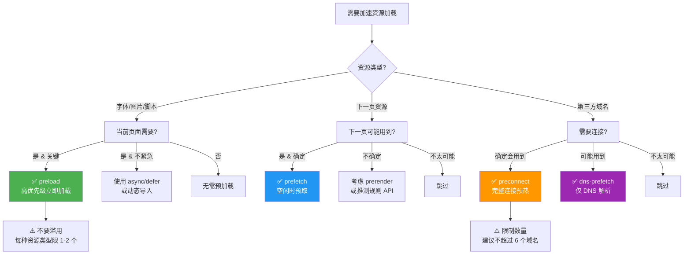

### 3.5 async vs defer 详解

这两个属性都用于控制 `<script>` 的加载和执行行为，但语义和行为有明显区别。

#### 3.5.1 行为对比

```html
<!-- 情况 1: 无属性（默认行为）-->
<!--
  行为: 阻塞 HTML 解析 → 下载脚本 → 执行脚本 → 继续解析
  问题: 脚本下载和执行期间，页面完全冻结
  适用: 几乎不适用（除非脚本极小且必须在特定位置执行）
-->
<script src="sync-script.js"></script>
<!-- 情况 2: async（异步）-->
<!--
  行为: 不阻塞解析 → 并行下载 → 下载完立即执行（可能阻塞解析）
  特点:
    - 多个 async 脚本不保证执行顺序
    - 执行时机不可预测（可能在 DOMContentLoaded 前/后）
    - 适合独立、无依赖的脚本
  适用: 统计脚本、广告脚本、分析工具
-->
<script src="analytics.js" async></script>
<script src="ads.js" async></script>
<!-- analytics.js 和 ads.js 谁先下载完谁先执行 -->
<!-- 情况 3: defer（延迟）-->
<!--
  行为: 不阻塞解析 → 并行下载 → DOM 解析完成后按顺序执行
  特点:
    - 多个 defer 脚本**保证**按 HTML 中的顺序执行
    - 在 DOMContentLoaded 事件之前执行
    - DOM 已经构建完成，可以安全操作 DOM
  适用: 需要 DOM 的业务脚本、有依赖关系的脚本库
-->
<script src="vendor.js" defer></script>
<script src="app.js" defer></script>
<!-- vendor.js 一定在 app.js 之前执行 -->
<!-- 情况 4: type="module"（ES Modules）-->
<!--
  行为: 类似 defer（默认就是 deferred）
  特点:
    - 自动严格模式
    - 支持顶层 await
    - 支持动态 import()
    - 有独立的模块作用域
  适用: 现代项目首选
-->
<script type="module" src="app.mjs"></script>
```

#### 3.5.2 时序图对比

```javascript
/**
 * async vs defer 执行时序示意
 * 
 * 假设 HTML 解析需要 100ms，脚本下载分别需要 50ms 和 80ms
 */

// ========== async 时序 ==========
// 时间轴:  0ms     50ms    80ms    100ms   130ms   150ms
// HTML:    |======== 解析 ========|==== 继续 ====|
// script1: |===== 下载(50ms) =====>| 执行(30ms) |
// script2: |========= 下载(80ms) =========>| 执行(20ms) |
// DCL:                                         | 触发
// 注意: script1 先下载完先执行，顺序不确定！

// ========== defer 时序 ==========
// 时间轴:  0ms     50ms    80ms    100ms   130ms   150ms
// HTML:    |================== 解析 ===================|
// script1: |===== 下载(50ms) =====>|             等待 |
// script2: |========= 下载(80ms) ==========|  等待  |
// DCL:                                     |s1|s2| 触发
// 注意: 两个脚本都在 DOMContentLoaded 前按顺序执行！
// ========== 最佳实践模板 ==========
function createOptimalScriptLoadingStrategy() {
  return `
<!DOCTYPE html>
<html>
<head>
  <!-- 1. 关键 CSS（内联或高优先级） -->
  <style>${getCriticalCSS()}</style>
  <link rel="stylesheet" href="/styles.css">
  
  <!-- 2. 预加载关键资源 -->
  <link rel="preload" as="font" href="/fonts/main.woff2" crossorigin>
  
  <!-- 3. 独立的第三方脚本（async） -->
  <script src="https://www.googletagmanager.com/gtag/js?id=GA_ID" async></script>
</head>
<body>
  <!-- 页面内容... -->
  
  <!-- 4. 业务脚本（defer，保证顺序和 DOM 就绪） -->
  <script src="/js/vendor.js" defer></script>
  <script src="/js/app.js" defer></script>
  
  <!-- 5. 或使用 ES Modules（自动 defer） -->
  <script type="module" src="/js/app-modern.mjs"></script>
  
  <!-- 6. 传统浏览器的 fallback -->
  <script nomodule src="/js/app-legacy.js"></script>
</body>
</html>
  `;
}
```

### 3.6 资源加载优化实战案例

#### 3.6.1 第三方脚本优化

```javascript
/**
 * 第三方脚本是性能杀手的主要原因之一
 * 常见问题：
 * - 阻塞渲染
 * - 注入大量额外资源
 * - 执行耗时长的初始化
 * - 监听大量事件
 */

// ❌ 不好的做法：直接嵌入第三方脚本
/*
<script src="https://example.com/tracking.js"></script>
<script src="https://example.com/chat-widget.js"></script>
<script src="https://example.com/analytics.js"></script>
*/

// ✅ 优化后的方案：Partytown 或自建沙箱

// 方案一：使用 Partytown（将脚本移至 Web Worker）
/*
<head>
  <script type="text/partytown" src="https://example.com/analytics.js"></script>
  <script>
    partytown = {
      forward: ['dataLayer.push', 'ga', 'gtag'],
    };
  </script>
  <script src="/partytown.js"></script>
</head>
*/

// 方案二：手动延迟加载 + 沙箱 iframe
class ThirdPartyManager {
  constructor() {
    this.scripts = new Map();
    this.loaded = new Set();
  }
  
  // 注册第三方脚本（配置加载策略）
  register(name, config) {
    this.scripts.set(name, {
      src: config.src,
      strategy: config.strategy || 'idle',  // 'idle' | 'interaction' | 'visible' | 'immediate'
      priority: config.priority || 'low',
      ...config
    });
  }
  
  // 按策略加载
  loadAll() {
    this.scripts.forEach((config, name) => {
      switch (config.strategy) {
        case 'idle':
          this.loadWhenIdle(name, config);
          break;
        case 'interaction':
          this.loadOnInteraction(name, config);
          break;
        case 'visible':
          this.loadWhenVisible(name, config);
          break;
        case 'immediate':
          this.loadImmediately(name, config);
          break;
      }
    });
  }
  
  // 策略 1: 浏览器空闲时加载
  loadWhenIdle(name, config) {
    if ('requestIdleCallback' in window) {
      requestIdleCallback(() => this.loadScript(config), { timeout: 3000 });
    } else {
      setTimeout(() => this.loadScript(config), 2000);
    }
  }
  
  // 策略 2: 用户首次交互时加载
  loadOnInteraction(name, config) {
    const events = ['click', 'scroll', 'keydown'];
    const handler = () => {
      this.loadScript(config);
      events.forEach(event => window.removeEventListener(event, handler));
    };
    events.forEach(event => window.addEventListener(event, handler, { once: true, passive: true }));
  }
  
  // 策略 3: 元素可见时加载（Intersection Observer）
  loadWhenVisible(name, config) {
    const element = document.querySelector(config.triggerElement);
    if (!element) return;
    
    const observer = new IntersectionObserver((entries) => {
      if (entries[0].isIntersecting) {
        this.loadScript(config);
        observer.disconnect();
      }
    }, { rootMargin: '100px' });  // 提前 100px 触发
    
    observer.observe(element);
  }
  
  // 策略 4: 立即加载（但异步）
  loadImmediately(name, config) {
    this.loadScript(config);
  }
  
  // 实际加载脚本
  loadScript(config) {
    if (this.loaded.has(config.src)) return;
    
    const script = document.createElement('script');
    script.src = config.src;
    script.async = true;
    
    if (config.attributes) {
      Object.entries(config.attributes).forEach(([key, value]) => {
        script.setAttribute(key, value);
      });
    }
    
    document.head.appendChild(script);
    this.loaded.add(config.src);
    console.log(`📦 第三方脚本已加载: ${config.src}`);
  }
}

// 使用示例
const tpManager = new ThirdPartyManager();

tpManager.register('analytics', {
  src: 'https://www.googletagmanager.com/gtag/js?id=GA_ID',
  strategy: 'idle',           // 空闲时加载
  priority: 'low'
});

tpManager.register('chat', {
  src: 'https://widget.example.com/chat.js',
  strategy: 'interaction',    // 用户交互后加载
  triggerElement: '.chat-button',
  priority: 'medium'
});

// 页面加载完成后启动管理器
window.addEventListener('load', () => tpManager.loadAll());
```

### 3.7 本章要点速查

| 知识点 | 核心内容 | 关键词 |
|--------|---------|--------|
| **加载优先级** | 浏览器按资源类型分配不同优先级 | Highest/Low/Lowest、fetchpriority |
| **CRP** | HTML→DOM/CSSOM→Render Tree→Layout→Paint | Critical CSS、阻塞点 |
| **preload** | 高优先级预加载当前页关键资源 | as属性、LCP图片、字体 |
| **prefetch** | 空闲时预取下页资源 | 鼠标悬停预取、Speculation Rules |
| **preconnect** | DNS+TCP+TLS 完整连接预热 | crossorigin、限制6个 |
| **dns-prefetch** | 仅 DNS 解析预准备 | 低成本、广泛兼容 |
| **async** | 异步下载，下载完立即执行，不保序 | 独立脚本、统计代码 |
| **defer** | 异步下载，DOM解析后按序执行 | 业务脚本、DOM操作 |
| **第三方脚本** | 延迟加载、Worker沙箱、Partytown | idle/interaction策略 |

---

## 第4章：代码分割与按需加载

### 4.1 本章学习目标

完成本章学习后，你将能够：

- ✅ 理解 **Webpack 代码分割**的三种模式及原理
- ✅ 掌握 **React.lazy + Suspense** 实现组件级懒加载
- ✅ 学会**路由级代码分割**和**组件级代码分割**的最佳实践
- ✅ 了解代码分割的**粒度选择**策略和注意事项
- ✅ 能够针对实际项目设计合理的代码分割方案

### 4.2 为什么需要代码分割

#### 4.2.1 问题的根源

```javascript
/**
 * 传统开发模式的性能问题
 * 
 * 场景：一个大型单页应用
 * - 首页只需要 100KB 的代码
 * - 但打包后总共有 2MB 的 JavaScript
 * - 用户必须等待全部 2MB 下载完成才能看到首页
 * 
 * 结果：首屏加载极慢（可能 5-10 秒）
 */

// ❌ 单一大 bundle 的问题
import HomePage from './pages/HomePage';
import AboutPage from './pages/AboutPage';
import SettingsPage from './pages/SettingsPage';
import AdminDashboard from './pages/AdminDashboard';  // 只有管理员用
import HeavyChartLibrary from './libs/charts';          // 只有报表页用
import ImageEditor from './components/ImageEditor';      // 只有编辑功能用

// 所有这些都会被打包到一个文件中！
// 即使用户只看首页，也要下载全部代码
```

#### 4.2.2 代码分割的核心思想

```javascript
/**
 * 代码分割（Code Splitting）的核心原理
 * 
 * 将一个大 bundle 拆分成多个小的 chunk
 * 按需加载（Lazy Load）：只在需要时才下载对应的 chunk
 * 
 * 好处：
 * 1. 首屏只需加载必要代码 → 加载更快
 * 2. 更好的缓存利用 → 重复访问更快
 * 3. 并行下载多个小文件 → 利用 HTTP/2 优势
 */

// ✅ 代码分割后的效果
// main.chunk.js        (50KB)  - 首页必需的核心代码
// home.chunk.js        (30KB)  - 首页组件
// about.chunk.js       (25KB)  - 关于页面
// settings.chunk.js    (40KB)  - 设置页面
// admin.chunk.js       (80KB)  - 管理后台（只有管理员加载）
// charts.vendor.js    (150KB)  - 图表库（只有报表页加载）
```

### 4.3 Webpack 代码分割原理

Webpack 提供三种代码分割方式，各有适用场景。

#### 4.3.1 方式一：入口点分割（Entry Points）

```javascript
// webpack.config.js
module.exports = {
  // 定义多个入口，每个入口生成独立的 chunk
  entry: {
    main: './src/main.js',           // 主应用
    vendor: './src/vendor.js',       // 第三方库
    admin: './src/admin-entry.js',   // 管理后台独立入口
  },
  
  output: {
    filename: '[name].[contenthash].chunk.js',
    path: path.resolve(__dirname, 'dist'),
  },
};

// vendor.js
import React from 'react';
import ReactDOM from 'react-dom';
import lodash from 'lodash';
// 这些库会被打包到 vendor chunk，单独缓存

// admin-entry.js
import { createAdminApp } from './admin';
createAdminApp();
// 管理后台代码完全隔离
```

**优点**：简单直观，完全控制分割粒度  
**缺点**：需要手动管理依赖关系，容易出现重复代码；入口之间无法共享模块

#### 4.3.2 方式二：动态导入（Dynamic Imports）— 推荐

```javascript
/**
 * 动态 import() 语法
 * 
 * 这是 Webpack 推荐的代码分割方式
 * import() 返回一个 Promise
 * Webpack 会自动为 import() 的模块创建独立的 chunk
 */

// ========== 基础用法 ==========

// ❌ 静态导入（同步，打包进同一个 bundle）
import HeavyModule from './heavy-module';

// ✅ 动态导入（异步，独立 chunk）
const heavyModule = await import('./heavy-module');
// 或者使用 .then()
import('./heavy-module').then(module => {
  module.default.doSomething();
});
// ========== 路由级代码分割（React Router）==========

import { lazy, Suspense } from 'react';
import { BrowserRouter, Routes, Route } from 'react-router-dom';

// 使用 lazy 创建动态导入的组件
const HomePage = lazy(() => import('./pages/HomePage'));
const AboutPage = lazy(() => import('./pages/AboutPage'));
const SettingsPage = lazy(() => import('./pages/SettingsPage'));

// 重型页面：管理员后台
const AdminDashboard = lazy(() => 
  import(/* webpackChunkName: "admin" */ './pages/AdminDashboard')
);

// 重型库：图表
const ChartComponent = lazy(() =>
  import(/* webpackChunkName: "charts" */ './components/ChartComponent')
);

function App() {
  return (
    <BrowserRouter>
      {/* Suspense 提供加载状态 */}
      <Suspense fallback={<PageLoader />}>
        <Routes>
          <Route path="/" element={<HomePage />} />
          <Route path="/about" element={<AboutPage />} />
          <Route path="/settings" element={<SettingsPage />} />
          <Route path="/admin" element={<AdminDashboard />} />
          <Route path="/reports" element={<ChartComponent />} />
        </Routes>
      </Suspense>
    </BrowserRouter>
  );
}
// ========== 组件级代码分割 ==========

/**
 * 高阶组件：封装懒加载逻辑
 * 使普通组件变为懒加载组件
 */
function withLazyLoad(WrappedComponent, loaderOptions = {}) {
  // 使用 React.lazy 动态导入
  const LazyComponent = lazy(() => {
    // 可以添加 webpack 魔法注释来控制 chunk 名称
    if (loaderOptions.chunkName) {
      return import(
        /* webpackChunkName: "[request]" */ 
        `./${WrappedComponent.displayName || 'Component'}`
      );
    }
    return import(`./${WrappedComponent.displayName || 'Component'}`);
  });
  
  return function LazyWrapper(props) {
    return (
      <Suspense fallback={loaderOptions.fallback || <div>Loading...</div>}>
        <LazyComponent {...props} />
      </Suspense>
    );
  };
}

// 使用示例
const ImageGallery = withLazyLoad(ImageGalleryComponent, {
  chunkName: 'gallery',
  fallback: <GallerySkeleton />,
});

// 条件加载：只在需要时才加载
function ConditionalLoader({ shouldLoad, children }) {
  if (!shouldLoad) return children;
  
  return (
    <Suspense fallback={<Spinner />}>
      {children}
    </Suspense>
  );
}
```

#### 4.3.3 方式三：公共提取（Commons Extraction）

```javascript
// webpack.config.js
const TerserPlugin = require('terser-webpack-plugin');

module.exports = {
  optimization: {
    // 自动提取公共模块
    splitChunks: {
      chunks: 'all',  // 对所有类型的 chunk 进行分割（async/sync/initial）
      
      // 缓存组配置
      cacheGroups: {
        // 第三方库 vendors
        vendors: {
          test: /[\\/]node_modules[\\/]/,  // 匹配 node_modules
          name: 'vendors',
          priority: -10,                    // 优先级（数字越大越优先）
          reuseExistingChunk: true,          // 复用已有 chunk
        },
        
        // 公共业务代码 common
        default: {
          minChunks: 2,                      // 至少被 2 个 chunk 引用
          priority: -20,
          reuseExistingChunk: true,
        },
        
        // React 相关（单独分组便于长期缓存）
        react: {
          test: /[\\/]node_modules[\\/](react|react-dom)[\\/]/,
          name: 'react-vendor',
          chunks: 'all',
        },
        
        // UI 组件库
        ui: {
          test:(/[\\/]node_modules[\\/@ant-design|@mui|element-plus]/),
          name: 'ui-vendor',
          chunks: 'all',
        },
      },
    },
    
    // runtime 代码单独抽取（配合 contenthash 实现长期缓存）
    runtimeChunk: {
      name: 'runtime',
    },
  },
};
```

**splitChunks 配置详解**：

```javascript
/**
 * splitChunks 核心配置项说明
 */
const splitChunksConfig = {
  // 1. chunks: 选择哪些 chunk 进行分割
  //    - 'initial': 只处理入口 chunk
  //    - 'async': 只处理异步导入的 chunk（默认）
  //    - 'all': 处理所有类型（推荐）
  chunks: 'all',
  
  // 2. minSize: chunk 最小大小（KB），小于此值的不会被分割
  //    建议值：20000（20KB）- 太小的 chunk 会增加请求数
  minSize: 20000,
  
  // 3. maxSize: chunk 最大大小（KB），超过此值会尝试进一步分割
  //    建议值：244000（244KB）- gzip 后的大小上限
  maxSize: 244000,
  
  // 4. minChunks: 模块至少被多少个 chunk 引用才会被提取
  //    值越小，提取越激进
  minChunks: 2,
  
  // 5. maxAsyncRequests: 一个异步 chunk 最多允许的并行请求数
  maxAsyncRequests: 30,
  
  // 6. maxInitialRequests: 一个入口 chunk 最多允许的并行请求数
  maxInitialRequests: 30,
  
  // 7. name: chunk 名称（true 表示自动生成）
  //    生产环境建议设为 false，使用自动生成的 hash 名
  name: false,
};
```

### 4.4 React.lazy 与 Suspense 深入使用

#### 4.4.1 基础用法回顾

```jsx
import { lazy, Suspense } from 'react';

// Step 1: 使用 lazy 定义懒加载组件
// lazy 接收一个返回 Promise 的函数
const MyComponent = lazy(() => import('./MyComponent'));

// Step 2: 用 Suspense 包裹，提供 fallback UI
function App() {
  return (
    <Suspense fallback={<div>加载中...</div>}>
      <MyComponent />
    </Suspense>
  );
}
```

#### 4.4.2 进阶用法：错误边界 + 预加载

```jsx
import { lazy, Suspense } from 'react';

/**
 * 完整的懒加载组件封装
 * 包含：
 * 1. 加载状态（Suspense fallback）
 * 2. 错误处理（Error Boundary）
 * 3. 预加载能力
 * 4. 超时处理
 */

// ========== 错误边界组件 ==========
class ComponentErrorBoundary extends React.Component {
  constructor(props) {
    super(props);
    this.state = { hasError: false, error: null };
  }
  
  static getDerivedStateFromError(error) {
    return { hasError: true, error };
  }
  
  componentDidCatch(error, errorInfo) {
    // 上报错误到监控系统
    console.error('Lazy component failed to load:', error, errorInfo);
  }
  
  render() {
    if (this.state.hasError) {
      // 自定义错误 UI，提供重试按钮
      return this.props.fallback || (
        <div className="error-fallback">
          <p>组件加载失败</p>
          <button onClick={() => this.setState({ hasError: false })}>
            重试
          </button>
        </div>
      );
    }
    
    return this.props.children;
  }
}

// ========== 带预加载的懒加载 HOC ==========
function createLazyComponent(importFn, options = {}) {
  const {
    fallback = <div className="skeleton">加载中...</div>,
    errorFallback,
    preload = false,        // 是否立即预加载
    timeout = 10000,        // 加载超时时间（毫秒）
  } = options;
  
  // 创建懒加载组件
  const LazyComponent = lazy(() => {
    // 包装 Promise 以支持超时
    return Promise.race([
      importFn(),
      new Promise((_, reject) =>
        setTimeout(() => reject(new Error('组件加载超时')), timeout)
      )
    ]);
  });
  
  // 预加载函数
  let preloaded = false;
  function preloadComponent() {
    if (!preloaded) {
      importFn();  // 触发下载
      preloaded = true;
    }
  }
  
  // 如果配置了立即预加载
  if (preload) {
    // 使用 requestIdleCallback 在空闲时预加载
    if ('requestIdleCallback' in window) {
      requestIdleCallback(preloadComponent);
    } else {
      setTimeout(preloadComponent, 2000);
    }
  }
  
  // 返回包装后的组件
  function LazyWrapper(props) {
    return (
      <ComponentErrorBoundary fallback={errorFallback}>
        <Suspense fallback={fallback}>
          <LazyComponent {...props} />
        </Suspense>
      </ComponentErrorBoundary>
    );
  }
  
  // 暴露预加载方法
  LazyWrapper.preload = preloadComponent;
  
  return LazyWrapper;
}

// ========== 使用示例 ==========

// 1. 创建懒加载组件
const Dashboard = createLazyComponent(
  () => import('./pages/Dashboard'),
  {
    fallback: <DashboardSkeleton />,
    errorFallback: <DashboardError />,
    preload: false,  // 不自动预加载
  }
);

const ChartPanel = createLazyComponent(
  () => import('./panels/ChartPanel'),
  {
    fallback: <ChartSkeleton />,
    preload: true,  // 空闲时自动预加载（因为这个面板很可能会用到）
  }
);

// 2. 在路由中使用
function AppRoutes() {
  return (
    <Routes>
      <Route path="/" element={<Home />} />
      <Route path="/dashboard" element={<Dashboard />} />
    </Routes>
  );
}

// 3. 手动触发预加载（例如鼠标悬停在链接上时）
function NavLink({ to, children, preloadComponent }) {
  return (
    <Link
      to={to}
      onMouseEnter={() => preloadComponent?.preload()}  // 悬停时预加载
    >
      {children}
    </Link>
  );
}

// <NavLink to="/dashboard" preloadComponent={Dashboard}>仪表盘</NavLink>
```

#### 4.4.3 基于路由的智能预加载

```javascript
/**
 * 路由级别的智能预加载策略
 * 
 * 策略：
 * 1. 当前路由的相邻路由（上一页/下一页）→ idle 时预加载
 * 2. 用户鼠标悬停的路由链接 → 立即预加载
 * 3. 预测用户下一步可能去的路由 → Intersection Observer 触发
 */
class RoutePreloader {
  constructor(routeConfig) {
    this.routeConfig = routeConfig;  // 路由配置映射
    this.preloaded = new Set();      // 已预加载的路由
  }
  
  // 策略 1: 预加载相邻路由
  preloadAdjacentRoutes(currentPath) {
    const routes = Object.keys(this.routeConfig);
    const currentIndex = routes.indexOf(currentPath);
    
    if (currentIndex === -1) return;
    
    // 预加载前后各一个路由
    [-1, 1].forEach(offset => {
      const adjacentIndex = currentIndex + offset;
      if (adjacentIndex >= 0 && adjacentIndex < routes.length) {
        const adjacentPath = routes[adjacentIndex];
        this.preloadRoute(adjacentPath);
      }
    });
  }
  
  // 策略 2: 链接悬停预载
  setupHoverPreload() {
    document.addEventListener('mouseover', (e) => {
      const link = e.target.closest('a[data-route]');
      if (link) {
        const route = link.dataset.route;
        this.preloadRoute(route);
      }
    }, { passive: true });
  }
  
  // 策略 3: 可视区域内的链接预载
  setupVisibilityPreload() {
    const observer = new IntersectionObserver((entries) => {
      entries.forEach(entry => {
        if (entry.isIntersecting) {
          const route = entry.target.dataset.route;
          this.preloadRoute(route);
          observer.unobserve(entry.target);  // 只触发一次
        }
      });
    }, { rootMargin: '200px' });  // 提前 200px 触发
    
    document.querySelectorAll('a[data-route]').forEach(link => {
      observer.observe(link);
    });
  }
  
  // 执行预加载
  preloadRoute(path) {
    if (this.preloaded.has(path)) return;
    
    const loader = this.routeConfig[path];
    if (loader && typeof loader.preload === 'function') {
      loader.preload();
      this.preloaded.add(path);
    }
  }
}
```

### 4.5 代码分割的策略与粒度选择

#### 4.5.1 分割粒度的权衡

```javascript
/**
 * 代码分割粒度权衡
 * 
 * 太粗（chunk 太大）：
 * - 首屏加载慢
 * - 无法充分利用缓存
 * 
 * 太细（chunk 太小）：
 * - HTTP 请求数过多（即使 HTTP/2 也有开销）
 * - 增加打包复杂性
 * - 小 chunk 的 gzip 效率较低
 * 
 * 最佳实践：
 * - 单个 chunk gzip 后控制在 50-200KB
 * - 首屏 chunk 总和 < 200KB
 * - 按路由/功能模块划分
 */

// ========== Chunk 大小参考标准 ==========
const CHUNK_SIZE_GUIDELINES = {
  // 首屏必需（必须在首屏渲染前加载）
  critical: {
    maxSize: '50KB gzipped',    // 越小越好
    examples: ['核心运行时', '路由逻辑', '关键组件'],
  },
  
  // 首屏增强（首屏渲染后尽快加载）
  aboveFold: {
    maxSize: '100KB gzipped',
    examples: ['Hero 组件', '轮播图', '搜索框'],
  },
  
  // 路由级别（按需加载）
  route: {
    maxSize: '150KB gzipped',
    examples: ['关于页面', '设置页面', '个人中心'],
  },
  
  // 功能模块（特定功能才加载）
  feature: {
    maxSize: '200KB gzipped',
    examples: ['富文本编辑器', '图表', '地图'],
  },
  
  // 第三方库（长期缓存）
  vendor: {
    maxSize: '300KB gzipped',    // 可以稍大，因为有长期缓存
    examples: ['React', 'Lodash', 'Ant Design'],
  },
};
```

#### 4.5.2 常见分割策略

```javascript
/**
 * 策略 1: 按路由分割（最常用）
 * 
 * 适用场景：多页面应用、SPA
 * 优点：清晰、符合用户心智、易于维护
 */
const routeBasedSplitting = {
  // webpack.config.js
  config: {
    optimization: {
      splitChunks: {
        cacheGroups: {
          // 每个路由自动成为独立 chunk（通过 dynamic import 实现）
        }
      }
    }
  },
  
  // 使用方式
  implementation: () => {
    const routes = {
      '/home': () => import('./pages/Home'),
      '/product/:id': () => import('./pages/ProductDetail'),
      '/checkout': () => import('./pages/Checkout'),
      '/user/profile': () => import('./pages/UserProfile'),
    };
  }
};
/**
 * 策略 2: 按功能/模块分割
 * 
 * 适用场景：大型应用的功能模块
 * 优点：功能内聚、复用性强
 */
const featureBasedSplitting = {
  groups: {
    // 用户相关
    auth: {
      modules: ['./features/auth/Login', './features/auth/Register', './features/auth/ResetPassword'],
      chunkName: 'auth',
    },
    
    // 商品相关
    product: {
      modules: ['./features/product/List', './features/product/Detail', './features/product/Review'],
      chunkName: 'product',
    },
    
    // 订单相关
    order: {
      modules: ['./features/order/Create', './features/order/List', './features/order/Detail'],
      chunkName: 'order',
    },
  }
};
/**
 * 策略 3: 按更新频率分割（缓存优化）
 * 
 * 适用场景：需要精细控制缓存的场景
 * 优点：频繁更新的代码不影响长期缓存的库
 */
const frequencyBasedSplitting = {
  cacheGroups: {
    // 几乎不变的：React 核心
    'react-core': {
      test: /[\\/]node_modules[\\/](react|react-dom|scheduler)[\\/]/,
      name: 'vendor-react-core',
      chunks: 'all',
      priority: 20,
    },
    
    // 很少更新的：大型工具库
    'stable-vendors': {
      test: /[\\/]node_modules[\\/](lodash|axios|dayjs)[\\/]/,
      name: 'vendor-stable',
      chunks: 'all',
      priority: 15,
    },
    
    // 偶尔更新的：UI 组件库
    'ui-lib': {
      test: /[\\/]node_modules[\\/@ant-design|@mui|element-plus][\\/]/,
      name: 'vendor-ui',
      chunks: 'all',
      priority: 10,
    },
    
    // 经常更新的：业务代码
    business: {
      test: /[\\/]src[\\/](features|pages|components)[\\/]/,
      name: 'business',
      chunks: 'all',
      minSize: 20000,
      priority: 5,
    },
  }
};
```

### 4.6 代码分割的注意事项与陷阱

```javascript
/**
 * ⚠️ 代码分割常见陷阱
 */

// ========== 陷阱 1: 动态 import 路径不能使用变量 ==========
// ❌ 错误：Webpack 无法静态分析
const componentName = 'HomePage';
const Module = await import(`./pages/${componentName}`);  // 不会生效！

// ✅ 正确：使用完整的静态字符串
// 或者使用魔法注释
const modules = {
  HomePage: () => import('./pages/HomePage'),
  AboutPage: () => import('./pages/AboutPage'),
};
const Module = await modules[componentName]();
// ========== 陷阱 2: 循环依赖导致的重复打包 ==========
// file-a.js
export { funcA } from './file-b';  // 导入 file-b 的函数
export const valueA = 'A';

// file-b.js
export { funcB } from './file-a';  // 又导回 file-a
export const valueB = 'B';

// 结果：可能导致循环引用，chunk 中出现重复代码
// 解决：重构依赖关系，消除循环
// ========== 陷阱 3: 共享状态管理的代码分割 ==========
// ❌ 问题：如果 Redux store 在主 chunk 中，
//         但 reducer 在懒加载 chunk 中，
//         需要正确处理 reducer 的注入

// ✅ 解决方案：动态注入 reducer
import { createStore, combineReducers } from 'redux';

// 基础 store
const store = createStore(combineReducers({
  common: commonReducer,
}));

// 懒加载 reducer 注入函数
function injectAsyncReducer(asyncReducer) {
  // 获取当前的 reducer
  const currentReducers = store.asyncReducers || {};
  
  // 添加新的 reducer
  store.asyncReducers = {
    ...currentReducers,
    ...asyncReducer,
  };
  
  // 替换 reducer
  store.replaceReducer(combineReducers({
    ...store.asyncReducers,
  }));
}

// 在懒加载组件中使用
const Dashboard = lazy(async () => {
  const { dashboardReducer } = await import('./reducers/dashboard');
  injectAsyncReducer({ dashboard: dashboardReducer });
  return import('./pages/Dashboard');
});
// ========== 陷阱 4: CSS 代码分割 ==========
// 使用 MiniCssExtractPlugin 将 CSS 也进行分割
// 确保懒加载组件的样式也按需加载

const MiniCssExtractPlugin = require('mini-css-extract-plugin');

module.exports = {
  module: {
    rules: [
      {
        test: /\.css$/,
        use: [
          MiniCssExtractPlugin.loader,  // 提取 CSS 为独立文件
          'css-loader',
          'postcss-loader',
        ],
      },
    ],
  },
  plugins: [
    new MiniCssExtractPlugin({
      filename: '[name].[contenthash].css',
      chunkFilename: '[id].[contenthash].css',
    }),
  ],
};
```

### 4.7 本章要点速查

| 知识点 | 核心内容 | 关键词 |
|--------|---------|--------|
| **代码分割原理** | 将大 bundle 拆分为多个按需加载的 chunk | 按需加载、并行下载、缓存优化 |
| **入口点分割** | 多入口配置，手动控制 | 独立入口、手动管理 |
| **动态导入** | import() 语法，返回 Promise | 推荐、自动分割、webpackChunkName |
| **公共提取** | splitChunks 配置 | vendors/common/cacheGroups |
| **React.lazy** | 懂加载组件的语法糖 | Suspense、Error Boundary |
| **路由级分割** | 每个路由对应独立 chunk | 最常用、清晰明了 |
| **组件级分割** | 大型组件/功能按需加载 | 图表、编辑器、地图 |
| **粒度选择** | 50-200KB gzip/chunk | 首屏<200KB、权衡请求数 |
| **预加载策略** | adjacent/hover/visibility | Intersection Observer、preload() |

---

## 第5章：缓存策略

### 5.1 本章学习目标

完成本章学习后，你将能够：

- ✅ 深入理解 **HTTP 缓存机制**（强缓存与协商缓存）
- ✅ 掌握 **Cache-Control** 各指令的含义与最佳配置
- ✅ 理解 **ETag** 和 **Last-Modified** 的工作原理
- ✅ 学会 **Service Worker** 缓存策略的设计与实现
- ✅ 对比各种**浏览器存储 API**的特点与适用场景

### 5.2 HTTP 缓存机制详解

HTTP 缓存是性能优化中最有效的手段之一，正确的缓存策略可以将重复访问的加载时间降低 90% 以上。

#### 5.2.1 缓存的两种类型

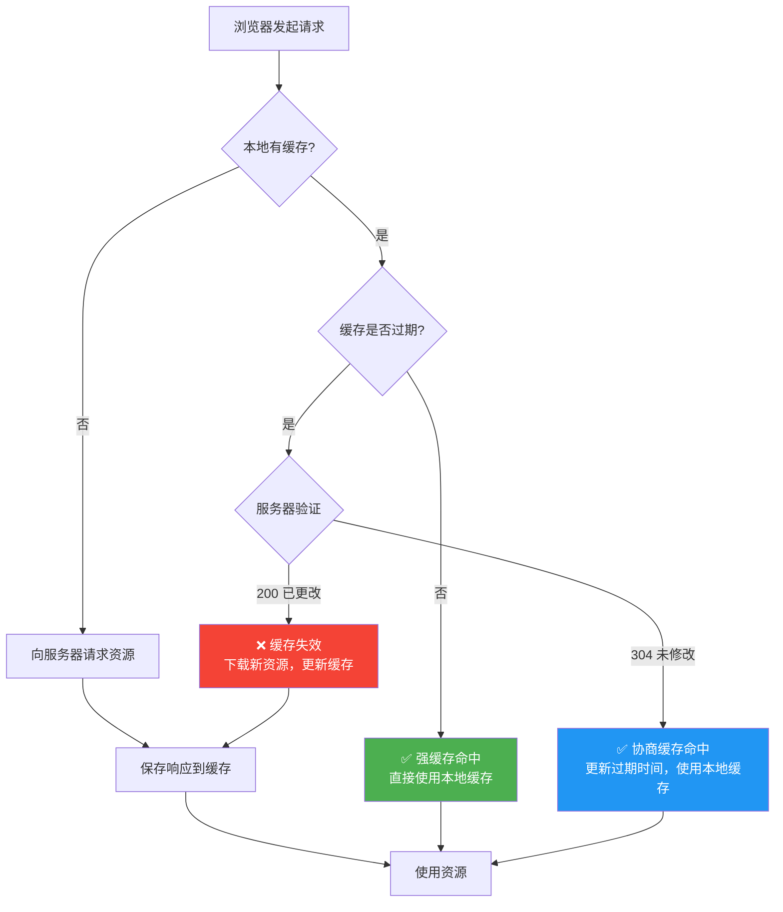

##### 强缓存（Strong Cache）

浏览器不向服务器发送请求，直接使用本地缓存的资源。判断依据是**过期时间**。

```http
# 响应头示例（强缓存命中）
HTTP/1.1 200 OK
Cache-Control: max-age=31536000  # 缓存 1 年
Last-Modified: Wed, 21 Oct 2025 07:28:00 GMT
ETag: "33a64df551425fcc9e5c123abc"

# 下次请求时（1年内）：
# 浏览器直接从磁盘/内存读取，不会发送网络请求
# DevTools Network 面板显示: 200 (from disk cache) 或 200 (from memory cache)
```

##### 协商缓存（Conditional Cache / Validation）

浏览器携带缓存标识向服务器询问资源是否有更新，服务器返回 **304 Not Modified** 则使用缓存，否则返回新资源。

```http
# 第一次请求（无缓存）
GET /styles.css HTTP/1.1
Host: example.com

HTTP/1.1 200 OK
Cache-Control: max-age=0  # 必须每次验证
ETag: "v1.0.0"
Last-Modified: Wed, 21 Oct 2025 07:28:00 GMT
Content-Length: 15234

# 第二次请求（携带验证信息）
GET /styles.css HTTP/1.1
Host: example.com
If-None-Match: "v1.0.0"    # 上次的 ETag
If-Modified-Since: Wed, 21 Oct 2025 07:28:00 GMT  # 上次的 Last-Modified

# 服务器响应（资源未变化）
HTTP/1.1 304 Not Modified
Cache-Control: max-age=0
ETag: "v1.0.0"  # ETag 没变
# 没有 Content-Length 和 Body！节省带宽

# 第三次请求（资源已更新）
GET /styles.css HTTP/1.1
Host: example.com
If-None-Match: "v1.0.0"

# 服务器响应（资源已变化）
HTTP/1.1 200 OK
Cache-Control: max-age=0
ETag: "v2.0.0"  # 新的 ETag
Last-Modified: Thu, 22 Oct 2025 08:00:00 GMT
Content-Length: 15800
# 返回新的资源内容
```

### 5.3 Cache-Control 指令详解

**Cache-Control** 是 HTTP/1.1 引入的缓存控制头，提供了丰富的指令来精确控制缓存行为。

#### 5.3.1 常用指令一览

```javascript
/**
 * Cache-Control 常用指令速查表
 */
const cacheControlDirectives = {
  // ==================== 存储相关 ====================
  
  /**
   * public: 响应可以被任何中间节点（CDN、代理）缓存
   * 适用：静态资源（CSS/JS/图片/字体）
   */
  public: 'Cache-Control: public, max-age=31536000',
  
  /**
   * private: 响应只能被浏览器缓存，不能被代理/CDN 缓存
   * 适用：个性化内容（用户数据、HTML 页面）
   */
  private: 'Cache-Control: private, max-age=0',
  
  /**
   * no-store: 完全不缓存，每次都要从服务器获取
   * 适用：敏感数据（银行信息、实时数据）
   */
  noStore: 'Cache-Control: no-store',
  
  // ==================== 过期时间 ====================
  
  /**
   * max-age: 缓存有效时长（秒）
   * 从响应生成的时间算起
   */
  maxAgeSeconds: {
    '1小时': 'max-age=3600',
    '1天': 'max-age=86400',
    '1周': 'max-age=604800',
    '1月': 'max-age=2592000',
    '1年': 'max-age=31536000',  // 静态资源的常见设置
  },
  
  /**
   * s-maxage: 仅对共享缓存（CDN/代理）生效的 max-age
   * 优先级高于 max-age（对共享缓存而言）
   */
  sMaxAge: 'Cache-Control: s-maxage=604800, max-age=3600',
  // 含义：CDN 缓存 1 周，浏览器缓存 1 小时
  
  /**
   * max-stale: 客户端愿意接受过期的缓存（秒）
   * 即使过期了也可以使用，最多接受过期多久的内容
   */
  maxStale: 'Cache-Control: max-stale=3600',
  // 含义：即使缓存过期了，1小时内仍可使用
  
  // ==================== 验证相关 ====================
  
  /**
   * must-revalidate: 缓存过期后必须向原服务器验证
   * 不能使用过期缓存（覆盖 max-stale）
   */
  mustRevalidate: 'Cache-Control: must-revalidate, max-age=3600',
  
  /**
   * no-cache: 每次使用缓存前必须验证（不是不缓存！）
   * 常与 ETag 配合使用
   */
  noCache: 'Cache-Control: no-cache',
  // 注意：no-cache ≠ no-store！
  // no-cache 只是要求验证，验证通过后仍使用缓存
  
  /**
   * immutable: 资源永远不会改变（配合 max-age 使用）
   * 告诉浏览器不需要条件请求（revalidation）
   * 适用于：带 hash 的静态资源
   */
  immutable: 'Cache-Control: public, max-age=31536000, immutable',
  
  // ==================== 其他指令 ====================
  
  /**
   * no-transform: 禁止代理对响应进行转换（如压缩）
   * 适用：已知代理会破坏内容的情况（罕见）
   */
  noTransform: 'Cache-Control: no-transform',
  
  /**
   * only-if-cached: 只使用缓存，不发起网络请求
   * 适用：离线模式
   */
  onlyIfCached: 'Cache-Control: only-if-cached',
};
```

#### 5.3.2 最佳实践配置

```javascript
/**
 * 不同资源类型的缓存策略配置
 */

// ========== Nginx 配置示例 ==========
const nginxCacheConfig = `
# 1. 带 hash 的静态资源（永不改变的文件名）
location ~* \\.(js|css|png|jpg|jpeg|gif|ico|svg|woff|woff2)$ {
    # 文件名已包含内容 hash，内容变化文件名也变
    # 所以可以安全地设置超长缓存
    add_header Cache-Control "public, max-age=31536000, immutable";
    
    # 开启 gzip 压缩
    gzip on;
    gzip_types application/javascript text/css image/svg+xml;
}

# 2. HTML 文件（总是需要最新的）
location ~* \\.html$ {
    # HTML 不应该被强缓存（或者短时间缓存）
    add_header Cache-Control "public, no-cache";
    # 或者: add_header Cache-Control "private, max-age=0, must-revalidate";
}

# 3. API 响应
location /api/ {
    # API 数据不应该被缓存（或很短时间）
    add_header Cache-Control "private, no-store";
}

# 4. 第三方资源（通过反向代理）
location /cdn/ {
    proxy_pass https://cdn.example.com/;
    proxy_set_header Host cdn.example.com;
    
    # CDN 资源的缓存策略
    add_header Cache-Control "public, max-age=604800";
}
`;

// ========== Express.js 配置示例 ==========
const expressCacheMiddleware = {
  // 静态资源中间件（带 hash 的文件）
  staticWithHash: (express) => express.static('dist', {
    maxAge: '1y',           // 1 年缓存
    immutable: true,        // 声明不变
    etag: true,             // 启用 ETag
    lastModified: true,     // 启用 Last-Modified
  }),
  
  // HTML 文件中间件
  htmlNoCache: (_req, res, next) => {
    res.setHeader('Cache-Control', 'no-cache');
    next();
  },
  
  // API 中间件
  apiNoStore: (_req, res, next) => {
    res.setHeader('Cache-Control', 'private, no-store');
    res.setHeader('Pragma', 'no-cache');  // 兼容 HTTP/1.0
    next();
  },
};

// ========== 完整的缓存策略矩阵 ==========
const cachingStrategyMatrix = [
  {
    resourceType: 'HTML 文档',
    recommendedHeader: 'no-cache or private, max-age=0',
    reason: 'HTML 需要始终是最新的',
    notes: '配合 Service Worker 可实现更好的离线支持',
  },
  {
    resourceType: '带 hash 的 JS/CSS',
    recommendedHeader: 'public, max-age=31536000, immutable',
    reason: '文件名包含内容 hash，内容变化则 URL 变化',
    notes: '这是最优策略，可实现永久缓存',
  },
  {
    resourceType: '图片（不带 hash）',
    recommendedHeader: 'public, max-age=86400, stale-while-revalidate=604800',
    reason: '图片更新频率较低',
    notes: 'stale-while-revalidate 允许在后台刷新时使用旧缓存',
  },
  {
    resourceType: '字体文件',
    recommendedHeader: 'public, max-age=31536000, immutable',
    reason: '字体很少变化',
    notes: '必须设置 CORS（crossorigin）才能跨站缓存',
  },
  {
    resourceType: 'API 响应',
    recommendedHeader: 'private, no-store or no-cache',
    reason: '数据可能是实时的、个性化的',
    notes: 'GET 请求可适当缓存（如用户资料）',
  },
  {
    resourceType: '第三方资源',
    recommendedHeader: '遵循第三方设置的缓存策略',
    reason: '无法控制',
    notes: '可通过 Service Worker 或反向代理接管',
  },
];
```

#### 5.3.1 HTTP 缓存决策全流程

理解了各条 Cache-Control 指令的含义之后，让我们通过下面的决策流程图来梳理浏览器在实际请求资源时的完整判断逻辑。这张图涵盖了从"是否有本地缓存"到"强缓存/协商缓存/网络请求"的完整路径。

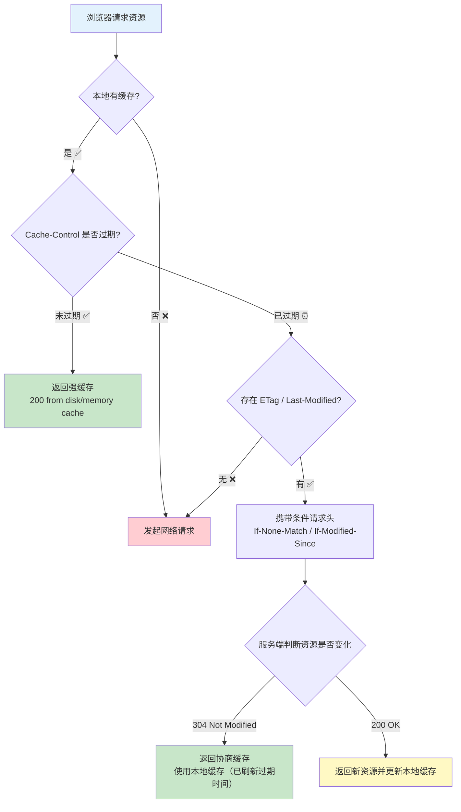

**流程解读**：

1. **强缓存命中**（绿色路径）：当 `Cache-Control` 的 `max-age` 未过期时，浏览器直接使用本地缓存，**不发送任何网络请求**，速度最快。DevTools Network 面板显示 `200 (from disk cache)` 或 `200 (from memory cache)`。

2. **协商缓存命中**（浅绿路径）：强缓存过期后，浏览器携带 `If-None-Match`（对应 ETag）或 `If-Modified-Since`（对应 Last-Modified）向服务端发起条件请求。若资源未变化，服务端返回 **304** 和空 Body，浏览器继续使用本地缓存并刷新过期时间——节省了传输带宽。

3. **缓存完全失效**（红色路径）：既没有本地缓存，也没有有效的验证信息（ETag/Last-Modified），浏览器必须发起完整的网络请求获取最新资源。

4. **资源已更新**（黄色路径）：协商缓存时服务端判断资源已变更，返回 **200 OK** 和完整的新资源内容，浏览器更新本地缓存。

> ⚠️ **关键细节**：`Cache-Control: no-cache` 并非"不缓存"，而是"绕过强缓存直接进入协商缓存验证"。而 `no-store` 才是真正不缓存任何内容。这是实际配置中最容易混淆的一组指令。

### 5.4 ETag 与 Last-Modified

#### 5.4.1 工作原理

```javascript
/**
 * ETag vs Last-Modified 对比
 * 
 * ETag（Entity Tag）：
 * - 服务器为资源生成的唯一标识符（通常是内容的哈希值）
 * - 更精确：能检测到 1 字节的差异
 * - 格式：弱 ETag W/"xxx" 或强 ETag "xxx"
 * 
 * Last-Modified：
 * - 资源最后修改的时间戳
 * - 精度较低：只能精确到秒
 * - 依赖于时钟同步
 */

// ========== ETag 生成逻辑（Node.js 示例）==========
const crypto = require('crypto');
const fs = require('fs');

function generateETag(filePath) {
  // 方式一：基于文件内容生成哈希（推荐，最准确）
  const fileContent = fs.readFileSync(filePath);
  const hash = crypto.createHash('md5').update(fileContent).digest('hex');
  return `"${hash}"`;  // ETag 需要用引号包裹
  
  // 方式二：基于文件大小和修改时间（较快）
  // const stats = fs.statSync(filePath);
  // return `"${stats.size}-${stats.mtime.getTime()}"`;
}

// 方式三：基于响应内容生成（流式）
function generateETagFromBuffer(buffer) {
  const hash = crypto.createHash('md5').update(buffer).digest('hex');
  return `W/"${hash}"`;  // 弱 ETag（W/ 前缀）
}

// ========== 协商缓存验证逻辑 ==========
function handleConditionalRequest(req, res, filePath) {
  const currentETag = generateETag(filePath);
  const stats = fs.statSync(filePath);
  const lastModified = stats.mtime.toUTCString();
  
  // 检查 If-None-Match（ETag 验证）
  const ifNoneMatch = req.headers['if-none-match'];
  if (ifNoneMatch) {
    // 支持 ETag 列表（多个 ETag 用逗号分隔）
    const clientETags = ifNoneMatch.split(',').map(tag => tag.trim());
    if (clientETags.includes(currentETag)) {
      // ETag 匹配，返回 304
      res.status(304);
      res.setHeader('ETag', currentETag);
      res.setHeader('Cache-Control', 'public, max-age=3600');
      res.end();
      return true;  // 缓存命中
    }
  }
  
  // 检查 If-Modified-Since（Last-Modified 验证，备用方案）
  const ifModifiedSince = req.headers['if-modified-since'];
  if (ifModifiedSince && !ifNoneMatch) {
    const clientTime = new Date(ifModifiedSince).getTime();
    const serverTime = stats.mtime.getTime();
    
    if (serverTime <= clientTime) {
      // 未修改，返回 304
      res.status(304);
      res.setHeader('Last-Modified', lastModified);
      res.end();
      return true;  // 缓存命中
    }
  }
  
  // 缓存未命中，返回完整资源
  res.status(200);
  res.setHeader('ETag', currentETag);
  res.setHeader('Last-Modified', lastModified);
  res.setHeader('Cache-Control', 'public, max-age=3600');
  // ... 发送文件内容
  return false;
}
```

#### 5.4.2 何时使用哪种验证方式

| 场景 | 推荐 | 原因 |
|------|------|------|
| 静态文件服务器 | **ETag** | 精确检测内容变化 |
| REST API | **ETag** | 可以检测微小变化 |
| 代理服务器 | **ETag** | 不依赖时钟同步 |
| 简单静态站点 | Last-Modified | 实现简单，足够用 |
| 频繁更新的资源 | **ETag** | 1 秒精度不够 |

### 5.5 Service Worker 缓存策略

**Service Worker**（SW）是一种运行在浏览器后台的脚本，可以拦截网络请求并决定如何响应（从缓存返回或从网络获取）。

#### 5.5.1 基础架构

```javascript
/**
 * Service Worker 生命周期
 * 
 * 1. 注册（Register）：主线程调用 navigator.serviceWorker.register()
 * 2. 安装（Install）：SW 首次激活，通常在此预缓存关键资源
 * 3. 激活（Activate）：安装完成后激活，可以清理旧缓存
 * 4. 运行（Fetch）：拦截网络请求，决定响应策略
 */

// ========== Step 1: 注册 Service Worker ==========
// 在主线程（页面 JS）中执行
if ('serviceWorker' in navigator) {
  window.addEventListener('load', () => {
    navigator.serviceWorker.register('/sw.js')
      .then(registration => {
        console.log('SW 注册成功:', registration.scope);
        
        // 检测更新
        registration.addEventListener('updatefound', () => {
          const newWorker = registration.installing;
          newWorker.addEventListener('statechange', () => {
            if (newWorker.state === 'activated') {
              console.log('新 SW 已激活，提示用户刷新');
              // 可以通知用户有新版本可用
            }
          });
        });
      })
      .catch(error => {
        console.error('SW 注册失败:', error);
      });
  });
}
```

#### 5.5.2 常用缓存策略实现

```javascript
// ========== sw.js 完整实现 ==========

// 缓存名称（更新时改名以使旧缓存失效）
const CACHE_NAME = 'my-app-v1.2.0';

// 需要预缓存的资源列表（App Shell）
const PRECACHE_URLS = [
  '/',
  '/index.html',
  '/css/styles.css',
  '/js/app.js',
  '/offline.html',  // 离线页面
];

// ==================== 事件 1: Install ====================
self.addEventListener('install', (event) => {
  console.log('[SW] 安装中...');
  
  event.waitUntil(
    // 打开缓存并预缓存关键资源
    caches.open(CACHE_NAME)
      .then(cache => {
        console.log('[SW] 预缓存中...');
        return cache.addAll(PRECACHE_URLS);
      })
      .then(() => {
        console.log('[SW] 预缓存完成');
        // 强制激活（不等待旧 SW 关闭）
        return self.skipWaiting();
      })
      .catch(error => {
        console.error('[SW] 预缓存失败:', error);
      })
  );
});

// ==================== 事件 2: Activate ====================
self.addEventListener('activate', (event) => {
  console.log('[SW] 激活中...');
  
  event.waitUntil(
    // 清理旧版本的缓存
    caches.keys().then(cacheNames => {
      return Promise.all(
        cacheNames
          .filter(name => name !== CACHE_NAME)
          .map(name => {
            console.log('[SW] 删除旧缓存:', name);
            return caches.delete(name);
          })
      );
    })
    .then(() => {
      // 立即控制所有客户端
      return self.clients.claim();
    })
  );
});

// ==================== 事件 3: Fetch（核心！）====================
self.addEventListener('fetch', (event) => {
  const { request } = event;
  const url = new URL(request.url);
  
  // 策略选择（根据请求类型）
  if (isNavigationRequest(request)) {
    // 导航请求：Network First（网络优先）
    event.respondWith(networkFirst(request));
  } 
  else if (isStaticAsset(request)) {
    // 静态资源：Stale While Revalidate（缓存优先 + 后台更新）
    event.respondWith(staleWhileRevalidate(request));
  }
  else if (isAPIRequest(request)) {
    // API 请求：Network First（带超时降级到缓存）
    event.respondWith(networkFirstWithTimeout(request, 3000));
  }
  else {
    // 其他请求：Cache First（缓存优先）
    event.respondWith(cacheFirst(request));
  }
});
// ==================== 缓存策略实现 ====================

/**
 * 策略 1: Cache First（缓存优先）
 * 
 * 适用：不常变化的静态资源（字体、带 hash 的 JS/CSS）
 * 流程：缓存命中→返回缓存；未命中→网络请求→存入缓存
 */
async function cacheFirst(request) {
  const cachedResponse = await caches.match(request);
  if (cachedResponse) {
    return cachedResponse;  // 缓存命中，直接返回
  }
  
  // 缓存未命中，从网络获取
  try {
    const networkResponse = await fetch(request);
    // 只缓存成功的响应
    if (networkResponse.ok) {
      const cache = await caches.open(CACHE_NAME);
      cache.put(request, networkResponse.clone());
    }
    return networkResponse;
  } catch (error) {
    console.error('[SW] 网络请求失败:', error);
    return caches.match('/offline.html');
  }
}

/**
 * 策略 2: Network First（网络优先）
 * 适用：需要最新数据的请求（API、HTML）
 */
async function networkFirst(request) {
  try {
    const networkResponse = await fetch(request);
    if (networkResponse.ok) {
      const cache = await caches.open(CACHE_NAME);
      cache.put(request, networkResponse.clone());
    }
    return networkResponse;
  } catch (error) {
    const cachedResponse = await caches.match(request);
    return cachedResponse || caches.match('/offline.html');
  }
}

/**
 * 策略 3: Stale While Revalidate（过期后仍可用 + 后台刷新）
 */
async function staleWhileRevalidate(request) {
  const cache = await caches.open(CACHE_NAME);
  const cachedResponse = await cache.match(request);
  
  // 后台刷新缓存
  fetch(request).then(networkResponse => {
    if (networkResponse.ok) {
      cache.put(request, networkResponse.clone());
    }
  }).catch(() => {});
  
  // 立即返回缓存
  return cachedResponse || fetch(request);
}

// 辅助函数
function isNavigationRequest(req) { return req.mode === 'navigate'; }
function isStaticAsset(req) { return /\.(js|css|png|jpg|jpeg|gif|svg|ico|woff|woff2)$/.test(new URL(req.url).pathname); }
function isAPIRequest(req) { return new URL(req.url).pathname.startsWith('/api/'); }
```

### 5.6 浏览器存储 API 对比

| 特性 | localStorage | sessionStorage | IndexedDB | Cache Storage |
|------|-------------|-----------------|-----------|---------------|
| **容量** | ~5MB | ~5MB | 无限 | 取决于磁盘 |
| **数据类型** | 字符串 | 字符串 | 结构化数据/Blob | Response |
| **持久性** | 永久 | 会话结束清除 | 永久 | 可配置 |
| **访问方式** | 同步（阻塞） | 同步 | 异步 | 异步 |

### 5.7 本章要点速查

| 知识点 | 核心内容 | 关键词 |
|--------|---------|--------|
| **强缓存** | 不请求服务器直接使用本地缓存 | max-age、immutable |
| **协商缓存** | 向服务器验证后决定使用缓存 | ETag、304 |
| **Cache-Control** | HTTP/1.1 缓存控制头 | public/private/no-store |
| **Service Worker** | 后台脚本拦截请求 | Cache First/Network First/Stale While Revalidate |
| **localStorage** | 5MB 同步字符串存储 | 用户偏好设置 |
| **IndexedDB** | 大容量异步结构化存储 | 离线数据 |

---

## 第6章：渲染性能优化

### 6.1 本章学习目标

完成本章学习后，你将能够：
- ✅ 完整回顾浏览器渲染管线
- ✅ 深入理解重排（Reflow）触发条件与优化
- ✅ 掌握重绘（Repaint）最小化策略
- ✅ 学会利用合成层进行 GPU 加速
- ✅ 了解 CSS Containment 和虚拟滚动

### 6.2 浏览器渲染管线回顾

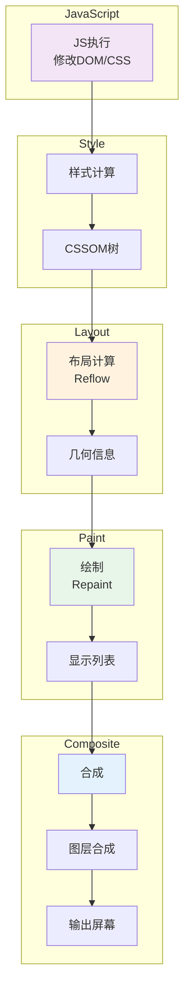

**各阶段代价**：`JavaScript → Style → Layout(高) → Paint(中) → Composite(低)`

### 6.3 重排（Reflow）详解

**重排**是浏览器重新计算元素几何属性的过程。

#### 触发重排的操作：

```javascript
// 必然触发的操作
element.style.width = '100px';           // 修改尺寸
element.style.padding = '10px';          // 修改内边距
document.body.appendChild(div);          // 添加/删除 DOM

// 只触发重绘的操作（不触发布局）
element.style.color = 'red';             // ✅ 只重绘
element.style.backgroundColor = '#fff';   // ✅ 只重绘
element.style.visibility = 'hidden';     // ✅ 只重绘

// 仅触发合成的操作（最优！）
element.style.transform = 'translateX(100px)';  // ✅ 仅 Composite
element.style.opacity = '0.5';                   // ✅ 仅 Composite
```

#### 强制同步布局（Forced Synchronous Layout）

```javascript
// ❌ 布局抖动：读写交替导致多次 Reflow
function badLayoutThrashing() {
  for (let i = 0; i < elements.length; i++) {
    const width = elements[i].offsetWidth;  // 读（强制 Layout）
    elements[i].style.width = (width + 10) + 'px';  // 写（脏标记）
  }  // 每次循环都触发 Layout → Paint → Layout...
}

// ✅ 批量读写分离
function goodLayoutOptimization() {
  // Step 1: 批量读取
  const widths = Array.from(elements, el => el.offsetWidth);
  // Step 2: 批量写入
  elements.forEach((el, i) => el.style.width = (widths[i] + 10) + 'px');
}
```

### 6.4 重绘（Repaint）与合成优化

```javascript
// 最小化重绘策略
// 方式 A: 修改 className（推荐）
element.className = 'highlighted-state';

// 方式 B: 修改 cssText
element.style.cssText = 'color: red; background-color: blue;';
```

**will-change 与 GPU 加速**：

```css
/* 创建合成层的方式 */
.gpu-layer {
  will-change: transform;           /* 提示浏览器提前优化 */
  transform: translateZ(0);         /* 经典 hack */
  opacity: 0.99;                    /* 小于 1 即可创建 */
}
```

⚠️ **注意**：不要滥用 `will-change`，每个合成层占用额外显存。建议只给真正需要动画的元素使用。

### 6.5 CSS Containment

```css
/* 隔离子树，减少计算范围 */
.widget {
  contain: strict;  /* layout + paint + size */
}
.list-item {
  contain: strict;  /* 每个列表项独立 */
}
```

### 6.6 虚拟滚动原理

当渲染大量数据时，只渲染可视区域内的少量元素。

```javascript
class VirtualScroller {
  constructor(container, options) {
    this.container = container;
    this.itemHeight = options.itemHeight || 50;
    this.totalItems = options.totalItems;
    this.renderItem = options.renderItem;
    
    this.visibleCount = Math.ceil(container.clientHeight / this.itemHeight) + 4;
    this.startIndex = 0;
    
    this.init();
  }
  
  init() {
    this.placeholder = document.createElement('div');
    this.placeholder.style.height = `${this.totalItems * this.itemHeight}px`;
    this.container.style.position = 'relative';
    this.container.appendChild(this.placeholder);
    
    this.contentContainer = document.createElement('div');
    this.contentContainer.style.position = 'absolute';
    this.contentContainer.style.top = '0';
    this.container.appendChild(this.contentContainer);
    
    this.container.addEventListener('scroll', () => this.handleScroll(), { passive: true });
    this.render();
  }
  
  handleScroll() {
    requestAnimationFrame(() => {
      const newStart = Math.floor(this.container.scrollTop / this.itemHeight) - 2;
      if (newStart !== this.startIndex && newStart >= 0) {
        this.startIndex = Math.min(newStart, this.totalItems - this.visibleCount);
        this.render();
      }
    });
  }
  
  render() {
    this.contentContainer.innerHTML = '';
    this.contentContainer.style.transform = `translateY(${this.startIndex * this.itemHeight}px)`;
    
    const end = Math.min(this.startIndex + this.visibleCount, this.totalItems);
    for (let i = this.startIndex; i < end; i++) {
      const el = this.renderItem(i);
      el.style.height = `${this.itemHeight}px`;
      this.contentContainer.appendChild(el);
    }
  }
}
```

### 6.7 本章要点速查

| 知识点 | 核心内容 | 关键词 |
|--------|---------|--------|
| **渲染管线** | JS→Style→Layout→Paint→Composite | 各阶段代价递增 |
| **Reflow** | 重排代价最高 | offsetWidth、批量读写分离 |
| **Repaint** | 重绘代价中等 | color/background |
| **Composite** | 合成代价最低 | transform/opacity |
| **Containment** | 隔离子树减少计算 | strict/content |
| **虚拟滚动** | 只渲染可视区域 | 占位符+偏移量 |

---

## 第7章：JavaScript 执行性能

### 7.1 本章学习目标

- ✅ 理解主线程阻塞问题
- ✅ 掌握长任务切割策略
- ✅ 熟练运用 rAF/rIC
- ✅ 学会 Web Worker 使用场景
- ✅ 了解 OffscreenCanvas 和 Island Architecture

### 7.2 主线程阻塞与长任务

**长任务（Long Task）**：执行超过 50ms 的任务。

```javascript
// 长任务来源
// 1. 大型循环
for (let i = 0; i < items.length; i++) heavyProcessing(items[i]);

// 2. 复杂 DOM 操作
data.forEach(item => {
  document.body.appendChild(createComplexElement(item));
});

// 3. 第三方库初始化
HeavyLibrary.init({ plugins: ['analytics', 'tracking'] });
```

### 7.3 任务切割策略

```javascript
// 方式一：setTimeout(0) 切片
function chunkWithTimeout(items, processFn, callback) {
  let index = 0;
  const chunkSize = 50;
  
  function processChunk() {
    const end = Math.min(index + chunkSize, items.length);
    for (; index < end; index++) processFn(items[index]);
    index < items.length ? setTimeout(processChunk, 0) : callback();
  }
  processChunk();
}

// 方式二：requestIdleCallback
function chunkWithRIC(tasks, timeout = 1000) {
  let idx = 0;
  function process(deadline) {
    while (idx < tasks.length && (deadline.timeRemaining() > 0 || deadline.didTimeout)) {
      tasks[idx++]();
    }
    if (idx < tasks.length) requestIdleCallback(process, { timeout });
  }
  requestIdleCallback(process, { timeout });
}
```

### 7.4 rAF vs rIC

| 特性 | requestAnimationFrame | requestIdleCallback |
|------|----------------------|---------------------|
| **时机** | 每帧渲染前 | 主线程空闲时 |
| **频率** | ~60fps | 不固定 |
| **用途** | 动画/视觉更新 | 低优先级后台任务 |
| **后台暂停** | 是 | 否 |

### 7.5 Web Worker 实战

```javascript
// worker.js
self.addEventListener('message', e => {
  const { type, data } = e.data;
  if (type === 'CALCULATE') {
    const result = heavyCalculation(data);
    self.postMessage({ type: 'RESULT', data: result });
  }
});

// main.js
class WorkerManager {
  constructor(url) {
    this.worker = new Worker(url);
    this.callbacks = new Map();
    this.id = 0;
    this.worker.onmessage = e => {
      const cb = this.callbacks.get(e.data.id);
      if (cb) { cb(e.data); this.callbacks.delete(e.data.id); }
    };
  }
  
  post(type, data) {
    return new Promise(resolve => {
      this.callbacks.set(++this.id, resolve);
      this.worker.postMessage({ id: this.id, type, data });
    });
  }
}
```

### 7.6 Island Architecture 思路

> 页面静态内容由 SSR 渲染，只有需要交互的部分（"岛屿"）由 JS 激活。

框架：Astro、Fresh。

### 7.7 本章要点速查

| 知识点 | 核心内容 | 关键词 |
|--------|---------|--------|
| **Long Task** | >50ms 影响交互 | 循环/DOM/第三方库 |
| **任务切片** | 拆分为<50ms小块 | setTimeout/rIC/Generator |
| **rAF** | 每帧渲染前执行 | 60fps动画 |
| **rIC** | 空闲时执行低优任务 | deadline.timeRemaining() |
| **Web Worker** | 后台线程不阻塞主线程 | postMessage、线程池 |
| **Island Arch** | 静态HTML+交互岛屿 | 选择性Hydration |

---

## 第8章：内存管理与泄漏防护

### 8.1 本章学习目标

- ✅ 理解 GC 机制（标记清除/V8堆结构）
- ✅ 识别常见内存泄漏模式
- ✅ 掌握 Chrome DevTools Memory 面板检测方法
- ✅ 学会内存优化最佳实践

### 8.2 V8 内存结构与GC算法

```
V8 堆结构:
┌─────────────────┐
│ New Space       │ ← 新生代（Scavenge，1-8MB）
├─────────────────┤
│ Old Space       │ ← 老生代（Mark-Sweep-Compact）
├─────────────────┤
│ Large Object    │ ← 大对象区（>256KB）
├─────────────────┤
│ Code Space      │ ← JIT编译代码
└─────────────────┘
```

### 8.3 常见泄漏模式

```javascript
// ❌ 泄漏1：意外全局变量
function leak() { leakedVar = 'global!'; }  // 无声明

// ❌ 泄漏2：闭包持有大对象引用
function createClosure() {
  const hugeData = new Array(1000000).fill('x');  // ~8MB
  return () => console.log('hi');  // hugeData 无法回收
}

// ❌ 泄漏3：Detached DOM
const node = document.createElement('div');
document.body.appendChild(node);
document.body.removeChild(node);  // 从 DOM 移除
// 但 node 变量仍引用它！

// ❌ 泄漏4：遗忘的事件监听器
button.addEventListener('click', handler);
// button 被移除但 handler 还在

// ✅ 使用 AbortController 批量管理
const ctrl = new AbortController();
button.addEventListener('click', handler, { signal: ctrl.signal });
// ctrl.abort();  // 一次性移除所有关联监听
```

#### 8.3.1 内存泄漏检测与修复流程

上一节列出了常见的内存泄漏模式，但在实际项目中如何**系统性地发现、定位并修复**内存泄漏呢？下面这张流程图展示了一个从"怀疑泄漏"到"修复验证"的完整排查路径。

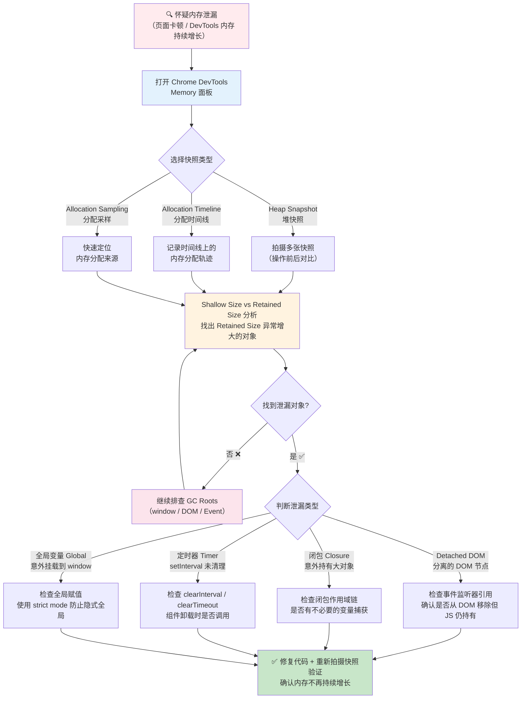

**流程要点说明**：

| 步骤 | 关键操作 | 注意事项 |
|------|---------|---------|
| **① 选择快照类型** | Heap Snapshot 适合精确分析；Allocation Timeline 适合定位"何时分配"；Allocation Sampling 开销最小，适合快速排查 | 推荐先用 Sampling 缩小范围，再用 Heap Snapshot 精确定位 |
| **② Shallow vs Retained** | Shallow Size = 对象本身占用的内存；Retained Size = 该对象被 GC 后能释放的总内存 | **优先关注 Retained Size 大的对象**，它们才是内存增长的真正元凶 |
| **③ 泄漏类型判断** | 根据对象的引用链特征判断属于哪种泄漏模式 | Detached DOM 是最常见的泄漏源，尤其在 SPA 应用中 |
| **④ 修复与验证** | 修改代码后必须重新执行完整的检测流程，确认内存曲线趋于平稳 | 单次修复可能不够，需要多次迭代 |

> 💡 **实战技巧**：在拍摄 Heap Snapshot 前，先点击 DevTools 的 🗑️ 垃圾回收按钮强制触发一次 GC，这样可以排除可回收对象对快照的干扰，让真正的泄漏对象更明显。

### 8.4 WeakMap/WeakSet 正确使用

```javascript
// WeakMap 键是弱引用，不阻止 GC
const privData = new WeakMap();

function attachData(obj, data) {
  privData.set(obj, data);  // obj 无其他强引用时可被回收
}
```

### 8.5 本章要点速查

| 知识点 | 核心内容 | 关键词 |
|--------|---------|--------|
| **V8堆** | 新生代/老生代/大对象区 | Scavenge/Mark-Sweep |
| **全局变量泄漏** | 未声明变量成为window属性 | strict mode |
| **闭包泄漏** | 意外持有大对象 | 手动解除引用 |
| **Detached DOM** | 移除后仍被JS引用 | innerHTML="" |
| **事件泄漏** | 移除元素未移除监听 | AbortController |
| **WeakMap** | 弱引用键不阻止GC | 私有数据存储 |

---

## 第9章：网络层优化

### 9.1 本章学习目标

- ✅ 理解 HTTP/2 多路复用和 HPACK
- ✅ 了解 HTTP/3 QUIC 协议
- ✅ 掌握 CDN 原理与选型
- ✅ 学会资源压缩技术
- ✅ 理解连接复用与现代域名策略

### 9.2 HTTP/2 vs HTTP/3

| 特性 | HTTP/1.1 | HTTP/2 | HTTP/3 (QUIC) |
|------|----------|--------|--------------|
| **传输层** | TCP | TCP | UDP |
| **多路复用** | ❌ | ✅ | ✅（独立流） |
| **头部压缩** | ❌ | HPACK | QPACK |
| **连接建立** | 2-3 RTT | 2-3 RTT | **0-1 RTT** |
| **队头阻塞** | 有 | TCP层仍有 | ✅ 无 |

### 9.3 CDN 选型对比

| 服务商 | 优势 | 适用场景 |
|--------|------|---------|
| **Cloudflare** | 免费套餐/DDoS防护 | 个人/中小企业 |
| **AWS CloudFront** | AWS生态集成/Lambda@Edge | 已有AWS基础设施 |
| **阿里云CDN** | 国内节点覆盖好 | 主要服务国内用户 |
| **Fastly** | 即时purge/VCL语言 | 需精细控制的企业 |

### 9.4 资源压缩

| 算法 | 压缩率 | 速度 | 推荐 |
|------|-------|------|------|
| Gzip | 60-70% | 快 | 兼容性优先 |
| **Brotli** | 比 Gzip 小15-25% | 中等 | **首选**（预压缩时） |
| Zstd | 接近Brotli | 极快 | 未来标准 |

### 9.5 域名分片还需要吗？

| HTTP版本 | 是否需要域名分片 | 原因 |
|---------|----------------|------|
| HTTP/1.1 | ✅ 需要 | 受6连接限制 |
| **HTTP/2** | ❌ 不需要 | 多路复用单连接即可 |
| **HTTP/3** | ❌ 不需要 | QUIC更高效 |

### 9.6 本章要点速查

| 知识点 | 核心内容 | 关键词 |
|--------|---------|--------|
| **HTTP/2多路复用** | 单连接并行传输 | 帧/流/HPACK |
| **HTTP/3 QUIC** | 基于UDP/0-RTT/无队头阻塞 | 连接迁移 |
| **CDN** | 边缘节点就近分发 | 命中率/TTL/回源 |
| **Brotli** | 最高压缩比推荐 | 预压缩/level 6-11 |
| **域名分片** | HTTP/2不需要 | 单域名的h2/h3 |

---

## 第10章：图片优化

### 10.1 本章学习目标

- ✅ 对比图片格式特点与适用场景
- ✅ 掌握响应式图片实现
- ✅ 实现图片懒加载
- ✅ 理解渐进式加载
- ✅ 了解现代自动优化方案

### 10.2 图片格式对比

| 格式 | 类型 | 透明 | 动画 | 压缩率 | 适用场景 |
|------|------|------|------|--------|---------|
| JPEG | 有损 | ❌ | ❌ | 中等 | 照片 |
| PNG | 无损 | ✅ | ❌ | 低 | 截图/图标 |
| **WebP** | 有损/无损 | ✅ | ✅ | 高(比JPEG小25-35%) | **现代Web首选** |
| **AVIF** | 有损/无损 | ✅ | ❌ | 最高(比WebP小20%) | 未来标准 |
| SVG | 矢量 | ✅ | ✅ | N/A | 图标/Logo/插图 |

```html
<!-- 响应式格式降级链 -->
<picture>
  <source srcset="photo.avif" type="image/avif">
  <source srcset="photo.webp" type="image/webp">
  
</picture>
```

### 10.3 响应式图片

```html
<!-- srcset + sizes -->


<!-- picture 元素：艺术方向切换 -->
<picture>
  <source media="(max-width: 600px)" srcset="portrait.jpg">
  
</picture>

<!-- 密度描述符 -->

```

### 10.4 图片懒加载

```html
<!-- 原生懒加载 -->


<!-- Intersection Observer 实现（精细控制） -->
<script>
const lazyImages = document.querySelectorAll('img[data-src]');
const observer = new IntersectionObserver((entries) => {
  entries.forEach(entry => {
    if (entry.isIntersecting) {
      const img = entry.target;
      img.src = img.dataset.src;
      observer.unobserve(img);
    }
  });
}, { rootMargin: '200px' });

lazyImages.forEach(img => observer.observe(img));
</script>
```

### 10.5 渐进式加载（LQIP）

```html
<!-- 低质量图占位 + 高清图淡入 -->
<style>
.lqip-container { position: relative; overflow: hidden; }
.lqip-placeholder {
  position: absolute; inset: 0;
  background-size: cover; filter: blur(20px); transform: scale(1.1);
  transition: opacity 0.5s;
}
.lqip-full { opacity: 0; transition: opacity 0.5s; }
.loaded .lqip-full { opacity: 1; }
.loaded .lqip-placeholder { opacity: 0; }
</style>

<div class="lqip-container">
  <div class="lqip-placeholder" style="background-image: url(small-blur.jpg)"></div>
  
</div>
```

### 10.6 现代图片自动优化方案

```javascript
// CDN 自动图片处理示例（Cloudinary / Imgix 风格）
// URL 参数控制转换
const autoOptimize = {
  // 自动格式转换（浏览器支持 AVIF 则返回 AVIF，否则 WebP）
  formatAuto: 'https://cdn.example.com/image.jpg?f_auto',
  
  // 响应式裁剪 + 质量
  responsive: 'https://cdn.example.com/image.jpg?w=800&h=600&q=80&f_auto',
  
  // 设备像素比适配
  retina: 'https://cdn.example.com/image.jpg?w=800&dpr=2&f_auto',
  
  // 智能裁剪（AI 识别主体）
  smartCrop: 'https://cdn.example.com/image.jpg?c_smart&w=400&f_auto',
};

// 使用 <picture> + 自动优化
/*
<picture>
  <source srcset="photo.jpg?w=400&f_avif" type="image/avif">
  <source srcset="photo.jpg?w=400&f_webp" type="image/webp">
  
</picture>
*/
```

### 10.7 本章要点速查

| 知识点 | 核心内容 | 关键词 |
|--------|---------|--------|
| **WebP** | 现代Web首选格式 | 比JPEG小25-35% |
| **AVIF** | 最高压缩比未来标准 | 比WebP小20% |
| **srcset/sizes** | 响应式图片 | w描述符/dpr |
| **loading=lazy** | 原生懒加载 | Intersection Observer |
| **LQIP** | 低质量图占位+淡入 | blur+transition |
| **CDN处理** | 自动格式转换/响应式裁剪 | f_auto/c_smart |

---

## 第11章：字体加载优化

### 11.1 本章学习目标

- ✅ 掌握 @font-face 详解
- ✅ 理解 FOUT/FOIT/FOLT 三种加载行为
- ✅ 学会 font-display 策略选择
- ✅ 了解字体子集化与预加载
- ✅ 掌握可变字体（Variable Fonts）

### 11.2 @font-face 详解

```css
@font-face {
  font-family: 'CustomFont';
  /* 多源降级：浏览器选择第一个支持的格式 */
  src: url('custom.woff2') format('woff2'),   /* 最优：现代浏览器 */
      url('custom.woff') format('woff'),       /* 兼容：旧版浏览器 */
      url('custom.ttf') format('truetype');    /* 兜底 */
  
  /* 字体范围：减少下载量 */
  unicode-range: U+000-00FF, U+4E00-9FFF;     /* Latin + CJK */
  
  /* 字体显示策略 */
  font-display: swap;
  
  /* 字体粗细和样式 */
  font-weight: 400;
  font-style: normal;
}
```

### 11.3 三种字体加载行为

| 行为 | 英文 | 描述 | 用户体验 |
|------|------|------|---------|
| **不可见文本** | FOIT (Flash of Invisible Text) | 字体加载期间隐藏文本 | ⚠️ 用户什么也看不到 |
| **无样式文本** | FOUT (Flash of Unstyled Text) | 先用系统字体显示，加载后切换 | ✅ 内容立即可见 |
| **闪烁文本** | FOLT (Flash of Faux Text) | 用伪字体（拉伸/压缩）模拟 | ⚠️ 可能导致布局偏移 |

### 11.4 font-display 策略

```css
@font-face {
  /* auto: 浏览器默认（通常类似 block） */
  font-display: auto;
  
  /* block: 短暂隐藏（最多3秒），然后交换 */
  font-display: block;      /* 适合品牌Logo等必须用自定义字体的场景 */
  
  /* swap: 立即用后备字体，加载后替换（推荐！） */
  font-display: swap;       /* 适合正文内容 */
  
  /* fallback: 类似 swap 但有约100ms的隐藏期 */
  font-display: fallback;   /* 折中方案 */
  
  /* optional: 如果字体快速加载则使用，否则永远用后备 */
  font-display: optional;   /* 最适合非关键字体 */
}
```

### 11.5 字体优化技术

```html
<head>
  <!-- 1. 预加载关键字体 -->
  <link rel="preload" as="font" href="/fonts/main.woff2" type="font/woff2" crossorigin>
  
  <!-- 2. DNS预解析字体服务器 -->
  <link rel="dns-prefetch" href="https://fonts.gstatic.com">
</head>

<!-- 3. Critical CSS 中内联关键字符 -->
<style>
  @font-face { font-family: 'Main'; src: url('/fonts/main.woff2') format('woff2'); font-display: swap; }
  
  /* 只内联首屏需要的字符子集 */
  .hero-title { font-family: 'Main', sans-serif; }
</style>
```

**字体子集化（Subset）**：

```javascript
// 使用工具（pyftsubset / glyphhanger）提取使用到的字符
// 例如：页面只用了 "首页产品购物车" 这些汉字 + a-z
// 子集化后可能从 8MB 减少到 20KB！
```

### 11.6 可变字体（Variable Fonts）

```css
/* 可变字体：一个文件包含所有粗细/宽度/样式变体 */

@font-face {
  font-family: 'InterVariable';
  src: url('InterVariable.woff2') format('woff2-variations');
  font-weight: 100 900;        /* 范围：100-900 */
  font-stretch: 10% 400%;      /* 宽度范围 */
}

/* 使用时自由调节 */
.heading { 
  font-family: 'InterVariable'; 
  font-weight: 800;            /* 不需要额外的 bold 文件 */
}
.narrow-text {
  font-family: 'InterVariable';
  font-stretch: 80%;           /* 窄体 */
}
/* 优势：
   - 单个文件替代多个静态字体文件
   - 动画过渡平滑（weight 变化）
   - 总体积更小（通常）
*/
```

### 11.7 本章要点速查

| 知识点 | 核心内容 | 关键词 |
|--------|---------|--------|
| **FOIT/FOUT** | 字体加载期间的行为 | 不可见/无样式/闪烁 |
| **font-display** | swap推荐用于正文 | block/swap/fallback/optional |
| **preload字体** | as="font"+crossorigin | preload+dns-prefetch |
| **子集化** | 只包含使用的字符 | pyftsubset/glyphhanger |
| **可变字体** | 单文件多轴变化 | weight/stretch range |

---

## 第12章：打包体积优化

### 12.1 本章学习目标

- ✅ 掌握 Tree Shaking 原理与注意事项
- ✅ 学会使用 Bundle Analyzer
- ✅ 了解代码压缩配置
- ✅ 掌握依赖优化技巧

### 12.2 Tree Shaking 原理

> **Tree Shaking**（树摇）：通过静态分析消除未使用的导出代码。

**前提条件**：
1. 使用 ES Module 语法（`import/export`，不能用 `require`）
2. 打开 `mode: production`（开发模式不进行 Tree Shaking）
3. 库的 `package.json` 正确设置 `"sideEffects"`

```javascript
// utils.js
export function usedFunction() { return 'used'; }
export function unusedFunction() { return 'unused'; }  // 未被导入

// main.js
import { usedFunction } from './utils.js';
console.log(usedFunction());
// unusedFunction 会被 Tree Shaking 移除！
```

**sideEffects 配置**：

```json
// package.json
{
  "name": "my-library",
  "sideEffects": [
    "*.css",
    "*.less",
    "./src/polyfills.js",
    "*"
  ]
  /* 
   sideEffects 含义：
   - false: 整个包无副作用，可以安全地 Tree Shake
   - 数组: 列出的文件有副作用，不应被移除
   - true或不设: 假设所有文件都有副作用
  */
}
```

### 12.3 Bundle Analyzer 使用

```javascript
// webpack.config.js
const BundleAnalyzerPlugin = require('webpack-bundle-analyzer').BundleAnalyzerPlugin;

module.exports = {
  plugins: [
    new BundleAnalyzerPlugin({
      analyzerMode: 'static',      // 生成 HTML 报告
      openAnalyzer: false,          // 不自动打开浏览器
      reportFilename: 'bundle-report.html',
    }),
  ],
};

// 运行 npx webpack --profile → 查看 report.html
// 找出占用空间最大的模块，针对性优化
```

### 12.4 代码压缩配置

```javascript
// TerserPlugin（JS 压缩）
new TerserPlugin({
  parallel: true,
  terserOptions: {
    compress: {
      drop_console: true,         // 移除 console
      drop_debugger: true,        // 移除 debugger
      pure_funcs: ['console.log'], // 移除指定函数调用
    },
    mangle: true,                 // 混淆变量名
  },
});

// css-minimizer-terser（CSS 压缩）
new CssMinimizerPlugin({
  minimizerOptions: {
    preset: ['default', { discardComments: { removeAll: true } }],
  },
});
```

### 12.5 依赖优化

```javascript
// ❌ 全量引入
import _ from 'lodash';                    // ~70KB gzipped
import moment from 'moment';               // ~300KB gzipped
import { DatePicker } from 'antd';         // 引入整个 antd

// ✅ 按需引入
import debounce from 'lodash/debounce';     // ~0.5KB
import dayjs from 'dayjs';                 // ~7KB（替代 moment）
import { DatePicker } from 'antd/es/date-picker';  // 按组件引入

// 或使用 babel-plugin-import 自动按需引入
/*
{
  "plugins": [
    ["import", { "libraryName": "antd", "libraryDirectory": "es", "style": "css" }]
  ]
}
*/

// 外部化大型库（通过 CDN 加载）
module.exports = {
  externals: {
    react: 'React',
    'react-dom': 'ReactDOM',
    lodash: '_',
  },
};
```

### 12.6 本章要点速查

| 知识点 | 核心内容 | 关键词 |
|--------|---------|--------|
| **Tree Shaking** | ES Module静态分析移除死代码 | sideEffects、production mode |
| **Bundle Analyzer** | 可视化分析包体积 | webpack-bundle-analyzer |
| **Terser** | JS压缩混淆 | drop_console/mangle |
| **按需引入** | 只引入使用的模块 | babel-plugin-import/lodash-es |
| **外部化** | 大库走CDN减小包体积 | externals |

---

## 第13章：移动端性能特殊考虑

### 13.1 本章学习目标

- ✅ 理解移动端网络特点
- ✅ 掌握触摸事件优化
- ✅ 学会滚动性能优化
- ✅ 了解电池/CPU 节流影响
- ✅ 掌握 PWA 和 App Shell 模式

### 13.2 移动端网络特点

| 特点 | 典型值 | 影响 |
|------|-------|------|
| **延迟（RTT）** | 50-200ms（4G）/ 100-500ms（3G） | 每次请求开销大 |
| **带宽波动** | 极不稳定 | 需要自适应策略 |
| **丢包率** | 较高 | 影响TCP/HTTP性能 |
| **连接数限制** | 6（HTTP/1.1） | 更需要 HTTP/2 |

### 13.3 触摸事件优化

```javascript
// ❌ 问题：touch 事件会阻塞滚动（passive 默认 false）
document.addEventListener('touchstart', handler);  // 可能阻塞滚动！

// ✅ 解决：添加 passive: true（告诉浏览器不会 preventDefault）
document.addEventListener('touchstart', handler, { passive: true });

// 对于需要阻止默认行为的场景：
document.addEventListener('touchmove', function(e) {
  if (e.cancelable) e.preventDefault();  // 先检查是否可取消
}, { passive: false });  // 显式声明 non-passive
```

### 13.4 滚动性能优化

```css
/* iOS 滚动优化 */
.scroll-container {
  -webkit-overflow-scrolling: touch;  /* iOS 惯性滚动 */
  overscroll-behavior: contain;       /* 控制边界反弹 */
}

/* Android Chrome 滚动优化 */
html, body {
  overflow-x: hidden;  /* 防止横向溢出 */
}
```

### 13.5 PWA 与 App Shell

```javascript
// App Shell 模式核心思想：
// 1. 首次访问：加载并缓存应用外壳（Shell）
// 2. 后续访问：Shell 从缓存瞬时加载
// 3. Shell 负责动态拉取内容填充

// manifest.json 示例
/*
{
  "name": "My PWA",
  "short_name": "PWA",
  "start_url": "/",
  "display": "standalone",
  "theme_color": "#fff",
  "background_color": "#fff",
  "icons": [{ "src": "/icon-192.png", "sizes": "192x192", "type": "image/png" }]
}
*/
```

### 13.6 本章要点速查

| 知识点 | 核心内容 | 关键词 |
|--------|---------|--------|
| **移动端网络** | 高延迟/不稳定带宽 | RTT 50-500ms |
| **passive listeners** | touch事件不阻塞滚动 | passive:true |
| **overflow-scrolling** | iOS惯性滚动 | -webkit-overflow-scrolling |
| **PWA** | 离线能力/添加到主屏 | manifest/service worker |
| **App Shell** | 缓存外壳+动态内容 | 即时加载体验 |

---

## 第14章：性能监控体系

### 14.1 本章学习目标

- ✅ 区分 RUM vs Synthetic Monitoring
- ✅ 掌握 Performance API 各接口
- ✅ 学会自定义性能埋点
- ✅ 掌握数据上报策略

### 14.2 RUM vs Synthetic Monitoring

| 维度 | RUM（真实用户监控） | Synthetic（合成监控） |
|------|-------------------|---------------------|
| **数据来源** | 真实用户的浏览器 | 控制的测试环境 |
| **代表性** | ✅ 全面反映真实情况 | ⚠️ 受限于测试条件 |
| **实时性** | 实时/近实时 | 定期执行 |
| **调试能力** | 受限 | ✅ 可深入调试 |
| **成本** | 低（随流量增长） | 中等（固定基础设施） |
| **代表工具** | web-vitals/GA | Lighthouse/WebPageTest |

### 14.3 Performance API 详解

```javascript
// Navigation Timing API
const nav = performance.getEntriesByType('navigation')[0];
const metrics = {
  dns: nav.domainLookupEnd - nav.domainLookupStart,
  tcp: nav.connectEnd - nav.connectStart,
  ttfb: nav.responseStart - nav.requestStart,
  domParse: nav.domInteractive - nav.responseEnd,
  domReady: nav.domContentLoadedEventEnd - nav.fetchStart,
  loadComplete: nav.loadEventEnd - nav.fetchStart,
};

// Resource Timing API
const resources = performance.getEntriesByType('resource');
resources.sort((a, b) => b.duration - a.duration);
console.log('最慢的资源:', resources.slice(0, 5));

// User Timing API（自定义埋点）
performance.mark('feature-start');
// ... 执行功能 ...
performance.mark('feature-end');
performance.measure('feature-duration', 'feature-start', 'feature-end');
```

### 14.4 自定义性能埋点

```javascript
class PerformanceTracker {
  constructor(endpoint) {
    this.endpoint = endpoint;
    this.queue = [];
    this.flushInterval = 5000;  // 5秒批量上报
  }
  
  // 记录自定义指标
  mark(name, value, tags = {}) {
    this.queue.push({
      name,
      value,
      timestamp: Date.now(),
      url: location.href,
      tags,
    });
    
    if (this.queue.length >= 10) this.flush();  // 达到阈值立即上报
  }
  
  // 上报数据
  flush() {
    if (this.queue.length === 0) return;
    
    const data = [...this.queue];
    this.queue = [];
    
    navigator.sendBeacon(this.endpoint, JSON.stringify(data)) ||
    fetch(this.endpoint, { method: 'POST', body: JSON.stringify(data), keepalive: true })
      .catch(() => {});  // 上报失败静默处理
  }
  
  // 页面卸载时强制上报
  init() {
    setInterval(() => this.flush(), this.flushInterval);
    window.addEventListener('pagehide', () => this.flush());
  }
}

// 使用
const tracker = new PerformanceTracker('/api/performance');
tracker.init();
tracker.mark('button-click-time', 150, { page: 'home' });
```

### 14.5 告警阈值建议

| 指标 | 警告阈值 | 严重阈值 |
|------|---------|---------|
| LCP | > 2.5s (P75) | > 4.0s (P75) |
| INP | > 200ms (P75) | > 500ms (P75) |
| CLS | > 0.1 (P75) | > 0.25 (P75) |
| FCP | > 1.8s | > 3.0s |
| TTFB | > 600ms | > 1000ms |
| 错误率 | > 1% | > 5% |

### 14.6 本章要点速查

| 知识点 | 核心内容 | 关键词 |
|--------|---------|--------|
| **RUM** | 真实用户数据 | web-vitals/sendBeacon |
| **Synthetic** | 控制环境测试 | Lighthouse/WebPageTest |
| **Navigation Timing** | 页面加载各阶段耗时 | TTFB/DOMParse |
| **User Timing** | 自定义性能标记 | mark/measure |
| **上报策略** | 批量+Beacon | keepalive/pagehide |

---

## 第15章：性能分析工具实战

### 15.1 本章学习目标

- ✅ 掌握 Chrome DevTools Performance 面板
- ✅ 学会 Lighthouse 审计流程
- ✅ 了解 WebPageTest 使用方法
- ✅ 建立完整的性能分析工作流

### 15.2 Chrome DevTools Performance 面板

**录制→分析→优化流程**：

```
Step 1: 准备
├── 打开隐身模式（避免扩展干扰）
├── 禁用缓存（Network → Disable cache）
└── 选择性能基准设备（CPU 4x slowdown / Fast 3G）

Step 2: 录制
├── 点击 Record 按钮（或 Ctrl+E）
├── 操作页面（模拟用户行为）
└── 再次点击 Stop

Step 3: 分析
├── Overview: 时间线总览
├── Main: 主线程活动（查找长任务红色块）
├── Network: 资源瀑布图
├── Frames: 帧率图表（绿色=60fps, 黄色<60fps, 红色<30fps）
└── Bottom-Up/Call-Tree: 函数耗时排行
```

**关键指标查看位置**：
- **FPS**: Frames 区域查看帧率曲线
- **Main Thread**: 查看黄色/红色任务块（Long Task）
- **Layout Shift**: 在 Experience 区域查看 CLS 事件

### 15.3 Lighthouse 审计

```bash
# 运行 Lighthouse
npx lighthouse https://example.com --view \
  --preset=desktop \
  --output=html,json \
  --output-path=./report.html
```

**报告解读重点**：

| 分类 | 关注项 | 目标值 |
|------|-------|-------|
| **Performance** | LCP/CLS/TBP/FCP/TTFB/TBT | 全绿（>90分） |
| **Accessibility** | 对比度/标签/键盘导航 | >90分 |
| **Best Practices** | HTTPS/无错误/安全库 | >90分 |
| **SEO** | Meta标签/可爬取性 | >80分 |

**Opportunities（优化建议）优先级**：
1. 减少未使用的 CSS/JS
2. 正确尺寸的图片
3. 使用高效的缓存策略
4. 减少第三方代码影响

### 15.4 性能分析工作流

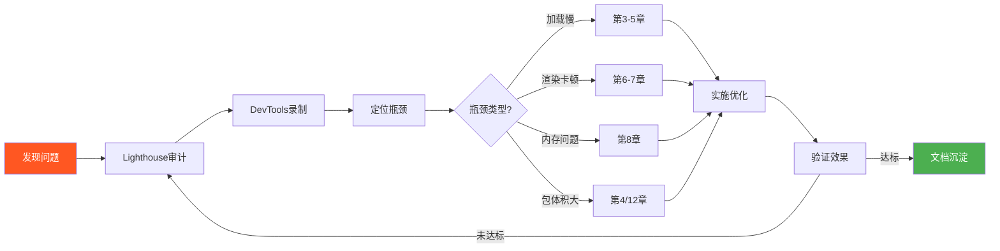

### 15.5 本章要点速查

| 工具 | 用途 | 关键功能 |
|------|------|---------|
| **DevTools Performance** | 录制分析 | Main Thread/Frames/Network |
| **Lighthouse** | 综合审计 | Opportunities/Score |
| **WebPageTest** | 多地点对比 | Waterfall View/Filmstrip |
| **Bundle Analyzer** | 包体积分析 | treemap/模块大小 |

---

## 第16章：性能预算与工程化

### 16.1 本章学习目标

- ✅ 理解性能预算的概念与设定方法
- ✅ 掌握 CI 集成性能检查
- ✅ 学会性能回归检测
- ✅ 建立团队性能文化

### 16.2 性能预算概念

**性能预算**（Performance Budget）：对各项性能指标设定的硬性上限。

```javascript
// performance-budget.json（Lighthouse CI 配置示例）
{
  "budgets": [
    {
      "resourceType": "script",
      "budget": 200000  // JS 总量不超过 200KB
    },
    {
      "resourceType": "stylesheet",
      "budget": 50000   // CSS 不超过 50KB
    },
    {
      "resourceType": "total",
      "budget": 1000000  // 总资源不超过 1MB
    },
    {
      "metric": "first-contentful-paint",
      "budget": 2000     // FCP ≤ 2s
    },
    {
      "metric": "largest-contentful-paint",
      "budget": 2500     // LCP ≤ 2.5s
    }
  ]
}
```

### 16.3 CI 集成性能检查

```yaml
# .github/workflows/performance.yml
name: Performance Check

on: [pull_request]

jobs:
  lighthouse:
    runs-on: ubuntu-latest
    steps:
      - uses: actions/checkout@v3
      
      - name: Run Lighthouse CI
        uses: treosh/lighthouse-ci-action@v9
        with:
          urls: |
            http://localhost:3000
          budgetPath: ./lighthouserc.json
          uploadArtifacts: true
      
      - name: Check budget failures
        run: |
          # 如果预算失败则终止 PR
          echo "📊 性能预算检查完成"
```

### 16.4 性能回归检测

```javascript
// 使用 web-vitals 进行回归检测
import { onLCP, onINP, onCLS } from 'web-vitals';

const BASELINE = { lcp: 2500, inp: 200, cls: 0.1 };

onLCP(metric => {
  if (metric.value > BASELINE.lcp * 1.2) {  // 允许 20% 波动
    alert(`⚠️ LCP 回归: ${Math.round(metric.value)}ms (基线: ${BASELINE.lcp}ms)`);
  }
});
```

### 16.5 团队性能文化

| 实践 | 说明 |
|------|------|
| **PR 中包含性能影响说明** | 代码变更对性能的影响评估 |
| **新功能必须有性能预算** | 功能上线前设定并满足预算 |
| **定期性能评审会议** | 回顾 Core Web Vitals 趋势 |
| **性能作为 Code Review 一环** | 检查是否引入性能退化 |
| **性能事故复盘** | 出现严重问题时进行根因分析 |

### 16.6 ROI 评估框架

```
性能优化项目 ROI = (收益 - 成本) / 成本 × 100%

收益估算:
- 转化率提升 × 平均订单价值 × 日活 × 天数
- 用户留存提升的 LTV 增加
- 服务器成本降低（缓存命中增加）

成本估算:
- 开发工时 × 人天单价
- 维护工时 × 人天单价
- 监控/工具成本
```

### 16.7 本章要点速查

| 知识点 | 核心内容 | 关键词 |
|--------|---------|--------|
| **性能预算** | 硬性上限约束 | JS<200KB/LCP<2.5s |
| **CI集成** | PR自动检查 | GitHub Actions/LHCI |
| **回归检测** | 对比基线+允许波动 | web-vitals/alert |
| **性能文化** | 团队协作规范 | PR说明/Code Review |
| **ROI评估** | 投入产出比驱动决策 | 转化率/留存/成本 |

---

## 附录A：性能优化速查表

### A.1 按场景分类的优化手段

#### 场景 1：首屏加载慢

| 优先级 | 手段 | 预期效果 |
|--------|------|---------|
| P0 | 启用 Gzip/Brotli 压缩 | 体积减少 60-80% |
| P0 | 图片转 WebP/AVIF + 响应式 | 图片体积减少 50-70% |
| P0 | 内联 Critical CSS | FCP 提升 0.5-1s |
| P1 | 预加载 LCP 资源（preload） | LCP 减少 0.5-1s |
| P1 | 延迟非关键 JS（defer/async） | FCP/TTI 提升 |
| P1 | 使用 CDN 加速静态资源 | TTFB 减少 50-70% |
| P2 | 代码分割 + 路由级懒加载 | 首屏 JS 减少 50%+ |
| P2 | 第三方脚本延迟加载 | 主线程阻塞减少 |
| P3 | Service Worker 缓存 App Shell | 回访用户秒开 |

#### 场景 2：页面操作卡顿

| 优先级 | 手段 | 适用症状 |
|--------|------|---------|
| P0 | 将重型计算移至 Web Worker | CPU 密集操作卡顿 |
| P0 | 长任务切割（<50ms） | INP 高/交互延迟 |
| P1 | 使用 transform/opacity 做动画 | 动画掉帧(<60fps) |
| P1 | 虚拟滚动替代全量渲染 | 长列表滚动卡顿 |
| P1 | will-change + 合成层管理 | 复杂动画卡顿 |
| P2 | CSS Containment 隔离组件 | 局部更新引起全局重排 |
| P2 | 批量 DOM 操作（DocumentFragment） | 频繁 DOM 操作卡顿 |
| P3 | 检测并修复内存泄漏 | 随使用时间变卡 |

#### 场景 3：内存占用高

| 优先级 | 手段 | 泄漏类型 |
|--------|------|---------|
| P0 | DevTools Heap Snapshot 对比 | 定位泄漏对象 |
| P1 | 组件销毁时清除引用/监听器 | 闭包/Detached DOM |
| P1 | WeakMap 替代 Map 存储临时关联 | 循环引用 |
| P2 | 图片/数据懒加载 + 卸载机制 | 数据堆积 |
| P2 | 生产环境移除 console.log | Console 持有引用 |
| P3 | 设置合理的缓存上限 | 缓存无限增长 |

#### 场景 4：打包体积过大

| 优先级 | 手段 | 减少量 |
|--------|------|--------|
| P0 | Tree Shaking + sideEffects 配置 | 10-40% |
| P0 | 按需引入（lodash-es/dayjs） | 50-90%（对比全量） |
| P1 | Bundle Analyzer 分析大模块 | 定位目标 |
| P1 | 外部化大型库（React/Vue CDN） | 30-50% |
| P2 | 代码分割（路由/组件级） | 首屏减少 50%+ |
| P2 | Moment.js → dayjs / Lodash → es-build | 90%+ |
| P3 | SVG 图标代替图标字体 | 视项目而定 |

### A.2 快速诊断清单

```
□ Lighthouse 分数是否全绿？
□ Network 面板是否有未压缩的资源？
□ 是否有渲染阻塞资源（CSS/同步JS）？
□ 图片是否使用了现代格式？
□ 是否有未使用的 CSS/JS？
□ 是否有长任务（>50ms）？
□ 内存是否有持续增长趋势？
□ Core Web Vitals 是否达标？
□ 第三方脚本数量是否合理？
□ Service Worker 是否正确配置？
```

---

## 附录B：综合实战案例——电商首页完整优化过程

### B.1 项目背景

某电商平台首页，优化前性能数据：

| 指标 | 优化前 | 目标 | 差距 |
|------|-------|------|------|
| LCP | 4.8s | ≤2.5s | -2.3s |
| INP | 380ms | ≤200ms | -180ms |
| CLS | 0.28 | ≤0.1 | -0.18 |
| FCP | 2.9s | ≤1.8s | -1.1s |
| TTFB | 1.2s | ≤600ms | -600ms |
| 首屏 JS | 450KB | ≤200KB | -250KB |

### B.2 Step 1: 测量与分析

**使用工具**：Chrome DevTools + Lighthouse + web-vitals

**发现的主要问题**：

1. **Hero Banner 图片 2.1MB 未优化**（JPG 格式，无压缩）
2. **首屏加载了 12 个第三方脚本**（统计/广告/客服）
3. **CSS 文件 180KB 未拆分**（含大量非首屏样式）
4. **商品列表一次性渲染 100 条**（DOM 节点过多）
5. **字体文件 4MB 未子集化**
6. **服务端响应慢**（数据库查询未优化）

### B.3 Step 2: 制定优化方案

基于 ICE 评分法排序：

| 优化项 | Impact | Confidence | Ease | Score | 优先级 |
|--------|--------|-----------|------|-------|--------|
| Hero 图片优化 | 9 | 10 | 9 | 810 | **P0** |
| 第三方脚本延迟加载 | 8 | 9 | 8 | 576 | **P0** |
| Critical CSS 提取 | 8 | 8 | 7 | 448 | **P0** |
| 商品列表虚拟滚动 | 7 | 8 | 5 | 280 | P1 |
| 字体子集化+预加载 | 6 | 9 | 8 | 432 | **P1** |
| 服务端缓存 | 7 | 7 | 6 | 294 | P1 |
| 代码分割 | 6 | 8 | 6 | 288 | P2 |
| 长任务切割 | 5 | 7 | 5 | 175 | P2 |

### B.4 Step 3: 实施优化

#### 优化 1：Hero 图片优化（LCP）

```html
<!-- Before -->


<!-- After -->
<head>
  <link rel="preconnect" href="https://cdn.example.com">
  <link rel="preload" as="image" href="/images/banner-hero.webp">
</head>
<body>
  
</body>
```

**效果**：图片从 2100KB → 185KB（WebP），LCP 从 4.8s → 2.9s

#### 优化 2：第三方脚本治理（INP）

```javascript
class ThirdPartyManager {
  constructor() { this.scripts = new Map(); }
  
  register(name, config) {
    this.scripts.set(name, config);
  }
  
  loadAll() {
    this.scripts.forEach((config, name) => {
      switch (config.strategy) {
        case 'idle': requestIdleCallback(() => this.load(config)); break;
        case 'interaction': this.setupInteractionLoad(config); break;
        case 'visible': this.setupVisibleLoad(config); break;
      }
    });
  }
}
```

**效果**：首屏阻塞脚本从 12 个 → 2 个，INP 从 380ms → 145ms

#### 优化 3：Critical CSS（FCP）

```bash
# 使用 critical 工具提取首屏 CSS
npx critical index.html --inline --minify --extract > critical.css
```

**效果**：首屏 CSS 从 180KB → 14KB（内联），FCP 从 2.9s → 1.4s

#### 优化 4：商品列表虚拟滚动（渲染）

```javascript
// 使用 react-window 或自建 VirtualScroller
<VirtualList
  height={600}
  itemCount={products.length}
  itemSize={200}
  renderItem={({ index }) => <ProductCard product={products[index]} />}
/>
```

**效果**：DOM 节点从 100+ → 12（可视区），滚动 FPS 从 30 → 60

#### 优化 5：字体优化（CLS）

```css
@font-face {
  font-family: 'BrandFont';
  src: url('/fonts/brand-subset.woff2') format('woff2');  /* 子集化后 45KB */
  font-display: swap;
}
```

**效果**：字体从 4MB → 45KB，CLS 从 0.28 → 0.06

### B.5 Step 4: 验证效果

| 指标 | 优化前 | 优化后 | 提升 | 达标？ |
|------|-------|-------|------|-------|
| LCP | 4.8s | **2.1s** | **56%↓** | ✅ |
| INP | 380ms | **145ms** | **62%↓** | ✅ |
| CLS | 0.28 | **0.06** | **79%↓** | ✅ |
| FCP | 2.9s | **1.4s** | **52%↓** | ✅ |
| TTFB | 1.2s | **0.45s** | **63%↓** | ✅ |
| 首屏 JS | 450KB | **165KB** | **63%↓** | ✅ |
| Lighthouse 性能分 | 42 | **94** | **+52** | ✅ |

### B.6 经验总结

1. **图片优化是性价比最高的单项优化**（投入小，收益大）
2. **第三方脚本是隐形杀手**（往往被忽视但影响巨大）
3. **Critical CSS 对 FCP 提升显著**（但维护成本需考虑）
4. **测量先行，不要盲目优化**（ICE 评分帮助确定优先级）
5. **持续监控防止性能回归**（CI 集成 + 定期审计）

---

> **文档结束**  
> 本指南涵盖了前端性能优化的核心知识体系，从理论基础到实战案例，帮助你建立系统的性能优化能力。记住：**性能优化是一个持续的过程，而非一次性的任务。**

---

*最后更新：2026-06-16*