---
---
# Vue2 源码解读基础知识指南

> **版本**：Vue 2.6.14（最终稳定版）
> **目标读者**：具备 Vue2 基础使用经验，想深入理解底层原理的开发者
> **阅读建议**：按章节顺序阅读，每章先理解概念，再对照源码验证

---

## 第1章：项目结构与构建

### 1.1 Vue2 源码目录结构全景图

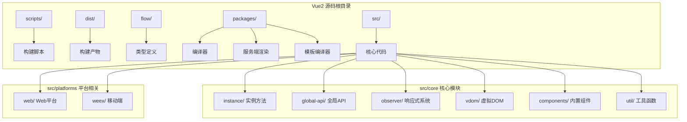

### 1.2 核心包职责说明

**📍 源码位置**：`/src/` 根目录

| 包名 | 职责 | 关键文件 |
|------|------|----------|
| `core` | 平台无关的核心逻辑 | observer、vdom、instance、components |
| `compiler` | 模板编译器 | parse、optimize、codegen |
| `server` | 服务端渲染 | render、create-renderer |
| `platforms/web` | 浏览器平台适配 | 入口、DOM操作、patch |
| `platforms/weex` | Weex移动端平台 | 原生组件映射 |

**设计意图**：Vue 采用"核心+平台"的分层架构，核心代码不依赖任何平台特定 API，通过 platforms 层做适配。这种设计让 Vue 可以同时支持浏览器、Weex 甚至其他平台（如小程序）。

### 1.3 Rollup 构建配置解析

**📍 源码位置**：`scripts/config.js:1-200`

```javascript
// scripts/config.js - 构建配置核心逻辑（精简版）
const builds = {
  // Runtime Only 版本（不含编译器，体积更小）
  'web-runtime': {
    entry: resolve('web/entry-runtime.js'),
    dest: resolve('dist/vue.runtime.common.js'),
    format: 'cjs',
    banner
  },
  
  // Runtime + Compiler 完整版
  'web-full': {
    entry: resolve('web/entry-runtime-with-compiler.js'),
    dest: resolve('dist/vue.common.js'),
    format: 'cjs',
    alias: { he: './entity-decoder' },
    banner
  },
  
  // UMD 格式（CDN引入用）
  'web-runtime-esm': {
    entry: resolve('web/entry-runtime.esm.js'),
    dest: resolve('dist/vue.runtime.esm.js'),
    format: 'es',
    banner
  }
}
```

**逐行注释**：
- `entry`：构建入口文件，不同版本入口不同
- `dest`：输出文件路径
- `format`：模块格式（cjs/umd/es/iife）
- `alias`：模块别名配置

**版本差异**：
- Vue3 使用 Rollup + TypeScript 构建，配置在 `scripts/build.js`
- Vue3 默认提供 ES Module，不再推荐 UMD 方式引入

### 1.4 入口文件关系图

**📍 源码位置**：

- `src/platforms/web/entry-runtime-with-compiler.js:1-50`
- `src/platforms/web/runtime/index.js:1-30`
- `src/core/index.js:1-20`

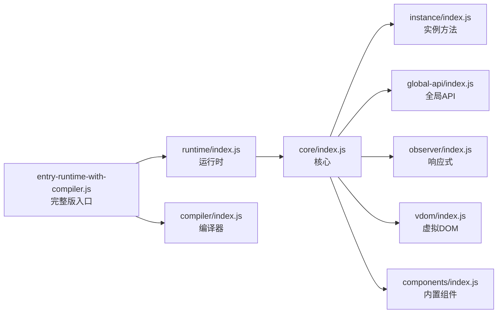

**关键源码 - 完整版入口**：

```javascript
// src/platforms/web/entry-runtime-with-compiler.js
import Vue from './runtime/index'

// 📌 重要：给 $mount 方法增加编译能力
const mount = Vue.prototype.$mount
Vue.prototype.$mount = function (
  el?: string | Element,
  hydrating?: boolean
): Component {
  el = el && query(el) // 查询 DOM 元素
  
  // 如果是 template 或 el 选项，需要编译
  const options = this.$options
  if (!options.render) {
    let template = options.template
    if (template) {
      // 编译 template 为 render 函数
      const { render, staticRenderFns } = compileToFunctions(template, {
        shouldDecodeNewlines,
        shouldDecodeNewlinesForHref,
        delimiters: options.delimiters,
        comments: options.comments
      }, this)
      options.render = render
      options.staticRenderFns = staticRenderFns
    }
  }
  
  // 调用原始的 mount 方法（运行时版本）
  return mount.call(this, el, hydrating)
}

export default Vue
```

**设计意图**：采用装饰器模式，在运行时的 `$mount` 基础上增强编译能力。这样 Runtime-only 版本可以保持轻量，而 Full 版本自动处理模板编译。这也是为什么使用 vue-loader 时可以用 Runtime-only 版本——因为 webpack 预编译了模板。

### 1.5 调试环境搭建

**📍 操作步骤**：

```bash
# 1. 克隆源码
git clone https://github.com/vuejs/vue.git
cd vue

# 2. 安装依赖（Node.js >= 16 推荐）
npm install

# 3. 开发模式构建（sourcemap 开启）
npm run dev -- --sourcemap

# 4. 在源码中打断点调试
# 推荐断点位置见附录A
```

**修改源码后测试**：

```bash
# 重新构建
npm run dev

# 运行测试
npm test

# 只运行单元测试
npm run test:unit
```

**💡 调试技巧**：
- 在 Chrome DevTools 中设置黑箱（Blackbox）忽略 node_modules，只关注 src/
- 使用 `// @debug` 注释标记关键位置
- 利用 `console.trace()` 打印调用栈

---

## 第2章：数据响应式原理（核心）

### 2.1 响应式系统架构总览

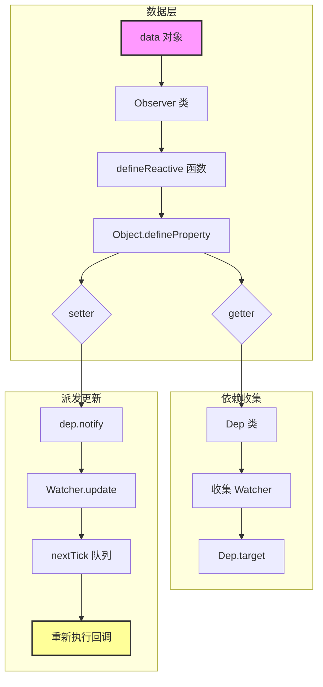

### 2.2 Observer 类 — 数据劫持的起点

**📍 源码位置**：`src/core/observer/index.js:35-110`

```javascript
/**
 * Observer 类：将一个普通对象转换为响应式对象
 * 通过递归遍历对象的所有属性，使用 Object.defineProperty 进行劫持
 */
class Observer {
  constructor(value) {
    this.value = value
    this.dep = new Dep() // 每个 Observer 实例都有一个 Dep 实例
    this.vmCount = 0
    
    // 将 Observer 实例挂载到对象的 __ob__ 属性上
    // 这样后续可以通过 __ob__ 访问 Observer，用于 $set 等操作
    def(value, '__ob__', this)
    
    if (Array.isArray(value)) {
      // 数组特殊处理：重写数组原型方法
      const augment = hasProto
        ? protoAugment  // 直接修改原型链
        : copyAugment   // 定义到实例上
      
      augment(value, arrayMethods, arrayKeys)
      
      // 递归观察数组元素
      this.observeArray(value)
    } else {
      // 对象：遍历所有 key 进行响应式处理
      this.walk(value)
    }
  }

  /**
   * 遍历对象每个属性，调用 defineReactive
   */
  walk(obj) {
    const keys = Object.keys(obj)
    for (let i = 0; i < keys.length; i++) {
      defineReactive(obj, keys[i])
    }
  }

  /**
   * 递归观察数组中的每一项
   */
  observeArray(items) {
    for (let i = 0, l = items.length; i < l; i++) {
      observe(items[i]) // observe 会判断是否已经观察过
    }
  }
}
```

**逐行注释**：
- `this.dep = new Dep()`：每个被观察的对象都有一个依赖容器，用于收集对该对象整体操作的 Watcher（如 `$set`、数组变异方法）
- `def(value, '__ob__', this)`：将 Observer 实例隐藏挂载到对象上，标记该对象已被观察，避免重复观察
- `hasProto`：检测环境是否支持 `__proto__` 属性，决定数组方法的劫持方式

**设计意图**：
1. **为什么用 `__ob__`？** 避免重复观察同一个对象，同时为后续 `$set/$delete` 提供访问 Observer 的入口
2. **为什么数组单独处理？** 因为 Object.defineProperty 无法检测数组索引变化和 length 变化，所以需要重写 7 个变异方法（push/pop/shift/unshift/splice/sort/reverse）

**版本差异**：
- Vue3 使用 Proxy API，天然支持数组和新增属性的监听，无需特殊处理
- Vue3 不再需要 `__ob__` 标记，Proxy 是懒执行的

### 2.3 defineReactive — 响应式的核心函数

**📍 源码位置**：`src/core/observer/index.js:135-185`

```javascript
/**
 * defineReactive：定义一个响应式属性
 * 这是整个响应式系统的基石
 * 
 * @param {Object} obj 目标对象
 * @param {String} key 属性名
 * @param {Any} val 属性值（可选，如果不传会从 obj 上取）
 * @param {Function} customSetter 自定义 setter（开发模式警告用）
 */
function defineReactive(
  obj,
  key,
  val,
  customSetter?,
  shallow?
) {
  // 为每个属性创建一个 Dep 实例（依赖收集器）
  const dep = new Dep()

  // 获取属性描述符，检查是否可配置
  const property = Object.getOwnPropertyDescriptor(obj, key)
  if (property && property.configurable === false) {
    return // 不可配置的属性无法定义响应式，直接返回
  }

  // 兼容已有 getter/setter
  const getter = property && property.get
  const setter = property && property.set
  
  // 如果没有传入 val，从对象上获取初始值
  if ((!getter || setter) && arguments.length === 2) {
    val = obj[key]
  }

  // 🔑 关键：递归观察子对象（深度响应式）
  let childOb = !shallow && observe(val)

  Object.defineProperty(obj, key, {
    enumerable: true,       // 可枚举
    configurable: true,     // 可配置
    get: function reactiveGetter() {
      const value = getter ? getter.call(obj) : val
      
      // 🎯 依赖收集：如果当前有活跃的 Watcher，就收集它
      if (Dep.target) {
        dep.depend() // 收集当前 Watcher 到当前属性的 dep 中
        
        if (childOb) {
          childOb.dep.depend() // 如果子对象也是对象，也收集依赖
          
          // 如果子对象是数组，还需要递归收集数组元素的依赖
          if (Array.isArray(value)) {
            dependArray(value)
          }
        }
      }
      return value
    },
    set: function reactiveSetter(newVal) {
      // 获取旧值（兼容自定义 getter）
      const value = getter ? getter.call(obj) : val
      
      // 💡 性能优化：如果新值等于旧值，且不是 NaN，则跳过
      if (newVal === value || (newVal !== newVal && value !== value)) {
        return
      }
      
      // 开发环境下提示无 setter 但尝试赋值
      if (process.env.NODE_ENV !== 'production' && customSetter) {
        customSetter()
      }
      
      // 兼容已有 setter
      if (getter && !setter) return
      
      if (setter) {
        setter.call(obj, newVal)
      } else {
        val = newVal // 存储新值
      }
      
      // 🔑 关键：对新值进行响应式处理
      childOb = !shallow && observe(newVal)
      
      // 🚀 派发更新：通知所有依赖这个属性的 Watcher 更新
      dep.notify()
    }
  })
}
```

**逐行注释详解**：

1. **依赖收集时机（getter）**：当组件渲染或计算属性求值时读取属性触发 getter，此时 `Dep.target` 指向当前的 Watcher，将 Watcher 收集到 dep 中

2. **派发更新时机（setter）**：当数据变化时触发 setter，调用 `dep.notify()` 通知所有 Watcher 更新

3. **childOb 的作用**：不仅收集对当前属性的依赖，还收集对子对象整体操作的依赖（如 `$set`、数组方法）

4. **NaN 判断技巧**：`newVal !== newVal` 是判断 NaN 的经典方法，因为 `NaN !== NaN` 为 true

**设计意图分析**：

**Q：为什么要在 getter 里判断 `Dep.target`？**
A：只有在 Watcher 执行期间才需要收集依赖。普通的 JS 读取不应该触发收集。`Dep.target` 是一个全局变量，只在 Watcher 执行回调前设置为自身，执行完后置空。

**Q：为什么 setter 要比较新旧值？**
A：避免不必要的更新。比如 `obj.a = obj.a` 这种无效赋值，或者同一值多次设置，可以节省性能开销。

**版本差异**：
- Vue3 的 reactive() 基于 Proxy，不需要预先定义所有属性，天然支持动态属性
- Vue3 使用 WeakMap 存储 target -> Map<key, Set<effect>> 的关系，内存管理更好

### 2.4 Dep 类 — 依赖收集器

**📍 源码位置**：`src/core/observer/dep.js:1-55`

```javascript
/**
 * Dep 类：依赖收集器
 * 每个响应式属性都有一个 Dep 实例
 * 用于存储所有依赖该属性的 Watcher
 */
let uid = 0

class Dep {
  static target: ?Watcher // 静态属性：当前正在计算的 Watcher
  id: number
  subs: Array<Watcher> // 订阅者列表

  constructor() {
    this.id = uid++
    this.subs = []
  }

  /**
   * 添加订阅者（Watcher）
   */
  addSub(sub: Watcher) {
    this.subs.push(sub)
  }

  /**
   * 移除订阅者
   */
  removeSub(sub: Watcher) {
    remove(this.subs, sub)
  }

  /**
   * 🔑 核心：依赖收集
   * 当响应式属性被读取时调用
   * 将当前活跃的 Watcher（Dep.target）添加到订阅列表
   */
  depend() {
    if (Dep.target) {
      Dep.target.addDep(this) // Watcher 也记录自己依赖了哪些 Dep
    }
  }

  /**
   * 🔑 核心：派发更新
   * 当响应式属性被修改时调用
   * 通知所有订阅了该属性的 Watcher
   */
  notify() {
    // stabilize the subscriber list first
    const subs = this.subs.slice()
    
    // 排序确保父组件的 watcher 先于子组件执行
    if (process.env.NODE_ENV !== 'production' && !config.async) {
      subs.sort((a, b) => a.id - b.id)
    }
    
    for (let i = 0, l = subs.length; i < l; i++) {
      subs[i].update() // 调用每个 Watcher 的 update 方法
    }
  }
}

// 当前目标 Watcher 的栈结构（支持嵌套场景）
Dep.target = null
const targetStack = []

/**
 * 将 Watcher 压入栈，设为当前目标
 */
export function pushTarget(target: ?Watcher) {
  targetStack.push(target)
  Dep.target = target
}

/**
 * 弹出当前目标，恢复上一个
 */
export function popTarget() {
  targetStack.pop()
  Dep.target = targetStack[targetStack.length - 1]
}
```

**设计意图**：
1. **为什么用栈结构？** 支持嵌套场景，如 computed 中引用另一个 computed，或者渲染函数中调用 computed
2. **为什么要排序？** 确保父组件先于子组件更新，避免子组件多次渲染
3. **subs.slice() 为什么？** 防止在通知过程中修改 subs 数组导致问题

### 2.5 Watcher 三种类型

**📍 源码位置**：`src/core/observer/watcher.js:1-180`

```javascript
/**
 * Watcher 类：观察者
 * 三种类型：
 * 1. 渲染 Watcher（render watcher）：组件渲染函数，data 变化触发重新渲染
 * 2. 计算 Watcher（computed watcher）：计算属性，惰性求值+缓存
 * 3. 用户 Watcher（user watcher）：$watch 或 watch 选项
 */
class Watcher {
  vm: Component           // 所属组件实例
  expression: string      // 表达式字符串
  cb: Function            // 回调函数
  id: number              // 唯一标识
  deep: boolean           // 深度监听标志
  user: boolean           // 用户创建标志
  lazy: boolean           // 懒计算标志（computed 用）
  sync: boolean           // 同步执行标志
  dirty: boolean          // 脏数据标志（computed 缓存用）
  deps: Array<Dep>        // 依赖的 Dep 列表
  newDeps: Array<Dep>     // 新一轮依赖收集的 Dep
  depIds: SimpleSet       // 已收集的 Dep ID 集合（去重）
  newDepIds: SimpleSet    // 新一轮的 Dep ID 集合
  getter: Function        // 求值函数
  value: any              // 当前值（computed 缓存值）

  constructor(
    vm: Component,
    expOrFn: string | Function,
    cb: Function,
    options?: ?Object,
    isRenderWatcher?: boolean
  ) {
    this.vm = vm
    if (isRenderWatcher) {
      vm._watcher = this // 渲染 Watcher 引用到组件上
    }
    vm._watchers.push(this) // 所有 Watcher 都注册到组件上

    // 解析选项
    if (options) {
      this.deep = !!options.deep
      this.user = !!options.user
      this.lazy = !!options.lazy
      this.sync = !!options.sync
    }
    
    this.dirty = this.lazy // computed 初始为脏，需要求值
    
    // 设置 getter
    this.getter = parsePath(expOrFn) // 字符串表达式转函数
    if (!this.getter) {
      this.getter = function () {} // 兜底空函数
    }
    
    this.value = this.lazy 
      ? undefined         // computed 不立即求值
      : this.get()        // 其他类型立即求值（触发首次依赖收集）
  }

  /**
   * 🔑 核心：执行 getter，触发依赖收集
   */
  get() {
    pushTarget(this) // 1. 将自己设为 Dep.target
    let value
    const vm = this.vm
    try {
      value = this.getter.call(vm, vm) // 2. 执行 getter（渲染函数/computed函数等）
    } catch (e) {
      // 错误处理...
    } finally {
      popTarget() // 3. 清除 Dep.target
      this.cleanupDeps() // 4. 清理不再需要的依赖
    }
    return value
  }

  /**
   * 派发更新（由 Dep.notify 调用）
   */
  update() {
    if (this.lazy) {
      // computed：只标记为脏，不立即重新计算
      this.dirty = true
    } else if (this.sync) {
      // 同步模式：立即执行
      this.run()
    } else {
      // 默认：放入 nextTick 队列异步执行
      queueWatcher(this)
    }
  }

  /**
   * 立即执行回调
   */
  run() {
    if (this.active) {
      const value = this.get() // 重新求值（触发依赖重新收集）
      
      if (value !== this.value || isObject(value) || this.deep) {
        const oldValue = this.value
        this.value = value
        
        if (this.user) {
          // 用户 Watcher：调用回调并传新旧值
          try {
            this.cb.call(this.vm, value, oldValue)
          } catch (e) {
            handleError(e, this.vm, `callback for watcher "${this.expression}"`)
          }
        } else {
          // 渲染 Watcher：直接重新渲染
          this.cb.call(this.vm, value, oldValue)
        }
      }
    }
  }

  /**
   * computed 专用：求值
   */
  evaluate() {
    this.value = this.get()
    this.dirty = false // 标记为已计算（缓存）
    return this.value
  }

  /**
   * computed 专用：让依赖自己的 Watcher 也依赖 computed 的 deps
   */
  depend() {
    let i = this.deps.length
    while (i--) {
      this.deps[i].depend()
    }
  }

  /**
   * 清理上一轮的依赖，保留本轮新收集的
   * 这是为了应对条件渲染等动态依赖场景
   */
  cleanupDeps() {
    let i = this.deps.length
    while (i--) {
      const dep = this.deps[i]
      if (!this.newDepIds.has(dep.id)) {
        dep.removeSub(this) // 从旧的 Dep 中移除自己
      }
    }
    
    // 交换引用
    let tmp = this.depIds
    this.depIds = this.newDepIds
    this.newDepIds = tmp
    this.newDepIds.clear()
    
    tmp = this.deps
    this.deps = this.newDeps
    this.newDeps = tmp
    this.newDeps.length = 0
  }
}
```

**三种 Watcher 对比表**：

| 特性 | 渲染 Watcher | 计算 Watcher | 用户 Watcher |
|------|-------------|-------------|-------------|
| 创建时机 | `$mount` 时 | `initComputed` 时 | `$watch` / watch 选项 |
| getter | updateComponent | computed getter | watch 表达式 |
| 回调 | 重新渲染 | 无（返回值缓存） | 用户回调 |
| 执行方式 | 异步队列 | 懒求值+缓存 | 异步队列/同步 |
| dirty 标志 | 无 | 有 | 无 |

**设计意图**：
- **computed 的 dirty 机制**：避免每次依赖变化都重新计算，只有真正被读取时才计算，并且只有依赖变了才标记为脏
- **queueWatcher**：多个 data 变化合并成一次渲染，避免不必要的重复渲染

### 2.6 数组响应式劫持机制

**📍 源码位置**：`src/core/observer/array.js:1-50`

```javascript
/*
 * 数组响应式实现：拦截变异方法
 * 原理：将数组的 7 个变异方法指向自定义实现
 */

// 获取 Array 原型
const arrayProto = Array.prototype
// 创建继承自原型的对象
const arrayMethods = Object.create(arrayProto)

// 需要拦截的方法列表
const methodsToPatch = [
  'push',
  'pop',
  'shift',
  'unshift',
  'splice',
  'sort',
  'reverse'
]

/**
 * 遍历每个方法，定义拦截器
 */
methodsToPatch.forEach(function (method) {
  // 缓存原始方法
  const original = arrayProto[method]

  // 定义新的方法（劫持）
  def(arrayMethods, method, function mutator (...args) {
    const result = original.apply(this, args) // 调用原始方法
    
    // 🔑 获取 Observer 实例
    const ob = this.__ob__
    
    // 根据不同方法判断插入了哪些元素
    let inserted
    switch (method) {
      case 'push':
      case 'unshift':
        inserted = args
        break
      case 'splice':
        inserted = args.slice(2) // splice 的第三个参数开始是新插入的元素
        break
    }
    
    // 对新插入的元素进行响应式处理
    if (inserted) ob.observeArray(inserted)
    
    // 🚀 触发更新通知
    ob.dep.notify()
    
    return result
  })
})
```

**逐行注释**：
- `Object.create(arrayProto)`：创建一个新对象，原型指向数组原型，这样不影响全局 Array
- `original.apply(this, args)`：保证原有功能正常工作
- `inserted`：只对新增元素做响应式处理，已存在的元素在初始化时已经处理过了
- `ob.dep.notify()`：通知依赖这个数组的 Watcher 更新

**设计意图**：
- **为什么不拦截索引赋值？** 性能考虑。对每个索引都 defineProperty 成本太高，而且数组通常用方法操作
- **为什么只拦截这 7 个？** 只有这 7 个方法会改变数组内容，其他方法（forEach/map/filter 等）不会改变原数组

**版本差异**：
- Vue3 的 Proxy 天然支持数组索引和 length 的监听，无需特殊处理
- Vue3 可以检测 `arr[0] = 100` 和 `arr.length = 0` 这类操作

### 2.7 $set 和 $delete 原理

**📍 源码位置**：`src/core/observer/index.js:195-260`

```javascript
/**
 * Vue.set / vm.$set 实现
 * 解决 Vue 无法检测属性添加的限制
 */
export function set(target: Array<any> | Object, key: any, val: any): any {
  // 开发环境警告
  if (process.env.NODE_ENV !== 'production' &&
    (isUndef(target) || isPrimitive(target))
  ) {
    warn(`Cannot set reactive property on undefined, null, or primitive value`)
  }
  
  // 处理数组：利用 splice 触发响应式
  if (Array.isArray(target) && isValidArrayIndex(key)) {
    target.length = Math.max(target.length, key)
    // splice 会触发我们定义的拦截器，从而触发更新
    target.splice(key, 1, val)
    return val
  }
  
  // 如果 key 已经存在，直接赋值即可（已经是响应式的）
  if (key in target && !(key in Object.prototype)) {
    target[key] = val
    return val
  }
  
  const ob = target.__ob__ // 获取 Observer 实例
  
  // 不能给 Vue 实例或根数据对象添加响应式属性
  if (target._isVue || (ob && ob.vmCount)) {
    process.env.NODE_ENV !== 'production' && warn(
      'Avoid adding reactive properties to a Vue instance or its root $data'
    )
    return val
  }
  
  // 如果不是响应式对象，直接赋值
  if (!ob) {
    target[key] = val
    return val
  }
  
  // 🔑 核心：为新属性定义响应式
  defineReactive(ob.value, key, val)
  
  // 手动触发更新（因为新属性没有 dep，需要在对象级别的 dep 上通知）
  ob.dep.notify()
  
  return val
}

/**
 * Vue.delete / vm.$delete 实现
 */
export function del(target: Array<any> | Object, key: any) {
  // 开发环境检查...
  
  // 数组：利用 splice
  if (Array.isArray(target) && isValidArrayIndex(key)) {
    target.splice(key, 1)
    return
  }
  
  const ob = target.__ob__
  
  // 不能删除 Vue 实例属性
  if (target._isVue || (ob && ob.vmCount)) {
    // warn...
    return
  }
  
  // 如果属性不存在
  if (!hasOwn(target, key)) {
    return
  }
  
  // 删除属性
  delete target[key]
  
  // 如果是响应式对象，手动触发更新
  if (!ob) {
    return
  }
  ob.dep.notify()
}
```

**设计意图**：
- **$set 对数组的处理**：巧妙地复用了 splice 拦截器，无需重复实现
- **ob.dep.notify()**：新属性没有自己的 dep，所以通过对象级别的 dep 通知更新

### 2.8 🎯 手写实现：Mini-Reactive 系统

下面是一个简化版的响应式系统实现，帮助理解核心原理：

```javascript
/**
 * Mini-Vue Reactive System
 * 简化版响应式系统，展示核心原理
 */

// ==================== 1. Dep 类 ====================
class MiniDep {
  constructor() {
    this.subscribers = new Set() // 使用 Set 自动去重
  }
  
  // 收集依赖
  depend() {
    if (MiniDep.target) {
      this.subscribers.add(MiniDep.target)
    }
  }
  
  // 通知更新
  notify() {
    this.subscribers.forEach(watcher => watcher.update())
  }
}

MiniDep.target = null
const targetStack = []

function pushTarget(watcher) {
  targetStack.push(watcher)
  MiniDep.target = watcher
}

function popTarget() {
  targetStack.pop()
  MiniDep.target = targetStack[targetStack.length - 1]
}

// ==================== 2. Observer 类 ====================
class MiniObserver {
  constructor(value) {
    this.dep = new MiniDep()
    
    // 标记已观察
    Object.defineProperty(value, '__mini_ob__', {
      value: this,
      enumerable: false,
      configurable: true
    })
    
    if (Array.isArray(value)) {
      this.observeArray(value)
    } else {
      this.walk(value)
    }
  }
  
  walk(obj) {
    Object.keys(obj).forEach(key => {
      miniDefineReactive(obj, key, obj[key])
    })
  }
  
  observeArray(items) {
    items.forEach(item => miniObserve(item))
  }
}

// ==================== 3. 核心函数 ====================
function miniObserve(value) {
  // 只观察对象和数组
  if (typeof value !== 'object' || value === null) {
    return value
  }
  
  // 已观察的直接返回
  if (value.__mini_ob__) {
    return value
  }
  
  return new MiniObserver(value)
}

function miniDefineReactive(obj, key, val) {
  const dep = new MiniDep()
  
  // 递归观察子对象
  let childOb = miniObserve(val)
  
  Object.defineProperty(obj, key, {
    get() {
      console.log(`🔍 获取 ${key}:`, val)
      
      // 依赖收集
      if (MiniDep.target) {
        dep.depend()
        
        if (childOb) {
          childOb.dep.depend()
        }
      }
      
      return val
    },
    
    set(newVal) {
      console.log(`✏️ 设置 ${key}:`, newVal)
      
      if (val === newVal) return
      
      val = newVal
      childOb = miniObserve(val) // 新值也需要响应式化
      
      // 派发更新
      dep.notify()
    }
  })
}

// ==================== 4. Watcher 类 ====================
class MiniWatcher {
  constructor(getter, callback, options = {}) {
    this.getter = getter
    this.callback = callback
    this.lazy = !!options.lazy
    this.dirty = this.lazy
    this.value = this.lazy ? undefined : this.get()
  }
  
  get() {
    pushTarget(this)
    const value = this.getter()
    popTarget()
    return value
  }
  
  update() {
    if (this.lazy) {
      this.dirty = true
    } else {
      this.run()
    }
  }
  
  run() {
    const oldValue = this.value
    this.value = this.get()
    this.callback(this.value, oldValue)
  }
  
  evaluate() {
    this.value = this.get()
    this.dirty = false
    return this.value
  }
  
  depend() {
    // 让外部 Watcher 也依赖我的 deps
    // 这里简化实现，实际 Vue 会遍历 deps
  }
}

// ==================== 5. 测试示例 ====================
console.log('===== Mini-Reactive 测试 =====')

// 创建响应式数据
const data = {
  name: 'Vue2',
  version: '2.6.14',
  features: ['reactive', 'component', 'compiler']
}

miniObserve(data)

// 创建渲染 Watcher（模拟组件渲染）
const renderWatcher = new MiniWatcher(
  () => {
    console.log('\n🔄 执行渲染函数')
    console.log(`  名称: ${data.name}`)
    console.log(`  版本: ${data.version}`)
    console.log(`  特性: ${data.features.join(', ')}`)
    return { name: data.name, version: data.version }
  },
  (newValue, oldValue) => {
    console.log('\n🎨 组件更新完成')
    console.log(`  旧值:`, oldValue)
    console.log(`  新值:`, newValue)
  }
)

// 创建计算 Watcher（模拟 computed）
const computedWatcher = new MiniWatcher(
  () => {
    console.log('\n🧮 执行计算属性求值')
    return `${data.name} v${data.version}`
  },
  null, // computed 没有回调
  { lazy: true } // 懒计算
)

// 读取计算属性（触发依赖收集）
console.log('\n📖 第一次读取计算属性:')
console.log('  结果:', computedWatcher.evaluate())

// 修改数据（触发更新）
console.log('\n\n===== 修改数据 =====')
data.name = 'Vue2.7' // 应该触发两个 Watcher 更新
```

**运行结果预期**：
```
===== Mini-Reactive 测试 =====

🔄 执行渲染函数
🔍 获取 name: Vue2
🔍 获取 version: 2.6.14
🔍 获取 features: ['reactive', ...]

📖 第一次读取计算属性:

🧮 执行计算属性求值
🔍 获取 name: Vue2
🔍 获取 version: 2.6.14
  结果: Vue2 v2.6.14
===== 修改数据
✏️ 设置 name: Vue2.7

🎨 组件更新完成
(计算属性 dirty 标记为 true，下次读取时重新计算)
```

---

## 第3章：虚拟 DOM 与 Diff 算法

### 3.1 VNode 数据结构

**📍 源码位置**：`src/core/vdom/vnode.js:1-80`

```javascript
/**
 * VNode：虚拟节点类
 * 用 JavaScript 对象描述真实 DOM
 * 包含创建 DOM 所需的所有信息
 */
const VNodeClass = function VNode(
  tag,           // 标签名（div/span/component等）
  data,          // VNodeData（属性、指令、事件等）
  children,      // 子节点数组
  text,          // 文本节点内容
  elm,           // 对应的真实 DOM 元素
  context,       // 组件实例
  componentOptions, // 组件选项（异步组件等）
  asyncFactory,  // 异步组件工厂函数
) {
  this.tag = tag
  this.data = data
  this.children = children
  this.text = text
  this.elm = elm
  this.ns = undefined // 命名空间
  this.context = context
  this.fnContext = undefined // 函数式组件上下文
  this.fnOptions = undefined
  this.fnScopeId = undefined
  this.key = data && data.key // 节点的 key（Diff 用）
  this.componentOptions = componentOptions
  this.componentInstance = undefined // 组件实例
  this.parent = undefined // 父节点
  this.raw = false // 是否原始 HTML
  this.isStatic = false // 静态节点标志
  this.isRootInsert = true // 是否作为根节点插入
  this.isComment = false // 注释节点
  this.isCloned = false // 克隆节点
  this.isOnce = false // v-once 节点
  this.asyncFactory = asyncFactory
  this.asyncMeta = undefined
  this.isAsyncPlaceholder = false
}

// VNode 创建工厂函数
export function createEmptyVNode(text) {
  const node = new VNodeClass()
  node.text = text
  node.isComment = true
  return node
}

export function createTextVNode(val) {
  return new VNodeClass(undefined, undefined, undefined, String(val))
}

// 克隆 VNode（用于静态节点优化）
export function cloneVNode(vnode) {
  const cloned = new VNodeClass(
    vnode.tag,
    vnode.data,
    vnode.children,
    vnode.text,
    vnode.elm,
    vnode.context,
    vnode.componentOptions,
    vnode.asyncFactory
  )
  cloned.ns = vnode.ns
  cloned.isStatic = vnode.isStatic
  cloned.key = vnode.key
  cloned.isComment = vnode.isComment
  cloned.fnContext = vnode.fnContext
  cloned.fnOptions = vnode.fnOptions
  cloned.fnScopeId = vnode.fnScopeId
  cloned.isCloned = true
  cloned.isOnce = vnode.isOnce
  cloned.asyncMeta = vnode.asyncMeta
  cloned.isAsyncPlaceholder = vnode.asyncMeta
  return cloned
}
```

**VNode 类型常量**：

```javascript
// src/core/vdom/vnode.js
export const EmptyVNode = function () {}
export const TextVNode = function () {}

// 注释节点
export const createEmptyVNode = (text = '') => {
  const node = new VNodeClass()
  node.text = text
  node.isComment = true
  return node
}

// 文本节点
export const createTextVNode = (val: string | number) => {
  return new VNodeClass(undefined, undefined, undefined, String(val))
}
```

**设计意图**：
- **VNode 为什么这么多属性？** 为了满足各种场景需求：组件、指令、过渡、插槽、异步组件等
- **cloneVNode 的作用**：静态节点优化时复用 VNode，避免重复创建

### 3.2 patch 算法 — VNode 到真实 DOM 的桥梁

**📍 源码位置**：`src/core/vdom/patch.js:1-100`

```javascript
/**
 * patch 函数：虚拟 DOM 的核心算法
 * 将新旧 VNode 进行比较，以最小代价更新真实 DOM
 * 
 * @param oldVnode 旧的虚拟节点（可以是真实 DOM 元素）
 * @param vnode 新的虚拟节点
 * @param hydrating 服务端渲染相关
 * @param removeOnly keep-alive 相关
 */
return function patch(oldVnode, vnode, hydrating, removeOnly) {
  // 新节点不存在，销毁旧节点
  if (isUndef(vnode)) {
    if (isDef(oldVnode)) invokeDestroyHook(oldVnode)
    return
  }

  let isInitialPatch = false
  const insertedVnodeQueue = [] // 记录需要触发 insert 钩子的节点

  // 旧节点不存在，创建新节点
  if (isUndef(oldVnode)) {
    isInitialPatch = true
    createElm(vnode, insertedVnodeQueue)
  } else {
    // 判断旧节点是否是真实 DOM（首次渲染时传入的是 #app 元素）
    const isRealElement = isDef(oldVnode.nodeType)
    
    if (!isRealElement && sameVnode(oldVnode, vnode)) {
      // 🔑 核心：新旧都是 VNode 且相同 → 执行 Diff
      patchVnode(oldVnode, vnode, insertedVnodeQueue, removeOnly)
    } else {
      // 不同节点：替换
      
      if (isRealElement) {
        // 首次渲染：将真实 DOM 转换为空 VNode
        oldVnode = emptyNodeAt(oldVnode)
      }

      // 获取旧节点的父元素
      const oldElm = oldVnode.elm
      const parentElm = nodeOps.parentNode(oldElm)

      // 创建新 DOM
      createElm(vnode, insertedVnodeQueue, parentElm, 
                nodeOps.nextSibling(oldElm))

      // 销毁旧节点及其子节点
      if (isDef(parentElm)) {
        removeVnodes(parentElm, [oldVnode], 0, oldVnode.children.length - 1)
      } else if (isDef(oldVnode.tag)) {
        invokeDestroyHook(oldVnode)
      }
    }
  }

  // 触发 insert 钩子
  invokeInsertHook(vnode, insertedVnodeQueue, isInitialPatch)
  return vnode.elm
}
```

**sameVnode 判断条件**：

```javascript
/**
 * 判断两个 VNode 是否值得进行 Diff 比较
 * 只有基本特征相同才会进入精细比较
 */
function sameVnode(a, b) {
  return (
    a.key === b.key &&                    // key 相同
    a.tag === b.tag &&                    // 标签相同
    a.isComment === b.isComment &&        // 都是或都不是注释
    isDef(a.data) === isDef(b.data) &&    // 都有或都没有 data
    sameInputType(a, b)                   // input 类型相同（如有）
  )
}
```

**设计意图**：
- **sameVnode 为什么这么简单？** 只做粗略判断，避免误判。详细的 Diff 在 patchVnode 中完成
- **为什么 key 很重要？** key 是 sameVnode 的首要判断条件，没有 key 会导致同类型节点被错误复用

### 3.3 Diff 算法 — 同层比较策略

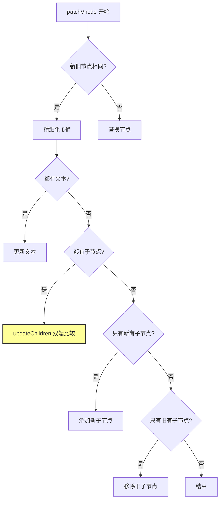

**📍 源码位置**：`src/core/vdom/patch.js:300-450`

```javascript
/**
 * patchVnode：精细化比较两个相同的 VNode
 * 采用同层比较策略（只比较同一层级）
 */
function patchVnode(oldVnode, vnode, insertedVnodeQueue, removeOnly) {
  // 如果新旧节点引用相同，直接返回（可能被 move 过）
  if (oldVnode === vnode) {
    return
  }

  const elm = vnode.elm = oldVnode.elm
  const oldCh = oldVnode.children
  const ch = vnode.children

  // 情况1：都是文本节点 → 更新文本
  if (isUndef(vnode.text)) {
    if (isDef(oldCh) && isDef(ch)) {
      // 🔑 都有子节点：执行 Diff（最复杂的情况）
      if (oldCh !== ch) updateChildren(elm, oldCh, ch, insertedVnodeQueue, removeOnly)
    } else if (isDef(ch)) {
      // 只有新节点有子节点
      if (isDef(oldVnode.text)) nodeOps.setTextContent(elm, '')
      addVnodes(elm, null, ch, 0, ch.length - 1, insertedVnodeQueue)
    } else if (isDef(oldCh)) {
      // 只有旧节点有子节点：移除
      removeVnodes(elm, oldCh, 0, oldCh.children.length - 1)
    } else if (isDef(oldVnode.text)) {
      // 旧的有文本：清空
      nodeOps.setTextContent(elm, '')
    }
  } else if (oldVnode.text !== vnode.text) {
    // 情况2：新旧文本不同 → 替换文本
    nodeOps.setTextContent(elm, vnode.text)
  }
  
  // ... 后续处理指令、ref 等
}
```

### 3.4 双端比较算法（updateChildren）

**📍 源码位置**：`src/core/vdom/patch.js:450-600`

```javascript
/**
 * updateChildren：双端 Diff 算法
 * 核心思想：同时从新旧列表的两端向中间比较
 * 有 4 种命中可能，按优先级依次尝试
 */
function updateChildren(parentElm, oldCh, newCh, insertedVnodeQueue, removeOnly) {
  let oldStartIdx = 0
  let newStartIdx = 0
  let oldEndIdx = oldCh.length - 1
  let newEndIdx = newCh.length - 1
  let oldStartVnode = oldCh[0]
  let newStartVnode = newCh[0]
  let oldEndVnode = oldCh[oldEndIdx]
  let newEndVnode = newCh[newEndIdx]
  let oldKeyToIdx, idxInOld, vnodeToMove, refElm

  // 循环直到某一端遍历完
  while (oldStartIdx <= oldEndIdx && newStartIdx <= newEndIdx) {
    if (isUndef(oldStartVnode)) {
      // 旧节点已被移位，跳过
      oldStartVnode = oldCh[++oldStartIdx]
    } else if (isUndef(oldEndVnode)) {
      oldEndVnode = oldCh[--oldEndIdx]
    } else if (sameVnode(oldStartVnode, newStartVnode)) {
      // ✅ 命中1：旧前 == 新前（最常见的自然顺序）
      patchVnode(oldStartVnode, newStartVnode, insertedVnodeQueue)
      oldStartVnode = oldCh[++oldStartIdx]
      newStartVnode = newCh[++newStartIdx]
    } else if (sameVnode(oldEndVnode, newEndVnode)) {
      // ✅ 命中2：旧后 == 新后（尾部不变的情况）
      patchVnode(oldEndVnode, newEndVnode, insertedVnodeQueue)
      oldEndVnode = oldCh[--oldEndIdx]
      newEndVnode = newCh[--newEndIdx]
    } else if (sameVnode(oldStartVnode, newEndVnode)) {
      // ✅ 命中3：旧前 == 新后（节点右移）
      patchVnode(oldStartVnode, newEndVnode, insertedVnodeQueue)
      nodeOps.insertBefore(parentElm, oldStartVnode.elm, nodeOps.nextSibling(oldEndVnode.elm))
      oldStartVnode = oldCh[++oldStartIdx]
      newEndVnode = newCh[--newEndIdx]
    } else if (sameVnode(oldEndVnode, newStartVnode)) {
      // ✅ 命中4：旧后 == 新前（节点左移）
      patchVnode(oldEndVnode, newStartVnode, insertedVnodeQueue)
      nodeOps.insertBefore(parentElm, oldEndVnode.elm, oldStartVnode.elm)
      oldEndVnode = oldCh[--oldEndIdx]
      newStartVnode = newCh[++newStartIdx]
    } else {
      // ❌ 4 种都没命中：使用 key 查找
      if (isUndef(oldKeyToIdx)) {
        // 建立 key → index 的映射表
        oldKeyToIdx = createKeyToOldIdx(oldCh, oldStartIdx, oldEndIdx)
      }
      
      idxInOld = isDef(newStartVnode.key)
        ? oldKeyToIdx[newStartVnode.key] // 用 key 查找
        : findIdxInOld(newStartVnode, oldCh, oldStartIdx, oldEndIdx) // 无 key 则遍历查找
      
      if (isUndef(idxInOld)) {
        // 新节点在旧列表中不存在：创建新节点
        createElm(newStartVnode, insertedVnodeQueue, parentElm, oldStartVnode.elm)
      } else {
        // 找到了：移动或更新
        vnodeToMove = oldCh[idxInOld]
        if (sameVnode(vnodeToMove, newStartVnode)) {
          patchVnode(vnodeToMove, newStartVnode, insertedVnodeQueue)
          oldCh[idxInOld] = undefined // 标记为已处理
          nodeOps.insertBefore(parentElm, vnodeToMove.elm, oldStartVnode.elm)
        } else {
          // key 相同但 tag 不同：创建新节点
          createElm(newStartVnode, insertedVnodeQueue, parentElm, oldStartVnode.elm)
        }
      }
      newStartVnode = newCh[++newStartIdx]
    }
  }

  // 循环结束后的清理工作
  if (oldStartIdx > oldEndIdx) {
    // 旧列表遍历完：添加剩余的新节点
    refElm = isUndef(newCh[newEndIdx + 1]) ? null : newCh[newEndIdx + 1].elm
    addVnodes(parentElm, refElm, newCh, newStartIdx, newEndIdx, insertedVnodeQueue)
  } else if (newStartIdx > newEndIdx) {
    // 新列表遍历完：删除多余的旧节点
    removeVnodes(parentElm, oldCh, oldStartIdx, oldEndIdx)
  }
}
```

**四种命中策略图示**：

```
旧列表: [A, B, C, D]
新列表: [B, A, D, C]

步骤1: 旧前(A) vs 新前(B) → ❌ 未命中
步骤2: 旧后(D) vs 新后(C) → ❌ 未命中  
步骤3: 旧前(A) vs 新后(C) → ❌ 未命中
步骤4: 旧后(D) vs 新前(B) → ❌ 未命中
步骤5: 用 key 查找 B → 在旧列表 index=1 找到 → 移动 B 到前面
...继续循环
```

**设计意图**：
- **为什么是双端比较？** 时间复杂度 O(n)，比传统 Diff 的 O(n³) 高效得多
- **4 种命中的顺序重要吗？** 重要！前两种是最常见的（自然顺序），优先匹配可以减少 key 查找次数
- **key 的作用**：当 4 种都没命中时，通过 key 快速定位旧节点，避免 O(n²) 的暴力对比

**版本差异**：
- Vue3 的 Diff 算法进行了优化，采用了最长递增子序列（LIS）算法，减少了移动操作
- Vue3 对纯文本节点的处理也做了优化

### 3.5 key 的作用原理详解

**为什么推荐使用稳定的 key？**

```javascript
// ❌ 使用 index 作为 key 的问题
list: [
  { id: 1, name: 'A' },
  { id: 2, name: 'B' },
  { id: 3, name: 'C' }
]

// 渲染: <li v-for="(item, index) in list" :key="index">

// 当删除 B 后:
// list: [{ id: 1, name: 'A' }, { id: 3, name: 'C' }]
// 旧: [A(key=0), B(key=1), C(key=2)]
// 新: [A(key=0), C(key=1)]

// Diff 认为: A没变(key=0), C变成了B的位置(key=1) → 错误复用！
// 导致 C 的 DOM 被更新而不是 B 的 DOM 被删除

// ✅ 使用唯一 id 作为 key
// <li v-for="item in list" :key="item.id">
// 旧: [A(id=1), B(id=2), C(id=3)]
// 新: [A(id=1), C(id=3)]
// Diff 正确识别: B(id=2)被删除, A和C保持不变
```

### 3.6 🎯 手写实现：简化版 Virtual DOM + Diff

```javascript
/**
 * Mini Virtual DOM + Diff Algorithm
 * 简化版虚拟 DOM 实现，帮助理解核心原理
 */

// ==================== 1. VNode ====================
class MiniVNode {
  constructor(tag, props, children, key) {
    this.tag = tag
    this.props = props || {}
    this.children = children || []
    this.key = key
    this.el = null // 对应的真实 DOM
  }
  
  // 创建文本节点
  static text(text) {
    const vnode = new MiniVNode(undefined, undefined, undefined, undefined)
    vnode.text = text
    return vnode
  }
}

// ==================== 2. Render 函数 ====================
function h(tag, props, children) {
  // 支持 h('div', {}, 'text') 形式
  if (typeof children === 'string' || typeof children === 'number') {
    children = [MiniVNode.text(children)]
  }
  // 支持 h('div', {}, [h('span'), 'text']) 形式
  if (!Array.isArray(children)) {
    children = []
  }
  return new MiniVNode(tag, props, children)
}

// ==================== 3. 创建真实 DOM ====================
function createElement(vnode) {
  // 文本节点
  if (vnode.text !== undefined) {
    return document.createTextNode(vnode.text)
  }
  
  // 元素节点
  const el = document.createElement(vnode.tag)
  
  // 设置属性
  Object.entries(vnode.props || {}).forEach(([key, value]) => {
    setAttribute(el, key, value)
  })
  
  // 递归创建子节点
  vnode.children.forEach(child => {
    const childEl = createElement(child)
    el.appendChild(childEl)
  })
  
  vnode.el = el
  return el
}

function setAttribute(el, key, value) {
  if (key === 'className') {
    el.className = value
  } else if (key === 'style' && typeof value === 'object') {
    Object.assign(el.style, value)
  } else if (key.startsWith('on')) {
    el.addEventListener(key.toLowerCase().slice(2), value)
  } else {
    el.setAttribute(key, value)
  }
}

// ==================== 4. Patch/Diff 算法 ====================
function patch(oldVnode, newVnode) {
  // 首次渲染
  if (oldVnode.el === undefined) {
    return createElement(newVnode)
  }
  
  // 文本节点对比
  if (oldVnode.text !== undefined && newVnode.text !== undefined) {
    if (oldVnode.text !== newVnode.text) {
      oldVnode.el.nodeValue = newVnode.text
    }
    oldVnode.text = newVnode.text
    return oldVnode.el
  }
  
  // 不同标签：替换
  if (oldVnode.tag !== newVnode.tag) {
    const parentEl = oldVnode.el.parentNode
    const newEl = createElement(newVnode)
    parentEl.replaceChild(newEl, oldVnode.el)
    return newEl
  }
  
  // 相同标签：精细化 diff
  const el = oldVnode.el
  newVnode.el = el
  
  // 更新属性
  patchProps(el, oldVnode.props, newVnode.props)
  
  // 更新子节点
  patchChildren(el, oldVnode.children, newVnode.children)
  
  return el
}

function patchProps(el, oldProps, newProps) {
  // 更新/新增属性
  Object.entries(newProps || {}).forEach(([key, value]) => {
    if (oldProps[key] !== value) {
      setAttribute(el, key, value)
    }
  })
  
  // 删除旧属性
  Object.keys(oldProps || {}).forEach(key => {
    if (!(key in (newProps || {}))) {
      if (key.startsWith('on')) {
        el.removeEventListener(key.toLowerCase().slice(2), oldProps[key])
      } else {
        el.removeAttribute(key)
      }
    }
  })
}

function patchChildren(el, oldChildren, newChildren) {
  // 简化版：只处理长度相同的情况
  const maxLen = Math.max(oldChildren.length, newChildren.length)
  
  for (let i = 0; i < maxLen; i++) {
    const oldChild = oldChildren[i]
    const newChild = newChildren[i]
    
    if (!oldChild) {
      // 新增
      el.appendChild(createElement(newChild))
    } else if (!newChild) {
      // 删除
      el.removeChild(oldChild.el)
    } else {
      // 更新
      patch(oldChild, newChild)
    }
  }
}

// ==================== 5. 测试示例 ====================
console.log('===== Mini Virtual DOM 测试 =====')

// 创建虚拟 DOM
const oldVnode = h('div', { className: 'container' }, [
  h('h1', {}, 'Hello'),
  h('ul', {}, [
    h('li', { key: 'a' }, 'Item A'),
    h('li', { key: 'b' }, 'Item B'),
  ])
])

// 渲染到页面
const root = document.createElement('div')
document.body.appendChild(root)
root.appendChild(createElement(oldVnode))
console.log('✅ 首次渲染完成')

// 更新虚拟 DOM
const newVnode = h('div', { className: 'container updated' }, [
  h('h1', {}, 'Hello World'),  // 文本变化
  h('ul', {}, [
    h('li', { key: 'a' }, 'Item A'),      // 不变
    h('li', { key: 'c' }, 'Item C'),       // 新增
    // Item B 被删除
  ])
])

// 执行 Diff
console.log('\n🔄 执行 Diff...')
patch(oldVnode, newVnode)
console.log('✅ Diff 完成')
```

---

## 第4章：模板编译

### 4.1 编译流水线总览

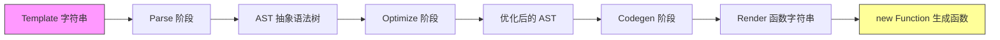

**📍 源码入口**：`src/compiler/index.js:1-30`

```javascript
/**
 * 编译器入口：将模板字符串编译为渲染函数
 * 分三个阶段：parse → optimize → generate
 */
export function baseCompile(
  template: string,
  options: CompilerOptions
): CompiledResult {
  // ========== 阶段1：Parse ==========
  // 将 HTML 字符串转换为 AST（抽象语法树）
  const ast = parse(template.trim(), options)
  
  // ========== 阶段2：Optimize ==========
  // 标记静态节点和静态子树，用于渲染优化
  if (options.optimize !== false) {
    optimize(ast, options)
  }
  
  // ========== 阶段3：Codegen ==========
  // 将 AST 转换为渲染函数代码字符串
  const code = generate(ast, options)
  
  return {
    ast,
    render: code.render,
    staticRenderFns: code.staticRenderFns
  }
}
```

### 4.2 Parse 阶段 — HTML 解析器

**📍 源码位置**：`src/parser/html-parser.js:1-200`

```javascript
/**
 * HTML Parser：正则 + 状态机方式解析 HTML
 * 将模板字符串转换为 AST
 */
export function parseHTML(html, options) {
  let index = 0 // 当前解析位置
  
  while (html) {
    // 检查是否到达末尾或遇到注释/条件注释等
    if (!lastTag || !isPlainTextElement(lastTag)) {
      let textEnd = html.indexOf('<')
      
      if (textEnd === 0) {
        // ========== 注释 ==========
        if (comment.test(html)) {
          const commentEnd = html.indexOf('-->')
          if (commentEnd >= 0) {
            advance(commentEnd + 3)
            continue
          }
        }
        
        // ========== 条件注释 ==========
        if (conditionalComment.test(html)) {
          const conditionalEnd = html.indexOf(']>')
          if (conditionalEnd >= 0) {
            advance(conditionalEnd + 2)
            continue
          }
        }
        
        // ========== DOCTYPE ==========
        const doctypeMatch = html.match(doctype)
        if (doctypeMatch) {
          advance(doctypeMatch[0].length)
          continue
        }
        
        // ========== 结束标签 ==========
        const endTagMatch = html.match(endTag)
        if (endTagMatch) {
          const curIndex = index
          advance(endTagMatch[0].length)
          parseEndTag(endTagMatch[1], curIndex, index)
          continue
        }
        
        // ========== 开始标签 ==========
        const startTagMatch = parseStartTag()
        if (startTagMatch) {
          handleStartTag(startTagMatch)
          continue
        }
      }
      
      // ========== 文本节点 ==========
      let text, rest, next
      if (textEnd >= 0) {
        rest = html.slice(textEnd)
        // 处理纯文本内容中的 <
        while (
          !endTag.test(rest) &&
          !startTagOpen.test(rest) &&
          !comment.test(rest) &&
          !conditionalComment.test(rest)
        ) {
          next = rest.indexOf('<', 1)
          if (next < 0) break
          textEnd += next
          rest = html.slice(textEnd)
        }
        text = html.substring(0, textEnd)
        advance(textEnd)
      }
      
      if (textEnd < 0) {
        text = html
        html = ''
      }
      
      if (options.chars && text) {
        options.chars(text)
      }
    } else {
      // 处理 script/style/textarea 等纯文本元素
      // ...
    }
  }
  
  // 前进指定字符数
  function advance(n) {
    index += n
    html = html.substring(n)
  }
}
```

**AST 节点结构**：

```javascript
// 解析后的 AST 示例
{
  type: 1,              // 元素节点类型
  tag: 'div',          // 标签名
  attrsList: [],        // 属性列表
  attrsMap: {},         // 属性映射
  parent: null,         // 父节点
  children: [           // 子节点
    {
      type: 2,          // 表达式节点
      expression: '_s(message)',
      text: '{{message}}',
      tokens: [...]
    }
  ],
  plain: false,
  staticRoot: false,
  static: false
}
```

### 4.3 Optimize 阶段 — 静态节点标记

**📍 源码位置**：`src/compiler/optimizer.js:1-100`

```javascript
/**
 * Optimizer：标记静态节点
 * 静态节点是指：
 * 1. 不含动态绑定（v-bind、v-on、{{}}）
 * 2. 不含 v-if/v-for/v-else 等结构性指令
 * 3. 子节点也都是静态的（静态子树）
 * 
 * 静态节点的好处：
 * - 首次渲染后缓存，后续更新时跳过
 * - 重新渲染时直接克隆，不需要重新创建
 */
export function optimize(root: ASTElement, options: CompilerOptions) {
  if (!root) return
  
  // 第一遍：标记所有静态节点
  markStatic(root)
  
  // 第二遍：标记静态根节点（拥有静态子树的节点）
  markStaticRoots(root, false)
}

function markStatic(node) {
  node.static = isStatic(node)
  
  if (node.type === 1) {
    // 元素节点：递归处理子节点
    for (let i = 0, l = node.children.length; i < l; i++) {
      const child = node.children[i]
      markStatic(child)
      
      // 如果子节点不是静态的，父节点也不是静态的
      if (!child.static) {
        node.static = false
      }
    }
  }
}

function isStatic(node): boolean {
  if (node.type === 2) {
    // 表达式节点：{{ }} 动态
    return false
  }
  if (node.type === 3) {
    // 纯文本节点：静态
    return true
  }
  return (!node.if && !node.for &&  // 无 v-if/v-for
    !isBuiltInTag(node.tag) &&      // 非 slot/component
    !isPlatformReservedTag(node.tag) && // 非平台保留标签
    Object.keys(node).every(isStaticKey)) // 属性都是静态的
}
```

**设计意图**：
- **为什么需要两遍扫描？** 第一遍自顶向下标记，第二遍自底向上确定静态根节点
- **静态根节点的意义**：Patch 时可以直接克隆整个子树，避免逐个比较

### 4.4 Codegen 阶段 — 代码生成

**📍 源码位置**：`src/compiler/codegen/index.js:1-150`

```javascript
/**
 * Code Generator：将 AST 转换为渲染函数代码
 * 输出类似这样的字符串：
 * "_c('div',{attrs:{"id":"app"}},[_c('p',[_v(_s(message))])])"
 */
export function generate(
  ast: ASTElement,
  options: CompilerOptions
): CodegenResult {
  
  // 状态对象
  const state = new CodegenState(options)
  
  // 生成代码字符串
  const code = ast ? genElement(ast, state) : '_c("div")'
  
  return {
    render: `with(this){return ${code}}`,
    staticRenderFns: state.staticRenderFns
  }
}

/**
 * 生成元素节点代码
 */
function genElement(el, state): string {
  
  // 处理 v-if
  if (el.if && !el.ifProcessed) {
    return genIf(el, state)
  }
  
  // 处理 v-for
  if (el.for && !el.forProcessed) {
    return genFor(el, state)
  }
  
  // 处理静态子树
  if (el.staticRoot && !el.staticProcessed) {
    return genStatic(el, state)
  }
  
  // 处理 slot
  if (el.slotTarget && !el.slotProcessed) {
    return genSlot(el, state)
  }
  
  // 处理组件
  if (el.component) {
    return genComponent(el.component, el, state)
  }
  
  // 处理普通元素
  let data
  if (!el.plain) {
    data = genData(el, state)
  }
  
  const children = genChildren(el, state, true)
  
  return `_c('${el.tag}'${data ? `,${data}` : ''}${children ? `,${children}` : ''})`
}

/**
 * 生成属性数据
 * _d({attrs:{id:'app'},on:{click:handler}})
 */
function genData(el, state): string {
  let data = '{'
  
  // 指令
  if (el.directives) {
    data += `directives:[${genDirectives(el.directives, state)}],`
  }
  
  // 属性
  if (el.attrs) {
    data += `attrs:${genProps(el.attrs)},`
  }
  
  // DOM props
  if (el.props) {
    data += `domProps:${genProps(el.props)},`
  }
  
  // 事件
  if (el.events) {
    data += `${genHandlers(el.events, false, state)},`
  }
  
  // ...
  
  return data + '}'
}
```

**生成的代码示例**：

```javascript
// 模板：
// <div id="app">
//   <p>{{ message }}</p>
// </div>

// 生成的 render 函数：
with(this) {
  return _c(
    'div',
    { attrs: { "id": "app" } },
    [
      _c('p', [_v(_s(message))])
    ]
  )
}

// 其中：
// _c = createElement  创建元素
// _v = createTextVNode  创建文本节点
// _s = toString  转字符串
// _q = LooseEqual  松散相等
// _m = renderStatic  渲染静态节点
// _l = renderList  渲染列表
```

### 4.5 v-model 的编译差异

**📍 源码位置**：`src/platforms/web/compiler/directives/model.js:1-100`

```javascript
/**
 * v-model 编译：根据不同元素类型生成不同的代码
 * 本质上是语法糖，编译为 v-bind + v-on 的组合
 */
export default function model(
  el: ASTElement,
  dir: ASTDirective,
  _warn: Function
): ?boolean {
  
  // 获取绑定的值
  const value = dir.value
  const modifiers = dir.modifiers
  
  // 获取事件名和属性名
  const { prop, event } = getModelOptions(el.tag)
  
  // 根据元素类型生成不同的代码
  if (el.tag === 'select') {
    // select 元素
    genSelect(el, value, modifiers)
  } else if (el.tag === 'input' && el.attrsMap.type === 'checkbox') {
    // checkbox
    genCheckboxModel(el, value, modifiers)
  } else if (el.tag === 'input' && el.attrsMap.type === 'radio') {
    // radio
    genRadioModel(el, value, modifiers)
  } else if (el.tag === 'input' || el.tag === 'textarea') {
    // 普通 input/textarea
    genDefaultModel(el, value, modifiers, event)
  } else if (!config.isReservedTag(el.tag)) {
    // 组件
    genComponentModel(el, value, modifiers)
  } else {
    // warn...
  }
  
  return true // 表示该指令已处理
}

/**
 * 普通 input 的 model 编译结果
 * <input v-model="msg">
 * ↓ 编译为 ↓
 * <input :value="msg" @input="msg=$event.target.value">
 */
function genDefaultModel(el, value, modifiers, event) {
  const { number, trim, lazy } = modifiers || {}
  
  // 确定事件名（lazy 修饰符改为 change 事件）
  const needCompositionGuard = !lazy && type !== 'range'
  const event = lazy ? 'change' : (type === 'range' ? 'change' : 'input')
  
  // 生成 value 绑定
  let valueExpression = `$event.target.value${trim ? '.trim()' : ''}${number ? '*1' : ''}`
  
  // 添加到 el.events
  addHandler(el, event, `${value}=${valueExpression}`, null, true)
  
  // 添加 value 属性绑定
  if (number) {
    addProp(el, 'value', `(${value})`)
  } else {
    addAttr(el, 'value', `(${value})`)
  }
}
```

**各表单元素 v-model 编译结果对比**：

| 元素 | v-model 编译结果 |
|------|-----------------|
| `<input v-model="msg">` | `:value="msg" @input="msg=$event.target.value"` |
| `<input type="checkbox">` | `:checked="checked" @change="..."` |
| `<input type="radio">` | `:checked="val==radioValue" @change="..."` |
| `<select>` | 多个 `:selected` + `@change` |
| `<textarea>` | 类似 input，但用 `textContent` |
| 自定义组件 | `:value="msg" @input="msg=$event"` |

### 4.6 v-for 和 v-if 的编译差异

**📍 源码位置**：`src/compiler/directives/for.js` 和 `if.js`

```javascript
/**
 * v-for 编译
 * <div v-for="(item, index) in list" :key="item.id">
 *   {{ item.name }}
 * </div>
 * 
 * 编译为：
 * _l(list, function(item, index){
 *   return _c('div', {key: item.id}, [_v(_s(item.name))])
 * })
 */
export function forTransform(el, dir) {
  const exp = dir.value // "(item, index) in list"
  const alias = exp.match(/\((.*)\)/)[1] // "item, index"
  
  // 解析出迭代变量和数据源
  const forIteratorRE = /([\w]+)\s+(?:in|of)\s+([\w]+)/
  const match = exp.match(forIteratorRE)
  
  el.for = match[2] // 数据源
  el.alias = match[1] // 别名
  
  // 生成渲染函数代码
  el.forProcessed = true // 标记已处理
  return genFor(el, state)
}

/**
 * v-if 编译
 * <div v-if="show">content</div>
 * 
 * 编译为：
 * show ? _c('div',[_v("content")]) : _e()
 * 
 * v-if/v-else-if/v-else 会编译为三元表达式的嵌套
 */
export function ifTransform(el, dir) {
  const exp = dir.value // "show"
  
  // 添加到 ifConditions 数组
  el.ifConditions.push({
    exp: exp,
    block: el
  })
  
  // 生成三元表达式
  return genIf(el, state)
}
```

**⚠️ 重要：v-for 和 v-if 同时使用的优先级**

```javascript
// 模板：
// <div v-for="item in list" v-if="item.show">{{ item }}</div>

// 实际编译效果（v-for 优先级更高）：
// 相当于：
// list.map(item => {
//   return item.show ? <div>{{item}}</div> : null
// })

// ⚠️ 性能问题：每次渲染都会遍历整个列表，即使大部分被 v-if 隐藏
// 建议：改用 computed 过滤后再 v-for
```

---

## 第5章：组件化机制

### 5.1 组件初始化流程时序图

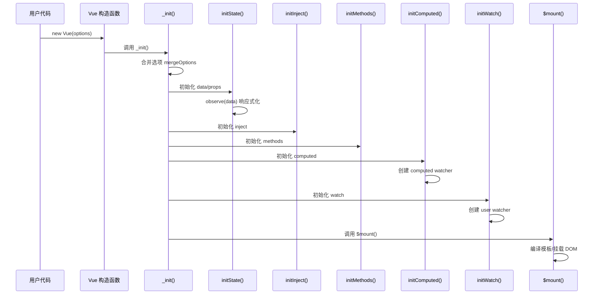

### 5.2 Vue 构造函数与 _init 方法

**📍 源码位置**：
- `src/core/instance/index.js:1-30`
- `src/core/instance/init.js:1-120`

```javascript
/**
 * Vue 构造函数定义
 * 通过原型链混入的方式组织代码
 */
function Vue(options) {
  if (process.env.NODE_ENV !== 'production' && !(this instanceof Vue)) {
    warn('Vue is a constructor and should be called with the `new` keyword')
  }
  this._init(options) // 调用初始化方法
}

// 原型方法混入（按顺序很重要）
initMixin(Vue)      // _init
stateMixin(Vue)     // $data/$props/$set/$delete/$watch
eventsMixin(Vue)    // $on/$off/$emit/$once
lifecycleMixin(Vue) // _update/$forceUpdate/$destroy
renderMixin(Vue)    // $nextTick/_render

// 静态方法混入
initGlobalAPI(Vue)  // Vue.use/Vue.component/Vue.directive...

/**
 * _init：实例初始化的核心方法
 */
Vue.prototype._init = function (options?: Object) {
  const vm = this
  vm._uid = uid++ // 唯一标识

  // 避免被观测
  vm._isVue = true
  
  // 合并选项（处理继承、mixin、extends 等）
  if (options && options._isComponent) {
    // 组件内部创建：优化合并
    initInternalComponent(vm, options)
  } else {
    vm.$options = mergeOptions(
      resolveConstructorOptions(vm.constructor),
      options || {},
      vm
    )
  }

  // ========== 初始化生命周期 ==========
  vm._self = vm
  initLifecycle(vm)       // $parent/$children/$root
  initEvents(vm)          // 事件系统
  initRender(vm)          // $slots/$scopedSlots/_c

  // ========== 钩子：beforeCreate ==========
  callHook(vm, 'beforeCreate')

  // ========== 初始化注入 ==========
  initInjections(vm)      // resolve injections before data/props

  // ========== 初始化状态 ==========
  initState(vm)           // props/methods/data/computed/watch

  // ========== 初始化 provide ==========
  initProvide(vm)         // resolve provide after data/props

  // ========== 钩子：created ==========
  callHook(vm, created)

  // ========== 挂载 ==========
  if (vm.$options.el) {
    vm.$mount(vm.$options.el)
  }
}
```

**设计意图**：
- **为什么用 mixin 模式？** 将庞大的 Vue 原型拆分到不同模块，便于维护和理解
- **初始化顺序的意义**：beforeCreate 时无法访问 data/computed；created 时可以访问但未挂载 DOM
- **_isVue 标志**：防止 Vue 实例被 observe（无限递归）

### 5.3 选项合并策略

**📍 源码位置**：`src/core/util/options.js:1-250`

```javascript
/**
 * mergeOptions：选项合并策略
 * 处理父子组件、mixin、extends 的选项合并
 * 不同类型的选项有不同的合并策略
 */
export function mergeOptions(
  parent: Object,
  child: Object,
  vm?: Component
): Object {
  
  // 规范化 props/inject/directives
  normalizeProps(child, vm)
  normalizeInject(child, vm)
  normalizeDirectives(child)
  
  // 处理 extends
  if (!child._base) {
    if (child.extends) {
      parent = mergeOptions(parent, child.extends, vm)
    }
    if (child.mixins) {
      for (let i = 0, l = child.mixins.length; i < l; i++) {
        parent = mergeOptions(parent, child.mixins[i], vm)
      }
    }
  }
  
  const options = {}
  let key
  
  // 遍历父选项
  for (key in parent) {
    mergeField(key)
  }
  
  // 遍历子选项（排除已在父选项中的）
  for (key in child) {
    if (!hasOwn(parent, key)) {
      mergeField(key)
    }
  }
  
  // 根据不同类型选择合并策略
  function mergeField(key) {
    const strat = strats[key] || defaultStrat
    options[key] = strat(parent[key], child[key], vm, key)
  }
  
  return options
}

/**
 * 各选项的合并策略
 */
const strats = Object.create(null)

// data：必须返回函数，合并时分别调用
strats.data = function(parentVal, childVal, vm) {
  if (!vm) {
    // 全局合并时，data 必须是函数
    if (childVal && typeof childVal !== 'function') {
      process.env.NODE_ENV !== 'production' && warn(...)
    }
  }
  return mergedDataFn(parentVal, childVal)
}

// 生命周期钩子：合并为数组
function mergeHook(parentVal, childVal) {
  return childVal
    ? parentVal
      ? parentVal.concat(childVal) // 父子都有：拼接
      : childVal                   // 只有子
    : parentVal                   // 只有父
}

LIFECYCLE_HOOKS.forEach(hook => {
  strats[hook] = mergeHook
})

// assets（components/directives/filters）：策略模式（类似原型链）
strats.assets = function(parentVal, childVal) {
  const res = Object.create(parentVal || null)
  return childVal ? extend(res, childVal) : res
}

// watch：合并为对象
strats.watch = function(parentVal, childVal) {
  // work around Firefox's Object.prototype.watch...
  if (!childVal) return Object.create(parentVal || null)
  // ...
}

// props/methods/inject/computed：覆盖而非合并
strats.props =
strats.methods =
strats.inject =
strats.computed = function(parentVal, childVal) {
  if (!parentVal) return childVal
  const ret = Object.create(null)
  extend(ret, parentVal)
  if (childVal) extend(ret, childVal)
  return ret
}
```

**合并策略总结表**：

| 选项类型 | 合并策略 | 示例 |
|---------|---------|------|
| data | 函数合并，各自调用 | 父子 data 都生效 |
| 生命周期 | 数组拼接 | 父子 created 都执行 |
| watch | 对象合并 | 父子 watch 都生效 |
| methods | 子覆盖父 | 保留子组件的 |
| components | 原型链合并 | 可访问父组件注册的 |
| props/computed | 子覆盖父 | 保留子组件的 |

### 5.4 $mount 过程详解

**📍 源码位置**：
- `src/platforms/web/runtime/index.js:30-40`
- `src/core/instance/lifecycle.js:160-200`

```javascript
/**
 * $mount：组件挂载的核心方法
 * 负责将组件渲染到真实 DOM
 */
Vue.prototype.$mount = function(
  el?: string | Element,
  hydrating?: boolean
): Component {
  el = el && inBrowser ? query(el) : undefined
  
  // 获取渲染函数
  const render = this.$options.render
  
  // 如果没有 render 函数但有 template
  if (!render) {
    let template = this.$options.template
    
    // 尝试从 el 获取 outerHTML
    if (!template && el) {
      template = getOuterHTML(el)
    }
    
    // 编译模板
    if (template) {
      const { render, staticRenderFns } = compileToFunctions(template, {...}, this)
      this.$options.render = render
      this.$options.staticRenderFns = staticRenderFns
    }
  }
  
  // 调用挂载方法
  return mount.call(this, el, hydrating)
}

/**
 * 实际的挂载逻辑
 */
function mountComponent(vm, el, hydrating) {
  vm.$el = el
  
  // 如果没有 render 函数，报错（Runtime-only 版本）
  if (!vm.$options.render) {
    if (process.env.NODE_ENV !== 'production') {
      if (vm.$options.template && typeof vm.$options.template !== 'string') {
        warn(...)
      } else {
        warn(
          'Either pre-compile templates into render functions, ' +
          'or use the compiler-included build.'
        )
      }
    }
    
    // 兜底：创建空的 render 函数
    vm.$options.render = createEmptyVNode
  }
  
  // ========== 钩子：beforeMount ==========
  callHook(vm, 'beforeMount')
  
  // 🔑 核心：创建渲染 Watcher
  let updateComponent = () => {
    vm._update(vm._render(), hydrating) // 渲染 → 更新 DOM
  }
  
  new Watcher(vm, updateComponent, noop, {
    before() {
      if (vm._isMounted) {
        callHook(vm, 'beforeUpdate')
      }
    }
  }, true /* isRenderWatcher */)
  
  hydrating = false
  
  // ========== 钩子：mounted ==========
  if (vm.$vnode == null) {
    vm._isMounted = true
    callHook(vm, 'mounted')
  }
  
  return vm
}
```

**关键流程**：
1. **查询 DOM 元素**：将选择器字符串转为真实 DOM
2. **编译模板**（如果没有 render 函数）：template → render
3. **创建渲染 Watcher**：内部调用 `updateComponent`
4. **首次渲染**：`_render()` 生成 VNode → `_update()` 更新 DOM
5. **触发 mounted 钩子**

### 5.5 组件通信方式的源码视角

#### 5.5.1 props 单向数据流

**📍 源码位置**：`src/core/vdom/helpers/extract-props-from-vnode-data.js:1-60`

```javascript
/**
 * 从 VNode data 中提取 props
 * 在创建组件实例时调用
 */
export function extractPropsFromVNodeData(
  data,
  Ctor,
  res
) {
  // 获取组件声明的 props 选项
  const propOptions = Ctor.options.props
  
  if (isUndef(propOptions)) {
    return
  }
  
  const res = {}
  const { attrs, props, domProps } = data
  
  // 验证 props 并提取值
  validateProp(key, propOptions, attrs, data.isCommentTag)
  
  // 将 props 设置到组件实例上（响应式但不可变）
  toggleObserving(false) // 暂停响应式
  defineReactive(props, key, value)
  toggleObserving(true)
  
  return res
}
```

**设计意图**：props 是单向数据流，子组件不应修改 props。虽然技术上可以修改，但这违反了设计原则。

#### 5.5.2 $emit 事件通信

**📍 源码位置**：`src/core/instance/events.js:90-110`

```javascript
/**
 * $emit：触发事件
 * 向上冒泡到父组件的事件监听器
 */
Vue.prototype.$emit = function (event: string): Component {
  const vm = this
  
  // 开发环境校验事件名
  if (process.env.NODE_ENV !== 'production') {
    const lowerCaseEvent = event.toLowerCase()
    if (lowerCaseEvent !== event && vm._events[lowerCaseEvent]) {
      tip(
        `Event "${lowerCaseEvent}" is emitted in component ` +
        `${formatComponentName(vm)} but the handler is registered for "${event}". ` +
        `Note that HTML attributes are case-insensitive.`
      )
    }
  }
  
  // 获取该事件的处理器列表
  let cbs = vm._events[event]
  
  if (cbs) {
    // 转为数组（支持单个函数或数组形式）
    cbs = cbs.length > 1 ? toArray(cbs) : cbs
    const args = toArray(arguments, 1)
    
    // 错误处理
    const info = `event handler for "${event}"`
    for (let i = 0, l = cbs.length; i < l; i++) {
      invokeWithErrorHandling(cbs[i], vm, args, vm, info)
    }
  }
  
  return vm
}
```

#### 5.5.3 $parent / $children

**📍 源码位置**：`src/core/instance/lifecycle.js:40-70`

```javascript
/**
 * 初始化时建立父子关系
 */
function initLifecycle(vm) {
  const options = vm.$options
  
  // 找到第一个非抽象的父组件
  let parent = options.parent
  if (parent && !options.abstract) {
    while (parent.$options.abstract && parent) {
      parent = parent.$parent
    }
    parent.$children.push(vm)
  }
  
  vm.$parent = parent
  vm.$root = parent ? parent.$root : vm
  
  vm.$children = []
  vm.$refs = {}
}
```

**⚠️ 注意**：`$parent/$children` 强耦合，官方推荐使用 provide/inject 或 Vuex。

### 5.6 Slot 插槽编译原理

**📍 源码位置**：`src/core/vdom/helpers/render-slot.js:1-40`

```javascript
/**
 * render-slot：渲染插槽内容
 * 编译器会将 <slot> 编译为此函数调用
 */
export function renderSlot(
  name,           // 插槽名称
  fallback,       // 默认内容（fallback）
  props,          // 作用域插槽的 props
  bindObject      // v-bind 对象语法
) {
  
  // 获取 scopedSlots（作用域插槽）
  const scopedSlotFn = this.$scopedSlots[name]
  let nodes
  
  if (scopedSlotFn) {
    // 作用域插槽：传入 props，执行函数获取 VNodes
    props = props || {}
    if (bindObject) {
      // v-bind="obj" 语法
      props = extend(extend({}, bindObject), props)
    }
    nodes = scopedSlotFn(props) || (isArray(fallback) ? fallback : [fallback])
  } else {
    // 普通插槽：从 $slots 获取预编译的内容
    const slotNodes = this.$slots[name]
    nodes = slotNodes || (isArray(fallback) ? fallback : [fallback])
  }
  
  // 标记插槽内容的 owner（用于作用域）
  const target = this
  for (let i = 0; i < nodes.length; i++) {
    // 确保每个 VNode 都有正确的上下文
    if (nodes[i] && nodes[i].isComment && !nodes[i].asyncFactory) {
      // 保持注释节点不变
    } else {
      nodes[i] = Array.isArray(nodes[i])
        ? createTextVNode('')
        : nodes[i]
    }
  }
  
  return nodes
}
```

**插槽类型对比**：

| 类型 | 语法 | 编译结果 | 特点 |
|-----|------|---------|------|
| 默认插槽 | `<slot>` | `this.$slots.default` | 父组件提供内容 |
| 具名插槽 | `<slot name="header">` | `this.$slots.header` | 按名称分发 |
| 作用域插槽 | `<slot :item="data">` | `this.$scopedSlots.default` | 子组件传数据给父组件 |

---

## 第6章：计算属性与侦听器

### 6.1 Computed 缓存机制流程图

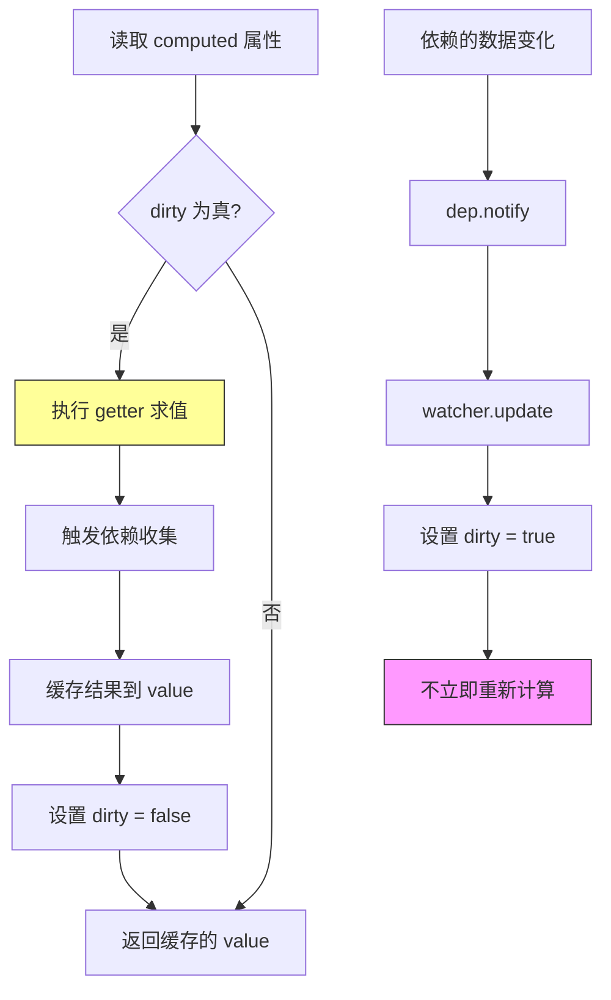

### 6.2 Computed 实现原理

**📍 源码位置**：`src/core/instance/state.js:220-280`

```javascript
/**
 * initComputed：初始化计算属性
 * 为每个 computed 创建一个 lazy watcher
 */
function initComputed(vm, computed) {
  const watchers = vm._computedWatchers = Object.create(null)
  
  // computed 属性是否在 SSR 中
  const isSSR = isServerRendering()
  
  for (const key in computed) {
    const userDef = computed[key]
    
    // getter 可能是函数或对象（get/set）
    const getter = typeof userDef === 'function' ? userDef : userDef.get
    
    // 开发环境警告
    if (process.env.NODE_ENV !== 'production' && getter == null) {
      warn(`Getter is missing for computed property "${key}".`)
    }
    
    // 创建 computed watcher（lazy: true）
    if (!isSSR) {
      watchers[key] = new Watcher(
        vm,
        getter || noop,
        noop,
        { lazy: true } // 🔑 关键：懒计算
      )
    }
    
    // 定义计算属性到组件实例上
    if (!(key in vm)) {
      defineComputed(vm, key, userDef)
    } else {
      // 已存在同名属性，发出警告
      warn(...)
    }
  }
}

/**
 * defineComputed：将 computed 属性代理到实例上
 * 使用 Object.defineProperty 拦截 get/set
 */
export function defineComputed(target, key, userDef) {
  const shouldCache = !isServerRendering()
  
  // 统一处理 getter/setter
  if (typeof userDef === 'function') {
    sharedPropertyDefinition.get = shouldCache
      ? createComputedGetter(key) // 带缓存的 getter
      : userDef                    // SSR 模式直接调用
    sharedPropertyDefinition.set = noop
  } else {
    sharedPropertyDefinition.get = userDef.get
      ? (shouldCache && userDef.cache !== false)
        ? createComputedGetter(key)
        : userDef.get
      : noop
    sharedPropertyDefinition.set = userDef.set || noop
  }
  
  // 定义到实例上
  Object.defineProperty(target, key, sharedPropertyDefinition)
}

/**
 * createComputedGetter：创建带缓存的 getter
 * 这是 computed 缓存机制的核心
 */
function createComputedGetter(key) {
  return function computedGetter() {
    const watcher = this._computedWatchers[key]
    
    if (watcher) {
      // 🔑 dirty 标志位：判断是否需要重新计算
      if (watcher.dirty) {
        // dirty 为 true：执行 evaluate 重新求值
        watcher.evaluate()
      }
      
      // 🔑 依赖收集：让渲染 Watcher 也依赖 computed 的依赖
      if (Dep.target) {
        watcher.depend()
      }
      
      return watcher.value
    }
  }
}
```

**逐行注释详解**：

1. **lazy: true**：创建 Watcher 时不立即执行 getter，而是等到第一次读取时
2. **dirty 标志**：初始为 true（需要计算），evaluate 后变为 false（已缓存），依赖变化后被 update 设回 true
3. **watcher.depend()**：让外部 Watcher（通常是渲染 Watcher）也订阅 computed 内部依赖的数据。这是"级联依赖收集"

**设计意图分析**：

**Q：为什么 computed 要用 dirty 机制而不是每次都重新计算？**
A：性能优化。computed 可能依赖多个响应式数据，任意一个变化都不应该立即重新计算，而是等到实际读取时再算。而且同一事件循环内可能多次读取 computed，缓存可以避免重复计算。

**Q：watcher.depend() 的作用是什么？**
A：解决"依赖丢失"问题。当渲染函数读取 computed 时，Dep.target 是渲染 Watcher，但 computed getter 内部读取 data 时 Dep.target 变成了 computed Watcher。如果不调用 depend()，渲染 Watcher 就不会知道 computed 依赖了哪些 data。

### 6.3 Watch 实现原理

**📍 源码位置**：`src/core/instance/state.js:290-360`

```javascript
/**
 * initWatch：初始化侦听器
 * 将 watch 选项转换为 $watch 调用
 */
function initWatch(vm, watch) {
  for (const key in watch) {
    const handler = watch[key]
    
    // 支持数组形式的 handler
    if (Array.isArray(handler)) {
      for (let i = 0; i < handler.length; i++) {
        createWatcher(vm, key, handler[i])
      }
    } else {
      createWatcher(vm, key, handler)
    }
  }
}

/**
 * createWatcher：创建侦听器
 * 处理各种写法：字符串、函数、对象、数组
 */
function createWatcher(vm, exprOrFn, handler, options) {
  // 如果 handler 是对象（包含 deep/immediate 等选项）
  if (isPlainObject(handler)) {
    options = handler
    handler = handler.handler
  }
  
  // 如果 handler 是字符串（方法名）
  if (typeof handler === 'string') {
    handler = vm[handler]
  }
  
  // 调用 $watch
  return vm.$watch(exprOrFn, handler, options)
}

/**
 * $watch：创建用户 Watcher
 */
Vue.prototype.$watch = function(
  expOrFn: string | Function,
  cb: Function,
  options?: Object
): Function {
  const vm = this
  
  // 如果是纯对象，提取回调
  if (isPlainObject(cb)) {
    return this.$watch(expOrFn, cb.handler, cb)
  }
  
  options = options || {}
  // 标记为用户 Watcher
  options.user = true
  
  // 创建用户 Watcher
  const watcher = new Watcher(vm, expOrFn, cb, options)
  
  // immediate 选项：立即执行一次回调
  if (options.immediate) {
    try {
      cb.call(vm, watcher.value)
    } catch (error) {
      handleError(error, vm, `callback for immediate watcher "${expOrFn}"`)
    }
  }
  
  // 返回取消函数
  return function unwatchFn() {
    watcher.teardown()
  }
}
```

### 6.4 Deep 监听原理

**📍 源码位置**：`src/core/observer/watcher.js:140-170`

```javascript
/**
 * deep 监听实现
 * 递归遍历对象的所有属性，触发它们的 getter 以收集依赖
 */
get() {
  pushTarget(this)
  let value
  const vm = this.vm
  try {
    value = this.getter.call(vm, vm)
  } catch (e) {
    handleError(e, vm, `getter for watcher "${this.expression}"`)
  } finally {
    // 🔑 deep 模式：递归触发深层属性的依赖收集
    if (this.deep) {
      traverse(value) // 递归遍历
    }
    popTarget()
    this.cleanupDeps()
  }
  return value
}

/**
 * traverse：深度遍历对象
 * 触发每个属性的 getter，建立依赖关系
 */
const seenObjects = new Set()

export function traverse(val) {
  _traverse(val, seenObjects)
  seenObjects.clear()
}

function _traverse(val, seen) {
  let i, keys
  const isA = Array.isArray(val)
  
  // 只遍历对象和数组
  if ((!isA && !isObject(val)) || Object.isFrozen(val)) {
    return
  }
  
  // 避免循环引用导致的无限递归
  if (val.__ob__) {
    const depId = val.__ob__.dep.id
    if (seen.has(depId)) {
      return
    }
    seen.add(depId)
  }
  
  // 递归遍历
  if (isA) {
    i = val.length
    while (i--) _traverse(val[i], seen)
  } else {
    keys = Object.keys(val)
    i = keys.length
    while (i--) _traverse(val[keys[i]], seen)
  }
}
```

**设计意图**：
- **deep 的性能成本**：每次触发都会递归遍历整个对象树，对于大型对象可能有性能问题
- **seen 集合**：防止循环引用导致的栈溢出

### 6.5 Computed vs Watch 对比

| 特性 | Computed | Watch |
|-----|----------|-------|
| 缓存 | ✅ 有（dirty 标志） | ❌ 无 |
| 惰性求值 | ✅ 是 | ❌ 默认立即执行 |
| 返回值 | ✅ 必须有 | 可选 |
| 副作用 | ❌ 不应有 | ✅ 通常有 |
| 适用场景 | 派生状态 | 异步/昂贵操作 |
| 依赖追踪 | 自动 | 手动指定 |

### 6.6 🎯 手写实现：Mini-Computed + Mini-Watch

```javascript
/**
 * Mini Computed & Watch Implementation
 * 简化版计算属性和侦听器实现
 */

// 依赖前面的 Mini-Reactive 系统
// 这里假设已经有 MiniDep, MiniObserver, MiniWatcher

// ==================== 1. Mini Computed ====================
class MiniComputed {
  constructor(getter, options = {}) {
    this.getter = getter
    this.value = undefined
    this.dirty = true // 脏标志：需要重新计算
    this.lazy = options.lazy !== false // 默认懒计算
    this.dep = new MiniDep() // 自己的依赖收集器
    
    if (!this.lazy) {
      this.value = this.evaluate()
    }
  }
  
  /**
   * 求值：执行 getter 并缓存结果
   */
  evaluate() {
    console.log('🧮 重新计算 computed')
    pushTarget(this) // 将 computed watcher 设为目标
    try {
      this.value = this.getter() // 执行 getter（触发内部依赖收集）
    } finally {
      popTarget()
    }
    this.dirty = false // 标记为干净
    return this.value
  }
  
  /**
   * 更新：只是标记为脏，不立即重新计算
   */
  update() {
    console.log('☁️ computed 标记为脏')
    this.dirty = true
    this.dep.notify() // 通知依赖此 computed 的 watcher
  }
  
  /**
   * 依赖：让外部 watcher 也订阅内部的 deps
   */
  depend() {
    if (MiniDep.target) {
      this.dep.depend()
    }
  }
  
  /**
   * 获取值（带缓存）
   */
  get() {
    if (this.dirty) {
      this.evaluate()
    }
    
    // 级联依赖收集
    if (MiniDep.target) {
      this.depend()
    }
    
    return this.value
  }
}

// ==================== 2. Mini Watch ====================
class MiniWatch {
  constructor(expOrFn, callback, options = {}) {
    this.expOrFn = expOrFn
    this.callback = callback
    this.immediate = !!options.immediate
    this.deep = !!options.deep
    this.value = undefined
    this.dep = new MiniDep()
    
    // 立即执行一次（如果设置了 immediate）
    if (this.immediate) {
      this.callback(this.getValue())
    } else {
      this.getValue() // 首次求值，建立依赖
    }
  }
  
  getValue() {
    pushTarget(this)
    try {
      if (typeof this.expOrFn === 'function') {
        this.value = this.expOrFn()
      } else {
        // 简单路径解析（实际 Vue 用 parsePath）
        this.value = this.expOrFn
      }
      
      // deep 模式：递归遍历
      if (this.deep) {
        this.traverse(this.value)
      }
    } finally {
      popTarget()
    }
    return this.value
  }
  
  traverse(val) {
    const seen = new Set()
    
    const _traverse = (v) => {
      if (typeof v !== 'object' || v === null) return
      if (seen.has(v)) return
      seen.add(v)
      
      // 触发 getter
      for (const key in v) {
        _traverse(v[key])
      }
    }
    
    _traverse(val)
  }
  
  /**
   * 更新：重新求值并调用回调
   */
  update() {
    const oldValue = this.value
    const newValue = this.getValue()
    
    // 值确实变化了才调用回调
    if (newValue !== oldValue || (this.deep && newValue != null)) {
      console.log('👀 watch 触发回调')
      this.callback(newValue, oldValue)
    }
  }
}

// ==================== 3. 测试示例 ====================
console.log('===== Mini Computed & Watch 测试 =====')

// 响应式数据
const state = {
  firstName: '张',
  lastName: '三',
  age: 18,
  info: {
    address: '北京',
    phone: '138****8888'
  }
}

// 假设已经调用了 miniObserve(state)

// 创建 computed
const fullName = new MiniComputed(() => {
  console.log('  → 执行 fullName 计算')
  return state.firstName + state.lastName
})

const adultInfo = new MiniComputed(() => {
  console.log('  → 执行 adultInfo 计算')
  return state.age >= 18 ? '成年' : '未成年'
})

// 创建 watch
const unwatchAge = new MiniWatch(
  () => state.age,
  (newVal, oldVal) => {
    console.log(`🎂 年龄变化: ${oldVal} → ${newVal}`)
  },
  { immediate: true }
)

// 创建 deep watch
const unwatchInfo = new MiniWatch(
  () => state.info,
  (newVal, oldVal) => {
    console.log(`🏠 信息变化:`, newVal)
  },
  { deep: true }
)

// 测试
console.log('\n--- 读取 fullName ---')
console.log(fullName.get()) // 首次计算

console.log('\n--- 再次读取 fullName ---')
console.log(fullName.get()) // 使用缓存

console.log('\n--- 修改 firstName ---')
state.firstName = '李' // 触发 fullName dirty

console.log('\n--- 读取 fullName ---')
console.log(fullName.get()) // 重新计算

console.log('\n--- 修改年龄 ---')
state.age = 19 // 触发 watch 回调

console.log('\n--- 修改深层次属性 ---')
state.info.address = '上海' // 触发 deep watch
```

---

## 第7章：事件系统

### 7.1 事件系统架构

**📍 源码位置**：`src/core/instance/events.js:1-120`

```javascript
/**
 * Vue 事件系统：基于发布-订阅模式
 * 实例方法：$on, $once, $off, $emit
 * 
 * 设计特点：
 * - 事件存储在实例的 _events 属性上
 * - 支持同一事件多个监听器
 * - 支持通配符（部分场景）
 */

// 初始化事件系统
export function eventsMixin(Vue) {
  /**
   * $on：监听事件
   * @param {String|Array} event 事件名或事件名数组
   * @param {Function} fn 回调函数
   */
  Vue.prototype.$on = function (event: string | Array<string>, fn: Function): Component {
    const vm = this
    
    // 支持数组形式批量注册
    if (Array.isArray(event)) {
      for (let i = 0, l = event.length; i < l; i++) {
        vm.$on(event[i], fn)
      }
    } else {
      // 将回调添加到对应事件的数组中
      (vm._events[event] || (vm._events[event] = [])).push(fn)
    }
    return vm
  }

  /**
   * $once：监听一次，触发后自动移除
   * 包装原函数，执行后调用 $off
   */
  Vue.prototype.$once = function (event: string, fn: Function): Component {
    const vm = this
    
    function on() {
      vm.$off(event, on) // 先移除
      fn.apply(vm, arguments) // 再执行
    }
    
    // 保存原函数引用（用于 $off 精确移除）
    on.fn = fn
    vm.$on(event, on)
    return vm
  }

  /**
   * $off：移除事件监听
   * 支持多种用法：
   * - $off()：移除所有监听
   * - $off('event')：移除某事件的所有监听
   * - $off('event', fn)：移除某事件的指定监听
   */
  Vue.prototype.$off = function (event?: string | Array<string>, fn?: Function): Component {
    const vm = this
    
    // 无参数：移除所有
    if (!arguments.length) {
      vm._events = Object.create(null)
      return vm
    }
    
    // 事件数组：递归处理
    if (Array.isArray(event)) {
      for (let i = 0, l = event.length; i < l; i++) {
        vm.$off(event[i], fn)
      }
      return vm
    }
    
    // 获取事件回调列表
    const cbs = vm._events[event]
    
    // 事件不存在
    if (!cbs) {
      return vm
    }
    
    // 无回调参数：移除该事件的所有监听
    if (!fn) {
      vm._events[event] = null
      return vm
    }
    
    // 移除指定的回调
    let cb
    let i = cbs.length
    while (i--) {
      cb = cbs[i]
      if (cb === fn || cb.fn === fn) { // 兼容 $once 包装的情况
        cbs.splice(i, 1)
        break
      }
    }
    return vm
  }

  /**
   * $emit：触发事件
   * 按注册顺序执行所有监听器
   */
  Vue.prototype.$emit = function (event: string): Component {
    const vm = this
    
    // 开发环境：校验事件名大小写
    if (process.env.NODE_ENV !== 'production') {
      const lowerCaseEvent = event.toLowerCase()
      if (lowerCaseEvent !== event && vm._events[lowerCaseEvent]) {
        tip(...)
      }
    }
    
    // 获取回调列表
    let cbs = vm._events[event]
    
    if (cbs) {
      cbs = cbs.length > 1 ? toArray(cbs) : cbs
      const args = toArray(arguments, 1)
      
      // 错误信息
      const info = `event handler for "${event}"`
      
      // 依次执行回调
      for (let i = 0, l = cbs.length; i < l; i++) {
        invokeWithErrorHandling(cbs[i], vm, args, vm, info)
      }
    }
    
    return vm
  }
}
```

**设计意图**：
- **为什么用数组存储回调？** 支持同一事件多个监听器，按注册顺序执行
- **$once 的包装技巧**：用闭包保存原函数引用，方便精确移除
- **invokeWithErrorHandling**：统一错误处理，防止某个监听器的错误影响其他监听器

### 7.2 .native 修饰符原理

**📍 源码位置**：`src/core/vdom/helpers/update-listeners.js:1-80`

```javascript
/**
 * .native 修饰符
 * 将事件绑定到组件的根元素上，而非组件本身
 * 
 * 使用场景：
 * <my-component @click.native="handleClick"></my-component>
 * 
 * 编译结果：
 * 在组件根元素上直接绑定原生 click 事件
 */

// 编译阶段处理
function addNativeEvent(events, name, handler) {
  // .native 修饰符会在事件名后面加 nativeFlag
  if (name.indexOf('native') !== -1) {
    // 标记为原生事件
    handler.native = true
  }
  events[name] = handler
}

// 挂载阶段处理
if (event.native) {
  // 直接绑定到根元素
  addEventListener(el, eventName, handler)
} else {
  // 作为组件事件（$emit）
  componentInstance.$on(eventName, handler)
}
```

**版本差异**：
- Vue3 移除了 `.native` 修饰符，统一使用 `emits` 选项声明组件事件
- Vue3 的 `emits` 可以更好地追踪组件的事件来源

### 7.3 .sync 修饰符原理

**📍 源码位置**：`src/compiler/directives/model.js:150-180`

```javascript
/**
 * .sync 修饰符
 * 语法糖：:prop.sync="value" 等价于 :prop + @update:prop
 * 
 * 使用场景：
 * <dialog :visible.sync="showDialog"></dialog>
 * 
 * 编译为：
 * <dialog 
 *   :visible="showDialog" 
 *   @update:visible="showDialog = $event"
 * ></dialog>
 * 
 * 子组件内调用：
 * this.$emit('update:visible', false)
 */

// 编译器转换
function processSyncModifiers(el) {
  const { attr } = el
  
  if (attr.name.endsWith('.sync')) {
    // 提取属性名
    const propName = attr.name.replace('.sync', '')
    const value = attr.value
    
    // 添加 :prop 绑定
    addProp(el, propName, value)
    
    // 添加 @update:prop 事件
    const handler = `${value}=$event`
    addHandler(el, `update:${propName}`, handler, null, false, true)
    
    // 移除原始属性
    removeAttr(el, attr.name)
  }
}
```

**设计意图**：`.sync` 提供了一种简洁的双向绑定语法，特别适用于弹窗显示/隐藏等场景。本质是对 `v-model` 的补充（v-model 只能有一个）。

---

## 第8章：指令系统

### 8.1 v-model 各表单元素编译差异

**📍 源码位置**：`src/platforms/web/compiler/directives/model.js:1-200`

```javascript
/**
 * v-model 指令编译器
 * 根据元素类型生成不同的代码
 */

// ========== Input 元素 ==========
// <input v-model="msg">
// 编译为：
// <input :value="msg" @input="msg=$event.target.value">

function genDefaultModel(el, value, modifiers) {
  const { number, trim, lazy } = modifiers || {}
  const type = el.attrsMap.type
  
  // 事件名：默认 input，lazy 修饰符改为 change
  const event = lazy ? 'change' : 'input'
  
  // 值表达式
  let valueExpression = '$event.target.value'
  if (trim) valueExpression = '$event.target.value.trim()'
  if (number) valueExpression = '_n($event.target.value)'
  
  // 生成绑定
  addProp(el, 'value', `(${value})`) // :value
  addHandler(el, event, `${value}=${valueExpression}`, null, true, modifiers) // @event
}

// ========== Checkbox 元素 ==========
// <input type="checkbox" v-model="checked">
// 编译为：
// <input type="checkbox" :checked="checked" @change="...">

function genCheckboxModel(el, value, modifiers) {
  const valueBinding = getBindingAttr(el, 'value') || 'null'
  const trueValueBinding = getBindingAttr(el, 'true-value') || 'true'
  const falseValueBinding = getBindingAttr(el, 'false-value') || 'false'
  
  addProp(el, 'checked',
    `Array.isArray(${value})` 
      ? `_i(${value},${valueBinding})>-1` // 数组多选
      : `${value}===trueValueBinding`      // 布尔单选
  )
  
  addHandler(el, 'change',
    `var $$a=${value},` +
    `$$el=$event.target,` +
    `$$c=$$el.checked?(${trueValueBinding}):(${falseValueBinding});` +
    `if(Array.isArray($$a)){` +
      `var $$v=${valueBinding},` +
      `$$i=_i($$a,$$v);` +
      `if($$el.checked){$$i<0&&(${value}=$$a.concat([$$v]))}` +
      `else{$$i>-1&&(${value}=$$a.slice(0,$$i).concat($$a.slice($$i+1)))}` +
    `}else{${value}=$$c}`,
    null, true
  )
}

// ========== Radio 元素 ==========
// <input type="radio" v-model="picked" value="a">
// 编译为：
// <input type="radio" :value="'a'" :picked==='a'" @change="picked='a'">

function genRadioModel(el, value, modifiers) {
  const valueBinding = getBindingAttr(el, 'value') || "'null'"
  
  addProp(el, 'checked', `_q(${value},${valueBinding})`)
  addHandler(el, 'change', `${value}=${valueBinding}`, null, true)
}

// ========== Select 元素 ==========
// <select v-model="selected">
// 编译为：
// <select @change="..." >
//   <option :selected="selected==='a'">A</option>
// </select>

function genSelect(el, value, modifiers) {
  const { number } = modifiers || {}
  
  // 获取选中的值
  const selectedVal = `Array.prototype.filter` +
    `.call($event.options,function(o){return o.selected})` +
    `.map(function(o){return "+(number ? '_n(o.value)' : 'o.value')+"})"
  
  // 多选时返回数组
  const assignment = `${value}=${el.attrsMap.multiple ? `[${selectedVal}]` : selectedVal}`
  
  addHandler(el, 'change', assignment, null, true)
}
```

### 8.2 v-if vs v-show

**📍 源码位置**：

- v-if：`src/core/vdom/helpers/if.js:1-50`
- v-show：`src/platforms/web/directives/show.js:1-30`

```javascript
/**
 * v-if：真正的条件渲染
 * 编译为三元表达式，控制是否创建/销毁 DOM
 * 
 * 优点：切换时销毁/重建，初始渲染开销低（条件为 false 时）
 * 缺点：切换开销高（要销毁和重建 DOM）
 * 
 * 适用：运行时条件很少改变的场景
 */

// 编译阶段
function genIf(el) {
  // v-if/v-else-if/v-else 编译为三元嵌套
  // <div v-if="ok">yes</div><div v-else>no</div>
  // → ok ? _c('div',[_v("yes")]) : _c('div',[_v("no")])
  
  el.ifProcessed = true // 避免重复处理
  
  return genIfConditions(el.ifConditions.slice(), state)
}

function genIfConditions(conditions) {
  if (!conditions.length) return '_e()' // empty node
  
  const condition = conditions.shift()
  if (condition.exp) {
    return `(${condition.exp})?${genTernaryExp(condition.block)}:${genIfConditions(conditions)}`
  } else {
    return genTernaryExp(condition.block) // v-else
  }
}
/**
 * v-show：CSS 切换
 * 始终渲染 DOM，通过 display:none 控制
 * 
 * 优点：切换开销低（只改 CSS）
 * 缺点：初始渲染开销高（无论条件如何都渲染）
 * 
 * 适用：频繁切换的场景
 */

// 运行时指令
export default {
  bind(el, { value }, vnode) {
    // 初始设置 display
    const originalDisplay = el.style.display === 'none' ? '' : el.style.display
    el.__vOriginalDisplay = originalDisplay
  },
  
  update(el, { value }) {
    // 根据 value 设置 display
    if (value) {
      el.style.display = el.__vOriginalDisplay
    } else {
      el.style.display = 'none'
    }
  },
  
  unbind(el) {
    // 清理
    el.style.display = el.__vOriginalDisplay
  }
}
```

**对比总结**：

| 特性 | v-if | v-show |
|-----|------|--------|
| DOM 操作 | 创建/销毁 | 显示/隐藏 |
| 初始开销 | 低（条件为 false 时不渲染） | 高（始终渲染） |
| 切换开销 | 高 | 低 |
| 适用场景 | 条件很少改变 | 频繁切换 |
| 配合 v-for | 不推荐（优先级问题） | 可以 |

### 8.3 自定义指令钩子

**📍 源码位置**：`src/core/vdom/modules/directives.js:1-100`

```javascript
/**
 * 自定义指令生命周期
 * 一个指令可以有 5 个钩子函数
 */

// 钩子执行时机
const hooks = ['bind', 'inserted', 'update', 'componentUpdated', 'unbind']

/**
 * bind：只调用一次，指令第一次绑定到元素时调用
 * - 可以在此进行一次性的初始化设置
 * - 此时 DOM 还未插入文档
 */
function callBind(directive, vnode, oldVnode) {
  directive.bind?.(vnode.elm, directive, vnode, oldVnode)
}

/**
 * inserted：被绑定元素插入父节点时调用
 * - 保证父节点存在
 * - 可以安全地操作 DOM
 */
function callInserted(directive, vnode) {
  directive.inserted?.(vnode.elm, directive, vnode)
}

/**
 * update：所在组件的 VNode 更新时调用
 * - 但可能发生在其子 VNode 更新之前
 * - 指令的值可能改变了，也可能没变
 */
function callUpdate(directive, vnode, oldVnode) {
  directive.update?.(vnode.elm, directive, vnode, oldVnode)
}

/**
 * componentUpdated：指令所在组件的 VNode 及其子 VNode 全部更新后调用
 */
function callComponentUpdated(directive, vnode, oldVnode) {
  directive.componentUpdated?.(vnode.elm, directive, vnode, oldVnode)
}

/**
 * unbind：只调用一次，指令与元素解绑时调用
 * - 清理工作（移除事件监听器等）
 */
function callUnbind(directive, vnode) {
  directive.unbind?.(vnode.elm, directive, vnode)
}

// 钩子调用顺序示例：
// 1. bind
// 2. inserted（DOM 插入后）
// ... 数据更新 ...
// 3. update
// 4. componentUpdated（子组件也更新后）
// ... 组件销毁 ...
// 5. unbind
```

**自定义指令示例**：

```javascript
// 注册全局指令
Vue.directive('focus', {
  // 当绑定元素插入到 DOM 时
  inserted(el) {
    el.focus() // 聚焦元素
  }
})

// 使用
<input v-focus>
```

**设计意图**：
- **5 个钩子的划分**：覆盖了完整的生命周期，从绑定到解绑
- **bind vs inserted**：bind 时 DOM 未插入，不能操作布局相关的属性；inserted 保证父节点存在
- **update vs componentUpdated**：update 可能在子组件更新前调用；componentUpdated 确保全部更新完毕

---

## 第9章：keep-alive 与过渡动画

### 9.1 Keep-Alive 原理

**📍 源码位置**：`src/core/components/keep-alive.js:1-200`

```javascript
/**
 * Keep-Alive 内置组件
 * 缓存不活动的组件实例，避免重复渲染
 * 
 * 核心特性：
 * 1. LRU 缓存算法（最近最少使用淘汰）
 * 2. 抽象组件（不渲染真实 DOM）
 * 3. 支持 include/exclude 匹配
 * 4. 提供 activated/deactivated 生命周期
 */

// Keep-Alive 组件定义
export default {
  name: 'keep-alive',
  abstract: true, // 🔑 关键：标记为抽象组件
  
  props: {
    include: [String, RegExp, Array], // 匹配的组件名
    exclude: [String, RegExp, Array], // 排除的组件名
    max: [Number, String]             // 最大缓存数量
  },
  
  created() {
    // 缓存对象：key → VNode
    this.cache = Object.create(null)
    // 缓存 key 数组（用于 LRU）
    this.keys = []
  },
  
  destroyed() {
    // 销毁时清空所有缓存
    for (const key in this.cache) {
      pruneCacheEntry(this.cache, key, this.keys)
    }
  },
  
  mounted() {
    // 监听 include/exclude 变化，动态调整缓存
    this.$watch('include', val => {
      pruneCache(this, name => matches(val, name))
    })
    this.$watch('exclude', val => {
      pruneCache(this, name => !matches(val, name))
    })
  },
  
  render() {
    // 获取第一个子组件（不支持多个）
    const slot = this.$slots.default
    const vnode = getFirstComponentChild(slot)
    
    if (vnode && vnode.componentOptions) {
      const name = getComponentName(vnode.componentOptions)
      const { include, exclude } = this
      
      // 检查是否应该缓存
      if (
        (include && (!name || !matches(include, name))) ||
        (exclude && name && matches(exclude, name))
      ) {
        return vnode // 不缓存，直接返回
      }
      
      // 生成缓存 key
      const { cache, keys } = this
      const key = vnode.key == null
        ? componentOptions.Ctor.cid + (componentOptions.tag ? `::${componentOptions.tag}` : '')
        : vnode.key
      
      // 命中缓存
      if (cache[key]) {
        // 🔑 LRU：将 key 移到最后（标记为最近使用）
        vnode.componentInstance = cache[key].componentInstance
        remove(keys, key)
        keys.push(key)
      } else {
        // 未命中：缓存
        cache[key] = vnode
        keys.push(key)
        
        // 超过最大缓存数：淘汰最早的（LRU）
        if (this.max && keys.length > parseInt(this.max)) {
          pruneCacheEntry(cache, keys[0], keys, this._vnode)
        }
      }
      
      // 标记为 keepAlive（不被销毁）
      vnode.data.keepAlive = true
    }
    
    return vnode || (slot && slot[0])
  }
}
```

### 9.2 LRU 缓存算法实现

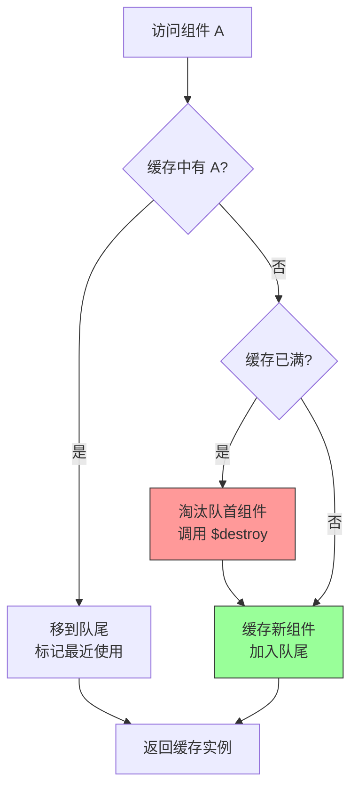

**LRU 算法详解**：

```javascript
/**
 * LRU (Least Recently Used) 缓存淘汰算法
 * 核心思想：最近使用的数据将来更可能被使用
 * 
 * Vue 的 Keep-Alive 使用简化的 LRU：
 * - keys 数组记录访问顺序
 * - 新访问的放最后
 * - 淘汰时取第一个（最久未使用）
 */

// 缓存结构
// cache: { key1: VNode1, key2: VNode2, ... }
// keys: ['key1', 'key2', ...]  // 越靠后越近使用

function pruneCacheEntry(cache, key, keys, current) {
  const cached = cache[key]
  
  if (cached && (!current || cached.tag !== current.tag)) {
    // 销毁组件实例（但不销毁 DOM）
    cached.componentInstance.$destroy()
  }
  
  // 从缓存中移除
  cache[key] = null
  remove(keys, key)
}

// LRU 淘汰示例：
// 假设 max = 3
// 访问顺序: A → B → C → D → A → E
//
// 1. 访问 A: cache={A}, keys=[A]
// 2. 访问 B: cache={A,B}, keys=[A,B]
// 3. 访问 C: cache={A,B,C}, keys=[A,B,C]
// 4. 访问 D: 满! 淘汰 A, cache={B,C,D}, keys=[B,C,D]
// 5. 访问 A: 未命中, 淘汰 B, cache={C,D,A}, keys=[C,D,A]
// 6. 访问 E: 满! 淘汰 C, cache={D,A,E}, keys=[D,A,E]
```

**设计意图**：
- **为什么用数组而不是 Map？** 简单直观，且 keys 数量通常不大（max 一般 < 10）
- **LRU 的适用场景**：Keep-Alive 主要用于 tab 切换等场景，符合时间局部性原理
- **$destroy 而非真正销毁**：只停止组件的响应式更新，保留 DOM 和状态

### 9.3 Transition 过渡动画

**📍 源码位置**：

- `src/platforms/web/components/transition.js:1-200`
- `src/platforms/web/runtime/modules/transition.js:1-150`

```javascript
/**
 * Transition 组件
 * 使用 CSS 过渡或 JavaScript 钩子实现动画
 * 
 * CSS 类名生命周期：
 * 1. v-enter / v-leave：起始状态
 * 2. v-enter-active / v-leave-active：激活状态（过渡过程）
 * 3. v-enter-to / v-leave-to：结束状态
 */

// Transition 组件
export default {
  name: 'transition',
  props: {
    name: String,       // 类名前缀（默认 'v-'）
    appear: Boolean,    // 初始渲染时是否应用
    css: Boolean,       // 是否使用 CSS 过渡
    mode: String,       // out-in / in-out
    duration: [Number, String, Object],
    enterActiveClass: String,
    leaveActiveClass: String,
    // ... 更多 props
  },
  
  render(h) {
    // 获取子节点
    let children = this.$slots.default
    
    if (!children || !children.length) return
    
    // 过滤文本节点，只取第一个元素
    const rawChild = children[0]
    
    // 应用 transition hooks 到子节点 data 上
    const data = (rawChild.data || (rawChild.data = {}))
    data.transition = extractTransitionData(this)
    
    return rawChild
  }
}

/**
 * CSS 过渡类名应用流程
 * 
 * 进入动画：
 * 1. 添加 v-enter + v-enter-active
 * 2. 下一帧：移除 v-enter，添加 v-enter-to
 * 3. transitionend 事件：移除 v-enter-active + v-enter-to
 * 
 * 离开动画：
 * 1. 添加 v-leave + v-leave-active
 * 2. 下一帧：移除 v-leave，添加 v-leave-to
 * 3. transitionend 事件：移除 v-leave-active + v-leave-to
 */

// 运行时过渡模块
export function enter(vnode, toggleDisplay) {
  const el = vnode.elm
  
  // 1. 调用 beforeEnter 钩子
  callHook(el, 'beforeEnter')
  
  // 2. 添加起始类
  addTransitionClass(el, startClass)
  addTransitionClass(el, activeClass)
  
  // 3. 强制 reflow（确保起始样式生效）
  forceReflow()
  
  // 4. 移除起始类，添加结束类
  removeTransitionClass(el, startClass)
  addTransitionClass(el, toClass)
  
  // 5. 调用 enter 钩子
  callHook(el, 'enter')
  
  // 6. 监听过渡结束
  whenTransitionEnds(el, (cancelled) => {
    removeTransitionClass(el, activeClass)
    removeTransitionClass(el, toClass)
    callHook(el, 'afterEnter')
  })
}

export function leave(vnode, rm) {
  const el = vnode.elm
  
  // 1. 调用 beforeLeave 钩子
  callHook(el, 'beforeLeave')
  
  // 2. 添加起始类
  addTransitionClass(el, leaveStartClass)
  addTransitionClass(el, leaveActiveClass)
  
  // 3. 强制 reflow
  forceReflow()
  
  // 4. 移除起始类，添加结束类
  removeTransitionClass(el, leaveStartClass)
  addTransitionClass(el, leaveToClass)
  
  // 5. 调用 leave 钩子
  callHook(el, 'leave')
  
  // 6. 监听过渡结束后移除 DOM
  whenTransitionEnds(el, (cancelled) => {
    removeTransitionClass(el, leaveActiveClass)
    removeTransitionClass(el, leaveToClass)
    rm() // 移除 DOM
    callHook(el, 'afterLeave')
  })
}
```

**JavaScript 钩子示例**：

```html
<transition
  @before-enter="beforeEnter"
  @enter="enter"
  @after-enter="afterEnter"
  @enter-cancelled="enterCancelled"
  @before-leave="beforeLeave"
  @leave="leave"
  @after-leave="afterLeave"
  @leave-cancelled="leaveCancelled"
>
  <div v-if="show">内容</div>
</transition>
```

### 9.4 🎯 手写实现：Mini Keep-Alive LRU

```javascript
/**
 * Mini Keep-Alive with LRU Cache
 * 简化版 Keep-Alive 实现，展示 LRU 缓存算法
 */

class MiniKeepAlive {
  constructor(options = {}) {
    this.include = options.include || null // 白名单
    this.exclude = options.exclude || null // 黑名单
    this.max = options.max || 10           // 最大缓存数
    
    // 缓存存储
    this.cache = new Map() // key → component instance
    this.keys = []         // LRU 顺序记录
  }
  
  /**
   * 获取或创建组件实例
   */
  getOrCreate(componentName, key, factory) {
    // 检查是否应该缓存
    if (!this.shouldCache(componentName)) {
      return factory() // 不缓存，直接创建新实例
    }
    
    // 命中缓存
    if (this.cache.has(key)) {
      console.log(`🎯 命中缓存: ${key}`)
      this.moveToEnd(key) // LRU: 移到最后
      return this.cache.get(key)
    }
    
    // 未命中：创建新实例
    console.log(`❌ 未命中缓存: ${key}`)
    const instance = factory()
    
    // 检查容量
    if (this.keys.length >= this.max) {
      this.evict() // LRU 淘汰
    }
    
    // 加入缓存
    this.cache.set(key, instance)
    this.keys.push(key)
    
    return instance
  }
  
  /**
   * LRU: 将 key 移到最后（标记为最近使用）
   */
  moveToEnd(key) {
    const index = this.keys.indexOf(key)
    if (index > -1) {
      this.keys.splice(index, 1)
      this.keys.push(key)
    }
  }
  
  /**
   * LRU 淘汰最早使用的
   */
  evict() {
    if (this.keys.length === 0) return
    
    const oldestKey = this.keys.shift() // 取出第一个
    const instance = this.cache.get(oldestKey)
    
    console.log(`🗑️ 淘汰缓存: ${oldestKey}`)
    
    // 销毁实例（模拟）
    if (instance && instance.$destroy) {
      instance.$destroy()
    }
    
    this.cache.delete(oldestKey)
  }
  
  /**
   * 检查是否应该缓存
   */
  shouldCache(name) {
    // exclude 优先于 include
    if (this.exclude && this.matches(this.exclude, name)) {
      return false
    }
    if (this.include && !this.matches(this.include, name)) {
      return false
    }
    return true
  }
  
  /**
   * 匹配规则（支持字符串、正则、数组）
   */
  matches(pattern, name) {
    if (typeof pattern === 'string') {
      return pattern.split(',').includes(name)
    }
    if (pattern instanceof RegExp) {
      return pattern.test(name)
    }
    if (Array.isArray(pattern)) {
      return pattern.some(p => this.matches(p, name))
    }
    return false
  }
  
  /**
   * 清空缓存
   */
  clear() {
    console.log('🧹 清空所有缓存')
    this.cache.forEach((instance, key) => {
      if (instance && instance.$destroy) {
        instance.$destroy()
      }
    })
    this.cache.clear()
    this.keys = []
  }
  
  /**
   * 获取缓存状态（调试用）
   */
  getStatus() {
    return {
      size: this.cache.size,
      max: this.max,
      keys: [...this.keys],
      utilization: `${Math.round(this.cache.size / this.max * 100)}%`
    }
  }
}

// ==================== 测试示例 ====================
console.log('===== Mini Keep-Alive LRU 测试 =====')

const keepAlive = new MiniKeepAlive({ max: 3 })

// 模拟组件工厂
let instanceCounter = 0
function createComponent(name) {
  instanceCounter++
  console.log(`  🏭 创建组件实例 ${name} (#${instanceCounter})`)
  return { name, id: instanceCounter, $destroy: () => console.log(`  💥 销毁 ${name}`) }
}

// 场景：Tab 切换
console.log('\n--- 场景：用户浏览 Tab ---')
keepAlive.getOrCreate('Home', 'home', () => createComponent('Home'))
keepAlive.getOrCreate('Profile', 'profile', () => createComponent('Profile'))
keepAlive.getOrCreate('Settings', 'settings', () => createComponent('Settings'))

console.log('\n--- 再次访问 Home（应命中缓存）---')
keepAlive.getOrCreate('Home', 'home', () => createComponent('Home'))

console.log('\n--- 访问 About（应淘汰 Profile）---')
keepAlive.getOrCreate('About', 'about', () => createComponent('About'))

console.log('\n--- 当前缓存状态 ---')
console.log(keepAlive.getStatus())
```

---

## 第10章：nextTick 原理

### 10.1 异步更新队列机制

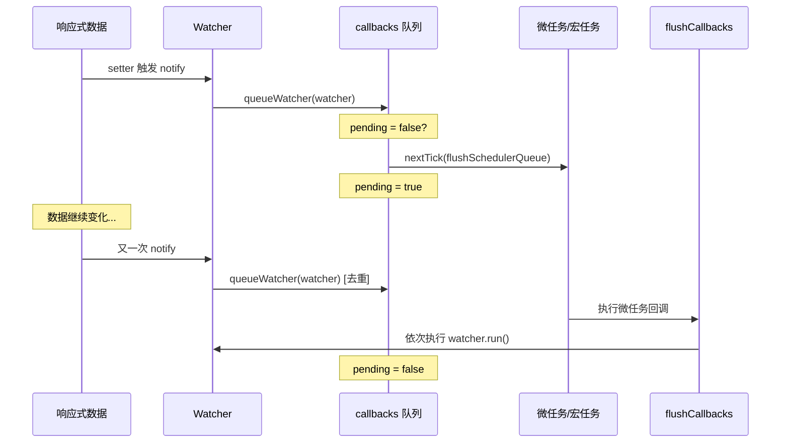

### 10.2 nextTick 源码实现

**📍 源码位置**：
- `src/core/util/next-tick.js:1-100`
- `src/core/observer/scheduler.js:80-150`

```javascript
/**
 * nextTick：将回调延迟到下次 DOM 更新循环之后执行
 * 
 * 核心原理：
 * 1. 使用微任务（Promise/MutationObserver）或宏任务（setImmediate/setTimeout）
 * 2. 维护一个 callbacks 队列，批量处理
 * 3. 使用 pending 锁防止重复创建定时器
 */

const callbacks = [] // 回调队列
let pending = false   // 是否已调度

/**
 * flushCallbacks：刷新回调队列
 * 在微任务/宏任务中执行
 */
function flushCallbacks() {
  pending = false
  const copies = callbacks.slice(0) // 复制一份（防止执行过程中修改）
  callbacks.length = 0              // 清空原队列
  
  // 依次执行所有回调
  for (let i = 0; i < copies.length; i++) {
    copies[i]()
  }
}

/**
 * timerFunc：异步执行函数
 * 根据环境选择最优的异步方案
 */
let timerFunc

// 优先级1: Promise（微任务）
if (typeof Promise !== 'undefined' && isNative(Promise)) {
  const p = Promise.resolve()
  timerFunc = () => {
    p.then(flushCallbacks)
    // iOS WebView 中 Promise.then 需要强制触发
    if (isIOS) setTimeout(noop)
  }
}
// 优先级2: MutationObserver（微任务）
else if (!isIE && typeof MutationObserver !== 'undefined' && (
  isNative(MutationObserver) ||
  MutationObserver.toString() === '[object MutationObserverConstructor]'
)) {
  let counter = 1
  const observer = new MutationObserver(flushCallbacks)
  const textNode = document.createTextNode(String(counter))
  observer.observe(textNode, { characterData: true })
  timerFunc = () => {
    counter = (counter + 1) % 2
    textNode.data = String(counter)
  }
}
// 优先级3: setImmediate（宏任务）
else if (typeof setImmediate !== 'undefined') {
  timerFunc = () => {
    setImmediate(flushCallbacks)
  }
}
// 兜底: setTimeout（宏任务）
else {
  timerFunc = () => {
    setTimeout(flushCallbacks, 0)
  }
}

/**
 * nextTick：暴露给用户的 API
 */
export function nextTick(cb?: Function, ctx?: Object) {
  let _resolve
  
  // 将回调加入队列
  callbacks.push(() => {
    if (cb) {
      try {
        cb.call(ctx)
      } catch (e) {
        handleError(e, ctx, 'nextTick')
      }
    } else if (_resolve) {
      _resolve(ctx)
    }
  })
  
  // 如果还未调度，启动异步任务
  if (!pending) {
    pending = true
    timerFunc()
  }
  
  // 支持 Promise 用法：this.$nextTick().then(...)
  if (!cb && typeof Promise !== 'undefined') {
    return new Promise(resolve => {
      _resolve = resolve
    })
  }
}
```

**逐行注释**：

1. **callbacks 队列**：收集所有需要异步执行的回调
2. **pending 锁**：确保同一事件循环内只创建一次异步任务
3. **flushCallbacks**：先复制数组再遍历，避免执行过程中的副作用影响
4. **降级策略**：Promise → MutationObserver → setImmediate → setTimeout

### 10.3 微任务降级策略详解

```javascript
/**
 * 异步 API 优先级及兼容性
 * 
 * | API          | 类型     | 延迟 | 浏览器支持         |
 * |--------------|----------|------|-------------------|
 * | Promise      | 微任务   | ~0ms | 现代浏览器        |
 * | MutationObserver| 微任务| ~0ms | IE11+             |
 * | setImmediate | 宏任务   | ~0ms | IE/Node.js       |
 * | setTimeout   | 宏任务   | ~4ms | 所有浏览器        |
 * 
 * 为什么优先用微任务？
 * - 微任务在当前宏任务结束后立即执行
 * - 比 setTimeout 更快（setTimeout 有最小 4ms 延迟）
 * - 用户看到的数据更新更及时
 */

// 各环境的检测方法
const isIOS = /iphone|ipad|ipod/i.test(navigator.userAgent)

function isNative(Ctor) {
  return typeof Ctor === 'function' /native code/.test(Ctor.toString())
}
```

**设计意图**：
- **为什么用微任务？** DOM 更新后立即执行回调，用户感知更流畅
- **为什么 iOS 特殊处理？** iOS 的 Promise.then 在某些情况下不会触发微任务
- **为什么复制数组？** 防止 flush 过程中新加入的回调导致无限循环

### 10.4 queueWatcher — 调度器核心

**📍 源码位置**：`src/core/observer/scheduler.js:80-150`

```javascript
/**
 * queueWatcher：将 Watcher 加入更新队列
 * 实现去重和排序
 */
export function queueWatcher(watcher: Watcher) {
  const id = watcher.id
  
  // 🔑 去重：同一 Watcher 只入队一次
  if (has[id] == null) {
    has[id] = true
    
    // 加入队列
    if (!flushing) {
      // 未在刷新中：直接 push
      queue.push(watcher)
    } else {
      // 正在刷新中：插队（因为可能触发了新的依赖收集）
      let i = queue.length - 1
      while (i > index && queue[i].id > watcher.id) {
        i--
      }
      queue.splice(i + 1, 0, watcher)
    }
    
    // 启动异步刷新
    if (!waiting) {
      waiting = true
      
      if (process.env.NODE_ENV !== 'production' && !config.async) {
        // 同步模式：测试用
        flushSchedulerQueue()
        return
      }
      
      // 🔑 核心：使用 nextTick 批量刷新
      nextTick(flushSchedulerQueue)
    }
  }
}

/**
 * flushSchedulerQueue：刷新 Watcher 队列
 * 按顺序执行所有待更新的 Watcher
 */
function flushSchedulerQueue() {
  flushing = true
  currentFlushIndex = 0
  
  // 排序：确保父组件先于子组件、用户 Watcher 先于渲染 Watcher
  queue.sort((a, b) => a.id - b.id)
  
  // 依次执行
  for (; currentFlushIndex < queue.length; currentFlushIndex++) {
    const watcher = queue[currentFlushIndex]
    
    // 执行 before 钩子（beforeUpdate 生命周期）
    if (watcher.before) {
      watcher.before()
    }
    
    // 获取 id 用于检查是否还在活跃状态
    const id = watcher.id
    has[id] = null
    
    // 执行 Watcher
    watcher.run()
    
    // 开发环境：检查是否触发了无限循环
    if (has[id] != null) {
      circular[id] = (circular[id] || 0) + 1
      if (circular[id] > MAX_UPDATE_COUNT) {
        warn(
          'You may have an infinite update loop ' +
          `(watcher with id "${id}")`,
          watcher.vm
        )
        break
      }
    }
  }
  
  // 重置状态
  resetSchedulerState()
  
  // 组件 updated 钩子
  callUpdatedHooks(updatedQueue)
}
```

**设计意图**：
- **去重的意义**：同一个 data 变化可能触发多个 Watcher，但每个 Watcher 只需更新一次
- **排序的意义**：父组件先更新，避免子组件重复渲染；用户 watch 先执行，保证数据最新
- **MAX_UPDATE_COUNT**：默认 100，超过则警告可能的无限循环

### 10.5 🎯 手写实现：Mini-nextTick

```javascript
/**
 * Mini NextTick Implementation
 * 简化版 nextTick 实现
 */

class MiniNextTick {
  constructor() {
    this.callbacks = []
    this.pending = false
    
    // 选择异步方案
    this.timerFunc = this.detectTimerFunc()
  }
  
  /**
   * 检测可用的异步 API
   */
  detectTimerFunc() {
    // 优先使用 Promise
    if (typeof Promise !== 'undefined') {
      console.log('📌 使用 Promise (微任务)')
      return () => {
        Promise.resolve().then(() => this.flush())
      }
    }
    
    // 兜底使用 setTimeout
    console.log('📌 使用 setTimeout (宏任务)')
    return () => {
      setTimeout(() => this.flush(), 0)
    }
  }
  
  /**
   * 将回调加入队列
   */
  nextTick(callback, context) {
    // 包装回调
    const wrappedCallback = () => {
      callback.call(context)
    }
    
    this.callbacks.push(wrappedCallback)
    
    // 如果未调度，启动异步任务
    if (!this.pending) {
      this.pending = true
      this.timerFunc()
    }
    
    // 支持 Promise 用法
    if (!callback) {
      return new Promise(resolve => {
        resolve.call(context)
      })
    }
  }
  
  /**
   * 刷新队列
   */
  flush() {
    this.pending = false
    
    // 复制并清空
    const copies = this.callbacks.slice(0)
    this.callbacks.length = 0
    
    // 执行所有回调
    copies.forEach(cb => {
      try {
        cb()
      } catch (error) {
        console.error('nextTick callback error:', error)
      }
    })
  }
}

// ==================== 测试示例 ====================
console.log('===== Mini NextTick 测试 =====')

const miniNextTick = new MiniNextTick()

console.log('\n--- 同步代码 ---')
console.log('1. 同步开始')

miniNextTick.nextTick(() => {
  console.log('3. 第一个 nextTick 回调')
})

miniNextTick.nextTick(() => {
  console.log('4. 第二个 nextTick 回调')
})

console.log('2. 同步结束')

// 模拟 Vue 的批量更新
console.log('\n--- 模拟 Vue 数据更新 ---')
const updates = []

function batchUpdate(key, value) {
  console.log(`  📝 设置 ${key} = ${value}`)
  updates.push({ key, value })
  
  miniNextTick.nextTick(() => {
    console.log(`  ✅ 批量更新 DOM:`, updates)
    updates.length = 0 // 清空
  })
}

batchUpdate('name', 'Vue2')
batchUpdate('version', '2.6.14')
batchUpdate('year', '2020')

console.log('同步代码执行完毕，等待异步...')
```

---

## 第11章：Vue Router 源码

### 11.1 路由架构总览

**📍 源码位置**：`vue-router/src/index.js:1-50`

```javascript
/**
 * Vue Router 架构
 * 
 * 核心组件：
 * 1. Router 类：路由实例，管理路由状态
 * 2. History 类：管理历史记录（hash/history/abstract）
 * 3. RouteRecord：路由记录（匹配规则）
 * 4. Matcher：路由匹配器
 * 5. 导航守卫系统
 */

// 安装插件
VueRouter.install = function install(Vue) {
  // 注册全局组件
  Vue.component('RouterView', View)
  Vue.component('RouterLink', Link)
  
  // 混入生命周期钩子
  Vue.mixin({
    beforeCreate() {
      if (this.$options.router) {
        // 根组件：保存 router 实例
        this._routerRoot = this
        this._router = this.$options.router
        this._router.init(this)
      } else {
        // 子组件：向上查找
        this._routerRoot = (this.$parent && this.$parent._routerRoot) || this
      }
      
      // 定义响应式的 $route
      defineReactive(this, '_route', this._router.history.current)
    }
  })
  
  // 添加 $router 和 $route
  Object.defineProperty(Vue.prototype, '$router', {
    get() { return this._routerRoot._router }
  })
  
  Object.defineProperty(Vue.prototype, '$route', {
    get() { return this._routerRoot._route }
  })
}
```

### 11.2 Hash vs History 实现

**📍 源码位置**：

- Hash 模式：`vue-router/src/history/hash.js:1-150`
- History 模式：`vue-router/src/history/html5.js:1-200`
- Abstract 模式：`vue-router/src/history/abstract.js:1-50`

```javascript
/**
 * HashHistory：基于 URL hash (#) 的路由
 * 
 * 优点：无需服务器配置，兼容性好
 * 缺点：URL 不美观，SEO 不友好
 * 
 * 工作原理：
 * 监听 hashchange 事件，解析 # 后面的路径
 */
class HashHistory extends History {
  constructor(router, base) {
    super(router, base)
    
    // 确保 hash 以 / 开头
    ensureSlash()
  }
  
  // 设置当前路由
  setupListeners() {
    // 监听 hash 变化
    window.addEventListener('hashchange', () => {
      // hashchange 时触发 transitionTo
      this.transitionTo(getHash(), route => {
        replaceHash(route.fullPath)
      })
    })
  }
  
  // 推进新路由
  push(location, onComplete, onAbort) {
    this.transitionTo(location, route => {
      window.location.hash = route.fullPath
      onComplete && onComplete(route)
    }, onAbort)
  }
  
  // 替换当前路由
  replace(location, onComplete, onAbort) {
    this.transitionTo(location, route => {
      replaceHash(route.fullPath)
      onComplete && onComplete(route)
    }, onAbort)
  }
}
/**
 * HTML5History：基于 history API 的路由
 * 
 * 优点：URL 美观，SEO 友好
 * 缺点：需要服务器配置 fallback，IE9 不支持
 * 
 * 工作原理：
 * 使用 pushState/replaceState 改变 URL（不刷新页面）
 * 监听 popstate 事件处理后退/前进
 */
class HTML5History extends History {
  constructor(router, base) {
    super(router, base)
    
    // 初始滚动位置
    const startLocation = getLocation(this.base)
    
    // 监听 popstate（后退/前进按钮）
    window.addEventListener('popstate', e => {
      const current = this.current
      this.transitionTo(getLocation(this.base), route => {
        this.ensureURL()
        
        // 处理滚动行为
        router.handlers.forEach(handler => {
          handler(current, route, {
            popstate: true,
            direction: getScrollDirection(current, route)
          })
        })
      })
    })
  }
  
  push(location, onComplete, onAbort) {
    const { current: fromRoute } = this
    
    this.transitionTo(location, route => {
      pushState(cleanPath(this.base + route.fullPath))
      
      handleScroll(this.router, route, fromRoute, false)
      onComplete && onComplete(route)
    }, onAbort)
  }
  
  replace(location, onComplete, onAbort) {
    const { current: fromRoute } = this
    
    this.transitionTo(location, route => {
      replaceState(cleanPath(this.base + route.fullPath))
      
      handleScroll(this.router, route, fromRoute, false)
      onComplete && onComplete(route)
    }, onAbort)
  }
}
/**
 * AbstractHistory：内存中的历史记录
 * 用于 Node.js 环境或非浏览器环境
 */
class AbstractHistory extends History {
  constructor(router, base) {
    super(router, base)
    this.stack = []       // 历史栈
    this.index = -1       // 当前位置
  }
  
  push(location, onComplete, onAbort) {
    this.transitionTo(location, route => {
      this.stack = this.stack.slice(0, this.index + 1).concat(route)
      this.index++
      onComplete && onComplete(route)
    }, onAbort)
  }
  
  replace(location, onComplete, onAbort) {
    this.transitionTo(location, route => {
      this.stack = this.stack.slice(0, this.index).concat(route)
      onComplete && onComplete(route)
    }, onAbort)
  }
}
```

### 11.3 路由匹配算法

**📍 源码位置**：`vue-router/src/create-matcher.js:1-100`

```javascript
/**
 * createMatcher：创建路由匹配器
 * 负责根据 URL 匹配对应的路由记录
 */
export function createMatcher(routes, router) {
  // 创建路由映射表
  const { pathList, pathMap, nameMap } = createRouteMap(routes)
  
  // 添加动态路由的方法
  function addRoutes(routes) {
    createRouteMap(routes, pathList, pathMap, nameMap)
  }
  
  // 核心匹配函数
  function match(raw, currentRoute, redirectedFrom) {
    location = normalizeLocation(raw, currentRoute, false, router)
    
    // 按 name 匹配
    if (location.name) {
      const record = nameMap[location.name]
      if (!record) return _createRoute(null, location)
      
      const paramNames = getParams(record.path)
      const params = Object.assign({}, location.params, ...)
      const newPath = fillParams(record.path, params, `named route "${location.name}"`)
      
      return _createRoute(record, location, redirectedFrom, location)
    }
    
    // 按 path 匹配
    if (location.path) {
      const params = []
      const record = pathMatch(pathList, pathMap, location.path, params)
      
      if (record) {
        location.params = objectAssign({}, location.params, params)
        return _createRoute(record, location, redirectedFrom, location)
      }
    }
    
    // 无匹配
    return _createRoute(null, location)
  }
  
  return {
    match,
    addRoutes,
    getRoutes,
    addRoute
  }
}

/**
 * pathMatch：路径匹配算法
 * 支持：
 * - 静态路径：/home
 * - 动态参数：/user/:id
 * - 可选参数：/user/:id?
 * - 通配符：* 或 /user-*
 */
function pathMatch(pathList, pathMap, path, params) {
  let matched = null
  let maxDepth = 0
  
  // 从最长路径开始匹配（更具体优先）
  for (let i = 0; i < pathList.length; i++) {
    const record = pathMap[pathList[i]]
    
    if (record.regex.test(path)) {
      // 提取参数
      const m = path.match(record.regex)
      const keys = record.keys
      const paramValues = {}
      
      for (let j = 1; j < m.length; j++) {
        const key = keys[j - 1]
        if (key) {
          paramValues[key.name] = m[j]
        }
      }
      
      // 选择嵌套最深的匹配
      if (record.path.length > maxDepth) {
        maxDepth = record.path.length
        matched = {
          record,
          params: paramValues,
          path
        }
      }
    }
  }
  
  return matched
}
```

### 11.4 导航守卫链路

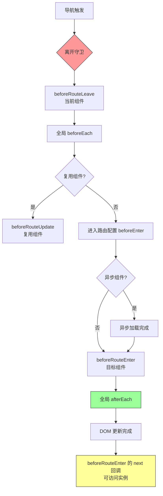

**📍 源码位置**：`vue-router/src/history/base.js:200-350`

```javascript
/**
 * transitionTo：导航的核心方法
 * 执行完整的导航流程，包括守卫调用
 */
History.prototype.transitionTo = function(location, onComplete, onAbort) {
  const route = this.router.match(location, this.current)
  
  // 确认导航
  this.confirmTransition(
    route,
    () => {
      // 更新当前路由
      this.updateRoute(route)
      
      // 调用 afterEach hooks
      onComplete && onComplete(route)
      
      // 更新 URL（如果需要）
      this.ensureURL()
      
      // 只对 push 操作触发 scrollBehavior
      if (this.router.app) {
        this.router.app.$nextTick(() => {
          handleScroll(this.router, route, this.current, true)
        })
      }
    },
    err => {
      if (onAbort) {
        onAbort(err)
      }
      if (err && !this._started) {
        this.onError(err)
      }
    }
  )
}

/**
 * confirmTransition：确认导航（执行守卫）
 * 按顺序调用各类导航守卫
 */
History.prototype.confirmTransition = function(route, onComplete, onAbort) {
  const current = this.current
  
  // 阻止重复导航到相同位置
  if (isSameRoute(route, current)) {
    this.ensureUrl(true)
    return abort(createNavigationDuplicatedError(current, route))
  }
  
  // 解析队列
  const { updated, deactivated, activated } = resolveQueue(current.matched, route.matched)
  
  const queue = [].concat(
    // 1. 当前组件的 leave 守卫
    extractLeaveGuards(deactivated),
    
    // 2. 全局 beforeEach 守卫
    this.router.beforeHooks,
    
    // 3. 复用组件的 update 守卫
    extractUpdateHooks(updated),
    
    // 4. 进入路由的 beforeEnter 配置
    activated.map(m => m.beforeEnter),
    
    // 5. 异步组件
    resolveAsyncComponents(activated).map(c => {
      c.beforeRouteEnter ? (...args) => c.beforeRouteEnter(...args) : undefined
    }),
    
    // 6. 目标组件的 enter 守卫
    extractEnterGuards(activated)
  )
  
  // 迭代执行队列
  runQueue(queue, (hook, toNext) => {
    hook(route, current, toNext => {
      if (toNext === false) {
        this.ensureUrl(true)
        abort(createNavigationAbortedError(route, current))
      } else if (isError(toNext)) {
        this.ensureUrl(true)
        abort(toNext)
      } else if (
        typeof toNext === 'string' ||
        (typeof toNext === 'object' && (toNext.path || toNext.name))
      ) {
        // 重定向
        abort(createNavigationRedirectedError(route, current))
        if (typeof toNext === 'object' && toNext.replace) {
          this.replace(toNext)
        } else {
          this.push(toNext)
        }
      } else {
        // 继续下一个
        toNext()
      }
    })
  },
  // 全部完成
  () => {
    const postEnterCbs = []
    const isValid = () => this.current === route
    
    // 等待 DOM 更新后调用 beforeRouteEnter 的 next(vm) 回调
    const enterGuards = extractEnterGuards(activated, postEnterCbs, isValid)
    
    runQueue(enterGuards, (hook, toNext) => {
      hook(route, current, toNext)
    },
    () => {
      // 完成
      onComplete()
      
      // DOM 更新后执行 postEnterCbs
      if (this.router.app) {
        this.router.app.$nextTick(() => {
          postEnterCbs.forEach(cb => cb())
        })
      }
    })
  })
}
```

**导航守卫执行顺序总结**：

| 序号 | 守卫类型 | 触发时机 | 参数 |
|-----|---------|---------|------|
| 1 | beforeRouteLeave | 离开当前组件 | to, from, next |
| 2 | beforeEach | 全局前置 | to, from, next |
| 3 | beforeRouteUpdate | 组件复用时 | to, from, next |
| 4 | beforeEnter | 路由配置 | to, from, next |
| 5 | 解析异步组件 | - | - |
| 6 | beforeRouteEnter | 进入目标组件 | to, from, next |
| 7 | afterEach | 全局后置 | to, from |

**设计意图**：
- **为什么有这么多守卫？** 不同粒度的控制需求：全局（权限）、路由（验证）、组件（数据获取）
- **beforeRouteEnter 特殊性**：此时组件还没创建，不能访问 `this`。通过 `next(callback)` 可以在创建后访问实例
- **runQueue 的作用**：串行执行队列，每个守卫可以决定是继续、取消还是重定向

---

## 第12章：Vuex 源码

### 12.1 Vuex 数据流循环图

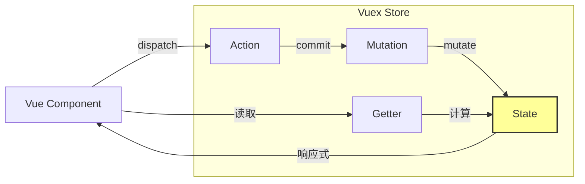

### 12.2 Store 构造与初始化

**📍 源码位置**：`src/store.js:1-150`

```javascript
/**
 * Vuex Store 类
 * 集中管理应用的所有状态
 */
export class Store {
  constructor(options = {}) {
    // ========== 自动安装 ==========
    if (!Vue && typeof window !== 'undefined' && window.Vue) {
      install(window.Vue)
    }

    // ========== 内部状态 ==========
    this._options = options
    this._committing = false // 是否正在提交 mutation
    this._actions = Object.create(null)  // actions 映射表
    this._actionSubscribers = []
    this._mutations = Object.create(null) // mutations 映射表
    this._wrappedGetters = Object.create(null) // getters 包装函数
    this._modules = new ModuleCollection(options) // 模块树
    this._modulesNamespaceMap = Object.create(null) // 命名空间映射
    this._subscribers = [] // mutation 订阅者
    this._watcherVM = new Vue() // 用于响应式 $watch

    // ========== 绑定 dispatch 和 commit ==========
    const store = this
    const { dispatch, commit } = this
    
    this.dispatch = function boundDispatch(type, payload) {
      return dispatch.call(store, type, payload)
    }
    
    this.commit = function boundCommit(type, payload, options) {
      return commit.call(store, type, payload, options)
    }

    // ========== 严格模式 ==========
    this.strict = options.strict || false

    // ========== 安装模块 ==========
    const state = this._modules.root.state
    
    // 安装根模块和所有子模块
    installModule(this, state, [], this._modules.root)

    // 初始化 store vm（响应式）
    resetStoreVM(this, state)

    // ========== 插件 ==========
    if (options.plugins) {
      options.plugins.forEach(plugin => plugin(this))
    }
  }
}
```

### 12.3 State 响应式化

**📍 源码位置**：`src/store.js:250-300`

```javascript
/**
 * resetStoreVM：将 state 变为响应式
 * 核心原理：利用 Vue 实例的 data 是响应式的特性
 */
function resetStoreVM(store, state) {
  const oldVm = store._vm

  // 设置 getters
  store.getters = {}
  
  const wrappedGetters = store._wrappedGetters
  const computed = {}
  
  // 遍历所有 getter，定义为计算属性
  forEachValue(wrappedGetters, (fn, key) => {
    // 使用 Object.defineProperty 拦截
    computed[key] = partial(fn, store)
    Object.defineProperty(store.getters, key, {
      get: () => store._vm[key],
      enumerable: true
    })
  })

  // 🔑 关键：使用静默的 Vue 实例存储 state
  // 这样 state 自动变成响应式的
  store._vm = new Vue({
    data: {
      $$state: state // 使用 $$state 避免 Vue 警告
    },
    computed
  })

  // 严格模式下启用严格监听
  if (store.strict) {
    enableStrictMode(store)
  }
}

/**
 * enableStrictMode：严格模式
 * 在 mutation 外部修改 state 时发出警告
 */
function enableStrictMode(store) {
  store._vm.$watch(function () {
    return this._data.$$state
  }, () => {
    if (store._committing) {
      return
    }
    
    // 非mutation方式修改state，发出警告
    if (process.env.NODE_ENV !== 'production') {
      console.warn(
        '[vuex] do not mutate vuex store state outside mutation handlers.'
      )
    }
  }, { deep: true, sync: true })
}
```

**设计意图**：
- **为什么用 Vue 实例存储 state？** 复用 Vue 的响应式系统，无需自己实现
- **$$state 前缀？** 避免与 Vue 内部属性冲突，同时告诉开发者"这是内部属性"
- **严格模式的意义？** 确保所有状态变更都是可追踪的，便于调试

### 12.4 Commit 与 Dispatch

**📍 源码位置**：`src/store.js:150-230`

```javascript
/**
 * commit：提交 mutation
 * 同步操作，唯一允许修改 state 的方式
 */
Store.prototype.commit = function (_type, _payload, _options) {
  const store = this
  const { type, payload, options } = unifyObjectStyle(_type, _payload, _options)
  
  const entry = this._mutations[type]
  
  if (!entry) {
    console.error(`[vuex] unknown mutation type: ${type}`)
    return
  }
  
  // 准备订阅者参数
  const mutation = { type, payload }
  
  // 🔑 标记正在提交（用于严格模式判断）
  this._committing = true
  
  // 调用所有注册的 mutation handler（包括命名空间模块的）
  entry.forEach(function commitIterator(handler) {
    handler(payload)
  })
  
  this._committing = false
  
  // 通知订阅者（如 devtools）
  this._subscribers.forEach(sub => sub(mutation, store.state))
  
  if (
    process.env.NODE_ENV !== 'production' &&
    options && options.silent
  ) {
    console.warn(
      `[vuex] silent option has been removed. ` +
      `Use the plugin functionality instead.`
    )
  }
}

/**
 * dispatch：分发 action
 * 可以是异步操作，通过 commit 提交 mutation
 */
Store.prototype.dispatch = function (_type, _payload) {
  const store = this
  const { type, payload } = unifyObjectStyle(_type, _payload)
  
  const entry = this._actions[type]
  
  if (!entry) {
    console.error(`[vuex] unknown action type: ${type}`)
    return
  }
  
  // action 可以返回 Promise
  const result = entry.length > 1
    ? Promise.all(entry.map(handler => handler(payload)))
    : entry[0](payload)
  
  // 返回 Promise，支持链式调用
  return new Promise((resolve, reject) => {
    result.then(res => {
      try {
        // 通知 action 订阅者
        store._actionSubscribers.forEach(sub => sub({ type, payload }, res))
      } finally {
        resolve(res)
      }
    }, error => {
      try {
        store._actionSubscribers.forEach(sub => sub({ type, payload }, undefined, error))
      } finally {
        reject(error)
      }
    })
  })
}
```

**Mutation vs Action 对比**：

| 特性 | Mutation | Action |
|-----|----------|--------|
| 目的 | 修改 state | 提交 mutation |
| 同步/异步 | 必须同步 | 可以异步 |
| 直接修改 state | ✅ | ❌ |
| 返回值 | 无 | Promise |
| 调试追踪 | 可追踪 | 间接追踪 |
| 用法 | `commit('xxx')` | `dispatch('xxx')` |

### 12.5 模块系统（Modules）

**📍 源码位置**：`src/module/module-collection.js:1-100`

```javascript
/**
 * ModuleCollection：模块集合
 * 将用户配置的 modules 选项转换为树形结构
 * 支持命名空间嵌套
 */
export default class ModuleCollection {
  constructor(rawRootModule) {
    // 注册根模块
    this.register([], rawRootModule, false)
  }

  /**
   * register：递归注册模块
   * @param path 路径数组（如 ['parent', 'child']）
   * @param rawModule 原始模块定义
   * @param runtime 是否运行时添加
   */
  register(path, rawModule, runtime = true) {
    // 断言模块格式正确
    if (process.env.NODE_ENV !== 'production') {
      assertRawModule(path, rawModule)
    }

    const newModule = new Module(rawModule, runtime)

    if (path.length === 0) {
      // 根模块
      this.root = newModule
    } else {
      // 子模块：找到父模块并添加
      const parent = this.get(path.slice(0, -1))
      parent.addChild(path[path.length - 1], newModule)
    }

    // 递归注册嵌套模块
    if (rawModule.modules) {
      forEachValue(rawModule.modules, (rawChildModule, key) => {
        this.register(path.concat(key), rawChildModule, runtime)
      })
    }
  }
}

/**
 * installModule：安装模块到 store
 * 处理命名空间、state/getter/mutation/action 的注册
 */
function installModule(store, rootState, path, module, hot) {
  const isRoot = !path.length
  const namespace = store._modules.getNamespace(path)

  // 注册命名空间映射
  if (module.namespaced) {
    store._modulesNamespaceMap[namespace] = module
  }

  // 注册 state
  if (!isRoot) {
    const parentState = getNestedState(rootState, path.slice(0, -1))
    const moduleName = path[path.length - 1]
    
    // 使用 Vue.set 确保响应式
    store._withCommit(() => {
      Vue.set(parentState, moduleName, module.state)
    })
  }

  // 注册上下文（包含 dispatch/commit/getter/state 的局部版本）
  const local = module.context = makeLocalContext(store, namespace, path)

  // 注册 mutations
  module.forEachMutation((mutation, key) => {
    const namespacedType = namespace + key
    registerMutation(store, namespacedType, mutation, local)
  })

  // 注册 actions
  module.forEachAction((action, key) => {
    const type = action.root ? key : namespace + key
    registerAction(store, type, action, local)
  })

  // 注册 getters
  module.forEachGetter((getter, key) => {
    const namespacedType = namespace + key
    registerGetter(store, namespacedType, getter, local)
  })

  // 递归安装子模块
  module.forEachChild((child, key) => {
    installModule(store, rootState, path.concat(key), child, hot)
  })
}
```

**命名空间的作用**：

```javascript
// 不使用命名空间
const store = new Vuex.Store({
  modules: {
    user: {
      state: { name: 'Alice' },
      mutations: {
        setName(state, payload) { ... }
      }
    }
  }
})
// 访问：store.state.user.name
// 调用：store.commit('setName')  // 全局命名空间
// 使用命名空间
const store = new Vuex.Store({
  modules: {
    user: {
      namespaced: true,
      state: { name: 'Alice' },
      mutations: {
        setName(state, payload) { ... }
      }
    }
  }
})
// 访问：store.state.user.name  （不变）
// 调用：store.commit('user/setName')  // 带命名空间前缀
```

**设计意图**：
- **命名空间的必要性**：大型应用中不同模块可能有同名 mutation/action，命名空间避免冲突
- **local context**：让模块内的 dispatch/commit/getter 默认带命名空间前缀，简化模块内部代码

### 12.6 辅助函数实现

**📍 源码位置**：`src/helpers.js:1-150`

```javascript
/**
 * mapState：将 state 映射为计算属性
 */
export const mapState = normalizeNamespace((namespace, states) => {
  const res = {}
  
  if (__DEV__ && !isValidMap(states)) {
    console.error('[vuex] mapState: mapper parameter must be either an Array or an Object')
  }
  
  normalizeMap(states).forEach(({ key, val }) => {
    res[key] = function mappedState() {
      let state = this.$store.state
      let getters = this.$store.getters
      
      // 如果指定了命名空间
      if (namespace) {
        const module = getModuleByNamespace(this.$store, 'mapState', namespace)
        if (!module) return
        state = module.context.state
        getters = module.context.getters
      }
      
      return typeof val === 'function'
        ? val.call(this, state, getters)  // 函数形式
        : state[val]                       // 字符串形式
    }
  })
  
  return res
})

/**
 * mapGetters：将 getter 映射为计算属性
 */
export const mapGetters = normalizeNamespace((namespace, getters) => {
  const res = {}
  
  normalizeMap(getters).forEach(({ key, val }) => {
    val = namespace + val  // 加上命名空间前缀
    res[key] = function mappedGetter() {
      if (namespace && !getModuleByNamespace(this.$store, 'mapGetters', namespace)) {
        return
      }
      return this.$store.getters[val]
    }
  })
  
  return res
})

/**
 * mapMutations：将 mutation 映射为方法
 */
export const mapMutations = normalizeNamespace((namespace, mutations) => {
  const res = {}
  
  normalizeMap(mutations).forEach(({ key, val }) => {
    val = namespace + val
    res[key] = function mappedMutation(...args) {
      if (namespace && !getModuleByNamespace(this.$store, 'mapMutations', namespace)) {
        return
      }
      return this.$store.commit.apply(this.$store, [val].concat(args))
    }
  })
  
  return res
})

/**
 * mapActions：将 action 映射为方法
 */
export const mapActions = normalizeNamespace((namespace, actions) => {
  const res = {}
  
  normalizeMap(actions).forEach(({ key, val }) => {
    val = namespace + val
    res[key] = function mappedAction(...args) {
      if (namespace && !getModuleByNamespace(this.$store, 'mapActions', namespace)) {
        return
      }
      return this.$store.dispatch.apply(this.$store, [val].concat(args))
    }
  })
  
  return res
})

/**
 * normalizeNamespace：统一处理命名空间参数
 * 支持两种用法：
 * 1. mapState({ a: state => state.a })           // 无命名空间
 * 2. mapState('some/module', { a: state => ... }) // 有命名空间
 */
function normalizeNamespace(fn) {
  return (namespace, map) => {
    if (typeof namespace !== 'string') {
      map = namespace
      namespace = ''
    } else if (namespace.charAt(namespace.length - 1) !== '/') {
      namespace += '/'
    }
    return fn(namespace, map)
  }
}
```

**使用示例**：

```javascript
// 在组件中使用
import { mapState, mapGetters, mapMutations, mapActions } from 'vuex'

export default {
  computed: {
    // 对象形式
    ...mapState({
      userName: state => state.user.name,
      userId: 'user.id'  // 字符串简写
    }),
    
    // 数组形式（简单场景）
    ...mapState(['count']),
    ...mapGetters(['doneTodos'])
  },
  
  methods: {
    ...mapMutations([
      'increment',  // 将 this.increment() 映射为 this.$store.commit('increment')
      'decrement'
    ]),
    
    ...mapActions({
      fetchUser: 'user/fetch'  // 映射到命名空间 action
    })
  }
}
```

---

## 附录A：Vue2 源码调试指南

### A.1 推荐断点位置表

| 调试目的 | 文件 | 行号范围 | 说明 |
|---------|------|---------|------|
| **响应式入门** | `core/observer/index.js` | 135-185 | defineReactive 函数 |
| **依赖收集** | `core/observer/dep.js` | 20-30 | depend() 方法 |
| **派发更新** | `core/observer/dep.js` | 35-45 | notify() 方法 |
| **Watcher 创建** | `core/observer/watcher.js` | 70-90 | constructor |
| **Watcher 求值** | `core/observer/watcher.js` | 100-130 | get() 方法 |
| **组件初始化** | `core/instance/init.js` | 15-60 | _init 方法 |
| **$mount 入口** | `platforms/web/entry-runtime-with-compiler.js` | 10-30 | $mount 增强 |
| **模板编译** | `compiler/index.js` | 10-25 | baseCompile |
| **Parse 阶段** | `parser/html-parser.js` | 50-100 | parseHTML |
| **Codegen 阶段** | `codegen/index.js` | 30-60 | generate |
| **虚拟 DOM 创建** | `core/vdom/vnode.js` | 1-40 | VNode 构造函数 |
| **Patch 算法** | `core/vdom/patch.js` | 50-100 | patch 函数 |
| **Diff 算法** | `core/vdom/patch.js` | 450-600 | updateChildren |
| **nextTick** | `core/util/next-tick.js` | 50-80 | nextTick 函数 |
| **调度器** | `core/observer/scheduler.js` | 80-120 | queueWatcher |
| **Keep-Alive** | `core/components/keep-alive.js` | 80-140 | render 方法 |
| **计算属性** | `core/instance/state.js` | 220-270 | initComputed |
| **侦听器** | `core/instance/state.js` | 290-340 | initWatch |

### A.2 调试技巧

#### 技巧1：观察依赖收集过程

```javascript
// 在 Dep.depend() 中打断点
// 查看 Dep.target 是哪个 Watcher
// 查看当前 dep.subs 收集了哪些 Watcher
depend() {
  debugger // 在此处打断点
  if (Dep.target) {
    Dep.target.addDep(this)
  }
}
```

#### 技巧2：跟踪派发更新

```javascript
// 在 notify() 中打断点
// 查看哪些 Watcher 被通知更新
notify() {
  debugger // 在此处打断点
  const subs = this.subs.slice()
  for (let i = 0; i < subs.length; i++) {
    subs[i].update()
  }
}
```

#### 技巧3：查看虚拟 DOM 结构

```javascript
// 在 patchVnode 或 updateChildren 中打断点
// 查看 oldVnode 和 newVnode 的完整结构
console.log('oldVnode:', JSON.stringify(oldVnode, null, 2))
console.log('newVnode:', JSON.stringify(newVnode, null, 2))
```

#### 技巧4：监控 nextTick 队列

```javascript
// 在 flushCallbacks 中打断点
// 查看当前有哪些回调等待执行
function flushCallbacks() {
  debugger
  pending = false
  const copies = callbacks.slice(0)
  console.log('待执行的回调:', copies.length)
  callbacks.length = 0
  for (let i = 0; i < copies.length; i++) {
    copies[i]()
  }
}
```

### A.3 常见调试场景

**场景1：数据变了但视图不更新**

```
排查步骤：
1. 确认数据是否真的变化了（在 setter 打断点）
2. 检查是否触发了 notify（dep.notify 是否执行）
3. 检查 Watcher 是否收到通知（update 是否调用）
4. 检查是否有条件渲染阻止了更新（v-if 条件）

常见原因：
- 直接修改数组索引 arr[0] = x（应使用 Vue.set）
- 动态添加属性 obj.newProp = x（应使用 Vue.set）
- 对象冻结 Object.freeze(obj)
```

**场景2：computed 不更新**

```
排查步骤：
1. 检查 dirty 标志是否变为 true
2. 检查依赖关系是否正确建立
3. 检查 getter 内部是否真的读取了响应式数据

常见原因：
- getter 内部没有读取任何响应式属性
- 依赖了非响应式的数据
```

**场景3：性能问题**

```
排查步骤：
1. 打开 Performance 面板，录制操作
2. 查找长任务的来源
3. 检查是否有不必要的重新渲染

优化方向：
- 使用 v-show 替换频繁切换的 v-if
- 使用 computed 替代复杂模板表达式
- 使用 Object.freeze 冻结大数据
- 合理使用 keep-alive
```

---

## 附录B：综合实战 — 从零手写 mini-vue

### B.1 项目目标

串联前面各章节的知识点，实现一个简化版的 Vue 框架，包含：
- ✅ 响应式系统（Object.defineProperty）
- ✅ 虚拟 DOM 和 Diff 算法
- ✅ 编译器（模板 → render 函数）
- ✅ 组件系统（简易版）
- ✅ 事件系统
- ✅ nextTick

### B.2 Mini-Vue 完整实现

```javascript
/**
 * ========================================
 * Mini-Vue: 一个简化版的 Vue2 实现
 * 展示 Vue2 核心原理
 * ========================================
 */

// ==================== 1. 工具函数 ====================

const isObject = val => val !== null && typeof val === 'object'
const hasOwn = (obj, key) => Object.prototype.hasOwnProperty.call(obj, key)
const def = (obj, key, value) => Object.defineProperty(obj, key, { value })

// 数组方法劫持
const arrayProto = Array.prototype
const arrayMethods = Object.create(arrayProto)
;['push','pop','shift','unshift','splice','sort','reverse'].forEach(method => {
  const original = arrayProto[method]
  def(arrayMethods, method, function mutator(...args) {
    const result = original.apply(this, args)
    const ob = this.__mini_ob__
    let inserted
    switch(method) {
      case 'push': case 'unshift': inserted = args; break
      case 'splice': inserted = args.slice(2); break
    }
    if (inserted) ob.observeArray(inserted)
    ob.dep.notify()
    return result
  })
})
// ==================== 2. 响应式系统 ====================

class MiniDep {
  constructor() {
    this.subscribers = new Set()
  }
  depend() {
    if (MiniDep.target) {
      this.subscribers.add(MiniDep.target)
    }
  }
  notify() {
    this.subscribers.forEach(w => w.update())
  }
}
MiniDep.target = null
const targetStack = []

function pushTarget(t) { targetStack.push(t); MiniDep.target = t }
function popTarget() { targetStack.pop(); MiniDep.target = targetStack[targetStack.length-1] }
class MiniObserver {
  constructor(value) {
    this.dep = new MiniDep()
    def(value, '__mini_ob__', this)
    Array.isArray(value) ? this.observeArray(value) : this.walk(value)
  }
  walk(obj) {
    Object.keys(obj).forEach(key => miniDefineReactive(obj, key, obj[key]))
  }
  observeArray(items) {
    items.forEach(item => miniObserve(item))
  }
}

function miniObserve(val) {
  if (!isObject(val)) return val
  return val.__mini_ob__ || new MiniObserver(val)
}

function miniDefineReactive(obj, key, val) {
  const dep = new MiniDep()
  const childOb = miniObserve(val)
  
  Object.defineProperty(obj, key, {
    enumerable: true,
    configurable: true,
    get() {
      if (MiniDep.target) {
        dep.depend()
        childOb && childOb.dep.depend()
      }
      return val
    },
    set(newVal) {
      if (val === newVal) return
      val = newVal
      const newChildOb = miniObserve(newVal)
      dep.notify()
    }
  })
}
// ==================== 3. Watcher ====================

let uid = 0

class MiniWatcher {
  constructor(vm, expOrFn, cb, options) {
    this.vm = vm
    this.expOrFn = expOrFn
    this.cb = cb
    this.id = ++uid
    this.deps = []
    this.newDeps = []
    this.depIds = new Set()
    this.newDepIds = new Set()
    this.lazy = !!options?.lazy
    this.dirty = this.lazy
    this.value = this.lazy ? undefined : this.get()
  }
  
  get() {
    pushTarget(this)
    const value = this.expOrFn.call(this.vm, this.vm)
    popTarget()
    this.cleanupDeps()
    return value
  }
  
  update() {
    if (this.lazy) {
      this.dirty = true
    } else {
      miniQueueWatcher(this)
    }
  }
  
  run() {
    const oldValue = this.value
    this.value = this.get()
    this.cb?.(this.value, oldValue)
  }
  
  evaluate() {
    this.value = this.get()
    this.dirty = false
    return this.value
  }
  
  depend() {
    let i = this.deps.length
    while (i--) this.deps[i].depend()
  }
  
  cleanupDeps() {
    this.deps.forEach((dep, i) => {
      if (!this.newDepIds.has(dep.id)) dep.subscribers.delete(this)
    })
    let tmp = this.depIds
    this.depIds = this.newDepIds
    this.newDepIds = tmp
    this.newDepIds.clear()
    tmp = this.deps
    this.deps = this.newDeps
    this.newDeps = tmp
    this.newDeps.length = 0
  }
  
  addDep(dep) {
    if (!this.newDepIds.has(dep.id)) {
      this.newDepIds.add(dep.id)
      this.newDeps.push(dep)
      if (!this.depIds.has(dep.id)) {
        dep.subscribers.add(this)
      }
    }
  }
}
// ==================== 4. NextTick ====================

const tickCallbacks = []
let tickPending = false

function miniTimerFunc() {
  Promise.resolve().then(flushTickCallbacks)
}

function flushTickCallbacks() {
  tickPending = false
  const copies = tickCallbacks.slice(0)
  tickCallbacks.length = 0
  copies.forEach(cb => cb())
}

function miniNextTick(cb, ctx) {
  tickCallbacks.push(() => cb.call(ctx))
  if (!tickPending) {
    tickPending = true
    miniTimerFunc()
  }
}
// ==================== 5. 调度器 ====================

const watcherQueue = []
let queueHas = Object.create(null)
let queueWaiting = false
let queueFlushing = false
let queueIndex = 0

function miniQueueWatcher(watcher) {
  const id = watcher.id
  if (!queueHas[id]) {
    queueHas[id] = true
    if (!queueFlushing) {
      watcherQueue.push(watcher)
    } else {
      let i = watcherQueue.length - 1
      while (i > queueIndex && watcherQueue[i].id > watcher.id) i--
      watcherQueue.splice(i + 1, 0, watcher)
    }
    if (!queueWaiting) {
      queueWaiting = true
      miniNextTick(flushWatcherQueue)
    }
  }
}

function flushWatcherQueue() {
  queueFlushing = true
  watcherQueue.sort((a, b) => a.id - b.id)
  
  for (queueIndex = 0; queueIndex < watcherQueue.length; queueIndex++) {
    const watcher = watcherQueue[queueIndex]
    queueHas[watcher.id] = null
    watcher.run()
  }
  
  resetQueueState()
}

function resetQueueState() {
  queueFlushing = false
  queueWaiting = false
  watcherQueue.length = 0
  queueHas = Object.create(null)
  queueIndex = 0
}
// ==================== 6. 虚拟 DOM ====================

function h(tag, props, children) {
  if (typeof children === 'string' || typeof children === 'number') {
    children = [createTextVNode(children)]
  }
  return { tag, props: props || {}, children: children || [], key: props?.key, el: null }
}

function createTextVNode(text) {
  return { text: String(text), el: null }
}

function createElement(vnode) {
  if (vnode.text !== undefined) {
    vnode.el = document.createTextNode(vnode.text)
    return vnode.el
  }
  
  const el = document.createElement(vnode.tag)
  vnode.el = el
  
  if (vnode.props) {
    Object.entries(vnode.props).forEach(([k, v]) => {
      if (k.startsWith('on')) {
        el.addEventListener(k.slice(2).toLowerCase(), v)
      } else if (k === 'style' && isObject(v)) {
        Object.assign(el.style, v)
      } else if (k === 'className') {
        el.className = v
      } else {
        el.setAttribute(k, v)
      }
    })
  }
  
  vnode.children?.forEach(child => {
    el.appendChild(createElement(child))
  })
  
  return el
}
// ==================== 7. Patch/Diff ====================

function sameVnode(a, b) {
  return a.key === b.key && a.tag === b.tag
}

function patch(oldVnode, newVnode) {
  if (!oldVnode.el) return createElement(newVnode)
  
  if (oldVnode.text !== undefined) {
    if (newVnode.text !== undefined) {
      if (oldVnode.text !== newVnode.text) {
        oldVnode.el.nodeValue = newVnode.text
      }
      oldVnode.text = newVnode.text
      return oldVnode.el
    }
    const parent = oldVnode.el.parentNode
    const newEl = createElement(newVnode)
    parent.replaceChild(newEl, oldVnode.el)
    return newEl
  }
  
  if (!sameVnode(oldVnode, newVnode)) {
    const parent = oldVnode.el.parentNode
    const newEl = createElement(newVnode)
    parent.replaceChild(newEl, oldVnode.el)
    return newEl
  }
  
  const el = oldVnode.el
  newVnode.el = el
  
  // 更新属性
  patchProps(el, oldVnode.props, newVnode.props)
  
  // 更新子节点
  patchChildren(el, oldVnode.children, newVnode.children)
  
  return el
}

function patchProps(el, oldProps, newProps) {
  newProps = newProps || {}
  oldProps = oldProps || {}
  
  Object.entries(newProps).forEach(([key, value]) => {
    if (oldProps[key] !== value) {
      if (key.startsWith('on')) {
        el.removeEventListener(key.slice(2).toLowerCase(), oldProps[key])
        el.addEventListener(key.slice(2).toLowerCase(), value)
      } else if (key === 'className') {
        el.className = value
      } else {
        el.setAttribute(key, value)
      }
    }
  })
  
  Object.keys(oldProps).forEach(key => {
    if (!(key in newProps)) {
      if (key.startsWith('on')) {
        el.removeEventListener(key.slice(2).toLowerCase(), oldProps[key])
      } else {
        el.removeAttribute(key)
      }
    }
  })
}

function patchChildren(parent, oldChildren, newChildren) {
  const oldLen = oldChildren?.length || 0
  const newLen = newChildren?.length || 0
  const maxLen = Math.max(oldLen, newLen)
  
  for (let i = 0; i < maxLen; i++) {
    const oldChild = oldChildren?.[i]
    const newChild = newChildren?.[i]
    
    if (!oldChild) {
      parent.appendChild(createElement(newChild))
    } else if (!newChild) {
      parent.removeChild(oldChild.el)
    } else {
      patch(oldChild, newChild)
    }
  }
}
// ==================== 8. 简易编译器 ====================

function compileTemplate(template) {
  // 简单的文本插值编译 {{ expr }}
  // 生产环境请勿使用此简易版！
  const tokens = []
  let lastIndex = 0
  const regex = /\{\{(.*?)\}\}/g
  let match
  
  while ((match = regex.exec(template)) !== null) {
    if (match.index > lastIndex) {
      tokens.push(createTextVNode(template.slice(lastIndex, match.index)))
    }
    tokens.push({ expression: match[1].trim(), text: match[0] })
    lastIndex = match.index + match[0].length
  }
  
  if (lastIndex < template.length) {
    tokens.push(createTextVNode(template.slice(lastIndex)))
  }
  
  return tokens
}
// ==================== 9. Mini-Vue 主类 ====================

class MiniVue {
  constructor(options) {
    this.$options = options
    this.$el = typeof options.el === 'string'
      ? document.querySelector(options.el)
      : options.el
    this.$data = options.data?.call(this) || {}
    this.$methods = options.methods || {}
    this.$computed = options.computed || {}
    this._watchers = []
    this._computedWatchers = {}
    this._vnode = null
    
    // 代理 data 到实例
    this._proxyData()
    
    // 响应式化
    miniObserve(this.$data)
    
    // 初始化 computed
    this._initComputed()
    
    // 初始化 methods
    this._initMethods()
    
    // 挂载
    if (this.$el) {
      this.$mount()
    }
  }
  
  _proxyData() {
    Object.keys(this.$data).forEach(key => {
      Object.defineProperty(this, key, {
        enumerable: true,
        configurable: true,
        get: () => this.$data[key],
        set: (val) => { this.$data[key] = val }
      })
    })
  }
  
  _initComputed() {
    Object.entries(this.$computed).forEach(([key, fn]) => {
      const watcher = new MiniWatcher(this, fn, null, { lazy: true })
      this._computedWatchers[key] = watcher
      
      Object.defineProperty(this, key, {
        enumerable: true,
        configurable: true,
        get: () => {
          if (watcher.dirty) {
            watcher.evaluate()
          }
          if (MiniDep.target) {
            watcher.depend()
          }
          return watcher.value
        }
      })
    })
  }
  
  _initMethods() {
    Object.entries(this.$methods).forEach(([key, fn]) => {
      this[key] = fn.bind(this)
    })
  }
  
  $mount() {
    // 创建渲染 Watcher
    const updateComponent = () => {
      this._vnode = this._render()
      if (!this._oldVnode) {
        this.$el.appendChild(createElement(this._vnode))
      } else {
        patch(this._oldVnode, this._vnode)
      }
      this._oldVnode = this._vnode
    }
    
    new MiniWatcher(this, updateComponent, null, {})
  }
  
  _render() {
    const render = this.$options.render
    if (render) {
      return render.call(this, h)
    }
    
    // 简单模板编译
    const template = this.$options.template
    if (template) {
      return this._compileTemplate(template)
    }
    
    return createTextVNode('')
  }
  
  _compileTemplate(templateStr) {
    // 简化的模板编译：只支持简单的文本插值
    const tokens = compileTemplate(templateStr)
    const children = tokens.map(token => {
      if (token.expression) {
        const value = this[token.expression.trim()]
        return createTextVNode(value ?? '')
      }
      return token
    })
    return h('div', {}, children)
  }
  
  $watch(expOrFn, cb, options) {
    const watcher = new MiniWatcher(this, expOrFn, cb, options)
    this._watchers.push(watcher)
    return () => watcher.cb = null
  }
  
  $nextTick(cb) {
    miniNextTick(cb, this)
  }
  
  $set(target, key, value) {
    if (Array.isArray(target)) {
      target.splice(key, 1, value)
      return value
    }
    if (key in target) {
      target[key] = value
      return value
    }
    miniDefineReactive(target, key, value)
    target.__mini_ob__.dep.notify()
    return value
  }
}
// ==================== 10. 测试示例 ====================

console.log('===== Mini-Vue 综合测试 =====')

// HTML 结构（假设存在）:
// <div id="app"></div>

const app = new MiniVue({
  el: '#app',
  data() {
    return {
      message: 'Hello Mini-Vue!',
      count: 0,
      items: ['Apple', 'Banana', 'Cherry']
    }
  },
  computed: {
    doubleCount() {
      console.log('  → 计算 doubleCount')
      return this.count * 2
    },
    greeting() {
      return `${this.message} (count: ${this.count})`
    }
  },
  methods: {
    increment() {
      this.count++
    },
    addItem(item) {
      this.items.push(item)
    }
  }
})

// 测试响应式
console.log('\n--- 测试数据响应 ---')
console.log('message:', app.message)
console.log('doubleCount:', app.doubleCount) // 触发计算

app.message = 'Hello World!'
console.log('message changed:', app.message)

app.count++
console.log('count incremented, doubleCount:', app.doubleCount) // 应该重新计算

// 测试 $watch
console.log('\n--- 测试 $watch ---')
const unwatch = app.$watch(
  () => app.count,
  (newVal, oldVal) => {
    console.log(`👀 count 变化: ${oldVal} → ${newVal}`)
  }
)

app.count++ // 应该触发 watch

unwatch() // 取消监听
app.count++ // 不应该触发 watch

// 测试 $nextTick
console.log('\n--- 测试 $nextTick ---')
app.count++
app.$nextTick(() => {
  console.log('✅ nextTick 回调执行，最终 count:', app.count)
})

console.log('🎉 Mini-Vue 测试完成!')
```

### B.3 功能清单与对应章节

| 已实现功能 | 对应章节 | 核心类/函数 |
|-----------|---------|------------|
| 数据响应式 | 第2章 | MiniObserver, miniDefineReactive, MiniDep |
| 依赖收集 | 第2章 | MiniDep.depend(), MiniWatcher.get() |
| 派发更新 | 第2章 | MiniDep.notify(), MiniWatcher.update() |
| 计算属性 | 第6章 | MiniWatcher (lazy mode) |
| 侦听器 | 第6章 | MiniVue.$watch() |
| 虚拟 DOM | 第3章 | h(), createTextVNode(), createElement() |
| Diff 算法 | 第3章 | patch(), sameVnode(), patchChildren() |
| 简易编译器 | 第4章 | compileTemplate() |
| nextTick | 第10章 | miniNextTick(), flushTickCallbacks() |
| 调度器 | 第10章 | miniQueueWatcher(), flushWatcherQueue() |
| $set | 第2章 | MiniVue.$set() |
| 组件挂载 | 第5章 | MiniVue.$mount() |

### B.4 扩展方向

如果想进一步完善这个 Mini-Vue，可以考虑：

1. **完善编译器**：支持 v-if/v-for/v-model 等指令
2. **组件系统**：支持组件注册、props、事件通信
3. **Diff 优化**：实现双端比较算法和 key 复用
4. **生命周期**：添加完整生命周期钩子
5. **插件系统**：支持 Vue.use() 机制
6. **开发工具**：添加 devtools 集成

---

## 总结

本指南涵盖了 Vue2 源码的核心知识点，从项目构建到响应式系统，从虚拟 DOM 到组件机制，再到生态库的实现原理。

### 学习路径建议

```
初学者：
  第1章 → 第2章（重点）→ 第3章 → 第5章 → 附录B（动手实践）

进阶者：
  第2章 → 第3章 → 第4章 → 第6章 → 第9章 → 第10章

深入源码：
  全部章节 → 附录A（断点调试）→ 对照源码阅读

生态扩展：
  第11章（Router）→ 第12章（Vuex）
```

### 关键概念速查

| 概念 | 一句话解释 |
|-----|-----------|
| Observer | 数据劫持入口，递归定义响应式 |
| Dep | 依赖收集器，存储 Watcher |
| Watcher | 观察者，执行回调或求值 |
| defineReactive | 核心：Object.defineProperty 封装 |
| VNode | JavaScript 对象描述 DOM |
| Patch | 新旧 VNode 比较，最小化更新 |
| Diff | 同层比较策略，双端比较算法 |
| Compile | 模板字符串 → AST → render 函数 |
| nextTick | 异步批量更新，微任务优先 |
| Keep-Alive | LRU 缓存，组件实例复用 |
| Computed | 懒求值 + 缓存（dirty 标志） |

---

> **文档版本**：v1.0
> **最后更新**：2026-06-16
> **适用 Vue 版本**：2.6.14（最终稳定版）
> **作者**：AI Assistant
> 
> 💡 **提示**：建议结合实际源码阅读本文档，在关键位置打断点观察执行流程，效果最佳！