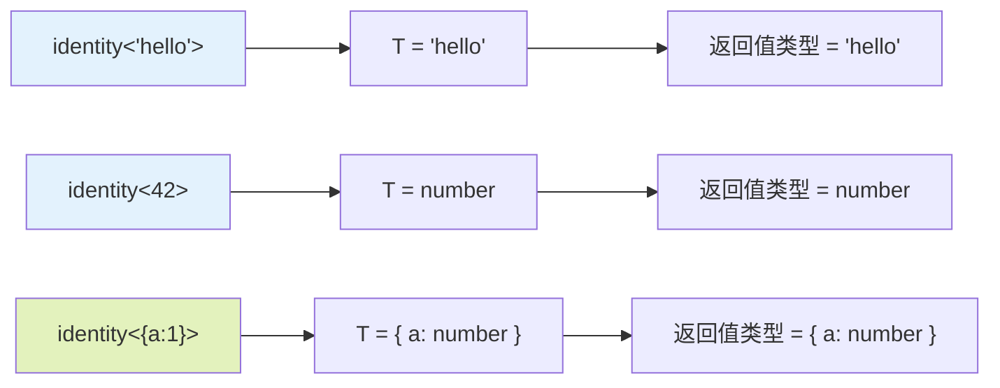
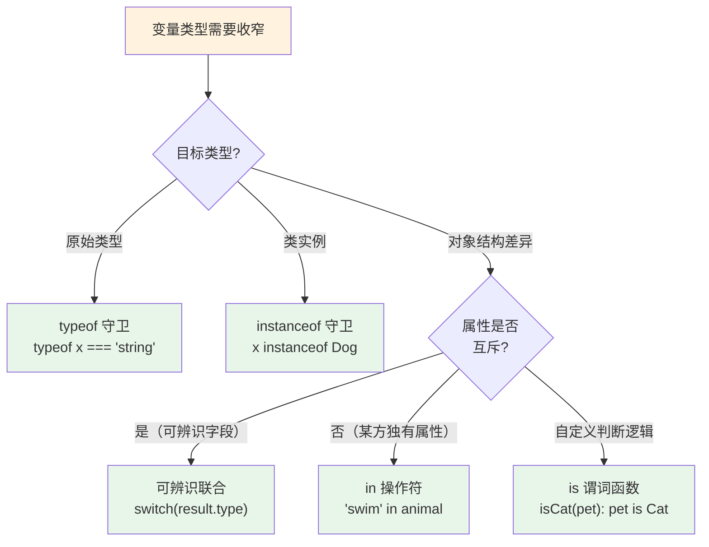

---
---
# TypeScript 基础知识完全指南

> 从零开始，循序渐进掌握 TypeScript 核心概念与实战技巧

---

## 第一章：TypeScript 概述

### 1.1 什么是 TypeScript

**TypeScript** 是由 Microsoft 开发和维护的一种开源编程语言。它是 **JavaScript 的超集（Superset）**，这意味着：

- 所有合法的 JavaScript 代码都是合法的 TypeScript 代码
- TypeScript 在 JavaScript 的基础上增加了**静态类型系统**
- TypeScript 代码需要**编译**为 JavaScript 才能在浏览器或 Node.js 中运行

```
┌─────────────────────────────────────┐
│         TypeScript                  │  ← 新增: 类型注解、接口、泛型等
│    ┌─────────────────────────┐     │
│    │      JavaScript          │     │  ← 原有: ES6+ 语法全部支持
│    └─────────────────────────┘     │
└─────────────────────────────────────┘
              │ 编译（tsc）
              ▼
        纯 JavaScript 代码
         （可运行于任意环境）
```

### 1.2 为什么选择 TypeScript

| 特性 | JavaScript | TypeScript |
|------|-----------|------------|
| 类型检查 | 运行时发现错误 | **编译时**发现错误 |
| IDE 支持 | 基础补全 | 强大的智能提示、重构 |
| 代码可读性 | 需注释说明 | 类型即文档 |
| 重构安全 | 改动容易引入 bug | 类型系统保障安全性 |
| 适用场景 | 小型脚本、原型 | 中大型项目、团队协作 |

**核心优势总结**：

1. **更早发现错误** — 在编码阶段而非运行阶段捕获 bug
2. **更好的开发体验** — 自动补全、跳转定义、即时错误提示
3. **更安全的重构** — 改一个变量名，所有引用处同步更新
4. **自文档化** — 类型签名本身就是最好的文档

### 1.3 安装与快速开始

```bash
# 全局安装 TypeScript 编译器
npm install -g typescript

# 查看版本
tsc --version   # Version 5.x.x

# 初始化项目配置文件
tsc --init
```

创建第一个 TypeScript 文件 `hello.ts`：

```typescript
// hello.ts — TypeScript 源文件，后缀名为 .ts
// 冒号后面的 string、number 就是「类型注解」，告诉 TS 这个变量只能存这种类型的数据
const message: string = 'Hello, TypeScript!';  // message 只能存字符串
const count: number = 42;                       // count 只能存数字

function greet(name: string): string {           // (参数: 类型): 返回值类型
  return `Welcome, ${name}!`;                    // 模板字符串（ES6 语法）
}

console.log(greet('World'));                    // 调用函数并打印结果
console.log(`${message} (count: ${count})`);    // 在模板字符串中引用变量
```

编译并运行：

```bash
# 编译为 JavaScript
tsc hello.ts
# 生成 hello.js

# 运行
node hello.js
# 输出: Welcome, World!
#       Hello, TypeScript! (count: 42)
```

**推荐开发方式**：使用 `ts-node` 直接运行，或配合 `tsx`（更快）：

```bash
npx ts-node hello.ts    # 直接运行 TS 文件
npx txs hello.ts        # 更快的替代方案
```

---

## 第二章：基础类型系统

### 2.1 原始类型（Primitive Types）

TypeScript 继承了 JavaScript 的所有原始类型，并增加了静态类型检查。

#### 基本数据类型

```typescript
// === 字符串 string ===
let name: string = 'Alice';          // 用单引号或双引号包裹文本
let template: string = `Hello, ${name}`; // 模板字符串：用反引号 ` 包裹，${} 中嵌入变量

// === 数字 number ===
// TypeScript 的 number 类型同时包含整数和浮点数（不像其他语言区分 int/float）
let age: number = 25;                // 十进制整数
let hex: number = 0xf00d;            // 十六进制（以 0x 开头，常用于颜色值）
let binary: number = 0b1010;         // 二进制（以 0b 开头）
let octal: number = 0o744;           // 八进制（以 0o 开头）
let big: bigint = 100n;              // 大整数（以 n 结尾，用于超大数值）

// === 布尔值 boolean ===
// 只有两个值：true 和 false，常用于条件判断
let isActive: boolean = true;
let isDone: boolean = false;

// === 空值类型 ===
// null 表示"空"，undefined 表示"未定义"
// 两者含义不同但都表示"没有值"
let empty: null = null;
let notDefined: undefined = undefined;

// === Symbol ===
// Symbol 用于创建唯一的标识符，即使描述相同也不相等
const uniqueKey: symbol = Symbol('id');
const anotherKey = Symbol('id');     // 描述相同但是不同的值
console.log(uniqueKey === anotherKey); // false — 每个 Symbol 都是独一无二的
```

> **注意**：`null` 和 `undefined` 在默认情况下是所有类型的子类型。开启 `strictNullChecks` 后，它们只能赋值给 `void` 和各自对应的类型。

#### 类型标注语法

```typescript
// 显式类型标注
let num: number = 10;
let str: string = 'hello';
let flag: boolean = true;

// 同时声明多个变量
let a: number, b: string, c: boolean;

// 解构赋值的类型
let { x, y }: { x: number; y: number } = { x: 1, y: 2 };
let [first, second]: [string, number] = ['hello', 42];
```

### 2.2 数组与元组

#### 数组（Array）

两种写法完全等价：

```typescript
// 写法一：类型 + 方括号（更常用，写法简洁）
let numbers: number[] = [1, 2, 3];       // number[] 表示"由数字组成的数组"
let strings: string[] = ['a', 'b', 'c']; // string[] 表示"由字符串组成的数组"

// 写法二：泛型 Array<类型>（与上面完全等价，但写法稍长）
// 泛型 Array<> 是一种更通用的写法，某些复杂场景下更清晰
let numbers2: Array<number> = [1, 2, 3];
let strings2: Array<string> = ['a', 'b', 'c'];

// 多维数组 — 数组的数组（类似矩阵/表格）
let matrix: number[][] = [[1, 2], [3, 4]];          // 二维数字数组
let grid: Array<Array<number>> = [[1, 2], [3, 4]]; // 等价写法

// 联合类型数组 — 数组元素可以是多种类型之一
// (string | number)[] 表示"每个元素要么是 string，要么是 number"
let mixed: (string | number)[] = [1, 'two', 3, 'four'];
mixed.push(true); // ❌ 报错：boolean 不在 string | number 的范围内

// 只读数组 — 声明后不能增删改元素（用于保护数据不被意外修改）
let readOnly: readonly number[] = [1, 2, 3];
// readOnly.push(4);    // ❌ 错误：不能添加元素
// readOnly[0] = 99;   // ❌ 错误：不能修改元素
```

#### 元组（Tuple）

元组是**固定长度、固定类型顺序**的数组：

```typescript
// 基本元组 — 像一个"固定格式"的数组，每个位置的类型是确定的
let person: [string, number] = ['Alice', 25];
//  ↑ 第0位必须是 string    ↑ 第1位必须是 number

person[0] = 'Bob';       // ✅ 正确：string 赋给 string
person[1] = 30;          // ✅ 正确：number 赋给 number
person[1] = '30';        // ❌ 错误：不能将 string '30' 赋给 number 类型的位置
person[2] = true;        // ❌ 错误：元组只有2个元素（索引 0 和 1），索引 2 超出范围

// 可选元素元组 — 某些位置可以不存在（加 ? 表示可选）
let optional: [string, number?] = ['hello'];     // 只提供第0位，第1位省略
optional = ['hello', 42];                       // ✅ 也可以提供全部

// 剩余元素元组 — 前面几个位置固定类型，后面可以有任意多个同类型元素
// [string, ...number[]] 表示：第0位是string，后面全是 number
let flexible: [string, ...number[]] = ['header', 1, 2, 3];

// 只读元组 — 整个元组不可修改（连某个位置的值都不能改）
const point: readonly [number, number] = [10, 20]; // 类似二维坐标 (x, y)
// point[0] = 5;  // ❌ 只读元组的任何位置都不可修改

// 具名元组成员标签（TS 4.0+）— 给每个位置起个名字，提高可读性
// 这只是标签提示，不影响实际的类型检查
let employee: [name: string, age: number, active?: boolean] = ['Tom', 30];
//   ↑ 名字叫 name    ↑ 名字叫 age      ↑ 名字叫 active（可选）
```

**数组 vs 元组对比**：

| 特征 | 数组 | 元组 |
|------|------|------|
| 长度 | 可变 | 固定 |
| 元素类型 | 全部相同 | 可不同（按位置） |
| 使用场景 | 同类数据集合 | 固定结构的数据（如坐标、键值对） |

### 2.3 特殊类型：any、unknown、never、void

这四个特殊类型是 TypeScript 类型系统的关键组成部分：

#### any — 跳过类型检查（"万能通行证"，慎用！）

```typescript
let anything: anything = 42;          // 声明为 any 类型后，类型检查形同虚设
anything = 'hello';                   // ✅ 可以重新赋值为任何类型（string）
anything = true;                      // ✅ 也可以赋值为 boolean
anything.toFixed(2);                  // ✅ 编译通过（但运行时可能报错，因为 string 没有 toFixed）
anything.anyMethod();                 // ✅ 编译也通过（any 可以调用任意方法名）

// ⚠️ any 的"传染性"：any 类型的值会污染周围代码的类型安全
let num: number = anything;           // ✅ any 可以赋值给任何类型（包括 number、string 等）
// 这意味着一旦使用了 any，相关的所有变量都可能失去类型保护
```

> **警告**：`any` 等同于关闭了该变量的类型检查。应尽量避免使用，仅在迁移 JS 项目时作为过渡手段。

#### unknown — 类型安全的 any（"带锁的保险箱"）

```typescript
let value: unknown = 'hello';          // unknown 是类型安全的：它可以是任何值，但不能被随意使用

value.toFixed(2);                      // ❌ 报错：不能直接调用 unknown 的方法（不知道它是什么类型）
let num: number = value;               // ❌ 报错：不能直接赋值给 number（可能不是数字）

// ✅ 正确做法：先进行类型检查（类型守卫），确认具体类型后再使用
if (typeof value === 'string') {
  // 进入此分支后，TS 知道 value 一定是 string（这叫「类型收窄」）
  console.log(value.toUpperCase());    // ✅ 安全：string 有 toUpperCase 方法
}

// 或者用 as 断言（⚠️ 需要开发者自行确保运行时安全）
(value as string).toUpperCase();       // 告诉 TS："我确定它是 string，别管了"
// 注意：如果 value 实际上不是 string，运行时会报错，但编译器不会拦你
```

**any vs unknown 对比**：

```
                    any                    unknown
                ┌──────────┐            ┌──────────┐
  可赋值给其他类型？  │    ✅ 是   │            │    ❌ 否   │
                └──────────┘            └──────────┘
  能调用其方法？     │    ✅ 是   │            │    ❌ 否   │
                └──────────┘            └──────────┘
  类型安全性？       │    ❌ 无   │            │    ✅ 有   │
                └──────────┘            └──────────┘
  推荐使用？         │    ❌ 避免  │            │    ✅ 推荐  │
                └──────────┘            └──────────┘
```

#### never — 永不存在的类型（"不可能"的类型）

```typescript
// 场景 1：总是抛出异常的函数 — 函数永远不会正常返回（总是中断/退出）
function throwError(message: string): never {
  throw new Error(message);
  // throw 会立即终止函数执行，所以永远不会到达 return 语句
}

// 场景 2：无限循环的函数 — 同样永远不会结束
function infiniteLoop(): never {
  while (true) { /* ... */ }   // 死循环，永远跑不到函数结尾
}

// 场景 3：类型穷尽检查（最实用的场景！）
// 用 never 确保 switch/case 处理了所有可能的类型变体，防止遗漏
type Shape = { kind: 'circle'; radius: number }
           | { kind: 'square'; size: number };

function getArea(shape: Shape): number {
  switch (shape.kind) {
    case 'circle': return Math.PI * shape.radius * shape.radius;
    case 'square': return shape.size * shape.size;
    default:
      // 🔑 关键技巧：如果未来新增了 Shape 的变体（如 triangle）但忘记处理这里，
      // TS 会报错！因为新变体不能赋值给 never 类型。
      // 这相当于让编译器帮你检查"是否遗漏了某种情况"
      const _exhaustive: never = shape;  // 如果所有 case 都处理了，这里不可达
      return _exhaustive;                // 实际上这行代码永远不会执行
  }
}
```

#### void — 无返回值（"空"返回类型）

```typescript
// 用于没有返回值的函数（即只产生副作用，如打印日志、修改 DOM 等）
function logMessage(msg: string): void {
  console.log(msg);
  // 没有写 return 语句，函数隐式返回 undefined
  // 这与 JavaScript 的行为一致：没有 return 的函数默认返回 undefined
}

// void 类型的变量只能接受 undefined（和 null，当 strictNullChecks 关闭时）
let nothing: void = undefined;    // ✅ undefined 是 void 的唯一合法值
nothing = null;                   // 仅在 strictNullCheck: false 时允许

// ⚠️ () => void 有一个特殊且重要的兼容性规则：
// 声明为 () => void 的函数，其实现可以返回任意值（返回值会被忽略）
// 这是为了让 Array.prototype.forEach 等回调更方便使用
type VoidFn = () => void;

const fn1: VoidFn = () => {
  return 42;    // ✅ 不报错！虽然声明了 void 返回值，但实际返回了 42
                // TS 会忽略这个返回值（就像 JavaScript 引擎会忽略 forEach 回调的返回值一样）
};

const fn2: VoidFn = () => 42;     // ✅ 同样合法 — 箭头函数的简写形式
```

### 2.4 类型推断与拓宽/收窄

TypeScript 会自动推断变量和表达式的类型，无需每次都显式标注。

#### 类型推断的几种场景

```typescript
// 1. 变量初始化推断 — TS 根据初始值自动推断变量类型
let x = 10;              // 推断为 number（注意：从字面量 10 拓宽为 number 类型）
const y = 'hello';       // 推断为 'hello'（const 声明保持字面量类型，不拓宽）

// 2. 函数返回值推断 — TS 根据返回语句的表达式推断返回值类型
function add(a: number, b: number) {
  return a + b;          // a + b 的结果是 number，所以返回值推断为 number
}

// 3. 上下文推断 — TS 根据使用位置（上下文）推断类型
const numbers = [1, 2, 3];         // numbers 被推断为 number[]
numbers.forEach(n => {
  // n 的类型从 numbers 的元素类型推断而来 → n 是 number
  console.log(n.toFixed(2));       // ✅ toUpperCase 不存在，因为 n 不是 string
});

// 4. 最佳通用类型推断 — 当数组中有多种类型的元素时，TS 取它们的"公共父类型"
let arr = [1, 'hello', true];     // 推断为 (string | number | boolean)[]
// 即：每个元素的类型都是 "string 或 number 或 boolean"
```

#### 类型拓宽（Widening）— "从精确到宽泛"

```typescript
// let 声明时，TS 会把字面量类型"拓宽"为更通用的基本类型
// 原因：let 变量可以被重新赋值，所以 TS 不能假定它永远是初始值

const specific = 'hello';   // 类型: 'hello' （精确字面量 — const 不可重新赋值，所以保持精确）
let widened = 'hello';      // 类型: string  （被拓宽！— let 可以重新赋值，TS 推断为 string）

// 对象同理 — const 对象的属性值仍然可能被修改
const obj = { x: 10 };      // 类型: { x: number } — 注意 x 是 number 而非 10！
// 虽然 obj 本身是 const（不能替换整个对象），但 obj.x 仍然可以改
// 所以 TS 把 x 从字面量 10 拓宽为 number

let widenedObj = { x: 10 };  // 类型: { x: number } — 同样被拓宽
widenedObj.x = 999;         // ✅ 因为 x 已经被拓宽为 number，赋任何数字都合法
```

**类型拓宽与收窄流程图**：

```
类型拓宽（Widening）— 从精确字面量到更宽的类型
━━━━━━━━━━━━━━━━━━━━━━━━━━━━━━━━━━━━━━━━━━━━━
let x = "hello"        → 推断为 string（不是 "hello" 字面量）
const y = "hello"      → 推断为 "hello"（字面量类型，因为 const 不可变）
let z = [1, 2, 3]      → 推断为 number[]（不是 [1, 2, 3] 元组）

原因：let 变量可以被重新赋值，TS 推断为最宽的兼容类型

类型收窄（Narrowing）— 从宽类型到精确类型
━━━━━━━━━━━━━━━━━━━━━━━━━━━━━━━━━━━━━━━━━━━━━
function process(val: string | number) {
    val          → 类型是 string | number（宽）
  if (typeof val === "string") {
    val.toUpperCase()   → 类型收窄为 string ✅
  } else {
    val.toFixed(2)     → 类型收窄为 number ✅
  }
}
```

> 💡 **关键理解**：`let` 声明会触发**拓宽**（为了允许后续赋值），而 `if/typeof` 等条件判断会触发**收窄**（TS 在分支内缩小类型范围）。两者配合使用，既保证了灵活性又保证了类型安全。

#### 阻止拓宽的方法

```typescript
// 方法 1：as const 断言 — 告诉 TS "保持所有值的精确字面量类型"
let arr = [1, 2] as const;
// 没有 as const → 类型是 number[]（可以 push 任意数字）
// 加了 as const   → 类型是 readonly [1, 2]（固定长度、只读、元素类型也是字面量）

let config = {
  api: '/v1',
  timeout: 5000,
} as const;
// 没有 as const → { api: string; timeout: number }
// 加了 as const   → { readonly api: '/v1'; readonly timeout: 5000 }
// 所有属性都变成了 readonly，且保持精确的字面量类型

// 方法 2：直接用 const 声明顶层变量（const 声明的变量本身不会被拓宽）
const PI = 3.14;  // 类型: 3.14（字面量类型，不会被拓宽）
// PI = 3.14159;  // ❌ const 声明不能重新赋值
```

### 2.5 类型断言

当开发者比 TypeScript 更了解某个值的类型时，可以使用类型断言。

#### 两种语法

```typescript
// as 语法（推荐，JSX 中必须用这个）
const input = document.getElementById('username') as HTMLInputElement;

// <> 语法（在 JSX 中会产生歧义，不推荐）
const input2 = <HTMLInputElement>document.getElementById('username');
```

#### 非空断言 `!`

告诉编译器"这个值一定不是 null 或 undefined"：

```typescript
function getElement(id: string): HTMLElement | null {
  return document.getElementById(id);
}

const btn = getElement('submit-btn')!;  // ! 表示我确定它存在
btn.click();  // ✅ 无需判空
```

> **警告**：非空断言有运行时风险。如果元素实际不存在，`btn.click()` 会在运行时抛错。

#### 双重断言（慎用！）

先用 `as any` 绕过类型检查，再断言为目标类型：

```typescript
// 危险操作：绕过所有类型检查
const value = 'hello' as any as number;  // 运行时仍然是字符串！

// 更安全的替代方案：使用类型守卫
function processValue(val: string | number) {
  if (typeof val === 'number') {
    val.toFixed(2);  // ✅ 安全
  }
}
```

---

## 第三章：接口（Interface）

接口是 TypeScript 中定义对象结构的核心方式，它描述了一个对象"长什么样"。

### 3.1 接口基础定义

```typescript
// 定义 User 接口 — 接口用 interface 关键字声明，描述对象应该"长什么样"
interface User {
  id: number;                  // 必填属性：创建时必须提供
  name: string;                // 必填属性
  email: string;               // 必填属性
  age?: number;                // 可选属性：加 ? 表示可以不提供（等价于 age: number | undefined）
  readonly createdAt: Date;    // 只读属性：加 readonly 表示赋值后不能再修改
}

// 使用接口 — 创建一个符合 User 接口形状的对象
const user: User = {
  id: 1,                       // ✅ 提供了必填属性 id
  name: 'Alice',               // ✅ 提供了必填属性 name
  email: 'alice@example.com',  // ✅ 提供了必填属性 email
  createdAt: new Date(),       // ✅ 提供了只读属性 createdAt
  // age 未提供也没关系（它是可选的，相当于 age: undefined）
};

user.name = 'Bob';             // ✅ 正常修改非 readonly 属性
user.createdAt = new Date();   // ❌ 报错：readonly 属性不可修改（初始化后锁定）
user.id = 99;                 // ❌ 报错：同上
```

#### 接口描述函数类型

```typescript
// 描述可调用接口
interface SearchFunc {
  (source: string, sub: string): boolean;
}

const mySearch: SearchFunc = function(src, sub) {
  return src.includes(sub);
};
```

#### 接口描述索引签名

```typescript
// 字典类型的接口
interface StringDictionary {
  [index: string]: string;    // 所有 string 键对应的值都是 string
}

const colors: StringDictionary = {
  red: '#ff0000',
  green: '#00ff00',
  blue: '#0000ff',
};

// 混合固定属性和索引签名
interface UserData {
  name: string;               // 必须有 name
  age: number;                 // 必须有 age
  [key: string]: any;         // 其他任意属性
}
```

### 3.2 可选属性与只读属性

```typescript
interface Config {
  // 必填属性
  url: string;

  // 可选属性（加 ?）
  timeout?: number;
  headers?: Record<string, string>;

  // 只读属性（readonly）
  readonly version: string;
  readonly createdAt: Date;
}

const config: Config = {
  url: 'https://api.example.com',
  version: '1.0',
  createdAt: new Date(),
  // timeout 和 headers 可选，未提供也合法
};

config.url = 'https://new.api.com';     // ✅
config.timeout = 5000;                   // ✅（可选属性可以后续添加）
config.version = '2.0';                 // ❌ 只读，不可修改
```

### 3.3 接口继承

接口可以通过 `extends` 关键字继承其他接口，支持多继承：

```typescript
// 基础形状接口
interface Shape {
  color: string;
}

// 继承并扩展
interface Circle extends Shape {
  radius: number;
}

interface Square extends Shape {
  sideLength: number;
}

// 多继承
interface ColoredCircle extends Circle, Drawable {
  opacity: number;
}

interface Drawable {
  draw(): void;
}

// 使用
const circle: ColoredCircle = {
  color: 'red',       // 来自 Shape
  radius: 10,         // 来自 Circle
  opacity: 0.8,       // 来自 ColoredCircle
  draw() {            // 来自 Drawable
    console.log(`Drawing ${this.color} circle`);
  },
};
```

### 3.4 接口 vs 类型别名 — TypeScript 中两种定义类型的核心方式

两者都可以用来描述对象的形状（"对象长什么样"），但在能力范围和使用场景上有明确分工：

```typescript
// ===== 接口 Interface =====
// interface：用 interface 关键字声明，最适合描述"一个对象的形状"
interface Point {
  x: number;   // x 坐标
  y: number;   // y 坐标
}

// 🔑 interface 的独门绝技：声明合并（Declaration Merging）
// 同名的 interface 可以多次声明，TS 会自动将它们合并为一个完整的类型
// 这对于扩展第三方库的类型、给全局对象加属性等场景非常有用
interface Point {
  z?: number;  // 第二次声明 Point，新增可选属性 z
}
// 最终 Point 被合并为：{ x: number; y: number; z?: number }
// 相当于把两次声明的属性"拼"在了一起

// interface 支持 extends 继承 — 类似于类的继承，复用已有接口的属性
interface Point3D extends Point {
  // Point3D 自动拥有 Point 的所有属性 (x, y, z?)
  z: number;    // 这里将 z 从"可选"改为"必填"
}

// ===== 类型别名 Type =====
// type：用 type 关键字 + = 号赋值来定义类型，表达能力更广泛
type Point2 = {
  x: number;
  y: number;
};

// ⚠️ type 的限制：不能重复声明！同名 type 会直接报错
// （这与 interface 的声明合并形成鲜明对比）
// type Point2 = { z: number };  // ❌ Error: Duplicate identifier 'Point2'

// 🔑 type 的强项：支持联合、交叉等高级类型操作（interface 做不到这些！）
type ID = string | number;                    // 联合类型："或"的关系 — ID 可以是 string 或 number
type NameOrAge = { name: string } | { age: number };  // 对象联合 — 要么有 name，要么有 age
type Combined = Point & { label: string };     // 交叉类型："与"的关系 — 必须同时具备 Point 和 label 属性
```

**选择建议** — 根据场景选对工具：

| 场景 | 推荐 | 原因 |
|------|------|------|
| 定义对象结构（如 API 数据模型） | `interface` | 支持声明合并和 extends 继承，语义更清晰 |
| 联合 / 交叉类型（`A \| B`、`A & B`） | `type` | interface 无法表示这些高级类型运算 |
| 函数类型签名（简写） | `type` | `type Fn = (a: number) => number` 比 interface 更简洁 |
| 映射类型 / 条件类型等复杂类型编程 | `type` | `type Readonly<T> = { readonly [K in keyof T]: T[K] }` 等 |
| 公共库的 API 导出（方便使用者扩展） | `interface` | 使用者可以通过再次声明同名的 interface 来扩展你的类型 |

> **一句话记忆**：描述"对象形状"优先用 `interface`；做"类型运算"必须用 `type`。两者不冲突，实际项目中经常搭配使用。

---

## 第四章：函数类型

### 4.1 函数类型注解

#### 完整的函数类型标注

```typescript
// 基本形式 — 函数名(参数: 类型): 返回值类型 { ... }
function add(a: number, b: number): number {
  //   ↑ 参数 a 的类型    ↑ 参数 b 的类型  ↑ 返回值的类型
  return a + b;
}

// 箭头函数的写法完全一样，只是语法更简洁
const multiply = (x: number, y: number): number => x * y;

// 函数表达式 — 先声明变量类型，再赋值函数实现
// 变量 divide 的类型是 "(a: number, b: number) => number"（一个函数类型）
const divide: (a: number, b: number) => number = function (a, b) {
  // 注意：右边的 function(a, b) 不需要再写类型标注
  // 因为 TS 会从左边已声明的类型中自动推导
  return a / b;
};
```

#### 用 type/interface 定义函数类型

```typescript
// 类型别名方式（更常用）
type Greeter = (name: string, greeting?: string) => string;

const sayHello: Greeter = (name, greeting = 'Hi') => {
  return `${greeting}, ${name}!`;
};

// 接口方式（可附加属性）
interface Calculator {
  (a: number, b: number): number;
  description: string;
  version: number;
}

const calc: Calculator = (a, b) => a + b;
calc.description = 'Basic calculator';
calc.version = 1.0;
```

### 4.2 可选参数与默认参数

```typescript
// 可选参数（加 ?）— 调用时可以不传该参数，不传则为 undefined
function buildName(firstName: string, lastName?: string): string {
  // lastName 的实际类型是 string | undefined
  if (lastName) {
    return `${firstName} ${lastName}`;
  }
  return firstName;
}
buildName('Alice');           // ✅ 'Alice' — 只传了必填参数
buildName('Alice', 'Johnson'); // ✅ 'Alice Johnson' — 两个都传了

// 默认参数 — 不传时使用等号后面的值作为默认值（比可选参数更常用）
function createUser(
  name: string,
  role: string = 'user',       // 默认值：不传则使用 'user'
  active: boolean = true       // 默认值：不传则使用 true
) {
  return { name, role, active };
}
createUser('Tom');                         // { name:'Tom', role:'user', active:true }
createUser('Tom', 'admin');                 // { name:'Tom', role:'admin', active:true }
createUser('Tom', 'admin', false);          // { name:'Tom', role:'admin', active:false }

// ⚠️ 重要规则：可选参数和默认参数必须放在必选参数之后！
// function bad(a?: string, b: string) {}  // ❌ 报错：可选参数不能在必选参数前面
```

### 4.3 函数重载

函数重载允许同一个函数根据传入参数的不同类型，返回不同的类型：

```typescript
// 🔑 重载签名（仅用于类型检查，无实现体）— 告诉 TS "这个函数有这些调用方式"
// 每个重载签名定义了一种参数类型 → 返回值类型的对应关系
function format(input: string): string;           // 传入 string → 返回 string
function format(input: number): string;           // 传入 number → 返回 string
function format(input: boolean): string;          // 传入 boolean → 返回 string

// 实现签名（必须兼容所有重载签名）— 真正的函数体写在这里
// 参数和返回值类型要能"覆盖"所有重载签名的组合
function format(input: string | number | boolean): string {
  if (typeof input === 'string') {
    return input.toUpperCase();     // 字符串 → 转大写
  }
  if (typeof input === 'number') {
    return input.toFixed(2);        // 数字 → 保留两位小数
  }
  return input ? 'TRUE' : 'FALSE';  // 布尔 → 转文字
}

// 使用 — IDE 会根据重载签名给出精确的类型提示
format('hello');   // IDE 提示：input 应为 string（匹配第一个重载）
format(3.14159);   // IDE 提示：input 应为 number（匹配第二个重载）
format(true);      // IDE 提示：input 应为 boolean（匹配第三个重载）
// format({});      // ❌ 报错：没有对应的重载签名
```

**实际应用示例**：

```typescript
// DOM 元素获取的重载
function query(selector: string): HTMLElement | null;
function query(selector: string, parent: Element): HTMLElement | null;
function query(selector: string, parent?: Element): HTMLElement | null {
  const context = parent ?? document;
  return context.querySelector(selector);
}
```

### 4.4 函数中的 this

TypeScript 可以显式标注 `this` 的类型：

```typescript
interface UserUI {
  name: string;
  greet(this: UserUI, greeting: string): string;
}

const ui: UserUI = {
  name: 'Alice',
  greet(greeting) {
    return `${greeting}, ${this.name}!`;  // this 被正确推导为 UserUI
  },
};

ui.greet('Hello');     // ✅
const fn = ui.greet;
fn.call(ui, 'Hi');     // ✅
// fn('Hey');          // ❌ 缺少 this 参数
```

> **提示**：如果函数不需要访问 `this`，可以在 tsconfig 中设置 `noImplicitThis: true` 来强制要求标注。

---

## 第五章：类与面向对象

### 5.1 类的基础语法

```typescript
class Animal {
  // 🔑 TS 要求：类属性必须先声明（不能像 JS 那样直接在构造函数里 this.xxx = ...）
  name: string;                    // 属性声明 + 类型标注

  // 构造函数 — 创建实例时自动调用，用于初始化属性
  constructor(name: string) {
    this.name = name;             // 将参数赋值给实例属性
  }

  // 普通方法 — 定义在原型上，所有实例共享
  speak(sound: string): void {     // 方法也可以有参数类型和返回值类型
    console.log(`${this.name} makes "${sound}" sound`);
  }

  // getter / setter — 用于控制属性的读取和写入
  get displayName(): string {       // getter：读取时调用（像访问属性一样）
    return `Animal: ${this.name}`;
  }
  set displayName(newName: string) { // setter：赋值时调用（可以做数据校验/转换）
    this.name = newName.trim();     // 例如：自动去除首尾空格
  }

  // 静态成员 — 属于类本身而非实例（通过 类名.成员 访问）
  static kingdom: string = 'Animalia';  // 静态属性
  static create(name: string): Animal { // 静态方法（工厂方法模式）
    return new Animal(name);
  }
}

// 使用示例
const cat = new Animal('Kitty');          // 调用构造函数创建实例
cat.speak('meow');                        // 调用实例方法 → "Kitty makes "meow" sound"
console.log(cat.displayName);              // 调用 getter → "Animal: Kitty"
cat.displayName = '  Tom  ';               // 调用 setter（会自动 trim）
console.log(cat.name);                     // "Tom"（首尾空格被 trim 掉了）
console.log(Animal.kingdom);               // 通过类名访问静态属性 → "Animalia"
```

#### 参数属性简写 — TS 独有语法糖，大幅减少样板代码

```typescript
// 传统写法：需要先声明属性，再在构造函数中赋值（3行 × N个属性）
class Person {
  name: string;          // 1. 声明
  age: number;           // 2. 声明
  constructor(name: string, age: number) {
    this.name = name;    // 3. 赋值
    this.age = age;      // 4. 赋值
  }
}

// 参数属性简写（效果完全相同！）— 在构造函数参数前加修饰符
// TS 会自动：(1) 声明同名属性  (2) 在构造函数中将参数赋值给该属性
class Person {
  constructor(
    public name: string,       // public → 创建 public 属性
    public age: number,        // public → 创建 public 属性
    protected id: number,     // protected → 创建 protected 属性
    private secret: string     // private → 创建 private 属性
  ) {}                        // 构造函数体可以为空，所有赋值都自动完成
  // 现在 Person 类自动拥有了 name, age, id, secret 四个实例属性
}
```

### 5.2 访问修饰符

TypeScript 提供三种访问修饰符来控制类成员的可访问性：

```
┌─────────────────────────────────────────────────┐
│                    Class                        │
│                                                 │
│   public    ────  任何地方都可访问（默认）       │
│   protected ────  类内部 + 子类可访问            │
│   private   ────  仅类内部可访问                 │
│                                                 │
│   #private  ────  TS 3.8+ 弱引用私有（运行时保留）│
└─────────────────────────────────────────────────┘
```

```typescript
class Employee {
  public name: string;          // 任何人可见
  protected department: string; // 子类可见
  private salary: number;       // 仅自身可见

  constructor(name: string, dept: string, salary: number) {
    this.name = name;
    this.department = dept;
    this.salary = salary;
  }

  public getInfo(): string {
    return `${this.name} (${this.department})`;
  }

  protected getSalaryInfo(): string {
    return `$${this.salary}/yr`;  // 内部可访问 private
  }
}

class Manager extends Employee {
  private teamSize: number;

  constructor(name: string, dept: string, salary: number, teamSize: number) {
    super(name, dept, salary);
    this.teamSize = teamSize;
  }

  public getFullInfo(): string {
    // this.name ✅ (public)
    // this.department ✅ (protected，子类可访问)
    // this.salary ❌ (private，子类不可访问)
    return `${this.name} manages ${this.teamSize} people in ${this.department}`;
  }
}

const mgr = new Manager('Bob', 'Engineering', 150000, 8);
console.log(mgr.name);         // ✅ public
// console.log(mgr.department); // ❌ protected 外部不可访问
// console.log(mgr.salary);     // ❌ private 外部不可访问
console.log(mgr.getFullInfo()); // ✅ 通过公共方法间接访问
```

### 5.3 继承与多态

```typescript
// 基类
abstract class Shape {
  constructor(protected color: string) {}

  abstract getArea(): number;  // 抽象方法：子类必须实现

  describe(): string {         // 普通方法：子类可覆盖
    return `A ${this.color} shape`;
  }
}

// 子类
class Circle extends Shape {
  constructor(color: string, private radius: number) {
    super(color);
  }

  getArea(): number {
    return Math.PI * this.radius ** 2;
  }

  // 重写父类方法
  describe(): string {
    return `A ${this.color} circle (r=${this.radius}, area=${this.getArea().toFixed(1)})`;
  }
}

class Rectangle extends Shape {
  constructor(color: string, private width: number, private height: number) {
    super(color);
  }

  getArea(): number {
    return this.width * this.height;
  }
}

// 多态：同一接口，不同行为
const shapes: Shape[] = [
  new Circle('red', 5),
  new Rectangle('blue', 10, 4),
];

shapes.forEach(s => console.log(s.describe()));
// A red circle (r=5, area=78.5)
// A blue rectangle
```

### 5.4 抽象类

抽象类是不能被实例化的基类，用于定义子类的共同契约：

```typescript
abstract class Animal {
  constructor(public name: string) {}

  // 抽象方法：没有实现，子类必须实现
  abstract makeSound(): string;

  // 普通方法：已有实现，子类可直接使用或重写
  move(distance: number): string {
    return `${this.name} moved ${distance}m`;
  }
}

class Dog extends Animal {
  makeSound(): string {
    return 'Woof!';
  }
}

class Cat extends Animal {
  makeSound(): string {
    return 'Meow~';
  }

  // 重写父类方法
  move(distance: number): string {
    return `${this.name} sneaked ${distance}m`;
  }
}

// const a = new Animal(' creature ');  // ❌ 抽象类不能实例化
const dog = new Dog('Buddy');
const cat = new Cat('Kitty');

dog.makeSound();  // 'Woof!'
cat.makeSound();  // 'Meow~'
```

### 5.5 类与接口的关系

```typescript
// 接口：定义"契约"（能做什么）
interface Swimmable {
  swim(): void;
}

interface Flyable {
  fly(): void;
}

// 类：提供"实现"（怎么做）
class Duck implements Swimmable, Flyable {
  swim() {
    console.log('Duck is swimming');
  }
  fly() {
    console.log('Duck is flying');
  }
}

class Fish implements Swimmable {
  swim() {
    console.log('Fish is swimming');
  }
  // Fish 不实现 Flyable，因为它不会飞
}

// 一个类可以实现多个接口，但只能继承一个类
class Robot implements Swimmable {
  swim() {
    console.log('Robot swimming with propellers');
  }
}
```

**接口 vs 抽象类的选择**：

| 特征 | 接口 | 抽象类 |
|------|------|--------|
| 能否包含实现代码 | ❌（TS 之前） | ✅ |
| 能否多实现/多继承 | ✅ 多个接口 | ❌ 单继承 |
| 能否定义构造函数 | ❌ | ✅ |
| 适用场景 | 定义能力契约 | 定义通用基类逻辑 |

---

## 第六章：枚举（Enum）

枚举用于定义一组**命名的常量集合**，让代码更具可读性。

### 6.1 数字枚举

```typescript
// 枚举（enum）— 定义一组命名的常量，用有意义的名称替代"魔法数字"
// 数字枚举：如果不指定值，从 0 开始自动递增
enum Direction {
  Up,        // 值 = 0（第一个成员默认从 0 开始）
  Down,      // 值 = 1（自动递增）
  Left,      // 值 = 2
  Right,     // 值 = 3
}

// 使用枚举值
let move: Direction = Direction.Up;     // move 的值是数字 0
console.log(move);           // 输出: 0（存储的是数字）
console.log(Direction[0]);   // 输出: 'Up'（反向映射：数字 → 名称）

// 自定义初始值 — 可以指定起始值或每个成员的值
enum StatusCode {
  Ok = 200,         // HTTP 状态码 200
  NotFound = 404,   // HTTP 状态码 404
  ServerError = 500,// HTTP 状态码 500
}
console.log(StatusCode.Ok);        // 200
console.log(StatusCode['200']);    // 'Ok'（反向映射）
```

### 6.2 字符串枚举

```typescript
enum HttpMethod {
  Get = 'GET',
  Post = 'POST',
  Put = 'PUT',
  Delete = 'DELETE',
}

// 字符串枚举没有反向映射
console.log(HttpMethod.Get);       // 'GET'
console.log(HttpMethod['GET']);    // undefined（无反向映射）
```

### 6.3 const 枚举与异构枚举

```typescript
// const 枚举：编译后内联值，不生成额外代码
const enum Permissions {
  Read = 1,
  Write = 2,
  Admin = 4,
}
// 编译结果: if (role === 1 /* Read */) ...

// 异构枚举（数字+字符串混合，不推荐）
enum Mixed {
  No = 0,
  Yes = 'YES',
}
```

### 6.4 枚举的最佳实践

```typescript
// ✅ 推荐：使用 const enum + 字符串值（调试友好）
const enum UserRole {
  Guest = 'guest',
  User = 'user',
  Admin = 'admin',
}

// ✅ 推荐：配合联合类型使用
type Role = UserRole;  // 'guest' | 'user' | 'admin'

function checkPermission(role: Role): string[] {
  const permissions: Record<Role, string[]> = {
    [UserRole.Guest]: ['read'],
    [UserRole.User]: ['read', 'write'],
    [UserRole.Admin]: ['read', 'write', 'delete', 'manage'],
  };
  return permissions[role];
}

// ⚠️ 注意：现代 TS 项目中，也可以用 const 对象 + typeof 替代枚举
const Colors = {
  Red: '#f00',
  Green: '#0f0',
  Blue: '#00f',
} as const;

type Color = keyof typeof Colors;  // 'Red' | 'Green' | 'Blue'
```

---

## 第七章：高级类型

### 7.1 联合类型（Union Types）— "或"的关系

联合类型表示值可以是多种类型**之一**，使用 `|`（竖线）连接：

```typescript
// 基本联合类型 — 变量可以是 string 或 number 中的任意一个
let value: string | number;
value = 'hello';   // ✅ 赋值 string 合法
value = 42;        // ✅ 赋值 number 也合法
value = true;      // ❌ 报错：boolean 不在 string | number 的范围内

// 函数参数的联合类型 — 让函数能接受多种类型的输入
function printId(id: string | number): void {
  console.log(`ID: ${id}`);
  // ⚠️ 不能直接调用 id.toUpperCase()！因为如果 id 是 number，number 没有 toUpperCase 方法
  // 必须先用类型守卫缩小范围（详见第九章）
  if (typeof id === 'string') {
    console.log(id.toUpperCase());  // ✅ 此处 TS 知道 id 是 string
  } else {
    console.log(id.toFixed(2));    // ✅ 此处 TS 知道 id 是 number
  }
}

// 字面量联合类型（非常实用！）— 限制值只能是几个固定的字符串/数字之一
// 比单独用 string 更安全，可以防止拼写错误和非法值
type Alignment = 'left' | 'center' | 'right';     // 只能是这三个字符串之一
type ModalSize = 'sm' | 'md' | 'lg' | 'full';    // 只能是这四个字符串之一

function openModal(size: ModalSize) {
  // size 只能传入 'sm'/'md'/'lg'/'full'，传其他值会报错
}
openModal('md');    // ✅ 在允许范围内
openModal('xl');    // ❌ 报错：'xl' 不在 ModalSize 类型中
```

### 7.2 交叉类型（Intersection Types）— "与"的关系

交叉类型将多个类型**合并**为一个，使用 `&`（和号）连接。值必须**同时满足**所有类型的约束：

```typescript
interface Name { name: string; }
interface Age { age: number; }
interface Email { email: string; }

// 交叉类型 — Person 必须同时拥有 Name、Age、Email 三个接口的所有属性
type Person = Name & Age & Email;

const user: Person = {
  name: 'Alice',              // 来自 Name 接口 ✅
  age: 25,                    // 来自 Age 接口 ✅
  email: 'alice@example.com', // 来自 Email 接口 ✅
  // 缺少任何一个属性都会报错！
};

// 实际应用：Mixin（混合）模式 — 用交叉类型组合多个能力
type Serializable = { serialize(): string };   // "可序列化"能力
type Loggable = { log(): void };             // "可日志"能力

// DataStore 同时实现了两种能力
class DataStore implements Serializable, Loggable {
  data: string = '';
  serialize(): string { return JSON.stringify({ data: this.data }); }
  log() { console.log('[DataStore]', this.data); }
}
```

**联合 vs 交叉对比图**：

```
  联合类型 A | B              交叉类型 A & B
  ┌─────────┬─────────┐       ┌─────────┬─────────┐
  │         │         │       │    A    ╳    B    │
  │    A    │    B    │       │         │         │
  │         │         │       │    A    &    B    │
  │  取其一即可           │       │  两者都要         │
  └─────────┴─────────┘       └─────────┴─────────┘
```

**联合类型与交叉类型的集合论图示**：

```
联合类型 A | B（并集）：值可以是 A 类型的成员 OR B 类型的成员
━━━━━━━━━━━━━━━━━━━━━━━━━━━━━━━━━━━━━━━━━━━━━━━━━━━━
type A = { name: string }
type B = { age: number }
type Union = A | B

  ┌─────────┐
  │   A     │ ← { name: 'Tom' } ✅  （满足A即可）
  │   ╱╲    │
  │  ╱  ╲   │ ← { name: 'Tom', age: 25 } ✅（同时满足A和B）
  │ ╱    ╲  │
  │ B      │ ← { age: 25 } ✅  （满足B即可）
  └─────────┘
访问属性时：只能访问 A 和 B 的交集属性（共有的）
  Union.name? ❌ (name不在B中)  Union.age? ❌ (age不在A中)

交叉类型 A & B（交集）：值必须同时满足 A 和 B 的所有要求
━━━━━━━━━━━━━━━━━━━━━━━━━━━━━━━━━━━━━━━━━━━━━━━━━━━━
type Intersection = A & B

  ┌───────┐
  │ A & B │ ← 必须同时有 name AND age
  │(重叠区)│ ← { name: 'Tom', age: 25 } ✅
  └───────┘
  { name: 'Tom' } ❌  缺少 age
  { age: 25 }    ❌  缺少 name
```

> 💡 **记忆技巧**：`|`（或）= 并集（取其一即可），`&`（与）= 交集（两者都要）。联合类型访问属性受限（只能访问共有属性），交叉类型拥有所有属性（合并后属性最全）。

### 7.3 字面量类型（Literal Types）

除了 `string` / `number` / `boolean` 这些宽泛类型，TypeScript 还支持具体的**字面量类型**：

```typescript
// 字符串字面量
let direction: 'up' | 'down' | 'left' | 'right';
direction = 'up';     // ✅
direction = 'diagonal'; // ❌

// 数字字面量
let diceRoll: 1 | 2 | 3 | 4 | 5 | 6;
diceRoll = 3;   // ✅
diceRoll = 7;   // ❌

// 布尔字面量
let toggle: true | false;  // 等价于 boolean（但不完全一样）

// 结合 const 使用
const URLS = {
  api: '/api/v1',
  auth: '/auth',
  ws: '/ws',
} as const;

type ApiUrl = typeof URLS[keyof typeof URLS];
// 类型: '/api/v1' | '/auth' | '/ws'
```

### 7.4 可辨识联合（Discriminated Union）

这是 TypeScript 中最强大的模式之一，利用共同的**辨识字段**来区分不同的类型变体：

```typescript
// 每个变体都有一个相同的字面量类型字段（辨识字段）
interface LoadingState {
  status: 'loading';
}

interface SuccessState {
  status: 'success';
  data: string[];
}

interface ErrorState {
  status: 'error';
  error: Error;
}

// 联合类型
type State = LoadingState | SuccessState | ErrorState;

function render(state: State): string {
  // 利用 switch/case 自动穷尽所有状态
  switch (state.status) {
    case 'loading':
      return 'Loading...';           // state 收窄为 LoadingState
    case 'success':
      return `Got ${state.data.length} items`;  // state 收窄为 SuccessState
    case 'error':
      return `Error: ${state.error.message}`;    // state 收窄为 ErrorState
  }
  // 如果新增了 State 变体但忘记处理这里，TS 会报错！
}
```

**为什么叫"可辨识"？**

```
  State = LoadingState | SuccessState | ErrorState

  ┌──────────────┐  ┌──────────────┐  ┌──────────────┐
  │ status:      │  │ status:      │  │ status:      │
  │  'loading' ◄─┼──┤  'success' ◄─┼──┤  'error' ◄───┤ ← 共同的辨识字段
  ├──────────────┤  ├──────────────┤  ├──────────────┤
  │ (无其他字段)  │  │ data: []     │  │ error: Error │
  └──────────────┘  └──────────────┘  └──────────────┘
       ↑                  ↑                  ↑
    一眼就能辨识出来是哪种状态
```

---

## 第八章：泛型（Generics）

泛型是 TypeScript 最强大的特性之一，它让你写出**可复用且类型安全**的代码。

### 8.1 泛型基础 — "类型的参数化"

泛型就像函数的**类型参数**：定义时不指定具体类型，使用时才确定。这让代码可以复用且保持类型安全。

```typescript
// 泛型函数 — T 是类型参数（可以用任何名字，T 是惯例）
// <T> 告诉 TS："这是一个泛型，T 代表某种类型，具体什么类型由调用时决定"
function identity<T>(arg: T): T {
  return arg;  // 返回值类型和参数类型相同
}

// 使用方式一：显式指定类型参数（用尖括号传入具体类型）
const str = identity<string>('hello');   // 指定 T = string → 返回 string
const num = identity<number>(42);        // 指定 T = number → 返回 number

// 使用方式二：自动推断（更常见！TS 根据传入的参数自动推断 T 的类型）
const str2 = identity('world');          // 传入 'hello'(string) → TS 推断 T = string
const num2 = identity(100);              // 传入 100(number) → TS 推断 T = number

// 泛型箭头函数
const identity2 = <T>(arg: T): T => arg;

// 多个类型参数 — 用逗号分隔，各自独立推断
function pair<T, U>(first: T, second: U): [T, U] {
  return [first, second];  // 返回元组，元素类型分别对应两个参数的类型
}

const p = pair('hello', 42);  // T=string, U=number → [string, number]
const p2 = pair(1, true);    // T=number, U=boolean → [number, boolean]
```

**泛型的价值**：

```typescript
// ❌ 没有泛型：失去类型信息或需要重复代码
function getStringId(obj: { id: string }): { id: string } {
  return obj;
}
function getNumberId(obj: { id: number }): { id: number } {
  return obj;
}

// ✅ 用泛型：一个函数搞定
function getId<T extends { id: unknown }>(obj: T): T {
  return obj;
}
getId({ id: 'abc', name: 'test' });   // 保留完整类型
getId({ id: 123, value: 100 });       // 保留完整类型
```

### 8.2 泛型约束 — 限制泛型的"自由度"

使用 `extends` 关键字限制泛型类型的范围，让 T 不能是"任何类型"，而是必须满足某些条件：

```typescript
// 约束 T 必须有 length 属性 — 定义一个"有 length 的类型"作为约束条件
interface HasLength {
  length: number;   // 只要类型里有 length 属性（number 类型）就满足约束
}

function logLength<T extends HasLength>(arg: T): number {
  // ✅ 安全：因为 T 被约束为必须有 length，所以这里调用 .length 不会报错
  console.log(arg.length);
  return arg.length;
}

logLength('hello');           // ✅ string 有 .length 属性 → 合法
logLength([1, 2, 3]);         // ✅ array 有 .length 属性 → 合法
logLength({ length: 10 });    // ✅ 对象有 .length 属性 → 合法
// logLength(100);            // ❌ number 没有 .length 属性 → 编译报错

// 约束 T 必须是某个类的子类 — 常用于工厂模式
function createInstance<T extends Animal>(c: new () => T): T {
  // c: new () => T 表示 "c 是一个构造函数，调用 new c() 返回 T 类型的实例"
  return new c();
}

// 约束 K 必须是 T 的键名 — 用于安全的对象属性访问
function getProperty<T, K extends keyof T>(obj: T, key: K): T[K] {
  // keyof T 获取 T 所有属性名的联合类型
  // K extends keyof T 确保 key 只能是 obj 已有的属性名
  return obj[key];
}

const user = { name: 'Alice', age: 25, email: 'a@b.com' };
getProperty(user, 'name');   // ✅ 'name' 是 user 的键 → 返回 string
getProperty(user, 'age');    // ✅ 'age' 是 user 的键 → 返回 number
// getProperty(user, 'phone'); // ❌ 'phone' 不是 user 的键 → 编译报错！防止拼写错误
```

**泛型工作原理示意**：



**泛型约束链示意**：

```
泛型约束链：T 被逐步限制
━━━━━━━━━━━━━━━━━━━━━━━━━━━━━━━━━━━━━━
function foo<T>           () {}  // T 可以是任何类型
function bar<T extends object>() {}  // T 必须是对象类型
function baz<T extends keyof any>() {} // T 必须是 key 类型 (string | number | symbol)
function qux<T extends PropertyKey>() {} // 同上（PropertyKey 是 keyof any 的别名）

实际使用中的约束传递：
function getProperty<T extends object, K extends keyof T>(obj: T, key: K): T[K]
//                                              ↑ K 必须是 T 的属性名之一
//                                                    返回值是对应属性值的类型
getProperty({ name: 'Tom', age: 25 }, 'name') → string
getProperty({ name: 'Tom', age: 25 }, 'age')  → number
getProperty({ name: 'Tom', age: 25 }, 'xxx')  → ❌ 编译错误！'xxx' 不是 keyof T
```

> 💡 **核心思想**：泛型的强大之处在于"延迟确定类型"，而约束则是在延迟的同时保持类型安全。`extends` 关键字就像给泛型加了一道"门槛"，确保传入的类型满足特定条件。

### 8.3 泛型接口与泛型类

```typescript
// 泛型接口
interface ApiResponse<T> {
  code: number;
  message: string;
  data: T;
  timestamp: number;
}

// 不同数据复用同一接口
type UserResponse = ApiResponse<{ name: string; id: number }>;
type ListResponse = ApiResponse<string[]>;
type EmptyResponse = ApiResponse<null>;

const userRes: UserResponse = {
  code: 200,
  message: 'OK',
  data: { name: 'Alice', id: 1 },
  timestamp: Date.now(),
};

// 泛型类
class Stack<T> {
  private items: T[] = [];

  push(item: T): void {
    this.items.push(item);
  }

  pop(): T | undefined {
    return this.items.pop();
  }

  peek(): T | undefined {
    return this.items[this.items.length - 1];
  }

  get size(): number {
    return this.items.length;
  }
}

// 使用
const numStack = new Stack<number>();
numStack.push(1);
numStack.push(2);
numStack.pop(); // 2

const strStack = new Stack<string>();
strStack.push('hello');
strStack.peek(); // 'hello'
```

### 8.4 多个类型参数

```typescript
// 两个类型参数：Key 和 Value
function mapToArray<K, V>(map: Map<K, V>): [K, V][] {
  const result: [K, V][] = [];
  map.forEach((value, key) => result.push([key, value]));
  return result;
}

// 三个类型参数
function merge<T, U, V>(obj1: T, obj2: U, obj3: V): T & U & V {
  return { ...obj1, ...obj2, ...obj3 };
}

// 泛型默认值
interface Container<T = string> {
  value: T;
  createdAt: Date;
}

const c1: Container = { value: 'default', createdAt: new Date() };  // T 默认为 string
const c2: Container<number> = { value: 42, createdAt: new Date() }; // T 显式指定为 number
```

---

## 第九章：类型守卫与类型收窄

类型守卫（Type Guard）是在运行时检查类型的方式，它能将变量的类型**收窄**到更具体的类型。

**四种类型守卫决策树**：



> 💡 **选择指南**：判断原始类型用 `typeof`，判断类实例用 `instanceof`，判断对象结构差异时优先考虑是否有"可辨识字段"（如 `type` 字段），有则用 `switch`，无则用 `in` 操作符或自定义 `is` 谓词函数。

### 9.1 typeof 守卫 — 用 typeof 关键字判断原始类型

适用于判断**原始类型**（string、number、boolean 等）：

```typescript
function process(value: string | number | boolean) {
  // typeof 是 JavaScript 的运行时操作符，TS 利用它来做编译时的类型收窄
  if (typeof value === 'string') {
    // 进入此分支后，TS 确定性地知道 value 是 string
    console.log(value.toUpperCase());  // ✅ string 有 toUpperCase 方法
  } else if (typeof value === 'number') {
    // 此处 value 被收窄为 number
    console.log(value.toFixed(2));    // ✅ number 有 toFixed 方法
  } else {
    // 排除前两种后，value 只能是 boolean
    console.log(value ? 'TRUE' : 'FALSE');
  }
}

// typeof 支持判断的类型字符串（共 8 种）：
// 'string' | 'number' | 'bigint' | 'boolean' | 'symbol' | 'undefined' | 'object' | 'function'

// ⚠️ 经典陷阱：typeof null === 'object'（这是 JS 的历史遗留 bug）
// 所以不能用 typeof 来区分 null 和普通对象！需要用 === 或 ?? 运算符
function handleData(data: string | null) {
  if (typeof data === 'string') {
    // data 确定是 string
  } else {
    // data 可能是 null（也可能是其他非 string 类型）
    // 要精确区分 null，需用 data === null 或 data ?? defaultValue
  }
}
```

### 9.2 instanceof 守卫

适用于判断**类实例**：

```typescript
class Dog { bark() {} }
class Cat { meow() {} }
class Bird { fly() {} }

function interact(pet: Dog | Cat | Bird) {
  if (pet instanceof Dog) {
    pet.bark();  // pet 收窄为 Dog
  } else if (pet instanceof Cat) {
    pet.meow();  // pet 收窄为 Cat
  } else {
    pet.fly();   // pet 收窄为 Bird
  }
}
```

### 9.3 in 操作符守卫

适用于检查**对象是否有某个属性**：

```typescript
interface Fish {
  swim(): void;
  layEggs(): void;
}

interface Bird {
  fly(): void;
  layEggs(): void;
}

function move(animal: Fish | Bird) {
  if ('swim' in animal) {
    // animal 收窄为 Fish
    animal.swim();
  } else {
    // animal 收窄为 Bird
    animal.fly();
  }
  // 两者都有 layEggs
  animal.layEggs();
}
```

### 9.4 自定义类型守卫（is 谓词）— 最强大的类型收窄方式

当内置的 typeof / instanceof / in 不够用时，可以自己写类型守卫函数：

```typescript
interface Cat {
  type: 'cat';         // 辨识字段：用于区分 Cat 和 Dog
  name: string;
  meow(): void;        // Cat 独有的方法
}

interface Dog {
  type: 'dog';         // 辨识字段
  name: string;
  breed: string;       // Dog 独有的属性
  bark(): void;        // Dog 独有的方法
}

type Pet = Cat | Dog;

// 🔑 自定义类型守卫函数 — 关键是返回值类型写法：`parameter is Type`
// 这叫「类型谓词」（Type Predicate），告诉 TS：
// "如果这个函数返回 true，那么参数 pet 的类型就是 Cat"
function isCat(pet: Pet): pet is Cat {
  return pet.type === 'cat';   // 用辨识字段判断
}

function play(pet: Pet) {
  if (isCat(pet)) {
    // ✅ isCat 返回 true 后，TS 确信 pet 是 Cat 类型（这就是 is 谓词的魔力！）
    pet.meow();                  // 可以安全调用 Cat 的方法
    console.log(pet.name);      // 可以访问两个接口共有的属性
  } else {
    // ✅ isCat 返回 false 后，TS 通过排除法知道 pet 是 Dog 类型
    pet.bark();                  // 可以安全调用 Dog 的方法
    console.log(pet.breed);     // 可以访问 Dog 独有的属性
  }
}
```

**普通 boolean 返回 vs `is` 谓词的核心区别**：

```typescript
// ❌ 普通 boolean 返回 — TS 不知道返回 true 意味着什么
function checkIsCat(pet: Pet): boolean {
  return pet.type === 'cat';
}
if (checkIsCat(pet)) {
  // 即使这里 checkIsCat 返回了 true，
  pet.meow();  // ❌ TS 仍然认为 pet 是 Pet 类型（不知道它变成了 Cat）
}

// ✅ is 谓词返回 — TS 明白 "true → 参数是这个类型"
function isCat2(pet: Pet): pet is Cat {
  return pet.type === 'cat';
}
if (isCat2(pet)) {
  pet.meow();  // ✅ TS 收窄 pet 为 Cat 类型
}
```

**四种类型守卫速查表**：

| 守卫方式 | 适用场景 | 语法示例 |
|----------|---------|---------|
| `typeof` | 原始类型（string/number/boolean...） | `typeof x === 'string'` |
| `instanceof` | 类实例 | `x instanceof MyClass` |
| `in` | 对象属性存在性 | `'prop' in obj` |
| 自定义 `is` | 复杂联合类型 | `fn(x): x is SpecificType` |
| 可辨识联合 | 有共同字面量字段的对象 | `switch (obj.type)` |

---

## 第十章：工具类型（Utility Types）

TypeScript 内置了一批常用的工具类型，可以直接使用而无需自己实现。本章将**逐一拆解它们的底层原理**，手写实现每个工具类型，让你真正理解它们的工作机制。

> **前置知识**：理解本章需要先掌握第七章（高级类型）和第八章（泛型）的内容。

### 10.1 Partial<T> — 将所有属性变为可选

**作用**：把一个类型的所有属性从"必填"变成"可选"（给每个属性加上 `?`）。

#### 手写实现

```typescript
/**
 * Partial<T> 的手写实现
 *
 * 核心机制：映射类型（Mapped Type）
 * 思路：遍历 T 的每一个属性名 → 把每个属性变为可选 → 组合成新类型
 */
type MyPartial<T> = {
  // ━━━━━━━━━━━━━━━━━━━━━━━━━━━━━━━━━━ 映射类型语法 ━━━━━━━━━━━━━━━━━━━━━━━━━━━━━━━━━━
  //   [P in keyof T]     — 遍历 T 的所有属性名，P 依次代表每个属性名（类似 for...in 循环）
  //        ↑             — P 是"属性名的变量名"，可以任意取名（常用 P / K / Key）
  //      in              — 遍历关键字（表示"在...中每一个"）
  //   keyof T            — 获取 T 所有属性名的联合类型
  //                        例如 keyof { a: string; b: number } = 'a' | 'b'
  //
  //   ?                 — 可选修饰符（加在 : 前面），表示这个属性可以不存在
  //
  //   T[P]              — 索引访问类型（Indexed Access Type）
  //                      用属性名 P 去 T 中查找对应的类型值
  //                      例如 T={a:string}，P='a' 时，T[P] = string
  // ━━━━━━━━━━━━━━━━━━━━━━━━━━━━━━━━━━━━━━━━━━━━━━━━━━━━━━━━━━━━━━━━━━━━━━━━━━━━━━━━━━━━
  [P in keyof T]?: T[P];
};

// ===== 使用示例验证 =====
interface User {
  id: number;
  name: string;
  age: number;
}

// 用我们手写的 MyPartial：
type MyPartialUser = MyPartial<User>;
// 展开过程：
//   keyof User = 'id' | 'name' | 'age'
//   P 依次取 'id' → { id?: number }
//   P 依次取 'name' → { name?: string }
//   P 依次取 'age' → { age?: number }
//   最终结果 = { id?: number; name?: string; age?: number }

// 对比 TS 内置的 Partial（结果完全一样！）
type BuiltinPartialUser = Partial<User>;
// { id?: number; name?: string; age?: number } ✅ 完全等价
```

#### 实际使用场景

```typescript
// 场景：更新用户信息时，通常只需要传部分字段（不需要全部）
function updateUser(id: number, fields: MyPartial<User>): void {
  // fields 的每个属性都是可选的，调用者想更新几个就传几个
  Object.assign(findUser(id), fields);
}
updateUser(1, { name: 'New Name', age: 30 });  // ✅ 只传了 2 个字段
updateUser(1, {});                              // ✅ 甚至可以不传任何字段（全不更新）
```

---

### 10.2 Required<T> — 将所有属性变为必填（Partial 的反操作）

**作用**：把一个类型的所有可选属性变回必填（移除每个属性的 `?`）。常用于将 `Partial` 处理后的类型还原。

#### 手写实现

```typescript
/**
 * Required<T> 的手写实现
 *
 * 核心机制：映射类型 + -?（减号问号）修饰符
 * 思路：遍历 T 的所有属性 → 用 -? 移除可选标记 → 全部变为必填
 */
type MyRequired<T> = {
  // ━━━━━━━━━━━━━━━━━━━━━━━━━━━━━━━━━━━━━━━━━━━━━━━━━━━━━━━━━━━━━━━━
  //   [P in keyof T]    — 同样遍历 T 的所有属性名
  //
  //   -?                — 🔑 关键！减号 + 问号 = "移除可选"
  //                      这是映射类型的修饰符操作：
  //                      +? 或 ?    → 添加可选（就是 Partial 的做法）
  //                      -?         → 移除可选（就是 Required 的做法）
  //                      +readonly  → 添加只读
  //                      -readonly  → 移除只读
  //
  //   T[P]              — 保持原有类型不变
  // ━━━━━━━━━━━━━━━━━━━━━━━━━━━━━━━━━━━━━━━━━━━━━━━━━━━━━━━━━━━━━━━━
  [P in keyof T]-?: T[P];
};

// ===== 使用示例验证 =====
interface Config {
  url: string;          // 必填
  timeout?: number;     // 可选
  retries?: number;     // 可选
}

type StrictConfig = MyRequired<Config>;
// 展开过程：
//   P='url'  → { url: string }           （本来就没 ?，-? 无效果）
//   P='timeout' → { timeout: number }     （-? 移除了 ?）
//   P='retries' → { retries: number }     （-? 移除了 ?）
// 最终结果 = { url: string; timeout: number; retries: number } — 全部必填！

// 典型用法：Partial 之后再用 Required 还原（或做选择性修改后校验）
function validateConfig(config: MyRequired<Config>): boolean {
  // 这里 config 的所有字段都是必填的，TS 会确保调用者传入了完整数据
  return !!(config.url && config.timeout !== undefined);
}
```

---

### 10.3 Readonly<T> — 将所有属性变为只读

**作用**：让对象的所有属性都不能被重新赋值（加上 `readonly` 修饰符），用于保护不可变数据。

#### 手写实现

```typescript
/**
 * Readonly<T> 的手写实现
 *
 * 核心机制：映射类型 + readonly 修饰符
 * 思路：遍历 T 的所有属性 → 给每个属性加上 readonly → 变成只读
 */
type MyReadonly<T> = {
  // ━━━━━━━━━━━━━━━━━━━━━━━━━━━━━━━━━━━━━━━━━━━━━━━━━━━━━━━━━━━━━━━━
  //   readonly          — 只读修饰符，放在属性名前面
  //                      加上 readonly 后，该属性只能在初始化时赋值
  //                      之后任何赋值操作都会被 TS 拦截（编译时报错）
  //
  //   注意：readonly 是"浅只读"——只约束第一层属性
  //         如果某个属性是嵌套对象，内部属性仍然可以被修改
  //         例如 Readonly<{ items: string[] }> 中 items.push() 仍然合法
  // ━━━━━━━━━━━━━━━━━━━━━━━━━━━━━━━━━━━━━━━━━━━━━━━━━━━━━━━━━━━━━━━━
  readonly [P in keyof T]: T[P];
};

// ===== 使用示例验证 =====
interface Point {
  x: number;
  y: number;
}

type ReadonlyPoint = MyReadonly<Point>;
// 结果: { readonly x: number; readonly y: number }

const origin: ReadonlyPoint = { x: 0, y: 0 };
origin.x = 10;       // ❌ 报错：Cannot assign to 'x' because it is read-only
origin.y = 20;       // ❌ 报错：Cannot assign to 'y' because it is read-only

// ⚠️ 浅只读陷阱演示
interface Nested {
  data: { value: number };
}
type ReadonlyNested = MyReadonly<Nested>;
const obj: ReadonlyNested = { data: { value: 42 } };
// obj.data = { value: 99 };  // ❌ 报错：data 本身是只读的（不能替换整个对象）
obj.data.value = 99;         // ✅ 但内部的 value 可以改！（因为 readonly 不深入嵌套层）
// 解决方案需要用 DeepReadonly（属于进阶内容，见面试题文档）
```

---

### 10.4 Pick<T, K> — 从类型中选取指定属性

**作用**：从一个类型中**挑选出**指定的几个属性，丢弃其余的属性。就像从一个大工具箱里拿出几件工具。

#### 手写实现

```typescript
/**
 * Pick<T, K> 的手写实现
 *
 * 核心机制：映射类型 + 约束 K 必须是 T 的属性名子集
 * 思路：只遍历 K 指定的属性名（而不是 T 的全部属性）→ 组成新类型
 */
type MyPick<T, K extends keyof T> = {
  // ━━━━━━━━━━━━━━━━━━━━━━━━━━━━━━━━━━━━━━━━━━━━━━━━━━━━━━━━━━━━━━━━━━━
  //   泛型参数:
  //     T — 源类型（要从中选取属性的那个大类型）
  //     K — 要选取的属性名集合（必须是 T 属性名的子集）
  //
  //   K extends keyof T — 泛型约束！
  //     确保 K 只能是 T 已有属性名的组合
  //     例如 Pick<User, 'name'> ✅  （name 是 User 的属性）
  //          Pick<User, 'phone'> ❌ （phone 不是 User 的属性 → 编译报错！）
  //
  //   [P in K]           — 注意这里不是 [P in keyof T]！
  //                       只遍历 K 中的属性名（即调用者指定的那几个）
  //                       这就是"选取"的核心 —— 只处理你想要的属性
  //
  //   T[P]               — 从原类型 T 中取出对应属性的类型
  // ━━━━━━━━━━━━━━━━━━━━━━━━━━━━━━━━━━━━━━━━━━━━━━━━━━━━━━━━━━━━━━━━━━━
  [P in K]: T[P];
};

// ===== 使用示例验证 =====
interface User {
  id: number;
  name: string;
  email: string;
  age: number;
}

// 只选取 name 和 email（比如用于公开显示的用户卡片）
type PublicInfo = MyPick<User, 'name' | 'email'>;
// 展开过程：
//   K = 'name' | 'email'
//   P='name'  → { name: string }     （T['name'] = string）
//   P='email' → { email: string }    （T['email'] = string）
// 最终结果 = { name: string; email: string }

// 错误示范：选取不存在的属性
// type Bad = MyPick<User, 'phone' | 'address'>;
//                                  ^^^^^^ ❌ Error: Type '"phone"' does not satisfy the constraint 'keyof User'
// 编译器直接告诉你：phone 不是 User 的属性！这就是 K extends keyof T 约束的价值
```

---

### 10.5 Omit<T, K> — 从类型中排除指定属性

**作用**：从一个类型中**排除掉**指定的几个属性，保留其余的。和 Pick 正好相反："Pick 是我要谁，Omit 是我不要谁"。

#### 手写实现

```typescript
/**
 * Omit<T, K> 的手写实现
 *
 * 核心机制：Pick + Exclude 的组合运用
 * 思路：先算出"排除 K 之后剩下的属性名" → 再用 Pick 选取这些属性
 */
type MyOmit<T, K extends keyof any> = {
  // ━━━━━━━━━━━━━━━━━━━━━━━━━━━━━━━━━━━━━━━━━━━━━━━━━━━━━━━━━━━━━━━━━━━━━━
  //   第一步：理解 Omit 的本质公式
  //
  //     Omit<T, K>  ≡  Pick<T, Exclude<keyof T, K>>
  //
  //     翻译成中文：
  //     "从 T 中排除 K" = "从 T 中选取 (T的所有属性名 减去 K)"
  //
  //   分步拆解：
  //     ① keyof T                    → T 的所有属性名，如 'id'|'name'|'email'
  //     ② Exclude<keyof T, K>        → 从上面去掉 K 中的名字，如排除'email'后剩 'id'|'name'
  //     ③ Pick<T, Exclude<...>>       → 用剩下的名字从 T 中选取 → 得到最终类型
  //
  //   下面是完整的手写展开形式（不依赖内置的 Pick 和 Exclude）：
  // ━━━━━━━━━━━━━━━━━━━━━━━━━━━━━━━━━━━━━━━━━━━━━━━━━━━━━━━━━━━━━━━━━━━━━━
  [P in Exclude<keyof T, K>]: T[P]
  //  ━━━━━━━━━━━━━━━┛  ━━━━━━━━━━┛  ━━━━┛
  //  ① 遍历排除后的属性名  ② 排除逻辑   ③ 取类型值
};

// 或者写成更易读的分步形式（逻辑完全相同）：
type MyOmit2<T, K extends keyof any> =
  Pick<T, Exclude<keyof T, K>>;   // 直接复用 Pick + Exclude 的组合

// ===== 使用示例验证 =====
interface CreateUserDTO {
  id: number;        // 这个在创建时不应该由前端传入（后端生成）
  name: string;
  email: string;
  password: string;  // 返回给前端时应该隐藏
  createdAt: Date;   // 创建时间也是后端生成的
}

// 创建用户请求体：排除 id 和 createdAt（这两个由后端生成）
type CreateRequest = MyOmit<CreateUserDTO, 'id' | 'createdAt'>;
// Exclude<'id'|'name'|'email'|'password'|'createdAt', 'id'|'createdAt'>
// = 'name' | 'email' | 'password'
// 最终结果 = { name: string; email: string; password: string }

// 公开响应：排除 password（敏感信息不返回）
type PublicResponse = MyOmit<CreateUserDTO, 'password'>;
// 最终结果 = { id: number; name: string; email: string; createdAt: Date }
```

---

### 10.6 Record<K, V> — 创建键值对映射类型

**作用**：创建一个对象类型，它的**所有 key 都属于类型 K**，**所有 value 都属于类型 V**。非常适合定义字典、配置表、映射关系等。

#### 手写实现

```typescript
/**
 * Record<K, V> 的手写实现
 *
 * 核心机制：映射类型 + K 作为键名集合
 * 思路：K 的每一种可能的值都作为属性名 → 每个属性值的类型都是 V
 */
type MyRecord<K extends keyof any, V> = {
  // ━━━━━━━━━━━━━━━━━━━━━━━━━━━━━━━━━━━━━━━━━━━━━━━━━━━━━━━━━━━━━━━━━━━
  //   泛型参数:
  //     K — 键的类型（可以是 string | number | symbol 或它们的字面量联合）
  //     V — 值的类型（所有属性共享同一个值类型）
  //
  //   K extends keyof any — 约束 K 必须能作为对象的键
  //     keyof any = string | number | symbol（这是 JS 对象所有可能的键类型）
  //     这个约束确保 K 不能是 boolean、object 等不能当键的类型
  //
  //   [P in K]           — 遍历 K 中的每一个可能值作为属性名
  //     如果 K = 'a'|'b'|'c'，则生成 { a: V; b: V; c: V }
  //     如果 K = string，则生成 { [x: string]: V }（索引签名）
  //
  //   V                  — 所有属性的值类型统一为 V
  // ━━━━━━━━━━━━━━━━━━━━━━━━━━━━━━━━━━━━━━━━━━━━━━━━━━━━━━━━━━━━━━━━━━━
  [P in K]: V;
};

// ===== 使用示例验证 =====

// 示例 1：定义权限配置表
type Role = 'admin' | 'editor' | 'viewer';
type Permission = Record<Role, {
  canWrite: boolean;
  canDelete: boolean;
}>;

const perms: Permission = {
  admin:  { canWrite: true, canDelete: true },   // 管理员拥有全部权限
  editor: { canWrite: true,  canDelete: false },  // 编辑者可写但不可删
  viewer: { canWrite: false, canDelete: false },  // 访客只能看
};
// perms['admin'] ✅   perms['super'] ❌（不在 Role 联合中）

// 示例 2：数字索引的记录（类似数组/列表）
type IndexMap = Record<number, string>;
// 等价于: { [x: number]: string }

const list: IndexMap = {
  0: 'zero',
  1: 'one',
  2: 'two',
};

// 示例 3：字符串索引签名（最通用的字典类型）
type Dict<T> = Record<string, T>;   // 用泛型包装 Record，更灵活
// 等价于: { [key: string]: T }

const userDict: Dict<{ name: string; age: number }> = {
  u001: { name: 'Alice', age: 25 },
  u002: { name: 'Bob',   age: 30 },
};
```

---

### 10.7 Exclude<T, U> — 从联合类型中排除指定类型（做减法）

**作用**：从联合类型 T 中，**剔除**所有可以赋值给 U 的类型。相当于数学中的 **集合差集**（T - U）。

> **注意**：Exclude 只对**联合类型**有效！如果 T 不是联合类型，Exclude 不会产生任何效果。

#### 手写实现

```typescript
/**
 * Exclude<T, U> 的手写实现
 *
 * 核心机制：条件类型 + 分布式条件类型（Distributive Conditional Type）
 * 思路：如果 T 的某个成员 extends U → 排除它；否则 → 保留它
 */
type MyExclude<T, U> =
  // ━━━━━━━━━━━━━━━━━━━━━━━━━━━━━━━━━━━━━━━━━━━━━━━━━━━━━━━━━━━━━━━━━━━
  //   条件类型语法：T extends U ? A : B
  //   含义："如果 T 是 U 的子类型，则返回 A，否则返回 B"
  //
  //   🔑 分布式条件类型（关键！）：
  //     当 T 是联合类型（如 'a' | 'b' | 'c'）且出现在 extends 左侧时，
  //     TypeScript 会自动将条件类型"分发"到联合的每一个成员上：
  //
  //     Exclude<'a'|'b'|'c', 'b'>
  //     = ('a' extends 'b' ? never : 'a')    ← 'a' 不是 'b' 的子类型 → 保留 'a'
  //     | ('b' extends 'b' ? never : 'b')    ← 'b' 是 'b' 的子类型 → 返回 never
  //     | ('c' extends 'b' ? never : 'c')    ← 'c' 不是 'b' 的子类型 → 保留 'c'
  //     = 'a' | never | 'c'
  //     = 'a' | 'c'                          ← never 在联合中被自动吸收（消失）
  //
  //   为什么用 never？
  //     因为 never 表示"不可能存在的类型"。在联合类型中，never 会被自动忽略。
  //     就像数学中的空集 ∅，A ∪ ∅ = A。
  //     所以用 never 来"排除"某个成员是最优雅的方式。
  // ━━━━━━━━━━━━━━━━━━━━━━━━━━━━━━━━━━━━━━━━━━━━━━━━━━━━━━━━━━━━━━━━━━━
  T extends U ? never : T;

// ===== 使用示例验证 =====

// 示例 1：基本排除
type OnlyNumber = MyExclude<string | number | boolean, string | boolean>;
// 分发过程：
//   string  extends string|boolean ? never : string  → never
//   number  extends string|boolean ? never : number  → number  ← 保留
//   boolean extends string|boolean ? never : boolean → never
// 最终 = never | number | never = number ✅

// 示例 2：从事件类型中排除特定事件
type Event = 'click' | 'scroll' | 'resize' | 'keydown';
type MouseEvent = MyExclude<Event, 'keydown'>;  // 排除键盘事件
// 结果: 'click' | 'scroll' | 'resize'

// 示例 3：排除 null 和 undefined（这其实就是 NonNullable 的原理！）
type NoNull = MyExclude<string | number | null | undefined, null | undefined>;
// 结果: string | number
```

---

### 10.8 Extract<T, U> — 从联合类型中提取指定类型（做交集/筛选）

**作用**：从联合类型 T 中，**提取**出所有可以赋值给 U 的类型。相当于数学中的 **集合交集**（T ∩ U）。和 Exclude 正好互为反操作。

#### 手写实现

```typescript
/**
 * Extract<T, U> 的手写实现
 *
 * 核心机制：条件类型 + 分布式条件类型（与 Exclude 结构相同，只是 true/false 分支互换）
 * 思路：如果 T 的某个成员 extends U → 保留它；否则 → 排除它
 */
type MyExtract<T, U> =
  // ━━━━━━━━━━━━━━━━━━━━━━━━━━━━━━━━━━━━━━━━━━━━━━━━━━━━━━━━━━━━━━━━━━━
  //   与 Exclude 的唯一区别：true 和 false 分支的值互换了！
  //
  //   Exclude: T extends U ? never : T    → 匹配的排除（做减法）
  //   Extract: T extends U ? T : never     → 匹配的保留（做交集）
  //
  //   分发过程举例：
  //     Extract<string | number | boolean, string | number>
  //     = (string  extends string|number ? string  : never)  → string
  //     | (number  extends string|number ? number  : never)  → number
  //     | (boolean extends string|number ? boolean : never)  → never
  //     = string | number ✅
  // ━━━━━━━━━━━━━━━━━━━━━━━━━━━━━━━━━━━━━━━━━━━━━━━━━━━━━━━━━━━━━━━━━━━
  T extends U ? T : never;

// ===== 使用示例验证 =====

// 示例 1：提取字符串相关的原始类型
type StringTypes = MyExtract<string | number | boolean | symbol | null, string | symbol>;
// 结果: string | symbol

// 示例 2：从混合类型中提取函数类型
type Mixed = string | ((x: number) => void) | { name: string };
type FnOnly = MyExtract<Mixed, Function>;
// 结果: ((x: number) => void)
// 因为只有函数类型 extends Function，string 和 {name:string} 都不匹配

// 示例 3：实际应用 — 区分组件 props 的事件处理函数
type Props = {
  onClick: () => void;
  onChange: (val: string) => void;
  title: string;
  count: number;
};
// 提取所有值为函数类型的属性名（配合 keyof 高级用法）
type EventHandlers = MyExtract<Props[keyof Props], Function>;
// Props[keyof Props] = (()=>void) | ((val:string)=>void) | string | number
// 提取 extends Function 的 → (()=>void) | ((val:string)=>void)
```

---

### 10.9 NonNullable<T> — 排除 null 和 undefined

**作用**：从类型 T 中移除 `null` 和 `undefined`，确保类型不为空。这是日常开发中最常用的"清理"工具之一。

#### 手写实现

```typescript
/**
 * NonNullable<T> 的手写实现
 *
 * 核心机制：直接利用 Exclude 排除 null 和 undefined
 * 思路：NonNullable 就是 Exclude<T, null | undefined> 的简写别名
 */
type MyNonNullable<T> =
  // ━━━━━━━━━━━━━━━━━━━━━━━━━━━━━━━━━━━━━━━━━━━━━━━━━━━━━━━━━━━━━━━━━━━
  //   底层就是一个 Exclude！
  //   排除的目标固定为 null | undefined 这两个"空值"类型
  //
  //   为什么不直接写 Exclude？
  //   因为 NonNullable 语义更明确 —— 一眼就知道"排除空值"
  //   而且 NonNullable 只有两个字符的差别（Exclude 有 7 个字符 😄）
  // ━━━━━━━━━━━━━━━━━━━━━━━━━━━━━━━━━━━━━━━━━━━━━━━━━━━━━━━━━━━━━━━━━━━
  T extends null | undefined ? never : T;
  // 或者更直观地写成（完全等价）：
  // Exclude<T, null | undefined>;

// ===== 使用示例验证 =====

// 示例 1：清理包含 null/undefined 的类型
type Clean = MyNonNullable<string | number | null | undefined>;
// 分发过程：
//   string    extends null|undefined ? never : string    → string
//   number    extends null|undefined ? never : number    → number
//   null      extends null|undefined ? never : null      → never（被吸收）
//   undefined extends null|undefined ? never : undefined → never（被吸收）
// 最终 = string | number ✅

// 示例 2：实际应用 — 确保函数参数不为空
function processValue(val: MyNonNullable<string | null>): number {
  // val 在这里一定是 string（null 已被排除）
  return val.length;  // ✅ 安全：val 不会有 null 的问题
}
processValue('hello');   // ✅
processValue(null);      // ❌ Argument of type 'null' is not assignable to parameter
```

---

### 10.10 ReturnType<T> — 获取函数的返回值类型

**作用**：传入一个**函数类型**，提取并返回这个函数的**返回值类型**。无需手动查看函数定义就能知道它返回什么类型。

#### 手写实现

```typescript
/**
 * ReturnType<T> 的手写实现
 *
 * 核心机制：条件类型 + infer 关键字（类型推断）
 * 思路：检查 T 是否是一个函数类型 → 如果是 → 用 infer 推断出返回值类型
 */
type MyReturnType<T extends (...args: any[]) => any> =
  // ━━━━━━━━━━━━━━━━━━━━━━━━━━━━━━━━━━━━━━━━━━━━━━━━━━━━━━━━━━━━━━━━━━━
  //   泛型约束: T extends (...args: any[]) => any
  //     要求 T 必须是一个函数类型
  //     (...args: any[]) => any 是"最宽泛的函数类型签名"：
  //       - 参数：任意数量、任意类型（any[]）
  //       - 返回值：任意类型（any）
  //     任何函数都满足这个约束
  //
  //   infer R — 🔑🔑🔑 核心中的核心！infer 关键字 🎯
  //     infer = "推断"（inference 的缩写）
  //     它的作用：在条件类型中"声明一个类型变量"，让 TS 自动推断它的具体类型
  //     类似于函数参数：你不用告诉 TS R 是什么，它会根据实际的 T 自动推断出来
  //
  //     工作方式类比：
  //       function identity(x) { return x; }    // x 自动推断类型
  //       type GetReturn<T> = T extends () => infer R ? R : never  // R 自动推断返回类型
  //
  //   ? R : never
  //     如果 T 匹配函数模式 → 返回推断出的 R（即返回值类型）
  //     如果 T 不是函数 → 返回 never（不应该发生，因为有泛型约束保护）
  // ━━━━━━━━━━━━━━━━━━━━━━━━━━━━━━━━━━━━━━━━━━━━━━━━━━━━━━━━━━━━━━━━━━━
  T extends (...args: any[]) => infer R ? R : never;

// ===== 使用示例验证 =====

// 示例 1：获取普通函数的返回值
function add(a: number, b: number): number {
  return a + b;
}
type AddResult = MyReturnType<typeof add>;
// typeof add = (a: number, b: number) => number
// infer R 推断 R = number
// 结果: number ✅

// 示例 2：获取异步函数的返回值（注意：返回的是 Promise<T>，不是 T！）
async function fetchUser(): Promise<{ id: number; name: string }> {
  return { id: 1, name: 'Alice' };
}
type FetchResult = MyReturnType<typeof fetchUser>;
// infer R 推断 R = Promise<{ id: number; name: string }>
// 结果: Promise<{ id: number; name: string }>（不是 { id: number; name: string }！）
//
// 💡 如果你想得到 Promise 内部的类型，需要再解包一层（这就是 Awaited 的作用）

// 示例 3：获取构造函数的返回值（实例类型）
class Animal { constructor(public name: string) {} }
type AnimalInstance = MyReturnType<typeof Animal>;
// typeof Animal = new (name: string) => Animal（构造函数的类型）
// infer R 推断 R = Animal
// 结果: Animal ✅（所以 ReturnType 也能拿到类的实例类型）
```

---

### 10.11 Parameters<T> — 获取函数的参数类型列表

**作用**：传入一个**函数类型**，提取并返回这个函数的**参数类型元组**。可以精确知道函数接受什么参数。

#### 手写实现

```typescript
/**
 * Parameters<T> 的手写实现
 *
 * 核心机制：条件类型 + infer 推断参数元组
 * 思路：检查 T 是否是函数 → 如果是 → 用 infer 推断出参数元组类型
 */
type MyParameters<T extends (...args: any[]) => any> =
  // ━━━━━━━━━━━━━━━━━━━━━━━━━━━━━━━━━━━━━━━━━━━━━━━━━━━━━━━━━━━━━━━━━━━
  //   与 ReturnType 结构几乎一样，区别在于 infer 的位置不同：
  //
  //   ReturnType:  T extends (...args: any[]) => infer R    → infer 放在返回值位置
  //   Parameters:  T extends (...args: infer P) => any      → infer 放在参数位置
  //
  //   infer P — 推断参数列表的类型
  //     P 会是一个**元组类型**（Tuple），按顺序保存每个参数的类型
  //     例如函数 (x: string, y: number) => void 的参数元组是 [string, number]
  //
  //   注意：返回的是 P 本身（不是 P[] 或其他变换）
  //     P 已经是元组类型，直接返回即可
  //     如果函数无参数，P 推断为 []（空元组）
  // ━━━━━━━━━━━━━━━━━━━━━━━━━━━━━━━━━━━━━━━━━━━━━━━━━━━━━━━━━━━━━━━━━━━
  T extends (...args: infer P) => any ? P : never;

// ===== 使用示例验证 =====

// 示例 1：获取普通函数的参数类型
function greet(name: string, greeting: string = 'Hi'): string {
  return `${greeting}, ${name}!`;
}
type GreetParams = MyParameters<typeof greet>;
// infer P 推断 P = [string, string | undefined]
// 注意：默认参数 greeting 的类型是 string | undefined（因为它可以被省略）
// 结果: [name: string, greeting?: string | undefined]（元组类型，保留了参数名和可选标记）

// 示例 2：无参数函数
function getRandomId(): number {
  return Math.floor(Math.random() * 1000);
}
type NoParams = MyParameters<typeof getRandomId>;
// 结果: []（空元组）

// 示例 3：实际应用 — 包装一个函数，保留其参数类型
function wrapFunction<T extends (...args: any[]) => any>(
  fn: T,
  beforeCall: () => void
): (...args: MyParameters<T>) => ReturnType<T> {
  // Parameters<T> 让新函数的参数类型与原函数完全一致
  // ReturnType<T> 让新函数的返回类型也与原函数一致
  return (...args) => {
    beforeCall();
    return fn(...args);
  };
}

const safeGreet = wrapFunction(greet, () => console.log('calling...'));
safeGreet('Alice', 'Hello');  // ✅ 参数类型与 greet 完全一致
// safeGreet(123);             // ❌ 参数类型不匹配
```

---

### 10.12 Awaited<T> — 解包 Promise 类型（TS 5.0+）

**作用**：递归地**解开** Promise 的包裹，获取最终的值类型。对于 `Promise<Promise<string>>` 这样的嵌套 Promise，能得到最内层的 `string`。

#### 手写实现

```typescript
/**
 * Awaited<T> 的手写实现（TypeScript 5.0 新增）
 *
 * 核心机制：递归条件类型 + thenable 检测
 * 思路：如果 T 是 Promise-like（有 .then 方法）→ 取出 .then 回调的参数类型 → 递归继续解包
 */
type MyAwaited<T> =
  // ━━━━━━━━━━━━━━━━━━━━━━━━━━━━━━━━━━━━━━━━━━━━━━━━━━━━━━━━━━━━━━━━━━━━━━
  //   这是一个递归类型（自己引用自己），需要分三种情况处理：
  //
  //   情况 1：T 是 Promise-like 类型（有 .then 方法的对象）
  //     T extends { then(onfulfilled: infer F): any }
  //       检查 T 是否有一个 .then 方法，且 .then 接受一个回调函数参数
  //
  //     infer F — 推断 .then 回调函数的类型 F
  //       例如 Promise<string>.then 的回调是 (value: string) => any
  //       所以 F = (value: string) => any
  //
  //     F extends (value: infer V) => any ? MyAwaited<V> : never
  //       再从回调函数 F 中推断参数 V 的类型
  //       然后 🔑递归调用 MyAwaited<V>！
  //       为什么要递归？因为 V 可能还是 Promise（如 Promise<Promise<string>>）
  //       递归会一直解包直到遇到非 Promise 类型为止
  //
  //   情况 2：T 是非 Promise 的普通类型
  //     直接返回 T（已经是最内层的类型了，无需解包）
  //
  //   类比 JavaScript 中的 await 行为：
  //     await Promise.resolve(42)           → 42
  //     await Promise.resolve(Promise.resolve(42)) → 42（自动递归解包）
  //     Awaited 类型做的就是同样的"解包"工作，但在编译时完成
  // ━━━━━━━━━━━━━━━━━━━━━━━━━━━━━━━━━━━━━━━━━━━━━━━━━━━━━━━━━━━━━━━━━━━━━━
  T extends null | undefined ? T :                           // null/undefined 直接返回
  T extends { then(onfulfilled: infer F): any } ?           // 如果是 Promise-like
    F extends (value: infer V) => any ? MyAwaited<V> : never  // 递归解包
  : T;                                                       // 非 Promise 直接返回

// ===== 使用示例验证 =====

// 示例 1：单层 Promise 解包
type Unwrapped1 = MyAwaited<Promise<string>>;
// T = Promise<string>
// 它有 .then 方法 → F = (value: string) => any → V = string → MyAwaited<string>
// string 没有 .then → 直接返回 string
// 结果: string ✅

// 示例 2：多层嵌套 Promise 解包（这才是 Awaited 的真正价值！）
type Unwrapped2 = MyAwaited<Promise<Promise<number>>>;
// 第 1 层: Promise<Promise<number>> → 解包得 Promise<number>
// 第 2 层: Promise<number> → 解包得 number
// 结果: number ✅（手动写的话需要写两层 ReturnType，很麻烦）

// 示例 3：结合异步函数使用
async function fetchData(): Promise<{ code: number; data: string }> {
  return { code: 200, data: 'ok' };
}
type DataType = MyAwaited<ReturnType<typeof fetchData>>;
// ReturnType<typeof fetchData> = Promise<{ code: number; data: string }>
// MyAwaited<Promise<...>> = { code: number; data: string }
// 结果: { code: number; data: string } ✅（一步到位拿到最终数据类型）
```

---

## 全部工具类型手写实现速查表

下面将所有手写实现汇总在一起，方便对比记忆：

```typescript
// ══════════════════════════════════════════════════════════════════════
//  TypeScript 内置工具类型 — 手写实现完整版
// ══════════════════════════════════════════════════════════════════════

// 1️⃣ Partial — 所有属性变可选
type Partial<T> = { [P in keyof T]?: T[P] };

// 2️⃣ Required — 所有属性变必填（-? 移除可选）
type Required<T> = { [P in keyof T]-?: T[P] };

// 3️⃣ Readonly — 所有属性变只读
type Readonly<T> = { readonly [P in keyof T]: T[P] };

// 4️⃣ Pick — 选取指定属性（K 约束为 T 的属性名子集）
type Pick<T, K extends keyof T> = { [P in K]: T[P] };

// 5️⃣ Omit — 排除指定属性（Pick + Exclude 的组合）
type Omit<T, K extends keyof any> = { [P in Exclude<keyof T, K>]: T[P] };

// 6️⃣ Record — 创建键值对映射类型
type Record<K extends keyof any, V> = { [P in K]: V };

// 7️⃣ Exclude — 从联合中排除（分布式条件类型，匹配项返回 never）
type Exclude<T, U> = T extends U ? never : T;

// 8️⃣ Extract — 从联合中提取（分布式条件类型，匹配项保留）
type Extract<T, U> = T extends U ? T : never;

// 9️⃣ NonNullable — 排除 null 和 undefined
type NonNullable<T> = T extends null | undefined ? never : T;

// 🔟 ReturnType — 获取函数返回值类型（infer 推断返回位置）
type ReturnType<T extends (...args: any[]) => any> =
  T extends (...args: any[]) => infer R ? R : never;

// 1️⃣1️⃣ Parameters — 获取函数参数元组（infer 推断参数位置）
type Parameters<T extends (...args: any[]) => any> =
  T extends (...args: infer P) => any ? P : never;

// 1️⃣2️⃣ Awaited — 递归解包 Promise（TS 5.0+）
type Awaited<T> =
  T extends null | undefined ? T :
  T extends { then(onfulfilled: infer F): any } ?
    F extends (value: infer V) => any ? Awaited<V> : never
  : T;
```

**工具类型转换关系图**：

```
                    ┌─────────────────────┐
                    │   原始类型 T         │
                    │ {                   │
                    │   name: string;     │
                    │   age: number;      │
                    │   email: string;    │
                    │ }                   │
                    └──────────┬──────────┘
                               │
        ┌──────────┬──────────┼──────────┬──────────┐
        ▼          ▼          ▼          ▼          ▼
   ┌─────────┐ ┌────────┐ ┌──────┐ ┌────────┐ ┌────────┐
   │Partial<T>│ │Required│ │ Pick │ │ Omit   │ │ Record │
   │          │ │ <T>    │ │<T,K> │ │ <T,K>  │ │ <K,T>  │
   ├─────────┤ ├────────┤ ├──────┤ ├────────┤ ├────────┤
   │name?:str │ │name:str│ │name  │ │age     │ │'a':T   │
   │age?: num │ │age:num │ │email │ │email   │ │'b':T   │
   │email?:st │ │email:st│ │      │ │        │ │...     │
   └─────────┘ └────────┘ └──────┘ └────────┘ └────────┘
        所有属性可选   所有属性必填  只保留K列   排除K列    键→值映射

        ┌──────────┐ ┌───────────┐ ┌────────────┐
        ▼          ▼ ▼           ▼ ▼            ▼
   ┌──────────┐ ┌──────┐ ┌──────────┐ ┌──────────────┐
   │Exclude   │ │Extract│ │NonNullable│ │ReturnType<T> │
   │<T,U>     │ │<T,U>  │ │ <T>      │ │ Parameters<T>│
   ├──────────┤ ├──────┤ ├──────────┤ ├──────────────┤
   │从联合中  │ │从联合中│ │去掉null  │ │提取返回值类型│
   │排除U的成员│ │提取U的 │ │和undefined│ │提取参数元组  │
   └──────────┘ └──────┘ └──────────┘ └──────────────┘
```

> 💡 **记忆口诀**：`Partial`（部分可选）、`Required`（全部必填）、`Pick`（挑选保留）、`Omit`（排除移除）、`Record`（记录映射）、`Exclude`（排除联合成员）、`Extract`（提取联合子集）、`NonNullable`（排除空值）、`ReturnType`（返回值类型）、`Parameters`（参数元组类型）。

### 核心模式总结

| 模式 | 关键语法 | 使用工具 |
|------|---------|---------|
| **映射类型** | `[P in Keys]: Type` | Partial, Required, Readonly, Pick, Record |
| **映射修饰符** | `?` / `-?` / `+readonly` / `-readonly` | Partial(?), Required(-?), Readonly(readonly) |
| **Keyof 约束** | `K extends keyof T` | Pick（限制 K 为 T 的子属性） |
| **分布式条件类型** | `T extends U ? A : B`（T 为联合时自动分发） | Exclude, Extract, NonNullable |
| **Infer 类型推断** | `infer X`（在 extends 条件中声明待推断变量） | ReturnType, Parameters, Awaited |
| **递归类型** | 类型定义中引用自身 | Awaited（递归解包嵌套 Promise） |
| **Never 吸收** | `A \| never = A`（never 在联合中被忽略） | Exclude, Extract（用 never "删除"成员） |

> **学习建议**：不要死记硬背这些实现！理解核心模式后自然就会写了。推荐去 [Type Challenges](https://github.com/type-challenges/type-challenges) 练习，从简单题开始逐步掌握。

---

## 第十一章：模块与命名空间

### 11.1 ES Module 模块系统 — 现代 TS 项目的主流模块方案

TypeScript 完全采用 ES Module 标准（`import` / `export`），与 JavaScript 保持一致：

```typescript
// ===== utils.ts =====

// 命名导出（export）— 可以导出多个，导入时需要用 {} 包裹名称
export const PI = 3.14159;          // 导出常量
export function add(a: number, b: number): number {  // 导出函数
  return a + b;
}
export class Calculator {}           // 导出类

// 默认导出（export default）— 每个文件只能有一个，导入时不需要 {}
// 通常用于文件的"主要导出"（如组件、主函数等）
export default class App {}

// ===== main.ts =====

// 导入命名导出 — 用 { } 解构出需要的成员
import { PI, add, Calculator } from './utils';

// 导入默认导出 — 不用 {}，直接接收
import App from './utils';

// 命名空间导入（import * as）— 把整个模块的所有导出放到一个对象上
import * as Utils from './utils';
Utils.PI;        // 通过命名空间访问
Utils.add(1, 2);   // 通过命名空间访问

// 重命名导入（as）— 避免命名冲突或起更有意义的名字
import { add as sum } from './utils';  // 将 add 重命名为 sum

// 仅导入类型（import type）— 编译后不产生任何 import 语句（纯类型信息）
// 用于减小打包体积：类型在运行时不需要
import type { User } from './types';

// re-export（重新导出）— 从一个模块转发到另一个，常用于统一出口文件
export { add, PI } from './utils';    // 转发命名导出
export { default } from './App';      // 转发默认导出
export * from './helpers';            // 转发所有导出
```

### 11.2 声明文件 .d.ts — 为纯 JS 代码补充类型信息

`.d.ts` 文件（declaration file）用于为**没有类型信息的纯 JavaScript 代码**提供类型声明：
- 第三方 npm 包没有自带类型时
- 全局变量/函数需要类型支持时
- 非 TS 文件（如图片、CSS）需要导入支持时

```typescript
// ===== types/global.d.ts =====

// 声明全局变量 — declare 告诉 TS "这个变量在运行时已存在"
declare var __APP_VERSION__: string;  // 现在可以在任何地方使用 __APP_VERSION__ 且有类型提示

// 扩展全局对象（声明合并）— 给 Window 接口添加自定义属性
interface Window {
  __CONFIG__: AppConfig;           // 添加全局配置对象
  myCustomLibrary: {              // 添加第三方库的类型
    init(options: Options): void;
  };
}
// 之后代码中可以直接使用 window.__CONFIG__ 且有完整类型提示

// 声明第三方模块 — 为没有 @types 的库手动写类型声明
declare module 'some-untyped-lib' {
  export function doSomething(data: string): Promise<Result>;
  export const VERSION: string;
}

// 声明资源模块 — 让 import logo from './logo.png' 这类语句有类型
declare module '*.png' {
  const src: string;
  export default src;   // 导入后得到 string 类型（图片的 URL 路径）
}

declare module '*.svg' {
  const content: string;
  export default content;   // SVG 作为字符串导入（用于内联 SVG 场景）
}
```

### 11.3 命名空间（Namespace）

命名空间是 TypeScript 早期的模块组织方式，在现代项目中主要用于**全局类型组织**：

```typescript
// shapes.ts
namespace Geometry {
  export interface Point {
    x: number;
    y: number;
  }

  export interface Size {
    width: number;
    height: number;
  }

  export function distance(p1: Point, p2: Point): number {
    return Math.sqrt((p1.x - p2.x) ** 2 + (p1.y - p2.y) ** 2);
  }
}

// 使用
const origin: Geometry.Point = { x: 0, y: 0 };
const d = Geometry.distance(origin, { x: 3, y: 4 }); // 5
```

> **现代项目建议**：优先使用 ES Module (`import/export`)，Namespace 主要用于声明 `.d.ts` 中的全局类型扩展。

---

## 第十二章：tsconfig.json 配置详解

### 12.1 核心编译选项 — tsconfig.json 是 TS 编译器的"配置说明书"

```jsonc
{
  "compilerOptions": {
    // ---- 目标与环境 ----
    "target": "ES2022",              // 编译目标：生成的 JS 兼容哪个版本的语法（越新语法越精简）
    "lib": ["ES2022", "DOM", "DOM.Iterative"], // 引用的内置类型库（DOM 用于浏览器 API）
    "module": "ESNext",             // 模块输出格式：ESNext = 使用原生 import/export
    "moduleResolution": "bundler",   // 模块解析策略：bundler = 适配 Vite/webpack 等打包工具

    // ---- 输出控制 ----
    "outDir": "./dist",             // 编译产物输出目录
    "rootDir": "./src",             // 源代码根目录
    "declaration": true,            // 生成 .d.ts 声明文件（库开发必须开启）
    "sourceMap": true,              // 生成 sourcemap（调试时可以映射回原始 TS 代码）
    "noEmit": false,                // 是否输出 JS 文件（false = 输出，true = 仅做类型检查）

    // ---- 互操作性 ----
    "esModuleInterop": true,        // 兼容 CommonJS 的 module.exports（让 import react from 'react' 合法）
    "allowSyntheticDefaultImports": true, // 允许默认导入没有 default export 的模块
    "forceConsistentCasingInFileNames": true, // 强制文件名大小写一致（避免 Linux/Windows 路径不一致）
    "isolatedModules": true,        // 确保每个文件可被单独转译（Vite/Rollup 要求）
    "resolveJsonModule": true,      // 允许 import config from './config.json'

    // ---- JSX ----
    "jsx": "react-jsx",            // JSX 转换模式（react-jsx = React 17+ 新模式，无需手动 import React）

    // ---- 路径映射 ----
    "baseUrl": ".",                // 基础路径（路径别名的参考根）
    "paths": {                     // 路径别名 — 让 import '@/utils' 映射到 './src/utils'
      "@/*": ["src/*"],
      "@components/*": ["src/components/*"],
      "@utils/*": ["src/utils/*"]
    }
  },
  "include": ["src/**/*"],         // 告诉 tsc 哪些文件需要编译
  "exclude": ["node_modules", "dist"] // 排除不需要编译的目录
}
```

### 12.2 严格模式相关选项 — "strict: true" 是开启所有严格检查的总开关

```jsonc
{
  "compilerOptions": {
    // ---- 总开关：strict = true 等价于同时开启以下所有选项 ----
    "strict": true,

    // ---- 严格类型检查（strict 的子项）----
    "noImplicitAny": true,          // 禁止隐式 any：类型推断为 any 时报错（强制你写明确类型）
    "strictNullChecks": true,       // 严格的 null/undefined 检查：null/undefined 不能赋给非空类型
    "strictFunctionTypes": true,    // 严格的函数参数类型检查（参数逆变规则）
    "strictBindCallApply": true,    // 严格的 call/apply/bind 参数检查
    "strictPropertyInitialization": true, // 类属性必须在使用前初始化（要么在声明时，要么在构造函数中）
    "noImplicitThis": true,         // 禁止隐式 this：this 类型为 any 时报错
    "alwaysStrict": true,           // 始终以严格模式解析每个文件

    // ---- 额外严格检查（推荐额外开启）----
    "noUncheckedIndexedAccess": true,   // 数组/对象索引不再隐含 undefined
                                        // arr[0] 的类型从 T 变为 T | undefined（更安全！）
    "exactOptionalPropertyTypes": true, // 精确可选属性：? 属性不能显式赋值 undefined
                                        // prop?: string 不能赋值 { prop: undefined }（只能省略）
    "noImplicitReturns": true,         // 函数所有代码路径必须有返回值（防止遗漏 return）
    "noFallthroughCasesInSwitch": true,// switch 禁止 case 穿透（必须 break 或 return）
    "noImplicitOverride": true,        // 子类重写方法必须加 override 关键字

    // ---- 性能相关 ----
    "skipLibCheck": true,            // 跳过 node_modules 下 .d.ts 文件的类型检查（大幅加速构建！）
    "incremental": true,             // 增量编译：只检查变更过的文件（第二次编译飞快）
  }
}
```

### 12.3 推荐配置模板

```jsonc
// ===== 新项目推荐配置 =====
{
  "compilerOptions": {
    "target": "ES2022",
    "module": "ESNext",
    "moduleResolution": "bundler",
    "lib": ["ES2022", "DOM", "DOM.Iterable"],
    "jsx": "react-jsx",

    "strict": true,
    "noUncheckedIndexedAccess": true,

    "skipLibCheck": true,
    "esModuleInterop": true,
    "allowSyntheticDefaultImports": true,
    "forceConsistentCasingInFileNames": true,
    "isolatedModules": true,
    "resolveJsonModule": true,

    "declaration": true,
    "declarationMap": true,
    "sourceMap": true,

    "outDir": "./dist",
    "baseUrl": ".",
    "paths": {
      "@/*": ["src/*"]
    }
  },
  "include": ["src/**/*.ts", "src/**/*.tsx"],
  "exclude": ["node_modules", "dist"]
}

// ===== JS 迁移期宽松配置 =====
{
  "compilerOptions": {
    "target": "ES2022",
    "module": "ESNext",
    "moduleResolution": "bundler",

    "allowJs": true,              // 允许导入 .js 文件
    "checkJs": true,              // 对 .js 文件也做类型检查（JSDoc）
    "noEmit": true,               // 由 bundler 处理编译

    "strict": false,              // 初期关闭严格模式
    "noImplicitAny": true,        // 至少开启这一项
    "esModuleInterop": true,
    "skipLibCheck": true,
  },
  "include": ["src/**/*"],
  "exclude": ["node_modules", "dist"]
}
```

---

## 第十三章：TypeScript 最佳实践

### 13.1 编码规范建议 — 从实践中总结的 TS 编写最佳实践

#### 1. 优先使用 interface，复杂类型组合用 type

```typescript
// ✅ 对象形状（描述"长什么样"）→ 用 interface
interface User { name: string; age: number; }

// ✅ 联合、交叉、工具类型等高级类型操作 → 用 type
type ID = string | number;
type Result<T> = { success: true; data: T } | { success: false; error: string };
```

#### 2. 避免使用 any — any 是类型系统的"漏洞"

```typescript
// ❌ 差：使用 any，失去了所有类型保护
function getData(url: string): any {
  return fetch(url).then(r => r.json());
}
const data = getData('/api');
data.foo.bar.baz; // ❌ 不会报错，但运行时可能崩溃

// ✅ 好：使用泛型，保留完整的类型信息
async function getData<T>(url: string): Promise<T> {
  const res = await fetch(url);
  return res.json();
}
const user = await getData<User>('/api/user');
user.name;    // ✅ 有类型提示和检查

// 如果实在无法确定类型，用 unknown 替代 any（至少强制你做类型检查）
function parse(input: string): unknown {
  try { return JSON.parse(input); }
  catch { return null; }
}
```

#### 3. 使用 const 断言保持字面量精度

```typescript
// ❌ 类型会被拓宽：TS 把精确值推断为更宽泛的类型
const ROUTES = ['/home', '/about', '/settings'];  // 推断为 string[]（丢失了具体值信息）
const CONFIG = { api: '/api', timeout: 5000 };     // 推断为 { api: string; timeout: number }

// ✅ as const 保持精度：每个值都保持为精确的字面量类型
const ROUTES = ['/home', '/about', '/settings'] as const;
// 类型变为 readonly ['home' | 'about' | 'settings'] — 精确！
const CONFIG = { api: '/api', timeout: 5000 } as const;
// 类型变为 { readonly api: '/api'; readonly timeout: 5000 } — 精确！
```

#### 4. 善用类型守卫而非类型断言 — "检查"优于"断言"

```typescript
// ❌ 不安全：直接 as 断言绕过了类型检查（如果元素不存在，运行时崩溃）
const el = document.getElementById('btn') as HTMLButtonElement;
el.click();

// ✅ 安全：先做运行时检查，再使用（即使元素不存在也不会崩溃）
const el = document.getElementById('btn');
if (el instanceof HTMLButtonElement) {
  el.click();  // 类型安全：进入此分支后 TS 确定 el 是 HTMLButtonElement
} else {
  console.log('Button not found');  // 优雅降级
}
```

#### 5. satisfies 操作符（TS 4.9+）— 兼具类型验证与精度的平衡点

```typescript
// ❌ as 的缺陷：只做类型断言，不检查多余字段（拼写错误不会被捕获）
const config = {
  url: '/api',
  typo: '/apii',  // 拼写错误！但 as 不关心，编译通过 😱
} as { url: string };

// ✅ satisfies：既验证值符合类型要求，又不拓宽原始类型（两全其美）
const config = {
  url: '/api',
  // typo: '/apii',  // ❌ 这会报错！satisfies 会检查多余字段
} satisfies { url: string };

// 额外好处：config.url 的类型仍然是 '/api' 字面量（不是被拓宽为 string）
```

### 13.2 常见错误与避坑指南 — 新手最容易踩的 4 个坑

#### 坑 1：对象字面量的多余属性检查 — TS 对"直接传入"和"变量传入"的检查力度不同

```typescript
interface Options {
  url: string;
  timeout?: number;
}

// 直接传对象字面量 → TS 会做"多余属性检查"（防止拼写错误）
const opts: Options = {
  url: '/api',
  timeout: 5000,
  retrry: 3,  // ❌ 报错！Options 接口中没有 retrry 属性
};

// 但通过变量间接传递 → 不会做多余属性检查（这是已知的设计取舍）
const rawOpts = { url: '/api', retrry: 3 };
const opts2: Options = rawOpts;  // ✅ 不报错！（excess property check 只对字面量生效）

// 最佳解决方案：使用 satisfies 操作符
const opts3 = { url: '/api', retrry: 3 } satisfies Options;  // ❌ 会报错！
```

#### 坑 2：枚举的数字双向映射 — 数字枚举会产生额外的反向映射代码

```typescript
enum Direction { Up, Down }
Direction.Up;    // 0
Direction[0];    // 'Up' ← 反向映射：数字可以查到名称

// 问题：
// 1. 编译产物体积变大（每个枚举值都生成正反两条记录）
// 2. 可能导致意外行为（遍历枚举时会同时遍历到反向映射的键）

// 建议：现代项目中用 const 对象 + typeof 替代枚举
const Dir = { Up: 0, Down: 1 } as const;
type Dir = typeof Dir[keyof typeof Dir]; // 0 | 1 （没有反向映射，更轻量）
```

#### 坑 3：`??` 和 `||` 的区别 — 空值合并 vs 逻辑或

```typescript
const data = { items: null };

data?.items?.length;   // undefined（可选链安全访问嵌套属性）
data.items || [];       // []（|| 对所有 falsy 值触发：'' / 0 / false / null / undefined）
data.items ?? [];       // []（?? 仅对 null 和 undefined 触发）

// ⚠️ 经典坑：|| 会把有效的 falsy 值也替换掉
const port = config.port || 8080;   // 如果 port = 0（合法端口号），也会被替换成 8080！
const port2 = config.port ?? 8080;  // 只有 port 为 null/undefined 时才用 8080（安全！）
```

#### 坑 4：void 返回值的特殊兼容性 — () => void 可以返回任意值

```typescript
type VoidFn = () => void;

const fn: VoidFn = () => {
  return 42;  // ✅ 不报错！返回值被忽略（为了兼容 forEach 等回调场景）
};

// 但如果真的需要用到返回值，就会发现它是 void 类型
const result = fn();  // result 的类型是 void
result.toString();     // ❌ void 上不存在 toString 方法
```

### 13.3 性能优化建议

#### 1. 使用 project references 加速大项目

```jsonc
// tsconfig.json (根)
{
  "references": [
    { "path": "./tsconfig.app.json" },
    { "path": "./tsconfig.lib.json" },
  ]
}

// tsconfig.app.json
{
  "compilerOptions": {
    "composite": true,        // 启用增量编译
    "declaration": true,
    "outDir": "../dist/app",
    "rootDir": "../src/app"
  },
  "include": ["../src/app/**/*"]
}
```

#### 2. 合理使用 skipLibCheck

```jsonc
{
  "compilerOptions": {
    "skipLibCheck": true  // 跳过 node_modules 下的 .d.ts 检查
  }
}
// 效果：构建速度提升 50% 以上（尤其依赖多的项目）
```

#### 3. 排除不必要的文件

```jsonc
{
  "include": ["src/**/*.ts", "src/**/*.tsx"],
  "exclude": [
    "node_modules",
    "dist",
    "**/*.test.ts",      // 排除测试文件
    "**/*.spec.ts",
    "**/*.mock.ts",      // 排除 mock 文件
    "coverage"
  ]
}
```

#### 4. 使用 incremental 增量编译

```jsonc
{
  "compilerOptions": {
    "incremental": true,
    "tsBuildInfoFile": ".tsbuildinfo"  // 缓存文件位置
  }
}
// 第二次编译时只检查变更过的文件
```

---

## 附录 A：TypeScript 类型操作符完全手册

> 本章将 TypeScript 中所有类型相关的**关键字和操作符**集中汇总，按功能分类，每个都配有语法、场景和示例。建议收藏作为日常速查。

### 一、类型查询类（从已有东西中提取类型信息）

#### 1. typeof — 取值的类型

```typescript
// 作用：获取一个变量或表达式的**类型**（注意：不是运行时的值，是编译时的类型）
// 场景：当你有一个已有的变量/对象，想复用它的类型时

const user = { name: 'Alice', age: 25, email: 'a@b.com' };

// 用法：typeof 变量名 → 得到该变量的类型
type User = typeof user;
// 结果: { name: string; age: number; email: string }

// 常见用法 1：配合 ReturnType / Parameters 使用函数的类型
function greet(name: string): string { return `Hi, ${name}`; }
type GreetReturn = ReturnType<typeof greet>;     // string
type GreetParams = Parameters<typeof greet>;       // [name: string]

// 常见用法 2：从 const 对象提取联合类型
const ROLES = { admin: 'admin', editor: 'editor', viewer: 'viewer' } as const;
type Role = (typeof ROLES)[keyof typeof ROLES];
// 步骤拆解：
//   typeof ROLES = { readonly admin: 'admin'; readonly editor: 'editor'; readonly viewer: 'viewer' }
//   keyof typeof ROLES = 'admin' | 'editor' | 'viewer'
//   (typeof ROLES)['admin' | 'editor' | 'viewer'] = 'admin' | 'editor' | 'viewer'

// ⚠️ 注意区分 JS 的 typeof 和 TS 的 typeof：
//   运行时：typeof variable → 返回字符串 'string'|'number'|'object' 等（JS 操作符）
//   编译时：typeof Type    → 返回该变量的完整类型（TS 关键字）
//   在类型标注位置（如 type X = ... 后面）使用的是 TS 的 typeof
//   在表达式位置（如 if (...) 内部）使用的是 JS 的 typeof
```

#### 2. keyof — 取属性名的联合

```typescript
// 作用：获取一个类型的所有属性名，组成一个**字面量联合类型**
// 场景：需要限制某个值只能是对象的某个合法属性名时

interface User {
  id: number;
  name: string;
  email: string;
}

// 用法：keyof 类型名 → 属性名联合
type UserKeys = keyof User;
// 结果: 'id' | 'name' | 'email'

// 实际用法 1：安全的属性访问函数
function getProperty<T, K extends keyof T>(obj: T, key: K): T[K] {
  return obj[key];
}
getProperty(user, 'name');   // ✅ 'name' 是 keyof User 的成员
// getProperty(user, 'phone'); // ❌ 'phone' 不在 'id'|'name'|'email' 中

// 实际用法 2：Pick/Omit/Record 等工具类型的底层依赖
type JustNameAndEmail = Pick<User, 'name' | 'email'>;       // K 必须是 keyof T 的子集
type WithoutId = Omit<User, 'id'>;                        // 同上

// 实际用法 3：动态对象键名约束
function pluck<T extends object, K extends keyof T>(arr: T[], key: K): T[K][] {
  return arr.map(item => item[key]);
}
pluck([{ a: 1, b: 2 }, { a: 3, b: 4 }], 'a'); // [1, 3] ✅
// pluck([...], 'c');  // ❌ 'c' 不是键名

// 特殊情况：
type ArrayKeys = keyof any[];      // number（数组的索引签名是 number）
type ObjectKeys = keyof object;    // never（空对象没有已知属性）
type MixedKeys = keyof (string | number); // toString | valueOf | ...
// 联合类型的 keyof = 所有成员公共属性的交集
```

---

### 二、类型守卫类（运行时检查 + 编译时收窄）

#### 3. typeof — 类型守卫（判断原始类型）

```typescript
// 作用：在 if/else 分支中根据运行时的 typeof 检查结果，将变量类型**收窄**
// 只能用于判断原始类型：string / number / bigint / boolean / symbol / undefined / object / function
// 不能区分数组、null、自定义类等

function process(value: string | number | null) {
  // 用法：typeof 变量 === '类型字符串'
  if (typeof value === 'string') {
    // 此分支内 value 收窄为 string
    value.toUpperCase();  // ✅
  } else if (typeof value === 'number') {
    // 此分支内 value 收窄为 number
    value.toFixed(2);     // ✅
  } else {
    // 此分支内 value 为 null（通过排除法）
    console.log('value is null');
  }
}

// ⚠️ 经典陷阱
typeof null === 'object';  // true！（这是 JS 的历史遗留 bug）
// 所以 typeof 无法区分 null 和普通对象，需要用 === null 或 ?? 来处理
```

#### 4. instanceof — 判断类的实例

```typescript
// 作用：检查一个对象是否是某个构造函数（类）的实例
// 适用范围：class 定义的类、内置类（Array/Date/RegExp/Error 等）、自定义构造函数
// 不适用于：接口（interface 编译后不存在）、对象字面量类型

class Dog { bark() {} }
class Cat { meow() {} }

function interact(pet: Dog | Cat) {
  // 用法：变量 instanceof 构造函数
  if (pet instanceof Dog) {
    pet.bark();  // pet 收窄为 Dog ✅
  } else if (pet instanceof Cat) {
    pet.meow();  // pet 收窄为 Cat ✅
  }
}

// 也支持内置类
function processInput(input: Date | string) {
  if (input instanceof Date) {
    input.getFullYear();  // input 收窄为 Date ✅
  } else {
    input.toUpperCase(); // input 收窄为 string ✅
  }
}
```

#### 5. in — 检查属性是否存在

```typescript
// 作用：检查一个对象是否拥有某个属性（包括自身和原型链上的属性）
// 适用场景：两个接口有部分重叠字段时，用独特字段来区分

interface Fish {
  swim(): void;
  layEggs(): void;
}
interface Bird {
  fly(): void;
  layEggs(): void;  // Fish 和 Bird 都有 layEggs
}

function move(animal: Fish | Bird) {
  // 用法：'属性名' in 对象
  if ('swim' in animal) {
    animal.swim();  // animal 收窄为 Fish ✅（只有 Fish 有 swim 方法）
  } else {
    animal.fly();   // animal 收窄为 Bird ✅
  }
  animal.layEggs(); // 两者都有，任何分支都能调用 ✅

  // ⚠️ 注意：in 会检查原型链
  // 如果对象继承了某个方法，in 也会返回 true
}
```

#### 6. is — 自定义类型谓词（最灵活的类型守卫）

```typescript
// 作用：自己定义类型守卫函数，让 TS 理解"当这个函数返回 true 时参数是什么类型"
// 语法：函数返回值类型写成 parameterName is TargetType

interface Cat { type: 'cat'; name: string; meow(): void; }
interface Dog { type: 'dog'; name: string; breed: string; bark(): void; }
type Pet = Cat | Dog;

// 用法：(param: SourceType) => param is TargetType
function isCat(pet: Pet): pet is Cat {
  //           ↑ 参数   ↑ 是关键字  ↑ 目标类型
  return pet.type === 'cat';
}

function play(pet: Pet) {
  if (isCat(pet)) {
    pet.meow();        // TS 知道这里是 Cat ✅
  } else {
    pet.bark();        // TS 排除 Cat 后知道是 Dog ✅
  }
}

// 🔥 超实用：配合 Array.filter() 使用！
const pets: Pet[] = [
  { type: 'cat', name: 'Kitty', meow() {} },
  { type: 'dog', name: 'Buddy', breed: 'Lab', bark() {} },
  { type: 'cat', name: 'Tom', meow() {} },
];

const cats = pets.filter(isCat);
// cats 的类型自动变成 Cat[]！（不是 Pet[]）
cats.forEach(c => c.meow());  // ✅ 直接调用 Cat 的方法

// 💡 为什么不直接用 boolean？
function badCheck(pet: Pet): boolean { return pet.type === 'cat'; }
if (badCheck(somePet)) {
  somePet.meow();  // ❌ TS 不知道这里是什么类型，仍然是 Pet
}
// 区别总结：
//   boolean 返回 → "结果是 true/false"
//   is 谓词返回  → "结果是 true/false **而且** true 时参数是这个类型"
```

---

### 三、类型运算符（组合/变换类型）

#### 7. & — 交叉类型（Intersection）

```typescript
// 作用：将多个类型合并为一个，新类型必须同时满足所有类型的约束（"与"的关系）
// 类似于数学中的交集 ∩ 或集合的合并 ∪

type Name = { name: string };
type Age = { age: number };
type Email = { email: string };

// 用法：类型A & 类型B
type Person = Name & Age & Email;
// Person 必须同时具备 name + age + email 三个属性

const p: Person = { name: 'Alice', age: 25, email: 'a@b.com' }; // ✅
const q: Person = { name: 'Bob' };  // ❌ 缺少 age 和 email

// ⚠️ 冲突处理：如果交叉的两个类型有同名但不同类型的属性
type Conflicting = { id: number } & { id: string };
// id 的类型变成 never（number & string = never，没有值能同时是数字和字符串）
// 这通常意味着类型设计有问题

// 实际应用：Mixin 混入模式
type Serializable = { serialize(): string };
type Loggable = { log(): void };
class DataStore implements Serializable, Loggable { /* ... */ }
```

#### 8. \| — 联合类型（Union）

```typescript
// 作用：表示值可以是多种类型中的任意一种（"或"的关系）
// 类似于编程中的 \|\/（逻辑或）或数学中的并集

// 用法：类型A | 类型B
let value: string | number;
value = 'hello';  // ✅
value = 42;       // ✅
value = true;     // ❌ 不在联合中

// 字面量联合（非常常用）— 限制取值范围
type Direction = 'up' | 'down' | 'left' | 'right';
type HttpStatus = 200 | 201 | 204 | 400 | 404 | 500;

function move(dir: Direction) { /* ... */ }
move('up');    // ✅
move('diagonal'); // ❌ 不在允许范围内

// 可辨识联合（Discriminated Union）— 最强大的模式
interface Loading { status: 'loading' }
interface Success { status: 'success'; data: string[] }
interface Error { status: 'error'; message: string }
type State = Loading | Success | Error;
// 通过 switch(status) 自动穷尽所有分支
```

#### 9. ? — 可选属性（Optional）

```typescript
// 作用一：在接口/类型中标记属性为可选（可以不提供）
interface Config {
  url: string;        // 必填
  timeout?: number;   // 可选（加 ?）
  retries?: number;   // 可选
}
const c1: Config = { url: '/api' };              // ✅ 可选的不传也行
const c2: Config = { url: '/api', timeout: 5000 }; // ✅ 传了也可以

// 作用二：可选链操作符（?.）— 安全访问可能为 null/undefined 的嵌套属性
const data: { items?: { name: string }[] } = {};
data?.items?.[0]?.name;  // 如果 data/items/数组/元素 任一层为 null/undefined，整个表达式返回 undefined 而不报错

// 作用三：可选调用 (?.()) — 安全调用可能为 null 的函数
const callback?: () => void;
callback?.();  // callback 存在才调用，否则静默跳过
```

#### 10. ! — 非空断言（Non-null Assertion）

```typescript
// 作用：告诉 TS "我确定这个值不是 null/undefined"，跳过空值检查
// ⚠️ 风险：如果实际运行时值为 null/undefined，会抛出运行时错误！

// 用法：变量名!
const el = document.getElementById('btn')!;
el.click();  // TS 认为它一定存在，不再要求判空

// 典型风险场景：
function findUser(id: number): User | undefined {
  return users.find(u => u.id === id);  // 可能找不到
}
const u = findUser(999)!;  // ⚠️ 强行断言存在！如果 999 不存在，u 实际是 undefined
u.name.toUpperCase();     // 运行时报错：Cannot read properties of undefined

// 更安全的替代方案：
const u2 = findUser(999);
if (u2) { u2.name.toUpperCase(); }  // 先判空再用
// 或者用 ?? 提供默认值
const u3 = findUser(999) ?? { name: 'Unknown', id: -1 };
```

#### 11. ?. — 可选链（Optional Chaining）

```typescript
// 作用：安全访问嵌套属性，如果链路上任一环节为 null/undefined 则短路返回 undefined
// 比 && . 更安全（不会把 0 / '' / false 当作 falsy 跳过）

const data = {
  user: {
    address: {
      city: 'Beijing',
    },
  },
};

// 传统写法（容易出错）
const city1 = data.user && data.user.address && data.user.address.city;

// 可选链写法（简洁安全）
const city2 = data?.user?.address?.city;  // 'Beijing'
const missing = data?.profile?.email;    // undefined（不报错）

// 配合 ?? 使用（可选链 + 空值合并 = 最佳实践）
const result = data?.user?.address?.city ?? 'Unknown';
// 如果 city 存在就用 city，否则 fallback 到 'Unknown'
```

#### 12. ?? — 空值合并（Nullish Coalescing）

```typescript
// 作用：只在左侧值为 **null 或 undefined** 时才使用右侧的默认值
// 与 || 的关键区别：|| 对所有 falsy 值（'' / 0 / false / null / undefined）都会触发

// 用法：值 ?? 默认值
const port = config.port ?? 3000;
// port = 0    → 结果: 0（0 不是 null/undefined，保留原值）
// port = ''    → 结果: ''（同上）
// port = null  → 结果: 3000
// port = undefined → 结果: 3000

// 对比 ||
const port2 = config.port || 3000;
// port = 0    → 结果: 3000 ⚠️（0 被 || 当作 falsy 替换了！端口号 0 是合法的！）
// port = ''    → 结果: 3000 ⚠️（同理）

// 📏 经验法则：
//   处理"可能有缺失值"的场景 → 用 ??
//   处理"需要兜底默认值"的传统场景 → 用 ||
//   不确定时 → 优先用 ??（更安全）
```

#### 13. satisfies — 类型验证不拓宽（TS 4.9+）

```typescript
// 作用：验证值是否符合类型要求，同时**保持值的精确类型不被拓宽**
// 弥补了 as（只断言不检查）和类型标注（会拓宽）之间的空白

// as 的问题：只做断言，不检查多余字段
const config = {
  url: '/api',
  typo: '/apii',  // 拼写错误！as 不管
} as { url: string };

// 类型标注的问题：会拓宽字面量类型
const ROUTES = ['/home', '/about'];          // 类型被拓宽为 string[]
const CONFIG = { api: '/api', timeout: 5000 }; // 类型被拓宽为 {api:string; timeout:number}

// satisfies 的优势：既检查又保持精度
const routes = ['/home', '/about', '/settings'] satisfies string[];
// ✅ 检查：每个元素都是 string
// ✅ 保持：routes 的类型仍是 readonly ['home','about','settings']（不是 string[]！）

const apiConfig = {
  url: '/api',
  // typo: '/apii',  // ❌ satisfies 会发现多余/不匹配的字段
} satisfies { url: string };
// apiConfig.url 的类型仍然是 '/api' 字面量（不是 string）
```

---

### 四、类型声明与修饰符类

#### 14. extends — 继承 / 约束 / 条件判断

```typescript
// extends 有三种完全不同的用途：

// ===== 用途 1：接口/类的继承（类似 Java/C# 的 extends）=====
interface Shape { color: string; }
interface Circle extends Shape { radius: number; }
// Circle 继承了 Shape 的所有属性，并新增自己的属性

class Animal { name: string }
class Dog extends Animal { breed: string; }
// Dog 继承了 Animal 的属性和方法

// ===== 用途 2：泛型约束（限制泛型的范围）=====
// 语法：T extends SomeType
function logLength<T extends { length: number }>(arg: T): number {
  // T 必须是有 length 属性的类型
  return arg.length;
}
logLength('hello');  // ✅ string 有 length
logLength([1, 2]);   // ✅ array 有 length
// logLength(100);    // ❌ number 没有 length

// ===== 用法 3：条件类型（三元表达式的类型版本）=====
// 语法：T extends U ? TrueType : FalseType
type IsString<T> = T extends string ? true : false;
type A = IsString<'hello'>;  // true
type B = IsString<42>;       // false

// 条件类型 + infer = 工具类型的底层原理
type ReturnType<T> = T extends (...args: any[]) => infer R ? R : never;
```

#### 15. infer — 条件类型推断

```typescript
// 作用：在条件类型（extends）中**声明一个待推断的类型变量**，让 TS 自动推断它的具体类型
// 只能在 extends 条件的 true 分支中使用
// 类比：就像函数参数让你不用手动指定类型一样，infer 让你不用手动指定类型

// 用法：infer 变量名（放在你想要推断的位置）
type GetReturnType<T> = T extends (...args: any[]) => infer R ? R : never;
//                                              ^^^^^^^^
//                                              R 是待推断变量
//                                              TS 会自动根据实际的 T 推断 R 是什么

// infer 放在不同位置 → 推断不同的东西：
type R1 = ReturnType<(x: string) => number>;         // infer 在返回位置 → 推断出 number
type P1 = Parameters<(x: string, y: number) => void>; // infer 在参数位置 → 推断出 [string, number]

// infer 可以多次使用：
type FunctionInfo<T> = T extends (a: infer A, b: infer B) => infer R
  ? { params: [A, B]; return: R }
  : never;
type Info = FunctionInfo<(x: string, y: number) => boolean>;
// { params: [string, number]; return: boolean }
```

#### 16. readonly — 只读修饰符

```typescript
// 作用一：标记接口/类型的属性为只读（赋值后不能修改）
interface Point {
  readonly x: number;
  readonly y: number;
}
const p: Point = { x: 10, y: 20 };
p.x = 99;  // ❌ Cannot assign to 'x' because it is read-only

// 作用二：创建只读数组/元组
let arr: readonly number[] = [1, 2, 3];
arr.push(4);   // ❌ No push on readonly array
arr[0] = 99;  // ❌ Cannot assign to element

// 作用三：映射类型中批量添加只读（Readonly<T> 的底层）
type ReadonlyPoint = { readonly [K in keyof Point]: Point[K] };
// 等价于 Readonly<Point>

// ⚠️ readonly 是浅只读 —— 嵌套对象内部仍可改
interface Nested { data: { value: number } }
const n: Readonly<Nested> = { data: { value: 42 } };
n.data = { value: 99 };  // ❌ 替换整体不行
n.data.value = 99;       // ✅ 但内部属性可以改
```

#### 17. abstract — 抽象类/抽象方法

```typescript
// 作用：定义不能直接实例化的基类，子类必须实现其抽象成员
// 类似于接口 + 实现的组合体：既能定义契约（像 interface），又能包含实现代码

abstract class Animal {
  constructor(public name: string) {}

  // 抽象方法：没有实现体，子类必须实现
  abstract makeSound(): string;

  // 普通方法：已有实现，子类可以直接使用或重写
  move(distance: number): string {
    return `${this.name} moved ${distance}m`;
  }
}

class Dog extends Animal {
  makeSound(): string { return 'Woof!'; }  // 必须实现抽象方法
  // move() 已继承，不需要重写
}

// const a = new Animal('X');  // ❌ 抽象类不能实例化
const d = new Dog('Buddy');     // ✅
d.makeSound();                  // 'Woof!'
d.move(10);                     // 'Buddy moved 10m'（继承自 Animal）
```

#### 18. implements — 类实现接口

```typescript
// 作用：声明一个类实现了某个接口的所有成员（TS 会检查是否真的全部实现了）
// 一个类可以实现多个接口（逗号分隔），但只能继承一个类

interface Swimmable { swim(): void; }
interface Flyable { fly(): void; }

class Duck implements Swimmable, Flyable {
  swim() { console.log('Duck swimming'); }
  fly()   { console.log('Duck flying'); }
  // 如果缺少 swim() 或 fly()，TS 会报错
}

class Robot implements Swimmable {
  swim() { console.log('Robot using propellers'); }
  // 不需要 fly() — 因为没声明 implements Flyable
}
```

#### 19. override — 显式重写标记（TS 4.3+）

```typescript
// 作用：在子类方法前加 override 关键字，明确表示"我在重写父类的方法"
// 开启 noImplicitOverride: true 后，重写父类方法时**必须**加 override
// 好处：防止拼写错误导致"本想重写却变成了新建方法"

class Base {
  greet() { return 'Hello from Base'; }
}

class Derived extends Base {
  // ✅ 正确重写：加了 override
  override greet() { return 'Hello from Derived'; }

  // ❌ 如果不加 override 且开启 noImplicitOverride：
  // greets() { return 'Hi!'; }  // 拼写错误！TS 会报错：
  // This member cannot have an 'override' modifier because it is not declared in the base class.
}

// 配置方式（tsconfig.json）：
// { "compilerOptions": { "noImplicitOverride": true } }
```

#### 20. declare — 声明（不生成代码）

```typescript
// 作用：告诉 TS "这个东西存在"，但不生成任何 JavaScript 代码
// 主要用于 .d.ts 声明文件中

// 声明全局变量
declare var __VERSION__: string;

// 扩展全局对象
declare global {
  interface Window {
    __APP_CONFIG__: { apiUrl: string };
  }
}

// 声明模块
declare module 'some-untyped-lib' {
  export function doSomething(data: string): Promise<Result>;
}

// 声明资源文件
declare module '*.png' { const src: string; export default src; }
declare module '*.svg' { const content: string; export default content; }

// declare 与 declare global 都只在编译时生效，不会出现在输出的 JS 中
```

---

### 五、类型断言类（强制告知 TS 类型信息）

#### 21. as — 类型断言

```typescript
// 作用：强制告诉 TS "这个值就是某种类型"，跳过编译器的类型检查
// 两种语法：value as Type（推荐）或 <Type>value（JSX 中不可用）

// 用法一：基本断言
const el = document.getElementById('btn') as HTMLButtonElement;
el.click();  // TS 认为它是 HTMLButtonElement 了

// 用法二：断言为更具体的类型（向下转型）
const value: unknown = getSomeValue();
const str = value as string;  // 我知道它是 string

// 用法三：const 断言（as const）— 保持字面量精度
const arr = [1, 2] as const;            // readonly [1, 2] 而非 number[]
const obj = { x: 1, y: 2 } as const;    // { readonly x: 1; readonly y: 2 }

// ⚠️ 危险：双重断言（先用 any 绕过检查，再断言为目标类型）
const num = 'hello' as any as number;  // 运行时仍然是 string！
// 尽量避免使用
```

#### 22. ! — 非空断言（已在上文第 10 条详细介绍）

---

### 六、映射类型专用

#### 23. in — 映射类型遍历

```typescript
// 作用：在映射类型中遍历属性名（类似 for...in 循环，但在类型层面工作）
// 总是与 keyof 一起使用：[P in keyof T]: ...

// 基本语法
type MyPartial<T> = {
  [P in keyof T]?: T[P];   // 遍历 T 的每个属性名 P，让每个变为可选
};
// 这是 Partial<T> 的手写实现

// 映射修饰符（放在 in 子句中）
type Modifiers<T> = {
  +readonly [P in keyof T]: T[P];   // +readonly 或 readonly → 添加只读
  -readonly [P in keyof T]: T[P];   // -readonly             → 移除只读
  +?        [P in keyof T]: T[P];   // +? 或 ?               → 添加可选
  -?        [P in keyof T]: T[P];   // -?                   → 移除可选（变必填）
};

// 映射 + 重映射键名（TS 4.1+ 键重映射）
type Getters<T> = {
  [P in keyof T as `get${Capitalize<string & P>}`]: () => T[P];
};
interface User { name: string; age: number }
type UserGetters = Getters<User>;
// { getName: () => string; getAge: () => number }
// 把每个属性名转为 getXxx 形式的方法
```

---

### 七、特殊类型

#### 24. never — 底层类型（不可能存在的类型）

```typescript
// 含义 1：函数永远无法正常到达终点
function throwError(msg: string): never {
  throw new Error(msg);  // throw 阻止了函数返回
}

// 含义 2：类型系统中的"空集"
type Empty = string & number;  // never（没有值既是 string 又是 number）

// 含义 3：穷尽检查（switch/case 中确保处理了所有情况）
type Shape = Circle | Square;
function area(s: Shape): number {
  switch (s.kind) {
    case 'circle': return Math.PI * s.radius ** 2;
    case 'square': return s.size * s.size;
    default:
      const _exhaustive: never = s;  // 如果未来加了 Triangle 但忘记处理 → TS 报错
      return _exhaustive;
  }
}

// never 的特殊性质：联合类型中的 never 会被自动吸收
type T = string | never;  // 等价于 string（这就是 Exclude 用 never 来删除成员的原因）
```

---

### 八、导入导出相关

#### 25. import ... from / export — ES Module

```typescript
// 导出
export const PI = 3.14;                    // 命名导出
export default class App {}                // 默认导出
export { add, multiply };                  // 重导出
export * from './utils';                  // 全部重导出
export type { User };                      // 仅类型导出（编译后消失）

// 导入
import React from 'react';                // 默认导入
import { useState, useEffect } from 'react'; // 命名导入
import * as Utils from './utils';          // 命名空间导入
import { useState as S } from 'react';     // 重命名导入
import type { User } from './types';       // 仅类型导入（编译后消失）
import './global.css';                     // 副作用导入（无绑定）
```

#### 26. import type / export type — 纯类型导入导出（TS 3.8+）

```typescript
// 作用：明确标识"这只导入/导出类型信息，不导入/导出运行时值"
// 编译后的 JS 代码中不会有这条语句（减小打包体积）

// 写法
import type { User, Post } from './types';  // 只导入类型
export type { ApiResponse };                // 只导出类型

// 对比普通导入
import { User } from './types';            // 可能包含运行时值（如果有）
```

---

### 九、速查对照表

| 关键字/操作符 | 分类 | 核心语法 | 一句话记忆 |
|-------------|------|---------|-----------|
| `typeof` | 类型查询 | `typeof variable` | "给我这个变量的类型" |
| `keyof` | 索引查询 | `keyof Type` | "给我这个类型的所有属性名" |
| `in` | 遍历+检查 | `[P in Keys]` / `'prop' in obj` | 映射遍历 / 属性存在性检查 |
| `is` | 类型谓词 | `(x): x is T` | "返回 true 时 x 就是 T" |
| `instanceof` | 实例检查 | `x instanceof Class` | "x 是 Class 的实例吗" |
| `&` | 交叉类型 | `A & B` | "同时满足 A 和 B" |
| `\|` | 联合类型 | `A \| B` | "要么 A 要么 B" |
| `?` | 可选/可选链 | `prop?` / `obj?.prop` | "可以有，也可以没有" / "安全访问" |
| `!` | 非空断言 | `value!` | "我保证它不为空" |
| `?.` | 可选链 | `a?.b?.c` | "链路安全，遇空短路" |
| `??` | 空值合并 | `val ?? fallback` | "仅 null/undefined 时用备选" |
| `satisfies` | 类型验证 | `val satisfies Type` | "检查类型但不拓宽" |
| `extends` | 继承/约束/条件 | `class A extends B` / `T extends U` / `T extends U ? A : B` | "继承" / "必须是...的子类型" / "如果是...则..." |
| `infer` | 类型推断 | `infer R` | "你来帮我推断这是什么类型" |
| `readonly` | 只读 | `readonly prop` | "初始化后不可改" |
| `abstract` | 抽象 | `abstract method()` | "子类必须实现我" |
| `implements` | 实现 | `class C implements I` | "我承诺实现了接口 I" |
| `override` | 重写标记 | `override method()` | "我确实在重写父类方法" |
| `declare` | 声明 | `declare var x` | "这个东西存在（声明文件用）" |
| `as` | 类型断言 | `val as Type` | "我告诉你它就是 Type" |
| `never` | 底层类型 | `never` | "不可能存在的类型" |
| `import/export` | 模块 | `import { X } from 'mod'` | 模块化导入导出 |

> **文档版本**：v1.2 | 新增附录 A：类型操作符完全手册（26 个关键字/操作符全覆盖）

---

## 附录：学习路线图

```
  入门阶段（1~2 周）
  ─────────────────────
  ✓ 安装与 Hello World
  ✓ 基础类型（string/number/boolean/null/undefined）
  ✓ 接口定义与使用
  ✓ 函数类型注解
  ✓ 类的基础用法
  ──────────────────────────────────────→ 进阶阶段（2~4 周）

  进阶阶段
  ─────────────────────
  ✓ 泛型基础与约束
  ✓ 联合类型与交叉类型
  ✓ 类型守卫（4种方式）
  ✓ 工具类型（Partial/Pick/Omit 等）
  ✓ 枚举的正确使用
  ──────────────────────────────────────→ 高级阶段（持续）

  高级阶段
  ─────────────────────
  ✓ 条件类型与 infer
  ✓ 映射类型与键重映射
  ✓ 模板字面量类型
  ✓ 装饰器（TS 5.x 新标准）
  ✓ 类型体操（手写工具类型）
  ✓ tsconfig 工程化配置
  ─────────────────────
```

## 附录：推荐学习资源

| 资源 | 地址 | 说明 |
|------|------|------|
| TypeScript 官方手册 | https://www.typescriptlang.org/docs/ | 权威官方文档 |
| TypeScript Playground | https://www.typescriptlang.org/play/ | 在线练习 TS |
| Deep Type Script | https://github.com/type-challenges/type-challenges | 类型体操挑战题库 |
| Total TypeScript | https://totaltypescript.com/ | Matt Pocock 的优质教程 |
| React + TypeScript Cheatsheet | https://github.com/typescript-cheatsheets/react | React TS 速查 |

---

> **文档版本**：v1.2 | **适用 TypeScript 版本**：4.9+ / 5.x | **最后更新**：2026-06-10
> **v1.2 更新内容**：
> - 新增**附录 A：TypeScript 类型操作符完全手册**（26 个关键字/操作符全覆盖）
>   - 一、类型查询类：typeof、keyof
>   - 二、类型守卫类：typeof守卫、instanceof、in、is 谓词
>   - 三、类型运算符：&、\|、?、!、?.、??、satisfies
>   - 四、类型声明与修饰符：extends、infer、readonly、abstract、implements、override、declare
>   - 五、类型断言：as、非空断言
>   - 六、映射类型专用：in 遍历 + 键重映射
>   - 七、特殊类型：never 的三种含义
>   - 八、导入导出：import/export/import type
>   - 九、26 个操作符速查对照表
>
> 本文档涵盖了从零入门到工程实践的完整知识体系，建议按章节顺序阅读，每章完成后动手练习对应代码。

---

## 附录 C：TypeScript 5.x 新特性速查手册

> 本章将 TypeScript 5.0 到最新版本（5.8）的重要新特性**集中汇总**，按版本演进组织，每个特性都配有代码示例和使用场景。适合作为从 4.x 升级到 5.x 的迁移参考，也适合快速了解 TypeScript 最新能力。

### C.1 TypeScript 版本演进时间线

```
TS 2.x ──→ TS 3.x ──→ TS 4.x ──→ TS 5.x
 │          │           │           │
 ├─2.8      ├─3.0       ├─4.0       ├─5.0 (2023.07) ⭐ const类型参数/装饰器标准
 ├─2.9      ├─3.7       ├─4.1       ├─5.2 (2023.08) ⭐ Using声明/auto-accessor
 │          ├─3.8       ├─4.3       ├─5.4 (2024.01) ⭐ Object.groupBy/--noCheck
 │          │           ├─4.6       ├─5.5 (2024.06) ⭐ 推断类型谓词/Set新方法
 │          │           ├─4.9       ├─5.6 (2024.10) ⭐ 空安全方法链/Promise.withResolvers
 │          │           │           ├─5.7 (2025.03) ⭐ --relativeMode/索引访问改进
 │          │           │           └─5.8 (2025.09) 🎯 最新 --declarationOnly/性能提升
```

> **说明**：TS 5.x 是目前的主线开发版本，每个小版本间隔约 4-6 个月发布，持续引入 ECMAScript 新特性的类型支持和编译器优化。

---

### C.2 TypeScript 5.0 新特性（重点）

> TS 5.0 是一个**里程碑式的大版本更新**，于 2023 年 7 月发布。它不仅带来了多项语言层面的重要新特性，还重构了编译器架构（从命名空间迁移到模块），整体编译性能提升 10%-20%。

#### 1. const 类型参数

**问题背景**：在泛型函数中，传入的字面量参数会被 TypeScript **拓宽（widening）** 为基础类型。

```typescript
// ========================================
// 旧行为：字面量类型被自动拓宽
// ========================================
function createRoutes<T extends string>(paths: T[]) {
  // paths 的类型是 string[]，T 被推断为 string！
  return paths;
}

const routes = createRoutes(['/home', '/about', '/contact']);
//        ^? const routes: string[]  ← 损失了字面量信息！

// 如果我们希望保持 '/home' | '/about' | '/contact' 这样的精确类型，
// 以前需要用 as const 断言：
const exactRoutes = createRoutes(['/home', '/about', '/contact'] as const);
```

**TS 5.0 解决方案：`const` 类型参数修饰符**

```typescript
// ========================================
// TS 5.0：使用 const 修饰符保持字面量不变宽
// ========================================
function createExactRoutes<const T extends string>(paths: readonly T[]) {
  //      ^^^^^^ 在泛型参数前加 const 关键字
  // 现在 T 被推断为 '/home' | '/about' | '/contact'
  return paths;
}

const myRoutes = createExactRoutes(['/home', '/about', '/contact']);
//     ^? const myRoutes: readonly ["/home", "/about", "/contact"]
//     ✅ 完整保留了每个路径的字面量类型！
```

**`const` 类型参数 vs `as const` 的区别与配合**

| 特性 | `const` 类型参数 | `as const` |
|------|------------------|------------|
| 作用位置 | 泛型声明处（函数签名） | 调用处（传入参数） |
| 影响范围 | 该泛型函数的所有调用点 | 仅当前表达式 |
| 推断结果 | `readonly` 元组 + 字面量联合 | 深度 `readonly` + 字面量 |
| 典型场景 | 库作者提供 API 时 | 使用者手动控制时 |

```typescript
// 配合使用：库作者用 const 类型参数，使用者无需关心
function styled<const T extends string>(cssClass: T) {
  // 自动获得精确的字面量类型，无需用户写 as const
  return { class: cssClass };
}

// 用户调用时非常自然：
const btn = styled('btn-primary');   // { class: 'btn-primary' }
const input = styled('input-field'); // { class: 'input-field' }

// 实际应用：路由定义、CSS 类名、状态机事件等
type Route = typeof routes[number];
const routes = createExactRoutes([
  '/api/users',
  '/api/posts/:id',
  '/admin/settings'
] as const); // 可以同时使用 as const 做额外保证

// Route = '/api/users' | '/api/posts/:id' | '/admin/settings'
```

#### 2. 装饰器标准（ECMAScript Decorators）

**重要变化**：TS 5.0 采用 **ECMAScript Stage 3 装饰器提案**的新语法，替代了 TS 实验性装饰器（`experimentalDecorators: true`）。

```typescript
// ========================================
// 新语法：(value, context) 参数格式
// ========================================

// --- 基础类装饰器 ---
function logged<Class extends { new (...args: any[]): {} }>(
  value: Class,    // 被装饰的类构造函数
  context: ClassDecoratorContext  // 装饰器上下文对象
) {
  console.log(`📝 类 ${String(context.name)} 已注册`);
  return value;  // 必须返回（可以返回新的类替换原类）
}

// --- 方法装饰器 ---
function measure(
  value: Function,          // 被装饰的方法
  context: ClassMethodDecoratorContext  // 上下文对象
) {
  // context 对象的关键属性：
  console.log(context.kind);      // 'method' — 装饰器种类
  console.log(context.name);      // 方法名（字符串）
  console.log(context.static);    // 是否静态方法
  console.log(context.private);   // 是否私有方法
  // context.access: { get(), set() } — 访问器
  // context.addInitializer(fn) — 添加初始化回调

  return function (this: any, ...args: any[]) {
    const start = performance.now();
    const result = value.apply(this, args);
    const duration = performance.now() - start;
    console.log(`${String(context.name)} 执行耗时: ${duration.toFixed(2)}ms`);
    return result;
  };
}
```

**context 对象属性完整说明**

| 属性 | 类型 | 说明 |
|------|------|------|
| `kind` | `'class' \| 'method' \| 'getter' \| 'setter' \| 'field' \| 'auto-accessor'` | 被装饰目标的种类 |
| `name` | `string \| undefined` | 目标的名称（私有字段为 `undefined`） |
| `access` | `{ get(): any, set(v: any): void }` | 访问目标值的 getter/setter |
| `private` | `boolean` | 是否为私有成员 |
| `static` | `boolean` | 是否为静态成员 |
| `addInitializer` | `(fn: () => void) => void` | 添加在类初始化时执行的回调 |

**完整示例：日志、缓存、验证、防抖装饰器**

```typescript
import 'reflect-metadata';  // 装饰器元数据支持库

// ========== 1. 日志装饰器 ==========
function log(
  target: Object,
  context: ClassMethodDecoratorContext
): Function {
  const methodName = String(context.name);

  return function (this: any, ...args: any[]) {
    console.log(`[LOG] 调用 ${methodName}(${args.map(JSON.stringify).join(', ')})`);
    const result = (target as Function).apply(this, args);
    console.log(`[LOG] ${methodName} 返回:`, result);
    return result;
  };
}

// ========== 2. 缓存装饰器（Memoization） ==========
function cache(
  _target: Function,
  context: ClassMethodDecoratorContext
): Function {
  // 使用 WeakMap 存储缓存，避免内存泄漏
  const cacheStore = new Map<string, any>();

  return function (this: any, ...args: any[]) {
    const key = JSON.stringify(args);
    if (cacheStore.has(key)) {
      console.log('[CACHE] 命中缓存');
      return cacheStore.get(key)!;
    }
    const result = (_target as Function).apply(this, args);
    cacheStore.set(key, result);
    return result;
  };
}

// ========== 3. 验证装饰器 ==========
function validate(rules: { [key: string]: (val: any) => boolean }) {
  return function (
    target: Function,
    context: ClassMethodDecoratorContext
  ): Function {
    return function (this: any, args: Record<string, any>) {
      for (const [paramName, validator] of Object.entries(rules)) {
        if (!validator(args[paramName])) {
          throw new Error(`参数 "${paramName}" 验证失败`);
        }
      }
      return (target as Function).apply(this, [args]);
    };
  };
}

// ========== 4. 防抖装饰器 ==========
function debounce(ms: number) {
  return function (
    target: Function,
    context: ClassMethodDecoratorContext
  ): Function {
    let timer: ReturnType<typeof setTimeout> | null = null;

    return function (this: any, ...args: any[]) {
      if (timer) clearTimeout(timer);
      timer = setTimeout(() => {
        (target as Function).apply(this, args);
        timer = null;
      }, ms);
    };
  };
}

// ========== 应用示例 ==========
class UserService {
  @log
  getUser(id: number) {
    return { id, name: `User${id}` };
  }

  @cache
  @log
  computeHeavyTask(input: string) {
    console.log('执行复杂计算...');
    return input.split('').reverse().join('');
  }

  @validate({ email: (v) => /\S+@\S+/.test(v), age: (v) => v > 0 })
  createUser(data: { email: string; age: number }) {
    return { ...data, createdAt: new Date() };
  }

  @debounce(300)
  onSearch(query: string) {
    console.log('搜索:', query);
  }
}
```

**Auto-Accessor 装饰器（TS 5.2+）**

```typescript
// auto-accessor 是一种特殊的字段装饰器目标
// 它自动生成 getter 和 setter 对

function upperCase(
  value: undefined,
  context: ClassFieldDecoratorContext
) {
  return function (initialValue: string) {
    // 返回的函数会在字段初始化时调用
    return initialValue.toUpperCase();
  };
}

class Person {
  @upperCase
  accessor name: string = 'anonymous';
  // 等价于自动生成了:
  // #name: string;
  // get name() { return this.#name; }
  // set name(value) { this.#name = value; }
}

const p = new Person();
console.log(p.name); // "ANONYMOUS" （自动转大写）
p.name = 'alice';
console.log(p.name); // "ALICE"
```

#### 3. 模块解析优化

TS 5.0 引入了多个与**现代打包工具（bundler）**生态对齐的编译选项：

```jsonc
// tsconfig.json 推荐配置（适用于 Vite/Webpack/esbuild 项目）
{
  "compilerOptions": {
    // === 核心模块解析选项 ===

    // "bundler" 模式：专为打包工具设计
    // - 允许导入 .ts/.tsx/.mts 文件（不需要 --allowImportingTsExtensions）
    // - 支持 package.json 的 exports/imports 字段解析
    // - 支持 import type 的条件导出
    "moduleResolution": "bundler",

    // 允许导入带 .ts 扩展名的文件（仅在 bundler/node16/nodenext 模式下有效）
    "allowImportingTsExtensions": true,

    // 解析 package.json 的 "exports" 字段
    "resolvePackageJsonExports": true,

    // 解析 package.json 的 "imports" 字段（子路径导入）
    "resolvePackageJsonImports": true,

    // 自定义导出条件（类似 Node.js 的 --conditions）
    // 例如 ["module", "browser"] 会优先匹配 "module" 或 "browser" 条件
    "customConditions": ["module"],

    // 精确模块语法：禁止对仅类型的导入进行运行时转换
    // import { Type } from './types'; → 如果 Type 只用于类型注解，则完全移除该行
    "verbatimModuleSyntax": true,

    // 目标模块系统（配合 moduleResolution: bundler 使用）
    "module": "ESNext",
    "module": "preserve"  // 或者 preserve，保留原始 import/export 语句
  }
}
```

**各模式对比**

| 特性 | `classic` | `node` | `node16`/`nodenext` | `bundler` |
|------|-----------|--------|---------------------|-----------|
| 相对路径 `.ts` 导入 | ❌ | ❌ | ❌ | ✅ |
| `package.json` exports | ❌ | 部分 | ✅ | ✅ |
| 条件导出 (`#`) | ❌ | ❌ | ✅ | ✅ |
| `import type` 精确擦除 | ❌ | ❌ | ✅ | ✅ |
| ESM/CJS 双模式检测 | ❌ | ❌ | ✅ | ❌ |
| 适用场景 | 旧项目 | Node.js CJS | Node.js ESM | Vite/Webpack |

#### 4. `@satisfies` 操作符（汇总）

> `satisfies` 操作符首次出现在 TS 4.9，在 TS 5.0 中得到进一步完善和推广。

```typescript
// satisfies: 验证类型满足约束，但不拓宽表达式的推断类型
type RecordWithId = Record<string, { id: number; name: string }>;

// 用 as 断言：类型安全但会拓宽推断类型
const data1 = {
  users: [{ id: 1, name: 'Alice' }]
} as RecordWithId;
// data1.users 的类型是 { id: number; name: string }[] （丢失了具体值）

// 用 satisfies：既验证又保留精确类型
const data2 = {
  users: [{ id: 1, name: 'Alice' }]
} satisfies RecordWithId;
// data2.users 的类型是 [{ id: 1; name: 'Alice' }] （保留字面量！）✅

// 典型应用：配置对象
type AppConfig = {
  apiBaseUrl: string;
  features: {
    darkMode: boolean;
    notifications: boolean;
  };
};

const config = {
  apiBaseUrl: 'https://api.example.com',
  features: {
    darkMode: true,
    notifications: false
  }
} satisfies AppConfig;
// config.apiBaseUrl 仍然是 'https://api.example.com' 字面量类型
// config.features.darkMode 仍然是 true（不是 boolean）
```

#### 5. 所有枚举都是联合枚举

**重大变化**：从 TS 5.0 开始，**所有 enum 都自动成为联合枚举（Union Enum）**，不再需要 `const enum` + `as const` 的组合。

```typescript
// ========================================
// TS 5.0 前：需要特殊处理才能将 enum 作为类型
// ========================================
enum Direction {
  Up,    // 0
  Down,  // 1
  Left,  // 2
  Right  // 3
}

// 以前：普通 enum 不能直接用于类型位置做精确匹配
function move(dir: Direction.Up | Direction.Down) { }  // 手动写联合

// ========================================
// TS 5.0 后：所有 enum 都可以作为联合类型使用
// ========================================
enum Status {
  Pending = 'pending',
  Active = 'active',
  Done = 'done'
}

// 直接使用 enum 作为类型，等价于 Status.Pending | Status.Active | Status.Done
function handleStatus(status: Status) {
  // TS 能正确窄化 switch/case 分支
  switch (status) {
    case Status.Pending:
      console.log('等待中');
      break;
    case Status.Active:
      console.log('进行中');
      break;
    case Status.Done:
      console.log('已完成');
      break;
  }
}

// 枚举成员也可以单独作为类型
let currentStatus: Status.Active;  // 只能赋值 Status.Active
currentStatus = Status.Done;       // ❌ 错误！不能将 Status.Done 赋给 Status.Active 类型
```

#### 6. `--module node16` / `nodenext`

支持 Node.js 的 **ESM（ECMAScript Modules）** 模式，能够区分 `require()` 和 `import` 的不同类型定义。

```typescript
// package.json
{
  "type": "module",  // 声明为 ESM 模块
  "exports": {
    ".": {
      "import": "./dist/index.mjs",   // ESM 入口
      "require": "./dist/index.cjs",  // CommonJS 入口
      "types": "./dist/index.d.ts"    // 类型声明
    },
    "./utils": {
      "import": "./dist/utils.mjs",
      "require": "./dist/utils.cjs"
    }
  }
}

// tsconfig.json
{
  "compilerOptions": {
    "module": "nodenext",         // 或 "node16"
    "moduleResolution": "nodenext"  // 必须配套使用
  }
}

// 使用方：
import { foo } from 'my-lib';      // 自动解析到 .mjs 版本
const { bar } = require('my-lib'); // 自动解析到 .cjs 版本
```

---

### C.3 TypeScript 5.1-5.2 新特性

#### TypeScript 5.1（2023 年稍后发布）

**1. Getter/Setter 中返回值类型可省略**

```typescript
class Circle {
  private _radius: number;

  constructor(radius: number) {
    this._radius = radius;
  }

  // TS 5.1 前：setter 必须显式标注返回类型 void
  // set radius(r: number): void { this._radius = r; }

  // TS 5.1 后：setter 返回类型可省略，自动从 getter 推断
  get radius(): number {
    return this._radius;
  }
  set radius(r: number) {  // 无需写 : void
    this._radius = r;
  }
}
```

**2. JSX 元素类型更宽松**

```tsx
// TS 5.1 前：JSX 元素类型检查较严格
// TS 5.1 后：允许更多合理的 JSX 类型组合

function Component() {
  // 函数组件返回更灵活的类型
  return <div>Hello</div>;
}
```

**3. 类型嵌套数组上的类型参数推导改进**

```typescript
// 改进了嵌套数组结构的类型推导能力
function process<T>(data: T[][]): T[][] {
  return data;
}

const result = process([[1, 2], [3, 4]]);
// 推导更准确
```

---

#### TypeScript 5.2（2023 年 8 月）

**1. Using 声明 — 自动资源管理**

> 这是 TS 5.2 引入的最重要特性之一，基于 ECMAScript Explicit Resource Management 提案（Stage 3），类似于 C# 的 `using`、Python 的 `with`、Java 的 try-with-resources。

```typescript
// ========================================
// 核心概念：Symbol.dispose
// ========================================
// 一个对象如果实现了 [Symbol.dispose]() 方法，
// 就可以使用 using 声明来自动释放资源

class DatabaseConnection {
  private connection: any;

  constructor(connectionString: string) {
    console.log('🔗 建立数据库连接');
    this.connection = { connectionString };
  }

  query(sql: string) {
    console.log(`执行查询: ${sql}`);
    return [{ id: 1, name: 'result' }];
  }

  // 定义释放资源的逻辑
  [Symbol.dispose]() {
    console.log('🔒 关闭数据库连接');
    this.connection = null;
  }
}

// ========================================
// 使用 using 声明
// ========================================
{
  using db = new DatabaseConnection('postgres://localhost:5432/mydb');

  // 正常使用 db...
  db.query('SELECT * FROM users');
  db.query('SELECT * FROM orders');

} // ← 离开作用域时，自动调用 db[Symbol.dispose()]！

// 输出顺序：
// 🔗 建立数据库连接
// 执行查询: SELECT * FROM users
// 执行查询: SELECT * FROM orders
// 🔒 关闭数据库连接  ← 自动调用！

// ========================================
// await using：异步资源管理
// ========================================
class AsyncFileHandle {
  private handle: any;

  constructor(path: string) {
    console.log(`📂 打开文件: ${path}`);
    this.handle = { path };
  }

  async read() {
    console.log('读取文件内容...');
    return 'file content';
  }

  // 异步释放：返回 Promise
  async [Symbol.asyncDispose]() {
    console.log('💾 保存并关闭文件');
    this.handle = null;
  }
}

async function processFile() {
  await using file = new AsyncFileHandle('/data/log.txt');

  const content = await file.read();
  console.log(content);

} // ← 离开作用域时，await file[Symbol.asyncDispose]() 自动调用！

// ========================================
// 实际应用：多个资源的管理
// ========================================
function transferData() {
  using srcDb = new DatabaseConnection('source-db');
  using destDb = new DatabaseConnection('dest-db');

  // 从源数据库读取，写入目标数据库
  const data = srcDb.query('SELECT * FROM data');
  console.log('传输数据...', data);

} // ← 按 LIFO（后进先出）顺序释放：先 destDb，后 srcDb
```

**2. Auto-Accessor 装饰器（详细示例已在 C.2 第 2 节展示）**

**3. `@decorator()` 方法支持在 interface 中声明**

```typescript
// TS 5.2 允许在接口中声明装饰器方法签名
interface DecoratedInterface {
  @logged
  method(x: number): string;

  @validate
  processData(data: unknown): Result;
}
```

---

### C.4 TypeScript 5.3-5.4 新特性

#### TypeScript 5.3（2024 年初）

**1. Import Attributes — 导入断言**

```typescript
// ========================================
// 新语法：使用 with 关键字替代已废弃的 assert
// ========================================

// 导入 JSON 文件（需要 --resolveJsonModule 和 --esModuleInterop）
import config from './config.json' with { type: 'json' };

// 导入 CSS 模块（在支持的环境中）
import styles from './styles.css' with { type: 'css' };

// 未来可能支持的格式：
// import wasmModule from './module.wasm' with { type: 'wasm' };

// 与 assert 的区别：
// - assert（已废弃）：import data from './data.json' assert { type: 'json' };
// - with（新标准）：import data from './data.json' with { type: 'json' };
// with 是 ECMAScript 标准提案的一部分
```

**2. Switch (true) 窄化改进**

```typescript
// TS 5.3 改进了在 switch(true) 结构中的类型窄化
function processValue(value: string | number | boolean) {
  switch (true) {
    case typeof value === 'string':
      // TS 5.3 前：value 这里可能是 string | number | boolean
      // TS 5.3 后：value 正确窄化为 string ✅
      console.log(value.toUpperCase()); // 不再报错！
      break;
    case typeof value === 'number':
      // value 正确窄化为 number ✅
      console.log(value.toFixed(2));
      break;
    default:
      // value 窄化为 boolean
      console.log(value ? 'true' : 'false');
  }
}
```

**3. `--stableResolution` 标志**

```bash
# 启用稳定分辨率模式
tsc --stableResolution

# 该标志确保同一文件的多次解析结果一致，
# 主要影响增量编译和项目引用场景下的行为一致性
```

---

#### TypeScript 5.4（2024 年 1 月）

**1. Object.groupBy / Map.groupBy 类型支持**

```typescript
// TS 5.4 添加了对 ECMAScript 新 API 的类型定义
const people = [
  { name: 'Alice', age: 25 },
  { name: 'Bob', age: 30 },
  { name: 'Carol', age: 25 }
];

// Object.groupBy: 按回调返回值分组
const grouped = Object.groupBy(people, ({ age }) => age);
// grouped 的类型:
// {
//   25: { name: string; age: number }[];
//   30: { name: string; age: number }[];
// }

console.log(grouped['25']); // [{ name: 'Alice', age: 25 }, { name: 'Carol', age: 25 }]
console.log(grouped['30']); // [{ name: 'Bob', age: 30 }]

// Map.groupBy: 返回 Map 结构
const mapGrouped = Map.groupBy(people, ({ age }) => age);
// Map<number, { name: string; age: number }[]>
```

**2. `--newCompilationLevel` 编译级别控制**

```jsonc
{
  "compilerOptions": {
    // 控制编译器的增量编译策略
    // "partial"（默认）：只重新编译变更影响的文件
    // "full"：完全重新编译所有文件
    // "rebuild"：清理缓存后完全重编
    "newCompilationLevel": "partial"
  }
}
```

**3. `--noCheck` 跳过类型检查**

```bash
# 只做 TypeScript → JavaScript 的语法转换，跳过类型检查
# 适用于：已知类型正确的代码需要快速构建的场景
tsc --noCheck

# 或者通过 tsconfig.json
```

```jsonc
{
  "compilerOptions": {
    "noCheck": true
  }
}
```

---

### C.5 TypeScript 5.5 新特性（2024 年 6 月）

**1. 控制流窄化中的 Inferred 类型谓词**

> 这是一个非常实用的改进！当函数体只有 `typeof` 检查并返回 `boolean` 时，TS 5.5 可以**自动推断**出 `is` 类型谓词。

```typescript
// ========================================
// TS 5.5 前：必须手动标注 is 谓词
// ========================================
function isString_old(val: unknown): val is string {
  return typeof val === 'string';
}

function isNumber_old(val: unknown): val is number {
  return typeof val === 'number';
}

// 每个类型守卫函数都要写 : val is Xxx，很繁琐

// ========================================
// TS 5.5 后：自动推断 is 谓词
// ========================================
// 当启用 --inferablePredicateTypesFromJSDoc 时（或默认行为）
function isString(val: unknown) {
  return typeof val === 'string';
  // TS 自动推断返回类型为: val is string ✅
}

function isNumber(val: unknown) {
  return typeof val === 'number';
  // TS 自动推断返回类型为: val is number ✅
}

// 也支持 JSDoc 注释的方式触发推断
/**
 * @returns {arg is string}
 */
function checkString(arg: unknown) {
  return typeof arg === 'string';
}

// ========================================
// 实际使用
// ========================================
function processInput(input: string | number | null) {
  if (isString(input)) {
    // input 自动窄化为 string ✅（无需手写 is 谓词）
    console.log(input.toUpperCase());
  } else if (isNumber(input)) {
    // input 自动窄化为 number ✅
    console.log(input.toFixed(2));
  } else {
    console.log('输入无效');
  }
}
```

**2. Set/Map 新方法类型支持**

```typescript
// TS 5.5 添加了 Set 和 Map 新增方法的类型定义

const setA = new Set([1, 2, 3, 4]);
const setB = new Set([3, 4, 5, 6]);

// 交集：两个集合共有的元素
const intersection = setA.intersection(setB);
// Set<[3, 4]>

// 并集：合并两个集合的所有元素
const union = setA.union(setB);
// Set<[1, 2, 3, 4, 5, 6]>

// 差集：在 A 中但不在 B 中的元素
const difference = setA.difference(setB);
// Set<[1, 2]>

// 对称差集：在任一集合中但不同时在两个集合中
const symmetricDifference = setA.symmetricDifference(setB);
// Set<[1, 2, 5, 6]>

// 判断是否为子集/超集
setA.isSubsetOf(setB);             // false
setA.isSupersetOf(new Set([1, 2])); // true
setA.isDisjointFrom(setB);          // false（有交集）

// Map 同样支持这些操作
const mapA = new Map([['a', 1], ['b', 2], ['c', 3]]);
const mapB = new Map([['b', 20], ['c', 30], ['d', 40]]);

mapA.intersection(mapB);  // Map { 'b' => 2, 'c' => 3 }（保留左侧值）
mapA.union(mapB);         // Map { 'a' => 1, 'b' => 20, 'c' => 30, 'd' => 40 }
mapA.difference(mapB);    // Map { 'a' => 1 }
```

**3. 正则表达式检查改进**

```typescript
// TS 5.5 改进了对正则表达式语法错误的检测
const validRegex = /^hello\s+world$/i;  // ✅ 合法

const invalidRegex = /[unclosed/;  // ❌ 编译时报错：正则表达式未闭合
// error TS2361: Regular expression has an unclosed group.
```

---

### C.6 TypeScript 5.6-5.8 新特性（最新）

#### TypeScript 5.6（2024 年 10 月）

**1. 内置类型上的方法链式空安全调用**

```typescript
// TS 5.6 改进了内置原型方法链上的空安全类型推导
declare let str: string | undefined;

// 链式调用空安全
const result = str?.trim().toUpperCase();
// TS 5.6 前：可能报错（取决于配置）
// TS 5.6 后：正确推断为 string | undefined ✅

// 数值方法链
declare let num: number | undefined;
const rounded = num?.toFixed(2);  // string | undefined ✅
```

**2. Promise.withResolvers() 类型支持**

```typescript
// ES2024 新 API：Promise.withResolvers()
// 提供了一种更灵活的创建 Promise 的方式
const { promise, resolve, reject } = Promise.withResolvers<string>();

// resolve 和 reject 在外部也可调用，非常适合事件驱动的异步模式
setTimeout(() => resolve('操作成功'), 1000);

promise.then(console.log); // 1秒后输出: 操作成功

// 典型应用：封装异步操作
function createLoader<T>() {
  const { promise, resolve, reject } = Promise.withResolvers<T>();
  let settled = false;

  return {
    promise,
    settle: (result: T) => {
      if (!settled) {
        resolve(result);
        settled = true;
      }
    },
    fail: (error: Error) => {
      if (!settled) {
        reject(error);
        settled = true;
      }
    }
  };
}

const loader = createLoader<string[];
// 后续某处: loader.settle(['item1', 'item2']);
```

**3. `--noUncheckedSideEffectImports` 防止副作用导入错误被忽略**

```jsonc
{
  "compilerOptions": {
    // 默认情况下，纯副作用的导入（不带绑定）不会进行类型检查：
    // import './polyfills';  ← 即使 polyfills.ts 有类型错误也不会报错
    //
    // 启用此选项后，这类导入也会被严格检查
    "noUncheckedSideEffectImports": true
  }
}
```

---

#### TypeScript 5.7（2025 年 3 月）

**1. `--relativeMode` 相对路径模式**

```jsonc
{
  "compilerOptions": {
    // 强制使用相对路径进行模块解析
    // 解决 monorepo 中路径解析不一致的问题
    "relativeMode": true
  }
}
```

**2. 索引访问类型错误信息改进**

```typescript
type Config = {
  api: { url: string; timeout: number };
  db: { host: string; port: number };
};

// TS 5.7 改进了此类错误的提示信息
type Url = Config['api']['url'];     // ✅ string
type Missing = Config['api']['key']; // ❌ 更清晰的错误信息
// error: Property 'key' does not exist on type '{ url: string; timeout: number }'.
// Did you mean 'url' or 'timeout'?
```

**3. `--ignoreDeprecations` 忽略弃用警告**

```bash
# 忽略特定版本的弃用警告
tsc --ignoreDeprecations 5.0

# 或忽略所有弃用警告
tsc --ignoreDeprecations
```

---

#### TypeScript 5.8（2025 年 9 月，最新版）

**1. `--declarationOnly` 只生成声明文件**

```bash
# 只生成 .d.ts 声明文件，不生成 JavaScript 输出
# 适用于：已有 JS 输出（如 Babel/swc 转译）只需补充类型声明的场景
tsc --declarationOnly

# tsconfig.json
{
  "compilerOptions": {
    "declarationOnly": true,
    "declaration": true,  // 必须同时启用 declaration
    "emitDeclarationOnly": true  // 同义选项
  }
}
```

**2. `--erasableSyntaxOnly` 仅擦除语法**

```jsonc
{
  "compilerOptions": {
    // 仅擦除 TypeScript 特有的语法（枚举、参数属性、命名空间等）
    // 保留其他代码不变，适用于后续由其他工具处理的流水线
    "erasableSyntaxOnly": true
  }
}
```

**3. 性能改进**

```
TS 5.8 相比 5.0 的性能提升：
├── 编译启动速度：提升约 15-20%
├── 增量编译：提升约 10-15%
├── 大型项目（1000+ 文件）：内存占用降低约 10%
├── 类型检查速度：优化了复杂交叉类型的检查算法
└── 语言服务响应：IDE 中的自动补全/错误提示更快
```

**4. 更多 JSDoc 类型推断增强**

```javascript
// TS 5.8 增强了从 JSDoc 注释中推断类型的能力

/** @type {string | null} */
let maybeStr = null;

/** @typedef {{ x: number; y: number }} Point */

/**
 * @param {Point} p
 * @returns {number}
 */
function distance(p) {
  return Math.sqrt(p.x * p.x + p.y * p.y);
  // TS 5.8 能更准确地从 JSDoc 推断参数和返回值类型
}
```

---

### C.7 新特性速查表

| 特性 | 版本 | 关键字/API | 一句话说明 | 使用场景 |
|------|------|-----------|-----------|----------|
| **const 类型参数** | 5.0 | `<const T>` | 保持传入的字面量不被拓宽 | 路由路径定义、CSS 类名、状态机事件 |
| **标准装饰器** | 5.0 | `@dec()` | ECMAScript 标准装饰器 `(value, context)` 格式 | 日志/缓存/验证/防抖/AOP |
| **satisfies 操作符** | 4.9 | `x satisfies T` | 验证类型满足约束但不拓宽推断类型 | 配置对象类型安全检查 |
| **Using 声明** | 5.2 | `using var = expr` | 离开作用域时自动调用 `[Symbol.dispose]()` | 文件句柄、数据库连接、临时资源 |
| **Inferred Predicates** | 5.5 | (自动推断) | 自动识别 `typeof` + `return boolean` 的守卫函数 | 减少重复的 `is` 谓词标注 |
| **Import Attributes** | 5.3 | `import x from 'm' with { type }` | 导入时声明模块类型（JSON/CSS/WASM） | 安全地导入非 JS 资源文件 |
| **联合枚举** | 5.0 | (自动) | 所有 `enum` 都可作为联合类型使用 | 状态码、权限等级、方向等离散值 |
| **Object.groupBy** | 5.4 | `Object.groupBy(arr, fn)` | 按回调返回值对数组元素分组 | 数据分类聚合统计 |
| **Set 新方法** | 5.5 | `intersection/union/difference` | 集合运算（交/并/差/对称差） | 数据去重、权限计算 |
| **Promise.withResolvers** | 5.6 | `Promise.withResolvers<T>()` | 外部可控 resolve/reject 的 Promise | 事件驱动异步、加载器封装 |
| **--moduleResolution bundler** | 5.0 | tsconfig 选项 | 专为 Vite/Webpack 等打包工具优化的模块解析 | 现代前端工程化项目 |
| **verbatimModuleSyntax** | 5.0 | tsconfig 选项 | 精确擦除仅类型导入，避免运行时副作用 | 发布 npm 包、库开发 |
| **--noCheck** | 5.4 | CLI/tsconfig 选项 | 跳过类型检查只做语法转换 | CI 快速构建、已知无类型错误 |
| **--declarationOnly** | 5.8 | CLI/tsconfig 选项 | 只生成 .d.ts 声明文件不生成 JS | Babel/swc 流水线补充类型 |
| **auto-accessor** | 5.2 | `accessor` 关键字 + 装饰器 | 自动生成 getter/setter 的可装饰字段 | 表单模型、响应式属性 |
| **Getter/Setter 类型省略** | 5.1 | (隐式推断) | setter 返回类型可省略，从 getter 推断 | 简化类定义 |
| **Switch 窄化改进** | 5.3 | `switch(true)` | switch 表达式中变量类型正确收窄 | 复杂多分支类型判断 |
| **正则检查增强** | 5.5 | (编译期) | 编译期检测正则表达式语法错误 | 防止运行时正则异常 |

---

### C.8 迁移指南：从 4.x 升级到 5.x

#### Breaking Changes（破坏性变更）

以下是升级到 TS 5.x 时需要注意的主要破坏性变更：

| 变更项 | 影响版本 | 说明 | 迁移建议 |
|--------|---------|------|----------|
| **装饰器语法变更** | 5.0 | 旧实验性装饰器语法不再兼容 | 重写为新 `(value, context)` 格式，或设置 `experimentalDecorators: true` 保持兼容 |
| **枚举行为变更** | 5.0 | 所有枚举变为联合枚举，可能影响现有类型判断 | 检查依赖枚举类型的代码，确认窄化行为符合预期 |
| **`const enum` 导入限制** | 5.0 | 隔离声明中不允许 `const enum` | 改用普通 `enum` + `as const`，或内联常量 |
| **`--module` 默认变更** | 5.0 | 某些配置下 `module` 默认值改变 | 显式指定 `module` 和 `moduleResolution` |
| **参数结构体中的可选链** | 5.0 | 解构参数的可选链行为调整 | 显式标注参数类型或添加默认值 |
| **`--skipLibCheck` 行为微调** | 5.4+ | 对 `.d.ts` 文件的检查策略变化 | 确保 `@types/*` 版本兼容 |

#### tsconfig.json 推荐更新项

```jsonc
{
  "compilerOptions": {
    // ====== 基础配置（保持不变）======
    "target": "ES2022",
    "strict": true,
    "esModuleInterop": true,
    "skipLibCheck": true,
    "forceConsistentCasingInFileNames": true,
    "resolveJsonModule": true,

    // ====== 5.x 推荐/新增选项 ======

    // 【必改】模块解析：现代打包工具首选
    "moduleResolution": "bundler",

    // 【推荐】模块输出格式
    "module": "ESNext",       // 或 "NodeNext"

    // 【推荐】精确模块语法：确保 import type 被正确擦除
    "verbatimModuleSyntax": true,

    // 【按需】允许 .ts 扩展名导入（bundler 模式下通常自动生效）
    "allowImportingTsExtensions": true,

    // 【按需】自定义导出条件
    "customConditions": ["module"],

    // 【推荐】开启最新的类型推断功能
    // "inferablePredicateTypesFromJSDoc": true,  // 5.5+

    // 【按需】控制副作用导入检查
    // "noUncheckedSideEffectImports": true,  // 5.6+

    // 【按需】相对路径模式（monorepo 场景）
    // "relativeMode": true,  // 5.7+
  }
}
```

#### 常见问题及解决方案

**Q1：升级后装饰器报错？**

```typescript
// 问题：旧的实验性装饰器语法不兼容
// @sealed
// class MyClass {}

// 方案 A：切换到新标准装饰器语法
function sealed(value: Function, context: ClassDecoratorContext) {
  // 新格式实现...
}

// 方案 B：临时保持兼容（不推荐长期使用）
// tsconfig.json 中设置 "experimentalDecorators": true
```

**Q2：`verbatimModuleSyntax` 导致导入报错？**

```typescript
// 问题：启用了 verbatimModuleSyntax 后，以下代码报错
// import { SomeType } from './types';

// 原因：SomeType 仅用于类型注解，应使用 import type
// 解决方案：
import type { SomeType } from './types';  // ✅ 类型导入
import { someFunction } from './utils';   // ✅ 值导入
```

**Q3：枚举类型推断变了怎么办？**

```typescript
// 问题：升级后 switch/case 对 enum 的窄化行为改变
enum Color { Red, Green, Blue }

function handleColor(c: Color) {
  // TS 5.0 后这里窄化更精确
  switch (c) {
    case Color.Red:
      // c 的类型是 Color.Red（不是 Color）
      break;
    // ...
  }
}
// 通常这是正向改进，如遇兼容性问题可用 c satisfies Color 做适配
```

**Q4：如何渐进式升级？**

```bash
# 步骤 1：安装新版本
npm install typescript@latest -D

# 步骤 2：检查当前版本
npx tsc --version

# 步骤 3：先用 --noEmit 做类型检查（不生成文件）
npx tsc --noEmit

# 步骤 4：根据错误信息逐步修复
# 建议按错误数量排序，优先修复高频问题

# 步骤 5：修复完成后正常构建
npx tsc

# 可选：使用 tsc-silent 统计错误趋势
npx tsc-silent --noEmit
```

**Q5：性能优化建议**

```jsonc
{
  "compilerOptions": {
    // 增量编译（默认已开启）
    "incremental": true,
    "tsBuildInfoFile": ".tsbuildinfo",

    // 如果使用项目引用
    "composite": true,

    // 5.4+ 编译级别控制
    // "newCompilationLevel": "partial",

    // 大型项目考虑拆分
    // "references": [{ "path": "./packages/core" }]
  }
}
```

---

## 附录 B：实战案例 — 类型安全通用工具库封装

> **本附录目标**：通过一个完整的类型安全工具库项目，串联 TypeScript 各章节核心知识点，实现"学以致用"。每个代码文件都标注了所涉及的章节，方便对照学习。

### B.1 项目概览

#### 项目描述

**ts-utils** — 一个类型安全的 JavaScript 通用工具库，包含常用工具函数的完整类型定义。类似于 lodash 或 ramda，但全程使用 TypeScript 编写，所有函数都有严格的类型约束。

```
ts-utils/
├── src/
│   ├── types/
│   │   ├── index.ts          # 核心类型定义（Option、Result、DeepPartial 等）
│   │   └── helpers.ts        # 类型推导辅助工具
│   ├── utils/
│   │   ├── base.ts           # 基础类型判断函数
│   │   ├── object.ts         # 对象操作工具
│   │   ├── function.ts       # 函数式编程工具
│   │   ├── async.ts          # 异步工具
│   │   ├── dom.ts            # DOM 操作封装
│   │   ├── validate.ts       # 类型安全验证器
│   │   └── storage.ts        # 本地存储封装
│   └── index.ts              # 统一导出入口
├── package.json
├── tsconfig.json
└── README.md
```

#### 技术栈

| 技术 | 用途 | 涉及章节 |
|------|------|----------|
| 纯 TypeScript | 全部源码编写 | 全部章节 |
| 泛型（Generics） | 函数、类、接口的类型参数化 | 第8章 |
| 条件类型 & 映射类型 | 高级类型定义 | 第7章、第10章 |
| 工具类型 | 复用内置类型能力 | 第10章 |
| 自定义类型守卫 | 运行时类型安全检查 | 第9章 |
| 声明文件 (.d.ts) | 类型声明导出 | 第11章 |
| ES Module | 模块化组织 | 第11章 |

#### 知识点覆盖映射表

| 章节名称 | 本案例中的体现 |
|----------|---------------|
| 第2章 特殊类型 | `unknown` 作为外部输入类型、`never` 用于穷尽检查 |
| 第3章 接口 | 对象操作的接口定义、Schema 验证接口 |
| 第4章 函数类型 | 函数重载、泛型函数、this 类型 |
| 第5章 类 | TypedStorage 泛型类实现 |
| 第7章 高级类型 | Option/Result 代数数据类型、可辨识联合 |
| 第8章 泛型 | 所有工具函数的泛型设计、泛型约束 |
| 第9章 类型守卫 | is 谓词自定义守卫、运行时验证 |
| 第10章 工具类型 | DeepPartial、Pick/Omit 映射类型 |
| 第11章 模块系统 | export * 统一导出、import type |

---

### B.2 完整项目代码

以下按模块顺序展示完整可运行的 TypeScript 代码，每个文件都有详细注释和知识点标注。

---

#### 1️⃣ `types/index.ts` — 核心类型定义

```typescript
// 【知识点】对应第7章高级类型、第10章工具类型
// 本文件定义了工具库的核心抽象类型：
// - Option<T>: 可空值的安全包装（借鉴 Rust 的 Option）
// - Result<T, E>: 可能出错的操作结果（借鉴 Rust 的 Result）
// - DeepPartial<T>: 递归的 Partial 类型
// - NonNull<T>: 排除 null 和 undefined 的类型

// ============================================================
// Option<T> — 可空值安全包装
// ============================================================

/**
 * 表示一个可能存在也可能不存在的值
 * 类似于 Rust 的 Option<T> 类型
 *
 * 使用场景：替代 null/undefined，强制处理"无值"情况
 */
type Option<T> = Some<T> | None;

/** 表示有值的情况 */
interface Some<T> {
  _tag: 'Some';  // 【知识点】对应第7章可辨识联合：用字面量类型作为判别属性
  value: T;
}

/** 表示无值的情况 */
interface None {
  _tag: 'None';
}

// Option 构造与解构工具函数
function some<T>(value: T): Option<T> {
  return { _tag: 'Some', value };
}

const none: Option<never> = { _tag: 'None' };  // 【知识点】never 表示不可能有值

/**
 * 从 Option 中提取值，提供默认值
 */
function unwrapOr<T>(option: Option<T>, defaultValue: T): T {
  // 【知识点】对应第9章类型收窄：可辨识联合通过 _tag 字段自动收窄
  switch (option._tag) {
    case 'Some':
      return option.value;
    case 'None':
      return defaultValue;
  }
}

/**
 * 对 Option 进行映射转换
 */
function mapOption<T, U>(option: Option<T>, fn: (value: T) => U): Option<U> {
  // 【知识点】对应第8章泛型：两个类型参数 T 和 U
  switch (option._tag) {
    case 'Some':
      return some(fn(option.value));
    case 'None':
      return none;
  }
}

// ============================================================
// Result<T, E> — 可能出错的操作结果
// ============================================================

/**
 * 表示可能成功（Ok）或失败（Err）的操作结果
 * 类似于 Rust 的 Result<T, E>
 *
 * 使用场景：替代 try/catch，用类型系统强制处理错误
 */
type Result<T, E = Error> = Ok<T> | Err<E>;

/** 表示成功的结果 */
interface Ok<T> {
  _tag: 'Ok';  // 【知识点】对应第7章可辨识联合
  value: T;
}

/** 表示失败的结果 */
interface Err<E> {
  _tag: 'Err';
  error: E;
}

// Result 构造函数
function ok<T>(value: T): Result<T> {
  return { _tag: 'Ok', value };
}

function err<E>(error: E): Result<never, E> {
  // 【知识点】never 表示成功分支不可能有值
  return { _tag: 'Err', error };
}

/**
 * 从 Result 中提取值，失败时返回默认值
 */
function unwrapOrElse<T, E>(result: Result<T, E>, fallback: (error: E) => T): T {
  switch (result._tag) {
    case 'Ok':
      return result.value;
    case 'Err':
      return fallback(result.error);
  }
}

/**
 * 对 Result 的成功值进行映射
 */
function mapResult<T, U, E>(result: Result<T, E>, fn: (value: T) => U): Result<U, E> {
  switch (result._tag) {
    case 'Ok':
      return ok(fn(result.value));
    case 'Err':
      return result;  // 错误直接透传
  }
}

// ============================================================
// DeepPartial<T> — 递归 Partial
// ============================================================

/**
 * 递归地将对象的所有层级变为可选
 * 内置的 Partial 只作用于第一层
 *
 * 【知识点】对应第10章工具类型 + 第7章条件类型 + 递归类型
 */
type DeepPartial<T> = {
  [K in keyof T]?: T[K] extends object
    ? DeepPartial<T[K]>  // 如果是对象，递归处理
    : T[K];              // 否则保持原样
};

// 使用示例：
// type Config = { db: { host: string; port: number }; debug: boolean };
// type PartialConfig = DeepPartial<Config>;
// 等价于: { db?: { host?: string; port?: number }; debug?: boolean }

// ============================================================
// NonNull<T> — 排除 null 和 undefined
// ============================================================

/**
 * 从类型中排除 null 和 undefined
 * 【知识点】对应第7章联合类型 + 第10章 Exclude 工具类型
 */
type NonNull<T> = T extends null | undefined ? never : T;

// 使用示例：
// type StrOrNull = string | null | undefined;
// type StrOnly = NonNull<StrOrNull>;  // string

// ============================================================
// 导出所有类型
// ============================================================

export type {
  Option,
  Some,
  None,
  Result,
  Ok,
  Err,
  DeepPartial,
  NonNull,
};

export {
  some,
  none,
  unwrapOr,
  mapOption,
  ok,
  err,
  unwrapOrElse,
  mapResult,
};
```

---

#### 2️⃣ `types/helpers.ts` — 类型推导辅助

```typescript
// 【知识点】对应第8章泛型、第10章工具类型
// 本文件提供编译期类型推导辅助工具，
// 用于在类型层面进行复杂的类型转换和提取

// ============================================================
// ElementOf<T> — 提取数组/元组的元素类型
// ============================================================

/**
 * 从数组类型或元组类型中提取元素类型
 *
 * 【知识点】对应第8章泛型 + 第10章 infer 关键字
 * infer 用于在条件类型中推断类型变量
 */
type ElementOf<T> = T extends readonly (infer E)[] ? E : never;

// 使用示例：
// type ArrElement = ElementOf<string[]>;           // string
// type TupleElement = ElementOf<[number, string]>;  // number | string
// type ReadOnlyElement = ElementOf<readonly boolean[]>;  // boolean

// ============================================================
// PromiseResolve<T> — 提取 Promise 的 resolve 类型
// ============================================================

/**
 * 从 Promise 类型中提取 resolve 值的类型
 * 支持嵌套 Promise（自动展开）
 *
 * 【知识点】对应第10章条件类型 + infer
 */
type PromiseResolve<T> =
  T extends Promise<infer U> ? PromiseResolve<U> : T;

// 使用示例：
// type A = PromiseResolve<Promise<string>>;     // string
// type B = PromiseResolve<Promise<Promise<number>>>;  // number
// type C = PromiseResolve<boolean>;             // boolean（非 Promise 保持不变）

// ============================================================
// UnionToIntersection<U> — 联合转交叉
// ============================================================

/**
 * 将联合类型转换为交叉类型
 * 这是一个经典的 TS 类型体操技巧
 *
 * 利用函数参数逆变位置的联合→交叉转换特性
 * 【知识点】对应第7章交叉类型 + 第10章条件类型
 */
type UnionToIntersection<U> =
  (U extends any ? (arg: U) => void : never) extends (arg: infer I) => void
    ? I
    : never;

// 使用示例：
// type FnUnion = (() => void) | ((x: number) => void);
// type FnInter = UnionToIntersection<FnUnion>;
// 结果: () => void & ((x: number) => void)

// ============================================================
// LastOf<T> — 获取元组最后一个元素类型
// ============================================================

/**
 * 获取元组类型的最后一个元素类型
 *
 * 【知识点】对应第8章泛型 + 第10章条件类型 + infer + 递归
 */
type LastOf<T> = T extends [...any, infer L] ? L : never;

// 使用示例：
// type Last1 = LastOf<[string, number, boolean]>;  // boolean
// type Last2 = LastOf<[string]>;                    // string
// type Last3 = LastOf<[]>;                          // never

// ============================================================
// FirstOf<T> — 获取元组第一个元素类型
// ============================================================

/**
 * 获取元组类型的第一个元素类型
 */
type FirstOf<T> = T extends [infer F, ...any[]] ? F : never;

// 使用示例：
// type First1 = FirstOf<[string, number, boolean]>;  // string

// ============================================================
// TupleToUnion<T> — 元组转联合
// ============================================================

/**
 * 将元组类型转换为联合类型
 * 与 ElementOf 类似，但语义更明确
 */
type TupleToUnion<T extends readonly any[]> = T[number];

// 使用示例：
// type Union = TupleToUnion<[string, number, boolean]>;  // string | number | boolean

// ============================================================
// 导出所有类型工具
// ============================================================

export type {
  ElementOf,
  PromiseResolve,
  UnionToIntersection,
  LastOf,
  FirstOf,
  TupleToUnion,
};
```

---

#### 3️⃣ `utils/base.ts` — 基础工具函数

```typescript
// 【知识点】对应第2章特殊类型（unknown）、第9章类型守卫（is 谓词）
// 本文件提供基础类型判断函数，全部使用自定义类型守卫模式：
// - 输入类型统一为 unknown（最安全的顶层类型）
// - 返回值使用 "val is T" 形式的类型谓词
// - 通过类型守卫实现运行时类型检查 + 编译期类型收窄

/**
 * 判断值是否为 null
 * 【知识点】对应第9章自定义类型守卫：is 谓词语法
 */
export function isNull(val: unknown): val is null {
  return val === null;
}

/**
 * 判断值是否为 undefined
 */
export function isUndefined(val: unknown): val is undefined {
  return typeof val === 'undefined';
}

/**
 * 判断值是否为 null 或 undefined（nil = nullish）
 * 【知识点】对应第2章特殊类型：null 和 undefined 是不同的类型
 */
export function isNil(val: unknown): val is null | undefined {
  return val === null || val === undefined;
}

/**
 * 判断值是否为字符串
 * 【知识点】unknown → string 的类型收窄
 */
export function isString(val: unknown): val is string {
  return typeof val === 'string';
}

/**
 * 判断值是否为数字（排除 NaN）
 */
export function isNumber(val: unknown): val is number {
  return typeof val === 'number' && !isNaN(val);
}

/**
 * 判断值是否为布尔值
 */
export function isBoolean(val: unknown): val is boolean {
  return typeof val === 'boolean';
}

/**
 * 判断值是否为数组
 * 【知识点】泛型类型守卫：可以指定数组元素类型
 */
export function isArray<T = unknown>(val: unknown): val is T[] {
  return Array.isArray(val);
}

/**
 * 判断值是否为函数
 * 区分普通函数和异步函数
 */
export function isFunction(val: unknown): val is Function {
  return typeof val === 'function';
}

/**
 * 判断值是否为异步函数
 */
export function isAsyncFunction(val: unknown): val is (...args: any[]) => Promise<any> {
  return typeof val === 'function' && val.constructor.name === 'AsyncFunction';
}

/**
 * 判断值是否为对象（非 null 的引用类型）
 * 注意：数组、Date、RegExp 等也会返回 true
 */
export function isObject(val: unknown): val is Record<string, any> {
  return val !== null && typeof val === 'object';
}

/**
 * 判断值是否为纯对象（{} 或 new Object() 创建的）
 * 排除数组、Date、null 等特殊对象
 */
export function isPlainObject(val: unknown): val is Record<string, any> {
  if (!isObject(val)) return false;

  // 获取对象原型
  const proto = Object.getPrototypeOf(val);

  // 无原型（Object.create(null)）或原型是 Object.prototype
  return proto === null || proto === Object.prototype;
}

/**
 * 判断值是否为 Date 对象且有效
 */
export function isDate(val: unknown): val is Date {
  return val instanceof Date && !isNaN(val.getTime());
}

/**
 * 判断值是否为空（空字符串、空数组、空对象、null、undefined）
 */
export function isEmpty(val: unknown): boolean {
  if (isNil(val)) return true;
  if (isString(val) && val.trim() === '') return true;
  if (isArray(val) && val.length === 0) return true;
  if (isPlainObject(val) && Object.keys(val).length === 0) return true;
  return false;
}

// ============================================================
// 类型断言辅助函数
// ============================================================

/**
 * 断言值为非空（非 null 且非 undefined）
 * 如果值为空则抛出错误
 * 【知识点】对应第2章类型断言 + 第9章类型收窄
 */
export function assertNonNull<T>(
  val: T | null | undefined,
  message = 'Value should not be null or undefined'
): asserts val is T {
  // 【知识点】asserts 语法：TS 3.7+ 的断言函数特性
  if (isNil(val)) {
    throw new TypeError(message);
  }
}

/**
 * 条件性断言：满足条件才通过，否则抛错
 */
export function assertCondition(
  condition: boolean,
  message = 'Assertion failed'
): asserts condition is true {
  if (!condition) {
    throw new Error(message);
  }
}
```

---

#### 4️⃣ `utils/object.ts` — 对象操作

```typescript
// 【知识点】对应第3章接口（keyof）、第8章泛型（泛型约束）、附录A操作符
// 本文件提供类型安全的对象操作工具函数，
// 充分利用 TypeScript 的索引签名、keyof 约束等能力

import { isPlainObject, isNil } from './base.js';

// ============================================================
// get(obj, path, defaultValue) — 安全深路径访问
// ============================================================

/**
 * 安全地获取嵌套对象的属性值
 * 支持点号路径或数组路径
 *
 * 【知识点】
 * - 泛型 T: 目标对象类型
 * - 泛型 K: 路径类型（字符串或字符串数组）
 * - 泛型 D: 默认值类型
 * - 返回 T 的嵌套属性类型 或 D
 */
type Path = string | readonly string[];

function get<T, D = undefined>(
  obj: T,
  path: Path,
  defaultValue?: D
): D extends undefined ? (T extends object ? unknown : T) : T | D {
  // 如果 obj 为空，直接返回默认值
  if (isNil(obj)) {
    return defaultValue as D extends undefined ? (T extends object ? unknown : T) : T | D;
  }

  // 统一路径格式为数组
  const keys: string[] = Array.isArray(path)
    ? [...path]
    : path.split('.');

  let result: unknown = obj;

  for (const key of keys) {
    if (result == null || typeof result !== 'object') {
      return defaultValue as D extends undefined ? (T extends object ? unknown : T) : T | D;
    }
    result = (result as Record<string, unknown>)[key];
  }

  // 如果结果是 undefined，返回默认值
  return (result === undefined ? defaultValue : result) as D extends undefined
    ? (T extends object ? unknown : T)
    : T | D;
}

// ============================================================
// set(obj, path, value) — 安全深路径设置
// ============================================================

/**
 * 安全地设置嵌套对象的属性值
 * 如果中间路径不存在，会自动创建空对象
 *
 * 【知识点】
 * - void 返回类型：修改原对象（mutation）
 * - 返回修改后的对象以支持链式调用
 */
function set<T extends object>(
  obj: T,
  path: Path,
  value: unknown
): T {
  if (!isPlainObject(obj)) {
    throw new TypeError('Target must be a plain object');
  }

  const keys: string[] = Array.isArray(path)
    ? [...path]
    : path.split('.');

  let current: Record<string, any> = obj as Record<string, any>;

  for (let i = 0; i < keys.length - 1; i++) {
    const key = keys[i];

    // 如果中间路径不存在，创建空对象
    if (!(key in current) || !isPlainObject(current[key])) {
      current[key] = {};
    }
    current = current[key] as Record<string, any>;
  }

  // 设置最终值
  current[keys[keys.length - 1]] = value;

  return obj;
}

// ============================================================
// pick(obj, keys) — 选取指定属性
// ============================================================

/**
 * 从对象中选取指定的属性，返回新对象
 *
 * 【知识点】
 * - 泛型约束: K extends keyof T（K 必须是 T 的键名之一）
 * - 返回 Pick<T, K> 类型（只包含选定属性的新对象）
 * - 对应第10章 Pick 工具类型
 */
function pick<T, K extends keyof T>(obj: T, keys: K[]): Pick<T, K> {
  const result = {} as Pick<T, K>;

  for (const key of keys) {
    if (key in obj) {
      result[key] = obj[key];
    }
  }

  return result;
}

// 使用示例：
// const user = { name: 'Alice', age: 25, email: 'a@b.com' };
// const picked = pick(user, ['name', 'age']);
// picked 类型为 { name: string; age: number }（自动推断）

// ============================================================
// omit(obj, keys) — 排除指定属性
// ============================================================

/**
 * 从对象中排除指定的属性，返回新对象
 *
 * 【知识点】
 * - 泛型约束: K extends keyof T
 * - 返回 Omit<T, K> 类型（排除指定属性后的新对象）
 * - 对应第10章 Omit 工具类型
 */
function omit<T, K extends keyof T>(obj: T, keys: K[]): Omit<T, K> {
  const result = { ...obj } as Omit<T, K>;

  for (const key of keys) {
    delete result[key];  // 【知识点】Omit 保证删除后类型正确
  }

  return result;
}

// ============================================================
// merge<T, U>(a, b) — 深合并
// ============================================================

/**
 * 深度合并两个对象
 * 后者的属性会覆盖前者（对于基本类型）
 * 对于对象类型会递归合并
 *
 * 【知识点】
 * - 两个泛型参数 T 和 U
 * - 返回交叉类型 T & U（合并后的类型）
 * - 对应第7章交叉类型
 */
function merge<T extends object, U extends object>(target: T, source: U): T & U {
  const result = { ...target, ...source } as T & U;

  for (const key in source) {
    const sourceVal = (source as Record<string, unknown>)[key];
    const targetVal = (target as Record<string, unknown>)[key];

    // 如果两边都是对象，递归合并
    if (
      isPlainObject(sourceVal) &&
      isPlainObject(targetVal) &&
      key in target
    ) {
      (result as Record<string, unknown>)[key] = merge(
        targetVal as Record<string, any>,
        sourceVal as Record<string, any>
      );
    }
  }

  return result;
}

// ============================================================
// deepClone<T>(obj) — 深拷贝
// ============================================================

/**
 * 深度克隆一个对象或数组
 * 支持基本类型、数组、纯对象、Date、Map、Set 等
 *
 * 【知识点】
 * - 泛型 T: 输入和输出类型相同
 * - 返回类型为 T（保证类型不变）
 * - 使用递归处理嵌套结构
 */
function deepClone<T>(obj: T): T {
  // 基本类型直接返回
  if (obj === null || typeof obj !== 'object') {
    return obj;
  }

  // Date 对象
  if (obj instanceof Date) {
    return new Date(obj.getTime()) as T;
  }

  // 数组
  if (Array.isArray(obj)) {
    return obj.map(item => deepClone(item)) as T;
  }

  // Map
  if (obj instanceof Map) {
    const clonedMap = new Map();
    for (const [key, value] of obj.entries()) {
      clonedMap.set(deepClone(key), deepClone(value));
    }
    return clonedMap as T;
  }

  // Set
  if (obj instanceof Set) {
    const clonedSet = new Set();
    for (const item of obj.values()) {
      clonedSet.add(deepClone(item));
    }
    return clonedSet as T;
  }

  // 纯对象
  if (isPlainObject(obj)) {
    const clonedObj = {} as T;
    for (const key in obj) {
      if (Object.prototype.hasOwnProperty.call(obj, key)) {
        (clonedObj as Record<string, any>)[key] = deepClone(
          (obj as Record<string, any>)[key]
        );
      }
    }
    return clonedObj;
  }

  // 其他类型（无法深拷贝，返回原值）
  console.warn(`deepClone: unsupported type ${typeof obj}, returning reference`);
  return obj;
}

// ============================================================
// keys(obj) — 获取对象的所有键
// ============================================================

/**
 * 类型安全的 Object.keys
 * 返回 (keyof T)[] 而不是 string[]
 *
 * 【知识点】解决 Object.keys 返回 string[] 的已知缺陷
 */
function keys<T extends object>(obj: T): (keyof T)[] {
  return Object.keys(obj) as (keyof T)[];
}

// ============================================================
// has(obj, key) — 类型安全的 in 操作符
// ============================================================

/**
 * 类型安全的属性存在性检查
 * 同时进行运行时检查和类型收窄
 *
 * 【知识点】
 * - 泛型约束 K extends keyof T
 * - 返回布尔值的同时作为类型守卫
 */
function has<T, K extends keyof T>(obj: T, key: K): boolean {
  return key in obj;
}

// ============================================================
// 导出所有对象操作函数
// ============================================================

export {
  get,
  set,
  pick,
  omit,
  merge,
  deepClone,
  keys,
  has,
};
```

---

#### 5️⃣ `utils/function.ts` — 函数工具

```typescript
// 【知识点】对应第4章函数类型、第8章泛型
// 本文件提供函数式编程常用工具，
// 包括防抖、节流、柯里化、管道组合等

// ============================================================
// debounce — 防抖
// ============================================================

/**
 * 创建防抖函数
 * 在延迟时间内如果再次调用，则重新计时
 * 适用于搜索输入、窗口 resize 等场景
 *
 * 【知识点】
 * - 泛型 T 约束为函数类型：T extends (...args: any[]) => any
 * - 保留原始函数的参数类型和返回值类型
 * - 返回新的函数（闭包模式）
 */
function debounce<T extends (...args: any[]) => any>(
  fn: T,
  delay: number,
  options: { leading?: boolean; trailing?: boolean } = {}
): (...args: Parameters<T>) => void {
  // 【知识点】Parameters<T> 提取函数参数类型元组（第10章）
  let timerId: ReturnType<typeof setTimeout> | null = null;
  const { leading = false, trailing = true } = options;

  return function (this: unknown, ...args: Parameters<T>) {
    // 【知识点】this 类型：保留原始 this 上下文（第4章）

    const shouldCallLeading = leading && timerId === null;

    // 清除之前的定时器
    if (timerId !== null) {
      clearTimeout(timerId);
    }

    // 是否在延迟开始时立即调用一次
    if (shouldCallLeading) {
      fn.apply(this, args);
    }

    // 设置新的定时器
    timerId = setTimeout(() => {
      // 尾部调用：延迟结束后执行
      if (trailing && !shouldCallLeading) {
        fn.apply(this, args);
      }
      timerId = null;
    }, delay);
  };
}

// ============================================================
// throttle — 节流
// ============================================================

/**
 * 创建节流函数
 * 在时间间隔内只执行一次
 * 适用于滚动事件、按钮点击等场景
 *
 * 【知识点】同 debounce
 */
function throttle<T extends (...args: any[]) => any>(
  fn: T,
  interval: number,
  options: { leading?: boolean; trailing?: boolean } = {}
): (...args: Parameters<T>) => void {
  let lastCallTime = 0;
  let timerId: ReturnType<typeof setTimeout> | null = null;
  const { leading = true, trailing = false } = options;

  return function (this: unknown, ...args: Parameters<T>) {
    const now = Date.now();
    const elapsed = now - lastCallTime;

    // 首次调用（leading）
    if (lastCallTime === 0) {
      if (leading) {
        fn.apply(this, args);
      }
      lastCallTime = now;
      return;
    }

    // 如果距离上次调用超过间隔，立即执行
    if (elapsed >= interval) {
      if (timerId !== null) {
        clearTimeout(timerId);
        timerId = null;
      }
      fn.apply(this, args);
      lastCallTime = now;
      return;
    }

    // 否则在间隔结束时尾部调用
    if (trailing && timerId === null) {
      timerId = setTimeout(() => {
        fn.apply(this, args);
        lastCallTime = Date.now();
        timerId = null;
      }, interval - elapsed);
    }
  };
}

// ============================================================
// once — 只执行一次
// ============================================================

/**
 * 创建只能执行一次的函数
 * 之后的调用会直接返回第一次的结果
 *
 * 【知识点】
 * - 泛型 T: 原始函数类型
 * - 泛型 R: 返回值类型（自动推断）
 * - 闭包缓存机制
 */
function once<T extends (...args: any[]) => R, R = ReturnType<T>>(
  fn: T
): (...args: Parameters<T>) => R {
  // 【知识点】ReturnType<T> 提取函数返回值类型（第10章）
  let called = false;
  let cachedResult: R;

  return function (this: unknown, ...args: Parameters<T>): R {
    if (!called) {
      called = true;
      cachedResult = fn.apply(this, args);
    }
    return cachedResult!;
  };
}

// ============================================================
// memoize — 缓存/记忆化
// ============================================================

/**
 * 创建带缓存的记忆化函数
 * 相同参数只会计算一次，后续直接返回缓存结果
 *
 * 【知识点】
 * - 使用 Map 缓存参数到结果的映射
 * - 参数需要可序列化（基本类型或实现了 hashCode 的对象）
 */
function memoize<T extends (...args: any[]) => R, R = ReturnType<T>>(
  fn: T,
  options: {
    cacheSize?: number;
    hashFn?: (...args: Parameters<T>) => string;
  } = {}
): (...args: Parameters<T>) => R {
  const { cacheSize = Infinity, hashFn } = options;
  const cache = new Map<string, R>();

  // 默认哈希函数：将参数转为 JSON 字符串
  const defaultHashFn = (...args: Parameters<T>): string =>
    JSON.stringify(args);

  const hash = hashFn || defaultHashFn;

  return function (this: unknown, ...args: Parameters<T>): R {
    const key = hash(...args);

    if (cache.has(key)) {
      return cache.get(key)!;
    }

    const result = fn.apply(this, args);

    // 缓存大小限制（LRU 可以后续扩展）
    if (cache.size >= cacheSize) {
      // 简单策略：清除最早的条目
      const firstKey = cache.keys().next().value;
      cache.delete(firstKey);
    }

    cache.set(key, result);
    return result;
  };
}

// ============================================================
// pipe — 函数管道（左到右组合）
// ============================================================

/**
 * 将多个函数组合成管道，数据从左到右依次流过
 * pipe(f, g, h)(x) 等价于 h(g(f(x)))
 *
 * 【知识点】
 * - 多个泛型参数表示每一步的输入输出类型
 * - 类型级联保证每一步的类型安全
 * - 重载提供不同参数数量的版本
 */

// 重载1：2个函数
function pipe<A, B, C>(fn1: (a: A) => B, fn2: (b: B) => C): (a: A) => C;
// 重载2：3个函数
function pipe<A, B, C, D>(
  fn1: (a: A) => B,
  fn2: (b: B) => C,
  fn3: (c: C) => D
): (a: A) => D;
// 重载3：4个函数
function pipe<A, B, C, D, E>(
  fn1: (a: A) => B,
  fn2: (b: B) => C,
  fn3: (c: C) => D,
  fn4: (d: D) => E
): (a: A) => E;
// 实现
function pipe<A>(...fns: Array<(a: any) => any>): (a: A) => any {
  return function (a: A): any {
    return fns.reduce((prev, fn) => fn(prev), a);
  };
}

// ============================================================
// compose — 反向管道（右到左组合）
// ============================================================

/**
 * 将多个函数反向组合，数据从右到左流过
 * compose(f, g, h)(x) 等价于 f(g(h(x)))
 * 这是数学上更传统的函数组合方式
 */
function compose<A, B, C>(
  fn3: (c: C) => B,
  fn2: (d: D) => C,  // 这里应该修正类型
  fn1: (a: A) => D
): (a: A) => B;

function compose<A, B>(
  fn2: (b: B) => A,
  fn1: (a: any) => B
): (a: any) => A;

function compose(...fns: Array<(a: any) => any>): (a: any) => any {
  return pipe(...fns.reverse());
}

// ============================================================
// curry — 柯里化
// ============================================================

/**
 * 将多参数函数转换为一系列单参数函数的嵌套
 * add(1, 2, 3) → add(1)(2)(3)
 *
 * 【知识点】
 * - 动态推断函数参数数量
 * - 递归柯里化直到收集够所有参数
 */
function curry<T extends (...args: any[]) => R, R = ReturnType<T>>(
  fn: T
): CurriedFunction<T, R> {
  return function curried(this: unknown, ...args: any[]): any {
    // 如果参数够了，直接调用
    if (args.length >= fn.length) {
      return fn.apply(this, args);
    }
    // 否则返回继续收集参数的函数
    return function (this: unknown, ...moreArgs: any[]) {
      return curried.apply(this, [...args, ...moreArgs]);
    };
  } as CurriedFunction<T, R>;
}

/**
 * 柯里化函数的类型表示
 * 递归类型：每次消费一个参数，返回消费剩余参数的函数
 */
type CurriedFunction<T, R> =
  // 【知识点】递归类型 + 推断参数/返回值
  T extends (x: infer A, ...rest: infer Args) => infer Ret
    ? Args extends []
      ? (x: A) => Ret
      : (x: A) => CurriedFunction<(...args: Args) => Ret, Ret>
    : never;

// ============================================================
// 导出所有函数工具
// ============================================================

export {
  debounce,
  throttle,
  once,
  memoize,
  pipe,
  compose,
  curry,
};
```

---

#### 6️⃣ `utils/async.ts` — 异步工具

```typescript
// 【知识点】对应第8章泛型、第9章类型收窄
// 本文件提供异步编程工具函数，
// 包括重试机制、并发控制、超时包装等

// ============================================================
// sleep(ms) — 延迟
// ============================================================

/**
 * 延迟指定毫秒数
 * 用于 async/await 场景下的暂停
 */
async function sleep(ms: number): Promise<void> {
  return new Promise(resolve => setTimeout(resolve, ms));
}

// ============================================================
// retry<T>(fn, options) — 同步重试
// ============================================================

/**
 * 带重试机制的同步函数执行器
 * 失败后自动重试指定次数
 *
 * 【知识点】
 * - 泛型 T: 函数返回值类型
 * - options 配置对象的类型约束
 */
interface RetryOptions {
  retries: number;           // 最大重试次数
  delay?: number;            // 重试间隔（毫秒）
  backoff?: boolean;         // 是否指数退避
  onRetry?: (error: Error, attempt: number) => void;  // 重试回调
}

async function retry<T>(
  fn: () => Promise<T>,
  options: RetryOptions
): Promise<T> {
  const { retries, delay = 0, backoff = false, onRetry } = options;
  let lastError: Error | undefined;

  for (let attempt = 0; attempt <= retries; attempt++) {
    try {
      return await fn();  // 【知识点】await 自动收窄 Promise 类型（第9章）
    } catch (error) {
      lastError = error instanceof Error ? error : new Error(String(error));

      // 不是最后一次重试
      if (attempt < retries) {
        onRetry?.(lastError, attempt + 1);

        // 计算延迟时间（支持指数退避）
        const currentDelay = backoff
          ? delay * Math.pow(2, attempt)  // 1x, 2x, 4x, 8x...
          : delay;

        if (currentDelay > 0) {
          await sleep(currentDelay);
        }
      }
    }
  }

  // 所有重试都失败，抛出最后一次错误
  throw lastError;
}

// ============================================================
// parallel<T>(tasks, concurrency) — 并发控制
// ============================================================

/**
 * 并发执行多个异步任务，控制最大并发数
 * 类似 p-limit 或 promise-pool 的功能
 *
 * 【知识点】
 * - 泛型 T: 单个任务的返回值类型
 * - 返回 Promise<T[]>: 所有结果的有序数组
 * - 使用 Promise + 计数器模式实现并发池
 */
interface ParallelOptions {
  concurrency?: number;  // 最大并发数，默认 Infinity
  stopOnError?: boolean; // 是否在一个任务失败时停止其他任务
}

async function parallel<T>(
  tasks: (() => Promise<T>)[],
  options: ParallelOptions = {}
): Promise<T[]> {
  const { concurrency = Infinity, stopOnError = false } = options;
  const results: T[] = [];
  const errors: Error[] = [];

  // 正在执行的任务数
  let runningCount = 0;
  // 下一个要执行的任务索引
  let nextTaskIndex = 0;

  return new Promise((resolve, reject) => {
    /**
     * 执行下一个任务
     */
    function runNext(): void {
      // 所有任务都已启动
      if (nextTaskIndex >= tasks.length) {
        // 所有任务都完成了
        if (runningCount === 0) {
          if (errors.length > 0 && stopOnError) {
            reject(errors[0]);
          } else {
            resolve(results);
          }
        }
        return;
      }

      // 达到并发上限，等待有空位
      if (runningCount >= concurrency) {
        return;
      }

      // 取出下一个任务
      const taskIndex = nextTaskIndex++;
      const task = tasks[taskIndex];
      runningCount++;

      task()
        .then(result => {
          results[taskIndex] = result;  // 保持顺序
          runningCount--;

          // 继续执行下一个
          runNext();
        })
        .catch(error => {
          errors.push(error instanceof Error ? error : new Error(String(error)));
          runningCount--;

          if (stopOnError) {
            // 停止剩余任务
            reject(errors[errors.length - 1]);
            return;
          }

          // 继续执行下一个
          runNext();
        });

      // 尝试启动更多任务（如果还有空位）
      runNext();
    }

    // 启动并发池
    runNext();
  });
}

// ============================================================
// timeout<T>(promise, ms) — 超时包装
// ============================================================

/**
 * 为 Promise 添加超时限制
 * 超时后拒绝并抛出 TimeoutError
 *
 * 【知识点】
 * - 泛型 T: 原 Promise 的 resolve 类型
 * - 返回 Promise<T>: 包装后的 Promise，类型不变
 * - 使用 Promise.race 实现竞速
 */
class TimeoutError extends Error {
  constructor(ms: number) {
    super(`Operation timed out after ${ms}ms`);
    this.name = 'TimeoutError';
  }
}

async function timeout<T>(
  promise: PromiseLike<T>,
  ms: number
): Promise<T> {
  // 创建超时 Promise
  const timeoutPromise = new Promise<never>((_, reject) => {
    setTimeout(() => reject(new TimeoutError(ms)), ms);
  });

  // 竞速：谁先完成就用谁的结果
  // 【知识点】Promise.race 收窄为第一个完成的类型
  return Promise.race([promise, timeoutPromise]);
}

// ============================================================
// pRetry<T>(fn, retries) — Promise 重试（简化版）
// ============================================================

/**
 * 简化版 Promise 重试
 * 固定间隔，不支持指数退避
 */
async function pRetry<T>(
  fn: () => Promise<T>,
  retries: number = 3
): Promise<T> {
  // 直接复用 retry 函数
  return retry(fn, { retries });
}

// ============================================================
// allSettled<T>(promises) — 增强版 allSettled
// ============================================================

/**
 * 批量执行 Promise，返回分类后的结果
 * 区分成功和失败的结果
 *
 * 【知识点】
 * - 泛型 T: 单个 Promise 的成功值类型
 * - 返回区分成功/失败的结构化结果
 */
interface AllSettledResult<T> {
  success: T[];
  failed: Error[];
}

async function allSettled<T>(
  promises: PromiseLike<T>[]
): Promise<AllSettledResult<T>> {
  const results = await Promise.allSettled(promises);

  const success: T[] = [];
  const failed: Error[] = [];

  for (const result of results) {
    if (result.status === 'fulfilled') {
      success.push(result.value);
    } else {
      failed.push(result.reason instanceof Error ? result.reason : new Error(String(result.reason)));
    }
  }

  return { success, failed };
}

// ============================================================
// 导出所有异步工具
// ============================================================

export {
  sleep,
  retry,
  parallel,
  timeout,
  pRetry,
  allSettled,
  TimeoutError,
};
export type { RetryOptions, ParallelOptions, AllSettledResult };
```

---

#### 7️⃣ `utils/dom.ts` — DOM 操作

```typescript
// 【知识点】对应第8章泛型、第2章类型断言
// 本文件提供类型安全的 DOM 操作封装，
// 解决原生 DOM API 类型不够精确的问题

// ============================================================
// $<T> — querySelector 封装
// ============================================================

/**
 * 类型安全的 querySelector
 * 通过泛型约束元素类型
 *
 * 【知识点】
 * - 泛型 T extends HTMLElement: 约束为 HTMLElement 子类型
 * - 返回 T | null: 可能找不到元素
 * - 比 document.querySelector 更精确的类型
 */
function $<T extends HTMLElement = HTMLElement>(
  selector: string,
  parent: Document | HTMLElement = document
): T | null {
  // 【知识点】as 类型断言：告诉 TS 我们知道实际类型（第2章）
  return parent.querySelector(selector) as T | null;
}

// 使用示例：
// const btn = $<HTMLButtonElement>('#submit-btn');  // HTMLButtonElement | null
// const input = $<HTMLInputElement>('input[name="email"]');  // HTMLInputElement | null

// ============================================================
// $$<T> — querySelectorAll 封装
// ============================================================

/**
 * 类型安全的 querySelectorAll
 * 返回元素数组而非 NodeList
 *
 * 【知识点】
 * - 泛型 T extends HTMLElement
 * - 返回 T[]: 方便的数组类型（而非 NodeList）
 * - Array.from 转换
 */
function $$<T extends HTMLElement = HTMLElement>(
  selector: string,
  parent: Document | HTMLElement = document
): T[] {
  // 【知识点】Array.from 配合 as 进行类型转换
  return Array.from(parent.querySelectorAll(selector)) as T[];
}

// 使用示例：
// const items = $$<HTMLLIElement>('.list-item');  // HTMLLIElement[]
// const links = $$<HTMLAnchorElement>('a.external');  // HTMLAnchorElement[]

// ============================================================
// addClass / removeClass / toggleClass — CSS 类操作
// ============================================================

/**
 * 向元素添加一个或多个 CSS 类
 *
 * 【知识点】
 * - ...classes: string[]: rest 参数接收任意数量的类名
 * - el: HTMLElement: 明确要求 DOM 元素类型
 */
function addClass(el: HTMLElement, ...classes: string[]): void {
  el.classList.add(...classes);
}

/**
 * 从元素移除一个或多个 CSS 类
 */
function removeClass(el: HTMLElement, ...classes: string[]): void {
  el.classList.remove(...classes);
}

/**
 * 切换元素的 CSS 类
 * 返回切换后的状态（true=添加，false=移除）
 */
function toggleClass(el: HTMLElement, className: string): boolean {
  return el.classList.toggle(className);
}

/**
 * 检查元素是否有某个 CSS 类
 */
function hasClass(el: HTMLElement, className: string): boolean {
  return el.classList.contains(className);
}

// ============================================================
// on<K> — 事件监听封装
// ============================================================

/**
 * 类型安全的事件监听器
 * 返回取消订阅函数（便于清理）
 *
 * 【知识点】
 * - 泛型 K extends keyof HTMLElementEventMap: 约束为合法的事件名
 * - handler 类型根据事件名自动确定（HTMLElementEventMap[K]）
 * - 返回 () => void: 取消订阅函数
 */
function on<K extends keyof HTMLElementEventMap>(
  el: HTMLElement,
  event: K,
  handler: (ev: HTMLElementEventMap[K]) => void,
  options?: boolean | AddEventListenerOptions
): () => void {
  el.addEventListener(event, handler as EventListener, options);

  // 返回取消订阅函数
  return () => {
    el.removeEventListener(event, handler as EventListener, options);
  };
}

// 使用示例：
// const cleanup = on(btn, 'click', (e) => {
//   e.preventDefault();
//   console.log('clicked!', e);  // e 自动推断为 MouseEvent
// });
//
// // 不再需要时清理
// cleanup();

// ============================================================
// once — 只触发一次的事件监听
// ============================================================

/**
 * 只触发一次的事件监听器
 * 触发后自动移除
 */
function onceEvent<K extends keyof HTMLElementEventMap>(
  el: HTMLElement,
  event: K,
  handler: (ev: HTMLElementEventMap[K]) => void
): () => void {
  return on(el, event, handler, { once: true });
}

// ============================================================
// setData / getData — dataset 操作
// ============================================================

/**
 * 类型安全地设置元素的 data-* 属性
 *
 * 【知识点】
 * - 泛型 T: 数据值的类型
 * - 自动序列化复杂类型（对象/数组）为 JSON
 */
function setData<T>(el: HTMLElement, key: string, value: T): void {
  // 复杂类型自动 JSON 序列化
  if (typeof value === 'object' && value !== null) {
    el.dataset[key] = JSON.stringify(value);
  } else {
    (el.dataset as Record<string, any>)[key] = String(value);
  }
}

/**
 * 类型安全地获取元素的 data-* 属性
 *
 * 【知识点】
 * - 泛型 T: 期望的数据类型
 * - 自动尝试 JSON 反序列化
 * - 返回 T | undefined: 可能没有设置该属性
 */
function getData<T>(el: HTMLElement, key: string): T | undefined {
  const value = (el.dataset as Record<string, any>)[key];

  if (value === undefined) {
    return undefined;
  }

  // 尝试 JSON 解析
  try {
    return JSON.parse(value) as T;
  } catch {
    // 解析失败，返回原始值
    return value as unknown as T;
  }
}

// 使用示例：
// setData(btn, 'config', { theme: 'dark', count: 42 });
// const config = getData<{ theme: string; count: number }>(btn, 'config');
// config.theme  // string
// config.count  // number

// ============================================================
// 其他实用 DOM 函数
// ============================================================

/**
 * 显示元素
 */
function show(el: HTMLElement): void {
  el.style.display = '';
}

/**
 * 隐藏元素
 */
function hide(el: HTMLElement): void {
  el.style.display = 'none';
}

/**
 * 切换显示/隐藏
 */
function toggleDisplay(el: HTMLElement): void {
  const isVisible = el.style.display !== 'none' &&
                    getComputedStyle(el).display !== 'none';

  if (isVisible) {
    hide(el);
  } else {
    show(el);
  }
}

/**
 * 移除元素
 */
function remove(el: HTMLElement): void {
  el.remove();
}

/**
 * 创建元素并设置属性
 *
 * 【知识点】
 * - 泛型 K extends keyof HTMLElementTagNameMap: 合法的标签名
 * - 返回对应的元素类型
 */
function createElement<K extends keyof HTMLElementTagNameMap>(
  tag: K,
  attributes?: Partial<HTMLElementTagNameMap[K]>,
  children?: (string | HTMLElement)[]
): HTMLElementTagNameMap[K] {
  const el = document.createElement(tag);

  // 设置属性
  if (attributes) {
    Object.assign(el, attributes);
  }

  // 添加子元素
  if (children) {
    for (const child of children) {
      if (typeof child === 'string') {
        el.appendChild(document.createTextNode(child));
      } else {
        el.appendChild(child);
      }
    }
  }

  return el;
}

// 使用示例：
// const div = createElement('div', { className: 'container', id: 'main' }, [
//   createElement('h1', {}, ['Hello World']),
//   createElement('p', {}, ['This is a paragraph'])
// ]);

// ============================================================
// 导出所有 DOM 操作函数
// ============================================================

export {
  $,
  $$,
  addClass,
  removeClass,
  toggleClass,
  hasClass,
  on,
  onceEvent,
  setData,
  getData,
  show,
  hide,
  toggleDisplay,
  remove,
  createElement,
};
```

---

#### 8️⃣ `utils/validate.ts` — 类型安全验证器

```typescript
// 【知识点】对应第7章可辨识联合、第9章类型守卫、第10章映射类型
// 本文件提供类型安全的运行时验证系统，
// 结合 Schema 定义和自定义类型守卫

import { isString, isNumber, isArray, isPlainObject } from './base.js';

// ============================================================
// Validator<T> — 验证器类型定义
// ============================================================

/**
 * 验证器类型：一个函数，接受 unknown 输入，
 * 返回 boolean 表示是否通过验证，
 * 同时作为类型守卫收窄类型为 T
 *
 * 【知识点】
 * - 自定义类型守卫：value is T（第9章）
 * - 输入为 unknown：最安全的类型（第2章）
 * - 泛型 T: 验证通过后的目标类型
 */
type Validator<T> = (value: unknown) => value is T;

// ============================================================
// 基础验证器工厂
// ============================================================

/**
 * 创建基础类型验证器
 */
function createTypeValidator<T>(
  typeName: string,
  check: (val: unknown) => boolean
): Validator<T> {
  return function (value: unknown): value is T {
    return check(value);
  };
}

// ============================================================
// 内置验证器
// ============================================================

/** 邮箱格式验证器 */
const isEmail: Validator<string> = createTypeValidator<string>(
  'email',
  (val): val is string => {
    if (!isString(val)) return false;
    // 简化的邮箱正则（生产环境建议用 validator 库）
    return /^[^\s@]+@[^\s@]+\.[^\s@]+$/.test(val);
  }
);

/** URL 格式验证器 */
const isUrl: Validator<string> = createTypeValidator<string>(
  'url',
  (val): val is string => {
    if (!isString(val)) return false;
    try {
      new URL(val);
      return true;
    } catch {
      return false;
    }
  }
);

/** 正整数验证器 */
const isPositiveInt: Validator<number> = createTypeValidator<number>(
  'positiveInt',
  (val): val is number => {
    if (!isNumber(val)) return false;
    return Number.isInteger(val) && val > 0;
  }
);

/** 手机号验证器（中国大陆） */
const isPhone: Validator<string> = createTypeValidator<string>(
  'phone',
  (val): val is string => {
    if (!isString(val)) return false;
    return /^1[3-9]\d{9}$/.test(val);
  }
);

/** UUID 格式验证器 */
const isUUID: Validator<string> = createTypeValidator<string>(
  'uuid',
  (val): val is string => {
    if (!isString(val)) return false;
    return /^[0-9a-f]{8}-[0-9a-f]{4}-[0-9a-f]{4}-[0-9a-f]{4}-[0-9a-f]{12}$/i.test(val);
  }
);

/** 非空字符串验证器 */
const isNonEmptyString: Validator<string> = createTypeValidator<string>(
  'nonEmptyString',
  (val): val is string => isString(val) && val.trim().length > 0
);

/** 数组验证器（可指定元素验证器） */
function isArrayValidator<T>(itemValidator?: Validator<T>): Validator<T[]> {
  return (val): val is T[] => {
    if (!isArray(val)) return false;
    if (itemValidator) {
      return val.every(item => itemValidator(item));
    }
    return true;
  };
}

/** 对象验证器（可指定属性验证器） */
function isObjectValidator<T extends object>(
  shape?: { [K in keyof T]?: Validator<T[K]> }
): Validator<T> {
  return (val): val is T => {
    if (!isPlainObject(val)) return false;
    if (!shape) return true;

    for (const key in shape) {
      const validator = shape[key];
      if (validator && !validator((val as any)[key])) {
        return false;
      }
    }
    return true;
  };
}

// ============================================================
// Schema<T> — 结构化验证 Schema
// ============================================================

/**
 * Schema 类型：为对象的每个字段定义验证器
 *
 * 【知识点】
 * - 映射类型：[K in keyof T]: Validator<T[K]>（第10章）
 * - 每个 Validator 都是对应字段的类型守卫
 * - 整体构成对 T 的完整验证
 */
interface Schema<T> {
  [K in keyof T]: Validator<T[K]>;
}

/**
 * 使用 Schema 验证未知数据
 * 验证通过后，数据类型被收窄为 T
 *
 * 【知识点】
 * - 泛型 T: 目标数据类型
 * - Schema<T>: 验证规则定义
 * - 返回 data is T: 类型守卫
 */
function validate<T>(schema: Schema<T>, data: unknown): data is T {
  // 先验证是对象
  if (!isPlainObject(data)) return false;

  // 验证每个字段
  for (const key in schema) {
    const validator = schema[key];

    // 字段必须存在于数据中
    if (!(key in data)) {
      return false;
    }

    // 使用对应的验证器验证字段值
    if (!validator((data as any)[key])) {
      return false;
    }
  }

  return true;
}

// 使用示例：
// interface User {
//   name: string;
//   age: number;
//   email: string;
// }
//
// const userSchema: Schema<User> = {
//   name: isNonEmptyString,
//   age: isPositiveInt,
//   email: isEmail,
// };
//
// const rawData = JSON.parse(responseText);  // unknown
//
// if (validate(userSchema, rawData)) {
//   // rawData 在此块中被收窄为 User 类型
//   console.log(rawData.name);   // string
//   console.log(rawData.age);    // number
//   console.log(rawData.email);  // string
// }

// ============================================================
// 验证错误信息增强版
// ============================================================

/**
 * 带错误信息的验证结果
 */
interface ValidationResult<T> {
  valid: boolean;
  data?: T;
  errors?: ValidationError[];
}

interface ValidationError {
  field: string;
  message: string;
  value: unknown;
}

/**
 * 增强版 validate：返回详细错误信息
 */
function validateWithErrors<T>(
  schema: Schema<T>,
  data: unknown
): ValidationResult<T> {
  const errors: ValidationError[] = [];

  if (!isPlainObject(data)) {
    return {
      valid: false,
      errors: [{ field: '_root', message: 'Expected an object', value: data }],
    };
  }

  for (const key in schema) {
    const validator = schema[key];
    const value = (data as any)[key];

    if (!(key in data)) {
      errors.push({ field: key, message: 'Missing required field', value: undefined });
      continue;
    }

    if (!validator(value)) {
      errors.push({
        field: key,
        message: `Validation failed for field "${key}"`,
        value,
      });
    }
  }

  if (errors.length > 0) {
    return { valid: false, errors };
  }

  return { valid: true, data: data as T };
}

// ============================================================
// 组合验证器
// ============================================================

/**
 * 组合多个验证器（AND 逻辑）：全部通过才算通过
 */
function and<T>(...validators: Validator<T>[]): Validator<T> {
  return (value: unknown): value is T =>
    validators.every(v => v(value));
}

/**
 * 组合多个验证器（OR 逻辑）：任一通过即通过
 */
function or<T>(...validators: Validator<T>[]): Validator<T> {
  return (value: unknown): value is T =>
    validators.some(v => v(value));
}

/**
 * 取反验证器
 */
function not<T>(validator: Validator<T>): Validator<unknown> {
  return (value: unknown): value is unknown => !validator(value);
}

// ============================================================
// 导出所有验证相关内容
// ============================================================

export type { Validator, Schema, ValidationResult, ValidationError };

export {
  // 类型
  isEmail,
  isUrl,
  isPositiveInt,
  isPhone,
  isUUID,
  isNonEmptyString,
  // 工厂函数
  isArrayValidator,
  isObjectValidator,
  createTypeValidator,
  // Schema 验证
  validate,
  validateWithErrors,
  // 组合器
  and,
  or,
  not,
};
```

---

#### 9️⃣ `utils/storage.ts` — 本地存储封装

```typescript
// 【知识点】对应第5章类、第8章泛型类
// 本文件提供类型安全的 localStorage/sessionStorage 封装，
// 解决原生 Storage API 的类型缺失问题

// ============================================================
// TypedStorage — 类型安全存储类
// ============================================================

/**
 * 类型安全的本地存储封装
 * 提供 JSON 序列化/反序列化的透明处理
 *
 * 【知识点】
 * - 泛型类设计（第5章 + 第8章）
 * - 方法级别的泛型参数
 * - 封装原生 API，增加类型安全层
 */
class TypedStorage {
  private storage: Storage;

  constructor(storage: Storage = localStorage) {
    this.storage = storage;
  }

  /**
   * 泛型读取方法
   * @param key 存储键名
   * @returns 泛型 T | null（不存在时返回 null）
   *
   * 【知识点】
   * - 方法级泛型 <T>: 调用时指定期望的类型
   * - JSON.parse 的类型安全包装
   * - try-catch 处理可能的解析异常
   */
  get<T>(key: string): T | null {
    try {
      const raw = this.storage.getItem(key);

      if (raw === null) {
        return null;
      }

      // 【知识点】as T: 类型断言告知 TS 解析后的类型
      return JSON.parse(raw) as T;
    } catch (error) {
      console.warn(`TypedStorage.get: Failed to parse "${key}"`, error);
      return null;
    }
  }

  /**
   * 泛型写入方法
   * @param key 存储键名
   * @param value 要存储的值（任何可序列化的类型）
   *
   * 【知识点】
   * - 方法级泛型 <T>: 自动推断写入值的类型
   * - JSON.stringify 序列化
   */
  set<T>(key: string, value: T): void {
    try {
      const serialized = JSON.stringify(value);
      this.storage.setItem(key, serialized);
    } catch (error) {
      console.error(`TypedStorage.set: Failed to store "${key}"`, error);
      // 可能超出存储配额
      if (error instanceof DOMException && error.name === 'QuotaExceededError') {
        throw new Error(`Storage quota exceeded for key "${key}"`);
      }
      throw error;
    }
  }

  /**
   * 删除指定键
   */
  remove(key: string): void {
    this.storage.removeItem(key);
  }

  /**
   * 检查键是否存在
   */
  has(key: string): boolean {
    return this.storage.getItem(key) !== null;
  }

  /**
   * 清空所有存储
   */
  clear(): void {
    this.storage.clear();
  }

  /**
   * 获取所有键名
   */
  keys(): string[] {
    const keys: string[] = [];

    for (let i = 0; i < this.storage.length; i++) {
      const key = this.storage.key(i);
      if (key !== null) {
        keys.push(key);
      }
    }

    return keys;
  }

  /**
   * 获取存储的大小（字节）
   */
  size(): number {
    let total = 0;

    for (let i = 0; i < this.storage.length; i++) {
      const key = this.storage.key(i);
      if (key !== null) {
        total += this.storage.getItem(key)?.length ?? 0;
      }
    }

    return total;
  }
}

// ============================================================
// SessionStorage 版本
// ============================================================

/**
 * 基于 sessionStorage 的类型安全存储
 * 继承相同的接口，只是底层存储不同
 */
class TypedSessionStorage extends TypedStorage {
  constructor() {
    super(sessionStorage);
  }
}

// ============================================================
// 便捷实例
// ============================================================

/**
 * 预创建的 localStorage 实例
 * 直接导入使用，无需手动创建
 */
const typedLocalStorage = new TypedStorage(localStorage);

/**
 * 预创建的 sessionStorage 实例
 */
const typedSessionStorage = new TypedSessionStorage();

// 使用示例：
// import { typedLocalStorage } from './storage.js';
//
// // 写入（自动序列化为 JSON）
// typedLocalStorage.set<User>('currentUser', { name: 'Alice', age: 25 });
//
// // 读取（自动反序列化，带类型）
// const user = typedLocalStorage.get<User>('currentUser');
// if (user !== null) {
//   console.log(user.name);  // string（TS 知道这不是 null）
//   console.log(user.age);   // number
// }
//
// // 检查是否存在
// if (typedLocalStorage.has('currentUser')) {
//   // ...
// }

// ============================================================
// 导出
// ============================================================

export {
  TypedStorage,
  TypedSessionStorage,
  typedLocalStorage,
  typedSessionStorage,
};
```

---

#### 🔟 `index.ts` — 统一导出入口

```typescript
// 【知识点】对应第11章模块系统
// 本文件是整个库的唯一入口点，
// 使用 export * 语法统一导出所有模块

// ============================================================
// 核心类型
// ============================================================
export * from './types/index.js';

// ============================================================
// 类型推导辅助
// ============================================================
export * from './types/helpers.js';

// ============================================================
// 基础工具函数
// ============================================================
export * from './utils/base.js';

// ============================================================
// 对象操作
// ============================================================
export * from './utils/object.js';

// ============================================================
// 函数工具
// ============================================================
export * from './utils/function.js';

// ============================================================
// 异步工具
// ============================================================
export * from './utils/async.js';

// ============================================================
// DOM 操作
// ============================================================
export * from './utils/dom.js';

// ============================================================
// 验证器
// ============================================================
export * from './utils/validate.js';

// ============================================================
// 存储
// ============================================================
export * from './utils/storage.js';

// ============================================================
// 类型导入示例（仅供文档说明，不影响运行时）
// ============================================================

// 【知识点】import type: 仅用于类型导入，不产生运行时代码（第11章）
// 以下展示如何在使用方进行类型导入：

/*
import type {
  // 类型
  Option,
  Result,
  DeepPartial,
  NonNull,
  ElementOf,
  PromiseResolve,
  // 验证相关
  Validator,
  Schema,
  ValidationResult,
} from 'ts-utils';

import {
  // 基础判断
  isNull,
  isString,
  isNumber,
  isArray,
  isPlainObject,
  isEmpty,
  assertNonNull,
  // 对象操作
  get,
  set,
  pick,
  omit,
  merge,
  deepClone,
  // 函数工具
  debounce,
  throttle,
  once,
  memoize,
  pipe,
  curry,
  // 异步工具
  sleep,
  retry,
  parallel,
  timeout,
  // DOM 操作
  $,
  $$,
  addClass,
  on,
  setData,
  getData,
  // 验证器
  isEmail,
  isUrl,
  validate,
  // 存储
  typedLocalStorage,
} from 'ts-utils';
*/
```

---

### B.3 功能与知识点对照表

下表总结了本案例各功能模块涉及的核心 TypeScript 知识点，方便读者对照学习：

| 功能点 | 涉及章节 | 核心 TypeScript API / 概念 |
|--------|----------|---------------------------|
| **Option\<T\>/Result\<T,E\> 类型** | 第7章高级类型 | 条件类型、可辨识联合（Discriminated Union）、字面量类型、never |
| **DeepPartial / NonNull** | 第7章 + 第10章 | 递归类型、映射类型 `[K in keyof T]?`、Exclude、条件类型 `extends` |
| **类型推导辅助（infer）** | 第8章 + 第10章 | `infer` 关键字、条件类型推断、联合→交叉转换技巧 |
| **isNull / isString 等守卫** | 第2章 + 第9章 | `unknown` 顶层类型、自定义类型守卫 `val is T`、`typeof` 守卫 |
| **pick / omit 对象操作** | 第3章 + 第8章 + 第10章 | `keyof` 约束 `K extends keyof T`、`Pick<T,K>` / `Omit<T,K>` 工具类型 |
| **get/set 深路径访问** | 第8章泛型 | 多泛型参数、路径类型 `string \| string[]`、索引签名访问 |
| **merge 深合并** | 第7章交叉类型 | 交叉类型 `T & U` 返回值、递归对象遍历 |
| **deepClone 深拷贝** | 第8章泛型 | 泛型 `T → T` 类型保持、instanceof 类型收窄、递归处理 |
| **debounce / throttle** | 第4章 + 第8章 | 泛型函数 `T extends (...args) => any`、`Parameters<T>`、`this` 类型、重载 |
| **once / memoize** | 第8章 + 第10章 | `ReturnType<T>` 工具类型、闭包缓存、泛型约束 |
| **pipe / compose / curry** | 第4章 + 第8章 | 函数重载、递归类型、`Parameters` / `ReturnType`、高阶函数 |
| **retry / parallel / timeout** | 第8章 + 第9章 | Promise 泛型 `Promise<T>`、async/await 类型推导、泛型接口配置对象 |
| **$ / $$ DOM 查询** | 第8章 + 第2章 | 泛型约束 `T extends HTMLElement`、`as` 类型断言、`HTMLElementTagNameMap` |
| **on 事件监听** | 第8章 + 第9章 | `keyof HTMLElementEventMap` 约束、事件类型自动推断、返回取消订阅函数 |
| **setData / getData** | 第8章泛型 | 方法级泛型 `<T>`、JSON 序列化类型安全、try-catch 类型保护 |
| **Schema 验证器** | 第7章 + 第9章 + 第10章 | 映射类型 `Schema<T>`、自定义类型守卫组合、`validate()` 返回 `data is T` |
| **Validator 组合（and/or/not）** | 第9章类型守卫 | 多守卫组合逻辑、泛型 `Validator<T>` 类型抽象 |
| **TypedStorage 类** | 第5章 + 第8章 | 泛型类、方法级泛型 `<T>`、继承 `extends`、private 访问修饰符 |
| **统一导出入口** | 第11章模块系统 | `export * from` 重新导出、`import type` 类型导入、ES Module 语法 |

---

### B.4 设计亮点总结

本案例体现了以下 TypeScript 最佳实践和设计原则：

#### ✅ 1. 用 `unknown` 替代 `any`

```typescript
// ❌ 不推荐：any 丢失所有类型信息
function badCheck(val: any): boolean {
  return typeof val === 'string';
}

// ✅ 推荐：unknown 作为外部输入的最安全类型
function isString(val: unknown): val is string {
  return typeof val === 'string';
}
```

**原则**：所有来自外部的输入（API 响应、用户输入、localStorage 等）都先视为 `unknown`，然后通过类型守卫逐步收窄为目标类型。

#### ✅ 2. 泛型让工具函数适用于任何类型

```typescript
// 不使用泛型：只能处理特定类型
function pickBad(obj: any, keys: string[]): any { ... }

// 使用泛型：保留完整的类型信息
function pick<T, K extends keyof T>(obj: T, keys: K[]): Pick<T, K> { ... }

// 调用时自动推断类型
const result = pick(user, ['name', 'age']);  // 类型为 { name: string; age: number }
```

**原则**：工具函数应该尽可能使用泛型，让类型信息在调用链中流转而不丢失。

#### ✅ 3. 类型守卫保证运行时安全

```typescript
// Schema 验证的典型用法
const rawData = JSON.parse(apiResponse);  // 类型是 any/unknown

if (validate(userSchema, rawData)) {
  // 此处 rawData 被 TypeScript 收窄为 User 类型
  // 既有编译期的类型提示，又有运行时的验证保障
  console.log(rawData.name);  // 安全！类型是 string
}
```

**原则**：类型守卫是连接 TypeScript 静态类型和 JavaScript 运行时行为的桥梁，是实现"端到端类型安全"的关键。

#### ✅ 4. 声明文件让 JS 库也有类型

虽然本案例全部使用 TypeScript 编写，但同样的模式可以用于为现有的 JavaScript 库编写 `.d.ts` 声明文件：

```typescript
// types/my-lib.d.ts
declare module 'my-lib' {
  export function pick<T, K extends keyof T>(obj: T, keys: K[]): Pick<T, K>;
  export function debounce<T extends (...args: any[]) => any>(
    fn: T, delay: number
  ): (...args: Parameters<T>) => void;
}
```

**原则**：即使源码是 JS，也可以通过 `.d.ts` 提供完整的类型支持。

#### ✅ 5. 模块化设计便于 tree-shaking

```typescript
// index.ts 使用 export * 统一导出
export * from './utils/base.js';
export * from './utils/object.js';
// ...

// 使用者可以按需导入，未使用的代码会被 tree-shaking 移除
import { pick, debounce } from 'ts-utils';  // 只打包这两个函数
```

**原则**：细粒度的模块划分 + ESM 导出 = 最优的打包体积。

#### ✅ 6. 可辨识联合（Discriminated Union）处理可选值

```typescript
// 替代 nullable 的更安全方案
type Option<T> = Some<T> | None;

// 强制处理两种情况，不会遗漏
function handleOption<T>(option: Option<T>): void {
  switch (option._tag) {
    case 'Some': console.log(option.value); break;
    case 'None': console.log('no value'); break;
  }
}
```

**原则**：用类型系统强制处理所有可能的情况，减少运行时空指针异常。

---

### B.5 扩展方向

完成本案例的核心功能后，可以从以下方向继续完善：

#### 📋 方向 1：添加单元测试

推荐使用 **Vitest** 作为测试框架（兼容 Vite 生态，速度极快）：

```bash
npm install -D vitest @testing-library/jest-dom
```

测试示例：

```typescript
// tests/base.test.ts
import { describe, it, expect } from 'vitest';
import { isString, isNumber, isArray, isPlainObject } from '../src/utils/base.js';

describe('isString', () => {
  it('should return true for strings', () => {
    expect(isString('hello')).toBe(true);
    expect(isString('')).toBe(true);
  });

  it('should return false for non-strings', () => {
    expect(isString(123)).toBe(false);
    expect(isString(null)).toBe(false);
    expect(isString(undefined)).toBe(false);
  });
});

describe('pick', () => {
  it('should pick specified properties', () => {
    const obj = { a: 1, b: 2, c: 3 };
    const result = pick(obj, ['a', 'c']);

    expect(result).toEqual({ a: 1, c: 3 });
    // 类型检查：result 应该是 { a: number; c: number }
  });
});
```

#### 📦 方向 2：发布到 npm

配置 `package.json` 和 `tsconfig.json`：

```json
{
  "name": "@your-scope/ts-utils",
  "version": "1.0.0",
  "type": "module",
  "main": "./dist/index.cjs",
  "module": "./dist/index.js",
  "types": "./dist/index.d.ts",
  "exports": {
    ".": {
      "types": "./dist/index.d.ts",
      "import": "./dist/index.js",
      "require": "./dist/index.cjs"
    }
  },
  "files": ["dist"],
  "scripts": {
    "build": "tsup src/index.ts --format esm,cjs --dts",
    "test": "vitest",
    "lint": "eslint src/",
    "typecheck": "tsc --noEmit"
  }
}
```

```json
// tsconfig.json
{
  "compilerOptions": {
    "target": "ES2020",
    "module": "ESNext",
    "moduleResolution": "bundler",
    "declaration": true,
    "declarationMap": true,
    "sourceMap": true,
    "strict": true,
    "noUncheckedIndexedAccess": true,
    "outDir": "./dist",
    "rootDir": "./src"
  },
  "include": ["src"],
  "exclude": ["node_modules", "dist", "**/*.test.ts"]
}
```

#### 📝 方向 3：生成 .d.ts 声明文件

使用 `tsup` 或 `rollup-plugin-dts` 自动生成声明文件：

```bash
# 安装构建工具
npm install -D tsup

# 构建（同时生成 JS 和 .d.ts）
npm run build
```

生成的 `dist/index.d.ts` 会包含所有类型的完整声明，供使用者获得 IDE 支持。

#### 🔍 方向 4：集成 zod 做运行时验证

当前的自定义 Schema 验证器已经很好，但对于复杂场景可以考虑集成 [zod](https://zod.dev/)：

```typescript
import { z } from 'zod';

// 使用 zod 定义 Schema（比手写 Validator 更简洁）
const UserSchema = z.object({
  name: z.string().min(1),
  age: z.number().positive().int(),
  email: z.string().email(),
});

// 类型自动推断！
type User = z.infer<typeof UserSchema>;

// 解析和验证
const result = UserSchema.safeParse(rawData);
if (result.success) {
  const user = result.data;  // 类型为 User
}
```

**优势**：zod 的 Schema 即类型、类型即 Schema，零重复定义。

---

> **附录 B 小结**
>
> 本案例通过一个完整的类型安全工具库，串联了 TypeScript 的核心知识点：
> - **类型层面**：泛型、条件类型、映射类型、可辨识联合
> - **函数层面**：类型守卫、函数重载、高阶函数
> - **工程层面**：模块化、声明文件、tree-shaking
>
> 建议读者在阅读完每个章节后，回到本附录查看对应的知识点在实际项目中是如何应用的。"纸上得来终觉浅，绝知此事要躬行"——动手实践是掌握 TypeScript 的最佳途径。
