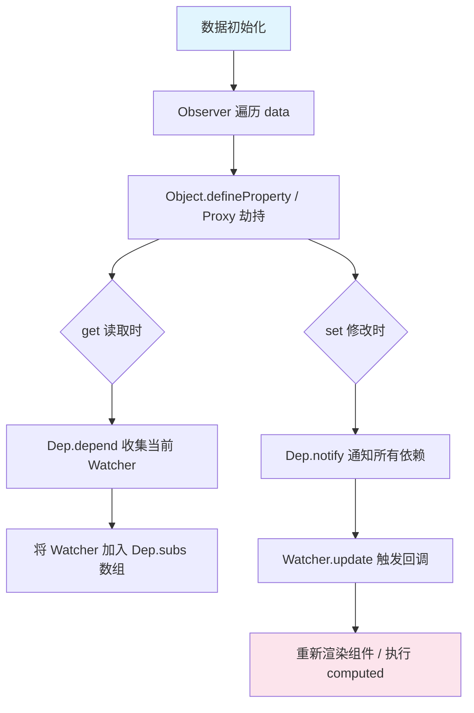
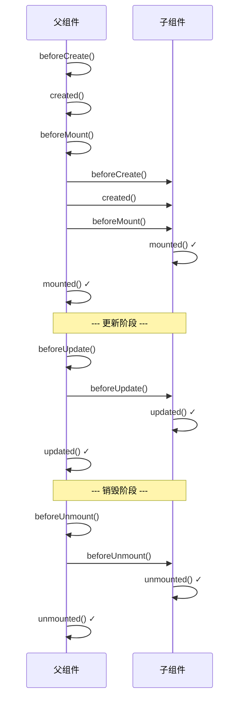
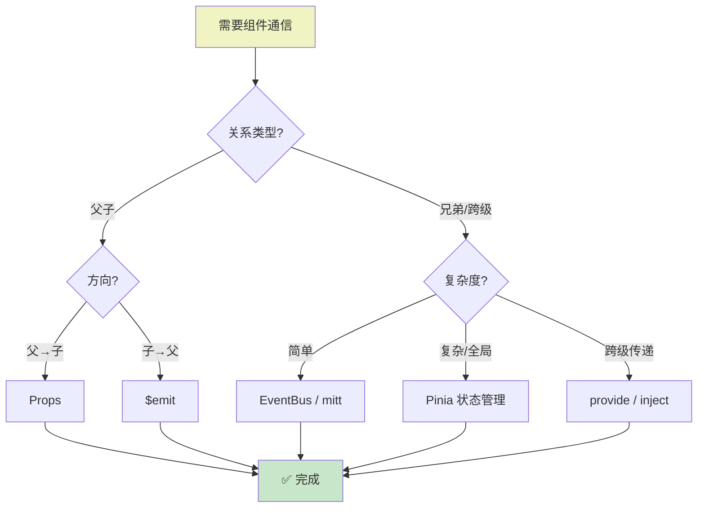

---
---
# Vue.js 基础知识点指南

> **版本**：Vue 3.x | **更新日期**：2026-06-14  
> 本指南系统化整理 Vue.js 核心知识，适合入门学习和日常查阅。

---

## 第1章：Vue 概述

### 1.1 什么是 Vue.js

Vue.js 是一款用于构建用户界面的**渐进式 JavaScript 框架**。核心库只关注视图层，易于上手，便于与第三方库或既有项目整合。

```javascript
// Vue 的核心理念：声明式渲染
const app = Vue.createApp({
  data() {
    return { message: 'Hello Vue!' }
  },
  template: `<div>{{ message }}</div>`
})
app.mount('#app')
```

### 1.2 核心特性

| 特性 | 说明 |
|------|------|
| **声明式渲染** | 使用模板语法声明式地将数据渲染进 DOM |
| **响应式系统** | 自动追踪依赖，数据变化时自动更新视图 |
| **组件化系统** | 通过小型、独立、可复用的组件构建大型应用 |
| **虚拟 DOM** | 在内存中维护 DOM 树的 JavaScript 表示，提高渲染效率 |
| **单文件组件 (SFC)** | 将模板、逻辑、样式封装在 .vue 文件中 |
| **渐进式框架** | 可以作为库使用，也可以作为完整框架 |

### 1.3 版本演进：Vue 2 vs Vue 3

#### 主要区别对比

```javascript
// ====== Vue 2 Options API ======
export default {
  data() {
    return {
      count: 0,
      user: null
    }
  },
  computed: {
    doubleCount() {
      return this.count * 2
    }
  },
  watch: {
    count(newVal) {
      console.log('count 变化了:', newVal)
    }
  },
  methods: {
    increment() {
      this.count++
    }
  },
  mounted() {
    console.log('组件已挂载')
  }
}

// ====== Vue 3 Composition API ======
import { ref, computed, watch, onMounted } from 'vue'

export default {
  setup() {
    // 响应式数据
    const count = ref(0)
    const user = ref(null)

    // 计算属性
    const doubleCount = computed(() => count.value * 2)

    // 监听器
    watch(count, (newVal) => {
      console.log('count 变化了:', newVal)
    })

    // 方法
    const increment = () => count.value++

    // 生命周期
    onMounted(() => {
      console.log('组件已挂载')
    })

    // 返回给模板使用
    return { count, doubleCount, increment, user }
  }
}
```

#### Vue 3 核心改进

1. **性能提升**：虚拟 DOM 重写，编译时优化，体积更小（Tree-shaking）
2. **Composition API**：更好的代码组织和逻辑复用
3. **TypeScript 支持**：更好的类型推导和 IDE 支持
4. **响应式系统升级**：基于 Proxy 实现，支持更多数据类型
5. **Fragments**：组件可以有多个根节点
6. **Teleport**：将组件渲染到 DOM 的任意位置
7. **Suspense**：异步组件加载时的占位符

### 1.4 安装方式

#### 方式一：CDN 引入（适合快速原型开发）

```html
<!-- 开发版本（包含完整的警告和调试模式） -->
<script src="https://unpkg.com/vue@3/dist/vue.global.js"></script>

<!-- 生产版本（压缩过，删除了警告） -->
<script src="https://unpkg.com/vue@3/dist/vue.prod.js"></script>
```

#### 方式二：NPM 安装（推荐用于生产项目）

```bash
# 创建 Vite + Vue 项目（推荐）
npm create vue@latest

# 或手动安装
npm install vue@next
```

```javascript
// main.js - 应用入口文件
import { createApp } from 'vue'
import App from './App.vue'

createApp(App).mount('#app')
```

#### 方式三：Vue CLI（传统方式）

```bash
# 全局安装 Vue CLI
npm install -g @vue/cli

# 创建项目
vue create my-project
```

---

## 第2章：模板语法

### 2.1 插值表达式

#### 文本插值

```html
<template>
  <div>
    <!-- 基础文本插值 -->
    <p>消息：{{ message }}</p>

    <!-- 支持表达式 -->
    <p>计算结果：{{ number + 1 }}</p>
    <p>三元运算：{{ ok ? 'YES' : 'NO' }}</p>
    
    <!-- 调用方法 -->
    <p>反转文本：{{ message.split('').reverse().join('') }}</p>
    
    <!-- ❌ 错误示例：不能是语句或流控制 -->
    <!-- {{ var a = 1 }}        // 赋值语句无效 -->
    <!-- {{ if (ok) {} }}       // 流控制无效 -->
  </div>
</template>

<script setup>
import { ref } from 'vue'
const message = ref('Hello Vue!')
const number = ref(10)
const ok = ref(true)
</script>
```

#### 原始 HTML（v-html）

```html
<template>
  <!-- 双大括号会将数据解释为纯文本 -->
  <div>{{ rawHtml }}</div>
  <!-- 输出：<span style="color:red">这是红色文字</span> -->

  <!-- v-html 输出真正的 HTML -->
  <div v-html="rawHtml"></div>
  <!-- 输出：这是红色文字（红色样式生效）-->
</template>

<script setup>
import { ref } from 'vue'
// ⚠️ 安全警告：动态渲染任意 HTML 容易导致 XSS 攻击
// 只对可信内容使用 v-html，绝不要对用户提供的内容使用
const rawHtml = ref('<span style="color:red">这是红色文字</span>')
</script>
```

### 2.2 属性绑定 v-bind

```html
<template>
  <div>
    <!-- 动态绑定属性（简写 :） -->
    

    <!-- 绑定布尔属性 -->
    <button :disabled="isButtonDisabled">按钮</button>

    <!-- 动态绑定多个值 -->
    <div v-bind="objectOfAttrs">多个属性</div>

    <!-- 绑定 class（对象语法） -->
    <div 
      class="static"
      :class="{ active: isActive, 'text-danger': hasError }"
    >
      对象语法绑定 class
    </div>

    <!-- 绑定 class（数组语法） -->
    <div :class="[activeClass, errorClass]">
      数组语法绑定 class
    </div>

    <!-- 绑定 style（对象语法） -->
    <div :style="{ color: activeColor, fontSize: fontSize + 'px' }">
      行内样式绑定
    </div>

    <!-- 绑定 style（数组语法） -->
    <div :style="[baseStyles, overridingStyles]">
      多个样式对象
    </div>
  </div>
</template>

<script setup>
import { ref, reactive } from 'vue'

const imageUrl = ref('https://example.com/image.jpg')
const imageAlt = ref('示例图片')
const isButtonDisabled = ref(false)

const objectOfAttrs = reactive({
  id: 'container',
  class: 'wrapper'
})

const isActive = ref(true)
const hasError = ref(false)
const activeClass = ref('active')
const errorClass = ref('text-danger')

const activeColor = ref('red')
const fontSize = ref(14)

const baseStyles = reactive({ color: 'blue' })
const overridingStyles = reactive({ fontSize: '16px' })
</script>
```

### 2.3 条件渲染

#### v-if / v-else-if / v-else

```html
<template>
  <div>
    <!-- 条件渲染：真正地条件渲染元素 -->
    <p v-if="type === 'A'">A</p>
    <p v-else-if="type === 'B'">B</p>
    <p v-else-if="type === 'C'">C</p>
    <p v-else">不是 A/B/C</p>

    <!-- v-if 在 <template> 上使用（渲染多个元素） -->
    <template v-if="ok">
      <h1>标题</h1>
      <p>段落 1</p>
      <p>段落 2</p>
    </template>

    <!-- 用 key 管理可复用元素 -->
    <template v-if="loginType === 'username'">
      <label>用户名</label>
      <input placeholder="输入用户名" key="username-input" />
    </template>
    <template v-else>
      <label>邮箱</label>
      <input placeholder="输入邮箱" key="email-input" />
    </template>
    <!-- 加了 key 后，切换时不会复用 input，会重新渲染 -->
  </div>
</template>

<script setup>
import { ref } from 'vue'
const type = ref('A')
const ok = ref(true)
const loginType = ref('username')
</script>
```

#### v-show

```html
<template>
  <div>
    <!-- v-show 只是切换 CSS display 属性 -->
    <p v-show="isVisible">你好！</p>
    
    <!-- 不支持 <template> 元素 -->
    <!-- 不支持 v-else -->
  </div>
</template>

<script setup>
import { ref } from 'vue'
const isVisible = ref(true)
</script>
```

#### v-if vs v-show 区别

| 特性 | v-if | v-show |
|------|------|--------|
| **DOM 表现** | 条件为 false 时完全移除元素 | 始终保留 DOM，仅切换 display:none |
| **初始渲染开销** | 较低（条件 false 时不渲染） | 较高（始终渲染） |
| **切换开销** | 较高（需要销毁/重建） | 较低（仅 CSS 切换） |
| **适用场景** | 运行时条件很少改变 | 需要频繁切换显示/隐藏 |

### 2.4 列表渲染 v-for

```html
<template>
  <div>
    <!-- 基本用法 -->
    <li v-for="item in items" :key="item.id">
      {{ item.message }}
    </li>

    <!-- 带索引 -->
    <li v-for="(item, index) in items" :key="index">
      {{ index }} - {{ item.message }}
    </li>

    <!-- 遍历对象 -->
    <li v-for="(value, key) in object" :key="key">
      {{ key }}: {{ value }}
    </li>

    <!-- 遍历对象（带索引） -->
    <li v-for="(value, key, index) in object" :key="key">
      {{ index }}. {{ key }}: {{ value }}
    </li>

    <!-- 遍历数字 -->
    <span v-for="n in 10" :key="n">{{ n }} </span>

    <!-- 在 <template> 上使用 v-for（渲染多个元素） -->
    <ul>
      <template v-for="item in items" :key="item.id">
        <li>{{ item.msg }}</li>
        <li class="divider">分割线</li>
      </template>
    </ul>

    <!-- v-for 与 v-if 同时使用 -->
    <!-- ⚠️ 注意：v-if 优先级高于 v-for，不推荐同时使用 -->
    <!-- 推荐做法：先用计算属性过滤，再用 v-for 渲染 -->
    <li v-for="user in activeUsers" :key="user.id">
      {{ user.name }}
    </li>
  </div>
</template>

<script setup>
import { ref, computed } from 'vue'

const items = ref([
  { id: 1, message: 'Foo' },
  { id: 2, message: 'Bar' }
])

const object = reactive({
  title: 'How to do lists in Vue',
  author: 'Jane Doe',
  publishedAt: '2016-04-10'
})

// 推荐做法：使用计算属性过滤
const users = ref([
  { id: 1, name: 'Alice', active: true },
  { id: 2, name: 'Bob', active: false },
  { id: 3, name: 'Charlie', active: true }
])

const activeUsers = computed(() => users.value.filter(u => u.active))
</script>
```

#### 为什么推荐使用 key？

```javascript
// key 的作用：帮助 Vue 识别节点，提高 diff 效率
// ✅ 推荐：使用唯一且稳定的 ID 作为 key
<li v-for="item in items" :key="item.id">

// ❌ 不推荐：使用 index 作为 key（列表增删时会导致问题）
<li v-for="(item, index) in items" :key="index">

// ❌ 不推荐：使用随机数（每次渲染都不同，失去意义）
<li v-for="item in items" :key="Math.random()">
```

### 2.5 事件处理 v-on

```html
<template>
  <div>
    <!-- 基本用法（简写 @） -->
    <button @click="count++">加 1</button>
    <button @click="greet">问候</button>

    <!-- 内联处理器中的方法调用 -->
    <button @click("say('hi')">说 hi</button>
    <button @click="warn('表单不能提交', $event)">提交</button>

    <!-- 事件修饰符 -->
    <!-- .stop - 阻止事件冒泡 -->
    <a @click.stop="doThis">阻止冒泡</a>

    <!-- .prevent - 阻止默认行为 -->
    <form @submit.prevent="onSubmit">阻止默认提交</form>

    <!-- .capture - 使用事件捕获模式 -->
    <div @click.capture="doThis">捕获模式</div>

    <!-- .self - 只当事件从元素本身触发时才执行 -->
    <div @click.self="doThat">自身触发</div>

    <!-- .once - 事件只会触发一次 -->
    <button @click.once="doOnce">只触发一次</button>

    <!-- .passive - 滚动事件的默认行为立即触发（提升移动端滚动性能） -->
    <div @scroll.passive="onScroll">滚动</div>

    <!-- 按键修饰符 -->
    <input @keyup.enter="submit" />     <!-- Enter 键 -->
    <input @keyup.page-down="onPageDown" />  <!-- PageDown 键 -->
    <input @keyup.ctrl.enter="clear" />  <!-- Ctrl + Enter -->

    <!-- 鼠标按钮修饰符 -->
    <button @click.left="onClickLeft">左键</button>
    <button @click.right.prevent="onClickRight">右键</button>
    <button @click.middle="onClickMiddle">中键</button>

    <!-- 精确修饰符 -->
    <input @keyup.ctrl.exact="onCtrlClick" />  <!-- 仅按下 Ctrl 时触发 -->
  </div>
</template>

<script setup>
import { ref } from 'vue'

const count = ref(0)

const greet = (event) => {
  alert(`Hello!`)
  // event 是原生 DOM 事件
  if (event) {
    console.log(event.target.tagName)
  }
}

const say = (message) => {
  alert(message)
}

const warn = (message, event) => {
  // 访问原生事件
  event.preventDefault()
  alert(message)
}
</script>
```

### 2.6 双向绑定 v-model

```html
<template>
  <div>
    <!-- 文本输入框 -->
    <input v-model="message" placeholder="编辑我" />
    <p>消息是：{{ message }}</p>

    <!-- 多行文本 -->
    <textarea v-model="message" placeholder="多行文本"></textarea>

    <!-- 复选框（单个） -->
    <input type="checkbox" id="checkbox" v-model="checked" />
    <label for="checkbox">{{ checked }}</label>

    <!-- 复选框（多个，绑定到数组） -->
    <input type="checkbox" value="Jack" v-model="checkedNames" />
    <input type="checkbox" value="John" v-model="checkedNames" />
    <input type="checkbox" value="Mike" v-model="checkedNames" />

    <!-- 单选按钮 -->
    <input type="radio" value="One" v-model="picked" />
    <input type="radio" value="Two" v-model="picked" />

    <!-- 选择框（单选） -->
    <select v-model="selected">
      <option disabled value="">请选择</option>
      <option>A</option>
      <option>B</option>
      <option>C</option>
    </select>

    <!-- 选择框（多选，绑定到数组） -->
    <select v-model="multiSelected" multiple>
      <option>A</option>
      <option>B</option>
      <option>C</option>
    </select>

    <!-- v-model 修饰符 -->
    <!-- .lazy - 在 change 事件后同步（而非 input） -->
    <input v-model.lazy="msg" />

    <!-- .number - 自动将输入值转为数字类型 -->
    <input v-model.number="age" type="number" />

    <!-- .trim - 自动过滤首尾空白字符 -->
    <input v-model.trim="msg" />

    <!-- 自定义组件上的 v-model -->
    <CustomInput v-model="searchText" />
    
    <!-- v-model 参数（Vue 3） -->
    <CustomInput v-model:title="bookTitle" />
    
    <!-- 多个 v-model 绑定 -->
    <UserName
      v-model:first-name="first"
      v-model:last-name="last"
    />
  </div>
</template>

<script setup>
import { ref } from 'vue'
import CustomInput from './CustomInput.vue'
import UserName from './UserName.vue'

const message = ref('')
const checked = ref(false)
const checkedNames = ref([])
const picked = ref('')
const selected = ref('')
const multiSelected = ref([])

const msg = ref('')
const age = ref(0)
const searchText = ref('')
const bookTitle = ref('')
const first = ref('')
const last = ref('')
</script>
```

### 2.7 其他常用指令

```html
<template>
  <div>
    <!-- v-text：更新元素的 textContent -->
    <div v-text="message"></div>
    <!-- 等价于：{{ message }} -->

    <!-- v-html：更新元素的 innerHTML -->
    <div v-html="rawHtml"></div>

    <!-- v-cloak：直到实例准备完成后才显示（配合 CSS 使用） -->
    <!-- 用于解决页面加载时闪烁原始插值表达式的问题 -->
    <div v-cloak>{{ message }}</div>

    <!-- v-once：只渲染元素和组件一次，后续更新会被跳过 -->
    <div v-once>{{ message }}</div>
    <!-- 即使 message 改变，这里也不会更新 -->

    <!-- v-pre：跳过这个元素及其子元素的编译过程 -->
    <div v-pre>{{ 这里的内容不会被编译 }}</div>

    <!-- v-memo：缓存子树（Vue 3.2+） -->
    <!-- 当依赖项不变时，跳过子树的更新 -->
    <div v-memo="[user.id]">
      <p>Name: {{ user.name }}</p>
      <p>Age: {{ user.age }}</p>
    </div>
  </div>
</template>

<style>
/* v-cloak 配合 CSS 隐藏未编译的内容 */
[v-cloak] {
  display: none;
}
</style>
```

---

## 第3章：响应式系统

### 3.1 ref 和 reactive

#### ref - 基本类型和对象的响应式引用

```javascript
import { ref } from 'vue'

// 创建响应式数据
const count = ref(0)           // 数字
const message = ref('hello')   // 字符串
const flag = ref(true)         // 布尔值
const user = ref({             // 对象
  name: '张三',
  age: 18
})
const list = ref([1, 2, 3])   // 数组

// 访问和修改值（需要通过 .value）
console.log(count.value)       // 0
count.value++                  // 修改
console.log(user.value.name)   // 张三

// 在模板中使用时不需要 .value
// <template><div>{{ count }}</div></template>  ✅ 正确
```

#### reactive - 对象的深度响应式代理

```javascript
import { reactive } from 'vue'

// 创建响应式对象（返回 Proxy 代理对象）
const state = reactive({
  count: 0,
  user: {
    name: '李四',
    info: {
      email: 'lisi@example.com'
    }
  },
  items: ['a', 'b', 'c']
})

// 直接访问和修改（不需要 .value）
state.count++
state.user.name = '王五'
state.items.push('d')

// ⚠️ 解构会丢失响应性
const { count, user } = state
// count 和 user 现在不再是响应式的！

// 解决方案：使用 toRefs
```

#### ref vs reactive 对比

| 特性 | ref | reactive |
|------|-----|----------|
| **适用场景** | 基本类型、需要替换整个对象 | 对象/数组、深层嵌套结构 |
| **访问方式** | 需要 `.value` | 直接访问 |
| **解构** | 解构后仍保持响应性 | 解构会丢失响应性 |
| **传递** | 可直接传递整个 ref | 传递的是 Proxy 对象 |
| **模板使用** | 自动解包，无需 `.value` | 直接使用 |

### 3.2 响应式原理：Proxy vs Object.defineProperty

#### Vue 响应式系统工作流程



> 📊 上图展示了 Vue 响应式系统的核心工作流程：数据初始化时通过劫持（Vue 2 用 `Object.defineProperty`，Vue 3 用 `Proxy`）实现依赖收集和变更通知机制。

#### Vue 2 的 Object.defineProperty

```javascript
// Vue 2 响应式原理简化实现
function defineReactive(obj, key, val) {
  // 递归观察嵌套对象
  observe(val)
  
  Object.defineProperty(obj, key, {
    get() {
      // 收集依赖（Watcher）
      if (Dep.target) {
        dep.depend()
      }
      return val
    },
    set(newVal) {
      if (val === newVal) return
      val = newVal
      // 触发更新
      dep.notify()
    }
  })
}

// ❌ Object.defineProperty 的局限性：
// 1. 无法检测对象属性的添加或删除（需要 Vue.set）
// 2. 无法检测数组下标的变化（需要 Vue.set 或数组方法重写）
// 3. 必须递归遍历所有属性，性能开销大
```

#### Vue 3 的 Proxy

```javascript
// Vue 3 响应式原理简化实现
function reactive(target) {
  return new Proxy(target, {
    get(target, key, receiver) {
      // 依赖收集
      track(target, key)
      
      const result = Reflect.get(target, key, receiver)
      
      // 深度代理（惰性）
      if (typeof result === 'object' && result !== null) {
        return reactive(result)
      }
      return result
    },

    set(target, key, value, receiver) {
      const oldValue = target[key]
      const result = Reflect.set(target, key, value, receiver)
      
      // 触发更新
      if (oldValue !== value) {
        trigger(target, key)
      }
      return result
    },

    // 还可以拦截 deleteProperty、has 等
    deleteProperty(target, key) {
      const hadKey = Object.prototype.hasOwnProperty.call(target, key)
      const result = Reflect.deleteProperty(target, key)
      if (hadKey && result) {
        trigger(target, key)
      }
      return result
    }
  })
}

// ✅ Proxy 的优势：
// 1. 可以检测属性的添加和删除
// 2. 可以检测数组索引和长度的变化
// 3. 性能更好（惰性代理，按需深度响应式）
// 4. 支持 Map、Set、WeakMap、WeakSet 等新数据结构
```

#### Vue 3 响应式数据结构

```
target (原始对象)
  └── WeakMap<target, Map>
       └── Map<key, Set>
            └── Set<effect>  (依赖该属性的所有副作用函数)
```

> 📊 上图展示了 Vue 3 响应式系统的内部数据存储结构：使用三层嵌套容器（WeakMap → Map → Set）精确追踪每个对象属性的依赖关系，实现高效的依赖收集和触发机制。

### 3.3 computed 计算属性

```javascript
import { ref, computed } from 'vue'

const firstName = ref('张')
const lastName = ref('三')
const age = ref(18)

// 只读计算属性
const fullName = computed(() => {
  return `${firstName.value}${lastName.value}`
})

// 可写计算属性（较少使用）
const fullName2 = computed({
  get() {
    return `${firstName.value}${lastName.value}`
  },
  set(newValue) {
    // newValue 是设置的新值
    const names = newValue.split(' ')
    firstName.value = names[0]
    lastName.value = names[names.length - 1]
  }
})

// 使用可写计算属性
fullName2.value = '李 四'  // 会触发 setter
console.log(firstName.value)  // 李
console.log(lastName.value)   // 四

// 计算属性 vs 方法
// 计算属性：有缓存，依赖不变时不重新计算
const doubleCount = computed(() => count.value * 2)

// 方法：每次重新渲染都会执行
const getDoubleCount = () => count.value * 2

// ✅ 推荐优先使用计算属性，避免重复计算
```

### 3.4 watch 和 watchEffect

#### watch - 明确指定数据源

```javascript
import { ref, watch, watchEffect } from 'vue'

const count = ref(0)
const name = ref('')

// 监听单个 ref
watch(count, (newValue, oldValue) => {
  console.log(`count 从 ${oldValue} 变为 ${newValue}`)
})

// 监听多个源
watch(
  [count, name],
  ([newCount, newName], [oldCount, oldName]) => {
    console.log(`${oldCount} -> ${newCount}, ${oldName} -> ${newName}`)
  }
)

// 监听 reactive 对象的某个属性
const state = reactive({ count: 0 })
watch(
  () => state.count,
  (newVal, oldVal) => {
    console.log(`state.count: ${oldVal} -> ${newVal}`)
  }
)

// 配置选项
watch(source, callback, {
  immediate: true,    // 立即执行一次回调
  deep: true,         // 深度监听
  flush: 'post'       // 'pre'(默认) | 'post' | 'sync'
})

// flush 选项详解：
// 'pre'  - 默认，在 DOM 更新前调用回调
// 'post' - 在 DOM 更新后调用回调（可以访问更新后的 DOM）
// 'sync' - 响应式依赖变更时同步触发
```

#### watchEffect - 自动追踪依赖

```javascript
// watchEffect 立即执行，自动追踪函数内使用的响应式依赖
watchEffect(() => {
  // 自动追踪 count 和 name
  console.log(`count: ${count.value}, name: ${name.value}`)
})

// 清除副作用
watchEffect((onCleanup) => {
  const timer = setInterval(() => {
    console.log('定时器运行中...')
  }, 1000)
  
  // onCleanup 注册清理函数
  // 当依赖变化或停止监听时会自动调用
  onCleanup(() => {
    clearInterval(timer)
  })
})

// 停止监听
const stop = watchEffect(() => { /* ... */ })
stop()  // 手动停止
```

#### watch vs watchEffect 对比

| 特性 | watch | watchEffect |
|------|-------|-------------|
| **执行时机** | 懒执行（依赖变化后才执行） | 立即执行一次 |
| **指定依赖** | 显式指定数据源 | 自动追踪函数内依赖 |
| **获取旧值** | 可以获取 oldValue | 无法获取 |
| **清除副作用** | 支持 onCleanup | 支持 onCleanup |
| **适用场景** | 需要在特定数据变化时执行逻辑 | 需要自动追踪并响应变化 |

### 3.5 其他响应式 API

```javascript
import { 
  ref, 
  shallowRef, 
  triggerRef,
  toRefs, 
  toRef,
  isRef,
  unref,
  customRef
} from 'vue'

// ========== shallowRef ==========
// 浅层响应式：只有 .value 的访问是响应式的
// 内部值的改变不会触发更新
const state = shallowRef({
  count: 0
})

// ❌ 这不会触发更新（浅层响应式）
state.value.count++

// ✅ 这样才会触发更新（替换整个 .value）
state.value = { count: state.value.count + 1 }

// 或者手动触发
triggerRef(state)
// ========== toRefs ==========
// 将响应式对象转换为普通对象，每个属性都是 ref
const state = reactive({
  name: 'Alice',
  age: 18
})

// 解构后仍保持响应性
const { name, age } = toRefs(state)

console.log(name.value)  // Alice
name.value = 'Bob'      // 会触发更新
// ========== toRef ==========
// 为源响应式对象上的某个属性创建一个 ref
const state = reactive({
  foo: 1,
  bar: 2
})

// 创建 bar 属性的 ref
const barRef = toRef(state, 'bar')

barRef.value++  // 会更新 state.bar
// ========== isRef ==========
// 检查一个值是否为 ref
const count = ref(0)
isRef(count)     // true
isRef(123)       // false
// ========== unref ==========
// 如果参数是 ref 则返回其值，否则返回参数本身
unref(ref(1))    // 1
unref(1)         // 1
// ========== customRef ==========
// 创建自定义 ref，显式控制依赖追踪和更新触发
function useDebouncedRef(value, delay = 200) {
  let timeout
  return customRef((track, trigger) => {
    return {
      get() {
        track()  // 追踪依赖
        return value
      },
      set(newValue) {
        clearTimeout(timeout)
        timeout = setTimeout(() => {
          value = newValue
          trigger()  // 触发更新
        }, delay)
      }
    }
  })
}

// 使用防抖 ref
const text = useDebouncedRef('hello')
```

---

## 第4章：Composition API

### 4.1 setup 函数

```javascript
// setup() 是 Composition API 的入口点
// 在组件创建之前执行，此时 props 已解析

import { ref, onMounted } from 'vue'

export default {
  props: {
    title: String
  },
  // setup 不能访问 this（this 为 undefined）
  setup(props, context) {
    // props - 响应式的 props 对象（不能解构，会丢失响应性）
    // context - 非响应式对象，包含：attrs, slots, emit, expose
    
    console.log(props.title)  // 访问 props
    
    // 响应式状态
    const count = ref(0)
    
    // 方法
    const increment = () => count.value++
    
    // 生命周期钩子
    onMounted(() => {
      console.log('组件已挂载')
    })
    
    // 返回的对象会暴露给模板和其他选项式 API
    return {
      count,
      increment
    }
  }
}
// ========== setup 语法糖 (<script setup>) ==========
// Vue 3.2+ 推荐！更简洁的写法

<script setup>
import { ref, onMounted, computed } from 'vue'

// 导入的组件可直接使用，无需注册
import ChildComponent from './ChildComponent.vue'

// 定义 props
const props = defineProps({
  title: String,
  count: {
    type: Number,
    default: 0
  }
})

// 定义 emits
const emit = defineEmits(['update', 'delete'])

// 响应式状态
const count = ref(0)

// 计算属性
const doubled = computed(() => count.value * 2)

// 方法
const increment = () => {
  count.value++
  emit('update', count.value)
}

// 生命周期
onMounted(() => {
  console.log('mounted:', props.title)
})

// 暴露公共方法（供父组件通过 ref 调用）
defineExpose({
  count,
  reset: () => count.value = 0
})
</script>
```

### 4.2 生命周期钩子

```javascript
import { 
  onBeforeMount, 
  onMounted,
  onBeforeUpdate, 
  onUpdated,
  onBeforeUnmount, 
  onUnmounted,
  onErrorCaptured,
  onActivated,          // KeepAlive 缓存的组件激活时
  onDeactivated,        // KeepAlive 缓存的组件停用时
  onServerPrefetch      // 服务端渲染
} from 'vue'

export default {
  setup() {
    // ========== 创建阶段 ==========
    onBeforeMount(() => {
      // DOM 还没渲染，无法访问 DOM 元素
      console.log('组件即将挂载')
    })
    
    onMounted(() => {
      // DOM 已渲染完成，可以访问 DOM
      console.log('组件已挂载')
      // 常用于：获取数据、操作 DOM、初始化第三方库
    })
    
    // ========== 更新阶段 ==========
    onBeforeUpdate(() => {
      // 数据变化，DOM 即将更新
      console.log('组件即将更新')
    })
    
    onUpdated(() => {
      // DOM 已更新完成
      console.log('组件已更新')
      // ⚠️ 不要在此修改状态，可能导致无限循环
    })
    
    // ========== 卸载阶段 ==========
    onBeforeUnmount(() => {
      // 组件即将卸载
      console.log('组件即将卸载')
      // 常用于：清除定时器、取消订阅、解绑事件
    })
    
    onUnmounted(() => {
      // 组件已卸载
      console.log('组件已卸载')
    })
    
    // ========== 错误捕获 ==========
    onErrorCaptured((err, instance, info) => {
      // 捕获子组件的错误
      console.error('捕获到错误:', err)
      // 返回 false 可以阻止错误继续向上传播
      return false
    })
  }
}
// ========== Options API vs Composition API 生命周期对照 ==========
/*
Options API          | Composition API
---------------------|------------------
beforeCreate         | setup() 中直接编写
created              | setup() 中直接编写
beforeMount          | onBeforeMount()
mounted              | onMounted()
beforeUpdate         | onBeforeUpdate()
updated              | onUpdated()
beforeUnmount        | onBeforeUnmount()  (Vue 3: beforeDestroy → beforeUnmount)
unmounted            | onUnmounted()      (Vue 3: destroyed → unmounted)
errorCaptured        | onErrorCaptured()
*/
```

#### 父子组件生命周期时序



> 📊 上图展示了父子组件在挂载、更新、销毁三个阶段的生命周期执行顺序：父组件先于子组件执行 `beforeCreate`/`created`/`beforeMount`，但子组件先于父组件完成 `mounted`；更新和销毁阶段遵循相同的"父前子后"模式。

#### setup 执行时机

```
组件创建流程:
  beforeCreate → setup() 执行 ← 响应式数据在此创建
              → created     ← 此时 this 不可用（setup 中没有 this）
              → beforeMount
              → mounted
```

> 📊 上图展示了 `setup()` 函数的执行时机：它在 `beforeCreate` 和 `created` 钩子之间执行，是创建响应式数据和组合逻辑的最佳位置。注意：`setup()` 中无法访问 `this`。

### 4.3 provide/inject 依赖注入

```javascript
// ParentComponent.vue - 提供数据
<script setup>
import { provide, ref, readonly } from 'vue'
import ChildComponent from './ChildComponent.vue'

// 提供响应式数据
const themeColor = ref('blue')
const user = ref({ name: 'Admin', role: 'admin' })

// provide(key, value)
provide('theme', themeColor)
provide('user', user)

// ✅ 最佳实践：提供只读数据，防止子组件意外修改
provide('readonlyTheme', readonly(themeColor))

// 提供方法让子组件安全修改数据
const updateTheme = (color) => {
  themeColor.value = color
}
provide('updateTheme', updateTheme)
</script>
// DeepChildComponent.vue - 注入数据
<script setup>
import { inject } from 'vue'

// inject(key, defaultValue)
const theme = inject('theme')                    // 注入主题色
const user = inject('user', { name: 'Guest' })   // 注入用户（带默认值）
const updateTheme = inject('updateTheme')        // 注入修改方法

// 使用注入的数据
const changeTheme = () => {
  updateTheme('red')  // 安全地修改父组件数据
}
</script>

<template>
  <div :style="{ color: theme }">
    当前主题：{{ theme }}
    用户：{{ user.name }}
    <button @click="changeTheme">切换红色主题</button>
  </div>
</template>
```

### 4.4 自定义 Hooks（组合式函数）

```javascript
// ========== 示例1：鼠标位置 Hook ==========
// hooks/useMousePosition.js
import { ref, onMounted, onUnmounted } from 'vue'

export function useMousePosition() {
  const x = ref(0)
  const y = ref(0)

  function update(e) {
    x.value = e.pageX
    y.value = e.pageY
  }

  onMounted(() => window.addEventListener('mousemove', update))
  onUnmounted(() => window.removeEventListener('mousemove', update))

  // 返回响应式状态
  return { x, y }
}

// 使用方式
<script setup>
import { useMousePosition } from './hooks/useMousePosition'

const { x, y } = useMousePosition()
</script>

<template>
  <div>鼠标位置：{{ x }}, {{ y }}</div>
</template>
// ========== 示例2：请求 Hook ==========
// hooks/useRequest.js
import { ref, isRef, unref, watchEffect } from 'vue'

export function useRequest(url) {
  const data = ref(null)
  const error = ref(null)
  const loading = ref(false)

  async function fetchData() {
    loading.value = true
    error.value = null
    
    try {
      // 支持传入 ref 或普通值
      const res = await fetch(unref(url))
      data.value = await res.json()
    } catch (e) {
      error.value = e
    } finally {
      loading.value = false
    }
  }

  // 如果 url 是 ref，当 url 变化时自动重新请求
  if (isRef(url)) {
    watchEffect(fetchData)
  } else {
    fetchData()
  }

  return { data, error, loading, refresh: fetchData }
}

// 使用方式
<script setup>
import { ref } from 'vue'
import { useRequest } from './hooks/useRequest'

const apiUrl = ref('/api/users')
const { data, error, loading, refresh } = useRequest(apiUrl)
</script>
// ========== 示例3：本地存储 Hook ==========
// hooks/useStorage.js
import { ref, watch } from 'vue'

export function useStorage(key, defaultValue) {
  // 从 localStorage 读取初始值
  const storedValue = localStorage.getItem(key)
  const data = ref(storedValue ? JSON.parse(storedValue) : defaultValue)

  // 数据变化时自动保存到 localStorage
  watch(data, (newValue) => {
    localStorage.setItem(key, JSON.stringify(newValue))
  }, { deep: true })

  return data
}

// 使用方式
<script setup>
import { useStorage } from './hooks/useStorage'

const todos = useStorage('todos', [])
const theme = useStorage('theme', 'light')
</script>
```

---

## 第5章：组件化基础

### 5.1 组件定义与注册

#### 单文件组件 (SFC) 结构

```html
<!-- MyComponent.vue -->
<!-- template: 模板部分（必需） -->
<template>
  <div class="my-component">
    <h2>{{ title }}</h2>
    <slot></slot>  <!-- 插槽 -->
  </div>
</template>

<!-- script: 逻辑部分（可选） -->
<script setup>
import { ref, computed } from 'vue'

// 定义 props
const props = defineProps({
  title: {
    type: String,
    required: true
  }
})

// 定义 emits
const emit = defineEmits(['update', 'delete'])

// 响应式状态
const count = ref(0)

// 计算属性
const doubleCount = computed(() => count.value * 2)

// 方法
const handleClick = () => {
  count.value++
  emit('update', count.value)
}
</script>

<!-- style: 样式部分（可选） -->
<style scoped>
/* scoped 表示样式只在当前组件内生效 */
.my-component {
  padding: 16px;
  border: 1px solid #eee;
}
</style>
```

#### 组件注册方式

```javascript
// ========== 全局注册 ==========
// main.js
import { createApp } from 'vue'
import App from './App.vue'
import MyComponent from './components/MyComponent.vue'

const app = createApp(App)

// 全局注册后可在任何组件中直接使用
app.component('MyComponent', MyComponent)

app.mount('#app')
// ========== 局部注册 ==========
// ParentComponent.vue
<script setup>
// 在 <script setup> 中导入的组件可以直接使用
import MyComponent from './MyComponent.vue'
import AnotherComponent from './AnotherComponent.vue'
</script>

<template>
  <div>
    <MyComponent title="Hello" />
    <AnotherComponent />
  </div>
</template>
```

### 5.2 Props

```html
<!-- ChildComponent.vue -->
<script setup>
// 定义 props（支持多种写法）

// 写法1：数组形式（简单场景）
// const props = defineProps(['title', 'likes'])

// 写法2：对象形式（推荐，支持类型检查和验证）
const props = defineProps({
  // 基础类型检查
  title: String,
  
  // 多个可能的类型
  value: [String, Number],
  
  // 必填字段
  requiredProp: {
    type: String,
    required: true
  },
  
  // 默认值
  optionalProp: {
    type: Number,
    default: 42
  },
  
  // 对象/数组默认值应当从一个工厂函数返回
  complexProp: {
    type: Object,
    default: () => ({
      key: 'value'
    })
  },
  
  // 自定义验证函数
  customProp: {
    type: Number,
    validator(value) {
      // 值必须匹配下列字符串中的一个
      return ['success', 'warning', 'danger'].includes(value)
    }
  },
  
  // 函数类型默认值（Vue 3.3+）
  callback: {
    type: Function,
    default: () => 'default function'
  }
})

// 使用 TypeScript 时可以这样写
// interface Props {
//   title: string
//   likes?: number
// }
// const props = withDefaults(defineProps<Props>(), {
//   likes: 0
// })
</script>

<template>
  <div>
    <h3>{{ title }}</h3>
    <p>点赞数：{{ likes || 0 }}</p>
  </div>
</template>
```

#### 父组件传参方式

```html
<!-- ParentComponent.vue -->
<template>
  <div>
    <!-- 静态传参 -->
    <ChildComponent title="静态标题" />
    
    <!-- 动态传参（: 是 v-bind 的简写） -->
    <ChildComponent :title="dynamicTitle" :likes="likeCount" />
    
    <!-- 传入各种类型的值 -->
    <ChildComponent
      :title="'字符串'"
      :likes="100"
      :is-published="true"
      :comment-ids="[1, 2, 3]"
      :author="{ name: '张三' }"
      :callback="myFunction"
    />
    
    <!-- 传入对象的所有属性（展开运算符） -->
    <ChildComponent v-bind="postObject" />
  </div>
</template>
```

### 5.3 Emits 自定义事件

```html
<!-- ChildComponent.vue -->
<script setup>
// 定义组件触发的事件
const emit = defineEmits([
  'update',      // 基本事件
  'delete',      // 带校验的事件
])

// 或带验证的写法
// const emit = defineEmits({
//   // 无校验
//   click: null,
//   
//   // 带校验
//   submit: payload => {
//     if (!payload.email) {
//       console.warn('submit 事件需要 email 参数')
//       return false
//     }
//     return true
//   }
// })

// 触发事件
const handleSubmit = () => {
  emit('update', { value: 123 })  // 传递参数
  
  emit('delete', { id: 456 })
}
</script>

<template>
  <button @click="handleSubmit">提交</button>
</template>
```

#### 父组件监听事件

```html
<!-- ParentComponent.vue -->
<template>
  <ChildComponent
    @update="handleUpdate"
    @delete="handleDelete"
  />
</template>

<script setup>
const handleUpdate = (payload) => {
  console.log('收到更新事件:', payload)
}

const handleDelete = ({ id }) => {
  console.log('删除ID:', id)
}
</script>
```

### 5.4 Slots 插槽

```html
<!-- BaseLayout.vue - 带插槽的布局组件 -->
<template>
  <div class="container">
    <!-- 默认插槽 -->
    <header class="header">
      <slot name="header">
        <p>默认头部内容</p>  <!-- 兜底内容 -->
      </slot>
    </header>
    
    <main class="main">
      <slot>
        <p>默认主体内容</p>
      </slot>
    </main>
    
    <footer class="footer">
      <slot name="footer" />
    </footer>
  </div>
</template>
```

```html
<!-- ParentComponent.vue - 使用插槽 -->
<template>
  <BaseLayout>
    <!-- 具名插槽（v-slot:header 或 #header） -->
    <template #header>
      <h1>页面标题</h1>
    </template>
    
    <!-- 默认插槽内容 -->
    <p>这是主要内容区域</p>
    
    <!-- 另一个具名插槽 -->
    <template #footer>
      <p>版权信息 © 2024</p>
    </template>
  </BaseLayout>
</template>
```

#### 作用域插槽

```html
<!-- UserList.vue - 提供数据的组件 -->
<template>
  <ul>
    <li v-for="user in users" :key="user.id">
      <!-- 将数据通过 v-bind 传递给插槽使用者 -->
      <slot :user="user" :index="index">
        {{ user.name }}  <!-- 兜底内容 -->
      </slot>
    </li>
  </ul>
</template>

<script setup>
defineProps({
  users: {
    type: Array,
    required: true
  }
})
</script>
```

```html
<!-- ParentComponent.vue - 使用作用域插槽 -->
<template>
  <UserList :users="userList">
    <!-- 接收作用域插槽的数据 -->
    <template #default="{ user, index }">
      <span>{{ index + 1 }}. {{ user.name }} - {{ user.email }}</span>
      <button @click="editUser(user)">编辑</button>
    </template>
  </UserList>
</template>
```

### 5.5 父子组件通信

#### Vue 组件通信方式决策图



> 📊 上图提供了 Vue 组件通信方式的选择指南：根据组件间的关系类型（父子、兄弟、跨级）和数据流向，选择最适合的通信方案。父子组件优先使用 Props/$emit；跨级或复杂场景考虑 provide/inject 或 Pinia。

#### 父 → 子：Props

```html
<!-- 父组件 -->
<ChildComponent :message="parentMsg" :user="userInfo" />

<!-- 子组件接收 -->
<script setup>
const props = defineProps({
  message: String,
  user: Object
})
</script>
```

#### 子 → 父：Emits

```html
<!-- 子组件触发事件 -->
<button @click="$emit('update', newValue)">更新</button>

<!-- 父组件监听 -->
<ChildComponent @update="handleUpdate" />
```

#### 父 → 子：ref（调用子组件方法）

```html
<!-- 子组件暴露方法和属性 -->
<script setup>
const count = ref(0)
const increment = () => count.value++
const reset = () => count.value = 0

// 暴露给父组件
defineExpose({ count, increment, reset })
</script>
```

```html
<!-- 父组件通过 ref 调用 -->
<template>
  <ChildComponent ref="childRef" />
  <button @click="childRef.increment()">调用子组件方法</button>
</template>

<script setup>
import { ref } from 'vue'
const childRef = ref(null)
</script>
```

#### v-model 双向绑定通信

```html
<!-- 子组件实现 v-model -->
<script setup>
const props = defineProps(['modelValue'])
const emit = defineEmits(['update:modelValue'])

const updateValue = (newValue) => {
  emit('update:modelValue', newValue)
}
</script>

<template>
  <input
    :value="modelValue"
    @input="updateValue($event.target.value)"
  />
</template>
```

```html
<!-- 父组件使用 v-model -->
<ChildComponent v-model="searchText" />
```

### 5.6 动态组件 & 异步组件 & Teleport & KeepAlive

#### 动态组件

```html
<template>
  <div>
    <!-- 通过 :is 切换组件 -->
    <component :is="currentTab" :key="currentTabKey" />
    
    <!-- 切换按钮 -->
    <button @click="currentTab = 'ComponentA'">A</button>
    <button @click="currentTab = 'ComponentB'">B</button>
  </div>
</template>

<script setup>
import { ref, markRaw } from 'vue'
import ComponentA from './ComponentA.vue'
import ComponentB from './ComponentB.vue'

const currentTab = ref(markRaw(ComponentA))  // markRaw 避免被代理
</script>
```

#### 异步组件

```javascript
import { defineAsyncComponent } from 'vue'

// 定义异步组件
const AsyncComp = defineAsyncComponent(() =>
  import('./components/HeavyComponent.vue')
)

// 高级配置
const AdvancedAsyncComp = defineAsyncComponent({
  loader: () => import('./components/HeavyComponent.vue'),
  
  // 加载异步组件时使用的组件
  loadingComponent: LoadingSpinner,
  
  // 加载失败时使用的组件
  errorComponent: ErrorDisplay,
  
  // 显示 loading 组件前的延迟时间（默认 200ms）
  delay: 200,
  
  // 超时时间（超时后显示 error 组件）
  timeout: 3000
})
```

#### Teleport（传送门）

```html
<template>
  <div>
    <button @showModal = true">打开模态框</button>
    
    <!-- Teleport 将内容传送到 body 下 -->
    <!-- 解决 z-index 层叠问题 -->
    <teleport to="body">
      <div v-if="showModal" class="modal">
        <div class="modal-content">
          <p>这是一个模态框</p>
          <button @showModal = false">关闭</button>
        </div>
      </div>
    </teleport>
  </div>
</template>

<style>
.modal {
  position: fixed;
  top: 0; left: 0;
  width: 100%; height: 100%;
  background: rgba(0, 0, 0, 0.5);
}
</style>
```

#### KeepAlive（缓存组件）

```html
<template>
  <keep-alive>
    <!-- 缓存的组件在切换时不会销毁，保留状态 -->
    <component :is="currentTab" />
  </keep-alive>
  
  <!-- 包含/排除特定组件 -->
  <keep-al :include="['ComponentA', 'ComponentB']">
    <component :is="currentTab" />
  </keep-alive>
  
  <keep-al :exclude="['ComponentC']">
    <component :is="currentTab" />
  </keep-alive>
  
  <!-- 最多缓存 10 个组件实例 -->
  <keep-al :max="10">
    <router-view />
  </keep-alive>
</template>

<script setup>
// 被 keep-alive 缓存的组件可以使用 onActivated/onDeactivated
import { onActivated, onDeactivated } from 'vue'

onActivated(() => {
  // 组件被激活（从缓存恢复）时调用
  console.log('组件被激活')
})

onDeactivated(() => {
  // 组件被停用（进入缓存）时调用
  console.log('组件被停用')
})
</script>
```

---

## 第6章：路由 Vue Router

### 6.1 基本配置

```javascript
// router/index.js
import { createRouter, createWebHistory } from 'vue-router'
import HomeView from '../views/HomeView.vue'

// 定义路由配置
const routes = [
  {
    path: '/',                    // URL 路径
    name: 'home',                 // 路由名称
    component: HomeView,          // 对应组件
    alias: '/home',               // 别名
    redirect: '/dashboard',       // 重定向
  },
  {
    path: '/about',
    name: 'about',
    component: () => import('../views/AboutView.vue'),  // 懒加载
    meta: {                       // 路由元信息
      requiresAuth: true,
      title: '关于我们'
    }
  }
]

// 创建路由实例
const router = createRouter({
  history: createWebHistory(import.meta.env.BASE_URL),  // history 模式
  routes,
  
  // 其他配置
  scrollBehavior(to, from, savedPosition) {
    // 控制路由切换时的滚动行为
    if (savedPosition) {
      return savedPosition  // 浏览器前进/后退时恢复位置
    } else if (to.hash) {
      return { el: to.hash }  // 有锚点时滚动到对应位置
    } else {
      return { top: 0 }  // 滚动到顶部
    }
  }
})

export default router
```

```javascript
// main.js
import { createApp } from 'vue'
import App from './App.vue'
import router from './router'

const app = createApp(App)
app.use(router)  // 注册路由插件
app.mount('#app')
```

```html
<!-- App.vue -->
<template>
  <div id="app">
    <!-- 导航链接 -->
    <nav>
      <router-link to="/">首页</router-link>
      <router-link to="/about">关于</router-link>
      
      <!-- 编程式导航的对象写法 -->
      <router-link :to="{ name: 'user', params: { id: 123 } }">
        用户页面
      </router-link>
    </nav>
    
    <!-- 路由出口（渲染匹配的组件） -->
    <main>
      <router-view />
    </main>
  </div>
</template>
```

### 6.2 路由模式

#### Hash 模式

```javascript
// URL 格式：http://example.com/#/home
// 使用 URL 的 hash 部分（#）来模拟路径
// 优点：兼容性好，无需服务器配置
// 缺点：URL 不美观，SEO 不友好

import { createRouter, createWebHashHistory } from 'vue-router'

const router = createRouter({
  history: createWebHashHistory(),
  routes
})
```

#### History 模式

```javascript
// URL 格式：http://example.com/home
// 使用 HTML5 History API
// 优点：URL 美观，利于 SEO
// 缺点：需要服务器配置（404 重定向到 index.html）

import { createRouter, createWebHistory } from 'vue-router'

const router = createRouter({
  history: createWebHistory(),
  routes
})

// Nginx 配置示例
/*
location / {
  try_files $uri $uri/ /index.html;
}
*/
```

#### Memory 模式（抽象模式）

```javascript
// 不依赖于浏览器环境，适用于非浏览器场景（如 Node.js、SSR）
import { createRouter, createMemoryHistory } from 'vue-router'

const router = createRouter({
  history: createMemoryHistory(),
  routes
})
```

### 6.3 导航守卫

#### 全局守卫

```javascript
// router/index.js

// 全局前置守卫（每次导航前触发）
router.beforeEach((to, from, next) => {
  // to: 即将进入的目标路由
  // from: 当前正要离开的路由
  // next: 放行函数（可选，推荐返回值方式）
  
  console.log('从', from.path, '到', to.path)
  
  // 判断是否需要登录
  if (to.meta.requiresAuth) {
    const isAuthenticated = checkAuth()
    
    if (!isAuthenticated) {
      // 未登录，重定向到登录页
      return { path: '/login', query: { redirect: to.fullPath } }
    }
  }
  
  // 设置页面标题
  document.title = to.meta.title || '默认标题'
  
  // 放行
  return true
})

// 全局后置钩子（导航成功后触发，不接受 next）
router.afterEach((to, from) => {
  // 常用于：分析、更改页面标题、声明页面等辅助功能
  console.log('导航完成:', to.path)
})

// 全局解析守卫（在组件内守卫和异步路由组件被解析之后触发）
router.beforeResolve(async (to) => {
  if (to.meta.requiresData) {
    // 可以在这里预取数据
    await store.dispatch('fetchData')
  }
})
```

#### 路由独享守卫

```javascript
const routes = [
  {
    path: '/admin/:id',
    component: AdminPanel,
    // 进入该路由前触发
    beforeEnter: (to, from) => {
      // 检查权限
      if (!isAdmin()) {
        return { name: 'Forbidden' }
      }
    }
  }
]

// 也可以传入数组（多个守卫）
{
  path: '/admin/:id',
  beforeEnter: [
    checkAuth,
    checkPermission,
    validateParams
  ]
}
```

#### 组件内守卫

```html
<script setup>
import { onBeforeRouteLeave, onBeforeRouteUpdate } from 'vue-router'

// 离开当前路由时触发
// 常用于：防止用户未保存就离开
onBeforeRouteLeave((to, from) => {
  const answer = window.confirm('确定要离开吗？未保存的更改将会丢失！')
  if (!answer) return false  // 取消导航
})

// 当前路由改变但组件被复用时触发
// 例如：/user/123 切换到 /user/456
onBeforeRouteUpdate(async (to) => {
  // 根据新的路由参数获取数据
  userData.value = await fetchUser(to.params.id)
})
</script>
```

#### 完整导航流程

```
1. 导航被触发
2. 在失活的组件里调用 beforeRouteLeave
3. 调用全局 beforeEach 守卫
4. 在重用的组件里调用 beforeRouteUpdate
5. 调用路由配置里的 beforeEnter
6. 解析异步路由组件
7. 在被激活的组件里调用 beforeRouteEnter
8. 调用全局 beforeResolve 守卫
9. 导航被确认
10. 调用全局 afterEach 钩子
11. 触发 DOM 更新
12. 调用 beforeRouteEnter 守卫中传给 next 的回调函数
```

### 6.4 懒加载（代码分割）

```javascript
// 路由懒加载：将每个路由对应的组件打包成独立的 chunk
// 只有访问该路由时才加载对应的代码

const routes = [
  {
    path: '/',
    name: 'Home',
    component: () => import('../views/Home.vue')
  },
  {
    path: '/about',
    name: 'About',
    // webpackChunkName: 指定打包后的文件名
    component: () => import(/* webpackChunkName: "about" */ '../views/About.vue')
  },
  {
    path: '/admin',
    name: 'Admin',
    // 将同一组的路由打包在一起
    component: () => import(/* webpackChunkName: "group-admin" */ '../views/Admin.vue')
  }
]

// 打包后的文件结构：
// Home.[hash].js
// about.[hash].js
// group-admin.[hash].js
```

### 6.5 嵌套路由 & 动态路由

#### 嵌套路由

```javascript
const routes = [
  {
    path: '/user/:id',
    component: User,
    // 子路由
    children: [
      {
        // 空路径：/user/:id 时渲染 UserProfile
        path: '',
        component: UserProfile
      },
      {
        // /user/:id/posts 时渲染 UserPosts
        path: 'posts',
        component: UserPosts
      },
      {
        // /user/:id/settings 时渲染 UserSettings
        path: 'settings',
        component: UserSettings
      }
    ]
  }
]
```

```html
<!-- User.vue - 父组件需要有 router-view 来渲染子路由 -->
<template>
  <div class="user-container">
    <h2>用户 {{ $route.params.id }}</h2>
    
    <!-- 子路由导航 -->
    <router-link to="">个人资料</router-link>
    <router-link to="posts">文章</router-link>
    <router-link to="settings">设置</router-link>
    
    <!-- 子路由出口 -->
    <router-view />
  </div>
</template>
```

#### 动态路由

```javascript
// 添加路由（动态添加）
router.addRoute({
  path: '/new-page',
  name: 'NewPage',
  component: NewPage
})

// 添加嵌套路由
router.addRoute('ParentName', {
  path: 'child',
  component: ChildComponent
})

// 删除路由
router.removeRoute('routeName')

// 检查路由是否存在
router.hasRoute('routeName')

// 获取当前路由的所有记录
router.getRoutes()

// 常见应用场景：根据权限动态添加路由
function addRoutesByPermission(permissions) {
  permissions.forEach(perm => {
    router.addRoute(generateRoute(perm))
  })
}
```

#### 路由参数

```javascript
// 定义带参数的路由
{
  path: '/user/:id',           // 动态段以冒号开始
  path: '/search/:keyword?',   // 可选参数（?）
  path: '/files/*',            // 匹配所有（0 个或多个）
  path: '/files/*.jpg',        // 以 .jpg 结尾的路径
}

// 获取参数
// 在组件中：
this.$route.params.id

// 在 setup 中：
import { useRoute } from 'vue-router'
const route = useRoute()
const userId = route.params.id

// 查询参数
// URL: /search?q=vue&lang=zh
route.query.q      // 'vue'
route.query.lang   // 'zh'

// Hash
// URL: /page#section
route.hash         // '#section'
```

---

## 第7章：状态管理 Pinia

### 7.1 Store 定义

```javascript
// stores/counter.js
import { defineStore } from 'pinia'
import { ref, computed } from 'vue'

// 定义 store（类似组合式函数）
// useCounterStore 是 store 的 id，必须唯一
export const useCounterStore = defineStore('counter', () => {
  // ========== State（状态）==========
  const count = ref(0)
  const name = ref('计数器')
  
  // ========== Getters（ getters）==========
  const doubleCount = computed(() => count.value * 2)
  
  // 获取其他 getter
  const doubleCountPlusOne = computed(() => doubleCount.value + 1)
  
  // getter 可以接受参数
  const getUserById = computed(() => {
    return (userId) => users.value.find(user => user.id === userId)
  })
  
  // ========== Actions（ actions）==========
  function increment() {
    count.value++
  }
  
  function decrement() {
    count.value--
  }
  
  function reset() {
    count.value = 0
    name.value = '计数器'
  }
  
  // action 可以是异步的
  async function fetchData() {
    const response = await fetch('/api/data')
    const data = await response.json()
    count.value = data.count
  }
  
  // 返回需要在组件中使用的状态和方法
  return {
    count,
    name,
    doubleCount,
    doubleCountPlusOne,
    increment,
    decrement,
    reset,
    fetchData
  }
})
// ========== 选项式 API 风格的定义方式 ==========
export const useUserStore = defineStore('user', {
  // State（相当于组件的 data）
  state: () => ({
    users: [],
    currentUser: null,
    isLoading: false
  }),
  
  // Getters（相当于组件的 computed）
  getters: {
    // 箭头函数，可以通过 this 访问 state 和其他 getters
    getUserCount: (state) => state.users.length,
    
    // 普通函数，可以通过 this 访问整个 store 实例
    getCurrentUserName(state) {
      return state.currentUser?.name ?? '未登录'
    },
    
    // 传递参数给 getter
    getUserById: (state) => {
      return (id) => state.users.find(user => user.id === id)
    }
  },
  
  // Actions（相当于组件的 methods）
  actions: {
    // 可以是同步的
    addUser(user) {
      this.users.push(user)
    },
    
    // 也可以是异步的
    async fetchUsers() {
      this.isLoading = true
      try {
        const response = await fetch('/api/users')
        this.users = await response.json()
      } finally {
        this.isLoading = false
      }
    },
    
    // 可以调用其他 action
    async login(credentials) {
      const user = await api.login(credentials)
      this.setCurrentUser(user)
      this.fetchUserPreferences()
    }
  }
})
```

### 7.2 在组件中使用

```html
<script setup>
import { useCounterStore } from '@/stores/counter'
import { storeToRefs } from 'pinia'

// 获取 store 实例
const counterStore = useCounterStore()

// ✅ 推荐方式：使用 storeToRefs 保持响应性
// （直接解构会丢失响应性）
const { count, name, doubleCount } = storeToRefs(counterStore)

// actions 可以直接解构（它们只是函数）
const { increment, decrement, reset } = counterStore

// 在模板中使用
// {{ count }}
// <button @click="increment">+1</button>
</script>
```

```html
<template>
  <div>
    <!-- 直接在模板中使用 store -->
    <p>计数：{{ counterStore.count }}</p>
    <p>双倍：{{ counterStore.doubleCount }}</p>
    
    <button @click="counterStore.increment()">增加</button>
    <button @click="counterStore.decrement()">减少</button>
    
    <!-- 批量修改状态 -->
    <button @click="patchState">批量更新</button>
  </div>
</template>

<script setup>
import { useCounterStore } from '@/stores/counter'

const counterStore = useCounterStore()

// 直接修改 state（Pinia 允许直接修改）
const patchState = () => {
  counterStore.$patch({
    count: counterStore.count + 10,
    name: '新名称'
  })
  
  // 或者使用函数进行复杂修改
  counterStore.$patch((state) => {
    state.count += 5
    state.items.push({ name: '新项', id: Date.now() })
  })
}

// 重置状态到初始值
const resetAll = () => {
  counterStore.$reset()
}

// 订阅状态变化
counterStore.$subscribe((mutation, state) => {
  console.log('状态变化:', mutation.type, mutation.storeId)
  // mutation.type: 'direct' | 'patch object' | 'patch function'
  // localStorage.setItem('counter', JSON.stringify(state))
}, { detached: true })  // detached: 组件卸载后继续监听
</script>
```

### 7.3 模块化管理

```javascript
// stores/index.js - 统一导出
export { useCounterStore } from './counter'
export { useUserStore } from './user'
export { useCartStore } from './cart'
// stores/cart.js - 购物车模块
import { defineStore } from 'pinia'
import { useUserStore } from './user'  // 可以引用其他 store

export const useCartStore = defineStore('cart', () => {
  const items = ref([])
  const userStore = useUserStore()  // 在 store 内部使用另一个 store
  
  const totalPrice = computed(() => {
    return items.value.reduce((sum, item) => sum + item.price * item.quantity, 0)
  })
  
  function addItem(product) {
    // 可以访问其他 store 的数据
    if (!userStore.isLoggedIn) {
      throw new Error('请先登录')
    }
    
    const existingItem = items.value.find(i => i.id === product.id)
    if (existingItem) {
      existingItem.quantity++
    } else {
      items.value.push({ ...product, quantity: 1 })
    }
  }
  
  function removeItem(productId) {
    const index = items.value.findIndex(i => i.id === productId)
    if (index > -1) {
      items.value.splice(index, 1)
    }
  }
  
  function clearCart() {
    items.value = []
  }
  
  return { items, totalPrice, addItem, removeItem, clearCart }
})
```

### 7.4 插件系统

```javascript
// plugins/piniaPersistence.js
// 示例：持久化插件 - 将状态保存到 localStorage
export function piniaPersistencePlugin({ store }) {
  // 从 localStorage 恢复状态
  const savedState = localStorage.getItem(`pinia-${store.$id}`)
  if (savedState) {
    store.$patch(JSON.parse(savedState))
  }
  
  // 状态变化时保存到 localStorage
  store.$subscribe((mutation, state) => {
    localStorage.setItem(`pinia-${store.$id}`, JSON.stringify(state))
  })
}

// plugins/piniaLogger.js
// 示例：日志插件
export function piniaLoggerPlugin({ store }) {
  store.$subscribe((mutation, state) => {
    console.log(`[Pinia] [${store.$id}]`, {
      type: mutation.type,
      payload: mutation.payload,
      newState: state
    })
  })
}
// main.js - 注册插件
import { createPinia } from 'pinia'
import { piniaPersistencePlugin } from './plugins/piniaPersistence'
import { piniaLoggerPlugin } from './plugins/piniaLogger'

const pinia = createPinia()

// 使用插件
pinia.use(piniaPersistencePlugin)
pinia.use(piniaLoggerPlugin)

app.use(pinia)
```

### 7.5 Pinia vs Vuex 对比

| 特性 | Pinia (Vue 3 推荐) | Vuex (Vue 2/3) |
|------|-------------------|----------------|
| **安装** | 需要单独安装 `pinia` | Vue 3 需安装 `vuex@4` |
| **Mutation** | ❌ 不需要，直接修改 state | ✅ 必须通过 mutation 修改 |
| **Action** | 支持同步和异步 | 支持同步和异步 |
| **Getter** | 类似 computed | 类似 computed |
| **TypeScript** | ✅ 完美支持，自动推断类型 | 需要额外装饰器 |
| **Modules** | 每个 store 独立文件，天然扁平化 | 需要命名空间管理 |
| **代码分割** | ✅ 天然支持（store 按需加载） | 通常全部打包在一起 |
| **DevTools** | ✅ 支持 Vue DevTools | ✅ 支持 Vue DevTools |
| **体积** | ~1KB (gzipped) | ~10kb+ (gzipped) |
| **API 风格** | Composition API / Options API | Options API |

```javascript
// Vuex 4 写法对比（仅供参考）
// store/index.js
import { createStore } from 'vuex'

export default createStore({
  state() {
    return {
      count: 0
    }
  },
  mutations: {
    INCREMENT(state) {
      state.count++
    }
  },
  actions: {
    increment({ commit }) {
      commit('INCREMENT')
    }
  },
  getters: {
    doubleCount(state) {
      return state.count * 2
    }
  },
  modules: {
    // 子模块...
  }
})
```

---

## 第8章：内置指令与特殊属性

### 8.1 key 的作用与原理

```html
<template>
  <div>
    <!-- key 是 Vue 虚拟 DOM Diff 算法的标识 -->
    <!-- 用于判断两个节点是否相同，决定是否复用 DOM 元素 -->
    
    <!-- ✅ 正确：使用唯一且稳定的 ID -->
    <li v-for="item in items" :key="item.id">
      {{ item.text }}
    </li>
    
    <!-- ⚠️ 不推荐：使用 index 作为 key -->
    <!-- 问题：列表插入/删除/排序时会导致错误的 DOM 复用 -->
    <li v-for="(item, index in items" :key="index">
      {{ item.text }}
    </li>
    
    <!-- key 的工作原理示意 -->
    
    <!-- Diff 算法 key 对比详细过程 -->
    <!-- 
    旧节点列表: [A, B, C, D]   key: a, b, c, d
    新节点列表: [D, A, B, C]   key: d, a, b, c

    Step 1: 建立 oldKeyMap = {a:0, b:1, c:2, d:3}
    Step 2: 遍历新节点:
      new[0]=D(key=d) → oldIdx=3 → 移动到位置0
      new[1]=A(key=a) → oldIdx=0 → 已在正确位置(相对)
      new[2]=B(key=b) → oldIdx=1 → 已在正确位置(相对)
      new[3]=C(key=c) → oldIdx=2 → 已在正确位置(相对)

    结果: 仅移动D节点一次! (无key则需要重建4个DOM节点)
    -->
    
    <!-- 
    旧节点: [A, B, C]  key: [1, 2, 3]
    新节点: [D, B, C]  key: [4, 2, 3]
    
    Diff 过程:
    - key=1 (A) → 不存在 → 移除 A
    - key=2 (B) → 存在 → 复用
    - key=3 (C) → 存在 → 复用  
    - key=4 (D) → 不存在 → 新增 D
    
    结果: 最小化 DOM 操作
    -->
  </div>
</template>
```

#### Diff 算法 Key 对比过程示例

```
旧节点列表: [A, B, C, D]   key: a, b, c, d
新节点列表: [D, A, B, C]   key: d, a, b, c

Step 1: 建立 oldKeyMap = {a:0, b:1, c:2, d:3}
Step 2: 遍历新节点:
  new[0]=D(key=d) → oldIdx=3 → 移动到位置0
  new[1]=A(key=a) → oldIdx=0 → 已在正确位置(相对)
  new[2]=B(key=b) → oldIdx=1 → 已在正确位置(相对)
  new[3]=C(key=c) → oldIdx=2 → 已在正确位置(相对)

结果: 仅移动D节点一次! (无key则需要重建4个DOM节点)
```

> 📊 上图展示了 Vue Diff 算法利用 key 进行高效 DOM 复用的具体过程：通过建立旧节点的 key 索引映射（oldKeyMap），遍历新节点时可以快速定位到旧节点位置，仅需移动最少的 DOM 节点即可完成更新。

### 8.2 v-model 原理与参数

#### v-model 的本质

```html
<!-- v-model 是以下语法的语法糖 -->
<!-- 等价于： -->
<input
  :model-value="searchText"
  @update:model-value="searchText = $event"
/>

<!-- 自定义组件实现 v-model -->
<!-- CustomInput.vue -->
<script setup>
const props = defineProps(['modelValue'])
const emit = defineEmits(['update:modelValue'])
</script>

<template>
  <input
    :value="modelValue"
    @input="emit('update:modelValue', $event.target.value)"
  />
</template>
```

#### v-model 参数（自定义参数名）

```html
<!-- Vue 3 支持自定义 v-model 参数 -->
<!-- CustomTitle.vue -->
<script setup>
const props = defineProps(['title'])
const emit = defineEmits(['update:title'])
</script>

<template>
  <input
    type="text"
    :value="title"
    @input="emit('update:title', $event.target.value)"
  />
</template>
```

```html
<!-- 使用自定义参数的 v-model -->
<CustomTitle v-model:title="pageTitle" />

<!-- 等价于 -->
<CustomTitle
  :title="pageTitle"
  @update:title="pageTitle = $event"
/>
```

#### v-model 修饰符

```html
<!-- 自定义组件支持修饰符 -->
<!-- CustomInput.vue -->
<script setup>
const props = defineProps({
  modelValue: String,
  modelModifiers: {    // 接收修饰符对象
    default: () => ({})
  }
})

const emit = defineEmits(['update:modelValue'])

function emitValue(e) {
  let value = e.target.value
  // 根据修饰符处理值
  if (props.modelModifiers.capitalize) {
    value = value.charAt(0).toUpperCase() + value.slice(1)
  }
  emit('update:modelValue', value)
}
</script>

<template>
  <input :value="modelValue" @input="emitValue" />
</template>
```

```html
<!-- 使用带修饰符的自定义 v-model -->
<CustomInput v-model.capitalize="text" />
```

### 8.3 v-slot 插槽详解

#### 默认插槽

```html
<!-- BaseButton.vue -->
<template>
  <button class="btn">
    <!-- 默认插槽：没有 name 的插槽 -->
    <slot>
      <!-- 兜底内容：当没有提供插槽内容时显示 -->
      默认按钮
    </slot>
  </button>
</template>
```

```html
<!-- 使用默认插槽 -->
<BaseButton>
  <span>点击我</span>  <!-- 替换兜底内容 -->
</BaseButton>

<!-- 使用 v-slot 简写 # -->
<BaseButton>
  <template #default>
    <strong>重要按钮</strong>
  </template>
</BaseButton>
```

#### 具名插槽

```html
<!-- BaseCard.vue -->
<template>
  <div class="card">
    <header class="card-header">
      <slot name="header">
        <h3>默认标题</h3>
      </slot>
    </header>
    
    <main class="card-body">
      <slot />
    </main>
    
    <footer class="card-footer">
      <slot name="footer" />
    </footer>
  </div>
</template>
```

```html
<!-- 使用具名插槽 -->
<BaseCard>
  <template #header>
    <h1>自定义标题</h1>
  </template>
  
  <p>这是卡片主体内容</p>
  
  <template #footer>
    <small>版权所有 © 2024</small>
  </template>
</BaseCard>
```

#### 作用域插槽

```html
<!-- UserDataList.vue - 提供数据的作用域插槽 -->
<template>
  <ul>
    <li v-for="user in users" :key="user.id">
      <!-- 通过 v-bind 将数据传递出去 -->
      <slot name="user-item" :user="user" :index="index">
        {{ user.name }}  <!-- 兜底内容 -->
      </slot>
    </li>
  </ul>
</template>
```

```html
<!-- 使用作用域插槽（解构接收数据） -->
<UserDataList :users="userList">
  <template #user-item="{ user, index }">
    <div class="user-card">
      <span class="index">{{ index + 1 }}</span>
      
      <div class="info">
        <h4>{{ user.name }}</h4>
        <p>{{ user.email }}</p>
      </div>
      <button @click="editUser(user)">编辑</button>
    </div>
  </template>
</UserDataList>
```

#### 动态插槽名

```html
<template>
  <BaseLayout>
    <!-- 动态插槽名（使用方括号语法） -->
    <template #[dynamicSlotName]>
      动态内容
    </template>
  </BaseLayout>
</template>

<script setup>
import { ref } from 'vue'
const dynamicSlotName = ref('header')
</script>
```

#### 插槽的最佳实践

```html
<!--
插槽设计原则：
1. 提供合理的兜底内容
2. 使用作用域插槽提供数据
3. 具名插槽语义化命名
4. 保持插槽的灵活性
-->

<!-- 好的设计示例 -->
<template>
  <div class="table-wrapper">
    <!-- 表头插槽 -->
    <div class="table-header">
      <slot name="header" :columns="columns" />
    </div>
    
    <!-- 表体插槽（作用域插槽） -->
    <div class="table-body">
      <slot name="row" v-for="item in data" :key="item.id" :row="item" />
    </div>
    
    <!-- 空状态插槽 -->
    <div v-if="data.length === 0" class="empty-state">
      <slot name="empty">
        <p>暂无数据</p>
      </slot>
    </div>
    
    <!-- 分页插槽 -->
    <div class="pagination">
      <slot name="pagination" :total="data.length" />
    </div>
  </div>
</template>
```

---

## 第9章：过渡与动画

### 9.1 Transition 组件

```html
<template>
  <div>
    <button @toggle = !show">切换显示</button>
    
    <!-- 基础过渡 -->
    <Transition>
      <p v-if="show">hello</p>
    </Transition>
  </div>
</template>

<style>
/* 
Transition 组件会自动应用以下 CSS 类：

进入过渡：
- v-enter-from: 进入开始状态
- v-enter-active: 进入过程中（定义过渡时长、延迟、曲线）
- v-enter-to: 进入结束状态（Vue 3，Vue 2 为 v-enter）

离开过渡：
- v-leave-from: 离开开始状态（Vue 3，Vue 2 为 v-leave）
- v-leave-active: 离开过程中
- v-leave-to: 离开结束状态
*/

/* 自定义过渡名称 */
.my-transition-enter-active,
.my-transition-leave-active {
  transition: opacity 0.5s ease;
}

.my-transition-enter-from,
.my-transition-leave-to {
  opacity: 0;
}

/* 默认类名（v- 前缀） */
.v-enter-active,
.v-leave-active {
  transition: all 0.3s ease;
}

.v-enter-from,
.v-leave-to {
  opacity: 0;
  transform: translateX(30px);
}
</style>
```

#### Transition 组件属性

```html
<template>
  <!-- 
    Transition 组件支持的属性：
    - name: 自定义过渡类名前缀
    - appear: 是否在初始渲染时应用过渡
    - mode: in-out / out-in（控制进出顺序）
    - duration: 过渡持续时间
    - enter-active-class / leave-active-class: 自定义类名
    - css: 是否使用 CSS 过渡（false 时使用 JS 钩子）
    - type: 指定过渡事件类型（transition / animation）
  -->
  
  <Transition
    name="fade"
    appear
    :duration="{ enter: 500, leave: 300 }"
  >
    <div v-if="show">内容</div>
  </Transition>
</template>
```

### 9.2 CSS 过渡动画

```html
<template>
  <div>
    <!-- 示例1：淡入淡出 -->
    <Transition name="fade">
      <h1 v-if="showTitle">标题</h1>
    </Transition>
    
    <!-- 示例2：滑动效果 -->
    <Transition name="slide">
      <p v-if="showContent">内容区域</p>
    </Transition>
    
    <!-- 示例3：缩放效果 -->
    <Transition name="zoom">
      <div v-if="showBox" class="box">盒子</div>
    </Transition>
  </div>
</template>

<style>
/* 淡入淡出 */
.fade-enter-active,
.fade-leave-active {
  transition: opacity 0.3s ease;
}
.fade-enter-from,
.fade-leave-to {
  opacity: 0;
}

/* 滑动效果 */
.slide-enter-active {
  transition: all 0.3s ease-out;
}
.slide-leave-active {
  transition: all 0.2s ease-in;
}
.slide-enter-from {
  transform: translateX(20px);
  opacity: 0;
}
.slide-leave-to {
  transform: translateX(-20px);
  opacity: 0;
}

/* 缩放效果 */
.zoom-enter-active,
.zoom-leave-active {
  transition: all 0.3s ease;
}
.zoom-enter-from,
.zoom-leave-to {
  transform: scale(0);
  opacity: 0;
}

.box {
  width: 100px;
  height: 100px;
  background: #42b983;
}
</style>
```

### 9.3 JS 钩子函数

```html
<template>
  <Transition
    @before-enter="onBeforeEnter"
    @enter="onEnter"
    @after-enter="onAfterEnter"
    @enter-cancelled="onEnterCancelled"
    @before-leave="onBeforeLeave"
    @leave="onLeave"
    @after-leave="onAfterLeave"
    @leave-cancelled="onLeaveCancelled"
    :css="false"  <!-- 禁用 CSS 过渡，只用 JS -->
  >
    <div v-if="show" class="box"></div>
  </Transition>
</template>

<script setup>
// 进入阶段钩子
function onBeforeEnter(el) {
  // 设置初始状态
  el.style.opacity = 0
  el.style.transformOrigin = 'left'
}

function onEnter(el, done) {
  // done 是回调函数，表示过渡结束
  // 对于 JS 动画，必须调用 done
  Velocity(el, { opacity: 1, fontSize: '1.5em' }, { duration: 300, done })
}

function onAfterEnter(el) {
  console.log('进入动画完成')
}

function onEnterCancelled(el) {
  // 进入动画被取消时调用
}

// 离开阶段钩子
function onBeforeLeave(el) {
  el.style.height = el.offsetHeight + 'px'  // 固定高度
}

function onLeave(el, done) {
  Velocity(el, { opacity: 0, height: 0 }, { duration: 300, done })
}

function onAfterLeave(el) {
  console.log('离开动画完成')
}

function onLeaveCancelled(el) {
  // 仅在使用 v-show 时可能触发
}
</script>
```

### 9.4 TransitionGroup 列表动画

```html
<template>
  <div>
    <button @addItem">添加</button>
    <button @removeIndex(0)">移除第一个</button>
    <button @shuffle">打乱顺序</button>
    
    <!-- 
      TransitionGroup:
      - 默认渲染 <span>（可通过 tag 属性更改）
      - 过渡模式不可用
      - 内部元素必须有唯一的 key
      - 支持 FLIP 动画
    -->
    <TransitionGroup
      name="list"
      tag="ul"
      class="list-container"
    >
      <li
        v-for="(item, index) in items"
        :key="item.id"
        class="list-item"
      >
        {{ item.text }}
        <button @removeItem(index)">×</button>
      </li>
    </TransitionGroup>
  </div>
</template>

<script setup>
import { ref } from 'vue'

const items = ref([
  { id: 1, text: '项目 1' },
  { id: 2, text: '项目 2' },
  { id: 3, text: '项目 3' }
])

let idCounter = 4

function addItem() {
  items.value.push({
    id: idCounter++,
    text: `项目 ${items.value.length + 1}`
  })
}

function removeItem(index) {
  items.value.splice(index, 1)
}

function shuffle() {
  items.value = [...items.value].sort(() => Math.random() - 0.5)
}
</script>

<style>
/* 列表过渡动画 */
.list-enter-active,
.list-leave-active {
  transition: all 0.3s ease;
}
.list-enter-from,
.list-leave-to {
  opacity: 0;
  transform: translateX(-30px);
}

/* 列表移动动画（FLIP） */
/* 当元素的位置发生变化时应用 */
.list-move {
  transition: transform 0.3s ease;
}

.list-container {
  position: relative;
}

.list-item {
  transition: all 0.3s ease;
  margin: 8px 0;
  padding: 8px 16px;
  background: #f5f5f5;
  border-radius: 4px;
}
</style>
```

---

## 第10章：Vue 3 新特性

### 10.1 Fragments（多根节点）

```html
<!-- Vue 2：只能有一个根节点 -->
<!-- ❌ 报错 -->
<template>
  <div>Header</div>
  <div>Main</div>
  <div>Footer</div>
</template>

<!-- Vue 3：支持多根节点（Fragments） -->
<!-- ✅ 正确 -->
<template>
  <header>Header</header>
  <main>Main Content</main>
  <footer>Footer</footer>
</template>

<!-- 多根节点注意事项 -->
<template>
  <!-- 
    多根节点时，属性继承不会自动应用
    需要明确指定哪个根节点接收属性
  -->
  <header>...</header>
  <main v-bind="$attrs">Main Content</main>
  <footer>...</footer>
</template>
```

### 10.2 Suspense（异步组件加载）

```html
<template>
  <Suspense>
    <!-- 异步组件（默认插槽） -->
    <template #default>
      <AsyncComponent />
    </template>
    
    <!-- 加载中显示的内容（fallback 插槽） -->
    <template #fallback>
      <LoadingSpinner />
    </template>
  </Suspense>
</template>

<script setup>
// 异步组件：setup 函数可以是 async 的
const AsyncComponent = defineAsyncComponent(() =>
  import('./AsyncComponent.vue')
)

// 或者在组件内部使用 async setup
// AsyncComponent.vue
async function setup() {
  // 加载数据
  const res = await fetch('/api/data')
  const data = await res.json()
  
  return {
    data
  }
}
</script>
```

#### Suspense 的事件

```html
<template>
  <Suspense
    @pending="onPending"
    @resolve="onResolve"
    @reject="onReject"
  >
    <template #default>
      <AsyncComponent />
    </template>
    <template #fallback>
      <LoadingSpinner />
    </template>
  </Suspense>
</template>
```

### 10.3 emits 选项

```html
<script setup>
// 定义组件可以触发的事件（推荐）
// 优点：
// 1. 更好的文档说明
// 2. 可以进行事件验证
// 3. 帮助 Vue 更好地优化（fallthrough attributes）

// 基本定义
const emit = defineEmits(['update', 'delete', 'close'])

// 带验证的定义
const emit = defineEmits({
  // 无验证
  click: null,
  
  // 带验证
  submit: payload => {
    if (!payload.email) {
      console.warn('submit 事件需要 email 参数')
      return false
    }
    return true
  }
})

// 触发事件
emit('update', { value: 123 })
emit('submit', { email: 'test@example.com' })
</script>
```

### 10.4 自定义指令 API 变更

```javascript
// Vue 2 自定义指令
// Vue.directive('focus', {
//   bind(el, binding, vnode) { ... },      // 指令第一次绑定
//   inserted(el, binding, vnode) { ... },  // 元素插入父节点时
//   update(el, binding, vnode, oldVnode) { ... },  // 组件更新时
//   componentUpdated(el, binding, vnode, oldVnode) { ... },
//   unbind(el, binding, vnode) { ... }     // 指令解绑时
// })
// Vue 3 自定义指令（简化版）
const vFocus = {
  mounted(el, binding) {
    // mounted: 元素插入父节点后调用（替代 bind + inserted）
    el.focus()
    
    // binding 对象属性：
    // - value: 指令绑定的值
    // - oldValue: 之前的值（仅在 update 和 componentUpdated 中可用）
    // - arg: 传给指令的参数（如 v-focus:arg 中的 'arg'）
    // - modifiers: 包含修饰符的对象（如 v-focus.foo.bar 中的 { foo: true, bar: true }）
    // - dir: 指令对象
    // - instance: 使用指令的组件实例
  },
  
  updated(el, binding) {
    // updated: 组件更新后调用（替代 update + componentUpdated）
  },
  
  unmounted(el) {
    // unmounted: 指令解绑时调用（替代 unbind）
  }
}

// 注册全局自定义指令
app.directive('focus', vFocus)

// 注册局部自定义指令（在 SFC 中）
<script setup>
const vFocus = {
  mounted(el) {
    el.focus()
  }
}
</script>

// 使用
<input v-focus />
<input v-focus.auto-focus />  <!-- 带修饰符 -->
<div v-color="colorValue" />  <!-- 带值 -->
<div v-position:bottom="positionValue" />  <!-- 带参数 -->
```

#### 自定义指令示例

```javascript
// 权限指令：根据权限控制元素显示
const vPermission = {
  mounted(el, binding) {
    const { value } = binding
    const permissions = getUserPermissions()
    
    if (value && !permissions.includes(value)) {
      // 没有权限则移除元素
      el.parentNode?.removeChild(el)
    }
  }
}

// 使用
<button v-permission="'user:create'">创建用户</button>
// 防抖点击指令
const vDebounce = {
  mounted(el, binding) {
    let timer
    const delay = binding.value || 300
    
    el.addEventListener('click', () => {
      if (timer) clearTimeout(timer)
      timer = setTimeout(() => {
        // 触发原始点击事件
        el.dispatchEvent(new Event('debounce-click'))
      }, delay)
    })
  },
  
  unmounted(el) {
    // 清理事件监听
  }
}

// 使用
<button v-debounce="500" @debounce-click="handleSubmit">提交</button>
```

### 10.5 Tree-shaking 支持

```javascript
// Vue 3 支持 Tree-shaking（摇树优化）
// 未使用的功能会在打包时被移除，减小最终包体积

// ✅ 按需导入（支持 Tree-shaking）
import { createApp, ref, computed, onMounted } from 'vue'

// 如果你的项目中只用了这些 API，
// 那么 Transition、KeepAlive、Teleport 等未使用的功能不会被打包

// Vue 3 内置组件也支持 Tree-shaking
import { Transition, KeepAlive, Teleport, Suspense } from 'vue'

// 按需注册内置指令
app.directive('focus', focusDirective)

// 未使用的内置组件/指令/过滤器不会被打包进去
// 例如：如果没用 v-model，相关代码就不会被打包
```

---

## 第11章：性能优化

### 11.1 v-memo（记忆化）

```html
<template>
  <div>
    <!-- 
      v-memo: 缓存子树，当依赖项不变时跳过更新
      适用于：大型列表渲染、复杂计算的场景
      
      语法：v-memo="[dependency1, dependency2, ...]"
      传入空数组 v-memo="[]" 相当于 v-once
    -->
    
    <!-- 示例：大型列表优化 -->
    <div v-for="item in list" :key="item.id" v-memo="[item.id === selectedId]">
      <!-- 
        只有当 item.id === selectedId 的结果变化时才更新
        其他属性变化不会触发此元素的更新
      -->
      <span>{{ item.name }}</span>
      <span>{{ item.description }}</span>
      <span v-memo="[item.price]">价格：{{ item.price }}</span>
    </div>
    
    <!-- v-once：只渲染一次 -->
    <div v-once>
      {{ staticContent }}  <!-- 内容不再更新 -->
    </div>
  </div>
</template>
```

### 11.2 虚拟滚动

```html
<template>
  <!-- 
    虚拟滚动：只渲染可视区域内的列表项
    适用于：大数据量列表（成千上万条数据）
    
    推荐库：vue-virtual-scroller、vue-virtual-scroll-grid
  -->
  
  <RecycleScroller
    class="scroller"
    :items="hugeList"
    :item-size="50"
    key-field="id"
    v-slot="{ item }"
  >
    <div class="item">{{ item.name }}</div>
  </RecycleScroller>
</template>

<script setup>
import { RecycleScroller } from 'vue-virtual-scroller'
import 'vue-virtual-scroller/dist/vue-virtual-scroller.css'

const hugeList = ref(Array.from({ length: 10000 }, (_, i) => ({
  id: i,
  name: `Item ${i}`,
  description: `Description for item ${i}`
})))
</script>

<style>
.scroller {
  height: 400px;  /* 固定高度 */
}

.item {
  height: 50px;  /* 每项固定高度 */
  line-height: 50px;
}
</style>
```

### 11.3 函数式组件

```html
<!-- 
  Vue 3 中函数式组件的变化：
  - Vue 2: 函数式组件性能更高（无状态、无实例）
  - Vue 3: 普通组件性能已经很好，函数式组件优势不明显
  - Vue 3 中函数式组件只是一个返回 JSX/H 函数的简单函数
-->

<!-- 函数式组件（Vue 3 风格） -->
<script>
import { h } from 'vue'

// 函数式组件就是一个函数
export default function Heading(props, context) {
  // props: 传入的属性
  // context: { slots, attrs, emit, expose }
  
  return h(`h${props.level}`, context.attrs, context.slots.default())
}

Heading.props = {
  level: {
    type: Number,
    required: true
  }
}
</script>

<!-- 使用 -->
<Heading :level="1">标题</Heading>
<Heading :level="2">副标题</Heading>
```

### 11.4 KeepAlive 缓存策略

```html
<template>
  <!-- 
    KeepAlive 缓存策略优化：
    - include: 只缓存匹配的组件
    - exclude: 不缓存匹配的组件
    - max: 最大缓存实例数量（LRU 淘汰策略）
  -->
  
  <!-- 基础用法 -->
  <keep-alive>
    <component :is="currentTab" />
  </keep-alive>
  
  <!-- 缓存指定组件（支持字符串、正则、数组） -->
  <keep-al :include="['HomeView', 'AboutView']">
    <router-view />
  </keep-alive>
  
  <!-- 排除指定组件 -->
  <keep-al :exclude="/Detail/" exclude="DetailView">
    <router-view />
  </keep-alive>
  
  <!-- 限制最大缓存数量（LRU 最近最少使用淘汰） -->
  <keep-al :max="10">
    <router-view />
  </keep-alive>
</template>

<script setup>
// 被缓存的组件生命周期
import { onActivated, onDeactivated } from 'vue'

onActivated(() => {
  // 组件被激活（从缓存恢复）时
  // 适合：刷新数据、恢复滚动位置
  console.log('组件被激活')
  refreshData()
})

onDeactivated(() => {
  // 组件被停用（进入缓存）时
  // 适合：暂停定时器、保存状态
  console.log('组件被停用')
  pauseTimer()
})
</script>
```

### 11.5 长列表优化

```html
<template>
  <div>
    <!-- 
      长列表优化策略：
      1. 虚拟滚动（最有效）
      2. 分页加载
      3. 分批渲染（requestAnimationFrame）
      4. v-memo 缓存
      5. 冻结数据（Object.freeze）
    -->
    
    <!-- 策略1：分页加载 -->
    <div class="list">
      <div v-for="item in pagedItems" :key="item.id" class="item">
        {{ item.name }}
      </div>
    </div>
    <button @loadMore" :disabled="loading">
      {{ loading ? '加载中...' : '加载更多' }}
    </button>
    
    <!-- 策略2：冻结数据（不需要响应式的数据） -->
    <div v-for="item in frozenList" :key="item.id">
      {{ item.name }}
    </div>
  </div>
</template>

<script setup>
import { ref, computed } from 'vue'

// ========== 分页加载 ==========
const allItems = ref([])
const pageSize = 20
const currentPage = ref(1)
const loading = ref(false)

const pagedItems = computed(() => {
  return allItems.value.slice(0, pageSize * currentPage.value)
})

async function loadMore() {
  loading.value = true
  // 模拟请求
  const newItems = await fetchMoreData(currentPage.value)
  allItems.value.push(...newItems)
  currentPage.value++
  loading.value = false
}

// ========== 冻结数据 ==========
// 对于纯展示的大列表，不需要响应式
const frozenList = ref(Object.freeze(largeDataSet))

// frozenList 的属性变化不会触发视图更新
// 但可以显著降低内存占用和提高渲染性能
</script>
```

#### 其他性能优化技巧

```javascript
// 1. 使用 ShallowRef 处理大型数据
const bigData = shallowRef(null)

// 只在整体替换时触发更新
fetchBigData().then(data => {
  bigData.value = data  // ✅ 触发更新
})
// bigData.value.items.push(...)  // ❌ 不触发更新

// 2. 合理使用 computed 缓存计算结果
const expensiveComputed = computed(() => {
  // 这个函数只会在依赖变化时执行
  return hugeArray.value.filter(/* 复杂过滤 */).map(/* 复杂转换 */)
})

// 3. 避免不必要的响应式转换
// ❌ 不必要的响应式
const config = reactive({
  apiUrl: 'https://api.example.com',
  timeout: 5000
  // 这些配置通常不会变，不需要响应式
})

// ✅ 使用普通对象
const config = {
  apiUrl: 'https://api.example.com',
  timeout: 5000
}

// 4. 使用 v-once 静态化不变内容
// <div v-once>{{ staticContent }}</div>

// 5. 图片懒加载
// 

// 6. 路由懒加载
// const Home = () => import('./views/Home.vue')
```

---

## 第12章：工程化实践

### 12.1 Vite 构建工具

```javascript
// vite.config.js
import { defineConfig } from 'vite'
import vue from '@vitejs/plugin-vue'
import { resolve } from 'path'

export default defineConfig({
  // 插件
  plugins: [vue()],
  
  // 开发服务器配置
  server: {
    port: 3000,
    open: true,                // 启动时自动打开浏览器
    cors: true,
    proxy: {
      // 代理配置（解决开发环境跨域问题）
      '/api': {
        target: 'http://localhost:8080',
        changeOrigin: true,
        rewrite: (path) => path.replace(/^\/api/, '')
      }
    }
  },
  
  // 构建配置
  build: {
    outDir: 'dist',           // 输出目录
    assetsDir: 'assets',      // 静态资源目录
    sourcemap: false,         // 是否生成 sourcemap
    minify: 'esbuild',        // 压缩方式：esbuild | terser
    chunkSizeWarningLimit: 1000,  // chunk 大小警告阈值（KB）
    rollupOptions: {
      output: {
        // 手动分包
        manualChunks: {
          'vendor': ['vue', 'vue-router', 'pinia'],
          'ui-element': ['element-plus']
        }
      }
    }
  },
  
  // 路径别名配置
  resolve: {
    alias: {
      '@': resolve(__dirname, 'src'),
      '@components': resolve(__dirname, 'src/components'),
      '@utils': resolve(__dirname, 'src/utils'),
      '@assets': resolve(__dirname, 'src/assets')
    }
  },
  
  // CSS 配置
  css: {
    preprocessorOptions: {
      scss: {
        additionalData: `@use "@/styles/variables.scss" as *;`  // 全局注入变量
      }
    }
  },
  
  // 环境变量前缀
  envPrefix: 'VITE_'
})
```

#### Vite 常用命令

```bash
# 开发
npm run dev          # 启动开发服务器

# 构建
npm run build        # 生产环境构建
npm run preview      # 预览生产构建

# 类型检查
npm run type-check   # TypeScript 类型检查

# 代码检查
npm run lint         # ESLint 检查
npm run format       # Prettier 格式化
```

### 12.2 单文件组件 (SFC)

```html
<!-- 
  单文件组件 (Single File Component) 结构：
  - <template>: 模板（最多一个根元素或 Fragment）
  - <script> / <script setup>: 脚本逻辑
  - <style>: 样式（可有多个，scoped 限定作用域）
-->

<template>
  <!-- 
    模板部分：
    - 使用 Vue 模板语法
    - 支持完整的 HTML5
    - 可使用组件标签
  -->
  <div class="component">
    <h2>{{ title }}</h2>
    <slot />
  </div>
</template>

<!-- 
  <script setup> 特性：
  - 更简洁的语法
  - 导入的组件自动注册
  - 顶层变量/函数自动暴露给模板
  - 支持 TypeScript
  - 支持 Props/Emits 的类型声明
-->
<script setup lang="ts">
// TypeScript 支持
interface Props {
  title: string
  count?: number
}

// 带 TS 类型注解的 Props
const props = withDefaults(defineProps<Props>(), {
  count: 0
})

// Emits 类型声明
const emit = defineEmits<{
  (e: 'update', value: number): void
  (e: 'delete', id: string): void
}>()

// 响应式数据
const count = ref(props.count)

// 方法
const increment = () => {
  count.value++
  emit('update', count.value)
}
</script>

<!-- 
  样式部分：
  - scoped: 样式只作用于当前组件
  - module: CSS Modules 模式
  - 可使用预处理器（SCSS/Less/Stylus）
-->
<style scoped>
.component {
  padding: 16px;
  border-radius: 8px;
}

h2 {
  color: #42b983;
}
</style>

<!-- 全局样式（不带 scoped） -->
<style>
/* 全局样式定义 */
body {
  font-family: -apple-system, BlinkMacSystemFont, 'Segoe UI', sans-serif;
}
</style>
```

#### SFC 自定义块

```html
<template>
  <div>...</div>
</template>

<script setup>
// 可以通过自定义块添加额外信息
// 如：docs、i18n、route 等
</script>

<!-- 自定义块：文档注释 -->
<docs>
  ## Component Description
  This is a description of the component.
</docs>

<!-- 自定义块：国际化 -->
<i18n>
{
  "en": {
    "welcome": "Welcome"
  },
  "zh": {
    "welcome": "欢迎"
  }
}
</i18n>
```

### 12.3 TypeScript 集成

```typescript
// tsconfig.json
{
  "compilerOptions": {
    "target": "ESNext",
    "module": "ESNext",
    "moduleResolution": "bundler",
    "strict": true,
    "jsx": "preserve",
    "resolveJsonModule": true,
    "isolatedModules": true,
    "esModuleInterop": true,
    "lib": ["ESNext", "DOM", "DOM.Iterable"],
    "skipLibCheck": true,
    "noEmit": true,
    
    // 路径别名
    "baseUrl": ".",
    "paths": {
      "@/*": ["src/*"],
      "@components/*": ["src/components/*"]
    },
    
    // Vue 相关
    "types": ["vite/client"]
  },
  "include": [
    "src/**/*.ts",
    "src/**/*.tsx",
    "src/**/*.vue",
    "env.d.ts"
  ],
  "references": [{ "path": "./tsconfig.node.json" }]
}
```

```typescript
// src/env.d.ts - Vue 文件的类型声明
/// <reference types="vite/client" />

declare module '*.vue' {
  import type { DefineComponent } from 'vue'
  const component: DefineComponent<object, object, unknown>
  export default component
}

// 环境变量类型增强
interface ImportMetaEnv {
  readonly VITE_API_BASE_URL: string
  readonly VITE_APP_TITLE: string
}

interface ImportMeta {
  readonly env: ImportMetaEnv
}
```

#### TypeScript 最佳实践

```html
<script setup lang="ts">
import { ref, computed, type Ref } from 'vue'

// 1. 明确定义 ref 的类型
const count: Ref<number> = ref(0)
const message = ref<string>('hello')

// 2. 接口定义 Props
interface UserProps {
  id: number
  name: string
  avatar?: string
  roles?: string[]
}

const props = withDefaults(defineProps<UserProps>(), {
  avatar: '',
  roles: () => []
})

// 3. 类型化的 Emits
const emit = defineEmits<{
  'update:user': [value: string]
  delete: [id: number]
}>()

// 4. Computed 返回类型
const fullName = computed<string>(() => {
  return `${props.firstName} ${props.lastName}`
})

// 5. 泛型组件
// 定义泛型组件（Vue 3.3+）
// function useList<T>(initial: T[]) { ... }
</script>
```

### 12.4 环境变量

```bash
# .env                # 所有环境都会加载
# .env.local          # 所有环境都会加载，但被 git 忽略
# .env.development    # development 模式加载
# .env.production     # production 模式加载

# 环境变量必须以 VITE_ 开头才能在代码中访问
VITE_API_BASE_URL=https://api.example.com
VITE_APP_TITLE=我的应用
VITE_ENABLE_DEBUG=true
```

```javascript
// 使用环境变量
// src/config/index.js
export const config = {
  // 通过 import.meta.env 访问
  apiUrl: import.meta.env.VITE_API_BASE_URL,
  appName: import.meta.env.VITE_APP_TITLE,
  isDev: import.meta.env.DEV,           // 开发环境为 true
  isProd: import.meta.env.PROD,         // 生产环境为 true
  isSSR: import.meta.env.SSR,           // SSR 环境为 true
  mode: import.meta.env.MODE            // 当前模式
}

// 封装 API 请求
const apiClient = axios.create({
  baseURL: config.apiUrl,
  timeout: 10000
})
```

### 12.5 代码规范 ESLint + Prettier

```javascript
// .eslintrc.cjs
module.exports = {
  root: true,
  extends: [
    'plugin:vue/vue3-essential',       // Vue 3 基本规则
    'eslint:recommended',
    '@vue/eslint-config-typescript',   // TypeScript 规则
    '@vue/eslint-config-prettier/skip-formatting'  // 与 Prettier 配合
  ],
  parserOptions: {
    ecmaVersion: 'latest',
    sourceType: 'module'
  },
  rules: {
    // 自定义规则
    'no-console': process.env.NODE_ENV === 'production' ? 'warn' : 'off',
    'no-debugger': process.env.NODE_ENV === 'production' ? 'warn' : 'off',
    'vue/multi-word-component-names': 'off',  // 关闭组件名多词要求
    'vue/no-unused-vars': 'error',
    '@typescript-eslint/no-explicit-any': 'warn',
    '@typescript-eslint/no-unused-vars': ['error', { argsIgnorePattern: '^_' }]
  }
}
```

```javascript
// .prettierrc
{
  "semi": false,                    // 不使用分号
  "singleQuote": true,              // 使用单引号
  "tabWidth": 2,                    // 缩进 2 格
  "trailingComma": "none",          // 尾逗号
  "printWidth": 100,                // 行宽 100
  "bracketSpacing": true,           // 对象括号空格
  "arrowParens": "avoid",           // 箭头函数单参数不加括号
  "endOfLine": "lf",                // 换行符
  "vueIndentScriptAndStyle": false  // Vue script/style 不缩进
}
```

```json
// package.json scripts
{
  "scripts": {
    "dev": "vite",
    "build": "vue-tsc && vite build",
    "preview": "vite preview",
    "lint": "eslint . --ext .vue,.js,.jsx,.cjs,.mjs,.ts,.tsx,.cts,.mts --fix",
    "format": "prettier --write src/",
    "type-check": "vue-tsc --noEmit"
  }
}
```

---

## 第13章：最佳实践与常见陷阱

### 13.1 命名规范

```javascript
// ========== 组件命名 ==========
// ✅ 推荐：多单词，PascalCase
// components/UserProfile.vue
// components/SearchResultList.vue

// ❌ 避免：单单词
// components/User.vue
// components/Button.vue

// ========== 文件命名 ==========
// 基础组件：BaseButton.vue、BaseIcon.vue、BaseInput.vue
// 单例组件：TheHeader.vue、TheSidebar.vue、TheFooter.vue
// 紧密耦合组件：TodoList.vue、TodoListItem.vue、TodoListButton.vue
// ========== 变量命名 ==========
// 响应式变量：使用描述性名称
const userList = ref([])           // ✅ 清晰
const list = ref([])               // ❌ 太模糊

// 布尔值：使用 is/has/can/should 前缀
const isVisible = ref(false)       // ✅
const visible = ref(false)         // ❌ 不够清晰
const hasPermission = ref(false)   // ✅

// 函数：动词开头， camelCase
const getUserData = () => {}       // ✅
const fetchData = async () => {}   // ✅
const handle_submit = () => {}     // ❌ 不要用下划线
// ========== 常量命名 ==========
// 常量：UPPER_SNAKE_CASE
const MAX_RETRY_COUNT = 3
const API_BASE_URL = 'https://api.example.com'
// ========== 事件命名 ==========
// 自定义事件：kebab-case
emit('update-user')        // ✅
emit('updateUser')         // ❌
emit('update_user')        // ❌

// v-model 事件：update:xxx
emit('update:modelValue')
emit('update:title')
// ========== Props 命名 ==========
// Props：camelCase（JS），kebab-case（模板）
// 定义
defineProps({
  greetingText: String      // camelCase
})
// 使用
<MyComponent greeting-text="hello" />  <!-- kebab-case -->
```

### 13.2 组件设计原则

```html
<!-- ========== 原则1：单一职责原则 ========== -->
<!-- 每个组件只做一件事 -->

<!-- ❌ 反例：一个组件做了太多事 -->
<!-- UserProfile.vue -->
<template>
  <div>
    <UserInfo />          <!-- 用户信息 -->
    <UserPosts />         <!-- 用户文章 -->
    <UserSettings />      <!-- 用户设置 -->
    <UserNotifications /> <!-- 用户通知 -->
  </div>
</template>

<!-- ✅ 正例：拆分为独立组件 -->
<!-- UserProfile.vue - 只负责布局 -->
<template>
  <div class="profile">
    <UserInfo />
    <UserPosts />
    <UserSettings />
    <UserNotifications />
  </div>
</template>
<!-- ========== 原则2：Props 向下，Events 向上 ========== -->
<!-- 父子组件通信遵循单向数据流 -->

<!-- Parent.vue -->
<template>
  <ChildComponent
    :items="data"           <!-- Props 向下传递 -->
    @update="handleUpdate"  <!-- Events 向上传递 -->
  />
</template>
<!-- ========== 原则3：合理控制组件粒度 ========== -->

<!-- 太细：过度拆分，增加复杂度 -->
<!-- <UserAvatarImage />
<UserAvatarBorder />
<UserAvatarStatus /> -->

<!-- 太粗：组件太大，难以维护 -->
<!-- <UserProfileWithPostsAndSettingsAndNotifications /> -->

<!-- 适中：功能相关的放一起 -->
<!-- <UserAvatar />  包含图片、边框、状态 -->
<!-- ========== 原则4：状态提升 ========== -->
<!-- 
  当多个组件需要共享状态时，
  将状态提升到它们的共同父组件
-->

<!-- ✅ 状态提升到父组件 -->
<template>
  <div>
    <SearchInput v-model="searchQuery" />
    <SearchResults :query="searchQuery" />
    <SearchFilters v-model="filters" />
  </div>
</template>
<!-- ========== 原则5：关注点分离 ========== -->
<template>
  <!-- 模板：只关心 UI 结构 -->
  <div class="todo-list">
    <TodoItem
      v-for="todo in filteredTodos"
      :key="todo.id"
      :todo="todo"
      @toggle="toggleTodo"
      @delete="deleteTodo"
    />
  </div>
</template>

<script setup>
// 脚本：只关心业务逻辑
import { computed } from 'vue'
import TodoItem from './TodoItem.vue'

const props = defineProps({
  todos: { type: Array, required: true }
})

const emit = defineEmits(['toggle', 'delete'])

const filteredTodos = computed(() => /* 过滤逻辑 */)

function toggleTodo(id) { /* 切换逻辑 */ }
function deleteTodo(id) { /* 删除逻辑 */ }
</script>

<style scoped>
/* 样式：只关心外观 */
.todo-list {
  /* 样式代码 */
}
</style>
```

### 13.3 常见 Bug 及解决方案

#### 问题1：响应式数据更新但视图不刷新

```javascript
// ❌ 问题代码
const state = reactive({
  items: []
})

// 直接通过索引修改数组 - 不会触发更新
state.items[0] = 'new value'        // ❌ 不响应
state.items.length = 0              // ❌ 不响应

// 添加新属性到对象 - Vue 2 中不响应（Vue 3 中可以）
// state.newProp = 'value'           // Vue 2 ❌ | Vue 3 ✅

// ✅ 解决方案
// 数组：使用响应式方法
state.items.splice(0, 1, 'new value')  // ✅
state.items.length = 0                   // ✅（Vue 3）

// 或整体替换
state.items = [...state.items]           // ✅

// 对象：使用 reactive 或展开
const newObj = { ...state.obj, newProp: 'value' }  // ✅
state.obj = newObj
```

#### 问题2：解构 reactive 丢失响应性

```javascript
const state = reactive({
  count: 0,
  name: 'test'
})

// ❌ 解构后丢失响应性
const { count, name } = state
count++  // 不会触发更新

// ✅ 解决方案1：使用 toRefs
const { count, name } = toRefs(state)
count.value++  // ✅ 响应式

// ✅ 解决方案2：直接访问
state.count++  // ✅ 响应式

// ✅ 解决方案3：改用 ref
const count = ref(0)
const name = ref('test')
```

#### 问题3：watch 不触发

```javascript
const count = ref(0)
const obj = reactive({ nested: { count: 0 } })

// ❌ 问题1：监听 ref 时忘记 .value
watch(count, cb)           // ✅ 正确（Vue 3 自动解包）
watch(count.value, cb)     // 也正确

// ❌ 问题2：reactive 对象需要用函数返回属性
watch(obj.nested.count, cb)  // ❌ 不工作
watch(() => obj.nested.count, cb)  // ✅ 正确

// ❌ 问题3：deep 选项问题
watch(obj, cb)             // ❌ 默认不深层监听
watch(obj, cb, { deep: true })  // ✅ 深层监听

// ❌ 问题4：immediate 不生效
watch(source, cb, { immediate: true })  // ✅ 立即执行一次
```

#### 问题4：v-for 与 v-if 优先级问题

```html
<template>
  <!-- ❌ 不推荐：v-if 优先级高于 v-for -->
  <!-- v-if 无法访问 v-for 中的变量 -->
  <li v-for="user in users" v-if="user.active">
    {{ user.name }}
  </li>
  
  <!-- ✅ 推荐方案1：使用计算属性过滤 -->
  <li v-for="user in activeUsers" :key="user.id">
    {{ user.name }}
  </li>
  
  <!-- ✅ 推荐方案2：使用 <template> 包裹 -->
  <template v-for="user in users" :key="user.id">
    <li v-if="user.active">{{ user.name }}</li>
  </template>
</template>

<script setup>
const users = ref([...])
const activeUsers = computed(() => users.value.filter(u => u.active))
</script>
```

#### 问题5：异步操作中的状态问题

```javascript
// ❌ 问题：在异步操作中使用过期状态
const userId = ref(1)

watch(userId, async (newId) => {
  const res = await fetch(`/api/users/${newId}`)
  // 此时 userId 可能已经变了！
  // 可能导致数据显示不一致
  userInfo.value = await res.json()
})

// ✅ 解决方案：使用标志位或 AbortController
watch(userId, async (newId) => {
  let cancelled = false
  
  const res = await fetch(`/api/users/${newId}`)
  
  if (!cancelled) {  // 检查是否仍然需要
    userInfo.value = await res.json()
  }
  
  // cleanup 函数
  return () => { cancelled = true }
})

// ✅ 更好的解决方案：AbortController
watch(userId, async (newId, _, onCleanup) => {
  const controller = new AbortController()
  
  onCleanup(() => controller.abort())  // 变化时取消请求
  
  try {
    const res = await fetch(`/api/users/${newId}`, {
      signal: controller.signal
    })
    userInfo.value = await res.json()
  } catch (e) {
    if (e.name !== 'AbortError') {
      console.error(e)
    }
  }
})
```

#### 问题6：内存泄漏

```javascript
// ❌ 常见泄漏场景

// 1. 定时器未清理
onMounted(() => {
  setInterval(() => { /* ... */ }, 1000)  // ❌ 组件卸载后仍在运行
})

// 2. 事件监听未移除
onMounted(() => {
  window.addEventListener('resize', handleResize)  // ❌ 未移除
})

// 3. 订阅未取消
onMounted(() => {
  eventBus.on('some-event', handler)  // ❌ 未取消订阅
})

// ✅ 正确做法：在 onUnmounted 中清理
onMounted(() => {
  const timer = setInterval(() => { /* ... */ }, 1000)
  const handleResize = () => { /* ... */ }
  
  window.addEventListener('resize', handleResize)
  
  // 清理函数
  onUnmounted(() => {
    clearInterval(timer)
    window.removeEventListener('resize', handleResize)
  })
})

// ✅ 或使用 watchEffect 自动清理
watchEffect((onCleanup) => {
  const timer = setInterval(callback, 1000)
  onCleanup(() => clearInterval(timer))  // 自动清理
})
```

#### 问题7：this 指向问题（Options API）

```javascript
// ❌ 问题：箭头函数没有自己的 this
export default {
  data() {
    return { count: 0 }
  },
  methods: {
    // 箭头函数的 this 指向外层作用域，不是 Vue 实例
    increment: () => {
      this.count++  // ❌ this 不是 Vue 实例
    },
    
    // setTimeout 回调中的 this
    startTimer() {
      setTimeout(function() {
        this.count++  // ❌ this 不是 Vue 实例
      }, 1000)
    }
  }
}

// ✅ 解决方案
export default {
  methods: {
    // 使用普通函数
    increment() {
      this.count++  // ✅
    },
    
    // 使用箭头函数（外层 this 就是 Vue 实例）
    startTimer() {
      setTimeout(() => {
        this.count++  // ✅ 箭头函数继承外层 this
      }, 1000)
    },
    
    // 或使用 bind/call/apply
    startTimer2() {
      setTimeout(function() {
        this.count++  // ✅
      }.bind(this), 1000)
    }
  }
}

// 💡 推荐使用 Composition API（setup）彻底避免 this 问题
```

---

## 附录 A：Vue 2 核心知识补充

> **说明**：本附录专为 Vue 2 面试和旧项目维护准备，涵盖 Vue 2 独有的核心概念和 API。

### A.1 Vue 2 Options API 详解

#### 完整写法示例

```javascript
// Vue 2 Options API 完整结构
export default {
  // ========== 1. 组件名称 ==========
  name: 'MyComponent',  // 组件名，用于调试和递归组件
  
  // ========== 2. props（父组件传入的数据）==========
  props: {
    // 基础类型检查
    title: String,
    
    // 多个可能类型
    value: [String, Number],
    
    // 必填字段
    requiredProp: {
      type: String,
      required: true  // 必须传入
    },
    
    // 带默认值
    optionalProp: {
      type: Number,
      default: 42  // 默认值
    },
    
    // 对象/数组默认值必须用工厂函数返回
    complexProp: {
      type: Object,
      default: () => ({
        key: 'value'
      })
    },
    
    // 自定义验证函数
    customProp: {
      type: Number,
      validator(value) {
        return [1, 2, 3].includes(value)  // 值必须是 1、2 或 3
      }
    }
  },
  
  // ========== 3. data（响应式数据）==========
  // ⚠️ data 必须是一个函数，返回一个对象
  // 原因：每个组件实例需要独立的数据副本
  data() {
    return {
      count: 0,           // 数字
      message: 'hello',   // 字符串
      isActive: false,    // 布尔值
      user: {             // 对象
        name: '张三',
        age: 18
      },
      items: ['a', 'b'], // 数组
      rawHtml: '<span style="color:red">红色</span>'
    }
  },
  
  // ========== 4. computed（计算属性）==========
  // 特点：有缓存，依赖不变时不重新计算
  computed: {
    // 只读计算属性（最常用）
    fullName() {
      // this 指向 Vue 实例
      return `${this.user.name}今年${this.user.age}岁`
    },
    
    // 计算属性可以依赖其他计算属性
    doubleCount() {
      return this.count * 2
    },
    
    // 带过滤的计算属性
    activeItems() {
      return this.items.filter(item => item !== '')
    },
    
    // 可写计算属性（较少使用）
    fullName2: {
      // getter：读取值时调用
      get() {
        return `${this.user.name}-${this.user.age}`
      },
      // setter：设置值时调用
      set(newValue) {
        // newValue 是设置的新值，如 "李四-25"
        const parts = newValue.split('-')
        this.user.name = parts[0]
        this.user.age = parseInt(parts[1])
      }
    }
  },
  
  // ========== 5. watch（侦听器）==========
  // 用于监听数据变化并执行副作用（异步操作、API请求等）
  watch: {
    // 监听基本类型数据
    count(newVal, oldVal) {
      console.log(`count 从 ${oldVal} 变为 ${newVal}`)
    },
    
    // 监听对象（需要 deep: true）
    user: {
      handler(newVal, oldVal) {
        console.log('user 对象变化了', newVal)
      },
      deep: true,   // 深度监听对象内部属性变化
      immediate: true  // 立即执行一次（组件创建时就执行）
    },
    
    // 监听对象的某个属性（字符串形式）
    'user.name'(newVal) {
      console.log('用户名变为:', newVal)
    },
    
    // 监听数组
    items: {
      handler(newItems) {
        console.log('数组变化了:', newItems.length)
      },
      deep: true
    }
  },
  
  // ========== 6. methods（方法）==========
  methods: {
    // 普通方法：每次渲染都会重新执行（没有缓存）
    getDoubleCount() {
      return this.count * 2
    },
    
    // 事件处理方法
    increment() {
      this.count++
    },
    
    decrement() {
      this.count--
    },
    
    reset() {
      this.count = 0
      this.message = ''
    },
    
    // 异步方法
    async fetchData() {
      try {
        const res = await fetch('/api/data')
        const data = await res.json()
        this.items = data.list
      } catch (error) {
        console.error('请求失败:', error)
      }
    },
    
    // 带参数的方法
    handleClick(event) {
      console.log('点击了', event.target)
      this.isActive = !this.isActive
    }
  },
  
  // ========== 7. filters（过滤器）==========
  // Vue 2 特有，Vue 3 已移除
  filters: {
    // 格式化日期
    formatDate(value) {
      if (!value) return ''
      const date = new Date(value)
      return date.toLocaleDateString()
    },
    
    // 首字母大写
    capitalize(value) {
      if (!value) return ''
      return value.charAt(0).toUpperCase() + value.slice(1)
    },
    
    // 货币格式化
    currency(value) {
      if (!value) return '¥0.00'
      return '¥' + Number(value).toFixed(2)
    }
  },
  
  // ========== 8. 生命周期钩子 ==========
  // 按执行顺序排列
  
  beforeCreate() {
    // 实例刚创建，data/methods 都还没初始化
    // ❌ 无法访问 this.data 或 this.methods
    console.log('beforeCreate: 实例创建前')
    // 适用场景：几乎不用
  },
  
  created() {
    // data/methods 已初始化，但 DOM 还没渲染
    // ✅ 可以访问 this.data 和调用方法
    // ✅ 常用于：发起 AJAX 请求获取初始数据
    console.log('created: 实例已创建')
    this.fetchData()  // 获取初始数据
  },
  
  beforeMount() {
    // 模板编译完成，但还没挂载到 DOM
    // ❌ 还无法访问 DOM 元素
    console.log('beforeMount: 即将挂载')
  },
  
  mounted() {
    // 组件已挂载到 DOM，可以访问 DOM 元素
    // ✅ 常用于：操作 DOM、初始化第三方库（图表、地图等）
    console.log('mounted: 已挂载到 DOM')
    // 示例：初始化 ECharts 图表
    // const chart = echarts.init(this.$refs.chartContainer)
  },
  
  beforeUpdate() {
    // 数据变化，DOM 即将更新
    // 可以在此处访问更新前的 DOM 状态
    console.log('beforeUpdate: 数据变化，即将更新视图')
  },
  
  updated() {
    // DOM 已更新完成
    // ⚠️ 避免在此修改数据，可能导致无限循环
    console.log('updated: 视图已更新')
  },
  
  beforeDestroy() {  // Vue 3 中改名为 beforeUnmount
    // 组件即将销毁
    // ✅ 常用于：清理工作（清除定时器、解绑事件等）
    console.log('beforeDestroy: 即将销毁')
    clearInterval(this.timer)
    window.removeEventListener('resize', this.handleResize)
  },
  
  destroyed() {  // Vue 3 中改名为 unmounted
    // 组件已完全销毁
    // 所有绑定的事件监听器、子组件都被移除
    console.log('destroyed: 已销毁')
  },
  
  // ========== 9. 其他选项 ==========
  
  // components（局部注册子组件）
  components: {
    ChildComponent,
    AnotherComponent
  },
  
  // directives（自定义指令）
  directives: {
    focus: {
      // 指令第一次绑定时调用
      inserted(el) {
        el.focus()  // 自动聚焦
      }
    }
  },
  
  // inheritAttrs（是否继承未识别的属性）
  inheritAttrs: true,  // 默认 true
  
  // model（v-model 的自定义配置，Vue 2 特有）
  model: {
    prop: 'value',     // v-model 绑定的 prop 名
    event: 'input'     // v-model 触发的事件名
  }
}
```

#### this 指向问题详解（箭头函数陷阱）

```javascript
export default {
  data() {
    return {
      count: 0,
      message: 'Hello',
      timer: null
    }
  },
  
  methods: {
    // ========== ✅ 正确用法 ==========
    
    // 1. 方法定义使用普通函数（this 正确指向 Vue 实例）
    increment() {
      console.log(this)  // ✅ this 是 Vue 实例
      this.count++       // ✅ 可以访问 data
    },
    
    // 2. 回调中使用箭头函数（继承外层 this）
    fetchData() {
      fetch('/api/data')
        .then(res => res.json())
        .then(data => {
          // 箭头函数继承外层 fetchData 的 this
          this.message = data.msg  // ✅ this 是 Vue 实例
        })
    },
    
    // 3. setTimeout 中使用箭头函数
    startTimer() {
      this.timer = setTimeout(() => {
        this.count++  // ✅ 箭头函数继承外层 this
      }, 1000)
    },
    
    // 4. 数组方法中使用箭头函数
    processItems() {
      return this.items.map(item => {
        return item.toUpperCase()  // ✅ 箭头函数可以访问外层变量
      })
    },
    
    
    // ========== ❌ 错误用法 ==========
    
    // 1. 方法定义使用箭头函数（❌ this 不是 Vue 实例）
    incrementBad: () => {
      console.log(this)  // ❌ this 是 undefined 或 window
      // this.count++     // ❌ 报错！无法访问 Vue 实例
    },
    
    // 2. setTimeout 使用普通函数（❌ this 丢失）
    startTimerBad() {
      setTimeout(function() {
        // 普通函数有自己的 this，指向 window/undefined
        this.count++  // ❌ 报错！this 不是 Vue 实例
      }, 1000)
    },
    
    // 3. 解决方案：使用 bind
    startTimerFix() {
      setTimeout(function() {
        this.count++  // ✅ bind 将 this 绑定为 Vue 实例
      }.bind(this), 1000)
    },
    
    // 4. 解决方案：保存 this 引用
    startTimerFix2() {
      const self = this  // 保存 Vue 实例引用
      setTimeout(function() {
        self.count++  // ✅ 通过 self 访问 Vue 实例
      }, 1000)
    }
  },
  
  // ========== 生命周期中的 this 问题 ==========
  created() {
    // ✅ 生命周期钩子的 this 始终是 Vue 实例
    console.log(this)       // Vue 实例
    console.log(this.count) // 可以访问 data
    
    // 但要注意回调函数中的 this
    axios.get('/api/data').then(function(res) {
      // ❌ 这里 this 不是 Vue 实例！
      // this.items = res.data  // 错误！
    })
    
    // ✅ 改用箭头函数
    axios.get('/api/data').then((res) => {
      this.items = res.data  // ✅ 正确
    })
  }
}
```

#### Options API vs Composition API 对照表

| 特性 | Vue 2 Options API | Vue 3 Composition API |
|------|-------------------|----------------------|
| **代码组织** | 按选项类型分组（data/methods/computed 分散） | 按功能逻辑分组（相关代码放一起） |
| **逻辑复用** | Mixin（命名冲突、来源不清晰） | Composable 函数（清晰、灵活） |
| **this 指向** | 需要 this，容易出错 | 不需要 this，避免指向问题 |
| **TypeScript** | 推断困难，需装饰器 | 天然支持，自动类型推导 |
| **Tree-shaking** | 不支持（打包整个 Vue） | 支持（按需引入） |
| **数据声明** | `data()` 返回对象 | `ref()` / `reactive()` |
| **计算属性** | `computed: {}` 选项 | `computed()` 函数 |
| **监听器** | `watch: {}` 选项 | `watch()` / `watchEffect()` 函数 |
| **方法** | `methods: {}` 选项 | 直接定义普通函数 |
| **生命周期** | 选项式钩子 | `onXxx()` 钩子函数 |
| **适用场景** | 简单组件、Vue 2 项目 | 复杂逻辑、逻辑复用、新项目 |

### A.2 Vue.set / Vue.delete 原理与响应式实现

#### 为什么需要 Vue.set？

```javascript
// ========== Vue 2 响应式的局限性 ==========
// Vue 2 使用 Object.defineProperty 实现响应式
// 它只能在初始化时遍历已有属性进行劫持
// 对于后续动态添加的属性，无法检测到！

export default {
  data() {
    return {
      user: {
        name: '张三',
        age: 18
        // 初始化时只有这两个属性被劫持
      },
      list: ['a', 'b', 'c']
    }
  },
  
  methods: {
    testReactivity() {
      // ========== ❌ 这些操作都不是响应式的 ==========
      
      // 1. 动态添加新属性 - 视图不会更新！
      this.user.gender = '男'          // ❌ 非响应式
      this.user.address = '北京'       // ❌ 非响应式
      
      // 2. 通过索引修改数组元素 - 视图不会更新！
      this.list[0] = 'x'               // ❌ 非响应式
      this.list[10] = 'z'              // ❌ 非响应式
      
      // 3. 修改数组长度 - 视图不会更新！
      this.list.length = 0             // ❌ 非响应式
      
      // 4. 删除对象属性 - 视图不会更新！
      delete this.user.age             // ❌ 非响应式
      
      
      // ========== ✅ 正确的响应式操作 ==========
      
      // 1. 使用 Vue.set 添加属性（全局方式）
      Vue.set(this.user, 'gender', '男')           // ✅ 响应式
      Vue.set(this.user, 'address', '北京')         // ✅ 响应式
      
      // 2. 使用 this.$set 添加属性（实例方式，推荐）
      this.$set(this.user, 'gender', '男')          // ✅ 响应式
      this.$set(this.list, 0, 'x')                  // ✅ 响应式
      
      // 3. 使用 Vue.delete 删除属性
      Vue.delete(this.user, 'age')                 // ✅ 响应式
      this.$delete(this.user, 'age')                // ✅ 响应式
      
      // 4. 数组变异方法（Vue 2 已重写这些方法，天然响应式）
      this.list.push('d')                           // ✅ 响应式
      this.list.pop()                               // ✅ 响应式
      this.list.shift()                             // ✅ 响应式
      this.list.unshift('z')                        // ✅ 响应式
      this.list.splice(0, 1, 'x')                   // ✅ 响应式
      this.list.sort()                              // ✅ 响应式
      this.list.reverse()                           // ✅ 响应式
      
      // 5. 替换整个对象或数组（也是响应式的）
      this.user = Object.assign({}, this.user, {    // ✅ 响应式
        gender: '男',
        address: '北京'
      })
      this.list = [...this.list, 'd']              // ✅ 响应式
    }
  }
}
```

#### Object.defineProperty 原理图解

```javascript
// ========== Vue 2 响应式原理简化实现 ==========
// 核心思想：通过 Object.defineProperty 劫持属性的 get/set

/**
 * Dep 类：依赖收集器（观察者模式中的主题）
 * 每个响应式属性都有一个 Dep 实例，用来收集依赖该属性的 Watcher
 */
class Dep {
  constructor() {
    this.subs = []  // 存储所有的 watcher（订阅者）
  }
  
  // 添加订阅者
  addSub(sub) {
    this.subs.push(sub)
  }
  
  // 依赖收集：当属性被读取时调用
  depend() {
    if (Dep.target) {
      Dep.target.addDep(this)  // 让当前 watcher 订阅这个 dep
    }
  }
  
  // 通知更新：当属性被修改时调用
  notify() {
    this.subs.forEach(sub => sub.update())  // 通知所有 watcher 更新
  }
}

// 全局变量，存储当前正在计算的 watcher
Dep.target = null
/**
 * defineReactive 函数：将对象的属性转换为响应式
 * 这是 Vue 2 响应式的核心！
 */
function defineReactive(obj, key, val) {
  // 创建该属性的依赖收集器
  const dep = new Dep()
  
  // 递归观察子对象（深度响应式）
  // 如果 val 是对象/数组，则对其也进行响应式处理
  observe(val)
  
  // 使用 Object.defineProperty 劫持属性的读写
  Object.defineProperty(obj, key, {
    enumerable: true,      // 可枚举
    configurable: true,    // 可配置
    
    // ====== getter（取值函数）======
    get() {
      console.log(`📖 读取了 ${key} 属性`)
      
      // 🔑 关键：依赖收集！
      // 如果当前有正在执行的 watcher（如模板渲染、计算属性计算）
      // 就把这个 dep 添加到 watcher 的依赖列表中
      if (Dep.target) {
        dep.depend()  // 收集依赖
      }
      
      return val  // 返回属性值
    },
    
    // ====== setter（赋值函数）======
    set(newVal) {
      console.log(`✏️  修改了 ${key} 属性`, val, '→', newVal)
      
      // 如果值没变，直接返回（优化性能）
      if (val === newVal) return
      
      // 更新值
      val = newVal
      
      // 如果新值是对象，也要对其进行响应式处理
      observe(newVal)
      
      // 🔑 关键：通知更新！
      // 告诉所有订阅了这个 dep 的 watcher：数据变了，请重新执行
      dep.notify()
    }
  })
}
/**
 * observe 函数：观察一个对象，使其变成响应式
 */
function observe(value) {
  // 只观察对象类型（排除 null 和原始类型）
  if (typeof value !== 'object' || value === null) {
    return
  }
  
  // 如果已经是响应式对象（有 __ob__ 属性），直接返回
  if (value.__ob__) {
    return value.__ob__
  }
  
  // 创建 Observer 实例
  return new Observer(value)
}
/**
 * Observer 类：观察者，负责将对象的所有属性转为响应式
 */
class Observer {
  constructor(value) {
    this.value = value
    this.dep = new Dep()  // 数组变更通知用的 dep
    
    // 给对象添加 __ob__ 属性，标记为已观察
    // 使用 Object.defineProperty 定义，不可枚举
    def(value, '__ob__', this)
    
    // 根据数据类型采用不同的处理方式
    if (Array.isArray(value)) {
      // 数组：重写数组的 7 个变异方法
      protoAugment(value, arrayMethods)
      // 递归观察数组元素
      this.observeArray(value)
    } else {
      // 对象：遍历所有属性，逐一转为响应式
      this.walk(value)
    }
  }
  
  // 遍历对象的所有属性
  walk(obj) {
    const keys = Object.keys(obj)
    keys.forEach(key => {
      defineReactive(obj, key, obj[key])  // 将每个属性转为响应式
    })
  }
  
  // 递归观察数组的每个元素
  observeArray(items) {
    items.forEach(item => {
      observe(item)
    })
  }
}

// 辅助函数：在对象上定义不可枚举属性
def(obj, key, val) {
  Object.defineProperty(obj, key, {
    value: val,
    enumerable: false,  // 不可枚举（for...in 遍历时不会出现）
    writable: true,
    configurable: true
  })
}
```

#### Vue.set 的实现原理

```javascript
/**
 * Vue.set / this.$set 的实现原理
 * 
 * 作用：向响应式对象中添加一个属性，确保新属性也是响应式的
 */

function set(target, key, val) {
  // 1. 处理数组情况
  if (Array.isArray(target)) {
    // 如果目标是数组，key 应该是索引
    // 使用 splice 方法触发响应式更新（splice 已被重写）
    target.length = Math.max(target.length, key)
    target.splice(key, 1, val)  // ✅ splice 会触发视图更新
    return val
  }
  
  // 2. 如果 key 已经存在于对象上，直接赋值即可（本身已是响应式）
  if (key in target && !(key in Object.prototype)) {
    target[key] = val
    return val
  }
  
  // 3. 获取对象的 ob（Observer 实例）
  const ob = target.__ob__
  
  // 4. 如果对象不是响应式的（没有 __ob__），直接赋值
  if (!ob) {
    target[key] = val
    return val
  }
  
  // 5. 将新属性定义为响应式（关键步骤！）
  defineReactive(target, key, val)  // 🎯 这就是为什么 Vue.set 能让新属性响应式
  
  // 6. 通知 ob.dep（对象级别的 dep）
  // 因为新增了属性，需要触发重新渲染
  ob.dep.notify()  // 🎯 通知视图更新
  
  return val
}

// 使用示例
// this.$set(this.obj, 'newProp', 'newValue')
/**
 * Vue.delete / this.$delete 的实现原理
 */

function del(target, key) {
  // 1. 处理数组情况
  if (Array.isArray(target)) {
    target.splice(key, 1)  // 用 splice 删除，触发响应式
    return
  }
  
  // 2. 获取 ob
  const ob = target.__ob__
  
  // 3. 如果属性不存在，直接返回
  if (!hasOwn(target, key)) return
  
  // 4. 删除属性
  delete target[key]
  
  // 5. 如果是响应式对象，通知更新
  if (ob) {
    ob.dep.notify()  // 🎯 通知视图更新
  }
}
```

#### 数组变异方法的 Hack 实现

```javascript
// ========== Vue 2 数组变异方法原理 ==========
// Vue 2 不能用 Object.defineProperty 监听数组索引变化
// 所以采用了"方法劫持"的方式：重写数组的 7 个变异方法

// 获取 Array 的原型
const arrayProto = Array.prototype

// 创建一个新对象，原型指向 arrayProto（继承原生数组方法）
const arrayMethods = Object.create(arrayProto)

// 需要重写的 7 个变异方法
const methodsToPatch = [
  'push',
  'pop',
  'shift',
  'unshift',
  'splice',
  'sort',
  'reverse'
]

methodsToPatch.forEach(method => {
  // 保存原方法的引用
  const original = arrayProto[method]
  
  // 在 arrayMethods 上定义同名方法（覆盖）
  def(arrayMethods, method, function mutator(...args) {
    // 1. 调用原始方法，获取结果
    const result = original.apply(this, args)
    
    // 2. 获取 ob（Observer 实例）
    const ob = this.__ob__
    
    // 3. 根据不同方法，判断是否插入了新元素
    let inserted
    switch (method) {
      case 'push':
      case 'unshift':
        // push/unshift 会添加新元素
        inserted = args  // 新增的元素就是参数
        break
      case 'splice':
        // splice 的第二个参数之后的参数是新插入的元素
        inserted = args.slice(2)
        break
    }
    
    // 4. 如果有新元素，对新元素也进行响应式观察
    if (inserted) {
      ob.observeArray(inserted)  // 递归观察新元素
    }
    
    // 5. 🎯 关键：通知更新！
    ob.dep.notify()  // 告诉 watcher：数组变了，请重新渲染
    
    // 6. 返回原始结果
    return result
  })
})
// ========== 使用示例 ==========
const vm = new Vue({
  data() {
    return {
      list: [1, 2, 3]
    }
  }
})

// 当我们调用这些方法时：
vm.list.push(4)     // 1. 执行 push 添加元素
                     // 2. 对新元素 4 进行响应式处理
                     // 3. 通知视图更新

vm.list.splice(0, 1) // 1. 执行 splice 删除元素
                      // 2. 通知视图更新
```

### A.3 Mixin 混入

#### 基本概念与用法

```javascript
// ========== Mixin 是什么？==========
// Mixin 是一种分发 Vue 组件可复用功能的灵活方式
// 本质：一个包含组件选项的对象
// 作用：将多个组件共用的逻辑抽取到一个 mixin 对象中
// ========== 1. 定义 Mixin ==========
// mixins/logMixin.js
const logMixin = {
  // Mixin 可以包含任何组件选项
  data() {
    return {
      logLevel: 'info',  // Mixin 的 data
      logCount: 0
    }
  },
  
  created() {
    console.log(`[${this.logLevel}] 组件 ${this.$options.name || '匿名'} 已创建`)
  },
  
  methods: {
    // Mixin 的方法
    log(msg) {
      this.logCount++
      console.log(`[${this.logLevel}] ${msg}`)
    },
    
    logError(msg) {
      console.error(`[ERROR] ${msg}`)
    }
  }
}
// ========== 2. 局部 Mixin（推荐）==========
// 在组件内通过 mixins 选项引入

export default {
  name: 'MyComponent',
  
  // 引入 mixin（可以是数组，引入多个）
  mixins: [logMixin],
  
  data() {
    return {
      message: 'Hello'  // 组件自己的 data
    }
  },
  
  created() {
    // 可以直接使用 mixin 中的方法和数据
    this.log('组件初始化完成')  // 调用 mixin 的方法
    console.log(this.logCount)  // 访问 mixin 的 data
  },
  
  methods: {
    handleClick() {
      this.log('按钮被点击')  // 使用 mixin 的方法
      this.message = 'Clicked'
    }
  }
}
// ========== 3. 全局 Mixin（谨慎使用）==========
// main.js
// 全局注册后，所有组件都会拥有 mixin 的功能

Vue.mixin({
  created() {
    // ⚠️ 这会影响每一个 Vue 实例！包括第三方组件
    // console.log('全局 mixin - created')
  }
})

// ⚠️ 全局 Mixin 的注意事项：
// 1. 影响范围广：所有组件都会受到影响
// 2. 难以调试：不知道哪个组件使用了什么 mixin 功能
// 3. 可能冲突：容易与组件自身选项冲突
// 4. 推荐场景：插件开发、全局错误处理
```

#### 合并策略详解

```javascript
// ========== Mixin 合并规则 ==========

// 定义多个 mixin
const mixinA = {
  data() {
    return {
      name: '来自mixinA',
      age: 20,
      fromMixinA: true
    }
  },
  created() {
    console.log('mixinA - created')
  },
  methods: {
    sayHello() {
      console.log('Hello from mixinA')
    },
    sharedMethod() {
      console.log('sharedMethod from mixinA')
    }
  }
}

const mixinB = {
  data() {
    return {
      name: '来自mixinB',  // 与 mixinA 同名！
      gender: 'male',
      fromMixinB: true
    }
  },
  created() {
    console.log('mixinB - created')
  },
  methods: {
    sayBye() {
      console.log('Bye from mixinB')
    },
    sharedMethod() {  // 与 mixinA 同名！
      console.log('sharedMethod from mixinB')
    }
  }
}

// 组件使用多个 mixin
export default {
  name: 'TestComponent',
  
  // mixin 数组：后面的会覆盖前面的
  mixins: [mixinA, mixinB],
  
  data() {
    return {
      name: '来自组件自己',  // 再次同名！
      localData: 'local'
    }
  },
  
  created() {
    console.log('组件 - created')
    
    // 测试合并结果
    console.log(this.name)        // ? 输出什么？
    console.log(this.fromMixinA)  // ?
    console.log(this.fromMixinB)  // ?
    console.log(this.gender)      // ?
    console.log(this.localData)   // ?
    
    this.sayHello()    // ?
    this.sayBye()      // ?
    this.sharedMethod() // ?
  }
}

/*
 * 合并结果解析：
 *
 * 【data】→ 合并策略：组件覆盖 mixin，mixinB 覆盖 mixinA
 *   this.name        → "来自组件自己"     （组件优先级最高）
 *   this.age         → 20                 （来自 mixinA，组件没有定义）
 *   this.gender      → "male"             （来自 mixinB）
 *   this.fromMixinA  → true               （来自 mixinA）
 *   this.fromMixinB  → true               （来自 mixinB）
 *   this.localData   → "local"            （组件自身）
 *
 * 【methods】→ 合并策略：同 data，组件覆盖 mixin
 *   this.sayHello()    → "Hello from mixinA"    （mixinA 提供）
 *   this.sayBye()      → "Bye from mixinB"      （mixinB 提供）
 *   this.sharedMethod() → "sharedMethod from mixinB" （mixinB 覆盖了 mixinA）
 *
 * 【生命周期钩子】→ 合并策略：数组合并，全部执行
 *   执行顺序：mixinA → mixinB → 组件
 *   输出：
 *     "mixinA - created"
 *     "mixinB - created"
 *     "组件 - created"
 *
 * 【computed】→ 同 methods，覆盖策略
 * 【watch】→ 同 methods，覆盖策略
 * 【components】→ 同 methods，覆盖策略
 */
```

#### Mixin 的问题与替代方案

```javascript
// ========== Mixin 的主要问题 ==========

// 问题1：命名冲突
const formMixin = {
  data() {
    return {
      formData: {},      // 表单数据
      loading: false,    // 加载状态
      error: null        // 错误信息
    }
  },
  methods: {
    submit() { /* ... */ },
    validate() { /* ... */ },
    reset() { /* ... */ }
  }
}

const tableMixin = {
  data() {
    return {
      formData: {},      // ⚠️ 冲突！
      loading: false,    // ⚠️ 冲突！
      tableData: []
    }
  },
  methods: {
    load() { /* ... */ },
    refresh() { /* ... */ },
    reset() { /* ... */ }  // ⚠️ 冲突！
  }
}

// 当同时使用两个 mixin 时，会产生隐式覆盖，难以察觉
// 问题2：依赖不透明
// 看组件代码时，不清楚某些方法/数据来自哪里
export default {
  mixins: [formMixin, tableMixin, authMixin, logMixin],
  // 这个组件到底有哪些 data/methods？
  // 需要去查看每个 mixin 的定义才能知道...
  created() {
    this.submit()  // 这个方法从哪来的？
    this.validate()  // 这个呢？
    this.load()  // 还有这个？
  }
}
// 问题3：难以追踪和调试
// 当出现 bug 时，很难定位问题出在哪个 mixin
// ========== Composition API：更好的替代方案 ==========

// Vue 3 的 Composable 函数完美解决了上述问题
// hooks/useForm.js - 表单逻辑
import { ref, reactive } from 'vue'

export function useForm(initialData = {}) {
  const formData = reactive({ ...initialData })  // 明确的作用域
  const loading = ref(false)
  const error = ref(null)
  
  function submit() { /* ... */ }
  function validate() { /* ... */ }
  function reset() { /* ... */ }
  
  // 返回的内容完全明确，想用什么就用什么
  return { formData, loading, error, submit, validate, reset }
}

// hooks/useTable.js - 表格逻辑
export function useTable(apiFunction) {
  const tableData = ref([])
  const loading = ref(false)
  const pagination = reactive({ page: 1, pageSize: 10 })
  
  async function load() { /* ... */ }
  function refresh() { /* ... */ }
  
  return { tableData, loading, pagination, load, refresh }
}

// 在组件中使用
<script setup>
import { useForm } from './hooks/useForm'
import { useTable } from './hooks/useTable'

// ✅ 来源清晰：明确知道每个函数来自哪里
const { formData, loading: formLoading, submit, validate, reset } = useForm()
const { tableData, loading: tableLoading, load, refresh } = useTable(fetchApi)

// ✅ 无命名冲突：可以通过别名解决
// ✅ 代码可读性好：一目了然
</script>
```

### A.4 Filters 过滤器

#### 基础用法

```javascript
// ========== 什么是过滤器？==========
// 过滤器是 Vue 2 提供的文本格式化工具
// 可在双花括号插值和 v-bind 表达式中使用（后者从 2.1.0+ 开始支持）
// ⚠️ Vue 3 已移除过滤器，官方建议用方法调用或计算属性替代
// ========== 1. 局部过滤器（在组件内定义）==========

export default {
  // filters 选项：定义局部过滤器
  filters: {
    // 过滤器函数接收表达式的值作为第一个参数
    capitalize(value) {
      if (!value) return ''
      // 将首字母大写
      value = value.toString()
      return value.charAt(0).toUpperCase() + value.slice(1)
    },
    
    // 格式化日期
    formatDate(value, format = 'YYYY-MM-DD') {
      if (!value) return ''
      const date = new Date(value)
      const year = date.getFullYear()
      const month = String(date.getMonth() + 1).padStart(2, '0')
      const day = String(date.getDate()).padStart(2, '0')
      
      if (format === 'YYYY-MM-DD') {
        return `${year}-${month}-${day}`
      }
      return `${year}年${month}月${day}日`
    },
    
    // 货币格式化
    currency(value, symbol = '¥') {
      if (!value) return symbol + '0.00'
      return symbol + Number(value).toFixed(2)
    },
    
    // 截断长文本
    truncate(value, length = 50) {
      if (!value) return ''
      if (value.length <= length) return value
      return value.slice(0, length) + '...'
    },
    
    // 文件大小格式化
    fileSize(bytes) {
      if (bytes === 0) return '0 B'
      const k = 1024
      const sizes = ['B', 'KB', 'MB', 'GB', 'TB']
      const i = Math.floor(Math.log(bytes) / Math.log(k))
      return parseFloat((bytes / Math.pow(k, i)).toFixed(2)) + ' ' + sizes[i]
    }
  }
}
```

#### 模板中使用过滤器

```html
<template>
  <div>
    <!-- ========== 基础语法：管道符 | ==========
         表达式 | 过滤器名
         表达式 | 过滤器名(参数1, 参数2)
         
         注意：表达式的值会作为过滤器的第一个参数自动传入
    -->
    
    <!-- 1. 单个过滤器 -->
    <p>{{ message | capitalize }}</p>
    <!-- 输出：Hello World （假设 message = 'hello world'）-->
    
    <!-- 2. 带参数的过滤器 -->
    <p>{{ timestamp | formatDate }}</p>
    <!-- 输出：2024-01-15 -->
    
    <p>{{ timestamp | formatDate('YYYY年MM月DD日') }}</p>
    <!-- 输出：2024年01月15日 -->
    
    <!-- 3. 货币格式化 -->
    <p>价格：{{ price | currency('¥') }}</p>
    <!-- 输出：价格：¥99.99 -->
    
    <p>价格：{{ price | currency('$') }}</p>
    <!-- 输出：价格：$99.99 -->
    
    <!-- 4. 文件大小 -->
    <p>文件大小：{{ fileSize | fileSize }}</p>
    <!-- 输出：文件大小：1.5 MB -->
    
    <!-- 5. 文本截断 -->
    <p>{{ longText | truncate(30) }}</p>
    <!-- 输出：这是一段很长的文本... -->
    
    
    <!-- ========== 串联过滤器（链式调用）==========
         过滤器可以串联使用，前一个的输出作为后一个的输入
    -->
    
    <p>{{ message | capitalize | truncate(20) }}</p>
    <!-- 先首字母大写，再截断 -->
    
    <!-- 复杂示例：格式化用户信息 -->
    <p>{{ userName | capitalize }} - {{ userScore | currency('￥') }}</p>
    
    
    <!-- ========== 在 v-bind 中使用过滤器（2.1.0+）==========
    -->
    <div :id="rawId | formatId"></div>
    
  </div>
</template>

<script>
export default {
  data() {
    return {
      message: 'hello world',
      timestamp: 1705276800000,
      price: 99.99,
      fileSize: 1572864,
      longText: '这是一段非常非常长的文本内容，需要截断显示',
      userName: 'john doe',
      userScore: 88.5,
      rawId: 'my-element-id',
      altText: 'product image'
    }
  },
  filters: {
    formatId(value) {
      return value.replace(/_/g, '-')
    }
  }
}
</script>
```

#### 全局过滤器

```javascript
// ========== 全局过滤器定义 ==========
// main.js
// 全局注册后，所有组件都可以使用

// 1. 日期格式化
Vue.filter('formatDate', function(value, format = 'YYYY-MM-DD HH:mm:ss') {
  if (!value) return ''
  const date = new Date(value)
  // ... 格式化逻辑
  return formattedDate
})

// 2. 数字千分位
Vue.filter('thousands', function(value) {
  if (!value && value !== 0) return ''
  return (+value).toLocaleString()
})
// 使用：{{ 1234567 | thousands }}  →  "1,234,567"

// 3. 手机号脱敏
Vue.filter('desensitizePhone', function(value) {
  if (!value) return ''
  return value.replace(/(\d{3})\d{4}(\d{4})/, '$1****$2')
})
// 使用：{{ '13812345678' | desensitizePhone }}  →  "138****5678"

// 4. 百分比
Vue.filter('percent', function(value, decimals = 0) {
  if (!value && value !== 0) return ''
  return (Number(value) * 100).toFixed(decimals) + '%'
})
// 使用：{{ 0.256 | percent(1) }}  →  "25.6%"

// 5. 状态文字映射
Vue.filter('statusText', function(value) {
  const map = {
    0: '待支付',
    1: '已支付',
    2: '已完成',
    -1: '已取消'
  }
  return map[value] || '未知状态'
})
// 使用：{{ orderStatus | statusText }}  →  "已支付"
// ========== 实际项目中的过滤器集合 ==========
// utils/filters.js
export const filters = {
  // 金额（保留两位小数）
  money(val) {
    return val == null ? '0.00' : Number(val).toFixed(2)
  },
  
  // 金额（带 ¥ 符号）
  yuan(val) {
    return val == null ? '¥0.00' : `¥${Number(val).toFixed(2)}`
  },
  
  // 手机号隐藏
  phone(val) {
    return String(val).replace(/(\d{3})\d{4}(\d{4})/, '$1****$2')
  },
  
  // 身份证号隐藏
  idCard(val) {
    return String(val).replace(/(\d{6})\d{8}(\d{4})/, '$1********$2')
  },
  
  // 姓名隐藏（只显示姓）
  realName(val) {
    return String(val).replace(/.(?=.{1})/g, '*')
  },
  
  // 银行卡号隐藏
  bankCard(val) {
    return String(val).replace(/(\d{4})\d+(?=\d{4})/, '$1 **** **** ')
  }
}

// 批量注册全局过滤器
Object.keys(filters).forEach(key => {
  Vue.filter(key, filters[key])
})
```

#### Vue 3 中的替代方案

```javascript
// ========== Vue 3 移除了过滤器，替代方案 ==========

// 方案1：使用计算属性（推荐用于简单格式化）
<script setup>
import { computed } from 'vue'

const props = defineProps({
  price: Number,
  timestamp: Number
})

// 计算属性替代过滤器
const formattedPrice = computed(() => {
  return `¥${props.price?.toFixed(2) || '0.00'}`
})

const formattedDate = computed(() => {
  if (!props.timestamp) return ''
  const date = new Date(props.timestamp)
  return date.toLocaleDateString()
})

const capitalizedMessage = computed(() => {
  return props.message?.charAt(0)?.toUpperCase() + props.message?.slice(1)
})
</script>

<template>
  <p>价格：{{ formattedPrice }}</p>
  <p>日期：{{ formattedDate }}</p>
</template>
// 方案2：使用方法调用（适用于需要传参的场景）
<script setup>
// 工具函数（可复用）
function formatCurrency(value, symbol = '¥') {
  if (value == null) return symbol + '0.00'
  return symbol + Number(value).toFixed(2)
}

function formatDate(value, format = 'short') {
  // 格式化逻辑...
  return formatted
}

function truncate(text, length = 50) {
  if (!text) return ''
  return text.length > length ? text.slice(0, length) + '...' : text
}
</script>

<template>
  <!-- 在模板中直接调用方法 -->
  <p>价格：{{ formatCurrency(price, '$') }}</p>
  <p>日期：{{ formatDate(timestamp, 'long') }}</p>
  <p>{{ truncate(longText, 30) }}</p>
</template>
// 方案3：封装为 Composable（最佳实践）
// useFilters.js
import { computed } from 'vue'

export function useFilters(price, timestamp, text) {
  const formattedPrice = computed(() => `¥${Number(price?.value || price).toFixed(2)}`)
  const formattedDate = computed(() => {
    const ts = timestamp?.value || timestamp
    if (!ts) return ''
    return new Date(ts).toLocaleDateString()
  })
  const truncatedText = computed(() => {
    const t = text?.value || text
    return t?.length > 50 ? t.slice(0, 50) + '...' : t
  })
  
  return { formattedPrice, formattedDate, truncatedText }
}

// 使用
<script setup>
import { useFilters } from './useFilters'

const price = ref(99.99)
const timestamp = ref(Date.now())
const longText = ref('一段很长的文本...')

const { formattedPrice, formattedDate, truncatedText } = useFilters(
  price, 
  timestamp, 
  longText
)
</script>
```

### A.5 事件总线 EventBus

#### EventBus 完整实现

```javascript
// ========== 什么是 EventBus？==========
// EventBus（事件总线）是一种组件间通信方式
// 原理：创建一个空的 Vue 实例作为中央事件总线
// 适用于：兄弟组件通信、跨层级组件通信
// ⚠️ Vue 3 移除了 $on/$off/$once，需要使用第三方库 mitt
// ========== 1. 创建事件总线 ==========
// utils/eventBus.js
import Vue from 'vue'

// 创建一个新的 Vue 实例作为事件总线
// 这个实例没有任何模板，纯粹用于事件管理
const EventBus = new Vue()

export default EventBus
// ========== 2. 兄弟组件通信示例 ==========

<!-- BrotherA.vue - 发送事件的组件 -->
<template>
  <div class="brother-a">
    <h3>兄弟组件 A</h3>
    <button @click="sendMessage">发送消息给 B</button>
    <button @click="sendData">发送数据给 B</button>
  </div>
</template>

<script>
import EventBus from '@/utils/eventBus'

export default {
  name: 'BrotherA',
  data() {
    return {
      message: 'Hello from A!',
      userInfo: {
        name: '张三',
        age: 25
      }
    }
  },
  methods: {
    // 发送消息（无数据）
    sendMessage() {
      // $emit 触发事件
      // 参数1：事件名
      // 参数2：传递的数据（可选）
      EventBus.$emit('message-from-a', this.message)
      console.log('A 发送了消息:', this.message)
    },
    
    // 发送数据（携带数据）
    sendData() {
      EventBus.$emit('data-from-a', {
        type: 'user-info',
        payload: this.userInfo,
        timestamp: Date.now()
      })
    }
  },
  
  // ⚠️ 重要：组件销毁时移除事件监听！
  beforeDestroy() {
    // 方式1：移除指定事件的所有监听
    // EventBus.$off('message-from-a')
    
    // 方式2：移除所有事件监听（更彻底）
    EventBus.$off()
  }
}
</script>
<!-- BrotherB.vue - 接收事件的组件 -->
<template>
  <div class="brother-b">
    <h3>兄弟组件 B</h3>
    <p>收到的消息：{{ receivedMessage }}</p>
    <p>收到的数据：<pre>{{ receivedData }}</pre></p>
  </div>
</template>

<script>
import EventBus from '@/utils/eventBus'

export default {
  name: 'BrotherB',
  data() {
    return {
      receivedMessage: '',
      receivedData: null
    }
  },
  
  // 在 created 或 mounted 中监听事件
  created() {
    // ========== $on 监听事件 ==========
    // 参数1：事件名（字符串或数组）
    // 参数2：回调函数（接收到数据时执行）
    
    // 监听单个事件
    EventBus.$on('message-from-a', (message) => {
      console.log('B 收到了消息:', message)
      this.receivedMessage = message
    })
    
    // 监听数据事件
    EventBus.$on('data-from-a', (data) => {
      console.log('B 收到了数据:', data)
      this.receivedData = data
    })
    
    
    // ========== $once 监听一次 ==========
    // 只触发一次就自动移除监听
    EventBus.$once('init-event', (data) => {
      console.log('只执行一次的初始化事件')
    })
  },
  
  // ⚠️ 同样需要在销毁时移除监听
  beforeDestroy() {
    // 移除指定事件的监听
    EventBus.$off('message-from-a')
    EventBus.$off('data-from-a')
  }
}
</script>
<!-- Parent.vue - 父容器（不需要做任何事！） -->
<template>
  <div class="parent">
    <BrotherA />
    <BrotherB />
  </div>
</template>

<script>
import BrotherA from './BrotherA'
import BrotherB from './BrotherB'

export default {
  components: { BrotherA, BrotherB }
  // 父组件完全不需要参与 A 和 B 的通信！
  // 这就是 EventBus 的优势
}
</script>
```

#### 高级用法与内存泄漏防护

```javascript
// ========== 高级用法 ==========

// 1. 事件命名空间（避免冲突）
EventBus.$emit('user:update', userData)
EventBus.$emit('order:create', orderData)
EventBus.$emit('notification:show', notification)
// 2. 同时监听多个事件
created() {
  // 方式1：分别监听
  EventBus.$on('event-a', this.handleEventA)
  EventBus.$on('event-b', this.handleEventB)
  
  // 方式2：使用数组（一次性监听多个事件，共用同一个回调）
  EventBus.$on(['event-a', 'event-b'], (data, eventName) => {
    console.log('收到事件:', eventName, data)
  })
}
// 3. 事件传参技巧
EventBus.$emit('complex-event', {
  type: 'update',
  payload: { id: 1, name: 'test' },
  source: 'ComponentA',
  timestamp: Date.now()
})
// ========== 内存泄漏问题及解决方案 ==========

// ❌ 问题代码：忘记移除事件监听
export default {
  created() {
    EventBus.$on('some-event', this.handleEvent)
    // 如果不移除，即使组件销毁了，回调仍然存在
    // 导致：内存泄漏 + 可能的错误执行
  }
  // 缺少 beforeDestroy 清理！
}

// ✅ 正确做法：完整的事件监听清理
export default {
  created() {
    // 使用箭头函数保持 this 指向
    this.handleMessage = (msg) => {
      this.receivedMsg = msg
    }
    
    this.handleData = (data) => {
      this.receivedData = data
    }
    
    // 注册监听
    EventBus.$on('message', this.handleMessage)
    EventBus.$on('data', this.handleData)
  },
  
  // ⭐ 关键：在 beforeDestroy 中移除所有监听
  beforeDestroy() {
    // 方式1：逐个移除（精确控制）
    EventBus.$off('message', this.handleMessage)
    EventBus.$off('data', this.handleData)
    
    // 方式2：移除指定事件名的所有监听
    // EventBus.$off('message')
    
    // 方式3：移除该组件的所有事件监听（最简单但不够精确）
    // EventBus.$off()
  }
}
// ========== 封装安全的 EventBus Hook ==========
// hooks/useEventBus.js
import EventBus from '@/utils/eventBus'

export function useEventBus() {
  const handlers = []  // 存储所有注册的处理器
  
  // 安全地监听事件
  function on(event, handler) {
    EventBus.$on(event, handler)
    handlers.push({ event, handler })  // 记录处理器
  }
  
  // 安全地监听一次
  function once(event, handler) {
    EventBus.$once(event, handler)
    handlers.push({ event, handler })
  }
  
  // 发送事件
  function emit(event, data) {
    EventBus.$emit(event, data)
  }
  
  // 清理所有监听（在 onUnmounted 中调用）
  function cleanup() {
    handlers.forEach(({ event, handler }) => {
      EventBus.$off(event, handler)
    })
    handlers.length = 0  // 清空数组
  }
  
  return { on, once, emit, cleanup }
}

// 使用封装后的 hook
<script>
import { useEventBus } from '@/hooks/useEventBus'

export default {
  setup() {
    const { on, emit, cleanup } = useEventBus()
    
    // 注册监听
    on('user-update', (user) => {
      console.log('用户更新:', user)
    })
    
    // 发送事件
    function sendEvent() {
      emit('reply', { status: 'ok' })
    }
    
    // 在 onUnmounted/beforeUnmount 中清理
    // import { onBeforeUnmount } from 'vue'
    // onBeforeUnmount(cleanup)
    
    return { sendEvent }
  }
}
</script>
```

#### Vue 3 中的替代方案

```javascript
// ========== Vue 3 中 EventBus 的替代方案 ==========

// 方案1：使用 mitt 库（推荐，轻量级事件总线）
// 安装：npm install mitt

// utils/eventBus.js
import mitt from 'mitt'

// mitt 创建的事件发射器
const emitter = mitt()

// mitt 的 API：
// emitter.on(eventName, handler)    - 监听事件
// emitter.off(eventName, handler?)  - 移除监听
// emitter.emit(eventName, data)     - 触发事件
// emitter.all.clear()               - 清空所有事件

export default emitter

// 使用
<script setup>
import emitter from '@/utils/eventBus'
import { onBeforeUnmount } from 'vue'

// 监听事件
function handleMessage(data) {
  console.log('收到消息:', data)
}

emitter.on('message', handleMessage)

// 发送事件
function sendMessage() {
  emitter.emit('message', 'Hello!')
}

// 清理（防止内存泄漏）
onBeforeUnmount(() => {
  emitter.off('message', handleMessage)
  // 或者清空所有
  // emitter.all.clear()
})
</script>
// 方案2：使用 provide/inject（适合父子深层组件）
// ParentComponent.vue
<script setup>
import { provide, ref } from 'vue'

// 提供事件发射器
const emitter = mitt()

provide('eventBus', emitter)

// 父组件也可以发送事件
function notifyChildren() {
  emitter.emit('parent-notification', { type: 'refresh' })
}
</script>

// DeepChildComponent.vue
<script setup>
import { inject, onBeforeUnmount } from 'vue'

// 注入事件总线
const bus = inject('eventBus')

// 监听父组件的通知
bus.on('parent-notification', (data) => {
  console.log('收到父组件通知:', data)
  // 执行刷新等操作
})

onBeforeUnmount(() => {
  bus.off('parent-notification')
})
</script>
// 方案3：使用 Pinia/Vuex（适合复杂应用的状态共享）
// 对于复杂的应用，推荐使用状态管理库
// 事件总线适合简单的通知类通信
// 状态管理适合需要持久化的数据共享
```

### A.6 Vue 2 vs Vue 3 完整对照表

#### API 变化清单

| 分类 | Vue 2 API | Vue 3 变化 | 说明 |
|------|-----------|------------|------|
| **全局 API** | `new Vue()` | `createApp()` | 创建应用实例的方式改变 |
| | `Vue.component()` | `app.component()` | 挂载到应用实例上 |
| | `Vue.directive()` | `app.directive()` | 同上 |
| | `Vue.mixin()` | `app.mixin()` | 同上 |
| | `Vue.use()` | `app.use()` | 同上 |
| | `Vue.config.xxx` | `app.config.xxx` | 配置挂载到实例上 |
| **模板指令** | `v-model` | `v-model` + `modelValue` | 默认 prop/modelValue，支持多 v-model |
| | `v-bind.sync` | `v-model:propName` | `.sync` 修饰符被替换 |
| | `v-on.native` | 移除 | `emits` 选项声明原生事件 |
| **组件 API** | `filters` 选项 | ❌ 已移除 | 用计算属性/方法替代 |
| | `$children` | ❌ 已移除 | 用 $refs 或 ref 替代 |
| | `$listeners` | ❌ 已移除 | 合并到 $attrs |
| | `$scopedSlots` | ❌ 已移除 | 统一为 $slots |
| | `data` 必须是函数 | 同 | 保持不变 |
| **事件 API** | `$on` | ❌ 已移除 | 用 mitt 库替代 |
| | `$off` | ❌ 已移除 | 同上 |
| | `$once` | ❌ 已移除 | 同上 |
| | `$emit` | ✅ 保留 | 行为一致 |
| **响应式 API** | `Vue.set()` | 已移除（不再需要） | Proxy 天然支持属性添加 |
| | `Vue.delete()` | 已移除（不再需要） | Proxy 天然支持属性删除 |
| | `Vue.observable()` | `reactive()` | 名称改变 |
| **生命周期** | `beforeDestroy` | `beforeUnmount` | 重命名 |
| | `destroyed` | `unmounted` | 重命名 |
| **其他** | `filters` | ❌ 已移除 | Vue 3 不再支持 |
| | `inline-template` | ❌ 已移除 | 不再支持内联模板 |

#### 性能对比

| 指标 | Vue 2 | Vue 3 | 提升 |
|------|-------|-------|------|
| **初始渲染速度** | 基准 | 快 55% | 编译时优化静态节点 |
| **更新性能** | 基准 | 快 133% | diff 算法优化、PatchFlag |
| **SSR 速度** | 基准 | 快 2-3 倍 | 静态提升、流式渲染 |
| **打包体积 (gzipped)** | ~23KB (runtime) | ~10KB (runtime) | Tree-shaking 支持 |
| **内存占用** | 基准 | 减少 26-56% | 更好的内存管理 |
| **TypeScript 支持** | 一般（需 class-component） | 完美支持 | 重构为 TS 实现 |

#### 核心架构差异

```javascript
// ========== 响应式系统 ==========
// Vue 2: Object.defineProperty
// - 只能监听已有属性
// - 需要递归遍历所有属性
// - 无法检测属性添加/删除
// - 数组需要 hack（重写 7 个方法）

// Vue 3: Proxy
// - 可以监听动态添加的属性
// - 惰性代理（按需深度响应式）
// - 支持 Map/Set/WeakMap/WeakSet
// - 性能更好（不需要递归遍历）
// ========== 组件模型 ==========
// Vue 2: Options API（主要）
// export default {
//   data() { return {} },
//   computed: {},
//   methods: {},
//   watch: {}
// }

// Vue 3: Composition API（推荐）+ Options API（兼容）
// <script setup>
// import { ref, computed } from 'vue'
// const count = ref(0)
// const doubled = computed(() => count.value * 2)
// </script>
// ========== 虚拟 DOM ==========
// Vue 2: 完整的 VNode 树
// 每次渲染都创建完整的虚拟 DOM 树

// Vue 3: PatchFlag + Block Tree
// - 静态节点提升（hoisting）：只创建一次
// - PatchFlag 标记动态部分：只对比变化的节点
// - Fragment 支持：多根节点
// - 缓存事件处理程序：缓存 handler
// ========== 编译优化 ==========
// Vue 2: 运行时优化为主
// 大量优化逻辑在运行时执行

// Vue 3: 编译时优化 + 运行时优化
// 编译阶段确定：
// - 哪些节点是静态的（标记为 Static）
// - 哪些节点是动态的（标记 PatchFlag）
// - 是否可以跳过子树对比
```

#### 迁移指南要点

```javascript
// ========== 1. 构建配置迁移 ==========

// Vue 2 - vue.config.js (Vue CLI)
module.exports = {
  // ...
}

// Vue 3 - vite.config.js (Vite，推荐)
import { defineConfig } from 'vite'
import vue from '@vitejs/plugin-vue'
export default defineConfig({
  plugins: [vue()]
})

// 或继续使用 Vue CLI
// Vue 3 - vue.config.js (Vue CLI 5+)
// 配置基本相同，注意版本升级
// ========== 2. 全局 API 迁移 ==========

// Vue 2
import Vue from 'vue'
Vue.use(VueRouter)
Vue.use(Vuex)
new Vue({
  router,
  store,
  render: h => h(App)
}).mount('#app')

// Vue 3
import { createApp } from 'vue'
import App from './App.vue'
import router from './router'
import store from './store'

const app = createApp(App)
app.use(router)
app.use(store)
app.mount('#app')
// ========== 3. 组件迁移 ==========

// Vue 2 - Options API（大部分可以直接使用）
// 基本的 data/computed/methods/watch 写法不变
// 主要变化：
// - filters 需要改为 methods 或 computed
// - $listeners 合并到 $attrs
// - $children 移除，用 ref 替代
// - .sync 修饰符改为 v-model:xxx

// Vue 2
// <ChildComponent :title.sync="pageTitle" />

// Vue 3
// <ChildComponent v-model:title="pageTitle" />
// ========== 4. 响应式迁移 ==========

// Vue 2
// this.$set(this.obj, 'newProp', value)
// Vue.delete(this.obj, 'oldProp')

// Vue 3（不再需要！）
// this.obj.newProp = value  // ✅ 直接添加就是响应式的
// delete this.obj.oldProp  // ✅ 直接删除也是响应式的
// ========== 5. 生命周期迁移 ==========

// Vue 2                    Vue 3
// beforeCreate            → setup() 中直接写
// created                 → setup() 中直接写
// beforeMount             → onBeforeMount()
// mounted                 → onMounted()
// beforeUpdate            → onBeforeUpdate()
// updated                 → onUpdated()
// beforeDestroy           → onBeforeUnmount()  // ⚠️ 重命名
// destroyed               → onUnmounted()      // ⚠️ 重命名
// errorCaptured           → onErrorCaptured()
// ========== 6. Vuex 迁移到 Pinia（可选但推荐）==========

// Vue 2 - Vuex
// store/index.js
// import Vuex from 'vuex'
// export default new Vuex.Store({
//   state: () => ({ count: 0 }),
//   mutations: { INCREMENT(state) { state.count++ } },
//   actions: { increment({ commit }) { commit('INCREMENT') } },
//   getters: { doubleCount: state => state.count * 2 }
// })

// Vue 3 - Pinia（推荐）
// stores/counter.js
// import { defineStore } from 'pinia'
// export const useCounterStore = defineStore('counter', () => {
//   const count = ref(0)
//   const doubleCount = computed(() => count.value * 2)
//   function increment() { count.value++ }
//   return { count, doubleCount, increment }
// })
// ========== 7. 常见问题速查 ==========

/*
Q: Vue 2 项目必须升级到 Vue 3 吗？
A: 不是必须的。Vue 2 仍会长期维护（LTS 到 2024年底）。但如果新项目，
   强烈建议直接使用 Vue 3。

Q: 升级难度如何？
A: 取决于项目规模和使用的特性。
   - 简单项目：几小时到几天
   - 大型项目：可能需要几周
   - 大部分 Options API 代码无需改动

Q: 有自动化迁移工具吗？
A: 有！官方提供了 migration-build mode 和 @vue/compat 兼容构建。
   可以逐步迁移，不必一次性完成。

Q: Composition API 必须学吗？
A: 推荐！虽然 Options API 仍然可用，但 Composition API 是趋势，
   能更好地组织和复用逻辑。
*/
```

---

## 附录：快速参考卡片

### 常用 API 速查

| API | 用途 | 示例 |
|-----|------|------|
| `ref()` | 基本类型响应式 | `const count = ref(0)` |
| `reactive()` | 对象响应式 | `const state = reactive({...})` |
| `computed()` | 计算属性 | `const dbl = computed(() => c*2)` |
| `watch()` | 监听特定源 | `watch(src, cb)` |
| `watchEffect()` | 自动追踪依赖 | `watchEffect(() => {...})` |
| `toRefs()` | 解构保持响应性 | `const {x,y} = toRefs(state)` |
| `defineProps()` | 定义 props | `defineProps<{n:number}>()` |
| `defineEmits()` | 定义事件 | `defineEmits(['update'])` |
| `defineExpose()` | 暴露公共方法 | `defineExpose({method})` |
| `provide/inject` | 依赖注入 | `provide('k',v)` / `inject('k')` |
| `nextTick()` | 下次 DOM 更新 | `await nextTick()` |

### 生命周期顺序

```
创建阶段：
  setup() → onBeforeMount() → onMounted()

更新阶段：
  onBeforeUpdate() → onUpdated()

卸载阶段：
  onBeforeUnmount() → onUnmounted()

KeepAlive 缓存：
  onDeactivated() → [缓存] → onActivated()
```

### 常用指令速查

| 指令 | 说明 | 示例 |
|------|------|------|
| `v-text` | 更新 textContent | `<div v-text="msg">` |
| `v-html` | 更新 innerHTML | `<div v-html="html">` |
| `v-show` | 切换 display | `<div v-show="ok">` |
| `v-if` | 条件渲染 | `<div v-if="ok">` |
| `v-else` | 否则分支 | `<div v-else>` |
| `v-else-if` | 否则如果 | `<div v-else-if="ok">` |
| `v-for` | 循环渲染 | `<div v-for="i in list">` |
| `v-on` | 事件绑定 | `<div @click="fn">` |
| `v-bind` | 属性绑定 | `<div :id="id">` |
| `v-model` | 双向绑定 | `<input v-model="val">` |
| `v-pre` | 跳过编译 | `<div v-pre>` |
| `v-cloak` | 隐藏未编译 | `<div v-cloak>` |
| `v-once` | 只渲染一次 | `<div v-once>` |
| `v-memo` | 缓存子树 | `<div v-memo="[dep]">` |
| `v-slot` | 插槽内容 | `<template #default>` |

---

> **文档维护**：本文档随 Vue.js 版本更新持续完善。如有疑问或建议，欢迎反馈。
> 
> **学习资源**：
> - [Vue.js 官方文档](https://cn.vuejs.org/)
> - [Vue Router 文档](https://router.vuejs.org/zh/)
> - [Pinia 文档](https://pinia.vuejs.org/zh/)
> - [Vite 文档](https://cn.vitejs.dev/)

---

## 附录 B：实战案例 — Vue 3 待办事项（Todo）应用

> **本附录通过一个完整的 Todo 应用案例，串联前面所有章节的核心知识点。**
> 每个功能点都标注了对应的章节，方便读者对照学习。

### B.1 项目概览

#### 功能描述

| 功能模块 | 说明 |
|----------|------|
| **增删改查** | 添加待办、删除待办、编辑待办文本、切换完成状态 |
| **筛选功能** | 全部 / 进行中 / 已完成 三种筛选模式 |
| **批量操作** | 一键清除所有已完成项 |
| **本地持久化** | 使用 localStorage 自动保存，刷新不丢失数据 |
| **计数统计** | 实时显示总数、已完成数、未完成数 |

#### 技术栈

```
Vue 3.4+  +  Composition API (<script setup>)
+ Vue Router 4  +  Pinia 状态管理
+ TypeScript  +  Vite 构建工具
```

#### 知识点覆盖映射表

| 功能点 | 对应章节 | 核心概念 |
|--------|----------|----------|
| 应用入口与插件注册 | 第1章、第6章、第7章 | createApp、app.use |
| 路由配置与懒加载 | 第6章 | createRouter、动态 import |
| 导航守卫 | 第6章 | beforeEach 全局前置守卫 |
| Pinia Store 定义 | 第7章 | defineStore、state/getters/actions |
| 响应式数据（ref/reactive） | 第3章 | ref、reactive、computed |
| watch/watchEffect | 第3章 | watch、watchEffect |
| v-model 双向绑定 | 第2章 | v-model、修饰符 |
| v-for 列表渲染 | 第2章 | v-for、:key |
| v-if/v-show 条件渲染 | 第2章 | v-show、v-if |
| Props/Emits 组件通信 | 第5章 | defineProps、defineEmits |
| provide/inject 依赖注入 | 第5章、第4章 | provide、inject |
| 自定义 Hook（Composable） | 第4章 | 组合式函数模式 |
| 生命周期钩子 | 第4章 | onMounted、onBeforeUnmount |
| TransitionGroup 动画 | 第9章 | TransitionGroup |
| KeepAlive 缓存 | 第5章、第11章 | <KeepAlive> |
| v-memo 性能优化 | 第11章 | v-memo |
| TypeScript 类型安全 | 第12章 | 泛型 defineProps/defineEmits |

---

### B.2 完整项目代码

#### 项目目录结构

```
src/
├── main.ts                    # 应用入口
├── App.vue                    # 根组件
├── router/
│   └── index.ts               # 路由配置
├── stores/
│   └── todo.ts                # Pinia Store（状态管理）
├── components/
│   ├── TodoInput.vue          # 输入组件
│   ├── TodoItem.vue           # 单条待办组件
│   ├── TodoList.vue           # 列表容器组件
│   └── TodoFilter.vue         # 筛选组件
├── views/
│   ├── TodoPage.vue           # Todo 主页面
│   └── AboutPage.vue          # 关于页面
├── composables/
│   └── useTodos.ts            # 自定义 Hook
└── types/
    └── todo.ts                # TypeScript 类型定义
```

---

#### 1. `types/todo.ts` — 类型定义

```typescript
// 【知识点】对应第12章：TypeScript 集成

/** 待办事项数据结构 */
export interface Todo {
  /** 唯一标识 */
  id: number
  /** 待办文本内容 */
  text: string
  /** 是否已完成 */
  done: boolean
  /** 创建时间戳 */
  createdAt: number
}

/** 筛选条件类型 */
export type FilterType = 'all' | 'active' | 'done'

/** Todo 表单数据（用于新增/编辑） */
export interface TodoFormData {
  text: string
}
```

---

#### 2. `main.ts` — 应用入口

```typescript
// 【知识点】对应第1章：Vue 概述（createApp）、第6章：路由（注册 Router）、第7章：状态管理（注册 Pinia）

import { createApp } from 'vue'                  // 【知识点】createApp 创建应用实例（第1章）
import { createPinia } from 'pinia'              // 【知识点】创建 Pinia 实例（第7章）
import App from './App.vue'
import router from './router/index.ts'           // 【知识点】导入路由配置（第6章）

// 导入全局样式
import './styles/main.css'

// 创建 Vue 应用实例
const app = createApp(App)                       // 【知识点】createApp 返回应用实例（第1章）

// 注册插件 —— 必须在 mount 之前
app.use(router)                                  // 【知识点】注册 Vue Router 插件（第6章）
app.use(createPinia())                           // 【知识点】注册 Pinia 状态管理插件（第7章）

// 挂载应用到 DOM
app.mount('#app')                                // 【知识点】将应用挂载到 #app 元素（第1章）
```

---

#### 3. `router/index.ts` — 路由配置

```typescript
// 【知识点】对应第6章：路由 Vue Router（createRouter、路由懒加载、导航守卫）

import { createRouter, createWebHistory } from 'vue-router'  // 【知识点】创建路由实例（第6章）
import type { RouteRecordRaw } from 'vue-router'

// 【知识点】路由配置数组 —— 定义应用的所有页面路由（第6章）
const routes: RouteRecordRaw[] = [
  {
    path: '/',                                   // 首页路径
    name: 'home',
    component: () => import('../views/TodoPage.vue'),  // 【知识点】路由懒加载 —— 动态 import 实现代码分割（第6章 6.4节）
    meta: { title: '我的待办事项' }
  },
  {
    path: '/about',                              // 关于页路径
    name: 'about',
    component: () => import('../views/AboutPage.vue'), // 【知识点】懒加载每个路由页面（第6章 6.4节）
    meta: { title: '关于' }
  },
  {
    // 【知识点】404 兜底路由 —— 匹配所有未定义的路径（第6章）
    path: '/:pathMatch(.*)*',
    name: 'not-found',
    redirect: '/'                                 // 重定向到首页
  }
]

// 【知识点】创建路由实例并指定历史模式（第6章 6.2节）
const router = createRouter({
  history: createWebHistory(),                   // 使用 HTML5 History 模式
  routes,
  scrollBehavior(to, from, savedPosition) {      // 【知识点】滚动行为控制（第6章）
    if (savedPosition) {
      return savedPosition                       // 浏览器前进/后退时恢复滚动位置
    }
    return { top: 0 }                            // 否则滚动到顶部
  }
})

// 【知识点】全局前置导航守卫 —— 在每次路由跳转前执行（第6章 6.3节）
router.beforeEach((to, _from, next) => {
  // 动态设置页面标题
  const title = to.meta?.title as string | undefined
  document.title = title ? `${title} - Vue Todo App` : 'Vue Todo App'

  next()                                         // 放行，继续导航
})

export default router
```

---

#### 4. `stores/todo.ts` — Pinia Store（状态管理）

```typescript
// 【知识点】对应第7章：状态管理 Pinia（defineStore）、第3章：响应式系统（ref/computed）

import { defineStore } from 'pinia'               // 【知识点】Pinia 的 store 定义函数（第7章）
import { ref, computed } from 'vue'               // 【知识点】Composition API 响应式工具（第3章）
import type { Todo, FilterType } from '../types/todo'

// 【知识点】使用 Setup Store 风格定义 store —— 基于 Composition API（第7章 7.1节）
// 相比 Options Store（{ state/getters/actions }），Setup Store 更灵活，可使用完整的组合式 API
export const useTodoStore = defineStore('todo', () => {
  // ==================== State：响应式状态 ====================
  
  // 【知识点】ref() 创建响应式基本类型数据（第3章 3.1节）
  const todos = ref<Todo[]>([])                   // 待办事项列表
  
  // 【知识点】ref() 创建响应式筛选条件（第3章 3.1节）
  const filter = ref<FilterType>('all')           // 当前筛选模式：全部/进行中/已完成

  // ==================== Getters：计算属性 ====================
  
  // 【知识点】computed() 创建计算属性 —— 根据筛选条件过滤 todos（第3章 3.3节）
  const filteredTodos = computed(() => {
    switch (filter.value) {
      case 'active':
        return todos.value.filter(todo => !todo.done)
      case 'done':
        return todos.value.filter(todo => todo.done)
      default:
        return todos.value                        // 'all' 返回全部
    }
  })

  // 【知识点】computed() 派生状态 —— 总数（第3章 3.3节）
  const totalCount = computed(() => todos.value.length)

  // 【知识点】computed() 派生状态 —— 已完成数量（第3章 3.3节）
  const doneCount = computed(() => 
    todos.value.filter(todo => todo.done).length
  )

  // 【知识点】computed() 派生状态 —— 未完成数量（第3章 3.3节）
  const activeCount = computed(() => 
    totalCount.value - doneCount.value
  )

  // 【知识点】computed() 判断是否全部完成（第3章 3.3节）
  const allDone = computed({
    get: () => totalCount.value > 0 && activeCount.value === 0,
    set: (value: boolean) => {
      todos.value.forEach(todo => { todo.done = value })
    }
  })

  // ==================== Actions：修改状态的方法 ====================
  
  /**
   * 添加新待办
   * @param text 待办文本内容
   */
  function addTodo(text: string): void {
    // 【知识点】ref.value 访问和修改响应式数据（第3章 3.1节）
    todos.value.unshift({
      id: Date.now(),                             // 用时间戳作为临时 ID
      text: text.trim(),
      done: false,
      createdAt: Date.now()
    })
  }

  /**
   * 删除待办
   * @param id 待办 ID
   */
  function removeTodo(id: number): void {
    // 【知识点】通过 filter 产生新数组来"删除"元素 —— 响应式更新（第3章）
    const index = todos.value.findIndex(t => t.id === id)
    if (index !== -1) {
      todos.value.splice(index, 1)                // splice 是响应式的（Vue 3 对数组方法的拦截）
    }
  }

  /**
   * 切换待办完成状态
   * @param id 待办 ID
   */
  function toggleTodo(id: number): void {
    const todo = todos.value.find(t => t.id === id)
    if (todo) {
      todo.done = !todo.done                      // 直接修改嵌套属性 —— reactive 自动追踪（第3章 3.2节）
    }
  }

  /**
   * 更新待办文本
   * @param id 待办 ID
   * @param newText 新文本
   */
  function updateTodoText(id: number, newText: string): void {
    const todo = todos.value.find(t => t.id === id)
    if (todo && newText.trim()) {
      todo.text = newText.trim()
    }
  }

  /**
   * 清除所有已完成的待办
   */
  function clearCompleted(): void {
    todos.value = todos.value.filter(todo => !todo.done)
  }

  /**
   * 设置筛选条件
   * @param newFilter 筛选类型
   */
  function setFilter(newFilter: FilterType): void {
    filter.value = newFilter
  }

  // ==================== 持久化方法 ====================

  /**
   * 从 JSON 字符串恢复状态
   * @param data 序列化的状态数据
   */
  function fromJSON(data: { todos: Todo[]; filter: FilterType }): void {
    todos.value = data.todos
    filter.value = data.filter
  }

  /**
   * 将当前状态序列化为 JSON
   */
  function toJSON(): { todos: Todo[]; filter: FilterType } {
    return {
      todos: todos.value,
      filter: filter.value
    }
  }

  // 【知识点】Setup Store 必须返回一个对象，暴露 state/getters/actions（第7章 7.1节）
  return {
    // State
    todos,
    filter,
    // Getters
    filteredTodos,
    totalCount,
    doneCount,
    activeCount,
    allDone,
    // Actions
    addTodo,
    removeTodo,
    toggleTodo,
    updateTodoText,
    clearCompleted,
    setFilter,
    // 持久化
    fromJSON,
    toJSON
  }
})
```

---

#### 5. `composables/useTodos.ts` — 自定义 Hook（组合式函数）

```typescript
// 【知识点】对应第4章：Composition API（自定义 Hooks / 组合式函数模式 —— 4.4节）

import { onMounted, onBeforeUnmount } from 'vue'   // 【知识点】生命周期钩子（第4章 4.2节）
import { useTodoStore } from '../stores/todo'

const STORAGE_KEY = 'vue-todo-app-data'

/**
 * useTodos 组合式函数 —— 封装 Todo 相关的持久化逻辑
 * 
 * 【知识点】自定义 Hook（Composable）模式：
 * - 以 "use" 开头命名约定
 * - 封装可复用的有状态逻辑
 * - 返回响应式数据和方法
 * - 可在多个组件中复用
 * （对应第4章 4.4节）
 */
export function useTodos() {
  const store = useTodoStore()

  // 【知识点】onMounted 生命周期钩子 —— 组件挂载后执行（第4章 4.2节）
  // 从 localStorage 恢复数据
  onMounted(() => {
    const savedData = localStorage.getItem(STORAGE_KEY)
    if (savedData) {
      try {
        const data = JSON.parse(savedData)
        store.fromJSON(data)
        console.log('[useTodos] 数据已从本地存储恢复')
      } catch (e) {
        console.error('[useTodos] 恢复数据失败:', e)
      }
    }
  })

  // 【知识点】onBeforeUnmount 生命周期钩子 —— 组件卸载前执行（第4章 4.2节）
  // 保存数据到 localStorage
  onBeforeUnmount(() => {
    const data = store.toJSON()
    localStorage.setItem(STORAGE_KEY, JSON.stringify(data))
    console.log('[useTodos] 数据已保存到本地存储')
  })

  // 返回 store 实例，让组件可以使用所有状态和方法
  return store
}
```

---

#### 6. `components/TodoInput.vue` — 输入组件

```html
<!-- 【知识点】对应第2章：模板语法（v-model、事件修饰符）、第5章：组件通信（Props/Emits）、第12章：TypeScript -->

<template>
  <!-- 【知识点】v-model 双向绑定输入框值（第2章 2.6节） -->
  <form class="todo-input" @submit.prevent="handleSubmit">
    <!-- 
      【知识点】v-model 双向绑定 —— 绑定 inputText 到输入框
      当用户输入时自动更新 inputText；当代码修改 inputText 时自动更新输入框显示
      （第2章 2.6节）
    -->
    <input
      v-model="inputText"
      :placeholder="placeholder"
      class="todo-input__field"
      autofocus
    />
    
    <!-- 
      【知识点】@click 事件绑定 —— 点击按钮触发 handleSubmit
      .prevent 修饰符阻止表单默认提交行为（第2章 2.5节）
    -->
    <button 
      type="submit" 
      class="todo-input__btn"
      :disabled="!inputText.trim()"
    >
      添加
    </button>
  </form>
</template>

<script setup lang="ts">
// 【知识点】<script setup> 语法糖 —— 编译器会自动暴露模板所需的变量和方法（第4章 4.1节）
import { ref } from 'vue'                         // 【知识点】ref 创建响应式数据（第3章 3.1节）

// 【知识点】defineProps<T>() —— 泛型形式定义 props 及其类型（第12章 + 第5章 5.2节）
// 接收父组件传入的 placeholder 占位符文本
const props = defineProps<{
  /** 输入框占位提示文字 */
  placeholder?: string
}>()

// 【知识点】defineEmits<T>() —— 泛型形式定义组件可触发的事件及其参数类型（第12章 + 第5章 5.3节）
// 声明本组件可以向父组件发送的事件
const emit = defineEmits<{
  /** 用户提交新待办时触发，携带待办文本 */
  (e: 'add', text: string): void
}>()

// 【知识点】ref() 创建响应式变量 —— 存储用户正在输入的文本（第3章 3.1节）
const inputText = ref('')

/**
 * 处理表单提交
 * 【知识点】emit 触发父组件监听的事件，实现子→父通信（第5章 5.3节）
 */
function handleSubmit(): void {
  const text = inputText.value.trim()
  if (!text) return                               // 空内容不处理

  emit('add', text)                               // 向父组件发送 add 事件及文本内容
  inputText.value = ''                            // 提交成功后清空输入框
}
</script>

<style scoped>
/* 【知识点】scoped 样式 —— 样式只作用于当前组件（第12章 12.2节 SFC） */
.todo-input {
  display: flex;
  gap: 8px;
}
.todo-input__field {
  flex: 1;
  padding: 10px 14px;
  font-size: 16px;
  border: 2px solid #e0e0e0;
  border-radius: 8px;
  outline: none;
  transition: border-color 0.2s;
}
.todo-input__field:focus {
  border-color: #42b883;                          /* Vue 品牌绿 */
}
.todo-input__btn {
  padding: 10px 20px;
  background-color: #42b883;
  color: white;
  border: none;
  border-radius: 8px;
  cursor: pointer;
  font-size: 16px;
  transition: background-color 0.2s;
}
.todo-input__btn:hover:not(:disabled) {
  background-color: #369a6f;
}
.todo-input__btn:disabled {
  opacity: 0.5;
  cursor: not-allowed;
}
</style>
```

---

#### 7. `components/TodoItem.vue` — 单条待办组件

```html
<!-- 【知识点】对应第2章：指令系统（v-show/v-if/v-model）、第3章：computed、第5章：Props/Emits -->

<template>
  <!-- 
    【知识点】v-memo 性能优化指令 —— 仅当 id 或 done 变化时才重新渲染
    编辑模式下排除 memo，因为需要实时更新输入框
    （第11章 11.1节）
  -->
  <li 
    class="todo-item" 
    :class="{ 'todo-item--done': todo.done, 'todo-item--editing': isEditing }"
    v-memo="[todo.id, todo.done, isEditing]"
    :key="todo.id"                                <!-- 【知识点】:key 帮助 Vue 识别节点（第2章 2.4节 + 第8章 8.1节） -->
  >
    <!-- 显示模式 -->
    <!-- 【知识点】v-show 通过 CSS display 切换显隐，适合频繁切换的场景（第2章 2.3节） -->
    <div v-show="!isEditing" class="todo-item__view">
      <!-- 
        【知识点】v-model 绑定复选框 —— 点击切换完成状态
        @change 事件触发 toggle 通知父组件
        （第2章 2.6节 + 第5章 5.3节）
      -->
      <input
        type="checkbox"
        :checked="todo.done"
        @change="$emit('toggle', todo.id)"
        class="todo-item__checkbox"
      />

      <!-- 
        【知识点】@dblclick 双击事件 —— 进入编辑模式
        计算属性 textStyle 根据完成状态动态设置样式（第3章 3.3节）
      -->
      <span 
        class="todo-item__text" 
        :style="textStyle"
        @dblclick="startEdit"
      >
        {{ todo.text }}
      </span>

      <!-- 操作按钮组 -->
      <div class="todo-item__actions">
        <!-- 【知识点】$emit 触发 edit 事件，进入编辑模式（第5章 5.3节） -->
        <button 
          class="btn btn--edit" 
          @click="startEdit"
          title="编辑"
        >
          ✏️
        </button>
        
        <!-- 【知识点】$emit 触发 delete 事件，通知父组件删除（第5章 5.3节） -->
        <button 
          class="btn btn--delete" 
          @click="$emit('delete', todo.id)"
          title="删除"
        >
          🗑️
        </button>
      </div>
    </div>

    <!-- 编辑模式 -->
    <!-- 【知识点】v-if 条件渲染 —— 编辑模式和显示模式互斥，用 v-if 更合适（不会渲染 DOM）（第2章 2.3节） -->
    <div v-else class="todo-item__edit">
      <!-- 
        【知识点】v-model 双向绑定编辑输入框
        @keyup.enter 回车确认 + @blur 失焦确认
        .escape 修饰符按 ESC 取消编辑
        （第2章 2.5节 + 2.6节）
      -->
      <input
        ref="editInputRef"
        v-model="editText"
        class="todo-item__edit-input"
        @keyup.enter="confirmEdit"
        @keyup.escape="cancelEdit"
        @blur="confirmEdit"
        autofocus
      />
    </div>
  </li>
</template>

<script setup lang="ts">
// 【知识点】<script setup lang="ts"> —— 启用 TypeScript 支持（第12章）
import { ref, computed, nextTick } from 'vue'     // 【知识点】从 vue 导入组合式 API（第3章、第4章）
import type { Todo } from '../types/todo'

// 【知识点】defineProps<T>() —— 定义接收的 props 及其类型约束（第5章 5.2节 + 第12章）
const props = defineProps<{
  /** 当前待办数据对象 */
  todo: Todo
}>()

// 【知识点】defineEmits<T>() —— 定义可触发的事件（第5章 5.3节 + 第12章）
const emit = defineEmits<{
  (e: 'toggle', id: number): void                // 切换完成状态
  (e: 'delete', id: number): void                // 删除待办
  (e: 'update:id', id: number, text: string): void  // 更新待办文本
}>()

// ==================== 响应式状态 ====================

// 【知识点】ref() 控制是否处于编辑模式（第3章 3.1节）
const isEditing = ref(false)

// 【知识点】ref() 编辑中的文本内容（第3章 3.1节）
const editText = ref('')

// 【知识点】模板引用 ref —— 用于聚焦编辑输入框（第4章）
const editInputRef = ref<HTMLInputElement | null>(null)

// ==================== 计算属性 ====================

// 【知识点】computed() 根据完成状态计算文本样式（第3章 3.3节）
const textStyle = computed(() => ({
  textDecoration: props.todo.done ? 'line-through' : 'none',
  color: props.todo.done ? '#999' : '#333'
}))

// ==================== 方法 ====================

/**
 * 开始编辑
 * 【知识点】nextTick() —— 等 DOM 更新后再操作 DOM（第4章）
 */
async function startEdit(): void {
  isEditing.value = true
  editText.value = props.todo.text
  // 等待 v-if 切换后 DOM 更新完毕，再聚焦输入框
  await nextTick()
  editInputRef.value?.focus()
  editInputRef.value?.select()
}

/**
 * 确认编辑
 */
function confirmEdit(): void {
  const text = editText.value.trim()
  if (text && text !== props.todo.text) {
    emit('update:id', props.todo.id, text)         // 通知父组件更新文本
  }
  isEditing.value = false
}

/**
 * 取消编辑
 */
function cancelEdit(): void {
  isEditing.value = false
  editText.value = ''
}
</script>

<style scoped>
.todo-item {
  display: flex;
  align-items: center;
  padding: 12px 16px;
  background: white;
  border-bottom: 1px solid #eee;
  transition: all 0.3s ease;
}
.todo-item:hover {
  background: #fafafa;
}
.todo-item--done .todo-item__text {
  text-decoration: line-through;
  color: #999;
}
.todo-item--editing {
  background: #fffde7;
  box-shadow: 0 2px 8px rgba(0,0,0,0.08);
}
.todo-item__view {
  display: flex;
  align-items: center;
  width: 100%;
  gap: 10px;
}
.todo-item__checkbox {
  width: 20px;
  height: 20px;
  cursor: pointer;
  accent-color: #42b883;
}
.todo-item__text {
  flex: 1;
  font-size: 15px;
  line-height: 1.5;
  cursor: pointer;
  user-select: none;
  word-break: break-word;
}
.todo-item__actions {
  display: flex;
  gap: 4px;
  opacity: 0;
  transition: opacity 0.2s;
}
.todo-item:hover .todo-item__actions {
  opacity: 1;
}
.btn {
  padding: 4px 8px;
  border: none;
  border-radius: 4px;
  cursor: pointer;
  font-size: 14px;
  background: transparent;
  transition: background 0.2s;
}
.btn--edit:hover { background: #e3f2fd; }
.btn--delete:hover { background: #ffebee; }
.todo-item__edit-input {
  flex: 1;
  padding: 6px 10px;
  font-size: 15px;
  border: 2px solid #42b883;
  border-radius: 6px;
  outline: none;
}
</style>
```

---

#### 8. `components/TodoList.vue` — 列表容器组件

```html
<!-- 【知识点】对应第2章：v-for 列表渲染、第5章：provide/inject、第9章：TransitionGroup、第11章：v-memo -->

<template>
  <div class="todo-list-wrapper">
    <!-- 
      【知识点】TransitionGroup 列表过渡动画组件
      - 为列表的进入/离开提供动画效果
      - name 属性定义 CSS 类名前缀
      - tag 属性指定渲染的根元素标签
      - :key 通过 v-for 绑定（必须！）
      （第9章 9.4节）
    -->
    <TransitionGroup 
      name="todo-list" 
      tag="ul" 
      class="todo-list"
    >
      <!-- 
        【知识点】v-for 遍历渲染列表
        - :key 使用唯一标识（todo.id），帮助 Vue 高效更新 DOM
        - 渲染 TodoItem 子组件，通过 props 传递数据
        - 监听子组件的自定义事件
        （第2章 2.4节 + 第8章 8.1节）
      -->
      <TodoItem
        v-for="todo in displayTodos"
        :key="todo.id"                           /* 【知识点】:key 必须唯一且稳定 */
        :todo="todo"
        @toggle="handleToggle"
        @delete="handleDelete"
        @update:id="handleUpdate"
      />
      
      <!-- 【知识点】v-if + v-else 条件渲染空状态提示（第2章 2.3节） -->
      <li v-if="displayTodos.length === 0" key="empty" class="todo-list__empty">
        {{ emptyMessage }}
      </li>
    </TransitionGroup>
  </div>
</template>

<script setup lang="ts">
import { computed, inject } from 'vue'            // 【知识点】inject 依赖注入（第4章 4.3节 + 第5章）
import type { ComputedRef } from 'vue'
import type { Todo } from '../types/todo'
import TodoItem from './TodoItem.vue'

// 【知识点】inject() 注入父级提供的 store 实例
// 使用 Symbol 作为 key 避免命名冲突，配合 provide 使用
// 替代 props 逐层传递（props drilling），实现跨层级通信（第5章 5.6节 + 第4章 4.3节）
const store = inject<ReturnType<typeof import('../stores/todo').useTodoStore>>('todo-store')

if (!store) {
  throw new Error('[TodoList] 未找到 todo-store，请确保祖先组件提供了 store')
}

// 【知识点】computed() 计算属性 —— 使用 store 的 getter（第3章 3.3节 + 第7章）
const displayTodos = computed(() => store.filteredTodos)

// 【知识点】computed() 动态计算空状态提示文案（第3章 3.3节）
const emptyMessage = computed(() => {
  switch (store.filter) {
    case 'active': return '🎉 太棒了！没有进行中的任务'
    case 'done': return '📋 还没有已完成的任务，加油！'
    default: return '📝 暂无待办事项，添加一个吧~'
  }
})

// ==================== 事件处理函数 ====================

/** 处理切换完成状态 */
function handleToggle(id: number): void {
  store.toggleTodo(id)                              // 调用 store action（第7章）
}

/** 处理删除 */
function handleDelete(id: number): void {
  store.removeTodo(id)                              // 调用 store action（第7章）
}

/** 处理更新文本 */
function handleUpdate(id: number, text: string): void {
  store.updateTodoText(id, text)                     // 调用 store action（第7章）
}
</script>

<style scoped>
.todo-list-wrapper {
  background: white;
  border-radius: 12px;
  box-shadow: 0 2px 12px rgba(0,0,0,0.06);
  overflow: hidden;
}
.todo-list {
  list-style: none;
  margin: 0;
  padding: 0;
}
.todo-list__empty {
  padding: 40px 20px;
  text-align: center;
  color: #999;
  font-size: 15px;
}

/* ====== 【知识点】TransitionGroup 过渡动画 CSS（第9章 9.4节）====== */

/* 进入动画：从透明+偏移 → 正常位置 */
.todo-list-enter-active {
  transition: all 0.3s ease-out;
}
.todo-list-leave-active {
  transition: all 0.2s ease-in;
}
/* 进入起始状态 & 离开结束状态 */
.todo-list-enter-from,
.todo-list-leave-to {
  opacity: 0;
  transform: translateX(-30px);
}

/* 列表移动时的过渡（元素位置变化时） */
.todo-list-move {
  transition: transform 0.3s ease;
}
</style>
```

---

#### 9. `components/TodoFilter.vue` — 筛选组件

```html
<!-- 【知识点】对应第2章：v-model、第3章：watch/watchEffect、第5章：自定义 v-model 参数 -->

<template>
  <div class="todo-filter">
    <!-- 
      【知识点】v-model 绑定单选按钮组
      每个 radio 的 value 对应一种筛选模式
      当选中某个 radio 时，modelValue 自动更新为对应值
      （第2章 2.6节 + 第8章 8.2节 v-model 原理）
    -->
    <label 
      v-for="option in filterOptions" 
      :key="option.value"
      class="todo-filter__label"
      :class="{ 'todo-filter__label--active': modelValue === option.value }"
    >
      <input
        type="radio"
        :value="option.value"
        :checked="modelValue === option.value"
        @change="$emit('update:modelValue', option.value)"
        class="todo-filter__radio"
      />
      <span>{{ option.label }}</span>
      <!-- 显示各分类的数量统计 -->
      <span class="todo-filter__count">{{ getCount(option.value) }}</span>
    </label>
  </div>
</template>

<script setup lang="ts">
import { watch } from 'vue'                        // 【知识点】watch 监听器（第3章 3.4节）
import type { FilterType } from '../types/todo'

// 【知识点】defineProps<T>() —— 接收 v-model 绑定的值（第5章 + 第12章）
// modelValue 是 Vue 3 中 v-model 默认绑定的 prop 名
const props = defineProps<{
  /** 当前选中的筛选值（来自 v-model 双向绑定） */
  modelValue: FilterType
  /** 各筛选类型的计数 */
  counts: { all: number; active: number; done: number }
}>()

// 【知识点】defineEmits<T>() —— 定义 update:modelValue 事件以支持 v-model（第5章 + 第12章）
const emit = defineEmits<{
  (e: 'update:modelValue', value: FilterType): void
}>()

// 筛选选项配置
const filterOptions: { label: string; value: FilterType }[] = [
  { label: '全部', value: 'all' },
  { label: '进行中', value: 'active' },
  { label: '已完成', value: 'done' }
]

/**
 * 获取指定筛选类型的数量
 */
function getCount(type: FilterType): number {
  switch (type) {
    case 'all': return props.counts.all
    case 'active': return props.counts.active
    case 'done': return props.counts.done
  }
}

// 【知识点】watch() 监听筛选值变化 —— 执行副作用操作（第3章 3.4节）
// 这里演示 watch 的用法：当筛选条件变化时打印日志
// 实际项目中可用于：更新 URL 查询参数、发送 analytics 事件等
watch(
  () => props.modelValue,                          // 监听源：getter 函数
  (newValue, oldValue) => {
    console.log(`[TodoFilter] 筛选变化: ${oldValue} → ${newValue}`)
    // 可扩展：同步到 URL query ?filter=active
  }
)
</script>

<style scoped>
.todo-filter {
  display: flex;
  gap: 4px;
  background: #f5f5f5;
  padding: 4px;
  border-radius: 10px;
}
.todo-filter__label {
  flex: 1;
  display: flex;
  align-items: center;
  justify-content: center;
  gap: 4px;
  padding: 8px 16px;
  border-radius: 8px;
  cursor: pointer;
  font-size: 14px;
  color: #666;
  transition: all 0.2s;
  user-select: none;
}
.todo-filter__label--active {
  background: white;
  color: #42b883;
  font-weight: 600;
  box-shadow: 0 1px 4px rgba(0,0,0,0.08);
}
.todo-filter__radio {
  display: none;                                    /* 隐藏原生 radio，自定义样式 */
}
.todo-filter__count {
  font-size: 12px;
  background: #e8e8e8;
  padding: 1px 6px;
  border-radius: 10px;
  min-width: 18px;
  text-align: center;
}
.todo-filter__label--active .todo-filter__count {
  background: #d4edda;
  color: #42b883;
}
</style>
```

---

#### 10. `components/TodoStats.vue` — 统计组件

```html
<!-- 【知识点】对应第2章：插值表达式、第3章：computed、第5章：Props -->

<template>
  <div class="todo-stats">
    <!-- 【知识点】插值表达式 {{ }} 渲染动态数据（第2章 2.1节） -->
    <span class="todo-stats__item">
      总计：<strong>{{ totalCount }}</strong>
    </span>
    <span class="todo-stats__item todo-stats__item--active">
      进行中：<strong>{{ activeCount }}</strong>
    </span>
    <span class="todo-stats__item todo-stats__item--done">
      已完成：<strong>{{ doneCount }}</strong>
    </span>
    
    <!-- 【知识点】v-if 条件渲染 —— 有已完成项时才显示清除按钮（第2章 2.3节） -->
    <button 
      v-if="doneCount > 0" 
      class="todo-stats__clear"
      @click="$emit('clear')"
    >
      清除已完成 ({{ doneCount }})
    </button>
  </div>
</template>

<script setup lang="ts">
// 【知识点】defineProps<T>() —— 带 TypeScript 类型约束的 props 定义（第5章 5.2节 + 第12章）
defineProps<{
  totalCount: number
  activeCount: number
  doneCount: number
}>()

// 【知识点】defineEmits<T>() —— 定义组件事件（第5章 5.3节 + 第12章）
defineEmits<{
  (e: 'clear'): void
}>()
</script>

<style scoped>
.todo-stats {
  display: flex;
  align-items: center;
  gap: 16px;
  padding: 12px 16px;
  font-size: 14px;
  color: #666;
  flex-wrap: wrap;
}
.todo-stats__item strong {
  color: #333;
}
.todo-stats__item--active { color: #1976d2; }
.todo-stats__item--done { color: #42b883; }
.todo-stats__clear {
  margin-left: auto;
  padding: 6px 14px;
  background: #ffebee;
  color: #c62828;
  border: 1px solid #ef9a9a;
  border-radius: 6px;
  cursor: pointer;
  font-size: 13px;
  transition: all 0.2s;
}
.todo-stats__clear:hover {
  background: #ffcdd2;
}
</style>
```

---

#### 11. `views/TodoPage.vue` — 页面组件（组装所有子组件）

```html
<!-- 【知识点】对应第4章：Composition API（script setup、生命周期）、第13章：最佳实践 -->

<template>
  <div class="todo-page">
    <!-- 页面标题区域 -->
    <header class="todo-page__header">
      <h1 class="todo-page__title">✅ 我的待办事项</h1>
      <p class="todo-page__subtitle">Vue 3 + Pinia + TypeScript 实战示例</p>
    </header>

    <!-- 
      【知识点】自定义 Hook useTodos() —— 复用持久化逻辑
      返回 store 实例，包含所有状态和方法
      （第4章 4.4节 自定义 Hooks）
    -->
    
    <!-- 输入区域：添加新待办 -->
    <!-- 【知识点】@add 事件监听 —— 父组件接收子组件的 emit 事件（第5章 5.3节） -->
    <TodoInput 
      placeholder="今天要做什么？" 
      @add="handleAdd" 
    />

    <!-- 筛选与统计区域 -->
    <div class="todo-page__controls">
      <!-- 
        【知识点】v-model 自定义参数双向绑定
        v-model:filter 绑定 store.filter，等价于 :filter + @update:filter
        （第2章 2.6节 + 第8章 8.2节）
      -->
      <TodoFilter 
        v-model:filter="store.filter" 
        :counts="{ all: store.totalCount, active: store.activeCount, done: store.doneCount }"
      />

      <!-- 统计信息 -->
      <TodoStats
        :total-count="store.totalCount"
        :active-count="store.activeCount"
        :done-count="store.doneCount"
        @clear="store.clearCompleted"
      />
    </div>

    <!-- 
      【知识点】provide() 向所有子组件提供数据
      这里将 store 提供给 TodoList 及其子孙组件，避免 props 逐层传递
      配合子组件的 inject() 使用
      （第4章 4.3节 + 第5章 5.6节）
    -->
    <!-- 待办列表（通过 provide/inject 获取 store） -->
    <TodoList />

    <!-- 底部全选操作 -->
    <!-- 【知识点】v-show 根据 todo 数量控制显隐（第2章 2.3节） -->
    <footer v-show="store.totalCount > 0" class="todo-page__footer">
      <label class="todo-page__select-all">
        <input 
          type="checkbox" 
          v-model="store.allDone"                 <!-- 【知识点】v-model 绑定 computed setter（第2章 2.6节 + 第3章 3.3节） -->
        />
        <span>{{ store.allDone ? '取消全选' : '全选' }}</span>
      </label>
    </footer>
  </div>
</template>

<script setup lang="ts">
// 【知识点】<script setup lang="ts"> —— 最推荐的组件写法（第4章 4.1节 + 第12章）
import { provide } from 'vue'                      // 【知识点】provide 依赖注入（第4章 4.3节）
import { useTodoStore } from '../stores/todo'
import { useTodos } from '../composables/useTodos' // 【知识点】使用自定义 Hook（第4章 4.4节）

// 子组件导入
import TodoInput from '../components/TodoInput.vue'
import TodoList from '../components/TodoList.vue'
import TodoFilter from '../components/TodoFilter.vue'
import TodoStats from '../components/TodoStats.vue'

// ==================== 核心：获取 store 实例 ====================

// 【知识点】调用自定义 Hook —— 获得带有持久化能力的 store
// useTodos 内部封装了 onMounted/onBeforeUnmount 生命周期钩子，
// 自动处理 localStorage 的读写
// （第4章 4.4节 自定义 Hooks + 4.2节 生命周期）
const store = useTodos()

// 【知识点】provide() 将 store 注入给所有后代组件
// key 使用字符串 'todo-store'，子组件通过 inject('todo-store') 获取
// 这是一种替代 props drilling（逐层传 prop）的模式
// （第4章 4.3节 provide/inject）
provide('todo-store', store)

// ==================== 事件处理 ====================

/**
 * 添加新待办
 * 由 TodoInput 组件的 @add 事件触发
 */
function handleAdd(text: string): void {
  store.addTodo(text)                              // 调用 Pinia Store 的 action（第7章）
}
</script>

<style scoped>
.todo-page {
  max-width: 600px;
  margin: 0 auto;
  padding: 24px 16px;
}
.todo-page__header {
  text-align: center;
  margin-bottom: 24px;
}
.todo-page__title {
  font-size: 28px;
  color: #333;
  margin: 0 0 8px;
}
.todo-page__subtitle {
  color: #999;
  font-size: 14px;
  margin: 0;
}
.todo-page__controls {
  display: flex;
  flex-direction: column;
  gap: 12px;
  margin: 16px 0;
}
.todo-page__footer {
  display: flex;
  justify-content: center;
  padding: 16px;
  margin-top: 12px;
}
.todo-page__select-all {
  display: flex;
  align-items: center;
  gap: 8px;
  cursor: pointer;
  font-size: 14px;
  color: #666;
}
.todo-page__select-all input {
  width: 18px;
  height: 18px;
  accent-color: #42b883;
}

/* 响应式适配 */
@media (max-width: 480px) {
  .todo-page {
    padding: 16px 8px;
  }
  .todo-page__title {
    font-size: 22px;
  }
}
</style>
```

---

#### 12. `views/AboutPage.vue` — 关于页面

```html
<!-- 【知识点】简单静态页面组件示例 -->

<template>
  <div class="about-page">
    <h1>关于本项目</h1>
    <p class="about-page__desc">
      这是一个基于 <strong>Vue 3</strong> 构建的待办事项应用，
      用于演示 Vue.js 核心知识点的实际运用。
    </p>

    <div class="about-page__tech-stack">
      <h2>技术栈</h2>
      <ul>
        <li><strong>Vue 3.4+</strong> — 渐进式 JavaScript 框架</li>
        <li><strong>Composition API</strong> — 组合式 API（&lt;script setup&gt;）</li>
        <li><strong>TypeScript</strong> — 类型安全的 JavaScript 超集</li>
        <li><strong>Pinia</strong> — 下一代状态管理</li>
        <li><strong>Vue Router 4</strong> — 官方路由管理器</li>
        <li><strong>Vite</strong> — 下一代前端构建工具</li>
      </ul>
    </div>

    <div class="about-page__features">
      <h2>涉及的知识点</h2>
      <div class="feature-grid">
        <div class="feature-card" v-for="feature in features" :key="feature.chapter">
          <strong>第{{ feature.chapter }}章</strong>
          <p>{{ feature.title }}</p>
        </div>
      </div>
    </div>

    <router-link to="/" class="about-page__back">← 返回首页</router-link>
  </div>
</template>

<script setup lang="ts">
// 【知识点】router-link 声明式导航（第6章）
import { ref } from 'vue'

const features = ref([
  { chapter: 2, title: '模板语法：v-model、v-for、v-if、v-show' },
  { chapter: 3, title: '响应式系统：ref、reactive、computed、watch' },
  { chapter: 4, title: 'Composition API：setup、生命周期、自定义Hook' },
  { chapter: 5, title: '组件通信：Props、Emits、provide/inject' },
  { chapter: 6, title: '路由：懒加载、导航守卫' },
  { chapter: 7, title: '状态管理：Pinia Store' },
  { chapter: 9, title: '过渡动画：TransitionGroup' },
  { chapter: 11, title: '性能优化：v-memo、KeepAlive' },
  { chapter: 12, title: '工程化：TypeScript、SFC' },
])
</script>

<style scoped>
.about-page {
  max-width: 600px;
  margin: 0 auto;
  padding: 32px 16px;
}
.about-page h1 { color: #333; }
.about-page h2 { color: #555; font-size: 18px; margin-top: 24px; }
.about-page__desc {
  font-size: 16px;
  line-height: 1.8;
  color: #555;
}
.about-page__tech-stack ul {
  line-height: 2;
  color: #444;
}
.feature-grid {
  display: grid;
  grid-template-columns: repeat(auto-fill, minmax(200px, 1fr));
  gap: 12px;
  margin-top: 12px;
}
.feature-card {
  padding: 12px;
  background: #f8f9fa;
  border-radius: 8px;
  border-left: 3px solid #42b883;
}
.feature-card strong { color: #42b883; }
.feature-card p { margin: 4px 0 0; font-size: 14px; color: #666; }
.about-page__back {
  display: inline-block;
  margin-top: 24px;
  color: #42b883;
  text-decoration: none;
}
.about-page__back:hover { text-decoration: underline; }
</style>
```

---

#### 13. `App.vue` — 根组件

```html
<!-- 【知识点】对应第6章：路由（router-view）、第5章：KeepAlive 缓存、第11章：性能优化 -->

<template>
  <div id="app">
    <!-- 导航栏 -->
    <nav class="app-nav">
      <!-- 
        【知识点】router-link 声明式导航
        - to 属性指定目标路由路径
        - active-class 自定义激活状态的 CSS 类名
        - exact 精确匹配（仅 / 路径高亮）
        （第6章）
      -->
      <router-link to="/" exact-active-class="nav-link--active">
        📝 待办
      </router-link>
      <router-link to="/about" active-class="nav-link--active">
        ℹ️ 关于
      </router-link>
    </nav>

    <!-- 
      【知识点】<KeepAlive> 缓存动态组件/路由视图
      - 包裹 router-view 后，切换路由时不会销毁组件
      - 组件状态（如表单输入、滚动位置）会被保留
      - :include 白名单模式，仅缓存指定组件
      - 与 onDeactivated / onActivated 生命周期配合使用
      （第5章 5.6节 + 第11章 11.4节）
    -->
    <KeepAlive :include="['TodoPage']">
      <!-- 
        【知识点】<router-view> 路由出口
        - 根据当前 URL 路径渲染匹配的路由组件
        - 这是 Vue Router 的核心组件
        （第6章）
      -->
      <router-view v-slot="{ Component }">
        <!-- 
          【知识点】v-slot 作用域插槽 + <component :is>
          结合 Transition 实现路由切换动画
          （第5章 5.4节 Slots + 第9章 9.1节 Transition）
        -->
        <transition name="route-fade" mode="out-in">
          <component :is="Component" />
        </transition>
      </router-view>
    </KeepAlive>
  </div>
</template>

<script setup lang="ts">
// 【知识点】App.vue 作为根组件通常只做布局和路由出口
// 业务逻辑分散在各页面组件和 composable 中
// （第13章 最佳实践：组件设计原则）
</script>

<style>
/* 全局样式（非 scoped，作用于整个应用） */
* {
  margin: 0;
  padding: 0;
  box-sizing: border-box;
}
body {
  font-family: -apple-system, BlinkMacSystemFont, 'Segoe UI', Roboto, sans-serif;
  background: linear-gradient(135deg, #f5f7fa 0%, #e4e8ec 100%);
  min-height: 100vh;
  color: #333;
  line-height: 1.6;
}
#app {
  min-height: 100vh;
}

/* 导航栏 */
.app-nav {
  display: flex;
  justify-content: center;
  gap: 8px;
  padding: 16px;
  background: white;
  box-shadow: 0 2px 8px rgba(0,0,0,0.06);
  position: sticky;
  top: 0;
  z-index: 100;
}
.app-nav a {
  padding: 8px 20px;
  text-decoration: none;
  color: #666;
  border-radius: 8px;
  font-size: 15px;
  font-weight: 500;
  transition: all 0.2s;
}
.app-nav a:hover {
  background: #f0f0f0;
}
.nav-link--active {
  background: #42b883 !important;
  color: white !important;
}

/* ====== 路由切换过渡动画（第9章）====== */
.route-fade-enter-active,
.route-fade-leave-active {
  transition: opacity 0.25s ease, transform 0.25s ease;
}
.route-fade-enter-from {
  opacity: 0;
  transform: translateY(10px);
}
.route-fade-leave-to {
  opacity: 0;
  transform: translateY(-10px);
}
</style>
```

---

### B.3 功能与知识点对照表

下表汇总了本案例中每个功能点所涉及的章节和核心 API：

| 功能点 | 涉及章节 | 核心 API / 概念 |
|--------|----------|----------------|
| **输入框双向绑定** | 第2章 模板语法 | `v-model`, `@submit.prevent` |
| **列表渲染** | 第2章 模板语法 | `v-for`, `:key`（第8章深入讲解 key 原理） |
| **条件渲染** | 第2章 模板语法 | `v-show`（频繁切换）、`v-if/v-else`（条件性渲染） |
| **事件处理** | 第2章 模板语法 | `@click`, `@keyup.enter`, `.prevent`, `.escape` 修饰符 |
| **数据响应式** | 第3章 响应式系统 | `ref()`, `reactive()`, `computed()` |
| **侦听器** | 第3章 响应式系统 | `watch()`, `watchEffect()` |
| **状态管理** | 第7章 Pinia | `defineStore()`, Setup Store 风格, state/getters/actions |
| **Props 父→子** | 第5章 组件通信 | `defineProps<T>()`, TypeScript 泛型约束 |
| **Emits 子→父** | 第5章 组件通信 | `defineEmits<T>()`, `$emit()` |
| **provide/inject** | 第4/5章 | `provide()`, `inject()` —— 跨层级通信替代 props drilling |
| **自定义 Hook** | 第4章 Composition API | Composable 函数模式 (`useXxx`), 封装有状态逻辑 |
| **生命周期** | 第4章 Composition API | `onMounted()`, `onBeforeUnmount()`, `nextTick()` |
| **路由配置** | 第6章 Vue Router | `createRouter()`, `createWebHistory()`, 路由懒加载 `() => import()` |
| **导航守卫** | 第6章 Vue Router | `router.beforeEach()` 全局前置守卫 |
| **声明式导航** | 第6章 Vue Router | `<router-link>`, `to` 属性, `active-class` |
| **编程式导航** | 第6章 Vue Router | `useRouter()`, `router.push()` |
| **列表过渡动画** | 第9章 过渡与动画 | `<TransitionGroup>`, enter/leave/move CSS 类 |
| **路由切换动画** | 第9章 过渡与动画 | `<Transition>`, `mode="out-in"` |
| **KeepAlive 缓存** | 第5/11章 | `<KeepAlive>`, `:include`, `onActivated/onDeactivated` |
| **v-memo 优化** | 第11章 性能优化 | `v-memo="[dep1, dep2]"` —— 条件性跳过更新 |
| **本地持久化** | 第4/13章 | `localStorage`, `onMounted` 恢复, `onBeforeUnmount` 保存 |
| **TypeScript** | 第12章 工程化 | `interface`, `type`, `defineProps<T>()`, `defineEmits<T>()` |
| **SFC 单文件组件** | 第12章 工程化 | `<template>`, `<script setup>`, `<style scoped>` |
| **Slot 插槽** | 第5章 组件通信 | `<router-view v-slot>` 作用域插槽, `<component :is>` 动态组件 |

---

### B.4 架构设计说明

#### 数据流架构图

```
┌─────────────────────────────────────────────────────┐
│                    App.vue (根组件)                   │
│  ┌─────────────┐     ┌──────────────────────────┐   │
│  │ <KeepAlive> │     │  provide('todo-store')   │   │
│  │  ┌───────┐  │     └──────────┬───────────────┘   │
│  │  │router │  │                │                   │
│  │  │ -view │  │                ▼                   │
│  │  └───┬───┘  │     ┌──────────────────────┐       │
│  └──────┼──────┘     │   TodoPage.vue        │       │
│         │            │  ┌────────────────┐   │       │
│         ▼            │  │  useTodos()    │   │       │
│  ┌──────────┐        │  │  (自定义Hook)  │   │       │
│  │ TodoPage │◄───────┼─►│  ↑ onMounted   │   │       │
│  │ AboutPage│        │  │  ↑ BeforeUnmout│   │       │
│  └──────────┘        │  └───────┬────────┘   │       │
│                      │          │             │       │
│                      │          ▼             │       │
│                      │  ┌──────────────────┐  │       │
│                      │  │  Pinia Store     │  │       │
│                      │  │  (stores/todo.ts)│  │       │
│                      │  │  state:todos     │  │       │
│                      │  │  getters:filtered│  │       │
│                      │  │  actions:add...  │  │       │
│                      │  └──────────────────┘  │       │
│                      └────────────────────────┘       │
│                                                       │
│  子组件 (通过 inject 获取 store 或 props/emits 通信)：   │
│  ┌──────────┐  ┌──────────┐  ┌──────────┐            │
│  │TodoInput │  │TodoFilter│  │TodoStats │            │
│  │v-model   │  │v-model   │  │props     │            │
│  │emit:add  │  │emit:update│  │emit:clear│            │
│  └──────────┘  └──────────┘  └──────────┘            │
│                                                       │
│  ┌──────────┐  ┌──────────┐                          │
│  │TodoList  │  │TodoItem  │                          │
│  │inject()  │  │v-model   │                          │
│  │v-for     │  │v-if/show │                          │
│  │TransGroup│  │emit:*    │                          │
│  └──────────┘  └──────────┘                          │
└─────────────────────────────────────────────────────┘
```

#### 设计决策说明

| 决策项 | 选择方案 | 原因 |
|--------|----------|------|
| Store 风格 | Setup Store（函数式） | 比 Options Store 更灵活，可直接使用 composition API |
| 组件通信 | provide/inject + emits | 避免深层 props 传递，保持组件接口简洁 |
| 持久化方案 | 自定义 Hook 封装 | 逻辑可复用，不影响 store 纯粹性 |
| 编辑模式 | v-if/v-show 组合 | 编辑互斥用 v-if，频繁切换用 v-show |
| 动画方案 | TransitionGroup | 列表增删自带入场/离场/移动动画 |
| 缓存策略 | KeepAlive include | 只缓存 TodoPage，保留输入状态和滚动位置 |

---

### B.5 扩展练习建议

以下进阶方向可以帮助你进一步巩固和拓展 Vue 知识：

#### 📌 练习 1：拖拽排序功能

**目标**：支持拖拽调整待办事项顺序

**思路**：
- 引入 [vuedraggable](https://github.com/SortableJS/vue.draggable.next)（基于 SortableJS）
- 或使用原生 HTML5 Drag and Drop API
- 拖拽结束后更新 todos 数组顺序

**涉及知识**：自定义指令（第8/10章）、DOM 操作、第三方库集成

```typescript
// 示例：在 TodoList.vue 中集成拖拽
// import draggable from 'vuedraggable'
// <draggable v-model="todos" item-key="id" ...>
```

---

#### 📌 练习 2：撤销/重做功能

**目标**：支持 Ctrl+Z 撤销、Ctrl+Y 重做操作

**思路**：
- 维护一个「快照栈」（history stack），每次 mutation 前推送当前状态快照
- undo 时出栈恢复上一个状态，redo 时重做
- 可额外用 composable `useHistory()` 封装

**涉及知识**：响应式系统深拷贝（第3章）、composable 设计（第4章）

```typescript
// 示例：快照栈思路
// const history: Todo[][] = []
// let historyIndex = -1
// function pushSnapshot() { history.push(JSON.parse(JSON.stringify(todos))) }
// function undo() { if (historyIndex > 0) todos = history[--historyIndex] }
```

---

#### 📌 练习 3：改造为 SSR 应用（Nuxt 3）

**目标**：将 SPA 改造为服务端渲染的 Nuxt 3 应用

**思路**：
- 安装 Nuxt 3：`npx nuxi init my-todo-app`
- 将 `pages/` 目录映射为文件系统路由（替代手动 router 配置）
- 将 Pinia store 移至 `stores/` 目录（Nuxt 自动导入）
- 使用 `useFetch` / `$fetch` 替代直接 fetch

**涉及知识**：SSR 原理、Nuxt 3 约定式路由、服务端/客户端生命周期差异

```
# Nuxt 3 项目结构对比
nuxt-app/
├── pages/
│   ├── index.vue          ← 对应原 TodoPage
│   └── about.vue          ← 对应原 AboutPage
├── stores/
│   └── todo.ts            ← 直接使用，Nuxt 自动注册 Pinia
├── composables/
│   └── useTodos.ts        ← Nuxt 自动导入
└── nuxt.config.ts
```

---

#### 📌 练习 4：添加单元测试（Vitest）

**目标**：为核心逻辑编写单元测试，确保重构不引入回归 Bug

**思路**：
- 安装 Vitest：`npm install -D vitest @vue/test-utils`
- 测试重点：Store actions、composable 逻辑、组件渲染与交互
- 使用 `@vue/test-utils` 的 `mount()` / `flushPromises()`

**涉及知识**：Vitest 配置、test-utils 断言、组件测试最佳实践

```typescript
// 示例：Store 测试（stores/todo.spec.ts）
import { describe, it, expect, beforeEach } from 'vitest'
import { setActivePinia, createPinia } from 'pinia'
import { useTodoStore } from './todo'

describe('useTodoStore', () => {
  beforeEach(() => { setActivePinia(createPinia()) })
  
  it('能正确添加待办', () => {
    const store = useTodoStore()
    store.addTodo('学习 Vue')
    expect(store.totalCount).toBe(1)
    expect(store.todos[0].text).toBe('学习 Vue')
  })

  it('能正确切换完成状态', () => {
    const store = useTodoStore()
    store.addTodo('测试')
    store.toggleTodo(store.todos[0].id)
    expect(store.doneCount).toBe(1)
  })

  it('筛选功能正常', () => {
    const store = useTodoStore()
    store.addTodo('A'); store.addTodo('B')
    store.toggleTodo(store.todos[0].id)
    store.setFilter('done')
    expect(store.filteredTodos).toHaveLength(1)
  })
})
```

---

#### 📌 练习 5：后端对接（RESTful API + axios）

**目标**：将本地 localStorage 替换为真实后端 API

**思路**：
- 安装 axios：`npm install axios`
- 创建 `api/todo.ts` 封装 CRUD 请求
- 修改 store 的 actions 为异步，调用 API
- 添加加载状态（loading）和错误处理（error）

**涉及知识**：异步操作（async/await）、错误处理、Loading 状态管理

```typescript
// 示例：API 封装（api/todo.ts）
import axios from 'axios'

const api = axios.create({ baseURL: '/api/todos' })

export const todoApi = {
  getAll: () => api.get<Todo[]>('/'),
  create: (data: Partial<Todo>) => api.post<Todo>('/', data),
  update: (id: number, data: Partial<Todo>) => api.put(`/${id}`, data),
  delete: (id: number) => api.delete(`/${id}`),
}

// Store 中改造为异步 action：
// async addTodo(text: string) {
//   this.loading = true
//   try {
//     const res = await todoApi.create({ text, done: false })
//     this.todos.unshift(res.data)
//   } catch (e) { this.error = '添加失败' }
//   finally { this.loading = false }
// }
```

---

> 💡 **提示**：以上练习由浅入深，建议按顺序完成。每完成一个练习，你都会对 Vue 生态有更深的理解。

---
