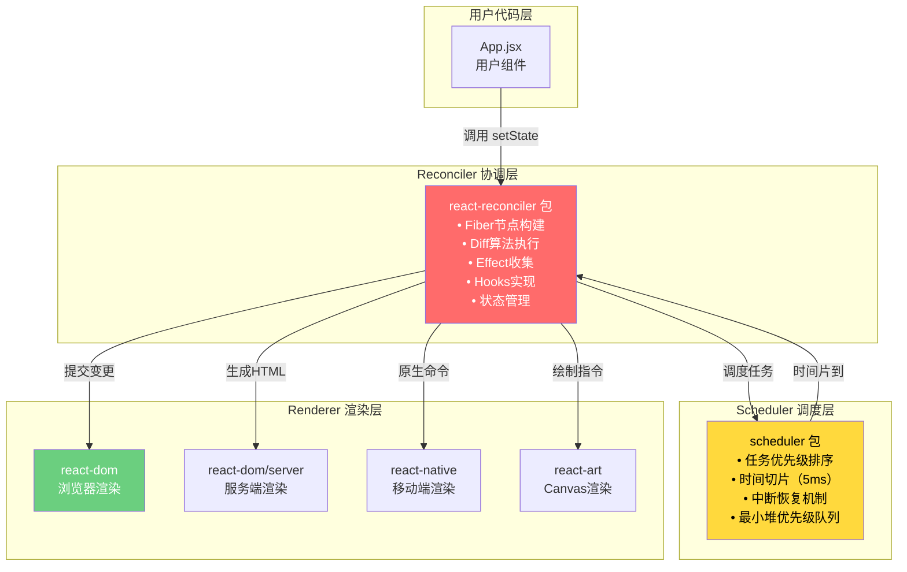
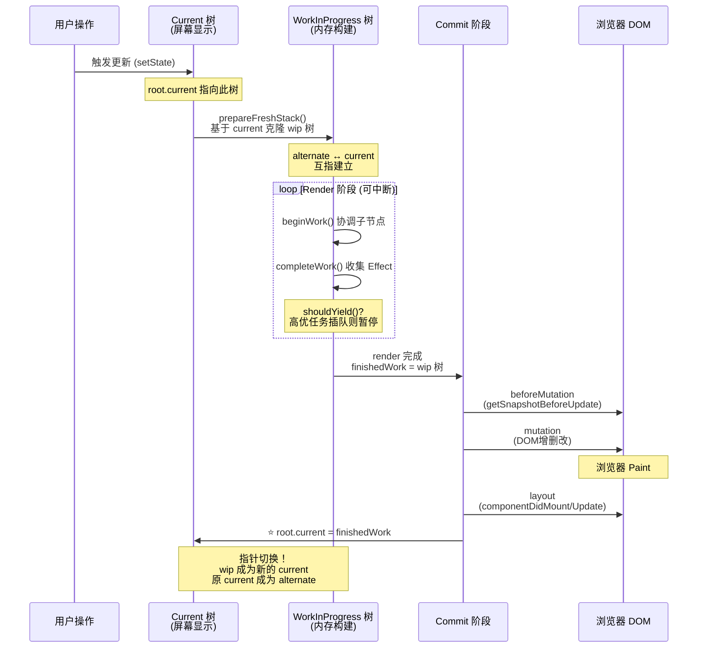
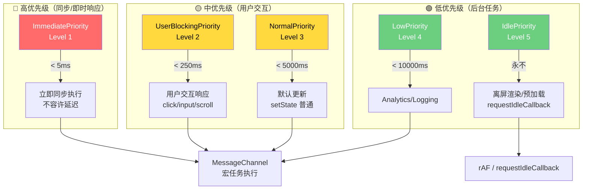
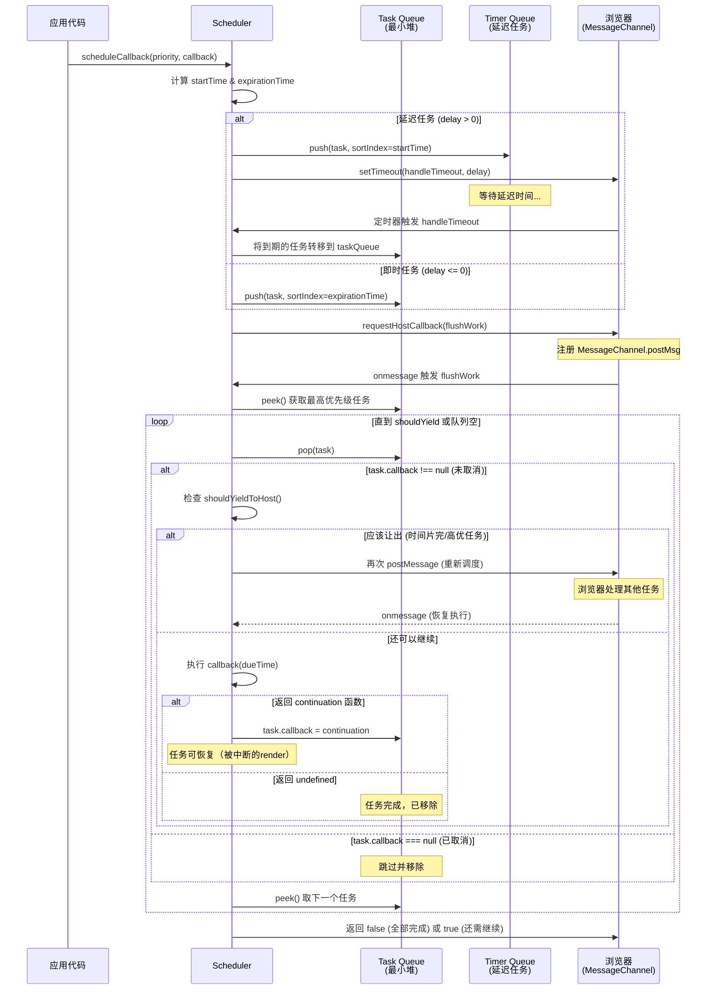

# React 源码解读基础知识指南

> **版本**: React 18.x
> **目标读者**: 具备React基础使用经验，想深入理解底层原理的开发者
> **阅读建议**: 按章节顺序阅读，每章先理解概念，再对照源码验证
> **参考资源**: [React官方GitHub仓库](https://github.com/facebook/react) | 《深入React技术栈》 | React Conf演讲视频 | React官方博客

---

## 目录

- [第1章 项目结构与 Monorepo](#第1章-项目结构与-monorepo)
- [第2章 Fiber 架构](#第2章-fiber-架构)
- [第3章 调度系统](#第3章-调度系统)
- [第4章 Render 阶段](#第4章-render-阶段)
- [第5章 Commit 阶段](#第5章-commit-阶段)
- [第6章 Hooks 原理](#第6章-hooks-原理)
- [第7章 并发特性](#第7章-并发特性)
- [第8章 状态管理](#第8章-状态管理)
- [第9章 事件系统](#第9章-事件系统)
- [第10章 服务端渲染](#第10章-服务端渲染)
- [第11章 React 18 新特性](#第11章-react-18-新特性)
- [第12章 性能优化源码视角](#第12章-性能优化源码视角)
- [附录A: React 源码调试指南](#附录a-react-源码调试指南)
- [附录B: 综合实战 — 从零手写 mini-react](#附录b-综合实战--从零手写-mini-react)

---

## 第1章 项目结构与 Monorepo

### 📚 本章学习目标
- 理解 React 的 Monorepo 架构设计理念
- 掌握核心包的职责划分和依赖关系
- 了解 Fiber 架构的分层设计
- 熟悉构建工具配置和入口文件关系

---

#### 1.1 【packages/目录结构概览】

> **源码位置**：`packages/` 根目录
> **对应版本**：React 18.2.0

##### 1. 源码片段

```javascript
// packages 目录结构（精简版）
packages/
├── react/                    # React 核心库（与渲染器无关的 API）
│   ├── src/
│   │   ├── React.js         # 入口文件，导出所有公共 API
│   │   ├── ReactHooks.js    # Hooks 接口定义
│   │   ├── ReactContext.js  # Context API
│   │   └── ReactChildren.js # Children 工具函数
│   └── package.json
├── react-dom/                # DOM 渲染器（浏览器环境）
│   ├── src/
│   │   ├── client/          # ReactDOM.createRoot (React 18 新API)
│   │   ├── server/          # SSR 相关（renderToString等）
│   │   ├── events/          # 合成事件系统
│   │   └── shared/          # 共享工具函数
│   └── package.json
├── react-reconciler/        # ⭐ 协调器（Fiber 架构核心）
│   ├── src/
│   │   ├── ReactFiber*.js   # Fiber 相关模块
│   │   ├── ReactFiberHooks.js  # Hooks 在 reconciler 中的实现
│   │   ├── ReactFiberWorkLoop.js # 主循环（workLoop）
│   │   └── ReactFiberCommitWork.js # Commit 阶段
│   └── package.json
├── scheduler/               # ⭐ 调度器（优先级和时间切片）
│   ├── src/
│   │   ├── Scheduler.js     # 调度核心逻辑
│   │   ├── SchedulerMinHeap.js  # 最小堆实现（优先级队列）
│   │   └── SchedulerPriorities.js # 优先级常量定义
│   └── package.json
├── shared/                  # 共享代码和常量
│   └── src/
│       ├── ReactSymbols.js  # Symbol 定义（$$typeof 等）
│       └── ReactFeatureFlags.js # 特性开关（开发/生产模式）
├── react-art/               # Canvas/SVG 渲染器
└── react-native-renderer/   # React Native 渲染器
```

##### 2. 逐行注释

| 层级 | 包名 | 职责说明 | 核心文件 |
|------|------|----------|----------|
| API层 | `react` | 定义与平台无关的公共API | React.js, ReactHooks.js |
| 调度层 | `scheduler` | 任务优先级、时间切片、中断恢复 | Scheduler.js |
| 协调层 | `react-reconciler` | ⭐ Fiber架构、Diff算法、状态管理 | ReactFiberWorkLoop.js |
| 渲染层 | `react-dom` | DOM操作、事件系统、SSR | ReactDOMHostConfig.js |
| 共享层 | `shared` | 常量、Symbol、工具函数 | ReactSymbols.js |

##### 3. 设计意图

为什么要采用 Monorepo 架构？

→ **关注点分离**：每个包职责单一，react 只负责 API 定义，不关心如何渲染
→ **跨平台能力**：react-dom（浏览器）、react-native（移动端）共享 reconciler 和 scheduler
→ **独立版本管理**：各包可独立发布，依赖清晰，便于维护
→ **Tree Shaking 友好**：使用者可以只引入需要的部分，减小打包体积
→ **可替换性**：第三方可以实现自定义 Renderer（如 react-three-fiber）

##### 4. 版本差异

与 React 17 的差异：
- **React 16**: packages 结构较简单，scheduler 还未完全独立
- **React 17**: 引入新的 JSX Transform，优化事件委托机制
- **React 18**: scheduler 完全独立为单独包，新增 concurrent features 支持

##### 5. 关联面试题

→ Q: 为什么 React 要拆分成多个包？这样做的优势是什么？
→ A: 为了解耦核心逻辑与平台实现，支持多端渲染（Web/Native/Server/Canvas），并且便于独立版本管理和 Tree Shaking 优化。

---

#### 1.2 【核心包职责详细说明】

> **源码位置**：`packages/react/src/React.js:1-100`
> **对应版本**：React 18.2.0

##### 1. 源码片段

```javascript
// packages/react/src/React.js - 核心API导出
const React = {
  // === Children 工具方法 ===
  Children: {
    map,        // 遍历 children
    forEach,    // 遍历（无返回值）
    count,      // 计算 children 数量
    toArray,    // 转为数组（扁平化）
    only,       // 获取唯一子节点
  },

  // === 组件创建 ===
  createRef,           // 创建 ref 对象（类组件遗留API）
  Component,           // 类组件基类
  PureComponent,       // 纯组件基类（浅比较优化）

  // === Context API ===
  createContext,       // 创建上下文对象

  // === Elements（虚拟DOM）===
  createElement,       // 创建 React Element（JSX编译目标）
  cloneElement,        // 克隆 Element 并合并 props
  isValidElement,      // 检查是否是合法 Element
  jsx,                 // React 17+ 自动导入的生产优化版
  jsxs,                // React 17+ 静态子元素优化版

  // === Hooks API（声明在此，实现在 reconciler）⭐
  useState,            // 状态管理
  useEffect,           // 副作用处理
  useContext,          // 上下文消费
  useReducer,          // 复杂状态管理
  useCallback,         // 缓存回调函数
  useMemo,             // 缓存计算值
  useRef,              // 引用（不触发重渲染）
  useImperativeHandle, // 自定义暴露给父组件的实例值
  useLayoutEffect,     // 同步副作用（阻塞绘制）
  useDebugValue,       // 开发者工具标签
  useId,               // ⭐ React 18: 生成唯一ID
  useSyncExternalStore,// ⭐ React 18: 订阅外部存储
  useTransition,       // ⭐ React 18: 标记非紧急更新
  useDeferredValue,    // ⭐ React 18: 延迟更新值

  // === Suspense（异步组件）===
  Suspense,
  SuspenseList,

  // === 特殊组件 ===
  Fragment,            // 片段（<>...</>）
  StrictMode,          // 严格模式（开发检查）

  // === 并发特性 ⭐ ===
  startTransition,     // React 18: 启动过渡
  unstable_useCache,   // 实验性缓存API
};

export default React;
```

##### 2. 逐行注释

| 行号范围 | API分类 | 说明 | 使用场景 |
|----------|---------|------|----------|
| 5-11 | Children | 操作 children 的工具集合 | 需要遍历或转换子组件时 |
| 13-15 | 类组件 | Component/PureComponent | 维护旧项目或特定场景 |
| 18 | Context | 创建全局状态通道 | 主题、语言、用户信息等 |
| 21-26 | Element | 虚拟DOM创建 | 不使用JSX时手动创建 |
| 29-44 | Hooks | 函数式组件状态管理 | 现代React开发的基石 |
| 47-49 | Suspense | 异步边界 | 代码分割、数据获取 |
| 52-54 | 特殊组件 | Fragment/StrictMode | 避免额外DOM包裹、开发检测 |
| 57-59 | 并发API | Transition相关 | 优化大列表、搜索等场景 |

##### 3. 设计意图

为什么 Hooks 的实现在 reconciler 而不是 react 包？

→ **运行时依赖**：Hooks 需要 Fiber 节点的 memoizedState 来存储状态链表
→ **渲染无关性**：react 包只声明接口（TypeScript 类型），具体运行时逻辑在 reconciler
→ **插件化架构**：自定义渲染器可以选择性地支持 Hooks 功能
→ **一致性保证**：所有渲染器的 Hooks 行为保持一致

##### 4. 版本差异

- **React 16.8**: Hooks 正式发布，但实现较简单，不支持并发特性
- **React 17**: 优化 Hooks 性能，修复闭包陷阱问题，改进依赖数组比较
- **React 18**: 新增并发相关 Hooks（useTransition, useDeferredValue, useId, useSyncExternalStore）

##### 5. 关联面试题

→ Q: React.createElement 和 JSX 有什么关系？
→ A: JSX 是语法糖，Babel 编译后会调用 createElement。React 17+ 改用 jsx/jsxs 函数并自动导入，无需手动 import React。

---

#### 1.3 【Fiber架构分层说明】

> **源码位置**：`packages/react-reconciler/src/ReactFiberWorkLoop.js:1-100`
> **对应版本**：React 18.2.0

##### 1. Mermaid 流程图 - 三层架构模型



##### 2. ASCII 图示 - 数据流向

```
┌─────────────────────────────────────────────────────────────────┐
│                        用户代码 (App.jsx)                        │
│                     const [count, setCount] = useState(0)        │
└──────────────────────────────┬──────────────────────────────────┘
                               │ setCount(1)
                               ▼
┌─────────────────────────────────────────────────────────────────┐
│                    Scheduler (调度器)                             │
│  ┌─────────────────────────────────────────────────────────┐    │
│  │ 1. 计算更新优先级 (Lane → SchedulerPriority)             │    │
│  │ 2. 创建调度任务 {callback, priorityLevel, expirationTime}│    │
│  │ 3. 插入最小堆队列 (按 expirationTime 排序)               │    │
│  │ 4. 请求浏览器调度 (MessageChannel / requestIdleCallback) │    │
│  └─────────────────────────────────────────────────────────┘    │
└──────────────────────────────┬──────────────────────────────────┘
                               │ 浏览器空闲回调
                               ▼
┌─────────────────────────────────────────────────────────────────┐
│                  Reconciler (协调器) ⭐                          │
│  ┌─────────────────────────────────────────────────────────┐    │
│  │ Render 阶段 (可中断):                                    │    │
│  │   • workLoopConcurrent()                                │    │
│  │   • performUnitOfWork()                                 │    │
│  │   • beginWork() → 协调子节点                            │    │
│  │   • completeWork() → 收集Effect                         │    │
│  │                                                         │    │
│  │ Commit 阶段 (不可中断):                                  │    │
│  │   • commitBeforeMutationEffects()                       │    │
│  │   • commitMutationEffects() → DOM操作                   │    │
│  │   • commitLayoutEffects() → 生命周期                    │    │
│  └─────────────────────────────────────────────────────────┘    │
└──────────────────────────────┬──────────────────────────────────┘
                               │ 提交变更指令
                               ▼
┌─────────────────────────────────────────────────────────────────┐
│                   Renderer (渲染器)                              │
│  ┌─────────────────────────────────────────────────────────┐    │
│  │ react-dom 实现:                                         │    │
│  │   • insertBefore / appendChild (DOM插入)                │    │
│  │   • removeChild (DOM删除)                               │    │
│  │   • updateProperties (属性更新)                          │    │
│  │   • attachRef / detachRef (引用处理)                     │    │
│  └─────────────────────────────────────────────────────────┘    │
└─────────────────────────────────────────────────────────────────┘
```

##### 3. 设计意图

为什么需要三层架构设计？

→ **可替换性**：Renderer 可以是 DOM、Native、Canvas、PDF 等，只需实现 HostConfig 接口
→ **调度独立**：Scheduler 可以根据平台特性调整策略（浏览器用 MessageChannel，Node 用 setImmediate）
→ **测试友好**：每层可独立进行单元测试，降低耦合度
→ **性能优化**：Scheduler 可以统一管理所有任务的优先级，避免饥饿问题

##### 4. 版本差异

- **React 15及之前 (Stack Reconciler)**: 无分层概念，递归同步渲染，一旦开始不可中断
- **React 16 (Fiber Reconciler)**: 引入 Fiber 架构，初步实现 Scheduler 和 Reconciler 分离
- **React 18**: Scheduler 完全独立，支持 5 种优先级等级，支持嵌套更新和中断恢复

##### 5. 关联面试题

→ Q: React 的三层架构分别是什么？各自的作用是什么？
→ A: Scheduler（调度层）负责任务优先级排序和时间切片；Reconciler（协调层）负责 Fiber 构建、Diff 算法和 Effect 收集；Renderer（渲染层）负责具体的平台相关操作（如 DOM 操作）。这种分层使得 React 可以支持多端渲染。

---

#### 1.4 【构建工具配置】

> **源码位置**：根目录 `rollup.config.js`, `package.json`
> **对应版本**：React 18.2.0

##### 1. 源码片段

```javascript
// rollup.config.js (简化版)
export default [
  // react 包配置
  {
    input: 'packages/react/src/React.js',
    output: [
      { file: 'build/react/index.js', format: 'cjs' },      // CommonJS
      { file: 'build/react/umd/react.development.js', format: 'umd', 
        name: 'React', sourcemap: true },                      // UMD 开发版
      { file: 'build/react/umd/react.production.min.js', format: 'umd',
        name: 'React', sourcemap: false, plugins: [terser()] }, // UMD 生产版
    ],
    external: ['object-assign', 'react'],  // 外部依赖不打包
  },
  
  // react-dom 配置
  {
    input: 'packages/react-dom/src/client/ReactDOM.js',
    output: [
      { file: 'build/node_modules/react-dom/index.js', format: 'cjs' },
      { file: 'build/react-dom/umd/react-dom.development.js', format: 'umd',
        name: 'ReactDOM', globals: { react: 'React' } },
    ],
  },
  
  // react-reconciler 配置（内部包，通常不直接使用）
  {
    input: 'packages/react-reconciler/src/ReactFiberReconciler.js',
    output: [{ file: 'build/react-reconciler/index.js', format: 'cjs' }],
  },
];

// package.json scripts
{
  "scripts": {
    "build": "npm run build:react && npm run build:dom && build:reconciler && ...",
    "build:react": "rollup -c rollup.config.js --environment ENTRY:react",
    "test": "jest",
    "lint": "eslint 'packages/*/src/**/*.js'",
    "flow": "flow",  // Facebook 的类型检查工具
  }
}
```

##### 2. 逐行注释

| 配置项 | 说明 | 目的 |
|--------|------|------|
| `input` | 入口文件路径 | 指定打包起点 |
| `output.format` | 输出格式（cjs/umd/esm） | 兼容不同模块系统 |
| `external` | 外部依赖声明 | 避免重复打包，减小体积 |
| `sourcemap` | 源码映射 | 方便调试生产代码 |
| `terser()` | 代码压缩插件 | 生产环境减小体积 |
| `globals` | 全局变量声明 | UMD 格式的依赖注入 |

##### 3. 设计意图

为什么选择 Rollup 作为构建工具？

→ **Tree Shaking 优秀**：基于 ES Module 静态分析，自动消除死代码
→ **输出体积小**：相比 Webpack，Rollup 打包出的 bundle 更紧凑
→ **多格式支持**：同时输出 CJS、UMD、ESM，满足不同使用场景
→ **插件生态丰富**：支持 TypeScript、Flow、代码分割等

##### 4. 版本差异

- **React 16**: 使用 Rollup + 自定义脚本，构建流程较复杂
- **React 17-18**: 优化构建配置，支持 ESM 输出，改进 source-map 质量

##### 5. 关联面试题

→ Q: 如何从源码构建 React？
→ A: 克隆仓库后，执行 `npm install` 安装依赖，然后 `npm run build` 即可。构建产物在 `build/` 目录下，包括 development 和 production 版本。

---

### 📝 第1章 要点速查

| 知识点 | 核心要点 | 重要程度 |
|--------|----------|----------|
| Monorepo 架构 | 关注点分离、跨平台、独立版本管理 | ⭐⭐⭐⭐⭐ |
| 核心包职责 | react(API) + scheduler(调度) + reconciler(协调) + renderer(渲染) | ⭐⭐⭐⭐⭐ |
| 三层架构 | Scheduler → Reconciler → Renderer，单向依赖 | ⭐⭐⭐⭐⭐ |
| 构建工具 | Rollup，支持 CJS/UMD/ESM 多格式输出 | ⭐⭐⭐ |
| 入口关系 | 用户代码 → react API → reconciler → scheduler → renderer | ⭐⭐⭐⭐ |

---

## 第2章 Fiber 架构 ⭐ 核心章节

### 📚 本章学习目标
- 深入理解 FiberNode 的数据结构和字段含义
- 掌握双缓存机制（current/workInProgress）的实现原理
- 理解 Fiber 的创建流程和遍历算法
- 熟悉 workLoop 的工作机制和中断恢复能力
- 对比 Vue 虚拟DOM的差异

---

#### 2.1 【FiberNode 数据结构详解】

> **源码位置**：`packages/react-reconciler/src/ReactFiber.js:120-185`
> **对应版本**：React 18.2.0

##### 1. 源码片段

```javascript
// packages/react-reconciler/src/ReactFiber.js

// ⭐ FiberNode 构造函数 - React Fiber架构的核心数据结构
function FiberNode(tag, pendingProps, key, mode) {
  // ============ 实例标识 ============
  this.tag = tag;                    // Fiber类型标记（函数组件/类组件/DOM等）
  this.key = key;                    // 唯一标识（用于Diff算法同层级比较）
  
  // ============ 元素类型 ============
  this.elementType = null;           // 元素原始类型（函数组件本身）
  this.type = null;                  // 具体类型（可能经过Memo包装）
  this.stateNode = null;             // ⭐ 关联的真实实例（DOM节点/类组件实例）
  
  // ============ Fiber树结构指针（形成链表树）============
  this.return = null;                // ⭐ 父Fiber节点
  this.child = null;                 // ⭐ 第一个子Fiber节点
  this.sibling = null;               // ⭐ 下一个兄弟Fiber节点
  this.index = 0;                    // 在父节点的children中的索引位置
  
  // ============ Props相关 ============
  this.ref = null;                   // ref引用对象或回调函数
  this.pendingProps = pendingProps;  // 待处理的新props（等待beginWork处理）
  this.memoizedProps = null;         // 上次渲染使用的props（用于bailout判断）
  
  // ============ 状态相关（Hooks核心）============
  this.updateQueue = null;           // 更新队列（存放state更新的payload）
  this.memoizedState = null;         // ⭐ 上次渲染的状态（Hooks链表头节点）
  
  // ============ 副作用标记（位运算）============
  this.flags = NoFlags;              // ⭐ 当前Fiber的副作用标记（Placement/Update/Delete等）
  this.subtreeFlags = NoFlags;       // 子树的聚合副作用标记（优化遍历）
  this.deletions = null;             // 待删除的子Fiber列表
  
  // ============ 双缓存机制 ============
  this.alternate = null;             // ⭐ 指向对应的另一个Fiber（current ↔ workInProgress）
  
  // ============ 优先级（Lanes模型）============
  this.lanes = NoLanes;              // 当前更新涉及的lanes
  this.childLanes = NoLanes;         // 子树涉及的lanes
  
  // ============ 模式标记 ============
  this.mode = mode;                  // 并发模式（ConcurrentMode/StrictMode等）
}

// ============ Fiber类型标记常量（tag字段的可能值）============
export const FunctionComponent = 0;               // 函数组件
export const ClassComponent = 1;                  // 类组件
export const IndeterminateComponent = 2;          // 不确定类型（首次渲染前）
export const HostRoot = 3;                        // Root Fiber（根节点，tag=3）
export const HostPortal = 4;                      // Portal（传送到不同DOM树）
export const HostComponent = 5;                   // 原生DOM组件（div, span等）
export const HostText = 6;                        // 文本节点
export const Fragment = 7;                        // Fragment (<></>)
export const Mode = 8;                            // StrictMode / ConcurrentMode
export const ContextConsumer = 9;                 // Context.Consumer
export const ContextProvider = 10;                // Context.Provider
export const ForwardRef = 11;                     // React.forwardRef
export const Profiler = 12;                       // Profiler（性能分析）
export const SuspenseComponent = 13;              // Suspense（异步边界）
export const MemoComponent = 14;                  // React.memo包装的组件
export const SimpleMemoComponent = 15;            // 简化的Memo（内部优化）
export const LazyComponent = 16;                  // React.lazy（懒加载）
export const IncompleteClassComponent = 17;       // 未完成的类组件
export const DehydratedFragment = 18;             // SSR脱水的Fragment
export const SuspenseListComponent = 19;          // SuspenseList
export const ScopeComponent = 20;                 // Scope
export const OffscreenComponent = 23;             // Offscreen（隐藏/显示切换）
export const LegacyHiddenComponent = 24;          // LegacyHidden
export const CacheComponent = 25;                 // Cache（实验性）
export const TracingMarkerComponent = 26;         // TracingMarker（DevTools）
```

##### 2. 逐行注释

| 字段名 | 类型 | 说明 | 使用场景 |
|--------|------|------|----------|
| `tag` | number | ⭐ 标记Fiber类型，决定beginWork的分发逻辑 | 区分函数组件、类组件、DOM节点等 |
| `key` | string\|null | 用于Diff算法的同层级比较 | 判断新旧节点是否可复用 |
| `elementType` | any | 元素的原始类型（未包装） | 函数组件本身、DOM标签字符串 |
| `type` | any | 实际使用的类型（可能被Memo等包装） | beginWork中用于区分处理逻辑 |
| `stateNode` | any | ⭐ 关联的真实对象（DOM/实例） | commit阶段操作的target |
| `return` | Fiber\|null | ⭐ 父节点引用 | 向上回溯（completeWork时使用） |
| `child` | Fiber\|null | ⭐ 第一个子节点 | 向下遍历（beginWork后进入子树） |
| `sibling` | Fiber\|null | ⭐ 下一个兄弟节点 | 横向遍历（completeWork后处理兄弟） |
| `index` | number | 在父children中的位置 | Diff时的位置匹配 |
| `pendingProps` | any | 新传入的props | beginWork时与memoizedProps比较 |
| `memoizedProps` | any | 上次渲染的props | bailout判断（引用相等则跳过） |
| `updateQueue` | Queue\|null | 状态更新队列 | 存放setState/useReducer的更新 |
| `memoizedState` | any | ⭐ 上次的状态值 | Hooks链表的入口点 |
| `flags` | number | ⭐ 位运算副作用标记 | Placement(2)/Update(4)/Deletion(8)等 |
| `subtreeFlags` | number | 子树聚合标记 | 优化effect链表遍历 |
| `alternate` | Fiber\|null | ⭐ 双缓存的另一份拷贝 | current↔workInProgress切换 |
| `lanes` | number | 当前更新的优先级位 | Lanes模型的核心字段 |
| `mode` | number | 并发/严格模式标记 | 影响行为（如StrictMode双重渲染） |

##### 3. 设计意图

为什么 FiberNode 需要保存这么多字段？

→ **增量更新能力**：通过 memoizedProps/memoizedState 快速判断是否需要重新渲染（bailout）
→ **双向链接结构**：return/child/sibling 三指针构成链表树，可以从任意节点开始遍历
→ **双缓存机制**：alternate 实现无缝切换，用户看到的始终是完整的 current 树
→ **高效副作用收集**：flags 使用位运算，可以同时表示多种副作用且快速判断
→ **优先级控制**：lanes 字段支持细粒度的更新优先级管理
→ **模式灵活性**：mode 字段支持并发模式、严格模式等不同行为

##### 4. 版本差异

- **React 16**: 使用 effectTag（数字），字段较少，无 lanes 模型
- **React 17**: 重命名为 flags，新增 subtreeFlags 优化子树遍历
- **React 18**: 新增 lanes 替代 expirationTime，新增 mode 字段支持并发模式，增加更多 tag 类型（Offscreen, Cache等）

##### 5. 关联面试题

→ Q: FiberNode 的 alternate 字段有什么作用？它是如何实现双缓存的？
→ A: alternate 指向当前 Fiber 的另一份拷贝。正在屏幕上显示的是 current 树（root.current 指向），正在内存中构建的是 workInProgress 树（通过 alternate 互指）。当 workInProgress 树构建完成后，commitRoot 最后会执行 `root.current = finishedWork`，将指针切换到新树，原来的 current 树成为新的 alternate。这保证了用户始终看到完整的界面，不会出现中间状态。

→ Q: FiberNode 和 Vue 的 VNode 有什么区别？
→ A: 1) 结构更复杂：FiberNode 包含更多运行时信息（状态、副作用、优先级）；2) 链表树 vs 扁平数组：Fiber 通过 return/child/sibling 形成链表，Vue VNode 是树形结构的扁平表示；3) 双缓存：Fiber 有 alternate 实现双缓冲，VNode 通常只有一份；4) 可中断性：Fiber 天然支持中断恢复，Vue 的 patch 是同步递归的。

---

#### 2.2 【Fiber Flags 位运算体系】

> **源码位置**：`packages/react-reconciler/src/ReactFiberFlags.js:1-80`
> **对应版本**：React 18.2.0

##### 1. 源码片段

```javascript
// packages/react-reconciler/src/ReactFiberFlags.js

// ============ 基础Flags常量（二进制位掩码）============

// 不要修改这两个值的含义！
export const NoFlags = /*                      */ 0b000000000000000000000;  // 0: 无副作用
export const PerformedWork = /*                */ 0b000000000000000000001;  // 1: 已完成工作（DevTools使用）

// ============ 副作用Flags（可在commit阶段处理的操作）============

export const Placement = /*                     */ 0b000000000000000010;     // 2: ⭐ 插入DOM
export const Update = /*                        */ 0b000000000000000100;     // 4: ⭐ 更新DOM属性
export const PlacementAndUpdate = /*            */ Placement | Update;       // 6: 插入并更新
export const Deletion = /*                      */ 0b000000000000001000;     // 8: ⭐ 删除DOM
export const ContentReset = /*                  */ 0b000000000000010000;     // 16: 重置文本内容
export const Callback = /*                      */ 0b000000000000100000;     // 32: 回调执行
export const DidCapture = /*                    */ 0b000000000001000000;     // 64: 错误边界捕获
export const Ref = /*                           */ 0b000000000010000000;     // 128: ref处理
export const Snapshot = /*                      */ 0b000000000100000000;     // 256: getSnapshotBeforeUpdate
export const Passive = /*                       */ 0b000000001000000000;     // 512: ⭐ useEffect标记
export const Hydrating = /*                     */ 0b000000010000000000;     // 1024: SSR hydration
export const HydratingAndUpdate = /*            */ Hydrating | Update;

// ============ 特殊Flags（非标准副作用）============

export const Incomplete = /*                    */ 0b000000010000000000;     // 渲染未完成（被中断）
export const ShouldCapture = /*                 */ 0b000000100000000000;     // 应该捕获错误
export const ForceUpdateForLegacySuspense = /*  */ 0b000001000000000000;     // 强制更新Legacy Suspense
export const Marker = /*                        */ 0b000001000000000000;     // 标记节点（Offscreen等）
export const Tail = /*                          */ 0b000010000000000000;     // 尾部标记（Suspense List）

// ============ 组合Mask（用于批量判断）============

// 所有生命周期相关的effect mask
export const LifecycleEffectMask = /*           */ 0b000000001110100100;     
// Passive | Update | Callback | Ref | Snapshot

// 所有宿主（host）相关的effect mask
export const HostEffectMask = /*                */ 0b000000001111111111;

// Mutation阶段需要处理的flags组合
export const MutationMask = /*                  */ Placement | Update | Deletion | 
                                                           ContentReset | Hydrating | Visibility;

// Layout阶段需要处理的flags组合
export const LayoutMask = /*                    */ Update | Callback | Ref;

// Passive阶段（useEffect）需要处理的flags组合
export const PassiveMask = /*                   */ Passive | ChildDeletion;
```

##### 2. 逐行注释

| Flag值 | 二进制 | 名称 | 说明 | 所属阶段 |
|--------|--------|------|------|----------|
| 0 | 0b...0 | NoFlags | 无副作用 | - |
| 1 | 0b...1 | PerformedWork | 已完成工作 | DevTools |
| 2 | 0b...10 | **Placement** | ⭐ 需要插入DOM | mutation |
| 4 | 0b...100 | **Update** | ⭐ 需要更新属性 | mutation/layout |
| 8 | 0b...1000 | **Deletion** | ⭐ 需要删除DOM | mutation |
| 16 | 0b...10000 | ContentReset | 清空文本内容 | mutation |
| 32 | 0b...100000 | Callback | 回调函数 | layout |
| 128 | 0b...10000000 | **Ref** | ref处理 | layout |
| 256 | 0b...100000000 | Snapshot | 快照读取 | beforeMutation |
| 512 | 0b...1000000000 | **Passive** | ⭐ useEffect | passive (async) |
| 1024 | 0b...10000000000 | Hydrating | hydration过程 | mutation |

##### 3. ASCII 图示 - Flags 位运算示例

```
假设一个 Fiber 同时需要：插入DOM + 更新属性 + 执行useEffect

flags = Placement | Update | Passive
      = 0b000000000000000010  (2)
      | 0b000000000000000100  (4)
      | 0b000000001000000000  (512)
      = 0b000000001000000110  (518)

判断是否有某种副作用：
(flags & Placement) !== 0    → (518 & 2) = 2 ≠ 0  ✓ 有插入操作
(flags & Update) !== 0       → (518 & 4) = 4 ≠ 0  ✓ 有更新操作
(flags & Ref) !== 0          → (518 & 128) = 0     ✗ 无ref操作
(flags & Passive) !== 0      → (518 & 512) = 512 ≠ 0 ✓ 有useEffect

使用 Mask 过滤：
flags & MutationMask          → 只保留mutation阶段的flags
flags & LayoutMask            → 只保留layout阶段的flags
```

##### 4. 设计意图

为什么要使用位运算来表示副作用？

→ **空间效率极高**：一个 32 位整数可以同时表示 31 种不同的副作用
→ **O(1) 判断速度**：使用按位与 (&) 运算符可以快速判断是否包含某类副作用
→ **灵活组合**：可以通过按位或 (|) 组合多种副作用，通过按位与 (&) 检查
→ **批量过滤**：可以使用预定义的 Mask（如 MutationMask）一次性过滤出某阶段的所有操作
→ **易于扩展**：新增副作用只需增加一位（左移），不影响已有逻辑

##### 5. 版本差异

- **React 16**: 使用 effectTag 命名，值较小（1, 2, 4, 8...），支持的副作用种类有限
- **React 17**: 重命名为 flags，扩展了 subtreeFlags 用于子树聚合
- **React 18**: 大幅扩展 flags 以支持新特性：Suspense、Transitions、Offscreen、Selector、Cache 等

##### 6. 关联面试题

→ Q: 如何判断一个 Fiber 是否有副作用？如何判断具体有哪些副作用？
→ A: 1) 是否有副作用：`if (fiber.flags !== NoFlags)` 或 `(fiber.flags & PerformedWork) !== 0`
   2) 是否需要插入：`(fiber.flags & Placement) !== 0`
   3) 是否需要更新：`(fiber.flags & Update) !== 0`
   4) 是否需要删除：`(fiber.flags & Deletion) !== 0`
   5) 是否有 useEffect：`(fiber.flags & Passive) !== 0`

---

#### 2.3 【FiberTree 双缓存机制】⭐ 核心概念

> **源码位置**：`packages/react-reconciler/src/ReactFiberRoot.js:50-150`
> **对应版本**：React 18.2.0

##### 1. 源码片段

```javascript
// packages/react-reconciler/src/ReactFiberRoot.js

// ============ FiberRootNode - Fiber树的根容器 ============
class FiberRootNode {
  constructor(containerInfo, tag, hydrate) {
    // ============ 基础信息 ============
    this.tag = tag;
    this.containerInfo = containerInfo;  // DOM容器（如 document.getElementById('root')）
    
    // ============ ⭐ 双缓存核心指针 ============
    this.current = null;                  // 指向当前显示在屏幕上的 Fiber 树（current 树）
    
    // ============ 待提交的工作 ============
    this.finishedWork = null;             // 已完成的 workInProgress 树，等待 commit
    
    // ============ 调度相关 ============
    this.callbackNode = null;             // 当前调度的回调句柄（可用于取消）
    this.callbackPriority = NoLane;       // 当前调度的优先级
    this.eventTimes = createLaneMap(NoLanes);
    this.expirationTimes = createLaneMap(NoTimestamp);
    
    // ============ Lanes（优先级）相关 ============
    this.pendingLanes = NoLanes;          // 待处理的更新 lanes
    this.suspendedLanes = NoLanes;        // 被挂起的 lanes（Suspense）
    this.pingedLanes = NoLanes;           // 被 ping 恢复的 lanes
    this.expiredLanes = NoLanes;          // 已过期的 lanes（必须立即处理）
    this.mutableReadLanes = NoLanes;      // 可变读取 lanes
    this.finishedLanes = NoLanes;         // 已完成的 lanes
    
    // ============ Entangled Lanes（交叉 lanes，用于关联更新）============
    this.entangledLanes = NoLanes;
    this.entanglements = createLaneMap(NoLanes);
    
    // ============ 并发模式相关 ============
    this.hashPrefix = '';                 // useId 生成的 hash 前缀
    this.hiddenUpdates = createHiddenUpdateMap();  // 隐藏的更新（Offscreen）
  }
}

// ============ 创建 Fiber 树根节点 ============
function createFiberRoot(containerInfo, tag, hydrate, hydrationCallbacks) {
  // Step 1: 创建 FiberRootNode 容器
  const root = new FiberRootNode(containerInfo, tag, hydrate);
  
  // Step 2: 创建根 Fiber（HostRoot 类型，tag=3）
  const uninitializedFiber = createHostRootFiber(tag);
  
  // Step 3: ⭐ 建立双向引用
  root.current = uninitializedFiber;       // 容器的 current 指向根 Fiber
  uninitializedFiber.stateNode = root;     // 根 Fiber 的 stateNode 指回容器
  
  // Step 4: 初始化更新队列（用于存放根节点的状态更新）
  initializeUpdateQueue(uninitializedFiber);
  
  return root;
}

// ============ 创建 HostRoot Fiber ============
function createHostRootFiber(tag) {
  // 创建 FiberNode，tag=3 表示 HostRoot
  let fiberTag;
  if (tag === ConcurrentRoot) {
    fiberTag = ConcurrentRootTag;  // 3（并发模式）
  } else if (tag === LegacyRoot) {
    fiberTag = HostRootTag;        // 3（传统模式）
  } else {
    fiberTag = HostRootTag;
  }
  
  const mode = ...;  // 根据 tag 设置模式（ConcurrentMode/NoMode）
  
  const rootFiber = createFiber(fiberTag, null, null, mode);
  
  // HostRoot 的 type 和 elementType 都是 null（它不是真正的组件）
  rootFiber.type = null;
  rootFiber.elementType = null;
  
  return rootFiber;
}
```

##### 2. Mermaid 时序图 - 双缓存切换流程



##### 3. ASCII 图示 - 双缓存三个状态

```
═══════════════════════════════════════════════════════════════
状态1: 初始挂载（Mount）
═══════════════════════════════════════════════════════════════

┌─────────────────────────────────────────────────────────────┐
│  FiberRoot (containerInfo: #root)                           │
│  ┌───────────────────────────────────────────────────────┐  │
│  │ current ──────────────────────────────────────────►   │  │
│  │  ┌─────────────────────────────────────────────────┐  │  │
│  │  │ HostRoot Fiber (tag=3)                          │  │  │
│  │  │ stateNode ◄────────────────────────────────────┼──┼──┤
│  │  │   ↓                                             │  │  │
│  │  │ alternate: null ⚠️ (首次渲染，没有 alternate)    │  │  │
│  │  │ child: App Fiber                                │  │  │
│  │  └─────────────────────────────────────────────────┘  │  │
│  └───────────────────────────────────────────────────────┘  │
│  finishedWork: null                                        │
└─────────────────────────────────────────────────────────────┘


═══════════════════════════════════════════════════════════════
状态2: 更新过程中（Render 阶段）
═══════════════════════════════════════════════════════════════

┌─────────────────────────────────────────────────────────────┐
│  FiberRoot                                                  │
│                                                             │
│  ┌────────────────────────┐  ┌────────────────────────┐    │
│  │ current ─────────────► │  │ finishedWork ────────► │    │
│  │ ┌────────────────────┐ │  │ ┌────────────────────┐ │    │
│  │ │ HostRoot (当前显示) │ │  │ │ HostRoot (wip构建中)│ │    │
│  │ │ memoizedState: 旧  │ │  │ │ memoizedState: 新  │ │    │
│  │ └────────┬───────────┘ │  │ └────────▲───────────┘ │    │
│  │          │ alternate   │  │          │ alternate   │    │
│  └──────────┼─────────────┘  └──────────┼─────────────┘    │
│             │                           │                   │
│             └───────────┬───────────────┘                   │
│                         ↓                                   │
│              两棵树通过 alternate 互指                       │
│              current.alternate = wip                        │
│              wip.alternate = current                        │
└─────────────────────────────────────────────────────────────┘


═══════════════════════════════════════════════════════════════
状态3: Commit 完成（指针切换）
═══════════════════════════════════════════════════════════════

┌─────────────────────────────────────────────────────────────┐
│  FiberRoot                                                  │
│  ┌───────────────────────────────────────────────────────┐  │
│  │ current ──────────────────────────────────────────►   │  │
│  │  ┌─────────────────────────────────────────────────┐  │  │
│  │  │ HostRoot (原 wip 树，现在是新的 current) ✓      │  │  │
│  │  │ memoizedState: 新值                             │  │  │
│  │  │ alternate ────────────────────────────────────► │  │  │
│  │  └────────────────────────────────┬────────────────┘  │  │
│  └───────────────────────────────────┼───────────────────┘  │
│                                      │                       │
│                                      ▼                       │
│  ┌───────────────────────────────────────────────────────┐  │
│  │  (原 current 树，现在成为 alternate，等待GC回收)       │  │
│  │  memoizedState: 旧值                                   │  │
│  │  alternate ──────────────────────────────► 新 current  │  │
│  └───────────────────────────────────────────────────────┘  │
│                                                             │
│  finishedWork: null (已提交，清空)                           │
└─────────────────────────────────────────────────────────────┘
```

##### 4. 设计意图

为什么要使用双缓存（Double Buffering）机制？

→ **避免视觉闪烁**：用户看到的始终是完整的 current 树，workInProgress 树在内存中静默构建
→ **快速回滚能力**：如果渲染过程中被高优先级任务中断，可以直接丢弃 wip 树，current 树不受影响
→ **增量更新优化**：基于 current 树克隆 wip 树，只修改发生变化的 Fiber 节点，未变化的直接复用
→ **原子性提交保证**：commit 阶段是一次性将 wip 树切换为 current，不会出现中间状态
→ **内存友好**：两棵树共享未变化的部分（通过 alternate 引用），不是完全复制

##### 5. 版本差异

- **React 16 (Fiber 初期)**: 双缓存概念初步建立，但实现较简单
- **React 17**: 完善 alternate 的生命周期管理，优化内存回收
- **React 18**: 结合 Lanes 模型，支持部分更新（不需要克隆整棵树，只更新涉及 lane 的子树）

##### 6. 关联面试题

→ Q: current 树和 workInProgress 树是如何切换的？切换时机是什么？
→ A: 在 commitRoot 函数的最后一步，执行 `root.current = finishedWork`。此时：
  1. finishedWork 指向刚刚构建完成的 workInProgress 树
  2. 将 root.current 从旧的 current 切换到新的 wip 树
  3. 原来的 current 树通过新树的 alternate 字段仍然可达（等待 GC）
  4. 下次更新时，会基于新的 current 树创建新的 wip 树

→ Q: 如果在 Render 阶段被中断，会发生什么？
→ A: workInProgress 树会被丢弃（不会被 commit），下次恢复时会基于 current 树重新开始。这就是 Fiber 架构的可中断性的体现。

---

#### 2.4 【Fiber 创建流程】

> **源码位置**：`packages/react-reconciler/src/ReactFiber.js:300-420`
> **对应版本**：React 18.2.0

##### 1. 源码片段

```javascript
// packages/react-reconciler/src/ReactFiber.js

// ============ 从 Element 创建 Fiber（主入口）============
export function createFiberFromElement(element, mode, lanes) {
  // 开发模式下追踪 owner 信息（用于 Warning 提示）
  let owner = null;
  if (__DEV__) {
    owner = element._owner;
  }

  // 提取 Element 的关键信息
  const type = element.type;        // 元素类型（函数/字符串/对象）
  const key = element.key;          // 唯一标识
  const pendingProps = element.props; // 待处理属性
  
  // 调用核心工厂函数
  const fiber = createFiberFromTypeAndProps(
    type, 
    key, 
    pendingProps, 
    owner, 
    mode, 
    lanes,
  );
  
  return fiber;
}

// ============ 核心工厂函数：根据类型创建 Fiber ============
function createFiberFromTypeAndProps(type, key, pendingProps, owner, mode, lanes) {
  // ⭐ 默认标记为不确定类型（首次渲染前无法确定是函数还是类组件）
  let fiberTag = IndeterminateComponent;  // tag = 2
  let resolvedType = type;

  // ============ 根据类型确定 fiberTag ============
  if (typeof type === 'function') {
    // 函数类型：可能是函数组件或类组件
    if (shouldConstruct(type)) {  
      // 检查原型上是否有 isReactComponent 属性
      // 这是类组件的标志（由 React.Component 或 React.PureComponent 设置）
      fiberTag = ClassComponent;      // tag = 1
    } else {
      fiberTag = FunctionComponent;   // tag = 0
    }
  } else if (typeof type === 'string') {
    // 字符串类型：原生 DOM 元素（'div', 'span', 'input' 等）
    fiberTag = HostComponent;         // tag = 5
  } else {
    // 对象或其他特殊类型
    getTag: switch (type) {
      case REACT_FRAGMENT_TYPE:
        fiberTag = Fragment;                    // tag = 7
        break getTag;
      case REACT_SUSPENSE_TYPE:
        fiberTag = SuspenseComponent;           // tag = 13
        break getTag;
      case REACT_SUSPENSE_LIST_TYPE:
        fiberTag = SuspenseListComponent;       // tag = 19
        break getTag;
      default:
        if (typeof type === 'object' && type !== null) {
          // 通过 $$typeof Symbol 判断特殊类型
          switch (type.$$typeof) {
            case REACT_PROVIDER_TYPE:
              fiberTag = ContextProvider;        // tag = 10
              break getTag;
            case REACT_CONTEXT_TYPE:
              fiberTag = ContextConsumer;        // tag = 9
              break getTag;
            case REACT_FORWARD_REF_TYPE:
              fiberTag = ForwardRef;             // tag = 11
              break getTag;
            case REACT_MEMO_TYPE:
              fiberTag = MemoComponent;          // tag = 14
              resolvedType = type.type;  // Memo 包装的类型
              break getTag;
            case REACT_LAZY_TYPE:
              fiberTag = LazyComponent;          // tag = 16
              break getTag;
          }
        }
        
        // 兜底：未知类型抛出错误
        let info = '';
        if (__DEV__) {
          // 开发模式提供详细的错误信息，帮助开发者定位问题
        }
        throw new Error(
          'Element type is invalid: expected a string ' +
          '(for built-in components) or a class/function ' +
          '(for composite components) but got: ' +
          (type == null ? type : typeof type) + '.'
        );
    }
  }

  // ============ 创建 FiberNode 实例 ============
  const fiber = createFiber(fiberTag, pendingProps, key, mode);
  
  // 设置类型信息
  fiber.elementType = type;       // 原始类型（未包装）
  fiber.type = resolvedType;      // 解析后的实际类型
  fiber.lanes = lanes;            // 优先级 lanes

  return fiber;
}

// ============ 判断是否是类组件 ============
function shouldConstruct(Component) {
  // 类组件的原型上有 isReactComponent 属性
  // 这个属性在 React.Component 和 React.PureComponent 的构造函数中设置
  const prototype = Component.prototype;
  return !!(prototype && prototype.isReactComponent);
}

// ============ 其他创建便捷函数 ============

// 从文本创建 Fiber
export function createFiberFromText(content, mode, lanes) {
  const fiber = createFiber(HostText, content, null, mode);  // tag = 6
  fiber.lanes = lanes;
  return fiber;
}

// 从 Fragment 创建 Fiber
export function createFiberFromFragment(elements, mode, lanes, key) {
  const fiber = createFiber(Fragment, elements, key, mode);  // tag = 7
  fiber.lanes = lanes;
  return fiber;
}

// 从已有的 Fiber 克隆（用于双缓存）
export function createWorkInProgress(current, pendingProps) {
  let workInProgress = current.alternate;
  
  if (workInProgress === null) {
    // 首次创建：新建 FiberNode
    workInProgress = createFiber(current.tag, pendingProps, current.key, current.mode);
    workInProgress.elementType = current.elementType;
    workInProgress.type = current.type;
    workInProgress.stateNode = current.stateNode;
    
    // ⭐ 建立双向 alternate 引用
    workInProgress.alternate = current;
    current.alternate = workInProgress;
  } else {
    // 复用已有：重置属性（不重建对象，节省 GC）
    workInProgress.pendingProps = pendingProps;
    workInProgress.type = current.type;
    workInProgress.flags = NoFlags;           // 清除旧 flags
    workInProgress.subtreeFlags = NoFlags;
    workInProgress.deletions = null;
    
    // 清除 lanes（会在 render 时重新计算）
    workInProgress.lanes = current.lanes;
    workInProgress.childLanes = current.childLanes;
  }
  
  // 复用不变的字段
  workInProgress.ref = current.ref;
  
  return workInProgress;
}
```

##### 2. Mermaid 流程图 - Fiber 创建决策树

```mermaid
flowchart TD
    A[createElement 返回 Element] --> B{type 的 typeof?}
    
    B -->|"function"| C{shouldConstruct?<br/>原型有 isReactComponent?}
    B -->|"string"| D[HostComponent<br/>tag=5<br/>原生DOM元素]
    B -->|"object/symbol"| E{特殊 $$typeof?}
    
    C -->|是 (类组件)| F[ClassComponent<br/>tag=1]
    C -->|否 (函数组件)| G[FunctionComponent<br/>tag=0]
    
    E -->|REACT_FRAGMENT| H[Fragment<br/>tag=7]
    E -->|REACT_SUSPENSE| I[SuspenseComponent<br/>tag=13]
    E -->|REACT_PROVIDER| J[ContextProvider<br/>tag=10]
    E -->|REACT_CONTEXT| K[ContextConsumer<br/>tag=9]
    E -->|REACT_FORWARD_REF| L[ForwardRef<br/>tag=11]
    E -->|REACT_MEMO| M[MemoComponent<br/>tag=14]
    E -->|REACT_LAZY| N[LazyComponent<br/>tag=16]
    
    D & F & G & H & I & J & K & L & M & N --> O[createFiber<br/>new FiberNode]
    O --> P[设置 elementType/type/lanes]
    P --> Q[返回 Fiber 节点]
    
    R[createWorkInProgress] --> S{alternate 存在?}
    S -->|否| T[新建 FiberNode<br/>建立双向引用]
    S -->|是| U[复用并重置<br/>清除 flags/lanes]
    T & U --> V[返回 workInProgress]
```

##### 3. 设计意图

为什么要在创建时就确定 fiberTag？

→ **性能优化**：beginWork 时可以根据 tag 进行 O(1) 的 switch 分发，无需再次判断类型
→ **类型安全**：提前验证元素类型合法性，避免运行时出现不可预期的错误
→ **统一入口**：所有 Element 都通过同一套工厂函数转换为 Fiber，代码集中易维护
→ **调试友好**：开发模式下可以在创建时记录更多信息（owner、source 等）

##### 4. 版本差异

- **React 16**: 类型判断较简单，不支持 Lazy、Memo、SuspenseList 等新特性
- **React 17**: 增加 ForwardRef、Memo、Lazy 等类型的完整支持
- **React 18**: 新增 Offscreen、Cache、TracingMarker、Scope 等更多特殊类型，完善错误提示信息

##### 5. 关联面试题

→ Q: React 如何区分函数组件和类组件？底层原理是什么？
→ A: 通过 `shouldConstruct(type)` 函数检查组件的原型对象上是否存在 `isReactComponent` 属性。
   - 当你使用 `class MyComponent extends React.Component` 时，React.Component 的构造函数会设置 `MyComponent.prototype.isReactComponent = {}`
   - 函数组件没有原型上的这个属性
   - 这是一个简单的布尔标志检查，非常高效

→ Q: createWorkInProgress 什么情况下会新建 Fiber，什么时候复用？
→ A: 首次渲染时 `current.alternate === null`，会新建 FiberNode 并建立双向引用。后续更新时如果 alternate 已存在，会复用该对象并重置 flags、lanes 等字段，避免频繁创建/销毁对象的 GC 压力。

---

#### 2.5 【Fiber 的工作循环 - workLoop】⭐ 核心机制

> **源码位置**：`packages/react-reconciler/src/ReactFiberWorkLoop.js:800-950`
> **对应版本**：React 18.2.0

##### 1. 源码片段

```javascript
// packages/react-reconciler/src/ReactFiberWorkLoop.js

// ============ 同步工作循环（Legacy 模式）============
function workLoopSync() {
  // ⭐ 同步模式：一次性完成所有工作，不可中断
  // 只要还有工作单元，就一直执行
  while (workInProgress !== null) {
    performUnitOfWork(workInProgress);
  }
}

// ============ 并发工作循环（Concurrent 模式）⭐ ============
function workLoopConcurrent() {
  // ⭐ 并发模式：每处理一个工作单元就检查是否需要让出主线程
  while (workInProgress !== null) {
    // ⭐ 核心检查：shouldYieldToHost()
    // 如果浏览器需要处理更高优先级的任务（如用户输入、动画），
    // 或者本次时间片（5ms）已用完，则返回 false，停止循环
    if (unstable_shouldYield()) {
      // 让出主线程，浏览器可以处理其他任务
      break;  
    }
    
    performUnitOfWork(workInProgress);
  }
}

// ============ 处理单个工作单元 ============
function performUnitOfWork(unitOfWork) {
  // unitOfWork 就是当前正在处理的 Fiber 节点
  
  // 获取当前的 Fiber（屏幕上显示的）
  const current = unitOfWork.alternate;
  
  let next;
  
  // ============ Step 1: beginWork（向下协调）============
  // beginWork 会：
  // 1. 比较 props/state 判断是否需要更新
  // 2. 根据 Fiber.tag 分发到不同的处理函数
  // 3. 执行组件函数（函数组件）或实例化/更新（类组件）
  // 4. reconcileChildren：对比子节点，生成新的子 Fiber
  // 5. 返回第一个子 Fiber（如果没有子节点返回 null）
  
  if (enableProfilerTimer && (unitOfWork.mode & ProfileMode) !== NoMode) {
    // 性能分析模式：记录耗时
    next = beginWork(current, unitOfWork, renderLanes);
  } else {
    // 正常模式
    next = beginWork(current, unitOfWork, renderLanes);
  }
  
  // 将 pendingProps 标记为已处理（变成 memoizedProps）
  unitOfWork.memoizedProps = unitOfWork.pendingProps;
  
  // ============ Step 2: 判断是否有子节点 ============
  if (next === null) {
    // 没有子节点：完成当前节点，向上回溯
    completeUnitOfWork(unitOfWork);
  } else {
    // 有子节点：继续处理子节点（深度优先）
    workInProgress = next;
  }
  
  // React DevTools 性能标记
  if (enableProfilerTimer) {
    // ...
  }
}

// ============ 完成工作单元（向上回溯）============
function completeUnitOfWork(unitOfWork) {
  let completedWork = unitOfWork;  // 当前完成的节点
  
  // ⭐ 循环回溯：处理 sibling 或向上返回
  do {
    // 获取当前 Fiber 和它的父 Fiber
    const current = completedWork.alternate;
    const returnFiber = completedWork.return;  // 父节点
    
    // ============ Step 3: completeWork（收集副作用）============
    // completeWork 会：
    // 1. 对于 HostComponent：创建/更新 DOM 节点
    // 2. 对于 HostText：创建/更新文本节点
    // 3. 收集副作用（设置 flags：Placement/Update/Deletion）
    // 4. 处理 ref、context 等
    completeWork(current, completedWork, renderLanes);
    
    // ============ Step 4: 检查是否有兄弟节点 ============
    const siblingFiber = completedWork.sibling;
    
    if (siblingFiber !== null) {
      // 有兄弟节点：处理兄弟（横向移动）
      workInProgress = siblingFiber;
      return;  // 返回外层循环，继续 performUnitOfWork
    }
    
    // 没有兄弟节点：继续向上回溯到父节点
    completedWork = returnFiber;
    workInProgress = completedWork;
    
    // 当回到根节点（HostRoot）时，workInProgress 变为 null，循环结束
  } while (completedWork !== null);
  
  // 到达根节点，整个 Fiber 树的工作已完成
  if (workInProgressRootExitStatus === RootIncomplete) {
    workInProgressRootExitStatus = RootCompleted;
  }
}
```

##### 2. ASCII 图示 - 深度优先遍历过程

```
Fiber 树结构示例:
        App (FunctionComponent, tag=0)
       /    \
    Header  Main (FunctionComponent, tag=0)
     /  \      \
   Nav  Logo   Article (HostComponent, tag=5)
                \
              Text (HostText, tag=6)

═══════════════════════════════════════════════════════════════
workLoop 执行过程（深度优先遍历）:
═══════════════════════════════════════════════════════════════

performUnitOfWork 顺序（前序遍历 - beginWork）:

  ① App.beginWork()
     ↓ 返回 child: Header
  ② Header.beginWork()
     ↓ 返回 child: Nav
  ③ Nav.beginWork()
     ↓ 返回 null (无子节点)
     ↓ 调用 completeUnitOfWork(Nav)
     
  ④ Nav.completeWork()  ← 后序
     ↓ 检查 sibling: Logo (有!)
     ↓ workInProgress = Logo
     
  ⑤ Logo.beginWork()
     ↓ 返回 null
     ↓ 调用 completeUnitOfWork(Logo)
     
  ⑥ Logo.completeWork()  ← 后序
     ↓ 检查 sibling: null (无!)
     ↓ 向上回溯到 Header
     
  ⑦ Header.completeWork()  ← 后序
     ↓ 检查 sibling: Main (有!)
     ↓ workInProgress = Main
     
  ⑧ Main.beginWork()
     ↓ 返回 child: Article
  ⑨ Article.beginWork()
     ↓ 返回 child: Text
  ⑩ Text.beginWork()
     ↓ 返回 null
     ↓ 调用 completeUnitOfWork(Text)
     
  ⑪ Text.completeWork()  ← 后序
     ↓ sibling: null → 回溯到 Article
  ⑫ Article.completeWork()  ← 后序
     ↓ sibling: null → 回溯到 Main
  ⑬ Main.completeWork()  ← 后序
     ↓ sibling: null → 回溯到 App
  ⑭ App.completeWork()  ← 后序
     ↓ sibling: null → 回溯到 HostRoot
     ↓ workInProgress = null → 循环结束！

可视化遍历顺序:
    ① App
    ╱     ╲
  ②Header  ⑧Main
 ╱   ╲      ╲
③Nav ④Logo  ⑨Article
              ╲
             ⑩Text

completeWork 顺序（后序遍历）: ④→⑥→⑦→⑪→⑫→⑬→⑭
（数字带圆圈的是 completeWork 执行时机）
```

##### 3. 设计意图

为什么使用深度优先遍历（DFS）而不是广度优先（BFS）？

→ **内存效率极高**：DFS 只需维护当前路径的栈帧，不需要保存整棵树的状态
→ **局部性原理友好**：父子节点在内存中连续分布，CPU 缓存命中率高
→ **天然适合递归语义**：beginWork（向下）→ completeWork（向上），符合直觉
→ **可中断性支持**：可以在任意节点暂停（保存 workInProgress 指针），下次从断点恢复
→ **副作用收集方便**：completeWork 在后序位置执行，此时子节点已经全部处理完毕

##### 4. 版本差异

- **React 15 (Stack Reconciler)**: 使用递归调用栈，同步执行，一旦开始无法中断
- **React 16+ (Fiber Reconciler)**: 改用链表遍历 + while 循环，支持中断恢复
- **React 18**: workLoopConcurrent 配合 Scheduler 的 shouldYield 实现精确的时间切片（5ms/帧）

##### 5. 关联面试题

→ Q: React 的调和（Reconciliation）过程是怎样的？请描述完整的流程。
→ A: 从根 Fiber 开始，采用深度优先遍历：
  1. **beginWork（前序）**：进入节点，协调子节点（reconcileChildren），对比新旧 Fiber，返回第一个子 Fiber
  2. **如果有子节点**：继续对子节点执行 performUnitOfWork（递归向下）
  3. **如果没有子节点（completeWork）**：处理当前节点（创建 DOM、收集 Effect），然后检查 sibling
  4. **有 sibling**：处理兄弟节点（横向移动）
  5. **无 sibling**：向上回溯到父节点，直到根节点
  整个过程称为 **Render 阶段**，特点是 **可中断**。

→ Q: workLoopSync 和 workLoopConcurrent 有什么区别？
→ A: workLoopSync 是同步循环，一次性完成所有工作单元，不可中断（Legacy 模式使用）。workLoopConcurrent 是并发循环，每处理一个单元就调用 shouldYieldToHost() 检查是否应该让出主线程，如果浏览器有更高优先级任务或时间片用完则暂停（Concurrent 模式使用）。

---

### 📝 第2章 要点速查

| 知识点 | 核心要点 | 重要程度 |
|--------|----------|----------|
| **FiberNode 数据结构** | 30+ 字段，核心：tag/key/stateNode/flags/alternate/memoizedState | ⭐⭐⭐⭐⭐ |
| **Fiber Flags 位运算** | 使用二进制位表示副作用，支持 O(1) 判断和组合 | ⭐⭐⭐⭐⭐ |
| **双缓存机制** | current（显示）/ workInProgress（构建），通过 alternate 互指 | ⭐⭐⭐⭐⭐ |
| **Fiber 创建流程** | createFiberFromElement → createFiberFromTypeAndProps → createFiber | ⭐⭐⭐⭐ |
| **workLoop 工作循环** | DFS 遍历，beginWork（前序）+ completeWork（后序），可中断 | ⭐⭐⭐⭐⭐ |
| **与 Vue VNode 对比** | Fiber 更复杂（含运行时状态），链表树结构，支持双缓存和中断 | ⭐⭐⭐⭐ |

---

## 第3章 调度系统 ⭐ 核心章节

### 📚 本章学习目标
- 理解 Scheduler 的 5 种优先级等级及其应用场景
- 掌握 Lanes 模型的二进制位运算原理
- 熟悉任务调度、取消、恢复的完整流程
- 理解时间切片（Time Slicing）的实现机制
- 了解调度器与浏览器的协作方式

---

#### 3.1 【Scheduler 优先级队列】

> **源码位置**：`packages/scheduler/src/SchedulerPriorities.js:1-60`
> **对应版本**：React 18.2.0

##### 1. 源码片段

```javascript
// packages/scheduler/src/SchedulerPriorities.js

/**
 * ⭐ 任务优先级等级定义
 * 
 * 设计原则：
 * - 数值越小，优先级越高（1 = 最高，5 = 最低）
 * - 使用过期时间（expiration time）机制实现动态优先级调整
 * - 高优先级任务过期时间短（很快就必须执行）
 * - 低优先级任务过期时间长（可以延迟很久）
 */

// ============ 5种优先级等级 ============
export const ImmediatePriority = 1;        // ⭐ 最高优先级：同步任务
                                           // 应用场景：用户点击、焦点变化
                                           // 过期时间：-1（几乎立即过期，不容许延迟）
                                           
export const UserBlockingPriority = 2;     // ⭐ 用户阻塞优先级
                                           // 应用场景：用户输入（typing、dragging、scrolling）
                                           // 过期时间：250ms（必须在 250ms 内响应）
                                           
export const NormalPriority = 3;           // ⭐ 正常优先级（默认）
                                           // 应用场景：setState 触发的普通更新
                                           // 过期时间：5000ms（5秒内执行即可）
                                           
export const LowPriority = 4;              // 低优先级
                                           // 应用场景：数据分析、日志上报
                                           // 过期时间：10000ms（10秒内执行）
                                           
export const IdlePriority = 5;             // ⭐ 空闲优先级（最低）
                                           // 应用场景：离屏渲染、预加载数据
                                           // 过期时间：maxSigned31BitInt（永不过期）
                                           // 特点：只在主线程完全空闲时才执行

// ============ 优先级对应的超时时间配置（毫秒）============
var timeoutMap = {
  [UserBlockingPriority]: USER_BLOCKING_TIMEOUT,    // 250ms
  [NormalPriority]: NORMAL_TIMEOUT,                  // 5000ms（默认）
  [LowPriority]: LOW_TIMEOUT,                        // 10000ms
  [IdlePriority]: maxSigned31BitInt,                 // 永不过期（约 24.8 天）
};

// ============ 计算任务过期时间 ============
function computeExpirationTime(currentTime, priorityLevel) {
  if (priorityLevel === ImmediatePriority) {
    // Immediate 任务：立即过期（同步执行）
    return currentTime + SYNC_TICK_PRIORITY;  // 通常为 -1 或很小的值
  }
  
  var timeout;
  switch (priorityLevel) {
    case UserBlockingPriority:
      timeout = USER_BLOCKING_TIMEOUT;  // 250ms
      break;
    case IdlePriority:
      timeout = maxSigned31BitInt;      // 永不过期
      break;
    case LowPriority:
      timeout = LOW_TIMEOUT;            // 10000ms
      break;
    case NormalPriority:
    default:
      timeout = NORMAL_TIMEOUT;          // 5000ms
      break;
  }
  
  // 过期时间 = 当前时间 + 超时阈值
  return currentTime + timeout;
}

// ============ 优先级转换工具函数 ============

// 将 Lane 优先级转换为 Scheduler 优先级
export function laneToSchedulerPriority(lane) {
  if ((lane & SyncLane) === lane) {
    return ImmediatePriority;           // 同步 → 最高
  }
  if ((lane & SyncBatchedLane) === lane || 
      (lane & InputContinuousLane) === lane) {
    return UserBlockingPriority;        // 连续输入 → 用户阻塞
  }
  if ((lane & DefaultLane) === lane) {
    return NormalPriority;              // 默认 → 正常
  }
  if ((lane & TransitionLanes) !== NoLanes) {
    return NormalPriority;              // Transition → 正常（可中断）
  }
  if ((lane & RetryLanes) !== NoLanes) {
    return NormalPriority;              // 重试 → 正常
  }
  if ((lane & IdleLane) === lane) {
    return IdlePriority;                // 空闲 → 最低
  }
  if ((lane & OffscreenLane) === lane) {
    return IdlePriority;                // 离屏 → 最低
  }
  return NormalPriority;                // 兜底
}
```

##### 2. Mermaid 流程图 - 优先级分类与处理



##### 3. ASCII 图示 - 优先级队列示例（最小堆）

```
Task Queue (Min Heap 按 expirationTime 排序):
┌─────────────────────────────────────────────────────────────────┐
│  Index │ Task Description     │ Priority │ Expiration          │
│────────┼─────────────────────┼──────────┼─────────────────────│
│   [0]  │ Click handler       │ Immediate│ t + 5ms (即将过期!) │ ← 堆顶，最先取出
│   [1]  │ Input change        │ UserBlock│ t + 200ms           │
│   [2]  │ State update        │ Normal   │ t + 3000ms          │
│   [3]  │ Search suggestion   │ Normal   │ t + 4500ms          │
│   [4]  │ Analytics log       │ Low      │ t + 8000ms          │
│   [5]  │ Offscreen render    │ Idle     │ Never (永不过期)    │
└─────────────────────────────────────────────────────────────────┘

执行策略（workLoop）:
━━━━━━━━━━━━━━━━━━━━━━━━━━━━━━━━━━━━━━━━━━━━━━━━━━━━━━━━━━━━━
1. peek(taskQueue) → 取出堆顶（最小 expirationTime）
2. 检查是否已过期：
   ├─ 已过期 → 忽略 shouldYield，立即同步执行
   └─ 未过期 → 检查 shouldYieldToHost()
       ├─ 应该让出（高优任务/时间片完）→ break，yield 主线程
       └─ 还可以继续 → 执行 callback
3. 执行一段时间片（~5ms）
4. 检查队列：
   ├─ 还有任务 → 继续 step 1
   └─ 队列空 → 结束，通知浏览器
━━━━━━━━━━━━━━━━━━━━━━━━━━━━━━━━━━━━━━━━━━━━━━━━━━━━━━━━━━━━━
```

##### 4. 设计意图

为什么使用过期时间（Expiration Time）而不是固定优先级？

→ **动态优先级调整**：随着时间推移，低优先级任务也会变得"紧急"（接近过期）
→ **饥饿预防机制**：防止低优先级任务永远得不到执行（最终一定会过期）
→ **用户体验保障**：确保用户交互（250ms）和数据更新（5s）都能及时响应
→ **公平性平衡**：即使有大量高优先级任务，低优先级任务最终也会被执行
→ **自适应能力**：可以根据设备性能动态调整超时阈值

##### 5. 版本差异

- **React 16**: 使用 expirationTime（纯数字，毫秒数），精度有限，无法表达并发
- **React 17**: 优化调度逻辑，支持嵌套更新和更精细的超时计算
- **React 18**: ⭐ 引入 Lanes 模型（二进制位运算），支持多优先级并发更新，Scheduler 与 Lanes 双层优先级体系

##### 6. 关联面试题

→ Q: React 18 的 Scheduler 如何保证用户交互的响应速度？
→ A: 用户交互事件（click、input、scroll）被赋予 UserBlockingPriority（250ms 过期时间）。如果在 250ms 内有更高优先级任务（如 Immediate 的 click handler），当前任务会被 shouldYield 中断。这保证了用户操作能在 250ms 内得到响应，符合 RAIL 模型的 Response 标准（< 100ms 更佳）。

→ Q: IdlePriority 的任务什么时候才会执行？
→ A: IdlePriority 任务的过期时间设置为 maxSigned31BitInt（约 24.8 天），实际上永远不会因为"过期"而被强制执行。它们只在以下情况执行：
  1. 所有更高优先级的任务都已处理完毕
  2. 主线程处于空闲状态（没有待处理的用户交互、动画等）
  3. 通常配合 `requestIdleCallback` 或 `requestAnimationFrame` 的空闲时段执行

---

#### 3.2 【Lanes 模型与二进制位运算】⭐ React 18 核心

> **源码位置**：`packages/react-reconciler/src/ReactFiberLane.js:1-200`
> **对应版本**：React 18.2.0

##### 1. 源码片段

```javascript
// packages/react-reconciler/src/ReactFiberLane.js

/**
 * ⭐ Lanes 模型：使用二进制位表示更新优先级和分组
 * 
 * 设计原则：
 * 1. 每个 bit（位）代表一种"车道"（lane）
 * 2. 不同位的组合可以表示批量更新（batching）
 * 3. 支持位运算快速判断包含关系、交集、差集
 * 4. 相比 expirationTime（数字），表达能力更强
 * 
 * 二进制分布（共 31 个有效 lane，使用 31 位有符号整数）：
 * 
 * Bit Position: 30 29 28 ... 18 17 16 15 14 13 12 11 10 9 8 7 6 5 4 3 2 1 0
 *               │  │  │       │  │  │  │  │  │  │  │  │  │  │  │  │  │  │  │
 * Lane Name:    Offs Idl │Retry Lanes(15bits)│ │Trans(9bits)│ │Inp │Def│Ba │Sy │
 *               │creen dle│                    │ │           │ │utCont│ault│tched│nc │
 */

// ============ 单个 Lane 常量定义 ============
export const SyncLane: Lane = /*                         */ 0b0000000000000000000000000000001;  
// 1: 同步车道（最高优先级，立即执行）

export const SyncBatchedLane: Lane = /*                  */ 0b0000000000000000000000000000010;  
// 2: 批量同步（batched updates）

export const InputContinuousLane: Lane = /*              */ 0b0000000000000000000000000000100;  
// 4: 连续输入（mousemove, change 等）

export const DefaultLane: Lane = /*                      */ 0b0000000000000000000010000000000;  
// 512: 默认车道（普通的 setState 更新）

export const SelectiveHydrationLane: Lane = /*           */ 0b0001000000000000000000000000000;  
// 选择性 Hydration（SSR 场景）

export const IdleLane: Lane = /*                         */ 0b0100000000000000000000000000000;  
// 空闲车道（离屏渲染等）

export const OffscreenLane: Lane = /*                    */ 0b1000000000000000000000000000000;  
// 离屏车道（Offscreen 组件）

// ============ Lane Group（车道组，多位组合）============

export const TransitionLanes: Lanes = /*                 */ 0b0000000000000000001111111110000;  
// ⭐ Transition 车道组（9 bits）：startTransition 触发的更新

export const RetryLanes: Lanes = /*                      */ 0b0000111111111111110000000000000;  
// Retry 车道组（15 bits）：Suspense 重试

export const NonIdleLanes: Lanes = /*                    */ 0b0001111111111111111111111111111;  
// 非 Idle 的所有车道

// ============ ⭐ Lanes 位运算工具函数 ============

// 检查 lanes_a 是否包含 lane_b（交集非空）
export function includesSomeLane(a: Lanes, b: Lane | Lanes): boolean {
  return (a & b) !== NoLanes;
  // 示例: includesSomeLane(DefaultLane | SyncLane, SyncLane)
  //     = (0b...1000000001 & 0b...1) !== 0
  //     = 0b...1 !== 0 = true ✓
}

// 合并两个 lanes（按位或）
export function mergeLanes(a: Lanes, b: Lanes): Lanes {
  return a | b;
  // 示例: mergeLanes(SyncLane, DefaultLane) = 0b...1000000001
}

// 从 lanes 中移除 subset（按位与非）
export function removeLanes(set: Lanes, subset: Lanes): Lanes {
  return set & ~subset;
  // 示例: removeLanes(SyncLane | DefaultLane, SyncLane) = DefaultLane
}

// 检查 subset 是否是 set 的子集（set 包含 subset 的所有位）
export function isSubsetOfLanes(set: Lanes, subset: Lanes): boolean {
  return (set & subset) === subset;
  // 示例: isSubsetOfLanes(SyncLane | DefaultLane, SyncLane)
  //     = (0b...1000000001 & 0b...1) === 0b...1
  //     = 0b...1 === 0b...1 = true ✓
}

// ⭐ 获取最高优先级的 lane（最右边的 1）
// 技巧：lanes & -lanes 可以提取出最低位的 1
// 原理：取反加一得到补码，与原数相与保留最低位 1
export function getHighestPriorityLane(lanes: Lanes): Lane {
  return lanes & -lanes;
  // 示例: getHighestPriorityLane(0b...10100) = 0b...00100 (第 2 位)
  // 原理: 0b10100 & -0b10100 = 0b10100 & 0b01100 = 0b00100
}

// 获取下一个可用的 transition lane（轮询分配）
export function claimNextTransitionLane(): Lane {
  // 循环使用 TransitionLanes 中的 9 个 lane
  const lane = nextTransitionLane;
  nextTransitionLane <<= 1;  // 左移一位
  if (nextTransitionLane > TransitionLanes) {
    nextTransitionLane = TransitionLanes;  // 循环回开头
  }
  return lane;
}

// 将 lanes 转换为 Scheduler 优先级等级
export function lanesToEventPriority(lanes: Lanes): EventPriority {
  // 获取最高优先级 lane
  const lane = getHighestPriorityLane(lanes);
  
  // 从高到低判断属于哪个等级
  if (!isHigherEventPriority(DiscreteEventPriority, lane)) {
    return DiscreteEventPriority;     // 离散事件（click）
  }
  if (!isHigherEventPriority(ContinuousEventPriority, lane)) {
    return ContinuousEventPriority;   // 连续事件（input）
  }
  if (includesNonIdleWork(lane)) {
    return DefaultEventPriority;      // 默认事件
  }
  return IdleEventPriority;           // 空闲事件
}
```

##### 2. ASCII 图示 - Lanes 二进制分布详解

```
═══════════════════════════════════════════════════════════════
Lanes 二进制分布（31 位有符号整数，bit 0-30）
═══════════════════════════════════════════════════════════════

Bit Position:  30  29  28  27  26  25  24  23  22  21  20  19  18  17  16  15  14  13  12  11  10  9  8  7  6  5  4  3  2  1  0
               │   │   │   │   │   │   │   │   │   │   │   │   │   │   │   │   │   │   │   │   │   │   │   │   │   │   │   │
Lane Name:    Offs Idle │← — — — Retry Lanes (15 bits) — — — →│ │← Trans Lanes (9 bits) →│Inp │   │Def │Ba │Sy │
               creen dle │   17  16  15  14  13  12  11  10   │ │  8   7   6   5   4   │Cont │   │ault │tch │nc │
               │       │                                     │ │                       │     │   │     │    │   │
Binary Value: 1   0   0   0   0   0   0   0   0   0   0   0   0   0   0   0   0   0   0   0   0   0   0   0   1   0   0   0   0   0   0   1
               ↑                                                                                                       ↑
           最高位（最大值）                                                                                          最低位（最高优先级）

═══════════════════════════════════════════════════════════════
常见 Lane 值示例
═══════════════════════════════════════════════════════════════

SyncLane:           0b00000000000000000000000000000001  (1)        ← 最高优先级
DefaultLane:        0b00000000000000000000100000000000  (512)      ← 普通更新
TransitionLane1:    0b00000000000000000000000000010000  (16)       ← startTransition
TransitionLane1+2:  0b00000000000000000000000000110000  (48)       ← 多个 transition
IdleLane:           0b01000000000000000000000000000000  (1073741824) ← 最低优先级

═══════════════════════════════════════════════════════════════
位运算操作示例
═══════════════════════════════════════════════════════════════

const lanes = DefaultLane | TransitionLane1;  // 合并两个更新
// lanes = 0b...1000010000 (528)

includesSomeLane(lanes, DefaultLane);         
// = (528 & 512) !== 0 = 512 !== 0 = true ✓
// 说明: lanes 中包含 DefaultLane

includesSomeLane(lanes, SyncLane);            
// = (528 & 1) !== 0 = 0 !== 0 = false ✗
// 说明: lanes 中不包含 SyncLane

getHighestPriorityLane(lanes);                
// = 528 & -528 = 512 (DefaultLane)
// 说明: 获取最高优先级（最右边的 1）

removeLanes(lanes, TransitionLane1);          
// = 528 & ~16 = 512 (只剩下 DefaultLane)
// 说明: 移除 TransitionLane1
```

##### 3. 设计意图

为什么 React 18 要引入 Lanes 模型替代 expirationTime？

→ **更精细的优先级控制**：可以同时存在多个不同优先级的更新（并发更新），而 expirationTime 只能有一个值
→ **高效的位运算**：所有操作都是 O(1) 的位运算，比数值大小比较更快
→ **批量更新支持**：多个相同类型的更新可以用 OR 合并（mergeLanes），一次处理
→ **可组合的优先级组**：可以将多个 lane 组合成 lane groups（如 TransitionLanes 包含 9 个 lane）
→ **更好的饥饿预防**：可以精确控制哪些更新被饿死，哪些需要提升优先级
→ **Suspense 集成**：可以精确标记哪些更新是被 Suspense 阻塞的（RetryLanes）

##### 4. 版本差异

- **React 16-17**: 使用 expirationTime（数字，毫秒时间戳），只能表达单一优先级，无法支持并发更新
- **React 18**: ⭐ 引入 Lanes（二进制位模型），支持多优先级并发更新，是 Concurrent Mode 的基础

##### 5. 关联面试题

→ Q: Lanes 模型的优势是什么？与 expirationTime 相比有何改进？
→ A: 1) **位运算高效**：所有操作 O(1)，比数值比较快；2) **支持并发更新**：多个 lane 可以同时存在，支持 startTransition 等特性；3) **可组合性**：lane groups 可以批量处理同类更新；4) **更精细的控制**：31 个 lane 可以表达更丰富的优先级层次；5) **更好的饥饿预防**：可以精确追踪每个更新的优先级状态。

→ Q: `getHighestPriorityLane` 函数的实现技巧是什么？
→ A: 使用 `lanes & -lanes` 技巧提取最右边的 1。原理是：对于正整数 x，-x 的二进制是 x 的补码（按位取反加 1），x & -x 结果就是保留 x 最右边的 1，其余位都变为 0。例如：0b10100 & (-0b10100) = 0b10100 & 0b01100 = 0b00100。

---

#### 3.3 【Task Scheduling 与 Cancel 机制】

> **源码位置**：`packages/scheduler/src/Scheduler.js:200-450`
> **对应版本**：React 18.2.0

##### 1. 源码片段

```javascript
// packages/scheduler/src/Scheduler.js

// ============ 核心调度函数 ⭐ ============
function scheduleCallback(priorityLevel, callback, options) {
  // Step 1: 获取当前时间
  var currentTime = getCurrentTime();

  // Step 2: 解析参数，计算 startTime 和 expirationTime
  var startTime;
  var timeout;
  
  if (typeof options === 'object' && options !== null) {
    // 处理延迟选项（delay 延迟执行）
    var delay = options.delay;
    if (typeof delay === 'number' && delay > 0) {
      startTime = currentTime + delay;  // 延迟开始时间
    } else {
      startTime = currentTime;           // 立即开始
    }
    // 使用指定的超时或默认超时
    timeout = typeof options.timeout === 'number'
      ? options.timeout
      : timeoutForPriorityLevel(priorityLevel);
  } else {
    // 无选项：使用默认超时
    timeout = timeoutForPriorityLevel(priorityLevel);
    startTime = currentTime;
  }

  // Step 3: 计算过期时间
  var expirationTime = startTime + timeout;

  // Step 4: 创建任务节点
  var newNode = {
    id: taskIdCounter++,          // 唯一递增 ID（用于稳定排序）
    callback,                      // 要执行的回调函数（如 performConcurrentWorkOnRoot）
    priorityLevel,                 // 优先级等级（1-5）
    startTime,                     // 任务开始时间（可能延迟）
    expirationTime,                // 过期时间（必须在此时间前执行）
    sortIndex: -1,                 // 排序索引（稍后根据队列类型设置）
  };

  // Step 5: 根据开始时间决定放入哪个队列
  if (startTime > currentTime) {
    // ===== 延迟任务：放入 timerQueue =====
    newNode.sortIndex = startTime;  // 按开始时间排序
    push(timerQueue, newNode);      // 插入最小堆
    
    // 如果这是最早的延迟任务，设置定时器
    if (peek(taskQueue) === null && newNode === peek(timerQueue)) {
      // timerQueue 为空或这个任务是最早的
      if (isHostTimeoutScheduled) {
        // 已有定时器：取消旧的，设置新的
        cancelHostTimeout();
      } else {
        isHostTimeoutScheduled = true;
      }
      
      // 请求宿主环境设置 setTimeout
      requestHostTimeout(handleTimeout, startTime - currentTime);
    }
  } else {
    // ===== 即时任务：放入 taskQueue =====
    newNode.sortIndex = expirationTime;  // 按过期时间排序
    push(taskQueue, newNode);             // 插入最小堆
    
    // Step 6: 请求宿主环境调度（浏览器/Node）
    if (!isHostCallbackScheduled && !isPerformingWork) {
      isHostCallbackScheduled = true;
      // ⭐ 通知宿主环境：有任务需要执行
      requestHostCallback(flushWork);
    }
  }

  // Step 7: 返回任务句柄（可用于取消）
  return newNode;
}

// ============ 取消任务 ============
function unscheduleTask(task) {
  // ⭐ 简单而优雅的取消机制：将 callback 设为 null
  // 在 workLoop 中遇到 callback === null 的任务会自动跳过并移除
  task.callback = null;
}

// ============ 刷新工作（由宿主环境的回调触发）============
function flushWork(hasTimeRemaining, initialTime) {
  // 标记：正在执行工作
  isHostCallbackScheduled = false;
  
  // 如果有定时器任务在等待，取消它
  if (isHostTimeoutScheduled) {
    isHostTimeoutScheduled = false;
    cancelHostTimeout();
  }

  // 标记：开始工作
  isPerformingWork = true;
  const previousPriorityLevel = currentPriorityLevel;
  
  try {
    // ⭐ 执行工作循环
    if (enableProfiling) {
      try {
        return workLoop(hasTimeRemaining, initialTime);
      } catch (error) {
        // 错误处理：抛出到外层
      }
    } else {
      return workLoop(hasTimeRemaining, initialTime);
    }
  } finally {
    // 清理：无论成功失败都要执行
    currentTask = null;                    // 清空当前任务
    currentPriorityLevel = previousPriorityLevel;  // 恢复优先级
    isPerformingWork = false;              // 标记工作结束
  }
}

// ============ 工作循环（核心调度循环）============
function workLoop(hasTimeRemaining, initialTime) {
  let currentTime = initialTime;
  currentTask = peek(taskQueue);  // 取出堆顶（最高优先级任务）
  
  // ⭐ 不断从队列取任务执行，直到满足退出条件
  while (currentTask !== null) {
    // 检查任务是否已被取消
    if (currentTask.callback !== null) {
      // ⭐ 关键检查：是否应该让出主线程
      if (
        currentTask.expirationTime > currentTime &&  // 任务还没过期
        (!hasTimeRemaining || shouldYieldToHost())    // 且应该让出（时间片完/高优任务）
      ) {
        // 条件满足：break 退出循环，让出主线程
        break;
      }
      
      // 获取回调函数
      const callback = currentTask.callback;
      currentTask.callback = null;  // 先清空（防止重复执行）
      currentPriorityLevel = currentTask.priorityLevel;
      
      // ⭐ 执行回调（可能是 renderRoot 或其他任务）
      const continuationCallback = callback(initialTime);
      
      if (typeof continuationCallback === 'function') {
        // 任务返回了一个函数（continuation）：
        // 说明任务还没完成，可以被恢复（如被中断的 render）
        currentTask.callback = continuationCallback;
        return true;  // 还有工作要做
      } else {
        // 任务完成（返回 undefined/null）
        pop(taskQueue);  // 从队列移除
      }
    } else {
      // 任务已被取消（callback === null），直接移除
      pop(taskQueue);
    }
    
    // 取下一个任务
    currentTask = peek(taskQueue);
  }
  
  // 循环结束，判断是否还需要继续
  if (currentTask !== null) {
    // 还有未完成的任务：返回 true，告诉宿主环境还需要调度
    return true;
  } else {
    // taskQueue 空：检查 timerQueue 是否有到期任务
    const firstTimer = peek(timerQueue);
    if (firstTimer !== null) {
      // 有延迟任务到期：设置定时器
      requestHostTimeout(handleTimeout, firstTimer.startTime - currentTime);
    }
    return false;  // 所有工作完成
  }
}
```

##### 2. Mermaid 时序图 - 调度完整流程



##### 3. 设计意图

为什么要支持 Continuation（可恢复任务）机制？

→ **长任务拆分**：一个长时间运行的渲染（如大型列表）可以被拆分为多个时间片
→ **中断恢复能力**：当被高优先级任务（如用户点击）打断后，可以从断点继续执行
→ **渐进式渲染**：可以先渲染一部分可见内容，后续继续完善剩余部分
→ **避免饥饿**：即使任务很长，也能保证其他任务有机会执行

##### 4. 版本差异

- **React 16**: 不支持任务取消和恢复，一旦开始执行就必须完成
- **React 17**: 引入基本的 Scheduler 功能，支持简单的优先级调度
- **React 18**: ⭐ 完善 Continuation 机制，支持嵌套更新、延迟任务（timerQueue）、更精细的 yield 控制

##### 5. 关联面试题

→ Q: 如何取消一个已调度的任务？取消的底层原理是什么？
→ A: `scheduleCallback` 返回一个 task 对象句柄。调用 `cancelCallback(task)` 即可取消。底层实现极其简单：将 `task.callback = null`。在工作循环（workLoop）中，当遇到 `callback === null` 的任务时，会直接跳过并从队列中移除（pop）。这是一种惰性删除策略，避免了修改堆结构的开销。

→ Q: Scheduler 如何与浏览器协作实现时间切片？
→ A: 使用 MessageChannel（而非 setTimeout）实现宏任务调度：
  1. Scheduler 调用 `port.postMessage(msg)` 通知浏览器
  2. 浏览器在下一个宏任务时触发 `onmessage` 回调
  3. 回调中执行 `flushWork` → `workLoop`
  4. workLoop 中每执行一个任务后检查 `shouldYieldToHost()`
  5. 如果时间片用完（通常 5ms），break 退出循环
  6. 再次 `postMessage` 请求下一次调度
  选择 MessageChannel 而非 setTimeout 是因为它比 setTimeout 更快（setTimeout 有 4ms 最小延迟限制）。

---

#### 3.4 【调度器与浏览器的配合】

> **源码位置**：`packages/scheduler/src/forks/SchedulerHostConfig.default.js:1-150`
> **对应版本**：React 18.2.0

##### 1. 源码片段

```javascript
// packages/scheduler/src/forks/SchedulerHostConfig.default.js

// ============ 宿主环境配置（浏览器平台）============

let isMessageLoopRunning = false;       // 消息循环是否正在运行
let scheduledHostCallback = null;       // 待执行的回调
let taskTimeoutID = -1;                 // 定时器 ID

// ============ 请求宿主回调（核心调度入口）============
function requestHostCallback(callback) {
  scheduledHostCallback = callback;
  if (!isMessageLoopRunning) {
    isMessageLoopRunning = true;
    // ⭐ 使用 MessageChannel 实现宏任务调度
    port.postMessage(null);  // 发送消息触发 onmessage
  }
}

// ============ MessageChannel 消息处理 ============
port.onmessage = function(event) {
  // 浏览器调用此回调时，说明进入了新的宏任务
  if (scheduledHostCallback !== null) {
    const currentTime = getCurrentTime();
    // 判断是否有剩余时间（是否在帧的开始阶段）
    const hasTimeRemaining = true;  // 简化：总是假设有时间
    
    // ⭐ 执行回调（flushWork）
    const didTimeout = false;
    try {
      const hasMoreWork = scheduledHostCallback(
        hasTimeRemaining,
        currentTime,
      );
      
      if (hasMoreWork) {
        // 还有工作：继续调度（postMessage）
        // 如果没有工作，isMessageLoopRunning 会被设为 false
        port.postMessage(null);
      } else {
        // 全部完成：停止消息循环
        isMessageLoopRunning = false;
        scheduledHostCallback = null;
      }
    } catch (error) {
        // 出错：抛出异常，停止循环
        isMessageLoopRunning = false;
        scheduledHostCallback = null;
        port = undefined;
        port2 = undefined;
        throw error;
      }
  } else {
    isMessageLoopRunning = false;
  }
};

// ============ 请求定时器（延迟任务）============
function requestHostTimeout(callback, ms) {
  taskTimeoutID = setTimeout(callback, ms);
}

// ============ 取消定时器 ============
function cancelHostTimeout() {
  clearTimeout(taskTimeoutID);
  taskTimeoutID = -1;
}

// ============ shouldYield 实现（是否应该让出）============
function shouldYieldToHost() {
  // 获取当前时间
  const timeElapsed = getCurrentTime() - startTime;
  
  if (timeElapsed < frameInterval) {
    // 本帧还有时间：检查是否需要让步于其他任务
    // 这里可以使用 performance.now() 和 rAF 时间戳对比
    // 简化实现：如果距离上一帧超过 5ms 则让出
  }
  
  // ⭐ 关键判断依据：
  // 1. 当前时间距本帧开始是否超过 yieldInterval（默认 5ms）
  // 2. 是否有更高优先级的浏览器任务排队（通过 MessageChannel 检测）
  return timeElapsed >= frameInterval;
}

// ============ 初始化 MessageChannel ============
const channel = new MessageChannel();
const port = channel.port1;
const port2 = channel.port2;

// 设置帧间隔（时间切片长度）
// 通常为 5ms（一帧 16.67ms 的约 1/3，留给浏览器绘制和其他任务）
const frameInterval = 5;
```

##### 2. 逐行注释

| 函数名 | 作用 | 调用时机 | 底层 API |
|--------|------|----------|----------|
| `requestHostCallback` | 请求调度回调 | 有新任务入队 | `MessageChannel.postMessage` |
| `onmessage` | 处理调度回调 | 浏览器宏任务时刻 | - |
| `requestHostTimeout` | 设置延迟定时器 | 有延迟任务 | `setTimeout` |
| `cancelHostTimeout` | 取消定时器 | 任务被取消/提前执行 | `clearTimeout` |
| `shouldYieldToHost` | 判断是否让出 | workLoop 每次循环 | `performance.now()` |

##### 3. 设计意图

为什么选择 MessageChannel 而不是 setTimeout/requestAnimationFrame？

→ **精度更高**：MessageChannel 的宏任务延迟约为 0ms，setTimeout 有最小 4ms 限制
→ **优先级合适**：MessageChannel 是宏任务，优先级低于微任务（Promise.then），适合调度
→ **可控性强**：可以随时通过 postMessage 触发，不受浏览器节流影响
→ **兼容性好**：IE10+ 都支持，比 requestIdleCallback 兼容性更好
→ **与 rAF 配合**：rAF 在每一帧的绘制前调用，MessageChannel 可以在帧的空闲时段执行

##### 4. 版本差异

- **React 16**: 使用 setTimeout 或 setImmediate（Node 环境），精度较低
- **React 17**: 引入 MessageChannel，性能显著提升
- **React 18**: 完善 shouldYield 逻辑，结合 frameYieldMs（5ms）和 continuousYieldMs（250ms）两种粒度

##### 5. 关联面试题

→ Q: 为什么不用 requestAnimationFrame 来实现时间切片？
→ A: rAF 的调用频率受显示器刷新率限制（通常 60Hz = 16.67ms/帧），且 rAF 回调必须在下一帧绘制前完成，不适合做可中断的任务调度。MessageChannel 可以在任何宏任务时机触发，更灵活。另外，rAF 在页面不可见（background tab）时会暂停，可能导致任务永远不执行。

---

### 📝 第3章 要点速查

| 知识点 | 核心要点 | 重要程度 |
|--------|----------|----------|
| **5种优先级等级** | Immediate(1) > UserBlocking(2) > Normal(3) > Low(4) > Idle(5) | ⭐⭐⭐⭐⭐ |
| **过期时间机制** | 动态优先级：随时间推移，低优先级任务也会变得紧急 | ⭐⭐⭐⭐⭐ |
| **Lanes 模型** | ⭐ 二进制位表示优先级，支持并发更新，位运算 O(1) | ⭐⭐⭐⭐⭐ |
| **最小堆优先级队列** | O(log n) 插入，O(1) 取最小，按 expirationTime 排序 | ⭐⭐⭐⭐ |
| **Continuation 机制** | 支持任务中断恢复，返回函数表示可继续 | ⭐⭐⭐⭐ |
| **MessageChannel 调度** | 比 setTimeout 精度高（0ms vs 4ms），宏任务优先级 | ⭐⭐⭐⭐ |
| **时间切片** | 默认 5ms/帧，shouldYieldToHost() 控制 | ⭐⭐⭐⭐⭐ |

---

## 第4章 Render 阶段 ⭐ 核心章节

### 📚 本章学习目标
- 掌握 beginWork 的协调过程和 bailout 优化
- 理解 completeWork 的 DOM 创建和 Effect 收集
- 深入理解 reconcileChildren 的 Diff 算法
- 熟悉单节点和多节点的 Diff 策略
- 理解 Render 阶段的可中断性特点

---

#### 4.1 【beginWork 协调过程】

> **源码位置**：`packages/react-reconciler/src/ReactFiberBeginWork.js:100-350`
> **对应版本**：React 18.2.0

##### 1. 源码片段

```javascript
// packages/react-reconciler/src/ReactFiberBeginWork.js

// ============ beginWork 主函数 ⭐ ============
function beginWork(current, workInProgress, renderLanes) {
  // ⭐ 如果 current 存在，说明是更新（Update）；否则是挂载（Mount）
  if (current !== null) {
    // ===== Update 路径 =====
    const oldProps = current.memoizedProps;      // 旧的 props
    const newProps = workInProgress.pendingProps; // 新的 props
    
    // ⭐ Bailout 检查 1：props 是否发生变化
    if (
      oldProps !== newProps ||                    // 引用不相等（注意：是引用比较！）
      hasLegacyContextChanged() ||                 // legacy context 是否变化
      (__DEV__ ? workInProgress.type !== current.type : false)  // 开发模式：类型检查
    ) {
      // props 变化了：标记需要更新
      didReceiveUpdate = true;
    } else if (!includesSomeLane(renderLanes, updateLanes)) {
      // ⭐ Bailout 检查 2：props 没变，且当前 render 的 lanes 不包含更新 lanes
      // 这意味着：虽然可能有 pending update，但不属于本次渲染的范围
      didReceiveUpdate = false;
      
      // ⭐⭐⭐ Bailout 优化：跳过当前组件的 reconcile！
      return bailoutOnAlreadyFinishedWork(current, workInProgress, renderLanes);
    } else {
      // props 没变，但有 pending update 且在本次 lanes 中
      didReceiveUpdate = false;
      // 需要处理 update（如 setState），但可能不需要 reconcile children
    }
  } else {
    // ===== Mount 路径（首次渲染）=====
    didReceiveUpdate = false;
  }

  // 清空 workInProgress 的 lanes（会在 reconcile 时重新计算）
  workInProgress.lanes = NoLanes;

  // ============ 根据 Fiber.tag 分发到具体处理函数 ============
  switch (workInProgress.tag) {
    case IndeterminateComponent:
      // ⭐ 不确定类型：首次渲染的函数/类组件（还不知道是哪种）
      return mountIndeterminateComponent(
        current,
        workInProgress,
        workInProgress.type,
        renderLanes,
      );

    case FunctionComponent:
      // ⭐ 函数组件：执行函数体，处理 Hooks
      return updateFunctionComponent(
        current,
        workInProgress,
        resolveLazyComponentType(workInProgress),
        renderLanes,
      );

    case ClassComponent:
      // ⭐ 类组件：实例化或更新，处理生命周期
      return updateClassComponent(
        current,
        workInProgress,
        resolveLazyComponentType(workInProgress),
        renderedSlots,
        renderLanes,
      );

    case HostRoot:
      // 根节点：处理 pending children
      return updateHostRoot(current, workInProgress, renderLanes);

    case HostComponent:
      // ⭐ 原生 DOM 组件（div, span, input 等）
      return updateHostComponent(current, workInProgress, renderLanes);

    case HostText:
      // 文本节点
      return updateHostText(current, workInProgress);

    case SuspenseComponent:
      // ⭐ Suspense：异步边界处理
      return updateSuspenseComponent(current, workInProgress, renderLanes);

    case MemoComponent:
      // React.memo：浅比较 props
      return updateMemoComponent(
        current,
        workInProgress,
        resolvedType,
        nextPendingProps,
        renderLanes,
      );

    case SimpleMemoComponent:
      // 简化版 Memo（内部优化）
      return updateSimpleMemoComponent(
        current,
        workInProgress,
        resolvedType,
        nextPendingProps,
        renderLanes,
      );
      
    case OffscreenComponent:
      // Offscreen：隐藏/显示切换
      return updateOffscreenComponent(current, workInProgress, renderLanes);

    case CacheComponent:
      // Cache（实验性）
      return updateCacheComponent(current, workInProgress, renderLanes);

    default:
      throw new Error('Unknown unit of work tag (' + workInProgress.tag + ').');
  }
}

// ============ ⭐⭐⭐ Bailout 优化：跳过不必要的更新 ============
function bailoutOnAlreadyFinishedWork(current, workInProgress, lanes) {
  // 检查子树是否也需要 bailout
  if (!includesSomeLane(lanes, workInProgress.childLanes)) {
    // ⭐ 子树也不需要更新：完全复用！
    if (current !== null) {
      // 直接复用 current 的所有字段（引用赋值，O(1)）
      workInProgress.child = current.child;           // 复用子树
      workInProgress.memoizedProps = current.memoizedProps;  // 复用 props
      workInProgress.memoizedState = current.memoizedState;  // 复用 state（Hooks链表）
      workInProgress.updateQueue = current.updateQueue;      // 复用更新队列
      workInProgress.sibling = current.sibling;              // 复用兄弟
      workInProgress.index = current.index;                  // 复用索引
      workInProgress.ref = current.ref;                      // 复用 ref
    }
    
    // 清除副作用标记（保留 PerformedWork 用于 DevTools）
    workInProgress.flags &= (PerformedWork | Placement);
    // 注意：如果之前有 Placement 标记，这里会保留（首次挂载的情况）
    
    // 返回 null：告诉 workLoop 没有子节点需要处理
    return null;
  } else {
    // ⭐ 当前节点可以 bailout，但子树可能需要更新
    // clone 子节点（基于 current.child 创建 workInProgress.child）
    cloneChildFibers(current, workInProgress);
    // 返回第一个子节点，让 workLoop 继续处理子树
    return workInProgress.child;
  }
}
```

##### 2. Mermaid 流程图 - beginWork 决策流程

```mermaid
flowchart TD
    A[beginWork 被调用] --> B{current 存在?}
    
    B -->|否 (Mount)<br/>首次渲染| C[didReceiveUpdate = false<br/>跳过所有检查]
    B -->|是 (Update)<br/>更新渲染| D{oldProps !== newProps?}
    
    D -->|是 (props变了)| E[didReceiveUpdate = true<br/>需要完整协调]
    D -->|否 (props没变)| F{lanes 匹配?}
    
    F -->|是 (本次render<br/>包含update lanes)| G[didReceiveUpdate = false<br/>但需处理updates]
    F -->|否 (不在本次<br/>render范围)| H["⭐⭐⭐ Bailout!<br/>bailoutOnAlreadyFinishedWork"]
    
    C & E & G --> I[清空 workInProgress.lanes]
    I --> J{Fiber.tag?}
    
    J -->|FunctionComponent| K["updateFunctionComponent<br/>执行函数体 + Hooks"]
    J -->|ClassComponent| L["updateClassComponent<br/>实例化/更新 + 生命周期"]
    J -->|HostComponent| M["updateHostComponent<br/>处理 DOM 元素"]
    J -->|HostRoot| N["updateHostRoot<br/>处理根节点 children"]
    J -->|Suspense| O["updateSuspenseComponent<br/>异步边界处理"]
    J -->|Memo| P["updateMemoComponent<br/>浅比较 props"]
    
    K & L & M & N & O & P --> Q[返回 child Fiber 或 null]
    
    H --> R{子树需要更新?}
    R -->|否| S["完全复用! 返回 null"]
    R -->|是| T["clone 子树, 返回 child"]
    
    S --> U["⭐ 跳过 reconcile<br/>性能优化关键!"]
```

##### 3. 设计意图

为什么要先做 Bailout 检查？（这是 React 性能优化的核心）

→ **性能关键**：大部分情况下 props 没有变化（静态组件、纯展示组件），跳过 reconcile 可以节省大量 CPU 时间
→ **O(1) 复杂度**：使用引用相等（`!==`）而不是 deepEqual，判断速度极快
→ **递归优化**：如果父节点 bailout 成功，子节点也可能不需要更新（通过 childLanes 判断）
→ **减少 GC 压力**：复用现有的 Fiber 对象，避免创建/销毁大量的临时对象
→ **保持一致性**：即使 bailout，也要正确处理 ref 和 Placement 标记

##### 4. 版本差异

- **React 16**: bailout 逻辑较简单，只检查 props 变化
- **React 17**: 结合 expirationTime 判断是否需要更新
- **React 18**: ⭐ 结合 Lanes 模型，更精细地判断是否需要更新（考虑并发场景下的多 lanes）

##### 5. 关联面试题

→ Q: React 的 beginWork 主要做什么？什么时候会触发 Bailout？
→ A: beginWork 主要职责：
  1. **Bailout 检查**：判断是否可以跳过更新（props 相同 + lanes 不匹配）
  2. **分发处理**：根据 Fiber.tag 调用不同的更新函数
  3. **执行组件**：函数组件执行函数体，类组件实例化/更新
  4. **协调子节点**：调用 reconcileChildren 生成子 Fiber
  5. **返回结果**：返回第一个子 Fiber 或 null

  Bailout 触发条件（必须同时满足）：
  - `current !== null`（是更新，不是挂载）
  - `oldProps === newProps`（props 引用相等）
  - `!includesSomeLane(renderLanes, updateLanes)`（当前 render 不包含更新 lanes）

→ Q: Bailout 和 React.memo 有什么区别？
→ A: Bailout 是 reconciler 层面的优化，对所有组件生效，检查的是 props 引用相等。React.memo 是应用层面的 HOC，只在 props 浅比较（shallowEqual）通过后才允许 bailout，相当于给组件加了额外的"门卫"。两者可以叠加：先通过 React.memo 的 shallowEqual，再通过 reconciler 的 bailout 检查。

---

#### 4.2 【completeWork 完成工作】

> **源码位置**：`packages/react-reconciler/src/ReactFiberCompleteWork.js:100-400`
> **对应版本**：React 18.2.0

##### 1. 源码片段

```javascript
// packages/react-reconciler/src/ReactFiberCompleteWork.js

// ============ completeWork 主函数 ⭐ ============
function completeWork(current, workInProgress, renderLanes) {
  const newProps = workInProgress.pendingProps;

  // ============ 根据 Fiber.tag 分发处理 ============
  switch (workInProgress.tag) {
    // ===== 函数组件 / SimpleMemoComponent =====
    case IndeterminateComponent:
    case FunctionComponent:
    case SimpleMemoComponent:
    case InlineFunctionComponent:
    case Block:
      // 这些组件没有 DOM 操作需求，直接返回 null
      return null;

    // ===== 类组件 =====
    case ClassComponent: {
      const Component = workInProgress.type;
      
      // 处理 legacy context（类组件的 contextType）
      if (isLegacyContextProvider(Component)) {
        popLegacyContext(workInProgress);
      }
      return null;
    }

    // ===== 根节点（HostRoot）=====
    case HostRoot: {
      const fiberRoot = (workInProgress.stateNode: FiberRoot);
      
      // 处理 pending context（如果有）
      if (fiberRoot.pendingContext) {
        fiberRoot.context = fiberRoot.pendingContext;
        fiberRoot.pendingContext = null;
      }
      
      if (current === null || current.child === null) {
        // 首次渲染或子树为空
        const wasHydrated = popHydrationState(workInProgress);
        if (wasHydrated) {
          // SSR hydration 场景：标记需要更新
          markUpdate(workInProgress);
        } else {
          // 首次客户端渲染
          if (current !== null) {
            // 标记 Snapshot（用于 DevTools）
            workInProgress.flags |= Snapshot;
          }
        }
      }
      return null;
    }

    // ===== ⭐ 原生 DOM 组件（HostComponent）—— 核心逻辑 =====
    case HostComponent: {
      // 弹出 host context（如 SVG namespace）
      popHostContext(workInProgress);
      const type = workInProgress.type;  // 'div', 'span' 等
      
      if (current !== null && workInProgress.stateNode != null) {
        // ===== Update 路径：更新已有的 DOM 节点 =====
        updateHostComponent(
          current,
          workInProgress,
          type,
          newProps,
        );
        
        // 处理 ref 变化
        if (current.ref !== workInProgress.ref) {
          markRef(workInProgress);  // 标记需要处理 ref
        }
      } else {
        // ===== Mount 路径：创建新的 DOM 节点 =====
        if (!wasHydrated) {
          // 非 hydration 场景：真正创建 DOM
          
          // Step 1: 创建 DOM 元素实例
          const instance = createInstance(
            type,
            newProps,
            workInProgress,           // Fiber 引用（用于内部属性）
            workInProgress.mode,       // 模式
          );
          
          // Step 2: ⭐ 将所有子节点的 DOM append 到当前 instance
          // （这一步实现了自底向上的 DOM 组装）
          appendAllChildren(instance, workInProgress, false, false);
          
          // Step 3: 建立 Fiber 与 DOM 的关联
          workInProgress.stateNode = instance;
          
          // Step 4: 处理某些需要在 mount 时立即生效的特殊属性
          if (
            finalizeInitialChildren(
              instance,
              type,
              newProps,
              workInProgress,
            )
          ) {
            // 如 autoFocus、value 受控等
            markUpdate(workInProgress);
          }
        } else {
          // Hydration 场景：复用已有的 DOM
          workInProgress.stateNode = instance;
          // ...
        }
      }
      
      // 处理 ref（无论是 mount 还是 update）
      if (workInProgress.ref !== null) {
        markRef(workInProgress);  // 标记 Ref flag (128)
      }
      return null;
    }

    // ===== 文本节点（HostText）=====
    case HostText: {
      const newText = newProps;
      if (current && workInProgress.stateNode != null) {
        // Update：更新文本内容
        const oldText = current.memoizedProps;
        updateHostText(current, workInProgress, oldText, newText);
      } else {
        // Mount：创建文本节点
        workInProgress.stateNode = createTextInstance(
          newText,
          workInProgress.mode,
        );
      }
      return null;
    }

    // ===== 其他组件类型 =====
    case ForwardRef:
    case MemoComponent:
    case SimpleMemoComponent:
      // 这些组件在 beginWork 中已经处理完毕
      return null;

    case OffscreenComponent:
      // Offscreen：隐藏/显示切换
      // ...

    default:
      throw new Error('Unknown unit of work tag (' + workInProgress.tag + ').');
  }
}

// ============ 创建 DOM 实例（调用平台 API）============
function createInstance(type, props, internalInstanceHandle, mode) {
  // ⭐ 调用 injector 注入的平台创建函数
  // 在 react-dom 中，这会调用 document.createElement
  const domElement = createElement(type, props, internalInstanceHandle);
  
  // 预设一些内部属性（用于事件系统和 DevTools）
  precacheFiberNode(internalInstanceHandle, domElement);   // 存储 Fiber → DOM 映射
  updateFiberProps(domElement, props);                     // 存储 props → DOM 映射
  
  return domElement;
}

// ============ 更新 DOM 属性（Diff 结果应用）============
function updateHostComponent(current, workInProgress, type, newProps) {
  const oldProps = current.memoizedProps;   // 旧的 props
  const instance = workInProgress.stateNode; // DOM 节点
  
  // ⭐ Diff 属性：计算出需要更新的部分
  // 返回值 updatePayload 是一个数组：[key1, val1, key2, val2, ...]
  const updatePayload = prepareUpdate(instance, type, oldProps, newProps);
  
  // 将 diff 结果存到 updateQueue（commit 阶段使用）
  workInProgress.updateQueue = (updatePayload: any);
  
  // 如果有变化，标记 Update flag (4)
  if (updatePayload) {
    markUpdate(workInProgress);
  }
}
```

##### 2. ASCII 图示 - completeWork 的 DOM 创建过程（后序遍历）

```
Fiber 树结构:                    对应生成的 DOM 树:
    App (FC, tag=0)                  
    │                                
    └─ div (HC, tag=5)            <div id="app">
       ├─ span (HC, tag=5)          <span>
       │  └─ "Hello" (HT, tag=6)      "Hello"
       └─ p (HC, tag=5)             </span>
          └─ "World" (HT, tag=6)   <p>
                                     "World"
                                   </p>
                                 </div>

═══════════════════════════════════════════════════════════════
completeWork 执行顺序（后序/自底向上遍历）:
═══════════════════════════════════════════════════════════════

Step 1: "Hello" (HostText, tag=6)
  ┌─────────────────────────────────────────────────────────┐
  │ createTextInstance("Hello")                             │
  │ → document.createTextNode("Hello")                      │
  │ → stateNode = "Hello" (文本节点)                        │
  │ → 返回 null (无子节点)                                  │
  └─────────────────────────────────────────────────────────┘

Step 2: "World" (HostText, tag=6)
  ┌─────────────────────────────────────────────────────────┐
  │ createTextInstance("World")                             │
  │ → document.createTextNode("World")                      │
  │ → stateNode = "World"                                   │
  └─────────────────────────────────────────────────────────┘

Step 3: span (HostComponent, tag=5)  ← ⭐ 子节点已就绪!
  ┌─────────────────────────────────────────────────────────┐
  │ createInstance("span", {...})                            │
  │ → el = document.createElement("span")                   │
  │                                                          │
  │ appendAllChildren(el, spanFiber):                        │
  │ → el.appendChild("Hello"的stateNode)  ⭐ 关键步骤      │
  │                                                          │
  │ stateNode = <span>Hello</span>                           │
  └─────────────────────────────────────────────────────────┘

Step 4: p (HostComponent, tag=5)
  ┌─────────────────────────────────────────────────────────┐
  │ createInstance("p", {...})                               │
  │ → el = document.createElement("p")                       │
  │                                                          │
  │ appendAllChildren(el, pFiber):                           │
  │ → el.appendChild("World"的stateNode)                     │
  │                                                          │
  │ stateNode = <p>World</p>                                 │
  └─────────────────────────────────────────────────────────┘

Step 5: div (HostComponent, tag=5)  ← ⭐ 最终组装!
  ┌─────────────────────────────────────────────────────────┐
  │ createInstance("div", {id:"app"})                        │
  │ → el = document.createElement("div")                     │
  │                                                          │
  │ appendAllChildren(el, divFiber):                         │
  │ → el.appendChild(<span>)  ⭐ 插入 span 的 DOM           │
  │ → el.appendChild(<p>)     ⭐ 插入 p 的 DOM              │
  │                                                          │
  │ stateNode = <div><span>Hello</span><p>World</p></div>    │
  └─────────────────────────────────────────────────────────┘

最终效果: div 的 stateNode 包含完整的 DOM 子树！
```

##### 3. 设计意图

为什么 completeWork 在后序位置（离开节点时）执行？

→ **自底向上组装**：子节点的 DOM 必须先创建好，父节点才能 appendChild
→ **一次性完成**：所有子节点就绪后再组装，减少 DOM 操作次数（批量处理）
→ **副作用收集便利**：在回溯过程中可以自然地聚合整棵子树的 flags（subtreeFlags）
→ **与真实 DOM 构建一致**：HTML 解析也是自底向上构建 DOM 树的

##### 4. 版本差异

- **React 16**: completeWork 较简单，不支持 hydration 和 offscreen
- **React 17**: 增加 hydration 支持，优化 DOM 属性 diff
- **React 18**: 支持 Concurrent Mode、Offscreen、Suspense 的 completeWork 逻辑

##### 5. 关联面试题

→ Q: beginWork 和 completeWork 分别在什么时候执行？它们的职责分别是什么？
→ A: **执行时机**：
  - **beginWork**：进入 Fiber 节点时执行（前序遍历，Depth-First Preorder）
  - **completeWork**：离开 Fiber 节点时执行（后序遍历，Depth-First Postorder）

  **职责分工**：
  - **beginWork**（协调阶段）：
    1. 检查是否可以 bailout（性能优化）
    2. 根据 tag 分发到具体处理函数
    3. 执行组件函数（FC）或处理类组件（CC）
    4. 调用 reconcileChildren 协调子节点
    5. 返回第一个子 Fiber 或 null

  - **completeWork**（完成阶段）：
    1. 对于 HostComponent：创建/更新 DOM 节点
    2. 调用 appendAllChildren 组装子 DOM
    3. Diff 属性并生成 updatePayload
    4. 标记 flags（Placement/Update/Ref 等）
    5. 处理 ref、text node 等

---

#### 4.3 【reconcileChildren 子节点协调】

> **源码位置**：`packages/react-reconciler/src/ReactFiberBeginWork.js:400-550`
> **对应版本**：React 18.2.0

##### 1. 源码片段

```javascript
// packages/react-reconciler/src/ReactFiberBeginWork.js

// ============ reconcileChildren 主入口 ⭐ ============
function reconcileChildren(current, workInProgress, nextChildren, renderLanes) {
  // ⭐ 区分 Mount（首次渲染）和 Update（更新渲染）
  if (current === null) {
    // ===== Mount：首次渲染 =====
    // 使用 mountChildFibers：不追踪副作用
    // 原因：首次渲染所有节点都需要插入，不需要单独标记 Placement
    workInProgress.child = mountChildFibers(
      workInProgress,
      null,              // current.child 为 null（首次渲染）
      nextChildren,       // 新的 children（React Elements）
      renderLanes,
    );
  } else {
    // ===== Update：更新渲染 =====
    // 使用 reconcileChildFibers：追踪副作用（标记 Placement/Deletion）
    workInProgress.child = reconcileChildFibers(
      workInProgress,
      current.child,      // 旧的子 Fiber 树
      nextChildren,        // 新的 children
      renderLanes,
    );
  }
}

// ============ 注入模式：通过参数控制行为（设计模式）============
// ⭐ 这是一个巧妙的设计：同一个工厂函数，通过参数控制是否追踪副作用
const reconcileChildFibers = ChildReconciler(true);   // Update：追踪副作用
const mountChildFibers = ChildReconciler(false);      // Mount：不追踪副作用

// ============ ChildReconciler 工厂函数 ============
function ChildReconciler(shouldTrackSideEffects) {
  
  // ============ 协调单个子节点（只有一个子元素）============
  function reconcileSingleElement(returnFiber, currentFirstChild, element, lanes) {
    const key = element.key;  // 获取新元素的 key
    let child = currentFirstChild;  // 旧的第一子节点
    
    // 遍历旧子节点寻找可复用的节点
    while (child !== null) {
      // ⭐ Step 1: 检查 key 是否相同
      if (child.key === key) {
        const elementType = element.type;
        
        switch (child.tag) {
          case HostComponent: {  // 旧节点是 DOM 元素
            // ⭐ Step 2: 检查 type 是否相同
            if (elementType === child.type || ...) {
              // Key 和 Type 都相同：复用！
              deleteRemainingChildren(returnFiber, child.sibling);  // 删除其余旧节点
              
              // ⭐ 复用 Fiber（基于旧 Fiber 创建新 Fiber）
              const existing = useFiber(child, element.props);
              existing.ref = coerceRef(returnFiber, child, element);
              existing.return = returnFiber;
              
              return existing;  // 返回复用的 Fiber
            }
            break;
          }
          // ... 其他类型判断
        }
        
        // key 相同但 type 不同：不能复用，删除旧节点
        deleteRemainingChildren(returnFiber, child);
        break;
      } else {
        // key 不同：删除这个旧节点，继续找
        deleteChild(returnFiber, child);
      }
      
      child = child.sibling;  // 继续检查下一个兄弟
    }

    // ⭐ 没找到可复用的节点：创建新的 Fiber
    const created = createFiberFromElement(element, returnFiber.mode, lanes);
    created.ref = coerceRef(returnFiber, null, element);
    created.return = returnFiber;
    return created;
  }

  // ============ 协调多个子节点（数组 Diff）⭐⭐⭐ ============
  function reconcileChildArray(returnFiber, currentFirstChild, newChildren, lanes) {
    // resultingFirstChild: 结果的第一个子节点（返回值）
    // resultingLastChild: 结果的最后一个子节点（用于 O(1) 追加）
    let resultingFirstChild = null;
    let previousNewFiber = null;

    // ⭐ Step 1: 将旧子节点转为 Map（key → Fiber）
    // 时间复杂度 O(OldLength)，空间复杂度 O(OldLength)
    const existingChildren = mapRemainingChildren(returnFiber, currentFirstChild);

    // ⭐ Step 2: 遍历新的 children 数组
    for (let newIndex = 0; newIndex < newChildren.length; newIndex++) {
      const newChild = newChildren[newIndex];
      
      // 计算新 child 的 key（undefined 时使用 index 作为 key）
      const newKey = newChild.key ?? newIndex.toString();
      
      // ⭐ Step 3: 在 Map 中查找可复用的旧节点（O(1) 查找）
      let matchedFiber = existingChildren.get(newKey) || null;
      
      if (matchedFiber !== null) {
        // 找到了 key 相同的旧节点
        if (newChild.type === matchedFiber.type) {
          // ⭐ Key 和 Type 都相同：复用！
          const newFiber = useFiber(matchedFiber, newChild.props);
          newFiber.lanes = lanes;
          
          // 构建结果链表
          if (previousNewFiber === null) {
            resultingFirstChild = newFiber;  // 第一个子节点
          } else {
            previousNewFiber.sibling = newFiber;  // 链接到上一个
          }
          previousNewFiber = newFiber;
          newFiber.return = returnFiber;
          
          // ⭐ 从 Map 中移除（剩下的就是待删除的）
