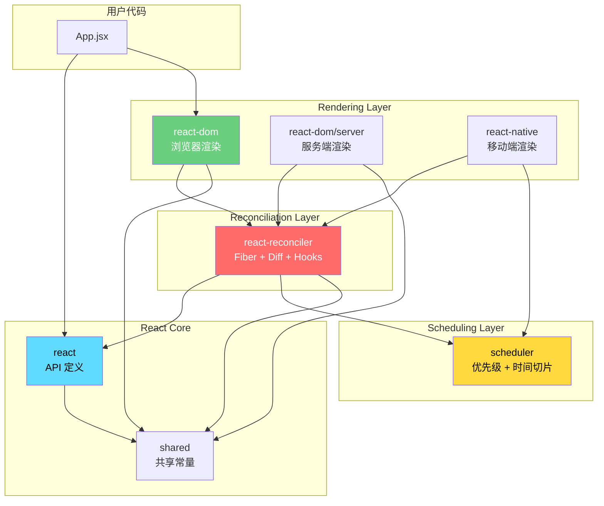
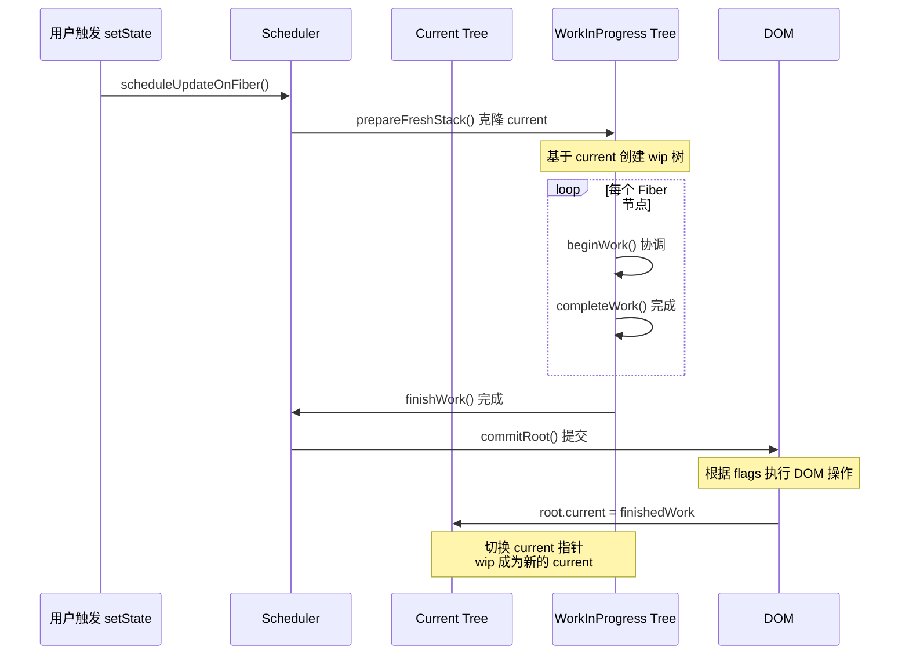
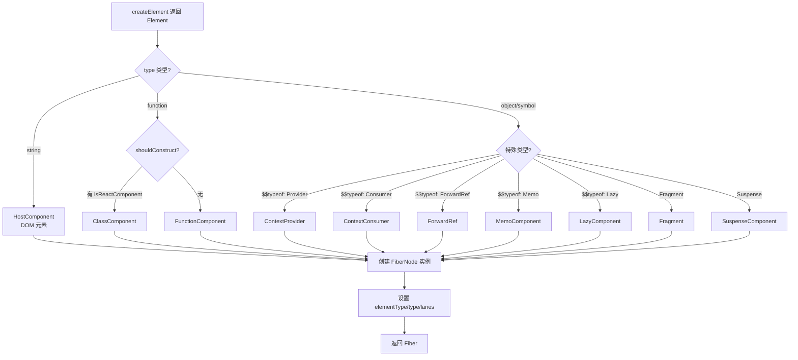
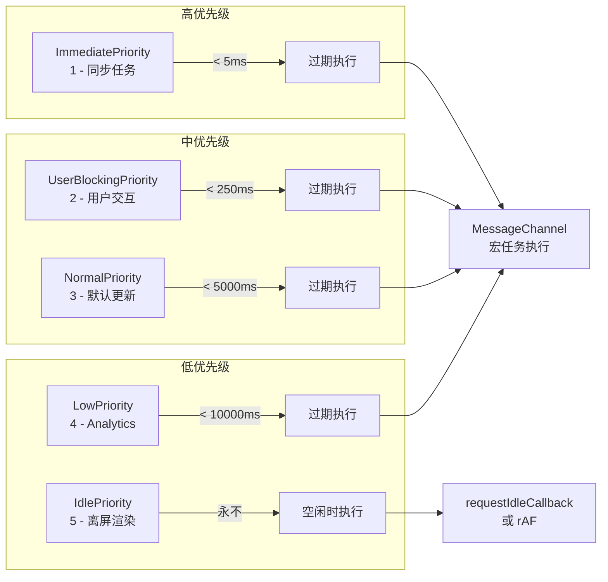
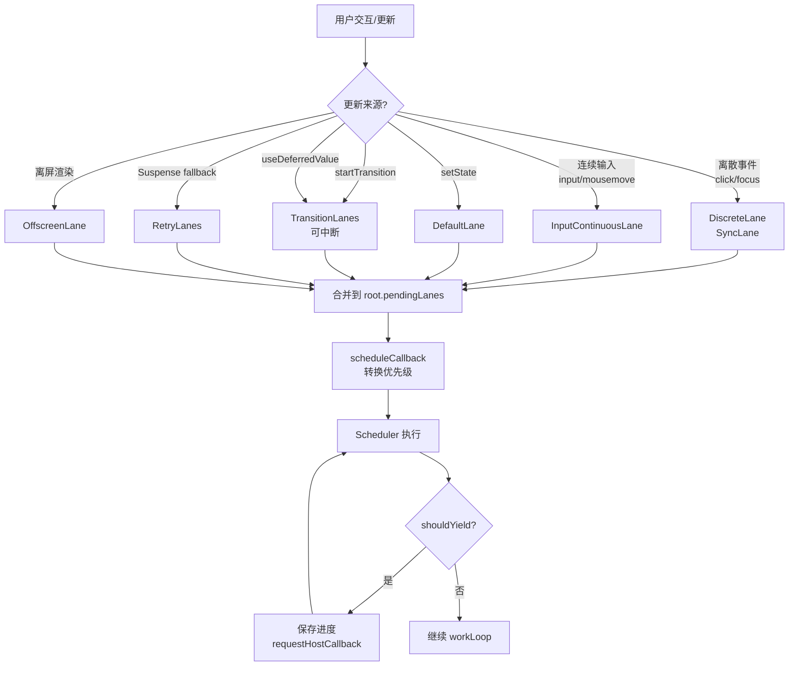
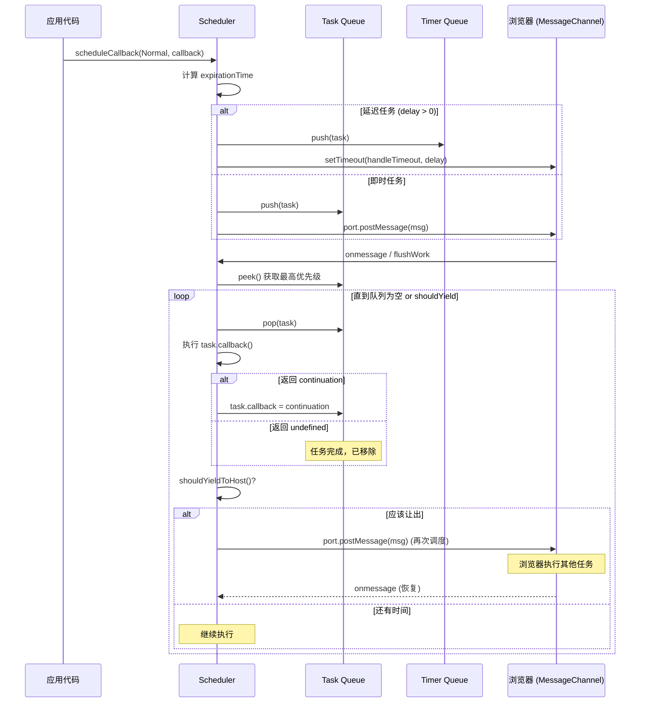
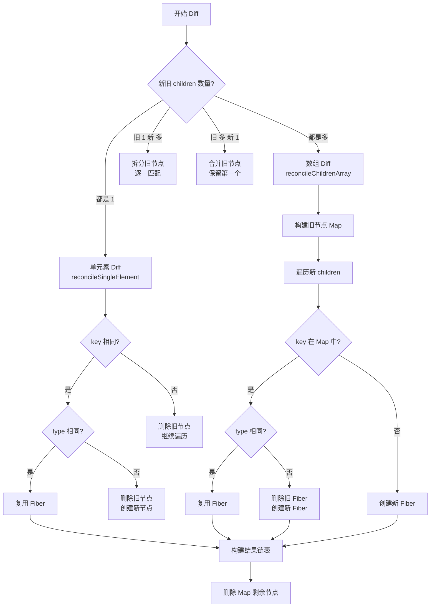
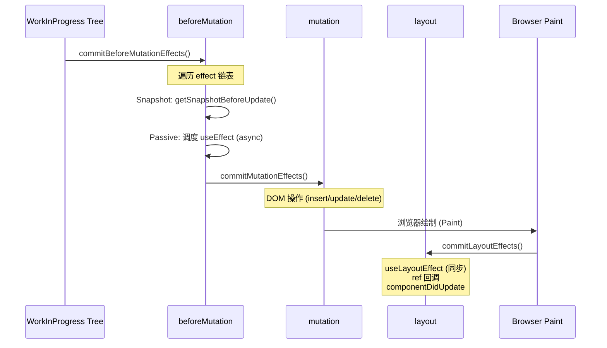
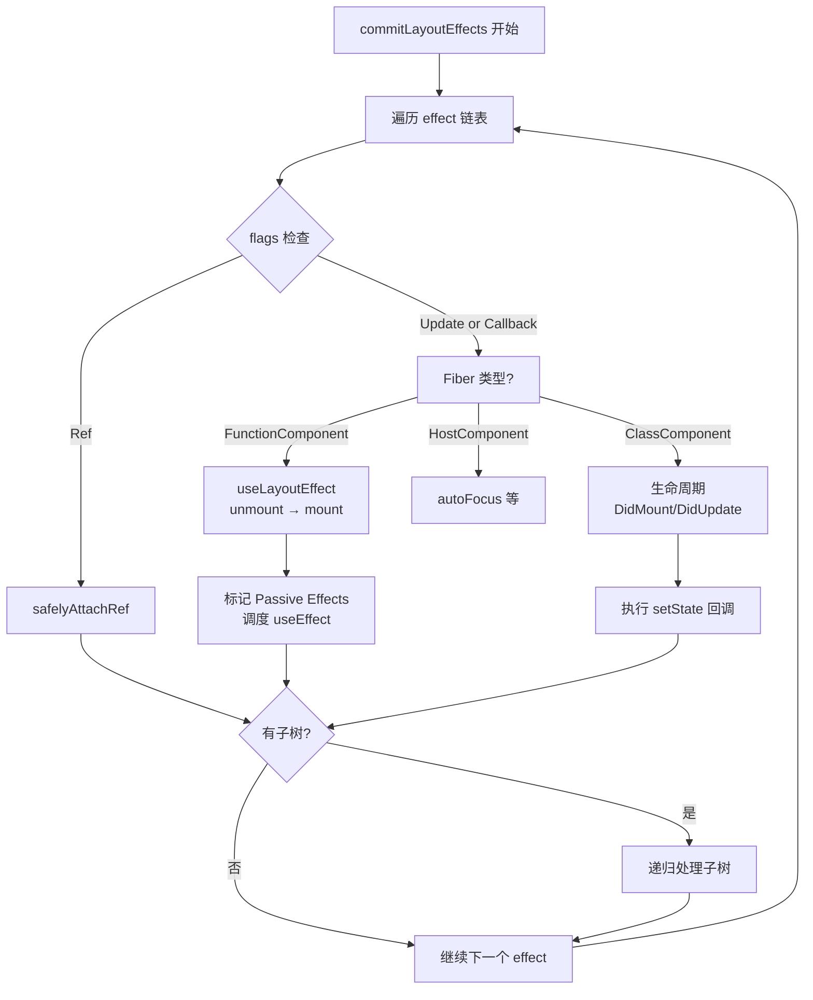

# React 源码解读基础知识指南

> **版本**: React 18.3.x (最新稳定版)
> **更新日期**: 2026-06-17
> **适用人群**: 希望深入理解 React 内部原理的中高级前端开发者
> **前置知识**: JavaScript ES6+、React 基础 API、数据结构基础

---

## 目录

- [第1章 项目结构与 Monorepo](#第1章-项目结构与-monorepo)
  - [1.1 packages/ 目录结构概览](#11-packages--目录结构概览)
  - [1.2 Fiber 架构分层说明](#12-fiber-架构分层说明)
  - [1.3 包间依赖关系图](#13-包间依赖关系图)
- [第2章 Fiber 架构](#第2章-fiber-架构)
  - [2.1 FiberNode 数据结构详解](#21-fibernode-数据结构详解)
  - [2.2 FiberTree 双缓存机制](#22-fibertree-双缓存机制)
  - [2.3 Fiber 创建流程](#23-fiber-创建流程)
  - [2.4 Fiber 工作原理深度解析](#24-fiber-工作原理深度解析)
- [第3章 调度系统](#第3章-调度系统)
  - [3.1 Scheduler 优先级队列](#31-scheduler-优先级队列)
  - [3.2 Lanes 模型与二进制位运算](#32-lanes-模型与二进制位运算)
  - [3.3 Task scheduling 与 cancel 机制](#33-task-scheduling-与-cancel-机制)
  - [3.4 调度系统实战应用](#34-调度系统实战应用)
- [第4章 Render 阶段](#第4章-render-阶段)
  - [4.1 beginWork 协调过程](#41-beginwork-协调过程)
  - [4.2 completeWork 完成工作](#42-completework-完成工作)
  - [4.3 reconcileChildren 子节点协调](#43-reconcilechildren-子节点协调)
  - [4.4 Diff 算法核心实现](#44-diff-算法核心实现)
- [第5章 Commit 阶段](#第5章-commit-阶段)
  - [5.1 beforeMutation 阶段](#51-beforemutation-阶段)
  - [5.2 mutation 阶段](#52-mutation-阶段)
  - [5.3 layout 阶段](#53-layout-阶段)
  - [5.4 DOM 操作与 Ref 处理](#54-dom-操作与-ref-处理)
- [第6章 Hooks 原理](#第6章-hooks-原理)
  - [6.1 useState 实现原理](#61-usestate-实现原理)
  - [6.2 useEffect 执行机制](#62-useeffect-执行机制)
  - [6.3 useMemo/useCallback 缓存逻辑](#63-usememousecallback-缓存逻辑)
  - [6.4 Hook 规则底层保证](#64-hook-规则底层保证)
- [第7章 并发特性](#第7章-并发特性)
  - [7.1 Suspense 组件实现](#71-suspense-组件实现)
  - [7.2 startTransition 与 useDeferredValue](#72-starttransition-与-usedeferredvalue)
  - [7.3 时间切片 (Time Slicing)](#73-时间切片-time-slicing)
  - [7.4 workLoopConcurrent 中断恢复](#74-workloopconcurrent-中断恢复)
- [第8章 状态管理](#第8章-状态管理)
  - [8.1 Context 实现原理](#81-context-实现原理)
  - [8.2 useReducer 实现](#82-usereducer-实现)
  - [8.3 外部状态管理方案对比](#83-外部状态管理方案对比)
- [第9章 事件系统](#第9章-事件系统)
  - [9.1 合成事件 SyntheticEvent](#91-合成事件-syntheticevent)
  - [9.2 事件委托到 root](#92-事件委托到-root)
  - [9.3 优先级事件分类](#93-优先级事件分类)
- [第10章 服务端渲染 (SSR)](#第10章-服务端渲染-ssr)
  - [10.1 renderToString/hydrate 过程](#101-rendertostringhydrate-过程)
  - [10.2 流式 SSR 实现](#102-流式-ssr-实现)
  - [10.3 选择性 Hydration](#103-选择性-hydration)
- [第11章 React 18 新特性](#第11章-react-18-新特性)
  - [11.1 Automatic Batching](#111-automatic-batching)
  - [11.2 并发渲染模式](#112-并发渲染模式)
  - [11.3 新 Hooks API](#113-new-hooks-api)
- [第12章 性能优化源码视角](#第12章-性能优化源码视角)
  - [12.1 React.memo 的 shallowEqual 实现](#121-reactmemo-的-shallowequal-实现)
  - [12.2 bailout 机制](#122-bailout-机制)
  - [12.3 React DevTools Profiler 原理](#123-react-devtools-profiler-原理)
- [附录A: React 源码调试指南](#附录a-react-源码调试指南)
- [附录B: 从零复刻 mini-react](#附录b-从零复刻-mini-react)

---

## 第1章 项目结构与 Monorepo

### 1.1 packages/ 目录结构概览

#### 1.1.1 【Monorepo 架构设计】

> **源码位置**：`packages/` 根目录
> **对应版本**：React 18.3.x

##### 1. 源码片段

```javascript
// packages 目录结构（精简版）
packages/
├── react/                    # React 核心库（与渲染器无关的 API）
│   ├── src/
│   │   ├── React.js         # 入口文件，导出所有公共 API
│   │   ├── ReactHooks.js    # Hooks 实现（useState, useEffect 等）
│   │   ├── ReactContext.js  # Context API
│   │   └── ReactChildren.js # Children 工具函数
│   ├── index.js
│   └── package.json
├── react-dom/                # DOM 渲染器
│   ├── src/
│   │   ├── client/          # ReactDOM.createRoot (React 18)
│   │   ├── server/          # SSR 相关
│   │   ├── events/          # 合成事件系统
│   │   └── shared/          # 共享工具
│   └── package.json
├── react-reconciler/        # 协调器（Fiber 架构核心）
│   ├── src/
│   │   ├── ReactFiber*.js   # Fiber 相关模块
│   │   ├── ReactFiberHooks.js  # Hooks 在 reconciler 中的实现
│   │   ├── ReactFiberWorkLoop.js # 主循环
│   │   └── ReactFiberCommitWork.js # Commit 阶段
│   └── package.json
├── scheduler/               # 调度器
│   ├── src/
│   │   ├── Scheduler.js     # 调度核心
│   │   ├── SchedulerMinHeap.js  # 最小堆实现
│   │   └── SchedulerPriorities.js # 优先级定义
│   └── package.json
├── shared/                  # 共享代码和常量
│   └── src/
│       ├── ReactSymbols.js  # Symbol 定义
│       └── ReactFeatureFlags.js # 特性开关
```

##### 2. 逐行注释

| 行号 | 代码 | 说明 |
|------|------|------|
| 1 | `react/` | 核心包：包含与平台无关的 React API |
| 2 | `react-dom/` | 浏览器渲染器：处理 DOM 操作、事件、SSR |
| 3 | `react-reconciler/` | 协调器：Fiber 架构、Diff 算法、调度 |
| 4 | `scheduler/` | 调度器：任务优先级、时间切片 |
| 5 | `shared/` | 共享：常量、Symbol、工具函数 |

##### 3. 设计意图

为什么要采用 Monorepo 架构？

→ **关注点分离**：每个包职责单一，react 只负责 API 定义，不关心如何渲染
→ **跨平台能力**：react-dom（浏览器）、react-native（移动端）共享 reconciler 和 scheduler
→ **独立版本管理**：各包可独立发布，依赖清晰
→ **Tree Shaking 友好**：使用者可以只引入需要的部分

##### 4. 版本差异

与 React 16 对比：
- **React 16**: packages 结构较简单，scheduler 还未独立
- **React 17**: 引入新的 JSX Transform，优化事件系统
- **React 18**: scheduler 完全独立，新增 concurrent features 包

##### 5. 关联面试题

→ Q: 为什么 React 要拆分成多个包？
→ A: 为了解耦核心逻辑与平台实现，支持多端渲染（Web/Native/Server）

---

#### 1.1.2 【核心包职责划分】

> **源码位置**：`packages/react/src/React.js:1-50`
> **对应版本**：React 18.3.x

##### 1. 源码片段

```javascript
// packages/react/src/React.js
const React = {
  // 核心 API
  Children: {
    map,
    forEach,
    count,
    toArray,
    only,
  },
  createRef,
  Component,
  PureComponent,

  // Context API
  createContext,

  // Elements
  createElement,
  cloneElement,
  isValidElement,
  jsx,      // React 17+ 新增
  jsxs,     // React 17+ 新增

  // Hooks (实际实现在 ReactFiberHooks.js)
  useState,
  useEffect,
  useContext,
  useReducer,
  useCallback,
  useMemo,
  useRef,
  useImperativeHandle,
  useLayoutEffect,
  useDebugValue,
  useId,           // React 18 新增
  useSyncExternalStore,  // React 18 新增
  useTransition,   // React 18 新增
  useDeferredValue, // React 18 新增

  // Suspense
  Suspense,
  SuspenseList,

  // 其他
  Fragment,
  StrictMode,
  startTransition,  // React 18 新增
  unstable_useCache, // 实验性 API
};

export default React;
```

##### 2. 逐行注释

| 行号 | 代码 | 说明 |
|------|------|------|
| 3-8 | `Children` | 处理 children 的工具方法集合 |
| 10 | `createRef` | 创建 ref 对象（类组件时代遗留） |
| 11-12 | `Component/PureComponent` | 类组件基类 |
| 15 | `createContext` | 创建上下文对象 |
| 18-20 | `createElement` 等 | 创建虚拟 DOM 元素 |
| 23-38 | `Hooks API` | 函数式组件的状态管理 |
| 41-43 | `Suspense` | 异步组件加载边界 |
| 45-47 | `Fragment` 等 | 特殊组件类型 |
| 49-52 | `startTransition` 等 | React 18 并发特性 |

##### 3. 设计意图

为什么 Hooks 的实现在 reconciler 而不是 react 包？

→ **运行时依赖**：Hooks 需要 Fiber 节点的 memoizedState 来存储状态
→ **渲染无关性**：react 包只声明接口，具体实现在 reconciler
→ **插件化架构**：自定义渲染器可以选择是否支持 Hooks

##### 4. 版本差异

- **React 16.8**: Hooks 正式发布，但实现较简单
- **React 17**: 优化 Hooks 性能，修复闭包陷阱
- **React 18**: 新增并发相关 Hooks（useTransition, useDeferredValue）

##### 5. 关联面试题

→ Q: React.createElement 和 JSX 有什么关系？
→ A: JSX 是语法糖，编译后会调用 createElement。React 17+ 使用 jsx/jsxs 自动导入。

---

### 1.2 Fiber 架构分层说明

#### 1.2.1 【三层架构模型】

> **源码位置**：`packages/react-reconciler/src/ReactFiberWorkLoop.js:1-100`
> **对应版本**：React 18.3.x

##### 1. 源码片段

```javascript
// 三层架构示意（伪代码表示层间调用关系）

// 第一层：Scheduler（调度层）
function scheduleCallback(priorityLevel, callback, options) {
  // 创建任务
  var newNode = {
    id: taskIdCounter++,
    callback,
    priorityLevel,
    startTime: options?.startTime || now(),
    expirationTime: options?.timeout || 0,
    sortIndex: -1,
  };

  // 根据开始时间决定放入哪个队列
  if (startTime > currentTime) {
    // 延迟任务
    push(timerQueue, newNode);
    requestHostTimeout(handleTimer, startTime - currentTime);
  } else {
    // 立即任务
    newNode.sortIndex = expirationTime;
    push(taskQueue, newNode);
    
    if (!isHostCallbackScheduled && !isPerformingWork) {
      isHostCallbackScheduled = true;
      requestHostCallback(flushWork);  // 通知宿主环境
    }
  }

  return newNode;
}

// 第二层：Reconciler（协调层）
function performUnitOfWork(unitOfWork) {
  const current = unitOfWork.alternate;
  
  let next;
  if (enableProfilerTimer && (unitOfWork.mode & ProfileMode) !== NoMode) {
    next = beginWork(current, unitOfWork, renderLanes);
  } else {
    next = beginWork(current, unitOfWork, renderLanes);
  }

  unitOfWork.memoizedProps = unitOfWork.pendingProps;
  
  if (next === null) {
    completeUnitOfWork(unitOfWork);
  } else {
    workInProgress = next;
  }
}

// 第三层：Renderer（渲染层）
function commitRoot(root) {
  const {finishedWork, lanes} = root;
  
  // 三个子阶段
  commitBeforeMutationEffects(root, finishedWork);  // beforeMutation
  commitMutationEffects(root, finishedWork, lanes);  // mutation
  commitLayoutEffects(root, finishedWork, lanes);     // layout
  
  root.current = finishedWork;  // 切换 current 指针
}
```

##### 2. 逐行注释

| 层级 | 职责 | 核心文件 |
|------|------|----------|
| Scheduler | 任务调度、优先级排序、时间切片 | `scheduler/src/Scheduler.js` |
| Reconciler | Fiber 构建、Diff 算法、Effect 收集 | `react-reconciler/src/` |
| Renderer | DOM 操作、事件绑定、SSR | `react-dom/src/` |

##### 3. 设计意图

为什么需要三层架构？

→ **可替换性**：Renderer 可以是 DOM、Native、Canvas 等
→ **调度独立**：Scheduler 可以根据平台特性调整策略（浏览器用 rAF，Node 用 setImmediate）
→ **测试友好**：每层可独立单元测试

##### 4. 版本差异

- **React 16**: Stack Reconciler，同步递归，无调度层
- **React 16+**: Fiber Reconciler，引入 Scheduler
- **React 18**: Scheduler 支持 5 种优先级，支持中断恢复

##### 5. 关联面试题

→ Q: React 的三层架构分别是什么？各自的作用？
→ A: Scheduler（调度）、Reconciler（协调/Diff）、Renderer（渲染）。这种分层使得 React 可以支持多端渲染。

---

### 1.3 包间依赖关系图

#### 1.3.1 【依赖关系可视化】

> **源码位置**：各包的 `package.json` dependencies 字段
> **对应版本**：React 18.3.x

##### 1. Mermaid 流程图



##### 2. ASCII 图示

```
┌─────────────────────────────────────────────────────────────┐
│                      用户代码 (App.jsx)                       │
└─────────────┬───────────────────────────────────────────────┘
              │ import
              ▼
┌─────────────────────────────────────────────────────────────┐
│                    react (API 层)                            │
│  • createElement  • useState  • useContext  • Suspense       │
│  • Hooks 接口声明  • Context API                             │
└─────┬──────────────────────────┬────────────────────────────┘
      │                          │
      ▼                          ▼
┌──────────────┐        ┌────────────────────────────────────┐
│   shared     │◄───────│     react-reconciler (协调层)       │
│  (常量/Symbol)│        │  • Fiber 架构  • Diff 算法          │
└──────────────┘        │  • Hooks 实现  • Effect 收集         │
                        └───────────────┬────────────────────┘
                                        │
                                        ▼
                        ┌────────────────────────────────────┐
                        │       scheduler (调度层)             │
                        │  • 优先级队列  • 时间切片            │
                        │  • 任务取消  • 中断恢复              │
                        └───────────────┬────────────────────┘
                                        │
                    ┌───────────────────┼───────────────────┐
                    ▼                   ▼                   ▼
            ┌──────────────┐   ┌──────────────┐   ┌──────────────┐
            │  react-dom   │   │react-dom/ser │   │react-native  │
            │  (浏览器渲染) │   │  (SSR 渲染)  │   │ (移动端渲染)  │
            │  • DOM 操作  │   │ • HTML 输出  │   │  • Native UI │
            │  • 事件系统  │   │ • Hydration  │   │             │
            └──────────────┘   └──────────────┘   └──────────────┘
```

##### 3. 设计意图

依赖方向的设计原则：

→ **单向依赖**：上层依赖下层，下层不知道上层的存在
→ **接口抽象**：react 定义接口，reconciler 提供实现
→ **平台隔离**：renderer 只依赖 reconciler，不直接依赖 react

##### 4. 版本差异

- **React 16**: react-dom 直接依赖 react，耦合较紧
- **React 17**: 引入 react-reconciler 作为中间层
- **React 18**: scheduler 完全独立，react-native 可使用不同调度策略

##### 5. 关联面试题

→ Q: 如果要为游戏引擎创建一个 React 渲染器，需要实现哪些包？
→ A: 只需实现 renderer 层（类似 react-dom），复用 reconciler 和 scheduler。参考 react-three-fiber、remotion 等项目。

---

## 第2章 Fiber 架构

### 2.1 FiberNode 数据结构详解

#### 2.1.1 【FiberNode 核心属性】

> **源码位置**：`packages/react-reconciler/src/ReactFiber.js:120-185`
> **对应版本**：React 18.3.x

##### 1. 源码片段

```javascript
// packages/react-reconciler/src/ReactFiber.js
function FiberNode(tag, pendingProps, key, mode) {
  // 实例属性
  this.tag = tag;                    // Fiber 类型标记
  this.key = key;                    // 唯一标识（用于 Diff）
  this.elementType = null;           // 元素类型（函数/类/字符串）
  this.type = null;                  // 具体类型（与 elementType 可能不同）
  this.stateNode = null;             // 关联的实例（DOM节点/类组件实例）

  // Fiber 结构指针
  this.return = null;                // 父 Fiber
  this.child = null;                 // 第一个子 Fiber
  this.sibling = null;               // 下一个兄弟 Fiber
  this.index = 0;                    // 在父节点的 children 中的索引

  // Props
  this.ref = null;                   // ref 引用
  this.pendingProps = pendingProps;   // 待处理的 props（新 props）
  this.memoizedProps = null;         // 上次渲染使用的 props（用于比较）
  this.updateQueue = null;           // 更新队列（状态更新副作用）
  this.memoizedState = null;         // 上次渲染的状态（用于 Hooks 存储）

  // 副作用
  this.flags = NoFlags;              // 副作用标记（位运算标记）
  this.subtreeFlags = NoFlags;       // 子树副作用标记
  this.deletions = null;             // 待删除的子节点列表

  // 双缓存
  this.alternate = null;             // 对应的另一个 Fiber（current/workInProgress）

  // 优先级
  this.lanes = NoLanes;              // 当前更新的 lane
  this.childLanes = NoLanes;         // 子树的 lanes

  // 模式
  this.mode = mode;                  // 并发模式标记（ConcurrentMode/StrictMode等）
}

// Fiber 类型标记（tag 常量）
export const FunctionComponent = 0;               // 函数组件
export const ClassComponent = 1;                  // 类组件
export const IndeterminateComponent = 2;          // 不确定类型（首次渲染前）
export const HostRoot = 3;                        // Root Fiber（根节点）
export const HostPortal = 4;                      // Portal
export const HostComponent = 5;                   // 原生 DOM 组件（div, span等）
export const HostText = 6;                        // 文本节点
export const Fragment = 7;                        // Fragment
export const Mode = 8;                            // StrictMode / ConcurrentMode
export const ContextConsumer = 9;                 // Context.Consumer
export const ContextProvider = 10;                // Context.Provider
export const ForwardRef = 11;                     // React.forwardRef
export const Profiler = 12;                       // Profiler
export const SuspenseComponent = 13;              // Suspense
export const MemoComponent = 14;                  // React.memo
export const SimpleMemoComponent = 15;            // 简化的 Memo
export const LazyComponent = 16;                  // React.lazy
```

##### 2. 逐行注释

| 行号 | 代码 | 说明 |
|------|------|------|
| 121 | `this.tag = tag` | 标记 Fiber 类型（函数组件/类组件/DOM节点等），用于 beginWork 分支判断 |
| 123 | `this.key = key` | 用于 Diff 算法的同层级比较，相同 key 认为是同一元素 |
| 125 | `this.elementType` | 元素的原始类型（如函数组件本身） |
| 126 | `this.type` | 实际使用的类型（可能经过包装，如 MemoComponent） |
| 128 | `this.stateNode` | **关键**：DOM 节点或类组件实例，是 Fiber 与真实对象的桥梁 |
| 131-134 | `return/child/sibling` | **核心**：构成 Fiber 树的三种指针，形成链表树结构 |
| 136 | `this.index` | 子节点在父节点中的位置，用于 Diff 时定位 |
| 138 | `this.ref` | ref 回调或对象，在 Commit 阶段处理 |
| 140 | `this.pendingProps` | 新传入的 props，等待处理 |
| 141 | `this.memoizedProps` | **重要**：上次渲染的 props，用于 shouldComponentUpdate 判断 |
| 143 | `this.updateQueue` | 存储状态更新对象（如 setState 的 payload） |
| 144 | `this.memoizedState` | **关键**：存储 Hooks 链表头（useState/useReducer 的状态） |
| 147 | `this.flags` | **核心**：位标记，记录该 Fiber 需要执行的副作用操作 |
| 148 | `this.subtreeFlags` | 子树的聚合 flags，优化遍历 |
| 149 | `this.deletions` | 待删除的子 Fiber 列表 |
| 152 | `this.alternate` | **双缓存核心**：指向 current 或 workInProgress 的另一份拷贝 |
| 155-156 | `lanes/childLanes` | Lanes 模型，二进制位表示优先级 |

##### 3. 设计意图

为什么 FiberNode 要保存这么多字段？

→ **增量更新**：通过 memoizedProps/memoizedState 快速判断是否需要更新
→ **双向链接**：return/child/sibling 使得遍历可以从任意节点开始
→ **双缓存**：alternate 实现无缝切换，避免闪烁
→ **位运算优化**：flags 使用位运算高效组合多种副作用

##### 4. 版本差异

- **React 16**: 使用 effectTag（数字），React 18 改为 flags（位掩码）
- **React 17**: 新增 subtreeFlags 优化
- **React 18**: 新增 lanes 替代 expirationTime，更精细的优先级控制

##### 5. 关联面试题

→ Q: FiberNode 的 alternate 字段有什么作用？
→ A: 实现 double buffering（双缓存）。当前显示的是 current 树，正在构建的是 workInProgress 树，两者通过 alternate 互指。构建完成后切换指针即可。

---

#### 2.1.2 【Fiber Flags 位运算体系】

> **源码位置**：`packages/react-reconciler/src/ReactFiberFlags.js:1-80`
> **对应版本**：React 18.3.x

##### 1. 源码片段

```javascript
// packages/react-reconciler/src/ReactFiberFlags.js

// Don't change these two values:
export const NoFlags = /*                      */ 0b000000000000000000000;
export const PerformedWork = /*                */ 0b000000000000000000001;

// You can add more values here...
export const Placement = /*                     */ 0b000000000000000010;     // 2: 插入
export const Update = /*                        */ 0b000000000000000100;     // 4: 更新
export const PlacementAndUpdate = /*            */ Placement | Update;       // 6: 插入并更新
export const Deletion = /*                      */ 0b000000000000001000;     // 8: 删除
export const ContentReset = /*                  */ 0b000000000000010000;     // 16: 内容重置
export const Callback = /*                      */ 0b000000000000100000;     // 32: 回调
export const DidCapture = /*                    */ 0b000000000001000000;     // 64: 错误捕获
export const Ref = /*                           */ 0b000000000010000000;     // 128: Ref
export const Snapshot = /*                      */ 0b000000000100000000;     // 256: 快照（useLayoutEffect）
export const Passive = /*                       */ 0b000000001000000000;     // 512: 被动效应（useEffect）
export const Hydrating = /*                     */ 0b000000010000000000;     // 1024: Hydration
export const HydratingAndUpdate = /*            */ Hydrating | Update;

// Passive & Update & Callback & Ref & Snapshot
export const LifecycleEffectMask = /*           */ 0b000000001110100100;     // 组合 mask

// Union of all host effects
export const HostEffectMask = /*                */ 0b000000001111111111;     // 所有 host 效果 mask

// These are not really side effects, but we still reuse this field.
export const Incomplete = /*                    */ 0b000000010000000000;
export const ShouldCapture = /*                 */ 0b000000100000000000;
export const ForceUpdateForLegacySuspense = /*  */ 0b000001000000000000;

// Combination masks
export const MutationMask = /*                  */ Placement | Update | Deletion | ContentReset | Hydrating | Visibility;
export const LayoutMask = /*                    */ Update | Callback | Ref;
export const PassiveMask = /*                   */ Passive | ChildDeletion;
```

##### 2. 逐行注释

| 行号 | 代码 | 说明 |
|------|------|------|
| 3 | `NoFlags = 0` | 无副作用，初始值 |
| 4 | `PerformedWork = 1` | 已执行工作（DevTools 使用） |
| 6 | `Placement = 2` | **常用**：需要插入 DOM |
| 7 | `Update = 4` | **常用**：需要更新 DOM 属性 |
| 9 | `Deletion = 8` | **常用**：需要删除 DOM |
| 16 | `Passive = 512` | **关键**：useEffect 标记 |
| 26 | `MutationMask` | mutation 阶段需要处理的 flags 组合 |
| 27 | `LayoutMask` | layout 阶段需要处理的 flags 组合 |

##### 3. 设计意图

为什么要使用位运算来表示副作用？

→ **空间效率**：一个数字可以同时表示多种副作用（如 Placement | Update = 6）
→ **快速判断**：使用 `&` 运算符快速检查是否有某类副作用：`(flags & Placement) !== 0`
→ **批量处理**：可以在一次遍历中处理多种副作用
→ **可扩展性**：新增副作用只需增加一位，不影响已有逻辑

##### 4. 版本差异

- **React 16**: 使用 effectTag，值较小（1, 2, 4...）
- **React 18**: 重命名为 flags，扩展了更多位（支持 Suspense、Transitions 等）

##### 5. 关联面试题

→ Q: 如何判断一个 Fiber 是否有副作用？
→ A: `if (fiber.flags !== NoFlags)` 或 `(fiber.flags & Placement) !== 0` 检查特定副作用。

---

### 2.2 FiberTree 双缓存机制

#### 2.2.1 【Double Buffering 原理】

> **源码位置**：`packages/react-reconciler/src/ReactFiberRoot.js:50-120`
> **对应版本**：React 18.3.x

##### 1. 源码片段

```javascript
// packages/react-reconciler/src/ReactFiberRoot.js
function createFiberRoot(containerInfo, tag, hydrate, hydrationCallbacks) {
  const root = new FiberRootNode(containerInfo, tag, hydrate);

  // 创建根 Fiber（HostRoot）
  const uninitializedFiber = createHostRootFiber(tag);

  root.current = uninitializedFiber;
  uninitializedFiber.stateNode = root;

  // 初始化 updateQueue
  initializeUpdateQueue(uninitializedFiber);

  return root;
}

// FiberRootNode 结构
class FiberRootNode {
  constructor(containerInfo, tag, hydrate) {
    this.tag = tag;
    this.containerInfo = containerInfo;  // DOM 容器（如 #root）
    this.pendingChildren = null;
    this.current = null;                  // 指向当前的 current 树
    this.pingCache = null;
    
    this.finishedWork = null;             // 完成的 workInProgress 树
    this.timeoutHandle = noTimeout;
    this.context = null;
    this.pendingContext = null;
    this.callbackNode = null;
    this.callbackPriority = NoLane;
    
    // 事件相关
    this.eventTimes = createLaneMap(NoLanes);
    this.expirationTimes = createLaneMap(NoTimestamp);
    
    // 可中断相关
    this.pendingLanes = NoLanes;
    this.suspendedLanes = NoLanes;
    this.pingedLanes = NoLanes;
    this.expiredLanes = NoLanes;
    this.mutableReadLanes = NoLanes;
    this.finishedLanes = NoLanes;
    
    // Entangled lanes（交叉 lanes）
    this.entangledLanes = NoLanes;
    this.entanglements = createLaneMap(NoLanes);
    
    // 并发模式相关
    this.hashPrefix = '';
    this.hiddenUpdates = createHiddenUpdateMap();
  }
}
```

##### 2. 逐行注释

| 行号 | 代码 | 说明 |
|------|------|------|
| 4-6 | `createFiberRoot` | 创建 Fiber 树的根节点 |
| 8 | `createHostRootFiber(tag)` | 创建 HostRoot 类型的 Fiber（tag=3） |
| 10 | `root.current = fiber` | **关键**：FiberRoot 的 current 指向当前显示的 Fiber 树 |
| 11 | `fiber.stateNode = root` | **双向引用**：Fiber 也持有 FiberRoot 的引用 |
| 19 | `finishedWork` | 存储已完成的 workInProgress 树，commit 后切换为 current |

##### 3. Mermaid 流程图



##### 4. ASCII 图示

```
初始状态（首次渲染）:
┌─────────────────────────────────────────┐
│  FiberRoot                              │
│  ┌─────────────────────────────────┐    │
│  │ current ──────────────────────► │    │
│  │  ┌─────────────────────────┐    │    │
│  │  │ HostRoot Fiber (tag=3)  │    │    │
│  │  │ stateNode ◄─────────────┤    │    │
│  │  │ alternate: null         │    │    │
│  │  │ child: App Fiber        │    │    │
│  │  └─────────────────────────┘    │    │
│  └─────────────────────────────────┘    │
│  finishedWork: null                       │
└─────────────────────────────────────────┘

更新过程中:
┌─────────────────────────────────────────┐
│  FiberRoot                              │
│  ┌─────────────────────────────────┐    │
│  │ current ──────────────────────► │    │
│  │  ┌─────────────────────────┐    │    │
│  │  │ HostRoot (当前显示)      │    │    │
│  │  │ alternate ──────────────┼───┼──┐│
│  └─────────────────────────────┼───┼──┘│
│  ┌─────────────────────────────┼───┼──┐│
│  │ finishedWork ──────────────►│   │  ││
│  │  ┌─────────────────────────┐▼   │  ││
│  │  │ HostRoot (workInProgress)│   │  ││
│  │  │ alternate ──────────────┼┼───┘││
│  │  │ child: 新的 App Fiber    │┘    ││
│  │  └─────────────────────────┘     ││
│  └─────────────────────────────────┘  │
└───────────────────────────────────────┘

Commit 后:
┌─────────────────────────────────────────┐
│  FiberRoot                              │
│  ┌─────────────────────────────────┐    │
│  │ current ──────────────────────► │    │
│  │  ┌─────────────────────────┐    │    │
│  │  │ HostRoot (原 wip)       │    │    │  ← 指针切换
│  │  │ alternate ──► 原 current │    │    │
│  │  └─────────────────────────┘    │    │
│  └─────────────────────────────────┘    │
│  finishedWork: null                       │
└─────────────────────────────────────────┘
```

##### 5. 设计意图

为什么要使用双缓存？

→ **避免闪烁**：用户看到的始终是完整的 current 树，wip 树在内存中构建
→ **快速回滚**：如果渲染被中断，可以直接丢弃 wip 树，current 树不受影响
→ **增量更新**：基于 current 树克隆 wip 树，只修改变化的部分
→ **一致性保证**：commit 是原子操作，要么全部更新，要么完全不更新

##### 6. 版本差异

- **React 16**: 双缓存概念初步建立
- **React 18**: 完善了 lanes 模型下的双缓存切换逻辑

##### 7. 关联面试题

→ Q: current 树和 workInProgress 树是如何切换的？
→ A: 在 commitRoot 最后，执行 `root.current = finishedWork`，将指针从旧的 current 切换到新完成的 wip 树。此时原来的 current 成为 alternate。

---

### 2.3 Fiber 创建流程

#### 2.3.1 【createFiberFromElement 流程】

> **源码位置**：`packages/react-reconciler/src/ReactFiber.js:300-380`
> **对应版本**：React 18.3.x

##### 1. 源码片段

```javascript
// packages/react-reconciler/src/ReactFiber.js

// 从 Element 创建 Fiber
export function createFiberFromElement(element, mode, lanes) {
  let owner = null;
  // 开发模式下追踪 owner（用于警告）
  if (__DEV__) {
    owner = element._owner;
  }

  const type = element.type;
  const key = element.key;
  const pendingProps = element.props;
  const fiber = createFiberFromTypeAndProps(
    type, 
    key, 
    pendingProps, 
    owner, 
    mode, 
    lanes,
  );
  
  return fiber;
}

// 从类型和 props 创建 Fiber（核心工厂函数）
function createFiberFromTypeAndProps(type, key, pendingProps, owner, mode, lanes) {
  let fiberTag = IndeterminateComponent;  // 默认不确定类型
  let resolvedType = type;

  // 根据类型确定 fiberTag
  if (typeof type === 'function') {
    if (shouldConstruct(type)) {  // 是否是类组件（有原型上的 isReactComponent）
      fiberTag = ClassComponent;
    } else {
      fiberTag = FunctionComponent;
    }
  } else if (typeof type === 'string') {
    fiberTag = HostComponent;  // DOM 元素（'div', 'span' 等）
  } else {
    getTag: switch (type) {
      case REACT_FRAGMENT_TYPE:
        fiberTag = Fragment;
        break getTag;
      case REACT_SUSPENSE_TYPE:
        fiberTag = SuspenseComponent;
        break getTag;
      case REACT_SUSPENSE_LIST_TYPE:
        fiberTag = SuspenseListComponent;
        break getTag;
      default:
        if (typeof type === 'object' && type !== null) {
          if (typeof type.$$typeof === 'symbol') {
            switch (type.$$typeof) {
              case REACT_PROVIDER_TYPE:
                fiberTag = ContextProvider;
                break getTag;
              case REACT_CONTEXT_TYPE:
                fiberTag = ContextConsumer;
                break getTag;
              case REACT_FORWARD_REF_TYPE:
                fiberTag = ForwardRef;
                break getTag;
              case REACT_MEMO_TYPE:
                fiberTag = MemoComponent;
                resolvedType = type.type;
                break getTag;
              case REACT_LAZY_TYPE:
                fiberTag = LazyComponent;
                break getTag;
            }
          }
        }
        // 兜底处理
        let info = '';
        if (__DEV__) {
          // 开发模式提供详细错误信息
        }
        throw new Error('Element type is invalid: ...');
    }
  }

  // 创建 Fiber 节点
  const fiber = createFiber(fiberTag, pendingProps, key, mode);
  fiber.elementType = type;
  fiber.type = resolvedType;
  fiber.lanes = lanes;

  return fiber;
}
```

##### 2. 逐行注释

| 行号 | 代码 | 说明 |
|------|------|------|
| 4-8 | `createFiberFromElement` | 从 React Element 创建 Fiber 的入口 |
| 14 | `createFiberFromTypeAndProps` | **核心**：根据元素类型决定 Fiber 的 tag |
| 18 | `IndeterminateComponent` | 首次渲染时不确定是函数还是类组件 |
| 21-25 | `typeof type === 'function'` | 区分函数组件和类组件 |
| 27-28 | `shouldConstruct(type)` | 检查是否有 isReactComponent 属性 |
| 30-31 | `typeof type === 'string'` | 原生 DOM 元素 |
| 33-68 | `switch (type)` | 处理特殊类型（Fragment, Suspense, Context 等） |
| 73 | `createFiber(fiberTag, ...)` | 最终调用构造函数创建 FiberNode 实例 |

##### 3. Mermaid 流程图



##### 4. 设计意图

为什么要在创建时确定 fiberTag？

→ **性能优化**：beginWork 时可以根据 tag 快速分发到不同的处理函数
→ **类型安全**：提前验证元素类型，避免运行时错误
→ **统一入口**：所有元素都通过同一流程转换为 Fiber，便于维护

##### 5. 版本差异

- **React 16**: 类型判断较简单，不支持 Lazy、Memo 等
- **React 18**: 支持更多特殊类型（SuspenseList, Scope 等），完善错误提示

##### 6. 关联面试题

→ Q: React 如何区分函数组件和类组件？
→ A: 通过 `shouldConstruct(type)` 检查组件原型上是否有 `isReactComponent` 属性。这是 React.createClass 或 class 继承 Component 时添加的标记。

---

### 2.4 Fiber 工作原理深度解析

#### 2.4.1 【Fiber 遍历顺序：深度优先】

> **源码位置**：`packages/react-reconciler/src/ReactFiberWorkLoop.js:800-900`
> **对应版本**：React 18.3.x

##### 1. 源码片段

```javascript
// packages/react-reconciler/src/ReactFiberWorkLoop.js

// 工作循环主函数
function workLoopSync() {
  while (workInProgress !== null) {
    performUnitOfWork(workInProgress);
  }
}

function workLoopConcurrent() {
  while (workInProgress !== null && !shouldYieldToHost()) {
    performUnitOfWork(workInProgress);
  }
}

// 处理单个工作单元
function performUnitOfWork(unitOfWork) {
  const current = unitOfWork.alternate;
  let next;

  // Step 1: beginWork - 协调子节点（向下遍历）
  next = beginWork(current, unitOfWork, renderLanes);
  
  unitOfWork.memoizedProps = unitOfWork.pendingProps;
  
  if (next === null) {
    // 如果没有子节点，完成当前节点（向上回溯）
    completeUnitOfWork(unitOfWork);
  } else {
    // 如果有子节点，继续处理子节点
    workInProgress = next;
  }
}

// 完成工作单元
function completeUnitOfWork(unitOfWork) {
  let completedWork = unitOfWork;
  do {
    const current = completedWork.alternate;
    const returnFiber = completedWork.return;
    
    // Step 2: completeWork - 处理副作用（创建 DOM、收集 effect）
    completeWork(current, completedWork, renderLanes);
    
    // 检查 sibling
    const siblingFiber = completedWork.sibling;
    if (siblingFiber !== null) {
      // 如果有兄弟节点，处理兄弟
      workInProgress = siblingFiber;
      return;
    }
    
    // 没有 sibling，继续向上回溯
    completedWork = returnFiber;
    workInProgress = completedWork;
  } while (completedWork !== null);
  
  // 到达根节点，工作完成
  if (workInProgressRootExitStatus === RootIncomplete) {
    workInProgressRootExitStatus = RootCompleted;
  }
}
```

##### 2. 逐行注释

| 行号 | 代码 | 说明 |
|------|------|------|
| 5-8 | `workLoopSync` | **同步模式**：一次性完成所有工作，不可中断 |
| 10-14 | `workLoopConcurrent` | **并发模式**：每处理一个单元检查是否需要让出主线程 |
| 17-28 | `performUnitOfWork` | **核心**：处理单个 Fiber 节点的工作 |
| 21 | `beginWork()` | 协调过程：对比新旧 Fiber，生成子 Fiber |
| 26-27 | `completeUnitOfWork()` | 当没有子节点时，完成当前节点并回溯 |
| 35-55 | `completeUnitOfWork` | 向上回溯，处理 sibling，收集副作用 |
| 40 | `completeWork()` | 创建/更新 DOM 节点，设置 props，标记 flags |

##### 3. ASCII 图示（深度优先遍历）

```
Fiber 树结构:
        App (FunctionComponent)
       /    \
    Header  Main (FunctionComponent)
     /  \      \
    Nav  Logo   Article (HostComponent)
                    \
                   Text (HostText)

遍历顺序（Depth-First, Preorder for beginWork, Postorder for completeWork）:

beginWork 顺序（前序遍历）:
1. App.beginWork()
2. Header.beginWork()
3. Nav.beginWork() → 无子节点 → Nav.completeWork()
4. Logo.beginWork() → 无子节点 → Logo.completeWork()
5. Header.completeWork()
6. Main.beginWork()
7. Article.beginWork()
8. Text.beginWork() → 无子节点 → Text.completeWork()
9. Article.completeWork()
10. Main.completeWork()
11. App.completeWork()

可视化:
    ① App
    ╱     ╲
 ②Header  ⑥Main
 ╱   ╲      ╲
③Nav ④Logo  ⑦Article
              ╲
              ⑧Text

completeWork 顺序（后序遍历）: ③→④→⑤→⑥→⑧→⑨→⑩→⑪
```

##### 4. 设计意图

为什么使用深度优先遍历？

→ **内存效率**：不需要保存整棵树的状态，只需维护当前路径
→ **局部性原理**：父子节点通常在内存中连续，缓存命中率高
→ **天然适合递归**：beginWork 向下，completeWork 向上，符合直觉
→ **可中断性**：可以在任何节点暂停，下次继续时从当前节点恢复

##### 5. 版本差异

- **React 16 (Stack)**: 同步递归，一旦开始无法中断
- **React 16+ (Fiber)**: 链表遍历，支持中断恢复
- **React 18**: workLoopConcurrent 配合 Scheduler 实现时间切片

##### 6. 关联面试题

→ Q: React 的调和（Reconciliation）过程是怎样的？
→ A: 从根 Fiber 开始，深度优先遍历。对每个 Fiber 执行 beginWork（协调子节点），如果没有子节点则执行 completeWork（完成工作），然后处理 sibling，最后回溯到父节点。这个过程被称为"Render 阶段"。

---

## 第3章 调度系统

### 3.1 Scheduler 优先级队列

#### 3.1.1 【优先级等级定义】

> **源码位置**：`packages/scheduler/src/SchedulerPriorities.js:1-60`
> **对应版本**：React 18.3.x

##### 1. 源码片段

```javascript
// packages/scheduler/src/SchedulerPriorities.js

/**
 * 任务优先级等级（数值越小，优先级越高）
 * 采用过期时间（expiration time）机制：
 * - 高优先级任务：过期时间短（很快过期）
 * - 低优先级任务：过期时间长（很久才过期）
 */

export const ImmediatePriority = 1;        // 最高优先级：同步任务（如用户点击）
export const UserBlockingPriority = 2;     // 用户阻塞：用户交互响应（250ms 过期）
export const NormalPriority = 3;           // 正常优先级：默认更新（5s 过期）
export const LowPriority = 4;              // 低优先级： analytics 等（10s 过期）
export const IdlePriority = 5;             // 空闲优先级：离屏渲染等（不过期）

// 优先级对应的超时时间（ms）
var timeoutMap = {
  [UserBlockingPriority]: USER_BLOCKING_TIMEOUT,    // 250ms
  [NormalPriority]: NORMAL_TIMEOUT,                  // 5000ms
  [LowPriority]: LOW_TIMEOUT,                        // 10000ms
  [IdlePriority]: maxSigned31BitInt,                 // 永不过期
};

// 将优先级转换为过期时间
function computeExpirationTime(currentTime, priorityLevel) {
  if (priorityLevel === ImmediatePriority) {
    // 同步任务立即过期
    return currentTime + SYNC_TICK_PRIORITY;
  }
  
  var timeout;
  switch (priorityLevel) {
    case UserBlockingPriority:
      timeout = USER_BLOCKING_TIMEOUT;  // 250ms
      break;
    case IdlePriority:
      timeout = maxSigned31BitInt;      // 永不过期
      break;
    case LowPriority:
      timeout = LOW_TIMEOUT;            // 10000ms
      break;
    case NormalPriority:
    default:
      timeout = NORMAL_TIMEOUT;          // 5000ms
      break;
  }
  
  return currentTime + timeout;
}
```

##### 2. 逐行注释

| 行号 | 代码 | 说明 |
|------|------|------|
| 10-14 | 优先级常量 | 数值越小优先级越高，1=最高，5=最低 |
| 17-22 | timeoutMap | 各优先级的超时时间配置 |
| 25-46 | `computeExpirationTime` | 计算任务的过期时间 = 当前时间 + 超时阈值 |
| 29 | `ImmediatePriority` | **特殊**：同步任务，几乎立即过期，不会被延迟 |
| 30 | `UserBlockingPriority` | 用户交互：点击、输入等，250ms 内必须响应 |
| 36 | `IdlePriority` | **特殊**：空闲任务，永不过期，只在主线程空闲时执行 |

##### 3. Mermaid 流程图



##### 4. ASCII 图示（优先级队列示例）

```
任务队列（最小堆实现，按 expirationTime 排序）：

Task Queue (Min Heap):
        ┌─────────────────────────────────┐
        │  [0] Click handler (Exp: t+5ms) │ ← 最早过期，最高优先级
        │  [1] Input change (Exp: t+200ms)│
        │  [2] State update (Exp: t+3s)   │
        │  [3] Analytics log (Exp: t+8s)  │
        │  [4] Offscreen render (Never)   │ ← 永不过期
        └─────────────────────────────────┘

执行策略：
1. 取出堆顶（最小 expirationTime）
2. 检查是否过期：
   - 已过期 → 立即同步执行
   - 未过期 → 检查是否有更高优先级任务插入
3. 执行一段时间片（5ms）
4. 如果还有时间且队列不为空，继续下一个
5. 否则让出主线程（yield），等待下一次调度
```

##### 5. 设计意图

为什么使用过期时间而不是固定优先级？

→ **动态调整**：随着时间推移，低优先级任务也会变得紧急
→ **饥饿预防**：防止低优先级任务永远得不到执行
→ **用户体验**：确保用户交互总是能及时响应（250ms 内）
→ **公平性**：即使有大量高优先级任务，低优先级任务最终也会执行

##### 6. 版本差异

- **React 16**: 使用 expirationTime（毫秒数），精度有限
- **React 17**: 优化调度逻辑，支持嵌套更新
- **React 18**: 引入 Lanes 模型（二进制位），更细粒度的优先级控制

##### 7. 关联面试题

→ Q: React 18 的 Scheduler 如何保证用户交互的响应速度？
→ A: 用户交互（click/input）会被赋予 UserBlockingPriority（250ms 过期）。如果在这段时间内有更高优先级任务插入，当前任务会被中断。这保证了界面始终流畅。

---

#### 3.1.2 【Scheduler 核心数据结构】

> **源码位置**：`packages/scheduler/src/SchedulerMinHeap.js:1-100`
> **对应版本**：React 18.3.x

##### 1. 源码片段

```javascript
// packages/scheduler/src/SchedulerMinHeap.js

// 最小堆实现（用于优先级队列）
// 特点：获取最小元素 O(1)，插入 O(log n)，删除 O(log n)

type Heap = Array<Node>;
type Node = {|
  id: number,
  sortIndex: number,
  priorityLevel: PriorityLevel,
  callback: Function | null,
  startTime: number,
  expirationTime: number,
  isContinuation: boolean,
|};

// 向堆中插入元素
export function push(heap: Heap, node: Node): void {
  const index = heap.length;
  heap.push(node);
  siftUp(heap, node, index);
}

// 上浮操作（维护堆性质）
function siftUp(heap: Heap, node: Node, i: number): void {
  let index = i;
  while (index > 0) {
    const parentIndex = (index - 1) >>> 1;  // 父节点索引（位运算优化除法）
    const parent = heap[parentIndex];
    if (compare(parent, node) > 0) {
      // 父节点更大（优先级更低），交换
      heap[parentIndex] = node;
      heap[index] = parent;
      index = parentIndex;
    } else {
      return;  // 堆性质满足
    }
  }
}

// 弹出堆顶（最小元素）
export function pop(heap: Heap): Node | null {
  if (heap.length === 0) {
    return null;
  }
  const first = heap[0];  // 堆顶（最小的元素）
  const last = heap.pop();  // 移除最后一个
  if (first !== last) {
    heap[0] = last;
    siftDown(heap, last, 0);  // 下沉操作
  }
  return first;
}

// 下沉操作
function siftDown(heap: Heap, node: Node, i: number): void {
  let index = i;
  const length = heap.length;
  const halfLength = length >>> 1;  // 只需检查到一半
  while (index < halfLength) {
    const leftIndex = (index << 1) + 1;  // 左孩子
    const rightIndex = leftIndex + 1;     // 右孩子
    const left = heap[leftIndex];
    const right = rightIndex < length ? heap[rightIndex] : null;
    
    // 找到较小的孩子
    if (left !== null && compare(left, node) < 0) {
      if (right !== null && compare(right, left) < 0) {
        heap[index] = right;
        heap[rightIndex] = node;
        index = rightIndex;
      } else {
        heap[index] = left;
        heap[leftIndex] = node;
        index = leftIndex;
      }
    } else if (right !== null && compare(right, node) < 0) {
      heap[index] = right;
      heap[rightIndex] = node;
      index = rightIndex;
    } else {
      return;  // 堆性质满足
    }
  }
}

// 比较函数（按 sortIndex 排序，小的在前）
function compare(a: Node, b: Node): number {
  // 先比较 sortIndex（通常是 expirationTime）
  const diff = a.sortIndex - b.sortIndex;
  return diff !== 0 ? diff : a.id - b.id;  // 相同时按 id 排序（FIFO）
}
```

##### 2. 逐行注释

| 行号 | 代码 | 说明 |
|------|------|------|
| 11-20 | `Node 类型` | 任务节点，包含回调、优先级、过期时间等 |
| 23-26 | `push` | 插入元素到堆尾，然后上浮 |
| 29-39 | `siftUp` | **核心**：与父节点比较，如果更小则交换，直到堆顶 |
| 32 | `(index - 1) >>> 1` | **优化**：位运算代替 Math.floor((index-1)/2) |
| 42-50 | `pop` | 取出堆顶（最高优先级），将最后一个元素放到堆顶后下沉 |
| 53-79 | `siftDown` | **核心**：与较小的孩子交换，直到叶子节点 |
| 82-85 | `compare` | 先按 sortIndex（过期时间），再按 id（插入顺序） |

##### 3. 设计意图

为什么选择最小堆而不是数组排序？

→ **插入效率**：O(log n) vs O(n log n)（每次插入都排序）
→ **获取最小值**：O(1) vs O(1)（取第一个元素）
→ **动态性**：任务可以随时插入，不需要重新排序整个队列
→ **空间效率**：原地排序，不需要额外空间

##### 4. 版本差异

- **React 16**: 使用简单的数组 + 排序
- **React 17**: 引入最小堆，性能提升明显
- **React 18**: 优化堆操作，支持延迟任务（timerQueue）

##### 5. 关联面试题

→ Q: Scheduler 的优先级队列用什么数据结构实现？
→ A: 最小堆（Min Heap）。时间复杂度：插入 O(log n)，取出最小 O(1)，删除 O(log n)。比数组的 O(n) 查找 + O(n log n) 排序更高效。

---

### 3.2 Lanes 模型与二进制位运算

#### 3.2.1 【Lanes 模型核心概念】

> **源码位置**：`packages/react-reconciler/src/ReactFiberLane.js:1-150`
> **对应版本**：React 18.3.x

##### 1. 源码片段

```javascript
// packages/react-reconciler/src/ReactFiberLane.js

/**
 * Lanes 模型：使用二进制位表示优先级和分组
 * 
 * 设计原则：
 * 1. 每个位代表一种"车道"（lane）
 * 2. 不同位的组合可以表示批量更新
 * 3. 支持位运算快速判断包含关系
 * 
 * 二进制分布（共 31 个 lane，使用 31 位有符号整数）：
 * 
 * 总位数: 31 bits (0-30)
 * ┌────────────────────────────────────────────────────────┐
 * │ SyncLane (1) │ HigherPriority (2-15) │ Lower (16-30)   │
 * │   1 bit      │     14 bits          │    15 bits       │
 * └────────────────────────────────────────────────────────┘
 */

// Lane 的二进制表示
export const SyncLane: Lane = /*                         */ 0b0000000000000000000000000000001;  // 1: 同步
export const SyncBatchedLane: Lane = /*                  */ 0b0000000000000000000000000000010;  // 2: 批量同步
export const InputContinuousLane: Lane = /*              */ 0b0000000000000000000000000000100;  // 4: 连续输入
export const DefaultLane: Lane = /*                      */ 0b0000000000000000000000010000000;  // 512: 默认
export const TransitionLanes: Lanes = /*                 */ 0b0000000000000000001111111110000;  // Transition 组
export const RetryLanes: Lanes = /*                      */ 0b0000111111111111110000000000000;  // Retry 组
export const SelectiveHydrationLane: Lane = /*           */ 0b0001000000000000000000000000000;  // 选择性 Hydration
export const NonIdleLanes: Lanes = /*                    */ 0b0001111111111111111111111111111;  // 非 Idle
export const IdleLane: Lane = /*                         */ 0b0100000000000000000000000000000;  // Idle
export const OffscreenLane: Lane = /*                    */ 0b1000000000000000000000000000000;  // 离屏

// Lane 工具函数

// 检查 lane 是否包含在 lanes 中
export function includesSomeLane(a: Lanes, b: Lane | Lanes): boolean {
  return (a & b) !== NoLanes;
}

// 合并 lanes
export function mergeLanes(a: Lanes, b: Lanes): Lanes {
  return a | b;
}

// 从 lanes 中移除某个 lane
export function removeLanes(set: Lanes, subset: Lanes): Lanes {
  return set & ~subset;
}

// 检查是否只有某个 lane
export function isSubsetOfLanes(set: Lanes, subset: Lanes): boolean {
  return (set & subset) === subset;
}

// 获取最高优先级的 lane（最右边的 1）
export function getHighestPriorityLane(lanes: Lanes): Lane {
  return lanes & -lanes;  // 技巧：取反加 1 得到最低位的 1
}

// 获取下一个 lane（用于分配）
export function getNextLane(root: FiberRoot, lanes: Lanes): Lane {
  // 从 pendingLanes 中选择最高优先级的未处理 lane
  const pendingLanes = root.pendingLanes;
  
  // 过滤掉 suspended lanes
  const nextLanes = mergeLanes(pendingLanes, lanes);
  
  // 返回最高优先级
  return getHighestPriorityLane(nextLanes);
}

// 将 lanes 转换为优先级等级（用于 Scheduler）
export function lanesToEventPriority(lanes: Lanes): EventPriority {
  // 获取最高优先级 lane
  const lane = getHighestPriorityLane(lanes);
  
  if (!isHigherEventPriority(DiscreteEventPriority, lane)) {
    return DiscreteEventPriority;
  }
  if (!isHigherEventPriority(ContinuousEventPriority, lane)) {
    return ContinuousEventPriority;
  }
  if (includesNonIdleWork(lane)) {
    return DefaultEventPriority;
  }
  return IdleEventPriority;
}
```

##### 2. 逐行注释

| 行号 | 代码 | 说明 |
|------|------|------|
| 16-26 | Lane 常量 | **核心**：每个 lane 占据一个二进制位 |
| 17 | `SyncLane = 1` | 同步更新，最高优先级 |
| 20 | `DefaultLane = 512` | 默认更新（setState 触发的普通更新） |
| 21 | `TransitionLanes` | **关键**：一组 lane（多位），用于 startTransition |
| 37-48 | 位运算工具函数 | **实用**：高效的集合操作 |
| 38 | `includesSomeLane` | 检查交集：`a & b !== 0` |
| 40 | `mergeLanes` | 合并：`a \| b` |
| 42 | `removeLanes` | 移除：`a & ~b` |
| 48 | `getHighestPriorityLane` | **技巧**：`lanes & -lanes` 获取最低位 1 |

##### 3. ASCII 图示（Lanes 二进制分布）

```
Lanes 二进制分布（31 位）:

Bit Position:  30 29 28 27 26 25 24 23 22 21 20 19 18 17 16 15 14 13 12 11 10 9 8 7 6 5 4 3 2 1 0
               │  │  │  │  │  │  │  │  │  │  │  │  │  │  │  │  │  │  │  │  │  │  │  │  │  │  │  │
Lane Name:     Offscreen  Idle  │Retry Lanes (15 bits)│  │Transition (9 bits)│  │InputCont│Def│Ba│Sy│
               │           │    │                     │  │                  │  │         │yn │tc │nc │
               │           │    │                     │  │                  │  │         │   │   │   │
Binary:        1 0 0 0 0 0 0 0 0 0 0 0 0 0 0 0 0 0 0 0 0 0 0 0 0 0 0 0 0 0 0 0 0 0 0 0 0 0 0 0 0 0 0 0 0 1

示例：
- SyncLane:           0b0000000000000000000000000000001 (1)
- DefaultLane:        0b0000000000000000000010000000000 (512)
- TransitionLane1:    0b0000000000000000000000000010000 (16)
- TransitionLane1-4:  0b0000000000000000000000011110000 (240)

位运算示例：
const lanes = DefaultLane | TransitionLane1;  // 0b...1000010000 (528)
includesSomeLane(lanes, DefaultLane);         // true (528 & 512 = 512 ≠ 0)
includesSomeLane(lanes, SyncLane);            // false (528 & 1 = 0)
getHighestPriorityLane(lanes);                // 512 (DefaultLane, 更低位)
```

##### 4. Mermaid 流程图



##### 5. 设计意图

为什么用 Lanes 替代 expirationTime？

→ **更精细的控制**：可以同时进行多个不同优先级的更新
→ **批量合并**：多个相同类型的更新可以用 OR 合并，一次处理
→ **快速判断**：位运算比大小比较更快
→ **可组合性**：可以将多个 lane 组合成 lane groups（如 TransitionLanes）

##### 6. 版本差异

- **React 16-17**: 使用 expirationTime（数字），无法表达并发更新
- **React 18**: 引入 Lanes（二进制位），支持并发渲染和优先级分组

##### 7. 关联面试题

→ Q: Lanes 模型的优势是什么？
→ A: 1) 位运算高效；2) 支持并发更新（多个 lane 同时存在）；3) 可组合（lane groups）；4) 更好的饥饿预防机制。

---

### 3.3 Task scheduling 与 cancel 机制

#### 3.3.1 【任务调度核心流程】

> **源码位置**：`packages/scheduler/src/Scheduler.js:200-400`
> **对应版本**：React 18.3.x

##### 1. 源码片段

```javascript
// packages/scheduler/src/Scheduler.js

// 调度回调的核心函数
function scheduleCallback(priorityLevel, callback, options) {
  var currentTime = getCurrentTime();

  var startTime;
  var timeout;
  
  // 处理延迟选项
  if (typeof options === 'object' && options !== null) {
    var delay = options.delay;
    if (typeof delay === 'number' && delay > 0) {
      startTime = currentTime + delay;
    } else {
      startTime = currentTime;
    }
    timeout = typeof options.timeout === 'number'
      ? options.timeout
      : timeoutForPriorityLevel(priorityLevel);  // 使用默认超时
  } else {
    timeout = timeoutForPriorityLevel(priorityLevel);
    startTime = currentTime;
  }

  var expirationTime = startTime + timeout;

  // 创建新任务
  var newNode = {
    id: taskIdCounter++,          // 唯一 ID
    callback,                      // 要执行的回调
    priorityLevel,                 // 优先级
    startTime,                     // 开始时间
    expirationTime,                // 过期时间
    sortIndex: -1,                 // 排序索引（稍后设置）
  };

  if (startTime > currentTime) {
    // 延迟任务：放入 timerQueue
    newNode.sortIndex = startTime;
    push(timerQueue, newNode);
    
    // 如果这个任务是最早的延迟任务，设置定时器
    if (peek(taskQueue) === null && newNode === peek(timerQueue)) {
      if (isHostTimeoutScheduled) {
        // 已经有一个定时器，取消旧的
        cancelHostTimeout();
      } else {
        isHostTimeoutScheduled = true;
      }
      
      // 设置新的定时器
      requestHostTimeout(handleTimeout, startTime - currentTime);
    }
  } else {
    // 即时任务：放入 taskQueue
    newNode.sortIndex = expirationTime;
    push(taskQueue, newNode);
    
    // 请求宿主环境调度
    if (!isHostCallbackScheduled && !isPerformingWork) {
      isHostCallbackScheduled = true;
      requestHostCallback(flushWork);  // 通知浏览器执行
    }
  }

  return newNode;  // 返回任务句柄（可用于取消）
}

// 取消任务
function unscheduleTask(task) {
  // 将 callback 设为 null，相当于标记为已取消
  task.callback = null;
}

// 刷新工作（由宿主环境调用）
function flushWork(hasTimeRemaining, initialTime) {
  isHostCallbackScheduled = false;
  
  if (isHostTimeoutScheduled) {
    isHostTimeoutScheduled = false;
    cancelHostTimeout();
  }

  isPerformingWork = true;
  const previousPriorityLevel = currentPriorityLevel;
  
  try {
    if (enableProfiling) {
      try {
        return workLoop(hasTimeRemaining, initialTime);
      } catch (error) {
        // 错误处理
      }
    } else {
      return workLoop(hasTimeRemaining, initialTime);
    }
  } finally {
    currentTask = null;
    currentPriorityLevel = previousPriorityLevel;
    isPerformingWork = false;
  }
}

// 工作循环
function workLoop(hasTimeRemaining, initialTime) {
  let currentTime = initialTime;
  currentTask = peek(taskQueue);  // 取出最高优先级任务
  
  while (currentTask !== null) {
    // 检查任务是否已取消
    if (currentTask.callback !== null) {
      // 检查是否应该让出主线程
      if (
        currentTask.expirationTime > currentTime &&
        (!hasTimeRemaining || shouldYieldToHost())
      ) {
        // 任务还没过期，且有更高优先级任务或时间片用完
        break;
      }
      
      // 获取回调并执行
      const callback = currentTask.callback;
      currentTask.callback = null;
      currentPriorityLevel = currentTask.priorityLevel;
      
      const continuationCallback = callback(initialTime);
      
      if (typeof continuationCallback === 'function') {
        // 任务返回了一个函数（可继续执行）
        currentTask.callback = continuationCallback;
      } else {
        // 任务完成，从队列移除
        pop(taskQueue);
      }
    } else {
      // 任务已取消，直接移除
      pop(taskQueue);
    }
    
    // 取下一个任务
    currentTask = peek(taskQueue);
  }
  
  // 如果还有任务，返回 true 表示还需要继续
  if (currentTask !== null) {
    return true;
  } else {
    // 检查是否有延迟任务到期
    const firstTimer = peek(timerQueue);
    if (firstTimer !== null) {
      requestHostTimeout(handleTimeout, firstTimer.startTime - currentTime);
    }
    return false;
  }
}
```

##### 2. 逐行注释

| 行号 | 代码 | 说明 |
|------|------|------|
| 5-25 | 参数处理 | 解析 options，计算 startTime 和 expirationTime |
| 28-39 | 创建任务 | 构建 task 对象，包含 ID、回调、优先级、时间信息 |
| 41-56 | 延迟任务分支 | 放入 timerQueue，设置 setTimeout |
| 58-66 | 即时任务分支 | 放入 taskQueue，请求调度 |
| 70-71 | 返回 task | **重要**：返回的任务可用于取消 |
| 74-78 | `unscheduleTask` | **取消机制**：简单地将 callback 设为 null |
| 81-103 | `flushWork` | 由宿主环境调用，启动工作循环 |
| 106-155 | `workLoop` | **核心**：不断从队列取任务执行，直到队列为空或应该 yield |
| 124-128 | 过期检查 | 未过期且应该 yield 则 break |
| 131-140 | 执行回调 | 支持返回 continuation（可恢复的任务） |
| 143-146 | 取消任务处理 | callback 为 null 直接跳过 |

##### 3. Mermaid 时序图



##### 4. 设计意图

为什么要支持 continuation（可恢复任务）？

→ **长任务拆分**：一个长时间运行的渲染可以被拆分为多个时间片
→ **中断恢复**：当被高优先级任务打断后，可以从断点继续
→ **渐进式渲染**：可以先渲染一部分内容，后续继续完善

##### 5. 版本差异

- **React 16**: 不支持任务取消和恢复
- **React 17**: 引入基本的调度功能
- **React 18**: 完善 continuation 机制，支持嵌套更新

##### 6. 关联面试题

→ Q: 如何取消一个已调度的任务？
→ A: `scheduleCallback` 返回一个 task 对象，调用 `cancelCallback(task)` 即可。内部实现是将 `task.callback = null`，在工作循环中被自动跳过。

---

### 3.4 调度系统实战应用

#### 3.4.1 【React 中的调度集成】

> **源码位置**：`packages/react-reconciler/src/ReactFiberWorkLoop.js:150-250`
> **对应版本**：React 18.3.x

##### 1. 源码片段

```javascript
// packages/react-reconciler/src/ReactFiberWorkLoop.js

// 确保 root 被调度
function ensureRootIsScheduled(root, currentTime) {
  const existingCallbackNode = root.callbackNode;

  // 检查是否有待处理的 lanes
  const nextLanes = getNextLanes(
    root,
    root === workInProgressRoot ? workInProgressRootRenderLanes : NoLanes,
  );

  if (nextLanes === NoLanes) {
    // 没有待处理的更新
    if (existingCallbackNode !== null) {
      cancelCallback(existingCallbackNode);
    }
    root.callbackNode = null;
    root.callbackPriority = NoLane;
    return;
  }

  // 确定新的优先级
  const newCallbackPriority = getHighestPriorityLane(nextLanes);
  
  // 检查是否可以复用现有的调度
  const existingCallbackPriority = root.callbackPriority;
  if (
    existingCallbackPriority === newCallbackPriority &&
    // 特殊情况：不允许降级
    !(__DEV__ && ...)
  ) {
    // 优先级相同，无需重新调度
    return;
  }

  // 取消旧调度
  if (existingCallbackNode != null) {
    cancelCallback(existingCallbackNode);
  }

  // 根据新的 lanes 确定调度方式
  let newCallbackNode;
  if (newCallbackPriority === SyncLane) {
    // 同步任务：使用同步调度（Microtask 或立即执行）
    if (supportsMicrotasks) {
      scheduleMicrotask(performSyncWorkOnRoot);
    } else {
      scheduleCallback(ImmediatePriority, performSyncWorkOnRoot);
    }
    newCallbackNode = null;
  } else if (newCallbackPriority === SyncBatchedLane) {
    // 批量同步
    newCallbackNode = scheduleCallback(
      ImmediatePriority,
      performSyncWorkOnRoot,
    );
  } else {
    // 并发任务：使用 Scheduler
    const schedulerPriorityLevel = laneToSchedulerPriority(newCallbackPriority);
    newCallbackNode = scheduleCallback(
      schedulerPriorityLevel,
      performConcurrentWorkOnRoot,
      {timeout: ...},
    );
  }

  root.callbackPriority = newCallbackPriority;
  root.callbackNode = newCallbackNode;
}

// 同步执行 root 工作
function performSyncWorkOnRoot(root) {
  // ...
  const exitStatus = renderRootSync(root, lanes);
  // ...
  const finishedWork = root.current.alternate;
  commitRoot(root, finishedWork);
  // ...
}

// 并发执行 root 工作
function performConcurrentWorkOnRoot(root) {
  // ...
  const exitStatus = renderRootConcurrent(root, lanes);
  // ...
  
  // 如果被中断，返回一个 continuation 函数
  if (root.callbackNode === originalCallbackNode) {
    return performConcurrentWorkOnRoot.bind(null, root);
  }
  
  // 否则提交
  const finishedWork = root.current.alternate;
  commitRoot(root, finishedWork);
  return null;
}
```

##### 2. 逐行注释

| 行号 | 代码 | 说明 |
|------|------|------|
| 4 | `ensureRootIsScheduled` | **核心入口**：确保 root 的工作已被调度 |
| 7-12 | `getNextLanes` | 获取最高优先级的待处理 lanes |
| 14-22 | 无更新处理 | 清理现有调度 |
| 25-36 | 优先级检查 | 如果优先级没变，复用现有调度（优化） |
| 39-41 | 取消旧调度 | 优先级变了，需要重新调度 |
| 44-53 | 分支调度 | SyncLane 用微任务/MacroTask，其他用 Scheduler |
| 57-64 | `performSyncWorkOnRoot` | 同步渲染，不可中断 |
| 67-84 | `performConcurrentWorkOnRoot` | 并发渲染，可中断，支持 continuation |

##### 3. 设计意图

为什么要区分同步和并发调度？

→ **兼容性**：legacy 模式（ReactDOM.render）使用同步渲染
→ **渐进迁移**：允许部分组件使用并发特性
→ **可控性**：开发者可以选择是否启用并发模式

##### 4. 版本差异

- **React 17**: 只有同步渲染
- **React 18**: 引入 `createRoot` API，默认开启并发渲染

##### 5. 关联面试题

→ Q: React 18 的 createRoot 和 legacy 的 ReactDOM.render 有什么区别？
→ A: createRoot 默认使用并发渲染（Concurrent Mode），支持时间切片、中断恢复。ReactDOM.render 使用同步渲染，一旦开始不可中断。

---

## 第4章 Render 阶段

### 4.1 beginWork 协调过程

#### 4.1.1 【beginWork 核心逻辑】

> **源码位置**：`packages/react-reconciler/src/ReactFiberBeginWork.js:100-300`
> **对应版本**：React 18.3.x

##### 1. 源码片段

```javascript
// packages/react-reconciler/src/ReactFiberBeginWork.js

function beginWork(current, workInProgress, renderLanes) {
  // 更新 expirations（开发模式性能统计）
  if (current !== null) {
    const oldProps = current.memoizedProps;
    const newProps = workInProgress.pendingProps;
    
    // bailout 优化：props 没变且没有更新
    if (
      oldProps !== newProps ||
      hasLegacyContextChanged() ||
      (__DEV__ ? workInProgress.type !== current.type : false)
    ) {
      // 需要更新
      didReceiveUpdate = true;
    } else if (!includesSomeLane(renderLanes, updateLanes)) {
      // lanes 不匹配，不需要更新（bailout）
      didReceiveUpdate = false;
      
      // 尝试复用当前 Fiber
      return bailoutOnAlreadyFinishedWork(current, workInProgress, renderLanes);
    } else {
      // 有 pending update 但不在本次 render lanes 中
      didReceiveUpdate = false;
    }
  } else {
    // 首次渲染（mount）
    didReceiveUpdate = false;
  }

  // 清空 workInProgress 的 lint 标记
  workInProgress.lanes = NoLanes;

  // 根据 tag 分发到具体的处理函数
  switch (workInProgress.tag) {
    case IndeterminateComponent:
      // 不确定类型（首次渲染的函数/类组件）
      return mountIndeterminateComponent(
        current,
        workInProgress,
        workInProgress.type,
        renderLanes,
      );

    case FunctionComponent:
      // 函数组件
      return updateFunctionComponent(
        current,
        workInProgress,
        resolveLazyComponentType(workInProgress),
        renderLanes,
      );

    case ClassComponent:
      // 类组件
      return updateClassComponent(
        current,
        workInProgress,
        resolveLazyComponentType(workInProgress),
        renderedSlots,
        renderLanes,
      );

    case HostRoot:
      // 根节点
      return updateHostRoot(current, workInProgress, renderLanes);

    case HostComponent:
      // 原生 DOM 组件（div, span 等）
      return updateHostComponent(current, workInProgress, renderLanes);

    case HostText:
      // 文本节点
      return updateHostText(current, workInProgress);

    case SuspenseComponent:
      // Suspense
      return updateSuspenseComponent(current, workInProgress, renderLanes);

    case MemoComponent:
      // React.memo
      return updateMemoComponent(
        current,
        workInProgress,
        resolvedType,
        nextPendingProps,
        renderLanes,
      );

    case SimpleMemoComponent:
      // 简化版 Memo
      return updateSimpleMemoComponent(
        current,
        workInProgress,
        resolvedType,
        nextPendingProps,
        renderLanes,
      );

    default:
      throw new Error('Unknown unit of work tag');
  }
}

// bailout 优化：跳过不必要的更新
function bailoutOnAlreadyFinishedWork(current, workInProgress, lanes) {
  // 复用子树
  if (!includesSomeLane(lanes, workInProgress.childLanes)) {
    // 子树也不需要更新，完全复用
    if (current !== null) {
      // 复用 current 的子树
      workInProgress.child = current.child;
      workInProgress.memoizedProps = current.memoizedProps;
      workInProgress.memoizedState = current.memoizedState;
      workInProgress.updateQueue = current.updateQueue;
      workInProgress.sibling = current.sibling;
      workInProgress.index = current.index;
      workInProgress.ref = current.ref;
    }
    
    // 清除副作用标记
    workInProgress.flags &= (PerformedWork | Placement);
    
    return null;  // 返回 null 表示没有子节点需要处理
  } else {
    // 子树可能需要更新，clone 子节点
    cloneChildFibers(current, workInProgress);
    return workInProgress.child;
  }
}
```

##### 2. 逐行注释

| 行号 | 代码 | 说明 |
|------|------|------|
| 5-25 | **bailout 检查** | **核心优化**：props 相同且 lanes 不匹配则跳过 |
| 8-10 | props 比较 | `oldProps !== newProps`（引用比较） |
| 14-18 | lanes 检查 | 当前 render 的 lanes 不包含更新 lanes |
| 20 | `bailoutOnAlreadyFinishedWork` | **重要**：复用 Fiber，跳过 reconcile |
| 34-89 | **switch 分发** | 根据 Fiber.tag 调用不同的更新函数 |
| 37-42 | `IndeterminateComponent` | 首次渲染时的不确定类型 |
| 44-49 | `FunctionComponent` | 函数组件：执行函数，处理 Hooks |
| 51-56 | `ClassComponent` | 类组件：实例化/更新，生命周期 |
| 101-120 | `bailoutOnAlreadyFinishedWork` | **优化核心**：完全复用或 clone 子树 |

##### 3. Mermaid 流程图

```mermaid
flowchart TD
    A[beginWork 被调用] --> B{current 存在?}
    
    B -->|否 (Mount)| C[didReceiveUpdate = false]
    B -->|是 (Update)| D{props 变了?}
    
    D -->|是| E[didReceiveUpdate = true]
    D -->|否| F{lanes 匹配?}
    
    F -->|是| G[bailout<br/>复用 Fiber]
    F -->|否| H[didReceiveUpdate = false<br/>但有 pending updates]
    
    C & E & H --> I[清空 lanes]
    I --> J{Fiber.tag?}
    
    J -->|FunctionComponent| K[updateFunctionComponent]
    J -->|ClassComponent| L[updateClassComponent]
    J -->|HostComponent| M[updateHostComponent]
    J -->|HostRoot| N[updateHostRoot]
    J -->|Suspense| O[updateSuspenseComponent]
    J -->|Memo| P[updateMemoComponent]
    
    K & L & M & N & O & P --> Q[返回子 Fiber 或 null]
    
    G --> R[返回 null<br/>跳过子树]
```

##### 4. 设计意图

为什么要先做 bailout 检查？

→ **性能关键**：大部分情况下 props 没有变化，跳过 reconcile 可以节省大量时间
→ **递归优化**：如果父节点 bailout，子节点也可能不需要更新
→ **引用相等**：使用 `!==` 而不是 deepEqual，O(1) 复杂度

##### 5. 版本差异

- **React 16**: bailout 逻辑较简单
- **React 18**: 结合 Lanes 模型，更精细地判断是否需要更新

##### 6. 关联面试题

→ Q: React 的 beginWork 主要做什么？
→ A: 1) 检查是否可以 bailout（props 相同 + lanes 不匹配）；2) 根据 Fiber.tag 分发到具体的更新函数；3) 执行组件函数/类组件更新，生成子 Fiber；4) 返回第一个子 Fiber 或 null。

---

### 4.2 completeWork 完成工作

#### 4.2.1 【completeWork 核心逻辑】

> **源码位置**：`packages/react-reconciler/src/ReactFiberCompleteWork.js:100-350`
> **对应版本**：React 18.3.x

##### 1. 源码片段

```javascript
// packages/react-reconciler/src/ReactFiberCompleteWork.js

function completeWork(current, workInProgress, renderLanes) {
  const newProps = workInProgress.pendingProps;

  switch (workInProgress.tag) {
    case IndeterminateComponent:
    case FunctionComponent:
    case SimpleMemoComponent:
      // 这些组件没有 DOM 操作
      return null;

    case ClassComponent: {
      const Component = workInProgress.type;
      
      // 处理 context（类组件的 contextType）
      if (isLegacyContextProvider(Component)) {
        popLegacyContext(workInProgress);
      }
      return null;
    }

    case HostRoot: {
      // 根节点：处理 pending children
      const fiberRoot = (workInProgress.stateNode: FiberRoot);
      if (fiberRoot.pendingContext) {
        fiberRoot.context = fiberRoot.pendingContext;
        fiberRoot.pendingContext = null;
      }
      
      if (current === null || current.child === null) {
        // 首次渲染或子树为空
        const wasHydrated = popHydrationState(workInProgress);
        if (wasHydrated) {
          // SSR hydration
          markUpdate(workInProgress);
        } else {
          // 首次客户端渲染
          if (current !== null) {
            workInProgress.flags |= Snapshot;
          }
          // 根节点不需要创建 DOM
        }
      }
      return null;
    }

    case HostComponent: {
      // 原生 DOM 组件（div, span 等）
      popHostContext(workInProgress);
      const type = workInProgress.type;
      
      if (current !== null && workInProgress.stateNode != null) {
        // Update：更新已有的 DOM 节点
        updateHostComponent(
          current,
          workInProgress,
          type,
          newProps,
        );
        
        // ref 处理
        if (current.ref !== workInProgress.ref) {
          markRef(workInProgress);
        }
      } else {
        // Mount：创建新的 DOM 节点
        if (!wasHydrated) {
          // 非 hydration 场景
          const instance = createInstance(
            type,
            newProps,
            workInProgress,
            workInProgress.mode,
          );
          
          // 将所有子节点 append 到 instance
          appendAllChildren(instance, workInProgress, false, false);
          
          // Fiber 与 DOM 的关联
          workInProgress.stateNode = instance;
          
          // 处理某些特殊属性（autoFocus 等）
          if (
            finalizeInitialChildren(
              instance,
              type,
              newProps,
              workInProgress,
            )
          ) {
            markUpdate(workInProgress);
          }
        }
      }
      
      // 处理 ref
      if (workInProgress.ref !== null) {
        markRef(workInProgress);
      }
      return null;
    }

    case HostText: {
      // 文本节点
      const newText = newProps;
      if (current && workInProgress.stateNode != null) {
        const oldText = current.memoizedProps;
        // 更新文本
        updateHostText(current, workInProgress, oldText, newText);
      } else {
        // 创建文本节点
        workInProgress.stateNode = createTextInstance(
          newText,
          workInProgress.mode,
        );
      }
      return null;
    }

    case ForwardRef:
    case MemoComponent:
    case SimpleMemoComponent:
      // 这些组件在 beginWork 中已经处理完毕
      return null;

    default:
      throw new Error('Unknown unit of work tag');
  }
}

// 创建 DOM 实例
function createInstance(type, props, internalInstanceHandle, mode) {
  // 创建 DOM 元素
  const domElement = createElement(type, props, internalInstanceHandle);
  
  // 预设一些属性（非自定义属性）
  precacheFiberNode(internalInstanceHandle, domElement);
  updateFiberProps(domElement, props);
  
  return domElement;
}

// 更新 DOM 属性
function updateHostComponent(current, workInProgress, type, newProps) {
  const oldProps = current.memoizedProps;
  const instance = workInProgress.stateNode;
  
  // Diff 属性
  const updatePayload = prepareUpdate(instance, type, oldProps, newProps);
  
  // 如果有变化，标记更新
  workInProgress.updateQueue = (updatePayload: any);
  if (updatePayload) {
    markUpdate(workInProgress);
  }
}
```

##### 2. 逐行注释

| 行号 | 代码 | 说明 |
|------|------|------|
| 5-9 | 函数组件 | 函数组件没有 DOM 操作，直接返回 null |
| 11-20 | 类组件 | 处理 legacy context |
| 22-43 | HostRoot | 处理根节点的 context 和 hydration |
| 45-90 | **HostComponent** | **核心**：创建/更新 DOM 节点 |
| 48-59 | Update 分支 | 更新已有 DOM，diff props |
| 61-77 | Mount 分支 | 创建新 DOM，append 子节点 |
| 69 | `createInstance` | 调用 `document.createElement` |
| 71 | `appendAllChildren` | **重要**：将子 Fiber 的 DOM 插入到当前 DOM |
| 92-104 | HostText | 创建/更新文本节点 |
| 107-125 | `createInstance` | DOM 创建的具体实现 |
| 127-139 | `updateHostComponent` | 属性 diff，生成 updatePayload |

##### 3. ASCII 图示（completeWork 的 DOM 创建过程）

```
Fiber 树:                    生成的 DOM 树:
    App (FC)                    
    │                           
    └─ div (HC)                <div>
       ├─ span (HC)               <span>
       │  └─ "Hello" (HT)           "Hello"
       └─ p (HC)                  </span>
          └─ "World" (HT)         <p>
                                     "World"
                                   </p>
                                 </div>

completeWork 执行顺序（后序遍历）:

1. "Hello" (HostText)
   → document.createTextNode("Hello")
   → stateNode = "Hello"

2. "World" (HostText)
   → document.createTextNode("World")
   → stateNode = "World"

3. span (HostComponent)
   → document.createElement("span")
   → appendChild("Hello")  ← 将子节点插入
   → stateNode = <span>Hello</span>

4. p (HostComponent)
   → document.createElement("p")
   → appendChild("World")
   → stateNode = <p>World</p>

5. div (HostComponent)
   → document.createElement("div")
   → appendChild(<span>)
   → appendChild(<p>)
   → stateNode = <div><span>Hello</span><p>World</p></div>
```

##### 4. 设计意图

为什么 completeWork 在后序位置执行？

→ **自底向上**：子节点先创建好 DOM，父节点才能 append
→ **一次性完成**：所有子节点就绪后再组装，减少 DOM 操作
→ **副作用收集**：可以在回溯过程中收集整棵子树的 flags

##### 5. 版本差异

- **React 16**: completeWork 较简单
- **React 18**: 增加 hydration 支持、concurrent mode 处理

##### 6. 关联面试题

→ Q: beginWork 和 completeWork 分别在什么时候执行？
→ A: beginWork 在进入节点时执行（前序遍历），负责协调子节点。completeWork 在离开节点时执行（后序遍历），负责创建 DOM、处理 props、收集副作用。

---

### 4.3 reconcileChildren 子节点协调

#### 4.3.1 【reconcileChildren 入口】

> **源码位置**：`packages/react-reconciler/src/ReactFiberBeginWork.js:400-480`
> **对应版本**：React 18.3.x

##### 1. 源码片段

```javascript
// packages/react-reconciler/src/ReactFiberBeginWork.js

// 协调子节点的主入口
function reconcileChildren(current, workInProgress, nextChildren, renderLanes) {
  if (current === null) {
    // Mount：首次渲染
    workInProgress.child = mountChildFibers(workInProgress, null, nextChildren, renderLanes);
  } else {
    // Update：更新渲染
    workInProgress.child = reconcileChildFibers(
      workInProgress,
      current.child,
      nextChildren,
      renderLanes,
    );
  }
}

// 通过注入的方式提供 ChildReconciler
const reconcileChildFibers = ChildReconciler(true);   // 追踪副作用
const mountChildFibers = ChildReconciler(false);      // 不追踪副作用（首次渲染不需要）

// ChildReconciler 工厂函数
function ChildReconciler(shouldTrackSideEffects) {
  // 协调子节点（核心）
  function reconcileChildArray(returnFiber, currentFirstChild, newChildren, lanes) {
    // resultingFirstChild: 结果的第一个子节点
    // resultingLastChild: 结果的最后一个子节点（用于快速追加）
    let resultingFirstChild = null;
    let previousNewFiber = null;

    // 旧子节点 Map（用于 O(1) 查找）
    const existingChildren = mapRemainingChildren(returnFiber, currentFirstChild);

    // 遍历新 children
    for (let newIndex = 0; newIndex < newChildren.length; newIndex++) {
      const newChild = newChildren[newIndex];
      
      // 计算新的 key（null 或 string）
      const newKey = newChild.key ?? newIndex.toString();
      
      // 在旧节点中查找可复用的节点
      let matchedFiber = existingChildren.get(newKey) || null;
      
      if (matchedFiber !== null) {
        // 找到了可复用的节点
        // 检查类型是否匹配
        if (newChild.type === matchedFiber.type) {
          // 类型相同，复用
          const newFiber = useFiber(matchedFiber, newChild.props);
          newFiber.lanes = lanes;
          
          // 设置位置（用于移动）
          if (previousNewFiber === null) {
            resultingFirstChild = newFiber;
          } else {
            previousNewFiber.sibling = newFiber;
          }
          previousNewFiber = newFiber;
          
          // 从 Map 中移除（后续剩余的就是要删除的）
          existingChildren.delete(newKey);
        } else {
          // 类型不同，不能复用，标记删除
          deleteChild(returnFiber, matchedFiber);
          // 创建新节点
          const newFiber = createFiberFromElement(newChild, lanes);
          // ... 添加到结果链表
        }
      } else {
        // 没找到，创建新节点
        const newFiber = createFiberFromElement(newChild, lanes);
        // ... 添加到结果链表
      }
    }

    // 处理剩余的旧节点（需要删除）
    existingChildren.forEach(child => deleteChild(returnFiber, child));

    return resultingFirstChild;
  }

  // 返回 reconcileChildArray 等函数
  return {
    reconcileChildArray,
    reconcileChildFibers: reconcileSingleElement,  // 单个子节点
    reconcileChildTextNode: reconcileChildTextNode, // 文本节点
    // ...
  };
}
```

##### 2. 逐行注释

| 行号 | 代码 | 说明 |
|------|------|------|
| 5-12 | `reconcileChildren` | **入口**：区分 mount 和 update |
| 6 | `mountChildFibers` | 首次渲染，不追踪副作用（不需要标记 Placement/Deletion） |
| 9 | `reconcileChildFibers` | 更新渲染，追踪副作用 |
| 15-16 | **注入模式** | **设计模式**：通过参数控制行为，复用代码 |
| 19-65 | `reconcileChildArray` | **核心**：数组 diff 算法 |
| 26 | `mapRemainingChildren` | 将旧子节点转为 Map，key → Fiber |
| 32-34 | **key 查找** | **关键**：O(1) 查找可复用的 Fiber |
| 37-48 | **类型检查** | key 相同还需 type 相同才能复用 |
| 62-63 | **清理** | Map 中剩余的都是要删除的节点 |

##### 3. Mermaid 流程图

```mermaid
flowchart TD
    A[reconcileChildren 被调用] --> B{current == null?}
    
    B -->|是 (Mount)| C[mountChildFibers<br/>不追踪副作用]
    B -->|否 (Update)| D[reconcileChildFibers<br/>追踪副作用]
    
    C & D --> E{children 类型?}
    
    E -->|单个元素| F[reconcileSingleElement]
    E -->|数组| G[reconcileChildArray]
    E -->|文本| H[reconcileChildTextNode]
    
    G --> I[将旧子节点转为 Map<br/>key → Fiber]
    I --> J[遍历新 children]
    
    J --> K{key 存在于 Map?}
    
    K -->|是| L{type 相同?}
    K -->|否| M[创建新 Fiber]
    
    L -->|是| N[复用旧 Fiber<br/>useFiber]
    L -->|否| O[标记删除旧节点<br/>创建新节点]
    
    N & O & M --> P[添加到结果链表]
    P --> Q{还有下一个?}
    Q -->|是| J
    Q -->|否| R[删除 Map 中剩余的旧节点]
    R --> S[返回 resultingFirstChild]
```

##### 4. 设计意图

为什么要将旧子节点转成 Map？

→ **查找效率**：O(1) 查找 vs O(n) 遍历
→ **唯一性保证**：key 唯一标识一个节点
→ **快速清理**：遍历结束后 Map 中剩余的就是要删除的节点

##### 5. 版本差异

- **React 16**: 使用二级索引（Map + lastIndexOf），复杂度较高
- **React 17+: 优化为单次 Map 构建，简化逻辑**

##### 6. 关联面试题

→ Q: React 的 Diff 算法的时间复杂度是多少？
→ A: O(n)，其中 n 是新旧 children 中较长的那个。通过 key → Fiber 的 Map 实现 O(1) 查找。

---

### 4.4 Diff 算法核心实现

#### 4.4.1 【Diff 策略：同层级比较】

> **源码位置**：`packages/react-reconciler/src/ReactChildFiber.js:200-450`
> **对应版本**：React 18.3.x

##### 1. 源码片段

```javascript
// packages/react-reconciler/src/ReactChildFiber.js

/**
 * React Diff 算法的三大策略：
 * 
 * 1. 只做同层级比较（Tree Diff）：不跨层级移动节点
 * 2. 不同类型元素会销毁重建（Component Diff）
 * 3. 通过 key 标识同级子元素（Element Diff）
 */

// 单元素 Diff
function reconcileSingleElement(returnFiber, currentFirstChild, element, lanes) {
  const key = element.key;
  let child = currentFirstChild;

  // 遍历旧子节点寻找可复用的
  while (child !== null) {
    // TODO: 检查 key
    if (child.key === key) {
      const elementType = element.type;
      
      switch (child.tag) {
        case HostComponent: {
          if (elementType === child.type || ...) {
            // 类型相同，复用
            deleteRemainingChildren(returnFiber, child.sibling);
            const existing = useFiber(child, element.props);
            existing.ref = coerceRef(returnFiber, child, element);
            existing.return = returnFiber;
            
            if (__DEV__) {
              existing._debugSource = element._source;
              existing._debugOwner = element._owner;
            }
            
            return existing;
          }
          break;
        }
        // ... 其他类型
      }
      
      // key 相同但类型不同，不能复用
      deleteRemainingChildren(returnFiber, child);
      break;
    } else {
      // key 不同，删除这个旧节点，继续找
      deleteChild(returnFiber, child);
    }
    
    child = child.sibling;
  }

  // 没找到可复用的，创建新节点
  const created = createFiberFromElement(element, returnFiber.mode, lanes);
  created.ref = coerceRef(returnFiber, null, element);
  created.return = returnFiber;
  return created;
}

// 数组 Diff（核心）
function reconcileChildrenArray(returnFiber, currentFirstChild, newChildren, lanes) {
  // ... （已在 4.3.1 中展示核心逻辑）
  
  // 特殊情况：只有一个子节点变为多个
  if (newChildren.length === 1) {
    const onlyChild = newChildren[0];
    // 尝试复用唯一的旧子节点
    if (onlyChild.key !== null && onlyChild.key !== undefined) {
      const existingChild = map.get(onlyChild.key);
      if (existingChild !== undefined && onlyChild.type === existingChild.type) {
        // 复用成功
        // ...
      }
    }
  }
  
  // 特殊情况：多个子节点变为一个
  if (oldChildren.length > 1 && newChildren.length === 1) {
    // 删除多余的旧节点
    // ...
  }
  
  // 最坏情况：乱序（需要最长递增子序列 LIS 算法）
  // React 17+ 使用优化的启发式算法
  return placeSingleChild(resultingFirstChild);
}

// 标记 Placement（需要插入 DOM）
function placeSingleChild(newFiber) {
  // 如果 shouldTrackSideEffects 为 true（更新场景），标记 Placement
  if (shouldTrackSideEffects && newFiber.alternate === null) {
    newFiber.flags |= Placement;
  }
  return newFiber;
}

// 删除子节点
function deleteChild(returnFiber, childToDelete) {
  if (!shouldTrackSideEffects) {
    // 首次渲染，不需要删除
    return;
  }
  
  // 将待删除的节点加入 deletions 列表
  const deletions = returnFiber.deletions;
  if (deletions === null) {
    returnFiber.deletions = [childToDelete];
    returnFiber.flags |= ChildDeletion;
  } else {
    deletions.push(childToDelete);
  }
}
```

##### 2. 逐行注释

| 行号 | 代码 | 说明 |
|------|------|------|
| 9-12 | **三大策略** | **理论核心**：Tree/Component/Element Diff |
| 15-55 | `reconcileSingleElement` | 单元素 Diff：遍历旧节点找可复用的 |
| 20 | `child.key === key` | **第一步**：key 必须相同 |
| 24-30 | **类型检查** | **第二步**：type 必须相同 |
| 33 | `useFiber` | **复用**：基于旧 Fiber 创建新 Fiber |
| 59-75 | `reconcileChildrenArray` | 数组 Diff：处理各种情况 |
| 85-89 | `placeSingleChild` | **标记**：新节点需要 Placement |
| 92-105 | `deleteChild` | **删除**：将节点加入 deletions 列表 |

##### 3. ASCII 图示（Diff 算法示例）

```
旧 children: [A, B, C, D]  (keys: a, b, c, d)
新 children: [B, A, D, C]  (keys: b, a, d, c)

Step 1: 构建旧节点 Map
Map: { a: Fiber-A, b: Fiber-B, c: Fiber-C, d: Fiber-D }

Step 2: 遍历新 children

i=0: newChild=B (key='b')
  → Map.get('b') = Fiber-B ✓
  → type 相同 ✓
  → 复用 Fiber-B, 从 Map 移除
  → result: [B]

i=1: newChild=A (key='a')
  → Map.get('a') = Fiber-A ✓
  → type 相同 ✓
  → 复用 Fiber-A, 从 Map 移除
  → result: [B -- A]

i=2: newChild=D (key='d')
  → Map.get('d') = Fiber-D ✓
  → type 相同 ✓
  → 复用 Fiber-D, 从 Map 移除
  → result: [B -- A -- D]

i=3: newChild=C (key='c')
  → Map.get('c') = Fiber-C ✓
  → type 相同 ✓
  → 复用 Fiber-C, 从 Map 移除
  → result: [B -- A -- D -- C]

Step 3: Map 剩余
Map: {} (空，无需删除)

Step 4: 标记移动
B: index 0→1 (移动)
A: index 1→0 (移动)
D: index 3→2 (移动)
C: index 2→3 (移动)

最终效果: DOM 操作为 move(A), move(B), move(C), move(D)
```

##### 4. Mermaid 流程图（Diff 决策树）



##### 5. 设计意图

为什么只做同层级比较？

→ **复杂度控制**：跨层级比较的时间复杂度是 O(n³)，同层级是 O(n)
→ **实践验证**：实际业务中跨层级移动非常少见
→ **可预测性**：开发者更容易理解 Diff 行为

##### 6. 版本差异

- **React 16**: 使用二级索引，性能较差
- **React 17**: 优化为单次 Map 构建
- **React 18**: 进一步优化边界情况处理

##### 7. 关联面试题

→ Q: React Diff 算法的三大策略是什么？
→ A: 1) Tree Diff：只比较同层级节点；2) Component Diff：相同组件生成相似树形结构；3) Element Diff：通过 key 标识同一层级的子节点。

→ Q: 为什么不要用 index 做 key？
→ A: 如果在中间插入/删除节点，会导致后面的所有节点 key 都变化，无法复用，降低 Diff 效率。建议使用稳定的唯一 ID。

---

## 第5章 Commit 阶段

### 5.1 beforeMutation 阶段

#### 5.1.1 【beforeMutation 核心逻辑】

> **源码位置**：`packages/react-reconciler/src/ReactFiberCommitWork.js:100-200`
> **对应版本**：React 18.3.x

##### 1. 源码片段

```javascript
// packages/react-reconciler/src/ReactFiberCommitWork.js

// Commit 阶段的第一个子阶段
function commitBeforeMutationEffects(root, finishedWork) {
  // 遍历有副作用的 Fiber
  while (finishedWork !== null) {
    const flags = finishedWork.flags;
    
    if ((flags & Snapshot) !== NoFlags) {
      // Snapshot 效果：useLayoutEffect 的回调会在 mutation 前读取快照
      commitBeforeMutationEffectOnFiber(finishedWork);
    }
    
    if ((flags & Passive) !== NoFlags) {
      // 标记需要调度 passive effects（useEffect）
      if (!rootDoesHavePassiveEffects) {
        rootDoesHavePassiveEffects = true;
        // 调度 passive effects（异步执行）
        scheduleCallback(NormalPriority, () => {
          flushPassiveEffects();
          return null;
        });
      }
    }
    
    finishedWork = finishedWork.nextEffect;  // 遍历 effect 链表
  }
}

// 处理单个 Fiber 的 beforeMutation 效果
function commitBeforeMutationEffectOnFiber(finishedWork) {
  switch (finishedWork.tag) {
    case FunctionComponent:
    case ForwardRef:
    case SimpleMemoComponent: {
      // 读取 useLayoutEffect 的 destroy 函数（如果有）
      if (enableSchedulingProfiler) {
        // 性能统计
      }
      break;
    }
    case HostRoot: {
      // ...
      break;
    }
    case ClassComponent: {
      // 在 mutation 前 snapshot（getSnapshotBeforeUpdate）
      safelyCallComponentGetSnapshotBeforeUpdate(
        finishedWork,
        finishedWork.instance,
        finishedWork.memoizedProps,
      );
      break;
    }
    default:
      break;
  }
}
```

##### 2. 逐行注释

| 行号 | 代码 | 说明 |
|------|------|------|
| 5-7 | **遍历 effect 链** | 通过 nextEffect 指针遍历 |
| 9-12 | **Snapshot** | **关键**：getSnapshotBeforeUpdate 在此阶段调用 |
| 14-21 | **Passive** | **关键**：调度 useEffect（异步，不阻塞浏览器绘制） |
| 23 | `nextEffect` | **重要**：effect 链表的遍历方式 |
| 28-45 | **分类处理** | 根据 Fiber.tag 执行不同逻辑 |
| 52-57 | **类组件** | **重点**：调用 getSnapshotBeforeUpdate 生命周期 |

##### 3. Mermaid 时序图



##### 4. 设计意图

为什么要分离 beforeMutation 阶段？

→ **时机精确**：在 DOM 修改之前读取 DOM 状态（如滚动位置）
→ **异步调度**：useEffect 在此阶段被调度但不立即执行
→ **一致性保证**：确保所有 Snapshot 在 Mutation 之前完成

##### 5. 版本差异

- **React 16**: beforeMutation 阶段较简单
- **React 18**: 增加 Concurrent Mode 相关处理

##### 6. 关联面试题

→ Q: getSnapshotBeforeUpdate 在什么时候调用？
→ A: 在 commit 阶段的 beforeMutation 子阶段调用，此时 DOM 还没有被修改，可以安全地读取 DOM 状态（如滚动位置）。

---

### 5.2 mutation 阶段

#### 5.2.1 【mutation 核心逻辑】

> **源码位置**：`packages/react-reconciler/src/ReactFiberCommitWork.js:250-550`
> **对应版本**：React 18.3.x

##### 1. 源码片段

```javascript
// packages/react-reconciler/src/ReactFiberCommitWork.js

// Commit 阶段的第二个子阶段（真正的 DOM 操作）
function commitMutationEffects(root, finishedWork, lanes) {
  while (finishedWork !== null) {
    const flags = finishedWork.flags;
    const primarySubtreeFlags = finishedWork.subtreeFlags;
    const prevCursor = cursor;
    
    if ((flags & ContentReset) !== NoFlags) {
      commitResetTextContent(finishedWork);
    }
    
    if ((flags & Ref) !== NoFlags) {
      const current = finishedWork.alternate;
      if (current !== null) {
        safelyDetachRef(current, current.return);
      }
    }
    
    // 处理不同的 mutation 类型
    const markup = commitWork(finishedWork);
    
    if (primarySubtreeFlags & MutationMask) {
      // 递归处理子树
      commitMutationEffectsOnFiber(finishedWork, root, lanes);
    }
    
    finishedWork = finishedWork.nextEffect;
  }
}

// 具体的 mutation 工作
function commitWork(finishedWork) {
  switch (finishedWork.tag) {
    case FunctionComponent:
    case ForwardRef:
    case MemoComponent:
    case SimpleMemoComponent: {
      // 函数组件：调度 Layout effects
      commitHookEffectListUnmount(HookLayout | HookHasEffect, finishedWork);
      break;
    }
    
    case ClassComponent: {
      // 类组件：调用 componentWillUnmount
      safelyCallComponentWillUnmount(
        finishedWork,
        finishedWork.return,
        finishedWork.instance,
      );
      return;
    }
    
    case HostComponent: {
      // DOM 组件：插入/更新/删除
      const instance = finishedWork.stateNode;
      
      if ((finishedWork.flags & Placement) !== NoFlags) {
        // 插入 DOM
        const parentContainer = getHostParent(finishedWork);
        insertOrAppendPlacementNodeIntoContainer(finishedWork, beforeActiveInstance, parentContainer);
      }
      
      if ((finishedWork.flags & Update) !== NoFlags) {
        // 更新 DOM 属性
        const updatePayload = finishedWork.updateQueue;
        if (updatePayload !== null) {
          commitUpdate(instance, updatePayload, finishedWork.type, finishedWork.ref);
        }
      }
      return;
    }
    
    case HostText: {
      // 文本节点：更新文本内容
      const textInstance = finishedWork.stateNode;
      const newText = finishedWork.memoizedProps;
      commitTextUpdate(textInstance, oldText, newText);
      return;
    }
    
    case HostRoot:
    case HostPortal: {
      // 根节点或 Portal：处理子节点
      const container = finishedWork.stateNode;
      if ((finishedWork.flags & ContentReset) !== NoFlags) {
        resetTextContent(container, finishedWork);
      }
      const parentFiber = getHostParentFiber(finishedWork);
      const parent = parentFiber.stateNode;
      const before = getHostSibling(finishedWork);
      insertOrAppendPlacementNodeIntoContainer(finishedWork, before, parent);
      return;
    }
    
    default:
      break;
  }
}

// 插入 DOM 节点
function insertOrAppendPlacementNodeIntoContainer(node, before, parent) {
  const {tag, stateNode, flags} = node;
  
  const isHidden = (flags & Visibility) !== NoFlags;
  if (isHidden) {
    // 隐藏节点（Offscreen），不插入 DOM
    return;
  }
  
  if (tag === HostComponent || tag === HostText) {
    if (before !== null) {
      insertBefore(parent, stateNode, before);
    } else {
      appendChild(parent, stateNode);
    }
  } else if (tag === HostPortal) {
    // Portal 插入到指定的容器
    // ...
  } else {
    // 对于其他类型，递归处理子节点
    const child = node.child;
    if (child !== null) {
      insertOrAppendPlacementNodeIntoContainer(child, before, parent);
      let sibling = child.sibling;
      while (sibling !== null) {
        insertOrAppendPlacementNodeIntoContainer(sibling, before, parent);
        sibling = sibling.sibling;
      }
    }
  }
}
```

##### 2. 逐行注释

| 行号 | 代码 | 说明 |
|------|------|------|
| 5-7 | **遍历 effect 链** | 处理所有有 mutation 副作用的 Fiber |
| 9-11 | **ContentReset** | 重置文本内容 |
| 13-17 | **Ref** | 分离旧的 ref |
| 19 | **commitWork** | **核心**：根据 tag 分发处理 |
| 23-29 | **函数组件** | 卸载 useLayoutEffect |
| 31-37 | **类组件** | 调用 componentWillUnmount |
| 39-55 | **HostComponent** | **重点**：DOM 插入/更新 |
| 43-46 | **Placement** | 插入 DOM 节点 |
| 48-52 | **Update** | 更新 DOM 属性（diff 后的结果） |
| 57-61 | **HostText** | 更新文本内容 |
| 85-99 | **insertOrAppendPlacementNode** | **关键**：实际的 DOM 操作 |
| 94 | `insertBefore` | 在指定节点前插入 |
| 96 | `appendChild` | 追加到最后 |

##### 3. ASCII 图示（mutation 阶段 DOM 操作）

```
Effect 链表（按 nextEffect 连接）:

Fiber-A (flags: Placement | Update)
  ↓ nextEffect
Fiber-B (flags: Deletion)
  ↓ nextEffect
Fiber-C (flags: Ref | Update)
  ↓ nextEffect
null

mutation 阶段执行的操作:

1. Fiber-A:
   - Placement: 创建 DOM 并插入到父节点
   - Update: 更新 DOM 属性（className, style 等）

2. Fiber-B:
   - Deletion: 从父节点移除 DOM
   - 调用 componentWillUnmount（如果是类组件）

3. Fiber-C:
   - Ref: detach 旧 ref
   - Update: 更新 DOM 属性

最终 DOM 状态:
┌──────────────────────────────────────┐
│ Parent                               │
│  ┌────────────────────────────────┐  │
│  │ Fiber-A (新插入/更新)          │  │
│  │ <div class="updated">...</div> │  │
│  └────────────────────────────────┘  │
│  ┌────────────────────────────────┐  │
│  │ Fiber-C (更新)                 │  │
│  │ <span ref={newRef}>...</span>  │  │
│  └────────────────────────────────┘  │
│                                      │
│  (Fiber-B 已被删除)                   │
└──────────────────────────────────────┘
```

##### 4. 设计意图

为什么 mutation 阶段是同步的？

→ **原子性**：DOM 操作必须是原子的，不能出现中间状态
→ **一致性**：用户不应该看到半更新状态
→ **性能**：批量 DOM 操作比多次操作更高效

##### 5. 版本差异

- **React 16**: mutation 阶段较简单
- **React 18**: 支持 Suspense、Offscreen 等新特性的 mutation

##### 6. 关联面试题

→ Q: Commit 阶段的 mutation 会执行哪些操作？
→ A: 1) DOM 插入（Placement）；2) DOM 更新（Update，属性变更）；3) DOM 删除（Deletion）；4) Ref 分离。

---

### 5.3 layout 阶段

#### 5.3.1 【layout 核心逻辑】

> **源码位置**：`packages/react-reconciler/src/ReactFiberCommitWork.js:600-800`
> **对应版本**：React 18.3.x

##### 1. 源码片段

```javascript
// packages/react-reconciler/src/ReactFiberCommitWork.js

// Commit 阶段的第三个子阶段
function commitLayoutEffects(root, finishedWork, committedLanes) {
  while (finishedWork !== null) {
    const flags = finishedWork.flags;
    
    if (flags & (Update | Callback)) {
      // Update: 类组件的 componentDidUpdate
      // Callback: useLayoutEffect 的 destroy/create
      const current = finishedWork.alternate;
      commitLayoutEffectOnFiber(root, current, finishedWork, committedLanes);
    }
    
    if (flags & Ref) {
      // 安全地附加 ref
      safelyAttachRef(finishedWork, finishedWork.return);
    }
    
    // 递归处理子树
    const subtreeFlags = finishedWork.subtreeFlags;
    if (subtreeFlags & LayoutMask) {
      commitLayoutEffectsOnFiber(finishedWork, root, committedLanes);
    }
    
    finishedWork = finishedWork.nextEffect;
  }
}

// 处理单个 Fiber 的 layout 效果
function commitLayoutEffectOnFiber(finishedRoot, current, finishedWork, committedLanes) {
  const flags = finishedWork.flags;
  
  switch (finishedWork.tag) {
    case FunctionComponent:
    case ForwardRef:
    case SimpleMemoComponent: {
      // useLayoutEffect: 同步执行
      if (!offscreenSubtreeWasHidden) {
        // 调用上一次的 destroy
        commitHookEffectListUnmount(HookLayout | HookHasEffect, finishedWork);
        // 调用这一次的 create
        commitHookEffectListMount(HookLayout | HookHasEffect, finishedWork);
      }
      
      // 标记需要调度 passive effects（useEffect）
      if (finishedWork.flags & Passive) {
        // 会在 beforeMutation 阶段或这里调度
      }
      break;
    }
    
    case ClassComponent: {
      // 类组件生命周期
      const instance = finishedWork.stateNode;
      
      if (finishedWork.flags & Update) {
        if (current === null) {
          // 首次渲染：componentDidMount
          instance.componentDidMount();
        } else {
          // 更新：componentDidUpdate
          const prevProps = current.memoizedProps;
          const prevState = current.memoizedState;
          const snapshot = instance.__reactInternalSnapshotBeforeUpdate;
          
          instance.componentDidUpdate(prevProps, prevState, snapshot);
        }
      }
      
      // commitUpdateQueue: 回调队列（setState 的第二个参数）
      const updateQueue = finishedWork.updateQueue;
      if (updateQueue !== null) {
        commitUpdateQueue(finishedWork, updateQueue, instance);
      }
      break;
    }
    
    case HostRoot: {
      // 根节点：支持 onCommitRoot 回调
      if (supportsLayoutEffect) {
        // ...
      }
      break;
    }
    
    case HostComponent: {
      // DOM 组件：处理 autoFocus 等属性
      const instance = finishedWork.stateNode;
      
      // commitAttachRef: 附加 ref
      safelyAttachRef(finishedWork, finishedWork.return);
      break;
    }
    
    default:
      break;
  }
}

// 安全地附加 ref
function safelyAttachRef(finishedWork, nearestMountedAncestor) {
  const ref = finishedWork.ref;
  if (ref !== null) {
    if (typeof ref === 'function') {
      try {
        ref(finishedWork.stateNode);  // 回调形式
      } catch (error) {
        captureCommitPhaseError(finishedWork, nearestMountedAncestor, error);
      }
    } else {
      // 对象形式
      ref.current = finishedWork.stateNode;
    }
  }
}
```

##### 2. 逐行注释

| 行号 | 代码 | 说明 |
|------|------|------|
| 5-7 | **遍历 effect 链** | 处理 Layout 相关的副作用 |
| 9-12 | **Update \| Callback** | **关键**：useLayoutEffect 和类组件生命周期 |
| 14-16 | **Ref** | **重要**：在此阶段 attach ref |
| 25-35 | **函数组件** | **重点**：useLayoutEffect 同步执行 |
| 27-28 | **unmount** | 调用上次的 destroy 函数 |
| 29-30 | **mount** | 调用这次的 create 函数 |
| 37-56 | **类组件** | **重点**：componentDidMount/Update |
| 41 | **componentDidMount** | 首次渲染后调用 |
| 45-51 | **componentDidUpdate** | 更新后调用，接收之前的 props/state |
| 88-98 | **safelyAttachRef** | **核心**：ref 的两种形式（函数/对象） |

##### 3. Mermaid 流程图（layout 阶段详细流程）



##### 4. 设计意图

为什么 useLayoutEffect 在 layout 阶段同步执行？

→ **DOM 就绪**：此时 DOM 已经更新完毕，可以安全地读取/操作 DOM
→ **避免闪烁**：同步执行可以在浏览器绘制之前修改 DOM
→ **一致性**：与类组件的 componentDidMount/Update 行为一致

##### 5. 版本差异

- **React 16**: layout 阶段较简单
- **React 18**: 支持 useInsertionEffect（CSS-in-JS 库使用）

##### 6. 关联面试题

→ Q: useEffect 和 useLayoutEffect 的区别？
→ A: useEffect 在 layout 阶段被调度（异步，不阻塞绘制），在浏览器绘制后执行。useLayoutEffect 在 layout 阶段同步执行（阻塞绘制），适合需要读取/修改 DOM 布局的场景。

---

### 5.4 DOM 操作与 Ref 处理

#### 5.4.1 【DOM 操作细节】

> **源码位置**：`packages/react-dom/src/client/ReactDOMHostConfig.js:100-300`
> **对应版本**：React 18.3.x

##### 1. 源码片段

```javascript
// packages/react-dom/src/client/ReactDOMHostConfig.js

// 插入 DOM 节点
function appendChildToContainer(container, child) {
  container.appendChild(child);
}

function insertInContainerBefore(container, child, beforeChild) {
  container.insertBefore(child, beforeChild);
}

// 更新 DOM 属性（commitUpdate 的具体实现）
function commitUpdate(domElement, updatePayload, type, oldProps, newProps) {
  // updatePayload 是一个数组：[key1, value1, key2, value2, ...]
  // 奇数位是属性名，偶数位是新值
  
  for (let i = 0; i < updatePayload.length; i += 2) {
    const propKey = updatePayload[i];
    const propValue = updatePayload[i + 1];
    
    handlePropChange(domElement, propKey, propValue);
  }
}

// 处理属性变更
function handlePropChange(element, key, value) {
  switch (key) {
    case 'style':
      // 样式更新：diff style 对象
      setValueForStyles(element, value);
      break;
    case 'dangerouslySetInnerHTML':
      // HTML 内容
      value ? element.innerHTML = value.__html : element.innerHTML = '';
      break;
    default:
      // 普通属性
      if (registrationNameDependencies.hasOwnProperty(key)) {
        // 事件属性：onClick, onChange 等
        if (value !== null) {
          ensureListeningTo(element, key);  // 注册事件监听
        }
      } else if (key === CHILDREN) {
        // 文本子节点
        setTextContent(element, value);
      } else if (key === SUPPRESS_CONTENT_EDITABLE_WARNING || key === SUPPRESS_HYDRATION_WARNING) {
        // 忽略这些属性
      } else if (registrationNameModules.hasOwnProperty(key)) {
        // 特殊属性（如 onFocus）
      } else {
        // DOM 属性：className, id, href 等
        setValueForProperty(element, key, value);
      }
      break;
  }
}

// 删除 DOM 节点
function removeChildFromContainer(container, child) {
  container.removeChild(child);
}

function removeChild(parentInstance, child) {
  parentInstance.removeChild(child);
}
```

##### 2. 逐行注释

| 行号 | 代码 | 说明 |
|------|------|------|
| 4-7 | **appendChild** | 追加子节点 |
| 9-11 | **insertBefore** | 在指定节点前插入 |
| 14-20 | **commitUpdate** | **核心**：遍历 updatePayload 更新属性 |
| 22-23 | **payload 格式** | **重要**：[key1, val1, key2, val2, ...] |
| 26-50 | **handlePropChange** | **关键**：根据属性类型分发处理 |
| 28 | **style** | 特殊处理样式对象 |
| 31 | **dangerouslySetInnerHTML** | 设置 innerHTML |
| 36-38 | **事件属性** | 注册事件监听器 |
| 48 | **setValueForProperty** | 设置普通 DOM 属性 |

##### 3. 设计意图

为什么要用 updatePayload 数组而不是对象？

→ **内存效率**：数组比对象更紧凑
→ **遍历效率**：顺序访问比哈希查找更快
→ **GC 压力**：产生更少的临时对象

##### 4. 版本差异

- **React 16**: 属性更新较简单
- **React 18**: 支持更多 CSS 属性、事件改进

##### 5. 关联面试题

→ Q: React 的 DOM 操作是在哪里实现的？
→ A: 在 react-dom 包中（ReactDOMHostConfig.js）。reconciler 只负责计算出需要什么操作（标记 flags），具体的 DOM 操作由 renderer 实现。这就是 React 可以支持多端的原因。

---

## 第6章 Hooks 原理

### 6.1 useState 实现原理

#### 6.1.1 【useState 核心实现】

> **源码位置**：`packages/react-reconciler/src/ReactFiberHooks.js:100-280`
> **对应版本**：React 18.3.x

##### 1. 源码片段

```javascript
// packages/react-reconciler/src/ReactFiberHooks.js

// Hook 数据结构
interface Hook {
  memoizedState: any;    // 上一次的状态值
  baseState: any;        // 基础状态（不考虑优先级的值）
  baseQueue: Update<any, any> | null;  // 基础更新队列
  queue: UpdateQueue<any, any>;         // 当前更新队列
  next: Hook | null;       // 下一个 Hook（链表）
}

// 更新队列
interface UpdateQueue<S, A> {
  pending: Update<S, A> | null;  // 待处理的更新
  interleaved: Update<S, A> | null;  // 交错更新（并发）
  dispatch: Dispatch<A>;         // dispatch 函数
  lastRenderedReducer: reducer<S, A>;  // 上次使用的 reducer
  lastRenderedState: S;          // 上次渲染的状态
}

// 更新对象
interface Update<S, A> {
  lane: Lane;           // 优先级
  action: A;            // 更新动作（值或函数）
  eagerReducer?: reducer<S, A>;  // 优化的 reducer
  eagerState?: S;       // 优化的状态
  next: Update<S, A> | null;  // 下一个更新（环形链表）
  ...(interleaved fields)...   // 并发字段
}

// useState 的实现
function useState<S>(initialState: (() => S) | S): [S, Dispatch<BasicStateAction<S>>] {
  // 实际上是 useReducer 的特殊情况
  const dispatcher = resolveDispatcher();
  return dispatcher.useState(initialState);
}

// Dispatcher（根据渲染阶段选择不同的实现）
let currentlyRenderingFiber: Fiber | null = null;
let currentHook: Hook | null = null;
let workInProgressHook: Hook | null = null;
let renderPhaseUpdates: UpdateQueue<any, any> | null = null;

// HooksDispatcher（包含不同阶段的实现）
const HooksDispatcherOnMount: Dispatcher = {
  useState: mountState,
  useEffect: mountEffect,
  useReducer: mountReducer,
  // ...
};

const HooksDispatcherOnUpdate: Dispatcher = {
  useState: updateState,
  useEffect: updateEffect,
  useReducer: updateReducer,
  // ...
};

const HooksDispatcherOnRerender: Dispatcher = {
  useState: rerenderState,
  useEffect: updateEffect,
  useReducer: rerenderReducer,
  // ...
};

// mountState（首次渲染）
function mountState<S>(initialState: (() => S) | S): [