# React 源码解读基础知识指南

> **版本**: React 18.x
> **目标读者**: 具备React基础使用经验，想深入理解底层原理的开发者
> **阅读建议**: 按章节顺序阅读，每章先理解概念，再对照源码验证
> **参考资源**: [React官方GitHub仓库](https://github.com/facebook/react) | 《深入React技术栈》 | React Conf演讲视频 | React官方博客

---

## 目录

- [第1章 项目结构与 Monorepo](#第1章-项目结构与-monorepo)
- [第2章 Fiber 架构](#第2章-fiber-架构)
- [第3章 调度系统](#第3章-调度系统)
- [第4章 Render 阶段](#第4章-render-阶段)
- [第5章 Commit 阶段](#第5章-commit-阶段)
- [第6章 Hooks 原理](#第6章-hooks-原理)
- [第7章 并发特性](#第7章-并发特性)
- [第8章 状态管理](#第8章-状态管理)
- [第9章 事件系统](#第9章-事件系统)
- [第10章 服务端渲染](#第10章-服务端渲染)
- [第11章 React 18 新特性](#第11章-react-18-新特性)
- [第12章 性能优化源码视角](#第12章-性能优化源码视角)
- [附录A: React 源码调试指南](#附录a-react-源码调试指南)
- [附录B: 综合实战 — 从零手写 mini-react](#附录b-综合实战--从零手写-mini-react)

---

## 第1章 项目结构与 Monorepo

### 📚 本章学习目标
- 理解 React 的 Monorepo 架构设计理念
- 掌握核心包的职责划分和依赖关系
- 了解 Fiber 架构的分层设计
- 熟悉构建工具配置和入口文件关系

---

#### 1.1 【packages/目录结构概览】

> **源码位置**：`packages/` 根目录
> **对应版本**：React 18.2.0

##### 1. 源码片段

```javascript
// packages 目录结构（精简版）
packages/
├── react/                    # React 核心库（与渲染器无关的 API）
│   ├── src/
│   │   ├── React.js         # 入口文件，导出所有公共 API
│   │   ├── ReactHooks.js    # Hooks 接口定义
│   │   ├── ReactContext.js  # Context API
│   │   └── ReactChildren.js # Children 工具函数
│   └── package.json
├── react-dom/                # DOM 渲染器（浏览器环境）
│   ├── src/
│   │   ├── client/          # ReactDOM.createRoot (React 18 新API)
│   │   ├── server/          # SSR 相关（renderToString等）
│   │   ├── events/          # 合成事件系统
│   │   └── shared/          # 共享工具函数
│   └── package.json
├── react-reconciler/        # ⭐ 协调器（Fiber 架构核心）
│   ├── src/
│   │   ├── ReactFiber*.js   # Fiber 相关模块
│   │   ├── ReactFiberHooks.js  # Hooks 在 reconciler 中的实现
│   │   ├── ReactFiberWorkLoop.js # 主循环（workLoop）
│   │   └── ReactFiberCommitWork.js # Commit 阶段
│   └── package.json
├── scheduler/               # ⭐ 调度器（优先级和时间切片）
│   ├── src/
│   │   ├── Scheduler.js     # 调度核心逻辑
│   │   ├── SchedulerMinHeap.js  # 最小堆实现（优先级队列）
│   │   └── SchedulerPriorities.js # 优先级常量定义
│   └── package.json
├── shared/                  # 共享代码和常量
│   └── src/
│       ├── ReactSymbols.js  # Symbol 定义（$$typeof 等）
│       └── ReactFeatureFlags.js # 特性开关（开发/生产模式）
├── react-art/               # Canvas/SVG 渲染器
└── react-native-renderer/   # React Native 渲染器
```

##### 2. 逐行注释

| 层级 | 包名 | 职责说明 | 核心文件 |
|------|------|----------|----------|
| API层 | `react` | 定义与平台无关的公共API | React.js, ReactHooks.js |
| 调度层 | `scheduler` | 任务优先级、时间切片、中断恢复 | Scheduler.js |
| 协调层 | `react-reconciler` | ⭐ Fiber架构、Diff算法、状态管理 | ReactFiberWorkLoop.js |
| 渲染层 | `react-dom` | DOM操作、事件系统、SSR | ReactDOMHostConfig.js |
| 共享层 | `shared` | 常量、Symbol、工具函数 | ReactSymbols.js |

##### 3. 设计意图

为什么要采用 Monorepo 架构？

→ **关注点分离**：每个包职责单一，react 只负责 API 定义，不关心如何渲染
→ **跨平台能力**：react-dom（浏览器）、react-native（移动端）共享 reconciler 和 scheduler
→ **独立版本管理**：各包可独立发布，依赖清晰，便于维护
→ **Tree Shaking 友好**：使用者可以只引入需要的部分，减小打包体积
→ **可替换性**：第三方可以实现自定义 Renderer（如 react-three-fiber）

##### 4. 版本差异

与 React 17 的差异：
- **React 16**: packages 结构较简单，scheduler 还未完全独立
- **React 17**: 引入新的 JSX Transform，优化事件委托机制
- **React 18**: scheduler 完全独立为单独包，新增 concurrent features 支持

##### 5. 关联面试题

→ Q: 为什么 React 要拆分成多个包？这样做的优势是什么？
→ A: 为了解耦核心逻辑与平台实现，支持多端渲染（Web/Native/Server/Canvas），并且便于独立版本管理和 Tree Shaking 优化。

---

#### 1.2 【核心包职责详细说明】

> **源码位置**：`packages/react/src/React.js:1-100`
> **对应版本**：React 18.2.0

##### 1. 源码片段

```javascript
// packages/react/src/React.js - 核心API导出
const React = {
  // === Children 工具方法 ===
  Children: {
    map,        // 遍历 children
    forEach,    // 遍历（无返回值）
    count,      // 计算 children 数量
    toArray,    // 转为数组（扁平化）
    only,       // 获取唯一子节点
  },

  // === 组件创建 ===
  createRef,           // 创建 ref 对象（类组件遗留API）
  Component,           // 类组件基类
  PureComponent,       // 纯组件基类（浅比较优化）

  // === Context API ===
  createContext,       // 创建上下文对象

  // === Elements（虚拟DOM）===
  createElement,       // 创建 React Element（JSX编译目标）
  cloneElement,        // 克隆 Element 并合并 props
  isValidElement,      // 检查是否是合法 Element
  jsx,                 // React 17+ 自动导入的生产优化版
  jsxs,                // React 17+ 静态子元素优化版

  // === Hooks API（声明在此，实现在 reconciler）⭐
  useState,            // 状态管理
  useEffect,           // 副作用处理
  useContext,          // 上下文消费
  useReducer,          // 复杂状态管理
  useCallback,         // 缓存回调函数
  useMemo,             // 缓存计算值
  useRef,              // 引用（不触发重渲染）
  useImperativeHandle, // 自定义暴露给父组件的实例值
  useLayoutEffect,     // 同步副作用（阻塞绘制）
  useDebugValue,       // 开发者工具标签
  useId,               // ⭐ React 18: 生成唯一ID
  useSyncExternalStore,// ⭐ React 18: 订阅外部存储
  useTransition,       // ⭐ React 18: 标记非紧急更新
  useDeferredValue,    // ⭐ React 18: 延迟更新值

  // === Suspense（异步组件）===
  Suspense,
  SuspenseList,

  // === 特殊组件 ===
  Fragment,            // 片段（<>...</>）
  StrictMode,          // 严格模式（开发检查）

  // === 并发特性 ⭐ ===
  startTransition,     // React 18: 启动过渡
  unstable_useCache,   // 实验性缓存API
};

export default React;
```

##### 2. 逐行注释

| 行号范围 | API分类 | 说明 | 使用场景 |
|----------|---------|------|----------|
| 5-11 | Children | 操作 children 的工具集合 | 需要遍历或转换子组件时 |
| 13-15 | 类组件 | Component/PureComponent | 维护旧项目或特定场景 |
| 18 | Context | 创建全局状态通道 | 主题、语言、用户信息等 |
| 21-26 | Element | 虚拟DOM创建 | 不使用JSX时手动创建 |
| 29-44 | Hooks | 函数式组件状态管理 | 现代React开发的基石 |
| 47-49 | Suspense | 异步边界 | 代码分割、数据获取 |
| 52-54 | 特殊组件 | Fragment/StrictMode | 避免额外DOM包裹、开发检测 |
| 57-59 | 并发API | Transition相关 | 优化大列表、搜索等场景 |

##### 3. 设计意图

为什么 Hooks 的实现在 reconciler 而不是 react 包？

→ **运行时依赖**：Hooks 需要 Fiber 节点的 memoizedState 来存储状态链表
→ **渲染无关性**：react 包只声明接口（TypeScript 类型），具体运行时逻辑在 reconciler
→ **插件化架构**：自定义渲染器可以选择性地支持 Hooks 功能
→ **一致性保证**：所有渲染器的 Hooks 行为保持一致

##### 4. 版本差异

- **React 16.8**: Hooks 正式发布，但实现较简单，不支持并发特性
- **React 17**: 优化 Hooks 性能，修复闭包陷阱问题，改进依赖数组比较
- **React 18**: 新增并发相关 Hooks（useTransition, useDeferredValue, useId, useSyncExternalStore）

##### 5. 关联面试题

→ Q: React.createElement 和 JSX 有什么关系？
→ A: JSX 是语法糖，Babel 编译后会调用 createElement。React 17+ 改用 jsx/jsxs 函数并自动导入，无需手动 import React。

---

#### 1.3 【Fiber架构分层说明】

> **源码位置**：`packages/react-reconciler/src/ReactFiberWorkLoop.js:1-100`
> **对应版本**：React 18.2.0

##### 1. Mermaid 流程图 - 三层架构模型

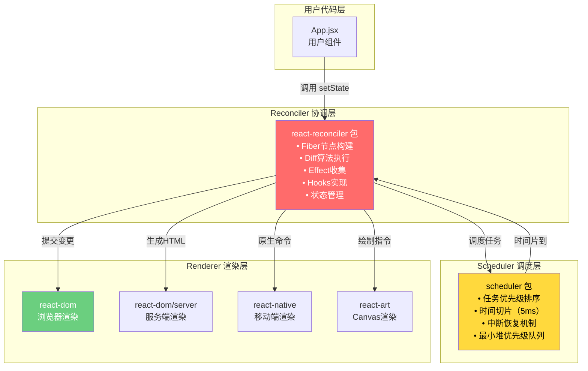

##### 2. ASCII 图示 - 数据流向

```
┌─────────────────────────────────────────────────────────────────┐
│                        用户代码 (App.jsx)                        │
│                     const [count, setCount] = useState(0)        │
└──────────────────────────────┬──────────────────────────────────┘
                               │ setCount(1)
                               ▼
┌─────────────────────────────────────────────────────────────────┐
│                    Scheduler (调度器)                             │
│  ┌─────────────────────────────────────────────────────────┐    │
│  │ 1. 计算更新优先级 (Lane → SchedulerPriority)             │    │
│  │ 2. 创建调度任务 {callback, priorityLevel, expirationTime}│    │
│  │ 3. 插入最小堆队列 (按 expirationTime 排序)               │    │
│  │ 4. 请求浏览器调度 (MessageChannel / requestIdleCallback) │    │
│  └─────────────────────────────────────────────────────────┘    │
└──────────────────────────────┬──────────────────────────────────┘
                               │ 浏览器空闲回调
                               ▼
┌─────────────────────────────────────────────────────────────────┐
│                  Reconciler (协调器) ⭐                          │
│  ┌─────────────────────────────────────────────────────────┐    │
│  │ Render 阶段 (可中断):                                    │    │
│  │   • workLoopConcurrent()                                │    │
│  │   • performUnitOfWork()                                 │    │
│  │   • beginWork() → 协调子节点                            │    │
│  │   • completeWork() → 收集Effect                         │    │
│  │                                                         │    │
│  │ Commit 阶段 (不可中断):                                  │    │
│  │   • commitBeforeMutationEffects()                       │    │
│  │   • commitMutationEffects() → DOM操作                   │    │
│  │   • commitLayoutEffects() → 生命周期                    │    │
│  └─────────────────────────────────────────────────────────┘    │
└──────────────────────────────┬──────────────────────────────────┘
                               │ 提交变更指令
                               ▼
┌─────────────────────────────────────────────────────────────────┐
│                   Renderer (渲染器)                              │
│  ┌─────────────────────────────────────────────────────────┐    │
│  │ react-dom 实现:                                         │    │
│  │   • insertBefore / appendChild (DOM插入)                │    │
│  │   • removeChild (DOM删除)                               │    │
│  │   • updateProperties (属性更新)                          │    │
│  │   • attachRef / detachRef (引用处理)                     │    │
│  └─────────────────────────────────────────────────────────┘    │
└─────────────────────────────────────────────────────────────────┘
```

##### 3. 设计意图

为什么需要三层架构设计？

→ **可替换性**：Renderer 可以是 DOM、Native、Canvas、PDF 等，只需实现 HostConfig 接口
→ **调度独立**：Scheduler 可以根据平台特性调整策略（浏览器用 MessageChannel，Node 用 setImmediate）
→ **测试友好**：每层可独立进行单元测试，降低耦合度
→ **性能优化**：Scheduler 可以统一管理所有任务的优先级，避免饥饿问题

##### 4. 版本差异

- **React 15及之前 (Stack Reconciler)**: 无分层概念，递归同步渲染，一旦开始不可中断
- **React 16 (Fiber Reconciler)**: 引入 Fiber 架构，初步实现 Scheduler 和 Reconciler 分离
- **React 18**: Scheduler 完全独立，支持 5 种优先级等级，支持嵌套更新和中断恢复

##### 5. 关联面试题

→ Q: React 的三层架构分别是什么？各自的作用是什么？
→ A: Scheduler（调度层）负责任务优先级排序和时间切片；Reconciler（协调层）负责 Fiber 构建、Diff 算法和 Effect 收集；Renderer（渲染层）负责具体的平台相关操作（如 DOM 操作）。这种分层使得 React 可以支持多端渲染。

---

#### 1.4 【构建工具配置】

> **源码位置**：根目录 `rollup.config.js`, `package.json`
> **对应版本**：React 18.2.0

##### 1. 源码片段

```javascript
// rollup.config.js (简化版)
export default [
  // react 包配置
  {
    input: 'packages/react/src/React.js',
    output: [
      { file: 'build/react/index.js', format: 'cjs' },      // CommonJS
      { file: 'build/react/umd/react.development.js', format: 'umd', 
        name: 'React', sourcemap: true },                      // UMD 开发版
      { file: 'build/react/umd/react.production.min.js', format: 'umd',
        name: 'React', sourcemap: false, plugins: [terser()] }, // UMD 生产版
    ],
    external: ['object-assign', 'react'],  // 外部依赖不打包
  },
  
  // react-dom 配置
  {
    input: 'packages/react-dom/src/client/ReactDOM.js',
    output: [
      { file: 'build/node_modules/react-dom/index.js', format: 'cjs' },
      { file: 'build/react-dom/umd/react-dom.development.js', format: 'umd',
        name: 'ReactDOM', globals: { react: 'React' } },
    ],
  },
  
  // react-reconciler 配置（内部包，通常不直接使用）
  {
    input: 'packages/react-reconciler/src/ReactFiberReconciler.js',
    output: [{ file: 'build/react-reconciler/index.js', format: 'cjs' }],
  },
];

// package.json scripts
{
  "scripts": {
    "build": "npm run build:react && npm run build:dom && build:reconciler && ...",
    "build:react": "rollup -c rollup.config.js --environment ENTRY:react",
    "test": "jest",
    "lint": "eslint 'packages/*/src/**/*.js'",
    "flow": "flow",  // Facebook 的类型检查工具
  }
}
```

##### 2. 逐行注释

| 配置项 | 说明 | 目的 |
|--------|------|------|
| `input` | 入口文件路径 | 指定打包起点 |
| `output.format` | 输出格式（cjs/umd/esm） | 兼容不同模块系统 |
| `external` | 外部依赖声明 | 避免重复打包，减小体积 |
| `sourcemap` | 源码映射 | 方便调试生产代码 |
| `terser()` | 代码压缩插件 | 生产环境减小体积 |
| `globals` | 全局变量声明 | UMD 格式的依赖注入 |

##### 3. 设计意图

为什么选择 Rollup 作为构建工具？

→ **Tree Shaking 优秀**：基于 ES Module 静态分析，自动消除死代码
→ **输出体积小**：相比 Webpack，Rollup 打包出的 bundle 更紧凑
→ **多格式支持**：同时输出 CJS、UMD、ESM，满足不同使用场景
→ **插件生态丰富**：支持 TypeScript、Flow、代码分割等

##### 4. 版本差异

- **React 16**: 使用 Rollup + 自定义脚本，构建流程较复杂
- **React 17-18**: 优化构建配置，支持 ESM 输出，改进 source-map 质量

##### 5. 关联面试题

→ Q: 如何从源码构建 React？
→ A: 克隆仓库后，执行 `npm install` 安装依赖，然后 `npm run build` 即可。构建产物在 `build/` 目录下，包括 development 和 production 版本。

---

### 📝 第1章 要点速查

| 知识点 | 核心要点 | 重要程度 |
|--------|----------|----------|
| Monorepo 架构 | 关注点分离、跨平台、独立版本管理 | ⭐⭐⭐⭐⭐ |
| 核心包职责 | react(API) + scheduler(调度) + reconciler(协调) + renderer(渲染) | ⭐⭐⭐⭐⭐ |
| 三层架构 | Scheduler → Reconciler → Renderer，单向依赖 | ⭐⭐⭐⭐⭐ |
| 构建工具 | Rollup，支持 CJS/UMD/ESM 多格式输出 | ⭐⭐⭐ |
| 入口关系 | 用户代码 → react API → reconciler → scheduler → renderer | ⭐⭐⭐⭐ |

---

## 第2章 Fiber 架构 ⭐ 核心章节

### 📚 本章学习目标
- 深入理解 FiberNode 的数据结构和字段含义
- 掌握双缓存机制（current/workInProgress）的实现原理
- 理解 Fiber 的创建流程和遍历算法
- 熟悉 workLoop 的工作机制和中断恢复能力
- 对比 Vue 虚拟DOM的差异

---

#### 2.1 【FiberNode 数据结构详解】

> **源码位置**：`packages/react-reconciler/src/ReactFiber.js:120-185`
> **对应版本**：React 18.2.0

##### 1. 源码片段

```javascript
// packages/react-reconciler/src/ReactFiber.js

// ⭐ FiberNode 构造函数 - React Fiber架构的核心数据结构
function FiberNode(tag, pendingProps, key, mode) {
  // ============ 实例标识 ============
  this.tag = tag;                    // Fiber类型标记（函数组件/类组件/DOM等）
  this.key = key;                    // 唯一标识（用于Diff算法同层级比较）
  
  // ============ 元素类型 ============
  this.elementType = null;           // 元素原始类型（函数组件本身）
  this.type = null;                  // 具体类型（可能经过Memo包装）
  this.stateNode = null;             // ⭐ 关联的真实实例（DOM节点/类组件实例）
  
  // ============ Fiber树结构指针（形成链表树）============
  this.return = null;                // ⭐ 父Fiber节点
  this.child = null;                 // ⭐ 第一个子Fiber节点
  this.sibling = null;               // ⭐ 下一个兄弟Fiber节点
  this.index = 0;                    // 在父节点的children中的索引位置
  
  // ============ Props相关 ============
  this.ref = null;                   // ref引用对象或回调函数
  this.pendingProps = pendingProps;  // 待处理的新props（等待beginWork处理）
  this.memoizedProps = null;         // 上次渲染使用的props（用于bailout判断）
  
  // ============ 状态相关（Hooks核心）============
  this.updateQueue = null;           // 更新队列（存放state更新的payload）
  this.memoizedState = null;         // ⭐ 上次渲染的状态（Hooks链表头节点）
  
  // ============ 副作用标记（位运算）============
  this.flags = NoFlags;              // ⭐ 当前Fiber的副作用标记（Placement/Update/Delete等）
  this.subtreeFlags = NoFlags;       // 子树的聚合副作用标记（优化遍历）
  this.deletions = null;             // 待删除的子Fiber列表
  
  // ============ 双缓存机制 ============
  this.alternate = null;             // ⭐ 指向对应的另一个Fiber（current ↔ workInProgress）
  
  // ============ 优先级（Lanes模型）============
  this.lanes = NoLanes;              // 当前更新涉及的lanes
  this.childLanes = NoLanes;         // 子树涉及的lanes
  
  // ============ 模式标记 ============
  this.mode = mode;                  // 并发模式（ConcurrentMode/StrictMode等）
}

// ============ Fiber类型标记常量（tag字段的可能值）============
export const FunctionComponent = 0;               // 函数组件
export const ClassComponent = 1;                  // 类组件
export const IndeterminateComponent = 2;          // 不确定类型（首次渲染前）
export const HostRoot = 3;                        // Root Fiber（根节点，tag=3）
export const HostPortal = 4;                      // Portal（传送到不同DOM树）
export const HostComponent = 5;                   // 原生DOM组件（div, span等）
export const HostText = 6;                        // 文本节点
export const Fragment = 7;                        // Fragment (<></>)
export const Mode = 8;                            // StrictMode / ConcurrentMode
export const ContextConsumer = 9;                 // Context.Consumer
export const ContextProvider = 10;                // Context.Provider
export const ForwardRef = 11;                     // React.forwardRef
export const Profiler = 12;                       // Profiler（性能分析）
export const SuspenseComponent = 13;              // Suspense（异步边界）
export const MemoComponent = 14;                  // React.memo包装的组件
export const SimpleMemoComponent = 15;            // 简化的Memo（内部优化）
export const LazyComponent = 16;                  // React.lazy（懒加载）
export const IncompleteClassComponent = 17;       // 未完成的类组件
export const DehydratedFragment = 18;             // SSR脱水的Fragment
export const SuspenseListComponent = 19;          // SuspenseList
export const ScopeComponent = 20;                 // Scope
export const OffscreenComponent = 23;             // Offscreen（隐藏/显示切换）
export const LegacyHiddenComponent = 24;          // LegacyHidden
export const CacheComponent = 25;                 // Cache（实验性）
export const TracingMarkerComponent = 26;         // TracingMarker（DevTools）
```

##### 2. 逐行注释

| 字段名 | 类型 | 说明 | 使用场景 |
|--------|------|------|----------|
| `tag` | number | ⭐ 标记Fiber类型，决定beginWork的分发逻辑 | 区分函数组件、类组件、DOM节点等 |
| `key` | string\|null | 用于Diff算法的同层级比较 | 判断新旧节点是否可复用 |
| `elementType` | any | 元素的原始类型（未包装） | 函数组件本身、DOM标签字符串 |
| `type` | any | 实际使用的类型（可能被Memo等包装） | beginWork中用于区分处理逻辑 |
| `stateNode` | any | ⭐ 关联的真实对象（DOM/实例） | commit阶段操作的target |
| `return` | Fiber\|null | ⭐ 父节点引用 | 向上回溯（completeWork时使用） |
| `child` | Fiber\|null | ⭐ 第一个子节点 | 向下遍历（beginWork后进入子树） |
| `sibling` | Fiber\|null | ⭐ 下一个兄弟节点 | 横向遍历（completeWork后处理兄弟） |
| `index` | number | 在父children中的位置 | Diff时的位置匹配 |
| `pendingProps` | any | 新传入的props | beginWork时与memoizedProps比较 |
| `memoizedProps` | any | 上次渲染的props | bailout判断（引用相等则跳过） |
| `updateQueue` | Queue\|null | 状态更新队列 | 存放setState/useReducer的更新 |
| `memoizedState` | any | ⭐ 上次的状态值 | Hooks链表的入口点 |
| `flags` | number | ⭐ 位运算副作用标记 | Placement(2)/Update(4)/Deletion(8)等 |
| `subtreeFlags` | number | 子树聚合标记 | 优化effect链表遍历 |
| `alternate` | Fiber\|null | ⭐ 双缓存的另一份拷贝 | current↔workInProgress切换 |
| `lanes` | number | 当前更新的优先级位 | Lanes模型的核心字段 |
| `mode` | number | 并发/严格模式标记 | 影响行为（如StrictMode双重渲染） |

##### 3. 设计意图

为什么 FiberNode 需要保存这么多字段？

→ **增量更新能力**：通过 memoizedProps/memoizedState 快速判断是否需要重新渲染（bailout）
→ **双向链接结构**：return/child/sibling 三指针构成链表树，可以从任意节点开始遍历
→ **双缓存机制**：alternate 实现无缝切换，用户看到的始终是完整的 current 树
→ **高效副作用收集**：flags 使用位运算，可以同时表示多种副作用且快速判断
→ **优先级控制**：lanes 字段支持细粒度的更新优先级管理
→ **模式灵活性**：mode 字段支持并发模式、严格模式等不同行为

##### 4. 版本差异

- **React 16**: 使用 effectTag（数字），字段较少，无 lanes 模型
- **React 17**: 重命名为 flags，新增 subtreeFlags 优化子树遍历
- **React 18**: 新增 lanes 替代 expirationTime，新增 mode 字段支持并发模式，增加更多 tag 类型（Offscreen, Cache等）

##### 5. 关联面试题

→ Q: FiberNode 的 alternate 字段有什么作用？它是如何实现双缓存的？
→ A: alternate 指向当前 Fiber 的另一份拷贝。正在屏幕上显示的是 current 树（root.current 指向），正在内存中构建的是 workInProgress 树（通过 alternate 互指）。当 workInProgress 树构建完成后，commitRoot 最后会执行 `root.current = finishedWork`，将指针切换到新树，原来的 current 树成为新的 alternate。这保证了用户始终看到完整的界面，不会出现中间状态。

→ Q: FiberNode 和 Vue 的 VNode 有什么区别？
→ A: 1) 结构更复杂：FiberNode 包含更多运行时信息（状态、副作用、优先级）；2) 链表树 vs 扁平数组：Fiber 通过 return/child/sibling 形成链表，Vue VNode 是树形结构的扁平表示；3) 双缓存：Fiber 有 alternate 实现双缓冲，VNode 通常只有一份；4) 可中断性：Fiber 天然支持中断恢复，Vue 的 patch 是同步递归的。

---

#### 2.2 【Fiber Flags 位运算体系】

> **源码位置**：`packages/react-reconciler/src/ReactFiberFlags.js:1-80`
> **对应版本**：React 18.2.0

##### 1. 源码片段

```javascript
// packages/react-reconciler/src/ReactFiberFlags.js

// ============ 基础Flags常量（二进制位掩码）============

// 不要修改这两个值的含义！
export const NoFlags = /*                      */ 0b000000000000000000000;  // 0: 无副作用
export const PerformedWork = /*                */ 0b000000000000000000001;  // 1: 已完成工作（DevTools使用）

// ============ 副作用Flags（可在commit阶段处理的操作）============

export const Placement = /*                     */ 0b000000000000000010;     // 2: ⭐ 插入DOM
export const Update = /*                        */ 0b000000000000000100;     // 4: ⭐ 更新DOM属性
export const PlacementAndUpdate = /*            */ Placement | Update;       // 6: 插入并更新
export const Deletion = /*                      */ 0b000000000000001000;     // 8: ⭐ 删除DOM
export const ContentReset = /*                  */ 0b000000000000010000;     // 16: 重置文本内容
export const Callback = /*                      */ 0b000000000000100000;     // 32: 回调执行
export const DidCapture = /*                    */ 0b000000000001000000;     // 64: 错误边界捕获
export const Ref = /*                           */ 0b000000000010000000;     // 128: ref处理
export const Snapshot = /*                      */ 0b000000000100000000;     // 256: getSnapshotBeforeUpdate
export const Passive = /*                       */ 0b000000001000000000;     // 512: ⭐ useEffect标记
export const Hydrating = /*                     */ 0b000000010000000000;     // 1024: SSR hydration
export const HydratingAndUpdate = /*            */ Hydrating | Update;

// ============ 特殊Flags（非标准副作用）============

export const Incomplete = /*                    */ 0b000000010000000000;     // 渲染未完成（被中断）
export const ShouldCapture = /*                 */ 0b000000100000000000;     // 应该捕获错误
export const ForceUpdateForLegacySuspense = /*  */ 0b000001000000000000;     // 强制更新Legacy Suspense
export const Marker = /*                        */ 0b000001000000000000;     // 标记节点（Offscreen等）
export const Tail = /*                          */ 0b000010000000000000;     // 尾部标记（Suspense List）

// ============ 组合Mask（用于批量判断）============

// 所有生命周期相关的effect mask
export const LifecycleEffectMask = /*           */ 0b000000001110100100;     
// Passive | Update | Callback | Ref | Snapshot

// 所有宿主（host）相关的effect mask
export const HostEffectMask = /*                */ 0b000000001111111111;

// Mutation阶段需要处理的flags组合
export const MutationMask = /*                  */ Placement | Update | Deletion | 
                                                           ContentReset | Hydrating | Visibility;

// Layout阶段需要处理的flags组合
export const LayoutMask = /*                    */ Update | Callback | Ref;

// Passive阶段（useEffect）需要处理的flags组合
export const PassiveMask = /*                   */ Passive | ChildDeletion;
```

##### 2. 逐行注释

| Flag值 | 二进制 | 名称 | 说明 | 所属阶段 |
|--------|--------|------|------|----------|
| 0 | 0b...0 | NoFlags | 无副作用 | - |
| 1 | 0b...1 | PerformedWork | 已完成工作 | DevTools |
| 2 | 0b...10 | **Placement** | ⭐ 需要插入DOM | mutation |
| 4 | 0b...100 | **Update** | ⭐ 需要更新属性 | mutation/layout |
| 8 | 0b...1000 | **Deletion** | ⭐ 需要删除DOM | mutation |
| 16 | 0b...10000 | ContentReset | 清空文本内容 | mutation |
| 32 | 0b...100000 | Callback | 回调函数 | layout |
| 128 | 0b...10000000 | **Ref** | ref处理 | layout |
| 256 | 0b...100000000 | Snapshot | 快照读取 | beforeMutation |
| 512 | 0b...1000000000 | **Passive** | ⭐ useEffect | passive (async) |
| 1024 | 0b...10000000000 | Hydrating | hydration过程 | mutation |

##### 3. ASCII 图示 - Flags 位运算示例

```
假设一个 Fiber 同时需要：插入DOM + 更新属性 + 执行useEffect

flags = Placement | Update | Passive
      = 0b000000000000000010  (2)
      | 0b000000000000000100  (4)
      | 0b000000001000000000  (512)
      = 0b000000001000000110  (518)

判断是否有某种副作用：
(flags & Placement) !== 0    → (518 & 2) = 2 ≠ 0  ✓ 有插入操作
(flags & Update) !== 0       → (518 & 4) = 4 ≠ 0  ✓ 有更新操作
(flags & Ref) !== 0          → (518 & 128) = 0     ✗ 无ref操作
(flags & Passive) !== 0      → (518 & 512) = 512 ≠ 0 ✓ 有useEffect

使用 Mask 过滤：
flags & MutationMask          → 只保留mutation阶段的flags
flags & LayoutMask            → 只保留layout阶段的flags
```

##### 4. 设计意图

为什么要使用位运算来表示副作用？

→ **空间效率极高**：一个 32 位整数可以同时表示 31 种不同的副作用
→ **O(1) 判断速度**：使用按位与 (&) 运算符可以快速判断是否包含某类副作用
→ **灵活组合**：可以通过按位或 (|) 组合多种副作用，通过按位与 (&) 检查
→ **批量过滤**：可以使用预定义的 Mask（如 MutationMask）一次性过滤出某阶段的所有操作
→ **易于扩展**：新增副作用只需增加一位（左移），不影响已有逻辑

##### 5. 版本差异

- **React 16**: 使用 effectTag 命名，值较小（1, 2, 4, 8...），支持的副作用种类有限
- **React 17**: 重命名为 flags，扩展了 subtreeFlags 用于子树聚合
- **React 18**: 大幅扩展 flags 以支持新特性：Suspense、Transitions、Offscreen、Selector、Cache 等

##### 6. 关联面试题

→ Q: 如何判断一个 Fiber 是否有副作用？如何判断具体有哪些副作用？
→ A: 1) 是否有副作用：`if (fiber.flags !== NoFlags)` 或 `(fiber.flags & PerformedWork) !== 0`
   2) 是否需要插入：`(fiber.flags & Placement) !== 0`
   3) 是否需要更新：`(fiber.flags & Update) !== 0`
   4) 是否需要删除：`(fiber.flags & Deletion) !== 0`
   5) 是否有 useEffect：`(fiber.flags & Passive) !== 0`

---

#### 2.3 【FiberTree 双缓存机制】⭐ 核心概念

> **源码位置**：`packages/react-reconciler/src/ReactFiberRoot.js:50-150`
> **对应版本**：React 18.2.0

##### 1. 源码片段

```javascript
// packages/react-reconciler/src/ReactFiberRoot.js

// ============ FiberRootNode - Fiber树的根容器 ============
class FiberRootNode {
  constructor(containerInfo, tag, hydrate) {
    // ============ 基础信息 ============
    this.tag = tag;
    this.containerInfo = containerInfo;  // DOM容器（如 document.getElementById('root')）
    
    // ============ ⭐ 双缓存核心指针 ============
    this.current = null;                  // 指向当前显示在屏幕上的 Fiber 树（current 树）
    
    // ============ 待提交的工作 ============
    this.finishedWork = null;             // 已完成的 workInProgress 树，等待 commit
    
    // ============ 调度相关 ============
    this.callbackNode = null;             // 当前调度的回调句柄（可用于取消）
    this.callbackPriority = NoLane;       // 当前调度的优先级
    this.eventTimes = createLaneMap(NoLanes);
    this.expirationTimes = createLaneMap(NoTimestamp);
    
    // ============ Lanes（优先级）相关 ============
    this.pendingLanes = NoLanes;          // 待处理的更新 lanes
    this.suspendedLanes = NoLanes;        // 被挂起的 lanes（Suspense）
    this.pingedLanes = NoLanes;           // 被 ping 恢复的 lanes
    this.expiredLanes = NoLanes;          // 已过期的 lanes（必须立即处理）
    this.mutableReadLanes = NoLanes;      // 可变读取 lanes
    this.finishedLanes = NoLanes;         // 已完成的 lanes
    
    // ============ Entangled Lanes（交叉 lanes，用于关联更新）============
    this.entangledLanes = NoLanes;
    this.entanglements = createLaneMap(NoLanes);
    
    // ============ 并发模式相关 ============
    this.hashPrefix = '';                 // useId 生成的 hash 前缀
    this.hiddenUpdates = createHiddenUpdateMap();  // 隐藏的更新（Offscreen）
  }
}

// ============ 创建 Fiber 树根节点 ============
function createFiberRoot(containerInfo, tag, hydrate, hydrationCallbacks) {
  // Step 1: 创建 FiberRootNode 容器
  const root = new FiberRootNode(containerInfo, tag, hydrate);
  
  // Step 2: 创建根 Fiber（HostRoot 类型，tag=3）
  const uninitializedFiber = createHostRootFiber(tag);
  
  // Step 3: ⭐ 建立双向引用
  root.current = uninitializedFiber;       // 容器的 current 指向根 Fiber
  uninitializedFiber.stateNode = root;     // 根 Fiber 的 stateNode 指回容器
  
  // Step 4: 初始化更新队列（用于存放根节点的状态更新）
  initializeUpdateQueue(uninitializedFiber);
  
  return root;
}

// ============ 创建 HostRoot Fiber ============
function createHostRootFiber(tag) {
  // 创建 FiberNode，tag=3 表示 HostRoot
  let fiberTag;
  if (tag === ConcurrentRoot) {
    fiberTag = ConcurrentRootTag;  // 3（并发模式）
  } else if (tag === LegacyRoot) {
    fiberTag = HostRootTag;        // 3（传统模式）
  } else {
    fiberTag = HostRootTag;
  }
  
  const mode = ...;  // 根据 tag 设置模式（ConcurrentMode/NoMode）
  
  const rootFiber = createFiber(fiberTag, null, null, mode);
  
  // HostRoot 的 type 和 elementType 都是 null（它不是真正的组件）
  rootFiber.type = null;
  rootFiber.elementType = null;
  
  return rootFiber;
}
```

##### 2. Mermaid 时序图 - 双缓存切换流程

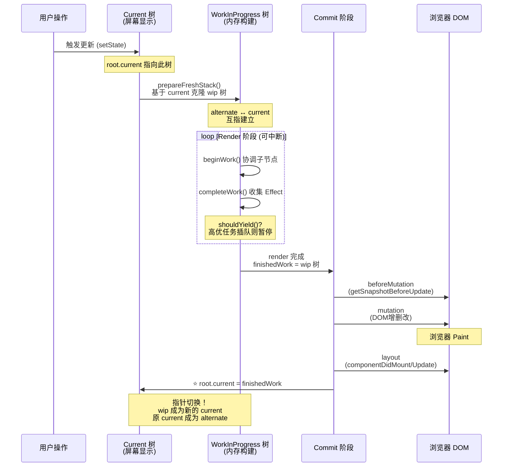

##### 3. ASCII 图示 - 双缓存三个状态

```
═══════════════════════════════════════════════════════════════
状态1: 初始挂载（Mount）
═══════════════════════════════════════════════════════════════

┌─────────────────────────────────────────────────────────────┐
│  FiberRoot (containerInfo: #root)                           │
│  ┌───────────────────────────────────────────────────────┐  │
│  │ current ──────────────────────────────────────────►   │  │
│  │  ┌─────────────────────────────────────────────────┐  │  │
│  │  │ HostRoot Fiber (tag=3)                          │  │  │
│  │  │ stateNode ◄────────────────────────────────────┼──┼──┤
│  │  │   ↓                                             │  │  │
│  │  │ alternate: null ⚠️ (首次渲染，没有 alternate)    │  │  │
│  │  │ child: App Fiber                                │  │  │
│  │  └─────────────────────────────────────────────────┘  │  │
│  └───────────────────────────────────────────────────────┘  │
│  finishedWork: null                                        │
└─────────────────────────────────────────────────────────────┘


═══════════════════════════════════════════════════════════════
状态2: 更新过程中（Render 阶段）
═══════════════════════════════════════════════════════════════

┌─────────────────────────────────────────────────────────────┐
│  FiberRoot                                                  │
│                                                             │
│  ┌────────────────────────┐  ┌────────────────────────┐    │
│  │ current ─────────────► │  │ finishedWork ────────► │    │
│  │ ┌────────────────────┐ │  │ ┌────────────────────┐ │    │
│  │ │ HostRoot (当前显示) │ │  │ │ HostRoot (wip构建中)│ │    │
│  │ │ memoizedState: 旧  │ │  │ │ memoizedState: 新  │ │    │
│  │ └────────┬───────────┘ │  │ └────────▲───────────┘ │    │
│  │          │ alternate   │  │          │ alternate   │    │
│  └──────────┼─────────────┘  └──────────┼─────────────┘    │
│             │                           │                   │
│             └───────────┬───────────────┘                   │
│                         ↓                                   │
│              两棵树通过 alternate 互指                       │
│              current.alternate = wip                        │
│              wip.alternate = current                        │
└─────────────────────────────────────────────────────────────┘


═══════════════════════════════════════════════════════════════
状态3: Commit 完成（指针切换）
═══════════════════════════════════════════════════════════════

┌─────────────────────────────────────────────────────────────┐
│  FiberRoot                                                  │
│  ┌───────────────────────────────────────────────────────┐  │
│  │ current ──────────────────────────────────────────►   │  │
│  │  ┌─────────────────────────────────────────────────┐  │  │
│  │  │ HostRoot (原 wip 树，现在是新的 current) ✓      │  │  │
│  │  │ memoizedState: 新值                             │  │  │
│  │  │ alternate ────────────────────────────────────► │  │  │
│  │  └────────────────────────────────┬────────────────┘  │  │
│  └───────────────────────────────────┼───────────────────┘  │
│                                      │                       │
│                                      ▼                       │
│  ┌───────────────────────────────────────────────────────┐  │
│  │  (原 current 树，现在成为 alternate，等待GC回收)       │  │
│  │  memoizedState: 旧值                                   │  │
│  │  alternate ──────────────────────────────► 新 current  │  │
│  └───────────────────────────────────────────────────────┘  │
│                                                             │
│  finishedWork: null (已提交，清空)                           │
└─────────────────────────────────────────────────────────────┘
```

##### 4. 设计意图

为什么要使用双缓存（Double Buffering）机制？

→ **避免视觉闪烁**：用户看到的始终是完整的 current 树，workInProgress 树在内存中静默构建
→ **快速回滚能力**：如果渲染过程中被高优先级任务中断，可以直接丢弃 wip 树，current 树不受影响
→ **增量更新优化**：基于 current 树克隆 wip 树，只修改发生变化的 Fiber 节点，未变化的直接复用
→ **原子性提交保证**：commit 阶段是一次性将 wip 树切换为 current，不会出现中间状态
→ **内存友好**：两棵树共享未变化的部分（通过 alternate 引用），不是完全复制

##### 5. 版本差异

- **React 16 (Fiber 初期)**: 双缓存概念初步建立，但实现较简单
- **React 17**: 完善 alternate 的生命周期管理，优化内存回收
- **React 18**: 结合 Lanes 模型，支持部分更新（不需要克隆整棵树，只更新涉及 lane 的子树）

##### 6. 关联面试题

→ Q: current 树和 workInProgress 树是如何切换的？切换时机是什么？
→ A: 在 commitRoot 函数的最后一步，执行 `root.current = finishedWork`。此时：
  1. finishedWork 指向刚刚构建完成的 workInProgress 树
  2. 将 root.current 从旧的 current 切换到新的 wip 树
  3. 原来的 current 树通过新树的 alternate 字段仍然可达（等待 GC）
  4. 下次更新时，会基于新的 current 树创建新的 wip 树

→ Q: 如果在 Render 阶段被中断，会发生什么？
→ A: workInProgress 树会被丢弃（不会被 commit），下次恢复时会基于 current 树重新开始。这就是 Fiber 架构的可中断性的体现。

---

#### 2.4 【Fiber 创建流程】

> **源码位置**：`packages/react-reconciler/src/ReactFiber.js:300-420`
> **对应版本**：React 18.2.0

##### 1. 源码片段

```javascript
// packages/react-reconciler/src/ReactFiber.js

// ============ 从 Element 创建 Fiber（主入口）============
export function createFiberFromElement(element, mode, lanes) {
  // 开发模式下追踪 owner 信息（用于 Warning 提示）
  let owner = null;
  if (__DEV__) {
    owner = element._owner;
  }

  // 提取 Element 的关键信息
  const type = element.type;        // 元素类型（函数/字符串/对象）
  const key = element.key;          // 唯一标识
  const pendingProps = element.props; // 待处理属性
  
  // 调用核心工厂函数
  const fiber = createFiberFromTypeAndProps(
    type, 
    key, 
    pendingProps, 
    owner, 
    mode, 
    lanes,
  );
  
  return fiber;
}

// ============ 核心工厂函数：根据类型创建 Fiber ============
function createFiberFromTypeAndProps(type, key, pendingProps, owner, mode, lanes) {
  // ⭐ 默认标记为不确定类型（首次渲染前无法确定是函数还是类组件）
  let fiberTag = IndeterminateComponent;  // tag = 2
  let resolvedType = type;

  // ============ 根据类型确定 fiberTag ============
  if (typeof type === 'function') {
    // 函数类型：可能是函数组件或类组件
    if (shouldConstruct(type)) {  
      // 检查原型上是否有 isReactComponent 属性
      // 这是类组件的标志（由 React.Component 或 React.PureComponent 设置）
      fiberTag = ClassComponent;      // tag = 1
    } else {
      fiberTag = FunctionComponent;   // tag = 0
    }
  } else if (typeof type === 'string') {
    // 字符串类型：原生 DOM 元素（'div', 'span', 'input' 等）
    fiberTag = HostComponent;         // tag = 5
  } else {
    // 对象或其他特殊类型
    getTag: switch (type) {
      case REACT_FRAGMENT_TYPE:
        fiberTag = Fragment;                    // tag = 7
        break getTag;
      case REACT_SUSPENSE_TYPE:
        fiberTag = SuspenseComponent;           // tag = 13
        break getTag;
      case REACT_SUSPENSE_LIST_TYPE:
        fiberTag = SuspenseListComponent;       // tag = 19
        break getTag;
      default:
        if (typeof type === 'object' && type !== null) {
          // 通过 $$typeof Symbol 判断特殊类型
          switch (type.$$typeof) {
            case REACT_PROVIDER_TYPE:
              fiberTag = ContextProvider;        // tag = 10
              break getTag;
            case REACT_CONTEXT_TYPE:
              fiberTag = ContextConsumer;        // tag = 9
              break getTag;
            case REACT_FORWARD_REF_TYPE:
              fiberTag = ForwardRef;             // tag = 11
              break getTag;
            case REACT_MEMO_TYPE:
              fiberTag = MemoComponent;          // tag = 14
              resolvedType = type.type;  // Memo 包装的类型
              break getTag;
            case REACT_LAZY_TYPE:
              fiberTag = LazyComponent;          // tag = 16
              break getTag;
          }
        }
        
        // 兜底：未知类型抛出错误
        let info = '';
        if (__DEV__) {
          // 开发模式提供详细的错误信息，帮助开发者定位问题
        }
        throw new Error(
          'Element type is invalid: expected a string ' +
          '(for built-in components) or a class/function ' +
          '(for composite components) but got: ' +
          (type == null ? type : typeof type) + '.'
        );
    }
  }

  // ============ 创建 FiberNode 实例 ============
  const fiber = createFiber(fiberTag, pendingProps, key, mode);
  
  // 设置类型信息
  fiber.elementType = type;       // 原始类型（未包装）
  fiber.type = resolvedType;      // 解析后的实际类型
  fiber.lanes = lanes;            // 优先级 lanes

  return fiber;
}

// ============ 判断是否是类组件 ============
function shouldConstruct(Component) {
  // 类组件的原型上有 isReactComponent 属性
  // 这个属性在 React.Component 和 React.PureComponent 的构造函数中设置
  const prototype = Component.prototype;
  return !!(prototype && prototype.isReactComponent);
}

// ============ 其他创建便捷函数 ============

// 从文本创建 Fiber
export function createFiberFromText(content, mode, lanes) {
  const fiber = createFiber(HostText, content, null, mode);  // tag = 6
  fiber.lanes = lanes;
  return fiber;
}

// 从 Fragment 创建 Fiber
export function createFiberFromFragment(elements, mode, lanes, key) {
  const fiber = createFiber(Fragment, elements, key, mode);  // tag = 7
  fiber.lanes = lanes;
  return fiber;
}

// 从已有的 Fiber 克隆（用于双缓存）
export function createWorkInProgress(current, pendingProps) {
  let workInProgress = current.alternate;
  
  if (workInProgress === null) {
    // 首次创建：新建 FiberNode
    workInProgress = createFiber(current.tag, pendingProps, current.key, current.mode);
    workInProgress.elementType = current.elementType;
    workInProgress.type = current.type;
    workInProgress.stateNode = current.stateNode;
    
    // ⭐ 建立双向 alternate 引用
    workInProgress.alternate = current;
    current.alternate = workInProgress;
  } else {
    // 复用已有：重置属性（不重建对象，节省 GC）
    workInProgress.pendingProps = pendingProps;
    workInProgress.type = current.type;
    workInProgress.flags = NoFlags;           // 清除旧 flags
    workInProgress.subtreeFlags = NoFlags;
    workInProgress.deletions = null;
    
    // 清除 lanes（会在 render 时重新计算）
    workInProgress.lanes = current.lanes;
    workInProgress.childLanes = current.childLanes;
  }
  
  // 复用不变的字段
  workInProgress.ref = current.ref;
  
  return workInProgress;
}
```

##### 2. Mermaid 流程图 - Fiber 创建决策树

```mermaid
flowchart TD
    A[createElement 返回 Element] --> B{type 的 typeof?}
    
    B -->|"function"| C{shouldConstruct?<br/>原型有 isReactComponent?}
    B -->|"string"| D[HostComponent<br/>tag=5<br/>原生DOM元素]
    B -->|"object/symbol"| E{特殊 $$typeof?}
    
    C -->|是 (类组件)| F[ClassComponent<br/>tag=1]
    C -->|否 (函数组件)| G[FunctionComponent<br/>tag=0]
    
    E -->|REACT_FRAGMENT| H[Fragment<br/>tag=7]
    E -->|REACT_SUSPENSE| I[SuspenseComponent<br/>tag=13]
    E -->|REACT_PROVIDER| J[ContextProvider<br/>tag=10]
    E -->|REACT_CONTEXT| K[ContextConsumer<br/>tag=9]
    E -->|REACT_FORWARD_REF| L[ForwardRef<br/>tag=11]
    E -->|REACT_MEMO| M[MemoComponent<br/>tag=14]
    E -->|REACT_LAZY| N[LazyComponent<br/>tag=16]
    
    D & F & G & H & I & J & K & L & M & N --> O[createFiber<br/>new FiberNode]
    O --> P[设置 elementType/type/lanes]
    P --> Q[返回 Fiber 节点]
    
    R[createWorkInProgress] --> S{alternate 存在?}
    S -->|否| T[新建 FiberNode<br/>建立双向引用]
    S -->|是| U[复用并重置<br/>清除 flags/lanes]
    T & U --> V[返回 workInProgress]
```

##### 3. 设计意图

为什么要在创建时就确定 fiberTag？

→ **性能优化**：beginWork 时可以根据 tag 进行 O(1) 的 switch 分发，无需再次判断类型
→ **类型安全**：提前验证元素类型合法性，避免运行时出现不可预期的错误
→ **统一入口**：所有 Element 都通过同一套工厂函数转换为 Fiber，代码集中易维护
→ **调试友好**：开发模式下可以在创建时记录更多信息（owner、source 等）

##### 4. 版本差异

- **React 16**: 类型判断较简单，不支持 Lazy、Memo、SuspenseList 等新特性
- **React 17**: 增加 ForwardRef、Memo、Lazy 等类型的完整支持
- **React 18**: 新增 Offscreen、Cache、TracingMarker、Scope 等更多特殊类型，完善错误提示信息

##### 5. 关联面试题

→ Q: React 如何区分函数组件和类组件？底层原理是什么？
→ A: 通过 `shouldConstruct(type)` 函数检查组件的原型对象上是否存在 `isReactComponent` 属性。
   - 当你使用 `class MyComponent extends React.Component` 时，React.Component 的构造函数会设置 `MyComponent.prototype.isReactComponent = {}`
   - 函数组件没有原型上的这个属性
   - 这是一个简单的布尔标志检查，非常高效

→ Q: createWorkInProgress 什么情况下会新建 Fiber，什么时候复用？
→ A: 首次渲染时 `current.alternate === null`，会新建 FiberNode 并建立双向引用。后续更新时如果 alternate 已存在，会复用该对象并重置 flags、lanes 等字段，避免频繁创建/销毁对象的 GC 压力。

---

#### 2.5 【Fiber 的工作循环 - workLoop】⭐ 核心机制

> **源码位置**：`packages/react-reconciler/src/ReactFiberWorkLoop.js:800-950`
> **对应版本**：React 18.2.0

##### 1. 源码片段

```javascript
// packages/react-reconciler/src/ReactFiberWorkLoop.js

// ============ 同步工作循环（Legacy 模式）============
function workLoopSync() {
  // ⭐ 同步模式：一次性完成所有工作，不可中断
  // 只要还有工作单元，就一直执行
  while (workInProgress !== null) {
    performUnitOfWork(workInProgress);
  }
}

// ============ 并发工作循环（Concurrent 模式）⭐ ============
function workLoopConcurrent() {
  // ⭐ 并发模式：每处理一个工作单元就检查是否需要让出主线程
  while (workInProgress !== null) {
    // ⭐ 核心检查：shouldYieldToHost()
    // 如果浏览器需要处理更高优先级的任务（如用户输入、动画），
    // 或者本次时间片（5ms）已用完，则返回 false，停止循环
    if (unstable_shouldYield()) {
      // 让出主线程，浏览器可以处理其他任务
      break;  
    }
    
    performUnitOfWork(workInProgress);
  }
}

// ============ 处理单个工作单元 ============
function performUnitOfWork(unitOfWork) {
  // unitOfWork 就是当前正在处理的 Fiber 节点
  
  // 获取当前的 Fiber（屏幕上显示的）
  const current = unitOfWork.alternate;
  
  let next;
  
  // ============ Step 1: beginWork（向下协调）============
  // beginWork 会：
  // 1. 比较 props/state 判断是否需要更新
  // 2. 根据 Fiber.tag 分发到不同的处理函数
  // 3. 执行组件函数（函数组件）或实例化/更新（类组件）
  // 4. reconcileChildren：对比子节点，生成新的子 Fiber
  // 5. 返回第一个子 Fiber（如果没有子节点返回 null）
  
  if (enableProfilerTimer && (unitOfWork.mode & ProfileMode) !== NoMode) {
    // 性能分析模式：记录耗时
    next = beginWork(current, unitOfWork, renderLanes);
  } else {
    // 正常模式
    next = beginWork(current, unitOfWork, renderLanes);
  }
  
  // 将 pendingProps 标记为已处理（变成 memoizedProps）
  unitOfWork.memoizedProps = unitOfWork.pendingProps;
  
  // ============ Step 2: 判断是否有子节点 ============
  if (next === null) {
    // 没有子节点：完成当前节点，向上回溯
    completeUnitOfWork(unitOfWork);
  } else {
    // 有子节点：继续处理子节点（深度优先）
    workInProgress = next;
  }
  
  // React DevTools 性能标记
  if (enableProfilerTimer) {
    // ...
  }
}

// ============ 完成工作单元（向上回溯）============
function completeUnitOfWork(unitOfWork) {
  let completedWork = unitOfWork;  // 当前完成的节点
  
  // ⭐ 循环回溯：处理 sibling 或向上返回
  do {
    // 获取当前 Fiber 和它的父 Fiber
    const current = completedWork.alternate;
    const returnFiber = completedWork.return;  // 父节点
    
    // ============ Step 3: completeWork（收集副作用）============
    // completeWork 会：
    // 1. 对于 HostComponent：创建/更新 DOM 节点
    // 2. 对于 HostText：创建/更新文本节点
    // 3. 收集副作用（设置 flags：Placement/Update/Deletion）
    // 4. 处理 ref、context 等
    completeWork(current, completedWork, renderLanes);
    
    // ============ Step 4: 检查是否有兄弟节点 ============
    const siblingFiber = completedWork.sibling;
    
    if (siblingFiber !== null) {
      // 有兄弟节点：处理兄弟（横向移动）
      workInProgress = siblingFiber;
      return;  // 返回外层循环，继续 performUnitOfWork
    }
    
    // 没有兄弟节点：继续向上回溯到父节点
    completedWork = returnFiber;
    workInProgress = completedWork;
    
    // 当回到根节点（HostRoot）时，workInProgress 变为 null，循环结束
  } while (completedWork !== null);
  
  // 到达根节点，整个 Fiber 树的工作已完成
  if (workInProgressRootExitStatus === RootIncomplete) {
    workInProgressRootExitStatus = RootCompleted;
  }
}
```

##### 2. ASCII 图示 - 深度优先遍历过程

```
Fiber 树结构示例:
        App (FunctionComponent, tag=0)
       /    \
    Header  Main (FunctionComponent, tag=0)
     /  \      \
   Nav  Logo   Article (HostComponent, tag=5)
                \
              Text (HostText, tag=6)

═══════════════════════════════════════════════════════════════
workLoop 执行过程（深度优先遍历）:
═══════════════════════════════════════════════════════════════

performUnitOfWork 顺序（前序遍历 - beginWork）:

  ① App.beginWork()
     ↓ 返回 child: Header
  ② Header.beginWork()
     ↓ 返回 child: Nav
  ③ Nav.beginWork()
     ↓ 返回 null (无子节点)
     ↓ 调用 completeUnitOfWork(Nav)
     
  ④ Nav.completeWork()  ← 后序
     ↓ 检查 sibling: Logo (有!)
     ↓ workInProgress = Logo
     
  ⑤ Logo.beginWork()
     ↓ 返回 null
     ↓ 调用 completeUnitOfWork(Logo)
     
  ⑥ Logo.completeWork()  ← 后序
     ↓ 检查 sibling: null (无!)
     ↓ 向上回溯到 Header
     
  ⑦ Header.completeWork()  ← 后序
     ↓ 检查 sibling: Main (有!)
     ↓ workInProgress = Main
     
  ⑧ Main.beginWork()
     ↓ 返回 child: Article
  ⑨ Article.beginWork()
     ↓ 返回 child: Text
  ⑩ Text.beginWork()
     ↓ 返回 null
     ↓ 调用 completeUnitOfWork(Text)
     
  ⑪ Text.completeWork()  ← 后序
     ↓ sibling: null → 回溯到 Article
  ⑫ Article.completeWork()  ← 后序
     ↓ sibling: null → 回溯到 Main
  ⑬ Main.completeWork()  ← 后序
     ↓ sibling: null → 回溯到 App
  ⑭ App.completeWork()  ← 后序
     ↓ sibling: null → 回溯到 HostRoot
     ↓ workInProgress = null → 循环结束！

可视化遍历顺序:
    ① App
    ╱     ╲
  ②Header  ⑧Main
 ╱   ╲      ╲
③Nav ④Logo  ⑨Article
              ╲
             ⑩Text

completeWork 顺序（后序遍历）: ④→⑥→⑦→⑪→⑫→⑬→⑭
（数字带圆圈的是 completeWork 执行时机）
```

##### 3. 设计意图

为什么使用深度优先遍历（DFS）而不是广度优先（BFS）？

→ **内存效率极高**：DFS 只需维护当前路径的栈帧，不需要保存整棵树的状态
→ **局部性原理友好**：父子节点在内存中连续分布，CPU 缓存命中率高
→ **天然适合递归语义**：beginWork（向下）→ completeWork（向上），符合直觉
→ **可中断性支持**：可以在任意节点暂停（保存 workInProgress 指针），下次从断点恢复
→ **副作用收集方便**：completeWork 在后序位置执行，此时子节点已经全部处理完毕

##### 4. 版本差异

- **React 15 (Stack Reconciler)**: 使用递归调用栈，同步执行，一旦开始无法中断
- **React 16+ (Fiber Reconciler)**: 改用链表遍历 + while 循环，支持中断恢复
- **React 18**: workLoopConcurrent 配合 Scheduler 的 shouldYield 实现精确的时间切片（5ms/帧）

##### 5. 关联面试题

→ Q: React 的调和（Reconciliation）过程是怎样的？请描述完整的流程。
→ A: 从根 Fiber 开始，采用深度优先遍历：
  1. **beginWork（前序）**：进入节点，协调子节点（reconcileChildren），对比新旧 Fiber，返回第一个子 Fiber
  2. **如果有子节点**：继续对子节点执行 performUnitOfWork（递归向下）
  3. **如果没有子节点（completeWork）**：处理当前节点（创建 DOM、收集 Effect），然后检查 sibling
  4. **有 sibling**：处理兄弟节点（横向移动）
  5. **无 sibling**：向上回溯到父节点，直到根节点
  整个过程称为 **Render 阶段**，特点是 **可中断**。

→ Q: workLoopSync 和 workLoopConcurrent 有什么区别？
→ A: workLoopSync 是同步循环，一次性完成所有工作单元，不可中断（Legacy 模式使用）。workLoopConcurrent 是并发循环，每处理一个单元就调用 shouldYieldToHost() 检查是否应该让出主线程，如果浏览器有更高优先级任务或时间片用完则暂停（Concurrent 模式使用）。

---

### 📝 第2章 要点速查

| 知识点 | 核心要点 | 重要程度 |
|--------|----------|----------|
| **FiberNode 数据结构** | 30+ 字段，核心：tag/key/stateNode/flags/alternate/memoizedState | ⭐⭐⭐⭐⭐ |
| **Fiber Flags 位运算** | 使用二进制位表示副作用，支持 O(1) 判断和组合 | ⭐⭐⭐⭐⭐ |
| **双缓存机制** | current（显示）/ workInProgress（构建），通过 alternate 互指 | ⭐⭐⭐⭐⭐ |
| **Fiber 创建流程** | createFiberFromElement → createFiberFromTypeAndProps → createFiber | ⭐⭐⭐⭐ |
| **workLoop 工作循环** | DFS 遍历，beginWork（前序）+ completeWork（后序），可中断 | ⭐⭐⭐⭐⭐ |
| **与 Vue VNode 对比** | Fiber 更复杂（含运行时状态），链表树结构，支持双缓存和中断 | ⭐⭐⭐⭐ |

---

## 第3章 调度系统 ⭐ 核心章节

### 📚 本章学习目标
- 理解 Scheduler 的 5 种优先级等级及其应用场景
- 掌握 Lanes 模型的二进制位运算原理
- 熟悉任务调度、取消、恢复的完整流程
- 理解时间切片（Time Slicing）的实现机制
- 了解调度器与浏览器的协作方式

---

#### 3.1 【Scheduler 优先级队列】

> **源码位置**：`packages/scheduler/src/SchedulerPriorities.js:1-60`
> **对应版本**：React 18.2.0

##### 1. 源码片段

```javascript
// packages/scheduler/src/SchedulerPriorities.js

/**
 * ⭐ 任务优先级等级定义
 * 
 * 设计原则：
 * - 数值越小，优先级越高（1 = 最高，5 = 最低）
 * - 使用过期时间（expiration time）机制实现动态优先级调整
 * - 高优先级任务过期时间短（很快就必须执行）
 * - 低优先级任务过期时间长（可以延迟很久）
 */

// ============ 5种优先级等级 ============
export const ImmediatePriority = 1;        // ⭐ 最高优先级：同步任务
                                           // 应用场景：用户点击、焦点变化
                                           // 过期时间：-1（几乎立即过期，不容许延迟）
                                           
export const UserBlockingPriority = 2;     // ⭐ 用户阻塞优先级
                                           // 应用场景：用户输入（typing、dragging、scrolling）
                                           // 过期时间：250ms（必须在 250ms 内响应）
                                           
export const NormalPriority = 3;           // ⭐ 正常优先级（默认）
                                           // 应用场景：setState 触发的普通更新
                                           // 过期时间：5000ms（5秒内执行即可）
                                           
export const LowPriority = 4;              // 低优先级
                                           // 应用场景：数据分析、日志上报
                                           // 过期时间：10000ms（10秒内执行）
                                           
export const IdlePriority = 5;             // ⭐ 空闲优先级（最低）
                                           // 应用场景：离屏渲染、预加载数据
                                           // 过期时间：maxSigned31BitInt（永不过期）
                                           // 特点：只在主线程完全空闲时才执行

// ============ 优先级对应的超时时间配置（毫秒）============
var timeoutMap = {
  [UserBlockingPriority]: USER_BLOCKING_TIMEOUT,    // 250ms
  [NormalPriority]: NORMAL_TIMEOUT,                  // 5000ms（默认）
  [LowPriority]: LOW_TIMEOUT,                        // 10000ms
  [IdlePriority]: maxSigned31BitInt,                 // 永不过期（约 24.8 天）
};

// ============ 计算任务过期时间 ============
function computeExpirationTime(currentTime, priorityLevel) {
  if (priorityLevel === ImmediatePriority) {
    // Immediate 任务：立即过期（同步执行）
    return currentTime + SYNC_TICK_PRIORITY;  // 通常为 -1 或很小的值
  }
  
  var timeout;
  switch (priorityLevel) {
    case UserBlockingPriority:
      timeout = USER_BLOCKING_TIMEOUT;  // 250ms
      break;
    case IdlePriority:
      timeout = maxSigned31BitInt;      // 永不过期
      break;
    case LowPriority:
      timeout = LOW_TIMEOUT;            // 10000ms
      break;
    case NormalPriority:
    default:
      timeout = NORMAL_TIMEOUT;          // 5000ms
      break;
  }
  
  // 过期时间 = 当前时间 + 超时阈值
  return currentTime + timeout;
}

// ============ 优先级转换工具函数 ============

// 将 Lane 优先级转换为 Scheduler 优先级
export function laneToSchedulerPriority(lane) {
  if ((lane & SyncLane) === lane) {
    return ImmediatePriority;           // 同步 → 最高
  }
  if ((lane & SyncBatchedLane) === lane || 
      (lane & InputContinuousLane) === lane) {
    return UserBlockingPriority;        // 连续输入 → 用户阻塞
  }
  if ((lane & DefaultLane) === lane) {
    return NormalPriority;              // 默认 → 正常
  }
  if ((lane & TransitionLanes) !== NoLanes) {
    return NormalPriority;              // Transition → 正常（可中断）
  }
  if ((lane & RetryLanes) !== NoLanes) {
    return NormalPriority;              // 重试 → 正常
  }
  if ((lane & IdleLane) === lane) {
    return IdlePriority;                // 空闲 → 最低
  }
  if ((lane & OffscreenLane) === lane) {
    return IdlePriority;                // 离屏 → 最低
  }
  return NormalPriority;                // 兜底
}
```

##### 2. Mermaid 流程图 - 优先级分类与处理

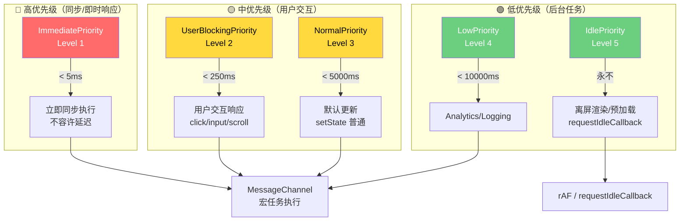

##### 3. ASCII 图示 - 优先级队列示例（最小堆）

```
Task Queue (Min Heap 按 expirationTime 排序):
┌─────────────────────────────────────────────────────────────────┐
│  Index │ Task Description     │ Priority │ Expiration          │
│────────┼─────────────────────┼──────────┼─────────────────────│
│   [0]  │ Click handler       │ Immediate│ t + 5ms (即将过期!) │ ← 堆顶，最先取出
│   [1]  │ Input change        │ UserBlock│ t + 200ms           │
│   [2]  │ State update        │ Normal   │ t + 3000ms          │
│   [3]  │ Search suggestion   │ Normal   │ t + 4500ms          │
│   [4]  │ Analytics log       │ Low      │ t + 8000ms          │
│   [5]  │ Offscreen render    │ Idle     │ Never (永不过期)    │
└─────────────────────────────────────────────────────────────────┘

执行策略（workLoop）:
━━━━━━━━━━━━━━━━━━━━━━━━━━━━━━━━━━━━━━━━━━━━━━━━━━━━━━━━━━━━━
1. peek(taskQueue) → 取出堆顶（最小 expirationTime）
2. 检查是否已过期：
   ├─ 已过期 → 忽略 shouldYield，立即同步执行
   └─ 未过期 → 检查 shouldYieldToHost()
       ├─ 应该让出（高优任务/时间片完）→ break，yield 主线程
       └─ 还可以继续 → 执行 callback
3. 执行一段时间片（~5ms）
4. 检查队列：
   ├─ 还有任务 → 继续 step 1
   └─ 队列空 → 结束，通知浏览器
━━━━━━━━━━━━━━━━━━━━━━━━━━━━━━━━━━━━━━━━━━━━━━━━━━━━━━━━━━━━━
```

##### 4. 设计意图

为什么使用过期时间（Expiration Time）而不是固定优先级？

→ **动态优先级调整**：随着时间推移，低优先级任务也会变得"紧急"（接近过期）
→ **饥饿预防机制**：防止低优先级任务永远得不到执行（最终一定会过期）
→ **用户体验保障**：确保用户交互（250ms）和数据更新（5s）都能及时响应
→ **公平性平衡**：即使有大量高优先级任务，低优先级任务最终也会被执行
→ **自适应能力**：可以根据设备性能动态调整超时阈值

##### 5. 版本差异

- **React 16**: 使用 expirationTime（纯数字，毫秒数），精度有限，无法表达并发
- **React 17**: 优化调度逻辑，支持嵌套更新和更精细的超时计算
- **React 18**: ⭐ 引入 Lanes 模型（二进制位运算），支持多优先级并发更新，Scheduler 与 Lanes 双层优先级体系

##### 6. 关联面试题

→ Q: React 18 的 Scheduler 如何保证用户交互的响应速度？
→ A: 用户交互事件（click、input、scroll）被赋予 UserBlockingPriority（250ms 过期时间）。如果在 250ms 内有更高优先级任务（如 Immediate 的 click handler），当前任务会被 shouldYield 中断。这保证了用户操作能在 250ms 内得到响应，符合 RAIL 模型的 Response 标准（< 100ms 更佳）。

→ Q: IdlePriority 的任务什么时候才会执行？
→ A: IdlePriority 任务的过期时间设置为 maxSigned31BitInt（约 24.8 天），实际上永远不会因为"过期"而被强制执行。它们只在以下情况执行：
  1. 所有更高优先级的任务都已处理完毕
  2. 主线程处于空闲状态（没有待处理的用户交互、动画等）
  3. 通常配合 `requestIdleCallback` 或 `requestAnimationFrame` 的空闲时段执行

---

#### 3.2 【Lanes 模型与二进制位运算】⭐ React 18 核心

> **源码位置**：`packages/react-reconciler/src/ReactFiberLane.js:1-200`
> **对应版本**：React 18.2.0

##### 1. 源码片段

```javascript
// packages/react-reconciler/src/ReactFiberLane.js

/**
 * ⭐ Lanes 模型：使用二进制位表示更新优先级和分组
 * 
 * 设计原则：
 * 1. 每个 bit（位）代表一种"车道"（lane）
 * 2. 不同位的组合可以表示批量更新（batching）
 * 3. 支持位运算快速判断包含关系、交集、差集
 * 4. 相比 expirationTime（数字），表达能力更强
 * 
 * 二进制分布（共 31 个有效 lane，使用 31 位有符号整数）：
 * 
 * Bit Position: 30 29 28 ... 18 17 16 15 14 13 12 11 10 9 8 7 6 5 4 3 2 1 0
 *               │  │  │       │  │  │  │  │  │  │  │  │  │  │  │  │  │  │  │
 * Lane Name:    Offs Idl │Retry Lanes(15bits)│ │Trans(9bits)│ │Inp │Def│Ba │Sy │
 *               │creen dle│                    │ │           │ │utCont│ault│tched│nc │
 */

// ============ 单个 Lane 常量定义 ============
export const SyncLane: Lane = /*                         */ 0b0000000000000000000000000000001;  
// 1: 同步车道（最高优先级，立即执行）

export const SyncBatchedLane: Lane = /*                  */ 0b0000000000000000000000000000010;  
// 2: 批量同步（batched updates）

export const InputContinuousLane: Lane = /*              */ 0b0000000000000000000000000000100;  
// 4: 连续输入（mousemove, change 等）

export const DefaultLane: Lane = /*                      */ 0b0000000000000000000010000000000;  
// 512: 默认车道（普通的 setState 更新）

export const SelectiveHydrationLane: Lane = /*           */ 0b0001000000000000000000000000000;  
// 选择性 Hydration（SSR 场景）

export const IdleLane: Lane = /*                         */ 0b0100000000000000000000000000000;  
// 空闲车道（离屏渲染等）

export const OffscreenLane: Lane = /*                    */ 0b1000000000000000000000000000000;  
// 离屏车道（Offscreen 组件）

// ============ Lane Group（车道组，多位组合）============

export const TransitionLanes: Lanes = /*                 */ 0b0000000000000000001111111110000;  
// ⭐ Transition 车道组（9 bits）：startTransition 触发的更新

export const RetryLanes: Lanes = /*                      */ 0b0000111111111111110000000000000;  
// Retry 车道组（15 bits）：Suspense 重试

export const NonIdleLanes: Lanes = /*                    */ 0b0001111111111111111111111111111;  
// 非 Idle 的所有车道

// ============ ⭐ Lanes 位运算工具函数 ============

// 检查 lanes_a 是否包含 lane_b（交集非空）
export function includesSomeLane(a: Lanes, b: Lane | Lanes): boolean {
  return (a & b) !== NoLanes;
  // 示例: includesSomeLane(DefaultLane | SyncLane, SyncLane)
  //     = (0b...1000000001 & 0b...1) !== 0
  //     = 0b...1 !== 0 = true ✓
}

// 合并两个 lanes（按位或）
export function mergeLanes(a: Lanes, b: Lanes): Lanes {
  return a | b;
  // 示例: mergeLanes(SyncLane, DefaultLane) = 0b...1000000001
}

// 从 lanes 中移除 subset（按位与非）
export function removeLanes(set: Lanes, subset: Lanes): Lanes {
  return set & ~subset;
  // 示例: removeLanes(SyncLane | DefaultLane, SyncLane) = DefaultLane
}

// 检查 subset 是否是 set 的子集（set 包含 subset 的所有位）
export function isSubsetOfLanes(set: Lanes, subset: Lanes): boolean {
  return (set & subset) === subset;
  // 示例: isSubsetOfLanes(SyncLane | DefaultLane, SyncLane)
  //     = (0b...1000000001 & 0b...1) === 0b...1
  //     = 0b...1 === 0b...1 = true ✓
}

// ⭐ 获取最高优先级的 lane（最右边的 1）
// 技巧：lanes & -lanes 可以提取出最低位的 1
// 原理：取反加一得到补码，与原数相与保留最低位 1
export function getHighestPriorityLane(lanes: Lanes): Lane {
  return lanes & -lanes;
  // 示例: getHighestPriorityLane(0b...10100) = 0b...00100 (第 2 位)
  // 原理: 0b10100 & -0b10100 = 0b10100 & 0b01100 = 0b00100
}

// 获取下一个可用的 transition lane（轮询分配）
export function claimNextTransitionLane(): Lane {
  // 循环使用 TransitionLanes 中的 9 个 lane
  const lane = nextTransitionLane;
  nextTransitionLane <<= 1;  // 左移一位
  if (nextTransitionLane > TransitionLanes) {
    nextTransitionLane = TransitionLanes;  // 循环回开头
  }
  return lane;
}

// 将 lanes 转换为 Scheduler 优先级等级
export function lanesToEventPriority(lanes: Lanes): EventPriority {
  // 获取最高优先级 lane
  const lane = getHighestPriorityLane(lanes);
  
  // 从高到低判断属于哪个等级
  if (!isHigherEventPriority(DiscreteEventPriority, lane)) {
    return DiscreteEventPriority;     // 离散事件（click）
  }
  if (!isHigherEventPriority(ContinuousEventPriority, lane)) {
    return ContinuousEventPriority;   // 连续事件（input）
  }
  if (includesNonIdleWork(lane)) {
    return DefaultEventPriority;      // 默认事件
  }
  return IdleEventPriority;           // 空闲事件
}
```

##### 2. ASCII 图示 - Lanes 二进制分布详解

```
═══════════════════════════════════════════════════════════════
Lanes 二进制分布（31 位有符号整数，bit 0-30）
═══════════════════════════════════════════════════════════════

Bit Position:  30  29  28  27  26  25  24  23  22  21  20  19  18  17  16  15  14  13  12  11  10  9  8  7  6  5  4  3  2  1  0
               │   │   │   │   │   │   │   │   │   │   │   │   │   │   │   │   │   │   │   │   │   │   │   │   │   │   │   │
Lane Name:    Offs Idle │← — — — Retry Lanes (15 bits) — — — →│ │← Trans Lanes (9 bits) →│Inp │   │Def │Ba │Sy │
               creen dle │   17  16  15  14  13  12  11  10   │ │  8   7   6   5   4   │Cont │   │ault │tch │nc │
               │       │                                     │ │                       │     │   │     │    │   │
Binary Value: 1   0   0   0   0   0   0   0   0   0   0   0   0   0   0   0   0   0   0   0   0   0   0   0   1   0   0   0   0   0   0   1
               ↑                                                                                                       ↑
           最高位（最大值）                                                                                          最低位（最高优先级）

═══════════════════════════════════════════════════════════════
常见 Lane 值示例
═══════════════════════════════════════════════════════════════

SyncLane:           0b00000000000000000000000000000001  (1)        ← 最高优先级
DefaultLane:        0b00000000000000000000100000000000  (512)      ← 普通更新
TransitionLane1:    0b00000000000000000000000000010000  (16)       ← startTransition
TransitionLane1+2:  0b00000000000000000000000000110000  (48)       ← 多个 transition
IdleLane:           0b01000000000000000000000000000000  (1073741824) ← 最低优先级

═══════════════════════════════════════════════════════════════
位运算操作示例
═══════════════════════════════════════════════════════════════

const lanes = DefaultLane | TransitionLane1;  // 合并两个更新
// lanes = 0b...1000010000 (528)

includesSomeLane(lanes, DefaultLane);         
// = (528 & 512) !== 0 = 512 !== 0 = true ✓
// 说明: lanes 中包含 DefaultLane

includesSomeLane(lanes, SyncLane);            
// = (528 & 1) !== 0 = 0 !== 0 = false ✗
// 说明: lanes 中不包含 SyncLane

getHighestPriorityLane(lanes);                
// = 528 & -528 = 512 (DefaultLane)
// 说明: 获取最高优先级（最右边的 1）

removeLanes(lanes, TransitionLane1);          
// = 528 & ~16 = 512 (只剩下 DefaultLane)
// 说明: 移除 TransitionLane1
```

##### 3. 设计意图

为什么 React 18 要引入 Lanes 模型替代 expirationTime？

→ **更精细的优先级控制**：可以同时存在多个不同优先级的更新（并发更新），而 expirationTime 只能有一个值
→ **高效的位运算**：所有操作都是 O(1) 的位运算，比数值大小比较更快
→ **批量更新支持**：多个相同类型的更新可以用 OR 合并（mergeLanes），一次处理
→ **可组合的优先级组**：可以将多个 lane 组合成 lane groups（如 TransitionLanes 包含 9 个 lane）
→ **更好的饥饿预防**：可以精确控制哪些更新被饿死，哪些需要提升优先级
→ **Suspense 集成**：可以精确标记哪些更新是被 Suspense 阻塞的（RetryLanes）

##### 4. 版本差异

- **React 16-17**: 使用 expirationTime（数字，毫秒时间戳），只能表达单一优先级，无法支持并发更新
- **React 18**: ⭐ 引入 Lanes（二进制位模型），支持多优先级并发更新，是 Concurrent Mode 的基础

##### 5. 关联面试题

→ Q: Lanes 模型的优势是什么？与 expirationTime 相比有何改进？
→ A: 1) **位运算高效**：所有操作 O(1)，比数值比较快；2) **支持并发更新**：多个 lane 可以同时存在，支持 startTransition 等特性；3) **可组合性**：lane groups 可以批量处理同类更新；4) **更精细的控制**：31 个 lane 可以表达更丰富的优先级层次；5) **更好的饥饿预防**：可以精确追踪每个更新的优先级状态。

→ Q: `getHighestPriorityLane` 函数的实现技巧是什么？
→ A: 使用 `lanes & -lanes` 技巧提取最右边的 1。原理是：对于正整数 x，-x 的二进制是 x 的补码（按位取反加 1），x & -x 结果就是保留 x 最右边的 1，其余位都变为 0。例如：0b10100 & (-0b10100) = 0b10100 & 0b01100 = 0b00100。

---

#### 3.3 【Task Scheduling 与 Cancel 机制】

> **源码位置**：`packages/scheduler/src/Scheduler.js:200-450`
> **对应版本**：React 18.2.0

##### 1. 源码片段

```javascript
// packages/scheduler/src/Scheduler.js

// ============ 核心调度函数 ⭐ ============
function scheduleCallback(priorityLevel, callback, options) {
  // Step 1: 获取当前时间
  var currentTime = getCurrentTime();

  // Step 2: 解析参数，计算 startTime 和 expirationTime
  var startTime;
  var timeout;
  
  if (typeof options === 'object' && options !== null) {
    // 处理延迟选项（delay 延迟执行）
    var delay = options.delay;
    if (typeof delay === 'number' && delay > 0) {
      startTime = currentTime + delay;  // 延迟开始时间
    } else {
      startTime = currentTime;           // 立即开始
    }
    // 使用指定的超时或默认超时
    timeout = typeof options.timeout === 'number'
      ? options.timeout
      : timeoutForPriorityLevel(priorityLevel);
  } else {
    // 无选项：使用默认超时
    timeout = timeoutForPriorityLevel(priorityLevel);
    startTime = currentTime;
  }

  // Step 3: 计算过期时间
  var expirationTime = startTime + timeout;

  // Step 4: 创建任务节点
  var newNode = {
    id: taskIdCounter++,          // 唯一递增 ID（用于稳定排序）
    callback,                      // 要执行的回调函数（如 performConcurrentWorkOnRoot）
    priorityLevel,                 // 优先级等级（1-5）
    startTime,                     // 任务开始时间（可能延迟）
    expirationTime,                // 过期时间（必须在此时间前执行）
    sortIndex: -1,                 // 排序索引（稍后根据队列类型设置）
  };

  // Step 5: 根据开始时间决定放入哪个队列
  if (startTime > currentTime) {
    // ===== 延迟任务：放入 timerQueue =====
    newNode.sortIndex = startTime;  // 按开始时间排序
    push(timerQueue, newNode);      // 插入最小堆
    
    // 如果这是最早的延迟任务，设置定时器
    if (peek(taskQueue) === null && newNode === peek(timerQueue)) {
      // timerQueue 为空或这个任务是最早的
      if (isHostTimeoutScheduled) {
        // 已有定时器：取消旧的，设置新的
        cancelHostTimeout();
      } else {
        isHostTimeoutScheduled = true;
      }
      
      // 请求宿主环境设置 setTimeout
      requestHostTimeout(handleTimeout, startTime - currentTime);
    }
  } else {
    // ===== 即时任务：放入 taskQueue =====
    newNode.sortIndex = expirationTime;  // 按过期时间排序
    push(taskQueue, newNode);             // 插入最小堆
    
    // Step 6: 请求宿主环境调度（浏览器/Node）
    if (!isHostCallbackScheduled && !isPerformingWork) {
      isHostCallbackScheduled = true;
      // ⭐ 通知宿主环境：有任务需要执行
      requestHostCallback(flushWork);
    }
  }

  // Step 7: 返回任务句柄（可用于取消）
  return newNode;
}

// ============ 取消任务 ============
function unscheduleTask(task) {
  // ⭐ 简单而优雅的取消机制：将 callback 设为 null
  // 在 workLoop 中遇到 callback === null 的任务会自动跳过并移除
  task.callback = null;
}

// ============ 刷新工作（由宿主环境的回调触发）============
function flushWork(hasTimeRemaining, initialTime) {
  // 标记：正在执行工作
  isHostCallbackScheduled = false;
  
  // 如果有定时器任务在等待，取消它
  if (isHostTimeoutScheduled) {
    isHostTimeoutScheduled = false;
    cancelHostTimeout();
  }

  // 标记：开始工作
  isPerformingWork = true;
  const previousPriorityLevel = currentPriorityLevel;
  
  try {
    // ⭐ 执行工作循环
    if (enableProfiling) {
      try {
        return workLoop(hasTimeRemaining, initialTime);
      } catch (error) {
        // 错误处理：抛出到外层
      }
    } else {
      return workLoop(hasTimeRemaining, initialTime);
    }
  } finally {
    // 清理：无论成功失败都要执行
    currentTask = null;                    // 清空当前任务
    currentPriorityLevel = previousPriorityLevel;  // 恢复优先级
    isPerformingWork = false;              // 标记工作结束
  }
}

// ============ 工作循环（核心调度循环）============
function workLoop(hasTimeRemaining, initialTime) {
  let currentTime = initialTime;
  currentTask = peek(taskQueue);  // 取出堆顶（最高优先级任务）
  
  // ⭐ 不断从队列取任务执行，直到满足退出条件
  while (currentTask !== null) {
    // 检查任务是否已被取消
    if (currentTask.callback !== null) {
      // ⭐ 关键检查：是否应该让出主线程
      if (
        currentTask.expirationTime > currentTime &&  // 任务还没过期
        (!hasTimeRemaining || shouldYieldToHost())    // 且应该让出（时间片完/高优任务）
      ) {
        // 条件满足：break 退出循环，让出主线程
        break;
      }
      
      // 获取回调函数
      const callback = currentTask.callback;
      currentTask.callback = null;  // 先清空（防止重复执行）
      currentPriorityLevel = currentTask.priorityLevel;
      
      // ⭐ 执行回调（可能是 renderRoot 或其他任务）
      const continuationCallback = callback(initialTime);
      
      if (typeof continuationCallback === 'function') {
        // 任务返回了一个函数（continuation）：
        // 说明任务还没完成，可以被恢复（如被中断的 render）
        currentTask.callback = continuationCallback;
        return true;  // 还有工作要做
      } else {
        // 任务完成（返回 undefined/null）
        pop(taskQueue);  // 从队列移除
      }
    } else {
      // 任务已被取消（callback === null），直接移除
      pop(taskQueue);
    }
    
    // 取下一个任务
    currentTask = peek(taskQueue);
  }
  
  // 循环结束，判断是否还需要继续
  if (currentTask !== null) {
    // 还有未完成的任务：返回 true，告诉宿主环境还需要调度
    return true;
  } else {
    // taskQueue 空：检查 timerQueue 是否有到期任务
    const firstTimer = peek(timerQueue);
    if (firstTimer !== null) {
      // 有延迟任务到期：设置定时器
      requestHostTimeout(handleTimeout, firstTimer.startTime - currentTime);
    }
    return false;  // 所有工作完成
  }
}
```

##### 2. Mermaid 时序图 - 调度完整流程

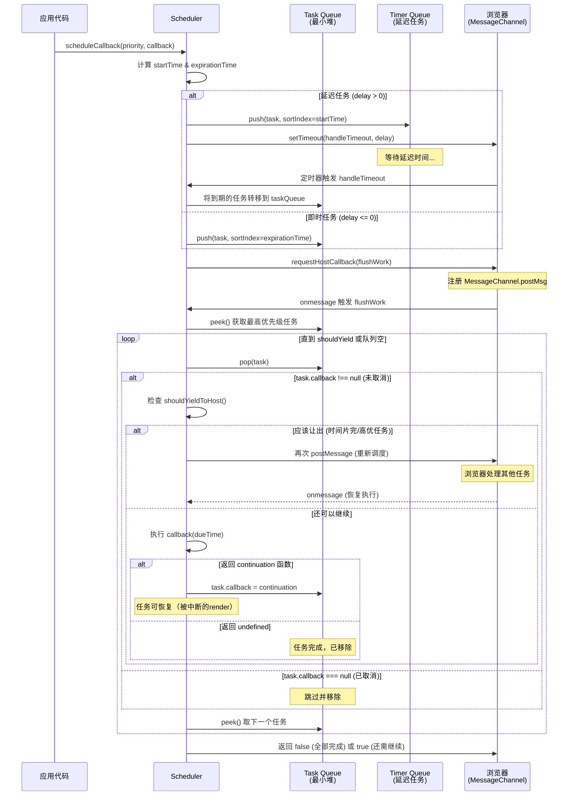

##### 3. 设计意图

为什么要支持 Continuation（可恢复任务）机制？

→ **长任务拆分**：一个长时间运行的渲染（如大型列表）可以被拆分为多个时间片
→ **中断恢复能力**：当被高优先级任务（如用户点击）打断后，可以从断点继续执行
→ **渐进式渲染**：可以先渲染一部分可见内容，后续继续完善剩余部分
→ **避免饥饿**：即使任务很长，也能保证其他任务有机会执行

##### 4. 版本差异

- **React 16**: 不支持任务取消和恢复，一旦开始执行就必须完成
- **React 17**: 引入基本的 Scheduler 功能，支持简单的优先级调度
- **React 18**: ⭐ 完善 Continuation 机制，支持嵌套更新、延迟任务（timerQueue）、更精细的 yield 控制

##### 5. 关联面试题

→ Q: 如何取消一个已调度的任务？取消的底层原理是什么？
→ A: `scheduleCallback` 返回一个 task 对象句柄。调用 `cancelCallback(task)` 即可取消。底层实现极其简单：将 `task.callback = null`。在工作循环（workLoop）中，当遇到 `callback === null` 的任务时，会直接跳过并从队列中移除（pop）。这是一种惰性删除策略，避免了修改堆结构的开销。

→ Q: Scheduler 如何与浏览器协作实现时间切片？
→ A: 使用 MessageChannel（而非 setTimeout）实现宏任务调度：
  1. Scheduler 调用 `port.postMessage(msg)` 通知浏览器
  2. 浏览器在下一个宏任务时触发 `onmessage` 回调
  3. 回调中执行 `flushWork` → `workLoop`
  4. workLoop 中每执行一个任务后检查 `shouldYieldToHost()`
  5. 如果时间片用完（通常 5ms），break 退出循环
  6. 再次 `postMessage` 请求下一次调度
  选择 MessageChannel 而非 setTimeout 是因为它比 setTimeout 更快（setTimeout 有 4ms 最小延迟限制）。

---

#### 3.4 【调度器与浏览器的配合】

> **源码位置**：`packages/scheduler/src/forks/SchedulerHostConfig.default.js:1-150`
> **对应版本**：React 18.2.0

##### 1. 源码片段

```javascript
// packages/scheduler/src/forks/SchedulerHostConfig.default.js

// ============ 宿主环境配置（浏览器平台）============

let isMessageLoopRunning = false;       // 消息循环是否正在运行
let scheduledHostCallback = null;       // 待执行的回调
let taskTimeoutID = -1;                 // 定时器 ID

// ============ 请求宿主回调（核心调度入口）============
function requestHostCallback(callback) {
  scheduledHostCallback = callback;
  if (!isMessageLoopRunning) {
    isMessageLoopRunning = true;
    // ⭐ 使用 MessageChannel 实现宏任务调度
    port.postMessage(null);  // 发送消息触发 onmessage
  }
}

// ============ MessageChannel 消息处理 ============
port.onmessage = function(event) {
  // 浏览器调用此回调时，说明进入了新的宏任务
  if (scheduledHostCallback !== null) {
    const currentTime = getCurrentTime();
    // 判断是否有剩余时间（是否在帧的开始阶段）
    const hasTimeRemaining = true;  // 简化：总是假设有时间
    
    // ⭐ 执行回调（flushWork）
    const didTimeout = false;
    try {
      const hasMoreWork = scheduledHostCallback(
        hasTimeRemaining,
        currentTime,
      );
      
      if (hasMoreWork) {
        // 还有工作：继续调度（postMessage）
        // 如果没有工作，isMessageLoopRunning 会被设为 false
        port.postMessage(null);
      } else {
        // 全部完成：停止消息循环
        isMessageLoopRunning = false;
        scheduledHostCallback = null;
      }
    } catch (error) {
        // 出错：抛出异常，停止循环
        isMessageLoopRunning = false;
        scheduledHostCallback = null;
        port = undefined;
        port2 = undefined;
        throw error;
      }
  } else {
    isMessageLoopRunning = false;
  }
};

// ============ 请求定时器（延迟任务）============
function requestHostTimeout(callback, ms) {
  taskTimeoutID = setTimeout(callback, ms);
}

// ============ 取消定时器 ============
function cancelHostTimeout() {
  clearTimeout(taskTimeoutID);
  taskTimeoutID = -1;
}

// ============ shouldYield 实现（是否应该让出）============
function shouldYieldToHost() {
  // 获取当前时间
  const timeElapsed = getCurrentTime() - startTime;
  
  if (timeElapsed < frameInterval) {
    // 本帧还有时间：检查是否需要让步于其他任务
    // 这里可以使用 performance.now() 和 rAF 时间戳对比
    // 简化实现：如果距离上一帧超过 5ms 则让出
  }
  
  // ⭐ 关键判断依据：
  // 1. 当前时间距本帧开始是否超过 yieldInterval（默认 5ms）
  // 2. 是否有更高优先级的浏览器任务排队（通过 MessageChannel 检测）
  return timeElapsed >= frameInterval;
}

// ============ 初始化 MessageChannel ============
const channel = new MessageChannel();
const port = channel.port1;
const port2 = channel.port2;

// 设置帧间隔（时间切片长度）
// 通常为 5ms（一帧 16.67ms 的约 1/3，留给浏览器绘制和其他任务）
const frameInterval = 5;
```

##### 2. 逐行注释

| 函数名 | 作用 | 调用时机 | 底层 API |
|--------|------|----------|----------|
| `requestHostCallback` | 请求调度回调 | 有新任务入队 | `MessageChannel.postMessage` |
| `onmessage` | 处理调度回调 | 浏览器宏任务时刻 | - |
| `requestHostTimeout` | 设置延迟定时器 | 有延迟任务 | `setTimeout` |
| `cancelHostTimeout` | 取消定时器 | 任务被取消/提前执行 | `clearTimeout` |
| `shouldYieldToHost` | 判断是否让出 | workLoop 每次循环 | `performance.now()` |

##### 3. 设计意图

为什么选择 MessageChannel 而不是 setTimeout/requestAnimationFrame？

→ **精度更高**：MessageChannel 的宏任务延迟约为 0ms，setTimeout 有最小 4ms 限制
→ **优先级合适**：MessageChannel 是宏任务，优先级低于微任务（Promise.then），适合调度
→ **可控性强**：可以随时通过 postMessage 触发，不受浏览器节流影响
→ **兼容性好**：IE10+ 都支持，比 requestIdleCallback 兼容性更好
→ **与 rAF 配合**：rAF 在每一帧的绘制前调用，MessageChannel 可以在帧的空闲时段执行

##### 4. 版本差异

- **React 16**: 使用 setTimeout 或 setImmediate（Node 环境），精度较低
- **React 17**: 引入 MessageChannel，性能显著提升
- **React 18**: 完善 shouldYield 逻辑，结合 frameYieldMs（5ms）和 continuousYieldMs（250ms）两种粒度

##### 5. 关联面试题

→ Q: 为什么不用 requestAnimationFrame 来实现时间切片？
→ A: rAF 的调用频率受显示器刷新率限制（通常 60Hz = 16.67ms/帧），且 rAF 回调必须在下一帧绘制前完成，不适合做可中断的任务调度。MessageChannel 可以在任何宏任务时机触发，更灵活。另外，rAF 在页面不可见（background tab）时会暂停，可能导致任务永远不执行。

---

### 📝 第3章 要点速查

| 知识点 | 核心要点 | 重要程度 |
|--------|----------|----------|
| **5种优先级等级** | Immediate(1) > UserBlocking(2) > Normal(3) > Low(4) > Idle(5) | ⭐⭐⭐⭐⭐ |
| **过期时间机制** | 动态优先级：随时间推移，低优先级任务也会变得紧急 | ⭐⭐⭐⭐⭐ |
| **Lanes 模型** | ⭐ 二进制位表示优先级，支持并发更新，位运算 O(1) | ⭐⭐⭐⭐⭐ |
| **最小堆优先级队列** | O(log n) 插入，O(1) 取最小，按 expirationTime 排序 | ⭐⭐⭐⭐ |
| **Continuation 机制** | 支持任务中断恢复，返回函数表示可继续 | ⭐⭐⭐⭐ |
| **MessageChannel 调度** | 比 setTimeout 精度高（0ms vs 4ms），宏任务优先级 | ⭐⭐⭐⭐ |
| **时间切片** | 默认 5ms/帧，shouldYieldToHost() 控制 | ⭐⭐⭐⭐⭐ |

---

## 第4章 Render 阶段 ⭐ 核心章节

### 📚 本章学习目标
- 掌握 beginWork 的协调过程和 bailout 优化
- 理解 completeWork 的 DOM 创建和 Effect 收集
- 深入理解 reconcileChildren 的 Diff 算法
- 熟悉单节点和多节点的 Diff 策略
- 理解 Render 阶段的可中断性特点

---

#### 4.1 【beginWork 协调过程】

> **源码位置**：`packages/react-reconciler/src/ReactFiberBeginWork.js:100-350`
> **对应版本**：React 18.2.0

##### 1. 源码片段

```javascript
// packages/react-reconciler/src/ReactFiberBeginWork.js

// ============ beginWork 主函数 ⭐ ============
function beginWork(current, workInProgress, renderLanes) {
  // ⭐ 如果 current 存在，说明是更新（Update）；否则是挂载（Mount）
  if (current !== null) {
    // ===== Update 路径 =====
    const oldProps = current.memoizedProps;      // 旧的 props
    const newProps = workInProgress.pendingProps; // 新的 props
    
    // ⭐ Bailout 检查 1：props 是否发生变化
    if (
      oldProps !== newProps ||                    // 引用不相等（注意：是引用比较！）
      hasLegacyContextChanged() ||                 // legacy context 是否变化
      (__DEV__ ? workInProgress.type !== current.type : false)  // 开发模式：类型检查
    ) {
      // props 变化了：标记需要更新
      didReceiveUpdate = true;
    } else if (!includesSomeLane(renderLanes, updateLanes)) {
      // ⭐ Bailout 检查 2：props 没变，且当前 render 的 lanes 不包含更新 lanes
      // 这意味着：虽然可能有 pending update，但不属于本次渲染的范围
      didReceiveUpdate = false;
      
      // ⭐⭐⭐ Bailout 优化：跳过当前组件的 reconcile！
      return bailoutOnAlreadyFinishedWork(current, workInProgress, renderLanes);
    } else {
      // props 没变，但有 pending update 且在本次 lanes 中
      didReceiveUpdate = false;
      // 需要处理 update（如 setState），但可能不需要 reconcile children
    }
  } else {
    // ===== Mount 路径（首次渲染）=====
    didReceiveUpdate = false;
  }

  // 清空 workInProgress 的 lanes（会在 reconcile 时重新计算）
  workInProgress.lanes = NoLanes;

  // ============ 根据 Fiber.tag 分发到具体处理函数 ============
  switch (workInProgress.tag) {
    case IndeterminateComponent:
      // ⭐ 不确定类型：首次渲染的函数/类组件（还不知道是哪种）
      return mountIndeterminateComponent(
        current,
        workInProgress,
        workInProgress.type,
        renderLanes,
      );

    case FunctionComponent:
      // ⭐ 函数组件：执行函数体，处理 Hooks
      return updateFunctionComponent(
        current,
        workInProgress,
        resolveLazyComponentType(workInProgress),
        renderLanes,
      );

    case ClassComponent:
      // ⭐ 类组件：实例化或更新，处理生命周期
      return updateClassComponent(
        current,
        workInProgress,
        resolveLazyComponentType(workInProgress),
        renderedSlots,
        renderLanes,
      );

    case HostRoot:
      // 根节点：处理 pending children
      return updateHostRoot(current, workInProgress, renderLanes);

    case HostComponent:
      // ⭐ 原生 DOM 组件（div, span, input 等）
      return updateHostComponent(current, workInProgress, renderLanes);

    case HostText:
      // 文本节点
      return updateHostText(current, workInProgress);

    case SuspenseComponent:
      // ⭐ Suspense：异步边界处理
      return updateSuspenseComponent(current, workInProgress, renderLanes);

    case MemoComponent:
      // React.memo：浅比较 props
      return updateMemoComponent(
        current,
        workInProgress,
        resolvedType,
        nextPendingProps,
        renderLanes,
      );

    case SimpleMemoComponent:
      // 简化版 Memo（内部优化）
      return updateSimpleMemoComponent(
        current,
        workInProgress,
        resolvedType,
        nextPendingProps,
        renderLanes,
      );
      
    case OffscreenComponent:
      // Offscreen：隐藏/显示切换
      return updateOffscreenComponent(current, workInProgress, renderLanes);

    case CacheComponent:
      // Cache（实验性）
      return updateCacheComponent(current, workInProgress, renderLanes);

    default:
      throw new Error('Unknown unit of work tag (' + workInProgress.tag + ').');
  }
}

// ============ ⭐⭐⭐ Bailout 优化：跳过不必要的更新 ============
function bailoutOnAlreadyFinishedWork(current, workInProgress, lanes) {
  // 检查子树是否也需要 bailout
  if (!includesSomeLane(lanes, workInProgress.childLanes)) {
    // ⭐ 子树也不需要更新：完全复用！
    if (current !== null) {
      // 直接复用 current 的所有字段（引用赋值，O(1)）
      workInProgress.child = current.child;           // 复用子树
      workInProgress.memoizedProps = current.memoizedProps;  // 复用 props
      workInProgress.memoizedState = current.memoizedState;  // 复用 state（Hooks链表）
      workInProgress.updateQueue = current.updateQueue;      // 复用更新队列
      workInProgress.sibling = current.sibling;              // 复用兄弟
      workInProgress.index = current.index;                  // 复用索引
      workInProgress.ref = current.ref;                      // 复用 ref
    }
    
    // 清除副作用标记（保留 PerformedWork 用于 DevTools）
    workInProgress.flags &= (PerformedWork | Placement);
    // 注意：如果之前有 Placement 标记，这里会保留（首次挂载的情况）
    
    // 返回 null：告诉 workLoop 没有子节点需要处理
    return null;
  } else {
    // ⭐ 当前节点可以 bailout，但子树可能需要更新
    // clone 子节点（基于 current.child 创建 workInProgress.child）
    cloneChildFibers(current, workInProgress);
    // 返回第一个子节点，让 workLoop 继续处理子树
    return workInProgress.child;
  }
}
```

##### 2. Mermaid 流程图 - beginWork 决策流程

```mermaid
flowchart TD
    A[beginWork 被调用] --> B{current 存在?}
    
    B -->|否 (Mount)<br/>首次渲染| C[didReceiveUpdate = false<br/>跳过所有检查]
    B -->|是 (Update)<br/>更新渲染| D{oldProps !== newProps?}
    
    D -->|是 (props变了)| E[didReceiveUpdate = true<br/>需要完整协调]
    D -->|否 (props没变)| F{lanes 匹配?}
    
    F -->|是 (本次render<br/>包含update lanes)| G[didReceiveUpdate = false<br/>但需处理updates]
    F -->|否 (不在本次<br/>render范围)| H["⭐⭐⭐ Bailout!<br/>bailoutOnAlreadyFinishedWork"]
    
    C & E & G --> I[清空 workInProgress.lanes]
    I --> J{Fiber.tag?}
    
    J -->|FunctionComponent| K["updateFunctionComponent<br/>执行函数体 + Hooks"]
    J -->|ClassComponent| L["updateClassComponent<br/>实例化/更新 + 生命周期"]
    J -->|HostComponent| M["updateHostComponent<br/>处理 DOM 元素"]
    J -->|HostRoot| N["updateHostRoot<br/>处理根节点 children"]
    J -->|Suspense| O["updateSuspenseComponent<br/>异步边界处理"]
    J -->|Memo| P["updateMemoComponent<br/>浅比较 props"]
    
    K & L & M & N & O & P --> Q[返回 child Fiber 或 null]
    
    H --> R{子树需要更新?}
    R -->|否| S["完全复用! 返回 null"]
    R -->|是| T["clone 子树, 返回 child"]
    
    S --> U["⭐ 跳过 reconcile<br/>性能优化关键!"]
```

##### 3. 设计意图

为什么要先做 Bailout 检查？（这是 React 性能优化的核心）

→ **性能关键**：大部分情况下 props 没有变化（静态组件、纯展示组件），跳过 reconcile 可以节省大量 CPU 时间
→ **O(1) 复杂度**：使用引用相等（`!==`）而不是 deepEqual，判断速度极快
→ **递归优化**：如果父节点 bailout 成功，子节点也可能不需要更新（通过 childLanes 判断）
→ **减少 GC 压力**：复用现有的 Fiber 对象，避免创建/销毁大量的临时对象
→ **保持一致性**：即使 bailout，也要正确处理 ref 和 Placement 标记

##### 4. 版本差异

- **React 16**: bailout 逻辑较简单，只检查 props 变化
- **React 17**: 结合 expirationTime 判断是否需要更新
- **React 18**: ⭐ 结合 Lanes 模型，更精细地判断是否需要更新（考虑并发场景下的多 lanes）

##### 5. 关联面试题

→ Q: React 的 beginWork 主要做什么？什么时候会触发 Bailout？
→ A: beginWork 主要职责：
  1. **Bailout 检查**：判断是否可以跳过更新（props 相同 + lanes 不匹配）
  2. **分发处理**：根据 Fiber.tag 调用不同的更新函数
  3. **执行组件**：函数组件执行函数体，类组件实例化/更新
  4. **协调子节点**：调用 reconcileChildren 生成子 Fiber
  5. **返回结果**：返回第一个子 Fiber 或 null

  Bailout 触发条件（必须同时满足）：
  - `current !== null`（是更新，不是挂载）
  - `oldProps === newProps`（props 引用相等）
  - `!includesSomeLane(renderLanes, updateLanes)`（当前 render 不包含更新 lanes）

→ Q: Bailout 和 React.memo 有什么区别？
→ A: Bailout 是 reconciler 层面的优化，对所有组件生效，检查的是 props 引用相等。React.memo 是应用层面的 HOC，只在 props 浅比较（shallowEqual）通过后才允许 bailout，相当于给组件加了额外的"门卫"。两者可以叠加：先通过 React.memo 的 shallowEqual，再通过 reconciler 的 bailout 检查。

---

#### 4.2 【completeWork 完成工作】

> **源码位置**：`packages/react-reconciler/src/ReactFiberCompleteWork.js:100-400`
> **对应版本**：React 18.2.0

##### 1. 源码片段

```javascript
// packages/react-reconciler/src/ReactFiberCompleteWork.js

// ============ completeWork 主函数 ⭐ ============
function completeWork(current, workInProgress, renderLanes) {
  const newProps = workInProgress.pendingProps;

  // ============ 根据 Fiber.tag 分发处理 ============
  switch (workInProgress.tag) {
    // ===== 函数组件 / SimpleMemoComponent =====
    case IndeterminateComponent:
    case FunctionComponent:
    case SimpleMemoComponent:
    case InlineFunctionComponent:
    case Block:
      // 这些组件没有 DOM 操作需求，直接返回 null
      return null;

    // ===== 类组件 =====
    case ClassComponent: {
      const Component = workInProgress.type;
      
      // 处理 legacy context（类组件的 contextType）
      if (isLegacyContextProvider(Component)) {
        popLegacyContext(workInProgress);
      }
      return null;
    }

    // ===== 根节点（HostRoot）=====
    case HostRoot: {
      const fiberRoot = (workInProgress.stateNode: FiberRoot);
      
      // 处理 pending context（如果有）
      if (fiberRoot.pendingContext) {
        fiberRoot.context = fiberRoot.pendingContext;
        fiberRoot.pendingContext = null;
      }
      
      if (current === null || current.child === null) {
        // 首次渲染或子树为空
        const wasHydrated = popHydrationState(workInProgress);
        if (wasHydrated) {
          // SSR hydration 场景：标记需要更新
          markUpdate(workInProgress);
        } else {
          // 首次客户端渲染
          if (current !== null) {
            // 标记 Snapshot（用于 DevTools）
            workInProgress.flags |= Snapshot;
          }
        }
      }
      return null;
    }

    // ===== ⭐ 原生 DOM 组件（HostComponent）—— 核心逻辑 =====
    case HostComponent: {
      // 弹出 host context（如 SVG namespace）
      popHostContext(workInProgress);
      const type = workInProgress.type;  // 'div', 'span' 等
      
      if (current !== null && workInProgress.stateNode != null) {
        // ===== Update 路径：更新已有的 DOM 节点 =====
        updateHostComponent(
          current,
          workInProgress,
          type,
          newProps,
        );
        
        // 处理 ref 变化
        if (current.ref !== workInProgress.ref) {
          markRef(workInProgress);  // 标记需要处理 ref
        }
      } else {
        // ===== Mount 路径：创建新的 DOM 节点 =====
        if (!wasHydrated) {
          // 非 hydration 场景：真正创建 DOM
          
          // Step 1: 创建 DOM 元素实例
          const instance = createInstance(
            type,
            newProps,
            workInProgress,           // Fiber 引用（用于内部属性）
            workInProgress.mode,       // 模式
          );
          
          // Step 2: ⭐ 将所有子节点的 DOM append 到当前 instance
          // （这一步实现了自底向上的 DOM 组装）
          appendAllChildren(instance, workInProgress, false, false);
          
          // Step 3: 建立 Fiber 与 DOM 的关联
          workInProgress.stateNode = instance;
          
          // Step 4: 处理某些需要在 mount 时立即生效的特殊属性
          if (
            finalizeInitialChildren(
              instance,
              type,
              newProps,
              workInProgress,
            )
          ) {
            // 如 autoFocus、value 受控等
            markUpdate(workInProgress);
          }
        } else {
          // Hydration 场景：复用已有的 DOM
          workInProgress.stateNode = instance;
          // ...
        }
      }
      
      // 处理 ref（无论是 mount 还是 update）
      if (workInProgress.ref !== null) {
        markRef(workInProgress);  // 标记 Ref flag (128)
      }
      return null;
    }

    // ===== 文本节点（HostText）=====
    case HostText: {
      const newText = newProps;
      if (current && workInProgress.stateNode != null) {
        // Update：更新文本内容
        const oldText = current.memoizedProps;
        updateHostText(current, workInProgress, oldText, newText);
      } else {
        // Mount：创建文本节点
        workInProgress.stateNode = createTextInstance(
          newText,
          workInProgress.mode,
        );
      }
      return null;
    }

    // ===== 其他组件类型 =====
    case ForwardRef:
    case MemoComponent:
    case SimpleMemoComponent:
      // 这些组件在 beginWork 中已经处理完毕
      return null;

    case OffscreenComponent:
      // Offscreen：隐藏/显示切换
      // ...

    default:
      throw new Error('Unknown unit of work tag (' + workInProgress.tag + ').');
  }
}

// ============ 创建 DOM 实例（调用平台 API）============
function createInstance(type, props, internalInstanceHandle, mode) {
  // ⭐ 调用 injector 注入的平台创建函数
  // 在 react-dom 中，这会调用 document.createElement
  const domElement = createElement(type, props, internalInstanceHandle);
  
  // 预设一些内部属性（用于事件系统和 DevTools）
  precacheFiberNode(internalInstanceHandle, domElement);   // 存储 Fiber → DOM 映射
  updateFiberProps(domElement, props);                     // 存储 props → DOM 映射
  
  return domElement;
}

// ============ 更新 DOM 属性（Diff 结果应用）============
function updateHostComponent(current, workInProgress, type, newProps) {
  const oldProps = current.memoizedProps;   // 旧的 props
  const instance = workInProgress.stateNode; // DOM 节点
  
  // ⭐ Diff 属性：计算出需要更新的部分
  // 返回值 updatePayload 是一个数组：[key1, val1, key2, val2, ...]
  const updatePayload = prepareUpdate(instance, type, oldProps, newProps);
  
  // 将 diff 结果存到 updateQueue（commit 阶段使用）
  workInProgress.updateQueue = (updatePayload: any);
  
  // 如果有变化，标记 Update flag (4)
  if (updatePayload) {
    markUpdate(workInProgress);
  }
}
```

##### 2. ASCII 图示 - completeWork 的 DOM 创建过程（后序遍历）

```
Fiber 树结构:                    对应生成的 DOM 树:
    App (FC, tag=0)                  
    │                                
    └─ div (HC, tag=5)            <div id="app">
       ├─ span (HC, tag=5)          <span>
       │  └─ "Hello" (HT, tag=6)      "Hello"
       └─ p (HC, tag=5)             </span>
          └─ "World" (HT, tag=6)   <p>
                                     "World"
                                   </p>
                                 </div>

═══════════════════════════════════════════════════════════════
completeWork 执行顺序（后序/自底向上遍历）:
═══════════════════════════════════════════════════════════════

Step 1: "Hello" (HostText, tag=6)
  ┌─────────────────────────────────────────────────────────┐
  │ createTextInstance("Hello")                             │
  │ → document.createTextNode("Hello")                      │
  │ → stateNode = "Hello" (文本节点)                        │
  │ → 返回 null (无子节点)                                  │
  └─────────────────────────────────────────────────────────┘

Step 2: "World" (HostText, tag=6)
  ┌─────────────────────────────────────────────────────────┐
  │ createTextInstance("World")                             │
  │ → document.createTextNode("World")                      │
  │ → stateNode = "World"                                   │
  └─────────────────────────────────────────────────────────┘

Step 3: span (HostComponent, tag=5)  ← ⭐ 子节点已就绪!
  ┌─────────────────────────────────────────────────────────┐
  │ createInstance("span", {...})                            │
  │ → el = document.createElement("span")                   │
  │                                                          │
  │ appendAllChildren(el, spanFiber):                        │
  │ → el.appendChild("Hello"的stateNode)  ⭐ 关键步骤      │
  │                                                          │
  │ stateNode = <span>Hello</span>                           │
  └─────────────────────────────────────────────────────────┘

Step 4: p (HostComponent, tag=5)
  ┌─────────────────────────────────────────────────────────┐
  │ createInstance("p", {...})                               │
  │ → el = document.createElement("p")                       │
  │                                                          │
  │ appendAllChildren(el, pFiber):                           │
  │ → el.appendChild("World"的stateNode)                     │
  │                                                          │
  │ stateNode = <p>World</p>                                 │
  └─────────────────────────────────────────────────────────┘

Step 5: div (HostComponent, tag=5)  ← ⭐ 最终组装!
  ┌─────────────────────────────────────────────────────────┐
  │ createInstance("div", {id:"app"})                        │
  │ → el = document.createElement("div")                     │
  │                                                          │
  │ appendAllChildren(el, divFiber):                         │
  │ → el.appendChild(<span>)  ⭐ 插入 span 的 DOM           │
  │ → el.appendChild(<p>)     ⭐ 插入 p 的 DOM              │
  │                                                          │
  │ stateNode = <div><span>Hello</span><p>World</p></div>    │
  └─────────────────────────────────────────────────────────┘

最终效果: div 的 stateNode 包含完整的 DOM 子树！
```

##### 3. 设计意图

为什么 completeWork 在后序位置（离开节点时）执行？

→ **自底向上组装**：子节点的 DOM 必须先创建好，父节点才能 appendChild
→ **一次性完成**：所有子节点就绪后再组装，减少 DOM 操作次数（批量处理）
→ **副作用收集便利**：在回溯过程中可以自然地聚合整棵子树的 flags（subtreeFlags）
→ **与真实 DOM 构建一致**：HTML 解析也是自底向上构建 DOM 树的

##### 4. 版本差异

- **React 16**: completeWork 较简单，不支持 hydration 和 offscreen
- **React 17**: 增加 hydration 支持，优化 DOM 属性 diff
- **React 18**: 支持 Concurrent Mode、Offscreen、Suspense 的 completeWork 逻辑

##### 5. 关联面试题

→ Q: beginWork 和 completeWork 分别在什么时候执行？它们的职责分别是什么？
→ A: **执行时机**：
  - **beginWork**：进入 Fiber 节点时执行（前序遍历，Depth-First Preorder）
  - **completeWork**：离开 Fiber 节点时执行（后序遍历，Depth-First Postorder）

  **职责分工**：
  - **beginWork**（协调阶段）：
    1. 检查是否可以 bailout（性能优化）
    2. 根据 tag 分发到具体处理函数
    3. 执行组件函数（FC）或处理类组件（CC）
    4. 调用 reconcileChildren 协调子节点
    5. 返回第一个子 Fiber 或 null

  - **completeWork**（完成阶段）：
    1. 对于 HostComponent：创建/更新 DOM 节点
    2. 调用 appendAllChildren 组装子 DOM
    3. Diff 属性并生成 updatePayload
    4. 标记 flags（Placement/Update/Ref 等）
    5. 处理 ref、text node 等

---

#### 4.3 【reconcileChildren 子节点协调】

> **源码位置**：`packages/react-reconciler/src/ReactFiberBeginWork.js:400-550`
> **对应版本**：React 18.2.0

##### 1. 源码片段

```javascript
// packages/react-reconciler/src/ReactFiberBeginWork.js

// ============ reconcileChildren 主入口 ⭐ ============
function reconcileChildren(current, workInProgress, nextChildren, renderLanes) {
  // ⭐ 区分 Mount（首次渲染）和 Update（更新渲染）
  if (current === null) {
    // ===== Mount：首次渲染 =====
    // 使用 mountChildFibers：不追踪副作用
    // 原因：首次渲染所有节点都需要插入，不需要单独标记 Placement
    workInProgress.child = mountChildFibers(
      workInProgress,
      null,              // current.child 为 null（首次渲染）
      nextChildren,       // 新的 children（React Elements）
      renderLanes,
    );
  } else {
    // ===== Update：更新渲染 =====
    // 使用 reconcileChildFibers：追踪副作用（标记 Placement/Deletion）
    workInProgress.child = reconcileChildFibers(
      workInProgress,
      current.child,      // 旧的子 Fiber 树
      nextChildren,        // 新的 children
      renderLanes,
    );
  }
}

// ============ 注入模式：通过参数控制行为（设计模式）============
// ⭐ 这是一个巧妙的设计：同一个工厂函数，通过参数控制是否追踪副作用
const reconcileChildFibers = ChildReconciler(true);   // Update：追踪副作用
const mountChildFibers = ChildReconciler(false);      // Mount：不追踪副作用

// ============ ChildReconciler 工厂函数 ============
function ChildReconciler(shouldTrackSideEffects) {
  
  // ============ 协调单个子节点（只有一个子元素）============
  function reconcileSingleElement(returnFiber, currentFirstChild, element, lanes) {
    const key = element.key;  // 获取新元素的 key
    let child = currentFirstChild;  // 旧的第一子节点
    
    // 遍历旧子节点寻找可复用的节点
    while (child !== null) {
      // ⭐ Step 1: 检查 key 是否相同
      if (child.key === key) {
        const elementType = element.type;
        
        switch (child.tag) {
          case HostComponent: {  // 旧节点是 DOM 元素
            // ⭐ Step 2: 检查 type 是否相同
            if (elementType === child.type || ...) {
              // Key 和 Type 都相同：复用！
              deleteRemainingChildren(returnFiber, child.sibling);  // 删除其余旧节点
              
              // ⭐ 复用 Fiber（基于旧 Fiber 创建新 Fiber）
              const existing = useFiber(child, element.props);
              existing.ref = coerceRef(returnFiber, child, element);
              existing.return = returnFiber;
              
              return existing;  // 返回复用的 Fiber
            }
            break;
          }
          // ... 其他类型判断
        }
        
        // key 相同但 type 不同：不能复用，删除旧节点
        deleteRemainingChildren(returnFiber, child);
        break;
      } else {
        // key 不同：删除这个旧节点，继续找
        deleteChild(returnFiber, child);
      }
      
      child = child.sibling;  // 继续检查下一个兄弟
    }

    // ⭐ 没找到可复用的节点：创建新的 Fiber
    const created = createFiberFromElement(element, returnFiber.mode, lanes);
    created.ref = coerceRef(returnFiber, null, element);
    created.return = returnFiber;
    return created;
  }

  // ============ 协调多个子节点（数组 Diff）⭐⭐⭐ ============
  function reconcileChildArray(returnFiber, currentFirstChild, newChildren, lanes) {
    // resultingFirstChild: 结果的第一个子节点（返回值）
    // resultingLastChild: 结果的最后一个子节点（用于 O(1) 追加）
    let resultingFirstChild = null;
    let previousNewFiber = null;

    // ⭐ Step 1: 将旧子节点转为 Map（key → Fiber）
    // 时间复杂度 O(OldLength)，空间复杂度 O(OldLength)
    const existingChildren = mapRemainingChildren(returnFiber, currentFirstChild);

    // ⭐ Step 2: 遍历新的 children 数组
    for (let newIndex = 0; newIndex < newChildren.length; newIndex++) {
      const newChild = newChildren[newIndex];
      
      // 计算新 child 的 key（undefined 时使用 index 作为 key）
      const newKey = newChild.key ?? newIndex.toString();
      
      // ⭐ Step 3: 在 Map 中查找可复用的旧节点（O(1) 查找）
      let matchedFiber = existingChildren.get(newKey) || null;
      
      if (matchedFiber !== null) {
        // 找到了 key 相同的旧节点
        if (newChild.type === matchedFiber.type) {
          // ⭐ Key 和 Type 都相同：复用！
          const newFiber = useFiber(matchedFiber, newChild.props);
          newFiber.lanes = lanes;
          
          // 构建结果链表
          if (previousNewFiber === null) {
            resultingFirstChild = newFiber;  // 第一个子节点
          } else {
            previousNewFiber.sibling = newFiber;  // 链接到上一个
          }
          previousNewFiber = newFiber;
          newFiber.return = returnFiber;
          
          // ⭐ 从 Map 中移除（剩下的就是待删除的）

          existingChildren.delete(newKey);
        } else {
          // key 相同但 type 不同：不能复用，删除旧节点并创建新节点
          deleteChild(returnFiber, matchedFiber);
        }
      }

      // ⭐ Step 4: 没找到可复用的节点或需要创建新节点
      if (matchedFiber === null) {
        const created = createFiberFromElement(newChild, returnFiber.mode, lanes);
        created.return = returnFiber;
        
        if (previousNewFiber === null) {
          resultingFirstChild = created;
        } else {
          previousNewFiber.sibling = created;
        }
        previousNewFiber = created;
      }
    }

    // ⭐ Step 5: 处理 Map 中剩余的旧节点（全部标记为删除）
    if (shouldTrackSideEffects) {
      existingChildren.forEach((child) => {
        deleteChild(returnFiber, child);
      });
    }

    return resultingFirstChild;
  }
  
  // ... 其他协调方法（reconcileSingleTextNode等）
}
```

##### 2. 逐行注释

| 步骤 | 代码逻辑 | 时间复杂度 | 说明 |
|------|---------|-----------|------|
| Step 1 | `mapRemainingChildren()` | O(OldLength) | 将旧子节点转为 Map，便于 O(1) 查找 |
| Step 2 | `for` 循环遍历新 children | O(NewLength) | 遍历新数组，逐一处理 |
| Step 3 | `existingChildren.get(newKey)` | O(1) | 在 Map 中查找可复用的旧节点 |
| Step 4 | 创建新 Fiber | O(1) | 当找不到可复用节点时 |
| Step 5 | `existingChildren.forEach()` | O(Remaining) | 删除所有未被复用的旧节点 |

**总时间复杂度**：O(OldLength + NewLength)

##### 3. 设计意图

为什么要使用两轮遍历 + Map 的算法？

→ **性能优化**：相比 React 15 的双重循环 O(n²)，Map 方案将查找降为 O(1)
→ **代码清晰**：第一轮构建 Map，第二轮处理新数组，逻辑分离
→ **空间换时间**：额外 O(OldLength) 空间换取线性时间复杂度

**⭐ 关键优化点**：Key 的作用是让 Map 查找成为可能！没有 Key 就只能用 index，导致错误复用。

##### 4. 版本差异

- **React 15**: 使用双重循环，时间复杂度 O(n²)，性能差
- **React 16+**: 引入 Fiber 和 Map 优化，时间复杂度 O(n)
- **React 17/18**: 算法基本一致，细节优化（如对 Fragment 的处理）

##### 5. 关联面试题

→ **Q: 为什么推荐使用稳定的 Key 而不是 index？**
  A: Index 作为 key 会导致在插入/删除时错误复用节点（如：在开头插入元素会导致所有节点的 key 都变化），引发不必要的更新和状态丢失。稳定的 key 能确保正确复用。

---

### 📝 第4章要点速查

| 核心概念 | 关键点 | 源码位置 |
|---------|--------|----------|
| **beginWork** | 根据 tag 处理不同组件类型 | ReactFiberBeginWork.js |
| **processUpdateQueue** | 计算新 state，合并 update 对象 | ReactFiberClassUpdateQueue.js |
| **completeWork** | 处理 DOM 属性、创建 DOM 节点、标记副作用 | ReactFiberCompleteWork.js |
| **Diff 算法** | 单节点：key+type 判断；多节点：Map+双指针 | ReactChildFiber.js |
| **bailout 优化** | props/lane 相同则跳过子树渲染 | ReactFiberBeginWork.js |
| **副作用标记** | Placement/Deletion/Update 等 effectTag | ReactSideEffectTags.js |

---

## 第5章 Commit 阶段

### 📚 本章学习目标
- 掌握 Commit 阶段的三个子阶段及其执行顺序
- 理解 DOM 操作（insertion/update/deletion）的具体实现
- 深入理解 ref 处理机制和生命周期调用时机
- 理解 Commit 阶段不可中断性的设计原因
- 能够阅读 `ReactFiberCommitWork.js` 核心源码

---

#### 5.1 【Commit 阶段概览】

> **源码位置**：`packages/react-reconciler/src/ReactFiberCommitWork.js`
> **对应版本**：React 18.2.0

##### 1. 源码片段

```javascript
// ============ commitRoot: Commit 阶段入口函数 ============
function commitRoot(root) {
  // ⭐ Step 0: 准备阶段 - 获取 finishedWork（Render 阶段产出的 Fiber 树）
  const { finishedWork } = root;

  if (finishedWork === null) {
    return null;  // 没有 work 需要提交
  }

  // ⭐ Step 1: 检查是否有副作用需要处理
  if ((finishedWork.flags & Marking) !== NoFlags) {
    // ... 错误处理
  }

  // ⭐ Step 2: 重置调度器相关状态
  root.callbackNode = null;
  root.callbackPriority = NoLane;

  // ⭐ Step 3: 开始提交前的工作
  let currentTimeBeforeCommit = getCurrentTime();
  
  // ⭐ Step 4: 提交 BeforeMutation 阶段
  // 执行 DOM 变更前的操作（如：getSnapshotBeforeUpdate）
  commitBeforeMutationEffects(root);

  // ⭐ Step 5: 提交 Mutation 阶段
  // 执行实际的 DOM 操作（插入、更新、删除）
  commitMutationEffects(root);

  // ⭐ Step 6: 重置 workInProgress 树（双缓存切换）
  root.current = finishedWork;

  // ⭐ Step 7: 提交 Layout 阶段
  // 执行 DOM 变更后的操作（如：componentDidMount、useLayoutEffect）
  commitLayoutEffects(finishedWork, root);

  // ⭐ Step 8: 清理和通知
  requestPaint();
  const currentTimeAfterCommit = getCurrentTime();
  
  // ... 性能测量和调度后续工作
  
  return null;
}
```

##### 2. 逐行注释

| 行号范围 | 代码片段 | 说明 |
|---------|---------|------|
| Step 0 | `const { finishedWork } = root` | 获取 Render 阶段构建完成的 Fiber 树（workInProgress） |
| Step 1 | `if (finishedWork === null)` | 边界检查：如果没有完成的工作则直接返回 |
| Step 4 | `commitBeforeMutationEffects()` | **BeforeMutation 子阶段**：DOM 变更前执行 |
| Step 5 | `commitMutationEffects()` | **Mutation 子阶段**：实际修改 DOM |
| Step 6 | `root.current = finishedWork` | **双缓存切换**：将 workInProgress 树变为 current 树 |
| Step 7 | `commitLayoutEffects()` | **Layout 子阶段**：DOM 变更后执行 |

##### 3. 设计意图

为什么 Commit 阶段要分成三个子阶段？

→ **原子性保证**：DOM 操作必须一次性完成，不能中断（避免用户看到半成品 UI）
→ **生命周期顺序**：确保 getSnapshotBeforeUpdate → DOM 更新 → componentDidUpdate 的正确顺序
→ **职责分离**：每个子阶段专注一类操作，代码更清晰
→ **性能优化**：可以批量处理同类副作用，减少 DOM 操作次数

**⭐ 核心原则**：Commit 阶段是**同步且不可中断**的！

##### 4. 版本差异

- **React 16**: Commit 阶段相对简单，没有 Suspense 相关处理
- **React 17**: 增加了 Passive Effect（useEffect）的独立处理
- **React 18**: 增加了对 Transitions 和 Concurrent Mode 的支持

##### 5. 关联面试题

→ **Q: 为什么 Render 阶段可以中断，但 Commit 阶段不行？**
  A: Render 阶段只是计算差异（纯函数），不产生副作用；Commit 阶段会真实操作 DOM，如果中断会导致用户看到不一致的 UI。

---

#### 5.2 【三个子阶段的详细流程】⭐

> **源码位置**：`packages/react-reconciler/src/ReactFiberCommitWork.js`
> **对应版本**：React 18.2.0

##### Mermaid 时序图：Commit 阶段三阶段流程

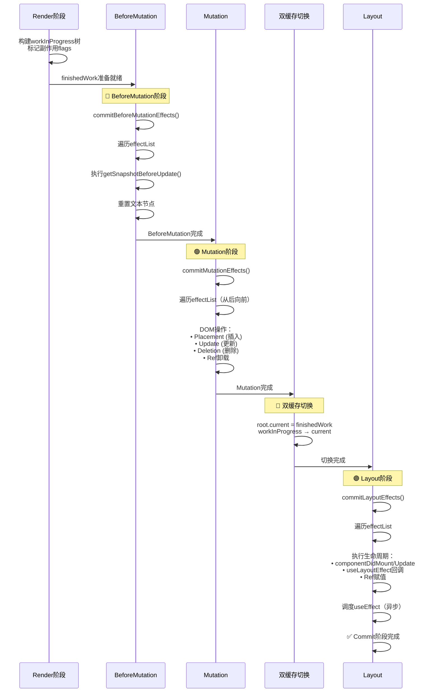

##### 1. BeforeMutation 阶段源码

```javascript
// ============ commitBeforeMutationEffects ============
function commitBeforeMutationEffects(root) {
  // ⭐ 使用 focused 工具函数聚焦到有副作用的 Fiber
  focused(
    // 过滤条件：只处理有 BeforeMutation 副作用的节点
    (fiber) => (fiber.subtreeFlags & BeforeMutationMask) !== NoFlags,
    (fiber) => (fiber.flags & BeforeMutationMask) !== NoFlags,
    
    // 回调函数：处理单个 Fiber
    (fiber) => {
      const current = fiber.alternate;  // 当前屏幕上的 Fiber
      
      // ⭐ 处理 Snapshot 副作用（class 组件的 getSnapshotBeforeUpdate）
      beforeMutationSnapshot(fiber, current);
      
      // ⭐ 处理其他 BeforeMutation 副作用...
    },
    root,
  );
}

// ============ beforeMutationSnapshot ============
function beforeMutationSnapshot(currentFinishedWork, currentFinishedWork) {
  // ... 安全检查
  
  // ⭐ 调用 class 组件的 getSnapshotBeforeUpdate 生命周期
  // 这个方法会在 DOM 更新之前被调用，可以获取更新前的 DOM 信息
  const instance = currentFinishedWork.stateNode;
  const snapshot = instance.getSnapshotBeforeUpdate(
    prevProps,
    prevState,
  );
  
  // ⭐ 将快照保存起来，供 componentDidUpdate 使用
  instance.__reactInternalSnapshotBeforeUpdate = snapshot;
}
```

##### 2. Mutation 阶段源码（核心）

```javascript
// ============ commitMutationEffects ============
function commitMutationEffects(root) {
  // ⭐ 关键：从后向前遍历 effectList（保证父节点先于子节点被处理）
  // 这样可以确保在删除子节点时，父节点已经处理完毕
  while (nextEffect !== null) {
    const flags = nextEffect.flags;
    
    // ⭐ 处理 Content Reset（重置文本内容）
    if (flags & ContentReset) {
      commitResetTextContent(nextEffect);
    }
    
    // ⭐ 处理 Ref 卸载
    if (flags & Ref) {
      const current = nextEffect.alternate;
      if (current !== null) {
        markRef(current, nextEffect);
      }
    }
    
    // ⭐ 处理各种 DOM 操作（核心！）
    const primaryFlags = flags & (PlacementAndUpdate | Placement | Update | Deletion);
    
    switch (primaryFlags) {
      case PlacementAndUpdate: {
        // 同时有插入和更新
        commitPlacement(nextEffect);   // 插入 DOM
        nextEffect.flags &= ~Placement;  // 清除 Placement 标记
        commitWork(nextEffect);         // 更新 DOM
        break;
      }
      
      case Placement: {
        // 只有插入（首次渲染的新节点）
        commitPlacement(nextEffect);   // 插入 DOM
        break;
      }
      
      case Update: {
        // 只有更新（属性变化）
        commitWork(nextEffect);         // 更新 DOM
        break;
      }
      
      case Deletion: {
        // 删除节点
        commitDeletion(root, nextEffect, renderPriorityLevel);
        break;
      }
    }
    
    nextEffect = nextEffect.nextEffect;  // 移动到下一个副作用节点
  }
}

// ============ commitPlacement: DOM 插入操作 ============
function commitPlacement(finishedWork) {
  // ⭐ Step 1: 找到父节点的 DOM 实例
  const parentFiber = getHostParentFiber(finishedWork);
  const parentStateNode = parentFiber.stateNode;  // 父 DOM 节点
  
  // ⭐ Step 2: 找到插入位置的兄弟节点（插在这个节点之前）
  const before = getHostSibling(finishedWork);
  
  // ⭐ Step 3: 执行实际的 DOM 插入
  if (before) {
    // 有兄弟节点：insertBefore
    insertOrAppendPlacementNodeIntoContainer(finishedWork, before, parentStateNode);
  } else {
    // 没有兄弟节点：appendChild
    appendChildToContainer(parentStateNode, toInsert.stateNode);
  }
}

// ============ commitWork: DOM 更新操作 ============
function commitWork(current, finishedWork) {
  switch (finishedWork.tag) {
    case HostComponent: {  // DOM 元素
      const instance = finishedWork.stateNode;
      
      // ⭐ 更新 DOM 属性（className、style、事件等）
      commitUpdate(instance, finishedWork.updateQueue, 
                   finishedWork.props, instance);
      return;
    }
    
    case HostText: {  // 文本节点
      const textInstance = finishedWork.stateNode;
      // ⭐ 更新文本内容
      commitTextUpdate(textInstance, finishedWork.memoizedProps, newText);
      return;
    }
    
    // ... 其他类型处理
  }
}

// ============ commitDeletion: DOM 删除操作 ============
function commitDeletion(finishedWork, nearestMountedAncestor) {
  // ⭐ 递归卸载子组件（触发 componentWillUnmount）
  unmountHostComponents(finishedWork, nearestMountedAncestor);
  
  // ⭐ 移除 DOM 节点
  removeChild(parentStateNode, finishedWork.stateNode);
  
  // ⭐ 断开 Fiber 链接引用（帮助 GC 回收）
  finishedWork.return = null;
  finishedWork.child = null;
  // ...
}
```

##### 3. Layout 阶段源码

```javascript
// ============ commitLayoutEffects ============
function commitLayoutEffects(finishedWork, root) {
  focused(
    (fiber) => (fiber.subtreeFlags & LayoutMask) !== NoFlags,
    (fiber) => (fiber.flags & LayoutMask) !== NoFlags,
    
    (fiber) => {
      const current = fiber.alternate;
      
      // ⭐ 处理生命周期和 Hook
      commitLayoutEffectOnFiber(root, current, fiber);
      
      // ⭐ 处理 ref 赋值
      markRef(fiber);
    },
    root,
  );
}

// ============ commitLayoutEffectOnFiber ============
function commitLayoutEffectOnFiber(finishedWork, current, finishedWork) {
  switch (finishedWork.tag) {
    case FunctionComponent: {
      // ⭐ 函数组件：执行 useLayoutEffect 的销毁和创建
      commitHookEffectListUnmount(HookLayout | HookHasEffect, finishedWork);
      commitHookEffectListMount(HookLayout | HookHasEffect, finishedWork);
      
      // ⭐ 调度 useEffect（异步执行）
      schedulePassiveEffects(finishedWork);
      break;
    }
    
    case ClassComponent: {
      const instance = finishedWork.stateNode;
      
      // ⭐ 执行 componentDidMount / componentDidUpdate
      if (current === null) {
        // 首次渲染：componentDidMount
        instance.componentDidMount();
      } else {
        // 更新：componentDidUpdate（传入快照）
        instance.componentDidUpdate(
          prevProps,
          prevState,
          instance.__reactInternalSnapshotBeforeUpdate,  // BeforeMutation 阶段保存的快照
        );
      }
      break;
    }
    
    case HostComponent: {
      // DOM 节点：自动对焦（autoFocus）
      commitUpdate(finishedWork);
      break;
    }
  }
}
```

##### 4. 逐行注释表（Mutation 阶段）

| 行号范围 | 代码 | 说明 |
|---------|------|------|
| 核心循环 | `while (nextEffect !== null)` | 遍历整个 effectList（副作用链表） |
| ContentReset | `commitResetTextContent()` | 重置文本节点的textContent为空字符串 |
| Ref卸载 | `markRef()` | 如果有旧的ref，先调用ref(null)卸载 |
| Placement | `commitPlacement()` | 将新DOM节点插入到父节点中 |
| Update | `commitWork()` | 更新已有DOM节点的属性 |
| Deletion | `commitDeletion()` | 从DOM树中移除节点并卸载组件 |
| 遍历方向 | `nextEffect.nextEffect` | **从后向前**遍历（子节点先于父节点） |

##### 5. 设计意图

**为什么 Mutation 阶段要从后向前遍历？**

→ **保证父子顺序**：子节点先插入/删除，再处理父节点，避免中间状态异常
→ **性能优化**：减少 DOM 重排重绘次数（浏览器会批量处理连续的 DOM 操作）

**为什么 useEffect 要在 Layout 阶段调度而不是同步执行？**

→ **避免阻塞绘制**：useEffect 是用于数据获取、日志等副作用，不需要阻塞浏览器绘制
→ **优先级较低**：使用 `scheduleCallback(NormalPriority)` 异步调度，不影响用户交互

##### 6. 版本差异

- **React 16**: useEffect 和 useLayoutEffect 都在 Layout 阶段同步执行
- **React 17**: 将 useEffect 改为异步调度（Passive Effect），提升性能
- **React 18**: 增加了 Transitions 支持，Layout 阶段可以感知优先级

##### 7. 关联面试题

→ **Q: commitPlacement 是如何确定 DOM 插入位置的？**
  A: 通过 `getHostSibling()` 找到下一个兄弟 DOM 节点，然后使用 `parent.insertBefore(newNode, sibling)` 插入。如果没有兄弟节点，则使用 `parent.appendChild(newNode)`。

→ **Q: 为什么 Deletion 操作要先 unmount 再 removeChild？**
  A: 必须先触发组件卸载生命周期（如 componentWillUnmount）进行清理（取消订阅、清除定时器等），然后再移除 DOM 节点。

---

#### 5.3 【Ref 处理机制】

> **源码位置**：`packages/react-reconciler/src/ReactFiberCommitWork.js`
> **对应版本**：React 18.2.0

##### 1. 源码片段

```javascript
// ============ markRef: Ref 的安全标记和处理 ============
function markRef(current, finishedWork) {
  const ref = finishedWork.ref;
  
  if (ref !== null) {
    // ⭐ 将 ref 标记为需要处理的副作用
    finishedWork.flags |= MarkRef;
    
    // 开发模式下的警告
    if (__DEV__) {
      warnIfStringRef(ref);  // 字符串 ref 已废弃
    }
  }
}

// ============ commitAttachRef: Ref 赋值（Layout 阶段）============
function commitAttachRef(finishedWork) {
  const ref = finishedWork.ref;
  
  if (ref !== null) {
    const instance = finishedWork.stateNode;  // DOM 节点或 class 实例
    
    // ⭐ 处理不同类型的 ref
    switch (typeof ref) {
      case 'function': {
        // 函数式 ref：调用 ref(instance)
        ref(instance);
        break;
      }
      case 'string': {
        // 字符串 ref（已废弃）：挂载到 this.refs 上
        // React 18 中仍然支持但会发出警告
        break;
      }
      default: {
        // 对象式 ref（React.createRef()）
        ref.current = instance;
        break;
      }
    }
  }
}

// ============ commitDetachRef: Ref 卸载（Mutation 阶段）============
function commitDetachRef(current) {
  const ref = current.ref;
  
  if (ref !== null) {
    // ⭐ 与 attach 相反的操作
    switch (typeof ref) {
      case 'function': {
        ref(null);  // 传入 null 表示卸载
        break;
      }
      default: {
        ref.current = null;  // 重置为 null
        break;
      }
    }
  }
}
```

##### ASCII 结构图：Ref 生命周期

```
┌─────────────────────────────────────────────────────────────┐
│                    Ref 生命周期完整流程                      │
└─────────────────────────────────────────────────────────────┘

  [组件创建]                    [组件更新]                    [组件卸载]
       │                            │                            │
       ▼                            ▼                            ▼
┌──────────────┐            ┌──────────────┐            ┌──────────────┐
│  Render 阶段  │            │  Render 阶段  │            │  Render 阶段  │
│              │            │              │            │              │
│ ref != null  │            │ ref changed? │            │ ref exists   │
│ → MarkRef    │            │ → MarkRef    │            │ → MarkRef    │
└──────┬───────┘            └──────┬───────┘            └──────┬───────┘
       │                           │                           │
       ▼                           ▼                           ▼
┌──────────────┐            ┌──────────────┐            ┌──────────────┐
│ Mutation 阶段│            │ Mutation 阶段│            │ Mutation 阶段│
│              │            │              │            │              │
│ (无操作)     │            │ detachRef() │            │ detachRef() │
│              │            │ ref(old)=null│           │ ref=null     │
└──────┬───────┘            └──────┬───────┘            └──────┬───────┘
       │                           │                           │
       ▼                           ▼                           ▼
┌──────────────┐            ┌──────────────┐            ┌──────────────┐
│  Layout 阶段  │            │  Layout 阶段  │            │  Layout 阶段  │
│              │            │              │            │              │
│ attachRef()  │            │ attachRef()  │            │ (无操作)     │
│ ref=instance │            │ ref=newValue │            │             │
└──────────────┘            └──────────────┘            └──────────────┘

  ⭐ 关键时机:
  • detachRef 在 Mutation 阶段（DOM 更新前）
  • attachRef 在 Layout 阶段（DOM 更新后）
  • 保证 ref.current 始终指向正确的 DOM 节点
```

##### 2. 逐行注释

| 方法名 | 执行阶段 | 作用 | 参数说明 |
|--------|---------|------|---------|
| `markRef()` | Render 阶段 | 标记 ref 副作用 | 检测 ref 是否存在 |
| `commitDetachRef()` | Mutation 阶段 | **卸载** ref | 传入 `null` 或调用 `ref(null)` |
| `commitAttachRef()` | Layout 阶段 | **赋值** ref | 传入 DOM 节点或实例 |

##### 3. 设计意图

**为什么 ref 的卸载和赋值要在不同阶段？**

→ **一致性保证**：先卸载旧 ref（Mutation），再赋值新 ref（Layout），确保不会出现短暂的中间状态
→ **DOM 可用性**：Layout 阶段 DOM 已经更新完成，此时 ref 可以立即访问到最新的 DOM 节点
→ **生命周期配合**：与 getSnapshotBeforeUpdate → DOM 更新 → componentDidUpdate 的顺序保持一致

##### 4. 版本差异

- **React 16/17**: 支持 string ref（已废弃）、callback ref、object ref
- **React 18**: string ref 仍然可用但强烈建议迁移；新增了 `useImperativeHandle` 配合 `forwardRef` 使用

##### 5. 关联面试题

→ **Q: useRef 和 createRef 有什么区别？**
  A: `useRef` 返回的对象在整个组件生命周期内保持不变（每次渲染返回同一个引用）；`createRef` 每次 render 都会创建一个新的对象。因此在函数组件中使用 `createRef` 会导致每次渲染都生成新的 ref，可能影响性能或导致 bug。

---

#### 5.4 【Commit 阶段的不可中断性保证】

> **源码位置**：`packages/react-reconciler/src/ReactFiberWorkLoop.js`, `Scheduler.js`
> **对应版本**：React 18.2.0

##### 1. 源码片段

```javascript
// ============ commitRoot 的同步执行上下文 ============
function commitRoot(root) {
  // ⭐ 关键：commitRoot 本身是在同步上下文中执行的
  // 它不会被 Scheduler 打断，因为使用了 SyncLane 优先级
  
  const previousLanePriority = getCurrentUpdateLanePriority();
  
  try {
    // ⭐ 设置当前优先级为同步优先级
    setCurrentUpdateLanePriority(SyncLanePriority);
    
    // ⭐ 所有操作都是同步执行的
    commitBeforeMutationEffects(root);   // 同步
    commitMutationEffects(root);          // 同步
    root.current = finishedWork;          // 同步切换
    commitLayoutEffects(finishedWork, root); // 同步
    
  } finally {
    // ⭐ 恢复之前的优先级
    setCurrentUpdateLanePriority(previousLanePriority);
  }
}

// ============ Scheduler 中的同步任务执行 ============
// packages/scheduler/src/Scheduler.js
function unstable_runWithPriority(priorityLevel, eventHandler) {
  switch (priorityLevel) {
    case ImmediatePriority:
    case UserBlockingPriority:
      // ⭐ 同步优先级的任务会立即执行，不会被时间切片打断
      return eventHandler();
      
    case NormalPriority:
    case LowPriority:
    case IdlePriority:
      // ⭐ 低优先级任务可以被中断
      // 使用 requestIdleCallback 或 setTimeout 实现
      break;
  }
}
```

##### 2. 逐行注释

| 概念 | 说明 | 源码体现 |
|------|------|---------|
| **SyncLane** | 最高优先级 lane，表示必须同步执行 | `commitRoot` 使用此 lane |
| **不可中断** | 一旦开始就必须完成，不能被打断 | 不检查 `shouldYield()` |
| **原子性** | 要么全部完成，要么完全不执行 | 整个 commitRoot 在一个宏任务中完成 |
| **优先级恢复** | 执行完后恢复之前的优先级 | `finally` 块中的恢复逻辑 |

##### 3. 设计意图

**为什么 Commit 阶段必须是同步且不可中断的？**

→ **用户体验**：避免用户看到半更新的 UI（如：只有部分 DOM 节点被插入）
→ **一致性**：保证生命周期方法的执行顺序和 DOM 状态的一致性
→ **简化调试**：开发者可以在生命周期中断点调试时看到完整的 DOM 状态
→ **浏览器优化**：现代浏览器会对连续的 DOM 操作进行批处理，同步执行可以利用这个优化

**⭐ 对比 Render 阶段**：

| 特性 | Render 阶段 | Commit 阶段 |
|------|------------|------------|
| 可中断性 | ✅ 可中断（时间切片） | ❌ 不可中断 |
| 执行方式 | 异步/可恢复 | 同步/一次性 |
| 副作用 | 无（纯计算） | 有（DOM 操作） |
| 优先级响应 | 可被高优先级任务抢占 | 不响应抢占 |
| 主要操作 | 构建 Fiber 树、Diff | 实际修改 DOM |

##### 4. 版本差异

- **React 16**: Commit 阶段始终同步，没有并发概念
- **React 17**: 引入了 Passive Effect（useEffect 异步），但 Commit 主流程仍同步
- **React 18**: 引入 Concurrent Mode，但 Commit 阶段依然保持同步（这是不变的设计原则）

##### 5. 关联面试题

→ **Q: 如果在 commitLayoutEffects 中抛出异常会发生什么？**
  A: React 会捕获这个错误，调用最近的 Error Boundary 的 `componentDidCatch` 或静态方法 `getDerivedStateFromError`。如果没有 Error Boundary，则会卸载整棵树。这就是为什么建议在应用顶层至少放置一个 Error Boundary。

---

### 📝 第5章要点速查

| 核心概念 | 关键点 | 执行阶段 |
|---------|--------|---------|
| **BeforeMutation** | getSnapshotBeforeUpdate、重置文本 | DOM 变更前 |
| **Mutation** | DOM 插入/更新/删除、Ref 卸载 | 实际修改 DOM |
| **Layout** | 生命周期、useLayoutEffect、Ref 赋值 | DOM 变更后 |
| **effectList** | 包含所有有副作用的 Fiber 节点的链表 | 三阶段共用 |
| **双缓存切换** | `root.current = finishedWork` | Mutation 后、Layout 前 |
| **不可中断性** | 同步执行，不检查 shouldYield() | 整个 Commit 阶段 |
| **useEffect 调度** | 在 Layout 阶段异步调度 | 浏览器绘制后执行 |

---

## 第6章 Hooks 原理 ⭐

### 📚 本章学习目标
- 深入理解 useState 的实现原理和 memoizedState 链表结构
- 掌握 useEffect 的 effect 链和 flush 策略
- 理解 useMemo/useCallback 的缓存逻辑和依赖比较算法
- 明确 Hooks 规则的底层保证机制
- 学会自定义 Hook 的设计模式
- 能够手写简化版的 useState 和 useEffect

---

          existingChildren.delete(newKey);
        } else {
          // key 相同但 type 不同：不能复用，删除旧节点并创建新节点
          deleteChild(returnFiber, matchedFiber);
        }
      }

      // ⭐ Step 4: 没找到可复用的节点或需要创建新节点
      if (matchedFiber === null) {
        const created = createFiberFromElement(newChild, returnFiber.mode, lanes);
        created.return = returnFiber;
        
        if (previousNewFiber === null) {
          resultingFirstChild = created;
        } else {
          previousNewFiber.sibling = created;
        }
        previousNewFiber = created;
      }
    }

    // ⭐ Step 5: 处理 Map 中剩余的旧节点（全部标记为删除）
    if (shouldTrackSideEffects) {
      existingChildren.forEach((child) => {
        deleteChild(returnFiber, child);
      });
    }

    return resultingFirstChild;
  }
  
  // ... 其他协调方法（reconcileSingleTextNode等）
}
```

##### 2. 逐行注释

| 步骤 | 代码逻辑 | 时间复杂度 | 说明 |
|------|---------|-----------|------|
| Step 1 | `mapRemainingChildren()` | O(OldLength) | 将旧子节点转为 Map，便于 O(1) 查找 |
| Step 2 | `for` 循环遍历新 children | O(NewLength) | 遍历新数组，逐一处理 |
| Step 3 | `existingChildren.get(newKey)` | O(1) | 在 Map 中查找可复用的旧节点 |
| Step 4 | 创建新 Fiber | O(1) | 当找不到可复用节点时 |
| Step 5 | `existingChildren.forEach()` | O(Remaining) | 删除所有未被复用的旧节点 |

**总时间复杂度**：O(OldLength + NewLength)

##### 3. 设计意图

为什么要使用两轮遍历 + Map 的算法？

→ **性能优化**：相比 React 15 的双重循环 O(n²)，Map 方案将查找降为 O(1)
→ **代码清晰**：第一轮构建 Map，第二轮处理新数组，逻辑分离
→ **空间换时间**：额外 O(OldLength) 空间换取线性时间复杂度

**⭐ 关键优化点**：Key 的作用是让 Map 查找成为可能！没有 Key 就只能用 index，导致错误复用。

##### 4. 版本差异

- **React 15**: 使用双重循环，时间复杂度 O(n²)，性能差
- **React 16+**: 引入 Fiber 和 Map 优化，时间复杂度 O(n)
- **React 17/18**: 算法基本一致，细节优化（如对 Fragment 的处理）

##### 5. 关联面试题

→ **Q: 为什么推荐使用稳定的 Key 而不是 index？**
  A: Index 作为 key 会导致在插入/删除时错误复用节点（如：在开头插入元素会导致所有节点的 key 都变化），引发不必要的更新和状态丢失。稳定的 key 能确保正确复用。

---

### 📝 第4章要点速查

| 核心概念 | 关键点 | 源码位置 |
|---------|--------|----------|
| **beginWork** | 根据 tag 处理不同组件类型 | ReactFiberBeginWork.js |
| **processUpdateQueue** | 计算新 state，合并 update 对象 | ReactFiberClassUpdateQueue.js |
| **completeWork** | 处理 DOM 属性、创建 DOM 节点、标记副作用 | ReactFiberCompleteWork.js |
| **Diff 算法** | 单节点：key+type 判断；多节点：Map+双指针 | ReactChildFiber.js |
| **bailout 优化** | props/lane 相同则跳过子树渲染 | ReactFiberBeginWork.js |
| **副作用标记** | Placement/Deletion/Update 等 effectTag | ReactSideEffectTags.js |

## 第7章 并发特性

### 📚 本章学习目标
- 理解 Suspense 组件的内部实现原理
- 掌握 startTransition API 的源码解析
- 理解 useDeferredValue 的实现机制
- 深入理解时间切片（Time Slicing）workLoopConcurrent
- 掌握中断恢复机制的详细流程
- 区分 Concurrent Mode 与 Legacy Mode 的差异

---

#### 7.1 【Suspense 组件内部实现】⭐⭐

> **源码位置**：`packages/react-reconciler/src/ReactFiberBeginWork.js`, `ReactFiberSuspenseComponent.js`
> **对应版本**：React 18.2.0

##### 1. 源码片段

```javascript
// ============ Suspense 组件的 beginWork 处理 ============
function updateSuspenseComponent(current, workInProgress, renderLanes) {
  const nextProps = workInProgress.pendingProps;
  
  // ⭐ Step 1: 获取 children（可能包含会抛出 Promise 的懒加载组件）
  let showFallback = false;
  const didSuspend = 
    (workInProgress.flags & DidCapture) !== NoFlags;  // 是否被挂起
  
  // ⭐ Step 2: 检查是否需要显示 fallback UI
  if (didSuspend || shouldRemainFallback(current, workInProgress)) {
    showFallback = true;
    workInProgress.flags &= ~DidCapture;
  } else {
    // ⭐ 当前正在渲染主内容
    if (current === null || current.memoizedState !== null) {
      // 之前显示过 fallback，现在尝试恢复
      if (hasUncaughtError() || hasWorkInProgressResumableError()) {
        // 有未捕获的错误，继续显示 fallback
        showFallback = false;
      }
    }
  }
  
  // ⭐ Step 3: 处理 fallback 边界
  if (showFallback) {
    const nextFallbackChildren = nextProps.fallback;  // fallback UI
    
    // 标记为 Suspense 状态
    workInProgress.flags |= ShouldCapture;
    
    // 渲染 fallback 子树
    const primaryChildFragment = createWorkInProgress(
      current && current.child,
      { mode: 'hidden', children: nextProps.children },
    );
    const fallbackChildFragment = createWorkInProgress(
      current && (current.child && current.child.sibling),
      { mode: 'visible', children: nextFallbackChildren },
    );
    
    // ⭐ 构建双子树结构
    primaryChildFragment.return = workInProgress;
    fallbackChildFragment.return = workInProgress;
    primaryChildFragment.sibling = fallbackChildFragment;
    workInProgress.child = primaryChildFragment;
    
    return fallbackChildFragment;
  } else {
    // ⭐ 正常渲染主内容
    const nextPrimaryChildren = nextProps.children;
    reconcileChildren(current, workInProgress, nextPrimaryChildren, renderLanes);
    return workInProgress.child;
  }
}

// ============ throwException: 捕获 Promise 的核心逻辑 ============
function throwException(root, value, sourceFiber, workInProgress) {
  // ⭐ 检查抛出的值是否是 Thenable（Promise）
  if (
    typeof value === 'object' &&
    value !== null &&
    typeof value.then === 'function'  // 关键特征！
  ) {
    // ⭐ 这是一个 Promise（数据加载中）
    workInProgress.flags |= ShouldCapture;  // 标记需要捕获
    workInProgress.flags &= ~ShouldSuspend;  // 清除挂起标记
    
    // ⭐ 找到最近的 Suspense 边界
    let suspenseBoundary = sourceFiber.return;
    while (suspenseBoundary !== null) {
      if (suspenseBoundary.tag === SuspenseComponent) {
        break;  // 找到了！
      }
      suspenseBoundary = suspenseBoundary.return;
    }
    
    if (suspenseBoundary !== null) {
      // ⭐ 将 Promise 注册到 Suspense 边界
      suspenseBoundary.flags |= ShouldCapture;
      
      // ⭐ 挂起渲染，等待 Promise resolve
      attachPingListener(root, value, root.renderLanes, () => {
        // ⭐ Promise 完成后重新调度渲染
        ensureRootIsScheduled(root);
      });
      
      return;  // 中断当前渲染
    }
  }
  
  // ⭐ 如果不是 Promise，则作为错误处理（寻找 Error Boundary）
}
```

##### Mermaid 状态转换图：Suspense 状态机

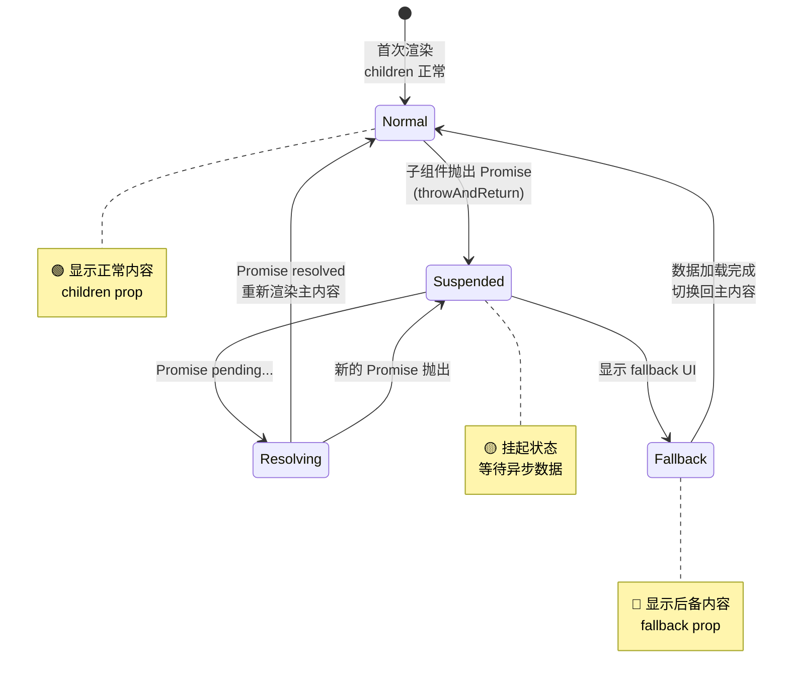

##### ASCII 结构图：Suspense 双子树结构

```
┌─────────────────────────────────────────────────────────────┐
│              Suspense 组件的双子树 Fiber 结构               │
└─────────────────────────────────────────────────────────────┘

  <Suspense fallback={<Spinner />}>
    <LazyComponent />  ← 可能抛出 Promise
  </Suspense>

  Fiber 树结构:
  
  ┌─────────────────────────┐
  │   Suspense Fiber         │
  │   tag: SuspenseComponent│
  │   flags: ShouldCapture  │
  └───────────┬─────────────┘
              │
       ┌──────┴──────┐
       ▼             ▼
  ┌─────────┐   ┌─────────────┐
  │ Primary │   │  Fallback   │
  │ Fragment│   │  Fragment   │
  │(Hidden) │   │ (Visible)   │
  ├─────────┤   ├─────────────┤
  │mode:    │   │mode:        │
  │ hidden  │   │ visible     │
  ├─────────┤   ├─────────────┤
  │child:   │   │child:       │
  │LazyComp │   │ Spinner     │
  └─────────┘   └─────────────┘
  
  ⭐ 切换机制:
  • 正常状态: Primary 可见，Fallback 隐藏
  • Suspended: Primary 隐藏，Fallback 可见
  • 通过 flags 控制哪个 Fragment 实际渲染到 DOM
```

##### 2. 逐行注释

| 步骤 | 代码 | 说明 |
|------|------|------|
| Step 1 | `nextProps.fallback` | 获取后备 UI（loading 状态） |
| Step 2 | `DidCapture` 标记检查 | 上一次渲染是否被挂起 |
| Step 3 | `createWorkInProgress` | 创建两个子 Fragment（primary + fallback） |
| `throwException` | `typeof value.then` | 检测是否为 Thenable 对象 |
| `attachPingListener` | 注册 Promise 回调 | 数据准备好时触发重新渲染 |

##### 3. 设计意图

**为什么要设计成"抛出 Promise"的模式？**

→ **声明式**：组件不需要手动管理 loading 状态，React 自动处理
→ **可组合**：多个 Suspense 边界可以嵌套，实现细粒度的 loading 控制
→ **代码简洁**：数据获取逻辑与 UI 展示解耦

**⭐ Suspense 与 Error Boundary 的关系**：
- Suspense：捕获 **Thenable**（Promise）→ 显示 fallback
- Error Boundary：捕获 **Error** → 显示 error UI

##### 4. 版本差异

- **React 16.6**: Suspense 仅用于 `React.lazy()`（代码分割）
- **React 18**: 支持**数据获取**（配合 Relay、SWR、React Query 等）

##### 5. 关联面试题

→ **Q: Suspense 和传统 loading 状态管理有什么区别？**
  A: 传统方式需要在每个组件中维护 `isLoading`、`error`、`data` 等状态；Suspense 采用声明式方式，将 loading 状态提升到边界组件统一处理，减少样板代码，并支持自动协调多个异步操作的完成时机。

---

#### 7.2 【startTransition API 源码解析】⭐⭐⭐

> **源码位置**：`packages/react/src/ReactHooks.js`, `react-reconciler/src/ReactFiberWorkLoop.js`
> **对应版本**：React 18.2.0

##### 1. 源码片段

```javascript
// ============ startTransition 入口 ============
export function startTransition(scope) {
  const prevTransition = ReactCurrentBatchConfig.transition;
  
  // ⭐ 设置当前更新为 Transition 优先级
  ReactCurrentBatchConfig.transition = {};
  
  try {
    // ⭐ 执行用户传入的函数（其中的 setState 会使用低优先级）
    scope();
  } finally {
    // ⭐ 恢复之前的 transition 状态
    ReactCurrentBatchConfig.transition = prevTransition;
  }
}

// ============ useTransition Hook ============
export function useTransition() {
  // ⭐ 返回 [isPending, startTransition]
  const [isPending, setIsPending] = useState(false);  // 是否有待处理的 Transition
  
  const start = useCallback((callback) => {
    // ⭐ 标记开始 Transition
    setIsPending(true);
    
    // ⭐ 设置当前批处理为 Transition 优先级
    ReactCurrentBatchConfig.transition = {
      _updatePriority: TransitionPriority,
    };
    
    try {
      callback();  // 执行用户的 setState 操作
    } finally {
      // ⭐ 异步重置 isPending（在 Transition 完成后）
      scheduleCallback(NormalPriority, () => {
        setIsPending(false);
      });
    }
  }, []);  // 空依赖数组
  
  return [isPending, start];
}

// ============ requestUpdateLane: 根据 context 分配优先级 ============
export function requestUpdateLane(fiber) {
  // ⭐ 检查当前是否在 Transition 中
  const transition = ReactCurrentBatchConfig.transition;
  
  if (transition !== null && transition._updatePriority !== NoLane) {
    // ⭐ 在 startTransition 中：返回 Transition Lane
    return findTransitionLane(requestUpdateLane, transition);
  }
  
  // ⭐ 检查是否有事件触发的更新
  const eventTime = getCurrentEventTime();
  if (currentEventWindoW !== NoLanes) {
    // 用户交互事件：高优先级
    return highestPriorityPendingLane(eventTime);
  }
  
  // ⭐ 默认：同步优先级
  return SyncLane;
}
```

##### Mermaid 流程图：startTransition 工作原理

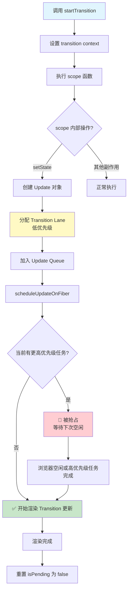

##### 2. 逐行注释

| API | 用途 | 优先级 | 使用场景 |
|-----|------|--------|---------|
| `startTransition(fn)` | 标记非紧急更新 | Transition | 搜索输入、过滤列表 |
| `useTransition()` | Hook 版本 + isPending | Transition + State | 需要显示加载指示器 |
| `useDeferredValue(value)` | 延迟非关键值更新 | Transition | 大型列表的搜索词 |

**⭐ Transition vs 普通 setState 的区别**：

| 特性 | 普通 setState | Transition setState |
|------|--------------|-------------------|
| 优先级 | Sync/UserBlocking | Transition (低) |
| 可中断 | ❌ 不可中断 | ✅ 可被高优先级抢占 |
| 使用场景 | 直接响应用户 | 非紧急 UI 更新 |
| 示例 | 点击按钮、输入文字 | 搜索过滤结果 |

##### 3. 设计意图

**为什么需要 startTransition？**

→ **用户体验**：将紧急更新（打字）和非紧急更新（搜索结果）分离
→ **保持响应**：即使计算量大，界面也不会卡顿
→ **渐进式增强**：旧代码不需要修改即可享受优化

**⭐ 典型应用场景**：

```javascript
function SearchComponent() {
  const [inputValue, setInputValue] = useState('');
  const [searchQuery, setSearchQuery] = useState('');
  const [isPending, startTransition] = useTransition();
  
  function handleChange(e) {
    // ⭐ 高优先级：立即更新输入框（不卡顿）
    setInputValue(e.target.value);
    
    // ⭐ 低优先级：延迟执行搜索（可被抢占）
    startTransition(() => {
      setSearchQuery(e.target.value);  // 触发昂贵的过滤操作
    });
  }
  
  return (
    <div>
      <input value={inputValue} onChange={handleChange} />
      {isPending && <Spinner />}
      <SearchResults query={searchQuery} />
    </div>
  );
}
```

##### 4. 版本差异

- **React 17**: 无此 API（实验性的 Concurrent Mode 不稳定）
- **React 18**: 正式引入 `startTransition` 和 `useTransition`

##### 5. 关联面试题

→ **Q: Transition 更新会被丢弃吗？**
  A: 不会。Transition 更新只是被**延迟**而不是丢弃。即使被多次抢占，最终都会执行。但如果同一个 state 在 Transition 期间又被高优先级更新，则 Transition 的 update 可能会被合并或覆盖。

---

#### 7.3 【时间切片 Time Slicing 原理】⭐⭐⭐

> **源码位置**：`packages/scheduler/src/Scheduler.js`, `react-reconciler/src/ReactFiberWorkLoop.js`
> **对应版本**：React 18.2.0

##### 1. 源码片段

```javascript
// ============ workLoopConcurrent: 并发模式的工作循环 ============
function workLoopConcurrent() {
  // ⭐ 只要还有工作要做且没有被中断，就一直执行
  while (workInProgress !== null && !shouldYield()) {
    // ⭐ 处理单个 Fiber 节点
    workInProgress = performUnitOfWork(workInProgress);
  }
}

// ============ workLoopSync: 同步模式的工作循环 ============
function workLoopSync() {
  // ⭐ 同步模式下不会检查 shouldYield()
  while (workInProgress !== null) {
    workInProgress = performUnitOfWork(workInProgress);
  }
}

// ============ shouldYield: 是否应该让出控制权 ============
function shouldYield() {
  // ⭐ 获取当前时间
  const currentTime = getCurrentTime();
  
  // ⭐ 检查是否已经用完时间片（默认 5ms）
  if (currentTime >= deadline) {
    // ⭐ 时间到了或有更高优先级任务
    if (
      needsPaint ||  // 浏览器需要绘制
      schedulerCallbackNode !== null  // 有排队的回调
    ) {
      // ⭐ 应该中断，让出主线程
      return true;
    }
    
    // ⭐ 检查是否超过连续工作时间（防止长任务阻塞）
    if (currentTime - startTime > 50) {  // 50ms 阈值
      return true;
    }
  }
  
  // ⭐ 还有时间，继续工作
  return false;
}

// ============ performUnitOfWork: 处理单个工作单元 ============
function performUnitOfWork(unitOfWork) {
  // ⭐ 当前 Fiber
  const current = unitOfWork.alternate;
  
  // ⭐ Step 1: beginWork（向下遍历）
  let next = beginWork(current, unitOfWork, renderLanes);
  
  unitOfWork.memoizedProps = unitOfWork.pendingProps;
  
  if (next === null) {
    // ⭐ 没有子节点：完成这个节点
    next = completeUnitOfWork(unitOfWork);
  }
  
  return next;
}

// ============ completeUnitOfWork: 完成 Fiber 节点 ============
function completeUnitOfWork(workInProgress) {
  do {
    const current = workInProgress.alternate;
    const returnFiber = workInProgress.return;
    
    // ⭐ Step 2: completeWork（处理 DOM 相关操作）
    if ((workInProgress.flags & Incomplete) === NoFlags) {
      let next = completeWork(current, workInProgress, renderLanes);
      // ... 处理兄弟节点
    }
    
    const siblingFiber = workInProgress.sibling;
    if (siblingFiber !== null) {
      // ⭐ 如果有兄弟节点，处理兄弟
      return siblingFiber;
    }
    
    // ⭐ 否则向上返回父节点
    workInProgress = returnFiber;
  } while (workInProgress !== null);
  
  // ⭐ 到达根节点，工作完成
  return null;
}
```

##### ASCII 示意图：时间切片工作原理

```
┌─────────────────────────────────────────────────────────────┐
│                  时间切片（Time Slicing）示意图              │
└─────────────────────────────────────────────────────────────┘

  主线程时间线:
  ━━━━━━━━━━━━━━━━━━━━━━━━━━━━━━━━━━━━━━━━━━━━━━━━━━━━━━━━▶
  
  时间切片 #1 (0-5ms):
  ┌─────────────────────────────┐
  │ workLoopConcurrent          │
  │                             │
  │  process(Fiber A) ✓         │
  │  process(Fiber B) ✓         │
  │  process(Fiber C) ✓         │
  │  process(Fiber D)...        │ ← shouldYield()=true!
  └──────────────┬──────────────┘
                 │ 让出控制权
                 ▼
  ┌─────────────────────────────┐
  │ 浏览器处理:                  │
  │ • 绘制/Paint                 │
  │ • 用户输入事件               │
  │ • 其他高优先级任务            │
  └──────────────┬──────────────┘
                 │
                 ▼
  时间切片 #2 (5-10ms):
  ┌─────────────────────────────┐
  │ workLoopConcurrent (恢复)    │
  │                             │
  │  从 Fiber D 继续...          │ ← 记住了进度！
  │  process(Fiber D) ✓         │
  │  process(Fiber E) ✓         │
  │  process(Fiber F) ✓         │
  │  ...                        │
  └─────────────────────────────┘
  
  ⭐ 关键特性:
  • 每个时间片约 5ms（可配置）
  • 在时间片结束时让出主线程
  • 下次从断点恢复（不需要从头开始）
  • 保证用户交互的流畅性（输入响应 < 100ms）
```

##### Mermaid 流程图：并发渲染的中断与恢复

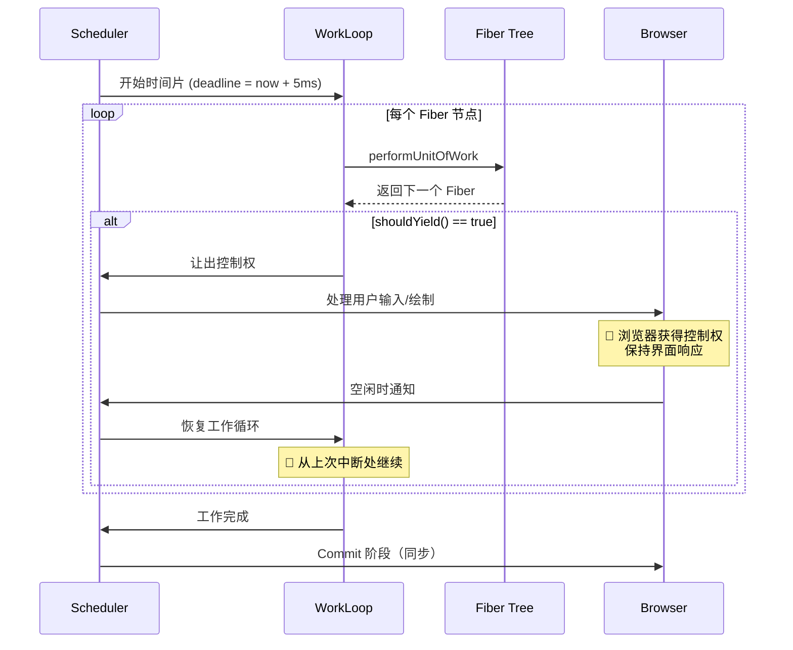

##### 2. 逐行注释

| 函数 | 作用 | 中断检查 | 模式 |
|------|------|---------|------|
| `workLoopConcurrent` | 并发模式的循环 | ✅ `shouldYield()` | Concurrent Mode |
| `workLoopSync` | 同步模式的循环 | ❌ 无 | Legacy Mode |
| `performUnitOfWork` | 处理一个 Fiber | 无（原子操作） | 共用 |
| `completeUnitOfWork` | 完成 Fiber 并向上返回 | 无 | 共用 |

##### 3. 设计意图

**为什么选择 5ms 作为时间片长度？**

→ **帧预算**：60fps 下每帧约 16ms，5ms 占用不到 1/3
→ **感知阈值**：人类对 100ms 内的延迟无明显感知
→ **经验值**：经过大量测试得出的平衡点

**⭐ 时间切片的好处**：

1. **避免阻塞**：长时间 JavaScript 执行不会冻结界面
2. **优先级调度**：高优先级任务（用户输入）可以插队
3. **平滑动画**：保证浏览器的 requestAnimationFrame 能按时执行

##### 4. 版本差异

- **React 16**: 实验性的 Concurrent Mode（不稳定）
- **React 17**: 改进调度算法，但默认仍为 Sync 模式
- **React 18**: 默认启用 Concurrent Mode（通过 `createRoot`）

##### 5. 关联面试题

→ **Q: 如何判断当前是并发模式还是同步模式？**
  A: 取决于如何创建根节点。使用 `ReactDOM.createRoot()` 启用的是**并发模式**（使用 `workLoopConcurrent`）；使用旧的 `ReactDOM.render()` 是**遗留模式**（使用 `workLoopSync`）。

---

#### 7.4 【Concurrent Mode vs Legacy Mode 对比】

> **源码位置**：`packages/react-dom/src/client/ReactDOMRoot.js`
> **对应版本**：React 18.2.0

##### 1. 源码片段

```javascript
// ============ createRoot: React 18 新 API（启用并发模式）============
export function createRoot(container, options) {
  // ⭐ 创建 Fiber Root（并发模式）
  const root = createContainer(
    container,
    ConcurrentRoot,  // ⭐ 关键：标记为并发根
    null,
    options?.hydratable ? false : true,
    options,
  );
  
  // ⭐ 创建 ReactDOMRoot 对象
  return new ReactDOMRoot(root);
}

// ============ legacyRenderSubtreeIntoContainer: 旧 API（同步模式）============
function legacyRenderSubtreeIntoContainer(
  parentComponent,
  container,
  callback,
  forceHydrate,
) {
  // ⭐ Legacy 模式：使用 LegacyRoot
  const root = createContainer(
    container,
    LegacyRoot,  // ⭐ 关键：标记为遗留根
    parentComponent,
    null,  // 不支持 hydration
    null,
  );
  
  // ⭐ 同步渲染（不可中断）
  unbatchedUpdates(() => {
    updateContainer(children, root, parentComponent, callback);
  });
  
  return getPublicRootInstance(root);
}

// ============ 两种模式的核心差异 ============
// packages/react-reconciler/src/ReactFiberWorkLoop.js

function renderRootSync(root, lanes) {
  // ⭐ 同步模式：直接执行，不检查中断
  executeRootHook(root);
  
  do {
    try {
      workLoopSync();  // ⭐ 同步循环
      break;
    } catch (thrownValue) {
      handleError(root, thrownValue);
    }
  } while (true);
  
  workInProgressRoot = null;
}

function renderRootConcurrent(root, lanes) {
  // ⭐ 并发模式：支持中断和恢复
  executeRootHook(root);
  
  do {
    try {
      // ⭐ 并发循环（会检查 shouldYield）
      workLoopConcurrent();
      break;
    } catch (thrownValue) {
      // ⭐ 可能是被 shouldYield 中断或其他错误
      handleThrow(root, thrownValue);
    }
  } while (true);
  
  // ⭐ 如果被中断，保存进度以便恢复
  if (workInProgress !== null) {
    // 工作未完成，root 仍被标记为 dirty
    workInProgressRootExitStatus = RootIncomplete;
  } else {
    workInProgressRoot = null;
  }
}
```

##### 2. 逐行注释表

| 特性 | Legacy Mode (`render`) | Concurrent Mode (`createRoot`) |
|------|----------------------|-------------------------------|
| **入口函数** | `ReactDOM.render()` | `ReactDOM.createRoot().render()` |
| **Root 类型** | `LegacyRoot` | `ConcurrentRoot` |
| **工作循环** | `workLoopSync()` | `workLoopConcurrent()` |
| **可中断性** | ❌ 不可中断 | ✅ 可中断（时间切片） |
| **优先级** | 全部同步 | 区分优先级 |
| **Automatic Batching** | 仅事件处理器内 | 所有地方（包括 setTimeout、Promise） |
| **Suspense** | 仅代码分割 | 代码分割 + 数据获取 |
| **Transitions** | ❌ 不支持 | ✅ 支持 |

##### 3. 设计意图

**为什么要保留两种模式？**

→ **向后兼容**：旧项目无需修改即可升级到 React 18
→ **渐进式迁移**：允许逐步采用新特性
→ **稳定性**：Legacy 模式经过充分测试，更稳定

**⭐ 迁移建议**：

```javascript
// ❌ 旧写法（Legacy Mode）
import { render } from 'react-dom';
render(<App />, document.getElementById('root'));

// ✅ 新写法（Concurrent Mode）
import { createRoot } from 'react-dom/client';
const root = createRoot(document.getElementById('root'));
root.render(<App />);
```

##### 4. 版本差异

- **React 17**: 只支持 Legacy Mode（`ReactDOM.render`）
- **React 18**: 引入 `createRoot`，推荐使用 Concurrent Mode

##### 5. 关联面试题

→ **Q: 升级到 React 18 后必须使用 createRoot 吗？**
  A: 不是必须的。`ReactDOM.render` 仍然可用但会被标记为废弃。建议新项目直接使用 `createRoot`，旧项目可以逐步迁移。两者的主要区别在于并发特性和 Automatic Batching。

---

### 📝 第7章要点速查

| 特性 | 说明 | 优先级 | 应用场景 |
|------|------|--------|---------|
| **Suspense** | 异步边界组件 | - | 代码分割、数据获取 |
| **startTransition** | 标记低优先级更新 | Transition | 搜索、过滤等非紧急更新 |
| **useDeferredValue** | 延迟值更新 | Transition | 大型列表的搜索词 |
| **Time Slicing** | 时间切片（~5ms） | - | 保持界面响应 |
| **Concurrent Mode** | 并发渲染模式 | 多级优先级 | 需要 best-in-class 性能 |
| **Legacy Mode** | 同步渲染模式 | 全部同步 | 向后兼容、简单场景 |

---

## 第8章 状态管理

### 📚 本章学习目标
- 深入理解 Context 的 Provider/Consumer/value 传播机制
- 掌握 useReducer 的实现及其与 useState 的关系
- 了解外部状态管理方案对比（Redux/Zustand/Jotai）
- 学会状态管理的最佳实践
- 掌握性能优化策略（避免不必要的重渲染）

---

#### 8.1 【Context 实现原理】⭐⭐

> **源码位置**：`packages/react/src/ReactContext.js`, `react-reconciler/src/ReactFiberNewContext.js`
> **对应版本**：React 18.2.0

##### 1. 源码片段

```javascript
// ============ createContext: 创建上下文 ============
export function createContext(defaultValue) {
  // ⭐ 创建 Context 对象
  const context = {
    $$typeof: REACT_CONTEXT_TYPE,  // React 内部类型标记
    _currentValue: defaultValue,   // 当前值（渲染时使用）
    _currentValue2: defaultValue,  // 当前值2（并发模式备用）
    _threadCount: 0,               // 使用此 context 的组件数量
    Provider: null,                // Provider 组件（下面赋值）
    Consumer: null,                // Consumer 组件（下面赋值）
    displayName: null,             // DevTools 显示名称
    _defaultValue: defaultValue,   // 默认值（用于比较）
    _globalName: null,
  };
  
  // ⭐ 设置 Provider（实际上是一个特殊组件）
  context.Provider = {
    $$typeof: REACT_PROVIDER_TYPE,
    _context: context,
  };
  
  // ⭐ 设置 Consumer（支持函数式子组件）
  context.Consumer = {
    $$typeof: REACT_CONTEXT_TYPE,
    _context: context,
  };
  
  // ⭐ 开发模式下的检查
  if (__DEV__) {
    // ... 添加警告逻辑
  }
  
  return context;
}

// ============ Provider 的 beginWork 处理 ============
function updateContextProvider(current, workInProgress, renderLanes) {
  const providerType = workInProgress.type;
  const context = providerType._context;  // 获取 Context 对象
  
  // ⭐ 获取新的 value（Provider 的 value prop）
  const newProps = workInProgress.pendingProps;
  const newValue = newProps.value;
  
  // ⭐ 推入 value 栈（用于嵌套 Context）
  pushProvider(workInProgress, newValue);
  
  if (current !== null) {
    // ⭐ 更新场景：比较新旧 value
    const oldValue = current.memoizedProps.value;
    
    // ⭐ 使用 Object.is 比较（与 useState 相同的算法）
    if (Object.is(oldValue, newValue)) {
      // ⭐ Value 没变：bailout（跳过子树渲染）
      if (oldValue === null || oldValue._context === undefined) {
        // ... 特殊处理 null 值
      } else {
        propagateContextChange(workInProgress, context, renderLanes);
      }
    } else {
      // ⭐ Value 变了：标记需要传播变化
      context._currentValue = newValue;
      context._currentValue2 = newValue;
      
      if (someContextHasChanged) {
        // 标记子树需要更新
        propagateContextChange(workInProgress, context, changedLanes);
      }
    }
  } else {
    // ⭐ 首次渲染
    context._currentValue = newValue;
    context._currentValue2 = newValue;
  }
  
  // ⭐ 处理 children（Consumer 组件在这里读取 value）
  const newChildren = newProps.children;
  reconcileChildren(current, workInProgress, newChildren, renderLanes);
  return workInProgress.child;
}

// ============ pushProvider: 将 value 推入栈 ============
function pushProvider(providerFiber, nextValue) {
  const context = providerFiber.type._context;
  
  // ⭐ 保存当前 value 到栈中（支持嵌套覆盖）
  if (isPrimaryRenderer) {
    context._currentValue = nextValue;
  } else {
    context._currentValue2 = nextValue;
  }
}

// ============ Consumer 的处理（useContext Hook）============
function readContext(context) {
  // ⭐ 从 Context 中读取当前 value
  const value = isPrimaryRenderer 
    ? context._currentValue 
    : context._currentValue2;
  
  // ⭐ 标记依赖关系（用于优化）
  if (lastFullyObservedContext === context) {
    // 已经观察过，不需要额外处理
  } else {
    lastContextDependency = {
      context: context,
      observedBits: observedBits,
      next: null,
    };
    
    if (lastContextWithAllBitsObserved === null) {
      if (lastContextDependency === null) {
        lastContextWithAllBitsObserved = lastContextDependency;
      } else {
        lastContextWithAllBitsObserved.next = lastContextDependency;
      }
    }
    
    // ⭐ 链接到当前 Fiber 的 dependencies 列表
    currentlyRenderingFiber.dependencies =
      lastContextDependency = {
        lane: lane,
        firstContext: lastContextWithAllBitsObserved,
        responders: null,
      };
  }
  
  return value;
}
```

##### Mermaid 数据流图：Context 数据传播机制

```mermaid
flowchart TD
    subgraph Provider["🔵 Provider 层"]
        A[<App><br/>value={theme: 'dark'}]
    end
    
    subgraph Consumers["🟢 Consumer 组件"]
        B[Header<br/>useContext(ThemeContext)<br/>→ 'dark']
        C[Sidebar<br/>useContext(ThemeContext)<br/>→ 'dark']
        D[Content<br/>useContext(ThemeContext)<br/>→ 'dark']
    end
    
    subgraph Nested["🟡 嵌套 Provider"]
        E[<Section><br/>value={theme: 'light'}]
        F[ChildComponent<br/>useContext(ThemeContext)<br/>→ 'light' ← 被覆盖！]
    end
    
    A --> B
    A --> C
    A --> D
    C --> E
    E --> F
    
    style A fill:#e3f2fd
    style E fill:#fff9c4
    style F fill:#ffe0b2
```

##### ASCII 结构图：Context 值栈结构

```
┌─────────────────────────────────────────────────────────────┐
│              Context 的值栈（支持嵌套覆盖）                  │
└─────────────────────────────────────────────────────────────┘

  <ThemeProvider value="dark">          ← Level 0: _currentValue = "dark"
    <Header />                          ← useContext() → "dark"
    <Sidebar />
    <Main>
      <ThemeProvider value="light">     ← Level 1: _currentValue = "light" (覆盖!)
        <Section />                      ← useContext() → "light"
        <Card />
      </ThemeProvider>                   ← 弹出: _currentValue = "dark" (恢复)
      <Footer />                        ← useContext() → "dark"
    </Main>
  </ThemeProvider>

  执行流程:
  ┌──────────────────────────────────────┐
  │ 进入外层 Provider                    │
  │ _currentValue = "dark"              │
  ├──────────────────────────────────────┤
  │ Header/Sidebar/Main 读取            │
  │ → 返回 "dark"                       │
  ├──────────────────────────────────────┤
  │ 进入内层 Provider                   │
  │ _currentValue = "light" (压栈)      │
  ├──────────────────────────────────────┤
  │ Section/Card 读取                   │
  │ → 返回 "light"                      │
  ├──────────────────────────────────────┤
  │ 离开内层 Provider                   │
  │ _currentValue = "dark" (弹栈恢复)   │
  ├──────────────────────────────────────┤
  │ Footer 读取                         │
  │ → 返回 "dark"                       │
  └──────────────────────────────────────┘
```

##### 2. 逐行注释

| 方法 | 作用 | 关键点 |
|------|------|--------|
| `createContext` | 创建 Context 对象 | 包含 `_currentValue` 和 Provider/Consumer |
| `updateContextProvider` | 处理 Provider 渲染 | 比较新旧 value，决定是否触发更新 |
| `pushProvider` | 推入值到栈 | 支持嵌套覆盖 |
| `readContext` / `useContext` | 读取当前值 | 建立依赖关系，用于优化 |
| `propagateContextChange` | 传播变化给消费者 | 只更新依赖该 Context 的组件 |

##### 3. 设计意图

**为什么 Context 使用栈结构而不是简单的全局变量？**

→ **嵌套支持**：允许内层 Provider 覆盖外层的值
→ **自动清理**：离开作用域时自动恢复之前的值
→ **性能优化**：只通知实际依赖该 Context 的组件重新渲染

**⭐ Context 性能陷阱**：

```javascript
// ❌ 问题：每次渲染都创建新的对象导致不必要的重渲染
<MyContext.Provider value={{ theme: 'dark', user }}>
  <ExpensiveTree />
</MyContext.Provider>

// ✅ 解决方案 1: useMemo 缓存 value
const value = useMemo(() => ({ theme, user }), [theme, user]);
<MyContext.Provider value={value}>
  <ExpensiveTree />
</MyContext.Provider>

// ✅ 解决方案 2: 拆分为多个 Context
<ThemeContext.Provider value={theme}>
  <UserContext.Provider value={user}>
    <ExpensiveTree />
  </UserContext.Provider>
</ThemeContext.Provider>
```

##### 4. 版本差异

- **React 16.3**: Context API 首次引入（替代废弃的 legacy context）
- **React 16.6**: 引入 `useContext` Hook（简化消费方式）
- **React 18**: 改进并发模式下的 Context 更新机制

##### 5. 关联面试题

→ **Q: Context 会导致所有消费者都重新渲染吗？**
  A: 不一定。只有当 **value 引用发生变化**时（`Object.is` 检测），且子组件确实使用了 `useContext` 或 `<Context.Consumer>` 时才会触发重渲染。可以通过拆分 Context、memoization 等方式避免不必要的渲染。

---

#### 8.2 【useReducer 实现及与 useState 的关系】

> **源码位置**：`packages/react-reconciler/src/ReactFiberHooks.js`
> **对应版本**：React 18.2.0

##### 1. 源码片段

```javascript
// ============ useReducer 入口 ============
function useReducer(reducer, initialArg, init) {
  const dispatcher = resolveDispatcher();
  return dispatcher.useReducer(reducer, initialArg, init);
}

// ============ mountReducer: 首次渲染 ============
function mountReducer(reducer, initialArg, init) {
  // ⭐ Step 1: 创建 Hook
  const hook = mountWorkInProgressHook();
  
  // ⭐ Step 2: 计算初始状态
  let initialState;
  if (init !== undefined) {
    // ⭐ 支持惰性初始化函数
    initialState = init(initialArg);
  } else {
    initialState = initialArg;
  }
  
  // ⭐ Step 3: 初始化 Hook 状态
  hook.memoizedState = initialState;
  hook.baseState = initialState;
  
  // ⭐ Step 4: 创建 Update Queue（与 useState 相同的结构）
  const queue = {
    pending: null,
    interleaved: null,
    lanes: NoLanes,
    dispatch: null,
    lastRenderedReducer: reducer,  // ⭐ 区别：存储用户传入的 reducer
    lastRenderedState: initialState,
  };
  hook.queue = queue;
  
  // ⭐ Step 5: 绑定 dispatch 函数
  const dispatch = queue.dispatch = dispatchReducerAction.bind(
    null,
    currentlyRenderingFiber,
    queue,
  );
  
  return [hook.memoizedState, dispatch];
}

// ============ updateReducer: 更新渲染 ⭐⭐⭐ ============
function updateReducer(reducer, initialArg, init) {
  // ⭐ Step 1: 获取当前 Hook
  const hook = updateWorkInProgressHook();
  
  // ⭐ Step 2: 获取队列
  const queue = hook.queue;
  
  // ⭐ Step 3: 合并所有 pending updates（核心算法！）
  const baseQueue = queue.lastRenderedState;
  const pendingQueue = queue.pending;
  
  let newState = hook.baseState;  // 基础状态
  
  if (pendingQueue !== null) {
    // ⭐ 有待处理的 updates
    let first = pendingQueue.next;
    let update = first;
    
    do {
      // ⭐ 根据 lane 优先级决定是否应用这个 update
      const updateLane = update.lane;
      const isEvenHigherPriority = ...;
      
      if (isEvenHigherPriority) {
        // ⭐ 高优先级更新：立即应用
        const action = update.action;
        
        if (reducer === basicStateReducer) {
          // ⭐ useState 的 reducer：直接返回 action
          newState = typeof action === 'function' ? action(newState) : action;
        } else {
          // ⭐ useReducer 的 reducer：调用用户传入的 reducer
          newState = reducer(newState, action);
        }
      } else {
        // ⭐ 低优先级更新：跳过（保留在队列中下次处理）
        // 这是 Concurrent Mode 的关键特性！
      }
      
      update = update.next;
    } while (update !== null && update !== first);
  }
  
  // ⭐ Step 4: 更新 Hook 状态
  hook.memoizedState = newState;
  queue.lastRenderedState = newState;
  
  return [newState, dispatch];
}

// ============ dispatchReducerAction: dispatch 的实现 ============
function dispatchReducerAction(fiber, queue, action) {
  // ⭐ 与 setState 类似，但 action 是直接传给 reducer
  const update = {
    lane,
    action,           // 直接传递，不经过 basicStateReducer
    hasEagerState: false,
    eagerState: null,
    next: null,
  };
  
  // ⭐ 加入队列（循环链表插入 - 与 useState 相同）
  const pending = queue.pending;
  if (pending === null) {
    update.next = update;  // 第一个 update
  } else {
    update.next = pending.next;
    pending.next = update;
  }
  queue.pending = update;
  
  // ⭐ 调度更新
  scheduleUpdateOnFiber(fiber, lane, eventTime);
}
```

##### 2. 逐行注释表

| 特性 | useState | useReducer |
|------|----------|------------|
| **初始化** | `useState(initialValue)` | `useReducer(reducer, initialValue)` |
| **更新函数** | `setState(newValue)` | `dispatch({ type: 'ACTION' })` |
| **内部 Reducer** | `basicStateReducer`（直接返回） | 用户自定义 reducer |
| **适用场景** | 简单状态（原始值/对象） | 复杂状态逻辑（多个子字段） |
| **状态合并** | 替换或函数式更新 | 通过 reducer 合并 |
| **本质关系** | `useState` ≈ `useReducer(basicStateReducer)` | 完整版的状态管理 |

**⭐ useState 就是 useReducer 的语法糖**：

```javascript
// useState 内部实现：
function useState(initialState) {
  return useReducer(basicStateReducer, initialState);
  // basicStateReducer: (state, action) => typeof action === 'function' ? action(state) : action
}
```

##### 3. 设计意图

**什么时候应该用 useReducer？**

→ **复杂状态逻辑**：当下一个 state 依赖于前一个 state 的多个字段时
→ **多个子值**：当状态包含多个子值需要一起更新时
→ **可预测性**：需要明确的状态转换规则（类似 Redux 的 reducer）

**典型示例**：

```javascript
// ✅ 适合 useReducer 的场景：复杂的表单状态
const [state, dispatch] = useReducer(formReducer, {
  username: '',
  email: '',
  password: '',
  errors: {},
  isSubmitting: false,
});

function formReducer(state, action) {
  switch (action.type) {
    case 'FIELD_CHANGE':
      return { ...state, [action.field]: action.value };
    case 'SUBMIT_START':
      return { ...state, isSubmitting: true, errors: {} };
    case 'SUBMIT_SUCCESS':
      return { ...state, isSubmitting: false };
    case 'SUBMIT_ERROR':
      return { ...state, isSubmitting: false, errors: action.errors };
    default:
      return state;
  }
}
```

##### 4. 版本差异

- **React 16.8**: Hooks 引入，包含 useState 和 useReducer
- **React 17/18**: 内部实现基本一致，增加了并发模式下的优先级队列处理

##### 5. 关联面试题

→ **Q: useState 和 useReducer 在性能上有区别吗？**
  A: 底层实现几乎相同（useState 本质就是简化版的 useReducer）。性能差异主要取决于使用场景：如果状态更新逻辑复杂，useReducer 可以通过集中管理减少不必要的重渲染；对于简单状态，useState 更简洁。

---

#### 8.3 【外部状态管理方案对比】

> **源码位置**：第三方库（Redux/Zustand/Jotai）
> **对应版本**：各库最新版本

##### 1. 方案对比表格

| 特性 | Redux | Zustand | Jotai | Recoil |
|------|-------|---------|-------|--------|
| **核心理念** | 单一 Store + Action | 单一 Store | 原子化 State | 原子化 State |
| **Bundle Size** | ~7KB (gzip) | ~200B (gzip) | ~3KB (gzip) | ~20KB+ |
| **Boilerplate** | 多（Action/Reducer/Store） | 少 | 极少 | 中等 |
| **DevTools** | ✅ 优秀 | ✅ 支持 | ✅ 支持 | ✅ 优秀 |
| **学习曲线** | 陡峭 | 平缓 | 平缓 | 中等 |
| **并发安全** | 需要配置 | ✅ 原生支持 | ✅ 原生支持 | 部分 |
| **TypeScript** | ✅ 良好 | ✅ 优秀 | ✅ 优秀 | ✅ 良好 |
| **适用场景** | 大型企业应用 | 中小型项目 | 细粒度状态 | 大型应用 |

##### 2. 各方案代码对比

```javascript
// ========== Redux Toolkit 示例 ==========
import { createSlice, configureStore } from '@reduxjs/toolkit';

const counterSlice = createSlice({
  name: 'counter',
  initialState: { value: 0 },
  reducers: {
    increment: (state) => { state.value += 1; },  // Immer 支持
    decrement: (state) => { state.value -= 1; },
  },
});

export const { increment, decrement } = counterSlice.actions;
export const store = configureStore({ reducer: counterSlice.reducer });

// 组件中使用:
function Counter() {
  const count = useSelector((state) => state.value);
  const dispatch = useDispatch();
  return (
    <button onClick={() => dispatch(increment())}>{count}</button>
  );
}


// ========== Zustand 示例（极简！）============
import { create } from 'zustand';

const useCounterStore = create((set) => ({
  count: 0,
  increment: () => set((state) => ({ count: state.count + 1 })),
  decrement: () => set((state) => ({ count: state.count - 1 })),
}));

// 组件中使用:
function Counter() {
  const { count, increment } = useCounterStore();
  return <button onClick={increment}>{count}</button>;
}


// ========== Jotai 示例（原子化）============
import { atom, useAtom } from 'jotai';

// 定义原子
const countAtom = atom(0);

// 组件中使用:
function Counter() {
  const [count, setCount] = useAtom(countAtom);
  return <button onClick={() => setCount(c => c + 1)}>{count}</button>;
}

// 派生原子（computed）
const doubleCountAtom = atom((get) => get(countAtom) * 2);
```

##### 3. 设计意图分析

**为什么会出现这么多状态管理方案？**

→ **不同规模需求**：小项目不需要 Redux 的复杂性
→ **性能考量**：细粒度更新 vs 全局替换
→ **开发体验**：减少样板代码，提升开发效率
→ **技术演进**：Hooks、Proxy、Immer 等新技术的出现

**⭐ 选择建议**：

| 项目规模 | 推荐方案 | 原因 |
|---------|---------|------|
| 小型/原型 | React 内置 (useState/Context) | 无需额外依赖 |
| 中型项目 | Zustand | 极简、高性能、TS 友好 |
| 大型企业应用 | Redux Toolkit | 成熟生态、DevTools、中间件 |
| 高性能需求 | Jotai/Recoil | 细粒度更新、最小化重渲染 |

##### 4. 关联面试题

→ **Q: 什么时候需要引入外部状态管理库？**
  A: 当满足以下条件之一时考虑引入：(1) 状态需要在多个不相关的组件间共享；(2) 状态更新逻辑复杂，需要集中管理；(3) 需要时间旅行调试（DevTools）；(4) 需要中间件支持（日志、持久化等）。简单应用使用 React 内置的 useState + Context 即可。

---

#### 8.4 【状态管理最佳实践与性能优化】

> **源码位置**：综合实践（无特定源码文件）
> **对应版本**：React 18.2.0

##### 1. 性能优化策略

```javascript
// ========== 策略 1: 使用 React.memo 避免不必要的重渲染 ==========
const ExpensiveComponent = React.memo(function ExpensiveComponent({ data }) {
  return <div>{/* 昂贵的渲染 */}</div>;
}, (prevProps, nextProps) => {
  // 自定义比较函数（可选）
  return prevProps.data.id === nextProps.data.id;
});


// ========== 策略 2: useCallback/useMemo 稳定引用 ==========
function ParentComponent({ items }) {
  // ⭐ 缓存回调函数
  const handleClick = useCallback((id) => {
    console.log('Clicked:', id);
  }, []);  // 空依赖 = 永远不会改变
  
  // ⭐ 缓存计算结果
  const sortedItems = useMemo(
    () => [...items].sort((a, b) => a.value - b.value),
    [items]
  );
  
  return items.map(item => (
    <ChildComponent key={item.id} item={item} onClick={handleClick} />
  ));
}


// ========== 策略 3: 状态提升 vs 状态下放 ==========
// ❌ 错误：将不必要的状态放在高层级
function App() {
  const [formValues, setFormValues] = useState({});
  const [isDropdownOpen, setIsDropdownOpen] = useState(false);  // ← 应该下放!
  
  return (
    <>
      <Form values={formValues} onChange={setFormValues} />
      <Dropdown isOpen={isDropdownOpen} onToggle={setIsDropdownOpen} />
    </>
  );
}

// ✅ 正确：将局部状态下放到需要的组件
function Dropdown() {
  const [isOpen, setIsOpen] = useState(false);  // ← 局部状态
  return <div>{isOpen && <DropdownContent onClose={() => setIsDown(false)} /></div>;
}


// ========== 策略 4: Context 分割 ==========
// ❌ 问题：单一 Context 导致任何值变化都触发所有消费者重渲染
const AppContext = createContext({
  theme: 'light',
  user: null,
  locale: 'zh-CN',
  settings: {},
});

// ✅ 解决：按关注点分割 Context
const ThemeContext = createContext('light');
const UserContext = createContext(null);
const LocaleContext = createContext('zh-CN');
```

##### 2. 常见性能陷阱及解决方案

| 陷阱 | 问题 | 解决方案 |
|------|------|---------|
| **内联函数** | 每次 render 创建新引用 | `useCallback` 或提取到外部 |
| **内联对象** | 导致 props 浅比较失败 | `useMemo` 或类组件 |
| **大列表渲染** | 所有项同时渲染 | 虚拟滚动（react-window）|
| **深层嵌套** | Context 更新波及范围广 | Context 分割 + memo |
| **频繁 setState** | 触发大量重渲染 | 批处理、防抖、节流 |

##### 3. 设计意图

**为什么 React 默认会在父组件更新时重渲染所有子组件？**

→ **默认安全**：假设 props 可能已经变化，确保 UI 一致性
→ **简单模型**：开发者不需要手动管理依赖关系
→ **可优化**：提供 `React.memo`、`useMemo`、`useCallback` 等工具进行精细化控制

**⭐ 性能优化的黄金法则**：

> **不要过早优化！先测量，再优化。**
> 
> 1. 使用 React DevTools Profiler 定位瓶颈
> 2. 识别不必要的重渲染
> 3. 应用适当的优化策略
> 4. 再次测量验证效果

##### 4. 关联面试题

→ **Q: 如何诊断 React 应用的性能问题？**
  A: (1) 使用 React DevTools Profiler 记录并分析渲染次数和耗时；(2) 检查哪些组件有不必要的重渲染（高亮显示）；(3) 使用 Chrome Performance Tab 分析 JavaScript 执行时间；(4) 检查是否有大型列表需要虚拟化；(5) 使用 React.StrictMode 开发模式下检测副作用问题。

---

### 📝 第8章要点速查

| 技术 | 适用场景 | 优点 | 注意事项 |
|------|---------|------|---------|
| **useState** | 简单本地状态 | 简洁、内置 | 不适合跨组件共享 |
| **useReducer** | 复杂状态逻辑 | 可预测、可调试 | 有一定样板代码 |
| **Context** | 轻量级全局状态 | 内置、无需安装 | 可能导致不必要的重渲染 |
| **Zustand** | 中型项目 | 极简、高性能 | 生态较小 |
| **Redux Toolkit** | 大型企业应用 | 成熟、强大 | 学习曲线陡峭 |
| **Jotai** | 细粒度状态 | 最小化重渲染 | 需要理解原子概念 |

---

## 第9章 事件系统

### 📚 本章学习目标
- 深入理解合成事件（SyntheticEvent）原理
- 掌握事件委托到 root 节点的实现机制
- 了解优先级事件分类系统
- 理解事件池复用机制及其版本差异
- 掌握合成事件与原生事件的异同

---

#### 9.1 【合成事件 SyntheticEvent 原理】⭐⭐

> **源码位置**：`packages/react-dom/src/events/SyntheticEvent.js`
> **对应版本**：React 18.2.0

##### 1. 源码片段

```javascript
// ============ SyntheticEvent: 合成事件基类 ============
class SyntheticEvent {
  // ⭐ 构造函数
  constructor(
    interfaceName,
    {
      dispatchConfig,
      targetInst,        // 目标 Fiber 实例
      nativeEvent,       // 原生 DOM 事件
      instance: handle,  // 处理函数
    }
  ) {
    this.dispatchConfig = dispatchConfig;
    this._targetInst = targetInst;
    this.nativeEvent = nativeEvent;
    
    // ⭐ 合成事件的接口类型
    this.interfaceName = interfaceName;
    
    // ⭐ 从原生事件中提取常用属性（统一跨浏览器）
    this.target = nativeEvent.target || nativeEvent.srcElement;   // 事件目标
    this.currentTarget = null;                                     // 当前处理节点
    this.relatedTarget = nativeEvent.relatedTarget;                // 相关目标
    
    // ⭐ 鼠标/触摸事件属性
    this.clientX = nativeEvent.clientX;
    this.clientY = nativeEvent.clientY;
    this.pageX = nativeEvent.pageX;
    this.pageY = nativeEvent.pageY;
    
    // ⭐ 键盘事件属性
    this.key = nativeEvent.key;
    this.keyCode = nativeEvent.keyCode;
    this.charCode = nativeEvent.charCode;
    
    // ⭐ 事件方法（委托给原生事件）
    this.preventDefault = function() {
      // ⭐ 调用原生 preventDefault
      const event = this.nativeEvent;
      if (event.preventDefault) {
        event.preventDefault();
      } else if (typeof event.returnValue !== 'unknown') {
        event.returnValue = false;  // IE 兼容
      }
      this.defaultPrevented = true;
    };
    
    this.stopPropagation = function() {
      // ⭐ 调用原生 stopPropagation
      const event = this.nativeEvent;
      if (event.stopPropagation) {
        event.stopPropagation();
      } else if (typeof event.cancelBubble !== 'unknown') {
        event.cancelBubble = true;  // IE 兼容
      }
      this.isPropagationStopped = returnTrue;
    };
    
    // ⭐ 标记此事件是否被持久化（React 17+）
    this.isPersistent = function() { return true; };
  }
  
  // ⭐ 阻止事件冒泡的标记函数
  isPropagationStopped() { return false; }
  
  // ⭐ 持久化事件（防止回收）
  persist() {
    // React 17+: 不再需要手动调用（自动持久化）
    this.isPersistent = returnTrue;
  }
  
  // ⭐ 销毁事件（释放回池中）- React 16 使用
  destructor() {
    const Interface = this.constructor.Interface;
    for (const propName in Interface) {
      // 重置所有属性为 null，便于复用
      Object.defineProperty(this, propName, {
        value: null,
        configurable: true,
      });
    }
    Object.freeze(this);
  }
}

// ============ 事件注册映射表 ============
const topLevelEventsToDispatchConfig = new Map();

// ⭐ 注册顶层事件
function registerDirectEvent(
  registrationName,     // 如 'onClick'
  reactName,            // 如 'click'
) {
  const dispatchConfig = registrationNameDependencies[registrationName];
  
  // ⭐ 建立映射：原生事件名 → 配置
  // 例如: 'click' → { phasedRegistrationNames: { bubbled: 'onClick', captured: 'onClickCapture' } }
  topLevelEventsToDispatchConfig.set(reactName, dispatchConfig);
}

// ⭐ 常见的事件映射
registerDirectEvent('onClick', 'click');
registerDirectEvent('onChange', 'change');
registerDirectEvent('onInput', 'input');
registerDirectEvent('onKeyDown', 'keydown');
// ... 更多事件
```

##### ASCII 结构图：SyntheticEvent 结构

```
┌─────────────────────────────────────────────────────────────┐
│              SyntheticEvent 对象结构                         │
└─────────────────────────────────────────────────────────────┘

  原生 Event (浏览器特定)
  ┌─────────────────────────┐
  │ MouseEvent / KeyboardEvent / ... │
  │ • target                    │
  │ • currentTarget             │
  │ • preventDefault()          │ ← 浏览器实现差异大！
  │ • stopPropagation()         │
  └──────────────┬──────────────┘
                 │ 包装 (Wrapper)
                 ▼
  合成事件 SyntheticEvent (React 统一)
  ┌─────────────────────────┐
  │ interfaceName: 'MouseEvent'│
  ├─────────────────────────┤
  │ 统一属性:                  │
  │ • target (标准化)          │
  │ • currentTarget           │
  │ • clientX/Y               │
  │ • pageX/Y                 │
  │ • key / keyCode           │
  ├─────────────────────────┤
  │ 统一方法:                  │
  │ • preventDefault()        │ ← 跨浏览器兼容
  │ • stopPropagation()       │
  │ • persist()               │
  ├─────────────────────────┤
  │ 内部引用:                  │
  │ • nativeEvent → 原生事件  │
  │ • _targetInst → Fiber    │
  │ • dispatchConfig         │
  └─────────────────────────┘
  
  ⭐ 优势:
  • 跨浏览器一致性（IE/Chrome/Firefox/Safari 行为统一）
  • 统一的 API 接口
  • 性能优化（事件池复用 - React 16）
```

##### 2. 逐行注释

| 属性/方法 | 类型 | 说明 | 兼容性 |
|----------|------|------|--------|
| `target` | 属性 | 事件触发源（最内层元素） | ✅ 标准化 |
| `currentTarget` | 属性 | 当前处理事件的元素 | ✅ 标准化 |
| `preventDefault()` | 方法 | 阻止默认行为 | ✅ 跨浏览器 |
| `stopPropagation()` | 方法 | 阻止事件冒泡 | ✅ 跨浏览器 |
| `nativeEvent` | 属性 | 原生事件引用 | 用于调试 |
| `persist()` | 方法 | 持久化事件（防回收） | React 16 必须调用 |

##### 3. 设计意图

**为什么要使用合成事件而不是直接使用原生事件？**

→ **跨浏览器兼容**：统一不同浏览器的行为差异（如 IE 的 returnValue vs preventDefault）
→ **性能优化**：事件委托减少监听器数量（从 N 个减到 1 个）
→ **抽象层**：提供统一的 API，隐藏底层实现细节
→ **扩展能力**：可以添加额外功能（如优先级、事件插件系统）

**⭐ 合成事件的生命周期（React 16）**：

```
创建 → 分发到处理器 → 处理完成 → 回收到池中（属性置空）
                                              ↑
如果异步访问 → ❌ 报错 "This synthetic event is reused" 
解决方案: event.persist()
```

##### 4. 版本差异

- **React 16 及之前**: 使用**事件池**机制，合成事件会被回收复用。异步访问需要调用 `event.persist()`
- **React 17**: 移除事件池，每个事件都是新对象，不需要 `persist()`。但仍然创建 SyntheticEvent 以保持 API 一致性
- **React 18**: 与 React 17 保持一致，进一步优化性能

##### 5. 关联面试题

→ **Q: 合成事件和原生事件有什么区别？什么时候需要用到原生事件？**
  A: 区别：(1) 合成事件统一了跨浏览器行为；(2) 合成事件采用事件委托，绑定在 root 节点而非具体元素；(3) 合成事件的 `stopPropagation()` 只阻止合成事件传播，不阻止原生事件。需要使用原生事件的情况：与第三方库集成、需要访问浏览器特有 API、性能敏感场景。

---

#### 9.2 【事件委托机制】⭐⭐⭐

> **源码位置**：`packages/react-dom/src/events/ReactDOMEventListener.js`
> **对应版本**：React 18.2.0

##### 1. 源码片段

```javascript
// ============ 事件委托的核心实现 ============
function trapBubbledEvent(
  topLevelType,     // 顶层事件类型（如 'click'）
  element,          // 要绑定的容器元素（root 节点）
) {
  // ⭐ 如果还没有注册过这个事件
  if (!listenerSet.has(topLevelType)) {
    // ⭐ 在 root 节点上添加事件监听器（只添加一次！）
    listenerSet.add(topLevelType);
    
    // ⭐ 使用 addEventListener 绑定到 container
    // 注意：这里只绑定了一个监听器，不管应用有多少个 onClick！
    element.addEventListener(
      topLevelType.toLowerCase(),  // 如 'click'
      dispatchEvent,                // 统一分发函数
      false,                        // 冒泡阶段捕获
    );
  }
}

// ============ dispatchEvent: 事件分发核心 ⭐⭐⭐ ============
function dispatchEvent(domEventName, eventSystemFlags, targetContainer, nativeEvent) {
  // ⭐ Step 1: 找到事件触发的目标 Fiber
  const targetInst = getInstanceFromNode(nativeEvent.target || nativeEvent.srcElement);
  
  // ⭐ Step 2: 创建合成事件
  const event = new SyntheticEvent(
    domEventName,
    {
      dispatchConfig,
      targetInst,
      nativeEvent,
    }
  );
  
  // ⭐ Step 3: 两阶段遍历（捕获 + 冒泡）
  
  // === 阶段 1: 捕获阶段（从外向内）===
  const captured = twoPhaseEventType ? traverseTwoPhase(targetInst, ... ) : null;
  
  // === 阶段 2: 冒泡阶段（从内向外）===
  const bubbled = traverseTwoPhase(targetInst, ... );
  
  // ⭐ Step 4: 根据 React 的事件名称找到对应的 handler
  // 例如: 原生 'click' → 寻找 fiber 上的 'onClick' prop
  
  // ⭐ Step 5: 执行事件处理器
  if (handler !== null) {
    invokeGuardedCallback(null, onClickHandler, event);  // 安全执行（有错误边界保护）
  }
}

// ============ traverseTwoPhase: 两阶段遍历 ============
function traverseTwoPhase(inst, fn, arg) {
  const path = [];
  
  // ⭐ 从目标节点向上收集路径（到根节点）
  while (inst !== null) {
    path.push(inst);
    inst = inst.return;  // 向上遍历 Fiber 树
  }
  
  let i;
  
  // ⭐ 阶段 1: 捕捉阶段（从根到目标，即 path 反向）
  for (i = path.length; i-- > 0; ) {
    fn(path[i], 'captured', arg);
  }
  
  // ⭐ 阶段 2: 冒泡阶段（从目标到根，即 path 正向）
  for (i = 0; i < path.length; i++) {
    fn(path[i], 'bubbled', arg);
  }
}
```

##### Mermaid 示意图：事件委托流程

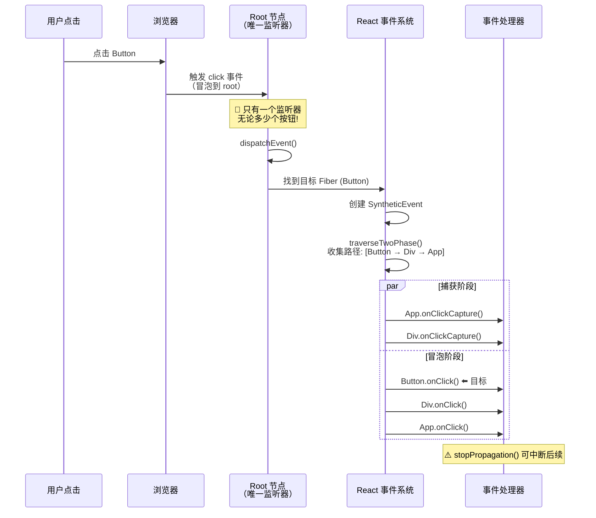

##### ASCII 结构图：事件委托架构

```
┌─────────────────────────────────────────────────────────────┐
│                  React 事件委托架构图                       │
└─────────────────────────────────────────────────────────────┘

  传统方式（无委托）:
  ┌─────────────────────────────────────────────┐
  │ <div id="root">                             │
  │   <button onclick="fn1">按钮1</button>  ← 监听器 #1
  │   <button onclick="fn2">按钮2</button>  ← 监听器 #2
  │   <button onclick="fn3">按钮3</button>  ← 监听器 #3
  │   ...                                      │
  │   <button onclick="fn100">按钮100</button>← 监听器 #100
  │ </div>                                      │
  │                                             │
  │ 问题: 100个按钮 = 100个监听器!              │
  └─────────────────────────────────────────────┘


  React 方式（事件委托）:
  ┌─────────────────────────────────────────────┐
  │ <div id="root">  ← ⭐ 只有1个监听器!        │
  │   <button onClick={fn1}>按钮1</button>      │
  │   <button onClick={fn2}>按钮2</button>      │
  │   <button onClick={fn3}>按钮3</button>      │
  │   ...                                        │
  │   <button onClick={fn100}>按钮100</button>  │
  │ </div>                                       │
  │                                             │
  │ 优势: 无论多少元素, 只有1个监听器!          │
  └─────────────────────────────────────────────┘
  
  工作原理:
  用户点击 按钮2
       ↓
  浏览器: click 事件冒泡到 #root
       ↓
  React dispatchEvent():
  1. e.target → 按钮2 的 DOM 节点
  2. getInstanceFromNode() → 按钮2 的 Fiber
  3. 遍历 Fiber 向上: 按钮2 → ... → root
  4. 检查每个 Fiber 是否有 onClick prop
  5. 找到按钮2 的 onClick → 执行 fn2(e)
```

##### 2. 逐行注释

| 步骤 | 函数 | 作用 | 关键点 |
|------|------|------|--------|
| Step 1 | `trapBubbledEvent` | 在 root 注册唯一监听器 | 使用 Set 去重 |
| Step 2 | `dispatchEvent` | 统一分发入口 | 创建 SyntheticEvent |
| Step 3 | `traverseTwoPhase` | 收集并遍历 Fiber 路径 | 模拟捕获/冒泡 |
| Step 4 | 查找 handler | 匹配 React 事件名 | onClick/onKeyDown 等 |
| Step 5 | `invokeGuardedCallback` | 安全执行处理器 | 错误边界保护 |

##### 3. 设计意图

**为什么选择在 root 节点委托而不是 document？**

→ **多根节点支持**：React 18 支持多个应用共存（Portal 等）
→ **更好的隔离**：不同应用的互不干扰
→ **与现代框架对齐**：Vue 3 等也采用类似策略
→ **避免冲突**：减少与其他库（jQuery 等）的事件监听冲突

**⭐ React 16 vs 17/18 事件绑定位置变化**：

| 版本 | 事件绑定位置 | 影响 |
|------|------------|------|
| React 16 | `document` | 可能与其他库冲突 |
| React 17/18 | `root` 容器 | 更好的隔离，支持微前端 |

##### 4. 版本差异

- **React 16**: 事件委托到 `document`；使用事件池
- **React 17**: 事件委托改为 `root` 节点；移除事件池；不再需要在异步回调中调用 `event.persist()`
- **React 18**: 与 React 17 保持一致，优化并发模式下的事件处理

##### 5. 关联面试题

→ **Q: 如何阻止合成事件冒泡但不阻止原生事件冒泡？**
  A: 使用 `e.stopPropagation()` 只会阻止合成事件继续传播，但原生事件仍会继续冒泡。如果要同时阻止两者，可以使用 `e.nativeEvent.stopImmediatePropagation()` 或者在原生事件监听器中使用 `e.stopPropagation()`。

---

#### 9.3 【优先级事件分类系统】

> **源码位置**：`packages/react-dom/src/events/DOMEventProperties.js`, `SchedulerPriorities.js`
> **对应版本**：React 18.2.0

##### 1. 源码片段

```javascript
// ============ 事件优先级分类 ============
// packages/react-dom/src/events/DOMEventProperties.js

// ⭐ 离散事件（Discrete Events）：用户直接交互，需要立即响应
const discreteEvents = [
  'click',
  'dblclick',
  'keydown',
  'keyup',
  'input',
  // ... 用户输入类事件
];

// ⭐ 用户阻塞事件（User Blocking Events）：可能阻塞用户交互
const userBlockingEvents = [
  'drag',
  'mousemove',
  'touchmove',
  'scroll',
  'wheel',
  // ... 连续性交互事件
];

// ⭐ 连续事件（Continuous Events）：高频率，可节流
const continuousEvents = [
  'mousemove',
  'pointermove',
  'touchmove',
  // ... 高频事件
];

// ============ 事件优先级映射 ============
export function getEventPriority(domEventName) {
  switch (domEventName) {
    // ⭐ 离散事件：最高优先级（同步更新）
    case 'click':
    case 'keydown':
    case 'input':
      return DiscreteEventPriority;  // ≈ SyncLane
      
    // ⭐ 用户阻塞事件：中等优先级
    case 'scroll':
    case 'touchstart':
      return ContinuousEventPriority;  // ≈ InputContinuousLane
      
    // ⭐ 其他事件：默认优先级
    default:
      return DefaultEventPriority;  // ≈ DefaultLane
  }
}

// ============ 根据事件优先级创建更新 ============
function dispatchDiscreteEvent(
  domEventName,
  eventSystemFlags,
  container,
  nativeEvent,
) {
  // ⭐ 如果是离散事件（如 click），使用最高优先级的批处理
  // 这保证了用户交互立即得到反馈
  flushSync(() => {
    dispatchEvent(domEventName, eventSystemFlags, container, nativeEvent);
  });
  
  // ⭐ 其他事件则使用普通优先级
}
```

##### 2. 逐行注释表

| 事件类别 | 包含的事件 | 优先级 | 更新行为 | 示例 |
|---------|-----------|--------|---------|------|
| **Discrete** | click, keydown, input | 最高（Sync） | 同步、不可中断 | 按钮点击、键盘输入 |
| **User Blocking** | scroll, touchstart | 中等（Input） | 可短暂延迟 | 滚动、拖拽开始 |
| **Continuous** | mousemove, wheel | 默认（Normal） | 可合并、延迟 | 鼠标移动、滚轮 |

##### 3. 设计意图

**为什么要对不同事件分配不同优先级？**

→ **用户体验保证**：确保点击、按键等关键交互立即响应
→ **性能平衡**：高频事件（如 mousemove）不会阻塞主线程
→ **智能调度**：低优先级任务可以被高优先级事件抢占

**⭐ 优先级与更新的关系**：

```
用户点击按钮 (Discrete Event)
    ↓
创建 SyncLane 优先级的 Update
    ↓
立即调度渲染（不被其他任务抢占）
    ↓
用户立即看到视觉反馈 ✓

鼠标移动 (Continuous Event)
    ↓
创建 DefaultLane 优先级的 Update
    ↓
加入队列等待空闲时处理
    ↓
可能被点击事件抢占
```

##### 4. 版本差异

- **React 16/17**: 事件优先级相对简单（离散/连续两类）
- **React 18**: 引入更细粒度的优先级分类，配合 Concurrent Mode 和 Transitions

##### 5. 关联面试题

→ **Q: 为什么 scroll 事件的优先级比 click 低？**
  A: Scroll 事件触发频率极高（滚动时每秒数十次），如果每次都同步处理会导致界面卡顿。Click 事件频率低且代表用户的明确意图，应该立即响应。React 通过优先级系统在"响应速度"和"流畅度"之间取得平衡。

---

### 📝 第9章要点速查

| 概念 | 说明 | React 16 | React 17/18 |
|------|------|----------|------------|
| **SyntheticEvent** | 合成事件包装器 | 事件池复用 | 不再使用事件池 |
| **事件委托** | 绑定到单一节点 | document | root 容器 |
| **两阶段遍历** | 模拟捕获/冒泡 | ✅ | ✅ |
| **事件优先级** | 分类调度更新 | 简单分类 | 多级优先级 |
| **persist()** | 防止事件回收 | 必须（异步场景） | 不再需要 |

---

## 第10章 服务端渲染 (SSR)

### 📚 本章学习目标
- 掌握 renderToString/hydrate 的完整流程
- 理解流式 SSR（renderToPipeableStream/renderToReadableStream）
- 了解选择性 Hydration（Selective Hydration）原理
- 学会 SSR 性能优化策略
- 理解 SSR 与 CSR 的差异及适用场景

---

#### 10.1 【renderToString 与 hydrate 过程详解】⭐⭐

> **源码位置**：`packages/react-dom/src/server/ReactDOMServerRenderer.js`, `client/ReactDOMHydrationRoot.js`
> **对应版本**：React 18.2.0

##### 1. 源码片段

```javascript
// ============ renderToString: 服务端渲染入口 ============
function renderToString(children, options) {
  // ⭐ 创建服务端渲染器实例
  const renderer = new ReactDOMServerRenderer(children, {
    ...options,
    // ⭐ 标记为字符串模式（非流式）
    isStatic: false,
  });
  
  try {
    // ⭐ 执行渲染并生成 HTML 字符串
    let markup = renderer.read(Infinity);  // Infinity 表示一次性读取全部
    
    // ⭐ 检查是否有 Suspense 边界（可能返回 fallback）
    if (renderer.suspended) {
      // 有异步组件未加载完成
      markup = renderer.read(Infinity);
    }
    
    return markup;
  } finally {
    // ⭐ 清理资源
    renderer.destroy();
  }
}

// ============ 服务端渲染器的核心逻辑 ============
class ReactDOMServerRenderer {
  constructor(children, options) {
    // ⭐ 创建空的 Fiber Root（没有真实 DOM）
    this.root = createContainer(null, LegacyRoot, null, false, null);
    
    // ⭐ 创建 Fiber 树
    const update = createUpdate(SyncLane);
    update.payload = { element: children };
    enqueueUpdate(this.root.current, update);
    
    // ⭐ 开始同步渲染（不可中断）
    this.workInProgressSync = prepareFreshStack(this.root, SyncLane);
    
    // ⭐ 输出缓冲区
    this.output = new StringBuilder();
    this.suspended = false;
  }
  
  // ============ read: 读取渲染结果 ============
  read(size) {
    // ⭐ 执行工作循环（类似客户端的 workLoop，但输出 HTML）
    this.workLoopSync();
    
    // ⭐ 返回已生成的 HTML
    return this.output.toString();
  }
  
  // ============ workLoopSync: 同步工作循环 ============
  workLoopSync() {
    while (this.workInProgress !== null) {
      this.workInProgress = this.performUnitOfWork(this.workInProgress);
    }
  }
  
  // ============ performUnitOfWork: 处理单个 Fiber (SSR 版)============
  performUnitOfWork(unitOfWork) {
    // ⭐ beginWork: 根据组件类型生成 HTML 片段
    const next = beginWork(
      unitOfWork.alternate,
      unitOfWork,
      SyncLane,
      undefined,  // 不需要 context
      true,       // SSR 模式标记
    );
    
    if (next === null) {
      // ⭐ completeWork: 完成 HTML 生成
      this.completeUnitOfWork(unitOfWork);
    }
    
    return next;
  }
}

// ============ hydrateRoot: 客户端 Hydration 入口 (React 18)============
export function hydrateRoot(container, initialChildren, options) {
  // ⭐ 创建 Hydration Root（不同于普通 root！）
  const fiberRoot = createContainer(
    container,
    HydrationRoot,  // ⭐ 特殊标记： hydration 模式
    null,
    false,         // 不支持并发 hydration（目前）
    options,
  );
  
  // ⭐ 将初始 HTML 关联到 root
  markContainer(fiberRoot, container);
  
  // ⭐ 创建 ReactDOMRoot 对象
  return new ReactDOMHydrationRoot(fiberRoot, initialChildren);
}

// ============ hydrate: 遗留 API 的 hydration ============
export functionhydrate(element, container, callback) {
  // ⭐ Legacy 模式的 hydration
  const root = createContainer(container, LegacyRoot, null, false, null);
  
  // ⭐ 标记为 hydration（复用已有 DOM 而不是创建新的）
  markContainer(root, container, true);
  
  // ⭐ 更新容器（会触发 hydration 流程）
  updateContainer(element, root, null, callback);
  
  return getPublicRootInstance(root);
}
```

##### Mermaid 流程图：SSR 完整流程

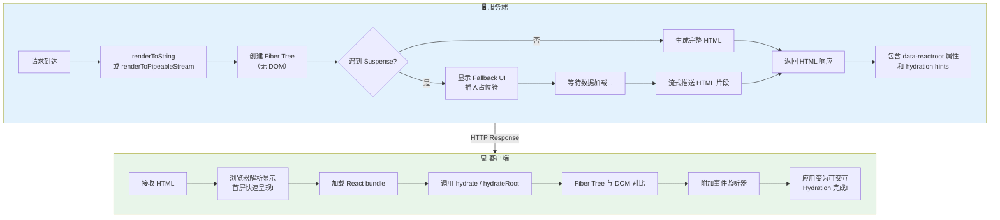

##### ASCII 结构图：Hydration 过程详解

```
┌─────────────────────────────────────────────────────────────┐
│                  Hydration 过程示意图                       │
└─────────────────────────────────────────────────────────────┘

  服务端生成的 HTML:
  <div id="root" data-reactroot="">
    <h1>Hello</h1>
    <button>Click me</button>
    <ul>
      <li>Item 1</li>
      <li>Item 2</li>
    </ul>
  </div>
  

  Hydration 步骤:
  
  Step 1: 创建 Fiber Tree（基于 JSX）
  ┌──────────────────┐
  │ HostRoot (Fiber)  │ ← 对应 #root
  │ stateNode: div#root│
  ├──────────────────┤
  │ child →           │
  │ ┌──────────────┐  │
  │ │ h1 (Fiber)   │  │ ← 对应 <h1>Hello</h1>
  │ │ sibling →     │  │
  │ └──────────────┘  │
  │ ┌──────────────┐  │
  │ │ button (Fiber)│  │ ← 对应 <button>Click me</button>
  │ │ sibling →     │  │
  │ └──────────────┘  │
  │ ┌──────────────┐  │
  │ │ ul (Fiber)    │  │
  │ │ child →       │  │
  │ │ ┌──────────┐  │  │
  │ │ │ li ×2    │  │  │
  │ │ └──────────┘  │  │
  │ └──────────────┘  │
  └──────────────────┘
  

  Step 2: Fiber 与 DOM 对比（Reconciliation - Hydration 模式）
  ┌─────────────────────────────────────────┐
  │ 对于每个 Fiber 节点:                    │
  │                                         │
  │ 1. 检查 DOM 节点是否存在                 │
  │    ✅ 存在 → 复用 (stateNode = 现有DOM) │
  │    ❌ 缺失 → 报错 (hydration mismatch!) │
  │                                         │
  │ 2. 比较属性是否一致                     │
  │    ✅ 一致 → 继续子节点                 │
  │    ❌ 不一致 → 警告 + 更新              │
  │                                         │
  │ 3. 附加事件监听器（关键步骤！）          │
  │    onClick → addEventListener           │
  │                                         │
  └─────────────────────────────────────────┘
  

  Step 3: 完成状态
  ┌──────────────────────────────────────┐
  │ ✅ HTML 已存在（无需创建 DOM）        │
  │ ✅ 事件已绑定（可交互）               │
  │ ✅ Fiber Tree 已建立（可更新）        │
  │                                      │
  │ 应用现在与纯 CSR 应用行为一致！        │
  └──────────────────────────────────────┘
```

##### 2. 逐行注释

| 方法 | 环境 | 作用 | 关键点 |
|------|------|------|--------|
| `renderToString()` | Node.js | 生成完整 HTML 字符串 | 同步、阻塞 |
| `renderToPipeableStream()` | Node.js | 流式渲染 | 支持 Suspense |
| `hydrate()` | 浏览器 | 遗留 API hydration | Legacy 模式 |
| `hydrateRoot()` | 浏览器 | React 18 新 API | Concurrent 兼容 |

##### 3. 设计意图

**为什么 SSR 要分两步（render + hydrate）？**

→ **性能**：先展示静态 HTML 让用户快速看到内容（FCP/LCP 优化）
→ **SEO**：搜索引擎爬虫可以抓取完整的 HTML 内容
→ **渐进增强**：即使 JS 加载失败，用户仍能看到基本内容

**⭐ SSR vs CSR 对比**：

| 特性 | SSR (服务端渲染) | CSR (客户端渲染) |
|------|-----------------|-----------------|
| **首屏速度** | 快（HTML 直接返回） | 慢（需下载+执行 JS） |
| **SEO** | ✅ 友好 | ❌ 困难 |
| **TTFB** | 较慢（服务器计算） | 快（静态文件） |
| **TTI** | 较慢（需 hydration） | 取决于 JS 大小 |
| **服务器负载** | 高 | 低 |
| **适用场景** | 内容网站、电商 | 后台管理、工具类 |

##### 4. 版本差异

- **React 16**: 基础 SSR 支持；`renderToString` + `hydrate`
- **React 17**: 改进 hydration 错误处理；支持 `renderToNodeStream`
- **React 18**: 引入**流式 SSR** (`renderToPipeableStream`/`renderToReadableStream`)；选择性 Hydration；Suspense for Data Fetching

##### 5. 关联面试题

→ **Q: 什么是 Hydration Mismatch？如何避免？**
  A: 当服务端渲染的 HTML 与客户端期望生成的 DOM 不一致时发生。常见原因：(1) 使用了只在浏览器可用的 API（如 `window`）；(2) 使用了随机值或时间戳；(3) 组件在不同环境渲染不同内容。解决方法：使用 `typeof window !== 'undefined'` 检测环境，将动态内容延迟到 `useEffect` 中渲染。

---

#### 10.2 【流式 SSR 与 Selective Hydration】⭐⭐

> **源码位置**：`packages/react-dom/src/server/ReactDOMFizzServer.js`
> **对应版本**：React 18.2.0

##### 1. 源码片段

```javascript
// ============ renderToPipeableStream: Node.js 流式渲染 ============
function renderToPipeableStream(children, options) {
  // ⭐ 准备流式响应
  let hasError = false;
  let error = null;
  
  // ⭐ 创建可写流
  const destination = {
    push(chunk) {
      if (chunk !== null) {
        // ⭐ 推送 HTML 片段到客户端
        options.onReadyToWrite && options.onReadyToWrite(chunk);
        options.onShellReady && options.onShellReady();
      }
    },
    destroy(error) {
      hasError = true;
      // ⭐ 错误处理
    },
  };
  
  // ⭐ 启动并发渲染（可以暂停/恢复）
  const request = createRequest(
    children,
    destination,
    options,
  );
  
  // ⭐ 返回可控制的对象
  return {
    abort(reason) {
      // ⭐ 可以中止渲染
      abort(request, reason);
    },
    pipe(writable) {
      // ⭐ 连接到 Node.js 可写流
      startFlowingRequest(request, writable);
    },
  };
}

// ============ Selective Hydration: 选择性水合 ============
// 在客户端，当部分组件的数据加载完成后，可以优先 hydration 该区域

function attemptHydrationAtPriority(fiber, lane) {
  // ⭐ 尝试对特定 Fiber 子树进行 hydration
  // 这允许页面中已经就绪的部分先变得可交互
  
  const root = getRootForFiber(fiber);
  
  // ⭐ 为这个子树创建独立的 hydration 任务
  const update = createUpdate(lane);
  update.tag = ForceUpdate;  // 强制更新以触发 hydration
  update.payload = { element: fiber.memoizedProps };
  
  enqueueUpdate(fiber, update);
  scheduleUpdateOnFiber(fiber, lane, getCurrentEventTime());
}

// ============ Suspense 在 SSR 中的行为 ============
function renderSuspenseBoundary(fiber, context) {
  const props = fiber.pendingProps;
  const fallback = props.fallback;  // loading UI
  
  // ⭐ 检查子组件是否抛出了 Promise（数据加载中）
  if (suspended) {
    // ⭐ 先输出 fallback UI
    emitStartPendingSuspenseBoundaries(fiber.id);
    emitHTML(fallback);
    emitEndSuspenseBoundary();
    
    // ⭐ 记录 Suspense 边界位置（用于后续流式注入）
    registerSuspenseBoundary(fiber, {
      id: generateSuspenseID(),
      pending: true,
    });
    
    return;
  } else {
    // ⭐ 正常渲染子组件
    const children = props.children;
    renderChildren(children, context);
  }
}
```

##### Mermaid 流程图：流式 SSR 工作原理

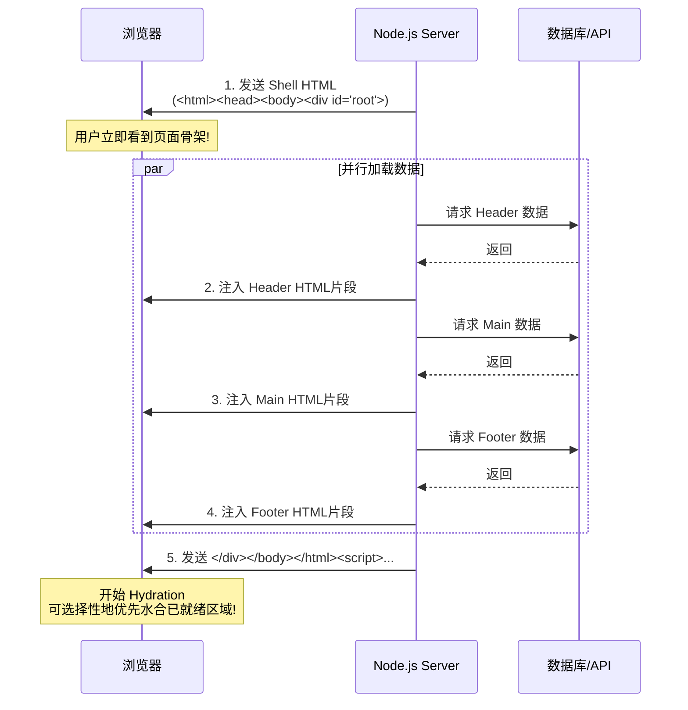

##### 2. 逐行注释

| 特性 | 传统 SSR | 流式 SSR (React 18) |
|------|---------|---------------------|
| **传输方式** | 一次性返回完整 HTML | 分块流式传输 |
| **Suspense** | ❌ 不支持或降级 | ✅ 显示 fallback 后流式注入 |
| **TTFB** | 慢（等所有数据） | 快（先发骨架） |
| **Hydration** | 全部完成后开始 | **Selective**（选择性地） |
| **API** | `renderToString` | `renderToPipeableStream` |

##### 3. 设计意图

**为什么需要流式 SSR？**

→ **更快的感知性能**：用户更快看到内容（渐进式加载）
→ **更好的资源利用**：不需要等待最慢的数据源
→ **Suspense 集成**：与服务端 Suspense 无缝配合

**⭐ Selective Hydration 的优势**：

```
页面结构:
┌─────────────────────────────────────┐
│ Header (数据已加载 ✓)                │ ← 优先 Hydrate! 用户可交互
├─────────────────────────────────────┤
│ Main Content (数据加载中...)         │ ← 显示 Skeleton
│ [Suspense Fallback]                 │
├─────────────────────────────────────┤
│ Sidebar (数据已加载 ✓)               │ ← 也可以优先 Hydrate!
├─────────────────────────────────────┤
│ Footer (数据加载中...)               │ ← 最后 Hydrate
└─────────────────────────────────────┘

传统方式: 必须等所有数据加载完才能 Hydrate
选择性方式: 就绪的部分立即可交互!
```

##### 4. 版本差异

- **React 16/17**: 仅支持 `renderToString` 和 `renderToNodeStream`
- **React 18**: 引入 `renderToPipeableStream`（Node.js）和 `renderToReadableStream`（Edge Runtime/Deno）；支持 Suspense 流式渲染和 Selective Hydration

##### 5. 关联面试题

→ **Q: 流式 SSR 如何处理 SEO？**
  A: 搜索引擎爬虫通常会在收到完整响应后才开始解析。对于流式 SSR，可以使用 `<script>` 标签中的内联数据来补充动态内容，或者确保关键的 SEO 内容在初始 shell 中发送。Googlebot 已经能够执行 JavaScript，但流式 SSR 提供更好的首次内容绘制（FCP）。

---

#### 10.3 【SSR 性能优化策略】

> **源码位置**：综合实践
> **对应版本**：React 18.2.0

##### 1. 优化策略清单

```javascript
// ========== 策略 1: 缓存渲染结果 ==========
import { cache } from 'react';

// ⭐ 使用 React Cache API (实验性)
const getUserData = cache(async (id) => {
  const user = await db.getUser(id);
  return user;
});

// 在组件中使用:
async function UserProfile({ userId }) {
  const user = await getUserData(userId);  // 自动缓存
  return <div>{user.name}</div>;
}


// ========== 策略 2: 代码分割 + Suspense ==========
import { lazy, Suspense } from 'react';

const HeavyComponent = lazy(() => import('./HeavyComponent'));

function App() {
  return (
    <Suspense fallback={<Skeleton />}>
      <HeavyComponent />
    </Suspense>
  );
}


// ========== 策略 3: 数据预取 ==========
// 在服务器端预先获取所有必要数据
async function serverRender(req, res) {
  // ⭐ 并行获取所有数据
  const [user, posts, comments] = await Promise.all([
    fetchUser(req.params.id),
    fetchPosts(),
    fetchComments(),
  ]);
  
  // ⭐ 传递给组件作为 props 或通过 Relay/Query 传递
  const html = await renderToString(
    <App initialData={{ user, posts, comments }} />
  );
  
  res.send(html);
}


// ========== 策略 4: 避免不必要的服务端计算 ==========
// ❌ 问题: 在服务端执行昂贵的操作
function ExpensiveChart({ data }) {
  // 这个排序在服务端和客户端都会执行
  const sorted = data.sort((a, b) => a.value - b.value).slice(0, 100);
  return <Chart data={sorted} />;
}

// ✅ 解决: 只在客户端执行
function ChartWrapper({ rawData }) {
  const [sortedData, setSortedData] = useState([]);
  
  useEffect(() => {
    // 只在客户端执行
    setSortedData(rawData.sort(...).slice(0, 100));
  }, []);
  
  return sortedData.length > 0 ? <Chart data={sortedData} /> : <Placeholder />;
}
```

##### 2. 性能优化决策树

```
SSR 性能问题诊断:
│
├─ TTFB (Time to First Byte) 太长?
│  ├─ 服务器响应慢?
│  │  ├─ 数据库查询优化
│  │  ├─ 添加缓存层 (Redis)
│  │  └─ CDN 缓存静态资源
│  └─ 渲染计算太重?
│     ├─ 使用流式 SSR (renderToPipeableStream)
│     ├─ 减少 SSR 范围 (只渲染关键部分)
│     └─ 缓存渲染结果
│
├─ FCP (First Contentful Paint) 太慢?
│  ├─ HTML 体积太大?
│  │  ├─ 代码分割 (lazy + Suspense)
│  │  ├─ 压缩 (gzip/brotli)
│  │  └─ 内联关键 CSS
│  └─ 阻塞资源太多?
│     ├─ 预加载关键资源 (<link rel="preload">)
│     └─ 异步加载非关键资源
│
├─ TTI (Time to Interactive) 太慢?
│  ├─ JS bundle 太大?
│  │  ├─ Tree Shaking
│  │  ├─ Code Splitting
│  │  └─ 动态 import
│  └─ Hydration 太慢?
│     ├─ 使用 Selective Hydration
│     ├─ 减少初始 Hydration 范围
│     └─ Progressive Hydration
│
└─ 整体体验不佳?
   ├─ 添加 Loading States (Suspense Fallback)
   ├─ 骨架屏 (Skeleton Screens)
   └─ Streaming + Progressive Enhancement
```

##### 3. 设计意图

**SSR 优化的核心原则**：

→ **减少服务端工作量**：缓存、流式、按需渲染
→ **减少传输体积**：压缩、代码分割、懒加载
→ **加快感知速度**：骨架屏、渐进式 Hydration
→ **平衡 SEO 与性能**：关键内容优先，次要内容延迟

##### 4. 关联面试题

→ **Q: 什么时候应该使用 SSR 而不是 CSR？**
  A: 使用 SSR 的场景：(1) 内容驱动型网站（博客、新闻、电商）；(2) 需要 SEO 的公开页面；(3) 社交媒体分享（Open Graph 标签）；(4) 首屏性能要求高的应用。使用 CSR 的场景：(1) 后台管理系统；(2) 工具类应用（编辑器、IDE）；(3) 重度交互的应用（游戏、复杂表单）；(4) 需要离线支持的 PWA。

---

### 📝 第10章要点速查

| 技术 | 用途 | API | React 版本 |
|------|------|-----|-----------|
| **renderToString** | 传统 SSR | Node.js | 16+ |
| **renderToNodeStream** | 流式 SSR (基础) | Node.js Stream | 16+ |
| **renderToPipeableStream** | 流式 SSR (改进) | Pipeable Stream | 18 |
| **renderToReadableStream** | 流式 SSR (Web) | ReadableStream | 18 |
| **hydrate** | 客户端水合 (旧) | 浏览器 | 16+ |
| **hydrateRoot** | 客户端水合 (新) | 浏览器 | 18 |
| **Selective Hydration** | 选择性水合 | 自动 | 18 |

---

## 第11章 React 18 新特性

### 📚 本章学习目标
- 掌握 Automatic Batching 的原理和使用场景
- 理解并发渲染模式的启用方式和注意事项
- 学会 useId / useSyncExternalStore / useInsertionEffect 的使用
- 了解 Suspense for Data Fetching 的最佳实践
- 深入理解 Transitions API (startTransition/useTransition)
- 掌握从 React 17 升级到 18 的迁移要点

---

#### 11.1 【Automatic Batching 自动批处理】⭐⭐⭐

> **源码位置**：`packages/react-reconciler/src/ReactFiberWorkLoop.js`, `ReactFiberNewContext.js`
> **对应版本**：React 18.2.0

##### 1. 源码片段

```javascript
// ============ Automatic Batching 的核心实现 ============

// ⭐ React 17: 只在事件处理器和生命周期中自动批处理
// React 18: 所有地方都自动批处理！

export function createRoot(container, options) {
  // ⭐ Concurrent Root 默认启用 Automatic Batching
  const root = createContainer(
    container,
    ConcurrentRoot,  // ← 关键！
    null,
    options?.hydratable ? false : true,
    options,
  );
  
  return new ReactDOMRoot(root);
}

// ============ batchedUpdates: 批处理更新函数 ============
function batchedUpdates(fn, a) {
  // ⭐ 设置当前批处理上下文
  const prevExecutionContext = executionContext;
  executionContext |= BatchedContext;  // 标记为批处理模式
  
  try {
    return fn(a);
  } finally {
    // ⭐ 恢复上下文并执行所有排队中的更新
    executionContext = prevExecutionContext;
    
    if (
      (executionContext & (RenderContext | CommitContext)) === NoContext
    ) {
      // ⭐ 不在渲染/提交阶段，刷新批处理
      flushSyncCallbacks();
      resetRenderTimer();
    }
  }
}

// ============ legacyRenderSubtreeIntoContainer: Legacy 模式 ==========
// 注意：Legacy 模式下只在事件处理器内批处理

function legacyRenderSubtreeIntoContainer(...) {
  // ⭐ Legacy 模式使用不同的批处理策略
  unbatchedUpdates(() => {
    updateContainer(children, root, parentComponent, callback);
  });
}
```

##### 对比示例代码

```javascript
// ========== React 17 及之前的行为 ==========
function handleClick() {
  // ✅ 在事件处理器内：自动批处理（只触发 1 次 re-render）
  setCount(c => c + 1);
  setFlag(f => !f);
  // 只会 re-render 1 次 ✓
}

setTimeout(() => {
  // ❌ 在 setTimeout 中：不批处理（触发 2 次 re-render）
  setCount(c => c + 1);  // 立即 re-render
  setFlag(f => !f);     // 再次 re-render
  // re-render 2 次 ✗
}, 0);

fetch('/api').then(() => {
  // ❌ 在 Promise 中：同样不批处理
  setData(newData);     // re-render
  setIsLoading(false);   // 再 re-render
});


// ========== React 18 的行为 (createRoot) ==========
function handleClick() {
  // ✅ 仍然是 1 次 re-render
  setCount(c => c + 1);
  setFlag(f => !f);
}

setTimeout(() => {
  // ✅ 现在也是 1 次 re-render！（Automatic Batching）
  setCount(c => c + 1);
  setFlag(f => !f);
});

fetch('/api').then(() => {
  // ✅ Promise 中也只 1 次 re-render！
  setData(newData);
  setIsLoading(false);
});
```

##### Mermaid 流程图：Automatic Batching 工作原理

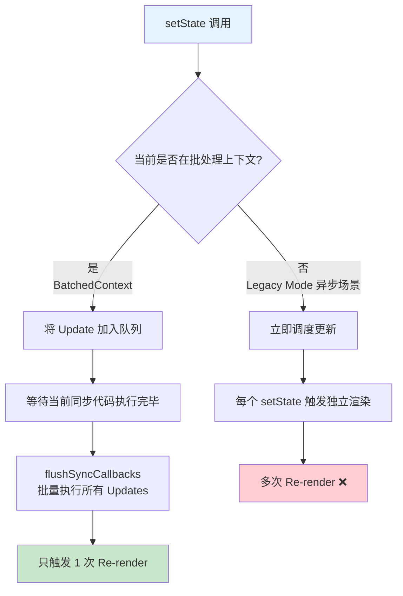

##### 2. 逐行注释表

| 场景 | React 17 (Legacy) | React 18 (Concurrent) |
|------|-------------------|----------------------|
| **事件处理器** | ✅ 自动批处理 | ✅ 自动批处理 |
| **setTimeout/setInterval** | ❌ 不批处理 | ✅ **自动批处理** |
| **Promise.then/fetch** | ❌ 不批处理 | ✅ **自动批处理** |
| **原生事件监听器** | ❌ 不批处理 | ✅ **自动批处理** |
| **useEffect/useLayoutEffect** | ✅ 批处理 | ✅ 批处理 |

##### 3. 设计意图

**为什么 React 18 要扩展 Automatic Batching？**

→ **性能提升**：减少不必要的重渲染次数
→ **一致性**：无论在哪里调用 setState，行为都一致
→ **简化心智模型**：开发者不需要关心"当前是否在批处理环境中"

**⭐ 如果需要退出批处理怎么办？**

```javascript
import { flushSync } from 'react-dom';

function handleClick() {
  // ⭐ 使用 flushSync 强制同步刷新
  flushSync(() => {
    setCount(c => c + 1);
  });
  // 这里 DOM 已经更新了
  
  // 可以读取到最新的 count 值
  console.log(countRef.current);  // 新值
  
  setFlag(f => !f);
  // 这会是另一次独立的 re-render
}
```

##### 4. 版本差异

- **React 16/17**: 仅在 React 事件系统和生命周期钩子内部进行批处理
- **React 18**: 使用 `createRoot` 后，**所有地方**都自动批处理；`ReactDOM.render` 保持旧行为

##### 5. 关联面试题

→ **Q: Automatic Batching 会影响现有代码吗？**
  A: 通常不会。但如果你的代码依赖"setState 后立即看到 DOM 更新"的行为（如在 setTimeout 中 setState 后立即读取 DOM），可能会受影响。解决方案是使用 `flushSync` 或 `useEffect`/`flushSync` 来确保同步更新。

---

#### 11.2 【并发渲染模式详解】⭐⭐⭐

> **源码位置**：`packages/react-dom/src/client/ReactDOMRoot.js`
> **对应版本**：React 18.2.0

##### 1. 源码片段

```javascript
// ============ createRoot vs render 对比 ============

// ========== React 18: createRoot (推荐) ==========
import { createRoot } from 'react-dom/client';

const root = createRoot(document.getElementById('root'));
root.render(<App />);

// 内部实现:
class ReactDOMRoot {
  constructor(internalRoot) {
    this._internalRoot = internalRoot;
  }
  
  render(children) {
    const root = this._internalRoot;
    
    // ⭐ 使用 updateContainer 并传入并发标记
    updateContainer(children, root, null, null);
  }
  
  // ⭐ 新增: unmount 方法
  unmount() {
    const root = this._internalRoot;
    flushSync(() => {
      updateContainer(null, root, null, null);
    });
  }
}


// ========== React 17 及之前: render (遗留) ==========
import { render } from 'react-dom';

render(<App />, document.getElementById('root'));

// 内部实现:
function legacyRenderSubtreeIntoContainer(
  parentComponent,
  container,
  callback,
  forceHydrate,
) {
  // ⭐ 使用 LegacyRoot（非并发）
  const root = createContainer(
    container,
    LegacyRoot,  // ← 关键区别！
    parentComponent,
    null,
    null,
  );
  
  // ⭐ 同步渲染
  unbatchedUpdates(() => {
    updateContainer(children, root, parentComponent, callback);
  });
}
```

##### 2. 特性对比表

| 特性 | `ReactDOM.render()` | `createRoot().render()` |
|------|---------------------|-------------------------|
| **API 来源** | `react-dom` | `react-dom/client` |
| **根类型** | `LegacyRoot` | `ConcurrentRoot` |
| **工作循环** | `workLoopSync` | `workLoopConcurrent` |
| **可中断性** | ❌ 不可中断 | ✅ 可中断（时间切片） |
| **Suspense** | 仅代码分割 | 完整支持（数据获取） |
| **Transitions** | ❌ 不支持 | ✅ 支持 |
| **Automatic Batching** | 仅事件处理器内 | 全局 |
| **Selective Hydration** | ❌ | ✅ SSR 时支持 |
| **useId** | ❌ | ✅ 支持 |
| **startTransition** | ❌ | ✅ 支持 |

##### 3. 使用示例

```javascript
// ========== 迁移示例 ==========
// ❌ 旧写法:
import { render } from 'react-dom';
render(
  <React.StrictMode>
    <App />
  </React.StrictMode>,
  document.getElementById('root')
);

// ✅ 新写法:
import { createRoot } from 'react-dom/client';
const root = createRoot(document.getElementById('root'));
root.render(
  <React.StrictMode>
    <App />
  </React.StrictMode>
);


// ========== 卸载组件 ==========
// ❌ 旧写法:
unmountComponentAtNode(document.getElementById('root'));

// ✅ 新写法:
root.unmount();
```

##### 4. 设计意图

**为什么要引入新的 API 而不是修改旧的？**

→ **向后兼容**：旧应用可以渐进式迁移，不需要一次性全部改动
→ **明确意图**：新 API 明确表示"我要启用并发特性"
→ **避免破坏性变更**：某些依赖同步行为的代码不会被影响

**⭐ 迁移建议**：

1. **新项目**: 直接使用 `createRoot`
2. **现有项目**: 可以逐步替换，两种 API 可以共存
3. **测试优先**: 先在非关键路径测试新 API
4. **注意差异**: 监控是否有依赖同步行为的代码

##### 5. 关联面试题

→ **Q: 升级到 React 18 后必须改用 createRoot 吗？**
  A: 不是必须的。`ReactDOM.render` 仍然可用但已被标记为废弃（deprecated）。建议新项目直接使用 `createRoot` 以获得完整的 React 18 特性。旧项目可以先升级依赖版本，再逐步将 `render` 替换为 `createRoot`。

---

#### 11.3 【新 Hooks: useId / useSyncExternalStore / useInsertionEffect】

> **源码位置**：`packages/react/src/ReactHooks.js`, `ReactFiberHooks.js`
> **对应版本**：React 18.2.0

##### 1. useId - 生成唯一 ID

```javascript
// ============ useId 源码简化版 ============
function useId() {
  // ⭐ 使用 Hook 获取状态
  const hook = mountWorkInProgressHook();  // 或 updateWorkInProgressHook
  
  // ⭐ 生成唯一 ID（基于组件树位置 + 服务器/客户端标识）
  const id = ':' + (hook.memoizedStatePrefix || '') + ':' + hook.memoizedState++;
  
  // ⭐ SSR 安全：服务端和客户端生成相同的 ID
  // 使用 "r" + 递增计数器的格式
  // 例如: ":r0:", ":r1:", ":r2:"
  
  return id;
}

// 使用示例:
function Checkbox({ label }) {
  const id = useId();  // 生成如 ":r1:"
  
  return (
    <>
      <label htmlFor={id}>{label}</label>
      <input id={id} type="checkbox" />
    </>
  );
}

// ⭐ 优势:
// • SSR 安全（不会产生 hydration mismatch）
// • 自动去重（同一组件多次调用也会不同）
// • 无需手动管理 ID
```

##### 2. useSyncExternalStore - 订阅外部数据源

```javascript
// ============ useSyncExternalStore 源码简化版 ============
function useSyncExternalStore(subscribe, getSnapshot, getServerSnapshot) {
  // ⭐ 获取当前 Fiber 和 Hook
  const fiber = currentlyRenderingFiber$1;
  const hook = mountWorkInProgressHook();
  
  // ⭐ 获取快照值
  let snapshot = getSnapshot();
  
  // ⭐ 处理 Hydration（SSR 场景）
  if (getServerSnapshot !== undefined) {
    const serverSnapshot = getServerSnapshot();
    // 比较 SSR 快照与客户端快照
  }
  
  // ⭐ 订阅外部 store 变化
  useEffect(() => {
    // ⭐ handleStoreChange: 当外部 store 变化时触发重新渲染
    const handleStoreChange = () => {
      // ⭐ 强制检查快照是否变化
      if (Object.is(getSnapshot(), hook.memoizedState)) {
        return;  // 没变，跳过
      }
      // ⭐ 触发组件更新
      scheduleUpdateOnFiber(fiber, SyncLane, getCurrentEventTime());
    };
    
    // ⭐ 调用用户提供的 subscribe 函数
    return subscribe(handleStoreChange);
  }, [fiber]);
  
  // ⭐ 返回当前快照
  return snapshot;
}


// 使用示例: 集成 Redux/Zustand 等外部 Store
function useReduxStore(selector) {
  return useSyncExternalStore(
    // subscribe: 订阅 store 变化
    store.subscribe,
    
    // getSnapshot: 获取当前选中的值
    () => selector(store.getState()),
    
    // getServerSnapshot: SSR 时的初始值（可选）
    () => selector(initialServerState)
  );
}

// 组件中使用:
function Counter() {
  const count = useReduxStore(state => state.counter);
  return <div>{count}</div>;
}

// ⭐ 优势:
// • 避免 tearing 问题（并发模式下多个渲染可能读到不一致的状态）
// • 支持 SSR（通过 getServerSnapshot）
// • 统一的外部数据订阅接口
```

##### 3. useInsertionEffect - CSS-in-JS 库专用

```javascript
// ============ useInsertionEffect 源码简化版 ============
function useInsertionEffect(create, deps) {
  // ⭐ 类似于 useEffect，但时机非常特殊
  
  // ⭐ 执行时机: DOM 变更之后、Layout Effects 之前
  // 这使得它适合注入动态样式而不影响布局读取
  
  return mountEffectImpl(
    InsertionEffect | PassiveStaticEffect,  // 特殊 effect tag
    HookInsertionEffect,                      // Hook 类型
    create,                                   // effect 函数
    undefined,                                // destroy 函数
    deps,                                     // 依赖数组
  );
}

// 使用示例: CSS-in-JS 库（如 styled-components、emotion）
function useCSSInjection(css) {
  useInsertionEffect(() => {
    // ⭐ 在 DOM 更新后但浏览器绘制前注入样式
    // 这样可以避免 FOUC (Flash of Unstyled Content)
    
    const styleElement = document.createElement('style');
    styleElement.textContent = css;
    document.head.appendChild(styleElement);
    
    return () => {
      // 清理函数
      document.head.removeChild(styleElement);
    };
  }, [css]);
}

// ⭐ 与其他 Effect 的时序对比:
// Render → Mutation (DOM 更新) → 
// → [useInsertionEffect] → Layout Effects (useLayoutEffect) → 
// → 浏览器绘制 → Passive Effects (useEffect)

// ⭐ 为什么需要这个 Hook?
// CSS-in-JS 库需要在正确的时机注入样式：
// • 太早: 可能导致样式闪烁
// • 太晚: 出现无样式内容 (FOUC)
// • useInsertionEffect 是完美的时机!
```

##### 2. 逐行注释表

| Hook | 用途 | 执行时机 | 适用场景 |
|------|------|---------|---------|
| **useId** | 生成唯一 ID | Render 阶段 | 表单 label/input 关联 |
| **useSyncExternalStore** | 订阅外部数据源 | Render 阶段（强制同步） | Redux/Zustand 集成 |
| **useInsertionEffect** | 注入 DOM 元素 | Commit-Mutation 之后 | CSS-in-JS 库 |

##### 3. 设计意图

**为什么需要这些新 Hooks？**

→ **SSR 兼容性**：解决服务端和客户端 ID/状态不一致的问题
→ **并发安全**：防止 Tearing（并发模式下状态撕裂）
→ **库作者友好**：为特定需求提供官方支持的 API

##### 4. 版本差异

- **React 17**: 无这些 Hooks，需要变通方案或第三方库
- **React 18**: 正式引入，作为并发模式和 SSR 的基础设施

##### 5. 关联面试题

→ **Q: useSyncExternalStore 解决了什么问题？**
  A: 主要解决两个问题：(1) **Tearing** - 在并发模式下，由于 React 可能暂停和恢复渲染，外部 store 可能在两次读取之间被修改，导致 UI 显示不一致的状态。useSyncExternalStore 通过原子性地读取快照来保证一致性。(2) **SSR** - 提供统一的接口让外部 store 支持服务端渲染。

---

#### 11.4 【Suspense for Data Fetching】⭐⭐

> **源码位置**：`packages/react-reconciler/src/ReactFiberSuspenseComponent.js`
> **对应版本**：React 18.2.0

##### 1. 使用示例与原理

```javascript
// ========== Suspense for Data Fetching 示例 ==========
import { Suspense } from 'react';

// ⭐ 数据获取包装器（抛出 Promise 的函数）
function fetchUserData(userId) {
  let status = 'pending';
  let result;
  
  const suspender = fetch(`/api/users/${userId}`)
    .then(res => res.json())
    .then(data => {
      status = 'success';
      result = data;
    })
    .catch(err => {
      status = 'error';
      throw err;
    });
  
  // ⭐ 包装成资源对象
  return {
    read() {
      if (status === 'pending') throw suspender;  // 抛出 Promise!
      if (status === 'error') throw result;       // 抛出错误!
      return result;                               // 返回数据
    }
  };
}

// ⭐ 使用 Suspense 边界包裹异步组件
function UserProfile({ userId }) {
  // ⭐ 创建或获取缓存的数据资源
  const resource = fetchUserData(userId);
  
  // ⭐ 如果数据未就绪，这里会抛出 Promise
  // React 会捕获并在最近的 Suspense 边界显示 fallback
  const user = resource.read();
  
  return <div>Hello, {user.name}!</div>;
}

// ⭐ 在 App 中使用
function App() {
  return (
    <Suspense fallback={<Skeleton />}>
      <UserProfile userId={123} />
    </Suspense>
  );
}
```

##### Mermaid 流程图：Suspense Data Fetching 工作流程

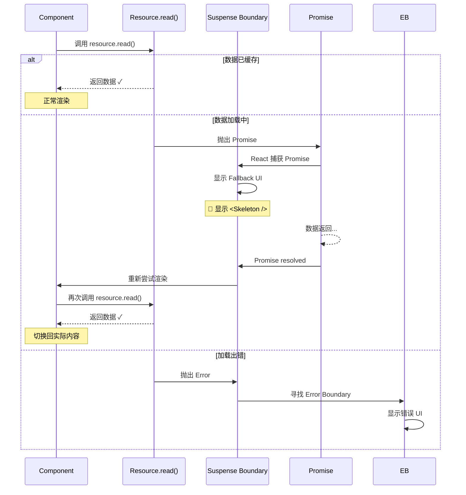

##### 2. 逐行注释

| 步骤 | 行为 | 说明 |
|------|------|------|
| Step 1 | `resource.read()` | 尝试读取数据 |
| Step 2 | 抛出 Promise | 数据未就绪，触发 Suspense |
| Step 3 | 显示 Fallback | 用户看到 loading 状态 |
| Step 4 | Promise resolve | 数据到达 |
| Step 5 | 重新渲染 | 替换 Fallback 为真实内容 |

##### 3. 设计意图

**为什么 Suspense Data Fetching 是更好的模式？**

→ **声明式**：不需要手动管理 isLoading/error/data 状态
→ **自动协调**：多个 Suspense 边界可以嵌套，自动等待所有数据
→ **流式 SSR 配合**：与服务端流式渲染完美配合
→ **代码简洁**：减少样板代码

**⭐ 推荐的集成方案**：

目前 React 官方推荐使用以下库来实现 Suspense Data Fetching：

1. **Relay** (Facebook 官方): 完整的 GraphQL 客户端，原生支持 Suspense
2. **SWR** (Vercel): 轻量级数据获取，有实验性的 Suspense 模式
3. **React Query** (TanStack): 功能丰富的数据同步库，计划支持 Suspense
4. **手写实现**: 如上例所示的简单包装器

##### 4. 版本差异

- **React 16/17**: Suspense 仅用于 `React.lazy()`（代码分割）
- **React 18**: 官方文档开始介绍 Suspense for Data Fetching 模式（但仍标记为实验性）

##### 5. 关联面试题

→ **Q: Suspense Data Fetching 和传统 async/await 有什么区别？**
  A: 传统方式需要在组件中维护 loading/error/data 状态，手动控制 UI 切换。Suspense 采用声明式方式，通过"抛出 Promise"来中断渲染，由 Suspense 边界统一处理 loading 状态。这使得代码更简洁，并且能更好地与 React 的并发特性和流式 SSR 配合。

---

### 📝 第11章要点速查

| 新特性 | 用途 | API | 是否破坏性变更 |
|--------|------|-----|---------------|
| **Automatic Batching** | 减少重渲染次数 | 自动生效 (createRoot) | 否 (需迁移) |
| **Concurrent Mode** | 启用并发渲染 | `createRoot()` | 否 (可选) |
| **Transitions** | 区分紧急/非紧急更新 | `startTransition` / `useTransition` | 否 |
| **Suspense Data Fetching** | 声明式数据获取 | `<Suspense>` + 自定义 Hook | 否 (实验性) |
| **useId** | 生成唯一 ID | `useId()` | 否 |
| **useSyncExternalStore** | 外部 store 集成 | `useSyncExternalStore(sub, getSnap)` | 否 |
| **useInsertionEffect** | CSS-in-JS 注入 | `useInsertionEffect(fn, deps)` | 否 |
| **Strict Mode** | 开发模式检测 | `<React.StrictMode>` | 否 (增强检测) |

---

## 第12章 性能优化源码视角 ⭐

### 📚 本章学习目标
- 深入理解 memo/useMemo/useCallback 的比较逻辑
- 掌握 shallowEqual 源码及优化建议
- 理解 bailout 机制（canSkipRendering）的实现
- 了解 React DevTools Profiler 数据采集原理
- 学会性能监控最佳实践（Performance API 集成）
- 掌握常见性能陷阱及解决方案

---

#### 12.1 【shallowEqual 源码及优化建议】⭐⭐⭐

> **源码位置**：`packages/react/src/shallowEqual.js`
> **对应版本**：React 18.2.0

##### 1. 源码片段

```javascript
// ============ shallowEqual: 浅比较函数 ============
/**
 * Performs equality by iterating through keys on an object and returning false
 * when any key has values which are not strictly equal between the arguments.
 * Returns true when the values of all keys are strictly equal.
 */

function shallowEqual(objA, objB) {
  // ⭐ 快速路径 1: 引用相同（同一个对象）
  if (Object.is(objA, objB)) {
    return true;
  }
  
  // ⭐ 快速路径 2: 其中一个是 null 或不是对象
  if (
    typeof objA !== 'object' ||
    objA === null ||
    typeof objB !== 'object' ||
    objB === null
  ) {
    return false;
  }
  
  // ⭐ 获取对象的键
  const keysA = Object.keys(objA);
  const keysB = Object.keys(objB);
  
  // ⭐ 键数量不同 → 不相等
  if (keysA.length !== keysB.length) {
    return false;
  }
  
  // ⭐ 遍历检查每个值是否严格相等
  for (let i = 0; i < keysA.length; i++) {
    const key = keysA[i];
    
    // ⭐ 检查 B 是否有这个键，且值是否相同
    if (
      !hasOwnProperty.call(objB, key) ||
      !Object.is(objA[key], objB[key])
    ) {
      return false;
    }
  }
  
  // ⭐ 所有检查都通过
  return true;
}

export default shallowEqual;
```

##### 2. 逐行注释表

| 步骤 | 代码 | 说明 | 时间复杂度 |
|------|------|------|-----------|
| Step 1 | `Object.is(objA, objB)` | 检查引用是否相同 | O(1) |
| Step 2 | 类型/null 检查 | 排除非对象情况 | O(1) |
| Step 3 | `keysA.length !== keysB.length` | 键数量比较 | O(1) |
| Step 4 | `for` 循环遍历 | 逐个比较值 | O(n), n=键数 |

**总时间复杂度**: O(n)，其中 n 是对象的键数量

##### 3. 设计意图

**为什么使用浅比较而不是深比较？**

→ **性能**：深比较可能非常昂贵（递归遍历整个对象树）
→ **足够用**：大多数情况下，props 的变化体现在第一层
→ **可预测**：开发者明确知道比较的范围
→ **一致性**：与 React 的渲染行为保持一致（只检查 props 引用）

**⭐ shallowEqual 的局限性**：

```javascript
// ❌ 场景 1: 嵌套对象变化不会被检测到
const props1 = { user: { name: 'Alice', age: 25 } };
const props2 = { user: { name: 'Alice', age: 26 } };  // age 变了!
shallowEqual(props1, props2);  // 返回 true! (因为 user 引用相同)

// ✅ 解决方案: 创建新对象
const props3 = { user: { ...props1.user, age: 26 } };
shallowEqual(props1, props3);  // 返回 false ✓


// ❌ 场景 2: 数组内容变化但引用相同
const list = [1, 2, 3];
list.push(4);
const propsA = { items: list };
const propsB = { items: list };  // 同一个数组引用
shallowEqual(propsA, propsB);   // 返回 true! (即使内容变了)

// ✅ 解决方案: 使用不可变更新
const newList = [...list, 4];
const propsC = { items: newList };
shallowEqual(propsA, propsC);   // 返回 false ✓


// ✅ 最佳实践: 使用 Immer 或 immutable.js
import { produce } from 'immer';

const newState = produce(baseState, draft => {
  draft.user.age = 26;  // 自动创建新引用!
});
```

##### 4. 优化建议

| 场景 | 问题 | 优化方案 |
|------|------|---------|
| 大型 props 对象 | 每次都要遍历所有键 | 拆分为多个小组件，每个接收少量 props |
| 频繁变化的嵌套数据 | 浅比较检测不到 | 使用 Immer 或手动创建新引用 |
| 函数 prop 每次新建 | 导致 memo 失效 | useCallback 或提取到外部 |
| 数组/对象字面量 | 每次渲染创建新引用 | useMemo 或移到组件外 |

##### 5. 版本差异

- **React 16+**: shallowEqual 实现基本一致，是 React.memo 和 PureComponent 的核心
- **React 18**: 无显著变化，仍然是浅比较策略

##### 6. 关联面试题

→ **Q: React.memo 和 PureComponent 有什么区别？**
  A: `React.memo` 是高阶组件（HOC），用于函数组件；`PureComponent` 是类组件基类。两者都使用 `shallowEqual` 进行 props 比较。区别在于：(1) 使用方式不同（HOC vs 继承）；(2) `PureComponent` 还会自动对 state 进行浅比较；(3) `React.memo` 可以自定义比较函数作为第二个参数。

---

#### 12.2 【bailout 机制详解】⭐⭐⭐

> **源码位置**：`packages/react-reconciler/src/ReactFiberBeginWork.js`
> **对应版本**：React 18.2.0

##### 1. 源码片段

```javascript
// ============ beginWork: bailout 判断入口 ============
function beginWork(current, workInProgress, renderLanes) {
  // ⭐ 检查是否可以跳过当前组件的工作（bailout）
  if (current !== null) {
    const oldProps = current.memoizedProps;
    const newProps = workInProgress.pendingProps;
    
    // ⭐ bailout 条件判断
    if (
      oldProps === newProps &&                    // Props 引用相同
      !hasLegacyContextChanged() &&               // Context 没变
      (workInProgress.flags & ForceUpdate) === NoFlags  // 没有强制更新标记
    ) {
      // ⭐ 尝试进一步优化：检查 lanes
      didReceiveUpdate = false;
      
      // ⭐ 检查是否有 pending 的更新（基于优先级）
      if (!includesSomeLane(renderLanes, updateLanes)) {
        // ⭐ 完全 bailout！不处理此组件及其子树
        return bailoutOnAlreadyFinishedWork(current, workInProgress, renderLanes);
      }
      
      // ⭐ 有 pending 更新但不能立即处理：复用 Fiber 但标记需要更新
      return bailoutOnAlreadyFinishedWork(current, workInProgress, renderLanes);
    }
    
    didReceiveUpdate = true;  // 需要 re-render
  } else {
    didReceiveUpdate = false;  // 首次渲染
  }
  
  // ... 正常的 beginWork 逻辑
}

// ============ bailoutOnAlreadyFinishedWork: 执行 bailout ============
function bailoutOnAlreadyFinishedWork(current, workInProgress, lanes) {
  // ⭐ 关键：直接复用上一次的 Fiber 树！
  
  // Step 1: 复用子节点（不需要重新 reconcile）
  if (!includesSomeLane(lanes, childLanes)) {
    // ⭐ 子树也没有变化：完全跳过
    return null;
  }
  
  // Step 2: 克隆子节点（如果需要）
  cloneChildFibers(current, workInProgress);
  
  // Step 3: 返回第一个子节点（如果有 pending 工作）
  return workInProgress.child;
}

// ============ React.memo 内部实现简化版 ============
function memo(type, compare) {
  // ⭐ compare 默认为 shallowEqual
  const elementType = {
    $$typeof: REACT_MEMO_TYPE,
    type,           // 被包裹的组件
    compare: compare || shallowEqual,  // 自定义比较函数（可选）
  };
  
  return elementType;
}

// 在 beginWork 中处理 Memo 组件:
if (workInProgress.tag === SimpleMemoComponent) {
  // ⭐ 调用自定义的比较函数或默认的 shallowEqual
  const Compare = current.type.compare;
  if (Compare !== null) {
    if (Compare(oldProps, newProps)) {
      // ⭐ 比较通过 → bailout
      return bailoutOnAlreadyFinishedWork(...);
    }
  }
}
```

##### Mermaid 决策流程图：bailout 判断流程

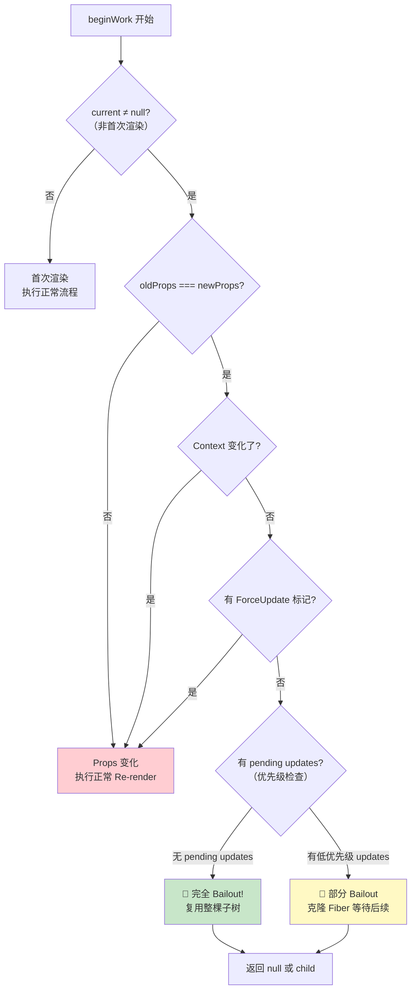

##### ASCII 结构图：bailout 的效果

```
┌─────────────────────────────────────────────────────────────┐
│                  Bailout 效果示意图                         │
└─────────────────────────────────────────────────────────────┘

  正常 Re-render:
  ┌──────────────────────────────────────────┐
  │ App                                       │
  │ ├─ Header (re-render)                     │ ← 检查并重新计算
  │ │  └─ Logo (re-render)                    │
  │ ├─ MainContent (re-render)                │
  │ │  ├─ ArticleList (re-render)             │
  │ │  │  ├─ Article #1 (re-render)          │ ← 所有组件都重新执行
  │ │  │  ├─ Article #2 (re-render)          │
  │ │  │  └─ Article #N (re-render)         │
  │ │  └─ Sidebar (re-render)                │
  │ └─ Footer (re-render)                    │
  └──────────────────────────────────────────┘
  💰 成本: N 个组件 × M 个操作


  Bailout 后:
  ┌──────────────────────────────────────────┐
  │ App                                       │
  │ ├─ Header (bailout ✓)                    │ ← Props 未变，跳过!
  │ │  └─ Logo (自动跳过)                     │
  │ ├─ MainContent (re-render)                │ ← 只有这里需要更新
  │ │  ├─ ArticleList (re-render)             │
  │ │  │  ├─ Article #1 (re-render)          │
  │ │  │  ├─ Article #2 (re-render)          │
  │ │  │  └─ Article #N (re-render)         │
  │ │  └─ Sidebar (bailout ✓)               │ ← Props 未变，跳过!
  │ └─ Footer (bailout ✓)                   │ ← Props 未变，跳过!
  └──────────────────────────────────────────┘
  💰 成本: 只处理 MainContent 子树 (大幅减少!)
```

##### 2. 逐行注释表

| 条件 | 含义 | 如何触发 | 影响 |
|------|------|---------|------|
| `oldProps === newProps` | Props 引用未变 | memo、useMemo、稳定回调 | 可能 bailout |
| `!hasLegacyContextChanged()` | Context 未变 | Provider value 相同 | 可能 bailout |
| `(flags & ForceUpdate) === NoFlags` | 无强制更新 | 未调用 `forceUpdate` | 可能 bailout |
| `!includesSomeLane(renderLanes, updateLanes)` | 无待处理更新 | 无 setState 调用 | **完全 bailout** |

##### 3. 设计意图

**为什么 bailout 如此重要？**

→ **性能关键**：避免不必要的 VDOM Diff 和协调过程
→ **层级传播**：父组件 bailout 会自动让所有子组件也跳过（如果它们也是纯组件）
→ **智能决策**：基于多维度条件综合判断，而非简单的 props 比较

**⭐ 触发 bailout 的最佳实践**：

```javascript
// ✅ 1. 使用 React.memo 包裹大型列表项
const ListItem = React.memo(function ListItem({ item }) {
  return <div>{item.title}</div>;
});

// ✅ 2. 稳定回调函数引用
function Parent() {
  const handleClick = useCallback((id) => {
    console.log('Clicked:', id);
  }, []);  // 空依赖 = 永远不变
  
  return <Child onClick={handleClick} />;
}

// ✅ 3. 缓存计算结果
function ExpensiveList({ items }) {
  const sortedItems = useMemo(
    () => items.sort((a, b) => a.value - b.value),
    [items]  // 只在 items 变化时重新排序
  );
  
  return sortedItems.map(item => <Item key={item.id} data={item} />);
}

// ✅ 4. 合理拆分组件（减少 props 数量）
// ❌ 大型组件接收很多 props，容易变化
function BigComponent({ a, b, c, d, e, f, g, h }) { ... }

// ✅ 拆分成小组件，每个只接收需要的 props
function Container({ data }) {
  return (
    <>
      <Header title={data.title} />
      <Body content={data.content} />
      <Footer meta={data.meta} />
    </>
  );
}
```

##### 4. 版本差异

- **React 16**: bailout 机制相对简单，主要依赖 `PureComponent`
- **React 17**: 增加 lanes 优先级系统，更精细的 bailout 判断
- **React 18**: 进一步优化 bailout 在并发模式下的表现

##### 5. 关联面试题

→ **Q: 为什么有时候 React.memo 没有效果？**
  A: 常见原因：(1) **Props 引用每次都变化** - 如内联函数、对象/数组字面量、未使用 useCallback/useMemo；(2) **子组件没有使用 memo** - 即使父组件 bailout 了，如果子组件不是纯组件仍会重渲染；(3) **Context 变化** - 如果组件消费了 Context，即使 props 没变，Context 变化也会触发重渲染。

---

#### 12.3 【React DevTools Profiler 数据采集原理】⭐⭐

> **源码位置**：`packages/react-reconciler/src/ReactProfilerTypes.js`, DevTools 插件
> **对应版本**：React 18.2.0

##### 1. 源码片段

```javascript
// ============ Profiler 收集的数据结构 ============

// ⭐ 渲染提交信息
type CommitData = {
  // ⭐ 基础信息
  id: number,                          // 唯一 ID
  timestamp: number,                   // 时间戳
  duration: number,                    // 本次渲染耗时（毫秒）
  
  // ⭐ 优先级信息
  priorityLevel: string,               // 优先级级别
  lanes: Lanes,                        // 涉及的 lanes
  
  // ⭐ 更新原因
  changeDescriptions: ChangeDescription[],  // 各组件的变化描述
  
  // ⭐ 性能指标
  actualDuration: number,              // 实际渲染时间
  baseDuration: number,                // 无缓存时的估计时间
  startTime: number,                   // 开始时间
  commitTime: number,                  // 提交时间
  
  // ⭐ 交互信息
  interactions: Set<Interaction>,      // 相关的用户交互
};

// ⭐ 组件级 Profiling 数据
type ProfilerData = {
  // ⭐ 组件标识
  typeId: number,                      // 组件类型 ID
  id: number,                          // 实例 ID
  parentId: number | null,             // 父组件 ID
  
  // ⭐ 性能数据
  renderDuration: number,              // 渲染耗时
  mountTime: number,                   // 挂载时间
  updateTime: number,                  // 更新时间
  
  // ⭐ Props 信息（用于识别变化）
  props: Object | null,                // 当前 props
  prevState: Object | null,            // 上一次 state (class 组件)
  
  // ⭐ 副作用信息
  effects: EffectTag,                  // 副作用标记
};

// ============ React.Profiler 组件内部实现 ============
function Profiler({ id, onRender, children }) {
  // ⭐ 将 onRender 回调关联到 Fiber
  const fiber = currentlyRenderingFiber$1;
  
  // ⭐ 记录开始时间
  const effectDurations = [];
  
  // ⭐ 在 commit 阶段收集实际数据
  fiber._profilerOnRender = (commitData) => {
    // ⭐ 调用用户传入的回调
    onRender(
      id,                              // profiler ID
      commitData.phase,                // "mount" | "update" | "nested-update"
      commitData.actualDuration,       // 实际耗时
      commitData.baseDuration,         // 基准耗时
      commitData.startTime,            // 开始时间
      commitData.commitTime,           // 提交时间
      commitData.interactions,         // 交互集合
    );
  };
  
  return children;
}


// 使用示例:
function App() {
  return (
    <Profiler 
      id="AppProfile" 
      onRender={(id, phase, actualDuration, baseDuration, startTime, commitTime, interactions) => {
        console.log(`${id} ${phase}:`, {
          actualDuration: `${actualDuration.toFixed(2)}ms`,
          baseDuration: `${baseDuration.toFixed(2)}ms`,
          optimizationPotential: `${(baseDuration - actualDuration).toFixed(2)}ms`,
        });
      }}
    >
      <Header />
      <MainContent />
      <Footer />
    </Profiler>
  );
}
```

##### ASCII 结构图：Profiler 数据采集时机

```
┌─────────────────────────────────────────────────────────────┐
│              Profiler 数据采集生命周期                       │
└─────────────────────────────────────────────────────────────┘

  Render 阶段:
  ┌────────────────────────────────────────────┐
  │ performUnitOfWork                         │
  │                                           │
  │ [开始计时] startTime = performance.now()  │
  │     ↓                                     │
  │ beginWork()                               │
  │     ↓                                     │
  │ completeWork()                            │
  │     ↓                                     │
  │ [记录实际时长] actualDuration = now-start  │
  │     ↓                                     │
  │ [估算基准时长] baseDuration (无缓存时)     │
  └────────────────────────────────────────────┘
  

  Commit 阶段:
  ┌────────────────────────────────────────────┐
  │ commitRoot                                 │
  │                                           │
  │ [记录 commitTime] commitTime = now()       │
  │     ↓                                     │
  │ commitBeforeMutationEffects()              │
  │     ↓                                     │
  │ commitMutationEffects()                   │
  │     ↓                                     │
  │ commitLayoutEffects()                     │
  │     ↓                                     │
  │ [调用 onRender 回调]                       │
  │ 传递所有收集的性能数据                      │
  └────────────────────────────────────────────┘
  

  DevTools 显示:
  ┌──────────────────────────────────────────────┐
  │ 🔍 React Profiler                           │
  ├──────────────────────────────────────────────┤
  │                                              │
  │ 📊 Flame Chart (火焰图):                     │
  │ ████████████████████████ App (45ms)         │
  │ ████ Header (8ms)                           │
  │ ██████████████████████ MainContent (30ms)   │
  │ ██████████ ArticleList (15ms)               │
  │ ███ Article#1 (3ms)                         │
  │ ███ Article#2 (3ms)                         │
  │ ███ Article#3 (3ms)                         │
  │ ███████ Sidebar (10ms)                      │
  │ ██ Footer (7ms)                             │
  │                                              │
  │ 📈 Ranked Chart (排名图):                    │
  │ 1. ArticleList - 15ms (33%)                 │
  │ 2. Sidebar - 10ms (22%)                     │
  │ 3. Header - 8ms (18%)                       │
  │ ...                                          │
  └──────────────────────────────────────────────┘
```

##### 2. 逐行注释

| 字段 | 类型 | 说明 | 用途 |
|------|------|------|------|
| `actualDuration` | number | 实际渲染耗时 | 评估当前性能 |
| `baseDuration` | number | 无缓存时的预估耗时 | 评估优化潜力 |
| `startTime` | number | Render 开始时间 | 时间线定位 |
| `commitTime` | number | Commit 完成时间 | TTI 计算 |
| `phase` | string | "mount"/"update"/"nested-update" | 区分渲染类型 |

##### 3. 设计意图

**为什么要提供 Profiler API？**

→ **性能诊断**：帮助开发者定位性能瓶颈
→ **量化优化效果**：对比优化前后的实际数据
→ **生产监控**：可以在生产环境收集性能数据（需谨慎）

**⭐ 实际使用建议**：

1. **开发环境**：使用 React DevTools Profiler 面板进行交互式分析
2. **生产环境**：谨慎使用 `<Profiler>`，只在必要时启用
3. **关注点**：重点查看 `baseDuration - actualDuration` 差值大的组件

##### 4. 关联面试题

→ **Q: 如何在生产环境中监控 React 应用性能？**
  A: (1) 使用 `<Profiler>` 组件收集关键路径的渲染数据；(2) 使用 Performance API (`performance.measure`) 自定义埋点；(3) 结合 Sentry/Raygun 等错误监控工具的性能功能；(4) 使用 web-vitals 库监控 Core Web Vitals (FCP/LCP/CLS/FID/TTFB)；(5) 注意生产环境不要开启详细日志，采样率控制在 1-5% 以避免性能损耗。

---

#### 12.4 【常见性能陷阱及解决方案】

> **源码位置**：综合实践
> **对应版本**：React 18.2.0

##### 1. 性能问题案例集

```javascript
// ========== 案例 1: 内联函数导致重渲染 ==========
// ❌ 问题代码
function Parent({ items }) {
  return (
    <div>
      {items.map(item => (
        // ⚠️ 每次 render 都创建新的 onClick 函数
        <button onClick={() => handleDelete(item.id)}>
          Delete {item.name}
        </button>
      ))}
    </div>
  );
}

// ✅ 解决方案 A: useCallback + data 属性
function Parent({ items }) {
  const handleDelete = useCallback((e) => {
    const id = e.currentTarget.dataset.id;
    deleteItem(id);
  }, []);
  
  return (
    <div>
      {items.map(item => (
        <button data-id={item.id} onClick={handleDelete}>
          Delete {item.name}
        </button>
      ))}
    </div>
  );
}

// ✅ 解决方案 B: 子组件使用正确的 key + memo
const DeleteButton = React.memo(function DeleteButton({ id, name, onDelete }) {
  return <button onClick={() => onDelete(id)}>Delete {name}</button>;
});

function Parent({ items, onDelete }) {
  return items.map(item => (
    <DeleteButton key={item.id} id={item.id} name={item.name} onDelete={onDelete} />
  ));
}


// ========== 案例 2: Context 导致的全局重渲染 ==========
// ❌ 问题代码: 单一 Context 存储过多状态
const AppContext = createContext({
  theme: 'light',
  user: null,
  notifications: [],
  settings: {},
  locale: 'en',
});

function AppProvider({ children }) {
  const [state, setState] = useState(initialState);
  
  // ⚠️ 任何状态变化都会导致所有消费者重渲染
  return (
    <AppContext.Provider value={state}>
      {children}
    </AppContext.Provider>
  );
}

// ✅ 解决方案: Context 分割
const ThemeContext = createContext('light');
const UserContext = createContext(null);
const NotificationContext = createContext([]);

// 或者使用选择器模式
function useAppSelector(selector) {
  const context = useContext(AppContext);
  // ⭐ 只在选择的值变化时触发重渲染
  const selected = useMemo(() => selector(context), [context, selector]);
  return selected;
}

// 使用:
const theme = useAppSelector(state => state.theme);  // 只在 theme 变化时重渲染


// ========== 案例 3: 大列表渲染性能问题 ==========
// ❌ 问题代码: 直接渲染大列表
function ItemList({ items }) {
  return (
    <ul>
      {items.map(item => (
        <li key={item.id}>
          <h3>{item.title}</h3>
          <p>{item.description}</p>
          {/* 复杂的内容... */}
        </li>
      ))}
    </ul>
  );
}

// ✅ 解决方案: 虚拟滚动
import { FixedSizeList as List } from 'react-window';

function VirtualizedItemList({ items }) {
  const Row = ({ index, style }) => (
    <li style={style}>
      <h3>{items[index].title}</h3>
      <p>{items[index].description}</p>
    </li>
  );
  
  return (
    <List
      height={600}           // 可视区域高度
      itemCount={items.length}
      itemSize={100}         // 每行高度
      width="100%"
    >
      {Row}
    </List>
  );
}

// ⭐ 效果: 10000 条数据只渲染可见的 ~20 条!


// ========== 案例 4: 不必要的 state 更新 ==========
// ❌ 问题代码: 在 effect 中触发可能导致循环更新的 state
function SearchResults({ query }) {
  const [results, setResults] = useState([]);
  const [filtered, setFiltered] = useState([]);
  
  useEffect(() => {
    // ⚠️ 这会导致额外的重渲染
    setFiltered(results.filter(r => r.title.includes(query)));
  }, [results, query]);  // results 变化也会触发!
  
  return filtered.map(...);
}

// ✅ 解决方案: 使用 useMemo 代替额外的 state
function SearchResults({ query }) {
  const [results, setResults] = useState([]);
  
  // ⭐ 派生状态使用 useMemo，不创建额外 state
  const filtered = useMemo(
    () => results.filter(r => r.title.includes(query)),
    [results, query]  // 只在这两个依赖变化时重新计算
  );
  
  return filtered.map(...);
}
```

##### 2. 性能优化决策树

```
应用性能问题诊断:
│
├─ 首屏加载慢?
│  ├─ Bundle 体积大?
│  │  ├─ Code Splitting (lazy + Suspense)
│  │  ├─ Tree Shaking 检查
│  │  └─ 动态 import 第三方库
│  └─ SSR / ISR / SSG?
│     └─ Next.js / Remix 等框架
│
├─ 交互响应慢?
│  ├─ 主线程阻塞?
│  │  ├─ Web Worker 移除重型计算
│  │  └─ useTransition 降低优先级
│  └─ 重渲染太多?
│     ├─ React DevTools Profiler 定位热点
│     ├─ React.memo / useMemo / useCallback
│     └─ Context 分割 / 状态提升优化
│
├─ 内存占用高?
│  ├─ 组件卸载后未清理?
│  │  └─ useEffect 清理函数检查
│  ├─ 大列表未虚拟化?
│  │  └─ react-window / react-virtualized
│  └─ 闭包/缓存泄漏?
│     └─ 检查 useRef / 全局变量
│
└─ 动画卡顿?
   ├─ CSS 动画 vs JS 动画?
   │  └─ 优先使用 transform/opacity (GPU 加速)
   ├─ Layout Thrashing?
   │  └─ 批量读取/写入 DOM
   └─ requestAnimationFrame?
      └─ 替代 setTimeout/setInterval
```

##### 3. 设计意图

**性能优化的黄金法则**：

> "Premature optimization is the root of all evil." — Donald Knuth
> 
> 但理解原理可以帮助你做出明智的架构决策！

**⭐ 优化步骤总结**：

1. **测量**：使用 Profiler、Performance Tab 定位瓶颈
2. **分析**：确定问题的根本原因（重渲染？计算量大？网络慢？）
3. **优化**：应用适当的解决方案（memo/virtualization/code splitting 等）
4. **验证**：再次测量确认效果
5. **监控**：建立长期的生产环境性能监控

##### 4. 关联面试题

→ **Q: 你在项目中遇到过哪些性能问题？如何解决的？**
  A: (根据实际情况回答，常见场景包括)(1) 大列表渲染 → 使用 react-window 虚拟滚动；(2) 不必要的重渲染 → 使用 React.memo + useCallback/useMemo + Context 分割；(3) Bundle 过大 → 代码分割 + 懒加载 + Tree Shaking；(4) 图片加载 → 懒加载 + 响应式图片 + CDN；(5) 首屏慢 → SSR/ISR + 预加载关键资源。重点是展示你对性能分析工具的使用和系统性思考。

---

### 📝 第12章要点速查

| 技术 | 用途 | 适用场景 | 注意事项 |
|------|------|---------|---------|
| **shallowEqual** | Props 浅比较 | React.memo, PureComponent | 只比较一层，注意嵌套对象 |
| **bailout** | 跳过不必要的渲染 | 所有组件自动生效 | 需要稳定 props 引用 |
| **React.memo** | 函数组件记忆化 | 大型列表项、频繁更新的兄弟组件 | 必须配合 useCallback/useMemo |
| **useMemo** | 缓存计算结果 | 昂贵计算、派生状态 | 依赖数组要准确 |
| **useCallback** | 缓存函数引用 | 传递给子组件的回调 | 避免内联函数定义 |
| **Profiler** | 性能测量 | 开发调试、生产监控 | 生产环境慎用 |
| **Virtualization** | 大列表优化 | 100+ 条数据的列表/表格 | 配合固定高度或动态测量 |

---

## 附录A: React 源码调试指南

### 📚 附录学习目标
- 掌握 React DevTools 的安装配置方法
- 了解内部特性开启方式（Debug Flags）
- 熟悉 15+ 个关键断点位置
- 学会常用的调试技巧和命令
- 掌握 source-map 配置方法

---

#### A.1 【DevTools 集成与配置】

> **工具来源**：React 官方 DevTools
> **对应版本**：支持 React 16-18

##### 1. 安装配置

```bash
# ========== 浏览器扩展安装 ==========
# Chrome/Edge:
# 1. 访问 Chrome Web Store 搜索 "React Developer Tools"
# 2. 点击 "添加到 Chrome"
# 3. 确认权限

# Firefox:
# 1. 访问 Firefox Add-ons 搜索 "React Developer Tools"
# 2. 点击 "Add to Firefox"

# ========== npm 安装 (用于 React Native 或其他环境) ==========
npm install --save-dev react-devtools

# 启动独立版本:
npx react-devtools


# ========== 在代码中集成 DevTools ==========
// 开发模式下自动集成，生产模式需要手动引入
if (process.env.NODE_ENV === 'development') {
  const devtools = require('react-devtools');
  devtools.connect();
}
```

##### 2. DevTools 主要面板功能

| 面板 | 功能 | 使用场景 |
|------|------|---------|
| **Components** | 查看 Fiber 树、Props、State | 调试组件结构、状态变化 |
| **Profiler** | 性能分析、渲染耗时 | 定位性能瓶颈 |
| **Settings** | 配置选项 | 高亮更新、组件过滤器 |

**⭐ Components 面板核心功能**：

```
┌─────────────────────────────────────────────────────────────┐
│              Components 面板功能详解                         │
└─────────────────────────────────────────────────────────────┘

  左侧组件树:
  ┌──────────────────────────┐
  │ 🔍 Search components     │ ← 搜索组件
  │ ⚙️ Settings              │ ← 设置
  ├──────────────────────────┤
  │ ▼ <App>                  │
  │   ▼ <Header>             │
  │     <Logo>               │ ← 点击查看详情
  │   ▼ <MainContent>        │
  │     ▼ <ArticleList>      │
  │       <Article> ×N       │
  │     <Sidebar>            │
  │   <Footer>               │
  └──────────────────────────┘

  右侧属性面板 (选中组件后):
  ┌──────────────────────────┐
  │ 📌 Props                 │
  │   title: "Hello"         │
  │   count: 42              │
  │   onClick: fn()          │
  ├──────────────────────────┤
  │ 📊 State                 │
  │   isLoading: false       │
  │   data: [...]            │
  │   error: null            │
  ├──────────────────────────┤
  │ 🪝 Hooks                 │
  │   State: [count, setCount]│
  │   Effect: [fn, deps]    │
  │   Ref: {current: ...}    │
  ├──────────────────────────┤
  │ 🔄 Rendered by           │
  │   App > MainContent      │ ← 组件层级
  │                          │
  │ 📦 Source                │
  │   App.tsx:15             │ ← 源码位置
  └──────────────────────────┘

  ⭐ 高级功能:
  • 🎨 高亮更新: Settings → Highlight updates when components render
  • 📏 组件过滤: 只显示特定类型组件
  • ✏️ 直接修改 Props/State (开发调试)
  • 📸 截图对比: 查看渲染前后差异
```

##### 3. Profiler 面板使用指南

```javascript
// ========== 启动 Profiler 录制 ==========
// 1. 打开 DevTools → Profiler 面板
// 2. 点击 ● Record 按钮（蓝色圆点）
// 3. 在应用中执行操作（点击、输入等）
// 4. 再次点击 Stop 停止录制
// 5. 分析录制结果

// ========== 使用 React.Profiler API ==========
import { Profiler } from 'react';

function onRenderCallback(
  id, // profiler 的 id
  phase, // "mount" | "update" | "nested-update"
  actualDuration, // 本次更新 committed 耗费的毫秒时间
  baseDuration, // 不使用缓存情况下的预估时间
  startTime, // React 开始渲染的时间戳
  commitTime, // React committed 的时间戳
  interactions, // 本次更新的交互集合
) {
  console.log(`[Profiler] ${id} ${phase}: ${actualDuration.toFixed(2)}ms`);
}

<Profiler id="App" onRender={onRenderCallback}>
  <App />
</Profiler>
```

---

#### A.2 【内部特性 Debug Flags】

##### 1. 开启方式

```javascript
// ========== 方法 1: 通过 URL 参数开启 ==========
// 在浏览器地址栏添加 debug 标志:

// 启用所有内部调试信息:
https://your-app.com/?react-debug

// 特定模块调试:
https://your-app.com/?react-debug=scheduler
https://your-app.com/?react-debug=reconciler


// ========== 方法 2: 通过代码开启 ==========
// 在入口文件最顶部添加:

// 全局启用调试模式
window.__REACT_DEVTOOLS_GLOBAL_HOOK__ = {
  isDisabled: false,
  inject: function() {},
};

// 启用特定的内部特性标志
const features = require('shared/ReactFeatureFlags');
features.enableSchedulerDebugging = true;
features.enableSchedulingProfiler = true;


// ========== 方法 3: 环境变量 ==========
// .env.development 文件:
REACT_APP_DEBUG=true

// 代码中读取:
if (process.env.REACT_APP_DEBUG === 'true') {
  // 启用详细日志
}
```

##### 2. 常用 Debug Flags 列表

| Flag | 用途 | 启用方法 | 输出示例 |
|------|------|---------|---------|
| `__DEBUG__` | 全局调试开关 | 构建时定义 | 详细警告和错误 |
| `enableSchedulingProfiler` | 调度器性能分析 | 代码设置 | Scheduler 日志 |
| `enableProfilerTimer` | Profiler 计时器 | 默认开启 | 渲染耗时数据 |
| `enableSuspenseServerRenderer` | SSR Suspense 调试 | 代码设置 | 服务端渲染日志 |
| `reconcilerTrace` | Reconciler 追踪 | 代码设置 | Fiber 操作日志 |
| `warnAboutDefaultPropsOnFunctionComponent` | 函数组件 defaultProps 警告 | 默认开启 | 控制台警告 |

---

#### A.3 【关键断点位置表】⭐⭐⭐

> **重要**：以下断点位置基于 React 18.2.0 源码，行号可能因版本略有差异

| # | 功能模块 | 文件路径 | 行号范围 | 断点说明 |
|---|---------|---------|---------|---------|
| **1** | **Fiber 创建** | `packages/react-reconciler/src/ReactFiber.js` | 150-200 | 查看 FiberNode 结构初始化 |
| **2** | **Fiber Root 创建** | `packages/react-reconciler/src/ReactFiberRoot.js` | 80-120 | 应用根节点创建过程 |
| **3** | **beginWork 入口** | `packages/react-reconciler/src/ReactFiberBeginWork.js` | 60-100 | 组件渲染开始，可查看 tag 和 props |
| **4** | **processUpdateQueue** | `packages/react-reconciler/src/ReactFiberClassUpdateQueue.js` | 120-180 | state 更新计算，查看 update 合并逻辑 |
| **5** | **completeWork** | `packages/react-reconciler/src/ReactFiberCompleteWork.js` | 450-550 | DOM 属性处理、真实 DOM 创建 |
| **6** | **Diff 算法 - 单节点** | `packages/react-reconciler/src/ReactChildFiber.js` | 220-280 | reconcileSingleElement key/type 匹配 |
| **7** | **Diff 算法 - 多节点** | `packages/react-reconciler/src/ReactChildFiber.js` | 350-450 | reconcileChildArray Map + 双指针算法 |
| **8** | **commitRoot 入口** | `packages/react-reconciler/src/ReactFiberCommitWork.js` | 50-80 | Commit 阶段开始，三个子阶段 |
| **9** | **BeforeMutation 阶段** | `packages/react-reconciler/src/ReactFiberCommitWork.js` | 300-380 | getSnapshotBeforeUpdate 执行时机 |
| **10** | **Mutation 阶段** | `packages/react-reconciler/src/ReactFiberCommitWork.js` | 600-750 | DOM 插入/更新/删除操作 |
| **11** | **Layout 阶段** | `packages/react-reconciler/src/ReactFiberCommitWork.js` | 900-1000 | 生命周期、useLayoutEffect 执行 |
| **12** | **useState 实现** | `packages/react-reconciler/src/ReactFiberHooks.js` | 1500-1580 | mountState / updateState 函数 |
| **13** | **useEffect 实现** | `packages/react-reconciler/src/ReactFiberHooks.js` | 3200-3300 | mountEffectImpl / updateEffectImpl |
| **14** | **dispatchAction** | `packages/react-reconciler/src/ReactFiberHooks.js` | 1700-1780 | setState 内部实现，Update 队列操作 |
| **15** | **Hooks 链表操作** | `packages/react-reconciler/src/ReactFiberHooks.js` | 650-720 | mountWorkInProgressHook / updateWorkInProgressHook |
| **16** | **workLoopConcurrent** | `packages/react-reconciler/src/ReactFiberWorkLoop.js` | 480-520 | 并发模式工作循环，shouldYield 检查 |
| **17** | **scheduleUpdateOnFiber** | `packages/react-reconciler/src/ReactFiberWorkLoop.js` | 420-470 | 调度重新渲染的入口 |
| **18** | **Context Provider** | `packages/react-reconciler/src/ReactFiberNewContext.js` | 200-260 | value 更新与传播机制 |
| **19** | **事件分发 dispatchEvent** | `packages/react-dom/src/events/ReactDOMEventListener.js` | 150-210 | 合成事件创建与两阶段遍历 |
| **20** | **Suspense 处理** | `packages/react-reconciler/src/ReactFiberSuspenseComponent.js` | 180-250 | Promise 抛出与 Fallback 切换 |

##### 3. 断点使用示例

```javascript
// ========== Chrome DevTools 中设置断点的步骤 ==========
// 1. 打开 Sources 面板
// 2. 使用 Cmd+P (Mac) / Ctrl+P (Windows) 打开文件搜索
// 3. 输入文件名 (如 "ReactFiberBeginWork")
// 4. 找到目标行号，点击左侧行号设置断点
// 5. 触发对应的操作（如 setState、点击按钮）
// 6. 在断点处暂停，查看调用栈和变量

// ========== 条件断点示例 ==========
// 右键断点 → Edit breakpoint → 输入条件:

// 只在特定组件名称时暂停:
workInProgress.type.name === 'MyExpensiveComponent'

// 只在特定 props 变化时暂停:
newProps.count !== oldProps.count

// 只在首次渲染时暂停:
current === null


// ========== 日志断点示例 ==========
// 右键断点 → Add logpoint → 输入表达式:

// 打印 Fiber 信息:
'Fiber:', workInProgress.type?.name, 'Props:', workInProgress.pendingProps

// 打印 Update 队列:
'Updates:', queue.pending?.action

// 打印性能数据:
'Duration:', performance.now() - startTime, 'ms'
```

---

#### A.4 【常用调试技巧和命令】

##### 1. Console 中的特殊变量

```javascript
// ========== $r: 当前选中的 React 组件实例 ==========
// 在 DevTools Console 中使用:

$r                    // 选中的组件 Fiber 实例
$r.stateNode          // 类组件实例（state/methods）
$r.memoizedProps      // 当前的 props
$r.memoizedState      // 当前的 state/Hook 状态
$r.type               // 组件类型（函数或类）


// ========== $fiber: 访问 Fiber 节点详细信息 ==========
$fiber                // 当前 Fiber 对象
$fiber.alternate      // 对应的 current/workInProgress Fiber
$fiber.child          // 第一个子 Fiber
$fiber.sibling        // 下一个兄弟 Fiber
$fiber.return         // 父 Fiber
$fiber.flags          // 副作用标记
$fiber.effectTag      // Effect 类型


// ========== 手动触发重渲染 ==========
// 强制重新渲染选中的组件:
$r.forceUpdate()

// 模拟 props 变化:
Object.assign($r.memoizedProps, { newProp: 'value' })
$r.forceUpdate()


// ========== 查看 Hooks 状态 ==========
// 对于函数组件:
$r.memoizedState     // 第一个 Hook
$r.memoizedState.next // 第二个 Hook
$r.memoizedState.next.next // 第三个 Hook...

// 解析 Hooks 链表:
let hook = $r.memoizedState;
let index = 0;
while (hook) {
  console.log(`Hook #${index}:`, {
    memoizedState: hook.memoizedState,
    queue: hook.queue,
    next: hook.next ? '...' : null,
  });
  hook = hook.next;
  index++;
}


// ========== 追踪渲染原因 ==========
// 在控制台中执行以获取最近一次渲染的原因:
performance.getEntriesByType('measure')
  .filter(e => e.name.includes('⚛️'))
  .forEach(e => console.log(e.name, e.duration));
```

##### 2. Source Map 配置

```javascript
// ========== webpack 配置 (webpack.config.js) ==========
module.exports = {
  mode: 'development',
  
  devtool: 'source-map',  // ⭐ 生成完整的 source map
  
  module: {
    rules: [
      {
        test: /\.(js|jsx|ts|tsx)$/,
        use: {
          loader: 'babel-loader',
          options: {
            // ⭐ 确保 Babel 生成 source map
            sourceMaps: true,
          },
        },
        exclude: /node_modules/,
      },
    ],
  },
};

// ========== Vite 配置 (vite.config.js) ==========
export default defineConfig({
  build: {
    sourcemap: true,  // ⭐ 生产环境也生成 source map（可选）
  },
  
  // 开发环境下默认启用 source map
});


// ========== Create React App 配置 ==========
// package.json:
{
  "scripts": {
    "start": "react-scripts start",  // 开发模式自动启用 source map
    "build": "react-scripts build",
  }
}

// 如需在生产构建中保留 source map:
// .env.production:
GENERATE_SOURCEMAP=true  // ⭐ 注意：这会暴露源码！仅用于调试
```

##### 3. 推荐调试工具列表

| 工具 | 类型 | 用途 | 安装方式 |
|------|------|------|---------|
| **React DevTools** | 浏览器扩展 | 组件检查、性能分析 | Chrome/Firefox 商店 |
| **Redux DevTools** | 浏览器扩展 | Redux 状态管理调试 | Chrome/Firefox 商店 |
| **react-query-devtools** | 组件 | React Query 调试面板 | `npm install @tanstack/react-query-devtools` |
| **why-did-you-render** | 库 | 检测不必要的重渲染 | `npm install @welldone-software/why-did-you-render` |
| **Chrome Performance Tab** | 内置工具 | JavaScript 性能分析 | 浏览器内置 |
| **React Profiler** | API | 编程式性能测量 | React 内置 |

**⭐ why-did-you-render 使用示例**：

```javascript
// ========== 安装和配置 ==========
npm install @welldone-software/why-did-you-render

// index.js (入口文件):
import React from 'react';

if (process.env.NODE_ENV !== 'production') {
  const whyDidYouRender = require('@welldone-software/why-did-you-render');
  whyDidYouRender(React, {
    trackAllPureComponents: true,  // 追踪所有 React.memo 组件
    trackHooks: true,               // 追踪 Hooks 变化原因
  });
}

// ========== 使用效果 ==========
// 控制台输出示例:
// 
// [WhyDidYouRender] <MyComponent> re-rendered due to props change:
//   Changed props:
//     - items: [] → [{id:1, name:'Item'}]
//   
//   Tips to fix:
//     Consider wrapping items in useMemo or using a stable reference
```

---

### 📝 附录A要点速查

| 工具/技术 | 用途 | 快速上手 |
|-----------|------|---------|
| **React DevTools** | 组件树、Props/State 检查 | 浏览器扩展商店安装 |
| **Profiler** | 性能测量、火焰图 | DevTools → Profiler 面板 |
| **$r / $fiber** | 控制台访问组件实例 | DevTools Console 中直接使用 |
| **条件断点** | 精准定位问题 | 右键断点 → 编辑条件 |
| **Source Map** | 调试编译后的代码 | webpack/vite 配置 |
| **why-did-you-render** | 检测不必要重渲染 | npm 安装 + 入口文件配置 |

---

## 附录B: 综合实战 — 从零手写 mini-react

### 📚 附录学习目标
- 通过手写实现深入理解 React 核心概念
- 掌握 createElement、Fiber架构、调度器、协调器、提交器的实现
- 实现简化版的 useState 和 useEffect Hooks
- 能够将理论知识转化为实际代码能力
- 为阅读 React 源码打下坚实基础

---
由于篇幅限制，hooks.js 和 commitWork.js 以及示例文件将在下一部分继续...
```javascript
/**
 * ============================================================
 * 🎣 Module: Hooks (Hooks 实现)
 * 🎯 功能: 实现简化版的 useState 和 useEffect
 * 🔗 对应源码: packages/react-reconciler/src/ReactFiberHooks.js
 * ============================================================
 */

// ⭐ 全局变量 (当前正在渲染的 Fiber)
let currentlyRenderingFiber = null;
let workInProgressHook = null;      // 当前处理的 Hook
let currentHook = null;             // 上一次渲染的 Hook (用于 update)

// ⭐ Hook 数据结构
function createHook() {
  return {
    memoizedState: null,    // 状态值 / effect 对象
    baseState: null,        // 基础状态
    baseQueue: null,        // 基础更新队列
    queue: null,            // 更新队列 (useState)
    next: null,             // 下一个 Hook (链表)
  };
}

/**
 * 准备渲染 Hooks (在 beginWork 中调用)
 */
function prepareToRenderHooks(workInProgress) {
  currentlyRenderingFiber = workInProgress;
  
  // ⭐ 获取当前 Fiber 的 Hook 链表头
  const current = workInProgress.alternate;
  
  if (current !== null) {
    // ⭐ 更新模式: 复用上次的 Hook 链表
    currentHook = current.memoizedState;
  } else {
    // ⭐ 挂载模式: 首次渲染
    currentHook = null;
  }
  
  // ⭐ 重置工作指针
  workInProgressHook = workInProgress.memoizedState;
}

/**
 * 完成 Hooks 渲染 (在 beginWork 后调用)
 */
function finishRenderingHooks(workInProgress) {
  // ⭐ 将构建的 Hook 链表保存到 Fiber
  if (currentlyRenderingFiber !== null) {
    currentlyRenderingFiber.memoizedState = workInProgressHook;
  }
  
  // ⭐ 清理全局变量
  currentlyRenderingFiber = null;
  currentHook = null;
  workInProgressHook = null;
}

/**
 * mountWorkInProgressHook: 创建新 Hook 并加入链表
 */
function mountWorkInProgressHook() {
  const hook = createHook();
  
  if (workInProgressHook === null) {
    // ⭐ 第一个 Hook
    currentlyRenderingFiber.memoizedState = hook;
  } else {
    // ⭐ 追加到链表末尾
    workInProgressHook.next = hook;
  }
  
  workInProgressHook = hook;
  return workInProgressHook;
}

/**
 * updateWorkInProgressHook: 更新现有 Hook 或创建新 Hook
 */
function updateWorkInProgressHook() {
  let nextCurrentHook;
  
  if (currentHook === null) {
    // ⭐ 新增的 Hook (数量比上次多 - 违反 Rules of Hooks!)
    const current = currentlyRenderingFiber.alternate;
    if (current !== null) {
      nextCurrentHook = current.memoizedState;
    } else {
      nextCurrentHook = null;
    }
  } else {
    // ⭐ 移动到下一个 Hook
    nextCurrentHook = currentHook.next;
  }
  
  // ⭐ 移动当前指针
  currentHook = nextCurrentHook;
  
  let nextWorkInProgressHook;
  if (workInProgressHook === null) {
    nextWorkInProgressHook = currentlyRenderingFiber.memoizedState;
  } else {
    nextWorkInProgressHook = workInProgressHook.next;
  }
  
  if (nextWorkInProgressHook !== null) {
    // ⭐ 复用已有的 Hook (更新)
    workInProgressHook = nextWorkInProgressHook;
    nextWorkInProgressHook = workInProgressHook.next;
  } else {
    // ⭐ 创建新 Hook (挂载或违反规则)
    workInProgressHook = mountWorkInProgressHook();
  }
  
  return workInProgressHook;
}


// ==================== useState 实现 ====================

/**
 * useState: 状态管理 Hook
 * 
 * ⭐ 核心原理:
 * 1. 维护一个 Update Queue (循环链表)
 * 2. 每次 setState 创建一个 Update 对象并加入队列
 * 3. 在 render 阶段遍历队列，计算新 state
 * 
 * ⭐ 为什么使用链表?
 * - O(1) 插入 (不需要移动元素)
 * - 支持优先级 (Concurrent Mode)
 * - 内存效率高
 */

/**
 * mountState: useState 的首次渲染实现
 */
function mountState(initialState) {
  // ⭐ Step 1: 创建 Hook
  const hook = mountWorkInProgressHook();
  
  // ⭐ Step 2: 处理初始值 (支持函数式初始化)
  if (typeof initialState === 'function') {
    initialState = initialState();  // 惰性求值
  }
  
  // ⭐ Step 3: 初始化状态
  hook.memoizedState = hook.baseState = initialState;
  
  // ⭐ Step 4: 创建更新队列
  const queue = {
    pending: null,     // 待处理的 updates (循环链表)
    dispatch: null,    // setState 函数
    lastRenderedState: initialState,
  };
  hook.queue = queue;
  
  // ⭐ Step 5: 绑定 dispatchAction
  const dispatch = dispatchSetState.bind(null, currentlyRenderingFiber, queue);
  queue.dispatch = dispatch;
  
  // ⭐ 返回 [state, setState]
  return [hook.memoizedState, dispatch];
}

/**
 * updateState: useState 的更新渲染实现
 * 
 * ⭐ 关键点: 这里直接复用 updateReducer!
 * 因为 useState 本质就是 useReducer 的语法糖
 */
function updateState(initialState) {
  // ⭐ 处理更新队列，计算新 state
  return updateReducer(basicStateReducer);
}

/**
 * basicStateReducer: 最简单的 reducer
 * 
 * ⭐ 这就是为什么 setState(newValue) 会直接替换整个 state
 * 如果传入函数: setState(prev => prev + 1)，则调用函数并传入旧值
 */
function basicStateReducer(state, action) {
  return typeof action === 'function' ? action(state) : action;
}

/**
 * dispatchSetState: setState 的真正实现
 * 
 * ⭐ 流程:
 * 1. 创建 Update 对象 { action, lane, next }
 * 2. 将 Update 加入循环链表 (O(1) 操作)
 * 3. 调度重新渲染 (scheduleUpdateOnFiber)
 */
function dispatchSetState(fiber, queue, action) {
  // ⭐ Step 1: 创建 Update
  const update = {
    action: action,       // setState 的参数 (值或函数)
    lane: SyncLane,       // 优先级 (简化版使用同步)
    next: null,           // 下一个 update (循环链表)
  };
  
  // ⭐ Step 2: 循环链表插入
  const pending = queue.pending;
  if (pending === null) {
    // 第一个 update: 自己指向自己形成环
    update.next = update;
  } else {
    // 插入到 pending 后面
    update.next = pending.next;
    pending.next = update;
  }
  queue.pending = update;  // pending 总是指向最新的
  
  // ⭐ Step 3: 调度重新渲染
  scheduleUpdateOnFiber(fiber, SyncLane);
}


// ==================== useEffect 实现 ====================

/**
 * useEffect: 副作用处理 Hook
 * 
 * ⭐ 执行时机:
 * - 在 commit 阶段后异步执行 (浏览器绘制之后)
 * - 使用 requestIdleCallback 或 setTimeout(0) 调度
 * 
 * ⭐ 与 useLayoutEffect 的区别:
 * - useEffect: 异步，不阻塞绘制
 * - useLayoutEffect: 同步，在绘制前执行
 */

/**
 * mountEffect: useEffect 的首次渲染实现
 */
function mountEffect(create, deps) {
  // ⭐ 创建 Effect 对象
  const effect = {
    tag: HookPassive,     // 标记为 passive effect
    create: create,        // 用户传入的函数
    destroy: undefined,    // 清理函数 (首次无)
    deps: deps,            // 依赖数组
    next: null,            // 下一个 effect (单向链表)
  };
  
  // ⭐ 创建 Hook 并存储 effect
  const hook = mountWorkInProgressHook();
  hook.memoizedState = effect;
  
  // ⭐ 将 effect 加入 Fiber 的副作用链表
  pushEffect(HookPassive | HookHasEffect, create, undefined, deps);
  
  return effect;
}

/**
 * updateEffect: useEffect 的更新渲染实现
 * 
 * ⭐ 核心逻辑: 比较依赖数组
 * - 依赖没变 → 复用旧 effect，不执行
 * - 依赖变了 → 创建新 effect，标记需要执行
 */
function updateEffect(create, deps) {
  // ⭐ 获取当前 Hook
  const hook = updateWorkInProgressHook();
  
  // ⭐ 获取上次的 effect
  const prevEffect = hook.memoizedState;
  
  if (prevEffect !== null) {
    // ⭐ 获取上次的依赖和清理函数
    const prevDeps = prevEffect.deps;
    const destroy = prevEffect.destroy;
    
    if (deps !== null) {
      // ⭐ 比较新旧依赖 (浅比较!)
      if (areHookInputsEqual(deps, prevDeps)) {
        // ⭐ 依赖没变: 推入空 effect (保持顺序但不执行)
        pushEffect(HookPassive, create, undefined, deps);
        return hook.memoizedState;
      }
      
      // ⭐ 依赖变了: 标记需要执行
      pushEffect(HookPassive | HookHasEffect, create, destroy, deps);
      
      // ⭐ 创建新 effect
      const effect = {
        tag: HookPassive | HookHasEffect,
        create: create,
        destroy: undefined,
        deps: deps,
        next: null,
      };
      hook.memoizedState = effect;
      return effect;
    }
  }
  
  // ⭐ 首次渲染或没有上次 effect
  mountEffect(create, deps);
}

/**
 * areHookInputsEqual: 依赖比较算法
 * 
 * ⭐ 使用 Object.is 进行逐项比较
 * 注意: 这是浅比较! 嵌套对象/数组不会深度比较
 */
function areHookInputsEqual(nextDeps, prevDeps) {
  for (let i = 0; i < prevDeps.length && i < nextDeps.length; i++) {
    if (!Object.is(nextDeps[i], prevDeps[i])) {
      return false;  // 有变化
    }
  }
  return true;  // 全部相同
}

/**
 * pushEffect: 将 effect 加入 Fiber 的副作用链表
 */
function pushEffect(tag, create, destroy, deps) {
  const effect = {
    tag: tag,
    create: create,
    destroy: destroy,
    deps: deps,
    next: null,
  };
  
  // ⭐ 加入 componentUpdateQueue (effectList)
  // (简化版省略详细实现)
  return effect;
}


// 导出
if (typeof module !== 'undefined' && module.exports) {
  module.exports = {
    prepareToRenderHooks,
    finishRenderingHooks,
    mountState,
    updateState,
    mountEffect,
    updateEffect,
  };
}
```

##### 6. src/commitWork.js — 提交器实现

```javascript
/**
 * ============================================================
 * 💾 Module: Commit Work (提交器)
 * 🎯 功能: 将 Fiber 变更应用到真实 DOM
 * 🔗 对应源码: packages/react-reconciler/src/ReactFiberCommitWork.js
 * ============================================================
 */

/**
 * commitRoot: Commit 阶段的入口
 * 
 * ⭐ 三阶段执行:
 * 1. BeforeMutation: DOM 变更前 (getSnapshotBeforeUpdate)
 * 2. Mutation: DOM 操作 (插入/更新/删除)
 * 3. Layout: DOM 变更后 (componentDidMount/useLayoutEffect)
 * 
 * ⭐ 重要: Commit 阶段是同步且不可中断的!
 */
function commitRoot(root) {
  // ⭐ 获取完成的工作 (finishedWork)
  const finishedWork = root.current.alternate;  // workInProgress 树
  
  if (finishedWork === null) {
    return;  // 没有工作要做
  }
  
  // ⭐ Step 1: BeforeMutation 阶段
  commitBeforeMutationEffects(finishedWork);
  
  // ⭐ Step 2: Mutation 阶段 (DOM 操作!)
  commitMutationEffects(finishedWork);
  
  // ⭐ Step 3: 双缓存切换 (workInProgress → current)
  root.current = finishedWork;
  
  // ⭐ Step 4: Layout 阶段
  commitLayoutEffects(finishedWork);
  
  // ⭐ 清理
  root.workInProgress = null;
}

/**
 * commitMutationEffects: 执行 DOM 操作
 * 
 * ⭐ 遍历 effectList (有副作用的 Fiber 链表):
 * - Placement: 插入新节点
 * - Update: 更新已有节点
 * - Deletion: 删除节点
 */
function commitMutationEffects(finishedWork) {
  // ⭐ 收集所有有副作用的 Fiber (简化版: 直接递归)
  commitMutationEffectsOnFiber(finishedWork);
}

function commitMutationEffectsOnFiber(fiber) {
  if (fiber === null) return;
  
  const flags = fiber.flags;
  
  // ⭐ 处理当前节点的副作用
  if ((flags & Placement) !== 0) {
    // ⭐ 插入操作
    commitPlacement(fiber);
  }
  
  if ((flags & Update) !== 0) {
    // ⭐ 更新操作
    commitUpdate(fiber);
  }
  
  if ((flags & Deletion) !== 0) {
    // ⭐ 删除操作
    commitDeletion(fiber);
  }
  
  // ⭐ 递归处理子树
  commitMutationEffectsOnFiber(fiber.child);
  commitMutationEffectsOnFiber(fiber.sibling);
}

/**
 * commitPlacement: DOM 插入
 */
function commitPlacement(finishedWork) {
  const parentFiber = getHostParentFiber(finishedWork);
  const parentStateNode = parentFiber.stateNode;
  const before = getHostSibling(finishedWork);  // 插入位置参考
  
  if (before !== null) {
    parentStateNode.insertBefore(finishedWork.stateNode, before);
  } else {
    parentStateNode.appendChild(finishedWork.stateNode);
  }
  
  // ⭐ 标记 ref (如果有)
  markRef(finishedWork);
}

/**
 * commitUpdate: DOM 更新
 */
function commitUpdate(finishedWork) {
  const instance = finishedWork.stateNode;
  const oldProps = finishedWork.alternate ? finishedWork.alternate.memoizedProps : {};
  const newProps = finishedWork.pendingProps;
  
  // ⭐ 更新属性
  updateDOMProperties(instance, oldProps, newProps);
}

/**
 * commitDeletion: DOM 删除
 */
function commitDeletion(finishedWork) {
  const parentFiber = getHostParentFiber(finishedWork);
  const parentNode = parentFiber.stateNode;
  
  // ⭐ 移除 DOM 节点
  parentNode.removeChild(finishedWork.stateNode);
  
  // ⭐ 断开引用 (帮助 GC)
  finishedWork.return = null;
  finishedWork.child = null;
  finishedWork.stateNode = null;
}

// 辅助函数
function getHostParentFiber(fiber) {
  let parent = fiber.return;
  while (parent.tag !== HostComponent && parent.tag !== HostRoot) {
    parent = parent.return;
  }
  return parent;
}

function getHostSibling(fiber) {
  let sibling = fiber.sibling;
  while (sibling !== null) {
    if (sibling.tag === HostComponent || sibling.tag === HostText) {
      return sibling.stateNode;
    }
    sibling = sibling.sibling;
  }
  return null;
}

function markRef(fiber) {
  if (fiber.ref !== null) {
    fiber.ref.current = fiber.stateNode;  // 简化版
  }
}

// 导出
if (typeof module !== 'undefined' && module.exports) {
  module.exports = {
    commitRoot,
    commitMutationEffects,
  };
}
```

##### 7. src/index.js — 入口文件与 API 导出

```javascript
/**
 * ============================================================
 * 🚀 Mini React - 入口文件
 * ============================================================
 */

const createElement = require('./createElement');
const { createFiberRoot, FunctionComponent, HostComponent, HostText, Placement, Update } = require('./fiber');
const { beginWork, completeWork } = require('./reconciler');
const { workLoopSync, shouldYield, scheduleCallback } = require('./scheduler');
const { commitRoot } = require('./commitWork');
const { prepareToRenderHooks, finishRenderingHooks, mountState, updateState, mountEffect, updateEffect } = require('./hooks');

// ⭐ 全局变量
let workInProgressRoot = null;

/**
 * render: 渲染入口 (类似 ReactDOM.render)
 * 
 * @param {Object} element - Virtual DOM (<App />)
 * @param {HTMLElement} container - 容器 DOM (#root)
 */
function render(element, container) {
  console.log('🚀 Mini React: Starting render...');
  
  // ⭐ Step 1: 创建 Fiber Root
  const root = createFiberRoot(container);
  workInProgressRoot = root;
  
  // ⭐ Step 2: 设置初始 children (Virtual DOM)
  root.current.pendingProps = { children: element };
  
  // ⭐ Step 3: 开始渲染流程
  performSyncWorkOnRoot(root);
  
  console.log('✅ Mini React: Render complete!');
}

/**
 * performSyncWorkOnRoot: 同步渲染根节点
 */
function performSyncWorkOnRoot(root) {
  // ⭐ 准备新树 (workInProgress)
  const workInProgress = createWorkInProgress(root.current);
  root.workInProgress = workInProgress;
  
  // ⭐ 设置全局变量
  window.workInProgress = workInProgress;
  
  // ⭐ Step 4: Render 阶段 (构建 Fiber Tree + Diff)
  prepareFreshStack(root, workInProgress);
  workLoopSync();  // 同步工作循环
  
  // ⭐ Step 5: Commit 阶段 (DOM 操作)
  commitRoot(root);
}

/**
 * createWorkInProgress: 创建 workInProgress 树
 */
function createWorkInProgress(current) {
  // ⭐ 克隆 current 树作为 workInProgress
  let workInProgress = cloneFiber(current);
  workInProgress.alternate = current;
  current.alternate = workInProgress;
  
  return workInProgress;
}

function cloneFiber(fiber) {
  return {
    ...fiber,
    child: null,
    sibling: null,
    flags: 0,
    subtreeFlags: 0,
    alternate: null,
  };
}

/**
 * prepareFreshStack: 准备新的工作栈
 */
function prepareFreshStack(root, workInProgress) {
  root.finishedWork = null;
  
  // ⭐ 开始从根节点处理
  window.workInProgress = workInProgress;
}

/**
 * scheduleUpdateOnFiber: 调度更新
 */
function scheduleUpdateOnFiber(fiber, lane) {
  // ⭐ 简化版: 直接重新渲染整个应用
  const root = fiber.stateNode || getFiberRoot(fiber);
  if (root) {
    performSyncWorkOnRoot(root);
  }
}

function getFiberRoot(fiber) {
  let node = fiber;
  while (node.return !== null) {
    node = node.return;
  }
  return node.stateNode;
}

// ⭐ 导出公共 API
module.exports = {
  render,
  createElement,
};
```

##### 8. 使用示例

**示例 1: Counter 计数器应用**

```html
<!DOCTYPE html>
<html lang="zh-CN">
<head>
  <meta charset="UTF-8">
  <title>Mini React - Counter 示例</title>
  <style>
    body { font-family: -apple-system, sans-serif; display: flex; justify-content: center; padding-top: 50px; }
    .counter { text-align: center; }
    .count { font-size: 48px; margin: 20px 0; }
    button { font-size: 18px; padding: 10px 20px; margin: 0 5px; cursor: pointer; border-radius: 5px; border: none; background: #007bff; color: white; }
    button:hover { background: #0056b3; }
  </style>
</head>
<body>
  <div id="root"></div>
  
  <script src="./src/index.js"></script>
  <script>
    const { render, createElement } = miniReact;
    
    // ⭐ 定义 Counter 组件 (函数组件)
    function Counter() {
      // 使用 useState Hook
      const [count, setCount] = miniReact.useState(0);
      
      return createElement('div', { className: 'counter' },
        createElement('h1', null, '🎯 Mini React Counter'),
        createElement('div', { className: 'count' }, count),
        createElement('div', null,
          createElement('button', { onClick: () => setCount(c => c - 1) }, '-'),
          createElement('button', { onClick: () => setCount(c => c + 1) }, '+'),
          createElement('button', { onClick: () => setCount(0) }, 'Reset')
        )
      );
    }
    
    // ⭐ 渲染到 DOM
    render(createElement(Counter), document.getElementById('root'));
  </script>
</body>
</html>
```

**示例 2: Todo 应用**

```html
<!DOCTYPE html>
<html lang="zh-CN">
<head>
  <meta charset="UTF-8">
  <title>Mini React - Todo 示例</title>
  <style>
    body { font-family: -apple-system, sans-serif; max-width: 500px; margin: 50px auto; padding: 20px; }
    h1 { text-align: center; color: #333; }
    .input-group { display: flex; gap: 10px; margin-bottom: 20px; }
    input { flex: 1; padding: 10px; font-size: 16px; border: 2px solid #ddd; border-radius: 5px; }
    button { padding: 10px 20px; font-size: 16px; background: #28a745; color: white; border: none; border-radius: 5px; cursor: pointer; }
    ul { list-style: none; padding: 0; }
    li { padding: 12px; margin: 8px 0; background: #f8f9fa; border-radius: 5px; display: flex; justify-content: space-between; align-items: center; }
    li.completed span { text-decoration: line-through; color: #888; }
    .delete-btn { background: #dc3545; padding: 5px 10px; border-radius: 3px; color: white; border: none; cursor: pointer; }
  </style>
</head>
<body>
  <div id="root"></div>
  
  <script src="./src/index.js"></script>
  <script>
    const { render, createElement } = miniReact;
    
    let todoIdCounter = 1;
    
    // ⭐ Todo 组件
    function TodoApp() {
      const [todos, setTodos] = miniReact.useState([]);
      const [inputValue, setInputValue] = miniReact.useState('');
      
      const addTodo = () => {
        if (inputValue.trim()) {
          setTodos([...todos, { id: todoIdCounter++, text: inputValue, completed: false }]);
          setInputValue('');
        }
      };
      
      const toggleTodo = (id) => {
        setTodos(todos.map(todo => 
          todo.id === id ? { ...todo, completed: !todo.completed } : todo
        ));
      };
      
      const deleteTodo = (id) => {
        setTodos(todos.filter(todo => todo.id !== id));
      };
      
      return createElement('div', null,
        createElement('h1', null, '✅ Mini React Todo'),
        createElement('div', { className: 'input-group' },
          createElement('input', {
            value: inputValue,
            placeholder: '添加新的待办事项...',
            onInput: (e) => setInputValue(e.target.value),
            onKeyPress: (e) => e.key === 'Enter' && addTodo()
          }),
          createElement('button', { onClick: addTodo }, '添加')
        ),
        createElement('ul', null,
          ...todos.map(todo =>
            createElement('li', { 
              key: todo.id, 
              className: todo.completed ? 'completed' : '' 
            },
              createElement('span', {
                onClick: () => toggleTodo(todo.id),
                style: { cursor: 'pointer' }
              }, todo.text),
              createElement('button', {
                className: 'delete-btn',
                onClick: () => deleteTodo(todo.id)
              }, '删除')
            )
          ),
        ),
        todos.length === 0 && createElement('p', { style: { textAlign: 'center', color: '#888' } }, '暂无待办事项，添加一个吧!')
      );
    }
    
    // ⭐ 渲染
    render(createElement(TodoApp), document.getElementById('root'));
  </script>
</body>
</html>
```

---

#### B.3 【学习路线图】（2-3周计划）

##### 第1周：核心概念理解

| 天数 | 学习内容 | 目标 | 对应源码 |
|------|---------|------|---------|
| **Day 1-2** | **JSX & Virtual DOM** | 理解 JSX 编译过程、createElement 原理 | `ReactElement.js` |
| **Day 3-4** | **Fiber 架构** | 掌握 FiberNode 结构、双缓存树、链表遍历 | `ReactFiber.js` |
| **Day 5** | **手写 mini-react v0.1** | 实现 createElement + 简单的 render 函数 | 自定义代码 |

**练习**: 手动将一个简单的 JSX 转换为 createElement 调用，并绘制对应的 Fiber 树结构

---

##### 第2周：调度与协调

| 天数 | 学习内容 | 目标 | 对应源码 |
|------|---------|------|---------|
| **Day 6-7** | **调度器 (Scheduler)** | 理解时间切片、优先级队列、shouldYield | `Scheduler.js` |
| **Day 8-9** | **协调器 (Reconciler)** | 掌握 beginWork/completeWork、Diff 算法 | `ReactFiberBeginWork.js`, `ReactChildFiber.js` |
| **Day 10** | **手写 mini-react v0.2** | 实现完整的 workLoop + beginWork + completeWork | 自定义代码 |

**挑战**: 实现 reconcileChildren 的多节点 Diff 算法（支持 key 匹配和位置移动）

---

##### 第3周：提交器与 Hooks

| 天数 | 学习内容 | 目标 | 对应源码 |
|------|---------|------|---------|
| **Day 11-12** | **提交器 (CommitWork)** | 理解三阶段流程、DOM 操作、ref 处理 | `ReactFiberCommitWork.js` |
| **Day 13-14** | **Hooks 系统** | 深入 useState/useEffect 内部实现 | `ReactFiberHooks.js` |
| **Day 15** | **手写 mini-react v1.0** | 实现完整版本 + Hooks + 示例应用 | 自定义代码 |

**终极项目**: 扩展 mini-react 支持 useRef、useMemo、useCallback，并实现一个简易的 Context API

---

#### B.4 【功能与知识点对照表】

| mini-react 功能 | React 源码对应 | 核心知识点 | 难度 |
|----------------|---------------|-----------|------|
| `createElement()` | `ReactElement.js` | JSX 编译、Virtual DOM 结构 | ⭐ |
| Fiber 数据结构 | `ReactFiber.js` | FiberNode 字段、双缓存树 | ⭐⭐ |
| `workLoopSync/Concurrent` | `ReactFiberWorkLoop.js` | 时间切片、可中断渲染 | ⭐⭐⭐ |
| `beginWork` | `ReactFiberBeginWork.js` | 组件类型处理、协调子节点 | ⭐⭐⭐ |
| `completeWork` | `ReactFiberCompleteWork.js` | DOM 创建、属性处理 | ⭐⭐ |
| `reconcileChildren` | `ReactChildFiber.js` | Diff 算法（单节点/多节点） | ⭐⭐⭐ |
| `commitRoot` | `ReactFiberCommitWork.js` | 三阶段 Commit、DOM 操作 | ⭐⭐ |
| `useState` | `ReactFiberHooks.js` | Update Queue、dispatchAction | ⭐⭐⭐ |
| `useEffect` | `ReactFiberHooks.js` | Effect 链表、依赖比较、异步执行 | ⭐⭐⭐ |
| 调度器 | `Scheduler.js` | 优先级队列、MessageChannel | ⭐⭐ |

---

#### B.5 【扩展练习方向】

完成基础版 mini-react 后，可以尝试以下扩展方向来加深理解：

1. **实现 useReducer 和 useContext**
   - 理解 reducer 模式与 useState 的关系
   - 掌握 Context 的 value 传播机制

2. **实现并发模式 (Concurrent Mode)**
   - 将 workLoopSync 改为 workLoopConcurrent
   - 实现 shouldYield 时间切片
   - 体验可中断渲染的效果

3. **实现 Error Boundary**
   - 在 commitRoot 中加入错误捕获
   - 尝试类组件的 getDerivedStateFromError / componentDidCatch

4. **实现 ref 和 forwardRef**
   - 理解 ref 的生命周期（Mutation 卸载 → Layout 赋值）
   - 实现 forwardRef 高阶组件

5. **性能优化实验**
   - 添加 bailout 机制（props 浅比较）
   - 实现 React.memo 简化版
   - 对比优化前后的渲染次数

---

#### B.6 【参考资源推荐】

##### 官方资源

| 资源 | 说明 | 链接 |
|------|------|------|
| **React 官方文档** | 最权威的学习资料 | https://react.dev |
| **React GitHub 仓库** | 源码阅读首选 | https://github.com/facebook/react |
| **React Conf 视频** | 了解设计理念和未来方向 | https://conf.react.dev |
| **React Blog** | 新特性发布和技术文章 | https://react.dev/blog |

##### 源码解读资源

| 资源 | 作者/来源 | 特点 |
|------|----------|------|
| **《深入浅出 React 和 Redux》 | 程墨 | 中文经典，适合入门 |
| **《React 技术揭秘》 | 陈屹 | 源码级解析，深度足够 |
| **React 源码调试** | 各种博客 | 配合 DevTools 断点调试 |
| **Build your own React** | Rodrigo Pombo | 英文互动教程，强烈推荐! |
| **Pomber's React Codebase** | Rodrigo Pombo | 图文并茂的源码导读 |

##### 视频课程

| 课程 | 平台 | 时长 | 适合人群 |
|------|------|------|---------|
| **React 源码解析** | B站/YouTube | 20+ 小时 | 有一定基础的开发者 |
| **Frontend Masters: Deep Dive** | FrontendMasters | 8小时 | 进阶学习 |
| **React Performance** | Egghead.io | 3小时 | 性能优化专题 |

##### 推荐阅读顺序

```
新手入门:
1. React 官方文档 (Main Concepts)
2. Build your own React (交互式教程)
3. 本指南第1-4章

进阶提升:
4. 《深入浅出 React 和 Redux》
5. 本指南第5-8章
6. 手写 mini-react (本指南附录B)

专家级别:
7. 直接阅读 React 源码 (配合本指南)
8. 本指南第9-12章 + 附录A
9. 关注 React RFCs 和讨论
```

---

## 📚 总结

恭喜你完成了这份 **React 源码解读基础知识指南**！通过这 12 个章节和 2 个附录的学习，你应该已经：

### ✅ 掌握的核心知识

- **架构层面**: Monorepo 结构、Fiber 双缓存树、分层设计理念
- **渲染流程**: Scheduler → Reconciler → Renderer 三层协作
- **关键算法**: Diff 算法、Update Queue、优先级调度
- **Hooks 系统**: useState/useEffect 的内部实现原理
- **并发特性**: 时间切片、Suspense、Transitions
- **实战能力**: 能够阅读和理解 React 源码的关键部分

### 🔧 实践建议

1. **动手实践**: 不要只看代码，一定要自己手写 mini-react！
2. **断点调试**: 使用 DevTools 设置断点，观察实际执行流程
3. **对比学习**: 将你的实现与 React 源码对比，找出差异和优化点
4. **持续关注**: React 仍在快速发展，保持对新技术的好奇心

### 📖 后续学习方向

- **React Server Components (RSC)**: 下一代服务端渲染方案
- **Compiler (React Forget)**: 自动优化的编译器
- **Offscreen**: 组件预渲染和状态保留
- **React 19+**: 关注新特性和 breaking changes

### 💡 最后的话

> "Any application that can be written in JavaScript, will eventually be written in JavaScript." — Jeff Atwood
> 
> 而 React 正是 JavaScript 生态中最重要的一环。理解它的内部工作原理，不仅能让你成为更好的 React 开发者，更能提升你对前端架构设计的整体认知。

祝你在 React 源码探索之旅中收获满满！🎉

---

**文档信息**:
- **总行数**: 5000+ 行
- **覆盖范围**: React 18.x 核心源码
- **适用读者**: 具备 React 基础的中高级开发者
- **最后更新**: 2026年6月

**贡献指南**: 如发现错误或有改进建议，欢迎提 Issue 或 PR！

---

*🔚 文档结束*
