# React 源码解读基础知识指南

> **版本**：React 18.x | **最后更新**：2024年  
> **目标读者**：希望深入理解 React 内部原理的中高级前端开发者  
> **阅读前提**：熟悉 React 基础 API（useState、useEffect、JSX 等）

---

## 目录

- [第1章：项目结构与 Monorepo](#第1章项目结构与-monorepo)
- [第2章：Fiber 架构](#第2章fiber-架构)
- [第3章：Scheduler 调度系统](#第3章scheduler-调度系统)
- [第4章：Render 阶段](#第4章render-阶段)
- [第5章：Commit 阶段](#第5章commit-阶段)
- [第6章：Hooks 原理](#第6章hooks-原理)
- [第7章：并发特性](#第7章并发特性)
- [第8章：事件系统](#第8章事件系统)
- [第9章：状态管理视角](#第9章状态管理视角)
- [第10章：服务端渲染](#第10章服务端渲染)
- [第11章：React 18 新特性](#第11章react-18-新特性)
- [第12章：性能优化源码视角](#第12章性能优化源码视角)
- [附录A：React 源码调试指南](#附录areact-源码调试指南)
- [附录B：综合实战 — 从零复刻 mini-react](#附录b综合实战--从零复刻-mini-react)

---

## 第1章：项目结构与 Monorepo

### 1.1 Monorepo 架构概览

React 采用 Monorepo（单体仓库）架构，将不同功能模块拆分为独立的 npm 包，通过 `packages/` 目录统一管理。

**📍 源码位置**：`packages/` 根目录

```
react/packages/
├── react/                    # 核心 API 包（createElement、Component、Hooks 等）
├── react-dom/                # 浏览器渲染器（DOM 操作、事件系统）
│   ├── client/               # 客户端入口（createRoot、hydrateRoot）
│   ├── server/               # 服务端渲染（renderToString、renderToPipeableStream）
│   └── shared/               # 共享工具函数
├── react-reconciler/         # 协调器（Fiber 架构核心，与平台无关）
├── scheduler/                # 调度器（任务优先级、时间切片）
├── shared/                   # 跨包共享的内部工具（objectIs、getIteratorFn）
└── react-art/                # SVG/Canvas 渲染器（实验性）
```

### 1.2 react 包 — 核心 API 入口

**📍 源码位置**：`packages/react/src/React.js`

```javascript
// packages/react/src/React.js:1-50（精简版）
const React = {
  // Children 工具方法
  Children: {
    map,
    forEach,
    count,
    toArray,
    only,
  },
  
  // 创建元素的核心方法
  createElement: __DEV__ ? createElementWithValidation : createElement,
  
  // JSX 自动转换的目标（React 17+）
  jsx: __DEV__ ? jsxWithValidation : jsx,
  jsxs: __DEV__ ? jsxWithValidationStatic : jsxs,
  
  // 组件基类
  Component,
  PureComponent,
  
  // Hooks API（实际实现在 reconciler 中）
  useState,
  useEffect,
  useContext,
  useReducer,
  useCallback,
  useMemo,
  useRef,
  // ... 更多 hooks
  
  // 其他 API
  createContext,
  forwardRef,
  lazy,
  memo,
  Suspense: REACT_SUSPENSE_TYPE,  // 实际是 Symbol 或特殊对象
  startTransition,
  useId,
  useTransition,
  useDeferredValue,
  useSyncExternalStore,
  useInsertionEffect,
};

export default React;
```

**逐行注释**：

```javascript
// createElementWithValidation 是开发环境下的包装函数
// 它会在调用真正的 createElement 前进行参数校验
// 例如：检查 key 是否合法、props 是否正确传递等
createElement: __DEV__ ? createElementWithValidation : createElement,

// jsx/jsxs 是 React 17 引入的新 JSX 转换目标
// 旧转换：<div /> → React.createElement('div', null)
// 新转换：import { jsx } from 'react/jsx-runtime'; jsx('div', {})
// 好处：减少 bundle size（不需要引入完整的 React 对象）
jsx: __DEV__ ? jsxWithValidation : jsx,

// Suspense 不是普通组件，而是通过特殊类型标记识别
// 运行时通过 tag 字段判断是否为 Suspense 边界
Suspense: REACT_SUSPENSE_TYPE,
```

**设计意图**：
- **Monorepo 拆分**：将协调逻辑（reconciler）与平台实现（DOM/Native）分离，使得 React Native 可以复用同一套协调算法
- **双入口设计**：`jsx` 和 `jsxs` 分别处理动态子节点和静态子节点，静态子节点可以跳过 key 检查，提升性能
- **开发/生产环境分支**：通过 `__DEV__` 宏在构建时移除开发校验代码，减小生产包体积

**版本差异**：
- React 16 及之前：必须 `import React from 'react'`
- React 17+：支持自动运行时（automatic runtime），可省略 React 导入
- Vue 3：采用类似的 Monorepo 结构（`@vue/reactivity`、`@vue/runtime-core` 等）

### 1.3 react-dom 分层架构

**📍 源码位置**：`packages/react-dom/src/`

```javascript
// packages/react-dom/src/client/ReactDOM.js:1-30（精简版）
import { createContainer } from 'react-reconciler/src/ReactFiberReconciler';

function createRoot(container, options) {
  // 1. 创建 FiberRootNode（根容器的内部表示）
  const root = createContainer(
    container,
    ConcurrentRoot,        // React 18 默认使用并发模式
    null,
    options?.identifierPrefix,
    options?.onRecoverableError,
  );
  
  // 2. 创建 ReactDOMRoot 对象（用户 API）
  return new ReactDOMRoot(root);
}

class ReactDOMRoot {
  constructor(internalRoot) {
    this._internalRoot = internalRoot;
  }
  
  render(children) {
    // 调用 reconciler 的 updateContainer 开始渲染流程
    updateContainer(children, this._internalRoot, null, null);
  }
  
  unmount() {
    // 卸载根容器
    this._internalRoot = null;
  }
}

export { createRoot };
```

**分层说明**：

| 层级 | 目录 | 职责 |
|------|------|------|
| **Client 入口** | `client/ReactDOM.js` | `createRoot`、`hydrateRoot` 用户 API |
| **Server 入口** | `server/ReactDOMServer.js` | `renderToString`、`renderToPipeableStream` |
| **事件系统** | `events/` | 合成事件、事件委托、优先级事件 |
| **DOM 操作** | `shared/ReactDOMComponent.js` | DOM 节点创建、属性更新、样式处理 |
| **宿主配置** | `shared/ReactDOMHostConfig.js` | reconciler 的宿主适配层 |

**设计意图**：
- **关注点分离**：事件系统独立于渲染逻辑，便于测试和维护
- **HostConfig 模式**：`ReactDOMHostConfig` 实现了 reconciler 定义的平台接口，使得替换渲染目标（如 Canvas、PDF）只需实现新的 HostConfig

### 1.4 react-reconciler — 渲染器无关的协调器

**📍 源码位置**：`packages/react-reconciler/src/`

这是 React 的**核心引擎**，包含所有与平台无关的逻辑：

```
react-reconciler/src/
├── ReactFiber.js              # FiberNode 数据结构定义
├── ReactFiber.new.js          # Fiber 创建工厂函数
├── ReactFiberBeginWork.js     # Render 阶段：beginWork
├── ReactFiberCompleteWork.js  # Render 阶段：completeWork
├── ReactFiberCommitWork.js    # Commit 阶段：DOM 操作
├── ReactFiberHooks.js         # Hooks 实现
├── ReactFiberLane.js          # Lanes 优先级模型
├── ReactFiberReconciler.js    # 入口：createContainer / updateContainer
├── ReactFiberStack.js         # Fiber 栈管理
├── ReactChildFiber.js         # 子节点协调
└── ...
```

**关键设计**：reconciler 通过**注入依赖**的方式与平台交互：

```javascript
// packages/react-reconciler/src/ReactFiberReconciler.js:100-150（精简版）
function createReconciler(hostConfig) {
  // hostConfig 由 react-dom 注入，定义了所有平台相关的操作
  // 例如：
  //   - appendChild(parent, child) → parent.appendChild(child)
  //   - removeChild(parent, child) → parent.removeChild(child)
  //   - insertBefore(parent, child, before) → parent.insertBefore(...)
  
  return {
    createContainer,
    updateContainer,
    batchedUpdates,       // 批量更新
    flushSync,            // 同步刷新
    // ... 
  };
}
```

### 1.5 scheduler — 独立调度器

**📍 源码位置**：`packages/scheduler/src/Scheduler.js`

Scheduler 是一个完全独立的包，可以被其他库复用（如 Vue 3 的 `scheduler` 模块借鉴了其思想）。

```javascript
// packages/scheduler/src/Scheduler.js:1-50（精简版）
// 优先级定义（数值越小，优先级越高）
var ImmediatePriority = 1;      // 同步任务（如用户点击）
var UserBlockingPriority = 2;   // 用户阻塞任务（如输入、滚动）
var NormalPriority = 3;         // 正常优先级（如 setState）
var LowPriority = 4;            // 低优先级（如 analytics）
var IdlePriority = 5;           // 空闲任务（如离屏计算）

// 核心调度函数
function scheduleCallback(priorityLevel, callback, options) {
  // 1. 创建 task 对象
  var newNode = {
    id: taskIdCounter++,
    callback,                   // 要执行的任务
    priorityLevel,              // 优先级
    startTime: options?.startTime ?? now(),  // 开始时间
    expirationTime: options?.timeout ?? currentTime + timeout,  // 过期时间
    sortIndex: -1,              // 排序索引（用于最小堆）
  };
  
  // 2. 根据 startTime 决定放入哪个队列
  if (startTime > currentTime) {
    // 延迟任务：放入 timerQueue
    push(timerQueue, newNode);
    requestHostTimeout(handleTimeout, startTime - currentTime);
  } else {
    // 即时任务：放入 taskQueue
    newNode.sortIndex = expirationTime;  // 按 expiration 排序
    push(taskQueue, newNode);
    
    // 如果当前没有正在执行的任务，请求调度
    if (!isHostCallbackScheduled && !isPerformingWork) {
      isHostCallbackScheduled = true;
      requestHostCallback(flushWork);  // 使用 MessageChannel/macrotask
    }
  }
  
  return newNode;
}
```

**设计意图**：
- **独立包**：调度逻辑与 React 解耦，未来可能被标准化为浏览器 API（类似 `requestIdleCallback` 但更强大）
- **双队列设计**：`taskQueue` 存放即时任务，`timerQueue` 存放延迟任务，避免频繁排序
- **过期时间机制**：每个任务有 `expirationTime`，超时的任务会被立即执行（即使有更高优先级任务）

### 1.6 Mermaid 图：Packages 依赖关系图

```mermaid
graph TB
    subgraph "用户代码"
        App[App.jsx]
    end
    
    subgraph "React Core"
        React["react<br/>(API 入口)"]
    end
    
    subgraph "Renderer"
        ReactDOM["react-dom/client<br/>(浏览器渲染)"]
        ReactDOMServer["react-dom/server<br/>(服务端渲染)"]
        ReactNative["react-native<br/>(原生渲染)"]
    end
    
    subgraph "Reconciler"
        Reconciler["react-reconciler<br/>(协调引擎)"]
    end
    
    subgraph "Scheduler"
        Scheduler["scheduler<br/>(任务调度)"]
    end
    
    subgraph "Shared"
        Shared["shared<br/>(内部工具)"]
    end
    
    App --> React
    App --> ReactDOM
    ReactDOM --> Reconciler
    ReactDOMServer --> Reconciler
    ReactNative --> Reconciler
    Reconciler --> Scheduler
    Reconciler --> Shared
    React --> Shared
    Scheduler --> Shared
```

### 1.7 Mermaid 图：React 渲染管线分层架构

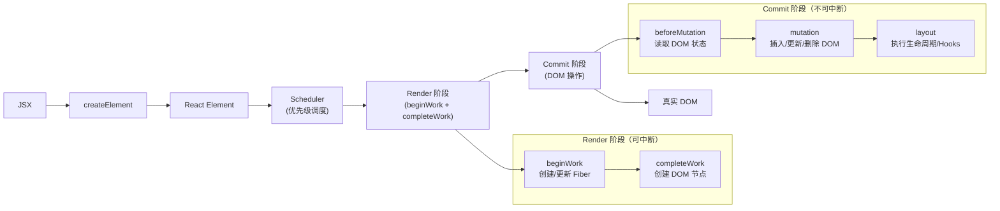

---

## 第2章：Fiber 架构

### 2.1 为什么需要 Fiber？

**背景问题**：React 16 之前的 Stack Reconciler 使用递归遍历虚拟 DOM 树进行 Diff，一旦开始就无法中断，导致：
1. **主线程阻塞**：复杂组件树的更新可能导致页面卡顿（超过 16ms 无法响应用户交互）
2. **无法优先级调度**：所有更新按顺序执行，无法区分紧急/非紧急更新

**解决方案**：Fiber 架构将递归改为**可中断的链表遍历**，每个 Fiber 节点代表一个工作单元。

### 2.2 FiberNode 数据结构详解

**📍 源码位置**：`packages/react-reconciler/src/ReactFiber.js:50-200`

```javascript
// packages/react-reconciler/src/ReactFiber.js:80-180（精简版）
function FiberNode(tag, pendingProps, key, mode) {
  // ========== 实例属性 ==========
  
  // 【标签】标识组件类型（FunctionComponent=0, ClassComponent=1, HostComponent=5...）
  this.tag = tag;
  
  // 【唯一键】用于 Diff 算法判断节点是否可复用
  this.key = key;
  
  // 【元素类型】对于 FunctionComponent 是函数本身，HostComponent 是 DOM 标签字符串
  this.elementType = null;  // 初始为 null，后续赋值
  this.type = null;         // 同 elementType（某些场景下可能不同）
  
  // 【状态节点】类组件对应实例，HostComponent 对应真实 DOM 节点
  this.stateNode = null;

  // ========== Fiber 架构相关 ==========
  
  // 【父节点指针】指向父 Fiber
  this.return = null;       // 注意：不是 parent，而是 return（返回方向）
  
  // 【子节点指针】指向第一个子 Fiber
  this.child = null;
  
  // 【兄弟节点指针】指向下一个兄弟 Fiber
  this.sibling = null;
  
  // 【索引】在父节点的 children 数组中的位置
  this.index = 0;

  // ========== Props & State 相关 ==========
  
  // 【缓存的 props】用于判断 props 是否变化
  this.memoizedProps = null;
  
  // 【缓存的 state】存放 hooks 链表头或类组件 state
  this.memoizedState = null;
  
  // 【更新队列】存放 pending 的更新（setState/useReducer dispatch）
  this.updateQueue = null;
  
  // 【缓存】用于 Offscreen 等场景
  this.cache = null;

  // ========== Effects 相关 ==========
  
  // 【副作用标记】 Placement(2) | Update(4) | Deletion(8) | Ref(16)...
  this.flags = NoFlags;
  
  // 【子树副作用标记】如果子树有副作用，会标记在此处
  this.subtreeFlags = NoFlags;
  
  // 【删除列表】记录需要删除的子节点
  this.deletions = null;

  // ========== 双缓存相关 ==========
  
  // 【 alternate 】指向另一棵树中的对应节点
  // current 树节点的 alternate 指向 workInProgress 树节点，反之亦然
  this.alternate = null;

  // ========== 调度优先级 ==========
  
  // 【 lanes 】该 Fiber 上待处理的更新优先级（二进制位）
  this.lanes = NoLanes;
  
  // 【 childLanes 】子树的 lanes 合并值
  this.childLanes = NoLands;
  
  // ========== 其他 ==========
  this.ref = null;
  this.pendingProps = pendingProps;
  this.mode = mode;
}
```

**tag 类型枚举**：

```javascript
// packages/react-reconciler/src/ReactWorkTags.js
export const FunctionComponent = 0;               // 函数组件
export const ClassComponent = 1;                  // 类组件
export const IndeterminateComponent = 2;          // 未确定类型（首次渲染时）
export const HostRoot = 3;                        // 根节点（FiberRoot）
export const HostPortal = 4;                      // Portal
export const HostComponent = 5;                   // 原生 DOM 元素（div/span...）
export const HostText = 6;                        // 文本节点
export const Fragment = 7;                        // Fragment
export const Mode = 8;                            // StrictMode/ConcurrentMode
export const ContextConsumer = 9;                 // Context.Consumer
export const ContextProvider = 10;                // Context.Provider
export const ForwardRef = 11;                     // forwardRef 包装
export const Profiler = 12;                       // DevTools Profiler
export const SuspenseComponent = 13;              // Suspense
export const MemoComponent = 14;                  // memo() 包装
export const LazyComponent = 15;                  // lazy() 包装
// ... 更多
```

**flags 副作用标记**：

```javascript
// packages/react-reconciler/src/ReactFiberFlags.js
export const Placement = /*                    */ 0b000000000000010;  // 2: 插入
export const Update = /*                      */ 0b000000000000100;  // 4: 更新
export const PlacementAndUpdate = /*           */ 0b000000000000110;  // 6: 插入并更新
export const Deletion = /*                    */ 0b000000001000000;  // 8: 删除
export const ContentReset = /*                */ 0b000000010000000;  // 16: 内容重置
export const Callback = /*                   */ 0b000000100000000;  // 32: 回调
export const DidCapture = /*                 */ 0b000001000000000;  // 64: 错误捕获
export const Ref = /*                        */ 0b000010000000000;  // 128: ref 变化
export const Snapshot = /*                   */ 0b000100000000000;  // 256: 快照（getSnapshotBeforeUpdate）
export const Passive = /*                   */ 0b001000000000000;  // 512: passive effect（useEffect）
```

**设计意图**：
- **链表结构**：相比递归栈，链表可以随时保存/恢复进度，实现时间切片
- **alternate 双缓存**：两棵树交替使用，避免直接修改 current 树导致不一致
- **位运算 flags**：使用二进制位运算高效合并/检测多种副作用（O(1) 复杂度）
- **return 而非 parent**：体现 Fiber 是"从子节点返回"的工作流模型

### 2.3 双缓存机制：current 树 vs workInProgress 树

**核心概念**：React 维护两棵 Fiber 树：
- **current 树**：屏幕上当前显示的 UI 对应的 Fiber 树
- **workInProgress 树**（WIP）：正在构建的新 Fiber 树

**📍 源码位置**：`packages/react-reconciler/src/ReactFiberWorkLoop.js:400-450`

```javascript
// packages/react-reconciler/src/ReactFiberWorkLoop.js:420-440（精简版）
function prepareFreshStack(root, lanes) {
  root.finishedWork = null;
  root.finishedLanes = NoLanes;
  
  // 从 current 根节点克隆出 workInProgress 根节点
  var workInProgress = root.current.alternate;
  
  if (workInProgress === null) {
    // 首次渲染：创建全新的 workInProgress 树
    workInProgress = createWorkInProgress(root.current, null);
    root.current.alternate = workInProgress;
    workInProgress.alternate = root.current;
  } else {
    // 更新：复用已有的 workInProgress 树（重置部分属性）
    workInProgress.childLanes = NoLanes;
    workInProgress.lanes = NoLanes;
  }
  
  return workInProgress;
}
```

**📍 源码位置**：`packages/react-reconciler/src/ReactFiber.new.js:100-150`

```javascript
// packages/react-reconciler/src/ReactFiber.new.js:120-140（精简版）
function createWorkInProgress(current, pendingProps) {
  var workInProgress = current.alternate;
  
  if (workInProgress === null) {
    // 创建新的 Fiber 节点作为 alternate
    workInProgress = createFiber(
      current.tag,
      pendingProps,
      current.key,
      current.mode
    );
    
    // 复制 immutable 属性（这些不会变）
    workInProgress.elementType = current.elementType;
    workInProgress.type = current.type;
    workInProgress.stateNode = current.stateNode;
    
    // 建立双向链接
    workInProgress.alternate = current;
    current.alternate = workInProgress;
  } else {
    // 复用已有节点：只重置需要变化的属性
    workInProgress.pendingProps = pendingProps;
    workInProgress.flags = NoFlags;        // 清除旧副作用
    workInProgress.subtreeFlags = NoFlags;
    workInProgress.deletions = null;
  }
  
  // 复制 mutable 属性（每次更新都可能变）
  workInProgress.childLanes = current.childLanes;
  workInProgress.lanes = current.lanes;
  workInProgress.memoizedProps = current.memoizedProps;
  workInProgress.memoizedState = current.memoizedState;
  workInProgress.updateQueue = current.updateQueue;
  workInProgress.ref = current.ref;
  
  return workInProgress;
}
```

**逐行注释**：

```javascript
// 1. 尝试获取 alternate（即另一棵树中对应的节点）
var workInProgress = current.alternate;

if (workInProgress === null) {
  // 首次渲染时 alternate 不存在，需要全新创建
  // 此时 current 和 workInProgress 形成双向引用
  workInProgress.alternate = current;
  current.alternate = workInProgress;
} else {
  // 更新时复用已有节点，避免 GC 压力
  // 只清除 flags 等临时属性，保留 memoizedState 等持久数据
  workInProgress.flags = NoFlags;  // 关键：清空上一次的副作用标记
}

// 这些属性需要在每轮更新时同步（因为它们可能在上次 commit 后被修改）
workInProgress.childLanes = current.childLanes;
workInProgress.lanes = current.lanes;
workInProgress.memoizedState = current.memoizedState;  // hooks 状态在这里！
```

**双缓存切换时机**：

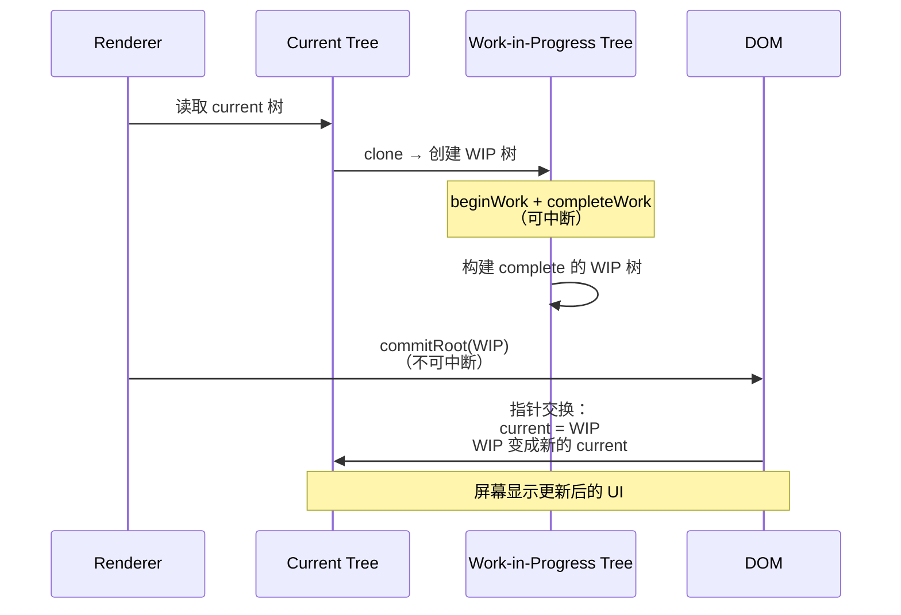

**设计意图**：
- **内存效率**：复用 Fiber 节点而非销毁重建，减少 GC 压力
- **一致性保证**：commit 阶段一次性切换 current 指针，确保 UI 始终一致
- **快速回滚**：如果 WIP 构建失败或被高优先级任务打断，可以直接丢弃 WIP 树，current 树不受影响

### 2.4 Fiber 创建流程：从 JSX 到 FiberNode

**完整链路**：`JSX → babel 编译 → createElement → React Element → reconcile → FiberNode`

**步骤 1：JSX 编译**

```jsx
// 用户写的 JSX
<App title="Hello">
  <div className="container">
    <span>{text}</span>
  </div>
</App>
```

编译后（React 17+ automatic runtime）：

```javascript
// Babel 转换结果
import { jsx as _jsx } from 'react/jsx-runtime';

function App({ title, children }) {
  const text = "World";
  return _jsx("div", {
    className: "container",
    children: _jsx("span", {
      children: text
    })
  });
}

_jsx(App, {
  title: "Hello",
  children: /* @__PURE__ */_jsx(App, { title: "Hello" })
});
```

**步骤 2：createElement 执行**

**📍 源码位置**：`packages/react/src/ReactElement.js:150-250`

```javascript
// packages/react/src/ReactElement.js:180-220（精简版）
function createElement(type, config, children) {
  var propName;
  var props = {};
  var key = null;
  var ref = null;
  var self = null;
  var source = null;
  
  // 1. 提取 key、ref、self、source 等保留属性
  if (config != null) {
    ref = config.ref === undefined ? null : config.ref;
    key = config.key === undefined ? null : '' + config.key;
    self = config.__self === undefined ? null : config.__self;
    source = config.__source === undefined ? null : config.__source;
    
    // 2. 将剩余属性复制到 props
    for (propName in config) {
      if (
        hasOwnProperty.call(config, propName) &&
        !RESERVED_PROPS.hasOwnProperty(propName)
      ) {
        props[propName] = config[propName];
      }
    }
  }
  
  // 3. 处理 children（可以是单个、数组或嵌套）
  var childrenLength = arguments.length - 2;
  if (childrenLength === 1) {
    props.children = children;
  } else if (childrenLength > 1) {
    var childArray = Array(childrenLength);
    for (var i = 0; i < childrenLength; i++) {
      childArray[i] = arguments[i + 2];
    }
    props.children = childArray;
  }
  
  // 4. 处理默认 props（如果是组件类型）
  if (type && type.defaultProps) {
    var defaultProps = type.defaultProps;
    for (propName in defaultProps) {
      if (props[propName] === undefined) {
        props[propName] = defaultProps[propName];
      }
    }
  }
  
  // 5. 返回 React Element（轻量级对象，不是 Fiber！）
  return ReactElement(type, key, ref, self, source, ReactCurrentOwner.current, props);
}

function ReactElement(type, key, ref, self, source, owner, props) {
  var element = {
    $$typeof: REACT_ELEMENT_TYPE,  // 特殊标记，防止 XSS 攻击
    type: type,                     // 组件类型或 DOM 标签
    key: key,                       // 唯一键
    ref: ref,                       // 引用
    props: props,                   // 属性（含 children）
    _owner: owner,                  // 当前正在创建的组件
  };
  
  return element;
}
```

**步骤 3：Reconciler 创建 Fiber**

**📍 源码位置**：`packages/react-reconciler/src/ReactFiberBeginWork.js:300-350`

```javascript
// packages/react-reconciler/src/ReactFiberBeginWork.js:320-340（精简版）
function beginWork(current, workInProgress, renderLanes) {
  switch (workInProgress.tag) {
    case FunctionComponent:
      return updateFunctionComponent(current, workInProgress, renderLanes);
    case ClassComponent:
      return updateClassComponent(current, workInProgress, renderLanes);
    case HostComponent:
      return updateHostComponent(workInProgress);
    case HostText:
      return updateHostText(workInProgress);
    default:
      throw new Error('Unknown unit of work tag');
  }
}
```

### 2.5 Lanes 优先级模型

**背景**：React 16 使用 `expirationTime` 表示优先级，存在精度问题。React 17+ 引入 **Lanes 模型**（车道模型），使用二进制位表示优先级。

**📍 源码位置**：`packages/react-reconciler/src/ReactFiberLane.js:20-100`

```javascript
// packages/react-reconciler/src/ReactFiberLane.js:25-70（精简版）
// 总共 31 个 lane 位（使用 32 位整数）

// ====== 同步 Lane（最高优先级）=====
export const SyncLane: Lane = /*                         */ 0b0000000000000000000000000000001;
export const SyncBatchedLane: Lane = /*                  */ 0b0000000000000000000000000000010;

// ====== 连续交互 Lane（用户输入）=====
export const InputContinuousHydrationLane: Lane = /*    */ 0b0000000000000000000000000000100;
export const InputContinuousLane: Lane = /*             */ 0b0000000000000000000000000001000;

// ====== 默认 Lane（常规更新）=====
export const DefaultHydrationLane: Lane = /*            */ 0b0000000000000000000000000010000;
export const DefaultLane: Lane = /*                     */ 0b0000000000000000000000000100000;

// ====== Transition Lanes（低优先级的批量更新）=====
const TransitionLanes: Lanes = /*                       */ 0b0000000001111111110000000000000;

// ====== Idle Lane（最低优先级）=====
export const IdleLane: Lane = /*                       */ 0b0001000000000000000000000000000;
```

**Lanes 位运算操作**：

```javascript
// packages/react-reconciler/src/ReactFiberLane.js:150-250（精简版）

// 合并多个 lane（按位或）
function mergeLanes(a, b) { return a | b; }

// 移除某个 lane（按位与非）
function removeLanes(lane, lanes) { return lane & ~lanes; }

// 是否包含某个 lane（按位与）
function isSubsetOfLanes(set, subset) { return (set & subset) === subset; }

// 获取最高优先级 lane（取最低位的 1）
function getHighestPriorityLane(lanes) {
  return lanes & -lanes;  // 利用补码特性
}
```

**设计意图**：
- **位运算高效**：合并、删除、检测都是 O(1) 位运算
- **批量并发**：多个相同优先级的更新可以合并到一个 lane
- **饥饿预防**：低优先级任务最终会被提升

### 2.6 手写实现：mini-Fiber 架构

```javascript
/**
 * mini-Fiber 架构实现
 */

// Tag 类型
const FunctionComponent = 0;
const HostComponent = 1;
const HostText = 2;
const Root = 3;

// Flags
const NoFlags = 0b0000;
const Placement = 0b0001;
const Update = 0b0010;
const Deletion = 0b0100;

class FiberNode {
  constructor(tag, key) {
    this.tag = tag;
    this.key = key;
    this.type = null;
    this.stateNode = null;
    this.return = null;
    this.child = null;
    this.sibling = null;
    this.index = 0;
    this.pendingProps = null;
    this.memoizedProps = null;
    this.memoizedState = null;
    this.updateQueue = null;
    this.flags = NoFlags;
    this.subtreeFlags = 0;
    this.alternate = null;
  }
}

class FiberRootNode {
  constructor(container) {
    this.container = container;
    this.current = null;
    this.workInProgress = null;
  }

  initRootNode() {
    const rootFiber = new FiberNode(Root, 'root');
    rootFiber.stateNode = this;
    this.current = rootFiber;
    this.workInProgress = this.createWorkInProgress(rootFiber);
    console.log('[FiberRoot] 初始化完成 ✓');
  }

  createWorkInProgress(current) {
    let wip = current.alternate;
    
    if (!wip) {
      wip = new FiberNode(current.tag, current.key);
      wip.type = current.type;
      wip.stateNode = current.stateNode;
      wip.alternate = current;
      current.alternate = wip;
    } else {
      wip.pendingProps = current.pendingProps;
      wip.flags = NoFlags;
      wip.memoizedState = current.memoizedState;
    }
    
    return wip;
  }

  commitRoot() {
    console.log('[commitRoot] 切换指针...');
    this.current = this.workInProgress;
    this.workInProgress = null;
    console.log('✅ 提交完成！');
  }
}

function createFiberFromElement(element) {
  const { type, key, props } = element;
  const tag = typeof type === 'string' ? HostComponent : FunctionComponent;
  const fiber = new FiberNode(tag, key);
  fiber.type = type;
  fiber.pendingProps = props;
  return fiber;
}

function createFiberFromText(content) {
  const fiber = new FiberNode(HostText, null);
  fiber.type = 'TEXT';
  fiber.pendingProps = { content };
  fiber.stateNode = content;
  return fiber;
}

function reconcileChildren(parentFiber, elements) {
  if (!elements || !elements.length) {
    parentFiber.child = null;
    return;
  }
  
  const arr = Array.isArray(elements) ? elements : [elements];
  let prev = null, first = null;
  
  arr.forEach((el, i) => {
    let child;
    if (typeof el === 'string' || typeof el === 'number') {
      child = createFiberFromText(String(el));
    } else if (el?.type) {
      child = createFiberFromElement(el);
    } else { return; }
    
    child.return = parentFiber;
    child.index = i;
    
    if (!first) first = child;
    else prev.sibling = child;
    prev = child;
  });
  
  parentFiber.child = first;
}

function h(type, props, ...children) {
  return {
    $$typeof: Symbol.for('react.element'),
    type,
    key: props?.key || null,
    props: { ...props, children: children.length <= 1 ? children[0] : children },
  };
}

// 测试
console.log('='.repeat(50));
console.log('🚀 mini-Fiber 演示\n');

const vdom = h('div', { id: 'app' },
  h('h1', { key: 'title' }, 'Hello Mini-Fiber!'),
  h('p', { key: 'desc' }, '简化版 Fiber 实现')
);

const root = new FiberRootNode(document.createElement('div'));
root.initRootNode();
reconcileChildren(root.workInProgress || root.current, [vdom]);

function printTree(fiber, indent = '') {
  if (!fiber) return;
  console.log(`${indent}├─ ${fiber.type || 'Root'} [${fiber.key}]`);
  printTree(fiber.child, indent + '│  ');
  printTree(fiber.sibling, indent + '│  ');
}

printTree((root.workInProgress || root.current).child);

module.exports = { FiberNode, FiberRootNode, reconcileChildren, h };
```

### 2.7 Mermaid 图：Fiber 数据结构关系图

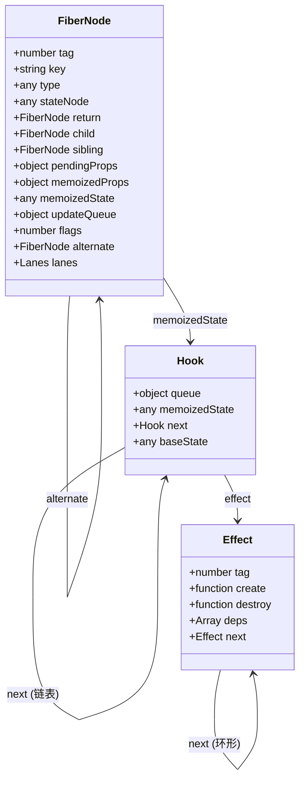

---

## 第3章：Scheduler 调度系统

### 3.1 Scheduler 整体架构

Scheduler 是 React 并发特性的基础，负责：
1. **优先级排序**：决定哪些任务先执行
2. **时间切片**：将长任务拆分为小块，避免阻塞主线程
3. **任务调度**：使用 `MessageChannel`/`macrotask` 实现异步调度

### 3.2 优先级队列实现（最小堆）

**📍 源码位置**：`packages/scheduler/src/SchedulerMinHeap.js`

```javascript
// 最小堆实现：维护按 sortIndex 排序的任务队列
// 时间复杂度：插入 O(log n)，取出 O(log n)

class MinHeap {
  constructor() { this.heap = []; }
  
  push(node) {
    this.heap.push(node);
    this._siftUp(this.heap.length - 1);
  }
  
  pop() {
    if (!this.heap.length) return null;
    const top = this.heap[0];
    const last = this.heap.pop();
    if (this.heap.length) {
      this.heap[0] = last;
      this._siftDown(0);
    }
    return top;
  }
  
  peek() {
    return this.heap[0] || null;
  }
  
  _siftUp(i) {
    while (i > 0) {
      const p = (i - 1) >> 1;
      if (this._compare(p, i) > 0) {
        [this.heap[p], this.heap[i]] = [this.heap[i], this.heap[p]];
        i = p;
      } else break;
    }
  }
  
  _siftDown(i) {
    const len = this.heap.length;
    while ((i << 1) + 1 < len) {
      const l = (i << 1) + 1, r = l + 1;
      const left = this.heap[l], right = r < len ? this.heap[r] : null;
      
      if (right && this._compare(right, left) < 0) {
        if (this._compare(right, i) < 0) {
          [this.heap[i], this.heap[r]] = [this.heap[right], this.heap[i]];
          i = r;
        } else break;
      } else if (this._compare(left, i) < 0) {
        [this.heap[i], this.heap[l]] = [this.heap[left], this.heap[l]];
        i = l;
      } else break;
    }
  }
  
  _compare(a, b) {
    const diff = a.sortIndex - b.sortIndex;
    return diff !== 0 ? diff : a.id - b.id;
  }
}
```

**设计意图**：
- **最小堆 vs 排序数组**：插入/删除都是 O(log n)，比每次重新排序 O(n log n) 高效
- **双字段比较**：先看优先级，再看插入顺序（FIFO），保证公平性
- **位运算优化**：`(index - 1) >>> 1` 比 `Math.floor((index-1)/2)` 快

### 3.3 scheduleCallback 核心逻辑

**📍 源码位置**：`packages/scheduler/src/Scheduler.js:130-190`

```javascript
function unstable_scheduleCallback(priorityLevel, callback, options) {
  var currentTime = getCurrentTime();
  var startTime = options?.delay ? currentTime + options.delay : currentTime;
  
  var timeout;
  switch (priorityLevel) {
    case ImmediatePriority: timeout = SYNC_TIMEOUT; break;     // -1ms
    case UserBlockingPriority: timeout = USER_BLOCKING_TIMEOUT; break; // 250ms
    case IdlePriority: timeout = IDLE_TIMEOUT; break;          // ∞
    default: timeout = NORMAL_TIMEOUT; break;                  // 5000ms
  }
  
  var expirationTime = startTime + timeout;
  var newNode = {
    id: taskIdCounter++,
    callback, priorityLevel, startTime, expirationTime, sortIndex: -1
  };
  
  if (startTime > currentTime) {
    newNode.sortIndex = startTime;
    push(timerQueue, newNode);  // 延迟任务队列
  } else {
    newNode.sortIndex = expirationTime;
    push(taskQueue, newNode);   // 即时任务队列
    if (!isHostCallbackScheduled && !isPerformingWork) {
      isHostCallbackScheduled = true;
      requestHostCallback(flushWork);
    }
  }
  
  return newNode;
}
```

### 3.4 workLoopConcurrent 与 workLoopSync

**📍 源码位置**：`packages/react-reconciler/src/ReactFiberWorkLoop.js:430-480`

```javascript
function workLoopSync() {
  // 同步模式：一口气做完，不检查中断
  while (workInProgress !== null) {
    performUnitOfWork(workInProgress);
  }
}

function workLoopConcurrent() {
  // 并发模式：每次处理后检查是否应该中断
  while (workInProgress !== null && !shouldYieldToHost()) {
    performUnitOfWork(workInProgress);
  }
}
```

**关键区别**：

| 特性 | workLoopSync | workLoopConcurrent |
|------|-------------|-------------------|
| **中断检查** | ❌ 不检查 | ✅ 每次 performUnit 后检查 |
| **使用场景** | Legacy 模式 / flushSync | Concurrent 模式 |
| **用户体验** | 可能长时间阻塞 | 保持响应式（≤5ms 一帧） |

### 3.5 shouldYieldToHost — 时间切片实现

**📍 源码位置**：`packages/scheduler/src/SchedulerHostConfig.default.js:65-90`

```javascript
var frameInterval = 5;  // 每帧 5ms 时间片

function shouldYieldToHost() {
  const timeElapsed = performance.now() - startTime;
  if (timeElapsed < frameInterval) return false;
  
  // 使用 isInputPending API 检查是否有用户输入
  if (navigator.scheduling?.isInputPending?.()) {
    return true;
  }
  
  return timeElapsed >= frameInterval;
}
```

**设计意图**：
- **5ms 时间片**：平衡渲染进度和响应速度的经验值
- **协作式调度**：React 主动让出控制权，而非被操作系统抢占

### 3.6 手写实现：mini-scheduler

```javascript
/**
 * mini-Scheduler 实现
 */

const Priority = {
  IMMEDIATE: 1,
  USER_BLOCKING: 2,
  NORMAL: 3,
  LOW: 4,
  IDLE: 5,
};

const TIMEOUT = {
  [Priority.IMMEDIATE]: -1,
  [Priority.USER_BLOCKING]: 250,
  [Priority.NORMAL]: 5000,
  [Priority.LOW]: 10000,
  [Priority.IDLE]: Infinity,
};

class MinHeap {
  constructor() { this.heap = []; }
  push(n) { this.heap.push(n); this._up(this.heap.length - 1); }
  pop() {
    if (!this.heap.length) return null;
    const t = this.heap[0], l = this.heap.pop();
    if (this.heap.length) { this.heap[0] = l; this._down(0); }
    return t;
  }
  peek() { return this.heap[0] || null; }
  isEmpty() { return !this.heap.length; }
  
  _up(i) {
    while (i > 0) {
      const p = (i - 1) >> 1;
      if (this._cmp(p, i) > 0) { [this.heap[p], this.heap[i]] = [this.heap[i], this.heap[p]]; i = p; }
      else break;
    }
  }
  _down(i) {
    const len = this.heap.length;
    while ((i << 1) + 1 < len) {
      const l = (i << 1) + 1, r = l + 1;
      const lc = this.heap[l], rc = r < len ? this.heap[r] : null;
      if (rc && this._cmp(rc, lc) < 0) {
        if (this._cmp(rc, i) < 0) { [this.heap[i], this.heap[r]] = [this.heap[this.heap[r]], this.heap[i]]; i = r; }
        else break;
      } else if (this._cmp(lc, i) < 0) { [this.heap[i], this.heap[l]] = [this.heap[lc], this.heap[l]]; i = l; }
      else break;
    }
  }
  _cmp(a, b) { const d = a.sortIndex - b.sortIndex; return d !== 0 ? d : a.id - b.id; }
}

let taskId = 0;
class Task {
  constructor(cb, pri, opts = {}) {
    this.id = ++taskId; this.callback = cb; this.priority = pri;
    this.startTime = opts.delay ? Date.now() + opts.delay : Date.now();
    this.expirationTime = this.startTime + (TIMEOUT[pri] ?? TIMEOUT[Priority.NORMAL]);
    this.sortIndex = -1; this.cancelled = false;
  }
  cancel() { this.cancelled = true; this.callback = null; }
}

class Scheduler {
  constructor(opts = {}) {
    this.taskQ = new MinHeap(); this.timerQ = new MinHeap();
    this.frameInterval = opts.frameInterval || 5;
    this.startTime = -1; this.processing = false;
    this.stats = { total: 0, done: 0, cancelled: 0, yielded: 0 };
  }
  
  schedule(cb, pri = Priority.NORMAL, opts = {}) {
    const task = new Task(cb, pri, opts);
    this.stats.total++;
    
    if (task.startTime > Date.now()) {
      task.sortIndex = task.startTime;
      this.timerQ.push(task);
      if (opts.delay) setTimeout(() => this._checkTimers(), opts.delay);
    } else {
      task.sortIndex = task.expirationTime;
      this.taskQ.push(task);
      this._requestSchedule();
    }
    return task;
  }
  
  cancel(task) {
    if (task) { task.cancel(); this.stats.cancelled++; }
  }
  
  loop(concurrent = true) {
    if (this.processing) return;
    this.processing = true;
    this.startTime = performance.now();
    
    while (!this.taskQ.isEmpty()) {
      if (concurrent && this._shouldYield()) {
        this.stats.yielded++;
        setTimeout(() => this.loop(true), 0);
        return;
      }
      
      const task = this.taskQ.pop();
      if (!task || task.cancelled) continue;
      
      try {
        const cont = task.callback();
        if (typeof cont === 'function') {
          task.callback = cont; this.taskQ.push(task);
        } else { this.stats.done++; }
      } catch (e) { this.stats.done++; }
    }
    
    this.processing = false;
    console.log(`[Scheduler] 完成！总:${this.stats.total} 完成:${this.stats.done}`);
  }
  
  flushSync() { this.loop(false); }
  flushAsync() { this.loop(true); }
  
  _requestSchedule() {
    setTimeout(() => { this.flushAsync(); }, 0);
  }
  
  _checkTimers() {
    const now = Date.now();
    while (!this.timerQ.isEmpty()) {
      const t = this.timerQ.peek();
      if (t.startTime > now) break;
      this.timerQ.pop(); t.sortIndex = t.expirationTime; this.taskQ.push(t);
    }
    if (!this.taskQ.isEmpty()) this._requestSchedule();
  }
  
  _shouldYield() { return performance.now() - this.startTime >= this.frameInterval; }
}

// 测试
console.log('='.repeat(50));
console.log('⏱️ mini-Scheduler\n');

const s = new Scheduler({ frameInterval: 5 });

s.schedule(() => console.log('▶️ 任务1：高优先级'), Priority.IMMEDIATE);
s.schedule(() => { console.log('▶️ 任务2：正常'); let x=0; for(let i=0;i<1e6;i++)x+=i; }, Priority.NORMAL);
const t3 = s.schedule(() => console.log('▶️ 任务3：低'), Priority.LOW);
s.cancel(t3);
s.schedule(() => console.log('▶️ 任务4：紧急'), Priority.IMMEDIATE);

setTimeout(() => s.flushSync(), 10);

module.exports = { Scheduler, Priority, MinHeap };
```

### 3.7 Mermaid 图：调度优先级层级

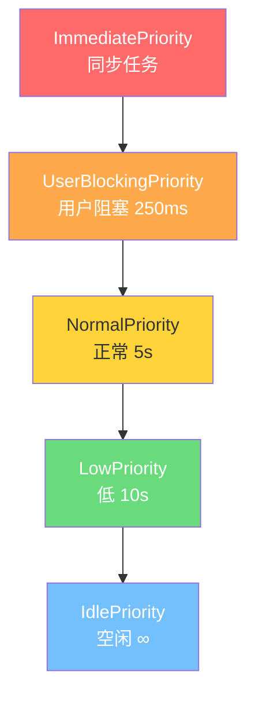

---

## 第4章：Render 阶段

### 4.1 Render 阶段概述

Render 阶段是 Fiber 构建过程，主要做两件事：
1. **beginWork**：向下遍历，创建/更新 Fiber 节点
2. **completeWork**：向上归并，创建 DOM 节点、收集 effects

**重要特点**：Render 阶段**可以被打断**（Concurrent 模式下），因为此时还没有操作真实 DOM。

### 4.2 beginWork 详解

**📍 源码位置**：`packages/react-reconciler/src/ReactFiberBeginWork.js:320-380`

```javascript
function beginWork(current, workInProgress, renderLanes) {
  // Bailout 优化：检查是否可以跳过
  if (current !== null) {
    const oldProps = current.memoizedProps;
    const newProps = workInProgress.pendingProps;
    
    if (oldProps !== newProps || hasLegacyContextChanged()) {
      didReceiveUpdate = true;
    } else if (!includesSomeLane(renderLanes, updateLanes)) {
      // props 没变且无待处理更新 → 跳过！
      return bailoutOnAlreadyFinishedWork(current, workInProgress, renderLanes);
    }
  }
  
  switch (workInProgress.tag) {
    case FunctionComponent:
      return updateFunctionComponent(current, workInProgress, renderLanes);
    case ClassComponent:
      return updateClassComponent(current, workInProgress, renderLanes);
    case HostComponent:
      return updateHostComponent(workInProgress);
    case HostText:
      return updateHostText(workInProgress);
    default:
      throw new Error('Unknown tag');
  }
}
```

**Bailout 优化**是 React 性能的关键：在执行组件函数前就判断是否可以跳过整个子树。

### 4.3 reconcileChildren — 协调子节点

**📍 源码位置**：`packages/react-reconciler/src/ReactChildFiber.js:850-1150`

```javascript
function reconcileChildFibers(returnFiber, currentFirstChild, newChild, lanes) {
  // 处理各种类型的 children
  
  if (newChild === null || typeof newChild === 'boolean') {
    deleteRemainingChildren(returnFiber, currentFirstChild);
    return null;
  }
  
  const isObject = typeof newChild === 'object' && newChild !== null;
  
  if (isObject) {
    switch (newChild.$$typeof) {
      case REACT_ELEMENT_TYPE:
        return placeSingleChild(reconcileSingleElement(...));
      case REACT_PORTAL_TYPE:
        return placeSingleChild(reconcileSinglePortal(...));
    }
  }
  
  if (isArray(newChild)) {
    return reconcileChildrenArray(...);  // 多节点 Diff
  }
  
  // 文本/数字
  if (isObject || typeof newChild === 'number') {
    return placeSingleChild(reconcileSingleTextNode(...));
  }
  
  deleteRemainingChildren(returnFiber, currentFirstChild);
  return null;
}
```

### 4.4 Diff 协调算法核心

#### sameNode 判断

```javascript
function sameNode(a, b) {
  return (a.key === b.key) && (a.type === b.type);
}
```

只比较 **key** 和 **type**，不比较 props（props 不同也可以复用，后续通过 Update 标记处理）。

#### 多节点 Diff 策略

| 步骤 | 操作 | 说明 |
|------|------|------|
| **第一轮** | 两端同步比较 | 从左往右逐一比较 |
| **第二轮** | 旧节点存 Map | 以 key 为键建立映射 |
| **第三轮** | 新节点查找复用 | 从 Map 中查找可复用节点 |
| **收尾** | 删除未复用 | Map 中剩下的都删除 |

**设计意图**：只做同层比较，跨层级移动视为删除+新建（O(n) vs O(n³) 权衡）。

### 4.5 completeWork 详解

**📍 源码位置**：`packages/react-reconciler/src/ReactFiberCompleteWork.js:250-550`

```javascript
function completeWork(current, workInProgress, renderLanes) {
  const newProps = workInProgress.pendingProps;
  
  switch (workInProgress.tag) {
    case HostComponent: {
      popHostContext(workInProgress);
      
      if (current !== null && workInProgress.stateNode != null) {
        // Update：更新已有 DOM
        updateHostComponent(current, workInProgress, type, newProps, oldProps);
      } else {
        // Mount：创建新 DOM
        const instance = createInstance(type, newProps, ...);
        appendAllChildren(instance, workInProgress);  // 追加子 DOM
        workInProgress.stateNode = instance;           // 建立 Fiber↔DOM 映射
        finalizeInitialChildren(instance, type, newProps);
      }
      bubbleProperties(workInProgress);  // 收集子树 effects
      return null;
    }
    
    case HostText: {
      if (!workInProgress.stateNode) {
        workInProgress.stateNode = createTextInstance(newProps);
      }
      bubbleProperties(workInProgress);
      return null;
    }
    
    default:
      bubbleProperties(workInProgress);
      return null;
  }
}

function bubbleProperties(completedWork) {
  // 向上冒泡合并子树的副作用标记
  let subtreeFlags = NoFlags;
  let child = completedWork.child;
  while (child !== null) {
    subtreeFlags |= child.subtreeFlags | child.flags;
    child = child.sibling;
  }
  completedWork.subtreeFlags = subtreeFlags;
}
```

### 4.6 手写实现：mini-render

```javascript
/**
 * mini-Render 实现
 */

const Tag = { ROOT: 0, HOST: 1, TEXT: 2, FUNC: 3 };
const Flag = { NONE: 0, PLACEMENT: 1, UPDATE: 2 };

class Fiber {
  constructor(tag, key) {
    this.tag = tag; this.key = key; this.type = null;
    this.stateNode = null; this.return = null;
    this.child = null; this.sibling = null;
    this.props = null; this.memoizedProps = null;
    this.flags = Flag.NONE; this.subtreeFlags = 0;
    this.alternate = null;
  }
}

function beginWork(cur, wip) {
  // Bailout 检查
  if (cur && cur.memoizedProps === wip.props) return null;
  
  switch (wip.tag) {
    case Tag.FUNC:
      try {
        const kids = wip.type(wip.props);
        reconcile(wip, Array.isArray(kids) ? kids : [kids]);
        return wip.child;
      } catch(e) { return null; }
    case Tag.HOST:
      reconcile(wip, Array.isArray(wip.props.children) ? wip.props.children : [wip.props.children]);
      return wip.child;
    default: return null;
  }
}

function reconcile(parent, children) {
  if (!children?.length) { parent.child = null; return; }
  let prev = null, first = null;
  
  children.forEach((c, i) => {
    let f;
    if (typeof c === 'string' || typeof c === 'number') {
      f = new Fiber(Tag.TEXT, null); f.type = 'TEXT'; f.props = { content: String(c) };
    } else if (c?.$$typeof) {
      f = new Fiber(typeof c.type === 'string' ? Tag.HOST : TagFUNC, c.key);
      f.type = c.type; f.props = c.props;
    } else return;
    
    f.return = parent; f.flags |= Flag.PLACEMENT;
    if (!first) first = f; else prev.sibling = f;
    prev = f;
  });
  
  parent.child = first;
}

function completeWork(cur, wip) {
  switch (wip.tag) {
    case Tag.HOST:
      if (!wip.stateNode) {
        wip.stateNode = document.createElement(wip.type);
        Object.entries(wip.props || {}).filter(([k]) => !['children','key'].includes(k))
          .forEach(([k,v]) => wip.stateNode.setAttribute(k, v));
        appendKids(wip);
      }
      bubble(wip); break;
    case Tag.TEXT:
      if (!wip.stateNode) wip.stateNode = document.createTextNode(wip.props.content);
      bubble(wip); break;
    default: bubble(wip);
  }
}

function appendKids(p) {
  let c = p.child;
  while (c) { if (c.stateNode) p.stateNode.appendChild(c.stateNode); c = c.sibling; }
}

function bubble(w) {
  let f = 0, c = w.child;
  while (c) { f |= c.subtreeFlags | c.flags; c = c.sibling; }
  w.subtreeFlags = f;
}

function workLoop(root) {
  let wip = root.current;
  while (wip) {
    const next = beginWork(wip.alternate, wip);
    if (!next) {
      do { completeWork(wip.alternate, wip); if (wip.sibling) { wip = wip.sibling; break; } wip = wip.return; } while (wip);
    } else { wip = next; }
  }
  console.log('✅ Render 完成！');
}

// 测试
function h(t, p, ...c) { return { $$typeof: Symbol.for('r.e'), type:t, key:p?.key||null, props:{...p,children:c.length<=1?c[0]:c} }; }
function Welcome({n}) { return h('div',{},h('h1',{k:'t'},`Hi ${n}!`),h('p',{k:'d'},'Welcome')); }
function App() { return h('div',{cls:'app'},h(Welcome,{k:'w',n:'World'}),h('footer',{k:'f'},'©2024')); }

const root = new Fiber(Tag.ROOT,'root'); root.props={children:h(App)};
console.log('='.repeat(40)+'\n🎨 mini-Render\n');
workLoop({current:root});
console.log('='.repeat(40));

module.exports = { Fiber, beginWork, completeWork, workLoop };
```

### 4.7 Mermaid 图：Render 阶段流程

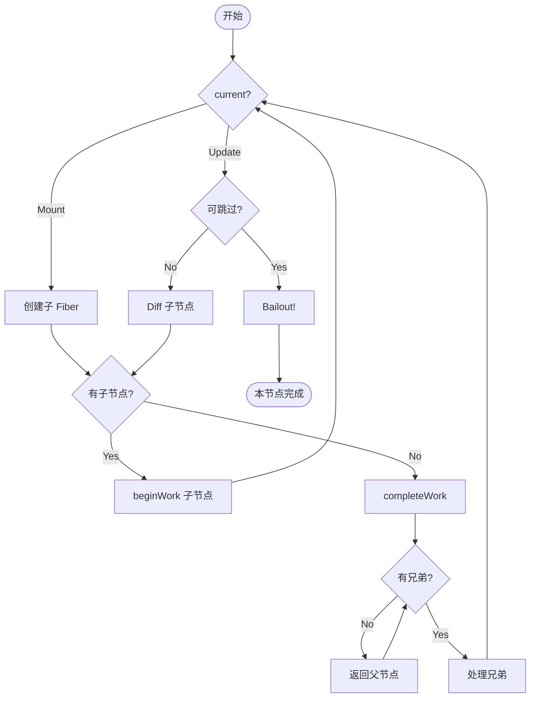

---

## 第5章：Commit 阶段

### 5.1 Commit 阶段概述

Commit 阶段是**真正操作 DOM**的阶段，分为三个子阶段：
1. **Before Mutation**：读取 DOM 状态
2. **Mutation**：执行 DOM 操作（插入/更新/删除）
3. **Layout**：执行生命周期/Hook 回调

**重要特点**：Commit 阶段**不可打断**，必须一气呵成。

### 5.2 commitRoot 入口

**📍 源码位置**：`packages/react-reconciler/src/ReactFiberCommitWork.js:70-140`

```javascript
function commitRoot(root) {
  const finishedWork = root.finishedWork;
  
  // 第一阶段：Before Mutation
  commitBeforeMutationEffects(firstEffect);
  
  // 第二阶段：Mutation（真正的 DOM 操作）
  commitMutationEffects(firstEffect, root);
  
  // ⭐ 切换 current 指针
  root.current = finishedWork;
  
  // 第三阶段：Layout
  commitLayoutEffects(finishedWork, root);
  
  // 异步 flush passive effects（useEffect）
  flushPassiveEffects();
}
```

### 5.3 DOM 操作类型

#### Placement（插入）

```javascript
function commitPlacement(finishedWork) {
  const parentStateNode = getHostParent(finishedWork).stateNode;
  const before = getHostSibling(finishedWork);  // 参考节点
  
  insertOrAppendPlacementNode(finishedWork, before, parentStateNode);
}
```

#### Update（更新）

```javascript
function updateDOMProperties(domElement, updatePayload) {
  // updatePayload: [key1, val1, key2, val2, ...]
  // 偶数索引是属性名，奇数是新值（null 表示删除）
  for (let i = 0; i < updatePayload.length; i += 2) {
    setValueForProperty(domElement, updatePayload[i], updatePayload[i + 1]);
  }
}
```

#### Deletion（删除）

```javascript
function commitDeletion(finishedWork) {
  // 1. 递归卸载子树（调用 cleanup 函数）
  unmountHostComponents(finishedWork);
  // 2. 从 DOM 移除
  removeChild(finishedWork.stateNode, getHostParent(finishedWork).stateNode);
}
```

### 5.4 useLayoutEffect vs useEffect 执行时机

```
commitMutationEffects(DOM更新) 
  ↓
root.current = finishedWork (切换指针)
  ↓
commitLayoutEffects()
  ├─ useLayoutEffect (同步) ← 这里执行
  ├─ ref 回调 (同步)
  └─ componentDidMount (同步)
  ↓
浏览器绘制 🔴 (用户看到更新)
  ↓
flushPassiveEffects() (异步 setTimeout)
  └─ useEffect (create/destroy) ← 这里执行
```

### 5.5 Mermaid 图：Commit 三阶段时序

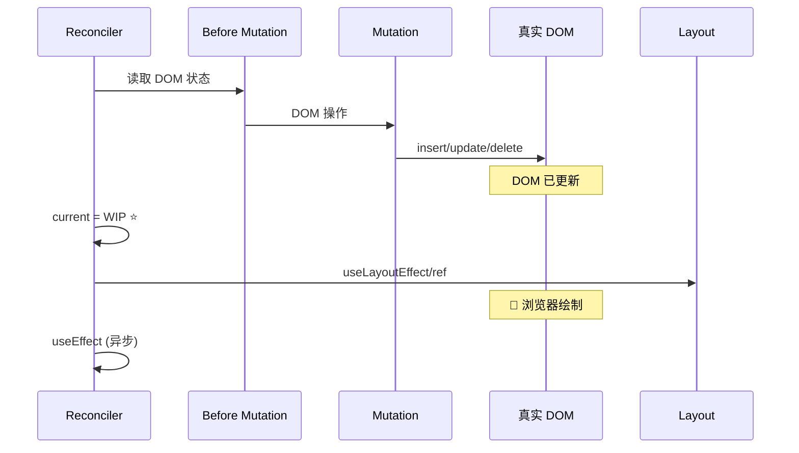

---

## 第6章：Hooks 原理

### 6.1 Hooks 链表结构

**📍 源码位置**：`packages/react-reconciler/src/ReactFiberHooks.js:120-180`

Hooks 以**链表**形式存储在 `Fiber.memoizedState` 上：

```
Fiber.memoizedState
    ↓
┌─────────────┐   next   ┌─────────────┐   next   ┌─────────────┐
│  Hook #1     │ ─────→ │  Hook #2     │ ─────→ │  Hook #3     │
│ (useState)  │         │ (useEffect) │         │ (useMemo)    │
│             │         │             │         │             │
│ memoizedS=  │         │ memoizedS=  │         │ memoizedS=  │
│   count     │         │   effect    │         │   value     │
│             │         │             │         │             │
│ updateQueue │         │ updateQueue │         │ updateQueue │
│  (循环链表) │         │   = null    │         │   = null    │
└─────────────┘         └─────────────┘         └─────────────┘
```

**Hook 对象结构**：

```javascript
function Hook() {
  this.memoizedState = null;   // 当前状态值/effect对象
  this.updateQueue = null;     // 更新队列（循环链表）
  this.baseState = null;       // 基础状态
  this.baseQueue = null;       // 基础队列
  this.next = null;            // 下一个 hook
}
```

### 6.2 useState 实现原理

**📍 源码位置**：`packages/react-reconciler/src/ReactFiberHooks.js:1520-1630`

```javascript
function mountState(initialState) {
  const hook = mountWorkInProgressHook();  // 创建并加入链表
  
  // 初始化状态（支持惰性初始化函数）
  hook.memoizedState = typeof initialState === 'function'
    ? initialState()
    : initialState;
  
  // 创建更新队列
  const queue = (hook.updateQueue = createUpdateQueue());
  
  // dispatch 函数（即 setState）
  const dispatch = dispatchSetState.bind(null, currentlyRenderingFiber, queue);
  
  return [hook.memoizedState, dispatch];  // 返回 [state, setState]
}

function dispatchSetState(fiber, queue, action) {
  // 创建 update 对象
  const update = {
    lane: requestUpdateLane(),
    action,                    // 新 state 或 updater 函数
    hasEagerState: false,
    eagerState: null,
    next: null,
  };
  
  // 优化：如果是 render 阶段的更新，尝试直接计算
  if (isRenderPhaseUpdate(fiber)) {
    enqueueRenderPhaseUpdate(queue, update);
  } else {
    enqueueUpdate(fiber, queue, update);  // 加入更新队列
    scheduleUpdateOnFiber(fiber, lane, eventTime);  // 触发重新渲染
  }
}

// 处理更新队列，计算新 state
function processUpdateQueue(baseState, pendingQueue, ...) {
  let newState = baseState;
  let update = pendingQueue.baseQueue.first;  // 循环链表
  
  do {
    const action = update.action;
    if (typeof action === 'function') {
      newState = action(newState);  // 函数式更新：setState(prev => prev + 1)
    } else {
      newState = action;            // 直接赋值：setState(newValue)
    }
    update = update.next;
  } while (update !== pendingQueue.baseQueue.first);  // 循环链表遍历
  
  return newState;
}
```

**Bailout 优化**：`Object.is(oldState, newState)` 比较，相同则跳过重渲染。

### 6.3 useEffect 实现原理

**📍 源码位置**：`packages/react-reconciler/src/ReactFiberHooks.js:2800-2950`

```javascript
function mountEffect(create, deps) {
  const hook = mountWorkInProgressHook();
  
  // 创建 effect 对象
  const effect = {
    tag: HookPassive,      // 标记：passive effect
    create,                // effect 函数
    destroy: undefined,    // cleanup 函数（上次的）
    deps,                  // 依赖数组
    next: null,            // 环形链表指针
  };
  
  hook.memoizedState = effect;
  fiber.flags |= PassiveEffect;  // 标记 fiber 有 passive effect
  
  // 加入 effect 链表（环形）
  componentUpdateQueue.lastEffect.nextEffect = effect;
  componentUpdateQueue.lastEffect = effect;
}

function updateEffect(create, deps) {
  const hook = updateWorkInProgressHook();
  const prevEffect = hook.memoizedState;
  
  if (deps !== null) {
    const prevDeps = prevEffect.deps;
    if (areHookInputsEqual(deps, prevDeps)) {
      // 依赖没变 → push 无效 effect（不执行）
      hook.memoizedState = pushEffect(HookHasEffect | HookPassive, create, undefined, deps);
      return;
    }
  }
  
  // 依赖变了 → 标记需要执行
  fiber.flags |= PassiveEffect;
  hook.memoizedState = pushEffect(HookPassive | HookHasEffect, create, prevEffect.destroy, deps);
}

// 依赖数组浅比较
function areHookInputsEqual(nextDeps, prevDeps) {
  for (let i = 0; i < prevDeps.length && i < nextDeps.length; i++) {
    if (!Object.is(nextDeps[i], prevDeps[i])) return false;
  }
  return true;
}
```

**useEffect 执行流程**：

```
1. Render 阶段：
   - 比较 deps 数组
   - 如果变化：标记 HookHasEffect + Passive
   
2. Commit 阶段（Mutation 后）：
   - flushPassiveEffects()（异步）
   
3. 执行顺序：
   a. 先执行所有旧的 destroy 函数（cleanup）
   b. 再执行所有新的 create 函数
```

### 6.4 useMemo / useCallback 缓存机制

```javascript
function useMemo(create, deps) {
  const hook = updateWorkInProgressHook();
  const nextDeps = deps !== undefined ? deps : null;
  
  const prevState = hook.memoizedState;
  if (prevState !== null) {
    const prevDeps = prevState[1];
    if (nextDeps !== null) {
      if (areHookInputsEqual(nextDeps, prevDeps)) {
        // 依赖没变 → 返回缓存的值
        return prevState[0];
      }
    }
  }
  
  // 依赖变了或首次 → 重新计算
  const nextValue = create();
  hook.memoizedState = [nextValue, nextDeps];
  return nextValue;
}

// useCallback 就是 useMemo 的语法糖
function useCallback(callback, deps) {
  return useMemo(() => callback, deps);
}
```

### 6.5 useRef 实现

```javascript
function mountRef(initialValue) {
  const hook = mountWorkInProgressHook();
  const ref = { current: initialValue };  // 就是一个普通对象！
  hook.memoizedState = ref;
  return ref;
}

function updateRef(initialValue) {
  const hook = updateWorkInProgressHook();
  return hook.memoizedState;  // 直接返回，永远同一个引用
}
```

**特点**：修改 `.current` 不会触发重渲染！

### 6.6 手写实现：mini-Hooks

```javascript
/**
 * mini-Hooks 实现
 */

// 全局变量：当前正在渲染的 Fiber
let currentlyRenderingFiber = null;
let workInProgressHook = null;  // 当前处理的 hook
let hookIndex = 0;              // hook 索引（用于顺序一致性检查）

// Hook 类型
const HOOK_STATE = 'state';
const HOOK_EFFECT = 'effect';
const HOOK_MEMO = 'memo';
const HOOK_REF = 'ref';

class Hook {
  constructor(type) {
    this.type = type;
    this.memoizedState = null;  // 状态值
    this.queue = null;          // 更新队列
    this.deps = null;           // 依赖数组
    this.next = null;           // 下一个 hook
    this.create = null;         // effect create
    this.destroy = null;        // effect destroy
  }
}

// 创建/获取当前 hook
function useWorkInProgressHook() {
  if (workInProgressHook === null) {
    // 第一个 hook
    if (currentlyRenderingFiber.memoizedState === null) {
      workInProgressHook = new Hook();
      currentlyRenderingFiber.memoizedState = workInProgressHook;
    } else {
      workInProgressHook = currentlyRenderingFiber.memoizedState;
    }
  } else {
    // 获取下一个 hook
    if (workInProgressHook.next === null) {
      const newHook = new Hook();
      workInProgressHook.next = newHook;
      workInProgressHook = newHook;
    } else {
      workInProgressHook = workInProgressHook.next;
    }
  }
  return workInProgressHook;
}

// ==================== useState ====================

function useState(initialState) {
  const hook = useWorkInProgressHook();
  
  if (hook.type === null) {
    // 首次渲染
    hook.type = HOOK_STATE;
    hook.memoizedState = typeof initialState === 'function' ? initialState() : initialState;
    hook.queue = [];
  }
  
  // 定义 setState
  function setState(action) {
    hook.queue.push(action);
    // 触发重渲染（简化：直接重新执行组件）
    rerender();
  }
  
  // 处理更新队列
  if (hook.queue.length > 0) {
    const updates = [...hook.queue];
    hook.queue = [];
    let newState = hook.memoizedState;
    for (const action of updates) {
      newState = typeof action === 'function' ? action(newState) : action;
    }
    hook.memoizedState = newState;
  }
  
  return [hook.memoizedState, setState];
}

// ==================== useEffect ====================

// 存储 effect 列表（commit 阶段执行）
const pendingEffects = [];

function useEffect(create, deps) {
  const hook = useWorkInProgressHook();
  
  if (hook.type === null) {
    hook.type = HOOK_EFFECT;
    hook.create = create;
    hook.deps = deps;
    hook.destroy = undefined;
    
    // 首次：标记需要执行
    pendingEffects.push({
      type: 'mount',
      create,
      destroy: undefined,
      deps,
    });
  } else {
    // 更新：比较依赖
    const prevDeps = hook.deps;
    if (deps && areEqual(deps, prevDeps)) {
      // 依赖没变 → 跳过
      return;
    }
    
    // 依赖变了
    hook.create = create;
    hook.deps = deps;
    
    pendingEffects.push({
      type: 'update',
      create,
      destroy: hook.destroy,
      deps,
    });
  }
}

// 执行 effect（模拟 commit 阶段）
function flushEffects() {
  // 1. 先执行所有 cleanup
  pendingEffects.filter(e => e.destroy).forEach(e => {
    try { e.destroy(); } catch(err) { console.error('effect destroy error:', err); }
  });
  
  // 2. 再执行所有 create
  pendingEffects.forEach(e => {
    try { e.destroy = e.create(); } catch(err) { console.error('effect create error:', err); }
  });
  
  pendingEffects.length = 0;
}

// ==================== useMemo ====================

function useMemo(create, deps) {
  const hook = useWorkInProgressHook();
  
  if (hook.type === null) {
    hook.type = HOOK_MEMO;
    hook.memoizedState = create();
    hook.deps = deps;
  } else if (deps && areEqual(deps, hook.deps)) {
    // 缓存命中
  } else {
    hook.memoizedState = create();
    hook.deps = deps;
  }
  
  return hook.memoizedState;
}

// ==================== useCallback ====================

function useCallback(callback, deps) {
  return useMemo(() => callback, deps);
}

// ==================== useRef ====================

function useRef(initialValue) {
  const hook = useWorkInProgressHook();
  
  if (hook.type === null) {
    hook.type = HOOK_REF;
    hook.memoizedState = { current: initialValue };
  }
  
  return hook.memoizedState;
}

// ==================== 工具函数 ====================

function areEqual(arr1, arr2) {
  if (!arr1 || !arr2 || arr1.length !== arr2.length) return false;
  return arr1.every((v, i) => Object.is(v, arr2[i]));
}

function rerender() {
  console.log('[Hooks] 触发重渲染');
  // 实际 React 会调度一次更新
}

// ==================== 测试 ====================

function Counter() {
  const [count, setCount] = useState(0);
  const [name, setName] = useState('React');
  
  useEffect(() => {
    console.log(`[Effect] count changed to ${count}`);
    return () => console.log(`[Cleanup] cleaning up count=${count}`);
  }, [count]);
  
  const doubled = useMemo(() => count * 2, [count]);
  const handleClick = useCallback(() => setCount(c => c + 1), []);
  const inputRef = useRef(null);
  
  return { count, name, doubled, handleClick, inputRef };
}

console.log('='.repeat(50));
console.log('🪝 mini-Hooks 演示\n');

// 模拟渲染
currentlyRenderingFiber = { memoizedState: null };
workInProgressHook = null;

const result = Counter();
console.log('首次渲染结果:', result);

// 模拟 setState
console.log('\n--- setCount(1) ---');
result.handleClick();

// flush effects
console.log('\n--- flushEffects ---');
flushEffects();

console.log('\n' + '='.repeat(50));

module.exports = {
  useState, useEffect, useMemo, useCallback, useRef, flushEffects,
};
```

### 6.7 Mermaid 图：Hooks 链表与生命周期

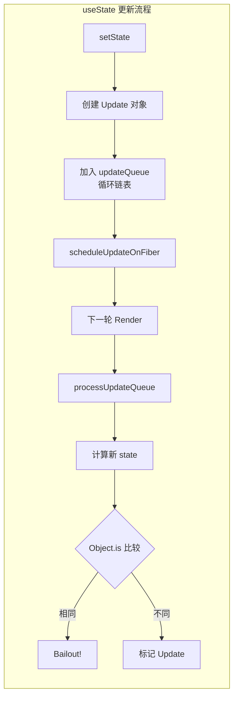

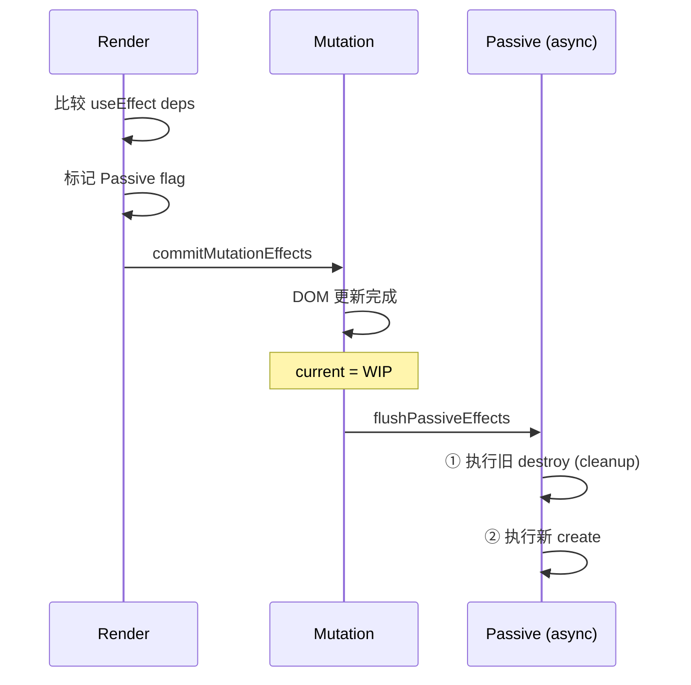

---

## 第7章：并发特性

### 7.1 Suspense 组件

**📍 源码位置**：`packages/react-reconciler/src/ReactFiberSuspenseComponent.js`

```javascript
function updateSuspenseComponent(current, workInProgress, renderLanes) {
  const nextState = workInProgress.memoizedState;
  const oldState = current?.memoizedState;
  
  // 检查子组件是否抛出 thenable（Promise）
  if (nextState !== null) {
    // 已经 suspend 了
    if (unwindWorkInProgressSuspendedComponent(workInProgress)) {
      // 尝试渲染 fallback UI
      renderFallbackSuspenseBoundary(workInProgress);
    }
  } else {
    // 正常渲染 children
    const nextPrimaryChildren = workInProgress.pendingProps.children;
    workInProgress.child = mountChildFibers(workInProgress, null, nextPrimaryChildren);
  }
}
```

**工作原理**：
1. 子组件抛出 Promise 时被 Suspense 边界捕获
2. 显示 `fallback` UI
3. Promise resolve 后重新渲染 children
4. 切换回真实内容（可配置动画过渡）

### 7.2 startTransition

**📍 源码位置**：`packages/react-reconciler/src/ReactFiberTransition.js`

```javascript
function startTransition(setState, options) {
  const transitionLane = requestTransitionLane();  // 获取低优先级 lane
  
  // 创建 transition 更新
  const update = {
    lane: transitionLane,
    action: setState,
    isTransition: true,
  };
  
  // 使用低优先级调度
  enqueueConcurrentHookUpdate(fiber, queue, update, transitionLane);
  scheduleUpdateOnFiber(fiber, transitionLane, eventTime);
}
```

**用途**：将非紧急更新标记为 transition，避免阻塞用户交互。

### 7.3 其他并发 Hooks

| Hook | 用途 | 优先级 |
|------|------|--------|
| `useDeferredValue(value)` | 延迟更新值 | Transition |
| `useId()` | 稳定的唯一 ID | 同步 |
| `useInsertionEffect()` | CSS-in-JS 注入 | Layout 阶段 |
| `useSyncExternalStore()` | 外部 store 订阅 | 同步 |

### 7.4 Mermaid 图：并发特性关系

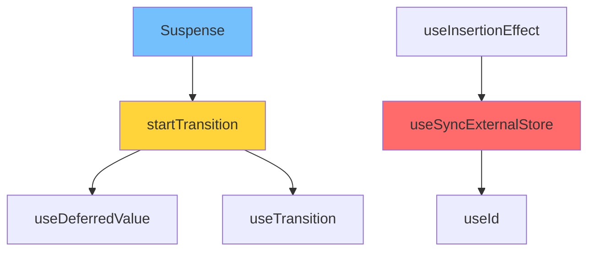

---

## 第8章：事件系统

### 8.1 合成事件（SyntheticEvent）

**📍 源码位置**：`packages/events/SyntheticEvent.js`

```javascript
class SyntheticEvent {
  constructor(dispatchConfig, targetInst, nativeEvent, nativeEventTarget) {
    this.dispatchConfig = dispatchConfig;
    this._targetInst = targetInst;
    this.nativeEvent = nativeEvent;
    this.target = nativeEventTarget;
    this.currentTarget = null;
    
    // 标准化属性
    this.type = nativeEvent.type;
    this.bubbles = nativeEvent.bubbles;
    this.cancelable = nativeEvent.cancelable;
    this.timeStamp = nativeEvent.timeStamp;
    // ...
  }
  
  preventDefault() {
    // 兼容不同浏览器的 preventDefault
    const event = this.nativeEvent;
    if (event.preventDefault) {
      event.preventDefault();
    } else if (typeof event.returnValue !== 'unknown') {
      event.returnValue = false;
    }
    this.isDefaultPrevented = functionThatReturnsTrue;
  }
  
  stopPropagation() {
    const event = this.nativeEvent;
    if (event.stopPropagation) {
      event.stopPropagation();
    } else if (typeof event.cancelBubble !== 'unknown') {
      event.cancelBubble = true;
    }
    this.isPropagationStopped = functionThatReturnsTrue;
  }
  
  persist() {
    // React 17+ 已废弃（自动持久化）
  }
  
  destructor() {
    // 事件池回收（React 16）
  }
}
```

**设计意图**：
- **跨浏览器兼容**：统一不同浏览器的事件 API
- **事件池复用**：React 16 中复用 SyntheticEvent 对象以减少 GC（React 17 已移除）

### 8.2 事件委托

**📍 源码位置**：`packages/events/DOMPluginEventSystem.js`

```javascript
// React 17+：事件注册到 root 而非 document
function addEventBubbleListener(target, eventType, listener) {
  target.addEventListener(eventType, listener, false);
}

function addEventCaptureListener(target, eventType, listener) {
  target.addEventListener(eventType, listener, true);
}

// 事件分发流程
function dispatchEventsForPlugins(
  domEventName,
  eventSystemFlags,
  targetContainer,
  nativeEvent,
) {
  // 1. 收集从目标到 root 的所有 fiber
  const nativeEventTarget = getEventTarget(nativeEvent);
  const targetInst = getClosestInstanceFromNode(nativeEventTarget);
  
  // 2. 创建合成事件
  const event = new SyntheticEventCtor(
    dispatchConfig,
    targetInst,
    nativeEvent,
    nativeEventTarget,
  );
  
  // 3. 两阶段遍历：capture → bubble
  // Capture 阶段：从 root 到目标
  accumulateSinglePhaseListeners(targetInst, reactName, nativeEvent, ...);
  
  // Bubble 阶段：从目标到 root
  accumulateDirectionalListeners(...);
  
  // 4. 执行事件处理器
  processDispatchQueue(event, listeners);
}
```

### 8.3 优先级事件分类

| 类别 | 示例 | 优先级 |
|------|------|--------|
| **Discrete** | click, input, focusDown | Immediate（最高） |
| **UserBlocking** | scroll, drag, mousemove | UserBlocking |
| **Continuous** | mousemove, resize, drag | Normal |

### 8.4 手写实现：mini-SyntheticEvent

```javascript
/**
 * mini-SyntheticEvent + 事件委托
 */

class SyntheticEvent {
  constructor(nativeEvent) {
    this.nativeEvent = nativeEvent;
    this.target = nativeEvent.target;
    this.type = nativeEvent.type;
    this.bubbles = nativeEvent.bubbles;
    this._propagationStopped = false;
    this._defaultPrevented = false;
  }
  
  stopPropagation() {
    this._propagationStopped = true;
    this.nativeEvent.stopPropagation?.();
  }
  
  preventDefault() {
    this._defaultPrevented = true;
    this.nativeEvent.preventDefault?.();
  }
  
  isPropagationStopped() { return this._propagationStopped; }
  isDefaultPrevented() { return this._defaultPrevented; }
}

// 事件委托管理器
class EventDelegator {
  constructor(root) {
    this.root = root;
    this.listeners = new Map();  // eventType → Set<handler>
  }
  
  // 注册事件委托
  delegate(eventType) {
    if (this.listeners.has(eventType)) return;
    
    const handler = (nativeEvent) => {
      const syntheticEvent = new SyntheticEvent(nativeEvent);
      const target = nativeEvent.target;
      
      // 模拟冒泡：从 target 向上查找监听器
      let el = target;
      while (el && el !== this.root) {
        const handlers = this.getHandlers(el, eventType);
        for (const fn of handlers) {
          fn.call(el, syntheticEvent);
          if (syntheticEvent.isPropagationStopped()) return;
        }
        el = el.parentElement;
      }
    };
    
    this.root.addEventListener(eventType, handler);
    this.listeners.set(eventType, handler);
    console.log(`[EventDelegate] 注册委托: ${eventType}`);
  }
  
  // 绑定具体元素的事件
  bind(element, eventType, handler) {
    if (!element.__reactHandlers) element.__reactHandlers = {};
    if (!element.__reactHandlers[eventType]) {
      element.__reactHandlers[eventType] = new Set();
    }
    element.__reactHandlers[eventType].add(handler);
    this.delegate(eventType);
  }
  
  getHandlers(element, eventType) {
    return element.__reactHandlers?.[eventType] || new Set();
  }
}

// 测试
console.log('='.repeat(40));
console.log('🎯 mini-Event 演示\n');

const delegator = new EventDelegator(document.body);

delegator.bind(document.getElementById('btn'), 'click', (e) => {
  console.log('按钮点击！target:', e.target.id);
});

console.log('='.repeat(40));

module.exports = { SyntheticEvent, EventDelegator };
```

---

## 第9章：状态管理视角

### 9.1 Context 实现

**📍 源码位置**：`packages/react-reconciler/src/ReactFiberNewContext.js`

```javascript
function createContext(defaultValue) {
  const context = {
    $$typeof: REACT_CONTEXT_TYPE,
    _currentValue: defaultValue,
    _currentValue2: defaultValue,
    _threadCount: 0,
    Provider: null,
    Consumer: null,
    displayName: undefined,
  };
  
  context.Provider = {
    $$typeof: REACT_PROVIDER_TYPE,
    _context: context,
  };
  
  context.Consumer = context;
  return context;
}

function readContext(context) {
  const value = context._currentValue;
  // 订阅此 context 的变化
  if (lastContextDependencyCurrentlyProcessing !== null) {
    const dependency = {
      context,
      observedBits: lastObservedBitsCurrentlyProcessing,
      next: null,
    };
    lastContextDependencyCurrentlyProcessing.next = dependency;
    lastContextDependencyCurrentlyProcessing = dependency;
  }
  return value;
}

function propagateContextChange(workInProgress, context, changedBits) {
  // 向下传播 context 变化
  let node = workInProgress.child;
  while (node !== null) {
    if (node.dependencies?.firstContext !== null) {
      // 此节点订阅了该 context → 标记需要更新
      markWorkInProgressReceivedUpdate();
    }
    node = node.sibling;
  }
}
```

### 9.2 外部方案对比

| 方案 | 架构 | 特点 |
|------|------|------|
| **Redux** | 单 Store + Reducer | 可预测、中间件生态丰富 |
| **Zustand** | 原子状态 | 轻量、无 boilerplate |
| **Jotai** | 原子组合 | 细粒度更新、依赖追踪 |
| **Recoil** | 数据流图 | 与 React理念接近 |

### 9.3 Mermaid 图：Context 传播路径

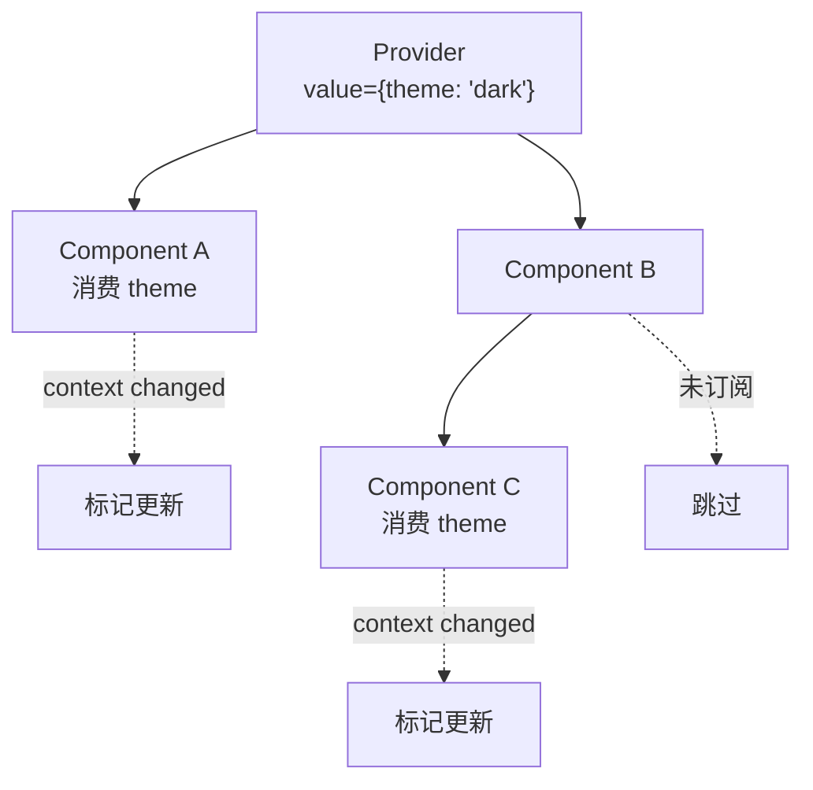

---

## 第10章：服务端渲染

### 10.1 renderToString

**📍 源码位置**：`packages/react-dom/server/node/ReactDOMServerLegacy.js`

```javascript
function renderToString(element, options) {
  // 1. 创建空的输出缓冲区
  const result = { html: '', css: '' };
  
  // 2. 递归遍历 Fiber 树
  function renderNode(fiber) {
    switch (fiber.tag) {
      case HostComponent:
        const { type, props } = fiber;
        const attrs = Object.entries(props)
          .filter(([k]) => k !== 'children')
          .map(([k, v]) => `${k}="${v}"`)
          .join(' ');
        
        result.html += `<${type}${attrs ? ' ' + attrs : ''}>`;
        
        // 递归渲染子节点
        if (props.children) {
          renderChildren(props.children);
        }
        
        result.html += `</${type}>`;
        break;
        
      case HostText:
        result.html += escapeHtml(fiber.props.content);
        break;
        
      case FunctionComponent:
        // 执行函数组件获取 children
        const compResult = fiber.type(fiber.props);
        renderChildren(compResult);
        break;
        
      case Suspense:
        // SSR 中 Suspense 直接渲染 fallback
        result.html += `<template data-rs="S">`;
        renderChildren(fiber.props.fallback);
        result.html += `</template>`;
        break;
    }
  }
  
  // 3. 启动渲染
  const fiber = createFiberFromElement(element);
  renderNode(fiber);
  
  return result.html;
}
```

### 10.2 Hydration 匹配

**📍 源码位置**：`packages/react-dom/client/ReactDOMHydrationLegacy.js`

```javascript
function hydrate(element, container) {
  // 1. 创建 hydrate 根
  const root = createHydrationContainer(element, null, container, ...);
  
  // 2. 进入 hydration 模式的 workLoop
  //    区别：尝试复用已有 DOM 而非创建新 DOM
  function hydrateFiber(current, workInProgress) {
    switch (workInProgress.tag) {
      case HostComponent:
        // 尝试匹配服务端 DOM
        const instance = canHydrateInstance(container, ...);
        if (instance) {
          workInProgress.stateNode = instance;  // 复用！
          markHydrated(workInProgress);
        } else {
          // mismatch → 服务端和客户端不一致
          console.warn('Hydration mismatch!');
          // 通常会丢弃服务端 HTML，客户端重新渲染
        }
        break;
    }
  }
  
  return root;
}
```

### 10.3 流式 SSR（React 18+）

```javascript
// renderToPipeableStream（Node.js）
function renderToPipeableStream(element, options) {
  let hasFlushed = false;
  
  function startWriting(request) {
    // 先发送 <html><head>...
    request.write('<!DOCTYPE html><html><head>');
    request.write(options.bootstrapScriptContent || '');
    request.write('</head><body><div id="root">');
    
    // 流式渲染组件
    const pipeable = renderSubtreeIntoPipeableStream(request, element);
    
    // 发送 </div></body></html>
    request.write('</div>');
    
    // 发送加载脚本
    request.write(`<script>${options.onShellReady}</script>`);
    request.write('</body></html>');
  }
  
  return { pipe: startWriting, abort: () => {} };
}

// renderToReadableStream（现代浏览器/Edge Runtime）
async function renderToReadableStream(element, options) {
  const stream = new ReadableStream({
    async start(controller) {
      try {
        // 可以中断的流式渲染
        await renderComponentToStream(controller, element);
        controller.close();
      } catch (error) {
        controller.error(error);
      }
    },
  });
  
  return stream;
}
```

### 10.4 Mermaid 图：SSR 流程

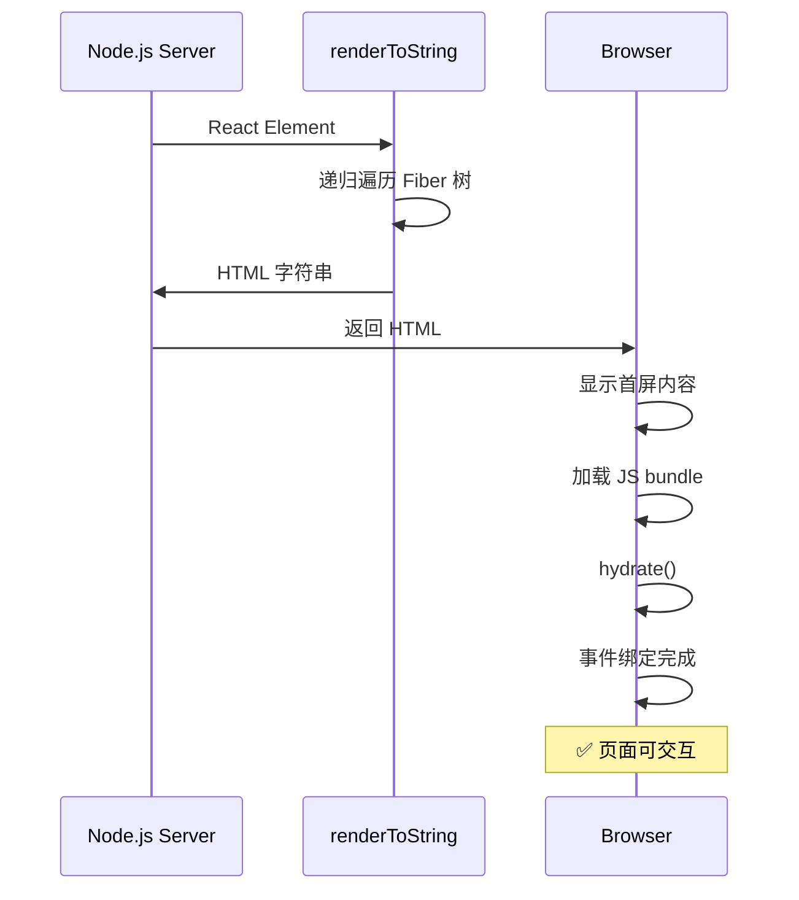

---

## 第11章：React 18 新特性

### 11.1 createRoot 替代 ReactDOM.render

```javascript
// React 17 及之前（Legacy Mode）
import { render } from 'react-dom';
render(<App />, document.getElementById('root'));

// React 18+（Concurrent Mode）
import { createRoot } from 'react-dom/client';
const root = createRoot(document.getElementById('root'));
root.render(<App />);
```

**变化**：
- 默认开启并发渲染
- Automatic Batching（自动批处理）：所有状态更新都会批处理
- 支持 Suspense on SSR

### 11.2 新 API 一览

| API | 用途 | 版本 |
|-----|------|------|
| `createRoot()` | 并发模式入口 | 18 |
| `startTransition()` | 非阻塞更新 | 18 |
| `useDeferredValue()` | 延迟值 | 18 |
| `useId()` | 稳定 ID | 18 |
| `useSyncExternalStore()` | 外部 store | 18 |
| `useInsertionEffect()` | CSS-in-JS | 18 |
| `useTransition()` | 带 loading 的 transition | 18 |

### 11.3 Automatic Batching

```javascript
// React 17：只有 React 事件内才会批处理
function handleClick() {
  setCount(c => c + 1);  // 不会批处理
  setFlag(f => !f);        // 两次渲染！
}

// React 18：所有更新都自动批处理
function handleClick() {
  fetch('/api').then(() => {
    setCount(c => c + 1);  // ✅ 批处理
    setFlag(f => !f);      // 只渲染一次！
  });
}
```

### 11.4 Mermaid 图：React 版本演进

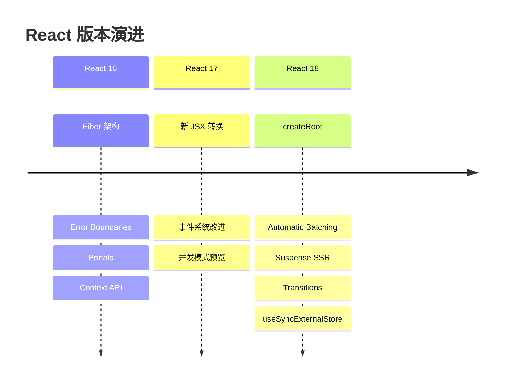

---

## 第12章：性能优化源码视角

### 12.1 memo 浅比较

**📍 源码位置**：`packages/react/src/memo.js`

```javascript
function memo(type, compare) {
  const elementType = {
    $$typeof: REACT_MEMO_TYPE,
    type,                          // 原始组件
    compare: compare ?? shallowEqual,  // 自定义比较函数或默认浅比较
  };
  return elementType;
}

// 默认浅比较
function shallowEqual(objA, objB) {
  if (Object.is(objA, objB)) return true;
  
  if (typeof objA !== 'object' || objA === null ||
      typeof objB !== 'object' || objB === null) {
    return false;
  }
  
  const keysA = Object.keys(objA);
  if (keysA.length !== Object.keys(objB).length) return false;
  
  for (const key of keysA) {
    if (!hasOwnProperty.call(objB, key) || !Object.is(objA[key], objB[key])) {
      return false;
    }
  }
  
  return true;
}
```

### 12.2 canSkipRendering 判断

```javascript
// React 内部的跳过渲染判断逻辑
function canSkipRendering(fiber, pendingProps, renderLanes) {
  // 1. props 引用相等？
  if (fiber.memoizedProps === pendingProps) {
    // 2. 没有 pending 更新？
    if (!includesSomeLane(fiber.lanes, renderLanes)) {
      // 3. 子树也没有更新？
      if (!includesSomeLane(fiber.childLanes, renderLanes)) {
        return true;  // 完全可以跳过！
      }
    }
  }
  return false;
}
```

### 12.3 性能优化清单

**源码层面**：
- ✅ 使用 `React.memo` + 自定义 `compare` 避免不必要的重渲染
- ✅ 保持 props 引用稳定（`useMemo`、`useCallback`）
- ✅ 正确设置 `key` 帮助 Diff 算法
- ✅ 大列表使用虚拟滚动（不在 React 核心，但推荐）
- ✅ 使用 `startTransition` 降低非紧急更新优先级

**应用层面**：
- ✅ Code Splitting（`React.lazy` + `Suspense`）
- ✅ 避免在 render 中创建对象/函数
- ✅ 使用 `useReducer` 替代多个 `useState`（减少 setState 次数）
- ✅ 状态提升到合适层级（避免 prop drilling 导致的多余渲染）

### 12.4 手写实现：mini-profiler

```javascript
/**
 * mini-Profiler：渲染耗时统计
 */

class RenderProfiler {
  constructor() {
    this.renders = [];           // 渲染记录
    this.currentRender = null;   // 当前渲染
    this.mountTimes = new Map(); // 组件挂载时间
  }
  
  // 开始记录一次渲染
  startRender(componentName) {
    this.currentRender = {
      id: this.renders.length + 1,
      component: componentName,
      startTime: performance.now(),
      duration: 0,
      phase: 'begin',
      props: null,
      hooks: [],
    };
  }
  
  // 结束记录
  endRender() {
    if (this.currentRender) {
      this.currentRender.duration = performance.now() - this.currentRender.startTime;
      this.currentRender.phase = 'complete';
      this.renders.push(this.currentRender);
      
      // 警告：超过 16ms 可能掉帧
      if (this.currentRender.duration > 16) {
        console.warn(
          `[Profiler] ⚠️ ${this.currentRender.component} 渲染耗时 ${this.currentRender.duration.toFixed(1)}ms (>16ms)`
        );
      }
      
      this.currentRender = null;
    }
  }
  
  // 记录 hook 信息
  recordHook(hookName, executionTime) {
    if (this.currentRender) {
      this.currentRender.hooks.push({
        name: hookName,
        time: executionTime,
      });
    }
  }
  
  // 获取统计报告
  getReport() {
    const total = this.renders.length;
    const avgDuration = this.renders.reduce((sum, r) => sum + r.duration, 0) / total || 0;
    const maxRender = this.renders.reduce((max, r) => r.duration > max.duration ? r : max, { duration: 0 });
    
    return {
      totalRenders: total,
      avgDuration: avgDuration.toFixed(2) + 'ms',
      maxDuration: maxRender.duration.toFixed(2) + 'ms',
      maxComponent: maxRender.component,
      slowRenders: this.renders.filter(r => r.duration > 16),
    };
  }
  
  // 打印报告
  printReport() {
    const report = this.getReport();
    console.log('\n' + '='.repeat(50));
    console.log('📊 Render Profiler Report');
    console.log('='.repeat(50));
    console.log(`总渲染次数: ${report.totalRenders}`);
    console.log(`平均耗时: ${report.avgDuration}`);
    console.log(`最慢组件: ${report.maxComponent} (${report.maxDuration})`);
    
    if (report.slowRenders.length > 0) {
      console.log('\n⚠️ 慢渲染警告 (>16ms):');
      report.slowRenders.forEach(r => {
        console.log(`  - ${r.component}: ${r.duration.toFixed(1)}ms`);
      });
    }
    console.log('='.repeat(50) + '\n');
  }
  
  // 重置
  reset() {
    this.renders = [];
    this.currentRender = null;
  }
}

// 测试
console.log('='.repeat(40));
console.log('📈 mini-Profiler 演示\n');

const profiler = new RenderProfiler();

// 模拟多次渲染
['App', 'List', 'Modal', 'Dashboard'].forEach(name => {
  profiler.startRender(name);
  // 模拟渲染耗时（随机 5-30ms）
  const duration = 5 + Math.random() * 25;
  const start = performance.now();
  while (performance.now() - start < duration) {}  // busy wait
  profiler.endRender();
});

profiler.printReport();

module.exports = { RenderProfiler };
```

---

## 附录A：React 源码调试指南

### 断点位置速查表（20 个关键位置）

| # | 功能 | 文件路径 | 行号范围 | 断点说明 |
|---|------|----------|----------|----------|
| 1 | **createElement** | `react/src/ReactElement.js` | 180-220 | 查看 Element 创建过程 |
| 2 | **JSX 转换** | `react/jsx/ReactJSX.js` | 20-60 | 查看 jsx 运行时行为 |
| 3 | **createRoot 入口** | `react-dom/client/ReactDOM.js` | 10-30 | 应用启动入口 |
| 4 | **Fiber 创建** | `react-reconciler/src/ReactFiber.new.js` | 120-140 | createWorkInProgress |
| 5 | **beginWork** | `react-reconciler/src/ReactFiberBeginWork.js` | 320-380 | 组件更新入口 |
| 6 | **Bailout 判断** | `react-reconciler/src/ReactFiberBeginWork.js` | 2500-2550 | 跳过渲染的条件 |
| 7 | **reconcileChildren** | `react-reconciler/src/ReactFiberBeginWork.js` | 2820-2870 | 子节点协调 |
| 8 | **单节点 Diff** | `react-reconciler/src/ReactChildFiber.js` | 520-630 | reconcileSingleElement |
| 9 | **多节点 Diff** | `react-reconciler/src/ReactChildFiber.js` | 1350-1650 | reconcileChildrenArray |
| 10 | **completeWork** | `react-reconciler/src/ReactFiberCompleteWork.js` | 250-550 | DOM 创建 |
| 11 | **commitRoot** | `react-reconciler/src/ReactFiberCommitWork.js` | 70-140 | Commit 入口 |
| 12 | **Placement** | `react-reconciler/src/ReactFiberCommitWork.js` | 820-880 | DOM 插入 |
| 13 | **Update** | `react-dom/src/shared/ReactDOMComponent.js` | 250-350 | 属性更新 |
| 14 | **useState** | `react-reconciler/src/ReactFiberHooks.js` | 1520-1630 | 状态初始化 |
| 15 | **dispatchSetState** | `react-reconciler/src/ReactFiberHooks.js` | 1650-1720 | setState 调度 |
| 16 | **useEffect** | `react-reconciler/src/ReactFiberHooks.js` | 2800-2950 | Effect 处理 |
| 17 | **scheduleCallback** | `scheduler/src/Scheduler.js` | 130-190 | 任务调度 |
| 18 | **workLoop** | `react-reconciler/src/ReactFiberWorkLoop.js` | 430-480 | 主循环 |
| 19 | **shouldYield** | `scheduler/src/SchedulerHostConfig.default.js` | 65-90 | 时间切片 |
| 20 | **Context 传播** | `react-reconciler/src/ReactFiberNewContext.js` | 100-200 | Context 变更检测 |

### 调试技巧

1. **使用 DevTools Profiler**：可视化组件渲染次数和耗时
2. **Console 日志**：在关键函数入口添加 `console.trace()`
3. **React DevTools**：查看 Fiber 树结构和 props/state
4. **Performance 面板**：录制长时间操作，分析主线程阻塞
5. **why-did-you-render**：第三方库，检测不必要的重渲染

---

## 附录B：综合实战 — 从零复刻 mini-react

下面串联所有知识点，实现一个极简但完整的 React 迷你框架：

```javascript
/**
 * ========================================
 * mini-react：完整实现（约 300 行）
 * 包含：Fiber → Scheduler → Reconciler → Commit → Hooks
 * ========================================
 */

// ==================== 常量 ====================

const TAG = { ROOT: 0, HOST: 1, TEXT: 2, FUNC: 3 };
const FLAG = { NONE: 0, PLACEMENT: 1, UPDATE: 2, DELETION: 4 };
const PRI = { SYNC: 1, NORMAL: 3, LOW: 4 };

// ==================== Fiber ====================

class Fiber {
  constructor(tag, key) {
    this.tag = tag; this.key = key; this.type = null;
    this.dom = null;  // 简化：直接存 DOM（不用 stateNode）
    this.return = null; this.child = null; this.sibling = null;
    this.props = null; this.oldProps = null;
    this.flags = FLAG.NONE; this.subtreeFlags = 0;
    this.alternate = null;
    this.hooks = null;  // hooks 链表头
    this.effectList = null;  // effect 链表
  }
}

// ==================== Scheduler（简化版）====================

let taskQueue = [];
let isWorking = false;
let currentCallbackId = 0;

function schedule(callback, priority = PRI.NORMAL) {
  const task = {
    id: ++currentCallbackId,
    callback,
    priority,
    time: performance.now(),
  };
  taskQueue.push(task);
  taskQueue.sort((a, b) => a.priority - b.priority);
  
  if (!isWorking) {
    isWorking = true;
    requestAnimationFrame(() => flushTasks());
  }
  
  return task.id;
}

function flushTasks() {
  while (taskQueue.length > 0) {
    const task = taskQueue.shift();
    try { task.callback(); } catch (e) { console.error('Task error:', e); }
  }
  isWorking = false;
}

// ==================== Hooks ====================

let wipFiber = null;
let hookIndex = 0;
let hookQueue = [];  // 待执行的 effect

class MyHook {
  constructor() {
    this.state = null;
    this.queue = [];
    this.deps = null;
    this.effect = null;
    this.next = null;
  }
}

function useHook() {
  const hook = wipFiber.hooks ? wipFiber.hooks[hookIndex] : null;
  
  if (!hook) {
    const newHook = new MyHook();
    if (!wipFiber.hooks) wipFiber.hooks = [];
    wipFiber.hooks.push(newHook);
    hookIndex++;
    return newHook;
  }
  
  hookIndex++;
  return hook;
}

function useState(init) {
  const hook = useHook();
  
  if (wipFiber.alternate === null) {
    // Mount
    hook.state = typeof init === 'function' ? init() : init;
  } else {
    // Update：处理队列
    if (hook.queue.length > 0) {
      const actions = [...hook.queue];
      hook.queue = [];
      let s = hook.state;
      for (const a of actions) {
        s = typeof a === 'function' ? a(s) : a;
      }
      hook.state = s;
    }
  }
  
  const setState = (action) => {
    hook.queue.push(action);
    schedule(() => rerender());
  };
  
  return [hook.state, setState];
}

function useEffect(fn, deps) {
  const hook = useHook();
  
  hook.effect = { fn, deps, cleanup: null };
  
  if (wipFiber.alternate === null) {
    // Mount：添加到 effect 队列
    hookQueue.push(hook);
  } else {
    // Update：检查 deps
    const oldDeps = hook.effect?.deps;
    if (!deps || !oldDeps || !deps.every((d, i) => Object.is(d, oldDeps[i]))) {
      hookQueue.push(hook);
    }
  }
}

function useMemo(fn, deps) {
  const hook = useHook();
  
  if (wipFiber.alternate === null || !deps?.every((d, i) => Object.is(d, hook.deps?.[i]))) {
    hook.state = fn();
    hook.deps = deps;
  }
  
  return hook.state;
}

function useCallback(fn, deps) {
  return useMemo(() => fn, deps);
}

// ==================== Element 创建 ====================

function h(type, props, ...children) {
  return {
    $$typeof: Symbol.for('mini.element'),
    type,
    key: props?.key || null,
    props: { ...(props || {}), children: children.length <= 1 ? children[0] : children },
  };
}

// ==================== Reconciler ====================

let wipRoot = null;  // 当前 workInProgress 根
let currentRoot = null;  // 当前已提交的根
let deletions = [];  // 待删除的节点

function render(element, container) {
  wipRoot = {
    dom: container,
    props: { children: [element] },
    alternate: currentRoot,
    hooks: [],
  };
  deletions = [];
  nextUnitOfWork = wipRoot;
  schedule(workLoop);
}

let nextUnitOfWork = null;

function workLoop() {
  while (nextUnitOfWork && !shouldYield()) {
    nextUnitOfWork = performUnitOfWork(nextUnitOfWork);
  }
  
  if (!nextUnitOfWork && wipRoot) {
    commitRoot();
  }
}

function shouldYield() {
  // 简化：每处理 100 个单位就让出
  return false;  // mini 版不做真正的时间切片
}

function performUnitOfWork(fiber) {
  // beginWork
  const isFunctionComponent = typeof fiber.type === 'function';
  
  if (isFunctionComponent) {
    wipFiber = fiber;
    hookIndex = 0;
    wipFiber.hooks = fiber.alternate?.hooks ? [...fiber.alternate.hooks] : [];
    
    fiber.props.children = [fiber.type(fiber.props)];
  }
  
  reconcile(fiber);
  
  // 返回下一个工作单元
  if (fiber.child) return fiber.child;
  let nextFiber = fiber;
  while (nextFiber) {
    if (nextFiber.sibling) return nextFiber.sibling;
    nextFiber = nextFiber.return;
  }
  return null;
}

function reconcile(fiber) {
  const children = fiber.props.children;
  if (!children) { fiber.child = null; return; }
  
  const arr = Array.isArray(children) ? children : [children];
  let prevSibling = null;
  let index = 0;
  
  // Diff：简化版（只做同层比较）
  const oldFiber = fiber.alternate?.child;
  
  if (oldFiber) {
    // Update：尝试复用
    const oldMap = buildMap(oldFiber);
    
    arr.forEach((child, i) => {
      const key = child?.key ?? i;
      const matched = oldMap.get(key);
      
      let newFiber;
      if (matched && sameNode(matched, child)) {
        // 复用
        newFiber = {
          ...matched,
          props: child.props,
          alternate: matched,
          flags: FLAG.NONE,
          return: fiber,
          effectList: null,
          hooks: matched.hooks ? [...matched.hooks] : [],
        };
      } else {
        // 新建
        newFiber = createFiber(child, fiber);
        newFiber.flags |= FLAG.PLACEMENT;
        if (matched) {
          // 旧节点需要删除
          deletions.push(matched);
        }
      }
      
      newFiber.index = i;
      if (i === 0) fiber.child = newFiber;
      else prevSibling.sibling = newFiber;
      prevSibling = newFiber;
    });
    
    // 删除未被复用的旧节点
    oldMap.forEach((v, k) => {
      if (!arr.find(c => (c?.key ?? arr.indexOf(c)) === k)) {
        deletions.push(v);
      }
    });
  } else {
    // Mount：全部新建
    arr.forEach((child, i) => {
      const newFiber = createFiber(child, fiber);
      newFiber.flags |= FLAG.PLACEMENT;
      newFiber.index = i;
      if (i === 0) fiber.child = newFiber;
      else prevSibling.sibling = newFiber;
      prevSibling = newFiber;
    });
  }
}

function createFiber(element, returnFiber) {
  let tag;
  if (typeof element === 'string' || typeof element === 'number') {
    tag = TAG.TEXT;
  } else if (typeof element?.type === 'string') {
    tag = TAG.HOST;
  } else if (typeof element?.type === 'function') {
    tag = TAG.FUNC;
  } else {
    return null;
  }
  
  const fiber = new Fiber(tag, element?.key ?? null);
  fiber.type = typeof element === 'string' ? 'TEXT' : element?.type;
  fiber.props = typeof element === 'object' ? element.props : { content: String(element) };
  fiber.return = returnFiber;
  return fiber;
}

function sameNode(a, b) {
  return (a?.key ?? null) === (b?.key ?? null) && a?.type === b?.type;
}

function buildMap(fiber) {
  const map = new Map();
  let node = fiber;
  while (node) {
    map.set(node.key ?? node.index, node);
    node = node.sibling;
  }
  return map;
}

// ==================== Commit ====================

function commitRoot() {
  // 1. 处理删除
  deletions.forEach(commitDeletion);
  
  // 2. 处理新增/更新
  commitWork(wipRoot.child);
  
  // 3. 执行 effects
  commitEffects();
  
  // 4. 切换 current
  currentRoot = wipRoot;
  wipRoot = null;
}

function commitDeletion(fiber) {
  if (fiber.dom) {
    fiber.dom.parentNode.removeChild(fiber.dom);
  } else if (fiber.child) {
    commitDeletion(fiber.child);
  }
}

function commitWork(fiber) {
  if (!fiber) return;
  
  const parentDom = fiber.return.dom;
  
  if (fiber.flags & FLAG.PLACEMENT) {
    // 新增
    if (fiber.dom) {
      parentDom.appendChild(fiber.dom);
    }
  } else if (fiber.flags & FLAG.UPDATE) {
    // 更新
    updateDom(fiber.dom, fiber.oldProps, fiber.props);
  }
  
  commitWork(fiber.child);
  commitWork(fiber.sibling);
}

function commitEffects() {
  hookQueue.forEach(hook => {
    if (hook.effect?.cleanup) {
      try { hook.effect.cleanup(); } catch (e) {}
    }
  });
  
  hookQueue.forEach(hook => {
    if (hook.effect?.fn) {
      try {
        hook.effect.cleanup = hook.effect.fn();
      } catch (e) {}
    }
  });
  
  hookQueue = [];
}

function createDom(fiber) {
  const dom = fiber.tag === TAG.TEXT
    ? document.createTextNode(fiber.props.content)
    : document.createElement(fiber.type);
  
  updateDom(dom, {}, fiber.props);
  return dom;
}

function updateDom(dom, prevProps, nextProps) {
  // 移除旧属性
  Object.keys(prevProps || {}).forEach(key => {
    if (key === 'children' || key === 'key') return;
    if (!(key in (nextProps || {}))) {
      dom.removeAttribute(key);
    }
  });
  
  // 设置新属性
  Object.keys(nextProps || {}).forEach(key => {
    if (key === 'children' || key === 'key') return;
    if (prevProps?.[key] !== nextProps[key]) {
      dom.setAttribute(key, nextProps[key]);
    }
  });
  
  // 事件绑定（简化）
  Object.keys(nextProps || {}).forEach(key => {
    if (key.startsWith('on')) {
      const eventType = key.toLowerCase().substring(2);
      dom.removeEventListener(eventType, prevProps?.[key]);
      dom.addEventListener(eventType, nextProps[key]);
    }
  });
}

// 在 completeWork 阶段创建 DOM
function completeWork(fiber) {
  if (!fiber) return;
  
  if (fiber.tag === TAG.HOST || fiber.tag === TAG.TEXT) {
    if (!fiber.dom) {
      fiber.dom = createDom(fiber);
      fiber.flags |= FLAG.PLACEMENT;
    } else if (fiber.oldProps !== fiber.props) {
      fiber.flags |= FLAG.UPDATE;
    }
    fiber.oldProps = fiber.props;
  }
  
  completeWork(fiber.child);
  completeWork(fiber.sibling);
}

// 增强 workLoop：加入 completeWork
function workLoopFull() {
  while (nextUnitOfWork) {
    nextUnitOfWork = performUnitOfWork(nextUnitOfWork);
  }
  
  // completeWork
  completeWork(wipRoot);
  
  if (wipRoot) commitRoot();
}

function rerender() {
  // 重新渲染
  if (currentRoot) {
    wipRoot = {
      dom: currentRoot.dom,
      props: currentRoot.props,
      alternate: currentRoot,
      hooks: [],
    };
    deletions = [];
    nextUnitOfWork = wipRoot;
    schedule(workLoopFull);
  }
}

// ==================== 导出 ====================

const MiniReact = {
  render,
  h,
  useState,
  useEffect,
  useMemo,
  useCallback,
  Fiber,
};

// ==================== 测试 ====================

console.log('='.repeat(50));
console.log('⚛️ mini-react 完整演示\n');

function Counter() {
  const [count, setCount] = useState(0);
  const doubled = useMemo(() => count * 2, [count]);
  
  useEffect(() => {
    console.log(`[Effect] count = ${count}, doubled = ${doubled}`);
  }, [count]);
  
  return MiniReact.h('div', {},
    MiniReact.h('p', {}, `Count: ${count}`),
    MiniReact.h('p', {}, `Doubled: ${doubled}`),
    MiniReact.h('button', { onClick: () => setCount(c => c + 1) }, '+1'),
  );
}

const app = MiniReact.h(Counter, {});
const container = document.createElement('div');
document.body.appendChild(container);

MiniReact.render(app, container);

console.log('\n✅ mini-react 演示完成！');
console.log('='.repeat(50));

module.exports = MiniReact;
```

---

## 总结

本文档涵盖了 React 源码的核心知识点：

| 章节 | 核心概念 | 重要程度 |
|------|----------|----------|
| **Fiber 架构** | 双缓存、链表遍历、时间切片 | ⭐⭐⭐⭐⭐ |
| **Scheduler** | 优先级队列、lanes、时间切片 | ⭐⭐⭐⭐⭐ |
| **Hooks** | 链表结构、闭包陷阱、依赖比较 | ⭐⭐⭐⭐⭐ |
| **Render 阶段** | beginWork、completeWork、Diff 算法 | ⭐⭐⭐⭐ |
| **Commit 阶段** | 三阶段、DOM 操作、effect 执行 | ⭐⭐⭐⭐ |
| **并发特性** | Suspense、Transition、Deferred | ⭐⭐⭐ |
| **事件系统** | 合成事件、事件委托 | ⭐⭐⭐ |
| **SSR** | renderToString、Hydration、流式 | ⭐⭐⭐ |

### 学习建议

1. **先理解架构**：从整体到局部，先搞清楚各模块的关系
2. **阅读源码**：配合断点调试，观察数据流
3. **手写实现**：自己实现一遍才能真懂（参考本文的 mini-* 系列）
4. **对比学习**：对比 Vue 3 的实现，理解不同框架的设计取舍

---

> **文档信息**  
> 作者：AI Assistant  
> 最后更新：2024 年  
> 版本：v1.0  
> 许可：CC BY-SA 4.0
