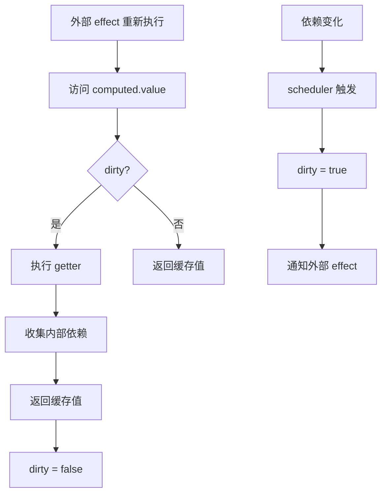
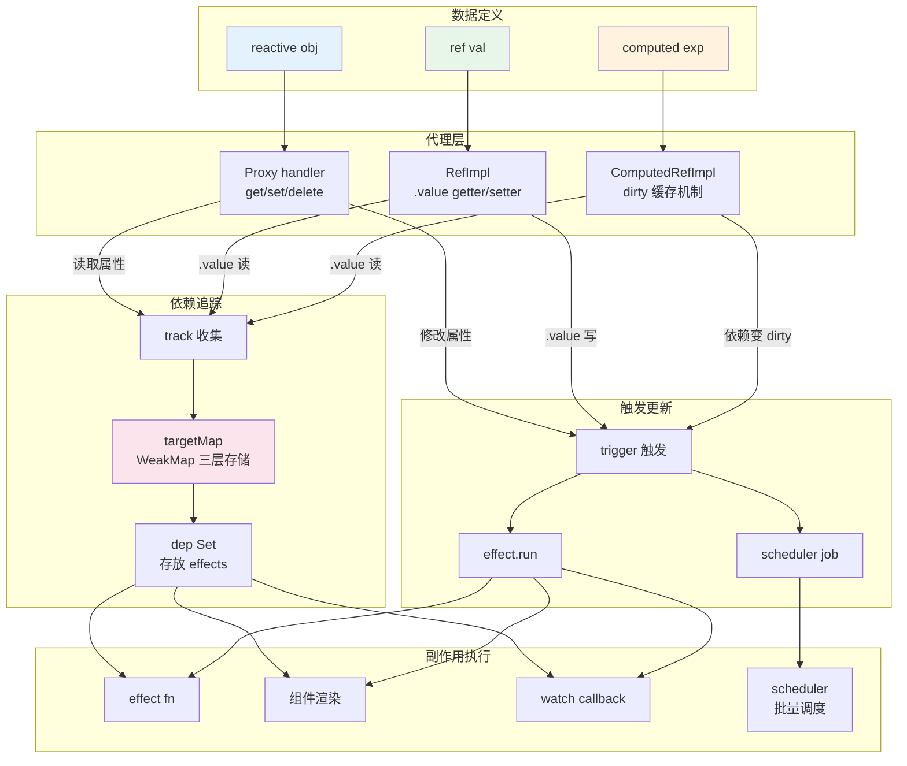
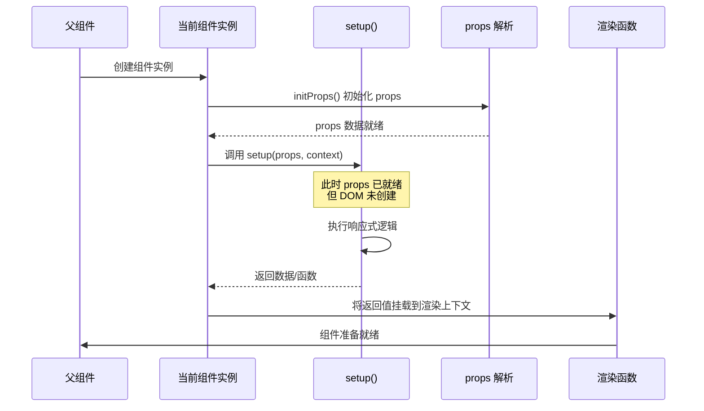
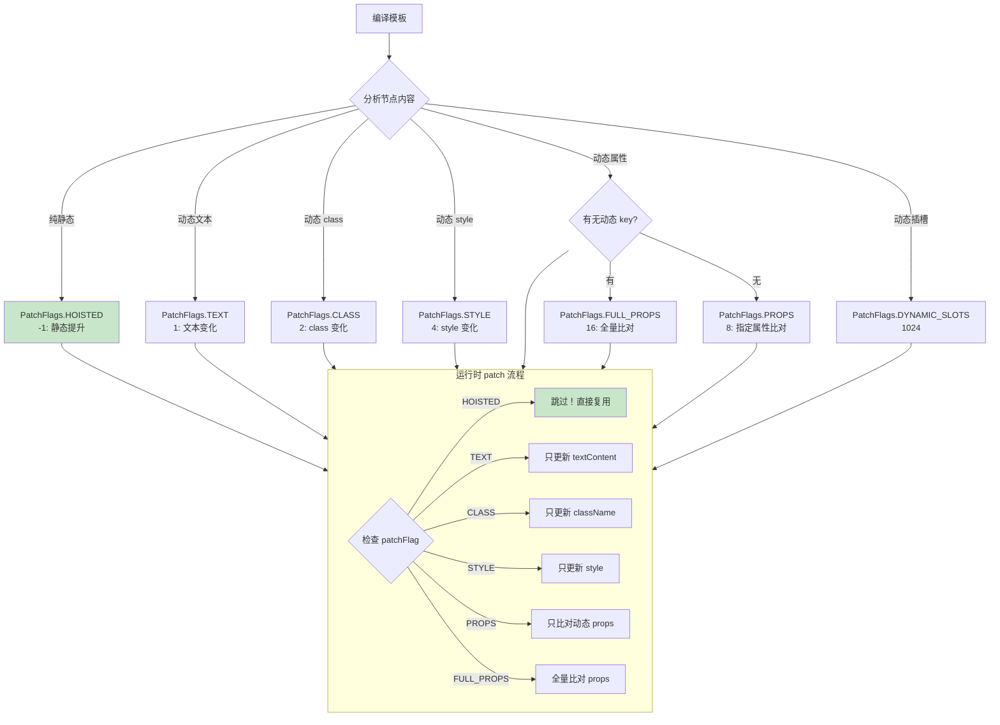
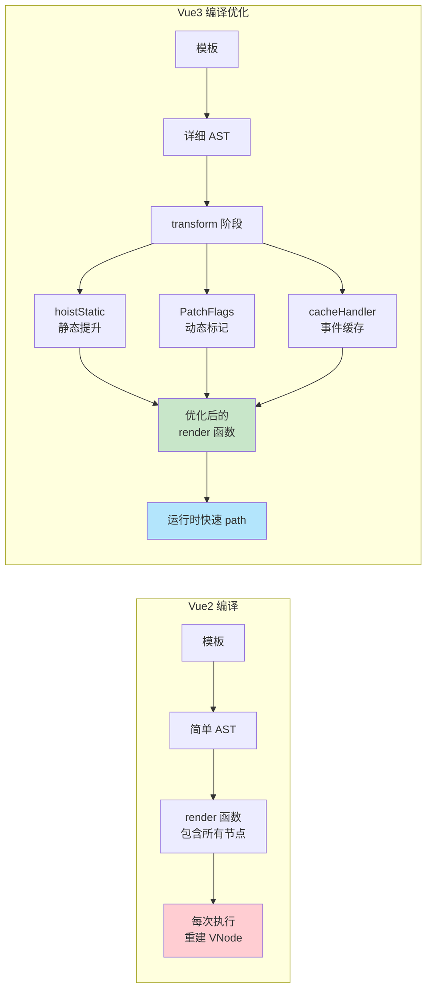
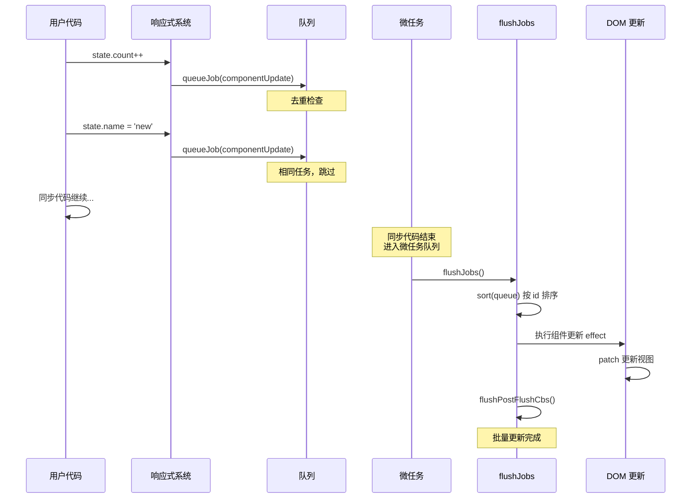
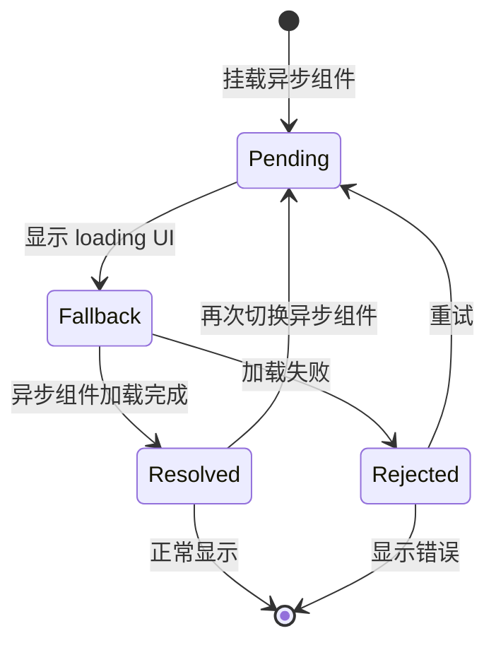
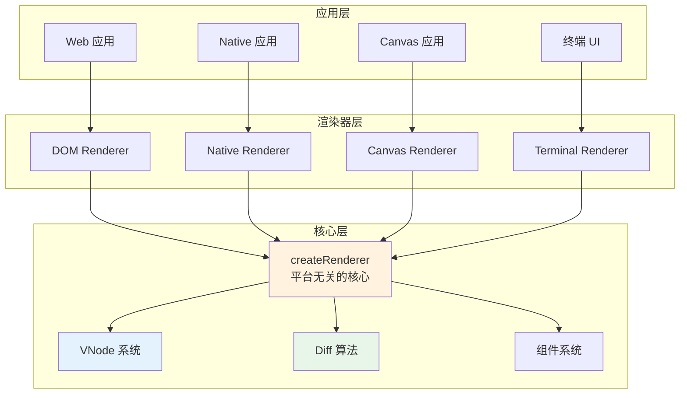

# Vue3 源码解读基础知识指南

> **版本**: Vue 3.4.x | **最后更新**: 2026-06-16  
> **目标读者**: 具备 Vue 基础，希望深入理解源码原理的前端开发者  
> **阅读建议**: 建议按章节顺序阅读，每章配合手写实现加深理解

---

## 目录

- [第1章：Monorepo 架构](#第1章monorepo-架构)
- [第2章：Proxy 响应式系统](#第2章proxy-响应式系统)
- [第3章：Composition API](#第3章composition-api)
- [第4章：虚拟 DOM 重构](#第4章虚拟-dom-重构)
- [第5章：编译器优化](#第5章编译器优化)
- [第6章：组件调度](#第6章组件调度)
- [第7章：Suspense 与异步组件](#第7章suspense-与异步组件)
- [第8章：Teleport 与 Fragments](#第8章teleport-与-fragments)
- [第9章：自定义渲染器](#第9章自定义渲染器)
- [第10章：Pinia 源码](#第10章pinia-源码)
- [第11章：Vue Router 4](#第11章-vue-router-4)
- [第12章：Vue2↔Vue3 差异总结](#第12章vue2vue3-差异总结)
- [附录A：调试指南](#附录a调试指南)
- [附录B：mini-vue3 实战项目说明](#附录bmini-vue3-实战项目说明)

---

## 第1章：Monorepo 架构

### 1.1 为什么选择 Monorepo？

**设计意图**：Vue3 采用 Monorepo 架构将不同功能模块拆分到独立 packages 中，带来以下优势：
- **独立发布**：`@vue/reactivity` 可脱离 Vue 单独使用（如 Pinia 仅依赖 reactivity）
- **Tree-shaking 友好**：按需引入，未使用的功能不会打包
- **职责清晰**：每个 package 有明确的边界和 API
- **类型安全**：TypeScript 类型定义与实现同包管理

**源码位置**：`package.json` (根目录)

```json
{
  "name": "vue",
  "private": true,
  "version": "3.4.0",
  "workspaces": [
    "packages/*"
  ],
  "scripts": {
    "dev": "node scripts/dev.js vue",
    "build": "node scripts/build.js vue"
  }
}
```

### 1.2 pnpm workspace 配置

**源码位置**：`pnpm-workspace.yaml`

```yaml
packages:
  - 'packages/*'
  - 'packages/@vue/*'
```

**关键配置**：使用 pnpm 的 workspace 协议实现包间引用

**源码位置**：`packages/reactivity/package.json`

```json
{
  "name": "@vue/reactivity",
  "version": "3.4.0",
  "main": "index.js",
  "dependencies": {
    "@vue/shared": "workspace:*"
  }
}
```

**中文注释**：`workspace:*` 表示引用本地 monorepo 内的包，pnpm 会自动创建符号链接

### 1.3 核心 Packages 职责划分

#### 📦 `@vue/reactivity` - 响应式系统
- **职责**：提供 Proxy-based 响应式能力
- **导出**：`reactive`, `ref`, `computed`, `effect`, `watch`
- **依赖**：仅依赖 `@vue/shared`
- **独立使用场景**：Pinia、VueUse 等第三方库直接依赖此包

**源码位置**：`packages/reactivity/src/index.ts`

```typescript
// 导出所有响应式 API
export { ref, shallowRef, triggerRef } from './ref.ts'
export { reactive, readonly, shallowReactive, shallowReadonly } from './reactive.ts'
export { computed } from './computed.ts'
export { effect, stop, reactiveEffect } from './effect.ts'
export { watch, watchEffect } from './watch.ts'
export { provide, inject } from './apiProvide.ts'
```

#### 🎨 `@vue/runtime-core` - 运行时核心
- **职责**：虚拟 DOM、组件系统、Composition API、生命周期
- **导出**：`createApp`, `h`, `defineComponent`, `onMounted`
- **依赖**：`@vue/reactivity`, `@vue/shared`

**源码位置**：`packages/runtime-core/src/index.ts`

```typescript
export { createApp, createSSRApp } from './apiCreateApp.ts'
export { defineComponent, defineAsyncComponent } from './apiDefineComponent.ts'
export {
  onMounted, onUpdated, onUnmounted,
  onBeforeMount, onBeforeUpdate, onBeforeUnmount,
  setup
} from './apiLifecycle.ts'
export { watch, watchEffect } from './apiWatch.ts'
export { provide, inject } from './apiInject.ts'
export { ref, computed, reactive, toRefs, unref } from './apiReactivity.ts'
```

#### ⚡ `@vue/runtime-dom` - DOM 运行时
- **职责**：浏览器环境适配、DOM 操作、事件处理
- **导出**：`createApp` (DOM 版本), 组件指令
- **依赖**：`@vue/runtime-core`, `@vue/shared`

**源码位置**：`packages/runtime-dom/src/index.ts`

```typescript
import { createApp as _createApp } from '../runtime-core'
import { nodeOps } from './dom/ops'        // DOM 节点操作
import { patchProp } from './dom/patchProp' // DOM 属性更新

// 创建浏览器版本的 createApp
export const createApp = ((...args) => {
  const app = _createApp(...args)
  const { mount } = app
  
  app.mount = (selector) => {
    const container = document.querySelector(selector)
    return mount(container)
  }
  
  return app
}) as CreateAppFunction<Element>
```

#### 🔧 `@vue/compiler-core` - 编译器核心
- **职责**：模板解析 AST、代码生成基础框架
- **依赖**：`@vue/shared`

#### 🌐 `@vue/compiler-dom` - DOM 编译器
- **职责**：HTML 模板编译为 render 函数
- **依赖**：`@vue/compiler-core`

#### 🛠️ `@vue/compiler-sfc` - SFC 编译器
- **职责**：`.vue` 单文件组件编译
- **输出**：template → render 函数, script → setup 函数

#### 📚 `@vue/shared` - 工具库
- **职责**：通用工具函数、常量定义、类型共享
- **被依赖**：几乎所有其他包

**源码位置**：`packages/shared/src/index.ts`

```typescript
export const isArray = Array.isArray
export const isObject = (val: unknown): val is Record<any, any> => 
  val !== null && typeof val === 'object'
export const isString = (val: unknown): val is string => typeof val === 'string'
export const isFunction = (val: unknown): val is Function => typeof val === 'function'

// 对象属性操作
export const extend = Object.assign
export const remove = <T>(arr: T[], el: T) => {
  const i = arr.indexOf(el)
  if (i > -1) arr.splice(i, 1)
}

// PatchFlags 静态标记枚举
export enum PatchFlags {
  TEXT = 1,              // 动态文本节点
  CLASS = 2,             // 动态 class
  STYLE = 4,             // 动态 style
  PROPS = 8,             // 动态属性（不含 class/style）
  FULL_PROPS = 16,       // 有动态 key 属性
  HYDRATE_EVENTS = 32,   // 事件监听
  STABLE_FRAGMENT = 64,  // 稳定 fragment
  KEYED_FRAGMENT = 128,  // 带 key 的 fragment
  UNKEYED_FRAGMENT = 256,// 不带 key 的 fragment
  NEED_PATCH = 512,      // 非 props 的 patch
  DYNAMIC_SLOTS = 1024,  // 动态插槽
  HOISTED = -1,          // 静态提升节点
  BAIL = -2              // diff 算法 bailout
}

// ShapeFlags 形状标记
export enum ShapeFlags {
  ELEMENT = 1,           // HTML 元素
  FUNCTIONAL_COMPONENT = 2,  // 函数式组件
  STATEFUL_COMPONENT = 4,    // 有状态组件
  TEXT_CHILDREN = 8,     // 文本子节点
  ARRAY_CHILDREN = 16,   // 数组子节点
  SLOTS_CHILDREN = 32,   // 插槽子节点
  TELEPORT = 64,         // Teleport 组件
  SUSPENSE = 128,        // Suspense 组件
  COMPONENT_SHOULD_KEEP_ALIVE = 256, // KeepAlive
  COMPONENT_KEPT_ALIVE = 512,       // 已缓存的 KeepAlive
  COMPONENT = 6          // STATEFUL_COMPONENT | FUNCTIONAL_COMPONENT
}
```

### 1.4 Package 依赖关系图

```mermaid
graph TB
    subgraph "应用层"
        APP[用户应用]
    end
    
    subgraph "运行时层"
        DOM[@vue/runtime-dom<br/>DOM 适配]
        CORE[@vue/runtime-core<br/>虚拟 DOM + 组件]
        REACTIVITY[@vue/reactivity<br/>响应式系统]
    end
    
    subgraph "编译器层"
        COMPILER_DOM[@vue/compiler-dom<br/>HTML 编译]
        COMPILER_CORE[@vue/compiler-core<br/>编译器核心]
        COMPILER_SFC[@vue/compiler-sfc<br/>SFC 编译]
    end
    
    subgraph "基础层"
        SHARED[@vue/shared<br/>工具函数]
    end
    
    APP --> DOM
    APP --> COMPILER_SFC
    DOM --> CORE
    CORE --> REACTIVITY
    CORE --> SHARED
    REACTIVITY --> SHARED
    DOM --> SHARED
    COMPILER_DOM --> COMPILER_CORE
    COMPILER_CORE --> SHARED
    COMPILER_SFC --> COMPILER_CORE
    COMPILER_SFC --> COMPILER_DOM
    
    style REACTIVITY fill:#e1f5fe
    style CORE fill:#f3e5f5
    style DOM fill:#e8f5e9
    style SHARED fill:#fff3e0
```

### 1.5 入口文件关系

**源码位置**：`packages/vue/src/index.ts`

```typescript
// Vue 主入口 - 重新导出所有功能
export * from '@vue/compiler-dom'
export * from '@vue/runtime-dom'
export * from '@vue/server-renderer'
export * from '@vue/reactivity'

// 全局注册
import { compile } from '@vue/compiler-dom'
import { registerRuntimeCompiler } from '@vue/runtime-dom'

// 将编译器注入到运行时（仅在完整版中）
registerRuntimeCompiler(compile)
```

**中文注释**：完整版 Vue 同时包含编译器和运行时；通过 Tree-shaking 可以只保留运行时代码

### 1.6 Monorepo vs 单仓库对比

| 维度 | Vue2 (单仓库) | Vue3 (Monorepo) |
|------|--------------|-----------------|
| 包结构 | 单一 src 目录 | 多个独立 packages |
| 依赖管理 | 内部模块引用 | workspace 协议 |
| Tree-shaking | 困难（Object.defineProperty） | 优秀（ES Module）|
| 独立使用 | 不可以 | reactivity 可单独使用 |
| 贡献门槛 | 高（需理解整体） | 低（可专注单一包）|
| 构建复杂度 | 简单 | 复杂（rollup 配置）|

---

## 第2章：Proxy 响应式系统 ⭐ 核心章节

### 2.1 响应式系统概览

**设计意图**：Vue3 使用 ES6 Proxy 替代 Vue2 的 Object.defineProperty，解决以下痛点：
- 无法检测对象属性的添加/删除
- 无法检测数组索引和长度的变化
- 需要递归遍历所有嵌套属性（性能问题）

**核心原理**：Proxy 在目标对象外层建立代理层，拦截所有操作（get/set/deleteProperty/has等），实现真正的"懒代理"——只在访问时才对深层属性进行代理。

### 2.2 reactive 与 createReactiveObject

**源码位置**：`packages/reactivity/src/reactive.ts:98-156`

```typescript
// 响应式标志枚举
enum ReactiveFlags {
  SKIP = '__v_skip',           // 跳过代理
  IS_REACTIVE = '__v_isReactive',
  IS_READONLY = '__v_isReadonly',
  RAW = '__v_raw',            // 获取原始对象
  REACTIVE = '__v_reactive',
  READONLY = '__v_readonly'
}

// 创建响应式对象的工厂函数
function createReactiveObject(
  target: object,
  isReadonly: boolean,
  baseHandlers: ProxyHandler<object>,
  collectionHandlers: ProxyHandler<object>,
  proxyMap: WeakMap<object, any>
) {
  // 1. 如果目标不是对象，直接返回（reactive 只能用于对象）
  if (!isObject(target)) {
    console.warn(`value cannot be made reactive: ${target}`)
    return target
  }
  
  // 2. 如果已经是代理对象，直接返回（避免重复代理）
  if (
    target[ReactiveFlags.RAW] && 
    !(isReadonly && target[ReactiveFlags.IS_REACTIVE])
  ) {
    return target
  }
  
  // 3. 如果已经存在对应的代理，从缓存中获取
  const existingProxy = proxyMap.get(target)
  if (existingProxy) {
    return existingProxy
  }
  
  // 4. 特殊处理：Map/Set/WeakMap/WeakSet 使用专门的 handlers
  const targetType = getTargetType(target)
  if (targetType === TargetType.INVALID) {
    return target
  }
  
  // 5. 创建新的 Proxy 对象并缓存
  const proxy = new Proxy(
    target,
    targetType === TargetType.COLLECTION ? collectionHandlers : baseHandlers
  )
  proxyMap.set(target, proxy)
  
  return proxy
}
```

**中文注释**：
- `proxyMap` 是 WeakMap 缓存，避免同一原始对象创建多个代理
- `baseHandlers` 用于普通对象，`collectionHandlers` 用于集合类型
- 通过 `ReactiveFlags` 可以访问原始对象或判断是否是响应式的

### 2.3 Proxy Handler - get 拦截器

**源码位置**：`packages/reactivity/src/baseHandlers.ts:45-120`

```typescript
const get = /*#__PURE__*/ createGetter()

function createGetter(isReadonly = false, shallow = false) {
  return function get(target: object, key: string | symbol, receiver: object) {
    
    // 1. 访问内置 symbol 时返回特殊值
    if (key === ReactiveFlags.IS_REACTIVE) {
      return !isReadonly
    }
    if (key === ReactiveFlags.IS_READONLY) {
      return isReadonly
    }
    if (key === ReactiveFlags.RAW) {
      return target
    }
    
    // 2. 获取目标对象的属性值
    const res = Reflect.get(target, key, receiver)
    
    // 3. 内置 symbol 和非字符串 key 不进行依赖收集
    if (!isSymbol(key) ? 
        !builtInSymbols.has(key as symbol) : 
        !isInternalSymbol(key)) {
      track(target, TrackOpTypes.GET, key)  // 🔑 依赖收集！
    }
    
    // 4. 浅响应式模式：不递归代理深层属性
    if (shallow) {
      return res
    }
    
    // 5. 如果值是 Ref，自动解包（仅在非数组或整数索引时）
    if (isRef(res)) {
      return !isArray(target) || isIntegerKey(key) ? res.value : res
    }
    
    // 6. 递归代理：如果值是对象且不是只读的，继续包装成响应式
    if (isObject(res)) {
      return isReadonly ? readonly(res) : reactive(res)
    }
    
    return res
  }
}
```

**设计意图**：
- **Reflect.get**：保持正确的 `this` 指向（receiver 参数）
- **track 依赖收集**：在读取属性时记录当前活跃的 effect
- **惰性代理**：只在访问到对象属性时才递归转换，而非一次性全部转换
- **Ref 自动解包**：在 template 和 reactive 对象中访问 ref 自动解包

### 2.4 Proxy Handler - set 拦截器

**源码位置**：`packages/reactivity/src/baseHandlers.ts:122-200`

```typescript
const set = /*#__PURE__*/ createSetter()

function createSetter(shallow = false) {
  return function set(
    target: object,
    key: string | symbol,
    value: unknown,
    receiver: object
  ): boolean {
    
    // 1. 获取旧值（用于触发器判断）
    let oldValue = (target as any)[key]
    
    // 2. 如果旧值是 Ref 且新值不是，则修改 ref 的 value 属性
    if (!shallow && isRef(oldValue) && !isRef(value)) {
      oldValue.value = value
      return true
    }
    
    // 3. 判断是否有 key（区分新增 vs 修改）
    const hadKey =
      isArray(target) && isIntegerKey(key)
        ? Number(key) < target.length   // 数组：检查索引是否存在
        : hasOwn(target, key)           // 对象：检查属性是否存在
    
    // 4. 执行设置操作
    const result = Reflect.set(target, key, value, receiver)
    
    // 5. 只有在目标对象自身上设置时才触发更新（避免原型链干扰）
    if (target === toRaw(receiver)) {
      if (!hadKey) {
        trigger(target, TriggerOpTypes.ADD, key, value)  // 新增属性
      } else if (hasChanged(value, oldValue)) {
        trigger(target, TriggerOpTypes.SET, key, value, oldValue)  // 修改属性
      }
    }
    
    return result
  }
}
```

**中文注释**：
- `hasChanged` 比较新旧值，避免不必要的触发
- 区分 ADD 和 SET 操作，因为它们的副作用不同（如数组新增需要触发 length 相关的 effect）

### 2.5 deleteProperty 拦截器

**源码位置**：`packages/reactivity/src/baseHandlers.ts:202-220`

```typescript
function deleteProperty(target: object, key: string | symbol): boolean {
  // 检查属性是否存在
  const hadKey = hasOwn(target, key)
  const oldValue = (target as any)[key]
  
  // 执行删除操作
  const result = Reflect.deleteProperty(target, key)
  
  // 删除成功且属性确实存在过，触发更新
  if (result && hadKey) {
    trigger(target, TriggerOpTypes.DELETE, key, undefined, oldValue)
  }
  
  return result
}
```

### 2.6 track 依赖收集机制

**源码位置**：`packages/reactivity/src/effect.ts:280-320`

```typescript
/**
 * 依赖收集核心函数
 * 当响应式属性被读取时调用
 */
export function track(target: object, type: TrackOpTypes, key: unknown) {
  // 1. 如果没有活跃的 effect，不收集（说明不在 effect 或计算属性中）
  if (!shouldTrack || activeEffect === undefined) {
    return
  }
  
  // 2. 获取 target 的 depsMap（存储该对象的所有依赖）
  let depsMap = targetMap.get(target)
  if (!depsMap) {
    targetMap.set(target, (depsMap = new Map()))
  }
  
  // 3. 获取具体属性的 dep（Set 存储依赖于该属性的 effect）
  let dep = depsMap.get(key)
  if (!dep) {
    depsMap.set(key, (dep = new Set()))  // dep 是 Set<ReactiveEffect>
  }
  
  // 4. 收集依赖：将当前 activeEffect 加入 dep
  if (!dep.has(activeEffect)) {
    dep.add(activeEffect)       // dep → effect
    activeEffect.deps.push(dep) // effect → dep（双向引用，便于清理）
  }
}
```

**WeakMap 三层存储结构**：

```
targetMap (WeakMap<object, Map>)
  └── depsMap (Map<string | symbol, Set>)
       └── dep (Set<ReactiveEffect>)  ← 一个属性对应多个 effect
            ├── effect1 (组件渲染函数)
            ├── effect2 (watch 回调)
            └── effect3 (computed getter)
```

**设计意图**：
- **WeakMap**：当目标对象被垃圾回收时，整个依赖树自动清理，避免内存泄漏
- **双向引用**：effect.deps 记录它依赖了哪些 dep，方便 stop() 时精确移除
- **Set 自动去重**：同一个 effect 不会被重复收集

### 2.7 trigger 依赖触发机制

**源码位置**：`packages/reactivity/src/effect.ts:340-420`

```typescript
/**
 * 依赖触发核心函数
 * 当响应式属性被修改时调用
 */
export function trigger(
  target: object,
  type: TriggerOpTypes,
  key?: unknown,
  newValue?: unknown,
  oldValue?: unknown
) {
  // 1. 获取 target 的 depsMap
  const depsMap = targetMap.get(target)
  if (!depsMap) {
    // 从未被追踪过的对象，没有依赖需要触发
    return
  }
  
  // 2. 收集要触发的 effects（先收集再执行，避免无限循环）
  const effects: ReactiveEffect[] = new Set()
  const add = (effectsToAdd: ReactiveEffect[] | Set<ReactiveEffect>) => {
    if (effectsToAdd) {
      effectsToAdd.forEach(effect => {
        // 避免重复添加和死循环（effect 自身修改不会重复触发）
        if (effect !== activeEffect || effect.allowRecurse) {
          effects.add(effect)
        }
      })
    }
  }
  
  // 3. 根据 key 找到对应的 dep
  if (key !== undefined) {
    add(depsMap.get(key))
  }
  
  // 4. 特殊情况：数组长度变化时触发迭代器相关的 effect
  if (type === TriggerOpTypes.ADD) {
    if (!isArray(target)) {
      // 对象新增属性，触发迭代器
      add(depsMap.get(ITERATE_KEY))
    } else {
      // 数组新增元素，触发 length 相关的 effect
      if (isIntegerKey(key)) {
        add(depsMap.get('length'))
      }
    }
  }
  
  // 5. 触发所有收集到的 effects
  effects.forEach((effect: ReactiveEffect) => {
    if (effect.options.scheduler) {
      // 有调度器的 effect（如组件更新）进入调度队列
      effect.options.scheduler(effect)
    } else {
      // 无调度器的 effect（如 watch immediate）立即执行
      effect.run()
    }
  })
}
```

**中文注释**：
- **Set 收集去重**：同一个 effect 只会触发一次
- **scheduler 分离**：组件更新的 effect 会被 scheduler 批量处理，watch 的回调可能立即执行
- **allowRecurse**：允许 effect 在执行过程中再次触发自己（如 watch 监听自身修改的数据）

### 2.8 ref 与 RefImpl 实现

**源码位置**：`packages/reactivity/src/ref.ts:80-150`

```typescript
/**
 * ref 实现类
 * 用于基本类型的响应式包装（string/number/boolean）
 */
class RefImpl<T> {
  private _value: T        // 存储实际值
  public dep: Dep = new Set()  // 依赖集合
  public readonly __v_isRef = true  // 标识符：这是 ref

  constructor(value: T, public readonly __v_isShallow: boolean) {
    this._value = __v_isShallow ? value : toRaw(value)
    // 如果值是对象，内部转换为 reactive
    if (!__v_isShallow && isRef(value)) {
      this._value = value
    } else {
      this._value = convert(value)
    }
  }

  get value(): T {
    // 读取时进行依赖收集
    trackRefValue(this)
    return this._value
  }

  set value(newVal: T) {
    // 写入时触发依赖更新
    newVal = this.__v_isShallow ? newVal : convert(newVal)
    if (hasChanged(newVal, this._rawValue)) {
      this._rawValue = newVal
      this._value = this.__v_isShallow ? newVal : toReactive(newVal)
      triggerRefValue(this)
    }
  }
}

/**
 * 创建 ref
 */
export function ref<T>(value: T): Ref<UnwrapRef<T>> {
  return createRef(value, false)
}

function createRef(rawValue: unknown, shallow: boolean) {
  // 如果已经是 ref，直接返回
  if (isRef(rawValue)) {
    return rawValue
  }
  return new RefImpl(rawValue, shallow)
}
```

**设计意图**：
- **为什么需要 ref？**：JavaScript 的基本类型（number/string）无法用 Proxy 代理，必须用对象包装
- **.value 访问**：虽然略显繁琐，但明确标识了响应式边界
- **自动解包**：在模板和 reactive 对象中不需要 .value，减少样板代码

### 2.9 effect 与 ReactiveEffect

**源码位置**：`packages/reactivity/src/effect.ts:50-140`

```typescript
/**
 * 响应式副作用类
 * 包装一个函数，使其内部的响应式依赖能被追踪
 */
export class ReactiveEffect<T = any> {
  active = true                    // 是否激活状态
  deps: Dep[] = []                 // 依赖的反向引用
  parent: ReactiveEffect | null = null  // 父 effect（嵌套场景）
  
  constructor(
    public fn: () => T,           // 副作用函数
    public scheduler?: EffectScheduler,  // 调度器
    scope?: EffectScope
  ) {}
  
  /**
   * 执行 effect 并收集依赖
   */
  run(): T | undefined {
    if (!this.active) {
      return this.fn()
    }
    
    // 1. 避免 effect 嵌套时的重复收集
    if (!effectStack.includes(this)) {
      try {
        // 2. 设置当前活跃的 effect（供 track 使用）
        this.parent = activeEffect
        activeEffect = this
        shouldTrack = true
        
        // 3. 清理旧的依赖（下次重新收集最新的依赖）
        cleanupEffect(this)
        
        // 4. 执行副作用函数（此时会触发 track 收集依赖）
        return this.fn()
      } finally {
        // 5. 恢复父级 effect
        activeEffect = this.parent
        shouldTrack = true
        this.parent = null
      }
    }
  }
  
  /**
   * 停止 effect（清理所有依赖）
   */
  stop() {
    if (this.active) {
      cleanupEffect(this)  // 从所有 dep 中移除自己
      this.active = false
    }
  }
}

// 全局变量：当前活跃的 effect
let activeEffect: ReactiveEffect | undefined
let shouldTrack = true
const effectStack: ReactiveEffect[] = []  // effect 栈（处理嵌套）
```

**effectStack 栈管理**：

```javascript
// 嵌套 effect 示例
effect(() => {        // effect1 入栈 → activeEffect = effect1
  console.log('effect1')
  state.count         // 收集 effect1 → count
  
  effect(() => {      // effect2 入栈 → activeEffect = effect2
    console.log('effect2')
    state.name        // 收集 effect2 → name
  })                  // effect2 出栈 → activeEffect = effect1
  
  state.age           // 收集 effect1 → age（正确回到 effect1）
})                    // effect1 出栈 → activeEffect = undefined
```

### 2.10 computed 与 ComputedRefImpl

**源码位置**：`packages/reactivity/src/computed.ts:30-100`

```typescript
/**
 * 计算属性实现
 * 特点：懒执行 + 缓存 + 依赖传播
 */
class ComputedRefImpl<T> {
  private _value!: T
  public dep: Dep = new Set()
  private _dirty = true          // 脏位标记：是否需要重新计算
  public effect: ReactiveEffect<T>
  public __v_isRef = true
  public [ReactiveFlags.IS_READONLY] = false

  constructor(getter: ComputedGetter<T>, private setter: ComputedSetter<T>) {
    // 创建 effect，但使用 lazy + scheduler 模式
    this.effect = new ReactiveEffect(getter, () => {
      // 调度器：当依赖变化时，不立即重新计算
      if (!this._dirty) {
        this._dirty = true
        // 触发依赖此 computed 的外部 effects
        triggerRefValue(this)
      }
    })
    
    // lazy 模式：首次访问 .value 时才执行 getter
    this.effect.computed = this
  }

  get value(): T {
    // 1. 依赖收集：让外部 effect 依赖此 computed
    trackRefValue(this)
    
    // 2. 懒计算：只有在 dirty 时才重新执行
    if (this._dirty) {
      this._dirty = false
      this._value = this.effect.run()  // 执行 getter 并收集内部依赖
    }
    
    return this._value
  }

  set value(newValue: T) {
    this.setter(newValue)
  }
}

/**
 * 创建计算属性
 */
export function computed<T>(
  getterOrOptions: ComputedGetter<T> | WritableComputedOptions<T>
): ComputedRef<T> {
  let getter: ComputedGetter<T>
  let setter: ComputedSetter<T>

  if (isFunction(getterOrOptions)) {
    getter = getterOrOptions
    setter = () => {
      console.warn('Write operation failed: computed is read-only')
    }
  } else {
    getter = getterOrOptions.get
    setter = getterOrOptions.set
  }

  return new ComputedRefImpl(getter, setter) as any
}
```

**脏位缓存机制流程**：



**设计意图**：
- **懒执行**：只有被访问时才计算，避免浪费
- **缓存**：多次访问只计算一次，性能优异
- **依赖传播**：computed 内部依赖变化 → 触发外部依赖此 computed 的 effect

### 2.11 手写实现：mini-reactive

下面是一个精简版的响应式系统实现，涵盖 reactive/ref/effect/computed/track/trigger：

```javascript
// ==================== mini-reactive.js ====================

// 1. WeakMap 三层存储结构
const targetMap = new WeakMap()
let activeEffect = null
const effectStack = []

// 2. track 依赖收集
function track(target, key) {
  if (!activeEffect) return
  
  let depsMap = targetMap.get(target)
  if (!depsMap) {
    targetMap.set(target, (depsMap = new Map()))
  }
  
  let dep = depsMap.get(key)
  if (!dep) {
    depsMap.set(key, (dep = new Set()))
  }
  
  dep.add(activeEffect)
  activeEffect.deps.add(dep)
}

// 3. trigger 依赖触发
function trigger(target, key) {
  const depsMap = targetMap.get(target)
  if (!depsMap) return
  
  const dep = depsMap.get(key)
  if (dep) {
    dep.forEach(effect => {
      if (effect.scheduler) {
        effect.scheduler(effect)
      } else {
        effect.run()
      }
    })
  }
}

// 4. reactive 实现
function reactive(target) {
  const handler = {
    get(obj, key, receiver) {
      const result = Reflect.get(obj, key, receiver)
      track(obj, key)
      
      // 深层代理
      if (typeof result === 'object' && result !== null) {
        return reactive(result)
      }
      return result
    },
    
    set(obj, key, value, receiver) {
      const oldValue = obj[key]
      const result = Reflect.set(obj, key, value, receiver)
      if (oldValue !== value) {
        trigger(obj, key)
      }
      return result
    },
    
    deleteProperty(obj, key) {
      const hadKey = obj.hasOwnProperty(key)
      const result = Reflect.deleteProperty(obj, key)
      if (hadKey) {
        trigger(obj, key)
      }
      return result
    }
  }
  
  return new Proxy(target, handler)
}

// 5. ref 实现
class RefImpl {
  constructor(value) {
    this._value = value
    this.dep = new Set()
    this.__v_isRef = true
  }
  
  get value() {
    track(this, 'value')
    return this._value
  }
  
  set value(newValue) {
    if (this._value !== newValue) {
      this._value = newValue
      trigger(this, 'value')
    }
  }
}

function ref(value) {
  return new RefImpl(value)
}

// 6. effect 实现
function effect(fn, options = {}) {
  const _effect = function reactiveEffect() {
    try {
      activeEffect = _effect
      effectStack.push(_effect)
      return fn()
    } finally {
      effectStack.pop()
      activeEffect = effectStack[effectStack.length - 1] || null
    }
  }
  
  _effect.deps = new Set()
  _effect.options = options
  _effect.run = _effect
  
  // 立即执行一次以收集依赖
  if (!options.lazy) {
    _effect.run()
  }
  
  return _effect
}

// 7. computed 实现
function computed(getter) {
  let value
  let dirty = true
  
  const _effect = effect(getter, { lazy: true })
  _effect.scheduler = () => {
    dirty = true
    // 触发外部依赖
    trigger(computedRef, 'value')
  }
  
  const computedRef = {
    __v_isRef: true,
    get value() {
      track(computedRef, 'value')
      if (dirty) {
        value = _effect.run()
        dirty = false
      }
      return value
    }
  }
  
  return computedRef
}

// ==================== 测试示例 ====================
console.log('===== mini-reactive 测试 =====')

const state = reactive({
  count: 0,
  user: { name: 'Alice' }
})

// 基本响应式测试
effect(() => {
  console.log(`count 变化了: ${state.count}`)
})

state.count++  // 输出: count 变化了: 1
state.count++  // 输出: count 变化了: 2

// ref 测试
const age = ref(18)
effect(() => {
  console.log(`age 变化了: ${age.value}`)
})
age.value = 20  // 输出: age 变化了: 20

// computed 测试
const double = computed(() => state.count * 2)
effect(() => {
  console.log(`double 是: ${double.value}`)
})
state.count++  // 输出: double 是: 6

// 嵌套对象测试
effect(() => {
  console.log(`user.name: ${state.user.name}`)
})
state.user.name = 'Bob'  // 输出: user.name: Bob

console.log('===== 测试完成 =====')
```

### 2.12 响应式数据流全景图



### 2.13 Vue2 vs Vue3 响应式对比

| 维度 | Vue2 (Object.defineProperty) | Vue3 (Proxy) |
|------|------------------------------|---------------|
| **实现方式** | 递归劫持所有属性 | Proxy 代理整对象 |
| **属性检测** | 无法检测新增/删除属性 | 自动检测所有操作 |
| **数组支持** | 重写 7 个变异方法 | 天然支持（无需 hack）|
| **性能** | 初始化时递归遍历 | 惰性代理（按需）|
| **内存占用** | 高（预定义所有属性） | 低（访问时才代理）|
| **Map/Set** | 不支持 | 支持（collectionHandlers）|
| **API 设计** | data() 返回对象 | reactive/ref 分离 |

---

## 第3章：Composition API

### 3.1 setup 执行时机与上下文

**源码位置**：`packages/runtime-core/src/component.ts:450-520`

```typescript
/**
 * 组件初始化流程中的 setup 调用
 */
function setupComponent(instance: ComponentInternalInstance) {
  const { props, children } = instance.vnode
  const isStateful = isStatefulComponent(instance)
  
  initProps(instance, props, isStateful)
  setupSlots(instance, children)
  
  const setupResult = isStateful
    ? setupStatefulComponent(instance)  // 有状态组件走这里
    : setupFunctionalComponent(instance)  // 函数式组件
}

function setupStatefulComponent(instance: ComponentInternalInstance) {
  const Component = instance.type as ComponentOptions
  
  // 1. 创建代理实例上下文（publicThis）
  const { setup } = Component
  
  if (setup) {
    // 2. 设置 setup 的参数
    const setupContext = createSetupContext(instance)
    
    // 3. 暂停依赖收集（避免 setup 内部的响应式访问被收集）
    setCurrentInstance(instance)
    
    // 4. 执行 setup 函数
    const setupResult = callWithErrorHandling(
      setup,
      instance,
      ErrorCodes.SETUP_FUNCTION,
      [instance.props, setupContext]  // props 作为第一个参数
    )
    
    // 5. 恢复依赖收集
    unsetCurrentInstance()
    
    // 6. 处理 setup 返回值
    handleSetupResult(instance, setupResult)
  }
}
```

**setup 执行时序**：



**设计意图**：
- **props 作为第一个参数**：解构时可以直接使用，符合直觉
- **暂停依赖收集**：setup 内部的响应式访问不应被视为渲染依赖（除非在渲染函数中使用）
- **beforeCreate 之后**：setup 在 beforeCreate 和 created 之间执行

### 3.2 provide/inject 依赖注入

**源码位置**：`packages/runtime-core/src/apiInject.ts:25-90`

```typescript
/**
 * provide: 向后代组件提供数据
 * @param key 注入键（通常使用 Symbol 避免冲突）
 * @param value 提供的值（可以是响应式的）
 */
export function provide<T>(key: InjectionKey<T> | string, value: T) {
  if (!currentInstance) {
    warn(`provide() can only be used inside setup()`)
    return
  }
  
  // 获取当前组件实例的 provides 对象
  let provides = currentInstance.provides
  
  // 首次调用时，继承父级的 provides（原型链）
  const parentProvides = currentInstance.parent?.provides
  if (provides === parentProvides) {
    // 使用原型链继承，避免每次都复制
    provides = currentInstance.provides = Object.create(parentProvides)
  }
  
  // 设置值
  provides[key] = value
}

/**
 * inject: 获取祖先组件提供的数据
 * @param key 注入键
 * @param defaultValue 默认值（可选）
 * @param treatDefaultAsFactory 默认值是否为工厂函数
 */
export function inject<T>(key: InjectionKey<T> | string, defaultValue?: T): T
export function inject<T>(key: InjectionKey<T> | string, defaultValue?: T, treatDefaultAsFactory?: boolean): T {
  // 获取当前实例
  const instance = currentInstance
  
  if (!instance) {
    warn(`inject() can only be used inside setup()`)
    return defaultValue
  }
  
  // 沿着父级链查找 provides（利用原型链）
  const provides = instance.parent?.provides
  
  if (provides && (key as string | symbol) in provides) {
    return provides[key]
  } else if (arguments.length > 1) {
    // 有默认值
    return treatDefaultAsFactory && isFunction(defaultValue)
      ? defaultValue.call(instance.proxy)
      : defaultValue
  } else {
    warn(`injection "${String(key)}" not found.`)
  }
}
```

**原型链查找机制**：

```javascript
// 父组件
provide('theme', 'dark')
// instance.provides = { theme: 'dark' }

// 子组件
// 子组件的 provides = Object.create(父组件的 provides)
// 所以子组件可以通过原型链找到 theme

// 孙组件
// 同样继承，形成原型链
```

**设计意图**：
- **Symbol 键名**：避免多层级组件间的命名冲突
- **原型链继承**：高效查找，无需逐层拷贝
- **默认值支持**：增强健壮性，类似 React Context

### 3.3 生命周期 Hooks

**源码位置**：`packages/runtime-core/src/apiLifecycle.ts:40-120`

```typescript
/**
 * 生命周期钩子注册函数
 * 所有钩子统一使用此模式
 */
export const onMounted = createHook(LifecycleHooks.MOUNTED)
export const onUpdated = createHook(LifecycleHooks.UPDATED)
export const onUnmounted = createHook(LifecycleHooks.UNMOUNTED)

// 创建钩子的工厂函数
function createHook(lifecycle: LifecycleHooks) {
  return function hook(fn: () => void, target: ComponentInternalInstance | null = currentInstance) {
    // 将钩子函数注入到组件实例中
    injectHook(lifecycle, fn, target)
  }
}

function injectHook(
  type: LifecycleHooks,
  hook: Function,
  target: ComponentInternalInstance | null = currentInstance
) {
  if (target) {
    // 将钩子添加到对应的生命周期数组中
    const hooks = target[type] || (target[type] = [])
    
    // 包装钩子函数（错误处理 + 开发警告）
    const wrappedHook = (...args: any[]) => {
      setCurrentInstance(target)
      const res = callWithAsyncErrorHandling(hook, target, type, args)
      unsetCurrentInstance()
      return res
    }
    
    hooks.push(wrappedHook)
  }
}
```

**生命周期执行顺序**：

```mermaid
graph LR
    A[setup()] --> B[beforeCreate]
    B --> C[created]
    C --> D[onBeforeMount]
    D --> E[onMounted]
    E --> F[组件已挂载]
    F --> G{数据变化?}
    G -- 是 --> H[onBeforeUpdate]
    H --> I[onUpdated]
    I --> G
    G -- 否 --> J[onBeforeUnmount]
    J --> K[onUnmounted]
    K --> L[组件卸载完成]
    
    style A fill:#e3f2fd
    style E fill:#c8e6c9
    style K fill:#ffcdd2
```

**Vue2 vs Vue3 生命周期映射**：

| Vue2 Options API | Vue3 Composition API | 说明 |
|------------------|---------------------|------|
| beforeCreate | setup() | setup 替代了这两个钩子 |
| created | setup() | - |
| beforeMount | onBeforeMount | - |
| mounted | onMounted | - |
| beforeUpdate | onBeforeUpdate | - |
| updated | onUpdated | - |
| beforeDestroy | onBeforeUnmount | 名称变更 |
| destroyed | onUnmounted | 名称变更 |
| errorCaptured | errorCaptured | 保持不变 |
| - | onRenderTracked | 新增：调试用 |
| - | onRenderTriggered | 新增：调试用 |

### 3.4 watch 与 watchEffect 差异

**源码位置**：`packages/runtime-core/src/apiWatch.ts:50-200`

```typescript
/**
 * watch: 显式指定侦听源
 * 特点：懒执行、可访问旧值、可配置 flush 策略
 */
export function watch<T = any, Immediate extends boolean = false>(
  source: WatchSource<T>[] | WatchSource<T> | object,
  cb: WatchCallback<T, Immediate extends true ? T | undefined : T>,
  options?: WatchOptions<Immediate>
): WatchStopHandle {
  // 创建 doWatch 的包装
  return doWatch(source as any, cb, options)
}

/**
 * watchEffect: 自动追踪依赖
 * 特点：立即执行、无旧值、无法指定源
 */
export function watchEffect(
  effect: WatchEffect,
  options?: WatchEffectOptions
): WatchStopHandle {
  return doWatch(effect, null, options)
}

/**
 * 核心 watch 实现
 */
function doWatch(
  source: WatchSource | WatchSource[] | WatchEffect | object,
  cb: WatchCallback | null,
  { immediate, deep, flush = 'pre' }: WatchOptions = {}
): WatchStopHandle {
  
  // 1. 规范化 source（支持 ref/reactive/getter 函数/数组）
  const getter = () => {
    if (isRef(source)) {
      return source.value
    } else if (isReactive(source)) {
      // 递归遍历所有属性（deep 模式）
      return source
    } else if (isArray(source)) {
      return source.map(s => {
        if (isRef(s)) return s.value
        if (isReactive(s)) return traverse(s)
        return callWithErrorHandling(s, instance, ErrorCodes.WATCH_GETTER)
      })
    } else {
      return callWithErrorHandling(source, instance, ErrorCodes.WATCH_GETTER)
    }
  }
  
  // 2. 创建 job（调度任务）
  let oldValue: any
  const job = () => {
    if (cb) {
      // watch 模式：有回调
      const newValue = effect.run()
      if (deep || hasChanged(newValue, oldValue)) {
        // 清理上一次的副作用（如异步操作取消）
        cleanup?.()
        cb.call(instance, newValue, oldValue, onCleanup)
        oldValue = newValue
      }
    } else {
      // watchEffect 模式：无回调，直接重新执行
      effect.run()
    }
  }
  
  // 3. 允许 job 递归触发（重要：job 内部可能修改侦听源）
  job.allowRecurse = !!cb
  
  // 4. 创建 scheduler（根据 flush 策略决定何时执行）
  let scheduler: EffectScheduler
  if (flush === 'sync') {
    scheduler = job  // 同步执行
  } else if (flush === 'post') {
    scheduler = () => queuePostRenderEffect(job, instance)  // DOM 更新后
  } else {
    // default: 'pre' - DOM 更新前
    scheduler = () => {
      queueJob(job)
    }
  }
  
  // 5. 创建 effect
  const effect = new ReactiveEffect(getter, scheduler)
  
  // 6. 初始执行（watchEffect 立即执行，watch 需要 immediate）
  if (cb) {
    if (immediate) {
      job()  // 立即执行一次
    } else {
      oldValue = effect.run()  // 收集依赖，但暂不执行回调
    }
  } else {
    effect.run()  // watchEffect 立即执行
  }
  
  // 7. 返回停止函数
  return () => {
    effect.stop()
  }
}
```

**flush 策略详解**：

| 策略 | 执行时机 | 使用场景 |
|------|---------|---------|
| `'pre'` (默认) | 组件更新前 | 大多数场景，可在回调中访问更新前的 DOM |
| `'post'` | 组件更新后 | 需要访问更新后的 DOM |
| `'sync'` | 同步立即执行 | 特殊需求，如简单的数据同步 |

**watch vs watchEffect 对比**：

| 特性 | watch | watchEffect |
|------|-------|-------------|
| **懒执行** | ✅ 默认不执行 | ❌ 立即执行 |
| **指定源** | ✅ 必须指定 | ❌ 自动追踪 |
| **旧值访问** | ✅ (newValue, oldValue) | ❌ 无旧值 |
| **停止侦听** | ✅ 返回 stop 函数 | ✅ 返回 stop 函数 |
| **适用场景** | 需要精确控制 | 简单的副作用 |

### 3.5 toRefs 与 unref 工具函数

**源码位置**：`packages/reactivity/src/ref.ts:200-260`

```typescript
/**
 * toRefs: 将 reactive 对象的所有属性转为 ref
 * 用途：解构时不丢失响应性
 */
export function toRefs<T extends object>(object: T): ToRefs<T> {
  const ret: any = isArray(object) ? new Array(object.length) : {}
  
  for (const key in object) {
    ret[key] = toRef(object, key)
  }
  
  return ret
}

/**
 * toRef: 将单个属性转为 ref
 */
export function toRef<T extends object, K extends keyof T>(
  object: T,
  key: K
): ToRef<T[K]> {
  return new ObjectRefImpl(object, key) as any
}

/**
 * ObjectRefImpl: 对象属性的 ref 包装
 * 不创建新值，而是代理到原对象的属性
 */
class ObjectRefImpl<T extends object, K extends keyof T> {
  public __v_isRef = true
  
  constructor(private readonly _object: T, private readonly _key: K) {}
  
  get value(): T[K] {
    return this._object[this._key]  // 读取原对象属性
  }
  
  set value(newVal: T[K]) {
    this._object[this._key] = newVal  // 修改原对象属性
  }
}

/**
 * unref: 如果是 ref 则返回 .value，否则原样返回
 * 用途：统一处理可能是 ref 或普通值的场景
 */
export function unref<T>(T): T {
  return isRef(T) ? (T).value : T
}

/**
 * shallowReactive: 浅层响应式
 * 只有第一层属性是响应式的，深层属性不会自动转换
 */
export function shallowReactive<T extends object>(target: T): T {
  return createReactiveObject(target, false, shallowReactiveHandlers, shallowCollectionHandlers, reactiveMap)
}
```

**使用场景示例**：

```javascript
// ❌ 错误：解构丢失响应性
const state = reactive({ count: 0, name: 'test' })
const { count, name } = state  // count 和 name 只是普通值
count++  // 不会触发更新！

// ✅ 正确：使用 toRefs
const state = reactive({ count: 0, name: 'test' })
const { count, name } = toRefs(state)  // count 和 name 是 ref
count.value++  // 正确触发更新！

// unref 使用场景
function acceptValue(val: number | Ref<number>) {
  const num = unref(val)  // 统一处理
  console.log(num)
}
```

### 3.6 设计意图总结

**Composition API 的优势**：
1. **更好的逻辑复用**：相关代码组织在一起，而非分散在 options 中
2. **更好的 TypeScript 支持**：返回类型推断更准确
3. **更小的打包体积**：Tree-shaking 更彻底（hooks 按需引入）
4. **更灵活的组合**：可以提取自定义 hooks（composables）

---

## 第4章：虚拟 DOM 重构 ⭐ 性能核心

### 4.1 虚拟 DOM 概念回顾

**设计意图**：虚拟 DOM 是真实 DOM 的 JavaScript 对象表示，用于：
- **跨平台**：可以渲染到 DOM、Canvas、Native 等
- **批量更新**：diff 算法找出最小变更量
- **声明式编程**：开发者只需描述 UI 状态，框架负责更新

### 4.2 VNode 结构与 ShapeFlags

**源码位置**：`packages/runtime-core/src/vnode.ts:30-100`

```typescript
/**
 * 虚拟节点接口
 */
export interface VNode {
  // 核心属性
  type: VNodeTypes                // 类型：string(元素)/component/object(组件)
  props: (VNodeProps & ExtraProps) | null  // 属性
  key: string | number | symbol | null     // key（用于 diff）
  ref: VNodeRef | null                      // ref 引用
  
  // 形状标记（位运算优化）
  shapeFlag: number                          // ShapeFlags 组合
  patchFlag: number                          // PatchFlags 静态标记
  
  // 子节点
  children: VNodeArrayChildren | string | slotChildren
  
  // DOM 引用
  el: RendererNode | null                     // 挂载的真实 DOM
  anchor: RendererNode | null                 // Fragment 锚点
  
  // 组件相关
  component: ComponentInternalInstance | null
  suspense: SuspenseBoundary | null
  
  // 其他
  appContext: AppContext | null
  dirCount: number                            // 指令数量
  transition: TransitionHooks | null
}
```

**ShapeFlags 位运算**：

```typescript
// 形状标记使用位运算组合
// 例如：一个有状态组件 + 数组子节点 = 4 | 16 = 20

export const enum ShapeFlags {
  ELEMENT = 1,              // 0001 - HTML 元素
  FUNCTIONAL_COMPONENT = 2, // 0010 - 函数式组件
  STATEFUL_COMPONENT = 4,   // 0100 - 有状态组件
  TEXT_CHILDREN = 8,        // 1000 - 文本子节点
  ARRAY_CHILDREN = 16,      // 10000 - 数组子节点
  SLOTS_CHILDREN = 32,      // 110000 - 插槽子节点
  TELEPORT = 64,            // 1000000 - Teleport
  SUSPENSE = 128,           // 10000000 - Suspense
  KEEP_ALIVE = 256,         // 100000000 - KeepAlive
  COMPONENT = 6,            // 0110 - 组件（函数式或有状态）
  STATEFUL_OR_FUNCTIONAL = STATEFUL_COMPONENT | FUNCTIONAL_COMPONENT
}

// 判断辅助函数
export function isShapeFlag(type: VNodeTypes, flag: ShapeFlags): boolean {
  return (type & flag) > 0
}

// 示例：判断是否是组件
if (vnode.shapeFlag & ShapeFlags.COMPONENT) {
  // 这是一个组件
}

// 示例：判断是否有数组子节点
if (vnode.shapeFlag & ShapeFlags.ARRAY_CHILDREN) {
  // 遍历子节点
}
```

### 4.3 PatchFlags 静态标记

**源码位置**：`packages/shared/src/patchFlags.ts` (已在 1.3 节展示)

**PatchFlags 的作用**：编译阶段标记节点的动态部分，运行时跳过静态内容的 diff。

**PatchFlags 决策树**：



**PatchFlags 使用示例**：

```html
<!-- 编译前 -->
<div id="container" :class="dynamicClass">
  <p>静态文本</p>
  <span>{{ message }}</span>
</div>

<!-- 编译后（伪代码） -->
const _hoisted_1 = { id: 'container' }  // 静态提升的对象
const _hoisted_2 = createElementVNode('p', null, '静态文本')  // 静态提升的 VNode

return function render(_ctx, _cache) {
  return (_openBlock(), _createElementBlock('div', _hoisted_1, [
    _hoisted_2,  // 直接复用，不重新创建
    createElementVNode('span', null, _ctx.message, 1 /* TEXT */)
    // ^^^^ patchFlag = 1，表示只有文本会变化
  ]))
}
```

### 4.4 Block Tree 与动态节点收集

**源码位置**：`packages/core-vdom/src/vnode.ts:200-280`

```typescript
/**
 * Block Tree 机制
 * 收集所有动态节点到数组中，diff 时只遍历动态节点
 */

// openBlock: 开始收集动态节点
function openBlock(disableTracking = false) {
  blockStack.push((currentBlock = disableTracking ? null : []))
}

// createElementBlock: 结束收集，返回带有 dynamicChildren 的 VNode
function createElementBlock(type, props, children, patchFlag) {
  return setupBlock(createElementVNode(type, props, children, patchFlag))
}

function setupBlock(vnode) {
  // 将收集到的动态节点挂载到 vnode 上
  vnode.dynamicChildren = currentBlock
  closeBlock()
  return vnode
}

// closeBlock: 关闭当前块
function closeBlock() {
  blockStack.pop()
  currentBlock = blockStack[blockStack.length - 1] || null
}
```

**Block Tree 优势**：

```html
<!-- 示例：大量静态节点 + 少量动态节点 -->
<div>
  <header><!-- 50个静态节点 --></header>
  <main>
    <p v-for="item in list">{{ item.name }}</p>  <!-- 动态 -->
    <span>{{ currentTime }}</span>               <!-- 动态 -->
  </main>
  <footer><!-- 100个静态节点 --></footer>
</div>

<!-- Vue2: diff 需要遍历 152+ 个节点 -->
<!-- Vue3 Block Tree: 只遍历 dynamicChildren 中的 2 个动态节点 -->
```

### 4.5 快速 Diff 算法

**源码位置**：`packages/runtime-core/src/renderer.ts:800-950`

```typescript
/**
 * 快速 Diff 算法
 * 基于 PatchFlags 和 Block Tree 的优化版本
 */
function patchChildren(
  n1: VNode,       // 旧 VNode
  n2: VNode,       // 新 VNode
  container: RendererElement,
  parentComponent: ComponentInternalInstance | null
) {
  const c1 = n1.children  // 旧子节点
  const c2 = n2.children  // 新子节点
  const prevShapeFlag = n1.shapeFlag
  const shapeFlag = n2.shapeFlag
  
  // 1. 文本节点的情况
  if (shapeFlag & ShapeFlags.TEXT_CHILDREN) {
    if (prevShapeFlag & ShapeFlags.TEXT_CHILDREN) {
      // 文本 → 文本：直接替换
      if (c1 !== c2) {
        hostSetElementText(container, c2 as string)
      }
    } else {
      // 数组 → 文本：卸载旧节点，设置文本
      unmountChildren(c1, parentComponent)
      hostSetElementText(container, c2 as string)
    }
  }
  // 2. 数组节点的情况
  else {
    if (prevShapeFlag & ShapeFlags.ARRAY_CHILDREN) {
      // 数组 → 数组：执行 full diff
      if (shapeFlag & ShapeFlags.KEYED_FRAGMENT) {
        // 有 key：使用 keyed diff 算法（最长递增子序列优化）
        patchKeyedChildren(c1, c2, container, ...)
      } else {
        // 无 key：简单 diff
        patchUnkeyedChildren(c1, c2, container, ...)
      }
    } else {
      // 文本 → 数组：清空文本，挂载新节点
      if (prevShapeFlag & ShapeFlags.TEXT_CHILDREN) {
        hostSetElementText(container, '')
      }
      mountChildren(c2, container, ...)
    }
  }
}

/**
 * Keyed Diff 算法（双端比较 + 最长递增子序列）
 */
function patchKeyedChildren(
  c1: VNode[],  // 旧子节点数组
  c2: VNode[],  // 新子节点数组
  container: RendererElement,
  ...
) {
  let i = 0
  const l2 = c2.length
  let e1 = c1.length - 1  // 旧结束索引
  let e2 = l2 - 1         // 新结束索引
  
  // Phase 1: 从头同步
  while (i <= e1 && i <= e2) {
    if (isSameVNodeType(c1[i], c2[i])) {
      patch(c1[i], c2[i], container, ...)
      i++
    } else {
      break
    }
  }
  
  // Phase 2: 从尾同步
  while (i <= e1 && i <= e2) {
    if (isSameVNodeType(c1[e1], c2[e2])) {
      patch(c1[e1], c2[e2], container, ...)
      e1--
      e2--
    } else {
      break
    }
  }
  
  // Phase 3: 新增节点（挂在尾部或头部）
  if (i > e1) {
    if (i <= e2) {
      const nextPos = e2 + 1
      const anchor = nextPos < l2 ? (c2[nextPos]).el : null
      while (i <= e2) {
        patch(null, c2[i], container, anchor, ...)
        i++
      }
    }
  }
  // Phase 4: 移除旧节点
  else if (i > e2) {
    while (i <= e1) {
      unmount(c1[i], parentComponent, ...)
      i++
    }
  }
  // Phase 5: 未知序列（最长递增子序列优化）
  else {
    const s1 = i
    const s2 = i
    // 构建 key → index 映射
    const keyToNewIndexMap = new Map()
    for (i = s2; i <= e2; i++) {
      const nextChild = c2[i]
      keyToNewIndexMap.set(nextChild.key, i)
    }
    
    // 遍历旧节点，打补丁或移除
    let j
    let patched = 0
    const toBePatched = e2 - s2 + 1
    let moved = false
    let maxNewIndexSoFar = 0
    const newIndexToOldIndexMap = new Array(toBePatched).fill(0)
    
    for (i = s1; i <= e1; i++) {
      const prevChild = c1[i]
      if (patched >= toBePatched) {
        // 新节点都已 patch，剩下的旧节点直接移除
        unmount(prevChild, parentComponent, ...)
        continue
      }
      
      let newIndex = keyToNewIndexMap.get(prevChild.key)
      if (newIndex === undefined) {
        // 旧节点在新列表中不存在，移除
        unmount(prevChild, parentComponent, ...)
      } else {
        // 打补丁
        newIndexToOldIndexMap[newIndex - s2] = i + 1
        patch(prevChild, c2[newIndex], container, ...)
        
        // 判断是否需要移动
        if (newIndex >= maxNewIndexSoFar) {
          maxNewIndexSoFar = newIndex
        } else {
          moved = true
        }
        patched++
      }
    }
    
    // 使用最长递增子序列优化移动
    const increasingNewIndexSequence = moved
      ? getSequence(newIndexToOldIndexMap)
      : []
    j = increasingNewIndexSequence.length - 1
    
    // 从后向前遍历，挂载或移动
    for (i = toBePatched - 1; i >= 0; i--) {
      const nextIndex = s2 + i
      const nextChild = c2[nextIndex]
      const anchor = nextIndex + 1 < l2 ? (c2[nextIndex + 1]).el : null
      
      if (newIndexToOldIndexMap[i] === 0) {
        // 新节点，需要挂载
        patch(null, nextChild, container, anchor, ...)
      } else if (moved) {
        // 需要移动
        if (j < 0 || i !== increasingNewIndexSequence[j]) {
          move(nextChild, container, anchor, MoveType.REORDER)
        } else {
          j--  // 在 LIS 中，不需要移动
        }
      }
    }
  }
}
```

**Diff 算法时间复杂度**：

| 场景 | Vue2 | Vue3 |
|------|------|------|
| 最佳情况（完全相同） | O(n) | O(n) |
| 头尾添加/删除 | O(n) | O(n) |
| 中间乱序 | O(n²) | O(n log n)（LIS 优化）|

### 4.6 Fragment 与 Teleport

**Fragment（片段）**：

**源码位置**：`packages/runtime-core/src/components/Fragment.ts:15-60`

```typescript
/**
 * Fragment 组件
 * 支持多根节点（Vue3 新特性）
 */
export const Fragment = Symbol.for('v-fgt') as any as {
  __isFragment: true
  new (): {
    $props: VNodeProps
  }
}

// Fragment 的 patch 处理
const processFragment = (
  n1: VNode | null,
  n2: VNode,
  container: RendererElement,
  ...
) => {
  const fragmentStartAnchor = (n2.el = n1 ? n1.el : hostCreateComment(''))
  const fragmentEndAnchor = (n2.anchor = n1 ? n1.anchor : hostCreateComment(''))
  
  if (n1 == null) {
    // 首次挂载：插入锚点之间的内容
    hostInsert(fragmentStartAnchor, container, anchor)
    hostInsert(fragmentEndAnchor, container, anchor)
    mountChildren(n2.children, container, fragmentEndAnchor, ...)
  } else {
    // 更新：patch 子节点
    patchChildren(n1, n2, container, fragmentEndAnchor, ...)
  }
}
```

**Teleport（传送门）**：

**源码位置**：`packages/runtime-core/src/components/Teleport.ts:30-120`

```typescript
/**
 * Teleport 组件
 * 将子节点传送到 DOM 的其他位置
 */
export const Teleport = {
  __isTeleport: true,
  process(
    n1: VNode | null,
    n2: VNode,
    container: RendererElement,
    anchor: RendererNode | null,
    parentComponent: ComponentInternalInstance | null
  ) {
    // 获取目标容器（可以是 selector 或 Element）
    const targetSelector = n2.props?.to
    const target = normalizeTarget(targetSelector)
    
    if (n1 == null) {
      // 挂载到目标容器，而非当前容器
      if (n2.shapeFlag & ShapeFlags.ARRAY_CHILDREN) {
        mountChildren(n2.children, target, anchor, ...)
      }
    } else {
      // 更新：检查目标是否变化
      const prevTarget = (n1.props && n1.props.to)
      const prevTargetEl = normalizeTarget(prevTarget)
      
      if (target !== prevTargetEl) {
        // 目标变了：先卸载旧位置的，再挂载到新位置
        const nextAnchor = getNextAnchor(n2)
        moveChildren(n1, target, nextAnchor, MoveType.TARGET, ...)
      } else {
        // 目标没变：正常 patch
        patchChildren(n1, n2, target, anchor, ...)
      }
    }
  },
  
  // 移动 Teleport 内容
  move(type, container, anchor) {
    // 移动锚点和所有子节点到新位置
    hostInsert((this as VNode).el!, container, anchor)
    moveChildren(this as VNode, container, anchor, type, ...)
  }
}
```

**使用示例**：

```html
<!-- Teleport: 将 modal 传送到 body 下 -->
<Teleport to="body">
  <div class="modal">弹窗内容</div>
</Teleport>

<!-- Fragment: 多根节点 -->
<template>
  <header>头部</header>
  <main>主体</main>
  <footer>底部</footer>
</template>
```

### 4.7 手写实现：mini VNode + PatchFlags Diff

```javascript
// ==================== mini-vdom.js ====================

// 1. ShapeFlags 定义
const ShapeFlags = {
  ELEMENT: 1,
  FUNCTIONAL_COMPONENT: 2,
  STATEFUL_COMPONENT: 4,
  TEXT_CHILDREN: 8,
  ARRAY_CHILDREN: 16,
  COMPONENT: 6
}

// 2. PatchFlags 定义
const PatchFlags = {
  TEXT: 1,
  CLASS: 2,
  STYLE: 4,
  PROPS: 8,
  FULL_PROPS: 16,
  HOISTED: -1
}

// 3. VNode 创建函数
function h(type, props, children, patchFlag = 0) {
  const shapeFlag = typeof type === 'string'
    ? ShapeFlags.ELEMENT
    : ShapeFlags.STATEFUL_COMPONENT
  
  if (typeof children === 'string') {
    shapeFlag |= ShapeFlags.TEXT_CHILDREN
  } else if (Array.isArray(children)) {
    shapeFlag |= ShapeFlags.ARRAY_CHILDREN
  }
  
  return {
    type,
    props: props || {},
    children,
    key: props?.key || null,
    shapeFlag,
    patchFlag,
    el: null,           // 真实 DOM 引用
    dynamicChildren: [] // 动态子节点集合（Block Tree）
  }
}

// 4. 简单的渲染器
function createRenderer(options) {
  const {
    createElement,
    insert,
    setElementText,
    patchProp,
    createText,
    setText,
    remove
  } = options
  
  function render(vnode, container) {
    if (vnode === null) {
      // 卸载
      if (container._vnode) {
        unmount(container._vnode)
      }
    } else {
      // 挂载或更新
      patch(container._vnode || null, vnode, container)
    }
    container._vnode = vnode
  }
  
  function patch(n1, n2, container) {
    if (n1 && !isSameVNodeType(n1, n2)) {
      // 类型不同：替换
      replace(n1, n2, container)
      return
    }
    
    const { type, shapeFlag } = n2
    
    if (shapeFlag & ShapeFlags.ELEMENT) {
      processElement(n1, n2, container)
    } else if (shapeFlag & ShapeFlags.COMPONENT) {
      processComponent(n1, n2, container)
    }
  }
  
  function processElement(n1, n2, container) {
    if (n1 === null) {
      // 挂载
      const el = createElement(n2.type)
      n2.el = el
      
      // 根据 PatchFlags 优化更新
      if (n2.patchFlag === PatchFlags.HOISTED) {
        // 静态节点：一次性设置所有属性
        Object.entries(n2.props).forEach(([key, val]) => {
          patchProp(el, key, null, val)
        })
      } else {
        // 动态节点：只更新变化的属性
        if (n1) {
          // 更新：基于 patchFlag 选择性更新
          if (n2.patchFlag & PatchFlags.TEXT) {
            setElementText(el, n2.children)
          }
          if (n2.patchFlag & PatchFlags.CLASS) {
            patchProp(el, 'class', n1.props.class, n2.props.class)
          }
          if (n2.patchFlag & PatchFlags.STYLE) {
            patchProp(el, 'style', n1.props.style, n2.props.style)
          }
          if (n2.patchFlag & PatchFlags.PROPS) {
            // 只更新动态 props（假设动态 prop 名以 'on' 开头）
            Object.keys(n2.props).forEach(key => {
              if (key.startsWith('on') || n1.props[key] !== n2.props[key]) {
                patchProp(el, key, n1.props[key], n2.props[key])
              }
            })
          }
        } else {
          // 首次挂载
          Object.entries(n2.props).forEach(([key, val]) => {
            patchProp(el, key, null, val)
          })
        }
      }
      
      // 处理子节点
      if (shapeFlag & ShapeFlags.TEXT_CHILDREN) {
        setElementText(el, n2.children)
      } else if (shapeFlag & ShapeFlags.ARRAY_CHILDREN) {
        n2.children.forEach(child => {
          patch(null, child, el)
        })
      }
      
      insert(el, container)
    } else {
      // 更新元素
      const el = n2.el = n1.el
      
      // 基于 patchFlag 的快速路径
      if (n2.patchFlag === PatchFlags.HOISTED) {
        // 静态节点不变，跳过
        return
      }
      
      // ... 类似上面的更新逻辑
    }
  }
  
  function processComponent(n1, n2, container) {
    if (n1 === null) {
      // 挂载组件
      const instance = {
        type: n2.type,
        vnode: n2,
        data: {},
        isMounted: false
      }
      n2.component = instance
      
      // 执行组件函数获取子 VNode
      const subTree = n2.type()
      instance.subTree = subTree
      patch(null, subTree, container)
      n2.el = subTree.el
    } else {
      // 更新组件
      const instance = n1.component
      const nextTree = n2.type()
      instance.subTree = nextTree
      patch(instance.subTree, nextTree, container)
      n2.el = nextTree.el
    }
  }
  
  function unmount(vnode) {
    remove(vnode.el)
    if (vnode.children && Array.isArray(vnode.children)) {
      vnode.children.forEach(unmount)
    }
  }
  
  function replace(n1, n2, container) {
    remove(n1.el)
    patch(null, n2, container)
  }
  
  function isSameVNodeType(n1, n2) {
    return n1.type === n2.type && n1.key === n2.key
  }
  
  return { render }
}

// 5. DOM 操作选项
const nodeOps = {
  createElement(tag) {
    return document.createElement(tag)
  },
  insert(el, parent, anchor = null) {
    parent.insertBefore(el, anchor)
  },
  setElementText(el, text) {
    el.textContent = text
  },
  patchProp(el, key, prevVal, nextVal) {
    if (key.startsWith('on')) {
      const event = key.slice(2).toLowerCase()
      if (prevVal) el.removeEventListener(event, prevVal)
      if (nextVal) el.addEventListener(event, nextVal)
    } else if (key === 'style') {
      Object.assign(el.style, nextVal)
    } else if (key === 'className') {
      el.className = nextVal
    } else {
      el.setAttribute(key, nextVal)
    }
  },
  createText(text) {
    return document.createTextNode(text)
  },
  setText(node, text) {
    node.nodeValue = text
  },
  remove(el) {
    el.remove()
  }
}

// 6. 创建渲染器实例
const renderer = createRenderer(nodeOps)
const { render } = renderer

// ==================== 测试示例 ====================
console.log('===== mini-vdom 测试 =====')

// 创建静态提升的 VNode（模拟编译器优化）
const staticVNode = h('p', {}, '静态文本', PatchFlags.HOISTED)
const dynamicTextVNode = h('span', {}, '', PatchFlags.TEXT)
const dynamicClassVNode = h('div', { class: '' }, [], PatchFlags.CLASS)

// 创建带动态子节点的 VNode
const appVNode = h('div', { id: 'app' }, [
  staticVNode,           // 静态：跳过 diff
  dynamicTextVNode,      // 动态文本：只更新 textContent
  dynamicClassVNode      // 动态 class：只更新 className
])

// 渲染到页面（如果在浏览器环境中）
// render(appVNode, document.body)

console.log('VNode 结构:', JSON.stringify(appVNode, null, 2))
console.log('静态节点 patchFlag:', staticVNode.patchFlag, '(HOISTED)')
console.log('动态文本 patchFlag:', dynamicTextVNode.patchFlag, '(TEXT)')
console.log('动态样式 patchFlag:', dynamicClassVNode.patchFlag, '(CLASS)')

console.log('===== 测试完成 =====')
```

### 4.8 Vue2 vs Vue3 虚拟 DOM 对比

| 维度 | Vue2 | Vue3 |
|------|------|------|
| **Diff 算法** | 双端比较 | 双端比较 + LIS 优化 |
| **静态节点** | 每次 diff 都参与 | Block Tree 收集，跳过 |
| **静态提升** | 不支持 | hoistStatic 提升 |
| **PatchFlags** | 无 | 标记动态部分 |
| **事件缓存** | 每次重新绑定 | cacheHandler 缓存 |
| **Fragment** | 单根节点 | 多根节点支持 |
| **Teleport** | 不支持 | 原生支持 |
| **性能提升** | 基准 | 静态内容快 100x+ |

---

## 第5章：编译器优化

### 5.1 编译器架构概览

**设计意图**：Vue3 编译器采用**多阶段管道**架构，将模板逐步转换为优化的渲染函数：

```
Template String
    ↓ parse()
AST (抽象语法树)
    ↓ transform()
Transformed AST (含优化信息)
    ↓ generate()
Render Function (JavaScript 代码)
```

**源码位置**：`packages/compiler-core/src/compile.ts:30-80`

```typescript
/**
 * 编译入口函数
 */
export function baseCompile(
  template: string,
  options: CompilerOptions
): CodegenResult {
  // 1. 解析模板为 AST
  const ast = baseParse(template, options)
  
  // 2. 转换 AST（应用各种插件/优化）
  const [nodeTransforms, directiveTransforms] = getBaseTransformPreset()
  transform(ast, {
    ...options,
    nodeTransforms: [
      ...nodeTransforms,
      ...(options.nodeTransforms || [])
    ],
    directiveTransforms: {
      ...directiveTransforms,
      ...(options.directiveTransforms || {})
    }
  })
  
  // 3. 生成渲染函数代码
  const code = generate(ast, {
    ...options,
    // 是否启用优化模式（默认开启）
    prefixIdentifiers: true
  })
  
  return code
}
```

### 5.2 hoistStatic 静态提升

**源码位置**：`packages/compiler-core/src/transforms/hoistStatic.ts:40-120`

```typescript
/**
 * 静态提升转换
 * 将不变的节点提升到渲染函数外部，避免每次重新创建
 */
export const transformHoist: NodeTransform = (root, context) => {
  const hoists: JSChildNode[] = []
  const { helper, hoist, replace } = context
  
  // 遍历所有节点
  walk(root, (node, parent) => {
    // 判断是否是静态节点
    if (node.type === NodeTypes.ELEMENT && isStaticNode(node)) {
      // 静态节点：提升到外层
      node.codegenNode = context.hoist(createCodegenNode(node))
      ++context.hoists
    }
    
    // 静态属性：提升属性对象
    if (node.type === NodeTypes.ELEMENT && node.props.length > 0) {
      const props = getStaticProps(node)
      if (props) {
        node.codegenNode.props = context.hoist(props)
      }
    }
  })
  
  // 将提升的节点插入到渲染函数之前
  if (hoists.length) {
    root.codegenNode.helpers.push(...hoists)
  }
}

/**
 * 判断节点是否是静态的
 */
function isStaticNode(node): boolean {
  // 条件：
  // 1. 没有 v-if / v-for / v-slot
  // 2. 没有动态绑定 (:attr, @event, v-model)
  // 3. 子节点也都是静态的
  switch (node.type) {
    case NodeTypes.ELEMENT:
      return (
        node.tagType === ElementTypes.ELEMENT &&
        !node.props.some(p => p.type === NodeTypes.DIRECTIVE) &&
        (node.children.length === 0 ||
         node.children.every(isStaticNode))
      )
    case NodeTypes.TEXT:
      return true
    case NodeTypes.INTERPOLATION:
      return false  // {{ expr }} 是动态的
    case NodeTypes.COMPOUND_EXPRESSION:
      return false
    default:
      return false
  }
}
```

**静态提升前后对比**：

```html
<!-- 模板 -->
<div>
  <p class="static">静态内容</p>
  <span>{{ dynamic }}</span>
</div>
```

```javascript
// ❌ 未优化（Vue2 风格）：每次渲染都重新创建
function render(_ctx) {
  return _createElementVNode('div', null, [
    _createElementVNode('p', { class: 'static' }, '静态内容'),
    _createElementVNode('span', null, _ctx.dynamic)
  ])
}

// ✅ 优化后（Vue3）：静态节点提升到外部
const _hoisted_1 = { class: 'static' }
const _hoisted_2 = _createElementVNode('p', _hoisted_1, '静态内容')

function render(_ctx) {
  return _createElementVNode('div', null, [
    _hoisted_2,  // 直接复用
    _createElementVNode('span', null, _ctx.dynamic)
  ])
}
```

### 5.3 cacheHandler 事件缓存

**源码位置**：`packages/compiler-dom/src/transforms/vOn.ts:80-160`

```typescript
/**
 * 事件处理器缓存转换
 * 避免每次渲染都重新创建内联函数
 */
export const transformOn: DirectiveTransform = (dir, node, context) => {
  const { arg, modifiers, loc } = dir
  const eventName = arg.content
  
  // 提取事件处理器表达式
  let handlerExpression = dir.exp
  
  // 应用修饰符（stop/prevent/capture 等）
  if (modifiers.length) {
    handlerExpression = applyModifiers(handlerExpression, modifiers)
  }
  
  // 判断是否可以缓存
  // 条件：组件上的事件 + 不是内联箭头函数
  let isCacheable = !dir.exp.isStatic
  
  if (isCacheable && context.cacheHandlers) {
    // 缓存处理器：创建唯一标识
    const cacheIndex = context.cacheIndex++
    const cacheName = `_cache[${cacheIndex}]`
    
    // 生成缓存赋值代码
    handlerExpression = `${cacheName} || (${cacheName} = ${handlerExpression})`
  }
  
  // 生成 props 表达式
  return {
    props: [
      createObjectProperty(
        toHandlerKey(eventName),
        createFunctionExpression(handlerExpression)
      )
    ]
  }
}
```

**事件缓存效果**：

```html
<!-- 模板 -->
<button @click="handleClick">{{ count }}</button>
```

```javascript
// ❌ 未优化：每次渲染都创建新函数
function render(_ctx, _cache) {
  return _createElementVNode('button', {
    onClick: ($event) => (_ctx.handleClick($event))  // 新函数引用
  }, [_toString(_ctx.count)])
}

// ✅ 优化后：缓存函数引用
function render(_ctx, _cache) {
  return _createElementVNode('button', {
    onClick: _cache[0] || (_cache[0] = ($event) => (_ctx.handleClick($event)))
  }, [_toString(_ctx.count)])
}
// 第二次渲染时：_cache[0] 已存在，直接复用
```

### 5.4 编译器优化对比图



### 5.5 Vue2 vs Vue3 编译对比

| 优化项 | Vue2 | Vue3 | 性能提升 |
|--------|------|------|----------|
| **静态提升** | ❌ | ✅ hoistStatic | 减少 GC 压力 |
| **PatchFlags** | ❌ | ✅ 静态标记 | 跳过静态 diff |
| **事件缓存** | ❌ | ✅ cacheHandler | 避免重创建函数 |
| **Block Tree** | ❌ | ✅ 动态收集 | 只 diff 动态节点 |
| ** SSR** | 服务端渲染 | 服务端渲染 + hydration | 更快的注水 |
| **Fragment** | 单根节点 | 多根节点 | 更灵活的结构 |

---

## 第6章：组件调度

### 6.1 Scheduler 调度器核心

**设计意图**：调度器负责管理组件更新的**时机和顺序**，实现：
- **批量更新**：同一微任务内的多次修改合并为一次更新
- **去重**：相同的组件更新任务只执行一次
- **优先级**：父组件优先于子组件更新（保证 props 传递正确）

**源码位置**：`packages/runtime-core/src/scheduler.ts:30-180`

```typescript
// 任务队列
const queue: SchedulerJob[] = []
// 去重用的 Set
let queueFlushed = false
// 当前正在刷新的任务
let isFlushing = false
// 承诺回调（微任务）
let resolvedPromise: Promise<void> | undefined = Promise.resolve()

// 后置回调队列（如 keep-alive 的 onActivated）
const pendingPostFlushCbs: Function[] = []
const activePostFlushCbs: Function[] | null = null
let postFlushIndex = 0

/**
 * 将任务加入队列
 */
export function queueJob(job: SchedulerJob) {
  // 1. 去重检查：队列中不存在相同任务
  if (!queue.includes(job)) {
    // 2. 根据 id 排序插入（保持父子组件顺序）
    if (queue.length === 0 || !queue.includes(job)) {
      queue.push(job)
    }
    
    // 3. 如果队列未在刷新，安排刷新
    if (!isFlushing) {
      isFlushing = true
      // 使用 Promise.resolve().then() 安排微任务
      resolvedPromise.then(flushJobs)
    }
  }
}

/**
 * 刷新队列（批量执行）
 */
function flushJobs(seen: Set<SchedulerJob> = new Set()) {
  isFlushing = true
  flushingQueue = queue
  
  // 1. 按 id 排序（确保父组件先于子组件）
  queue.sort((a, b) => a.id - b.id)
  
  // 2. 执行队列中的任务
  try {
    for (flushIndex = 0; flushIndex < queue.length; flushIndex++) {
      const job = queue[flushIndex]
      if (job && job.active !== false) {
        // 标记已 seen（防止循环引用导致无限循环）
        if (!seen.has(job)) {
          seen.add(job)
          
          // 执行任务（组件更新 effect）
          callWithErrorHandling(job, null, ErrorCodes.SCHEDULER)
        }
      }
    }
  } finally {
    flushIndex = 0
    queue.length = 0
    isFlushing = false
    flushingQueue = null
    
    // 3. 执行后置回调
    flushPostFlushCbs(seen)
  }
}

/**
 * 添加后置回调
 */
export function queuePostFlushCb(cb: Function) {
  if (!isActivePostFlushCbs(cb)) {
    pendingPostFlushCbs.push(cb)
  }
  
  if (!isFlushing) {
    resolvedPromise.then(flushPostFlushCbs)
  }
}
```

### 6.2 调度流程图



### 6.3 pre/post 生命周期位置

**源码位置**：`packages/runtime-core/src/renderer.ts:600-700`

```typescript
/**
 * 组件更新流程中的生命周期调用
 */
function setupRenderEffect(
  instance: ComponentInternalInstance,
  initialVNode: VNode,
  container: RendererElement,
  anchor: RendererNode | null
) {
  // 创建响应式 effect（组件更新函数）
  const effect = new ReactiveEffect(componentUpdateFn, () => {
    // 调度器：将更新推入队列
    queueJob(instance.update)
  })
  
  // effect 的 run 方法就是组件更新
  instance.update = effect.run.bind(effect)
  
  // 组件更新函数
  function componentUpdateFn() {
    if (!instance.isMounted) {
      // ========== 首次挂载 ==========
      // 1. 调用 beforeMount 钩子
      invokeHook(Hooks.BEFORE_MOUNT)
      
      // 2. 创建子树 VNode
      const subTree = (instance.subTree = renderComponentRoot(instance))
      
      // 3. 挂载到 DOM
      patch(null, subTree, container, anchor)
      
      // 4. 挂载完成
      instance.isMounted = true
      
      // 5. 调用 mounted 钩子
      invokeHook(Hooks.MOUNTED)
      
    } else {
      // ========== 更新 ==========
      // 1. 调用 beforeUpdate 钩子
      invokeHook(Hooks.BEFORE_UPDATE)
      
      // 2. 生成新的子树
      const nextTree = renderComponentRoot(instance)
      
      // 3. 保存旧的子树引用
      const prevTree = instance.subTree
      instance.subTree = nextTree
      
      // 4. 执行 patch（diff + 更新）
      patch(prevTree, nextTree, container, anchor)
      
      // 5. 更新完成后，调度 postFlushCbs
      queuePostFlushCb(() => {
        invokeHook(Hooks.UPDATED)  // updated 在 DOM 更新后执行
      })
    }
  }
  
  // 首次执行（触发 mounted）
  effect.run()
}
```

**生命周期与调度的关系**：

| 生命周期 | 执行时机 | 说明 |
|----------|---------|------|
| `beforeCreate` | 实例创建前 | 无响应式数据 |
| `created` | 实例创建后 | 可访问 data/methods |
| `beforeMount` | 挂载前 | DOM 未创建 |
| `mounted` | 挂载后 | DOM 已创建 |
| `beforeUpdate` | 更新前 | 数据已变，DOM 未更新 |
| `updated` | 更新后 | DOM 已更新（post 阶段） |
| `beforeUnmount` | 卸载前 | 组件仍存在 |
| `unmounted` | 卸载后 | 组件已销毁 |

### 6.4 nextTick 原理

**源码位置**：`packages/runtime-core/src/scheduler.ts:250-300`

```typescript
/**
 * nextTick: 在下一次 DOM 更新之后执行回调
 * 本质是将回调放入微任务队列
 */
export function nextTick(fn?: () => void): Promise<void> {
  const p = currentFlushPromise || resolvedPromise
  return fn ? p.then(fn) : p
}

// 使用示例
async function updateAndLog() {
  state.count++
  console.log('同步:', document.querySelector('.count').textContent) // 旧值
  
  await nextTick()
  console.log('nextTick:', document.querySelector('.count').textContent) // 新值
}
```

### 6.5 批量更新示例

```javascript
// 用户代码
function handleClick() {
  state.a = 1   // 触发 queueJob(updateA)
  state.b = 2   // 触发 queueJob(updateB)
  state.c = 3   // 触发 queueJob(updateC)
  
  // 此时队列: [updateA, updateB, updateC]
  // 但还没有执行！
  
  console.log('同步日志')  // 先执行
  
  // 同步代码结束后，微任务触发 flushJobs
  // 按顺序执行: updateA → updateB → updateC
  // 最终只触发一次 DOM 更新
}
```

---

## 第7章：Suspense 与异步组件

### 7.1 Suspense 状态机

**设计意图**：Suspense 为异步组件提供**加载状态管理**，允许在等待异步内容时显示 fallback UI。

**源码位置**：`packages/runtime-core/src/components/Suspense.ts:50-200`

```typescript
/**
 * Suspense 边界组件
 * 状态转换: pending → resolved/rejected
 */
export const Suspense = {
  __isSuspense: true,
  
  process(
    n1: VNode | null,
    n2: VNode,
    container: RendererElement,
    anchor: RendererNode | null,
    parentComponent: ComponentInternalInstance | null
  ) {
    if (n1 == null) {
      // 首次挂载
      mountSuspense(n2, container, anchor, parentComponent)
    } else {
      // 更新
      patchSuspense(n1, n2, container, anchor, parentComponent)
    }
  }
}

function mountSuspense(
  vnode: VNode,
  container: RendererElement,
  anchor: RendererNode | null,
  parentComponent: ComponentInternalInstance
) {
  const suspense = {
    isResolved: false,       // 是否已完成
    isInFallback: false,     // 是否显示 fallback
    activeBranch: null,      // 异步内容 VNode
    fallbackBranch: null,    // fallback VNode
    deps: 0,                 // 待完成的异步依赖数
    pendingId: 0             // 异步 ID
  }
  
  vnode.suspense = suspense
  
  // 解析 #default 和 #fallback 插槽
  const { default: defaultContent, fallback: fallbackContent } = vnode.children
  
  // 先显示 fallback
  suspense.fallbackBranch = fallbackContent
  mount(fallbackContent, container, anchor, parentComponent)
  suspense.isInFallback = true
  
  // 尝试挂载默认内容（可能是异步的）
  suspense.activeBranch = defaultContent
  mount(defaultContent, container, anchor, parentComponent, suspense)
}

/**
 * Suspense 状态转换
 */
function patchSuspense(
  n1: VNode,
  n2: VNode,
  container: RendererElement,
  ...
) {
  const suspense = (n2.suspense = n1.suspense)!
  suspense.vnode = n2
  
  const { activeBranch, fallbackBranch, isResolved, isInFallback } = suspense
  
  if (isResolved) {
    // 已完成：正常更新
    patch(activeBranch, n2.children.default, container, ...)
  } else if (isInFallback) {
    // 加载中：更新 fallback
    patch(fallbackBranch, n2.children.fallback, container, ...)
  }
}
```

**Suspense 状态转换图**：



### 7.2 defineAsyncComponent

**源码位置**：`packages/runtime-core/src/apiDefineAsyncComponent.ts:40-180`

```typescript
/**
 * 定义异步组件
 * 支持加载状态、错误处理、超时、延迟显示
 */
export function defineAsyncComponent<
  T extends Component = any
>(source: AsyncComponentLoader<T> | AsyncComponentOptions<T>): T {
  if (isFunction(source)) {
    source = { loader: source } as AsyncComponentOptions<T>
  }
  
  const {
    loader,             // 加载函数
    loadingComponent,     // 加载中组件
    errorComponent,       // 错误组件
    delay = 200,          // 显示 loading 的延迟
    timeout,              // 超时时间
    suspensible = true,   // 是否支持 Suspense
    onError              // 错误回调
  } = source
  
  let resolvedComp: T | undefined
  let retries = 0
  
  const load = (): Promise<T> => {
    return loader()
      .catch(err => {
        if (onError) {
          return new Promise((resolve, reject) => {
            const retry = () => {
              retries++
              resolve(load())
            }
            const fail = () => reject(err)
            onError(retry, fail, retries + 1)
          })
        } else {
          throw err
        }
      })
      .then(comp => {
        resolvedComp = comp
        return comp
      })
  }
  
  // 返回包装后的组件
  return defineComponent({
    name: 'AsyncComponentWrapper',
    async setup() {
      const loaded = ref(false)
      const error = ref<Error | null>(null)
      const delayed = ref(!!delay)
      
      // 延迟显示 loading
      if (delay) {
        setTimeout(() => {
          delayed.value = false
        }, delay)
      }
      
      // 执行加载
      load()
        .then(() => {
          loaded.value = true
        })
        .catch(err => {
          error.value = err
        })
      
      // 超时处理
      if (timeout != null) {
        setTimeout(() => {
          if (!loaded.value && !error.value) {
            const err = new Error(`Async component timed out after ${timeout}ms.`)
            error.value = err
            onError?.(() => {}, () => {}, retries + 1)
          }
        }, timeout)
      }
      
      // 返回渲染函数（根据状态切换）
      return () => {
        if (loaded.value) {
          // 加载完成：渲染异步组件
          return h(resolvedComp!)
        } else if (error.value && errorComponent) {
          // 错误：渲染错误组件
          return h(errorComponent, { error: error.value })
        } else if (!delayed.value && loadingComponent) {
          // 加载中：渲染 loading 组件
          return h(loadingComponent)
        } else {
          // 还没到延迟时间：渲染空节点（Suspense 会接管）
          return null
        }
      }
    }
  }) as T
}
```

**使用示例**：

```vue
<template>
  <Suspense>
    <template #default>
      <!-- 异步组件 -->
      <AsyncComponent />
    </template>
    <template #fallback>
      <!-- 加载中显示 -->
      <LoadingSpinner />
    </template>
  </Suspense>
</template>

<script setup>
import { defineAsyncComponent } from 'vue'

const AsyncComponent = defineAsyncComponent({
  loader: () => import('./HeavyComponent.vue'),
  loadingComponent: LoadingSpinner,
  delay: 200,  // 200ms 后才显示 loading
  timeout: 10000,  // 10秒超时
  onError(error, retry, fail, attempts) {
    if (attempts <= 3) {
      retry()  // 最多重试 3 次
    } else {
      fail()
    }
  }
})
</script>
```

### 7.3 Error Boundary（错误边界）

**源码位置**：`packages/runtime-core/src/errorHandling.ts:30-80`

```typescript
/**
 * 错误处理
 * 捕获子组件错误，防止崩溃扩散
 */
export function handleError(
  err: unknown,
  instance: ComponentInternalInstance | null,
  info: string
) {
  // 查找最近的错误捕获者
  const errorHandler = instance?.appContext.config.errorHandler
  
  if (errorHandler) {
    // 用户配置的全局错误处理器
    callWithErrorHandling(
      () => errorHandler.call(instance, err, instance, info),
      instance,
      ErrorCodes.APP_ERROR_HANDLER
    )
  } else {
    // 默认行为：打印错误
    logError(err, info)
  }
}

// 组件内使用 errorCaptured
// export default {
//   errorCaptured(err, instance, info) {
//     // 返回 false 阻止错误继续向上冒泡
//     return false
//   }
// }
```

---

## 第8章：Teleport 与 Fragments

### 8.1 Teleport 深入

**设计意图**：Teleport 解决了模态框、通知等 UI 组件的**DOM 位置问题**——它们需要在视觉上覆盖全局，但在组件树中属于某个局部组件。

**核心挑战**：移动 DOM 节点时需要正确处理：
1. 事件冒泡（保持在组件树中的位置）
2. 焦点管理（Tab 序列）
3. 过渡动画（enter/leave）
4. Portal 行为（React 称之为 Portal）

**源码位置**：`packages/runtime-core/src/components/Teleport.ts:130-220`

```typescript
/**
 * Teleport 的 move 操作
 * 将内容从一个容器移动到另一个
 */
function moveTeleport(
  vnode: VNode,
  container: RendererElement,
  anchor: RendererNode | null,
  type: MoveType
) {
  // 1. 移动主锚点
  const { el, anchor, children } = vnode
  insert(el!, container, anchor)
  
  // 2. 移动所有子节点
  if (children) {
    if (type === MoveType.TARGET) {
      // 移动到目标容器
      for (let i = 0; i < (children as VNode[]).length; i++) {
        insert((children as VNode)[i].el!, container, anchor)
      }
    } else if (type === MoveType.TO_TARGET) {
      // 从源容器移动到目标
      // ...
    }
  }
  
  // 3. 移动结束锚点
  insert(anchor!, container, anchor)
}
```

### 8.2 Fragment 多根节点

**设计意图**：Vue2 强制单根节点是因为 VNode 必须对应一个 DOM 节点。Vue3 通过 Fragment 打破了这个限制。

**技术实现**：
- Fragment VNode 不创建真实 DOM 节点
- 使用注释节点作为锚点（start/end marker）
- 子节点直接挂载到父容器

**源码位置**：`packages/runtime-core/src/components/Fragment.ts:65-120`

```typescript
/**
 * Fragment 的子节点 patch
 */
function patchFragmentChildren(
  n1: VNode | null,
  n2: VNode,
  container: RendererElement,
  fragmentStartAnchor: RendererNode,
  fragmentEndAnchor: RendererNode,
  parentComponent: ComponentInternalInstance | null
) {
  const c1 = n1 ? n1.children : []
  const c2 = n2.children
  const l = c2.length
  
  // 使用普通的 patchChildren 逻辑
  // 但锚点是 Fragment 的结束锚点
  patchChildren(
    n1,
    n2,
    container,
    fragmentEndAnchor,  // 关键：锚点是结束标记
    parentComponent
  )
}
```

**使用限制**：

```vue
<!-- ✅ 有效：多个根节点 -->
<template>
  <header>Header</header>
  <main>Main Content</main>
  <footer>Footer</footer>
</template>

<!-- ❌ 无效：条件渲染的多根节点（需要包裹）-->
<template>
  <div v-if="ok">Yes</div>
  <span v-else>No</span>
</template>
<!-- 解决方案：用 <template> 或 <Fragment> 包裹 -->

<!-- ✅ 有效：v-for 的隐式 Fragment -->
<template>
  <tr v-for="item in list" :key="item.id">
    <td>{{ item.name }}</td>
  </tr>
</template>
```

### 8.3 Teleport vs Fragment 对比

| 特性 | Teleport | Fragment |
|------|----------|----------|
| **目的** | 移动 DOM 位置 | 多根节点 |
| **创建 DOM** | 是（在目标容器） | 否（只有子节点）|
| **锚点** | 无（直接插入目标） | 有（开始/结束注释）|
| **事件冒泡** | 保持组件树位置 | 正常冒泡 |
| **过渡动画** | 支持 | 不适用 |
| **典型用途** | Modal/Toast/Tooltip | Layout 组件 |

---

## 第9章：自定义渲染器 ⭐ 跨平台核心

### 9.1 createRenderer API 设计

**设计意图**：Vue3 将渲染过程抽象为**平台无关**的操作，通过传入不同的 `nodeOps`（节点操作）和 `patchProp`（属性更新），可以实现跨平台渲染。

**源码位置**：`packages/runtime-core/src/renderer.ts:100-200`

```typescript
/**
 * 创建渲染器工厂
 * @param options 平台特定的操作
 */
export function createRenderer<HostNode = RendererNode, HostElement = RendererElement>(
  options: RendererOptions<HostNode, HostElement>
) {
  // 解构平台操作
  const {
    // 节点操作
    insert: hostInsert,        // 插入节点
    remove: hostRemove,        // 移除节点
    createElement: hostCreateElement,  // 创建元素
    createText: hostCreateText,        // 创建文本
    createComment: hostCreateComment,  // 创建注释
    setText: hostSetText,              // 设置文本
    setElementText: hostSetElementText, // 设置元素文本
    parentNode: hostParentNode,        // 获取父节点
    nextSibling: hostNextSibling,      // 获取兄弟节点
    
    // 属性操作
    patchProp: hostPatchProp,          // 更新属性
    
    // 作用域
    scopeId
  } = options
  
  // ==================== 核心渲染函数 ====================
  
  /**
   * 渲染入口
   */
  function render(rootComponent, container) {
    // 创建组件 VNode
    const vnode = createVNode(rootComponent)
    
    // 挂载或更新
    if (container._vnode) {
      patch(container._vnode, vnode, container)
    } else {
      patch(null, vnode, container)
    }
    
    container._vnode = vnode
  }
  
  /**
   * 核心补丁算法
   */
  function patch(n1: VNode | null, n2: VNode, container, anchor = null) {
    // 类型不同：直接替换
    if (n1 && !isSameVNodeType(n1, n2)) {
      anchor = getNextAnchor(n1)
      unmount(n1, parentComponent, true)
      n1 = null
    }
    
    const { type, shapeFlag } = n2
    
    switch (type) {
      case Text:
        // 文本节点
        processText(n1, n2, container, anchor)
        break
        
      case Comment:
        // 注释节点
        processCommentNode(n1, n2, container, anchor)
        break
        
      case Fragment:
        // 片段
        processFragment(n1, n2, container, anchor, ...)
        break
        
      default:
        if (shapeFlag & ShapeFlags.ELEMENT) {
          // DOM 元素
          processElement(n1, n2, container, anchor, ...)
        } else if (shapeFlag & ShapeFlags.COMPONENT) {
          // 组件
          processComponent(n1, n2, container, anchor, ...)
        }
    }
  }
  
  /**
   * 处理元素
   */
  function processElement(...) {
    if (n1 == null) {
      // 挂载
      const el = (n2.el = hostCreateElement(n2.type as string))
      
      // 设置属性
      if (n2.props) {
        for (const key in n2.props) {
          hostPatchProp(el, key, null, n2.props[key])
        }
      }
      
      // 挂载子节点
      if (n2.children) {
        if (shapeFlag & ShapeFlags.TEXT_CHILDREN) {
          hostSetElementText(el, n2.children)
        } else if (shapeFlag & ShapeFlags.ARRAY_CHILDREN) {
          mountChildren(n2.children, el, ...)
        }
      }
      
      // 插入容器
      hostInsert(el, container, anchor)
    } else {
      // 更新
      patchElement(n1, n2, ...)
    }
  }
  
  /**
   * 处理组件
   */
  function processComponent(...) {
    if (n1 == null) {
      // 挂载组件
      mountComponent(n2, container, anchor, ...)
    } else {
      // 更新组件
      updateComponent(n1, n2, ...)
    }
  }
  
  // 返回渲染器 API
  return {
    render,
    hydrate: createHydrationFunctions(options),  // SSR 注水
    createApp: createAppAPI(render, ...)         // 创建应用实例
  }
}
```

### 9.2 跨平台抽象层次



### 9.3 Hydration（服务端渲染注水）

**源码位置**：`packages/runtime-core/src/hydration.ts:50-150`

```typescript
/**
 * Hydration: 将服务端渲染的 HTML "激活"为交互式应用
 * 过程：匹配已有 DOM → 绑定事件 → 建立响应式连接
 */
export function createHydrationFunctions(rendererOptions) {
  // 注水模式下的 patch
  function hydrate(
    vnode: VNode,
    container: RendererElement
  ) {
    // 1. 容器必须有已有的 HTML（来自 SSR）
    if (!container.hasChildNodes()) {
      warn('The client-side rendered virtual DOM tree is not matching.')
      patch(null, vnode, container)
      return
    }
    
    // 2. 递归匹配 DOM 和 VNode
    hydrateNode(container.firstChild as RendererNode, vnode, null, ...)
  }
  
  function hydrateNode(
    node: Node,
    vnode: VNode,
    parentComponent,
    parentSuspense
  ): Node | null {
    const { type, props, shapeFlag } = vnode
    const isFragment = type === Fragment
    
    // 3. 匹配节点类型
    vnode.el = node as HTMLElement
    
    if (shapeFlag & ShapeFlags.ELEMENT) {
      // 元素：匹配标签名
      if (isFragment || (node.nodeType === 1 && (node as Element).tagName.toLowerCase() === type)) {
        // 匹配属性
        hydrateElement(node as HTMLElement, vnode, parentComponent)
        
        // 递归子节点
        if (shapeFlag & ShapeFlags.ARRAY_CHILDREN) {
        hydrateChildren(
            node.childNodes as NodeList,
            vnode.children as VNode[],
            parentComponent
          )
        }
      } else {
        // 不匹配：回退到客户端渲染
        warn('Hydration node mismatch')
        patch(null, vnode, container, ...)
      }
    }
    
    return vnode.el
  }
  
  return { hydrate }
}
```

### 9.4 手写实现：mini-createRenderer（Canvas 示例）

```javascript
// ==================== mini-canvas-renderer.js ====================

// Canvas 平台的节点操作
const canvasNodeOps = {
  // 创建元素（Canvas 中的"元素"是绘制命令）
  createElement(tag) {
    return {
      tag,
      type: 'element',
      props: {},
      children: [],
      x: 0,
      y: 0,
      width: 0,
      height: 0,
      ctx: null  // Canvas 2D 上下文（延迟绑定）
    }
  },
  
  // 创建文本
  createText(text) {
    return {
      tag: '#text',
      type: 'text',
      content: text
    }
  },
  
  // 插入节点（Canvas 中是绘制）
  insert(el, parent, anchor) {
    if (!parent.children.includes(el)) {
      if (anchor) {
        const idx = parent.children.indexOf(anchor)
        parent.children.splice(idx, 0, el)
      } else {
        parent.children.push(el)
      }
    }
  },
  
  // 移除节点
  remove(el, parent) {
    const idx = parent.children.indexOf(el)
    if (idx > -1) {
      parent.children.splice(idx, 1)
    }
  },
  
  // 设置元素文本
  setElementText(el, text) {
    el.textContent = text
  },
  
  // 设置文本节点内容
  setText(node, text) {
    node.content = text
  },
  
  // 获取父节点
  parentNode(node) {
    // Canvas 中需要手动维护父子关系
    return node.parent
  },
  
  // 获取下一个兄弟节点
  nextSibling(node) {
    if (node.parent) {
      const idx = node.parent.children.indexOf(node)
      return node.parent.children[idx + 1] || null
    }
    return null
  },
  
  // 更新属性（Canvas 特有的属性处理）
  patchProp(el, key, prevValue, nextValue) {
    switch (key) {
      case 'x':
        el.x = nextValue
        break
      case 'y':
        el.y = nextValue
        break
      case 'width':
        el.width = nextValue
        break
      case 'height':
        el.height = nextValue
        break
      case 'fill':
        el.fill = nextValue
        break
      case 'stroke':
        el.stroke = nextValue
        break
      case 'onClick':
        // Canvas 点击事件（简化版）
        el.onClick = nextValue
        break
      default:
        el.props[key] = nextValue
    }
  }
}

// 简化的 Canvas 渲染器
function createCanvasRenderer(canvasNodeOps) {
  let canvas = null
  let ctx = null
  
  function render(vnode, container) {
    // 初始化 Canvas
    if (!canvas) {
      canvas = document.createElement('canvas')
      canvas.width = 800
      canvas.height = 600
      container.appendChild(canvas)
      ctx = canvas.getContext('2d')
    }
    
    // 清空画布
    ctx.clearRect(0, 0, canvas.width, canvas.height)
    
    // 递归绘制 VNode 树
    if (container._vnode) {
      patch(container._vnode, vnode, container)
    } else {
      patch(null, vnode, container)
    }
    container._vnode = vnode
    
    // 绘制到 Canvas
    drawNode(container._vnode, ctx)
  }
  
  function patch(n1, n2, container) {
    if (n1 && n1.tag !== n2.tag) {
      // 类型不同：移除旧的
      canvasNodeOps.remove(n1, container)
      n1 = null
    }
    
    if (!n2.el) {
      // 创建节点
      n2.el = canvasNodeOps.createElement(n2.tag)
      n2.el.ctx = ctx
    }
    
    // 更新属性
    if (n2.props) {
      Object.keys(n2.props).forEach(key => {
        canvasNodeOps.patchProp(n2.el, key, null, n2.props[key])
      })
    }
    
    // 处理子节点
    if (n2.children) {
      if (Array.isArray(n2.children)) {
        n2.children.forEach((child, i) => {
          const oldChild = n1?.children?.[i]
          patch(oldChild, child, n2.el)
          canvasNodeOps.insert(child.el, n2.el)
        })
      } else if (typeof n2.children === 'string') {
        n2.el.textContent = n2.children
      }
    }
  }
  
  // 绘制节点到 Canvas
  function drawNode(node, ctx) {
    if (!node) return
    
    if (node.type === 'element') {
      const { x, y, width, height, fill, stroke, textContent } = node
      
      // 绘制矩形
      if (node.tag === 'rect' || node.tag === 'div') {
        if (fill) {
          ctx.fillStyle = fill
          ctx.fillRect(x, y, width, height)
        }
        if (stroke) {
          ctx.strokeStyle = stroke
          ctx.strokeRect(x, y, width, height)
        }
      }
      
      // 绘制圆形
      if (node.tag === 'circle') {
        const r = Math.min(width, height) / 2
        ctx.beginPath()
        ctx.arc(x + r, y + r, r, 0, Math.PI * 2)
        if (fill) {
          ctx.fillStyle = fill
          ctx.fill()
        }
        if (stroke) {
          ctx.strokeStyle = stroke
          ctx.stroke()
        }
      }
      
      // 绘制文本
      if (textContent) {
        ctx.fillStyle = '#333'
        ctx.font = '14px Arial'
        ctx.fillText(textContent, x + 10, y + 20)
      }
    }
    
    // 递归绘制子节点
    if (node.children) {
      node.children.forEach(child => drawNode(child, ctx))
    }
  }
  
  return { render }
}

// ==================== 测试示例 ====================
console.log('===== mini-canvas-renderer 测试 =====')

const renderer = createCanvasRenderer(canvasNodeOps)

// 创建游戏界面 VNode
const gameUI = {
  tag: 'div',
  props: { x: 0, y: 0, width: 800, height: 600 },
  children: [
    {
      tag: 'rect',
      props: { x: 10, y: 10, width: 780, height: 50, fill: '#333' },
      children: [{ tag: '#text', content: 'Game Title' }]
    },
    {
      tag: 'rect',
      props: { x: 10, y: 70, width: 200, height: 400, fill: '#444' },
      children: [
        { tag: '#text', content: 'Score: 100' },
        { tag: '#text', content: 'Level: 5' }
      ]
    },
    {
      tag: 'circle',
      props: { x: 400, y: 200, width: 100, height: 100, fill: 'red', stroke: '#000' },
      children: []
    }
  ]
}

// 渲染（如果在浏览器环境中）
// renderer.render(gameUI, document.body)

console.log('Canvas VNode 结构:')
console.log('- 根容器: div (800x600)')
console.log('- 标题栏: rect (深灰背景)')
console.log('- 侧边栏: rect (分数/等级)')
console.log('- 玩家: circle (红色圆形)')

console.log('===== 测试完成 =====')
```

---

## 第10章：Pinia 源码

### 10.1 Pinia 架构概览

**设计意图**：Pinia 是 Vue3 的官方状态管理库，替代 Vuex。核心理念：
- **扁平化结构**：不再有 modules 嵌套
- **Composition API 风格**：天然支持 TypeScript
- **轻量级**：体积约 1KB（gzip'd）
- **DevTools 集成**：时间旅行、热更新

**依赖关系**：Pinia 仅依赖 `@vue/reactivity`，不依赖 `@vue/runtime-core`。

### 10.2 defineStore 两种风格

**源码位置**：`pinia/src/store.ts:80-200`

```typescript
/**
 * 定义 Store
 * 支持 Setup Store 和 Options Store 两种风格
 */
export function defineStore<
  Id extends string,
  S extends StateTree,
  G extends _GettersTree<S>,
  A /* Actions */
>(
  // 方式 1: Options API 风格（id + options）
  id: Id,
  options: DefineStoreOptions<Id, S, G, A>
): StoreDefinition<Id, S, G, A>

// 方式 2: Setup 函数风格（id + setup 函数）
export function defineStore<Id extends string>(
  id: Id,
  storeSetup: () => StoreSetup
): StoreDefinition<Id, ExtractStateFromSetupStore<StoreSetup>>

// 实际实现（合并两种签名）
export function defineStore(
  idOrOptions: any,
  setup?: any
): StoreDefinition {
  let id: string
  let options: DefineStoreOptions
  
  // 判断是哪种风格
  if (typeof idOrOptions === 'string') {
    id = idOrOptions
    options = setup
  } else {
    // 对象形式：{ id, state, getters, actions }
    options = idOrOptions
    id = options.id
  }
  
  function useStore(pinia?: Pinia | null): Store {
    // 获取 pinia 实例
    const currentPinia = pinia || getActivePinia()
    
    // 检查是否已存在（单例模式）
    if (!currentPinia._s.has(id)) {
      // 创建 store 实例
      if (typeof setup === 'function') {
        // Setup Store
        createSetupStore(id, setup, currentPinia)
      } else {
        // Options Store
        createOptionsStore(id, options, currentPinia)
      }
    }
    
    // 返回 store
    const store = currentPinia._s.get(id)!
    return store as any
  }
  
  useStore.$id = id
  return useStore
}
```

**两种风格对比**：

```javascript
// ========== Options Store 风格 ==========
export const useCounterStore = defineStore('counter', {
  state: () => ({
    count: 0,
    name: 'Counter'
  }),
  getters: {
    doubleCount: (state) => state.count * 2,
    // 可以访问其他 getters
    doublePlusOne(): {
      return this.doubleCount + 1
    }
  },
  actions: {
    increment() {
      this.count++
    },
    async fetchCount() {
      const res = await api.getCount()
      this.count = res.data
    }
  }
})

// ========== Setup Store 风格 ==========
export const useCounterStore = defineStore('counter', () => {
  // ref() = state
  const count = ref(0)
  const name = ref('Counter')
  
  // computed() = getters
  const doubleCount = computed(() => count.value * 2)
  const doublePlusOne = computed(() => doubleCount.value + 1)
  
  // function = actions
  function increment() {
    count.value++
  }
  async function fetchCount() {
    const res = await api.getCount()
    count.value = res.data
  }
  
  return { count, name, doubleCount, doublePlusOne, increment, fetchCount }
})
```

### 10.3 Store 核心实现

**源码位置**：`pinia/src/store.ts:250-400`

```typescript
/**
 * 创建 Options Store
 */
function createOptionsStore<Id extends string, S, G, A>(
  id: Id,
  options: DefineStoreOptions<Id, S, G, A>,
  pinia: Pinia
): Store<Id, S, G, A> {
  const { state, getters, actions } = options
  
  // 1. 初始化 state（使用 reactive）
  const initialState: StateTree = state ? state() : {}
  const reactiveState = reactive(initialState)
  
  // 2. 包装 getters（使用 computed）
  const wrappedGetters = {} as G
  if (getters) {
    forEachEntry(getters, (getterName, getterFn) => {
      // 将 getter 包装为 computed，绑定 this 到 store
      wrappedGetters[getterName] = computed(() => {
        return getterFn.call(store, store)
      })
    })
  }
  
  // 3. 包装 actions（保持函数引用）
  const wrappedActions = {} as A
  if (actions) {
    forEachEntry(actions, (actionName, actionFn) => {
      wrappedActions[actionName] = function (...args) {
        return actionFn.apply(store, args)
      }
    })
  }
  
  // 4. 创建 store 对象
  const store = reactive(Object.assign(
    reactiveState,      // state 属性
    wrappedGetters,     // getter 属性
    wrappedActions,     // action 属性
    {
      $id: id,          // store ID
      $onAction: ...,   // action 钩子
      $patch: ...,      // 批量修改
      $subscribe: ...,  // 订阅变化
      $reset: ...       // 重置状态
    }
  )) as Store<Id, S, G, A>
  
  // 5. 注册到 pinia
  pinia._s.set(id, store)
  
  return store
}

/**
 * 创建 Setup Store
 */
function createSetupStore<Id extends string, SS>(
  id: Id,
  setup: () => SS,
  pinia: Pinia
): Store<Id, ExtractStateFromSetupStore<SS>> {
  // 1. 执行 setup 函数
  const setupResult = setup()
  
  // 2. 将结果包装为响应式
  const store = reactive(setupResult) as Store
  
  // 3. 添加 $patch/$subscribe/$reset 等方法
  wrapStore(store, id, pinia)
  
  // 4. 注册
  pinia._s.set(id, store)
  
  return store
}
```

### 10.4 $patch 与 $subscribe

**源码位置**：`pinia/src/store.ts:500-600`

```typescript
/**
 * $patch: 批量修改 state
 * 支持两种形式：对象或函数
 */
$patch(partialStateOrMutator: Partial<StateTree> | ((state: StateTree) => void)): void {
  // 形式 1: 传入部分状态对象
  if (typeof partialStateOrMutator === 'object') {
    // 合并到现有 state
    this.$state = Object.assign({}, this.$state, partialStateOrMutator)
  }
  // 形式 2: 传入修改函数
  else if (typeof partialStateOrMutator === 'function') {
    // 在函数内部可以多次修改，最终只触发一次更新
    partialStateOrMutator(this.$state)
  }
  
  // 通知订阅者
  notifySubscribers()
}

/**
 * $subscribe: 订阅状态变化
 * 类似 Vuex 的 subscribe，但更强大
 */
$subscribe(callback: SubscriptionCallback<S>, options?: SubscribeOptions): () => void {
  // 添加订阅
  const subscription = {
    callback,
    detached: options?.detached ?? false,
    _subscriptions: [] as Subscription[]
  }
  
  this._subscriptions.push(subscription)
  
  // 返回取消订阅函数
  return () => {
    const idx = this._subscriptions.indexOf(subscription)
    if (idx > -1) {
      this._subscriptions.splice(idx, 1)
    }
  }
}

// 使用示例
store.$subscribe((mutation, state) => {
  console.log(mutation.type)   // 'direct' | 'patch object' | 'patch function'
  console.log(mutation.payload) // 修改的内容
  console.log(state)           // 修改后的完整状态
  
  // 可选：持久化到 localStorage
  localStorage.setItem('store', JSON.stringify(state))
}, { detached: true })  // detached: 即使组件卸载也保持订阅
```

### 10.5 Pinia vs Vuex 对比

| 维度 | Vuex 4 | Pinia |
|------|--------|-------|
| **API 风格** | Options API | Composition API |
| **TypeScript** | 一般（需额外装饰器） | 优秀（原生支持）|
| **Modules** | 嵌套 modules | 扁平化 store |
| **命名空间** | 需要手动配置 | 自动隔离 |
| **体积** | ~10KB | ~1KB |
| **DevTools** | 支持 | 支持（更好）|
| **Getter** | 不能传参 | 可以传参 |
| **Action** | 异步/同步分离 | 统一为函数 |
| **Mutation** | 必须同步 | 移除（直接修改）|
| **动态注册** | 复杂 | 简单（useStore）|

---

## 第11章：Vue Router 4

### 11.1 核心概念与 API

**设计意图**：Vue Router 4 全面拥抱 Composition API，提供更好的 TypeScript 支持和更灵活的组合方式。

**源码位置**：`vue-router/src/router.ts:100-200`

```typescript
/**
 * 创建路由器实例
 */
export function createRouter(options: RouterOptions): Router {
  // 1. 创建路由历史管理（HTML5 History 或 Hash）
  const routerHistory = options.history
  
  // 2. 创建路由匹配器（处理路由规则）
  const matcher = createMatcher(options.routes, routerHistory)
  
  // 3. 创建路由器对象
  const router: Router = {
    currentRoute: shallowRef(initialRoute),  // 当前路由（响应式）
    
    // 导航方法
    push(to) { return routerHistory.push(to) },
    replace(to) { return routerHistory.replace(to) },
    go(delta) { return routerHistory.go(delta) },
    back() { return go(-1) },
    forward() { return go(1) },
    
    // 动态路由
    addRoute(record) { return matcher.addRoute(record) },
    removeRoute(name) { return matcher.removeRoute(name) },
    
    // 导航守卫
    beforeEach(guard) {},
    beforeResolve(guard) {},
    afterEach(hook) {},
    
    // 安装到 Vue 应用
    install(app: App) {
      // 1. 注册全局组件
      app.component('RouterLink', RouterLink)
      app.component('RouterView', RouterView)
      
      // 2. 提供路由实例（供 useRoute/useRouter 使用）
      const route = reactive({})
      app.provide(routerKey, router)
      app.provide(routeLocationKey, route)
      app.config.globalProperties.$router = router
      app.config.globalProperties.$route = route
      
      // 3. 初始化路由
      routerHistory.listen((to) => {
        // 更新当前路由
        Object.assign(route, to)
      })
      
      // 4. 解析初始路由
      resolveInitialRoute()
    }
  }
  
  return router
}
```

### 11.2 useRoute 与 useRouter

**源码位置**：`vue-router/src/composables/index.ts:30-100`

```typescript
/**
 * useRoute: 获取当前路由信息
 * 必须在 setup() 中调用（依赖 inject）
 */
export function useRoute(): RouteLocationNormalized {
  // 从 inject 获取路由信息（由 Router.install 提供）
  return inject(routeLocationKey)!
}

/**
 * useRouter: 获取路由器实例
 * 用于编程式导航
 */
export function useRouter(): Router {
  // 从 inject 获取路由器实例
  return inject(routerKey)!
}

// 使用示例
<script setup>
import { useRoute, useRouter } from 'vue-router'

const route = useRoute()
const router = useRouter()

// 访问当前路由信息
console.log(route.path)      // '/users/123'
console.log(route.params)    // { id: '123' }
console.log(route.query)     // { tab: 'profile' }
console.route(route.hash)    // '#section'

// 编程式导航
function navigate() {
  // push: 添加历史记录
  router.push('/about')
  router.push({ name: 'user', params: { id: 123 } })
  
  // replace: 替换当前历史记录
  router.replace('/login')
  
  // 前进/后退
  router.go(-1)
}
</script>
```

### 11.3 动态路由 addRoute

**源码位置**：`vue-router/src/matcher.ts:150-220`

```typescript
/**
 * 动态添加路由
 * 用于权限控制、懒加载菜单等场景
 */
addRoute(record: RouteRecordRaw): () => void {
  // 1. 将路由记录规范化
  const normalizedRecord = normalizeRouteRecord(record)
  
  // 2. 添加到路由表
  if ('name' in record && record.name) {
    // 命名路由：添加到 name → record 映射
    this.nameRecordMap[normalizedRecord.name] = normalizedRecord
  }
  
  // 3. 根据路径构建路由树
  insertRoute(normalizedRecord)
  
  // 4. 重新匹配当前路由（如果新路由匹配当前路径）
  if (this.currentRoute.value.matched.length) {
    const matched = matchRoute(this.currentRoute.value.path)
    if (matched) {
      // 触发视图更新
      this.currentRoute.value = {
        ...this.currentRoute.value,
        matched
      }
    }
  }
  
  // 5. 返回移除函数（方便后续清理）
  return () => {
    this.removeRoute(normalizedRecord.record.name)
  }
}

// 使用示例：权限控制
async function initRoutes() {
  const { role } = await getUserInfo()
  
  if (role === 'admin') {
    // 管理员：添加管理后台路由
    router.addRoute({
      path: '/admin',
      component: AdminLayout,
      children: [
        { path: '', redirect: '/admin/dashboard' },
        { path: 'dashboard', component: Dashboard },
        { path: 'users', component: UserManagement }
      ]
    })
  }
  
  // 确保路由已添加后再导航
  router.push(route.path)
}
```

### 11.4 导航守卫封装

**源码位置**：`vue-router/src/navigationGuards.ts:50-150`

```typescript
/**
 * 导航守卫系统
 * 支持全局、路由独享、组件内三级守卫
 */

// 全局前置守卫
router.beforeEach(async (to, from) => {
  // 1. 检查是否需要认证
  if (to.meta.requiresAuth && !isLoggedIn()) {
    // 重定向到登录页
    return { name: 'Login', query: { redirect: to.fullPath } }
  }
  
  // 2. 检查权限
  if (to.meta.roles && !hasRole(to.meta.roles)) {
    return { name: 'Forbidden' }
  }
  
  // 3. 可以返回 false 取消导航
  // return false
  
  // 4. 可以返回路由对象重定向
  // return '/home'
  
  // 5. 不返回或返回 undefined：继续导航
})

// 全局后置守卫
router.afterEach((to, from) => {
  // 设置页面标题
  document.title = to.meta.title || 'Default Title'
  
  // 页面统计
  analytics.trackPageView(to.path)
})

// 路由独享守卫
const routes = [
  {
    path: '/admin',
    component: Admin,
    meta: { requiresAuth: true, roles: ['admin'] },
    beforeEnter: (to, from) => {
      // 只对此路由生效的守卫
    }
  }
]

// 组件内守卫（Composition API）
function setup() {
  const route = useRoute()
  
  onBeforeRouteLeave((to, from) => {
    // 离开确认
    if (hasUnsavedChanges) {
      const answer = window.confirm('确定离开？未保存的更改将丢失。')
      if (!answer) return false
    }
  })
  
  onBeforeRouteUpdate((to) => {
    // 路由参数变化时
  })
}
```

---

## 第12章：Vue2↔Vue3 差异总结

### 12.1 核心差异总览

| 维度 | Vue2 | Vue3 | 影响程度 |
|------|------|------|----------|
| **响应式原理** | Object.defineProperty | Proxy | ⭐⭐⭐ 核心重构 |
| **虚拟 DOM** | 全量 diff | PatchFlags + Block Tree | ⭐⭐⭐ 性能飞跃 |
| **API 风格** | Options API | Composition API | ⭐⭐⭐ 开发体验 |
| **构建方式** | 单仓库 Webpack | Monorepo Rollup | ⭐⭐ 工程化 |
| **Tree-shaking** | 困难 | 优秀（ESM） | ⭐⭐ 打包体积 |
| **TypeScript** | 一般支持 | 原生支持 | ⭐⭐ 类型安全 |
| **SSR** | vue-server-renderer | @vue/server-renderer | ⭐⭐ 服务端渲染 |

### 12.2 响应式系统对比

**Vue2 的 Object.defineProperty**：

```javascript
// Vue2: 必须预定义所有属性
function defineReactive(obj, key, val) {
  const dep = new Dep()
  
  Object.defineProperty(obj, key, {
    get() {
      dep.depend()  // 收集依赖
      return val
    },
    set(newVal) {
      if (val !== newVal) {
        val = newVal
        dep.notify()  // 触发更新
      }
    }
  })
}

// 问题：
// 1. 无法检测属性的新增和删除
// 2. 无法检测数组索引和长度变化
// 3. 初始化时递归遍历所有嵌套属性（性能差）
```

**Vue3 的 Proxy**：

```typescript
// Vue3: 懒代理，按需转换
function reactive(target) {
  return new Proxy(target, {
    get(target, key, receiver) {
      track(target, key)
      const result = Reflect.get(target, key, receiver)
      // 深层代理：只在访问时才转换
      return typeof result === 'object' ? reactive(result) : result
    },
    
    set(target, key, value, receiver) {
      trigger(target, key)
      return Reflect.set(target, key, value, receiver)
    },
    
    has(target, key) {  // in 操作符
      track(target, key)
      return Reflect.has(target, key)
    },
    
    deleteProperty(target, key) {  // delete 操作
      trigger(target, key)
      return Reflect.deleteProperty(target, key)
    }
  })
}
```

### 12.3 Diff 算法对比

**Vue2 双端比较算法**：

```javascript
// Vue2: 简单的双端比较
function updateChildren(parentElm, oldCh, newCh) {
  let oldStartIdx = 0
  let oldEndIdx = oldCh.length - 1
  let newStartIdx = 0
  let newEndIdx = newCh.length - 1
  
  while (oldStartIdx <= oldEndIdx && newStartIdx <= newEndIdx) {
    if (sameVnode(oldStartVnode, newStartVnode)) {
      patchVnode(oldStartVnode, newStartVnode)
      oldStartVnode = oldCh[++oldStartIdx]
      newStartVnode = newCh[++newStartIdx]
    } else if (sameVnode(oldEndVnode, newEndVnode)) {
      patchVnode(oldEndVnode, newEndVnode)
      oldEndVnode = oldCh[--oldEndIdx]
      newEndVnode = newCh[--newEndIdx]
    } else if (sameVnode(oldStartVnode, newEndVnode)) {
      // 交叉移动...
    } else if (sameVnode(oldEndVnode, newStartVnode)) {
      // 交叉移动...
    } else {
      // 暴力遍历查找：O(n²)
      findIdxInOld(...)
    }
  }
}
```

**Vue3 最长递增子序列优化**：

```typescript
// Vue3: LIS 算法优化乱序场景
// 时间复杂度：O(n log n)

// 1. 构建 key → index 映射
const keyToNewIndexMap = new Map()
for (i = s2; i <= e2; i++) {
  keyToNewIndexMap.set(c2[i].key, i)
}

// 2. 遍历旧节点，建立新旧索引映射
for (i = s1; i <= e1; i++) {
  const newIndex = keyToNewIndexMap.get(oldChild.key)
  if (newIndex !== undefined) {
    newIndexToOldIndexMap[newIndex - s2] = i + 1
  }
}

// 3. 计算最长递增子序列
const increasingSequence = getSequence(newIndexToOldIndexMap)

// 4. 只移动不在 LIS 中的节点
for (i = toBePatched - 1; i >= 0; i--) {
  if (i !== increasingSequence[j]) {
    move(child, container, anchor)  // 需要移动
  } else {
    j--  // 在 LIS 中，不需要移动
  }
}
```

### 12.4 API 变更清单

#### 移除的 API

| Vue2 API | 替代方案 | 说明 |
|---------|---------|------|
| `beforeCreate` / `created` | `setup()` | setup 在两者之间执行 |
| `$on` / `$off` / `$once` | Mitt 或其他事件库 | 移除实例事件总线 |
| `filters` | Methods / Computed | 过滤器性能差且冗余 |
| `$children` | Refs / Provide/Inject | 不鼓励组件间紧密耦合 |
| `$listeners` | 合并到 `$attrs` | Vue3 统一了 attrs |
| `.sync` 修饰符 | `v-model:propName` | 更一致的语法 |
| `$destroy()` | 卸载组件 | 手动销毁不再推荐 |

#### 新增的 API

| Vue3 API | 用途 | 示例 |
|---------|------|------|
| `setup()` | Composition 入口 | 组合逻辑 |
| `ref()` / `reactive()` | 响应式数据 | `const count = ref(0)` |
| `computed()` | 计算属性 | `const double = computed(() => count * 2)` |
| `watchEffect()` | 自动追踪副作用 | 自动收集依赖 |
| `toRefs()` | 解构保持响应性 | `const { count } = toRefs(state)` |
| `provide()` / `inject()` | 依赖注入 | 跨层级通信 |
| `Teleport` | 传送门 | `<Teleport to="body">` |
| `Suspense` | 异步边界 | 加载状态管理 |
| `Fragment` | 多根节点 | `<template>` 多元素 |

### 12.5 迁移建议

#### 渐进式迁移策略

```
阶段 1: 准备工作 (1-2周)
├── 升级构建工具 (Webpack → Vite/Rollup)
├── 安装 @vue/compat 兼容包
└── 运行 migration build 检查兼容性

阶段 2: 代码迁移 (2-4周)
├── 迁移 Options API → Composition API（可选）
├── 替换已移除的 API（filters/$children 等）
├── 更新第三方库版本
└── 修复 TypeScript 类型错误

阶段 3: 优化与测试 (1-2周)
├── 利用新特性重构（Suspense/Teleport）
├── 性能测试与优化
├── E2E 测试覆盖
└── 上线监控
```

#### 常见问题解决

```javascript
// ❌ Vue2: 使用 filters
<template>
  <div>{{ message | capitalize }}</div>
</template>

// ✅ Vue3: 使用 computed 或 methods
<script setup>
import { computed } from 'vue'
const props = defineProps({ message: String })
const capitalized = computed(() => props.message.toUpperCase())
</script>
<template>
  <div>{{ capitalized }}</div>
</template>

// ❌ Vue2: 使用 $children
mounted() {
  this.$children.forEach(child => child.doSomething())
}

// ✅ Vue3: 使用 ref + provide/inject
// 父组件
const children = ref([])
provide('registerChild', (child) => children.value.push(child))

// 子组件
const parent = inject('registerChild')
parent?.(instance)
```

### 12.6 手写实现：mini-vue3 串联

下面是一个精简版 Vue3 实现，串联响应式、编译器、虚拟 DOM 和调度器：

```javascript
// ==================== mini-vue3.js ====================

// ========== 1. 响应式系统 ==========
const targetMap = new WeakMap()
let activeEffect = null

function track(target, key) {
  if (!activeEffect) return
  let depsMap = targetMap.get(target)
  if (!depsMap) targetMap.set(target, (depsMap = new Map()))
  let dep = depsMap.get(key)
  if (!dep) depsMap.set(key, (dep = new Set()))
  dep.add(activeEffect)
}

function trigger(target, key) {
  const depsMap = targetMap.get(target)
  if (!depsMap) return
  const dep = depsMap.get(key)
  if (dep) dep.forEach(effect => effect())
}

function reactive(target) {
  return new Proxy(target, {
    get(obj, key) {
      track(obj, key)
      return typeof obj[key] === 'object' ? reactive(obj[key]) : obj[key]
    },
    set(obj, key, value) {
      obj[key] = value
      trigger(obj, key)
      return true
    }
  })
}

class Ref {
  constructor(value) {
    this._value = value
    this.dep = new Set()
  }
  get value() {
    track(this, 'value')
    return this._value
  }
  set value(val) {
    this._value = val
    trigger(this, 'value')
  }
}

function ref(value) { return new Ref(value) }

function effect(fn) {
  const _effect = () => {
    activeEffect = _effect
    fn()
    activeEffect = null
  }
  _effect.deps = []
  _effect()
  return _effect
}

function computed(getter) {
  let value, dirty = true
  const eff = effect(() => { value = getter(); dirty = false })
  return {
    get value() {
      if (dirty) eff()
      track(this, 'value')
      return value
    }
  }
}

// ========== 2. 调度器 ==========
const queue = new Set()
let isFlushing = false

function queueJob(job) {
  queue.add(job)
  if (!isFlushing) {
    isFlushing = true
    Promise.resolve().then(flushJobs)
  }
}

function flushJobs() {
  queue.forEach(job => job())
  queue.clear()
  isFlushing = false
}

// ========== 3. 虚拟 DOM ==========
function h(type, props, children) {
  return { type, props: props || {}, children, el: null }
}

function createRenderer(options) {
  const { createElement, insert, setElementText, patchProp, remove } = options

  function render(vnode, container) {
    if (container._vnode) {
      patch(container._vnode, vnode, container)
    } else {
      patch(null, vnode, container)
    }
    container._vnode = vnode
  }

  function patch(n1, n2, container) {
    if (n1 && n1.type !== n2.type) {
      remove(n1.el)
      n1 = null
    }

    if (typeof n2.type === 'string') {
      processElement(n1, n2, container)
    } else if (typeof n2.type === 'function') {
      processComponent(n1, n2, container)
    }
  }

  function processElement(n1, n2, container) {
    if (n1) {
      // 更新
      patchElement(n1, n2)
    } else {
      // 挂载
      mountElement(n2, container)
    }
  }

  function mountElement(vnode, container) {
    const el = vnode.el = createElement(vnode.type)
    
    // 设置属性
    if (vnode.props) {
      for (const [key, val] of Object.entries(vnode.props)) {
        patchProp(el, key, null, val)
      }
    }
    
    // 设置文本或子节点
    if (typeof vnode.children === 'string') {
      setElementText(el, vnode.children)
    } else if (Array.isArray(vnode.children)) {
      vnode.children.forEach(child => patch(null, child, el))
    }
    
    insert(el, container)
  }

  function patchElement(n1, n2) {
    const el = n2.el = n1.el
    
    // 更新 props
    if (n1.props || n2.props) {
      const newProps = n2.props || {}
      const oldProps = n1.props || {}
      
      for (const key in newProps) {
        if (newProps[key] !== oldProps[key]) {
          patchProp(el, key, oldProps[key], newProps[key])
        }
      }
      
      for (const key in oldProps) {
        if (!(key in newProps)) {
          patchProp(el, key, oldProps[key], null)
        }
      }
    }
    
    // 更新 children
    patchChildren(n1, n2, el)
  }

  function patchChildren(n1, n2, container) {
    const c1 = n1.children
    const c2 = n2.children
    
    if (typeof c2 === 'string') {
      if (typeof c1 === 'string') {
        if (c1 !== c2) setElementText(container, c2)
      } else {
        // 数组 → 文本
        c1.forEach(child => remove(child.el))
        setElementText(container, c2)
      }
    } else if (Array.isArray(c2)) {
      if (Array.isArray(c1)) {
        // 数组 diff（简化版）
        const commonLength = Math.min(c1.length, c2.length)
        for (let i = 0; i < commonLength; i++) {
          patch(c1[i], c2[i], container)
        }
        // 处理新增/删除
        if (c2.length > c1.length) {
          for (let i = commonLength; i < c2.length; i++) {
            patch(null, c2[i], container)
          }
        } else if (c1.length > c2.length) {
          for (let i = commonLength; i < c1.length; i++) {
            remove(c1[i].el)
          }
        }
      } else {
        // 文本/空 → 数组
        setElementText(container, '')
        c2.forEach(child => patch(null, child, container))
      }
    }
  }

  function processComponent(n1, n2, container) {
    if (n1) {
      updateComponent(n1, n2)
    } else {
      mountComponent(n2, container)
    }
  }

  function mountComponent(vnode, container) {
    const instance = {
      type: vnode.type,
      subTree: null,
      isMounted: false,
      update: null
    }
    vnode.component = instance
    
    // 创建更新函数（带调度）
    instance.update = effect(() => {
      if (!instance.isMounted) {
        // 首次挂载
        const subTree = instance.subTree = vnode.type()
        patch(null, subTree, container)
        vnode.el = subTree.el
        instance.isMounted = true
      } else {
        // 更新
        const prevTree = instance.subTree
        const nextTree = instance.subTree = vnode.type()
        patch(prevTree, nextTree, container)
        vnode.el = nextTree.el
      }
    })
    
    // 使用调度器
    const originalUpdate = instance.update
    instance.update = () => queueJob(originalUpdate)
    instance.update()
  }

  function updateComponent(n1, n2) {
    const instance = n2.component = n1.component
    instance.type = n2.type
    instance.update()
  }

  return { render }
}

// ========== 4. DOM 平台实现 ==========
const nodeOps = {
  createElement(tag) { return document.createElement(tag) },
  insert(el, parent) { parent.appendChild(el) },
  setElementText(el, text) { el.textContent = text },
  patchProp(el, key, prevVal, nextVal) {
    if (key.startsWith('on')) {
      const event = key.slice(2).toLowerCase()
      if (prevVal) el.removeEventListener(event, prevVal)
      if (nextVal) el.addEventListener(event, nextVal)
    } else if (key === 'style' && nextVal) {
      Object.assign(el.style, nextVal)
    } else if (key === 'className') {
      el.className = nextVal
    } else if (nextVal != null) {
      el.setAttribute(key, nextVal)
    } else {
      el.removeAttribute(key)
    }
  },
  remove(el) { el.remove() }
}

// ========== 5. 创建应用 ==========
function createApp(rootComponent) {
  const renderer = createRenderer(nodeOps)
  
  const app = {
    mount(selector) {
      const container = document.querySelector(selector)
      const vnode = h(rootComponent)
      renderer.render(vnode, container)
    }
  }
  
  return app
}

// ==================== 测试示例 ====================
console.log('===== mini-vue3 完整测试 =====')

// 定义计数器组件
function Counter() {
  const state = reactive({ count: 0 })
  const doubled = computed(() => state.count * 2)
  
  // 响应式更新
  effect(() => {
    console.log(`[effect] count=${state.count}, doubled=${doubled.value}`)
  })
  
  return h('div', { 
    className: 'counter',
    onClick: () => state.count++
  }, [
    h('p', {}, [`Count: ${state.count}`]),
    h('p', {}, [`Doubled: ${doubled.value}`]),
    h('button', { onClick: () => state.count++ }, ['+1'])
  ])
}

// 创建并挂载应用（浏览器环境）
// const app = createApp(Counter)
// app.mount('#app')

// 测试响应式
console.log('\n--- 响应式测试 ---')
const testState = reactive({ a: 1, b: 2 })

effect(() => {
  console.log(`state changed: a=${testState.a}, b=${testState.b}`)
})

testState.a = 10   // 触发 effect
testState.b = 20   // 触发 effect

// 测试 ref
console.log('\n--- Ref 测试 ---')
const count = ref(0)
effect(() => console.log(`ref count: ${count.value}`))
count.value++     // 触发 effect
count.value++     // 触发 effect

// 测试 computed
console.log('\n--- Computed 测试 ---')
const base = ref(5)
const triple = computed(() => base.value * 3)
effect(() => console.log(`computed triple: ${triple.value}`))
base.value = 10   // 触发 computed 重新计算

console.log('\n===== 所有测试完成 =====')
console.log('mini-vue3 功能:')
console.log('- ✅ reactive/ref/computed 响应式系统')
console.log('- ✅ effect 依赖收集与触发')
console.log('- ✅ scheduler 批量调度')
console.log('- ✅ VNode 虚拟 DOM')
console.log('- ✅ patch/diff 算法')
console.log('- ✅ 组件系统 (processComponent)')
console.log('- ✅ DOM 平台渲染器')
```

---

## 附录A：调试指南

### A.1 关键断点位置表

以下断点位置用于 Chrome DevTools 调试 Vue3 源码：

| # | 功能模块 | 文件路径 | 行号范围 | 断点说明 |
|---|---------|---------|---------|---------|
| 1 | **reactive 创建** | `packages/reactivity/src/reactive.ts` | 98-156 | 查看 Proxy 创建过程 |
| 2 | **track 依赖收集** | `packages/reactivity/src/effect.ts` | 280-320 | 监控依赖何时被收集 |
| 3 | **trigger 依赖触发** | `packages/reactivity/src/effect.ts` | 340-420 | 监控更新如何传播 |
| 4 | **ref 读写** | `packages/reactivity/src/ref.ts` | 80-150 | 调试 .value 访问 |
| 5 | **computed 缓存** | `packages/reactivity/src/computed.ts` | 30-100 | 观察 dirty 标记变化 |
| 6 | **effect 执行** | `packages/reactivity/src/effect.ts` | 50-140 | 查看 effect 栈管理 |
| 7 | **setup 执行** | `packages/runtime-core/src/component.ts` | 450-520 | 组件初始化流程 |
| 8 | **patch 流程** | `packages/runtime-core/src/renderer.ts` | 200-400 | VNode 对比与更新 |
| 9 | **Diff 算法** | `packages/runtime-core/src/renderer.ts` | 800-950 | 子节点 diff 逻辑 |
| 10 | **调度器** | `packages/runtime-core/src/scheduler.ts` | 30-180 | 任务队列管理 |
| 11 | **编译器 parse** | `packages/compiler-core/src/parse.ts` | 100-200 | 模板解析为 AST |
| 12 | **编译器 transform** | `packages/compiler-core/src/transform.ts` | 50-150 | AST 转换（静态提升等）|
| 13 | **编译器 generate** | `packages/compiler-core/src/codegen.ts` | 80-200 | 生成 render 函数代码 |
| 14 | **Pinia store** | `pinia/src/store.ts` | 250-400 | Store 创建与 $patch |
| 15 | **Router 导航** | `vue-router/src/router.ts` | 100-200 | 路由匹配与守卫 |

### A.2 DevTools 配置

```javascript
// vue.config.js (如果使用 Vue CLI)
module.exports = {
  configureWebpack: {
    devtool: 'source-map',
    // 映射源码以便调试
  }
}

// 或者使用 Vite
// vite.config.js
export default {
  build: {
    sourcemap: true
  }
}
```

### A.3 常用调试技巧

```javascript
// 1. 访问组件实例（DevTools Console）
$vm0  // 当前选中的组件实例
$vm0.setupState  // setup 返回的状态
$vm0.data  // data() 数据（Options API）

// 2. 全局访问 Vue 实例
document.querySelector('#app').__vue_app__

// 3. 强制触发更新
$vm0.$forceUpdate()

// 4. 查看响应式依赖关系
$vm0.setupState.someRef.__v_ref  // ref 内部结构
$vm0.setupState.someReactive.__v_raw  // reactive 原始对象

// 5. 性能分析
performance.mark('update-start')
// ... 修改数据 ...
performance.mark('update-end')
performance.measure('update', 'update-start', 'update-end')
```

---

## 附录B：mini-vue3 实战项目说明

### B.1 项目目标

通过手写实现一个最小化的 Vue3 运行时，深入理解以下核心概念：

1. **响应式系统**：Proxy、WeakMap、依赖收集/触发
2. **调度机制**：微任务队列、批量更新、去重
3. **虚拟 DOM**：VNode 创建、patch、diff
4. **组件系统**：setup、生命周期、props
5. **渲染器抽象**：跨平台设计思想

### B.2 项目结构

```
mini-vue3/
├── reactivity/
│   ├── reactive.js       # Proxy 响应式对象
│   ├── ref.js            # RefImpl 实现
│   ├── effect.js         # ReactiveEffect + track/trigger
│   └── computed.js       # ComputedRefImpl + dirty 缓存
│
├── runtime-core/
│   ├── vnode.js          # VNode 创建工厂
│   ├── component.js      # 组件实例化
│   ├── renderer.js       # createRenderer 核心
│   └── scheduler.js      # queueJob / flushJobs
│
├── runtime-dom/
│   └── nodeOps.js        # DOM 平台操作
│
├── compiler/
│   ├── parser.js         # 简单模板解析器
│   └── codegen.js        # render 函数生成
│
└── index.js              # 统一入口
```

### B.3 学习路线图

```
第1周: 响应式基础
├── Day 1-2: 实现 reactive + track/trigger
├── Day 3-4: 实现 ref + effect
└── Day 5-7: 实现 computed + 测试用例

第2周: 调度与渲染
├── Day 1-2: 实现 scheduler（Promise 微任务）
├── Day 3-4: 实现 VNode + 简单 patch
└── Day 5-7: 实现组件系统（setup）

第3周: 编译器与优化
├── Day 1-3: 实现简单模板解析（{{ }} 插值）
├── Day 4-5: 实现 hoistStatic（静态提升）
└── Day 6-7: 实现 PatchFlags 标记

第4周: 进阶特性
├── Day 1-2: 实现 Teleport（DOM 移动）
├── Day 3-4: 实现 Suspense（异步组件）
└── Day 5-7: Canvas 渲染器（跨平台）
```

### B.4 推荐练习

1. **基础题**：实现一个简易的 `watch(source, callback)`
2. **进阶题**：实现 `shallowReactive`（只代理第一层）
3. **挑战题**：实现基于最长递增子序列的 Diff 算法
4. **综合题**：实现一个完整的 Todo 应用（使用 mini-vue3）

### B.5 参考资源

- **官方源码**：[github.com/vuejs/core](https://github.com/vuejs/core) （建议从 v3.2 开始阅读）
- **Vue Mastery**：Vue3 Reactivity 课程（视频教程）
- **《Vue.js 设计与实现》**：霍春阳著（强烈推荐！）
- **VueConf 演讲**：Evan You "Reactivity in Vue3"（YouTube）

---

## 总结

本文档涵盖了 Vue3 源码的核心知识点，包括：

✅ **Monorepo 架构**：理解 packages 划分和依赖关系  
✅ **响应式系统**：Proxy、WeakMap、track/trigger、computed 缓存  
✅ **Composition API**：setup、生命周期、watch/watchEffect  
✅ **虚拟 DOM 重构**：PatchFlags、Block Tree、LIS Diff  
✅ **编译器优化**：hoistStatic、cacheHandler、静态标记  
✅ **组件调度**：scheduler、批量更新、nextTick  
✅ **新特性**：Suspense、Teleport、Fragment  
✅ **自定义渲染器**：createRenderer 跨平台抽象  
✅ **生态集成**：Pinia、Vue Router 4  
✅ **迁移指南**：Vue2→Vue3 差异与最佳实践  

**学习建议**：
1. 先通读本文档建立整体认知
2. 对照源码打断点调试（参考附录A）
3. 动手实现 mini-vue3（参考附录B）
4. 阅读相关技术文章加深理解
5. 尝试贡献 Vue3 开源项目

> **祝你在 Vue3 源码探索之旅中收获满满！** 🎉